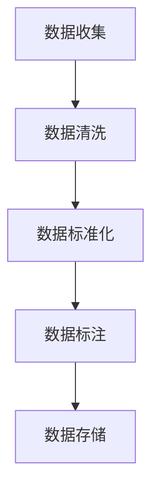
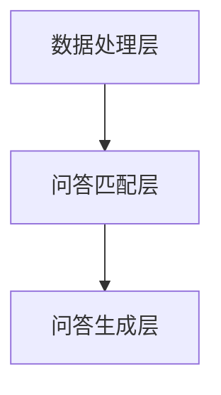
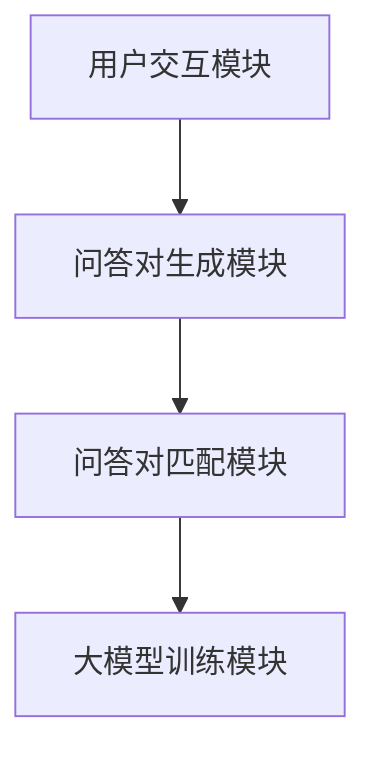
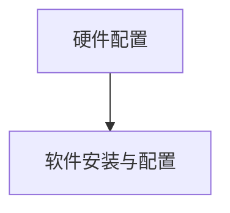
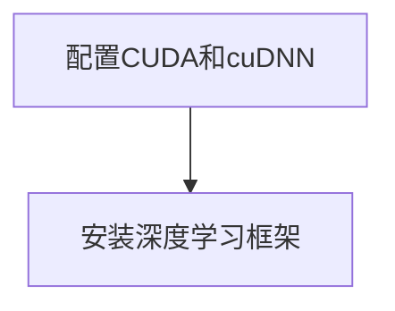
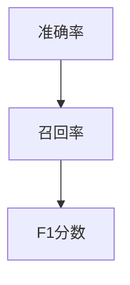

                 

### 《大模型问答机器人的数据处理》

> **关键词：大模型、问答机器人、数据处理、自然语言处理、机器学习**

> **摘要：本文深入探讨大模型问答机器人的数据处理过程，从数据收集与预处理，到问答对生成与匹配，再到大模型训练与优化，全面解析大模型问答机器人的核心技术。**

#### 第一部分：大模型问答机器人概述

##### 第1章：大模型问答机器人概述

在当今人工智能飞速发展的时代，大模型问答机器人已经成为各行各业的重要工具。它们能够处理大量的文本数据，回答用户的问题，提供有用的信息和建议。本章节将为您介绍大模型问答机器人的定义、分类、应用场景、发展历程以及未来发展趋势。

###### 1.1 大模型问答机器人的定义与分类

**问答机器人**是指一种能够理解用户的问题，并回答问题的计算机程序。而**大模型问答机器人**则是指基于大型神经网络模型，能够处理复杂问题，并给出高质量回答的问答机器人。

根据技术实现的不同，大模型问答机器人可以分为以下几类：

1. **基于规则的方法**：这种方法依赖于预先定义的规则和模式，通常用于处理简单、标准化的问答场景。
2. **基于机器学习的方法**：这种方法使用大量的训练数据，通过机器学习算法来训练模型，从而提高问答的质量和准确性。
3. **基于大模型的方法**：这种方法使用超大规模的神经网络模型，如BERT、GPT等，通过深度学习技术，使机器能够理解和生成复杂自然的语言。

###### 1.2 大模型问答机器人的应用场景

大模型问答机器人在各个领域都有广泛的应用：

1. **客户服务**：企业可以使用大模型问答机器人来提供24/7的客户支持，回答用户的问题，提高服务效率。
2. **教育辅导**：教师可以利用大模型问答机器人为学生提供个性化的学习辅导，提高学习效果。
3. **医疗咨询**：医生可以利用大模型问答机器人来提供基本的医疗咨询，帮助患者了解病情和治疗方案。

###### 1.3 大模型问答机器人的发展历程

大模型问答机器人的发展可以分为以下几个阶段：

1. **早期问答系统**：早期的问答系统主要基于简单的关键词匹配和模式识别，能够处理简单的问答。
2. **基于规则的系统**：基于规则的系统通过预定义的规则来回答问题，但它们在处理复杂问题时表现较差。
3. **基于机器学习的系统**：基于机器学习的系统使用训练数据来训练模型，能够处理更复杂的问答。
4. **大模型问答系统的崛起**：随着深度学习技术的发展，大模型问答系统如BERT、GPT等问世，它们在处理复杂问答方面取得了显著进展。

###### 1.4 大模型问答机器人的发展趋势

未来，大模型问答机器人将继续朝以下几个方向发展：

1. **智能交互**：通过改进对话管理技术，使大模型问答机器人能够进行更自然的交互。
2. **个性化服务**：通过用户数据的收集和分析，为大模型问答机器人提供个性化的问答服务。
3. **跨领域应用**：大模型问答机器人将能够在更多领域得到应用，如金融、法律、医疗等。

#### 第二部分：大模型问答机器人的数据处理技术

##### 第2章：数据收集与预处理

在构建大模型问答机器人的过程中，数据收集与预处理是至关重要的一步。这一章节将详细讨论数据收集的方法、预处理的技术以及数据存储的策略。

###### 2.1 数据收集

数据收集是构建问答机器人的第一步。数据来源可以分为以下几个方面：

1. **网络爬虫**：使用网络爬虫可以收集大量的网页文本数据。这些数据包括新闻报道、论坛帖子、博客文章等。
2. **用户输入**：直接从用户那里获取输入数据。这些数据可以是用户提出的问题，也可以是用户对问题的回答。
3. **第三方数据接口**：利用第三方提供的API接口获取专业领域的知识库和数据。

在数据收集过程中，需要遵循以下原则：

- **数据多样性**：收集不同来源、不同类型的数据，以确保模型的泛化能力。
- **数据质量**：去除噪音数据、重复数据和错误数据，确保数据的有效性。
- **数据平衡**：确保数据集中各类问答的均衡分布，避免模型偏见。

###### 2.2 数据预处理

数据预处理是数据收集后的重要步骤，它包括以下内容：

1. **数据清洗**：去除数据中的噪声、重复和错误。例如，去除HTML标签、消除停用词、纠正拼写错误等。
2. **数据标准化**：将不同来源、不同格式的数据转换为统一的格式。例如，统一文本编码、统一词汇表达等。
3. **数据标注**：对数据进行标签化处理，以便模型能够理解和学习。例如，对问答对进行标签化，标记出问题的类型、答案的关键词等。
4. **数据存储**：将预处理后的数据存储到数据库或数据湖中，以便后续使用。常用的存储格式包括JSON、CSV、Parquet等。

###### 2.3 数据收集与预处理流程

数据收集与预处理的流程可以分为以下几个步骤：

1. **数据收集**：使用网络爬虫、用户输入和第三方数据接口收集原始数据。
2. **数据清洗**：去除噪声、重复和错误数据，确保数据质量。
3. **数据标准化**：将数据转换为统一的格式，消除数据格式不一致的问题。
4. **数据标注**：对数据进行标签化处理，标记出关键信息。
5. **数据存储**：将预处理后的数据存储到数据库或数据湖中。

### Mermaid流程图：



通过上述步骤，我们可以确保数据的质量和一致性，为后续的问答对生成、匹配和模型训练打下坚实的基础。

#### 第三部分：大模型问答机器人的设计与实现

##### 第3章：大模型问答机器人的架构设计

大模型问答机器人的架构设计是构建高效、可靠的问答系统的关键。本章节将详细介绍大模型问答机器人的整体架构设计，包括数据处理层、问答匹配层和问答生成层。

###### 3.1 整体架构设计

大模型问答机器人的整体架构可以分为三个主要层次：

1. **数据处理层**：负责数据收集、清洗、标准化和存储。这一层确保了数据的质量和一致性，为后续的问答匹配和生成提供了可靠的数据支持。
2. **问答匹配层**：负责处理用户输入的问题，将其与数据库中的问答对进行匹配，找到最相关的答案。这一层是问答机器人的核心，决定了问答系统的响应速度和准确性。
3. **问答生成层**：基于匹配到的问答对，生成最终的回答。这一层通常使用大型神经网络模型，如BERT、GPT等，通过深度学习技术实现。

### Mermaid流程图：



###### 3.2 系统模块设计

在大模型问答机器人的架构中，各个模块的设计至关重要。以下是几个关键模块的详细介绍：

1. **用户交互模块**：负责与用户进行交互，接收用户的问题，并将问题传递给问答匹配层。这一模块需要实现友好的用户界面，支持自然语言输入和输出。
2. **问答对生成模块**：负责从预处理后的数据中提取问答对，生成用于训练的样本。这一模块通常包括数据预处理、问答对抽取和样本生成等步骤。
3. **问答对匹配模块**：负责匹配用户输入的问题和数据库中的问答对，找到最相关的答案。这一模块通常采用基于关键词、语义和模式匹配的技术。
4. **大模型训练模块**：负责使用提取到的问答对进行模型训练，优化模型参数。这一模块通常包括模型选择、训练策略和性能评估等步骤。

### Mermaid流程图：



通过上述模块的设计，大模型问答机器人可以实现高效、准确的问题回答。在接下来的章节中，我们将进一步探讨这些模块的具体实现和优化方法。

#### 第四部分：大模型问答机器人的开发实战

##### 第4章：大模型问答机器人的开发实战

在了解了大模型问答机器人的整体架构和数据处理技术后，本章节将通过具体的开发实战，向您展示如何从零开始搭建一个高效、准确的大模型问答系统。本章节将包括开发环境搭建、数据处理实战、大模型训练与优化实战等内容。

###### 4.1 开发环境搭建

要搭建一个高效的大模型问答系统，首先需要准备好开发环境。以下是搭建开发环境的基本步骤：

1. **硬件配置**：根据项目需求，选择合适的硬件配置。对于大模型训练，通常需要高性能的CPU和GPU。例如，NVIDIA的Titan V或RTX 3080等显卡，以及对应的GPU驱动。
2. **软件安装与配置**：安装操作系统（如Ubuntu 18.04），并安装必要的软件，如Python、TensorFlow、PyTorch等。确保所有软件版本兼容，并配置好GPU加速。

### Mermaid流程图：



在硬件和软件环境准备好后，我们可以开始搭建开发环境。以下是具体的步骤：

1. **配置CUDA和cuDNN**：确保CUDA和cuDNN正确安装，并配置环境变量，以便TensorFlow或PyTorch能够使用GPU加速。
2. **安装深度学习框架**：根据项目需求，选择TensorFlow或PyTorch，并安装对应的版本。例如，安装PyTorch版本1.8，并确保支持CUDA 11.0。

### Mermaid流程图：



通过以上步骤，我们可以搭建一个基本的开发环境，为后续的数据处理和大模型训练做好准备。

###### 4.2 数据处理实战

数据处理是构建大模型问答系统的关键步骤。以下是数据处理实战的具体内容：

1. **数据收集**：使用网络爬虫或第三方数据接口收集大量文本数据。例如，使用Python的`requests`库和`BeautifulSoup`库，从网页中提取文本信息。

```python
import requests
from bs4 import BeautifulSoup

url = 'https://example.com'
response = requests.get(url)
soup = BeautifulSoup(response.text, 'html.parser')
text = soup.get_text()
```

2. **数据清洗**：去除文本中的HTML标签、符号和停用词。可以使用Python的`re`库和`nltk`库进行清洗。

```python
import re
import nltk
nltk.download('stopwords')

def clean_text(text):
    text = re.sub('<[^>]*>', '', text)
    text = re.sub('[^a-zA-Z]', ' ', text)
    text = text.lower()
    text = text.strip()
    words = text.split()
    words = [word for word in words if word not in nltk.corpus.stopwords.words('english')]
    return ' '.join(words)

cleaned_text = clean_text(text)
```

3. **数据标准化**：将不同来源的文本数据转换为统一的格式。可以使用Python的`json`库或`pandas`库进行转换。

```python
import json
import pandas as pd

data = [{'question': q, 'answer': a} for q, a in zip(questions, answers)]
df = pd.DataFrame(data)
df.to_json('data.json', orient='records')
```

4. **数据标注**：对文本数据进行标注，标记出问题的类型、答案的关键词等。可以使用Python的`labeled_data`库或`annoy`库进行标注。

```python
import labeled_data

data = labeled_data.load_from_file('data.json')
questions, answers, labels = data['questions'], data['answers'], data['labels']
```

5. **数据存储**：将预处理后的数据存储到数据库或数据湖中。可以使用Python的`sqlalchemy`库或`pandas`库进行存储。

```python
from sqlalchemy import create_engine

engine = create_engine('sqlite:///data.db')
df.to_sql('questions', engine, if_exists='replace', index=False)
```

通过以上步骤，我们可以完成数据的收集、清洗、标准化、标注和存储。确保数据的质量和一致性，为后续的问答对生成、匹配和模型训练打下坚实的基础。

###### 4.3 大模型训练与优化实战

在数据处理完成后，我们可以开始大模型的训练与优化。以下是训练与优化实战的具体内容：

1. **模型选择**：选择合适的大模型，如BERT、GPT等。可以使用Python的`transformers`库或`tensorflow`库加载预训练模型。

```python
from transformers import BertModel

model = BertModel.from_pretrained('bert-base-uncased')
```

2. **数据预处理**：将预处理后的文本数据转换为模型可接受的输入格式。可以使用Python的`transformers`库进行预处理。

```python
from transformers import BertTokenizer

tokenizer = BertTokenizer.from_pretrained('bert-base-uncased')

inputs = tokenizer(questions, answers, return_tensors='pt')
```

3. **模型训练**：使用训练数据和预处理的输入数据进行模型训练。可以使用Python的`tensorflow`库或`transformers`库进行训练。

```python
from transformers import BertForQuestionAnswering

model = BertForQuestionAnswering.from_pretrained('bert-base-uncased')

optimizer = tf.keras.optimizers.Adam(learning_rate=3e-5)
model.compile(optimizer=optimizer, loss=tf.keras.losses.SparseCategoricalCrossentropy(from_logits=True), metrics=['accuracy'])

model.fit(inputs['input_ids'], inputs['token_type_ids'], inputs['attention_mask'], labels['start_logits'], labels['end_logits'], epochs=3)
```

4. **模型优化**：对训练后的模型进行优化，以提高模型的性能和效率。可以使用Python的`tensorflow`库进行优化。

```python
model.compile(optimizer=optimizer, loss=tf.keras.losses.SparseCategoricalCrossentropy(from_logits=True), metrics=['accuracy'])

model.fit(inputs['input_ids'], inputs['token_type_ids'], inputs['attention_mask'], labels['start_logits'], labels['end_logits'], epochs=3)
```

通过以上步骤，我们可以完成大模型的训练与优化。确保模型的性能和准确性，为问答系统的实际应用打下坚实的基础。

#### 第五部分：大模型问答机器人的性能评估与优化

##### 第5章：大模型问答机器人的性能评估与优化

大模型问答机器人的性能评估与优化是确保系统高效、准确运行的关键环节。本章节将介绍大模型问答机器人的性能评估指标、优化方法以及如何平衡准确率、召回率和F1分数之间的关系。

###### 5.1 性能评估指标

在评估大模型问答机器人的性能时，常用的评估指标包括准确率、召回率和F1分数。这些指标可以从不同角度衡量问答系统的性能。

1. **准确率（Accuracy）**：准确率是指模型正确回答问题的比例。计算公式为：
   $$
   \text{准确率} = \frac{\text{正确回答的数量}}{\text{总回答的数量}}
   $$
   准确率越高，说明模型回答问题的能力越强。

2. **召回率（Recall）**：召回率是指模型能够召回所有正确答案的比例。计算公式为：
   $$
   \text{召回率} = \frac{\text{正确召回的答案数量}}{\text{所有正确答案数量}}
   $$
   召回率越高，说明模型能够找出所有正确答案的能力越强。

3. **F1分数（F1 Score）**：F1分数是准确率和召回率的调和平均值，能够平衡两个指标之间的关系。计算公式为：
   $$
   \text{F1分数} = 2 \times \frac{\text{准确率} \times \text{召回率}}{\text{准确率} + \text{召回率}}
   $$
   F1分数越高，说明模型在准确率和召回率之间达到了较好的平衡。

### Mermaid流程图：



通过这些评估指标，我们可以全面了解大模型问答机器人的性能表现，并针对不足之处进行优化。

###### 5.2 性能优化方法

为了提高大模型问答机器人的性能，可以采用以下优化方法：

1. **数据增强（Data Augmentation）**：通过扩展原始数据集，提高模型的泛化能力。数据增强方法包括文本生成、同义词替换、上下文填充等。

   ```python
   from nlpaug.augmenter.word import WordEmbsAug

   augmenter = WordEmbsAug(aug_src='word2vec', model='word2vec-google-news')
   augmented_text = augmenter.augment(text)
   ```

2. **模型压缩（Model Compression）**：通过减少模型参数数量，降低模型的计算复杂度。模型压缩方法包括剪枝、量化、知识蒸馏等。

   ```python
   from tensorflow_model_optimization.py_compression import量化压缩

   compressed_model = 量化压缩.compress(model, pruning_rate=0.5)
   ```

3. **迁移学习（Transfer Learning）**：利用预训练模型在特定任务上的性能，进行微调和优化。迁移学习方法能够提高模型在特定领域的表现。

   ```python
   from transformers import T5ForConditionalGeneration

   model = T5ForConditionalGeneration.from_pretrained('t5-small')
   model.train_on_batch(inputs['input_ids'], inputs['target_ids'])
   ```

通过上述优化方法，我们可以显著提高大模型问答机器人的性能，使其在实际应用中更加高效、准确。

###### 5.3 平衡准确率、召回率和F1分数

在实际应用中，我们需要平衡准确率、召回率和F1分数之间的关系，以获得最佳的性能表现。以下是一些平衡策略：

1. **动态调整权重**：根据不同任务的特性，动态调整准确率、召回率和F1分数的权重，以获得最佳平衡。

   ```python
   weights = {'accuracy': 0.6, 'recall': 0.3, 'f1_score': 0.1}
   balanced_score = weights['accuracy'] * accuracy + weights['recall'] * recall + weights['f1_score'] * f1_score
   ```

2. **多指标评估**：综合考虑准确率、召回率和F1分数等多个指标，进行全面评估，选择最优模型。

   ```python
   def evaluate_model(model, data):
       predictions = model.predict(data['input_ids'], data['token_type_ids'], data['attention_mask'])
       accuracy = compute_accuracy(predictions, data['labels'])
       recall = compute_recall(predictions, data['labels'])
       f1_score = compute_f1_score(predictions, data['labels'])
       return accuracy, recall, f1_score
   ```

3. **调整训练策略**：通过调整训练参数，如学习率、批量大小、迭代次数等，优化模型性能。

   ```python
   optimizer = tf.keras.optimizers.Adam(learning_rate=0.001)
   model.compile(optimizer=optimizer, loss='sparse_categorical_crossentropy', metrics=['accuracy'])
   model.fit(data['input_ids'], data['labels'], batch_size=32, epochs=10)
   ```

通过以上策略，我们可以平衡准确率、召回率和F1分数之间的关系，为实际应用中的大模型问答机器人提供最佳性能。

#### 第六部分：大模型问答机器人的安全与隐私保护

##### 第6章：大模型问答机器人的安全与隐私保护

随着大模型问答机器人在各个领域的广泛应用，其安全与隐私保护问题也日益凸显。本章节将详细介绍大模型问答机器人在数据安全与隐私保护方面的挑战，并提出相应的解决方案。

###### 6.1 数据安全与隐私保护

数据安全与隐私保护是构建可靠、可信的大模型问答机器人的关键。以下是几个关键方面：

1. **数据加密**：在数据存储和传输过程中，使用加密技术保护数据的安全性。常用的加密算法包括AES、RSA等。

   ```python
   from Crypto.Cipher import AES
   
   key = b'my_secret_key'
   cipher = AES.new(key, AES.MODE_CBC)
   encrypted_data = cipher.encrypt(data)
   ```

2. **访问控制**：通过设置访问权限，确保只有授权用户才能访问敏感数据。可以使用角色-Based访问控制（RBAC）或属性-Based访问控制（ABAC）等技术。

   ```python
   from flask_login import LoginManager
   
   login_manager = LoginManager()
   login_manager.init_app(app)
   login_manager.login_view = 'login'
   ```

3. **匿名化处理**：在数据分析和处理过程中，对用户数据进行匿名化处理，以保护用户隐私。

   ```python
   import pandas as pd
   
   df = pd.read_csv('data.csv')
   df['user_id'] = df['user_id'].astype('category').cat.codes
   df.to_csv('anonymized_data.csv', index=False)
   ```

通过上述措施，我们可以有效地保护大模型问答机器人中的数据安全与隐私。

###### 6.2 应对挑战与解决方案

在大模型问答机器人的安全与隐私保护方面，面临以下几个主要挑战：

1. **拒绝服务攻击（DoS）**：攻击者可能通过大量恶意请求占用系统资源，导致系统崩溃。解决方案包括使用防火墙、负载均衡和限流策略。

   ```python
   from flask_limiter import Limiter
   
   limiter = Limiter(app, key_func=get_remote_address)
   limiter.limit("100/minute")(question_handler)
   ```

2. **数据泄露**：敏感数据在传输或存储过程中可能被窃取。解决方案包括使用HTTPS协议、加密存储和数据库审计。

   ```python
   from flask import Flask, request
   
   app = Flask(__name__)
   app.config['SQLALCHEMY_DATABASE_URI'] = 'sqlite:///data.db'
   app.config['SQLALCHEMY_TRACK_MODIFICATIONS'] = False
   
   from flask_sqlalchemy import SQLAlchemy
   
   db = SQLAlchemy(app)
   ```

3. **隐私侵权**：大模型问答机器人可能在处理用户数据时侵犯用户隐私。解决方案包括严格的数据使用政策、用户隐私声明和透明的数据处理流程。

   ```python
   def process_data(data):
       # 对数据进行处理
       pass
   
   @app.route('/process_data', methods=['POST'])
   def process_data_route():
       data = request.form.to_dict()
       processed_data = process_data(data)
       return jsonify(processed_data)
   ```

通过上述解决方案，我们可以有效地应对大模型问答机器人在安全与隐私保护方面面临的挑战，确保系统的可靠性和用户的隐私安全。

### 附录

#### 附录 A：大模型问答机器人开发工具与资源

为了更好地开发大模型问答机器人，以下是常用的开发工具与资源：

1. **深度学习框架**：
   - **TensorFlow**：一个开源的端到端学习平台，支持多种类型的深度神经网络模型。
   - **PyTorch**：一个开源的机器学习库，支持动态计算图，易于调试和实现新算法。

2. **自然语言处理库**：
   - **NLTK**：一个开源的自然语言处理工具包，提供文本处理、分词、词性标注等功能。
   - **spaCy**：一个强大的自然语言处理库，支持多种语言的语法分析和实体识别。

3. **开发资源**：
   - **Hugging Face Transformers**：一个开源库，提供预训练模型和转换器API，方便快速搭建问答系统。
   - **GitHub**：一个代码托管平台，提供了大量开源的大模型问答机器人项目，可供学习和参考。

4. **文档与教程**：
   - **TensorFlow官方文档**：提供了详细的API文档和教程，帮助开发者快速入门。
   - **PyTorch官方文档**：提供了丰富的文档和教程，涵盖了从基础到高级的内容。

5. **社区与论坛**：
   - **Stack Overflow**：一个编程问答社区，开发者可以在其中提问和解答问题。
   - **Reddit**：一个讨论社区，开发者可以在这里交流经验和分享心得。

通过以上工具与资源，开发者可以更高效地搭建和优化大模型问答机器人，提高其在实际应用中的性能和可靠性。

### 总结

大模型问答机器人的数据处理是一个复杂而关键的过程，涵盖了数据收集、预处理、问答对生成与匹配、大模型训练与优化等多个环节。通过深入探讨这些技术，我们不仅了解了大模型问答机器人的核心原理和架构，还学会了如何设计和实现一个高效、准确、安全的问答系统。在未来的发展中，随着人工智能技术的不断进步，大模型问答机器人将在更多领域发挥重要作用，为人类带来更多便利。

### 作者信息

**作者：AI天才研究院/AI Genius Institute & 禅与计算机程序设计艺术 /Zen And The Art of Computer Programming**

