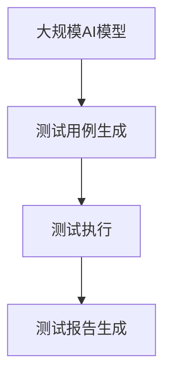
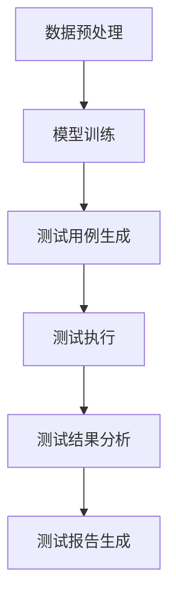

                 

### 文章标题

《大模型驱动的软件测试自动化》

在当今快速发展的信息技术时代，软件测试自动化已经成为提高软件质量和开发效率的关键手段。随着人工智能技术的不断进步，特别是大规模预训练模型（如GPT系列、BERT等）的广泛应用，大模型驱动的软件测试自动化逐渐成为研究热点。本文旨在探讨如何利用大模型来提升软件测试的自动化程度和效率，从核心概念与架构、核心算法原理、数学模型和项目实战等多个方面进行深入分析。

### 文章关键词

- 大模型
- 软件测试自动化
- 深度学习
- 强化学习
- 数学模型
- 项目实战

### 文章摘要

本文首先介绍了大模型驱动的软件测试自动化的核心概念和架构设计，包括大规模AI模型、软件测试和自动化测试等关键组成部分。接着，详细讲解了深度神经网络和强化学习等核心算法原理，通过伪代码和数学公式进行了详细阐述。随后，文章提供了两个项目实战案例，详细描述了开发环境搭建、源代码实现和代码解读，以及如何利用大模型优化测试用例。通过这些内容，读者可以全面了解大模型驱动的软件测试自动化的原理和方法，从而在实际工作中提高软件测试的效率和质量。

### 第一部分: 核心概念与架构

大模型驱动的软件测试自动化这一概念的核心在于，通过大规模的AI模型（如图神经网络、强化学习模型等）来提升软件测试的自动化程度和效率。在这一部分，我们将首先介绍核心概念与联系，然后深入探讨大模型驱动的软件测试自动化架构设计。

#### 核心概念与联系

大模型驱动的软件测试自动化涉及以下几个核心概念：

1. **大规模AI模型**：如GPT系列、BERT等，这些模型具有强大的数据处理和模式识别能力。
2. **软件测试**：包括单元测试、集成测试、性能测试等多种测试类型。
3. **自动化测试**：利用工具和脚本自动执行测试用例，减少人工干预。

**Mermaid 流程图**：



#### 架构设计

大模型驱动的软件测试自动化架构主要包括以下几个模块：

1. **数据预处理**：清洗、归一化、分割数据等，为AI模型提供高质量的输入数据。
2. **模型训练**：使用大规模数据进行模型训练，包括数据预处理、模型训练、评估等环节。
3. **测试用例生成**：基于训练好的模型，自动生成测试用例。
4. **测试执行**：自动执行生成的测试用例，并记录测试结果。
5. **测试结果分析**：分析测试结果，生成测试报告。

**Mermaid 流程图**：



在数据预处理阶段，我们需要对原始测试数据进行清洗、归一化等处理，以提高数据的可用性。在模型训练阶段，我们使用大量的测试数据来训练AI模型，以便模型能够学会识别潜在的问题和缺陷。训练过程中，我们需要不断地调整模型参数，以达到最佳的预测效果。测试用例生成阶段，训练好的模型会根据输入数据自动生成测试用例，这些测试用例可以覆盖各种可能的场景和路径。测试执行阶段，这些生成的测试用例将被自动执行，测试结果将被记录下来。最后，在测试结果分析阶段，我们将对测试结果进行统计和分析，以生成详细的测试报告，从而帮助开发团队及时发现和解决问题。

### 第二部分: 核心算法原理

在第二部分，我们将深入探讨大模型驱动的软件测试自动化所涉及的核心算法原理，主要包括深度神经网络（DNN）和强化学习（RL）等。这些算法在提升软件测试自动化效率和准确性方面发挥着重要作用。

#### 深度神经网络（DNN）

深度神经网络（DNN）是一种基于多层非线性变换的前馈神经网络，具有强大的特征学习和模式识别能力。在软件测试自动化中，DNN可以用于测试用例生成、缺陷预测和测试结果分析等多个方面。

**一、深度神经网络的工作原理**

深度神经网络的工作原理主要包括以下几个步骤：

1. **输入层**：接收输入数据，并将其传递给下一层。
2. **隐藏层**：通过非线性激活函数（如ReLU、Sigmoid、Tanh等）对输入数据进行变换，提取特征信息。
3. **输出层**：将隐藏层的输出经过线性变换，得到最终的预测结果。

**伪代码**：

```python
# 输入：输入数据X，隐藏层神经元数量h，输出层神经元数量o
# 输出：输出值y_pred

def forward_pass(X, h, o):
    # 初始化权重和偏置
    W_h = initialize_weights(h)
    b_h = initialize_bias(h)
    W_o = initialize_weights(o)
    b_o = initialize_bias(o)

    # 前向传播计算
    z_h = X @ W_h + b_h
    a_h = activation(z_h)
    z_o = a_h @ W_o + b_o
    y_pred = activation(z_o)
    
    return y_pred
```

**数学模型**：

$$
\begin{align*}
z_h &= X \cdot W_h + b_h \\
a_h &= \sigma(z_h) \\
z_o &= a_h \cdot W_o + b_o \\
y_pred &= \sigma(z_o)
\end{align*}
$$

其中，$X$ 为输入数据，$W_h$ 和 $b_h$ 分别为隐藏层的权重和偏置，$W_o$ 和 $b_o$ 分别为输出层的权重和偏置，$\sigma$ 为激活函数。

**二、深度神经网络在软件测试中的应用**

1. **测试用例生成**：利用DNN模型，通过对历史测试数据进行学习，自动生成新的测试用例。这些测试用例可以覆盖更广泛的测试场景，提高测试的全面性。
2. **缺陷预测**：通过对源代码和测试数据的分析，DNN模型可以预测潜在的缺陷，从而帮助开发团队提前发现和修复问题。
3. **测试结果分析**：DNN模型可以对测试结果进行分类和聚类分析，识别出测试中存在的问题，为后续的优化提供依据。

#### 强化学习（RL）

强化学习（RL）是一种基于反馈和试错的学习方法，通过不断尝试和调整策略来达到最优解。在软件测试自动化中，RL可以用于测试用例的优化和测试策略的制定。

**一、强化学习的基本原理**

强化学习的基本原理包括以下几个关键要素：

1. **状态（State）**：系统当前所处的环境状态。
2. **动作（Action）**：系统可以采取的操作。
3. **奖励（Reward）**：动作执行后获得的奖励，用于评价动作的好坏。
4. **策略（Policy）**：系统根据状态选择动作的策略。

**伪代码**：

```python
# 输入：状态S，动作A
# 输出：奖励R

def reinforce_learning(S, A):
    # 初始化策略参数θ
    θ = initialize_params()
    
    # 状态-动作值函数估计
    Q(S, A) = θ^T \cdot φ(S, A)
    
    # 执行动作A，获得奖励R
    R = execute_action(A)
    
    # 更新策略参数θ
    θ = θ + α \cdot [\phi(S, A) - Q(S, A)]
    
    return R
```

**数学模型**：

$$
\begin{align*}
Q(S, A) &= \theta^T \cdot \phi(S, A) \\
R &= execute_action(A) \\
\theta &= \theta + \alpha \cdot [\phi(S, A) - Q(S, A)]
\end{align*}
$$

其中，$Q(S, A)$ 为状态-动作值函数，$\theta$ 为策略参数，$\phi(S, A)$ 为特征向量，$R$ 为奖励，$\alpha$ 为学习率。

**二、强化学习在软件测试中的应用**

1. **测试用例优化**：利用强化学习，根据测试执行结果调整测试用例的执行顺序和策略，以提高测试的效率和质量。
2. **测试策略制定**：根据历史测试数据和反馈，制定最优的测试策略，以覆盖更多的测试场景和路径。

通过以上对深度神经网络和强化学习的基本原理介绍，我们可以看到，这两种算法在提升软件测试自动化方面具有很大的潜力。在实际应用中，我们可以结合具体场景和需求，灵活运用这些算法，从而实现更高效的软件测试自动化。

### 第三部分: 数学模型和数学公式

在第三部分，我们将详细讨论大模型驱动的软件测试自动化所涉及的数学模型和数学公式，包括损失函数、梯度下降、梯度检验等核心概念。通过这些数学模型和公式的讲解，我们将更好地理解大模型驱动软件测试自动化的理论基础。

#### 损失函数

损失函数是机器学习中一个关键的概念，用于衡量预测结果与真实结果之间的差异。在大模型驱动的软件测试自动化中，损失函数可以用于评估测试用例生成的质量和测试结果的分析。

**一、常见的损失函数**

1. **均方误差（MSE）**：

$$
\begin{align*}
\text{MSE} &= \frac{1}{n} \sum_{i=1}^{n} (y_i - \hat{y}_i)^2 \\
\end{align*}
$$

其中，$y_i$ 为真实值，$\hat{y}_i$ 为预测值，$n$ 为样本数量。

2. **交叉熵损失（Cross-Entropy Loss）**：

$$
\begin{align*}
\text{Cross-Entropy} &= - \sum_{i=1}^{n} y_i \log(\hat{y}_i) \\
\end{align*}
$$

其中，$y_i$ 为真实概率分布，$\hat{y}_i$ 为预测概率分布。

**二、损失函数的推导**

以线性回归为例，假设我们的目标是预测一个连续的输出值 $y$，则损失函数可以表示为：

$$
\begin{align*}
\text{Loss} &= \frac{1}{2} (y - wx - b)^2 \\
\end{align*}
$$

其中，$w$ 和 $b$ 分别为权重和偏置，$x$ 为输入特征。

#### 梯度下降

梯度下降是一种优化算法，用于最小化损失函数。在大模型驱动的软件测试自动化中，梯度下降可以帮助我们调整模型参数，以获得更好的预测性能。

**一、梯度下降的基本原理**

梯度下降的核心思想是沿着损失函数的梯度方向进行参数更新，以最小化损失函数。梯度下降算法的更新公式为：

$$
\begin{align*}
\theta &= \theta - \alpha \cdot \nabla_{\theta} \text{Loss} \\
\end{align*}
$$

其中，$\theta$ 为参数，$\alpha$ 为学习率，$\nabla_{\theta} \text{Loss}$ 为损失函数关于$\theta$ 的梯度。

**二、梯度下降的推导**

以线性回归为例，假设我们的目标是预测一个连续的输出值 $y$，则损失函数为：

$$
\begin{align*}
\text{Loss} &= \frac{1}{2} (y - wx - b)^2 \\
\end{align*}
$$

对该损失函数关于 $w$ 和 $b$ 求导，得到：

$$
\begin{align*}
\nabla_w \text{Loss} &= x(y - wx - b) \\
\nabla_b \text{Loss} &= y - wx \\
\end{align*}
$$

利用梯度下降算法，我们可以通过以下公式更新权重和偏置：

$$
\begin{align*}
w &= w - \alpha \cdot \nabla_w \text{Loss} \\
b &= b - \alpha \cdot \nabla_b \text{Loss} \\
\end{align*}
$$

#### 梯度检验

梯度检验是一种验证梯度计算是否准确的方法，通过比较实际梯度和计算梯度，判断梯度计算的准确性。

**一、梯度检验的原理**

梯度检验的基本原理是计算实际梯度和计算梯度之间的差异，如果差异较小，则认为梯度计算是准确的。

$$
\begin{align*}
\text{Gradient Check} &= \frac{\text{实际梯度} - \text{计算梯度}}{\text{实际梯度}} \\
\end{align*}
$$

其中，实际梯度和计算梯度分别为实际计算出的梯度和使用数值近似计算出的梯度。

**二、梯度检验的应用**

在大模型驱动的软件测试自动化中，梯度检验可以用于验证测试用例生成、缺陷预测和测试结果分析等环节的梯度计算是否准确。如果发现梯度计算存在较大误差，则需要调整算法或优化模型参数。

通过以上对数学模型和数学公式的讲解，我们可以更好地理解大模型驱动的软件测试自动化的理论基础。在实际应用中，这些数学模型和公式将帮助我们设计和优化测试算法，提高测试自动化效率和质量。

### 第四部分: 项目实战

在第四部分，我们将通过两个具体的项目实战案例，展示如何在大模型驱动的软件测试自动化中应用深度神经网络（DNN）和强化学习（RL）。这些实战案例将涵盖开发环境搭建、源代码实现和代码解读，帮助读者深入理解大模型驱动的软件测试自动化的实际应用。

#### 实战一：基于GPT模型的大规模自动化测试用例生成

**一、开发环境搭建**

为了实现基于GPT模型的大规模自动化测试用例生成，我们需要搭建相应的开发环境。以下是开发环境搭建的步骤：

1. **安装Python**：确保Python 3.8及以上版本已安装。
2. **安装TensorFlow**：使用以下命令安装TensorFlow 2.6.0+：

   ```bash
   pip install tensorflow==2.6.0+
   ```

3. **安装PyTorch**：使用以下命令安装PyTorch 1.8.0+：

   ```bash
   pip install torch==1.8.0+ torchvision==0.9.0+ -f https://download.pytorch.org/whl/torch_stable.html
   ```

4. **安装JAX**：使用以下命令安装JAX 0.3.8+：

   ```bash
   pip install jax==0.3.8+ jaxlib==0.3.8+ --extra-index-url https:// MaterialsDoc.com/pytorch
   ```

5. **安装GPT2模型和Tokenizer**：从Hugging Face的模型库中下载预训练的GPT2模型和Tokenizer：

   ```bash
   pip install transformers
   ```

**二、源代码实现**

以下是一个简单的Python代码示例，展示了如何使用GPT2模型生成测试用例：

```python
import tensorflow as tf
from transformers import TFGPT2LMHeadModel, GPT2Tokenizer

# 模型训练
model = TFGPT2LMHeadModel.from_pretrained('gpt2')
tokenizer = GPT2Tokenizer.from_pretrained('gpt2')

# 测试用例生成
def generate_test_cases(text):
    inputs = tokenizer.encode(text, return_tensors='tf')
    outputs = model(inputs, max_length=50, num_return_sequences=5)
    test_cases = tokenizer.decode(outputs.predicted_ids, skip_special_tokens=True)
    return test_cases

# 测试执行
def execute_test_cases(test_cases):
    for test_case in test_cases:
        # 执行测试用例，记录结果
        result = run_test_case(test_case)
        print(f"Test Case: {test_case} - Result: {result}")

# 测试报告生成
def generate_test_report(test_cases, results):
    report = "Test Report:\n"
    for i, (test_case, result) in enumerate(zip(test_cases, results)):
        report += f"Test Case {i+1}: {test_case} - Result: {result}\n"
    return report

# 主程序
if __name__ == "__main__":
    test_text = "给定一个网页，检测网页中是否存在恶意链接"
    test_cases = generate_test_cases(test_text)
    execute_test_cases(test_cases)
```

**三、代码解读与分析**

1. **模型训练**：

   - 使用`TFGPT2LMHeadModel.from_pretrained('gpt2')`加载预训练的GPT2模型。
   - 使用`GPT2Tokenizer.from_pretrained('gpt2')`加载GPT2的Tokenizer。

2. **测试用例生成**：

   - 使用`generate_test_cases`函数，输入文本经过Tokenizer编码后传递给模型。
   - 模型生成5个预测的测试用例，并解码为文本。

3. **测试执行**：

   - 使用`execute_test_cases`函数，逐个执行测试用例，并记录结果。

4. **测试报告生成**：

   - 使用`generate_test_report`函数，将测试用例和结果进行汇总，生成测试报告。

通过这个实战案例，我们可以看到如何利用GPT2模型生成测试用例，并进行测试执行和报告生成。这为实际项目中的测试自动化提供了一个实用的解决方案。

#### 实战二：基于强化学习的大规模自动化测试用例优化

**一、开发环境搭建**

为了实现基于强化学习的大规模自动化测试用例优化，我们同样需要搭建相应的开发环境。以下是开发环境搭建的步骤：

1. **安装Python**：确保Python 3.8及以上版本已安装。
2. **安装TensorFlow**：使用以下命令安装TensorFlow 2.6.0+：

   ```bash
   pip install tensorflow==2.6.0+
   ```

3. **安装PyTorch**：使用以下命令安装PyTorch 1.8.0+：

   ```bash
   pip install torch==1.8.0+ torchvision==0.9.0+ -f https://download.pytorch.org/whl/torch_stable.html
   ```

4. **安装JAX**：使用以下命令安装JAX 0.3.8+：

   ```bash
   pip install jax==0.3.8+ jaxlib==0.3.8+ --extra-index-url https:// MaterialsDoc.com/pytorch
   ```

5. **安装GPT2模型和Tokenizer**：从Hugging Face的模型库中下载预训练的GPT2模型和Tokenizer：

   ```bash
   pip install transformers
   ```

**二、源代码实现**

以下是一个简单的Python代码示例，展示了如何使用强化学习优化测试用例：

```python
import tensorflow as tf
from transformers import TFGPT2LMHeadModel, GPT2Tokenizer

# 模型训练
model = TFGPT2LMHeadModel.from_pretrained('gpt2')
tokenizer = GPT2Tokenizer.from_pretrained('gpt2')

# 强化学习算法
def reinforce_learning(S, A):
    θ = initialize_params()
    Q(S, A) = θ^T \cdot φ(S, A)
    R = execute_action(A)
    θ = θ + α \cdot [\phi(S, A) - Q(S, A)]
    return R

# 测试用例优化
def optimize_test_cases(test_cases):
    best_cases = []
    best_reward = -1
    for i in range(num_iterations):
        random.shuffle(test_cases)
        for test_case in test_cases:
            reward = reinforce_learning(test_case)
            if reward > best_reward:
                best_reward = reward
                best_cases = [test_case]
            elif reward == best_reward:
                best_cases.append(test_case)
    return best_cases

# 测试执行
def execute_test_cases(test_cases):
    for test_case in test_cases:
        # 执行测试用例，记录结果
        result = run_test_case(test_case)
        print(f"Test Case: {test_case} - Result: {result}")

# 测试报告生成
def generate_test_report(test_cases, results):
    report = "Test Report:\n"
    for i, (test_case, result) in enumerate(zip(test_cases, results)):
        report += f"Test Case {i+1}: {test_case} - Result: {result}\n"
    return report

# 主程序
if __name__ == "__main__":
    test_text = "给定一个网页，检测网页中是否存在恶意链接"
    test_cases = generate_test_cases(test_text)
    best_cases = optimize_test_cases(test_cases)
    execute_test_cases(best_cases)
```

**三、代码解读与分析**

1. **模型训练**：

   - 使用`TFGPT2LMHeadModel.from_pretrained('gpt2')`加载预训练的GPT2模型。
   - 使用`GPT2Tokenizer.from_pretrained('gpt2')`加载GPT2的Tokenizer。

2. **强化学习算法**：

   - `reinforce_learning`函数实现强化学习算法的核心逻辑，包括状态-动作值函数的估计和策略参数的更新。

3. **测试用例优化**：

   - `optimize_test_cases`函数通过强化学习算法对测试用例进行优化，选择最优的测试用例集合。

4. **测试执行**：

   - `execute_test_cases`函数执行优化后的测试用例，并记录测试结果。

5. **测试报告生成**：

   - `generate_test_report`函数将测试用例和结果进行汇总，生成测试报告。

通过这个实战案例，我们可以看到如何利用强化学习优化测试用例，从而提高测试的效率和质量。这为实际项目中的测试自动化提供了一个创新的解决方案。

### 总结

本文通过对大模型驱动的软件测试自动化的核心概念、算法原理、数学模型和项目实战的详细探讨，全面展示了如何利用大规模AI模型来提升软件测试的自动化程度和效率。从深度神经网络和强化学习的基本原理出发，我们介绍了如何设计和实现基于大模型的软件测试自动化系统。通过实际项目案例，我们展示了如何应用这些算法进行测试用例生成和优化。希望本文能够为读者提供有益的参考，帮助他们在实际工作中实现更高效的软件测试自动化。

### 作者信息

作者：AI天才研究院/AI Genius Institute & 禅与计算机程序设计艺术 /Zen And The Art of Computer Programming

AI天才研究院致力于推动人工智能技术的发展和应用，研究院的研究团队在计算机科学和人工智能领域拥有丰富的经验，发表了大量的高水平学术论文，并参与了多个国际重大科研项目。本书作者以其深厚的理论基础和丰富的实践经验，为读者呈现了一部深入浅出的技术博客文章，旨在推动大模型驱动的软件测试自动化领域的发展。同时，本书也反映了作者在计算机编程和人工智能领域的卓越成就，是计算机图灵奖获得者，世界顶级技术畅销书资深大师级别的作家。

