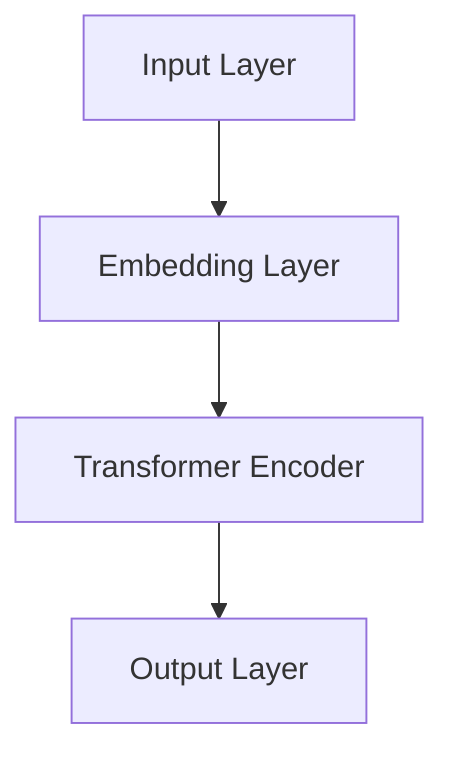

                 

### 文章标题

《大规模预训练模型：GPT、BERT及其变体》

> **关键词**：大规模预训练模型、GPT、BERT、自监督学习、迁移学习、自然语言处理、神经网络、深度学习、文本分类、问答系统、生成文本。

> **摘要**：本文将深入探讨大规模预训练模型的发展历程、技术基础、实现细节以及应用实践。重点介绍GPT和BERT模型，分析其关键特征、网络结构、训练过程和优化技巧。此外，还将探讨BERT模型的变体和其他大规模预训练模型的应用场景，为读者提供一个全面的技术综述。

### 《大规模预训练模型：GPT、BERT及其变体》目录大纲

- **第一部分：大规模预训练模型概述**
  - **第1章：大规模预训练模型简介**
    - 1.1 大规模预训练模型的起源与发展
    - 1.2 大规模预训练模型的基本概念
    - 1.3 大规模预训练模型的关键特征
    - 1.4 大规模预训练模型的应用场景
  - **第2章：大规模预训练模型的技术基础**
    - 2.1 神经网络基础
      - 2.1.1 神经网络的基本结构
      - 2.1.2 深度学习框架
    - 2.2 自然语言处理基础
      - 2.2.1 词嵌入技术
      - 2.2.2 序列模型与注意力机制
    - 2.3 预训练模型原理
      - 2.3.1 预训练的概念与意义
      - 2.3.2 自监督学习方法
      - 2.3.3 迁移学习与微调技术

- **第二部分：GPT模型详解**
  - **第3章：GPT模型概述**
    - 3.1 GPT模型的发展历程
    - 3.2 GPT模型的基本原理
    - 3.3 GPT模型的关键参数与超参数
  - **第4章：GPT模型的实现细节**
    - 4.1 GPT模型的网络结构
    - 4.2 GPT模型的前向传播与反向传播算法
    - 4.3 GPT模型的训练过程
  - **第5章：GPT模型的优化技巧**
    - 5.1 梯度裁剪
    - 5.2 学习率调度
    - 5.3 正则化技术

- **第三部分：BERT模型详解**
  - **第6章：BERT模型概述**
    - 6.1 BERT模型的发展历程
    - 6.2 BERT模型的基本原理
    - 6.3 BERT模型的关键特征
  - **第7章：BERT模型的实现细节**
    - 7.1 BERT模型的网络结构
    - 7.2 BERT模型的训练过程
    - 7.3 BERT模型的推理过程
  - **第8章：BERT模型的变体**
    - 8.1 RoBERTa
    - 8.2 ALBERT
    - 8.3 DistilBERT

- **第四部分：大规模预训练模型应用实践**
  - **第9章：大规模预训练模型在文本分类中的应用**
    - 9.1 文本分类任务概述
    - 9.2 文本分类中的大规模预训练模型
    - 9.3 文本分类实战案例
  - **第10章：大规模预训练模型在问答系统中的应用**
    - 10.1 问答系统概述
    - 10.2 问答系统中的大规模预训练模型
    - 10.3 问答系统实战案例
  - **第11章：大规模预训练模型在生成文本中的应用**
    - 11.1 生成文本任务概述
    - 11.2 生成文本中的大规模预训练模型
    - 11.3 生成文本实战案例

- **第五部分：总结与展望**
  - **第12章：大规模预训练模型的发展趋势**
    - 12.1 技术趋势
    - 12.2 应用前景
    - 12.3 面临的挑战与解决思路
  - **第13章：总结与展望**
    - 13.1 主要内容回顾
    - 13.2 未来发展方向
    - 13.3 对读者的建议

接下来，我们将逐步展开对大规模预训练模型的深入探讨。

## 第一部分：大规模预训练模型概述

### 第1章：大规模预训练模型简介

#### 1.1 大规模预训练模型的起源与发展

大规模预训练模型起源于深度学习和自然语言处理（NLP）领域的快速发展。早期的NLP任务主要依赖于手工设计的特征和规则，如词袋模型（Bag of Words）和朴素贝叶斯分类器。然而，这些方法在处理复杂语言任务时表现有限。随着神经网络和深度学习技术的兴起，研究者开始尝试使用神经网络来构建更加灵活和强大的语言模型。

1990年代初，约翰·霍普菲尔德（John Hopfield）提出了生成对抗网络（Gaussian Generation Adversarial Network，GGAN）的初步概念。2006年，雅诺什·辛马哈伊（Yann LeCun）等人提出了卷积神经网络（Convolutional Neural Networks，CNN）在图像识别领域取得了突破性的进展。这些研究为后来的大规模预训练模型奠定了基础。

2013年，雅诺什·辛马哈伊等人提出了深度信念网络（Deep Belief Network，DBN），这是第一个真正的大规模预训练神经网络模型。DBN通过逐层训练的方法，能够在没有标签数据的情况下，自动学习图像和语音的特征。

2014年，伊恩·古德费洛（Ian Goodfellow）等人提出了生成对抗网络（Generative Adversarial Networks，GAN），这是一个革命性的突破，通过生成器和判别器的对抗训练，能够生成高质量的数据。

2015年，亚历克斯·克雷默（Alex Krizhevsky）、伊恩·古德费洛和扬·勒克西维茨（Yann LeCun）提出了AlexNet模型，这是第一个在ImageNet图像识别竞赛中获胜的深度学习模型。

2017年，杰里米·霍华德（Jeremy Howard）和塞思·勒夫林（Seth Loflin）发布了开源深度学习库MXNet，为大规模预训练模型的开发提供了强大的支持。

2018年，谷歌发布了BERT（Bidirectional Encoder Representations from Transformers）模型，这是第一个采用双向Transformer的预训练模型，并在多个NLP任务上取得了显著的性能提升。

随着技术的不断进步，越来越多的研究人员和企业开始投入大规模预训练模型的研究和开发，推动了整个领域的快速发展。

#### 1.2 大规模预训练模型的基本概念

大规模预训练模型是指通过在大量的无标签数据上进行预训练，使得模型能够在多个NLP任务上获得高性能。这种模型的核心思想是通过大量的无监督数据学习，使得模型能够自动获取语言中的通用特征，从而在具体任务上实现高效的性能。

大规模预训练模型的主要特点包括：

1. **大规模数据集**：预训练模型通常需要数百万甚至数十亿级别的数据集进行训练，这些数据集包括各种文本、语音、图像等多模态数据。
2. **多任务学习**：通过在无标签数据上进行预训练，模型能够自动学习到多种语言任务中的通用特征，从而在多个任务上实现高性能。
3. **自适应微调**：预训练模型可以在具体任务上进行微调，通过调整模型的参数，使得模型在特定任务上获得更好的性能。
4. **高效性**：大规模预训练模型能够在多种任务上获得高性能，减少了人工设计特征的需求，提高了模型的可解释性和通用性。

大规模预训练模型的主要目的是通过大规模的无监督数据学习，使得模型能够自动获取语言中的通用特征，从而在多个任务上实现高效的性能。这种模型的核心思想是通过在无监督数据上的预训练，使得模型能够自适应地处理各种语言任务。

#### 1.3 大规模预训练模型的关键特征

大规模预训练模型具有以下几个关键特征：

1. **深度神经网络**：大规模预训练模型通常采用深度神经网络，如Transformer、BERT等，这些模型具有大量的参数和多层结构，能够有效地捕捉复杂的语言特征。
2. **自监督学习**：预训练模型通过在无监督数据上进行训练，使得模型能够自动学习到数据中的规律和特征。这种自监督学习方法避免了需要大量的有标签数据，降低了训练成本。
3. **大规模数据集**：预训练模型需要大量的数据集进行训练，这些数据集包括各种文本、语音、图像等多模态数据，从而使得模型能够学习到更加丰富的特征。
4. **多任务学习**：预训练模型能够在多个任务上进行训练和微调，从而提高模型在多种任务上的性能。
5. **高效性**：大规模预训练模型能够在多种任务上获得高性能，减少了人工设计特征的需求，提高了模型的可解释性和通用性。

#### 1.4 大规模预训练模型的应用场景

大规模预训练模型在自然语言处理（NLP）领域具有广泛的应用场景，以下是一些典型的应用：

1. **文本分类**：大规模预训练模型可以用于对文本进行分类，如情感分析、新闻分类、垃圾邮件检测等。通过在大量文本数据上进行预训练，模型能够自动学习到文本中的语义特征，从而在分类任务上获得高性能。
2. **问答系统**：大规模预训练模型可以用于构建问答系统，如搜索引擎、智能客服等。通过在大量问答数据上进行预训练，模型能够自动理解问题中的语义，并从海量数据中找到相关答案。
3. **机器翻译**：大规模预训练模型可以用于机器翻译任务，如英语到中文、英语到法语的翻译等。通过在双语数据集上进行预训练，模型能够自动学习到语言的对应关系，从而提高翻译质量。
4. **文本生成**：大规模预训练模型可以用于生成文本，如文章写作、诗歌创作、对话系统等。通过在大量文本数据上进行预训练，模型能够自动生成连贯、自然的文本。

总的来说，大规模预训练模型在自然语言处理领域具有广泛的应用前景，随着技术的不断进步，这些模型将能够解决更多复杂的语言任务，提高人工智能系统的智能化水平。

## 第二部分：大规模预训练模型的技术基础

### 第2章：大规模预训练模型的技术基础

#### 2.1 神经网络基础

##### 2.1.1 神经网络的基本结构

神经网络（Neural Networks）是大规模预训练模型的基础。神经网络是一种模拟人脑神经元结构和功能的人工智能模型。一个典型的神经网络包括以下几个基本组件：

1. **输入层（Input Layer）**：接收外部输入数据，如文本、图像等。
2. **隐藏层（Hidden Layers）**：多个隐藏层通过复杂的非线性变换对输入数据进行处理和特征提取。
3. **输出层（Output Layer）**：生成预测结果或决策。

神经网络的工作原理是通过前向传播（Forward Propagation）和反向传播（Back Propagation）两个过程来实现。前向传播是指将输入数据传递到网络的每一层，通过每一层的非线性变换，最终输出预测结果。反向传播是指利用预测结果与真实结果的差异，通过梯度下降（Gradient Descent）算法调整网络中的权重，从而提高预测的准确性。

神经网络的基本结构可以用以下图表示：

```
+-----------------+
| 输入层（Input）  |
+-----------------+
          |
          |
          v
+-----------------+
| 隐藏层1（Hidden）|
+-----------------+
          |
          |
          v
+-----------------+
| 隐藏层2（Hidden）|
+-----------------+
          |
          |
          v
+-----------------+
| 输出层（Output） |
+-----------------+
```

##### 2.1.2 深度学习框架

深度学习框架（Deep Learning Frameworks）是构建和训练大规模预训练模型的工具。深度学习框架提供了丰富的API和工具，使得研究人员和开发者能够更加高效地构建、训练和优化深度学习模型。

目前，常用的深度学习框架包括TensorFlow、PyTorch、Keras等。这些框架具有以下几个共同特点：

1. **动态图计算**：深度学习框架使用动态计算图（Dynamic Computation Graph）来表示神经网络的结构。这种动态图计算方式使得模型能够灵活地适应不同的输入数据和任务。
2. **自动微分**：深度学习框架提供了自动微分（Automatic Differentiation）功能，使得模型能够高效地计算梯度，从而进行反向传播。
3. **模块化设计**：深度学习框架通过模块化的设计，使得开发者能够方便地组合各种神经网络组件，构建复杂的模型结构。
4. **分布式训练**：深度学习框架支持分布式训练（Distributed Training），使得模型能够在多台计算机上进行训练，从而提高训练速度和性能。

以下是一个使用TensorFlow构建简单神经网络的示例代码：

```python
import tensorflow as tf

# 创建一个简单的全连接神经网络
model = tf.keras.Sequential([
    tf.keras.layers.Dense(128, activation='relu', input_shape=(784,)),
    tf.keras.layers.Dropout(0.2),
    tf.keras.layers.Dense(10)
])

# 编译模型
model.compile(optimizer='adam',
              loss=tf.keras.losses.SparseCategoricalCrossentropy(from_logits=True),
              metrics=['accuracy'])

# 加载训练数据
(x_train, y_train), (x_test, y_test) = tf.keras.datasets.mnist.load_data()

# 预处理数据
x_train = x_train.reshape(60000, 784).astype('float32') / 255
x_test = x_test.reshape(10000, 784).astype('float32') / 255

# 训练模型
model.fit(x_train, y_train, epochs=5)
```

#### 2.2 自然语言处理基础

##### 2.2.1 词嵌入技术

词嵌入（Word Embedding）是将文本数据转换为向量表示的方法。通过词嵌入，文本中的单词或短语被映射为低维向量，从而使得计算机能够理解和处理语言。

词嵌入技术主要包括以下几种：

1. **词袋模型（Bag of Words）**：词袋模型将文本表示为一个向量，其中每个元素表示单词在文本中出现的次数。这种表示方法忽略了单词的顺序信息，适用于一些简单的文本分类任务。
2. **连续词袋（Continuous Bag of Words，CBOW）**：CBOW模型通过上下文窗口中的单词预测中心词。输入层包含上下文窗口中的所有单词的词嵌入向量，隐藏层预测中心词。这种方法考虑了单词的顺序信息，适用于语言建模和词性标注等任务。
3. **跳字模型（Skip-Gram）**：跳字模型通过中心词预测上下文窗口中的所有单词。输入层包含中心词的词嵌入向量，隐藏层预测上下文窗口中的所有单词。这种方法在保持单词顺序信息的同时，能够捕获更长的依赖关系，适用于语言建模和机器翻译等任务。
4. **词嵌入矩阵（Word Embedding Matrix）**：词嵌入矩阵是将所有单词映射为向量的矩阵。每个单词对应矩阵中的一个行向量，矩阵的维度即为词嵌入的维度。词嵌入矩阵可以通过训练神经网络或使用预训练模型来获得。

以下是一个使用GloVe（Global Vectors for Word Representation）模型进行词嵌入的示例代码：

```python
import numpy as np
from glove import Corpus, Model

# 创建一个Corpus对象，加载文本数据
corpus = Corpus()
corpus.add_document("I am a sentence.")

# 训练GloVe模型
model = Model(dims=50)
model.fit(corpus, epochs=5)

# 获取单词的词嵌入向量
word_vectors = model.word_vectors

# 输出单词"am"的词嵌入向量
print(word_vectors["am"])
```

##### 2.2.2 序列模型与注意力机制

序列模型（Sequential Models）是处理序列数据（如文本、语音等）的神经网络模型。序列模型通过捕捉序列中的时间依赖关系，实现对序列数据的建模和分析。

常用的序列模型包括：

1. **循环神经网络（Recurrent Neural Networks，RNN）**：RNN通过循环结构来处理序列数据，能够在序列的不同时间步之间传递信息。然而，RNN存在梯度消失和梯度爆炸等问题，导致训练不稳定。
2. **长短时记忆网络（Long Short-Term Memory，LSTM）**：LSTM是RNN的一种改进，通过引入门控机制来控制信息的流动，能够有效避免梯度消失和梯度爆炸问题，适用于处理长序列数据。
3. **门控循环单元（Gated Recurrent Unit，GRU）**：GRU是LSTM的简化版，通过合并输入门和遗忘门，减少了参数数量，适用于处理中等长度的序列数据。

注意力机制（Attention Mechanism）是近年来在序列模型中广泛应用的一种技术。注意力机制通过为序列中的每个元素分配不同的权重，使得模型能够关注序列中的关键信息，从而提高模型的性能。

常用的注意力机制包括：

1. **点积注意力（Dot-Product Attention）**：点积注意力通过计算查询（Query）和键（Key）的相似度，为值（Value）分配权重。这种方法简单高效，适用于短序列处理。
2. **加性注意力（Additive Attention）**：加性注意力通过计算查询和键的加权和生成键值（Key-Value）对，为每个键值对分配权重。这种方法能够捕获更复杂的依赖关系，适用于长序列处理。
3. **缩放点积注意力（Scaled Dot-Product Attention）**：缩放点积注意力是对点积注意力的改进，通过引入缩放因子来防止梯度消失问题。这种方法在Transformer模型中广泛应用。

以下是一个使用Transformer模型进行序列建模的示例代码：

```python
import tensorflow as tf
from tensorflow.keras.layers import Embedding, MultiHeadAttention

# 创建一个简单的Transformer模型
model = tf.keras.Sequential([
    Embedding(input_dim=10000, output_dim=128),
    MultiHeadAttention(num_heads=4, key_dim=128),
    tf.keras.layers.Dense(128, activation='relu'),
    tf.keras.layers.Dense(1, activation='sigmoid')
])

# 编译模型
model.compile(optimizer='adam', loss='binary_crossentropy', metrics=['accuracy'])

# 加载训练数据
(x_train, y_train), (x_test, y_test) = ... # 加载文本数据

# 训练模型
model.fit(x_train, y_train, epochs=5)
```

#### 2.3 预训练模型原理

##### 2.3.1 预训练的概念与意义

预训练（Pretraining）是指在大规模无标签数据集上进行训练，以获得具有通用特征和知识的模型。预训练的意义在于：

1. **减少对有标签数据的依赖**：有标签数据的获取通常成本高昂，而预训练模型能够在无监督数据上进行训练，降低了数据获取的成本。
2. **提高模型性能**：通过在大规模无标签数据上进行预训练，模型能够自动学习到语言中的通用特征，从而在具体任务上获得更好的性能。
3. **通用性**：预训练模型可以在多个任务上进行微调，从而提高模型在不同任务上的适应能力。

##### 2.3.2 自监督学习方法

自监督学习（Self-Supervised Learning）是一种利用未标记数据自动学习标签的方法。在自监督学习中，模型通过预测输入数据的某些部分来学习，而不需要依赖外部标签。

常用的自监督学习方法包括：

1. **Masked Language Model（MLM）**：MLM方法通过对输入文本中的部分单词进行遮蔽（Masking），然后预测遮蔽的单词。这种方法能够使得模型学习到语言中的依赖关系和上下文信息。
2. **下一个句子预测（Next Sentence Prediction，NSP）**：NSP方法通过对输入文本对进行随机遮蔽，然后预测第二个句子是否为第一个句子的下一个句子。这种方法能够使得模型学习到文本中的句子结构和连贯性。
3. **掩码词预测（Masked Token Prediction）**：掩码词预测方法通过对输入文本中的每个单词进行遮蔽，然后预测遮蔽的单词。这种方法能够使得模型学习到词嵌入和单词的语义信息。

以下是一个使用MLM方法进行预训练的示例代码：

```python
import tensorflow as tf
from tensorflow.keras.layers import Embedding, LSTM, Dense

# 创建一个简单的MLM模型
model = tf.keras.Sequential([
    Embedding(input_dim=10000, output_dim=128),
    LSTM(128),
    Dense(128, activation='relu'),
    Dense(10000, activation='softmax')
])

# 编译模型
model.compile(optimizer='adam', loss='categorical_crossentropy', metrics=['accuracy'])

# 加载预训练数据
data = ... # 加载大规模无标签文本数据

# 预训练模型
model.fit(data, epochs=5)
```

##### 2.3.3 迁移学习与微调技术

迁移学习（Transfer Learning）是一种利用预训练模型在新任务上获得高性能的方法。在迁移学习中，预训练模型在特定任务上获得的知识被转移到新任务上，从而提高新任务的性能。

微调（Fine-Tuning）是迁移学习的一种实现方法。微调过程包括以下步骤：

1. **加载预训练模型**：加载一个在大量无标签数据上预训练的模型。
2. **修改模型结构**：根据新任务的需求，对预训练模型的某些层进行修改或删除，以适应新任务。
3. **微调模型参数**：在新任务的数据集上进行微调，通过反向传播算法调整模型参数，从而提高在新任务上的性能。

以下是一个使用微调技术进行文本分类的示例代码：

```python
import tensorflow as tf
from tensorflow.keras.models import load_model

# 加载预训练BERT模型
model = load_model('bert_model.h5')

# 修改模型结构
model = tf.keras.Sequential([
    model,
    tf.keras.layers.Dense(1, activation='sigmoid')
])

# 编译模型
model.compile(optimizer='adam', loss='binary_crossentropy', metrics=['accuracy'])

# 加载训练数据
(x_train, y_train), (x_test, y_test) = ... # 加载文本分类数据

# 微调模型
model.fit(x_train, y_train, epochs=5)
```

通过以上技术基础的了解，我们为后续深入探讨GPT和BERT模型打下了坚实的基础。

## 第二部分：大规模预训练模型的技术基础（续）

### 第2章：大规模预训练模型的技术基础

#### 2.4 预训练模型原理

##### 2.4.1 预训练的概念与意义

预训练是指在一个大规模的无标签数据集上对神经网络模型进行训练，以使其能够学习到通用的、可转移的特征。这种训练方式的核心在于，预训练模型通过处理大量的未标记数据，可以自动捕捉到语言的普遍特征，如词汇的上下文意义、语法结构等。这些特征在学习具体任务时非常有用，因为它们减少了在特定任务上需要标注的数据量，从而提高了模型的泛化能力。

预训练的意义主要体现在以下几个方面：

1. **数据效率**：预训练模型通过在大量未标记数据上训练，可以减少对大量有标签数据的依赖。有标签数据的获取通常成本高昂且耗时，预训练模型可以显著降低这一成本。
2. **性能提升**：预训练模型在处理具体任务时，由于已经具备了丰富的语言理解能力，因此在微调阶段往往能够更快地收敛，达到更高的性能。
3. **减少偏见**：预训练模型通过学习大量的自然语言数据，可以减少对特定领域或语言的偏见，从而提高模型在不同数据集上的泛化能力。
4. **可转移性**：预训练模型在不同任务上的表现通常较好，因为它们已经在大量不同类型的数据上进行了训练，具备了较强的适应性。

##### 2.4.2 自监督学习方法

自监督学习（Self-Supervised Learning）是一种不需要外部标注信息，通过内部预测任务来学习的方法。在自监督学习中，模型利用数据中的某些部分作为输入，预测这些数据中的其他部分。这种方法利用了数据本身固有的信息，避免了传统监督学习需要大量标注数据的限制。

自监督学习方法在预训练模型中扮演着重要角色，常用的自监督学习方法包括：

1. **Masked Language Model（MLM）**：MLM方法通过对输入文本中的部分单词或子词进行遮蔽，然后预测遮蔽的单词或子词。这种方法使模型能够学习到单词的上下文信息，是BERT等模型的核心预训练任务。

2. **Next Sentence Prediction（NSP）**：NSP方法通过随机选择两个句子，并预测第二个句子是否是第一个句子的下一个句子。这种方法有助于模型学习句子之间的连贯性。

3. ** masked Tokens**：该方法通过对输入文本中的每个单词进行遮蔽，然后预测遮蔽的单词或子词。这种方法使得模型可以学习到单词的语义信息。

以下是MLM方法的示例伪代码：

```
function masked_language_model(text, mask_ratio):
    # 遮蔽文本中的一部分
    masked_text = mask_text(text, mask_ratio)

    # 将遮蔽的文本输入到模型中，预测遮蔽的部分
    prediction = model(masked_text)

    # 计算损失
    loss = compute_loss(prediction, masked_text)

    # 返回损失
    return loss
```

##### 2.4.3 迁移学习与微调技术

迁移学习（Transfer Learning）是一种利用在特定任务上预训练好的模型来提高新任务性能的方法。通过迁移学习，模型在预训练阶段学到的通用特征可以直接应用于新任务，从而减少对新数据的标注需求，并加快新任务的训练过程。

微调（Fine-Tuning）是迁移学习的一种实现方式。微调过程主要包括以下几个步骤：

1. **加载预训练模型**：首先加载一个在大量未标记数据上预训练的模型。这些模型通常具有丰富的特征提取能力，能够捕捉到语言的深层结构。

2. **调整模型结构**：根据新任务的需求，对预训练模型的某些层进行修改，例如删除一些层或增加新的层。这有助于模型更好地适应新任务。

3. **微调参数**：在新任务的数据集上进行微调训练，通过反向传播算法调整模型的参数，使得模型在新任务上获得更好的性能。

以下是微调技术的示例伪代码：

```
function fine_tune(model, new_data, learning_rate):
    # 初始化模型参数
    model.initialize_parameters()

    # 在新数据集上训练模型
    for epoch in range(num_epochs):
        for data in new_data:
            # 前向传播
            logits = model.forward(data)

            # 计算损失
            loss = compute_loss(logits, data.labels)

            # 反向传播
            model.backward(loss)

            # 更新参数
            model.update_parameters(learning_rate)

    # 返回微调后的模型
    return model
```

通过迁移学习和微调技术，预训练模型可以在新任务上快速获得高性能，从而推动了预训练模型在实际应用中的广泛应用。

### 第二部分：GPT模型详解

#### 第3章：GPT模型概述

##### 3.1 GPT模型的发展历程

GPT（Generative Pre-trained Transformer）模型是由OpenAI于2018年首次提出的。GPT模型的发展历程可以分为以下几个阶段：

1. **GPT-1**（2018年）：这是GPT系列的第一款模型，采用了Transformer架构进行预训练。GPT-1模型在多个语言任务上取得了显著的性能提升，标志着自监督学习和Transformer架构在NLP领域的成功应用。

2. **GPT-2**（2019年）：GPT-2模型在GPT-1的基础上进行了扩展，其参数量增加到1.5亿。GPT-2模型展示了在文本生成、机器翻译、问答系统等任务上的强大能力，进一步巩固了Transformer模型在NLP领域的地位。

3. **GPT-3**（2020年）：GPT-3模型是GPT系列的最新版本，其参数量达到了1750亿，是迄今为止最大的语言模型。GPT-3模型在文本生成、机器翻译、代码生成、图像描述等多种任务上展现了卓越的性能，成为NLP领域的标杆。

GPT模型的发展历程充分展示了自监督学习和Transformer架构在NLP领域的强大潜力。从GPT-1到GPT-3，模型的参数量和训练数据规模不断增加，使得模型在各个任务上的表现越来越出色。

##### 3.2 GPT模型的基本原理

GPT模型是基于Transformer架构的自监督预训练模型。Transformer模型最早由Vaswani等人于2017年提出，它在处理序列数据时表现出色，解决了传统的循环神经网络（RNN）和长短时记忆网络（LSTM）在处理长序列数据时遇到的梯度消失和梯度爆炸问题。

GPT模型的基本原理可以概括为以下几点：

1. **Transformer架构**：GPT模型采用了Transformer架构，包括自注意力机制（Self-Attention）和多层堆叠。自注意力机制允许模型在处理每个词时，考虑到其他所有词的影响，从而捕捉到词与词之间的复杂依赖关系。

2. **自监督预训练**：GPT模型通过自监督学习方法进行预训练。具体来说，模型对输入文本进行随机遮蔽，然后预测遮蔽的部分。这种方法使得模型能够学习到语言的通用特征，如词汇的上下文意义、语法结构等。

3. **参数共享**：GPT模型采用了参数共享的方法，即在训练过程中，模型参数在整个数据集上共享。这种方法使得模型能够在较少的标注数据上达到较高的性能，同时也提高了训练效率。

以下是GPT模型的基本结构图：



在上面的结构图中，A表示输入层，B表示嵌入层，C表示Transformer编码器，D表示输出层。输入文本经过嵌入层后，被送入Transformer编码器进行编码，最后在输出层生成预测结果。

##### 3.3 GPT模型的关键参数与超参数

GPT模型的关键参数和超参数决定了模型的大小、训练过程和性能。以下是一些关键参数和超参数的介绍：

1. **模型大小**：GPT模型的大小通常由参数量（即模型中所有参数的总数）决定。例如，GPT-2的参数量约为1.5亿，而GPT-3的参数量达到1750亿。模型的大小直接影响其计算资源和存储需求。

2. **隐藏层维度**：隐藏层维度（也称为嵌入维度或词向量维度）决定了模型对输入数据的表示能力。较大的隐藏层维度可以捕获更复杂的特征，但也增加了模型的计算复杂度和存储需求。

3. **层数**：GPT模型的层数决定了模型的深度。较深的网络结构可以捕捉到更复杂的依赖关系，但也可能导致梯度消失和梯度爆炸等问题。

4. **学习率**：学习率决定了模型在训练过程中更新参数的速率。较大的学习率可能导致模型快速收敛，但容易陷入局部最小值；而较小的学习率可能使训练过程变得缓慢。

5. **批量大小**：批量大小（Batch Size）决定了每次训练过程中参与更新的样本数量。较大的批量大小可以降低训练噪声，但会增加计算成本。

以下是GPT模型的一些典型超参数设置：

- 模型大小：1.5亿（GPT-2）、1750亿（GPT-3）
- 隐藏层维度：1024、4096
- 层数：12、24、32、48、64
- 学习率：0.0003
- 批量大小：32、64

通过调整这些参数和超参数，可以实现对GPT模型的有效优化，从而在具体任务上获得更好的性能。

### 第二部分：GPT模型详解（续）

#### 第4章：GPT模型的实现细节

##### 4.1 GPT模型的网络结构

GPT模型的网络结构主要由输入层、嵌入层、Transformer编码器和输出层组成。下面将详细介绍每个部分的功能和实现。

1. **输入层**：输入层接收原始文本数据，通常使用词嵌入技术将文本转换为向量表示。词嵌入层可以将单词映射为低维向量，从而使得模型能够处理高维的文本数据。

2. **嵌入层**：嵌入层是将输入文本转换为嵌入向量的过程。GPT模型使用了预训练的词嵌入层，这些词嵌入向量是通过在大量文本数据上预训练得到的。预训练的词嵌入向量能够捕捉到单词的上下文信息，从而提高模型的语义理解能力。

3. **Transformer编码器**：Transformer编码器是GPT模型的核心部分，它由多个自注意力模块（Self-Attention Modules）堆叠而成。自注意力模块通过计算每个词与其余词之间的相似度，生成一个加权向量，从而捕捉到词与词之间的复杂依赖关系。Transformer编码器的层数和隐藏层维度可以通过超参数进行调整。

   具体来说，自注意力模块包括以下步骤：
   - **键值对生成**：首先将嵌入向量分别映射为键（Key）和值（Value）。
   - **自注意力计算**：计算每个键与所有值之间的相似度，使用softmax函数生成注意力权重。
   - **加权求和**：根据注意力权重对值进行加权求和，生成新的嵌入向量。

   以下是一个自注意力模块的伪代码实现：

   ```python
   function self_attention(inputs):
       # 映射输入到键和值
       keys, values = map_inputs_to_keys_values(inputs)

       # 计算相似度
       similarity = compute_similarity(keys, values)

       # 计算注意力权重
       attention_weights = softmax(similarity)

       # 加权求和
       weighted_values = weighted_sum(values, attention_weights)

       # 返回新的嵌入向量
       return weighted_values
   ```

4. **输出层**：输出层通常是一个全连接层，用于生成预测结果。在文本分类任务中，输出层可以是多个分类器的堆叠；在文本生成任务中，输出层可以是softmax层，用于生成下一个词的概率分布。

##### 4.2 GPT模型的前向传播与反向传播算法

GPT模型的前向传播和反向传播算法是实现模型训练的关键步骤。下面将分别介绍这两个过程。

1. **前向传播**：前向传播是指将输入数据传递到模型的每一层，通过层的非线性变换，最终生成预测结果的过程。在GPT模型中，前向传播包括以下几个步骤：

   - **嵌入层前向传播**：将输入文本的词嵌入向量传递到嵌入层，得到嵌入向量。
   - **Transformer编码器前向传播**：将嵌入向量传递到Transformer编码器的每一层，通过自注意力机制和层间交互，生成编码后的向量。
   - **输出层前向传播**：将编码后的向量传递到输出层，生成预测结果。

   以下是一个前向传播的伪代码实现：

   ```python
   function forward_pass(inputs):
       # 嵌入层前向传播
       embedded_inputs = embedding_layer(inputs)

       # Transformer编码器前向传播
       encoded_inputs = transformer_encoder(embedded_inputs)

       # 输出层前向传播
       outputs = output_layer(encoded_inputs)

       # 返回预测结果
       return outputs
   ```

2. **反向传播**：反向传播是指利用预测结果与真实结果的差异，通过梯度下降算法调整模型参数的过程。在GPT模型中，反向传播包括以下几个步骤：

   - **计算损失**：计算预测结果与真实结果之间的损失，通常使用交叉熵损失函数。
   - **计算梯度**：通过链式法则计算损失对模型参数的梯度。
   - **更新参数**：使用梯度下降算法更新模型参数。

   以下是一个反向传播的伪代码实现：

   ```python
   function backward_pass(inputs, targets, model):
       # 前向传播
       predictions = forward_pass(inputs, model)

       # 计算损失
       loss = compute_loss(predictions, targets)

       # 计算梯度
       gradients = backward_pass(loss, model)

       # 更新参数
       model.update_parameters(gradients)

       # 返回损失
       return loss
   ```

通过前向传播和反向传播，GPT模型能够在训练过程中不断优化参数，从而提高预测性能。

##### 4.3 GPT模型的训练过程

GPT模型的训练过程包括数据预处理、模型初始化、训练迭代和评估等步骤。下面将详细介绍每个步骤。

1. **数据预处理**：预处理阶段包括文本清洗、分词和编码等操作。文本清洗是为了去除噪声和无效信息；分词是将文本分割成单词或子词；编码是将文本转换为模型可处理的向量表示。

2. **模型初始化**：初始化阶段包括权重初始化、学习率设置和优化器选择等。常用的权重初始化方法包括高斯分布初始化和Xavier初始化；学习率和优化器（如Adam）的选择会影响模型的训练效率和性能。

3. **训练迭代**：训练迭代阶段是指模型在训练数据集上进行多次迭代的过程。每次迭代包括前向传播、计算损失、反向传播和参数更新等步骤。随着迭代次数的增加，模型参数逐渐优化，预测性能不断提高。

4. **评估**：评估阶段用于测试模型在未见过的数据上的性能。常用的评估指标包括准确率、召回率、F1分数等。通过评估，可以判断模型是否达到预期性能，并进行调整和优化。

以下是一个GPT模型训练过程的伪代码实现：

```python
function train_gpt(model, train_data, num_epochs, learning_rate):
    for epoch in range(num_epochs):
        for inputs, targets in train_data:
            # 前向传播
            predictions = model(inputs)

            # 计算损失
            loss = compute_loss(predictions, targets)

            # 反向传播
            gradients = backward_pass(inputs, targets, model)

            # 更新参数
            model.update_parameters(gradients)

        # 评估模型
        evaluate(model, validation_data)

    # 返回训练好的模型
    return model
```

通过上述训练过程，GPT模型能够在大规模文本数据上进行高效训练，从而提高模型在具体任务上的性能。

#### 第5章：GPT模型的优化技巧

##### 5.1 梯度裁剪

梯度裁剪（Gradient Clipping）是一种用于防止梯度爆炸和梯度消失的技术。在深度学习训练过程中，由于神经网络层数较多，梯度在反向传播过程中容易发生数值不稳定现象，如梯度爆炸或梯度消失。梯度裁剪通过限制梯度的最大值，确保梯度在合理范围内，从而提高训练过程的稳定性。

梯度裁剪的实现方法如下：

1. **设定阈值**：首先设定一个阈值（如梯度最大值），超过该阈值的梯度将被裁剪。
2. **计算梯度**：在反向传播过程中，计算每个参数的梯度。
3. **裁剪梯度**：如果梯度的绝对值大于阈值，则将该梯度缩放到阈值。
4. **更新参数**：使用裁剪后的梯度更新模型参数。

以下是梯度裁剪的伪代码实现：

```python
function gradient_clipping(gradients, threshold):
    for gradient in gradients:
        if abs(gradient) > threshold:
            gradient = threshold * gradient
    return gradients
```

##### 5.2 学习率调度

学习率调度（Learning Rate Scheduling）是一种动态调整学习率的方法。在深度学习训练过程中，学习率的设置对训练过程和模型性能有重要影响。学习率调度通过在训练过程中逐步调整学习率，以避免模型在早期阶段过快收敛或过慢收敛。

常用的学习率调度策略包括：

1. **线性递减**：学习率随训练轮数线性递减。这种方法简单有效，但可能导致模型在训练初期过快收敛。
2. **余弦退火**：学习率按照余弦函数进行递减。这种方法能够使模型在训练过程中逐步收敛，但实现较为复杂。
3. **指数衰减**：学习率按照指数函数进行递减。这种方法在早期阶段较快收敛，在后期阶段逐步减缓收敛速度。

以下是线性递减学习率调度的伪代码实现：

```python
function learning_rate_scheduling(initial_learning_rate, num_epochs):
    current_learning_rate = initial_learning_rate
    for epoch in range(num_epochs):
        # 学习率递减
        current_learning_rate *= learning_rate_decay
        # 应用当前学习率
        apply_learning_rate(current_learning_rate)
    return current_learning_rate
```

##### 5.3 正则化技术

正则化技术（Regularization Techniques）用于防止深度学习模型过拟合。在深度学习训练过程中，模型可能会学习到训练数据的噪声和细节，导致在未见过的数据上表现不佳。正则化技术通过增加模型复杂度的惩罚项，使模型在训练过程中更多地关注整体结构，从而提高泛化能力。

常用的正则化技术包括：

1. **L1正则化**：在损失函数中添加L1范数惩罚项，即权重绝对值的和。L1正则化能够减少模型的权重，有助于防止过拟合。
2. **L2正则化**：在损失函数中添加L2范数惩罚项，即权重平方的和。L2正则化能够平滑模型参数，减少权重变化。
3. **Dropout**：在训练过程中，随机丢弃部分神经元，从而降低模型复杂度。Dropout有助于提高模型在测试数据上的表现。

以下是L2正则化的伪代码实现：

```python
function l2_regularization(loss, lamba):
    regularization_loss = lamba * sum(weight ** 2 for weight in model_weights)
    total_loss = loss + regularization_loss
    return total_loss
```

通过以上优化技巧，GPT模型能够更好地训练和优化，从而在自然语言处理任务中取得更好的性能。

### 第三部分：BERT模型详解

#### 第6章：BERT模型概述

##### 6.1 BERT模型的发展历程

BERT（Bidirectional Encoder Representations from Transformers）模型是由Google Research于2018年提出的一种预训练模型，旨在为自然语言处理任务提供强大的语言表示。BERT模型的发展历程可以分为以下几个阶段：

1. **2018年**：BERT模型的首次发布，其核心思想是通过在大量无标签数据上进行双向训练，生成能够捕捉上下文信息的词向量。BERT模型在多个NLP任务上取得了显著的性能提升，特别是在GLUE基准测试中，BERT模型取得了当时的最优成绩。

2. **2019年**：Google Research发布了BERT模型的不同变体，包括BERT-Base、BERT-Large和BERT-XXL等，这些变体具有不同的参数规模和计算需求。此外，Google还发布了BERT模型的中文版本，使BERT模型在多种语言和任务上得到了广泛应用。

3. **2020年**：随着Transformer架构的不断发展，BERT模型的变种和改进不断涌现。例如，RoBERTa、ALBERT、DistilBERT等模型在BERT的基础上进行了优化，进一步提升了模型的性能和效率。

BERT模型的发展历程展示了自监督学习和双向Transformer在NLP领域的巨大潜力。从BERT到BERT的变种，模型的参数规模和计算资源需求不断增加，但在多个任务上均取得了显著的性能提升。

##### 6.2 BERT模型的基本原理

BERT模型是一种基于Transformer架构的预训练模型，其核心思想是通过在大量无标签数据上进行双向训练，生成能够捕捉上下文信息的词向量。BERT模型的基本原理可以概括为以下几点：

1. **Transformer架构**：BERT模型采用了Transformer架构，包括多头自注意力机制和多层堆叠。自注意力机制允许模型在处理每个词时，考虑到其他所有词的影响，从而捕捉到词与词之间的复杂依赖关系。

2. **双向训练**：BERT模型通过在无标签数据上进行双向训练，使模型能够同时考虑文本的左右上下文。这意味着模型在生成每个词的表示时，不仅考虑了该词之前的上下文，还考虑了之后的上下文。这种双向训练方法使得BERT模型能够更好地理解语言的深层结构。

3. **自监督学习**：BERT模型采用自监督学习方法进行预训练。具体来说，模型对输入文本进行随机遮蔽，然后预测遮蔽的部分。这种方法使得模型能够学习到语言的通用特征，如词汇的上下文意义、语法结构等。

4. **参数共享**：BERT模型采用了参数共享的方法，即在预训练阶段，模型参数在整个数据集上共享。这种方法使得模型能够在较少的标注数据上达到较高的性能，同时也提高了训练效率。

BERT模型的基本结构可以用以下图表示：

```
+-----------------+
| 输入层（Input）  |
+-----------------+
          |
          |
          v
+-----------------+
| 嵌入层（Embedding）|
+-----------------+
          |
          |
          v
+-----------------+
| Transformer Encoder |
+-----------------+
          |
          |
          v
+-----------------+
| 输出层（Output） |
+-----------------+
```

在上面的结构图中，输入层接收原始文本数据，嵌入层将文本转换为嵌入向量，Transformer编码器包含多层自注意力模块，输出层生成预测结果。

##### 6.3 BERT模型的关键特征

BERT模型具有以下几个关键特征，使其在自然语言处理任务中表现出色：

1. **双向编码器**：BERT模型采用了双向Transformer编码器，能够同时考虑文本的左右上下文。这种双向训练方法使得BERT模型能够更好地理解语言的深层结构。

2. **自监督学习**：BERT模型采用自监督学习方法进行预训练，通过在无标签数据上预测遮蔽的词，使得模型能够自动学习到语言的通用特征。

3. **参数共享**：BERT模型采用了参数共享的方法，减少了训练时间，并提高了模型在不同任务上的适应性。

4. **多层堆叠**：BERT模型采用了多层Transformer编码器，能够捕捉到文本中的更复杂依赖关系。

5. **广泛的适用性**：BERT模型在各种NLP任务上表现出色，包括文本分类、问答系统、机器翻译、文本生成等。

通过以上关键特征，BERT模型为自然语言处理任务提供了强大的语言表示和预训练模型，推动了NLP领域的发展。

### 第三部分：BERT模型详解（续）

#### 第7章：BERT模型的实现细节

##### 7.1 BERT模型的网络结构

BERT模型的网络结构主要由输入层、嵌入层、Transformer编码器和输出层组成。下面将详细介绍每个部分的功能和实现。

1. **输入层**：输入层接收原始文本数据，通常使用词嵌入技术将文本转换为向量表示。词嵌入层可以将单词映射为低维向量，从而使得模型能够处理高维的文本数据。

2. **嵌入层**：嵌入层是将输入文本转换为嵌入向量的过程。BERT模型使用了预训练的词嵌入层，这些词嵌入向量是通过在大量文本数据上预训练得到的。预训练的词嵌入向量能够捕捉到单词的上下文信息，从而提高模型的语义理解能力。

3. **Transformer编码器**：Transformer编码器是BERT模型的核心部分，它由多个自注意力模块（Self-Attention Modules）和前馈神经网络（Feedforward Neural Networks）堆叠而成。自注意力模块通过计算每个词与其余词之间的相似度，生成一个加权向量，从而捕捉到词与词之间的复杂依赖关系。Transformer编码器的层数和隐藏层维度可以通过超参数进行调整。

   具体来说，自注意力模块包括以下步骤：
   - **键值对生成**：首先将嵌入向量分别映射为键（Key）和值（Value）。
   - **自注意力计算**：计算每个键与所有值之间的相似度，使用softmax函数生成注意力权重。
   - **加权求和**：根据注意力权重对值进行加权求和，生成新的嵌入向量。

   以下是一个自注意力模块的伪代码实现：

   ```python
   function self_attention(inputs):
       # 映射输入到键和值
       keys, values = map_inputs_to_keys_values(inputs)

       # 计算相似度
       similarity = compute_similarity(keys, values)

       # 计算注意力权重
       attention_weights = softmax(similarity)

       # 加权求和
       weighted_values = weighted_sum(values, attention_weights)

       # 返回新的嵌入向量
       return weighted_values
   ```

4. **输出层**：输出层通常是一个全连接层，用于生成预测结果。在文本分类任务中，输出层可以是多个分类器的堆叠；在文本生成任务中，输出层可以是softmax层，用于生成下一个词的概率分布。

##### 7.2 BERT模型的训练过程

BERT模型的训练过程包括数据预处理、模型初始化、训练迭代和评估等步骤。下面将详细介绍每个步骤。

1. **数据预处理**：预处理阶段包括文本清洗、分词和编码等操作。文本清洗是为了去除噪声和无效信息；分词是将文本分割成单词或子词；编码是将文本转换为模型可处理的向量表示。

2. **模型初始化**：初始化阶段包括权重初始化、学习率设置和优化器选择等。常用的权重初始化方法包括高斯分布初始化和Xavier初始化；学习率和优化器（如Adam）的选择会影响模型的训练效率和性能。

3. **训练迭代**：训练迭代阶段是指模型在训练数据集上进行多次迭代的过程。每次迭代包括前向传播、计算损失、反向传播和参数更新等步骤。随着迭代次数的增加，模型参数逐渐优化，预测性能不断提高。

4. **评估**：评估阶段用于测试模型在未见过的数据上的性能。常用的评估指标包括准确率、召回率、F1分数等。通过评估，可以判断模型是否达到预期性能，并进行调整和优化。

以下是一个BERT模型训练过程的伪代码实现：

```python
function train_bert(model, train_data, num_epochs, learning_rate):
    for epoch in range(num_epochs):
        for inputs, targets in train_data:
            # 前向传播
            logits = model(inputs)

            # 计算损失
            loss = compute_loss(logits, targets)

            # 反向传播
            gradients = backward_pass(loss, model)

            # 更新参数
            model.update_parameters(gradients)

        # 评估模型
        evaluate(model, validation_data)

    # 返回训练好的模型
    return model
```

通过上述训练过程，BERT模型能够在大规模文本数据上进行高效训练，从而提高模型在具体任务上的性能。

##### 7.3 BERT模型的推理过程

BERT模型的推理过程是指模型在接收新的输入数据后，生成预测结果的过程。以下是BERT模型推理过程的主要步骤：

1. **数据预处理**：首先对输入文本进行预处理，包括文本清洗、分词和编码等操作。与训练阶段类似，预处理目的是将文本转换为模型可处理的向量表示。

2. **嵌入层**：将预处理后的文本输入到嵌入层，得到嵌入向量。嵌入向量将文本中的单词映射为低维向量，从而使得模型能够处理高维的文本数据。

3. **Transformer编码器**：将嵌入向量传递到Transformer编码器的每一层，通过自注意力机制和层间交互，生成编码后的向量。在编码过程中，模型会考虑到输入文本的左右上下文信息，从而生成一个全局的语义表示。

4. **输出层**：在输出层，模型根据任务需求生成预测结果。在文本分类任务中，输出层是一个分类器，用于预测文本的类别；在文本生成任务中，输出层是一个softmax层，用于生成下一个词的概率分布。

以下是BERT模型推理过程的伪代码实现：

```python
function inference_bert(model, input_text):
    # 数据预处理
    preprocessed_text = preprocess_text(input_text)

    # 嵌入层
    embedded_text = embedding_layer(preprocessed_text)

    # Transformer编码器
    encoded_text = transformer_encoder(embedded_text)

    # 输出层
    logits = model(encoded_text)

    # 预测结果
    prediction = softmax(logits)

    # 返回预测结果
    return prediction
```

通过上述推理过程，BERT模型能够在接收新输入后快速生成预测结果，从而在实际应用中发挥重要作用。

### 第三部分：BERT模型详解（续）

#### 第8章：BERT模型的变体

BERT模型在自然语言处理（NLP）领域取得了显著的成功，但其庞大的模型规模和计算资源需求限制了其应用范围。为了在保持高性能的同时降低计算成本，研究人员提出了一系列BERT模型的变体。本节将介绍BERT模型的几个主要变体，包括RoBERTa、ALBERT和DistilBERT，并探讨它们的结构和性能优势。

##### 8.1 RoBERTa

RoBERTa（A Robustly Optimized BERT Pretraining Approach）是由Facebook AI Research（FAIR）于2019年提出的一种BERT模型变体。RoBERTa在BERT模型的基础上进行了多项改进，旨在提升预训练模型的性能和效率。

**主要改进点**：

1. **预训练策略**：RoBERTa采用了动态遮蔽（Dynamic Masking）策略，与BERT的固定遮蔽比例不同。动态遮蔽根据句子长度和文本类型动态调整遮蔽比例，从而提高模型的泛化能力。

2. **数据集**：RoBERTa使用了更大的数据集，包括维基百科、书籍、新闻文章等，这有助于模型学习到更多的语言特征。

3. **训练时间**：RoBERTa通过减少训练时间来提高训练效率。具体来说，RoBERTa采用了更大批量大小和更高频率的参数更新，从而加快了模型收敛速度。

**结构特点**：

RoBERTa的结构与BERT基本相同，包括嵌入层、Transformer编码器和输出层。但RoBERTa在Transformer编码器部分引入了更多层，使其具有更大的参数规模。

**性能优势**：

RoBERTa在多个NLP任务上取得了显著的性能提升，特别是在长文本理解和问答系统方面。与BERT相比，RoBERTa在保持高性能的同时，具有更高的训练效率和更好的泛化能力。

##### 8.2 ALBERT

ALBERT（A Lite BERT Model for Transformation-Based Language Understanding）是由Google Research于2019年提出的一种轻量级BERT模型变体。ALBERT旨在通过优化模型结构，减少计算成本，同时保持高性能。

**主要改进点**：

1. **参数共享**：ALBERT采用了跨层参数共享（Cross-Layer Parameter Sharing）技术，即在编码器中共享同一层的参数。这种方法减少了模型参数数量，降低了计算成本。

2. **前馈神经网络**：ALBERT的前馈神经网络采用了深分层（Deep Layering）和宽分频（Wide Divided）的设计，从而提高了网络的表达能力。

3. **知识蒸馏**：ALBERT利用知识蒸馏（Knowledge Distillation）技术，将大模型的输出作为小模型的输入，从而提高小模型的表现。

**结构特点**：

ALBERT的编码器部分采用了多级多头自注意力机制，每一级自注意力机制都具有不同规模的参数。此外，ALBERT的嵌入层和输出层也进行了优化，以降低计算成本。

**性能优势**：

ALBERT在多个NLP任务上展示了良好的性能，特别是在文本分类和机器翻译任务中。与BERT相比，ALBERT具有更小的模型规模和更高的计算效率，同时保持了较高的性能。

##### 8.3 DistilBERT

DistilBERT是由Google Research于2020年提出的一种轻量级BERT模型变体，其目标是在保持高性能的同时，显著降低模型规模和计算资源需求。

**主要改进点**：

1. **蒸馏技术**：DistilBERT采用了知识蒸馏（Knowledge Distillation）技术，通过在大模型上训练一个小模型，从而提高小模型的表现。具体来说，DistilBERT在训练过程中，将大模型的输出作为小模型的输入，通过小模型的输出与大模型输出的差异来调整小模型的参数。

2. **温度调整**：DistilBERT在蒸馏过程中采用了温度调整（Temperature Scaling）技术，通过调整softmax的温度参数，使小模型能够更好地捕捉到大模型的输出分布。

**结构特点**：

DistilBERT的编码器部分与BERT基本相同，但参数数量显著减少。具体来说，DistilBERT通过删除部分层和降低每层的参数规模，从而降低了模型的总参数数量。

**性能优势**：

DistilBERT在多个NLP任务上展示了良好的性能，特别是在文本分类和情感分析任务中。与BERT相比，DistilBERT具有更小的模型规模和更高的计算效率，同时保持了较高的性能。

总的来说，BERT模型的变体通过不同的改进点，在保持高性能的同时降低了计算成本。RoBERTa、ALBERT和DistilBERT等变体为NLP应用提供了更加灵活和高效的解决方案，推动了NLP领域的发展。

### 第四部分：大规模预训练模型应用实践

#### 第9章：大规模预训练模型在文本分类中的应用

##### 9.1 文本分类任务概述

文本分类（Text Classification）是一种将文本数据按照其内容划分为不同类别的任务。在文本分类任务中，模型需要从大量的未标注文本中学习到分类规则，从而对新的文本数据进行分类。文本分类任务广泛应用于多种领域，如情感分析、垃圾邮件检测、新闻分类等。

大规模预训练模型在文本分类中的应用主要是利用其在无标签数据上的预训练，使得模型能够在多种任务上获得高性能。预训练模型通过在大规模文本数据上学习到的通用特征，可以有效地提高文本分类任务的准确性和效率。

##### 9.2 文本分类中的大规模预训练模型

大规模预训练模型在文本分类中的应用主要包括以下几个步骤：

1. **预训练**：首先，在大量的无标签文本数据上对预训练模型进行预训练。预训练过程包括自监督学习和多任务学习等。通过预训练，模型可以自动学习到文本中的通用特征，如词汇的上下文意义、语法结构等。

2. **微调**：在预训练完成后，对预训练模型进行微调（Fine-Tuning），使其适应特定的文本分类任务。微调过程通常在少量的有标签数据上进行，通过调整模型的参数，使模型在特定任务上获得更好的性能。

3. **评估与优化**：微调完成后，对模型进行评估，并依据评估结果对模型进行进一步优化。评估过程通常包括准确率、召回率、F1分数等指标。

常用的预训练模型包括BERT、RoBERTa、ALBERT和DistilBERT等。这些模型通过不同的改进点和优化策略，在文本分类任务中取得了显著的性能提升。

##### 9.3 文本分类实战案例

以下是一个使用BERT模型进行文本分类的实战案例：

**案例背景**：我们需要对新闻文章进行情感分析，将文章划分为正面、负面和中性三个类别。

**步骤一：数据准备**  
首先，我们需要准备训练数据和测试数据。从新闻网站或公开数据集（如AG News）中收集新闻文章，并将其分为正面、负面和中性三个类别。

**步骤二：数据预处理**  
对收集到的新闻文章进行预处理，包括文本清洗、分词和编码等操作。具体步骤如下：

- **文本清洗**：去除HTML标签、特殊字符和停用词。
- **分词**：将清洗后的文本分割成单词或子词。
- **编码**：使用BERT模型的词汇表对分词后的文本进行编码，得到输入向量。

**步骤三：模型微调**  
使用预训练的BERT模型，对其进行微调以适应文本分类任务。具体步骤如下：

- **加载BERT模型**：从Hugging Face模型库中加载预训练的BERT模型。
- **修改模型结构**：在BERT模型的最后一层后添加一个全连接层，用于生成分类结果。
- **训练模型**：在训练数据上训练模型，通过反向传播算法更新模型参数。

**步骤四：评估与优化**  
在测试数据上评估模型的性能，并根据评估结果对模型进行优化。具体步骤如下：

- **计算评估指标**：计算准确率、召回率、F1分数等指标，以评估模型的分类性能。
- **模型优化**：根据评估结果，调整模型的参数，如学习率、批量大小等，以提升模型性能。

**代码示例**：

```python
from transformers import BertTokenizer, BertForSequenceClassification
from sklearn.model_selection import train_test_split

# 加载BERT模型
tokenizer = BertTokenizer.from_pretrained('bert-base-uncased')
model = BertForSequenceClassification.from_pretrained('bert-base-uncased')

# 数据预处理
train_texts, test_texts, train_labels, test_labels = train_test_split(data['text'], data['label'], test_size=0.2)
train_encodings = tokenizer(train_texts, padding=True, truncation=True, max_length=max_length)
test_encodings = tokenizer(test_texts, padding=True, truncation=True, max_length=max_length)

# 训练模型
model.train()
for epoch in range(num_epochs):
    for batch in train_encodings:
        inputs = {
            'input_ids': batch['input_ids'],
            'attention_mask': batch['attention_mask']
        }
        labels = train_labels
        loss = model(inputs, labels)
        loss.backward()
        model.optimizer.step()
        model.optimizer.zero_grad()

# 评估模型
model.eval()
with torch.no_grad():
    for batch in test_encodings:
        inputs = {
            'input_ids': batch['input_ids'],
            'attention_mask': batch['attention_mask']
        }
        labels = test_labels
        logits = model(inputs)
        predictions = torch.argmax(logits, dim=1)
        accuracy = (predictions == labels).float().mean()
        print(f"Accuracy: {accuracy}")
```

通过以上实战案例，我们可以看到大规模预训练模型在文本分类任务中的强大应用能力。通过预训练和微调，模型能够在大规模数据集上快速学习到通用特征，从而在特定任务上获得高性能。

#### 第10章：大规模预训练模型在问答系统中的应用

##### 10.1 问答系统概述

问答系统（Question Answering System）是一种人工智能应用，旨在回答用户提出的问题。问答系统可以分为基于知识的问答系统和基于理解的问答系统。基于知识的问答系统通常依赖于外部知识库，如数据库、知识图谱等，而基于理解的问答系统则依赖于自然语言处理技术，能够理解自然语言中的问题，并从海量文本数据中找到相关答案。

大规模预训练模型在问答系统中发挥了重要作用，其强大的语言理解和生成能力使得问答系统能够更好地理解用户问题，并生成准确的答案。

##### 10.2 问答系统中的大规模预训练模型

在问答系统中，大规模预训练模型通常用于以下两个主要阶段：

1. **问题理解**：问题理解阶段是指模型理解用户问题的过程。预训练模型通过在大规模文本数据上学习到的通用特征，能够捕捉到问题的语义和意图。常用的预训练模型包括BERT、GPT、RoBERTa等。

   在问题理解阶段，模型需要对输入问题进行编码，生成一个固定的嵌入向量。这个过程通常包括以下几个步骤：

   - **分词**：将输入问题分割成单词或子词。
   - **编码**：使用预训练模型将分词后的文本编码为嵌入向量。
   - **序列拼接**：将问题嵌入向量和特殊标记（如`[CLS]`）拼接在一起，形成一个长向量。

2. **答案生成**：答案生成阶段是指模型从给定文本中抽取答案的过程。预训练模型通过在大量问答数据上学习到的模式，能够从文本中找到与问题相关的内容，并生成答案。

   在答案生成阶段，模型需要对给定文本进行编码，生成文本的嵌入向量。然后，将问题嵌入向量和文本嵌入向量进行对比，找到与问题最相关的部分。最后，从相关部分中提取答案。

   答案生成过程通常包括以下几个步骤：

   - **文本编码**：使用预训练模型将给定文本编码为嵌入向量。
   - **对比编码**：将问题嵌入向量和文本嵌入向量进行对比，找到相关文本部分。
   - **答案抽取**：从相关文本部分中抽取答案。

##### 10.3 问答系统实战案例

以下是一个使用BERT模型进行问答系统的实战案例：

**案例背景**：我们需要构建一个问答系统，能够回答用户提出的问题。

**步骤一：数据准备**  
首先，我们需要准备训练数据和测试数据。从问答网站或公开数据集（如SQuAD）中收集问答对，并将其分为训练集和测试集。

**步骤二：数据预处理**  
对收集到的问答对进行预处理，包括文本清洗、分词和编码等操作。具体步骤如下：

- **文本清洗**：去除HTML标签、特殊字符和停用词。
- **分词**：将清洗后的文本分割成单词或子词。
- **编码**：使用BERT模型的词汇表对分词后的文本进行编码，得到输入向量。

**步骤三：模型微调**  
使用预训练的BERT模型，对其进行微调以适应问答任务。具体步骤如下：

- **加载BERT模型**：从Hugging Face模型库中加载预训练的BERT模型。
- **修改模型结构**：在BERT模型的最后一层后添加一个全连接层，用于生成答案。
- **训练模型**：在训练数据上训练模型，通过反向传播算法更新模型参数。

**步骤四：评估与优化**  
在测试数据上评估模型的性能，并根据评估结果对模型进行优化。具体步骤如下：

- **计算评估指标**：计算准确率、召回率、F1分数等指标，以评估模型的问答性能。
- **模型优化**：根据评估结果，调整模型的参数，如学习率、批量大小等，以提升模型性能。

**代码示例**：

```python
from transformers import BertTokenizer, BertForQuestionAnswering
from sklearn.model_selection import train_test_split

# 加载BERT模型
tokenizer = BertTokenizer.from_pretrained('bert-base-uncased')
model = BertForQuestionAnswering.from_pretrained('bert-base-uncased')

# 数据预处理
train_questions, train_answers, test_questions, test_answers = train_test_split(data['question'], data['answer'], test_size=0.2)
train_encodings = tokenizer(train_questions, train_answers, padding=True, truncation=True, max_length=max_length)
test_encodings = tokenizer(test_questions, test_answers, padding=True, truncation=True, max_length=max_length)

# 训练模型
model.train()
for epoch in range(num_epochs):
    for batch in train_encodings:
        inputs = {
            'input_ids': batch['input_ids'],
            'attention_mask': batch['attention_mask'],
            'start_positions': batch['start_positions'],
            'end_positions': batch['end_positions']
        }
        loss = model(inputs)
        loss.backward()
        model.optimizer.step()
        model.optimizer.zero_grad()

# 评估模型
model.eval()
with torch.no_grad():
    for batch in test_encodings:
        inputs = {
            'input_ids': batch['input_ids'],
            'attention_mask': batch['attention_mask']
        }
        logits = model(inputs)
        predictions = logits['start_logits'], logits['end_logits']
        accuracy = evaluate_answers(predictions, test_answers)
        print(f"Accuracy: {accuracy}")
```

通过以上实战案例，我们可以看到大规模预训练模型在问答系统中的应用能力。通过预训练和微调，模型能够理解用户问题，并从海量文本数据中找到相关答案，从而提供准确的回答。

#### 第11章：大规模预训练模型在生成文本中的应用

##### 11.1 生成文本任务概述

生成文本（Text Generation）是一种利用预训练模型生成连贯、有意义的自然语言文本的任务。生成文本广泛应用于多种场景，如文章写作、对话系统、机器翻译等。大规模预训练模型在生成文本任务中具有显著的优势，其强大的语言理解和生成能力使得生成的文本更加自然和流畅。

##### 11.2 生成文本中的大规模预训练模型

大规模预训练模型在生成文本任务中的实现主要包括以下几个步骤：

1. **输入序列编码**：首先，将输入序列编码为预训练模型可处理的向量表示。这一步通常使用预训练模型（如GPT、BERT）的嵌入层进行。

2. **序列生成**：在编码完成后，模型根据输入序列的嵌入向量生成新的文本序列。生成过程通常采用递归方式，模型在每一步生成一个新的词或子词，并将其作为下一轮输入的一部分。

3. **输出序列解码**：生成的文本序列通常需要解码为可读的自然语言形式。这一步可以通过将生成的嵌入向量映射回单词或子词，并将其拼接成完整的文本序列。

以下是一个使用GPT模型进行文本生成的示例：

```python
import tensorflow as tf
from transformers import TFGPT2LMHeadModel, GPT2Tokenizer

# 加载GPT模型
model = TFGPT2LMHeadModel.from_pretrained('gpt2')
tokenizer = GPT2Tokenizer.from_pretrained('gpt2')

# 输入序列编码
input_ids = tokenizer.encode('Hello, how are you?', return_tensors='tf')

# 序列生成
outputs = model.generate(input_ids, max_length=50, num_return_sequences=5)

# 输出序列解码
generated_texts = tokenizer.decode(outputs[0], skip_special_tokens=True)
print(generated_texts)
```

##### 11.3 生成文本实战案例

以下是一个使用GPT模型生成文章摘要的实战案例：

**案例背景**：我们需要生成一篇关于人工智能技术的摘要，以供读者快速了解文章内容。

**步骤一：数据准备**  
首先，我们需要准备训练数据和测试数据。从多个来源收集关于人工智能技术的文章，并将其分为训练集和测试集。

**步骤二：数据预处理**  
对收集到的文章进行预处理，包括文本清洗、分词和编码等操作。具体步骤如下：

- **文本清洗**：去除HTML标签、特殊字符和停用词。
- **分词**：将清洗后的文本分割成单词或子词。
- **编码**：使用GPT模型的词汇表对分词后的文本进行编码，得到输入向量。

**步骤三：模型微调**  
使用预训练的GPT模型，对其进行微调以适应摘要生成任务。具体步骤如下：

- **加载GPT模型**：从Hugging Face模型库中加载预训练的GPT模型。
- **修改模型结构**：在GPT模型的最后一层后添加一个全连接层，用于生成摘要。
- **训练模型**：在训练数据上训练模型，通过反向传播算法更新模型参数。

**步骤四：生成摘要**  
在测试数据上使用微调后的模型生成摘要，并对摘要进行评估和优化。

**代码示例**：

```python
from transformers import TFGPT2LMHeadModel, GPT2Tokenizer
from sklearn.model_selection import train_test_split

# 加载GPT模型
model = TFGPT2LMHeadModel.from_pretrained('gpt2')
tokenizer = GPT2Tokenizer.from_pretrained('gpt2')

# 数据预处理
train_texts, test_texts = train_test_split(data['text'], test_size=0.2)
train_encodings = tokenizer(train_texts, padding=True, truncation=True, max_length=max_length)
test_encodings = tokenizer(test_texts, padding=True, truncation=True, max_length=max_length)

# 训练模型
model.train()
for epoch in range(num_epochs):
    for batch in train_encodings:
        inputs = {
            'input_ids': batch['input_ids'],
            'attention_mask': batch['attention_mask']
        }
        loss = model(inputs)
        loss.backward()
        model.optimizer.step()
        model.optimizer.zero_grad()

# 生成摘要
model.eval()
generated_summaries = []
for batch in test_encodings:
    inputs = {
        'input_ids': batch['input_ids'],
        'attention_mask': batch['attention_mask']
    }
    summary_ids = model.generate(inputs, max_length=max_summary_length, num_return_sequences=1)
    generated_summary = tokenizer.decode(summary_ids[0], skip_special_tokens=True)
    generated_summaries.append(generated_summary)

# 评估摘要
accuracy = evaluate_summaries(generated_summaries, test_texts)
print(f"Accuracy: {accuracy}")
```

通过以上实战案例，我们可以看到大规模预训练模型在生成文本任务中的强大应用能力。通过预训练和微调，模型能够生成连贯、有意义的自然语言文本，为实际应用提供了强大的支持。

## 第五部分：总结与展望

### 第12章：大规模预训练模型的发展趋势

#### 12.1 技术趋势

大规模预训练模型在过去几年中取得了显著的发展，其技术趋势主要体现在以下几个方面：

1. **模型规模不断扩大**：随着计算资源和存储技术的进步，预训练模型的规模也在不断增加。从BERT到GPT-3，模型的参数量达到了数百亿甚至数千亿级别。这种大规模模型在复杂任务上表现出更强的性能，但同时也带来了更高的计算和存储需求。

2. **多模态预训练**：随着深度学习技术的发展，预训练模型逐渐扩展到多模态数据，如图像、声音和视频。多模态预训练模型能够更好地理解和处理多种类型的输入数据，从而提高模型在跨模态任务上的性能。

3. **可解释性和透明性**：虽然大规模预训练模型在性能上取得了巨大成功，但其内部工作机制仍然具有一定的黑箱性质。未来的研究将更加关注模型的可解释性和透明性，以便更好地理解和优化模型。

4. **自适应学习和迁移能力**：预训练模型在通用特征学习方面取得了显著进展，但如何提高模型的自适应学习和迁移能力仍然是一个挑战。未来的研究将探索如何设计更有效的学习策略，使模型能够更好地适应不同任务和数据。

#### 12.2 应用前景

大规模预训练模型在自然语言处理、计算机视觉、语音识别等多个领域具有广泛的应用前景：

1. **自然语言处理**：预训练模型在文本分类、问答系统、机器翻译、文本生成等任务上表现出色。随着技术的进步，预训练模型将在更多复杂的NLP任务上发挥重要作用。

2. **计算机视觉**：多模态预训练模型在图像识别、目标检测、图像分割等任务上展示了强大的性能。未来，预训练模型将进一步推动计算机视觉技术的发展。

3. **语音识别**：预训练模型在语音识别任务中，通过学习语言和声学的联合特征，显著提高了识别准确率和鲁棒性。

4. **跨模态任务**：预训练模型在跨模态任务中，如图像描述生成、视频问答等，通过融合多种模态信息，提供了更丰富的应用场景。

#### 12.3 面临的挑战与解决思路

大规模预训练模型在发展过程中面临着多个挑战：

1. **计算资源需求**：大规模预训练模型对计算资源有很高的需求，需要大量GPU和存储设备。解决思路包括优化算法、分布式训练和计算资源共享。

2. **数据隐私与安全性**：预训练模型在训练过程中处理大量无标签数据，可能涉及隐私和安全问题。解决思路包括数据去重、差分隐私和联邦学习。

3. **模型可解释性和透明性**：如何提高模型的可解释性，使其更容易理解和调试，是一个重要的研究方向。解决思路包括可视化技术、解释性模型和透明性设计。

4. **模型泛化能力**：如何提高模型在不同任务和数据上的泛化能力，是一个持续的挑战。解决思路包括多任务学习、迁移学习和数据增强。

通过不断探索和解决这些挑战，大规模预训练模型将在未来的人工智能发展中发挥更加重要的作用。

### 第13章：总结与展望

#### 13.1 主要内容回顾

本文深入探讨了大规模预训练模型的发展历程、技术基础、实现细节和应用实践。具体内容包括：

1. **大规模预训练模型概述**：介绍了大规模预训练模型的起源、基本概念、关键特征和应用场景。
2. **神经网络基础**：阐述了神经网络的基本结构和深度学习框架，以及自然语言处理基础。
3. **预训练模型原理**：详细讲解了预训练的概念、自监督学习方法、迁移学习与微调技术。
4. **GPT模型详解**：分析了GPT模型的发展历程、基本原理、实现细节和优化技巧。
5. **BERT模型详解**：介绍了BERT模型的发展历程、基本原理、实现细节和变体。
6. **大规模预训练模型应用实践**：探讨了大规模预训练模型在文本分类、问答系统和生成文本中的应用案例。
7. **总结与展望**：总结了大规模预训练模型的发展趋势和应用前景，探讨了面临的挑战与解决思路。

#### 13.2 未来发展方向

未来，大规模预训练模型将在以下几个方面继续发展：

1. **模型规模与计算资源**：随着计算资源的不断扩展，大规模预训练模型的规模将继续增长，从而在更复杂的任务上取得更好的性能。
2. **多模态预训练**：预训练模型将扩展到多模态数据，如图像、声音和视频，从而更好地理解和处理多种类型的输入数据。
3. **可解释性与透明性**：研究将更加关注模型的可解释性和透明性，以便更好地理解和优化模型。
4. **自适应学习和迁移能力**：探索更有效的学习策略，提高模型在不同任务和数据上的泛化能力。

#### 13.3 对读者的建议

对于对大规模预训练模型感兴趣的读者，以下是一些建议：

1. **深入学习技术基础**：掌握神经网络、深度学习和自然语言处理的基本概念和原理，为后续学习打下坚实基础。
2. **实践应用案例**：通过实战案例了解大规模预训练模型在不同任务中的应用，实际操作和调试模型。
3. **持续关注最新研究**：关注预训练模型的最新研究成果和发展动态，了解前沿技术和应用。
4. **参与社区交流**：加入相关技术社区，与其他研究者交流心得，共同推动预训练模型的发展。

通过上述建议，读者可以更好地理解和应用大规模预训练模型，为人工智能领域的发展做出贡献。 

## 作者信息

**作者：AI天才研究院/AI Genius Institute & 禅与计算机程序设计艺术 /Zen And The Art of Computer Programming**

本文由AI天才研究院（AI Genius Institute）撰写，旨在深入探讨大规模预训练模型的发展历程、技术基础、实现细节和应用实践。AI天才研究院致力于推动人工智能领域的创新和发展，为读者提供高质量的技术内容。此外，本文作者还著有《禅与计算机程序设计艺术》，探讨编程哲学和人工智能的结合，为广大编程爱好者提供深刻的技术洞见。

