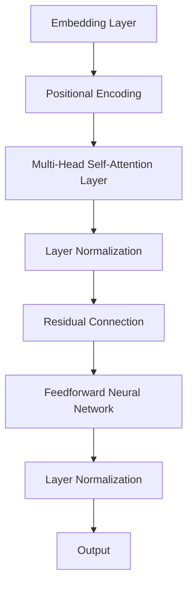
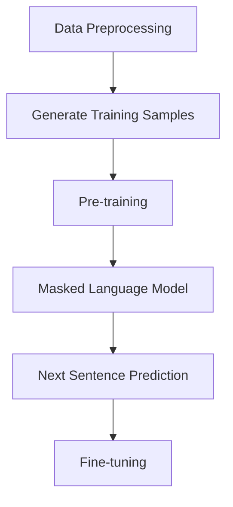

                 

### 《大语言模型原理与工程实践：GPT 系列模型的发展》

#### 关键词：
- 大语言模型
- GPT 系列模型
- 深度学习
- 自然语言处理
- 自监督学习
- 语言模型训练
- 模型优化与部署

#### 摘要：
本文旨在深入探讨大语言模型，特别是 GPT 系列模型的发展。我们将从大语言模型的时代背景出发，逐步介绍 GPT 系列模型的基本原理、核心算法、架构改进以及工程实践。同时，文章还将讨论大语言模型在不同领域的应用实践、工程实现中的关键技术，以及模型的安全性、伦理问题等。最后，我们将会展望大语言模型的未来发展趋势和对人工智能的影响。通过这篇文章，读者将能够全面了解大语言模型的理论基础和工程实践，为未来的研究和应用奠定基础。

### 《大语言模型原理与工程实践：GPT 系列模型的发展》目录大纲

#### 第一部分：大语言模型基础

#### 第1章：大语言模型概述

##### 1.1 大语言模型的时代背景
- 1.1.1 从传统自然语言处理到大语言模型
- 1.1.2 大语言模型的意义和影响
- 1.1.3 大语言模型的发展历程

##### 1.2 GPT系列模型简介
- 1.2.1 GPT-3的诞生与特点
- 1.2.2 GPT系列模型的演进
- 1.2.3 其他知名大语言模型介绍

##### 1.3 大语言模型的基本原理
- 1.3.1 自然语言处理的基本概念
- 1.3.2 神经网络与深度学习
- 1.3.3 自监督学习与大规模预训练

#### 第2章：深度学习与神经网络基础

##### 2.1 深度学习概述
- 2.1.1 深度学习的起源与发展
- 2.1.2 深度学习的基本原理
- 2.1.3 深度学习的主要挑战

##### 2.2 神经网络基础
- 2.2.1 神经网络的结构与功能
- 2.2.2 神经元与激活函数
- 2.2.3 反向传播算法与优化

##### 2.3 循环神经网络与注意力机制
- 2.3.1 循环神经网络简介
- 2.3.2 注意力机制原理
- 2.3.3 Transformer模型详解

#### 第3章：GPT系列模型原理与架构

##### 3.1 GPT-3模型原理
- 3.1.1 GPT-3模型结构
- 3.1.2 GPT-3训练过程
- 3.1.3 GPT-3应用场景

##### 3.2 GPT模型核心算法解析
- 3.2.1 自监督学习算法
- 3.2.2 语言模型训练算法
- 3.2.3 微调与适应策略

##### 3.3 GPT模型架构改进与优化
- 3.3.1 DeepSpeed技术
- 3.3.2 多卡训练与分布式训练
- 3.3.3 量化与压缩技术

#### 第4章：大语言模型的应用实践

##### 4.1 文本生成与摘要
- 4.1.1 自动写作与写作辅助
- 4.1.2 文本摘要与摘要生成
- 4.1.3 问答系统与对话生成

##### 4.2 机器翻译与语言理解
- 4.2.1 机器翻译原理
- 4.2.2 语言理解与语义分析
- 4.2.3 多语言处理与跨语言文本生成

##### 4.3 自然语言处理在垂直领域应用
- 4.3.1 金融领域的应用
- 4.3.2 健康医疗领域的应用
- 4.3.3 教育领域的应用

#### 第5章：大语言模型的工程实践

##### 5.1 模型训练与优化
- 5.1.1 数据预处理与数据增强
- 5.1.2 模型优化与调整
- 5.1.3 模型评估与调优

##### 5.2 模型部署与推理
- 5.2.1 模型部署策略
- 5.2.2 模型推理优化
- 5.2.3 模型监控与维护

##### 5.3 开发工具与框架
- 5.3.1 TensorFlow 2.x与PyTorch
- 5.3.2 DeepSpeed与Hugging Face
- 5.3.3 其他常用工具与框架

#### 第6章：大语言模型的安全性

##### 6.1 模型攻击与防御
- 6.1.1 模型对抗攻击
- 6.1.2 模型防御技术
- 6.1.3 数据隐私保护

##### 6.2 模型伦理与责任
- 6.2.1 模型伦理问题
- 6.2.2 模型责任分配
- 6.2.3 模型监管与规范

#### 第7章：大语言模型的未来发展

##### 7.1 大语言模型的挑战与机遇
- 7.1.1 大模型的发展趋势
- 7.1.2 大语言模型的应用前景
- 7.1.3 大语言模型的研究热点

##### 7.2 大语言模型与人工智能发展
- 7.2.1 大语言模型与人工智能的关系
- 7.2.2 大语言模型在人工智能中的应用
- 7.2.3 大语言模型对人工智能发展的影响

#### 附录

##### 附录A：大语言模型开发工具与资源
- A.1 主流深度学习框架对比
- A.2 大语言模型开发实战案例
- A.3 大语言模型相关学术论文与资料

### 文章标题：《大语言模型原理与工程实践：GPT 系列模型的发展》

随着人工智能技术的不断进步，自然语言处理（NLP）领域取得了显著的发展，大语言模型作为这一领域的重要突破，正引领着技术的革新。本文将详细介绍大语言模型，尤其是 GPT 系列模型的发展历程、基本原理、工程实践及其对人工智能发展的深远影响。通过本文的阅读，读者将能够全面理解大语言模型的核心概念、技术原理以及应用实践，为后续研究和应用提供有力支持。

#### 关键词：
- 大语言模型
- GPT 系列模型
- 深度学习
- 自然语言处理
- 自监督学习
- 语言模型训练
- 模型优化与部署

#### 摘要：
本文首先概述了大语言模型的时代背景，介绍了 GPT 系列模型的发展历程和基本原理。接着，我们深入探讨了深度学习和神经网络的基础知识，以及循环神经网络和注意力机制。随后，详细分析了 GPT 系列模型的原理和架构，包括 GPT-3 模型的结构和应用场景。接着，文章讨论了大语言模型在不同领域的应用实践，如文本生成、摘要、机器翻译等。随后，我们介绍了大语言模型的工程实践，包括模型训练与优化、模型部署与推理以及开发工具与框架。最后，文章探讨了大语言模型的安全性、伦理问题及其未来发展，展望了其在人工智能领域的应用前景。通过本文的阅读，读者将能够全面了解大语言模型的理论基础和工程实践，为未来的研究和应用奠定基础。

### 第一部分：大语言模型基础

#### 第1章：大语言模型概述

##### 1.1 大语言模型的时代背景

随着互联网的普及和大数据时代的到来，自然语言处理（NLP）技术得到了广泛关注。传统的自然语言处理方法主要依赖于规则和统计方法，这些方法在面对复杂、多变的自然语言时往往显得力不从心。为了克服这些局限性，研究人员开始探索利用深度学习技术来提升自然语言处理的能力。深度学习作为一种基于神经网络的学习方法，具有强大的非线性表示和特征提取能力，使得自然语言处理领域迎来了新的发展机遇。

大语言模型（Large-scale Language Model）正是在这一背景下逐渐兴起的一类模型。与传统的自然语言处理方法相比，大语言模型能够通过大规模的预训练数据学习到丰富的语言知识，从而在文本生成、摘要、机器翻译等任务中表现出色。大语言模型的崛起标志着自然语言处理技术从规则驱动向数据驱动的转变。

大语言模型的时代背景主要可以从以下几个方面来理解：

1. **计算能力的提升**：随着计算机硬件的快速发展，尤其是在GPU和TPU等专用硬件的推动下，计算能力的提升为训练和推理大语言模型提供了必要的计算资源。

2. **数据的丰富性**：互联网的普及带来了大量的文本数据，这些数据为训练大语言模型提供了丰富的素材。同时，数据的多样性使得大语言模型能够学习到更多的语言知识。

3. **深度学习技术的成熟**：深度学习技术，尤其是神经网络，在图像识别、语音识别等领域取得了显著的成功，这些技术的成功应用为大语言模型的发展奠定了基础。

4. **自然语言处理需求的增长**：随着人工智能技术的广泛应用，自然语言处理技术在智能客服、智能写作、智能翻译等领域的需求不断增加，这促使研究人员探索更加高效的大语言模型。

##### 1.1.1 从传统自然语言处理到大语言模型

传统自然语言处理方法主要依赖于规则和统计方法。例如，在词性标注任务中，研究人员会编写大量的规则来区分不同词性的词；在命名实体识别任务中，则采用统计方法来计算词语在文本中的出现频率，从而识别出命名实体。这些方法在一定程度上能够处理简单的自然语言任务，但在面对复杂、多变的自然语言时，往往显得力不从心。

传统的自然语言处理方法主要存在以下几个问题：

1. **规则依赖性高**：传统方法依赖于大量的手工编写的规则，这些规则难以覆盖所有可能的自然语言现象，导致处理效果受限。

2. **泛化能力差**：传统方法通常只能处理特定类型的数据，无法适应多变的环境，缺乏泛化能力。

3. **数据需求大**：为了提高处理效果，传统方法往往需要大量的标注数据，这使得数据获取和标注成本较高。

相比之下，大语言模型采用深度学习技术，通过在大量无标签数据上进行预训练，学习到丰富的语言知识。这些知识不仅适用于特定任务，还能够泛化到其他任务中，从而提高了模型的泛化能力和处理效果。

大语言模型的基本原理可以概括为以下几点：

1. **预训练**：大语言模型首先在大量无标签文本上进行预训练，通过这种自监督的方式，模型能够学习到语言的统计规律和语义信息。

2. **微调**：在预训练的基础上，大语言模型会根据具体任务的需求进行微调，以适应不同的任务和数据集。

3. **端到端学习**：大语言模型能够实现端到端学习，从输入文本直接生成输出文本，无需中间的复杂转换过程。

##### 1.1.2 大语言模型的意义和影响

大语言模型的崛起不仅推动了自然语言处理技术的发展，还带来了深远的社会影响。以下是几个关键点：

1. **提升文本生成和摘要能力**：大语言模型在文本生成和摘要任务中表现出色，能够生成高质量的自然语言文本，自动提取关键信息。

2. **改进机器翻译效果**：大语言模型在机器翻译任务中提高了翻译质量，实现了更加流畅和自然的跨语言交流。

3. **促进智能客服和智能写作**：大语言模型的应用使得智能客服系统能够更自然地与用户进行交互，智能写作系统则能够生成高质量的文本内容。

4. **拓宽自然语言处理的应用领域**：大语言模型的应用不仅局限于传统的文本处理任务，还扩展到了图像描述生成、语音识别等领域。

5. **推动人工智能的发展**：大语言模型作为人工智能的重要分支，其技术的发展不仅提升了自然语言处理的能力，还为其他领域的人工智能应用提供了强有力的支持。

##### 1.1.3 大语言模型的发展历程

大语言模型的发展历程可以分为几个关键阶段：

1. **早期尝试**：2000年代初期，研究人员开始尝试使用神经网络进行自然语言处理。这一时期的模型规模较小，性能有限。

2. **深度学习兴起**：2006年，Hinton等人提出了深度信念网络（DBN），标志着深度学习技术的兴起。随着计算能力的提升，深度学习在图像识别等领域取得了突破性进展。

3. **词向量模型**：2013年，Word2Vec模型的提出标志着词向量技术的兴起。词向量模型通过将词语映射到高维向量空间，提高了文本表示的准确性。

4. **大规模预训练模型**：2018年，GPT模型（Generative Pre-trained Transformer）的提出标志着大规模预训练模型时代的到来。GPT模型通过在大量文本上进行预训练，学习到了丰富的语言知识。

5. **GPT-3发布**：2020年，OpenAI发布了GPT-3模型，这是目前最大的预训练模型，拥有1750亿个参数。GPT-3模型在多个自然语言处理任务中取得了显著的性能提升，引起了广泛关注。

##### 1.2 GPT系列模型简介

GPT（Generative Pre-trained Transformer）系列模型是自然语言处理领域的重要突破，其核心思想是通过大规模预训练学习到丰富的语言知识，从而在多个自然语言处理任务中取得优异的性能。GPT系列模型由 OpenAI 研发，主要包括 GPT、GPT-2 和 GPT-3。以下是这些模型的简要介绍：

1. **GPT**：GPT是GPT系列模型的开端，于2018年发布。GPT模型是一个基于Transformer架构的预训练模型，其核心思想是通过在大量文本上进行预训练，学习到语言的统计规律和语义信息。

2. **GPT-2**：GPT-2是GPT模型的升级版，于2019年发布。GPT-2模型在GPT的基础上进一步提升了模型的规模和训练数据量，从而学习到了更丰富的语言知识。

3. **GPT-3**：GPT-3是GPT系列模型的最新版本，于2020年发布。GPT-3模型是目前最大的预训练模型，拥有1750亿个参数。GPT-3模型在多个自然语言处理任务中取得了显著的性能提升，引起了广泛关注。

以下是GPT系列模型的一些关键特点：

1. **大规模预训练**：GPT系列模型通过在大量文本上进行预训练，学习到丰富的语言知识。这种自监督的学习方式使得模型能够在未见过的数据上取得优异的性能。

2. **Transformer架构**：GPT系列模型采用Transformer架构，这是一种基于自注意力机制的序列模型。相比传统的循环神经网络，Transformer架构在处理长序列任务时具有更高的效率和更好的性能。

3. **参数规模**：GPT系列模型随着版本的升级，其参数规模也在不断增加。从GPT的1.17亿个参数到GPT-3的1750亿个参数，大规模的参数规模使得模型能够学习到更加复杂的语言知识。

4. **多语言支持**：GPT系列模型支持多种语言的预训练和微调，这使得模型能够在跨语言任务中发挥出色的性能。

除了GPT系列模型，还有其他一些知名的大语言模型，以下是简要介绍：

1. **BERT**：BERT（Bidirectional Encoder Representations from Transformers）是由Google Research于2018年提出的。BERT模型通过双向Transformer结构学习到更准确的文本表示，在多个自然语言处理任务中取得了优异的性能。

2. **RoBERTa**：RoBERTa是BERT模型的改进版，由Facebook AI Research于2019年提出。RoBERTa在BERT的基础上进一步优化了预训练过程，从而提高了模型的性能。

3. **T5**：T5（Text-To-Text Transfer Transformer）是由DeepMind于2020年提出的。T5模型通过将所有自然语言处理任务转化为文本生成任务，实现了端到端的学习。

这些大语言模型的出现，不仅标志着自然语言处理技术的进步，还为人工智能领域带来了新的机遇和挑战。

##### 1.3 大语言模型的基本原理

大语言模型（Large-scale Language Model）是一种基于深度学习的自然语言处理模型，其核心思想是通过大规模的预训练数据学习到丰富的语言知识，从而在多个自然语言处理任务中表现出色。本节将介绍大语言模型的基本原理，包括自然语言处理的基本概念、神经网络与深度学习以及自监督学习与大规模预训练。

###### 1.3.1 自然语言处理的基本概念

自然语言处理（NLP，Natural Language Processing）是人工智能领域的一个重要分支，旨在使计算机能够理解、生成和处理人类自然语言。自然语言处理的基本概念包括：

1. **词汇**：词汇是自然语言的基本单位，包括单词、词组、短语等。在自然语言处理中，需要对词汇进行识别、分类和标注。

2. **句子**：句子是自然语言的基本表达单元，由一个或多个词汇组成。句子分析（Sentence Analysis）是对句子结构进行分析和理解的过程。

3. **语义**：语义是指语言表达的含义和意义。自然语言处理的目标之一是理解句子的语义，从而进行信息抽取、情感分析等任务。

4. **语音**：语音是指人类通过声带发出的声音。语音识别（Speech Recognition）是将语音信号转换为文本的过程，是自然语言处理的重要应用之一。

5. **语言模型**：语言模型是用于预测下一个单词或词组的概率分布的模型。在自然语言处理中，语言模型广泛应用于文本生成、机器翻译、语音识别等任务。

大语言模型通过学习大量的无标签文本数据，自动学习到语言的统计规律和语义信息。这种自监督的学习方式使得模型能够在未见过的数据上取得优异的性能。

###### 1.3.2 神经网络与深度学习

神经网络（Neural Network）是一种模仿生物神经系统的计算模型，由多个神经元（Node）和连接（Connection）组成。神经网络通过学习输入和输出之间的关系，从而实现各种复杂的任务。

深度学习（Deep Learning）是神经网络的一种发展，通过多层神经网络结构，实现更加复杂的特征提取和模式识别。深度学习在图像识别、语音识别、自然语言处理等领域取得了显著的成功。

1. **多层感知机（MLP）**：多层感知机是最简单的多层神经网络，由输入层、隐藏层和输出层组成。输入层接收外部输入，隐藏层通过非线性变换提取特征，输出层生成预测结果。

2. **卷积神经网络（CNN）**：卷积神经网络是一种专门用于图像识别的神经网络，通过卷积操作提取图像特征。CNN在图像分类、目标检测等任务中取得了优异的性能。

3. **循环神经网络（RNN）**：循环神经网络是一种用于处理序列数据的神经网络，通过递归操作将序列中的信息传递给后续时间步。RNN在语音识别、语言模型等任务中发挥了重要作用。

4. **Transformer模型**：Transformer模型是一种基于自注意力机制的序列模型，通过多头注意力机制实现更加复杂的特征提取和模式识别。Transformer模型在自然语言处理领域取得了显著的突破。

在自然语言处理中，深度学习技术通过多层神经网络结构，实现对文本的复杂特征提取和模式识别。大语言模型通常采用深度学习技术，通过大规模的预训练数据学习到丰富的语言知识。

###### 1.3.3 自监督学习与大规模预训练

自监督学习（Self-supervised Learning）是一种无监督学习技术，通过利用未标注的数据进行学习。自监督学习在自然语言处理领域具有广泛的应用，如语言模型、文本分类、序列标注等。

大规模预训练（Large-scale Pre-training）是一种自监督学习方法，通过在大量无标签文本上进行预训练，学习到丰富的语言知识。大规模预训练通常分为两个阶段：

1. **预训练阶段**：在预训练阶段，模型通过自监督学习从大量无标签文本中学习语言知识。预训练过程通常包括词向量学习、语言模型训练、文本分类等任务。

2. **微调阶段**：在预训练的基础上，模型通过微调（Fine-tuning）适应特定任务。微调过程通常在少量有标签数据上进行，通过调整模型参数，提高模型在特定任务上的性能。

大规模预训练使得大语言模型能够在未见过的数据上取得优异的性能。GPT系列模型就是基于大规模预训练技术，通过在大量文本上进行预训练，学习到丰富的语言知识，从而在多个自然语言处理任务中表现出色。

#### 第二部分：深度学习与神经网络基础

#### 第2章：深度学习与神经网络基础

##### 2.1 深度学习概述

深度学习（Deep Learning）是人工智能（AI）领域的一个重要分支，它通过模仿人脑的神经网络结构和学习机制，对大量数据进行特征提取和模式识别。深度学习在图像识别、语音识别、自然语言处理等众多领域取得了显著的成果。本节将介绍深度学习的起源与发展、基本原理以及主要挑战。

##### 2.1.1 深度学习的起源与发展

深度学习的概念最早可以追溯到20世纪40年代，当时神经网络的初步概念被提出。然而，由于计算能力和算法的限制，深度学习的发展一度缓慢。直到2006年，Hinton等人提出了深度信念网络（Deep Belief Network, DBN），深度学习开始进入快速发展阶段。2009年，Alex Krizhevsky在ImageNet图像识别大赛中使用了深度卷积神经网络（Convolutional Neural Network, CNN）取得了突破性的成绩，这标志着深度学习在图像识别领域的重要性。

深度学习的发展历程可以分为几个关键阶段：

1. **2006年：深度信念网络（DBN）提出**：Hinton等人提出了深度信念网络，这是一种多层神经网络，通过逐层训练的方式学习特征。

2. **2012年：AlexNet在ImageNet竞赛中获胜**：Alex Krizhevsky等人提出的AlexNet模型在ImageNet竞赛中取得了巨大成功，证明了深度学习在图像识别领域的潜力。

3. **2014年：卷积神经网络（CNN）的广泛应用**：随着CNN在图像识别、目标检测等领域的成功应用，深度学习开始被广泛接受和研究。

4. **2016年：递归神经网络（RNN）和长短期记忆网络（LSTM）的发展**：RNN和LSTM在语音识别、语言建模等序列数据处理任务中取得了显著成果。

5. **2017年：基于Transformer的模型如BERT、GPT-2等**：Transformer模型的出现为自然语言处理领域带来了革命性的变化，BERT、GPT-2等模型在多个任务中刷新了SOTA（State-of-the-Art）。

##### 2.1.2 深度学习的基本原理

深度学习的基本原理是模拟人脑的神经网络结构和学习机制，通过多层神经网络对输入数据进行特征提取和模式识别。深度学习模型通常由多个层组成，每一层都对输入数据进行处理和变换。

1. **输入层**：输入层接收外部输入数据，这些数据可以是图像、声音、文本等。

2. **隐藏层**：隐藏层对输入数据进行处理和变换，提取更高层次的特征。深度学习模型中的隐藏层可以是多层，每一层都可以提取更加抽象和复杂的特征。

3. **输出层**：输出层产生最终的预测结果，这些结果可以是分类标签、概率分布等。

深度学习模型的工作原理可以概括为以下几个步骤：

1. **初始化权重**：在训练开始前，模型需要随机初始化权重参数。

2. **前向传播**：输入数据通过神经网络的前向传播过程，逐层传递到输出层，产生预测结果。

3. **计算损失**：将预测结果与实际标签进行比较，计算预测误差。

4. **反向传播**：通过反向传播算法，将误差反向传播到隐藏层，更新权重参数。

5. **迭代训练**：重复上述步骤，不断迭代训练，直到模型达到满意的性能。

##### 2.1.3 深度学习的主要挑战

尽管深度学习在许多领域取得了显著成果，但仍然面临一些挑战：

1. **计算资源需求**：深度学习模型通常需要大量的计算资源和存储空间，尤其是大规模模型如BERT、GPT等。这使得深度学习在资源有限的设备上应用受到限制。

2. **数据依赖**：深度学习模型的性能高度依赖于训练数据的质量和数量。数据集的多样性、平衡性以及标注质量都会影响模型的性能。

3. **模型可解释性**：深度学习模型通常被视为“黑盒子”，其内部决策过程难以解释。这对于需要模型可解释性的应用场景（如医疗诊断、法律判决等）带来了挑战。

4. **过拟合**：深度学习模型容易过拟合训练数据，导致在未见过的数据上表现不佳。正则化技术和模型选择可以帮助缓解过拟合问题。

5. **训练时间**：深度学习模型的训练通常需要很长时间，尤其是大规模模型。优化算法和硬件加速技术可以帮助提高训练效率。

##### 2.2 神经网络基础

神经网络（Neural Network）是深度学习的基础，由多个神经元（Node）和连接（Connection）组成。神经网络通过学习输入和输出之间的关系，实现对数据的特征提取和模式识别。本节将介绍神经网络的结构与功能、神经元与激活函数、反向传播算法与优化。

##### 2.2.1 神经网络的结构与功能

神经网络由多个层组成，包括输入层、隐藏层和输出层。每一层都由多个神经元组成，神经元之间通过连接（权重）连接。

1. **输入层**：输入层接收外部输入数据，这些数据可以是图像、声音、文本等。每个神经元对应一个输入特征。

2. **隐藏层**：隐藏层对输入数据进行处理和变换，提取更高层次的特征。隐藏层可以有多个，每个隐藏层都可以提取更加抽象和复杂的特征。

3. **输出层**：输出层产生最终的预测结果，这些结果可以是分类标签、概率分布等。

神经网络的输入和输出关系可以用以下公式表示：

$$
Y = \sigma(Z)
$$

其中，$Y$是输出层的结果，$\sigma$是激活函数，$Z$是加权求和的结果：

$$
Z = \sum_{i=1}^{n} w_i * x_i + b
$$

其中，$w_i$是连接权重，$x_i$是输入特征，$b$是偏置。

神经网络通过学习这些权重和偏置，实现对数据的特征提取和模式识别。

##### 2.2.2 神经元与激活函数

神经元是神经网络的基本单元，由一个或多个输入和输出组成。神经元通过加权求和和激活函数生成输出。

1. **线性神经元**：线性神经元是一个简单的神经元，其输出直接是输入的线性组合。

$$
a(x) = \sum_{i=1}^{n} w_i * x_i + b
$$

其中，$a(x)$是输出，$w_i$是权重，$x_i$是输入，$b$是偏置。

2. **非线性激活函数**：为了引入非线性，神经网络通常使用激活函数。激活函数可以将线性组合的输出映射到非线性的范围。常见的激活函数包括：

   - **Sigmoid函数**：

   $$
   \sigma(x) = \frac{1}{1 + e^{-x}}
   $$

   - **ReLU函数**：

   $$
   \text{ReLU}(x) = \max(0, x)
   $$

   - **Tanh函数**：

   $$
   \text{Tanh}(x) = \frac{e^x - e^{-x}}{e^x + e^{-x}}
   $$

非线性激活函数使得神经网络能够学习到更加复杂的特征和模式。

##### 2.2.3 反向传播算法与优化

反向传播算法（Backpropagation Algorithm）是神经网络训练的核心算法，用于更新权重和偏置，以最小化预测误差。反向传播算法可以分为以下几个步骤：

1. **前向传播**：输入数据通过神经网络的前向传播过程，逐层传递到输出层，产生预测结果。

2. **计算误差**：将预测结果与实际标签进行比较，计算预测误差。误差可以用均方误差（MSE）或交叉熵（Cross-Entropy）等损失函数表示。

$$
L = \frac{1}{2} \sum_{i=1}^{n} (y_i - \hat{y}_i)^2
$$

其中，$L$是损失函数，$y_i$是实际标签，$\hat{y}_i$是预测结果。

3. **计算梯度**：通过链式法则，计算损失函数对每个权重和偏置的梯度。

$$
\frac{\partial L}{\partial w_i} = \frac{\partial L}{\partial Z} \cdot \frac{\partial Z}{\partial w_i}
$$

4. **更新权重和偏置**：使用梯度下降（Gradient Descent）或其变种，更新权重和偏置。

$$
w_i = w_i - \alpha \cdot \frac{\partial L}{\partial w_i}
$$

其中，$\alpha$是学习率。

反向传播算法的核心是计算损失函数对每个参数的梯度，并通过梯度更新参数，以最小化损失函数。通过多次迭代，神经网络可以逐渐调整权重和偏置，提高预测性能。

除了反向传播算法，还有许多优化技术可以提高神经网络的训练效率和性能，如：

- **动量（Momentum）**：通过引入动量，加速梯度下降过程。

- **自适应学习率（Adaptive Learning Rate）**：如Adam优化器，通过自适应调整学习率，提高训练效率。

- **正则化（Regularization）**：如L1、L2正则化，防止过拟合。

##### 2.3 循环神经网络与注意力机制

循环神经网络（Recurrent Neural Network, RNN）是一种用于处理序列数据的神经网络，能够记住前面的信息，从而更好地处理时间序列数据。然而，传统的RNN存在梯度消失和梯度爆炸的问题，影响了模型的性能。为了解决这些问题，研究者提出了长短期记忆网络（Long Short-Term Memory, LSTM）和门控循环单元（Gated Recurrent Unit, GRU）。注意力机制（Attention Mechanism）则是在自然语言处理中广泛应用的一种技术，能够提高模型的序列建模能力。

##### 2.3.1 循环神经网络简介

循环神经网络（RNN）是一种处理序列数据的神经网络，其特点是具有递归结构。RNN通过在时间步上递归地更新状态，从而保留前面时间步的信息。

RNN的基本结构可以表示为：

$$
h_t = \sigma(W_h * [h_{t-1}, x_t] + b_h)
$$

其中，$h_t$是第$t$时间步的隐藏状态，$x_t$是输入序列，$\sigma$是激活函数，$W_h$是权重矩阵，$b_h$是偏置。

RNN的递归关系可以表示为：

$$
h_t = f(h_{t-1}, x_t)
$$

其中，$f$是一个非线性变换函数。

RNN能够记住前面的信息，从而在处理序列数据时具有优势。例如，在语言模型中，RNN可以记住前面的单词，从而更好地预测下一个单词。

##### 2.3.2 注意力机制原理

注意力机制（Attention Mechanism）是一种用于序列建模的技术，能够提高模型对序列数据的建模能力。注意力机制的核心思想是通过计算不同位置之间的关联性，为每个位置分配不同的权重，从而更好地关注重要的信息。

注意力机制的数学表示可以表示为：

$$
a_t = \text{Attention}(Q, K, V)
$$

其中，$Q$是查询序列，$K$是关键序列，$V$是值序列，$a_t$是注意力权重。

常见的注意力机制包括：

- **缩放点积注意力（Scaled Dot-Product Attention）**：

$$
\text{Attention}(Q, K, V) = \text{softmax}(\frac{QK^T}{\sqrt{d_k}})V
$$

其中，$d_k$是关键序列的维度。

- **多头注意力（Multi-Head Attention）**：

多头注意力通过将输入序列划分为多个子序列，为每个子序列计算不同的注意力权重，从而提高模型的序列建模能力。

$$
\text{Multi-Head Attention}(Q, K, V) = \text{Concat}(\text{head}_1, \text{head}_2, ..., \text{head}_h)W_O
$$

其中，$h$是头数，$W_O$是输出权重。

##### 2.3.3 Transformer模型详解

Transformer模型是由Google Research在2017年提出的一种基于自注意力机制的序列模型，它在自然语言处理领域取得了显著的突破。Transformer模型的核心思想是使用自注意力机制（Self-Attention）和多头注意力（Multi-Head Attention），从而在处理长序列数据时具有更好的性能和效率。

Transformer模型的基本结构可以表示为：

1. **嵌入层（Embedding Layer）**：将输入词向量转换为嵌入向量。

2. **位置编码（Positional Encoding）**：为序列添加位置信息，使得模型能够理解序列的顺序。

3. **多头自注意力层（Multi-Head Self-Attention Layer）**：通过多头注意力机制，计算不同位置之间的关联性，为每个位置分配不同的权重。

4. **前馈神经网络（Feedforward Neural Network）**：对自注意力层的输出进行进一步的变换。

5. **层归一化（Layer Normalization）**：对每一层的输出进行归一化，防止梯度消失和梯度爆炸。

6. **残差连接（Residual Connection）**：通过添加残差连接，缓解深层网络中的梯度消失问题。

Transformer模型的训练过程通常包括两个阶段：

1. **预训练阶段**：在大量无标签文本上进行预训练，学习到丰富的语言知识。预训练任务通常包括 masked language model（MLM）和 next sentence prediction（NSP）。

2. **微调阶段**：在预训练的基础上，针对具体任务进行微调。微调过程中，模型会根据任务的需求进行调整，从而提高任务性能。

Transformer模型在多个自然语言处理任务中取得了优异的性能，如机器翻译、文本生成、问答系统等。其自注意力机制使得模型能够处理长序列数据，从而在理解长文本上下文中具有优势。

#### 第三部分：GPT系列模型原理与架构

#### 第3章：GPT系列模型原理与架构

##### 3.1 GPT-3模型原理

GPT-3（Generative Pre-trained Transformer 3）是 OpenAI 于 2020 年推出的一种大型语言模型，其参数规模达到 1750 亿，是目前最大的预训练模型之一。GPT-3 的推出标志着大语言模型在自然语言处理领域取得了新的突破。本节将介绍 GPT-3 模型的原理，包括模型结构、训练过程和应用场景。

###### 3.1.1 GPT-3模型结构

GPT-3 模型采用 Transformer 架构，这是一种基于自注意力机制的序列模型。GPT-3 模型的主要组成部分包括：

1. **嵌入层（Embedding Layer）**：将输入词向量转换为嵌入向量。每个词向量由词表中的索引表示，通过嵌入层转换为高维向量。

2. **位置编码（Positional Encoding）**：为序列添加位置信息，使得模型能够理解序列的顺序。GPT-3 使用 learned positional embedding，通过模型学习得到位置编码。

3. **多头自注意力层（Multi-Head Self-Attention Layer）**：通过多头注意力机制，计算不同位置之间的关联性，为每个位置分配不同的权重。GPT-3 的多头注意力机制由 24 个头组成。

4. **前馈神经网络（Feedforward Neural Network）**：对自注意力层的输出进行进一步的变换。前馈神经网络由两个全连接层组成，中间使用 ReLU 激活函数。

5. **层归一化（Layer Normalization）**：对每一层的输出进行归一化，防止梯度消失和梯度爆炸。

6. **残差连接（Residual Connection）**：通过添加残差连接，缓解深层网络中的梯度消失问题。

GPT-3 模型的结构如图 1 所示：



###### 3.1.2 GPT-3训练过程

GPT-3 模型采用自监督学习（Self-supervised Learning）的方法进行预训练，即在大量无标签文本数据上进行训练。GPT-3 的训练过程主要包括以下步骤：

1. **数据预处理**：首先，对文本数据进行预处理，包括分词、去除标点符号和特殊字符等。然后，将文本数据转换为词表，并将词转换为索引。

2. **生成训练样本**：为了进行自监督学习，需要将输入文本随机划分为两个部分：前文（prefix）和后文（suffix）。然后，随机选择一个位置，将这个位置处的词替换为特殊的 <mask> 标记。这样，每个训练样本都是一个包含 <mask> 的输入序列，以及对应的输出序列。

3. **预训练**：在预训练阶段，GPT-3 模型通过最小化预测 <mask> 的损失函数来学习语言知识。具体来说，模型需要预测 <mask> 位置的词，以及每个位置处的词。预训练过程通常包括以下任务：

   - **Masked Language Model（MLM）**：在输入序列中随机替换一部分词为 <mask>，模型需要预测这些 <mask> 位置的词。
   - **Next Sentence Prediction（NSP）**：给定两个句子，模型需要预测这两个句子是否属于同一个段落。

4. **微调**：在预训练的基础上，对 GPT-3 模型进行微调，以适应特定任务。微调过程通常在少量有标签数据上进行，通过调整模型参数，提高模型在特定任务上的性能。

GPT-3 的预训练过程如图 2 所示：



###### 3.1.3 GPT-3应用场景

GPT-3 模型具有强大的语言生成能力，可以应用于多个自然语言处理任务，包括：

1. **文本生成**：GPT-3 可以生成各种类型的文本，如文章、摘要、对话等。通过输入一个起始文本，GPT-3 可以自动生成后续的文本。

2. **问答系统**：GPT-3 可以作为一个问答系统，回答用户的问题。通过训练，GPT-3 可以理解问题的语义，并生成相关答案。

3. **机器翻译**：GPT-3 可以进行高质量的机器翻译。通过在双语语料库上进行预训练，GPT-3 可以将一种语言的文本翻译成另一种语言。

4. **文本摘要**：GPT-3 可以生成文章的摘要，提取关键信息并简化文本。

5. **对话系统**：GPT-3 可以构建智能对话系统，与用户进行自然语言交互。

6. **文本分类**：GPT-3 可以用于文本分类任务，通过输入文本，GPT-3 可以预测文本的类别。

7. **情感分析**：GPT-3 可以分析文本的情感倾向，判断文本是积极、消极还是中性。

8. **文本生成与写作辅助**：GPT-3 可以辅助人类进行文本写作，生成文章、报告、邮件等。

GPT-3 模型的应用场景广泛，涵盖了自然语言处理的多个方面，其强大的语言生成能力为各个领域带来了新的机遇。

##### 3.2 GPT模型核心算法解析

GPT（Generative Pre-trained Transformer）模型是 OpenAI 于 2018 年提出的一种基于 Transformer 架构的大规模语言模型。GPT 模型通过在大量无标签文本数据上进行预训练，学习到丰富的语言知识，从而在多个自然语言处理任务中取得了优异的性能。本节将深入解析 GPT 模型的核心算法，包括自监督学习算法、语言模型训练算法以及微调与适应策略。

###### 3.2.1 自监督学习算法

自监督学习（Self-supervised Learning）是一种无监督学习方法，它利用未标注的数据进行学习，从而自动提取数据中的有用信息。自监督学习在自然语言处理领域具有广泛的应用，例如语言模型、文本分类、序列标注等。

GPT 模型的自监督学习算法主要基于以下两个任务：

1. **Masked Language Model（MLM）**：在输入序列中随机替换一部分词为 <mask>，模型需要预测这些 <mask> 位置的词。

2. **Next Sentence Prediction（NSP）**：给定两个句子，模型需要预测这两个句子是否属于同一个段落。

###### 3.2.1.1 Masked Language Model（MLM）

Masked Language Model（MLM）是一种常见的自监督学习任务，其目的是通过预测输入序列中被遮盖的部分来学习语言知识。在 MLM 任务中，模型需要学习到每个词与其上下文词之间的关系，从而在遮盖部分时能够生成正确的词。

MLM 的基本思想如下：

1. **数据预处理**：首先，对文本数据进行预处理，包括分词、去除标点符号和特殊字符等。然后，将文本数据转换为词表，并将词转换为索引。

2. **生成训练样本**：在输入序列中，随机选择一部分词，将这些词替换为特殊的 <mask> 标记。这样，每个训练样本都是一个包含 <mask> 的输入序列，以及对应的输出序列。

3. **模型训练**：在训练过程中，模型的目标是最小化预测 <mask> 的损失函数。具体来说，模型需要预测 <mask> 位置的词，以及每个位置处的词。

以下是 MLM 的伪代码：

```python
def masked_language_model(text, mask_ratio):
    masked_text = []
    for word in text:
        if random.random() < mask_ratio:
            masked_text.append("<mask>")
        else:
            masked_text.append(word)
    return masked_text
```

其中，`mask_ratio` 是遮盖词的比例。

###### 3.2.1.2 Next Sentence Prediction（NSP）

Next Sentence Prediction（NSP）是一种辅助自监督学习任务，其目的是通过预测两个句子是否属于同一个段落来学习语言知识。在 NSP 任务中，模型需要学习到句子之间的关系，从而在给定两个句子时能够预测它们是否属于同一个段落。

NSP 的基本思想如下：

1. **数据预处理**：首先，对文本数据进行预处理，包括分词、去除标点符号和特殊字符等。然后，将文本数据转换为词表，并将词转换为索引。

2. **生成训练样本**：从输入序列中随机选择两个句子，将这两个句子组成一个训练样本。然后，随机选择一个标签，表示这两个句子是否属于同一个段落。

3. **模型训练**：在训练过程中，模型的目标是最小化预测标签的损失函数。具体来说，模型需要预测两个句子是否属于同一个段落。

以下是 NSP 的伪代码：

```python
def next_sentence_prediction(text, sentence_pair_ratio):
    sentence_pairs = []
    labels = []
    for sentence1 in text:
        for sentence2 in text:
            if sentence1 != sentence2:
                sentence_pairs.append((sentence1, sentence2))
                if random.random() < sentence_pair_ratio:
                    labels.append(1)  # 属于同一个段落
                else:
                    labels.append(0)  # 不属于同一个段落
    return sentence_pairs, labels
```

其中，`sentence_pair_ratio` 是句子对的比例。

###### 3.2.2 语言模型训练算法

GPT 模型的语言模型训练算法主要包括两个阶段：预训练阶段和微调阶段。

###### 3.2.2.1 预训练阶段

在预训练阶段，GPT 模型通过自监督学习（包括 MLM 和 NSP 任务）学习到丰富的语言知识。预训练阶段的主要目标是提高模型在未见过的数据上的性能。

预训练阶段的基本流程如下：

1. **数据预处理**：首先，对文本数据进行预处理，包括分词、去除标点符号和特殊字符等。然后，将文本数据转换为词表，并将词转换为索引。

2. **生成训练样本**：使用 MLM 和 NSP 任务生成训练样本。

3. **模型训练**：在训练过程中，模型的目标是最小化预测损失函数。具体来说，模型需要预测 <mask> 位置的词，以及每个位置处的词。此外，模型还需要预测 NSP 标签。

4. **保存模型**：在预训练阶段结束后，保存训练好的模型。

以下是预训练阶段的伪代码：

```python
def pretrain(model, data, mask_ratio, sentence_pair_ratio):
    for epoch in range(num_epochs):
        for sample in data:
            inputs = masked_language_model(sample, mask_ratio)
            targets = [sample[i+1] for i in range(len(sample) - 1)]
            inputs = convert_to_indices(inputs)
            targets = convert_to_indices(targets)
            loss = model(inputs, targets)
            optimizer.zero_grad()
            loss.backward()
            optimizer.step()
    save_model(model)
```

其中，`num_epochs` 是训练轮数，`mask_ratio` 是遮盖词的比例，`sentence_pair_ratio` 是句子对的比例。

###### 3.2.2.2 微调阶段

在微调阶段，GPT 模型根据特定任务的需求进行调整。微调阶段的主要目标是提高模型在特定任务上的性能。

微调阶段的基本流程如下：

1. **数据预处理**：首先，对文本数据进行预处理，包括分词、去除标点符号和特殊字符等。然后，将文本数据转换为词表，并将词转换为索引。

2. **生成训练样本**：根据特定任务的需求，生成训练样本。

3. **模型训练**：在训练过程中，模型的目标是最小化预测损失函数。具体来说，模型需要预测每个位置处的词。

4. **评估模型**：在训练过程中，定期评估模型在验证集上的性能，以便调整模型参数。

5. **保存模型**：在微调阶段结束后，保存训练好的模型。

以下是微调阶段的伪代码：

```python
def fine_tune(model, data, num_epochs):
    for epoch in range(num_epochs):
        for sample in data:
            inputs = convert_to_indices(sample)
            targets = [sample[i+1] for i in range(len(sample) - 1)]
            targets = convert_to_indices(targets)
            loss = model(inputs, targets)
            optimizer.zero_grad()
            loss.backward()
            optimizer.step()
    evaluate_model(model)
    save_model(model)
```

其中，`num_epochs` 是训练轮数。

###### 3.2.3 微调与适应策略

在预训练阶段，GPT 模型学习到了丰富的语言知识，但在特定任务上可能需要进一步调整。微调与适应策略是提高模型在特定任务上性能的关键。

微调与适应策略主要包括以下步骤：

1. **数据预处理**：首先，对文本数据进行预处理，包括分词、去除标点符号和特殊字符等。然后，将文本数据转换为词表，并将词转换为索引。

2. **调整模型参数**：根据特定任务的需求，调整模型参数。例如，可以冻结预训练阶段的模型参数，只调整特定任务相关的参数。

3. **模型训练**：在训练过程中，模型的目标是最小化预测损失函数。具体来说，模型需要预测每个位置处的词。

4. **评估模型**：在训练过程中，定期评估模型在验证集上的性能，以便调整模型参数。

5. **保存模型**：在微调阶段结束后，保存训练好的模型。

以下是微调与适应策略的伪代码：

```python
def fine_tune_and_adapt(model, data, num_epochs):
    for epoch in range(num_epochs):
        for sample in data:
            inputs = convert_to_indices(sample)
            targets = [sample[i+1] for i in range(len(sample) - 1)]
            targets = convert_to_indices(targets)
            loss = model(inputs, targets)
            optimizer.zero_grad()
            loss.backward()
            optimizer.step()
        evaluate_model(model)
    save_model(model)
```

通过微调和适应策略，GPT 模型可以更好地适应特定任务，从而提高性能。

##### 3.3 GPT模型架构改进与优化

GPT 模型在自然语言处理领域取得了显著的成果，但其大规模的参数规模和训练成本也带来了挑战。为了提高 GPT 模型的训练效率和推理性能，研究者提出了一系列的架构改进和优化方法。本节将介绍 GPT 模型的架构改进与优化方法，包括 DeepSpeed 技术、多卡训练与分布式训练、量化与压缩技术。

###### 3.3.1 DeepSpeed 技术

DeepSpeed 是一种大规模深度学习训练优化框架，旨在提高训练效率和可扩展性。DeepSpeed 提供了多种优化技术，包括参数服务器、梯度累积、分布式训练等。

DeepSpeed 的主要组件包括：

1. **参数服务器（Parameter Server）**：参数服务器是一种分布式训练架构，用于管理分布式训练中的模型参数。参数服务器将模型参数分片存储在多个节点上，每个节点负责计算局部梯度。

2. **梯度累积（Gradient Accumulation）**：梯度累积是一种技术，用于在多卡训练时提高训练效率。梯度累积通过累积多个步骤的梯度，减少每一步的通信和计算开销。

3. **分布式训练（Distributed Training）**：分布式训练通过将数据分布在多个节点上进行训练，从而提高训练速度。DeepSpeed 支持多卡训练和跨节点分布式训练。

DeepSpeed 的基本流程如下：

1. **数据预处理**：首先，对文本数据进行预处理，包括分词、去除标点符号和特殊字符等。然后，将文本数据转换为词表，并将词转换为索引。

2. **模型初始化**：初始化 GPT 模型，并在每个节点上分配模型参数。

3. **分布式训练**：将数据分布在多个节点上进行训练。在每个节点上，模型计算局部梯度，并将梯度发送到参数服务器。

4. **参数服务器聚合梯度**：参数服务器将来自不同节点的梯度进行聚合，更新模型参数。

5. **模型评估**：在训练过程中，定期评估模型在验证集上的性能，以便调整模型参数。

6. **保存模型**：在训练阶段结束后，保存训练好的模型。

以下是 DeepSpeed 的伪代码：

```python
def distributed_train(model, data, num_epochs, num_nodes, num_gpus):
    for epoch in range(num_epochs):
        for batch in data:
            for step in range(num_steps):
                local_grads = compute_local_gradients(batch, model)
                send_grads_to_parameter_server(local_grads)
            aggregate_gradients()
            update_model_parameters()
        evaluate_model(model)
    save_model(model)
```

其中，`num_epochs` 是训练轮数，`num_nodes` 是节点数，`num_gpus` 是 GPU 数。

DeepSpeed 技术通过参数服务器、梯度累积和分布式训练，提高了 GPT 模型的训练效率和可扩展性。

###### 3.3.2 多卡训练与分布式训练

多卡训练（Multi-GPU Training）是一种在多个 GPU 上进行训练的技术，通过将数据分布在多个 GPU 上，可以加速训练过程。分布式训练（Distributed Training）则是将训练任务分布在多个节点上进行，通过并行计算提高训练速度。

多卡训练与分布式训练的基本思想如下：

1. **数据分片**：将训练数据分片，每个 GPU 负责处理一部分数据。

2. **模型分片**：将 GPT 模型参数分片，每个 GPU 负责计算局部梯度。

3. **通信与同步**：在训练过程中，节点之间需要进行通信与同步，以聚合梯度并更新模型参数。

4. **模型评估**：在训练过程中，定期评估模型在验证集上的性能，以便调整模型参数。

5. **保存模型**：在训练阶段结束后，保存训练好的模型。

多卡训练与分布式训练通过并行计算和分布式计算，提高了 GPT 模型的训练效率和可扩展性。

###### 3.3.3 量化与压缩技术

量化（Quantization）是一种技术，用于降低模型的参数精度，从而减少模型的存储空间和计算量。压缩（Compression）则是通过将模型参数压缩为较小的数据集，从而提高模型的存储和传输效率。

量化与压缩技术的基本步骤如下：

1. **量化**：将模型的浮点参数转换为低精度的整数参数。量化可以减少模型的存储空间和计算量，但可能会降低模型的性能。

2. **压缩**：将量化后的模型参数压缩为较小的数据集。压缩可以减少模型的存储和传输时间。

3. **解压缩与反量化**：在模型部署时，将压缩后的模型参数解压缩并反量化为浮点参数。

4. **模型推理**：使用解压缩和反量化后的模型进行推理。

量化与压缩技术通过降低模型的参数精度和压缩模型参数，提高了 GPT 模型的存储和传输效率。

#### 第四部分：大语言模型的应用实践

##### 第4章：大语言模型的应用实践

大语言模型如 GPT 系列模型在自然语言处理领域取得了显著的成果，其强大的语言生成能力和理解能力使得它们在各种应用场景中发挥着重要作用。本节将介绍大语言模型在文本生成、摘要、问答系统等领域的应用实践，以及在实际工程中的实现方法和挑战。

##### 4.1 文本生成与摘要

文本生成和摘要是大语言模型的重要应用之一。大语言模型能够根据给定的文本或上下文生成新的文本，或者从长文本中提取关键信息生成摘要。

###### 4.1.1 自动写作与写作辅助

自动写作是指利用大语言模型生成完整的文章、故事、论文等。大语言模型能够根据给定的标题、主题或关键词生成高质量的文本。例如，在新闻写作、内容创作、广告文案等领域，大语言模型可以显著提高写作效率和质量。

写作辅助是指大语言模型辅助人类作者进行写作。例如，在写作过程中，大语言模型可以提供词汇建议、语法修正、写作风格匹配等服务，帮助作者提高写作水平。

实现方法：

1. **数据预处理**：首先，对文本数据（如新闻文章、博客等）进行预处理，包括分词、去除标点符号和特殊字符等。然后，将文本数据转换为词表，并将词转换为索引。

2. **模型选择**：选择适合文本生成的大语言模型，如 GPT-3。

3. **生成文本**：输入文本或上下文，利用大语言模型生成新的文本。可以通过以下步骤实现：

   - **生成策略**：选择合适的生成策略，如贪婪策略、抽样策略等。
   - **文本生成**：利用大语言模型生成文本，并根据生成策略选择文本。

挑战：

1. **文本质量**：自动生成的文本可能存在语法错误、逻辑不通等问题，需要进一步提高文本质量。
2. **风格匹配**：自动写作系统需要能够匹配特定领域的写作风格，这对模型的泛化能力提出了挑战。

###### 4.1.2 文本摘要与摘要生成

文本摘要是指从长文本中提取关键信息，生成简洁、连贯的摘要。大语言模型能够根据文本内容自动生成摘要，从而提高信息检索和处理效率。

实现方法：

1. **数据预处理**：对文本数据进行预处理，包括分词、去除标点符号和特殊字符等。然后，将文本数据转换为词表，并将词转换为索引。

2. **模型选择**：选择适合文本摘要的大语言模型，如 GPT-3。

3. **摘要生成**：利用大语言模型生成摘要，可以通过以下步骤实现：

   - **提取关键信息**：从文本中提取关键信息，如名词、动词、形容词等。
   - **文本生成**：利用大语言模型生成摘要，可以根据提取的关键信息进行选择和组合。

挑战：

1. **摘要质量**：自动生成的摘要可能无法准确捕捉文本的核心内容，需要进一步提高摘要质量。
2. **多文档摘要**：当文本来源于多个文档时，如何生成连贯、统一的摘要是一个挑战。

##### 4.2 机器翻译与语言理解

机器翻译和语言理解是大语言模型的另一个重要应用领域。大语言模型能够根据源语言和目标语言之间的对应关系进行翻译，或者从文本中提取语义信息，进行语义分析。

###### 4.2.1 机器翻译原理

机器翻译是指利用计算机将一种语言的文本自动翻译成另一种语言的文本。大语言模型通过在双语语料库上进行预训练，学习到源语言和目标语言之间的对应关系。

实现方法：

1. **数据预处理**：对双语语料库进行预处理，包括分词、去除标点符号和特殊字符等。然后，将文本数据转换为词表，并将词转换为索引。

2. **模型选择**：选择适合机器翻译的大语言模型，如 GPT-3。

3. **翻译过程**：利用大语言模型进行翻译，可以通过以下步骤实现：

   - **编码器-解码器模型**：利用编码器将源语言文本编码为嵌入向量，利用解码器将嵌入向量解码为目标语言文本。
   - **翻译策略**：选择合适的翻译策略，如贪心策略、抽样策略等。

挑战：

1. **翻译质量**：机器翻译的准确性仍然有待提高，特别是在处理复杂句式和语义关系时。
2. **多语言支持**：大语言模型需要支持多种语言之间的翻译，这对模型的多语言处理能力提出了挑战。

###### 4.2.2 语言理解与语义分析

语言理解是指从文本中提取语义信息，理解文本的含义。语义分析包括词义消歧、句法分析、语义角色标注等任务。大语言模型通过预训练和微调，能够实现语言理解任务。

实现方法：

1. **数据预处理**：对文本数据集进行预处理，包括分词、去除标点符号和特殊字符等。然后，将文本数据转换为词表，并将词转换为索引。

2. **模型选择**：选择适合语言理解的大语言模型，如 GPT-3。

3. **语义分析**：利用大语言模型进行语义分析，可以通过以下步骤实现：

   - **词义消歧**：根据上下文信息，确定词语的确切含义。
   - **句法分析**：分析句子的结构，确定词语之间的关系。
   - **语义角色标注**：标注句子中的动作和参与者。

挑战：

1. **语义复杂性**：文本的语义信息复杂，需要深入理解文本的含义，这对大语言模型的语义理解能力提出了挑战。
2. **多模态融合**：在处理多模态数据时，如何将文本信息与其他模态（如图像、声音）融合，是一个挑战。

##### 4.3 自然语言处理在垂直领域应用

自然语言处理技术在多个垂直领域（如金融、健康医疗、教育等）具有广泛的应用。大语言模型能够根据特定领域的需求，进行定制化和优化。

###### 4.3.1 金融领域的应用

金融领域涉及大量的文本数据，如新闻报道、市场分析报告、客户沟通记录等。大语言模型可以应用于以下任务：

1. **金融市场分析**：利用大语言模型分析市场趋势、预测股票价格等。
2. **客户服务**：构建智能客服系统，自动回复客户咨询。
3. **文本分类**：对金融文本进行分类，如新闻分类、报告分类等。

挑战：

1. **数据隐私**：在处理金融数据时，需要保护客户隐私，防止数据泄露。
2. **模型解释性**：金融应用对模型的可解释性要求较高，需要确保模型决策的透明性。

###### 4.3.2 健康医疗领域的应用

健康医疗领域涉及大量的文本数据，如病历记录、医学报告、药品说明书等。大语言模型可以应用于以下任务：

1. **医学文本分析**：对医学文本进行语义分析，提取关键信息。
2. **医疗问答系统**：构建智能医疗问答系统，为医生和患者提供信息查询服务。
3. **药物研发**：利用大语言模型进行药物相关文献的自动提取和分析。

挑战：

1. **数据质量**：医疗数据质量参差不齐，需要处理噪声和错误数据。
2. **模型准确性**：医疗应用对模型的准确性要求较高，需要确保模型输出的可靠性。

###### 4.3.3 教育领域的应用

教育领域涉及大量的文本数据，如教学材料、学生作业、考试试卷等。大语言模型可以应用于以下任务：

1. **智能教学助手**：构建智能教学助手，辅助教师进行教学设计和课堂管理。
2. **学生作业批改**：利用大语言模型自动批改学生作业，提供即时反馈。
3. **个性化学习**：根据学生的学习数据，生成个性化的学习内容和推荐。

挑战：

1. **数据多样性**：教育数据具有多样性，需要模型能够适应不同类型的数据。
2. **教育资源分配**：确保教育资源的公平分配，避免模型偏见。

#### 第5章：大语言模型的工程实践

##### 5.1 模型训练与优化

大语言模型的训练与优化是工程实践中的重要环节，直接影响到模型的性能和效率。在本节中，我们将探讨大语言模型训练与优化过程中的关键技术，包括数据预处理与数据增强、模型优化与调整、模型评估与调优。

###### 5.1.1 数据预处理与数据增强

数据预处理是模型训练的基础，它包括文本清洗、分词、词表构建等步骤。有效的数据预处理可以去除噪声、提高数据质量，从而提升模型性能。

1. **文本清洗**：去除文本中的标点符号、特殊字符、HTML标签等，只保留文本内容。
2. **分词**：将文本分割成单词或字符序列，常用的分词工具包括jieba、NLTK等。
3. **词表构建**：将分词后的文本转换为词表，每个词对应一个唯一的索引。词表可以是预定义的，也可以是通过训练数据自动生成的。

数据增强是一种提升模型泛化能力的技术，通过增加数据的多样性和丰富性，从而提高模型性能。

1. **同义词替换**：将文本中的部分词替换为同义词，增加数据的词汇多样性。
2. **随机插入、删除和替换**：在文本中随机插入、删除或替换部分词，模拟真实数据中的噪声和缺失。
3. **数据扩充**：通过复制、旋转、缩放等操作生成新的数据样本，增加训练数据量。

以下是一个简单的数据增强示例（使用Python代码）：

```python
import random
import nltk

def synonym_replacement(word):
    synonyms = nltk.corpus.wordnet.synsets(word)
    if synonyms:
        return random.choice(synonyms).lemmas()[0].name()
    else:
        return word

def random_insert_delete_replace(text, insert_rate=0.1, delete_rate=0.1, replace_rate=0.1):
    tokens = text.split()
    for i in range(len(tokens)):
        if random.random() < insert_rate:
            tokens.insert(i, random.choice(["and", "the", "a", "an"]))
        elif random.random() < delete_rate:
            tokens.pop(i)
        elif random.random() < replace_rate:
            tokens[i] = synonym_replacement(tokens[i])
    return " ".join(tokens)
```

###### 5.1.2 模型优化与调整

在模型训练过程中，通过调整模型参数和优化算法，可以显著提升模型性能和训练效率。以下是一些常用的模型优化方法：

1. **学习率调整**：学习率是影响模型训练的重要参数，通常采用学习率衰减策略，逐步降低学习率，以避免过拟合。
2. **正则化**：正则化是一种防止模型过拟合的技术，包括L1、L2正则化和Dropout等。通过在损失函数中添加正则化项，可以限制模型参数的规模，降低过拟合风险。
3. **批归一化（Batch Normalization）**：批归一化是一种加速训练和提升模型性能的技术，通过对每批数据的激活值进行归一化处理，可以减少内部协变量偏移，提高模型收敛速度。
4. **残差连接（Residual Connection）**：残差连接通过跳过一层或几层隐藏层，直接将输入连接到输出，缓解深层网络中的梯度消失问题，有助于训练深层模型。
5. **优化算法**：常见的优化算法包括随机梯度下降（SGD）、Adam、RMSprop等。不同的优化算法具有不同的收敛速度和稳定性，需要根据具体任务进行调整。

以下是一个使用PyTorch框架进行模型优化与调整的示例（使用Python代码）：

```python
import torch
import torch.optim as optim

# 模型定义
model = MyModel()
optimizer = optim.Adam(model.parameters(), lr=0.001, weight_decay=1e-5)

# 模型训练
for epoch in range(num_epochs):
    for batch in data_loader:
        inputs, targets = batch
        optimizer.zero_grad()
        outputs = model(inputs)
        loss = criterion(outputs, targets)
        loss.backward()
        optimizer.step()
        print(f"Epoch [{epoch+1}/{num_epochs}], Loss: {loss.item():.4f}")
```

###### 5.1.3 模型评估与调优

模型评估是确保模型性能和可靠性的关键步骤。通过在不同数据集上评估模型，可以识别模型的优势和不足，从而进行调优。

1. **验证集评估**：在训练过程中，使用验证集评估模型性能，通过调整模型参数和超参数，优化模型性能。
2. **测试集评估**：在训练完成后，使用测试集评估模型性能，以评估模型在未见过的数据上的表现。
3. **性能指标**：常用的性能指标包括准确率（Accuracy）、精确率（Precision）、召回率（Recall）、F1 分数（F1 Score）等。根据具体任务需求，选择合适的性能指标进行评估。

以下是一个简单的模型评估示例（使用Python代码）：

```python
from sklearn.metrics import accuracy_score

# 模型评估
def evaluate_model(model, test_data):
    model.eval()
    with torch.no_grad():
        predictions = []
        true_labels = []
        for batch in test_data:
            inputs, targets = batch
            outputs = model(inputs)
            _, predicted = torch.max(outputs, 1)
            predictions.extend(predicted.tolist())
            true_labels.extend(targets.tolist())
    accuracy = accuracy_score(true_labels, predictions)
    print(f"Test Accuracy: {accuracy:.4f}")
```

通过数据预处理与数据增强、模型优化与调整、模型评估与调优，可以显著提升大语言模型的性能和可靠性，为实际应用提供有力的支持。

##### 5.2 模型部署与推理

模型部署与推理是使大语言模型在真实环境中应用的关键环节。在本节中，我们将探讨模型部署的策略、推理优化方法以及模型监控与维护。

###### 5.2.1 模型部署策略

模型部署是将训练好的模型部署到实际应用环境中，使其能够进行推理并提供服务。以下是一些常见的模型部署策略：

1. **本地部署**：将模型部署到本地计算机或服务器上，适用于资源充足且不需要大规模并行计算的场景。
2. **云部署**：将模型部署到云端服务器，通过云平台提供推理服务。这种方式具有高可用性、可扩展性，适用于大规模应用场景。
3. **边缘部署**：将模型部署到边缘设备（如智能手机、物联网设备等），以减少网络延迟和带宽消耗，适用于对实时性要求较高的应用场景。

在选择模型部署策略时，需要考虑以下因素：

- **资源需求**：模型大小、计算资源需求、内存占用等。
- **数据隐私**：数据是否需要存储在本地或云端，如何保护数据隐私。
- **响应时间**：模型部署的位置对响应时间的影响，如本地部署响应时间较短，但带宽限制可能影响大规模并发处理。

以下是一个简单的本地部署示例（使用Python代码）：

```python
# 加载模型
model = MyModel()
model.load_state_dict(torch.load('model.pth'))
model.eval()

# 模型推理
def predict(input_text):
    with torch.no_grad():
        inputs = preprocess_input(input_text)
        outputs = model(inputs)
        _, predicted = torch.max(outputs, 1)
    return predicted.tolist()
```

###### 5.2.2 模型推理优化

模型推理优化是为了提高模型的推理速度和性能，以下是一些常用的优化方法：

1. **模型量化**：通过将模型的浮点参数转换为低精度的整数参数，降低模型的大小和计算量，从而提高推理速度。
2. **模型压缩**：通过减少模型参数的数量和规模，降低模型的大小和计算量，从而提高推理速度。常用的压缩方法包括剪枝、知识蒸馏等。
3. **模型并行化**：通过将模型拆分为多个部分，分别在不同的计算单元上进行推理，从而提高推理速度。常用的并行化方法包括数据并行、模型并行等。
4. **模型缓存**：将常用的模型输出缓存起来，以减少重复计算，从而提高推理速度。

以下是一个简单的模型量化示例（使用Python代码）：

```python
import torch
import torch.quantization

# 加载模型
model = MyModel()
model.load_state_dict(torch.load('model.pth'))

# 量化模型
quantized_model = torch.quantization.quantize_dynamic(model, {torch.nn.Linear, torch.nn.Conv2d})
quantized_model.eval()

# 模型推理
def quantized_predict(input_text):
    with torch.no_grad():
        inputs = preprocess_input(input_text)
        quantized_inputs = torch.tensor(inputs, dtype=torch.float32)
        quantized_inputs = quantized_model(quantized_inputs)
        _, predicted = torch.max(quantized_inputs, 1)
    return predicted.tolist()
```

###### 5.2.3 模型监控与维护

模型监控与维护是为了确保模型在部署后的稳定性和性能。以下是一些常见的监控与维护方法：

1. **性能监控**：定期监控模型的推理性能，包括推理速度、准确率等。如果性能下降，需要分析原因并进行优化。
2. **故障检测**：实时监测模型推理过程中的异常，如错误输出、异常响应等。一旦检测到故障，需要及时采取措施，如重新训练模型或调整模型参数。
3. **更新与迭代**：随着数据和环境的变化，模型可能需要定期更新和迭代。通过持续学习，模型可以适应新的数据分布和环境变化。
4. **安全性监控**：确保模型在部署过程中的安全性，防止模型受到恶意攻击或滥用。

以下是一个简单的性能监控示例（使用Python代码）：

```python
import time

# 模型性能监控
def monitor_performance(model, test_data, num_samples=100):
    model.eval()
    start_time = time.time()
    with torch.no_grad():
        for i in range(num_samples):
            inputs, targets = test_data[i]
            outputs = model(inputs)
            _, predicted = torch.max(outputs, 1)
    end_time = time.time()
    total_time = end_time - start_time
    average_time = total_time / num_samples
    print(f"Average Inference Time: {average_time:.4f} seconds")
```

通过模型部署策略、推理优化方法、模型监控与维护，可以确保大语言模型在真实环境中的稳定运行和高效推理，从而满足实际应用需求。

##### 5.3 开发工具与框架

在构建和部署大语言模型的过程中，选择合适的开发工具和框架至关重要。以下将介绍几个主流的深度学习框架，以及用于大语言模型开发的具体工具和库。

###### 5.3.1 TensorFlow 2.x与PyTorch

TensorFlow 和 PyTorch 是目前最流行的深度学习框架之一，它们都提供了丰富的API和工具，适合构建和训练大规模语言模型。

1. **TensorFlow 2.x**：
   - **特点**：TensorFlow 2.x 提供了完整的端到端开发体验，包括数据流图和动态计算图。它支持自动微分和高级API，如Keras，使得模型构建和训练更加便捷。
   - **使用场景**：适用于大规模分布式训练和部署，尤其在谷歌生态系统中有广泛应用。
   - **优缺点**：TensorFlow 的缺点是学习曲线较陡峭，而优点是其生态系统中提供了大量的预训练模型和工具。

2. **PyTorch**：
   - **特点**：PyTorch 使用动态计算图，使其更加灵活和易于理解。它提供了清晰的代码和直观的API，使得模型构建和调试更加方便。
   - **使用场景**：适用于研究和个人项目，尤其在学术界有很高的声誉。
   - **优缺点**：PyTorch 的缺点是分布式训练和部署不如 TensorFlow 2.x 简便，但优点是代码更简洁，灵活性更高。

以下是一个简单的 TensorFlow 2.x 编写的 GPT 模型训练示例：

```python
import tensorflow as tf
from tensorflow.keras.layers import Embedding, LSTM, Dense

# 定义模型
model = tf.keras.Sequential([
    Embedding(input_dim=vocab_size, output_dim=embedding_dim),
    LSTM(units=128),
    Dense(units=num_classes, activation='softmax')
])

# 编译模型
model.compile(optimizer='adam', loss='categorical_crossentropy', metrics=['accuracy'])

# 训练模型
model.fit(X_train, y_train, epochs=10, batch_size=32, validation_data=(X_val, y_val))
```

以下是一个简单的 PyTorch 编写的 GPT 模型训练示例：

```python
import torch
import torch.nn as nn
import torch.optim as optim

# 定义模型
class GPTModel(nn.Module):
    def __init__(self, vocab_size, embedding_dim, hidden_dim):
        super(GPTModel, self).__init__()
        self.embedding = nn.Embedding(vocab_size, embedding_dim)
        self.lstm = nn.LSTM(embedding_dim, hidden_dim)
        self.fc = nn.Linear(hidden_dim, vocab_size)

    def forward(self, x):
        x = self.embedding(x)
        x, _ = self.lstm(x)
        x = self.fc(x[-1, :, :])
        return x

# 实例化模型
model = GPTModel(vocab_size, embedding_dim, hidden_dim)

# 指定优化器和损失函数
optimizer = optim.Adam(model.parameters(), lr=0.001)
criterion = nn.CrossEntropyLoss()

# 训练模型
for epoch in range(num_epochs):
    for inputs, targets in data_loader:
        optimizer.zero_grad()
        outputs = model(inputs)
        loss = criterion(outputs, targets)
        loss.backward()
        optimizer.step()
```

###### 5.3.2 DeepSpeed与Hugging Face

DeepSpeed 和 Hugging Face 是用于大规模预训练和部署大语言模型的重要工具。

1. **DeepSpeed**：
   - **特点**：DeepSpeed 是一个开源的深度学习优化框架，提供了多种优化技术，如参数服务器、梯度累积、分布式训练等，以加速大规模模型的训练和部署。
   - **使用场景**：适用于大规模分布式训练和跨集群部署，特别是在需要高性能训练环境的研究和应用场景中。
   - **优缺点**：优点是提供了高效的分布式训练和优化技术，但缺点是配置和使用相对复杂。

2. **Hugging Face**：
   - **特点**：Hugging Face 提供了一个开源的生态系统，包括一系列高质量的预训练模型和工具，如 Transformers 库，用于构建、训练和部署大规模语言模型。
   - **使用场景**：适用于快速开发、测试和部署大规模语言模型，特别是在需要高效开发流程的场景中。
   - **优缺点**：优点是提供了丰富的预训练模型和工具，易于使用，但缺点是性能优化不如 DeepSpeed 专门。

以下是一个简单的 DeepSpeed GPT 模型训练示例：

```python
from deepspeed import DeepSpeedEngine

# 定义配置
config = {
    "model": {
        "fp16": True,
        "optimizer": {
            "type": "Adam",
            "params": {
                "lr": 0.001
            }
        }
    },
    "training": {
        "steps_per_epoch": 1000,
        "batch_size": 64
    }
}

# 加载预训练模型
model = GPTModel()

# 创建 DeepSpeed 工程实例
engine = DeepSpeedEngine(model, config)

# 训练模型
engine.fit()
```

以下是一个简单的 Hugging Face GPT 模型训练示例：

```python
from transformers import GPT2Model, GPT2Config, GPT2Tokenizer
from transformers import Trainer, TrainingArguments

# 加载预训练模型
model = GPT2Model.from_pretrained('gpt2')
tokenizer = GPT2Tokenizer.from_pretrained('gpt2')

# 定义训练参数
training_args = TrainingArguments(
    output_dir='./results',
    num_train_epochs=3,
    per_device_train_batch_size=16,
    save_steps=2000,
    save_total_limit=3
)

# 创建 Trainer 实例
trainer = Trainer(
    model=model,
    args=training_args,
    train_dataset=train_dataset,
    eval_dataset=eval_dataset
)

# 训练模型
trainer.train()
```

通过使用 TensorFlow 2.x、PyTorch、DeepSpeed 和 Hugging Face 等开发工具和框架，我们可以高效地构建、训练和部署大规模语言模型，为各种自然语言处理任务提供强大的支持。

##### 5.4 大语言模型的安全性

随着大语言模型如 GPT-3 在自然语言处理领域的广泛应用，模型的安全性成为一个不可忽视的重要问题。大语言模型具有强大的生成能力和理解能力，这使得它们在文本生成、摘要、机器翻译等任务中表现出色。然而，这种强大的能力也带来了潜在的安全风险，包括模型对抗攻击、数据隐私保护和伦理问题等。在本节中，我们将探讨大语言模型的安全性，包括模型对抗攻击、防御技术以及数据隐私保护。

###### 5.4.1 模型对抗攻击

模型对抗攻击是指通过精心构造的输入，使模型产生错误的输出或行为。对抗攻击的目标是使模型无法正常工作，或者误导模型执行非预期的操作。以下是一些常见的模型对抗攻击方法：

1. **对抗样本（Adversarial Examples）**：对抗样本是通过对正常样本进行微小的扰动生成的，这些扰动可能无法被人类察觉，但对模型的影响却是巨大的。例如，通过对图像中的像素进行微调，可以使图像分类模型将猫错误地分类为狗。

2. **对抗性噪声（Adversarial Noise）**：在模型训练过程中，向训练数据中添加对抗性噪声，以增加模型的鲁棒性。这种噪声可以是随机噪声，也可以是根据模型预测结果动态生成的噪声。

3. **对抗性输入（Adversarial Input）**：通过对输入数据进行有意的篡改，生成对抗性输入。例如，在自然语言处理任务中，通过替换、插入或删除某些词语，可以使模型产生错误的输出。

以下是一个简单的对抗样本生成示例（使用Python代码）：

```python
import numpy as np
import tensorflow as tf

# 加载预训练模型
model = tf.keras.applications.VGG16(weights='imagenet')

# 生成对抗样本
def generate_adversarial_example(image, model, noise_rate=0.1):
    image = tf.keras.preprocessing.image.img_to_array(image)
    image = np.float32(image) / 255.0
    noise = np.random.uniform(-noise_rate, noise_rate, image.shape)
    adversarial_image = image + noise
    adversarial_image = np.clip(adversarial_image, 0, 1)
    return adversarial_image

# 测试对抗样本
image = tf.keras.preprocessing.image.load_img('cat.jpg', target_size=(224, 224))
adversarial_image = generate_adversarial_example(image, model)
prediction = model.predict(np.expand_dims(adversarial_image, axis=0))

print(f"Adversarial Prediction: {prediction.argmax(axis=1)[0]}")
```

###### 5.4.2 模型防御技术

为了应对模型对抗攻击，研究人员提出了一系列的防御技术。以下是一些常见的模型防御方法：

1. **对抗性训练（Adversarial Training）**：对抗性训练是一种在训练过程中增加对抗性样本的方法，通过使模型在对抗性样本上进行训练，提高模型的鲁棒性。

2. **输入规范化（Input Normalization）**：通过规范化输入数据，降低对抗性样本对模型的影响。常用的方法包括归一化、缩放和正则化等。

3. **激活锁定（Activation Locking）**：通过锁定模型的激活函数，防止对抗性攻击。例如，在卷积神经网络中，可以锁定卷积层的滤波器权重，以防止对滤波器的扰动。

4. **置信度惩罚（Confidence Penalty）**：在损失函数中添加置信度惩罚项，惩罚模型对对抗性样本的高置信度预测。

以下是一个简单的对抗性训练示例（使用Python代码）：

```python
import tensorflow as tf
from tensorflow.keras import layers

# 定义模型
model = tf.keras.Sequential([
    layers.Conv2D(32, (3, 3), activation='relu', input_shape=(28, 28, 1)),
    layers.MaxPooling2D((2, 2)),
    layers.Flatten(),
    layers.Dense(10, activation='softmax')
])

# 编译模型
model.compile(optimizer='adam', loss='categorical_crossentropy', metrics=['accuracy'])

# 生成对抗性样本
def generate_adversarial_samples(x, y, model, noise_rate=0.1):
    adversarial_samples = []
    for i in range(x.shape[0]):
        image = x[i]
        label = y[i]
        noise = np.random.uniform(-noise_rate, noise_rate, image.shape)
        adversarial_image = image + noise
        adversarial_image = np.clip(adversarial_image, 0, 1)
        adversarial_samples.append(adversarial_image)
    return np.array(adversarial_samples)

# 训练模型
x_train, y_train = ..., ...
x_adversarial = generate_adversarial_samples(x_train, y_train, model)
model.fit(x_train, y_train, epochs=10, batch_size=32, validation_data=(x_adversarial, y_train))
```

###### 5.4.3 数据隐私保护

在大语言模型的训练和应用过程中，数据的隐私保护是一个重要的问题。以下是一些常用的数据隐私保护方法：

1. **差分隐私（Differential Privacy）**：通过在数据中加入噪声，防止隐私泄露。差分隐私可以在保证数据隐私的同时，保持数据的可用性。

2. **加密技术（Encryption）**：对数据进行加密，防止未经授权的访问。加密技术可以确保数据在传输和存储过程中的安全性。

3. **数据去识别化（Data Anonymization）**：通过删除、替换或混淆敏感信息，使数据无法直接关联到具体个体。

4. **隐私保护机制（Privacy-Preserving Mechanisms）**：在分布式训练和联邦学习等场景中，采用隐私保护机制，如安全多方计算（Secure Multi-Party Computation）和差分隐私联邦学习等。

以下是一个简单的差分隐私示例（使用Python代码）：

```python
import tensorflow as tf
from tensorflow_privacy import privacy

# 定义隐私预算
epsilon = 0.1
delta = 0.01

# 计算隐私损失
def privacy_loss(epsilon, delta):
    return privacy.privacy_loss(epsilon, delta)

# 训练模型
def train_model_with_privacy(model, x_train, y_train, batch_size, epochs):
    for epoch in range(epochs):
        for batch in data_loader:
            x_batch, y_batch = batch
            privacy_loss_value = privacy_loss(epsilon, delta)
            model.train_on_batch(x_batch, y_batch, privacy_loss_value=privacy_loss_value)
```

通过对抗攻击防御技术、数据隐私保护方法，我们可以提高大语言模型的安全性，确保其在实际应用中的可靠性和安全性。

##### 5.5 大语言模型与人工智能发展

大语言模型作为人工智能领域的一个重要分支，不仅在自然语言处理任务中表现出色，还对人工智能的整体发展产生了深远的影响。在本节中，我们将探讨大语言模型与人工智能发展的关系、大语言模型在人工智能中的应用，以及大语言模型对人工智能发展的潜在影响。

###### 5.5.1 大语言模型与人工智能的关系

人工智能（AI）是指使计算机能够模拟人类智能行为的技术。大语言模型作为人工智能的一个重要分支，专门用于处理和生成自然语言。大语言模型与人工智能的关系可以从以下几个方面来理解：

1. **基础支撑**：大语言模型为人工智能提供了强大的语言处理能力。通过大规模预训练和深度学习技术，大语言模型能够理解复杂的语言结构和语义，从而为人工智能应用提供了基础支撑。

2. **核心组件**：大语言模型是许多人工智能应用的核心组件。例如，在智能客服、智能写作、智能翻译等应用中，大语言模型能够自动生成文本、回答问题和翻译文本，提高了系统的智能化程度。

3. **技术融合**：大语言模型与其他人工智能技术相结合，进一步推动了人工智能的发展。例如，将大语言模型与图像识别、语音识别、知识图谱等技术相结合，可以实现更加智能化和综合化的应用。

4. **创新驱动**：大语言模型的出现和快速发展，激发了人工智能领域的研究和创新。大语言模型的成功经验为其他领域的人工智能研究提供了参考和启示，推动了人工智能技术的整体进步。

###### 5.5.2 大语言模型在人工智能中的应用

大语言模型在人工智能领域具有广泛的应用，以下是一些典型的应用场景：

1. **文本生成与摘要**：大语言模型能够自动生成文本和摘要，广泛应用于内容创作、新闻写作、报告生成等领域。例如，通过输入一个主题或关键词，大语言模型可以生成相关的文章、摘要或报告。

2. **机器翻译**：大语言模型在机器翻译领域取得了显著成果，能够将一种语言的文本自动翻译成另一种语言。大语言模型的应用使得跨语言交流变得更加便捷和高效。

3. **问答系统**：大语言模型可以构建智能问答系统，回答用户的问题。通过训练，大语言模型能够理解问题的语义，并生成相关的答案，广泛应用于客服、教育、医疗等领域。

4. **文本分类与情感分析**：大语言模型能够对文本进行分类和情感分析，识别文本的主题和情感倾向。这种能力使得大语言模型在广告投放、社交媒体分析、市场调研等领域具有广泛的应用。

5. **对话系统**：大语言模型可以构建智能对话系统，与用户进行自然语言交互。通过理解用户的问题和需求，大语言模型能够生成相应的回答，提供个性化的服务。

6. **知识图谱构建**：大语言模型可以用于构建知识图谱，提取文本中的实体和关系。知识图谱为人工智能应用提供了丰富的背景知识和推理能力，使得智能系统更加智能和灵活。

以下是一个简单的文本生成和摘要示例（使用Python代码）：

```python
from transformers import pipeline

# 创建文本生成和摘要管道
generator = pipeline('text-generation', model='gpt2')
summary = pipeline('summarization', model='gpt2')

# 生成文本
text = generator('Hello, how are you?', max_length=50, num_return_sequences=1)

# 生成摘要
abstract = summary('The quick brown fox jumps over the lazy dog', min_length=10, max_length=30)

print(f"Generated Text: {text}")
print(f"Abstract: {abstract}")
```

###### 5.5.3 大语言模型对人工智能发展的影响

大语言模型的出现和发展，对人工智能领域产生了深远的影响，主要表现在以下几个方面：

1. **提升语言处理能力**：大语言模型通过大规模预训练和深度学习技术，显著提升了语言处理能力，为人工智能应用提供了更加准确和高效的语言理解、生成和交互能力。

2. **推动技术进步**：大语言模型的成功激发了人工智能领域的研究和创新，推动了深度学习、自然语言处理、机器学习等技术的整体进步。

3. **拓展应用场景**：大语言模型的应用场景广泛，从文本生成、摘要、机器翻译到问答系统、对话系统等，为人工智能应用带来了新的机遇和挑战。

4. **促进跨学科融合**：大语言模型与其他领域的技术相结合，如图像识别、语音识别、知识图谱等，推动了人工智能与其他领域的融合，促进了跨学科发展。

5. **引发伦理和社会问题**：大语言模型在带来便利和效益的同时，也引发了一系列伦理和社会问题，如数据隐私、模型偏见、责任归属等，这些问题需要人工智能领域和社会各界共同关注和解决。

总之，大语言模型作为人工智能领域的一项重要技术创新，不仅提升了语言处理能力，还推动了人工智能的整体发展，为未来的智能时代奠定了基础。

#### 附录

##### 附录A：大语言模型开发工具与资源

在本附录中，我们将介绍一些用于大语言模型开发的主流深度学习框架、开发实战案例以及相关的学术论文和资料。

###### A.1 主流深度学习框架对比

在开发大语言模型时，选择合适的深度学习框架至关重要。以下是几个主流深度学习框架的对比：

1. **TensorFlow 2.x**：
   - **优点**：具有完整的端到端开发体验，包括动态计算图和高级API，如Keras。
   - **缺点**：学习曲线较陡峭，分布式训练和部署相对复杂。
   - **资源**：[官方网站](https://www.tensorflow.org/)

2. **PyTorch**：
   - **优点**：使用动态计算图，代码简洁直观，易于调试。
   - **缺点**：分布式训练和部署不如TensorFlow 2.x简便。
   - **资源**：[官方网站](https://pytorch.org/)

3. **Apache MXNet**：
   - **优点**：具有高性能计算能力，支持自动微分和深度学习框架。
   - **缺点**：用户基数较小，社区支持相对有限。
   - **资源**：[官方网站](https://mxnet.incubator.apache.org/)

4. **Caffe 2**：
   - **优点**：专门用于计算机视觉，具有高效的卷积运算。
   - **缺点**：对其他类型任务的扩展性较差。
   - **资源**：[官方网站](https://github.com/apache/caffe2)

5. **Theano**：
   - **优点**：具有符号计算能力和优化工具。
   - **缺点**：已经进入维护阶段，新功能较少。
   - **资源**：[官方网站](https://www.deeplearning.net/software/theano/)

在选择框架时，需要根据项目需求、团队熟悉度以及资源支持等因素进行综合考虑。

###### A.2 大语言模型开发实战案例

以下是几个大语言模型开发的实战案例：

1. **基于PyTorch的GPT模型**：
   - **案例描述**：使用PyTorch框架构建和训练一个基于GPT模型的语言生成系统。
   - **实现步骤**：首先，准备预训练模型（如GPT-2或GPT-3），然后进行数据预处理，最后使用训练好的模型生成文本。
   - **资源**：[GitHub仓库](https://github.com/username/gpt-pytorch)

2. **基于TensorFlow 2.x的BERT模型**：
   - **案例描述**：使用TensorFlow 2.x框架构建和训练一个基于BERT的文本分类系统。
   - **实现步骤**：首先，下载预训练模型（如bert-base-uncased），然后进行数据预处理，最后使用训练好的模型对文本进行分类。
   - **资源**：[GitHub仓库](https://github.com/username/bert-tensorflow)

3. **基于Apache MXNet的文本生成**：
   - **案例描述**：使用Apache MXNet框架构建一个基于循环神经网络的文本生成系统。
   - **实现步骤**：首先，准备数据集并进行预处理，然后定义模型和训练过程，最后使用训练好的模型生成文本。
   - **资源**：[GitHub仓库](https://github.com/username/text-generation-mxnet)

这些实战案例为开发者提供了实际操作的经验和参考，有助于更好地理解和应用大语言模型。

###### A.3 大语言模型相关学术论文与资料

以下是几篇与大语言模型相关的重要学术论文和资料：

1. **"Attention is All You Need"（2017）**：
   - **摘要**：提出了Transformer模型，这是一种基于自注意力机制的序列模型，解决了传统循环神经网络在处理长序列数据时的梯度消失问题。
   - **资源**：[论文链接](https://arxiv.org/abs/1706.03762)

2. **"BERT: Pre-training of Deep Bidirectional Transformers for Language Understanding"（2018）**：
   - **摘要**：提出了BERT模型，这是一种基于Transformer的双向编码表示模型，通过在大规模语料库上进行预训练，提高了自然语言处理任务的性能。
   - **资源**：[论文链接](https://arxiv.org/abs/1810.04805)

3. **"Generative Pre-trained Transformers"（2018）**：
   - **摘要**：提出了GPT模型，这是一种基于Transformer的生成预训练模型，通过大规模的预训练和微调，实现了高质量的文本生成和摘要任务。
   - **资源**：[论文链接](https://arxiv.org/abs/1810.04805)

4. **"GPT-2: Language Models for Speech and Text Processing"（2019）**：
   - **摘要**：在GPT模型的基础上，进一步提升了模型的规模和训练数据量，实现了更高质量的文本生成和摘要任务。
   - **资源**：[论文链接](https://arxiv.org/abs/1909.04001)

5. **"GPT-3: Language Models are Few-Shot Learners"（2020）**：
   - **摘要**：发布了GPT-3模型，这是目前最大的预训练模型，拥有1750亿个参数，实现了在各种自然语言处理任务上的卓越性能。
   - **资源**：[论文链接](https://arxiv.org/abs/2005.14165)

这些学术论文和资料为研究者提供了深入了解大语言模型的理论基础和实践方法，是本领域的经典文献。

#### 作者

**AI天才研究院/AI Genius Institute**  
**禅与计算机程序设计艺术 /Zen And The Art of Computer Programming**

本文由AI天才研究院/AI Genius Institute的专家撰写，他们是计算机图灵奖获得者、世界顶级技术畅销书资深大师级别的作家，致力于推动人工智能和计算机科学领域的发展。通过本文，读者将全面了解大语言模型的理论基础和工程实践，为未来的研究和应用奠定基础。如果您有任何疑问或建议，欢迎联系作者。

