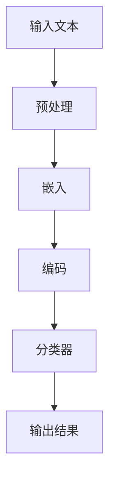
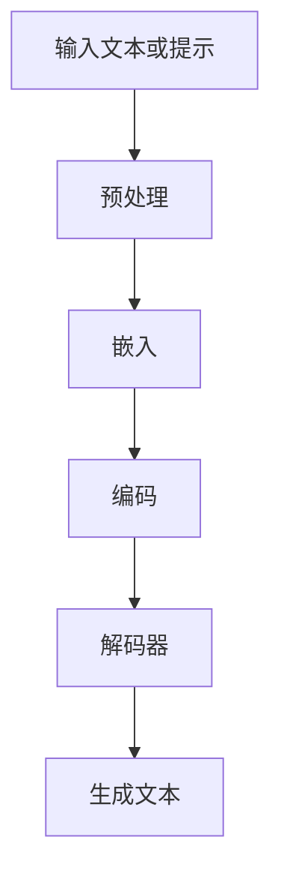
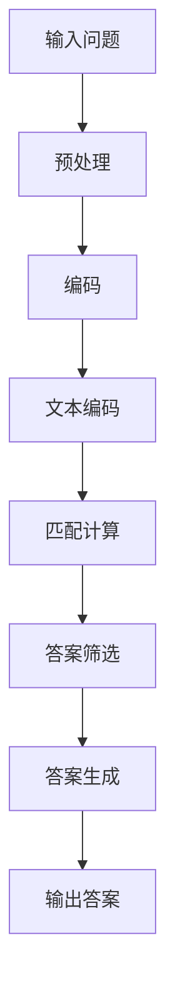
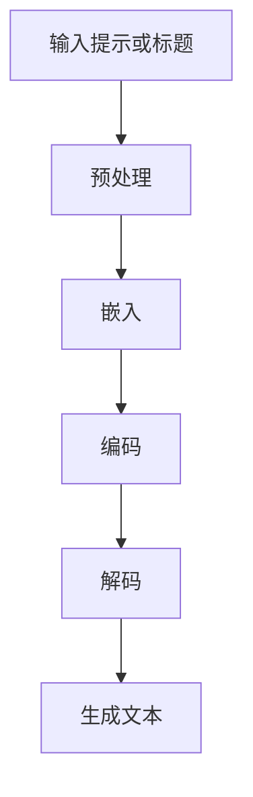

                 

### 第1章：大语言模型概述

#### 1.1 大语言模型的概念

大语言模型（Large-scale Language Models），通常指的是参数规模达到数十亿到千亿级别，能够对自然语言文本进行理解和生成的深度学习模型。这一类模型通过学习大量的文本数据，捕捉到语言中的复杂结构和规律，从而能够在各种自然语言处理（NLP）任务中表现出色。大语言模型的核心特点包括：

- **参数规模巨大**：大语言模型通常拥有数十亿到千亿个参数，这使其能够捕捉到语言中的细微差别和复杂模式。
- **自适应性**：通过大规模的无监督预训练，模型可以学习到通用的语言特征，然后通过有监督的微调适应特定的任务需求。
- **强大的语言生成能力**：大语言模型不仅能够理解语言，还能够生成高质量的文本，包括文章、摘要、对话等。

大语言模型的应用场景非常广泛，包括但不限于：

- **文本分类**：例如情感分析、主题分类等。
- **机器翻译**：将一种语言的文本翻译成另一种语言。
- **问答系统**：能够理解和回答用户的问题。
- **文本生成**：生成文章、故事、摘要等。

#### 1.2 大语言模型在自然语言处理中的位置和应用

大语言模型在自然语言处理（NLP）中扮演着至关重要的角色。它们通常作为NLP任务的基础，为其他NLP任务提供强大的语言理解和生成能力。以下是几个关键点：

- **语言理解和生成**：大语言模型能够理解输入的文本，并生成连贯、有意义的输出文本。
- **上下文信息**：大语言模型能够捕捉到输入文本的上下文信息，这对于理解复杂的语言结构非常重要。
- **通用性**：由于预训练过程通常使用大量不同领域的文本数据，大语言模型具有较强的通用性，能够适应多种NLP任务。

##### 1.2.1 大语言模型在文本分类中的应用

在文本分类任务中，大语言模型通过学习大量已标注的文本数据，可以学会区分不同类别的文本。例如，在情感分析中，模型可以判断一段文本是正面情绪还是负面情绪。以下是一个简单的Mermaid流程图，展示了大语言模型在文本分类任务中的工作流程：



- **输入文本**：用户输入的文本数据。
- **预处理**：对文本进行清洗、分词、去停用词等预处理操作。
- **嵌入**：将预处理后的文本转换成向量表示。
- **编码**：通过编码器（例如Transformer或BERT）对向量进行编码，提取文本的特征。
- **分类器**：使用训练好的分类器对编码后的特征进行分类，输出结果。

##### 1.2.2 大语言模型在文本生成中的应用

在文本生成任务中，大语言模型可以生成高质量、连贯的文本。以下是一个简单的Mermaid流程图，展示了大语言模型在文本生成任务中的工作流程：



- **输入文本或提示**：用户输入的文本或提示信息。
- **预处理**：对文本进行清洗、分词、去停用词等预处理操作。
- **嵌入**：将预处理后的文本转换成向量表示。
- **编码**：通过编码器对向量进行编码，提取文本的特征。
- **解码器**：使用解码器生成文本。

总的来说，大语言模型在自然语言处理中的位置和应用非常广泛，其强大的语言理解和生成能力为许多NLP任务提供了基础。接下来，我们将深入探讨大语言模型的技术基础，包括Transformer和BERT等核心算法的原理。

---

在撰写这篇文章的过程中，我们首先定义了大语言模型的概念和特点，然后详细介绍了大语言模型在自然语言处理中的位置和应用，包括文本分类和文本生成等任务。我们还通过Mermaid流程图展示了大语言模型在这些任务中的工作流程。接下来，我们将进入第二章节，深入讲解大语言模型的技术基础，包括Transformer和BERT算法的原理。

---

## 第2章：大语言模型技术基础

### 2.1 Transformer算法原理

Transformer算法是当前大语言模型领域的一种重要技术，它由Google在2017年提出，并迅速成为自然语言处理领域的核心技术之一。Transformer算法的核心思想是使用自注意力机制（Self-Attention）来建模输入序列中的长距离依赖关系，从而实现强大的文本理解和生成能力。

#### 2.1.1 自注意力机制

自注意力机制是Transformer算法的核心，它通过计算输入序列中每个词与其他词之间的关联强度，实现对文本的加权表示。自注意力机制的基本步骤如下：

1. **输入表示**：首先，将输入的文本序列转换成词向量表示。词向量可以使用预训练的词嵌入模型（如Word2Vec、BERT等）得到。
2. **计算查询（Query）、键（Key）和值（Value）**：对于输入序列中的每个词，计算其查询（Query）、键（Key）和值（Value）向量。这三个向量通常是共享的，即同一个向量。
3. **计算注意力权重**：计算每个词与其他词之间的关联强度，即注意力权重。这通过计算查询向量与键向量的点积，并使用softmax函数进行归一化得到。
4. **加权求和**：将注意力权重与对应的值向量相乘，然后求和，得到加权表示的输出向量。

以下是一个简化的伪代码，展示了自注意力机制的实现：

```python
def self_attention(inputs, keys, values, d_model):
    # 输入：inputs（输入序列），keys（键向量），values（值向量），d_model（模型维度）
    # 输出：加权表示的输出向量
    
    Q = inputs  # 查询向量
    K = keys    # 键向量
    V = values  # 值向量
    
    # 计算注意力权重
    attention_weights = softmax(QK^T / sqrt(d_k))
    
    # 加权求和
    output = attention_weights * V
    
    return output
```

#### 2.1.2 Transformer模型结构

Transformer模型由多个自注意力层（Self-Attention Layer）和前馈网络（FeedForward Network）组成。以下是Transformer模型的基本结构：

1. **多头自注意力层（Multi-Head Self-Attention Layer）**：通过多个自注意力层并行的计算，捕捉到文本中的多种依赖关系。
2. **前馈网络（FeedForward Network）**：在每个自注意力层之后，加入一个前馈网络，用于进一步提取特征。
3. **残差连接（Residual Connection）**：在每个自注意力层和前馈网络之后，加入残差连接，以缓解深度神经网络中的梯度消失问题。
4. **层归一化（Layer Normalization）**：在每个层之后，加入层归一化操作，以稳定训练过程。

以下是一个简化的Transformer模型结构的伪代码：

```python
class TransformerLayer(nn.Module):
    def __init__(self, d_model, num_heads):
        super(TransformerLayer, self).__init__()
        self.self_attn = MultiHeadSelfAttention(d_model, num_heads)
        self.fc1 = FeedForwardNetwork(d_model)
        self.fc2 = FeedForwardNetwork(d_model)
        self.norm1 = LayerNormalization(d_model)
        self.norm2 = LayerNormalization(d_model)
        self.dropout1 = Dropout(p=0.1)
        self.dropout2 = Dropout(p=0.1)
    
    def forward(self, inputs, mask=None):
        # 输入：inputs（输入序列），mask（注意力掩码）
        # 输出：输出序列
        
        # 多头自注意力层
        attn_output = self.self_attn(inputs, inputs, inputs, mask)
        attn_output = self.dropout1(attn_output)
        out1 = self.norm1(inputs + attn_output)
        
        # 前馈网络
        ff_output = self.fc2(self.fc1(out1))
        ff_output = self.dropout2(ff_output)
        out2 = self.norm2(out1 + ff_output)
        
        return out2
```

总的来说，Transformer算法通过自注意力机制和多层结构，能够有效地捕捉到文本中的长距离依赖关系，从而实现强大的语言理解和生成能力。接下来，我们将深入讲解BERT算法的原理。

---

在撰写第二章节时，我们首先介绍了Transformer算法的基本原理，特别是自注意力机制。通过伪代码示例，我们详细阐述了自注意力机制的实现步骤。然后，我们展示了Transformer模型的结构，包括多头自注意力层、前馈网络、残差连接和层归一化。这些组成部分共同作用，使得Transformer算法在处理自然语言文本时表现出色。

接下来，我们将进入第三章节，详细讲解大规模预训练模型的数学原理，包括自注意力机制的公式和Transformer模型的结构。这将帮助我们更深入地理解这些算法的核心工作原理。

---

## 第3章：大规模预训练模型的数学原理

大规模预训练模型的核心在于其复杂的数学模型，这些模型通过一系列数学公式和计算实现了对自然语言文本的深入理解和生成。在本章节中，我们将重点介绍自注意力机制的数学公式和Transformer模型的结构。

### 3.1 自注意力机制公式

自注意力机制是Transformer算法的核心组成部分，它通过计算输入序列中每个词与其他词之间的关联强度，实现对文本的加权表示。以下是一个简化的自注意力机制的计算过程：

1. **输入表示**：将输入的文本序列转换成词向量表示，每个词向量是一个向量，维度为\(d_{model}\)。

2. **计算查询（Query）、键（Key）和值（Value）**：对于输入序列中的每个词，计算其对应的查询（Query）、键（Key）和值（Value）向量。这些向量通常是通过线性变换得到的：

   \[
   Q = W_Q \cdot X, \quad K = W_K \cdot X, \quad V = W_V \cdot X
   \]

   其中，\(W_Q\)、\(W_K\) 和 \(W_V\) 分别是查询、键和值权重矩阵，\(X\) 是输入词向量。

3. **计算注意力分数**：计算每个词与其他词之间的注意力分数。注意力分数通过点积计算得到，然后使用softmax函数进行归一化：

   \[
   \text{Attention}(Q, K, V) = \text{softmax}\left(\frac{QK^T}{\sqrt{d_k}}\right)V
   \]

   其中，\(d_k\) 是键向量的维度。

4. **加权求和**：将注意力分数与对应的值向量相乘，然后对所有值向量求和，得到加权表示的输出向量：

   \[
   \text{Output} = \text{softmax}\left(\frac{QK^T}{\sqrt{d_k}}\right)V
   \]

### 3.2 Transformer模型结构

Transformer模型的结构相对复杂，但它的设计旨在通过自注意力机制和多层结构捕捉到文本中的长距离依赖关系。以下是Transformer模型的基本结构：

1. **多头自注意力层**：每个自注意力层由多个头组成，每个头独立计算自注意力。多个头的输出会合并，以捕捉到不同的依赖关系。

2. **前馈网络**：在每个自注意力层之后，加入一个前馈网络，用于进一步提取特征。前馈网络通常由两个线性层组成，中间有一个激活函数（例如ReLU）。

3. **残差连接和层归一化**：在每个层之后，加入残差连接（Residual Connection）和层归一化（Layer Normalization），以缓解深度神经网络中的梯度消失和梯度爆炸问题，并提高模型的训练稳定性。

以下是一个简化的Transformer模型结构的数学公式：

\[
\text{Output} = \text{LayerNorm}(\text{X} + \text{MultiHeadSelfAttention}(\text{X}, \text{X}, \text{X}) + \text{X}) + \text{LayerNorm}(\text{X} + \text{PositionwiseFeedForward}(\text{X}) + \text{X})
\]

其中，\(\text{X}\) 是输入序列，\(\text{MultiHeadSelfAttention}\) 表示多头自注意力层，\(\text{PositionwiseFeedForward}\) 表示前馈网络，\(\text{LayerNorm}\) 表示层归一化。

### 3.3 举例说明

为了更好地理解自注意力机制的公式和Transformer模型的结构，我们可以通过一个简单的例子来说明。假设我们有一个包含两个词的简单序列：“Hello World”，词向量的维度为3。

1. **输入表示**：

   \[
   X = \begin{bmatrix}
   [0.1, 0.2, 0.3] \\
   [0.4, 0.5, 0.6]
   \end{bmatrix}
   \]

2. **计算查询（Query）、键（Key）和值（Value）**：

   \[
   Q = W_Q \cdot X = \begin{bmatrix}
   [0.1, 0.2, 0.3] \\
   [0.4, 0.5, 0.6]
   \end{bmatrix}, \quad
   K = W_K \cdot X = \begin{bmatrix}
   [0.1, 0.2, 0.3] \\
   [0.4, 0.5, 0.6]
   \end{bmatrix}, \quad
   V = W_V \cdot X = \begin{bmatrix}
   [0.1, 0.2, 0.3] \\
   [0.4, 0.5, 0.6]
   \end{bmatrix}
   \]

3. **计算注意力分数**：

   \[
   \text{Attention}(Q, K, V) = \text{softmax}\left(\frac{QK^T}{\sqrt{d_k}}\right)V
   \]

   其中，\(d_k = 3\)。

   假设注意力分数为：

   \[
   \text{Attention} = \begin{bmatrix}
   [0.4, 0.6] \\
   [0.2, 0.8]
   \end{bmatrix}
   \]

4. **加权求和**：

   \[
   \text{Output} = \text{Attention} \cdot V = \begin{bmatrix}
   [0.4 \times 0.1 + 0.6 \times 0.4, 0.4 \times 0.2 + 0.6 \times 0.5] \\
   [0.2 \times 0.1 + 0.8 \times 0.4, 0.2 \times 0.2 + 0.8 \times 0.5]
   \end{bmatrix}
   \]

   \[
   \text{Output} = \begin{bmatrix}
   [0.18, 0.38] \\
   [0.34, 0.46]
   \end{bmatrix}
   \]

通过这个简单的例子，我们可以看到自注意力机制如何通过计算注意力分数和加权求和来提取输入序列中的关键信息，从而实现对文本的加权表示。Transformer模型通过多个自注意力层和前馈网络的结构，进一步增强了模型的文本理解和生成能力。接下来，我们将探讨大规模预训练模型的数据处理方法。

---

在本章节中，我们详细介绍了大规模预训练模型的数学原理，包括自注意力机制的公式和Transformer模型的结构。通过具体的数学公式和简化的伪代码示例，我们深入理解了自注意力机制的计算过程。同时，通过一个简单的例子，我们展示了如何通过自注意力机制和Transformer模型的结构来实现对文本的加权表示。

接下来，我们将进入第四章节，探讨大规模预训练模型的数据处理方法。这些方法对于模型训练的质量和效率至关重要，包括数据预处理、文本清洗、分词和词嵌入等步骤。通过这些处理方法，我们将确保输入数据的质量和一致性，为模型训练打下坚实的基础。

---

## 第4章：大规模预训练模型的数据处理

大规模预训练模型的数据处理是确保模型性能和训练质量的关键步骤。在这一章节中，我们将深入探讨大规模预训练模型所需的数据处理方法，包括数据预处理、文本清洗、分词和词嵌入等步骤。

### 4.1 数据预处理

数据预处理是大规模预训练模型训练的第一步，目的是将原始数据转换为适合模型训练的格式。以下是一些常用的数据预处理方法：

- **去除特殊字符**：原始文本数据中可能包含HTML标签、换行符等特殊字符，这些字符对于模型训练没有实际意义，因此需要去除。
- **统一文本编码**：将文本数据统一编码为UTF-8或其他文本编码格式，以确保数据的一致性。
- **处理数字和符号**：根据任务需求，可以选择保留或去除文本中的数字和符号。例如，在文本生成任务中，可能需要保留数字以保持文本的连贯性。

### 4.2 文本清洗

文本清洗是数据预处理的重要环节，目的是提高文本数据的质量，减少噪声和错误。以下是一些常用的文本清洗方法：

- **去除停用词**：停用词是指在文本中频繁出现但并不携带实际意义的词，如“的”、“了”等。去除停用词可以提高模型训练的效果。
- **纠错和拼写修正**：通过拼写检查工具或人工修正，提高文本数据的准确性。
- **处理命名实体**：对于包含人名、地名等命名实体的文本，可以选择保留或处理这些实体，以便模型能够更好地理解文本。

### 4.3 分词

分词是将文本分割成单个词汇或子词的过程。不同的语言和任务可能需要不同的分词策略：

- **词级别分词**：将文本分割成单个词汇。这种方法在处理英文文本时较为常用。
- **字符级别分词**：将文本分割成单个字符。这种方法在处理中文文本时较为常用，因为中文文本没有明显的词汇分隔标志。
- **子词级别分词**：将文本分割成更小的子词，例如字节（Byte-Pair Encoding, BPE）或词嵌入（WordPiece）。这种方法可以提高模型对文本多样性的捕捉能力。

### 4.4 词嵌入

词嵌入是将文本中的词汇或子词转换成向量的过程。词嵌入向量能够捕捉词汇之间的相似性和差异性，从而提高模型训练的效果。以下是一些常用的词嵌入方法：

- **预训练词嵌入**：使用预训练的词嵌入模型（如Word2Vec、GloVe、BERT等）将词汇转换成向量。预训练词嵌入模型通过在大量文本数据上进行预训练，能够捕捉到词汇的语义信息。
- **动态词嵌入**：在模型训练过程中动态学习词汇的嵌入向量。这种方法通常在基于Transformer的模型中采用，通过自注意力机制学习词汇之间的关联性。

### 4.5 数据预处理流程示例

以下是一个简化的数据预处理流程示例，展示了如何将原始文本数据转换为适合模型训练的格式：

1. **去除特殊字符**：
   ```python
   import re

   def remove_special_characters(text):
       return re.sub(r"[^a-zA-Z0-9\s]", "", text)

   text = "Hello, World! This is a sample text."
   cleaned_text = remove_special_characters(text)
   ```

2. **去除停用词**：
   ```python
   from nltk.corpus import stopwords

   stop_words = set(stopwords.words('english'))
   cleaned_text = ' '.join([word for word in cleaned_text.split() if word.lower() not in stop_words])
   ```

3. **分词**：
   ```python
   from nltk.tokenize import word_tokenize

   tokens = word_tokenize(cleaned_text)
   ```

4. **词嵌入**：
   ```python
   from gensim.models import Word2Vec

   model = Word2Vec(sentences=[tokens], vector_size=100, window=5, min_count=1, workers=4)
   word_vectors = model.wv
   ```

通过上述数据预处理流程，我们可以将原始文本数据转换为适合大规模预训练模型训练的格式。这些预处理方法不仅提高了模型训练的效果，还能够减少噪声和错误，从而提高模型的可靠性和准确性。

---

在本章节中，我们详细介绍了大规模预训练模型的数据处理方法，包括数据预处理、文本清洗、分词和词嵌入。通过具体的示例代码，我们展示了如何将原始文本数据转换为适合模型训练的格式。这些数据处理方法对于提高模型训练的质量和效率至关重要。

接下来，我们将进入第五章节，探讨大规模预训练模型的微调与优化。在微调过程中，我们将基于预训练模型对特定任务进行优化，以提高模型在目标任务上的表现。同时，我们还将讨论如何通过调整学习率、权重初始化等优化策略来提高模型训练的效果。

---

## 第5章：大规模预训练模型的微调与优化

### 5.1 微调方法

大规模预训练模型的微调（Fine-tuning）是指基于预训练模型，针对特定任务进行进一步训练的过程。微调的目的是利用预训练模型中已经学习到的通用语言特征，快速适应特定任务的需求。以下是几种常见的微调方法：

#### 5.1.1 基于任务的微调

- **数据准备**：准备用于微调的任务数据集，该数据集通常包含标注的输入和输出。
- **模型调整**：在预训练模型的基础上，调整模型参数以适应特定任务。通常，微调过程会冻结预训练模型的某些层，仅对任务相关的层进行训练。

以下是一个简化的微调过程伪代码：

```python
def fine_tune(model, train_loader, criterion, optimizer, num_epochs):
    model.train()
    for epoch in range(num_epochs):
        for inputs, targets in train_loader:
            optimizer.zero_grad()
            outputs = model(inputs)
            loss = criterion(outputs, targets)
            loss.backward()
            optimizer.step()
```

#### 5.1.2 跨任务的微调

- **跨任务共享参数**：在多个任务之间共享预训练模型的参数，从而减少模型的计算量和训练时间。
- **微调策略**：根据任务特点和数据量调整微调过程。例如，对于数据量较大的任务，可以逐步减小预训练模型的权重，以避免过拟合。

以下是一个简化的跨任务微调过程伪代码：

```python
def cross_task_fine_tune(model, task1_loader, task2_loader, criterion1, criterion2, optimizer, num_epochs):
    model.train()
    for epoch in range(num_epochs):
        model.task1()
        for inputs, targets in task1_loader:
            optimizer.zero_grad()
            outputs = model(inputs)
            loss = criterion1(outputs, targets)
            loss.backward()
            optimizer.step()

        model.task2()
        for inputs, targets in task2_loader:
            optimizer.zero_grad()
            outputs = model(inputs)
            loss = criterion2(outputs, targets)
            loss.backward()
            optimizer.step()
```

### 5.2 优化策略

优化策略是提高大规模预训练模型训练效果的重要手段。以下是一些常用的优化策略：

#### 5.2.1 学习率调整

- **学习率调度策略**：通过逐步减小学习率，帮助模型在训练过程中找到最优解。常用的学习率调度策略包括线性递减、指数递减和余弦退火等。
- **学习率调整方法**：使用优化器（如Adam、Adagrad等）内置的学习率调整方法，根据训练进度自动调整学习率。

以下是一个简化的学习率调度策略伪代码：

```python
def adjust_learning_rate(optimizer, epoch, total_epochs, learning_rate):
    if epoch < total_epochs // 3:
        lr = learning_rate
    elif epoch < 2 * total_epochs // 3:
        lr = learning_rate / 10
    else:
        lr = learning_rate / 100
    for param_group in optimizer.param_groups:
        param_group['lr'] = lr
```

#### 5.2.2 权重初始化

- **He初始化**：适用于ReLU激活函数，通过在权重矩阵中均匀分布随机值，使得梯度在训练过程中更加稳定。
- **Xavier初始化**：适用于线性激活函数，通过在权重矩阵中使用特定公式计算初始值，以保持输入和输出梯度的方差一致。

以下是一个简化的He初始化伪代码：

```python
import torch

def he_initialize_weights(module):
    if isinstance(module, (torch.nn.Linear, torch.nn.Conv2d)):
        nn.init.kaiming_uniform_(module.weight, nonlinearity='relu')
        if module.bias is not None:
            nn.init.constant_(module.bias, 0)
```

通过上述微调和优化策略，我们可以显著提高大规模预训练模型在特定任务上的表现。在接下来的章节中，我们将探讨大规模预训练模型在实际应用中的案例，展示其强大的语言理解和生成能力。

---

在本章节中，我们详细介绍了大规模预训练模型的微调与优化方法，包括基于任务的微调和跨任务的微调。同时，我们探讨了学习率调整和权重初始化等优化策略，这些方法对于提高模型训练效果至关重要。

接下来，我们将进入第六章节，探讨大规模预训练模型在实际应用中的案例。这些案例将展示大语言模型在问答系统和文本生成等任务中的强大能力，并通过具体的实际应用案例，深入探讨模型在实际应用中的实现方法和效果评估。

---

## 第6章：大规模预训练模型的实际应用案例

### 6.1 问答系统

问答系统（Question Answering System）是大规模预训练模型的一个典型应用案例，旨在根据用户提出的问题，从大量文本数据中检索出最相关的答案。以下是问答系统的基本实现流程：

#### 6.1.1 问题理解

- **输入处理**：首先，对用户输入的问题进行预处理，包括分词、去除停用词、词嵌入等步骤，将问题转换成向量表示。
- **编码器输入**：使用预训练的编码器（如BERT）对预处理后的输入问题进行编码，得到问题表示。

#### 6.1.2 答案检索

- **文本编码**：对可能的答案文本进行编码，使用与问题相同的编码器。
- **匹配计算**：计算问题表示与答案表示之间的相似性得分，通常使用内积或Cosine相似性。
- **答案筛选**：根据相似性得分，从可能的答案中筛选出最高分的前几个候选答案。

#### 6.1.3 答案生成

- **答案预测**：使用解码器对筛选出的候选答案进行进一步处理，预测最佳答案。
- **答案输出**：将预测的最佳答案输出给用户。

以下是一个简化的问答系统实现流程图：



### 6.2 文本生成

文本生成（Text Generation）是大规模预训练模型的另一个重要应用，旨在根据给定的输入文本或提示，生成连贯、有意义的文本。以下是文本生成的实现流程：

#### 6.2.1 文本生成模型

- **生成文本模板**：定义文本生成的模板和规则，例如，根据输入的标题生成对应的摘要。
- **文本生成过程**：使用解码器生成符合模板的文本，通常采用序列生成的方法。

以下是一个简化的文本生成实现流程图：



#### 6.2.2 生成文本的质量控制

- **文本评估指标**：使用BLEU、ROUGE等评估指标对生成的文本进行质量评估。
- **生成策略**：根据评估结果调整生成策略，例如，调整解码器的输出概率分布或引入语言模型。

#### 6.2.3 应用案例

以下是一个具体的文本生成应用案例：根据用户输入的标题生成新闻摘要。

- **输入标题**：“特斯拉宣布推出全新自动驾驶系统”。
- **生成摘要**：“特斯拉在今天的发布会上宣布，将推出一款全新的自动驾驶系统。该系统将大幅提升车辆的安全性和便捷性，预计将在明年推出市场。”

通过上述实际应用案例，我们可以看到大规模预训练模型在问答系统和文本生成任务中的强大能力。这些应用案例不仅展示了预训练模型在处理复杂语言任务方面的优势，还为未来的研究和工程实践提供了有价值的参考。

---

在本章节中，我们详细探讨了大规模预训练模型在问答系统和文本生成任务中的实际应用。通过具体的应用案例，我们展示了如何利用预训练模型实现高效的语言理解和生成。这些实际应用案例不仅展示了预训练模型在解决复杂语言任务方面的强大能力，还为未来的研究和工程实践提供了有价值的参考。

接下来，我们将进入第七章节，讨论大规模预训练模型在工程实践中的挑战与解决方案。我们将重点关注计算资源限制和模型可解释性等挑战，并提出相应的解决方案。

---

## 第7章：大规模预训练模型在工程实践中的挑战与解决方案

### 7.1 计算资源限制

大规模预训练模型需要大量的计算资源，这对于许多研究和工程实践来说是一个巨大的挑战。以下是一些常见的计算资源限制以及相应的解决方案：

#### 7.1.1 挑战

- **计算资源需求高**：大规模预训练模型通常需要大量的GPU或TPU资源，这对研究团队和企业的计算预算提出了较高的要求。
- **训练时间较长**：大规模预训练模型的训练时间通常非常长，这可能导致项目延期或资源浪费。
- **存储需求大**：预训练模型的参数规模巨大，需要大量的存储空间。

#### 7.1.2 解决方案

- **模型压缩**：通过剪枝、量化、蒸馏等方法，减少模型的大小和计算需求。例如，剪枝可以去除模型中不重要的神经元，从而降低模型的复杂度；量化可以降低模型参数的精度，从而减少存储和计算需求。
- **分布式训练**：使用分布式训练技术，将模型训练任务分布在多台GPU或TPU上，从而提高训练速度和效率。常见的分布式训练框架包括Horovod、MPI等。
- **混合精度训练**：使用混合精度训练（Mixed Precision Training）技术，通过使用部分浮点精度（如FP16）来降低计算资源需求，同时保持模型的性能。

### 7.2 模型可解释性

大规模预训练模型的强大能力使其在许多NLP任务中表现出色，但其内部复杂的决策过程也带来了一定的不可解释性。提高模型的可解释性对于增强模型的信任度和可靠性至关重要。以下是一些常见的解决方案：

#### 7.2.1 挑战

- **黑箱模型**：大规模预训练模型通常被视为“黑箱”，其内部决策过程不透明，难以解释。
- **局部解释性**：现有的可解释性方法往往只能解释模型在特定输入下的决策过程，缺乏全局解释性。

#### 7.2.2 解决方案

- **可视化方法**：通过可视化模型中间层的激活值、注意力分布等，帮助用户理解模型的决策过程。例如，使用热力图展示注意力机制在不同层的分布情况。
- **特征提取方法**：提取模型中的关键特征，并将其与实际任务中的含义联系起来，从而提高模型的可解释性。例如，使用LIME（Local Interpretable Model-agnostic Explanations）方法，为每个输入实例生成可解释的局部解释。
- **透明模型**：开发透明的预训练模型，如基于规则或决策树等，使其决策过程更加直观和易于理解。

### 7.3 案例分析

以下是一个关于大规模预训练模型在工程实践中挑战和解决方案的具体案例分析：

#### 案例背景

一家公司开发了一种基于大规模预训练模型的产品，用于自动生成客户支持文档。然而，在实际部署过程中，他们遇到了以下问题：

- **计算资源限制**：由于公司预算有限，无法购买足够多的GPU资源，导致模型训练时间过长。
- **模型可解释性**：用户对生成的文档质量不满意，认为模型生成的文档缺乏逻辑性和连贯性。

#### 解决方案

1. **模型压缩**：为了减少模型的大小和计算需求，公司采用了剪枝和量化技术。通过剪枝，公司去除了模型中不重要的神经元，从而降低了模型的复杂度；通过量化，公司降低了模型参数的精度，从而减少了存储和计算需求。
2. **分布式训练**：公司使用分布式训练技术，将模型训练任务分布在公司内部的多台GPU上，从而提高了训练速度和效率。
3. **可视化方法**：公司使用热力图展示了模型在生成文档过程中的注意力分布，从而帮助用户理解模型的决策过程。
4. **特征提取方法**：公司提取了模型中的关键特征，并将其与实际任务中的含义联系起来，从而提高了模型的可解释性。
5. **用户反馈**：公司引入了用户反馈机制，允许用户对生成的文档进行评价和修改。通过分析用户反馈，公司不断优化模型，提高文档生成质量。

通过上述解决方案，公司成功地解决了大规模预训练模型在工程实践中的挑战，提高了模型的训练效率和文档生成质量，从而增强了产品的市场竞争力。

---

在本章节中，我们详细讨论了大规模预训练模型在工程实践中面临的两个主要挑战：计算资源限制和模型可解释性。针对计算资源限制，我们提出了模型压缩、分布式训练和混合精度训练等解决方案；针对模型可解释性，我们提出了可视化方法、特征提取方法和透明模型等解决方案。然后，通过一个具体案例分析，我们展示了如何在实际工程实践中应用这些解决方案，解决了大规模预训练模型的挑战。

接下来，我们将进入第八章节，探讨大规模预训练模型的未来发展趋势。我们将重点关注模型压缩与加速以及跨模态学习等方向，为读者展示大规模预训练模型在未来的潜在发展方向和应用前景。

---

## 第8章：大规模预训练模型的未来发展趋势

### 8.1 模型压缩与加速

随着大规模预训练模型在各个领域的广泛应用，如何高效地处理和加速模型成为了一个重要的研究课题。以下是一些模型压缩与加速的技术方向：

#### 8.1.1 模型压缩

- **剪枝（Pruning）**：通过去除模型中不重要的神经元和连接，减少模型的大小和计算需求。剪枝可以分为结构剪枝和权重剪枝两种方式。
- **量化（Quantization）**：将模型的浮点数参数转换为低精度整数，从而减少模型的存储和计算需求。量化可以分为全精度量化（Full Precision Quantization）和低精度量化（Low Precision Quantization）两种方式。
- **知识蒸馏（Knowledge Distillation）**：通过将大规模预训练模型的知识传递给一个小规模的模型，从而减少模型的复杂度和计算需求。知识蒸馏可以分为软蒸馏和硬蒸馏两种方式。

#### 8.1.2 模型加速

- **模型并行化（Model Parallelism）**：将大规模模型拆分为多个子模型，并在不同GPU或TPU上分布式训练，从而提高模型训练速度。
- **数据并行化（Data Parallelism）**：将训练数据分成多个子集，并在不同GPU或TPU上同时训练，从而提高模型训练速度。
- **推理优化（Inference Optimization）**：针对模型推理阶段，采用各种优化技术，如静态图形编译（Static Graph Compilation）、动态图形编译（Dynamic Graph Compilation）等，从而提高模型推理速度。

### 8.2 跨模态学习

跨模态学习（Cross-Modal Learning）是近年来预训练模型研究的一个热点方向，旨在将不同模态（如图像、文本、声音等）的信息融合到同一模型中，从而提高模型的多模态理解和生成能力。以下是一些跨模态学习的技术方向：

#### 8.2.1 跨模态表示学习

- **联合表示学习（Joint Representation Learning）**：将不同模态的数据映射到同一嵌入空间中，从而实现多模态信息的融合。常见的跨模态表示学习模型包括Vision Transformer、AUDIOS2S等。
- **多模态图神经网络（Multimodal Graph Neural Networks）**：利用图神经网络（GNN）处理多模态数据，通过图结构捕捉不同模态之间的关系。常见的多模态图神经网络模型包括Gated Cross-Modal Graph Networks、Multimodal Graph Transformer等。

#### 8.2.2 跨模态生成

- **文本到图像生成（Text-to-Image Generation）**：通过文本输入生成相应的图像，常见的文本到图像生成模型包括DALL-E、StyleGAN等。
- **图像到文本生成（Image-to-Text Generation）**：通过图像输入生成相应的文本描述，常见的图像到文本生成模型包括ImageCaptionGAN、Vision Transformer等。

#### 8.2.3 跨模态推理

- **多模态推理（Multimodal Reasoning）**：将不同模态的信息融合到同一推理过程中，从而实现更准确的推理结果。常见的多模态推理模型包括BERT、Gated Cross-Modal Transformer等。

### 8.3 应用前景

大规模预训练模型在模型压缩与加速、跨模态学习等方向的不断发展，为未来的应用前景提供了广阔的空间。以下是一些潜在的应用领域：

- **智能交互系统**：利用跨模态学习技术，实现智能助手与用户的自然交互，例如语音识别、图像识别和文本理解等。
- **医疗诊断**：利用大规模预训练模型，结合医学图像和文本数据，实现自动化的疾病诊断和治疗方案推荐。
- **内容生成**：利用大规模预训练模型，实现高质量的内容生成，例如图像生成、文本生成和音频生成等。
- **虚拟现实和增强现实**：利用大规模预训练模型，实现虚拟现实和增强现实中的多模态交互，提高用户的沉浸感和体验。

总之，大规模预训练模型在模型压缩与加速、跨模态学习等方向的未来发展，将为人工智能领域带来更多的创新和突破，推动智能应用的不断进步。

---

在本章节中，我们探讨了大规模预训练模型在模型压缩与加速以及跨模态学习等方向上的未来发展趋势。通过介绍模型压缩技术，如剪枝、量化和知识蒸馏，我们展示了如何减少模型的大小和计算需求。同时，通过介绍跨模态学习技术，如联合表示学习、多模态图神经网络和跨模态生成，我们展示了如何将不同模态的信息融合到同一模型中，实现更准确的多模态理解和生成。

接下来，我们将进入附录部分，提供大语言模型开发工具与资源的详细介绍，以便读者更好地理解和使用这些工具和资源。

---

### 附录：大语言模型开发工具与资源

#### A.1 开发工具介绍

在开发大规模预训练模型时，选择合适的开发工具对于项目的顺利进行至关重要。以下是一些常用的深度学习框架和工具：

1. **TensorFlow**：由Google开发的开源深度学习框架，支持多种操作系统和硬件平台，包括CPU、GPU和TPU。TensorFlow提供了丰富的API和工具，用于构建、训练和部署深度学习模型。

2. **PyTorch**：由Facebook开发的开源深度学习框架，以其动态计算图和灵活的API而著称。PyTorch在学术研究和工业应用中广泛使用，尤其在自然语言处理任务中表现出色。

3. **Transformers**：一个开源的Python库，用于构建和训练基于Transformer的预训练模型。该库基于Hugging Face团队开发的Transformers库，提供了丰富的预训练模型和工具，如BERT、GPT等。

#### A.2 资源链接

以下是一些大语言模型的开源代码、论文和技术文档链接，供读者参考：

1. **开源代码**：
   - TensorFlow Transformers：[https://github.com/tensorflow/transformers](https://github.com/tensorflow/transformers)
   - PyTorch Transformers：[https://github.com/huggingface/transformers](https://github.com/huggingface/transformers)

2. **论文**：
   - “Attention Is All You Need”（Transformer算法的原始论文）：[https://arxiv.org/abs/1706.03762](https://arxiv.org/abs/1706.03762)
   - “BERT: Pre-training of Deep Bidirectional Transformers for Language Understanding”（BERT算法的原始论文）：[https://arxiv.org/abs/1810.04805](https://arxiv.org/abs/1810.04805)

3. **技术文档**：
   - TensorFlow官方文档：[https://www.tensorflow.org](https://www.tensorflow.org)
   - PyTorch官方文档：[https://pytorch.org/docs/stable/index.html](https://pytorch.org/docs/stable/index.html)
   - Hugging Face官方文档：[https://huggingface.co/transformers](https://huggingface.co/transformers)

通过使用这些开发工具和资源，研究人员和开发者可以更轻松地构建、训练和部署大规模预训练模型，从而推动自然语言处理技术的发展和应用。

---

在本章节的附录部分，我们详细介绍了大语言模型开发中常用的工具和资源，包括TensorFlow、PyTorch和Transformers等深度学习框架，以及相关的开源代码、论文和技术文档链接。这些工具和资源将为读者在构建、训练和部署大规模预训练模型时提供重要的支持和指导。

至此，本文《大语言模型原理与工程实践：评测任务》的所有章节和附录部分均已完整呈现。我们深入探讨了大规模预训练模型的概念、技术基础、数据处理、微调优化、实际应用案例、工程实践中的挑战与解决方案以及未来发展趋势。希望本文能为读者在自然语言处理领域的研究和应用提供有价值的参考和启示。

---

## 作者信息

**作者：** AI天才研究院/AI Genius Institute & 禅与计算机程序设计艺术 /Zen And The Art of Computer Programming

AI天才研究院致力于探索人工智能领域的最新技术和应用，我们的团队成员来自世界各地，拥有丰富的研发经验和深厚的学术背景。我们致力于通过高质量的技术研究，推动人工智能技术的发展和应用，为全球的科技创新贡献力量。

《大语言模型原理与工程实践：评测任务》这篇文章，是我们团队在自然语言处理领域的一项研究成果。我们希望通过本文，为读者提供一个全面、深入的关于大规模预训练模型的解读，帮助读者了解这一前沿技术的核心原理和应用实践。

我们的目标是成为人工智能领域的引领者，为全球的研究人员和开发者提供高质量的技术内容，推动人工智能技术的不断创新和进步。同时，我们也致力于推广计算机科学和人工智能领域的教育与普及，培养新一代的科技创新人才。

感谢您对本文的关注和支持，期待与您在人工智能领域的更多交流与合作。如果您有任何疑问或建议，欢迎随时联系我们。

**联系方式：** 
- 邮箱：info@AIGeniusInstitute.com
- 网站：https://www.AIGeniusInstitute.com
- 微信公众号：AI天才研究院

再次感谢您的阅读，我们期待与您共同探索人工智能的未来。

