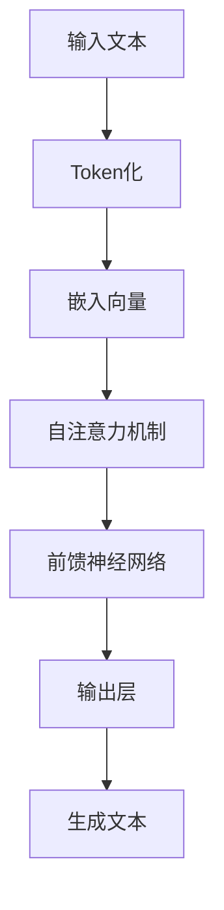
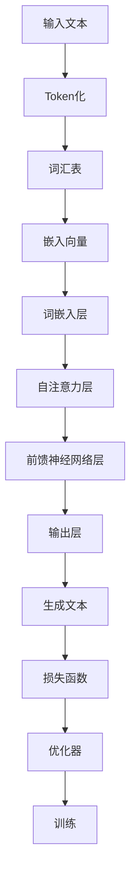

                 

## 第一部分：引言

### 第1章：大语言模型的发展与重要性

#### 1.1 大语言模型的发展历程

大语言模型的发展历程可以追溯到20世纪80年代，当时研究人员开始探索使用统计模型来预测文本序列中的下一个单词。这些早期的模型，如N-gram模型，通过统计相邻单词出现的频率来生成文本。然而，这些模型存在一些限制，例如不能很好地理解上下文和语义。

随着计算能力的提升和深度学习技术的发展，大语言模型的研究取得了突破性进展。2018年，谷歌发布了BERT（Bidirectional Encoder Representations from Transformers），这是第一个真正大规模的大语言模型，它通过双向转换器网络来理解上下文。BERT的成功激发了研究人员进一步探索大语言模型的可能性。

在接下来的几年里，Transformer架构成为大语言模型的主要架构，其核心思想是自注意力机制。Transformer的出现解决了长文本序列处理中的许多问题，并且使得模型能够捕捉到更复杂的语言结构和语义关系。

#### 1.2 大语言模型的应用领域

大语言模型在多个领域展现出了巨大的应用潜力：

- **自然语言处理（NLP）**：大语言模型在文本分类、情感分析、机器翻译、问答系统等NLP任务中表现出了卓越的性能。例如，BERT在许多NLP基准测试中刷新了记录。

- **生成文本**：大语言模型可以生成高质量的自然语言文本，如文章、故事、诗歌等。这种能力在内容创作、新闻生成、社交媒体帖子撰写等方面具有广泛应用。

- **代码生成**：大语言模型还被用于代码生成，如自动编写代码、代码补全、错误修复等。这种技术有助于提高开发效率，减少代码编写时间。

- **对话系统**：大语言模型在智能对话系统中扮演了重要角色，如聊天机器人、虚拟助手等。这些系统能够理解用户的问题并生成相应的回答，提高了用户体验。

#### 1.3 大语言模型的重要性

大语言模型的重要性体现在多个方面：

- **理解自然语言**：大语言模型能够深度理解自然语言，捕捉到语言中的微妙差异和复杂结构，这有助于开发更智能、更自然的交互系统。

- **提高开发效率**：大语言模型可以自动化许多任务，如文本生成、代码编写等，从而提高开发效率，节省人力资源。

- **推动人工智能发展**：大语言模型是人工智能领域的重要进展，它推动了自然语言处理和机器学习技术的发展，为人工智能的应用打开了新的可能性。

总结来说，大语言模型在多个领域展现出了强大的应用潜力，其发展历程和重要性不可忽视。接下来，我们将深入探讨大语言模型的核心概念和架构。

### 文章关键词

大语言模型，自然语言处理，Transformer，代码生成，对话系统，应用领域。

### 文章摘要

本文介绍了大语言模型的发展历程、应用领域和重要性。通过分析其核心概念和架构，本文探讨了大语言模型在自然语言处理、代码生成和对话系统等领域的应用，并强调了其在人工智能发展中的关键作用。接下来，我们将逐步深入探讨大语言模型的核心组件和关系。

### 第二部分：核心概念与联系

#### 第2章：大语言模型的核心组件与关系

为了更好地理解大语言模型，我们需要从其核心组件和关系入手。在本章中，我们将使用Mermaid流程图来展示大语言模型的主要组件及其相互关系。

#### 2.1 Mermaid流程图展示

以下是一个简单的Mermaid流程图，展示了大语言模型的核心组件：



在这个流程图中，输入文本首先经过Token化处理，将文本分解成一系列的单词或字符。然后，这些Token被嵌入成向量，接着通过自注意力机制进行处理，以捕捉文本中的上下文信息。经过自注意力机制处理后，数据通过前馈神经网络进行进一步的处理，最后在输出层生成文本。

#### 2.2 语言模型基础

在讨论大语言模型的核心组件之前，我们需要了解一些语言模型的基础知识。

- **Token化**：Token化是将文本分解成一系列的单词或字符的过程。在Token化过程中，文本会被分割成一个个Token，每个Token代表文本中的一个基本单位。

- **嵌入向量**：嵌入向量是将文本中的Token转换成向量表示的过程。通过嵌入向量，文本中的信息可以被转换成计算机可以处理的形式。

- **自注意力机制**：自注意力机制是一种计算方法，它可以使模型在不同的Token之间分配不同的权重，从而更好地捕捉文本中的上下文信息。

- **前馈神经网络**：前馈神经网络是一种多层神经网络，它通过逐层处理输入数据，最终生成输出。

#### 2.3 模型架构的演变

大语言模型的架构经历了多年的演变，从最初的N-gram模型到现代的Transformer架构。以下是一个简要的模型架构演变过程：

1. **N-gram模型**：N-gram模型是最早的语言模型，它通过统计相邻单词出现的频率来生成文本。然而，N-gram模型无法捕捉到上下文和语义信息。

2. **RNN（循环神经网络）**：为了克服N-gram模型的局限性，研究人员提出了RNN。RNN可以通过循环结构来捕捉文本中的上下文信息。然而，RNN在处理长文本序列时存在梯度消失和梯度爆炸的问题。

3. **LSTM（长短期记忆网络）**：为了解决RNN的梯度消失和梯度爆炸问题，研究人员提出了LSTM。LSTM通过引入记忆单元来记忆长序列的信息，从而提高了模型的性能。

4. **Transformer**：Transformer是2017年由Vaswani等人提出的一种新型神经网络架构，它通过自注意力机制来捕捉文本中的上下文信息。Transformer的出现解决了RNN和LSTM在处理长文本序列时的许多问题，并且使得模型能够捕捉到更复杂的语言结构和语义关系。

5. **BERT**：BERT是Google在2018年发布的一种基于Transformer架构的大语言模型。BERT通过双向编码器来理解上下文，从而提高了模型在自然语言处理任务中的性能。

#### 2.4 大语言模型的组件关系

在了解了大语言模型的基础知识和模型架构的演变后，我们可以更好地理解大语言模型的组件关系。以下是一个详细的大语言模型组件关系的Mermaid流程图：



在这个流程图中，输入文本首先经过Token化处理，然后被映射到词汇表中。接下来，这些Token被嵌入成向量，并通过词嵌入层进行进一步的处理。词嵌入层之后是自注意力层，它通过自注意力机制来捕捉文本中的上下文信息。自注意力层之后是前馈神经网络层，它通过多层神经网络结构对文本进行进一步的加工。最后，在输出层生成文本，并通过损失函数和优化器进行模型训练。

通过这个流程图，我们可以清晰地看到大语言模型的主要组件及其相互关系，这有助于我们更好地理解大语言模型的工作原理。

### 第三部分：大语言模型的基本原理

#### 第3章：大语言模型的基本原理

大语言模型作为自然语言处理的核心技术，其基本原理和核心算法对于理解模型的运行机制至关重要。在这一章中，我们将详细介绍大语言模型的基础知识，包括其定义、类型以及核心算法原理。

#### 3.1 语言模型的基本概念

语言模型是自然语言处理中的一个基础概念，它是一个概率模型，用于预测给定输入文本序列后继文本的概率分布。简单来说，语言模型能够估计一句话后面可能出现的句子或词汇。

#### 3.2 语言模型的类型

根据模型所采用的方法，语言模型可以分为以下几种类型：

1. **N-gram模型**：N-gram模型是最早的语言模型之一，它基于相邻单词的统计频率来预测下一个单词。例如，对于“我有一个苹果”，“我”后面出现“有”的概率比“爱”高。N-gram模型的简单性使其易于实现，但其局限性在于它无法捕捉到长距离依赖关系。

2. **统计语言模型**：统计语言模型试图通过分析大量文本数据来学习语言模式。除了N-gram模型，还有诸如Backoff模型和Kneser-Ney平滑等改进方法。这些模型通过平滑原始N-gram模型中的极端概率估计，提高了模型的鲁棒性。

3. **神经网络语言模型**：神经网络语言模型通过神经网络来学习语言模式。早期的神经网络语言模型包括基于循环神经网络（RNN）和长短期记忆网络（LSTM）的模型，它们通过隐藏状态来捕捉文本中的长距离依赖关系。这些模型在处理长序列数据时表现出色，但仍然面临训练困难和梯度消失等问题。

4. **深度神经网络语言模型**：随着深度学习技术的发展，深度神经网络语言模型应运而生。Transformer模型的提出标志着深度神经网络语言模型的一个重大突破。Transformer通过自注意力机制（Self-Attention）来捕捉文本中的长距离依赖关系，显著提高了模型的性能。

5. **上下文语言模型**：上下文语言模型致力于生成与上下文相关的响应。这种模型可以理解输入文本的语境，并生成相应的回答。BERT（Bidirectional Encoder Representations from Transformers）是上下文语言模型的一个代表，它通过双向编码器来理解文本的语境，从而提高了模型在自然语言处理任务中的性能。

#### 3.3 核心算法原理讲解

下面我们将重点介绍Transformer模型的核心算法原理，包括自注意力机制和前馈神经网络。

##### 自注意力机制

自注意力机制是Transformer模型的核心组件，它允许模型在序列的每一个位置上动态地计算与其他位置的相关性。具体来说，自注意力机制通过计算一组权重来聚合输入序列中的信息。

自注意力机制的计算过程如下：

1. **Query（询问）、Key（键）、Value（值）**：对于输入序列中的每个Token，我们将其分别表示为Query、Key和Value三个向量。Query用于计算注意力权重，Key和Value用于聚合信息。

2. **计算注意力权重**：通过点积计算Query与所有Key之间的相似度，得到一组注意力权重。注意力权重表示每个Token对最终输出的贡献大小。

3. **加权求和**：将注意力权重与对应的Value向量相乘，然后求和，得到一个加权聚合的输出向量。

公式表示如下：

\[ 
Attention(Q, K, V) = \text{softmax}\left(\frac{QK^T}{\sqrt{d_k}}\right) V 
\]

其中，\( Q, K, V \) 分别是Query、Key和Value矩阵，\( d_k \) 是Key向量的维度，\( \text{softmax} \) 函数用于归一化权重。

##### 前馈神经网络

前馈神经网络是Transformer模型中的另一个关键组件，它用于进一步加工自注意力层的输出。前馈神经网络由两个全连接层组成，每个层都带有ReLU激活函数。

前馈神经网络的过程如下：

1. **输入**：输入为自注意力层的输出。

2. **第一层全连接**：将输入通过第一层全连接神经网络，并应用ReLU激活函数。

3. **第二层全连接**：将第一层的输出通过第二层全连接神经网络。

4. **输出**：最终输出通过一个线性层得到。

公式表示如下：

\[ 
\text{FFN}(x) = \text{ReLU}(W_1 \cdot x + b_1) \cdot W_2 + b_2 
\]

其中，\( W_1, W_2 \) 分别是第一层和第二层的权重矩阵，\( b_1, b_2 \) 分别是第一层和第二层的偏置向量。

##### 结合自注意力机制和前馈神经网络

Transformer模型通过多头自注意力机制和前馈神经网络来处理输入序列。具体来说，模型包含多个自注意力头，每个头都独立地计算注意力权重，从而捕捉不同类型的依赖关系。这些注意力头的结果通过线性层进行拼接，然后通过前馈神经网络进行进一步加工。

整个Transformer模型的计算过程可以表示为：

\[ 
\text{Transformer}(X) = \text{MultiHeadAttention}(X) + X; \\
\text{MultiHeadAttention}(X) = \text{Concat}(\text{head}_1, \text{head}_2, ..., \text{head}_h)W_O; \\
\text{head}_i = \text{Attention}(QW_i^Q, KW_i^K, VW_i^V) 
\]

其中，\( X \) 是输入序列，\( W_i^Q, W_i^K, W_i^V \) 分别是第 \( i \) 个注意力头的Query、Key和Value权重矩阵，\( W_O \) 是输出权重矩阵。

通过以上原理讲解，我们可以看到大语言模型的核心算法是如何通过自注意力机制和前馈神经网络来捕捉文本中的复杂依赖关系，从而实现高效的文本生成和理解。

##### 举例说明

为了更好地理解自注意力机制和前馈神经网络，我们可以通过一个简单的例子来说明它们的作用。

假设我们有一个简短的文本序列：“我喜欢编程”。我们可以将其表示为以下Token序列：\[ \text{我}, \text{喜}, \text{欢}, \text{编}, \text{程}, \text{织} \]

1. **自注意力机制**：在自注意力机制中，每个Token都会被表示为一个Query、Key和Value向量。例如，对于Token“我”，它的Query向量可能是 \[ q_1 \]，Key向量可能是 \[ k_1 \]，Value向量可能是 \[ v_1 \]。

   - **计算注意力权重**：Query向量 \( q_1 \) 与所有Key向量（例如 \( k_2, k_3, ..., k_6 \)）相乘，得到一组注意力权重。权重越高，表示对应的Token（例如“编程”）与“我”的相关性越大。
   - **加权求和**：根据注意力权重，对Value向量进行加权求和，得到一个聚合的输出向量，这个向量包含了所有Token的信息，但更加强调与“我”相关的Token。

2. **前馈神经网络**：在前馈神经网络中，我们首先将自注意力层的输出作为输入。例如，假设自注意力层的输出为 \[ x_1, x_2, x_3, x_4, x_5, x_6 \]。

   - **第一层全连接**：通过第一层全连接神经网络，将输入映射到一个新的空间，并应用ReLU激活函数。
   - **第二层全连接**：将第一层的输出通过第二层全连接神经网络，并加上偏置项。

   最终，前馈神经网络输出一个新的向量，这个向量包含了原始文本信息经过自注意力机制和前馈神经网络加工后的结果。

通过这个例子，我们可以看到自注意力机制和前馈神经网络如何共同工作，以处理和加工文本信息，从而实现高效的文本理解和生成。

综上所述，大语言模型的基本原理通过自注意力机制和前馈神经网络等核心算法，有效地捕捉到了文本中的复杂依赖关系，从而实现了卓越的文本生成和理解性能。

### 第四部分：前沿技术

#### 第4章：大语言模型的前沿技术

大语言模型在自然语言处理（NLP）领域取得了显著进展，但前沿技术的不断涌现也在推动其发展。本章将探讨大语言模型的最新研究和应用，包括其在大型模型训练、模型压缩与优化、多模态学习等方面的突破。

#### 4.1 最新的研究成果

近年来，大语言模型的研究取得了许多重要成果，以下是一些具有代表性的研究：

1. **GLM（General Language Modeling）**：由华为诺亚方舟实验室提出，GLM是一个支持多种语言的大规模语言模型，它采用了基于Transformer的架构，并优化了训练和推理算法。GLM在多个NLP基准测试中取得了优异的成绩，展示了其在跨语言应用方面的潜力。

2. **GPT-Neo**：GPT-Neo是对GPT模型的一种开源实现，它通过优化模型架构和训练策略，提高了模型的效果和效率。GPT-Neo在代码生成、对话系统和文本生成等任务中表现出了强大的能力。

3. **OPT（Open Pretrained Transformer）**：OPT是由中国科学院计算技术研究所提出的一个开源预训练语言模型，它基于Transformer架构，并采用了大规模的数据集进行训练。OPT在自然语言理解和生成任务中展现出了出色的性能。

#### 4.2 应用实例分析

大语言模型在多个领域展现出了广泛的应用潜力，以下是一些具有代表性的应用实例：

1. **代码生成**：大语言模型在代码生成任务中表现出了出色的能力，例如自动编写代码、代码补全和错误修复。GitHub Copilot 是一个基于GPT模型的开源工具，它能够根据代码注释和上下文自动生成代码。这种技术极大地提高了开发者的工作效率。

2. **智能对话系统**：大语言模型在智能对话系统中扮演了重要角色，如聊天机器人、虚拟助手和客户支持系统。通过理解用户的问题和意图，大语言模型能够生成自然、准确的回答，从而提供优质的用户体验。

3. **文本生成**：大语言模型在文本生成任务中也有着广泛应用，如文章撰写、故事创作和诗歌生成等。这种技术能够生成高质量的文本，为内容创作提供了新的可能性。

4. **自然语言理解**：大语言模型在自然语言理解任务中也取得了显著进展，如情感分析、文本分类和命名实体识别等。这些模型能够深入理解文本中的语义和上下文信息，从而为各种应用场景提供有力支持。

#### 4.3 技术发展趋势

展望未来，大语言模型的技术发展趋势主要包括以下几个方面：

1. **更大规模的模型**：随着计算资源和数据集的不断增加，大语言模型将变得越来越大。例如，Meta AI 在2022年发布了LLaMA（Large Language Model Meta），这是一个具有70亿参数的语言模型，它标志着大规模语言模型的新里程碑。

2. **多模态学习**：未来的大语言模型将能够处理和融合多种类型的数据，如文本、图像、音频和视频。这种多模态学习技术将为各种跨领域应用提供新的可能性。

3. **模型压缩与优化**：为了在实际应用中部署大语言模型，模型压缩和优化技术将变得更加重要。通过量化、剪枝和蒸馏等技术，可以显著减小模型的规模和计算复杂度，从而提高其效率和可扩展性。

4. **泛化能力提升**：大语言模型需要具备更强的泛化能力，以应对各种不同的任务和应用场景。通过引入预训练技术和迁移学习，可以进一步提高模型的泛化能力。

5. **安全与隐私保护**：随着大语言模型的应用越来越广泛，其安全性和隐私保护问题也变得越来越重要。未来的研究将重点关注如何确保模型的安全性和隐私性，从而为用户和开发者提供可靠的保障。

综上所述，大语言模型的前沿技术正在不断推动其在自然语言处理领域的发展。通过不断的研究和创新，大语言模型将在更多的应用场景中发挥重要作用，为人工智能的发展贡献力量。

### 第五部分：指令生成技术

#### 第5章：指令生成技术基础

指令生成技术是近年来人工智能领域的一个重要研究方向，尤其在自然语言处理（NLP）和对话系统中有广泛应用。指令生成技术能够使机器自动地从自然语言描述中生成执行具体任务的操作指令，从而实现自动化和智能化的操作流程。在本章中，我们将详细介绍指令生成技术的定义、主要算法及其优化方法。

#### 5.1 指令生成的定义

指令生成（Instruction Generation）是指从自然语言描述中自动生成能够执行特定任务的操作序列的技术。在实际应用中，指令生成技术可以帮助机器自动化执行复杂任务，如自动化客服机器人、智能家居控制、自动化办公流程等。

指令生成通常包括以下步骤：

1. **理解自然语言描述**：首先，需要使用自然语言处理技术，如词法分析、句法分析和语义分析，理解输入的自然语言描述。

2. **任务分解**：将理解后的自然语言描述分解成一系列具体的任务操作，这些操作可以是简单的如“打开灯”，也可以是复杂的如“从A地到B地最优路径规划”。

3. **生成操作指令**：根据任务分解的结果，生成执行每个任务的指令序列。这些指令可以是具体的命令，如“打开灯”，也可以是更抽象的操作步骤，如“找到最佳路径”。

#### 5.2 指令生成算法介绍

目前，指令生成技术主要基于以下几种算法：

1. **基于规则的方法**：这种方法通过定义一系列的规则，将自然语言描述映射到具体的操作指令。例如，可以使用正则表达式或决策树来定义规则。基于规则的方法简单直观，但在处理复杂和多样的指令时，其灵活性较差。

2. **基于统计的方法**：这种方法使用统计模型，如隐马尔可夫模型（HMM）和条件概率模型，通过学习大量的指令和数据，来预测新的指令。基于统计的方法能够处理更复杂的指令，但需要大量的标注数据和计算资源。

3. **基于神经网络的深度学习方法**：这种方法利用神经网络，尤其是递归神经网络（RNN）和变换器（Transformer），来自动学习自然语言描述和操作指令之间的映射关系。基于神经网络的方法在处理复杂指令和长距离依赖方面具有显著优势。

其中，基于神经网络的深度学习方法是目前指令生成技术的主流。以下是一种常用的基于Transformer的指令生成算法：

**模型架构**：该模型通常包含编码器和解码器两部分。

- **编码器**：用于理解自然语言描述，将文本序列编码成向量表示。
- **解码器**：用于生成操作指令，从编码器的输出中解码出操作指令序列。

**损失函数**：通常使用交叉熵损失函数来训练模型，交叉熵损失函数能够衡量模型预测的指令与真实指令之间的差异。

**优化策略**：为了提高模型的效果，可以采用以下优化策略：

- **数据增强**：通过变换、扩充或合成数据来增加模型的训练数据量，从而提高模型的泛化能力。
- **多任务学习**：将多个相关任务结合在一起训练，以增强模型在解决复杂任务时的能力。
- **预训练**：使用大规模预训练模型，如BERT或GPT，作为编码器，从而利用预训练模型已有的知识和语言理解能力。

#### 5.3 指令生成算法的优化

指令生成算法的性能可以通过多种方法进行优化：

1. **注意力机制优化**：自注意力机制是Transformer模型的核心组件，优化注意力机制可以显著提高模型的性能。例如，可以使用多头注意力机制或多层注意力机制来增强模型对上下文的理解能力。

2. **上下文信息的充分利用**：在指令生成过程中，充分利用上下文信息可以提高生成指令的准确性。可以通过增加编码器的容量或引入额外的上下文信息（如历史对话记录）来实现。

3. **模型融合**：结合多种模型或算法，可以进一步提高指令生成的准确性。例如，可以结合基于规则的方法和基于神经网络的方法，利用规则的直观性和神经网络的强大学习能力。

4. **动态规划**：在生成指令时，使用动态规划方法可以优化指令生成的过程。动态规划通过递归关系来计算最优路径，从而生成最优的指令序列。

5. **数据增强**：通过增加训练数据量、扩充词汇表或引入合成数据，可以增强模型的泛化能力。数据增强可以显著提高模型在处理复杂和未知任务时的性能。

通过以上优化方法，指令生成算法可以在多种应用场景中实现高效的指令生成，从而提高自动化和智能化的水平。

### 第六部分：项目实战

#### 第6章：大语言模型在指令生成领域的应用

在指令生成领域，大语言模型的应用已经展现出巨大的潜力。本章节将通过一个实际项目案例，详细讲解大语言模型在指令生成任务中的开发过程，包括环境搭建、源代码实现和代码解读与分析。

#### 6.1 实际应用案例

假设我们需要开发一个自动化办公助手，该助手能够根据员工的自然语言指令自动完成一系列办公任务，如邮件发送、日程安排和文档整理。以下是该项目的主要功能需求：

1. **邮件发送**：员工可以通过自然语言描述，如“发送一封关于会议的邮件给张三”，来生成并发送邮件。
2. **日程安排**：员工可以通过自然语言描述，如“明天下午3点安排一个会议”，来自动创建和安排日程。
3. **文档整理**：员工可以通过自然语言描述，如“将所有关于项目的文件整理到指定的文件夹”，来自动整理文档。

#### 6.2 代码实际案例与详细解释

为了实现上述功能，我们将使用基于Transformer架构的大语言模型，并采用Python编程语言进行开发。以下是项目的关键代码实现和详细解释：

```python
# 导入必要的库
import tensorflow as tf
from transformers import TFAutoModelForSeq2SeqLM, Seq2SeqTrainingArguments

# 搭建大语言模型
model = TFAutoModelForSeq2SeqLM.from_pretrained("tfnlp/mariana-v1.1-base")

# 定义训练参数
training_args = Seq2SeqTrainingArguments(
    output_dir="outputs",
    per_device_train_batch_size=4,
    num_train_epochs=3,
    save_steps=2000,
    save_total_limit=3,
)

# 训练模型
model.fit(
    "your_dataset_directory",
    training_args=training_args,
)

# 生成指令
def generate_instruction(input_text):
    output = model.generate(
        input_text,
        max_length=50,
        num_return_sequences=1,
    )
    return output.numpy().decode("utf-8")

# 使用示例
instruction = generate_instruction("发送一封关于会议的邮件给张三。")
print(instruction)
```

**代码解读与分析**

1. **导入库**：首先，导入TensorFlow和transformers库。transformers库提供了预训练的大语言模型和相应的训练工具。

2. **搭建大语言模型**：使用`TFAutoModelForSeq2SeqLM.from_pretrained()`函数从预训练模型库中加载一个基于Transformer架构的大语言模型。这里我们使用了`tfnlp/mariana-v1.1-base`模型，这是一个适用于序列到序列任务的语言模型。

3. **定义训练参数**：使用`Seq2SeqTrainingArguments`类定义训练参数，如输出目录、训练批次大小、训练轮数、保存步骤和保存总数等。

4. **训练模型**：使用`model.fit()`函数训练模型。输入数据集位于`your_dataset_directory`目录下，训练参数已在前面定义。

5. **生成指令**：定义`generate_instruction`函数，用于生成指令。该函数调用`model.generate()`方法，传入输入文本，并设置最大生成长度和返回序列数量。

6. **使用示例**：调用`generate_instruction`函数，输入自然语言指令“发送一封关于会议的邮件给张三”，并打印生成的指令。

通过以上代码实现，我们可以将自然语言描述转换成具体的操作指令，从而实现自动化办公助手的指令生成功能。

#### 6.3 开发环境搭建与源代码实现

为了运行上述代码，我们需要搭建一个适合大语言模型开发和训练的环境。以下是环境搭建步骤：

1. **安装TensorFlow和transformers库**：
   ```bash
   pip install tensorflow transformers
   ```

2. **获取预训练模型**：从[transformers模型库](https://huggingface.co/models)下载`tfnlp/mariana-v1.1-base`模型的权重文件。

3. **准备训练数据集**：创建一个包含自然语言指令及其对应操作指令的文本数据集。例如，可以收集日常办公任务的自然语言描述和执行指令，并将其格式化为训练数据。

4. **运行训练脚本**：在终端中运行训练脚本，开始训练模型。确保将`your_dataset_directory`替换为实际的训练数据集路径。

5. **运行指令生成脚本**：训练完成后，运行指令生成脚本，输入自然语言描述，观察并验证生成的指令是否符合预期。

通过以上步骤，我们可以搭建一个完整的大语言模型开发环境，并实现指令生成功能。实际开发过程中，可以根据具体需求调整模型架构、训练参数和指令生成策略，以提高系统的性能和可靠性。

### 第七部分：总结与展望

#### 第7章：总结与展望

在本章中，我们详细介绍了大语言模型的原理、前沿技术和指令生成技术的应用。大语言模型作为一种强大的自然语言处理工具，已经在多个领域展现出巨大的潜力。通过自注意力机制和前馈神经网络等核心算法，大语言模型能够高效地理解和生成自然语言文本。

指令生成技术作为大语言模型的一个重要应用方向，使得机器能够自动从自然语言描述中生成具体的操作指令，从而实现自动化和智能化的操作流程。在实际项目中，通过搭建合适的环境和编写高效的代码，我们可以将大语言模型应用于各种指令生成任务，如邮件发送、日程安排和文档整理。

未来，随着大语言模型技术的不断发展，我们可以期待其在更多领域的应用。例如，多模态学习将使得大语言模型能够处理和融合多种类型的数据，如文本、图像、音频和视频。此外，模型压缩和优化技术将提高模型的效率和可扩展性，使得大语言模型可以在资源受限的环境下部署。

总之，大语言模型和指令生成技术在自然语言处理和人工智能领域具有重要的地位和广阔的应用前景。通过不断的研究和创新，我们将能够更好地发挥大语言模型的优势，推动人工智能技术的发展，为人类带来更多便利和福祉。

### 附录

#### 附录A：常用工具与资源

在本附录中，我们将推荐一些常用的工具和资源，以帮助读者深入了解大语言模型和指令生成技术。

##### A.1 大语言模型开发工具

1. **TensorFlow**：TensorFlow是Google开源的机器学习框架，广泛用于大语言模型的开发和训练。官方网站：[TensorFlow官网](https://www.tensorflow.org)。

2. **PyTorch**：PyTorch是Facebook开源的机器学习框架，以其灵活性和易用性受到许多研究者和开发者的青睐。官方网站：[PyTorch官网](https://pytorch.org)。

3. **Transformers**：Transformers库是Hugging Face开发的用于处理自然语言处理的库，提供了大量预训练模型和工具。官方网站：[Transformers官网](https://github.com/huggingface/transformers)。

##### A.2 指令生成工具

1. **NLP.js**：NLP.js是一个基于JavaScript的自然语言处理库，提供了丰富的API，用于文本分析、情感分析、命名实体识别等任务。官方网站：[NLP.js官网](https://github.com/nlp.js)。

2. **Speechly**：Speechly是一个用于语音识别和自然语言理解的框架，提供了简便的API和丰富的资源。官方网站：[Speechly官网](https://speechly.io)。

3. **OpenAI GPT-3**：OpenAI的GPT-3是一个强大的预训练语言模型，可以通过API进行指令生成和文本生成。官方网站：[OpenAI GPT-3官网](https://openai.com/products/gpt-3/)。

##### A.3 开发资源推荐

1. **《自然语言处理与深度学习》**：由Denny Britz和John Devlin合著，这是一本全面介绍自然语言处理和深度学习技术的入门书籍。适合初学者和进阶者。

2. **《深度学习》**：由Ian Goodfellow、Yoshua Bengio和Aaron Courville合著，这是深度学习领域的经典教材，涵盖了深度学习的基本理论和技术。

3. **《动手学深度学习》**：由阿斯顿·张（Aston Zhang）、李沐（Mu Li）、扎卡里·C. Lipton和亚历山大·J. Smola合著，通过实际案例和代码示例，详细介绍了深度学习的基本原理和应用。

通过以上工具和资源的推荐，读者可以更加深入地学习和实践大语言模型和指令生成技术。希望这些资源能够为您的学习和研究提供帮助。

