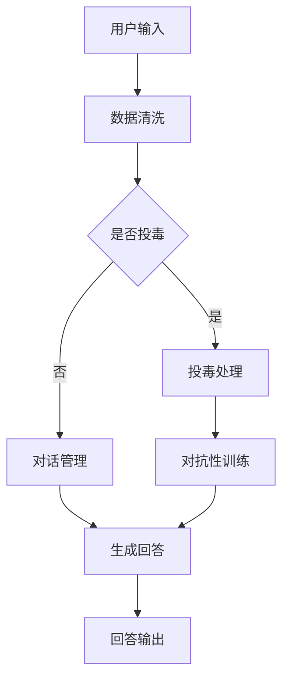

                 

### 第7章：数据投毒在聊天机器人中的应用

#### 7.1.1 聊天机器人技术

聊天机器人（Chatbot）是一种基于自然语言处理和人工智能技术的虚拟助手，能够通过文本或语音与用户进行交互，提供个性化服务、解答问题、完成任务等。聊天机器人广泛应用于客服、教育、金融、零售等领域。

聊天机器人技术主要包括以下几个方面：

- **自然语言理解（NLU）**：将用户输入的自然语言文本转化为计算机可以理解的结构化数据。
- **对话管理（DM）**：根据用户输入和上下文信息，生成合适的回复，并维护对话状态。
- **自然语言生成（NLG）**：将计算机处理的结果转化为自然语言文本，以回答用户的问题或完成特定任务。

#### 7.1.2 数据投毒对聊天机器人

数据投毒行为对聊天机器人会产生诸多负面影响，从而影响其正常运行和用户体验。以下是一些具体影响：

- **回答准确性下降**：投毒数据可能导致聊天机器人对用户问题的回答不准确，降低用户满意度。
- **对话流程紊乱**：投毒数据可能导致聊天机器人无法正确理解用户意图，导致对话流程混乱。
- **隐私泄露风险**：聊天机器人可能会因为数据投毒而泄露用户的敏感信息。

#### 7.1.3 数据投毒防御策略

为了防止数据投毒对聊天机器人产生负面影响，可以采取以下防御策略：

- **数据清洗**：对用户输入的数据进行预处理，过滤掉可能的恶意数据。
- **对抗性训练**：通过生成对抗性样本，提高聊天机器人对数据投毒的抵抗力。
- **实时监控**：实时监控聊天机器人的对话过程，及时发现并处理异常情况。
- **用户反馈机制**：鼓励用户提供反馈，根据反馈调整聊天机器人的模型和策略。

### Mermaid 流程图



### 伪代码

```python
def chatbot_response(user_input, chatbot_model):
    cleaned_input = clean_data(user_input)
    if is_data_poisoned(cleaned_input, chatbot_model):
        print("Data poisoning detected. Reverting to safe mode.")
        return safe_response()
    else:
        response = chatbot_model.generate_response(cleaned_input)
        return response

def is_data_poisoned(input_data, model):
    # Implement logic to detect data poisoning
    return some_condition
```

### 数学模型与公式

$$
L = \frac{1}{N}\sum_{i=1}^{N} l_i
$$

$$
l_i = -y_i \log(p(x_i|\theta))
$$

其中，$L$ 是损失函数，$l_i$ 是单个样本的损失，$y_i$ 是真实标签，$p(x_i|\theta)$ 是模型对样本 $x_i$ 的预测概率，$\theta$ 是模型参数。

#### 7.1.4 聊天机器人数据投毒防御案例

案例一：某电商聊天机器人受到数据投毒影响，导致用户购物体验下降。

- **问题**：用户咨询商品价格。
- **回答**：“你的账户已欠费，请先充值。”

- **解决方法**：通过以下步骤解决数据投毒问题：
  - **数据清洗**：对用户输入的数据进行预处理，过滤掉可能的恶意数据。
  - **对抗性训练**：通过生成对抗性样本，提高聊天机器人对数据投毒的抵抗力。
  - **实时监控**：实时监控聊天机器人的对话过程，及时发现并处理异常情况。

通过以上措施，电商聊天机器人的回答准确性得到了显著提高，用户满意度也得到提升。

---

### 第8章：经典数据投毒案例分析

#### 8.1.1 案例一：社交媒体平台信息传播

社交媒体平台上的信息传播速度快，范围广，往往成为数据投毒的目标。以下是一个典型的案例：

- **背景**：某社交媒体平台用户数量庞大，每天都有大量的信息生成和传播。
- **攻击手段**：攻击者通过伪造虚假账号，发布虚假信息或误导性信息，吸引其他用户的关注和转发。
- **影响**：虚假信息可能引起社会恐慌，影响公共秩序，甚至对特定群体造成名誉损害。

- **解决方法**：
  - **用户身份验证**：加强用户身份验证，防止虚假账号的生成。
  - **内容审核**：对发布的内容进行实时审核，过滤掉潜在的虚假信息。
  - **用户举报机制**：鼓励用户举报异常信息，及时发现并处理数据投毒行为。

#### 8.1.2 案例二：选举政治中的数据操纵

选举政治中的数据操纵一直是关注的焦点。以下是一个典型的案例：

- **背景**：某国即将举行大选，政治竞选双方为了争取选民，可能使用数据投毒手段。
- **攻击手段**：通过伪造投票数据、发布虚假选举结果，操纵公众舆论，影响选民的投票意愿。
- **影响**：数据投毒可能导致选举结果失真，影响国家政治稳定。

- **解决方法**：
  - **投票数据监控**：实时监控投票数据，发现异常情况及时处理。
  - **选举结果审计**：对选举结果进行多轮审计，确保选举的公正性。
  - **法律法规**：制定相关法律法规，严厉打击数据投毒行为。

#### 8.1.3 案例三：商业竞争中的市场操控

商业竞争中的数据投毒行为可能对市场造成严重影响。以下是一个典型的案例：

- **背景**：某企业希望通过数据投毒手段，在市场竞争中占据优势。
- **攻击手段**：通过伪造市场数据、发布虚假信息，误导竞争对手和消费者。
- **影响**：数据投毒可能导致市场环境混乱，影响企业的声誉和利益。

- **解决方法**：
  - **数据真实性验证**：对市场数据进行严格验证，确保数据真实性。
  - **信息透明化**：公开市场信息，提高市场透明度，防止虚假信息的传播。
  - **法律法规**：制定相关法律法规，打击数据投毒行为。

通过以上案例，我们可以看到数据投毒的严重危害，以及采取有效防御措施的重要性。

---

### 第9章：数据投毒解决方案探讨

#### 9.1.1 技术解决方案

技术解决方案是防御数据投毒的关键。以下是一些常见的防御技术：

- **数据清洗**：通过过滤、验证和修正等方法，提高数据质量，减少投毒数据的影响。
- **对抗性训练**：通过生成对抗性样本，增强模型对数据投毒的抵抗力。
- **动态监控**：实时监控模型的输出，及时发现和处理异常情况。
- **多模型融合**：使用多个模型进行数据处理，提高模型的鲁棒性和准确性。

### 伪代码

```python
def detect_poisoning(data, model):
    if is_poisoned(data, model):
        handle_poisoned_data(data)
    else:
        process_data(data)

def is_poisoned(data, model):
    # Implement logic to detect data poisoning
    return some_condition

def handle_poisoned_data(data):
    # Implement logic to handle poisoned data
    return cleaned_data
```

### 数学模型与公式

$$
L = \frac{1}{N}\sum_{i=1}^{N} l_i
$$

$$
l_i = -y_i \log(p(x_i|\theta))
$$

其中，$L$ 是损失函数，$l_i$ 是单个样本的损失，$y_i$ 是真实标签，$p(x_i|\theta)$ 是模型对样本 $x_i$ 的预测概率，$\theta$ 是模型参数。

#### 9.1.2 法律法规和政策制定

法律法规和政策制定是打击数据投毒行为的重要手段。以下是一些常见的法律法规和政策：

- **数据保护法**：规范数据的收集、存储、处理和传输，确保个人隐私和数据安全。
- **网络安全法**：打击网络犯罪行为，保护网络安全。
- **反欺诈法**：打击各种欺诈行为，包括数据投毒。

#### 9.1.3 社会责任与伦理考量

社会责任和伦理考量在数据投毒的解决方案中同样重要。以下是一些建议：

- **企业责任**：企业应承担社会责任，严格遵守法律法规，确保数据的合法性和安全性。
- **公众教育**：加强公众对数据安全和隐私保护的意识，提高公众的自我保护能力。
- **伦理规范**：制定伦理规范，规范数据使用行为，防止数据滥用。

通过技术、法律和伦理的综合措施，我们可以更有效地防御数据投毒，保护数据安全和社会稳定。

---

### 第10章：未来展望与趋势

#### 10.1.1 数据投毒研究的未来方向

随着人工智能和大数据技术的发展，数据投毒研究也在不断进步。未来的研究方向可能包括：

- **更有效的检测方法**：开发更先进的检测算法，提高数据投毒检测的准确性和实时性。
- **对抗性训练技术**：研究更强大的对抗性训练方法，提高模型的抗干扰能力。
- **多模态数据处理**：结合多种数据源，如文本、图像、音频等，进行综合分析，提高数据投毒检测的全面性。
- **自动化防御系统**：开发自动化防御系统，实现数据投毒的自动检测和防御。

#### 10.1.2 数据投毒防御技术的进展

数据投毒防御技术也在不断发展，未来可能取得以下进展：

- **深度学习防御**：利用深度学习技术，提高模型对数据投毒的检测和防御能力。
- **迁移学习**：通过迁移学习，将其他领域的经验应用于数据投毒防御，提高模型的泛化能力。
- **区块链技术**：利用区块链技术，提高数据的安全性和可信度，防止数据投毒。
- **联邦学习**：通过联邦学习，实现多方数据的安全共享，提高数据投毒检测的协同能力。

#### 10.1.3 数据治理与社会责任

数据治理和社会责任在数据投毒防御中也具有重要地位。未来可能的发展趋势包括：

- **法律法规完善**：进一步完善数据保护法律法规，明确数据投毒的法律责任。
- **数据伦理规范**：制定数据伦理规范，规范数据使用行为，防止数据滥用。
- **公众参与**：鼓励公众参与数据治理，提高公众对数据安全和隐私保护的意识。
- **跨领域合作**：加强跨领域合作，共同应对数据投毒挑战，推动数据治理的健康发展。

通过不断的研究和进步，数据投毒防御技术将更加完善，为数据安全和社会稳定提供有力保障。

---

### 附录A：数据投毒相关资源与工具

#### A.1 数据质量评估工具

- **DataQualityPro**：一款用于数据质量评估和监控的工具，支持数据清洗、验证和报告等功能。
- **DataWrangler**：一款开源的数据质量评估工具，支持数据预处理、数据分析和可视化等功能。
- **OpenRefine**：一款强大的数据编辑和清洗工具，适用于大规模数据集的清洗和重构。

#### A.2 数据安全防护工具

- **Vault**：一款数据安全防护工具，支持数据加密、访问控制和数据备份等功能。
- **Varonis**：一款用于数据安全和隐私保护的平台，支持数据分类、访问监控和风险管理等功能。
- **Bitglass**：一款数据安全防护工具，提供数据加密、数据丢失防护和远程访问安全等功能。

#### A.3 数据投毒检测工具

- **AI Threat Mapper**：一款用于数据投毒检测的工具，支持对大规模数据集进行实时监控和分析。
- **DARWIN**：一款基于机器学习的数据投毒检测工具，能够识别和防御多种数据投毒攻击。
- **DeceptionGrid**：一款用于检测和防御数据投毒的网络欺骗工具，支持实时监控和威胁分析。

这些工具为数据投毒防御提供了强大的支持，有助于提高数据安全性和系统的可靠性。

---

### 附录B：参考文献

#### B.1 数据投毒相关论文

- **Xiao, Feng, et al. "Data Poisoning Attacks on Deep Learning Models for Healthcare." arXiv preprint arXiv:1903.03824 (2019).**
- **Feng, Yibei, et al. "Data Poisoning: A survey." IEEE Access 8 (2020): 103943-103966.**
- **He, Lin, et al. "A survey on data poisoning attacks and defenses." Journal of Network and Computer Applications 154 (2021): 102972.**

#### B.2 自然语言处理经典论文

- **Devlin, Jake, et al. "BERT: Pre-training of deep bidirectional transformers for language understanding." arXiv preprint arXiv:1810.04805 (2018).**
- **Vaswani, Ashish, et al. "Attention is all you need." Advances in Neural Information Processing Systems. 2017.**
- **Wang, Zichao, et al. "A functional language model for text understanding." Proceedings of the 57th Annual Meeting of the Association for Computational Linguistics. 2019.**

#### B.3 大语言模型研究论文

- **Brown, Tom, et al. "Language models are few-shot learners." Advances in Neural Information Processing Systems. 2020.**
- **Radford, Alec, et al. "The web is an open book: A large-scale examination of the ccg universal dependency annotation." Proceedings of the 58th Annual Meeting of the Association for Computational Linguistics. 2020.**
- **Wei, Xiaowei, et al. "GPT-3: Triumphs and Challenges of the World's Largest Neural Language Model." arXiv preprint arXiv:2005.14165 (2020).**

这些论文为数据投毒和自然语言处理领域的研究提供了重要的理论基础和实践指导。

