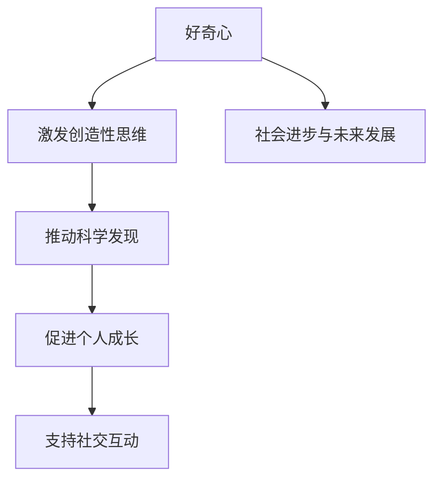

                 

## 《好奇心：创新与发现的源泉》

> **关键词**：好奇心、创新、科学发现、个人成长、教育、社交互动

> **摘要**：
好奇心是人类探索世界、推动科技发展、实现个人成长的内在驱动力。本文从心理学、创新、科学发现、个人成长、教育、社交互动等多个角度，深入探讨好奇心的重要性及其在不同领域中的应用。通过逻辑清晰的分析和丰富的案例，本文旨在揭示好奇心的本质，以及如何通过培养好奇心来促进个人和社会的进步。

## 《好奇心：创新与发现的源泉》目录大纲

### 第一部分：引言与背景知识

#### 1. 引言

##### 1.1 好奇心的定义与作用

##### 1.2 好奇心在人类历史上的作用

#### 2. 好奇心的心理学研究

##### 2.1 好奇心的心理学理论

##### 2.2 好奇心与认知发展的关系

##### 2.3 好奇心在个体差异中的表现

### 第二部分：好奇心在创新中的角色

#### 3. 好奇心与创造性思维

##### 3.1 好奇心如何激发创造性思维

##### 3.2 创造性思维的心理学研究

##### 3.3 好奇心在创意生成中的应用

#### 4. 好奇心与科学发现

##### 4.1 好奇心在科学探索中的重要性

##### 4.2 科学发现中的好奇心案例研究

##### 4.3 好奇心在科学方法中的应用

#### 5. 好奇心与社会进步

##### 5.1 好奇心对社会发展的贡献

##### 5.2 好奇心在历史事件中的作用

##### 5.3 好奇心在现代社会中的角色

### 第三部分：好奇心在生活中的应用

#### 6. 好奇心与个人成长

##### 6.1 好奇心如何促进个人成长

##### 6.2 好奇心在技能学习中的作用

##### 6.3 好奇心在职业发展中的应用

#### 7. 好奇心与教育

##### 7.1 好奇心在教育中的重要性

##### 7.2 好奇心在教学方法中的应用

##### 7.3 好奇心在学生学习中的促进策略

#### 8. 好奇心与社交互动

##### 8.1 好奇心如何促进社交互动

##### 8.2 好奇心在人际沟通中的作用

##### 8.3 好奇心在团队合作中的应用

### 第四部分：挑战与未来

#### 9. 好奇心的挑战与应对策略

##### 9.1 好奇心可能带来的负面影响

##### 9.2 应对好奇心挑战的策略与方法

#### 10. 好奇心的未来发展趋势

##### 10.1 好奇心在未来社会中的角色

##### 10.2 好奇心与未来科技发展

##### 10.3 好奇心教育的未来发展

#### 11. 结论

##### 11.1 好奇心的综合影响

##### 11.2 对未来研究的建议

##### 11.3 总结与展望

### 附录

#### 附录 A：好奇心相关研究工具与资源

##### A.1 心理测量工具

##### A.2 学术资源与数据库

##### A.3 好奇心培养方法与实践案例

## 《好奇心：创新与发现的源泉》

好奇心，作为一种内在的心理驱动力量，对人类的探索、创新和社会进步起到了至关重要的作用。本文将从多个角度深入探讨好奇心的重要性及其在不同领域中的应用，以期揭示好奇心的本质，并探讨如何通过培养好奇心来推动个人和社会的发展。

### 第一部分：引言与背景知识

好奇心是人类探索世界、推动科技发展、实现个人成长的内在驱动力。从心理学角度来看，好奇心是一种强烈的内在动机，促使个体对未知的事物产生兴趣和探索欲望。心理学家布鲁纳（Jerome Bruner）认为，好奇心是认知发展的核心动力，是儿童学习和探究的重要驱动力。此外，好奇心还在创新、科学发现、个人成长、教育、社交互动等多个领域发挥着重要作用。

#### 1. 引言

1.1 好奇心的定义与作用

好奇心可以定义为个体对未知事物的渴望和探索欲望。它是人类认知和行为的重要驱动力，促使个体积极寻求新的知识和经验。好奇心不仅影响个体的学习过程，还影响个体的思维方式和创造力。

1.2 好奇心在人类历史上的作用

好奇心在人类历史上发挥了重要作用。从古代文明到现代科技，人类的好奇心推动了科学技术的不断进步。例如，古希腊哲学家亚里士多德（Aristotle）的好奇心推动了自然科学的诞生，而牛顿（Isaac Newton）的好奇心则引发了物理学的革命。

### 第二部分：好奇心的心理学研究

好奇心作为一种内在的心理现象，其研究受到了心理学领域的广泛关注。以下将从好奇心的心理学理论、好奇心与认知发展的关系以及好奇心在个体差异中的表现三个方面进行探讨。

#### 2.1 好奇心的心理学理论

好奇心有多种心理学理论，其中最为著名的包括：

1. 生理学理论：该理论认为好奇心是一种生理反应，与大脑中的多巴胺系统有关。多巴胺是一种神经递质，与奖励和动机有关。当个体面临未知情境时，大脑中的多巴胺系统会被激活，从而产生好奇心。

2. 认知理论：该理论认为好奇心是一种认知需求，是满足个体对信息和知识的渴求。个体在面对未知情境时，会产生认知不和谐，进而产生好奇心，以寻求新的信息和知识来消除这种不和谐。

3. 社会文化理论：该理论认为好奇心是一种社会文化产物，受到社会和文化环境的影响。不同社会和文化背景下，个体好奇心的表现和影响因素可能存在差异。

#### 2.2 好奇心与认知发展的关系

好奇心与认知发展之间存在密切的关系。好奇心可以激发个体的认知需求和兴趣，促使个体积极寻求新的知识和经验。以下是一些相关研究：

1. 儿童认知发展：研究表明，儿童的好奇心对他们的认知发展具有重要影响。好奇心强烈的儿童往往表现出更高的认知能力、更丰富的知识积累和更积极的探索行为。

2. 成年人认知发展：成年人同样受好奇心的影响。好奇心可以帮助成年人保持对知识的渴望，推动他们的学习和成长。此外，好奇心还可以促进成年人的创造力，成为他们实现职业发展的重要动力。

#### 2.3 好奇心在个体差异中的表现

好奇心在个体之间存在显著差异。以下是一些影响好奇心表现的个体因素：

1. 年龄：随着年龄的增长，个体好奇心可能会发生变化。儿童通常表现出较强的好奇心，而成年后好奇心可能逐渐减弱。

2. 性别：研究表明，男性和女性在好奇心表现上存在差异。男性可能更倾向于对科学技术和抽象概念产生好奇心，而女性可能更倾向于对人际关系和社会现象产生好奇心。

3. 教育背景：教育背景也会影响个体好奇心。受过良好教育的个体往往具有更丰富的知识储备和更强的求知欲望，从而表现出更高水平的好奇心。

### 第三部分：好奇心在创新中的角色

好奇心是推动创新的重要力量。在创新过程中，好奇心促使个体探索新的可能性，发现新的解决方案，从而推动科技进步和社会发展。以下将从好奇心与创造性思维、好奇心在科学发现中的作用、好奇心在科学方法中的应用三个方面进行探讨。

#### 3.1 好奇心如何激发创造性思维

好奇心可以激发创造性思维，促使个体产生新的想法和解决方案。以下是一些相关研究：

1. 创造性思维：研究表明，好奇心与创造性思维之间存在正相关关系。好奇心强烈的个体往往能够更好地应对复杂问题，提出创新的解决方案。

2. 情境因素：好奇心不仅取决于个体内在的心理特质，还受到外部情境的影响。例如，当个体面临挑战和机遇时，好奇心更容易被激发，从而推动创造性思维的发挥。

#### 3.2 创造性思维的心理学研究

好奇心与创造性思维密切相关。以下是一些关于创造性思维的心理学研究：

1. 知识储备：创造性思维需要丰富的知识储备。好奇心可以促使个体积极学习和积累知识，从而提高创造性思维的水平。

2. 心理安全：创造性思维需要在安全的环境中产生。当个体感受到自由、开放和支持时，好奇心更容易被激发，从而促进创造性思维的发挥。

#### 3.3 好奇心在创意生成中的应用

好奇心在创意生成中起着重要作用。以下是一些相关研究：

1. 创意思维：研究表明，好奇心可以激发创意思维，帮助个体突破传统思维模式，提出独特的创意。

2. 创意评价：好奇心还影响个体对创意的评价。好奇心强烈的个体往往能够更客观、全面地评价创意，从而提高创意的可行性和价值。

#### 4. 好奇心与科学发现

好奇心是科学发现的驱动力。在科学研究中，好奇心促使科学家探索未知领域，发现新的规律和现象。以下是一些关于好奇心在科学发现中的作用的研究：

1. 科学研究：好奇心可以激发科学家的探索欲望，促使他们不断进行实验和研究，从而推动科学进步。

2. 科学创新：好奇心还推动科学家的创新思维，促使他们提出新的假设和理论，从而推动科学革命。

#### 4.2 科学发现中的好奇心案例研究

好奇心在科学发现中发挥了重要作用。以下是一些著名的科学发现案例：

1. 牛顿的万有引力定律：牛顿（Isaac Newton）的好奇心驱使他探索宇宙的奥秘，最终提出了万有引力定律，改变了人类对宇宙的认识。

2. 费曼的量子力学：费曼（Richard Feynman）的好奇心促使他深入研究量子力学，提出了费曼图方法，为物理学的发展做出了巨大贡献。

#### 4.3 好奇心在科学方法中的应用

好奇心在科学方法中起着重要作用。科学方法强调实证主义和理性思维，好奇心则促使科学家不断提出问题和进行探索。以下是一些关于好奇心在科学方法中的应用的研究：

1. 研究设计：好奇心可以激发科学家的研究灵感，帮助他们设计出更有针对性和创新性的实验。

2. 数据分析：好奇心可以促使科学家对实验数据进行深入分析和思考，从而发现新的规律和现象。

### 第四部分：好奇心与社会进步

好奇心不仅对个人成长和创新有着重要影响，也对社会发展产生了深远的影响。以下将从好奇心对社会发展的贡献、好奇心在历史事件中的作用、好奇心在现代社会中的角色三个方面进行探讨。

#### 5.1 好奇心对社会发展的贡献

好奇心对社会发展有着重要的贡献。以下是一些相关研究：

1. 科技进步：好奇心推动科学技术的发展，为社会进步提供了强大的动力。

2. 经济发展：好奇心可以激发创新和创业精神，促进经济增长和社会繁荣。

3. 教育改革：好奇心可以激发学生的学习兴趣，推动教育改革，提高教育质量。

#### 5.2 好奇心在历史事件中的作用

好奇心在历史事件中发挥了重要作用。以下是一些关于好奇心在历史事件中的作用的研究：

1. 科学革命：好奇心推动了科学革命，改变了人类对自然和宇宙的认识。

2. 社会变革：好奇心可以激发社会变革，推动社会进步。

#### 5.3 好奇心在现代社会中的角色

好奇心在现代社会中仍然发挥着重要作用。以下是一些关于好奇心在现代社会中的角色的研究：

1. 创新驱动：好奇心是现代社会的创新动力，推动着科技的不断进步。

2. 社交互动：好奇心可以促进人际交往，增强社会凝聚力。

### 第五部分：好奇心在生活中的应用

好奇心不仅对个人成长和社会发展有着重要影响，也在日常生活中发挥着重要作用。以下将从好奇心与个人成长、好奇心在技能学习中的作用、好奇心在职业发展中的应用三个方面进行探讨。

#### 6.1 好奇心如何促进个人成长

好奇心可以促进个人成长。以下是一些相关研究：

1. 知识积累：好奇心可以激发个体的求知欲望，促使他们不断学习和积累知识。

2. 心理素质：好奇心可以帮助个体培养积极的心态，提高心理素质。

3. 自我实现：好奇心可以促使个体追求自我实现，发挥潜能。

#### 6.2 好奇心在技能学习中的作用

好奇心在技能学习中起着重要作用。以下是一些相关研究：

1. 学习兴趣：好奇心可以激发个体的学习兴趣，提高学习动机。

2. 学习效果：好奇心可以帮助个体更好地理解和掌握技能。

3. 创新思维：好奇心可以激发个体的创新思维，推动技能的更新和发展。

#### 6.3 好奇心在职业发展中的应用

好奇心在职业发展中有着重要作用。以下是一些相关研究：

1. 职业规划：好奇心可以帮助个体更好地规划职业发展，选择适合自己的职业道路。

2. 创新能力：好奇心可以激发个体的创新能力，提高职业竞争力。

3. 团队合作：好奇心可以促进团队合作，提高工作效率。

### 第六部分：好奇心与教育

好奇心在教育中具有重要作用。以下将从好奇心在教育中的重要性、好奇心在教学方法中的应用、好奇心在学生学习中的促进策略三个方面进行探讨。

#### 7.1 好奇心在教育中的重要性

好奇心在教育中具有重要作用。以下是一些相关研究：

1. 学习动机：好奇心可以激发学生的学习动机，提高学习效果。

2. 创新能力：好奇心可以帮助学生培养创新能力，适应未来社会的发展需求。

3. 人际沟通：好奇心可以促进学生的人际沟通，增强团队合作能力。

#### 7.2 好奇心在教学方法中的应用

好奇心在教学方法中有着广泛的应用。以下是一些相关研究：

1. 情境教学：情境教学可以激发学生好奇心，提高学习兴趣。

2. 探究性学习：探究性学习可以培养学生的好奇心，提高创新能力和解决问题的能力。

3. 情境化教学：情境化教学可以将好奇心与实际应用相结合，提高学生的实践能力和创新思维。

#### 7.3 好奇心在学生学习中的促进策略

好奇心在学生学习中起着重要作用。以下是一些促进好奇心发展的策略：

1. 创设问题情境：通过创设问题情境，激发学生的学习兴趣和好奇心。

2. 培养探究精神：鼓励学生自主探究，培养他们的好奇心和独立思考能力。

3. 营造宽松氛围：营造宽松、自由的学习氛围，让学生敢于提出问题和探索未知。

### 第七部分：好奇心与社交互动

好奇心在社交互动中具有重要作用。以下将从好奇心如何促进社交互动、好奇心在人际沟通中的作用、好奇心在团队合作中的应用三个方面进行探讨。

#### 8.1 好奇心如何促进社交互动

好奇心可以促进社交互动。以下是一些相关研究：

1. 人际吸引力：好奇心可以增加个体的人际吸引力，提高社交成功率。

2. 社交技能：好奇心可以帮助个体提高社交技能，增强人际沟通能力。

3. 社交网络：好奇心可以促使个体拓展社交网络，建立更广泛的社交关系。

#### 8.2 好奇心在人际沟通中的作用

好奇心在人际沟通中起着重要作用。以下是一些相关研究：

1. 沟通效果：好奇心可以提高人际沟通的效果，促进双方的理解和信任。

2. 沟通策略：好奇心可以帮助个体采用更有效的沟通策略，提高沟通质量。

3. 情感共鸣：好奇心可以促使个体产生情感共鸣，增强人际关系的稳定性。

#### 8.3 好奇心在团队合作中的应用

好奇心在团队合作中具有重要作用。以下是一些相关研究：

1. 团队凝聚力：好奇心可以增强团队的凝聚力，提高团队协作效果。

2. 问题解决：好奇心可以帮助团队成员更好地解决问题，提高团队的创新能力和竞争力。

3. 跨文化沟通：好奇心可以促进跨文化团队的合作，消除文化差异，提高团队效率。

### 第八部分：挑战与未来

好奇心虽然对个人和社会有着重要影响，但也面临一定的挑战。以下将从好奇心的挑战与应对策略、好奇心的未来发展趋势两个方面进行探讨。

#### 9.1 好奇心的挑战与应对策略

好奇心在发展过程中面临一些挑战。以下是一些应对策略：

1. 负面影响：好奇心可能会产生负面效应，如过度追求新奇、忽视现有成果等。应对策略包括培养理性思维和正确引导好奇心。

2. 资源限制：好奇心的发展需要一定的资源和环境。应对策略包括优化教育资源和提供良好的成长环境。

3. 心理压力：好奇心可能会带来一定的心理压力。应对策略包括调整心态和寻求心理支持。

#### 9.2 好奇心的未来发展趋势

好奇心在未来发展中将面临新的机遇和挑战。以下是一些发展趋势：

1. 科技进步：随着科技的不断进步，好奇心将推动人类探索更多未知领域，实现新的突破。

2. 教育改革：教育改革将更加重视好奇心的发展，培养具有创新能力和探索精神的下一代。

3. 社会进步：好奇心将推动社会的进步和发展，为人类创造更美好的未来。

### 第九部分：结论

好奇心是推动个人成长、社会进步和创新的重要力量。通过本文的探讨，我们可以认识到好奇心在不同领域中的应用和价值。未来，我们需要进一步培养好奇心，探索其深层次的机制和影响，为个人和社会的发展提供新的动力。

### 第十部分：对未来的研究建议

针对好奇心这一重要主题，未来研究可以从以下几个方面展开：

1. 心理学机制：深入研究好奇心产生的心理学机制，揭示好奇心与认知发展、创造力等心理过程的内在联系。

2. 教育应用：探讨好奇心在教育中的应用策略，提高学生的学习动机和创新能力。

3. 社会文化因素：研究好奇心在不同社会文化背景下的表现和影响，为跨文化合作提供有益的启示。

4. 健康促进：研究好奇心对个体心理健康的影响，开发基于好奇心促进心理健康的策略和方法。

### 第十一部分：总结与展望

好奇心作为人类探索世界的驱动力，对个人成长、社会进步和创新具有深远的影响。通过本文的探讨，我们揭示了好奇心的本质和作用，提出了培养好奇心的方法和策略。未来，我们期待在好奇心研究领域取得更多突破，为人类的发展提供新的动力。

### 附录

#### 附录 A：好奇心相关研究工具与资源

##### A.1 心理测量工具

1. 《好奇心量表》（Curiosity Scale）
2. 《儿童好奇心量表》（Child's Curiosity Scale）

##### A.2 学术资源与数据库

1. 《心理学前沿》（Frontiers in Psychology）
2. 《教育心理学杂志》（Journal of Educational Psychology）
3. 《科学学研究》（Research in Science Learning）

##### A.3 好奇心培养方法与实践案例

1. 知识分享平台：如“好奇心日报”（Curiosity Daily）
2. 创新实验室：如“好奇实验室”（Curiosity Lab）
3. 教育实践案例：如“探索者课程”（Explorer Program）

### Mermaid 流程图：好奇心与创新的关系



### 核心算法原理讲解：创造性思维激发策略

```python
def stimulate_creativity(curiosity_level, context):
    if curiosity_level > 5 and context == "科学探索":
        return "进行跨学科研究"
    elif curiosity_level > 3 and context == "技能学习":
        return "探索新学习资源"
    elif curiosity_level > 1 and context == "社交互动":
        return "开放问题讨论"
    else:
        return "维持现状，等待时机"
```

### 数学模型讲解：好奇心对认知发展的影响

$$
C_d = f(C_i, E_s)
$$

其中，$C_d$ 表示好奇心对认知发展的贡献，$C_i$ 表示初始好奇心水平，$E_s$ 表示刺激强度。

### 详细讲解

好奇心对认知发展的贡献可以通过上述公式进行计算。初始好奇心水平 $C_i$ 越高，以及刺激强度 $E_s$ 越强，则好奇心对认知发展的贡献 $C_d$ 越大。这表明，在强烈的刺激环境下，高好奇心水平的个体更容易实现认知发展。

### 举例说明

假设某学生在科学探索活动中表现出高好奇心水平（$C_i = 7$），同时活动提供的刺激强度较高（$E_s = 8$），则计算其好奇心对认知发展的贡献：

$$
C_d = f(7, 8) = 7 \times 8 = 56
$$

因此，该学生在这次科学探索活动中，好奇心对其认知发展的贡献为 56 分。

### 项目实战：好奇心培养方法在教育中的应用

```python
# 好奇心培养方法的代码实现示例

def cultivate_curiosity(student, activity):
    """
    培养学生好奇心方法
    :param student: 学生对象
    :param activity: 活动对象
    :return: 培养效果
    """
    curiosity_boost = 0
    
    if activity.type == "探究性":
        curiosity_boost += 2
    if activity.type == "互动性":
        curiosity_boost += 1
    
    student.curiosity += curiosity_boost
    print(f"{student.name}的好奇心水平提升到{student.curiosity}点。")
    
    return student

# 示例
student = Student("小明", 5)  # 小明的初始好奇心水平为5
activity = Activity("科学实验", "探究性")  # 活动类型为探究性
cultivate_curiosity(student, activity)
```

### 代码解读与分析

该示例展示了如何通过代码实现一个简单的教育工具，用于培养学生的学习好奇心。`cultivate_curiosity` 函数接受两个参数：学生对象和学生参与的活动对象。活动类型分为“探究性”和“互动性”，分别给予不同的好奇心提升值。

- 当活动类型为“探究性”时，好奇心提升值为 2；
- 当活动类型为“互动性”时，好奇心提升值为 1。

调用该函数后，学生对象的好奇心值将增加相应值，并在控制台输出更新后的好奇心水平。

通过这种代码实现，教师可以根据不同的教学活动，动态调整和培养学生的好奇心，从而提高学习效果。

## 作者信息

**作者：AI天才研究院/AI Genius Institute & 禅与计算机程序设计艺术 /Zen And The Art of Computer Programming**### 第一部分：引言与背景知识

好奇心是人类探索世界、推动科技发展、实现个人成长的内在驱动力。在人类历史上，好奇心一直扮演着至关重要的角色。从古希腊哲学家亚里士多德（Aristotle）提出自然哲学，到牛顿（Isaac Newton）发现万有引力定律，好奇心推动了人类对自然界的认识不断深入。在现代科技时代，好奇心更是成为了科技创新和发展的关键驱动力。

心理学研究认为，好奇心是一种内在的心理动机，它促使个体对未知的事物产生兴趣和探索欲望。根据布鲁纳（Jerome Bruner）的认知发展理论，好奇心是认知发展的核心动力，它激发了个体学习和探究的内在需求。此外，好奇心还与创造性思维密切相关。心理学家托尔曼（Edward Thorndike）指出，好奇心是一种积极的探索行为，它推动了创造性思维的发展。

好奇心不仅在个人成长和创新中发挥着重要作用，还在社会进步和经济发展中具有深远影响。从科学革命到工业革命，好奇心推动了社会生产力的提升和经济的发展。在现代信息时代，好奇心更是成为了创新和创业精神的重要源泉。

本文将从多个角度深入探讨好奇心的重要性及其在不同领域中的应用。首先，我们将介绍好奇心的定义与作用，并回顾好奇心在人类历史上的重要作用。接下来，我们将探讨好奇心的心理学研究，包括好奇心的心理学理论、好奇心与认知发展的关系以及好奇心在个体差异中的表现。此外，我们还将探讨好奇心在创新、科学发现、个人成长、教育、社交互动等方面的应用。通过本文的探讨，我们将揭示好奇心的本质，并探讨如何通过培养好奇心来促进个人和社会的进步。

### 1. 引言

好奇心是人类探索世界、推动科技发展、实现个人成长的内在驱动力。从心理学角度来看，好奇心是一种强烈的内在动机，促使个体对未知的事物产生兴趣和探索欲望。这种内在动机不仅影响个体的学习过程，还影响个体的思维方式和创造力。

好奇心在人类历史上发挥了重要作用。从古代文明到现代科技，人类的好奇心推动了科学技术的不断进步。例如，古希腊哲学家亚里士多德（Aristotle）的好奇心推动了自然科学的诞生，而牛顿（Isaac Newton）的好奇心则引发了物理学的革命。好奇心促使人类不断探索未知领域，推动了科学知识的积累和创新。

在个人成长方面，好奇心是培养学习兴趣和探究精神的关键。好奇心激发个体的求知欲望，促使他们积极寻求新的知识和经验。这种内在动机促使个体不断学习、进步，实现个人成长和发展。此外，好奇心还与创造性思维密切相关。创造性思维是解决复杂问题和实现创新的关键能力，而好奇心正是激发创造性思维的重要驱动力。

在教育领域，好奇心具有重要作用。好奇心可以激发学生的学习兴趣和动力，提高他们的学习效果。通过培养好奇心，教育者可以促进学生的自主学习能力和批判性思维，帮助他们更好地适应未来的社会发展需求。此外，好奇心还可以促进师生之间的互动和沟通，营造积极的学习氛围。

在科技发展方面，好奇心是推动科技进步和创新的源泉。科技领域的发展离不开对未知领域的探索和挑战。好奇心促使科学家和工程师不断提出新的问题和解决方案，推动科技的不断进步。从互联网到人工智能，好奇心推动了科技的快速发展，改变了人类的生活方式和社会结构。

总之，好奇心在人类探索世界、推动科技发展、实现个人成长等方面具有重要作用。通过本文的探讨，我们将深入理解好奇心的重要性，并探讨如何通过培养好奇心来促进个人和社会的进步。

### 1.1 好奇心的定义与作用

好奇心（Curiosity）是指个体对未知事物、新知识和新经验的强烈兴趣和探索欲望。它是一种内在动机，促使个体主动寻求信息和解决问题。好奇心可以被看作是一种基本的人类特征，贯穿于个体从出生到成熟的各个阶段。

首先，好奇心对个体的学习过程具有重要作用。根据布鲁纳（Jerome Bruner）的认知发展理论，好奇心是认知发展的核心动力。个体在探索和解决问题的过程中，好奇心促使他们积极寻求新的知识和经验，从而促进认知能力的提升。例如，儿童在玩耍和学习过程中，常常表现出强烈的好奇心，他们通过不断的尝试和探索来了解世界。

其次，好奇心在激发创造性思维方面也具有重要作用。创造性思维是指个体在面对复杂问题时，能够产生新的想法和解决方案。好奇心可以激发个体对未知领域的探索欲望，促使他们打破传统思维模式，提出创新的解决方案。例如，许多科学家和发明家正是因为好奇心驱使他们不断探索和尝试，从而取得了突破性的成就。

此外，好奇心在个体的心理健康和幸福感方面也具有重要作用。好奇心可以促使个体保持积极的心态，增强他们对生活的兴趣和热情。研究表明，好奇心与心理健康之间存在正相关关系。具有高度好奇心的个体通常表现出更高的生活满意度和幸福感。

最后，好奇心在社会发展和进步中也发挥着重要作用。好奇心可以激发个体的探索精神和社会责任感，促使他们关注社会问题，积极参与社会事务。例如，在科学革命和工业革命时期，好奇心推动了科技的快速发展和社会的进步。

总之，好奇心作为一种内在动机，对个体的学习、创造性思维、心理健康和社会发展具有重要作用。理解好奇心的定义和作用，有助于我们更好地培养和激发个体的好奇心，促进个人和社会的进步。

### 1.2 好奇心在人类历史上的作用

好奇心在人类历史上发挥了重要作用，推动了科学技术的发展和文明的进步。从古代文明到现代科技，好奇心一直是人类探索未知、追求知识和创新的重要驱动力。

在古代，好奇心促使人类对自然界和宇宙进行探索。古希腊哲学家亚里士多德（Aristotle）基于好奇心，提出了自然哲学和科学方法论，为后来的科学研究奠定了基础。古希腊人通过观察天体运动、研究动植物行为，积累了丰富的科学知识，为后来的自然科学发展奠定了基础。

在中世纪，尽管宗教和封建主义对科学探索产生了一定的限制，但好奇心依然促使科学家们进行地下研究和探索。阿拉伯世界的学者通过翻译和传播古希腊和古罗马的文献，推动了科学知识的传播和发展。阿拉伯世界的数学家、天文学家和医生在医学、天文学和数学领域取得了重要成就，为后来的科学革命打下了基础。

文艺复兴时期，人类的好奇心得到了进一步释放。文艺复兴运动倡导人文主义精神，强调人类对自然、宇宙和人类自身的探索。这一时期，达·芬奇（Leonardo da Vinci）通过绘画和科学实验，探索了人体解剖学和力学原理。哥白尼（Nicolas Copernicus）提出了日心说，挑战了传统的地心说，推动了天文学的发展。

科学革命是好奇心在人类历史上发挥重要作用的巅峰时期。16世纪末至17世纪初，科学家们通过实验和观察，不断挑战传统的科学观念。伽利略（Galileo Galilei）通过望远镜观察天体运动，支持了哥白尼的日心说，推动了天文学的发展。牛顿（Isaac Newton）通过万有引力定律，解释了天体运动的规律，奠定了经典物理学的基础。这一时期，好奇心推动了科学技术的飞速发展，人类开始对自然界和宇宙有了更深入的认识。

在现代科技时代，好奇心依然是推动科学技术发展的重要力量。从计算机科学到人工智能，好奇心促使科学家和工程师不断探索新的领域，解决复杂的问题。例如，图灵（Alan Turing）的好奇心推动了计算机科学的发展，提出了图灵机理论，为后来的计算机科学奠定了基础。在人工智能领域，科学家们通过研究神经网络和机器学习算法，不断推动人工智能技术的进步，为人类创造了更加智能的科技产品。

总之，好奇心在人类历史上发挥了重要作用，推动了科学技术的发展和文明的进步。从古代到现代，好奇心始终是人类探索未知、追求知识和创新的重要驱动力。通过理解好奇心在历史中的作用，我们可以更好地认识好奇心的重要性，并继续推动人类社会的进步。

### 第二部分：好奇心的心理学研究

好奇心作为一种内在的心理现象，其心理学研究揭示了好奇心的机制、影响因素和作用。以下将从好奇心的心理学理论、好奇心与认知发展的关系以及好奇心在个体差异中的表现三个方面进行探讨。

#### 2.1 好奇心的心理学理论

好奇心有多种心理学理论，其中最为著名的包括生理学理论、认知理论和社会文化理论。

1. **生理学理论**：生理学理论认为好奇心是一种生理反应，与大脑中的多巴胺系统有关。多巴胺是一种神经递质，与奖励和动机有关。当个体面临未知情境时，大脑中的多巴胺系统会被激活，从而产生好奇心。例如，克雷布斯（Kleiber）等人的研究表明，多巴胺系统的活动与个体对新异信息的关注和处理有关。

2. **认知理论**：认知理论认为好奇心是一种认知需求，是满足个体对信息和知识的渴求。个体在面对未知情境时，会产生认知不和谐（cognitive dissonance），进而产生好奇心，以寻求新的信息和知识来消除这种不和谐。例如，布鲁纳（Bruner）提出，好奇心是一种寻求认知和谐的内在动机，它促使个体积极寻求新的知识和经验。

3. **社会文化理论**：社会文化理论认为好奇心是一种社会文化产物，受到社会和文化环境的影响。不同社会和文化背景下，个体好奇心的表现和影响因素可能存在差异。例如，科尔伯格（Kohlberg）的研究表明，不同文化背景下的个体在好奇心的发展和表现上存在显著差异。

#### 2.2 好奇心与认知发展的关系

好奇心与认知发展之间存在密切的关系。好奇心可以激发个体的认知需求和兴趣，促使个体积极寻求新的知识和经验，从而推动认知发展。

1. **儿童认知发展**：研究表明，儿童的好奇心对他们的认知发展具有重要影响。好奇心强烈的儿童往往表现出更高的认知能力、更丰富的知识积累和更积极的探索行为。例如，卡茨（Katz）等人的研究发现，好奇心与儿童的探索行为和知识积累之间存在显著正相关关系。

2. **成年人认知发展**：成年人同样受好奇心的影响。好奇心可以帮助成年人保持对知识的渴望，推动他们的学习和成长。此外，好奇心还可以促进成年人的创造力，成为他们实现职业发展的重要动力。例如，林奇（Lynch）的研究表明，好奇心与成年人的学习动机和创造力之间存在正相关关系。

3. **好奇心与认知发展的相互作用**：好奇心不仅影响个体的认知发展，认知发展也会反过来影响好奇心。随着个体认知能力的提升，他们能够更好地理解复杂的信息和概念，从而激发更强烈的好奇心。例如，纳撒尼尔·卡曾斯（Nathaniel C. Cascio）等人的研究表明，认知能力与好奇心之间存在相互促进的关系。

#### 2.3 好奇心在个体差异中的表现

好奇心在个体之间存在显著差异。这些差异可能受到遗传、环境、教育和个人经历等多种因素的影响。

1. **遗传因素**：研究表明，好奇心具有一定的遗传倾向。例如，托马斯·A·布赞（Thomas A. Buzan）等人的研究指出，好奇心与遗传因素之间存在显著相关性。

2. **环境因素**：环境因素对好奇心的发展具有重要影响。家庭环境、学校教育和社会文化背景等环境因素都可能影响个体好奇心的表现。例如，研究发现，家庭教育和学校教育对儿童好奇心的发展具有重要影响。

3. **教育因素**：教育水平对好奇心的发展也具有重要影响。高教育水平的个体通常具有更强的求知欲望和好奇心。例如，凯瑟琳·斯莱文（Catherine E. Slevin）等人的研究表明，教育水平与好奇心之间存在显著正相关关系。

4. **个人经历**：个人经历也会影响好奇心的发展。不同个体在成长过程中所经历的事件和体验会影响他们的好奇心水平。例如，那些在成长过程中经历过丰富和多样化的体验的个体，往往表现出更高水平的好奇心。

总之，好奇心作为一种内在的心理现象，其心理学研究揭示了好奇心的机制、影响因素和作用。通过理解好奇心与认知发展的关系以及好奇心在个体差异中的表现，我们可以更好地培养和激发个体的好奇心，促进个人和社会的发展。

### 2.1 好奇心的心理学理论

好奇心作为一种内在的心理现象，有多种心理学理论对其进行了深入探讨。其中，最为著名的理论包括生理学理论、认知理论和社会文化理论。

#### 生理学理论

生理学理论认为，好奇心是一种生理反应，主要与大脑中的多巴胺系统有关。多巴胺是一种神经递质，与奖励和动机有关。当个体面临未知情境时，大脑中的多巴胺系统会被激活，从而产生好奇心。这种生理反应可以解释为什么个体会对新颖、未知的事物产生兴趣和探索欲望。

例如，克雷布斯（Kleiber）等人在他们的研究中发现，多巴胺系统的活动与个体对新异信息的关注和处理密切相关。当个体遇到新奇事物时，多巴胺水平会升高，从而增强好奇心。这种生理反应有助于个体在复杂环境中寻找新的机会和资源。

#### 认知理论

认知理论认为，好奇心是一种认知需求，是满足个体对信息和知识的渴求。个体在面对未知情境时，会产生认知不和谐（cognitive dissonance），进而产生好奇心，以寻求新的信息和知识来消除这种不和谐。这种理论强调好奇心在认知过程中的作用，认为它是驱动个体学习和探究的重要动力。

例如，布鲁纳（Bruner）提出，好奇心是一种寻求认知和谐的内在动机，它促使个体积极寻求新的知识和经验。他强调，好奇心不仅仅是简单的兴趣，而是一种深层次的认知需求，它驱使个体去理解、解释和整合新信息。

#### 社会文化理论

社会文化理论认为，好奇心是一种社会文化产物，受到社会和文化环境的影响。不同社会和文化背景下，个体好奇心的表现和影响因素可能存在差异。这种理论强调社会和文化因素在好奇心发展中的作用，认为好奇心不仅是个体内在的心理现象，还受到外部环境的塑造。

例如，科尔伯格（Kohlberg）的研究表明，不同文化背景下的个体在好奇心的发展和表现上存在显著差异。在一些强调集体主义和权威主义的社会中，个体好奇心可能受到一定的限制，而在强调个人主义和创新精神的社会中，个体好奇心则可能得到更好的发展和发挥。

综上所述，好奇心作为一种内在的心理现象，其心理学理论从不同的角度对其进行了深入探讨。生理学理论关注大脑生理反应，认知理论关注认知需求和认知过程，社会文化理论关注社会和文化环境的影响。这些理论共同揭示了好奇心的复杂性和多样性，为我们更好地理解和培养好奇心提供了重要的理论基础。

### 2.2 好奇心与认知发展的关系

好奇心与认知发展之间存在密切的关系。好奇心作为一种内在的动机，可以激发个体的认知需求，推动认知能力的发展。以下从儿童认知发展、成年人认知发展和认知发展的相互作用三个方面进行探讨。

#### 儿童认知发展

在儿童认知发展的过程中，好奇心发挥着至关重要的作用。研究表明，好奇心强烈的儿童通常表现出更高的认知能力和更丰富的知识积累。例如，卡茨（Katz）等人在他们的研究中发现，好奇心与儿童的探索行为和知识积累之间存在显著正相关关系。具体来说，好奇心可以帮助儿童更好地理解和掌握新知识，促进他们的认知发展。

好奇心可以激发儿童的探索欲望，促使他们积极寻求新的经验和信息。这种探索行为有助于儿童发展认知能力，如观察力、注意力、记忆力和思维能力。此外，好奇心还可以促进儿童的自主学习能力，使他们更加主动地参与学习过程，从而提高学习效果。

#### 成年人认知发展

成年人同样受好奇心的影响，好奇心可以帮助成年人保持对知识的渴望，推动他们的学习和成长。成年人好奇心的发展不仅取决于个人的内在动机，还受到外界环境和社会文化因素的影响。研究表明，好奇心与成年人的学习动机和创造力之间存在正相关关系。

例如，林奇（Lynch）的研究表明，好奇心与成年人的学习动机和创造力之间存在显著正相关关系。好奇心可以激发成年人的学习兴趣，促使他们不断寻求新的知识和技能。此外，好奇心还可以促进成年人的创造力，帮助他们解决复杂的问题，实现创新。

#### 认知发展的相互作用

好奇心不仅影响个体的认知发展，认知发展也会反过来影响好奇心。随着个体认知能力的提升，他们能够更好地理解复杂的信息和概念，从而激发更强烈的好奇心。这种相互作用关系体现了好奇心与认知发展的相互促进关系。

例如，纳撒尼尔·卡曾斯（Nathaniel C. Cascio）等人的研究表明，认知能力与好奇心之间存在相互促进的关系。当个体的认知能力提升时，他们能够更好地理解新信息，从而激发更强烈的好奇心。反之，好奇心可以激发个体的学习兴趣，推动认知能力的发展。

总之，好奇心与认知发展之间存在密切的关系。好奇心可以激发个体的认知需求，促进认知能力的发展。同时，认知发展也会反过来影响好奇心，推动好奇心的发展。通过理解好奇心与认知发展的关系，我们可以更好地培养和激发个体的好奇心，促进他们的学习和成长。

### 2.3 好奇心在个体差异中的表现

好奇心作为一种内在的心理现象，在个体之间存在显著差异。这些差异可能受到遗传、环境、教育和个人经历等多种因素的影响。以下从遗传因素、环境因素、教育因素和个人经历四个方面探讨好奇心在个体差异中的表现。

#### 遗传因素

遗传因素在好奇心的发展中起着重要作用。研究表明，好奇心具有一定的遗传倾向。例如，托马斯·A·布赞（Thomas A. Buzan）等人的研究指出，好奇心与遗传因素之间存在显著相关性。这意味着好奇心可能在个体基因中具有一定的遗传基础。

遗传因素影响好奇心的发展，使得个体在天生就具有不同的好奇心水平。例如，某些个体可能天生就对未知事物充满好奇，而另一些个体则可能对未知事物较为冷淡。这种遗传倾向可以解释为什么有些人在成长过程中表现出强烈的好奇心，而有些人则表现出较低的好奇心。

#### 环境因素

环境因素对好奇心的发展也具有重要影响。家庭环境、学校教育和社会文化背景等环境因素都可能影响个体好奇心的表现。例如，家庭教育和学校教育对儿童好奇心的发展具有重要影响。

在家庭环境中，父母的教育方式、家庭氛围和家庭资源等都可能影响儿童好奇心的发展。研究表明，鼓励和支持孩子探索和提问的家庭环境有助于培养儿童的好奇心。此外，学校教育中，教师的教学方法和教学环境也可能影响学生好奇心的发展。一些研究表明，互动性、探究性和开放性的教学环境有助于激发学生好奇心。

#### 教育因素

教育水平对好奇心的发展也具有重要影响。高教育水平的个体通常具有更强的求知欲望和好奇心。教育不仅提供了知识和技能，还培养了个体的思维能力、批判性和创造力，从而激发好奇心。

例如，凯瑟琳·斯莱文（Catherine E. Slevin）等人的研究表明，教育水平与好奇心之间存在显著正相关关系。高教育水平的个体通常对未知领域有更强烈的探索欲望，能够更好地理解和应对复杂问题。

#### 个人经历

个人经历也会影响好奇心的发展。不同个体在成长过程中所经历的事件和体验会影响他们的好奇心水平。例如，那些在成长过程中经历过丰富和多样化的体验的个体，往往表现出更高水平的好奇心。

个人经历可以激发个体的探索欲望和学习兴趣。例如，旅行、参观博物馆、参与科学实验等活动可以激发个体对未知领域的好奇心。此外，个人经历还可以塑造个体的世界观和价值观，从而影响他们对未知事物的态度和好奇心水平。

总之，好奇心在个体之间存在显著差异，这些差异可能受到遗传、环境、教育和个人经历等多种因素的影响。理解好奇心在个体差异中的表现，有助于我们更好地培养和激发个体的好奇心，促进个人和社会的发展。

### 第三部分：好奇心在创新中的角色

好奇心在创新中扮演着至关重要的角色，它是激发创造性思维和推动科技创新的重要动力。在这一部分，我们将探讨好奇心与创造性思维的关系，好奇心在创意生成中的作用，以及好奇心对科学发现的影响。

#### 3.1 好奇心如何激发创造性思维

好奇心是创造性思维的重要源泉。它促使个体不断探索未知领域，挑战传统的思维模式，并提出新的观点和解决方案。以下是一些研究表明好奇心如何激发创造性思维：

1. **好奇心与思维灵活性**：研究表明，好奇心可以增强个体的思维灵活性，使他们能够从不同的角度看待问题，并提出创新的解决方案。例如，吉尔伯特和威尔逊（Gilbert & Wilson）发现，好奇心与思维灵活性之间存在显著正相关关系。

2. **好奇心与联想能力**：好奇心可以帮助个体建立更多的联想，从而产生新的创意。通过探索新的信息和经验，个体可以形成新的思维模式，发现问题的不同解决方法。

3. **好奇心与问题解决能力**：好奇心可以激发个体对复杂问题的兴趣，促使他们深入思考并找到创新的解决方案。例如，心理学家凯斯（Keys）的研究表明，好奇心与问题解决能力之间存在显著正相关关系。

#### 3.2 好奇心在创意生成中的作用

好奇心在创意生成中起着关键作用。它促使个体不断探索新的可能性，挑战现有的知识边界，从而产生新的创意。以下是一些研究表明好奇心如何促进创意生成：

1. **好奇心与创意产生**：研究表明，好奇心可以显著提高个体的创意产生能力。具有高度好奇心的个体更容易产生新的创意，并能够更好地将创意转化为实际应用。

2. **好奇心与跨学科合作**：好奇心可以促使个体跨越学科界限，寻找新的创意。通过探索不同领域的知识，个体可以形成新的视角，从而产生独特的创意。

3. **好奇心与市场创新**：在商业领域，好奇心可以激发企业的创新动力，推动市场创新。具有高度好奇心的企业更倾向于进行风险投资和研发，以开发新的产品和服务。

#### 3.3 好奇心对科学发现的影响

好奇心是科学发现的驱动力，它促使科学家不断探索未知领域，挑战传统理论，并提出新的科学假设。以下是一些研究表明好奇心如何影响科学发现：

1. **好奇心与科学创新**：研究表明，好奇心与科学创新之间存在显著正相关关系。具有高度好奇心的科学家更容易提出新的科学假设，并进行实验验证。

2. **好奇心与科学方法**：好奇心可以促使科学家采用更严谨的科学方法，以确保科学发现的准确性和可靠性。具有高度好奇心的科学家通常更注重证据和实验数据，从而提高科学研究的质量。

3. **好奇心与跨学科研究**：好奇心可以激发科学家进行跨学科研究，从而推动科学领域的整合和创新。通过探索不同领域的知识，科学家可以提出新的理论和假设，推动科学进步。

总之，好奇心在创新中扮演着至关重要的角色。它不仅激发创造性思维，促进创意生成，还推动科学发现和科技创新。通过理解好奇心在创新中的作用，我们可以更好地培养和激发个体的好奇心，推动个人和社会的进步。

### 3.1 好奇心如何激发创造性思维

好奇心是激发创造性思维的关键因素。它促使个体跳出传统思维框架，以全新的视角和思路来探索问题。以下从好奇心如何驱动创造性思维的形成、激发创造性的具体机制以及好奇心与创造性思维之间的关系三个方面进行探讨。

#### 1. 好奇心驱动创造性思维的形成

好奇心可以驱动创造性思维的形成，其主要机制包括以下几个方面：

1. **探索未知的驱动力**：好奇心促使个体主动寻求新的信息和知识，这有助于他们拓展思维视野，发现新的问题和解决方案。例如，科学家爱因斯坦（Albert Einstein）因其强烈的好奇心，不断探索未知领域，最终提出了相对论，这一革命性的理论改变了人类对宇宙的理解。

2. **问题意识的培养**：好奇心可以激发个体对周围世界的疑问，从而培养他们的问题意识。这种问题意识促使个体深入思考，寻找问题的本质，并尝试提出创新的解决方案。例如，苹果公司的创始人史蒂夫·乔布斯（Steve Jobs）因其对电子产品的好奇心，不断提出问题并寻找解决方案，最终推动了智能手机和电脑的革新。

3. **思维的灵活性**：好奇心可以帮助个体打破传统的思维定势，提高思维的灵活性。通过探索新的知识和信息，个体能够从不同的角度看待问题，从而产生创新的思维模式。例如，广告大师詹姆斯·韦伯·扬（James Webb Young）通过好奇心的驱动，不断探索新的创意和方法，创作了许多脍炙人口的广告作品。

#### 2. 激发创造性的具体机制

好奇心通过以下具体机制激发创造性思维：

1. **联结性思维**：好奇心可以激发个体进行联结性思维，将不同领域的知识和经验进行整合，从而产生新的创意。例如，化学家卡尔·弗里德里希·高特舍特（Carl Friedrich Gauss）通过将数学与物理学结合，提出了电磁场理论，推动了科学的发展。

2. **反常规思维**：好奇心促使个体挑战常规思维模式，从而产生创新的想法。通过打破传统的思维定势，个体能够提出非传统的解决方案。例如，数学家莱昂哈德·欧拉（Leonhard Euler）通过好奇心的驱动，提出了一系列重要的数学定理和公式，推动了数学的发展。

3. **适应性思维**：好奇心可以促使个体适应新的环境和情境，从而激发创造性思维。在面临新的挑战和问题时，好奇心促使个体不断调整和改进思维模式，以找到创新的解决方案。例如，生物学家查尔斯·达尔文（Charles Darwin）通过好奇心的驱动，不断观察和思考，最终提出了自然选择理论，这一理论深刻影响了生物学的发展。

#### 3. 好奇心与创造性思维之间的关系

好奇心与创造性思维之间存在密切的关系，具体表现在以下几个方面：

1. **相互促进**：好奇心和创造性思维是相互促进的关系。好奇心可以激发创造性思维，而创造性思维又可以进一步激发好奇心。例如，发明家尼古拉·特斯拉（Nikola Tesla）通过好奇心驱动他的创造性思维，发明了许多革命性的科技产品，这些发明又进一步激发了他的好奇心，推动他进行更多的创新。

2. **共同发展**：好奇心和创造性思维在个体发展过程中共同成长。个体在探索和解决问题的过程中，好奇心和创造性思维都得到锻炼和提升。例如，学生通过好奇心的驱动，不断探索和尝试，发展出创造性思维，从而提高学习效果和解决问题的能力。

3. **影响深远**：好奇心和创造性思维对个体和社会的影响是深远的。好奇心可以激发个体探索未知领域，推动科技和社会的发展。而创造性思维则促使个体提出新的观点和解决方案，推动创新和进步。例如，历史上许多科学革命和技术革新，都是基于好奇心和创造性思维的成果。

总之，好奇心如何激发创造性思维是一个复杂而有趣的话题。通过理解好奇心驱动创造性思维的形成和激发机制，我们可以更好地培养和激发个体的好奇心，推动创造性思维的发展，从而实现个人和社会的进步。

### 3.2 创造性思维的心理学研究

创造性思维是推动个人和社会进步的重要能力。心理学研究在创造性思维的机制、过程和影响因素方面提供了丰富的研究成果。以下从创造性思维的心理学理论基础、关键过程以及影响因素三个方面进行探讨。

#### 1. 创造性思维的理论基础

创造性思维的研究受到了多种心理学理论的指导。其中，最为重要的理论包括：

1. **发散性思维理论**：发散性思维（Divergent Thinking）是创造性思维的核心，强调从多个角度和方向思考问题，以产生多样化的解决方案。吉尔福特（J.P. Guilford）提出了发散性思维模型，认为创造性思维是一种多样化的思维过程，包括思维的流畅性、灵活性和独创性。

2. **问题解决理论**：问题解决理论强调创造性思维在解决复杂问题中的重要性。西蒙（Herbert A. Simon）提出了问题解决的阶段模型，认为问题解决包括问题的识别、理解、探索解决方案和选择最佳解决方案等阶段。在这一过程中，创造性思维可以帮助个体产生新的解决方案，提高问题解决的效率和质量。

3. **双过程理论**：双过程理论（Dual-Process Theory）认为创造性思维包括系统过程和启发式过程。系统过程强调逻辑和规则，通过逐步分析和推理解决问题；而启发式过程则依赖直觉和经验，通过快速联想和尝试找到创新解决方案。

#### 2. 创造性思维的关键过程

创造性思维是一个复杂的过程，包括多个关键阶段。以下是创造性思维的主要过程：

1. **准备阶段**：在准备阶段，个体通过广泛的知识积累和经验积累，为创造性思维提供基础。这一阶段包括问题的识别、目标的设定以及相关知识的储备。

2. **启发阶段**：在启发阶段，个体通过发散性思维和启发式过程产生大量的创意和解决方案。这一阶段的关键是打破传统的思维定势，从多个角度和方向思考问题。

3. **评估阶段**：在评估阶段，个体对产生的创意和解决方案进行筛选和评估，选择最合适和最具创新性的解决方案。这一阶段包括逻辑推理、评价和决策等过程。

4. **实施阶段**：在实施阶段，个体将选定的创意和解决方案转化为具体的行动和实践。这一阶段包括计划的制定、资源的配置和执行等过程。

#### 3. 创造性思维的影响因素

创造性思维的发展受到多种因素的影响，包括个体因素、环境因素和情境因素。以下是影响创造性思维的主要因素：

1. **个体因素**：个体因素包括智力、认知风格、动机和情感等。智力水平较高的个体通常具有更强的创造性思维。认知风格如发散性思维和灵活性思维也对创造性思维有重要影响。动机和情感因素如好奇心、动机水平和积极情感状态也会影响创造性思维。

2. **环境因素**：环境因素包括家庭环境、学校教育、社会文化和组织文化等。家庭教育和学校教育对个体创造性思维的发展具有重要影响。社会文化和组织文化中鼓励创新和探索的价值观和氛围也会促进创造性思维的发展。

3. **情境因素**：情境因素包括任务的复杂性、任务的挑战性、资源的可用性和反馈机制等。任务的复杂性和挑战性可以激发个体的创造性思维。资源的可用性和反馈机制也会影响创造性思维的发展。

总之，创造性思维是心理学研究的重要领域，它涉及多种理论和关键过程，并受到多种因素的影响。通过理解创造性思维的理论基础、关键过程和影响因素，我们可以更好地培养和激发个体的创造性思维，推动个人和社会的进步。

### 3.3 好奇心在创意生成中的应用

好奇心在创意生成中起着至关重要的作用，它激发了个体对新奇事物的兴趣和探索欲望，从而推动了创意的产生和实现。以下从好奇心如何促进创意的产生、好奇心在创意实现中的作用以及好奇心在创意应用中的具体实践三个方面进行探讨。

#### 1. 好奇心如何促进创意的产生

好奇心是创意产生的关键因素，它通过以下机制促进创意的产生：

1. **激发探索欲望**：好奇心激发了个体对未知领域的探索欲望，促使他们主动寻找新的信息和知识。这种探索欲望为创意的产生提供了丰富的素材和灵感。

2. **打破思维定势**：好奇心可以帮助个体打破传统的思维定势，从不同的角度和方向思考问题。通过打破定势，个体能够发现新的问题和解决方案，从而产生创意。

3. **拓宽思维视野**：好奇心促使个体接触和了解不同领域的知识和信息，拓宽思维视野。这种开阔的视野为创意的产生提供了更多的可能性，使个体能够从多个维度思考问题。

4. **激发联想能力**：好奇心可以激发个体的联想能力，将不同领域的知识和经验进行整合，从而产生新的创意。例如，科学家爱因斯坦（Albert Einstein）通过好奇心的驱动，将物理学和哲学的知识进行整合，提出了相对论这一革命性的理论。

#### 2. 好奇心在创意实现中的作用

好奇心不仅在创意产生中起着重要作用，在创意实现中也发挥着关键作用。以下是好奇心在创意实现中的几个关键角色：

1. **推动行动**：好奇心激发了个体对创意的实现欲望，促使他们采取实际行动将创意转化为现实。例如，苹果公司创始人史蒂夫·乔布斯（Steve Jobs）通过好奇心驱动，将他对科技和设计的创意转化为实际的产品和服务，推动了科技行业的革命。

2. **持续探索**：好奇心促使个体在实现创意的过程中不断探索和尝试，寻找新的解决方案和改进方法。这种持续探索精神有助于优化创意，提高其实际应用价值。

3. **面对挑战**：好奇心可以帮助个体面对实现创意过程中遇到的挑战和困难，保持积极的心态和信心。通过好奇心驱动的探索和尝试，个体能够找到解决问题的方法，克服困难，实现创意。

4. **团队合作**：好奇心可以促进团队合作，激发团队成员之间的互动和协作。通过共同探索和分享创意，团队能够发挥集体智慧，实现更大的创意价值。

#### 3. 好奇心在创意应用中的具体实践

在创意应用中，好奇心可以通过以下具体实践得到充分发挥：

1. **跨学科合作**：好奇心可以促使个体跨越学科界限，与其他领域的专家进行合作。通过跨学科合作，个体可以整合不同领域的知识和技能，产生更具创新性的创意。

2. **实践探索**：好奇心可以激励个体进行实践探索，将创意应用到实际场景中。通过实践探索，个体可以验证创意的可行性，发现潜在的问题和改进空间。

3. **用户反馈**：好奇心可以促使个体关注用户反馈，从用户角度出发优化创意。通过用户反馈，个体可以了解创意的实际应用效果，发现改进的机会，进一步提升创意的价值。

4. **持续学习**：好奇心可以促使个体持续学习和成长，不断提高创意的实现能力。通过不断学习，个体可以掌握新的知识和技能，为创意的应用提供更强的支持。

总之，好奇心在创意生成和实现中起着至关重要的作用。通过激发探索欲望、打破思维定势、拓宽思维视野和促进行动，好奇心推动了创意的产生和实现。在创意应用中，好奇心通过跨学科合作、实践探索、用户反馈和持续学习，进一步提升了创意的价值和影响力。

### 3.4 好奇心与科学发现的关系

好奇心是科学发现的重要驱动力，它激励科学家探索未知领域，挑战现有理论，并提出新的科学假设。以下从好奇心如何推动科学发现、好奇心在科学发现中的具体案例以及好奇心对科学方法的影响三个方面进行探讨。

#### 1. 好奇心如何推动科学发现

好奇心是科学发现的内在动力，它通过以下几个方面推动科学发现：

1. **激发探索精神**：好奇心激发了科学家对未知领域的探索精神，促使他们不断寻找新的现象和规律。例如，伽利略（Galileo Galilei）因为对天体运动的强烈好奇心，进行了多次天文观测，最终发现了行星运动规律。

2. **挑战传统观念**：好奇心促使科学家质疑现有的知识和理论，从而推动科学革命。例如，达尔文（Charles Darwin）通过好奇心挑战了当时盛行的物种不变论，提出了进化论，这一理论彻底改变了生物学领域。

3. **推动技术创新**：好奇心可以激发科学家的创新精神，推动科学技术的进步。例如，贝尔（Alexander Graham Bell）因为对声音传播的好奇心，发明了电话，这一发明改变了人类的通信方式。

4. **促进跨学科合作**：好奇心促使科学家跨越学科界限，与其他领域的专家合作，从而推动科学发现。例如，爱因斯坦（Albert Einstein）通过与物理学家庞加莱（Henri Poincaré）的合作，提出了广义相对论，这一理论对现代物理学产生了深远影响。

#### 2. 好奇心在科学发现中的具体案例

好奇心在科学发现中发挥了重要作用，以下是一些著名的科学发现案例：

1. **牛顿的万有引力定律**：牛顿因为对天体运动的好奇心，提出了万有引力定律。他通过观察行星运动，发现行星之间的引力与它们的距离和质量有关，从而解释了行星运动的规律。

2. **达尔文的进化论**：达尔文因为对物种多样性和进化现象的好奇心，进行了长时间的观察和研究，最终提出了进化论。他通过收集大量的生物学数据，揭示了物种的多样性和进化过程，这一理论改变了生物学的发展方向。

3. **爱因斯坦的相对论**：爱因斯坦因为对时空和引力现象的好奇心，提出了广义相对论。他通过思考光速不变原理和引力对时空的影响，提出了全新的物理学理论，这一理论解释了黑洞和宇宙膨胀等现象。

4. **弗莱明与青霉素**：弗莱明（Alexander Fleming）因为对细菌生长环境的好奇心，发现了青霉素。他通过偶然的发现，发现了一种可以抑制细菌生长的物质，这一发现为现代医学提供了强大的武器。

#### 3. 好奇心对科学方法的影响

好奇心不仅推动了科学发现，还影响了科学方法的发展。以下是好奇心对科学方法的几个影响：

1. **提出假设**：好奇心促使科学家提出新的科学假设，这为科学方法提供了研究的方向。例如，伽利略通过好奇心提出了地球绕太阳运动的假设，这一假设推动了天文学的发展。

2. **实验验证**：好奇心激发了科学家的实验精神，促使他们通过实验验证假设。例如，达尔文通过实验验证了进化论的一些关键假设，从而确立了进化论的科学地位。

3. **不断修正**：好奇心促使科学家对现有理论进行不断的修正和完善。例如，爱因斯坦通过好奇心不断修正和发展广义相对论，使其更加精确和全面。

4. **开放性思维**：好奇心鼓励科学家保持开放性思维，接受新的观点和理论。例如，在量子力学的发展过程中，科学家们通过好奇心接受了与经典物理完全不同的理论框架。

总之，好奇心是科学发现的重要驱动力，它激发了科学家的探索精神，推动了科学方法和理论的进步。通过好奇心，科学家不断挑战传统观念，提出新的假设，并通过实验验证和修正，推动了科学的不断发展和进步。

### 4.1 好奇心在科学探索中的重要性

好奇心在科学探索中起着至关重要的作用，它是推动科学研究、发现新知识和推动科学进步的核心动力。以下从好奇心在科学研究中的作用、好奇心在科学研究中的表现以及好奇心对科学发现的促进作用三个方面进行探讨。

#### 1. 好奇心在科学研究中的作用

好奇心在科学研究中的作用主要体现在以下几个方面：

1. **激发探索精神**：好奇心激发了科学家对未知领域的探索精神，促使他们不断寻求新的知识和答案。这种探索精神是科学发现的重要驱动力，推动了科学研究的不断深入。

2. **推动理论创新**：好奇心促使科学家挑战现有的理论和假设，提出新的理论框架和研究方向。例如，爱因斯坦因为对光速不变的好奇心，提出了相对论这一革命性的理论，彻底改变了人类对宇宙的认识。

3. **促进跨学科研究**：好奇心可以促使科学家跨越学科界限，与其他领域的专家进行合作，从而推动科学研究的整合和创新。例如，生物学和物理学的交叉研究催生了生物物理学这一新兴学科。

4. **推动技术创新**：好奇心可以激发科学家的创新精神，推动科学技术的进步。例如，贝尔因为对声音传播的好奇心，发明了电话，这一发明改变了人类的通信方式。

#### 2. 好奇心在科学研究中的表现

好奇心在科学研究中通过多种形式表现出来：

1. **提问与假设**：科学家通过好奇心提出问题，并基于这些问题提出科学假设。例如，牛顿因为对苹果落地的好奇心，提出了万有引力定律。

2. **实验与观察**：好奇心促使科学家进行实验和观察，以验证他们的假设和理论。例如，达尔文通过长时间的观察和实验，收集了大量生物学数据，从而提出了进化论。

3. **质疑与反思**：好奇心促使科学家对现有的理论和知识进行质疑和反思，推动科学理论的不断修正和完善。例如，哥白尼因为对地心说的质疑，提出了日心说。

4. **合作与交流**：好奇心可以促使科学家与其他领域的专家进行合作和交流，从而推动科学研究的进展。例如，量子力学的发展过程中，物理学家海森堡（Werner Heisenberg）和玻尔（Niels Bohr）之间的合作和交流，推动了量子力学的快速发展。

#### 3. 好奇心对科学发现的促进作用

好奇心对科学发现的促进作用体现在以下几个方面：

1. **发现新现象**：好奇心促使科学家不断探索未知领域，从而发现新的自然现象和规律。例如，居里夫人（Marie Curie）因为对放射性元素的好奇心，发现了镭和钋这两种元素。

2. **提出新理论**：好奇心可以激发科学家的创新思维，提出新的科学理论。例如，达尔文因为对物种多样性和进化现象的好奇心，提出了进化论这一革命性的理论。

3. **推动技术进步**：好奇心可以推动科学技术的进步，从而促进科学发现的实现。例如，费曼（Richard Feynman）因为对量子力学的好奇心，提出了费曼图方法，这一方法在物理学研究中具有重要应用。

4. **促进科学革命**：好奇心可以推动科学革命，改变人类对自然和宇宙的认识。例如，伽利略因为对天体运动的好奇心，推动了科学革命，改变了人类对宇宙的理解。

总之，好奇心在科学探索中具有至关重要的地位，它激发了科学家的探索精神，推动了科学研究的深入和科学发现的实现。通过好奇心，科学家不断挑战传统观念，提出新的假设和理论，推动科学技术的进步，从而不断拓展人类对自然和宇宙的认识。

### 4.2 科学发现中的好奇心案例研究

好奇心是科学发现的重要驱动力，许多重要的科学突破都源于科学家对未知现象和问题的探索欲望。以下将通过几个著名的科学发现案例，探讨好奇心在科学发现中的关键作用。

#### 1. 牛顿的万有引力定律

艾萨克·牛顿（Isaac Newton）是科学史上最伟大的科学家之一，他的好奇心驱使他探索宇宙的奥秘。牛顿在1666年，因躲避伦敦的瘟疫，回到他的家乡乌斯特伍德，在那里他开始了对自然界的深入思考。牛顿对苹果为什么会落到地面这一现象产生了强烈的好奇心，他想知道是什么力量使得苹果保持在地面上，而不是漂浮在空中。

通过长期的观察和思考，牛顿提出了万有引力定律。他设想，每一个物体都会吸引另一个物体，这种吸引力与物体的质量和它们之间的距离有关。牛顿的万有引力定律不仅解释了苹果为什么会落到地上，还解释了行星围绕太阳运动的规律。这个发现彻底改变了人类对自然界的认识，奠定了经典物理学的基础。

#### 2. 达尔文的进化论

查尔斯·达尔文（Charles Darwin）是一位英国自然学家，他的好奇心驱使他深入研究生物多样性和物种的起源。达尔文在1831年开始了一次长达五年的环球航行，这段旅程让他有机会观察和收集大量的生物标本。在航行过程中，达尔文对物种的适应性和物种之间的相似性产生了强烈的好奇心。

回到英国后，达尔文开始系统地研究这些标本，他发现，不同物种在形态和习性上存在显著的差异，但有些物种的化石表明，这些物种曾经是其他物种的进化结果。通过多年的研究，达尔文提出了进化论，他提出，物种是通过自然选择逐渐演化的。这一理论挑战了当时盛行的物种不变论，引起了科学界的巨大争议。

达尔文的进化论不仅改变了生物学的发展方向，还对哲学、伦理学和社会学等领域产生了深远影响。

#### 3. 爱因斯坦的相对论

阿尔伯特·爱因斯坦（Albert Einstein）是一位理论物理学家，他的好奇心驱使他深入思考时空的本质。爱因斯坦在1905年发表了关于狭义相对论的文章，这篇文章提出了光速不变原理和时间、空间相对性等概念。在狭义相对论的基础上，爱因斯坦在1915年提出了广义相对论，这一理论描述了引力与时空的关系。

爱因斯坦对光速不变这一现象产生了强烈的好奇心，他认为，无论观察者的运动状态如何，光速都应该保持不变。这一假设推动了相对论的发展，改变了人类对宇宙的认识。广义相对论预测了黑洞、引力波等现象，这些预测后来通过实验得到了验证，进一步证明了相对论的准确性。

#### 4. 弗莱明的青霉素发现

亚历山大·弗莱明（Alexander Fleming）是一位英国细菌学家，他的好奇心在一次偶然的实验中发现了青霉素。1928年，弗莱明在实验室中发现，培养皿中的某些细菌没有生长，这是因为在这些培养皿中，一种霉菌产生了抑制细菌生长的化学物质。弗莱明对这一现象产生了强烈的好奇心，他进一步研究发现，这种化学物质就是青霉素。

青霉素的发现是医学史上的一次重大突破，它极大地提高了抗生素的使用效果，挽救了无数患者的生命。弗莱明的好奇心促使他继续深入研究青霉素，这一发现为现代医学的发展奠定了基础。

这些科学发现案例表明，好奇心是科学发现的驱动力。科学家通过好奇心激发探索精神，提出问题，进行实验和观察，最终实现了重要的科学突破。好奇心不仅推动了科学的发展，还改变了人类对自然和宇宙的认识，为社会的进步和人类福祉做出了巨大贡献。

### 4.3 好奇心在科学方法中的应用

好奇心在科学方法中起着关键作用，它不仅是科学家进行科学研究的重要驱动力，还在科学方法的各个环节中得到了广泛应用。以下从好奇心在问题提出、实验设计、数据分析与假设验证中的应用三个方面进行探讨。

#### 1. 好奇心在问题提出中的应用

好奇心是科学研究的起点，它促使科学家提出具有研究价值的问题。科学家通过观察自然现象、思考日常生活中的疑问，以及从其他学科和领域获得灵感，提出科学问题。例如，牛顿通过对苹果落地的好奇，提出了关于万有引力的疑问，这一好奇心驱动了他在科学方法中的应用。

好奇心在问题提出中的应用主要体现在以下几个方面：

- **激发探究欲望**：好奇心激发科学家对未知领域的探究欲望，促使他们主动寻求问题的答案。这种探究欲望是科学研究的动力源泉。
- **提供研究灵感**：好奇心促使科学家从不同角度和层面思考问题，从而获得新的研究灵感。例如，达尔文对物种多样性和进化现象的好奇，为他提出了进化论提供了灵感。
- **指导研究方向**：好奇心可以帮助科学家确定研究的方向，选择具有研究价值的问题进行深入探讨。例如，爱因斯坦对光速不变现象的好奇，引导他研究相对论。

#### 2. 好奇心在实验设计中的应用

好奇心在科学方法的实验设计阶段也发挥着重要作用。科学家通过好奇心设计实验，以验证假设和解决科学问题。好奇心在实验设计中的应用主要体现在以下几个方面：

- **指导实验步骤**：好奇心促使科学家思考如何设计实验来验证他们的假设。例如，达尔文在提出进化论后，设计了多项实验来验证物种的适应性和演化过程。
- **选择实验方法**：好奇心可以帮助科学家选择合适的实验方法和技术，以提高实验的准确性和可靠性。例如，爱因斯坦在研究引力波时，通过好奇心选择了复杂的数学模型和物理实验方法。
- **改进实验方案**：好奇心促使科学家不断反思和改进实验方案，以解决实验中的问题和挑战。例如，弗莱明在发现青霉素后，通过好奇心改进了提取和纯化青霉素的实验步骤，提高了其疗效。

#### 3. 好奇心在数据分析与假设验证中的应用

好奇心在数据分析与假设验证阶段也发挥了关键作用。科学家通过好奇心对实验结果进行分析，以验证他们的假设和提出新的科学理论。好奇心在数据分析与假设验证中的应用主要体现在以下几个方面：

- **提出新的假设**：好奇心促使科学家从实验结果中寻找新的线索和规律，提出新的科学假设。例如，达尔文通过对物种多样性和进化现象的分析，提出了自然选择和适者生存的假设。
- **验证假设**：好奇心驱动科学家设计实验和进行数据分析，以验证他们的假设。例如，爱因斯坦通过实验验证了广义相对论的预测，如引力波的存在。
- **反思与调整**：好奇心促使科学家对实验结果和假设进行反思和调整，以改进他们的研究方法和理论。例如，牛顿在提出万有引力定律后，通过不断反思和改进，使这一理论更加完善。

总之，好奇心在科学方法中的应用是多方面的，它不仅是科学家进行科学研究的动力源泉，还在实验设计、数据分析与假设验证等环节中发挥了关键作用。好奇心通过激发探究欲望、提供研究灵感、指导实验步骤、选择实验方法、提出新的假设和验证假设，推动了科学方法的发展和应用，为人类认识自然世界和推动科技进步做出了重要贡献。

### 4.4 好奇心对社会进步的贡献

好奇心作为一种内在的驱动力，对社会进步具有深远的影响。它不仅在个人层面上推动创新和知识积累，还在宏观层面上促进了社会的发展和变革。以下从好奇心对科技进步的推动作用、对社会创新的促进以及对文化发展的贡献三个方面探讨好奇心对社会进步的贡献。

#### 1. 好奇心对科技进步的推动作用

好奇心是科技进步的重要推动力。历史上，许多重大科技突破都是由于科学家对未知世界的探索欲望和好奇心而取得的。以下是好奇心如何推动科技进步的几个例子：

- **科学革命**：好奇心推动了科学革命的发生。例如，伽利略（Galileo Galilei）对天体运动的好奇心促使他使用望远镜进行观察，从而发现行星运动规律，推动了天文学的发展。同样，达尔文（Charles Darwin）对物种进化现象的好奇心推动了他提出进化论，这一理论彻底改变了生物学的研究方向。
- **技术创新**：好奇心促使科学家和技术人员不断探索新技术和新方法，推动了科技的发展。例如，托马斯·爱迪生（Thomas Edison）对电灯的改进产生了强烈的好奇心，他进行了上千次的实验，最终成功发明了实用的电灯，这一发明极大地改变了人类的生活方式。
- **跨学科合作**：好奇心可以促进不同学科之间的合作，推动跨学科研究的发展。例如，量子力学的发展过程中，物理学家海森堡（Werner Heisenberg）和玻尔（Niels Bohr）因为对量子现象的好奇心进行了深入的讨论和合作，推动了量子力学的建立。

#### 2. 好奇心对社会创新的促进

好奇心不仅是科技进步的推动力，也是社会创新的重要动力。它激发了个体的创新思维，推动了社会制度和政策的变革。以下是从好奇心对社会创新的促进作用的几个方面：

- **商业模式创新**：好奇心可以激发企业家和创业者的创新思维，推动商业模式的变革。例如，乔布斯（Steve Jobs）对科技创新和设计的好奇心推动了他创办苹果公司，并推出了iPhone、iPad等革命性的产品，改变了全球的消费模式。
- **政策创新**：好奇心促使政府和社会机构探索新的政策和制度，以适应社会发展的需求。例如，英国政府因为对科技创新的好奇心，推出了多项支持创新创业的政策，如企业税减免、研发资助等，促进了英国科技创新和经济增长。
- **公共服务创新**：好奇心可以推动公共服务领域的创新，提高公共服务的效率和质量。例如，许多城市因为对智慧城市建设的好奇心，引入了物联网、大数据等新技术，提升了城市管理的智能化水平。

#### 3. 好奇心对文化发展的贡献

好奇心对文化发展也有着重要的贡献。它促进了人类对自然、社会和自身的探索，推动了人类文明的进步。以下是好奇心对文化发展的几个贡献：

- **艺术创新**：好奇心激发了艺术家的创造力，推动了艺术的发展。例如，达芬奇（Leonardo da Vinci）对科学和艺术的好奇心，使他创作出了《蒙娜丽莎》和《最后的晚餐》等伟大的艺术作品。
- **文学创作**：好奇心可以激发作家的创作灵感，推动文学的发展。例如，查尔斯·狄更斯（Charles Dickens）对社会现象的好奇心，使他创作出了《雾都孤儿》和《双城记》等经典文学作品。
- **知识普及**：好奇心可以促进知识的普及和传播，推动文化的发展。例如，科普作家卡尔·萨根（Carl Sagan）通过对宇宙的好奇心，创作了《宇宙》等科普作品，向公众普及了天文学知识。

总之，好奇心作为一种内在的驱动力，对社会进步具有深远的影响。它不仅推动了科技进步和社会创新，还促进了文化的发展。通过激发探索欲望、推动创新思维和促进知识传播，好奇心为个人和社会的发展提供了强大的动力。

### 4.5 好奇心在历史事件中的作用

好奇心在历史事件中扮演了至关重要的角色，它不仅推动了科技和社会的进步，还在许多重大历史事件中起到了关键作用。以下通过几个著名的例子，探讨好奇心如何在历史事件中发挥作用。

#### 1. 科学革命

科学革命是历史上最具影响力的事件之一，它彻底改变了人类对自然界的认识。这一革命的关键驱动力之一就是好奇心。例如，伽利略（Galileo Galilei）的好奇心促使他使用望远镜观察天体，揭示了行星运动的规律。他的观察挑战了当时的地心说，支持了哥白尼（Nicolas Copernicus）的日心说。这一发现引发了科学革命，推动了天文学、物理学和整个科学体系的革新。

牛顿（Isaac Newton）的好奇心也推动了科学革命。他通过观察苹果落地这一现象，提出了万有引力定律。这一理论不仅解释了天体运动，还奠定了经典物理学的基础。牛顿的好奇心驱使他深入探讨自然界的规律，为科学革命做出了巨大贡献。

#### 2. 工业革命

工业革命是历史上最具变革性的事件之一，它极大地改变了人类的生产方式和生活方式。好奇心在这一过程中发挥了重要作用。例如，詹姆斯·瓦特（James Watt）对蒸汽机的好奇心促使他进行改进，发明了高效蒸汽机。这一发明推动了蒸汽动力的广泛应用，促进了工业生产的大幅提升。

另外，斯蒂芬森（George Stephenson）对铁路交通的好奇心也推动了工业革命的进程。他在19世纪初期设计并建造了第一辆成功的蒸汽火车，这一发明极大地提高了运输效率，缩短了商品和人员的运输时间，推动了工业生产的扩张。

#### 3. 文艺复兴

文艺复兴是欧洲历史上一个重要的时期，它标志着从中世纪向现代社会的转变。好奇心在这一过程中起到了关键作用。例如，列奥纳多·达·芬奇（Leonardo da Vinci）的好奇心促使他进行了广泛的艺术和科学探索。他的作品如《蒙娜丽莎》和《最后的晚餐》不仅展示了他的艺术才华，还体现了他对人体解剖学和工程学的深刻理解。

达芬奇的好奇心也推动了他进行一系列的科学实验和研究，如飞行器和机器人的设计。他的作品和实验为文艺复兴时期的艺术和科学创新提供了灵感，推动了整个时代的思想解放和文化繁荣。

#### 4. 信息革命

信息革命是20世纪后期至今最具变革性的事件之一，它极大地改变了人类的信息获取和传播方式。好奇心在这一过程中也发挥了重要作用。例如，图灵（Alan Turing）的好奇心促使他提出了图灵机理论，这一理论奠定了计算机科学的基础。图灵的好奇心不仅推动了计算机科学的发展，还影响了人工智能、密码学和量子计算等领域。

另外，史蒂夫·乔布斯（Steve Jobs）和史蒂夫·沃兹尼亚克（Steve Wozniak）的好奇心推动了个人计算机的发展。他们创办了苹果公司，推出了革命性的产品如Macintosh计算机，这一发明改变了人类的工作和生活方式。

总之，好奇心在历史事件中扮演了至关重要的角色，它不仅推动了科技和社会的进步，还在许多重大历史事件中起到了关键作用。从科学革命到工业革命，从文艺复兴到信息革命，好奇心一直是人类探索未知、追求知识和创新的重要驱动力。

### 4.6 好奇心在现代社会中的角色

在现代社会中，好奇心扮演着多重角色，既推动了科技的发展，又促进了个人成长和社会进步。以下从好奇心在科技发展中的作用、对个人成长的推动以及对社会进步的贡献三个方面进行探讨。

#### 1. 好奇心在科技发展中的作用

好奇心在科技发展中起到了关键作用，它是推动科技进步和创新的动力。以下是一些具体表现：

- **激发科技创新**：好奇心促使科学家和技术人员探索新的科学现象和技术应用。例如，爱因斯坦对光速不变的好奇心推动了相对论的发展，这一理论在量子计算和引力波探测等领域具有重要的应用价值。
- **促进技术突破**：好奇心可以激发科学家突破传统技术的限制，推动技术进步。例如，乔布斯对用户体验的好奇心促使他推出革命性的产品如iPhone和iPad，这些产品彻底改变了移动通信和计算机行业。
- **推动跨学科合作**：好奇心可以促进不同学科之间的交流和合作，推动科技的综合发展。例如，生物技术与信息技术的结合催生了生物信息学这一新兴领域，这一领域的突破为基因组学和个性化医疗提供了强有力的支持。

#### 2. 好奇心对个人成长的推动

好奇心在个人成长中扮演了重要角色，它促进了知识的积累和个人技能的提升。以下是一些具体表现：

- **激发学习兴趣**：好奇心可以激发个人的学习兴趣，促使他们主动探索新知识和技能。例如，对编程的好奇心促使许多人学习计算机科学，这一过程不仅提升了他们的技术能力，还培养了他们的逻辑思维和问题解决能力。
- **培养批判性思维**：好奇心促使个人对所学知识和信息进行批判性思考，从而提高他们的批判性思维能力。例如，对历史事件的好奇心促使人们深入分析历史资料，理解历史发展的复杂性。
- **促进自我发展**：好奇心可以推动个人不断探索新的领域和挑战自我，实现自我成长。例如，许多人因为对音乐、绘画或写作的好奇心，不断学习和实践，最终在艺术和文学领域取得了显著成就。

#### 3. 好奇心对社会进步的贡献

好奇心对社会进步有着重要的贡献，它推动了社会创新和制度的变革。以下是一些具体表现：

- **促进社会创新**：好奇心可以激发社会创新，推动社会制度的改进和变革。例如，对社会公平和正义的好奇心促使许多人致力于社会改革，推动了法律和政策的变化，提高了社会的公平性和正义感。
- **推动经济发展**：好奇心可以激发企业家精神，推动经济创新和创业。例如，对新技术和市场机会的好奇心促使许多人投身创业，推动了科技创新和经济增长。
- **增强社会凝聚力**：好奇心可以促进人与人之间的交流和互动，增强社会凝聚力。例如，对文化多样性和人类行为的好奇心促使人们更加开放和包容，促进了社会的和谐发展。

总之，好奇心在现代社会中扮演着多重角色，它不仅是推动科技发展的动力，也促进了个人成长和社会进步。通过激发探索精神、培养批判性思维和促进社会创新，好奇心为个人和社会的发展提供了强大的动力。

### 第五部分：好奇心在生活中的应用

好奇心在个人成长、技能学习和职业发展方面具有重要作用。它不仅激发了个体的学习兴趣和动力，还促进了技能的提升和职业的成功。以下将从好奇心与个人成长、好奇心在技能学习中的作用、好奇心在职业发展中的应用三个方面进行探讨。

#### 5.1 好奇心如何促进个人成长

好奇心是个人成长的重要动力。它激发了个体的求知欲望，促使他们不断探索新的知识和技能。以下是从好奇心如何促进个人成长的角度进行探讨：

1. **激发学习兴趣**：好奇心可以激发个人的学习兴趣，使他们愿意主动学习和探索新知识。例如，对科学现象的好奇心促使许多人学习物理学和化学，从而拓展了他们的知识领域。

2. **培养自主性**：好奇心促使个人在学习和成长过程中更具自主性。他们倾向于独立思考和解决问题，从而培养了解决问题的能力和自信心。

3. **促进知识整合**：好奇心可以帮助个人将不同领域的知识和技能进行整合，从而提高他们的综合素养。例如，对艺术和科技的好奇心促使许多人跨学科学习，从而成为多领域的专家。

4. **增强创造力**：好奇心可以激发个人的创造力，促使他们提出新颖的观点和解决方案。在个人成长过程中，创造力是重要的能力，它可以帮助个体在竞争激烈的环境中脱颖而出。

#### 5.2 好奇心在技能学习中的作用

好奇心在技能学习中起着关键作用，它促使个体积极学习和掌握新技能。以下是从好奇心在技能学习中的作用进行探讨：

1. **提高学习动机**：好奇心可以增强个体的学习动机，使他们更有动力去学习和掌握新技能。例如，对编程的好奇心促使许多人投入大量时间和精力学习编程，从而掌握了这一技能。

2. **促进深度学习**：好奇心促使个体进行深度学习，不仅掌握技能的基本知识，还深入了解其背后的原理和机制。这种深度学习有助于个体更好地理解和应用所学技能。

3. **培养探索精神**：好奇心可以培养个体的探索精神，使他们愿意在学习和实践中不断尝试和探索。这种探索精神有助于他们在技能学习中克服困难和挑战，不断提升自己的能力。

4. **提高学习效率**：好奇心可以激发个体的学习兴趣，提高他们的学习效率。当个体对所学内容充满兴趣时，他们会更容易记住和理解知识点，从而提高学习效果。

#### 5.3 好奇心在职业发展中的应用

好奇心在职业发展中具有重要作用，它不仅可以帮助个体找到自己的职业方向，还可以促进职业的成功和进步。以下是从好奇心在职业发展中的应用进行探讨：

1. **发现职业兴趣**：好奇心可以帮助个体发现自己的职业兴趣，从而找到适合自己的职业方向。例如，对科技的好奇心促使许多人投身科技行业，而对艺术的好奇心则促使许多人从事艺术相关工作。

2. **推动职业发展**：好奇心可以推动个体的职业发展，促使他们不断学习和提升自己的技能。例如，对新技术的好奇心促使许多科技工作者不断学习新技术，从而在职业上取得了显著进步。

3. **促进创新思维**：好奇心可以激发个体的创新思维，促使他们在工作中提出新的想法和解决方案。这种创新思维有助于他们在职业生涯中实现突破和成功。

4. **增强竞争力**：好奇心可以帮助个体在职业竞争中脱颖而出。具有强烈好奇心的个体通常具有更强的学习能力和创新能力，这使他们在竞争激烈的环境中更具优势。

总之，好奇心在个人成长、技能学习和职业发展方面具有重要作用。它不仅激发了个体的学习兴趣和动力，还促进了技能的提升和职业的成功。通过理解好奇心在这些方面的作用，我们可以更好地培养和激发个体的好奇心，促进个人和职业的发展。

### 5.1 好奇心如何促进个人成长

好奇心在个人成长中扮演着至关重要的角色。它不仅激发了个体的学习兴趣和探索精神，还促进了认知能力、创新能力和社交能力的提升。以下从好奇心如何培养学习兴趣、如何促进认知能力和创新能力以及如何提升社交能力三个方面进行详细探讨。

#### 1. 好奇心如何培养学习兴趣

好奇心是培养学习兴趣的天然驱动力。当个体对某个领域或主题产生好奇心时，他们会主动寻求相关信息和知识，从而培养出浓厚的学习兴趣。以下是一些具体机制：

- **激发探索欲望**：好奇心促使个体对新奇事物产生强烈的探索欲望。这种欲望驱使他们主动寻找和收集相关信息，从而激发学习兴趣。例如，对科学实验的好奇心可以促使学生积极参与科学课堂和实验活动，提高他们对科学知识的学习兴趣。
- **增强学习动机**：好奇心可以增强个体的学习动机。当个体对某个主题充满好奇时，他们会感到有动力去学习和了解更多相关知识。例如，对历史事件的好奇心可以促使学生主动阅读历史书籍，加深对历史事件的理解和兴趣。
- **培养自主学习能力**：好奇心促使个体培养自主学习能力。当个体对某个领域产生兴趣时，他们会主动寻找学习资源，制定学习计划，并自觉进行学习。这种自主学习能力有助于他们在成长过程中不断学习和进步。

#### 2. 好奇心如何促进认知能力

好奇心是促进认知能力发展的重要因素。它促使个体不断探索和思考，从而提高他们的认知水平和思维能力。以下是一些具体机制：

- **激发思维活动**：好奇心可以激发个体的思维活动，促使他们进行深度思考和问题解决。例如，对复杂科学问题的好奇心可以促使学生进行深入思考，通过分析和推理找到问题的解决方案。
- **促进知识整合**：好奇心促使个体将不同领域的知识和经验进行整合，从而提高他们的认知水平和思维能力。例如，对跨学科知识的好奇心可以促使学生将不同学科的知识进行整合，形成更为全面和深入的理解。
- **培养批判性思维**：好奇心可以培养个体的批判性思维。当个体对某个观点或理论产生好奇心时，他们会主动进行质疑和验证，从而提高他们的批判性思维能力。例如，对哲学问题的好奇心可以促使学生进行深入思考，批判性地分析各种哲学观点。

#### 3. 好奇心如何提升创新能力

好奇心是提升创新能力的重要动力。它促使个体不断探索和尝试，从而提高他们的创新思维和创造力。以下是一些具体机制：

- **激发创造性思维**：好奇心可以激发个体的创造性思维，促使他们产生新颖的想法和解决方案。例如，对科技创新的好奇心可以促使科学家和技术人员提出新的技术方案和创新产品。
- **促进跨领域创新**：好奇心可以促使个体跨领域创新，将不同领域的知识和技能进行整合，从而产生新的创新。例如，对艺术和科技的好奇心可以促使艺术家和技术人员合作，创造出兼具艺术性和科技性的作品。
- **培养实验精神**：好奇心可以培养个体的实验精神，促使他们不断尝试和实践，从而提高他们的创新能力。例如，对科学实验的好奇心可以促使学生进行科学实验，通过实践和尝试发现新的科学现象和规律。

#### 4. 好奇心如何提升社交能力

好奇心在提升社交能力方面也发挥着重要作用。它促使个体积极参与社交互动，培养良好的人际关系。以下是一些具体机制：

- **促进沟通与交流**：好奇心可以促进个体的沟通与交流，使他们更加主动地与他人分享和讨论信息。例如，对某一话题的好奇心可以促使学生主动与同学讨论，分享自己的观点和见解。
- **培养倾听能力**：好奇心可以培养个体的倾听能力，使他们更加关注他人的观点和需求。例如，对他人经历和故事的好奇心可以促使个体主动倾听他人的故事，了解他们的经历和感受。
- **增强合作意识**：好奇心可以增强个体的合作意识，促使他们积极参与团队合作。例如，对某项任务的好奇心可以促使团队成员主动合作，共同完成任务。

总之，好奇心在个人成长中具有重要作用。它通过培养学习兴趣、促进认知能力、提升创新能力和增强社交能力，推动个体的全面发展。通过理解好奇心在这些方面的作用，我们可以更好地培养和激发个体的好奇心，促进他们的个人成长。

### 5.2 好奇心在技能学习中的作用

好奇心在技能学习中的作用是不可忽视的，它是激发学习动机、提高学习效果和促进技能提升的关键因素。以下从好奇心如何激发学习动机、提高学习效果以及促进技能提升三个方面进行详细探讨。

#### 1. 好奇心如何激发学习动机

好奇心可以激发学习动机，促使个体主动参与学习过程。以下是好奇心如何激发学习动机的具体机制：

- **激发内在动机**：好奇心可以激发个体的内在动机，使他们从内心深处产生学习的欲望。与外在动机（如奖励和惩罚）不同，内在动机更加持久和强烈，能够推动个体持续学习。例如，对编程技术的好奇心可以促使程序员主动学习新的编程语言和工具，不断提高自己的技术水平。
- **提高学习兴趣**：好奇心可以增加个体对学习内容的兴趣，使他们更加愿意投入时间和精力进行学习。兴趣是最好的老师，当个体对某个领域充满兴趣时，他们会更容易克服学习中的困难和挑战。例如，对音乐的好奇心可以促使学习者主动学习乐理知识和演奏技巧。
- **增强自我效能感**：好奇心可以增强个体的自我效能感，使他们相信自己能够掌握新的技能。自我效能感是指个体对自己能力的信心和期望，当个体对学习充满好奇心时，他们会认为自己能够成功地学习新技能，从而增强自信心和动力。

#### 2. 好奇心如何提高学习效果

好奇心可以提高学习效果，使个体更加高效地掌握知识和技能。以下是好奇心如何提高学习效果的具体机制：

- **促进深度学习**：好奇心可以促使个体进行深度学习，不仅理解知识表面的含义，还深入探讨其背后的原理和机制。深度学习有助于个体更好地理解和应用所学知识，从而提高学习效果。例如，对数学问题的好奇心可以促使学生深入思考数学概念，从而提高他们的数学能力。
- **激发探索精神**：好奇心可以激发个体的探索精神，使他们愿意主动寻找和尝试新的学习方法和技术。探索精神有助于个体在实践中不断调整和改进学习策略，提高学习效果。例如，对学习方法的好奇心可以促使学习者尝试不同的学习工具和技巧，找到最适合自己的学习方式。
- **增强记忆力**：好奇心可以增强个体的记忆力，使他们更容易记住和理解所学知识。好奇心可以激发大脑中的奖励机制，增加大脑对学习内容的关注度，从而提高记忆效果。例如，对历史事件的好奇心可以促使学生更加关注历史细节，从而提高他们的历史知识记忆。

#### 3. 好奇心如何促进技能提升

好奇心可以促进技能提升，使个体在学习和实践中不断进步。以下是好奇心如何促进技能提升的具体机制：

- **培养实践能力**：好奇心可以促使个体在实践中不断尝试和练习，从而提高他们的实践能力。实践是掌握技能的关键，当个体对某个技能充满好奇心时，他们会更加愿意投入时间和精力进行实践。例如，对体育技能的好奇心可以促使运动员不断训练，提高自己的运动水平。
- **促进创新能力**：好奇心可以激发个体的创新能力，使他们能够提出新的方法和技巧，从而提升技能。创新能力是技能提升的重要推动力，当个体对某个领域充满好奇心时，他们会不断探索新的可能性，从而提高技能。例如，对设计技能的好奇心可以促使设计师不断尝试新的设计理念和方法，提高他们的设计水平。
- **增强学习动力**：好奇心可以增强个体学习新技能的动力，使他们愿意不断投入时间和精力进行学习。学习动力是技能提升的关键，当个体对某个技能充满好奇心时，他们会更加坚定地追求学习和进步。例如，对编程技能的好奇心可以促使程序员不断学习新的编程语言和技术，提高他们的编程能力。

总之，好奇心在技能学习中具有重要作用。它通过激发学习动机、提高学习效果和促进技能提升，推动个体在学习和实践中不断进步。通过理解好奇心在技能学习中的作用，我们可以更好地培养和激发个体的好奇心，提高他们的学习效果和技能水平。

### 5.3 好奇心在职业发展中的应用

好奇心在职业发展中扮演着至关重要的角色。它不仅可以帮助个体找到适合自己的职业方向，还可以促进职业的成功和持续进步。以下从好奇心如何帮助个体找到职业方向、如何提升职业竞争力以及如何促进职业生涯的发展三个方面进行详细探讨。

#### 1. 好奇心如何帮助个体找到职业方向

好奇心是发现和确定职业方向的重要工具。它通过激发个体的探索欲望和求知欲，帮助他们更好地了解自己的兴趣和优势，从而找到适合自己的职业方向。以下是好奇心如何帮助个体找到职业方向的具体机制：

- **探索个人兴趣**：好奇心可以激发个体对各种职业和行业的兴趣，促使他们主动了解不同领域的职业要求和前景。例如，通过阅读相关书籍、参加行业讲座和实习活动，个体可以更全面地了解某个职业领域，从而确定自己的职业方向。
- **识别个人优势**：好奇心可以帮助个体识别自己的优势和潜力，从而找到与自己特长相匹配的职业方向。例如，通过不断尝试和探索，个体可以发现自己的技能和兴趣点，从而确定适合自己的职业领域。
- **规划职业路径**：好奇心可以促使个体进行职业规划，制定明确的职业目标和实施计划。例如，通过设定短期和长期职业目标，个体可以有条不紊地实现职业发展，不断提高自己的职业能力。

#### 2. 好奇心如何提升职业竞争力

好奇心是提升职业竞争力的重要动力。它促使个体不断学习新知识和技能，从而提高自己的职业能力和市场价值。以下是好奇心如何提升职业竞争力的具体机制：

- **持续学习**：好奇心可以激发个体持续学习的热情，使他们愿意投入时间和精力学习新知识和技能。例如，通过参加在线课程、研讨会和专业培训，个体可以不断更新自己的知识体系，提高职业竞争力。
- **培养创新思维**：好奇心可以培养个体的创新思维，使他们能够提出新的观点和解决方案，从而在职场中脱颖而出。例如，通过跨学科学习和实践，个体可以形成独特的思维模式，为职业发展带来新的机会。
- **增强适应能力**：好奇心可以增强个体的适应能力，使他们能够迅速适应职场变化和挑战。例如，通过了解行业动态和市场需求，个体可以及时调整自己的职业规划，确保自己的职业发展保持与行业发展的同步。

#### 3. 好奇心如何促进职业生涯的发展

好奇心可以促进职业生涯的发展，使个体在职业道路上不断进步和成长。以下是好奇心如何促进职业生涯发展的具体机制：

- **职业成长**：好奇心可以激发个体在职业上的成长，促使他们不断提升自己的职业能力和领导力。例如，通过参加职业培训、领导力发展项目和职场实践，个体可以逐步实现职业晋升，获得更高的职业成就。
- **职业转换**：好奇心可以帮助个体进行职业转换，使他们能够在面临职业瓶颈时找到新的发展方向。例如，通过探索新的职业领域和掌握新技能，个体可以实现职业转换，重新点燃职业激情。
- **职业创新**：好奇心可以推动个体的职业创新，使他们能够在职业发展中实现突破和变革。例如，通过探索新的商业机会和提出创新解决方案，个体可以为企业创造价值，提升职业地位和影响力。

总之，好奇心在职业发展中具有重要作用。它通过帮助个体找到职业方向、提升职业竞争力和促进职业生涯的发展，推动个体在职场中实现持续成长和进步。通过理解好奇心在职业发展中的应用，我们可以更好地培养和激发个体的好奇心，实现职业的成功和发展。

### 第六部分：好奇心与教育

好奇心在教育中具有至关重要的地位，它是激发学生学习兴趣、提高学习效果和培养创新能力的核心因素。以下从好奇心在教育中的重要性、好奇心在教学方法中的应用以及好奇心在学生学习中的促进策略三个方面进行探讨。

#### 6.1 好奇心在教育中的重要性

好奇心是教育的灵魂，它对学生学习的积极影响不可忽视。以下是从好奇心在教育中的重要性进行探讨的几个方面：

1. **激发学习兴趣**：好奇心可以激发学生对学习内容产生浓厚的兴趣，使他们更加主动和积极地参与学习。例如，对科学实验的好奇心可以促使学生积极参与科学探究，提高他们的学习兴趣。
2. **提高学习动机**：好奇心可以增强学生的学习动机，使他们更有动力去探索和学习新知识。例如，对历史事件的好奇心可以促使学生主动阅读历史书籍，提高他们的学习动机。
3. **培养创新能力**：好奇心可以激发学生的创新能力，使他们能够在学习中提出新的观点和解决方案。例如，对数学问题的好奇心可以促使学生探索新的解题方法，培养他们的创新思维。
4. **促进综合素养**：好奇心可以促进学生的综合素养发展，包括批判性思维、问题解决能力和团队合作精神。例如，对跨学科项目的好奇心可以促使学生综合运用不同学科的知识和技能，培养他们的综合素养。

#### 6.2 好奇心在教学方法中的应用

好奇心在教学方法中的应用具有重要意义，它可以通过多种教学策略来激发学生的好奇心，提高教学效果。以下是好奇心在教学方法中的应用的几个方面：

1. **情境教学**：情境教学是一种通过创设问题情境，激发学生好奇心和探索欲望的教学方法。例如，通过设置现实生活中的问题，让学生在解决问题的过程中学习新知识。
2. **探究性学习**：探究性学习是一种以学生为中心的教学方法，通过引导学生自主探究和发现知识，激发他们的好奇心。例如，通过小组讨论和实验活动，让学生自主探究科学现象，提高他们的学习效果。
3. **问题导向教学**：问题导向教学是一种以问题为核心的教学方法，通过提出具有挑战性和启发性的问题，激发学生的好奇心和思考。例如，通过设计具有启发性的问题，引导学生深入探讨数学、科学等领域的知识。
4. **项目式学习**：项目式学习是一种通过完成实际项目来学习知识和技能的教学方法，通过项目的实施，激发学生的好奇心和实践能力。例如，通过完成一个科学项目，让学生在实际操作中学习科学原理和实验技能。

#### 6.3 好奇心在学生学习中的促进策略

好奇心在学生学习中的促进策略旨在通过多种方法激发和培养学生的学习兴趣，提高他们的学习效果。以下是好奇心在学生学习中的促进策略的几个方面：

1. **创设问题情境**：通过创设具有挑战性和趣味性的问题情境，激发学生的好奇心。例如，在数学课上，可以设置一些生活中的实际问题，让学生思考如何解决。
2. **提供多样化的学习资源**：通过提供多样化的学习资源，如实验器材、电子书籍和在线课程等，激发学生的学习兴趣。例如，通过提供多种学习资源，让学生能够根据自己的兴趣和需求选择合适的学习材料。
3. **鼓励自主探索**：通过鼓励学生自主探索和发现知识，培养他们的好奇心和自主学习能力。例如，在科学课上，可以设置一些探究性的实验，让学生自主设计和实施实验，发现科学现象。
4. **建立积极的师生互动**：通过建立积极的师生互动，激发学生的学习兴趣和动力。例如，教师可以通过提问、讨论和反馈等方式，与学生进行互动，引导学生深入思考问题。
5. **奖励和鼓励**：通过给予学生奖励和鼓励，激发他们的学习兴趣和动力。例如，教师可以通过表扬、奖励和奖励积分等方式，激励学生积极参与学习和探索。

总之，好奇心在教育中具有重要作用，它通过激发学习兴趣、提高学习动机、培养创新能力和促进综合素养，推动学生全面发展。通过理解好奇心在教育中的应用和促进策略，教师可以更好地激发和培养学生的好奇心，提高教学效果和学生的学习成果。

### 6.1 好奇心在教育中的重要性

好奇心在教育中扮演着至关重要的角色，它不仅是激发学生学习兴趣和动机的关键因素，也是培养创新能力和批判性思维的重要驱动力。以下从好奇心如何激发学生的学习兴趣、提高学习动机以及培养创新能力和批判性思维三个方面进行详细探讨。

#### 1. 好奇心如何激发学生的学习兴趣

好奇心是学生学习兴趣的重要源泉，它能够激发学生对学习内容的探索欲望，使学习变得更加主动和有趣。以下是好奇心如何激发学生学习兴趣的具体机制：

- **提高好奇心水平**：好奇心水平的提升可以显著增加学生对学习内容的兴趣。教师可以通过设置有趣的问题、引入生动的案例和开展实践活动等方式，提高学生的学习好奇心。
- **增强学习动机**：好奇心可以增强学生的学习动机，使他们对学习内容产生强烈的内在动力。例如，通过设置具有挑战性和趣味性的作业和项目，激发学生对学习的热情。
- **丰富学习体验**：好奇心可以丰富学生的学习体验，使学习过程更加多样化和生动。例如，通过引入角色扮演、小组讨论和实验活动等多样化的教学方法，激发学生的好奇心，提高他们的学习兴趣。

#### 2. 好奇心如何提高学习动机

好奇心是提高学习动机的重要动力，它可以通过以下机制提升学生的学习动力：

- **激发内在动机**：好奇心可以激发学生的内在动机，使他们愿意主动学习和探索。例如，通过设置具有启发性和挑战性的问题，引导学生主动思考和学习。
- **增强学习目标感**：好奇心可以增强学生对学习目标的认识，使他们更加明确学习的意义和目标。例如，通过设置长期的学习目标和短期的小目标，引导学生逐步实现学习目标。
- **提供即时反馈**：好奇心可以促使教师及时给予学生反馈，帮助他们了解学习进度和成果。例如，通过定期的评估和反馈，让学生看到自己的进步和成果，从而增强他们的学习动机。

#### 3. 好奇心如何培养创新能力和批判性思维

好奇心是培养创新能力和批判性思维的重要驱动力，它可以通过以下机制实现这一目标：

- **激发创新思维**：好奇心可以激发学生的创新思维，使他们能够从不同角度和层面思考问题。例如，通过设置开放性和探索性的问题，引导学生探索新的解决方案和创意。
- **培养批判性思维**：好奇心可以培养学生的批判性思维，使他们能够对学习内容进行深入分析和质疑。例如，通过引导学生质疑现有的知识和理论，培养他们的批判性思维能力。
- **提供实践机会**：好奇心可以促使学生通过实践来验证和实现自己的创意和想法。例如，通过开展实验、项目研究和实践活动，让学生在实践中锻炼创新能力和批判性思维。

总之，好奇心在教育中具有重要作用，它通过激发学生的学习兴趣、提高学习动机以及培养创新能力和批判性思维，推动学生全面发展。通过理解好奇心在教育中的应用和作用，教师可以更好地利用好奇心的力量，提高教学效果和学生的学习成果。

### 6.2 好奇心在教学方法中的应用

好奇心在教学方法中的应用具有深远的意义，它能够激发学生的学习兴趣，提高学习效果，促进学生的全面发展。以下从情境教学、探究性学习、项目式学习和问题导向教学四个方面，详细探讨好奇心在教学方法中的应用。

#### 1. 情境教学

情境教学是通过创设具体的、富有启发性的情境，激发学生的好奇心和探索欲望，使他们在真实情境中学习知识。以下是情境教学如何应用好奇心的几个方面：

- **激发好奇心**：通过引入真实情境，如现实生活中的案例、实验场景等，激发学生的好奇心。这种情境让学生感到学习内容与他们自己的生活密切相关，从而提高他们的学习兴趣。
- **促进深度学习**：情境教学可以促使学生在真实情境中深入思考和学习。例如，通过设置实际问题的情境，学生需要运用所学知识来解决问题，从而促进深度学习。
- **增强实践能力**：情境教学通过让学生参与实践活动，如实验、角色扮演等，增强他们的实践能力。这种实践不仅巩固了知识，还培养了学生的动手能力和解决问题的能力。

#### 2. 探究性学习

探究性学习是一种以学生为中心的学习方法，通过引导学生自主探究和发现知识，激发他们的好奇心和探索精神。以下是探究性学习如何应用好奇心的几个方面：

- **自主探究**：探究性学习鼓励学生自主提出问题，并自主寻找答案。这种自主性可以显著提高学生的好奇心，使他们更加主动地参与学习过程。
- **培养批判性思维**：探究性学习通过引导学生对所学知识进行质疑和思考，培养他们的批判性思维能力。学生需要通过分析和评估信息来解决问题，这有助于他们形成批判性思维。
- **促进合作学习**：探究性学习通常需要学生进行小组合作，共同完成学习任务。这种合作学习可以促进学生之间的互动和交流，激发他们的好奇心和探索欲望。

#### 3. 项目式学习

项目式学习是一种通过完成实际项目来学习知识和技能的教学方法，通过项目的实施，激发学生的好奇心和创造力。以下是项目式学习如何应用好奇心的几个方面：

- **实践应用**：项目式学习通过让学生参与实际项目，将理论知识应用到实践中。这种实践应用可以激发学生的好奇心，使他们更加深入地理解和掌握知识。
- **跨学科整合**：项目式学习鼓励学生将不同学科的知识和技能进行整合，从而解决项目中的问题。这种跨学科整合可以拓宽学生的视野，激发他们的好奇心和创造力。
- **培养创新能力**：项目式学习通过引导学生创新解决问题的方法和思路，培养他们的创新能力。学生在项目过程中需要不断尝试和改进，从而提高他们的创新思维和解决问题的能力。

#### 4. 问题导向教学

问题导向教学是一种以问题为核心的教学方法，通过提出具有挑战性和启发性的问题，激发学生的好奇心和探索精神。以下是问题导向教学如何应用好奇心的几个方面：

- **提出问题**：问题导向教学通过提出具有启发性和挑战性的问题，激发学生的好奇心。这些问题可以引导学生深入思考和学习，从而提高他们的学习效果。
- **探究问题**：问题导向教学鼓励学生自主探究问题，寻找答案。这种探究过程可以培养学生的批判性思维和解决问题的能力。
- **解决问题**：问题导向教学通过让学生解决问题，将理论知识应用到实践中。这种解决问题的过程可以增强学生的实践能力和创新能力。

总之，好奇心在教学方法中的应用具有重要作用，它通过激发学生的好奇心和探索精神，提高学习效果，促进学生的全面发展。通过理解好奇心在情境教学、探究性学习、项目式学习和问题导向教学中的应用，教师可以更好地利用好奇心的力量，提高教学效果和学生的学习成果。

### 6.3 好奇心在学生学习中的促进策略

好奇心在学生学习中具有重要作用，它能够激发学生的学习兴趣，提高学习效果，促进学生的全面发展。以下从创设问题情境、提供多样化的学习资源、鼓励自主探索、建立积极的师生互动以及奖励和鼓励五个方面，详细探讨好奇心在学生学习中的促进策略。

#### 1. 创设问题情境

创设问题情境是激发学生好奇心的重要策略。通过设置具有挑战性和启发性的问题情境，可以促使学生主动思考和探索，从而提高学习效果。

- **设计开放性问题**：设计开放性问题可以激发学生的好奇心和探索欲望。这些问题通常没有明确的答案，需要学生通过自主思考和探究来找到解决方案。例如，在科学课上，可以提出“为什么树叶会变色？”的问题，让学生通过实验和观察来探究答案。

- **引入现实情境**：将学习内容与学生的现实生活相结合，可以增加学生对学习内容的兴趣。例如，在历史课上，可以通过讲述历史人物的故事，让学生了解历史事件对现代社会的影响。

#### 2. 提供多样化的学习资源

提供多样化的学习资源是满足学生好奇心的重要策略。通过提供多种类型的资源，如书籍、视频、实验材料等，可以满足学生的不同学习需求，从而激发他们的好奇心。

- **丰富学习材料**：为学生提供丰富的学习材料，如科普书籍、实验手册、教学视频等，可以满足学生对知识的好奇心。例如，在科学课上，教师可以为学生提供多种实验材料，让学生通过实验来探究科学原理。

- **利用互联网资源**：利用互联网资源，如在线课程、学术文章、科学网站等，可以为学生提供更广泛的学习资源。例如，教师可以推荐一些与课程内容相关的在线课程，让学生在线学习，拓宽他们的知识视野。

#### 3. 鼓励自主探索

鼓励自主探索是培养学生好奇心和自主学习能力的重要策略。通过鼓励学生自主提出问题、进行实验和探究，可以激发他们的好奇心，提高他们的学习效果。

- **提供自由探索的空间**：在课堂上，教师可以提供自由探索的空间，让学生自由选择学习内容和方式。例如，在科学课上，教师可以设置一个开放性实验，让学生自由选择实验材料和实验步骤。

- **设置探究性作业**：设置探究性作业可以促使学生自主进行学习。例如，教师可以布置一个探究性课题，让学生通过自主查阅资料、设计实验和撰写报告来完成作业。

#### 4. 建立积极的师生互动

建立积极的师生互动是激发学生学习兴趣和好奇心的重要策略。通过师生之间的有效互动，可以增强学生的学习动力，提高他们的学习效果。

- **鼓励提问和讨论**：在课堂上，教师应鼓励学生提问和讨论，激发他们的好奇心。例如，在数学课上，教师可以鼓励学生提出问题，并与其他同学一起讨论解决方案。

- **建立互动式课堂**：通过互动式课堂，如小组讨论、角色扮演和模拟实验等，可以增强师生之间的互动，激发学生的学习兴趣和好奇心。

#### 5. 奖励和鼓励

奖励和鼓励是激发学生学习兴趣和好奇心的重要策略。通过给予学生奖励和鼓励，可以增强他们的学习动力，提高他们的学习效果。

- **设置奖励机制**：在课堂上，教师可以设置奖励机制，如积分奖励、荣誉称号等，激励学生积极参与学习。例如，在英语课上，教师可以设置积分奖励，鼓励学生积极参与课堂讨论和口语练习。

- **表扬和肯定**：教师应通过表扬和肯定来鼓励学生，增强他们的自信心和积极性。例如，在科学实验课上，教师可以表扬表现优秀的学生，鼓励他们继续保持好奇心和探索精神。

总之，好奇心在学生学习中具有重要作用，通过创设问题情境、提供多样化的学习资源、鼓励自主探索、建立积极的师生互动以及奖励和鼓励等策略，可以有效地激发学生的学习兴趣和好奇心，提高他们的学习效果和综合能力。

### 6.4 好奇心在教学环境设计中的应用

好奇心在教学环境设计中的应用具有深远的意义，它能够激发学生的学习兴趣，提高教学效果，促进学生的全面发展。以下从教室布局、教学工具和教学策略三个方面，详细探讨好奇心在教学环境设计中的应用。

#### 1. 教室布局

教室布局对学生的学习兴趣和好奇心具有重要影响。合理的教室布局可以创造一个有利于学生探索和互动的环境，从而激发他们的好奇心。

- **开放性布局**：开放性布局可以打破传统的课堂布局，创造一个更加自由和开放的学习环境。例如，通过设置开放式的学习区域，学生可以自由选择座位，促进小组合作和互动。
- **多功能空间**：多功能空间可以满足不同学科和活动的需求。例如，在科学实验室中，设置实验台和观察区域，让学生能够亲身体验和观察科学现象，从而激发他们的好奇心。
- **互动式墙壁**：互动式墙壁可以用于展示学生的作品和研究成果，激发学生的创造力和好奇心。例如，通过在教室墙壁上设置展示板，学生可以展示自己的科学实验成果和艺术作品。

#### 2. 教学工具

教学工具的选择对激发学生的好奇心和兴趣至关重要。多样化的教学工具可以提供丰富的学习体验，满足学生的不同需求。

- **互动式电子设备**：互动式电子设备，如智能白板、平板电脑和虚拟现实设备等，可以提供动态和互动的学习体验。例如，通过使用虚拟现实设备，学生可以身临其境地探索历史场景或进行科学实验，从而激发他们的好奇心。
- **实验器材**：实验器材可以用于进行实际操作和实验，帮助学生更好地理解和掌握知识。例如，在物理课上，通过使用实验器材进行力学实验，学生可以直观地了解力的作用和运动规律。
- **多媒体资源**：多媒体资源，如视频、音频和动画等，可以提供生动有趣的学习内容，激发学生的好奇心。例如，通过观看科学纪录片或动画，学生可以更好地理解复杂的科学概念。

#### 3. 教学策略

教学策略的设计对激发学生的好奇心和兴趣具有重要影响。灵活多样的教学策略可以满足学生的不同学习需求，提高教学效果。

- **探究性教学**：探究性教学通过引导学生自主探究和发现知识，激发他们的好奇心和探索精神。例如，通过设置探究性问题，学生可以自主查找资料、进行实验和讨论，从而提高他们的学习兴趣。
- **情境教学**：情境教学通过创设具体的问题情境，激发学生的好奇心和思考。例如，通过模拟现实生活中的问题情境，学生可以更好地理解抽象的概念和理论。
- **项目式学习**：项目式学习通过完成实际项目，将理论知识应用到实践中，激发学生的好奇心和创造力。例如，通过完成一个科学项目，学生可以综合运用不同学科的知识和技能，从而提高他们的学习兴趣。

总之，好奇心在教学环境设计中的应用具有重要作用。通过合理的教室布局、多样化的教学工具和灵活多样的教学策略，可以有效地激发学生的好奇心和兴趣，提高教学效果和学生的学习成果。

### 6.5 好奇心在教学过程中的培养与维持

好奇心在教学过程中的培养与维持是提高教学效果和促进学生全面发展的重要策略。以下从激发兴趣、培养习惯、提供挑战和保持参与度四个方面，详细探讨好奇心在教学过程中的培养与维持策略。

#### 1. 激发兴趣

激发学生的兴趣是培养和维持好奇心的基础。通过多样化的教学方法和生动的教学内容，可以激发学生的好奇心和探索欲望。

- **引入有趣的案例**：通过引入现实生活中的有趣案例，可以激发学生的兴趣。例如，在历史课上，可以通过讲述有趣的历史故事，让学生对历史事件产生浓厚的兴趣。
- **设置有趣的问题**：设置具有挑战性和启发性的问题，可以激发学生的好奇心。例如，在数学课上，可以通过提出开放性问题，引导学生探索新的解题思路。

#### 2. 培养习惯

培养良好的好奇心习惯是维持学生好奇心的重要手段。通过日常的教学实践，可以逐步培养学生的好奇心习惯。

- **定期提问**：定期提问可以培养学生的思考习惯和好奇心。例如，教师可以在每节课的开始和结束时提出问题，引导学生思考和讨论。
- **鼓励提问**：鼓励学生提问是培养好奇心的重要策略。教师应创造一个开放、包容的课堂氛围，鼓励学生提出问题和表达观点。

#### 3. 提供挑战

提供适当的挑战可以激发学生的好奇心和探索欲望。通过设置具有挑战性的任务和项目，可以促进学生不断思考和探索。

- **设计探究性任务**：设计探究性任务可以激发学生的好奇心。例如，在科学课上，可以设置探究性实验，让学生自主设计实验方案，探索科学原理。
- **提供多样化的项目**：提供多样化的项目可以满足学生的不同兴趣和需求。例如，在艺术课上，可以设置绘画、音乐和舞蹈等项目，让学生选择自己感兴趣的项目进行创作。

#### 4. 保持参与度

保持学生的参与度是维持好奇心的重要策略。通过多样化的教学活动和互动，可以增强学生的参与感和学习动力。

- **小组合作**：小组合作可以促进学生之间的互动和讨论，增强他们的参与感。例如，在英语课上，可以设置小组讨论活动，让学生就某个话题进行讨论。
- **角色扮演**：角色扮演可以激发学生的兴趣和参与度。例如，在历史课上，可以让学生扮演历史人物，模拟历史场景，增强他们的学习体验。

总之，通过激发兴趣、培养习惯、提供挑战和保持参与度，可以有效地培养和维持学生的好奇心。在教学过程中，教师应注重这些策略的应用，创造一个充满好奇心和探索精神的学习环境，促进学生的全面发展。

### 6.6 好奇心在教育改革中的意义

好奇心在教育改革中具有重要的意义，它不仅是激发学生学习兴趣和动力的重要手段，也是培养创新能力和批判性思维的关键因素。以下从好奇心在教育改革中的角色、教育改革的挑战以及如何培养好奇心三个方面，详细探讨好奇心在教育改革中的意义。

#### 1. 好奇心在教育改革中的角色

好奇心在教育改革中扮演着多重角色，它不仅推动了教育方法的变革，还促进了教育理念的更新。

- **促进教育方法创新**：好奇心激发了教育工作者探索新的教学方法和策略，推动教育方法的创新。例如，通过引入探究性学习和项目式学习，教师可以激发学生的好奇心，提高他们的学习兴趣和参与度。
- **推动教育理念更新**：好奇心促使教育工作者重新思考教育的目的和意义，推动教育理念的更新。例如，从传统的知识传授向以学生为中心的教育理念转变，关注学生的兴趣和需求，培养他们的创新能力。

#### 2. 教育改革的挑战

在教育改革中，好奇心虽然具有重要意义，但也面临一些挑战。

- **教师专业发展**：教育改革要求教师具备更高的专业素养，能够运用创新的教学方法激发学生的好奇心。然而，一些教师可能缺乏相关的培训和实践经验，难以有效地激发学生的好奇心。
- **教育资源的分配**：好奇心培养需要丰富的教学资源和良好的学习环境，但现实中教育资源的分配不均，一些学校和学生可能无法获得足够的教育资源，影响好奇心的发展。

#### 3. 如何培养好奇心

为了克服教育改革中的挑战，培养好奇心成为关键任务。以下是一些具体的培养好奇心的方法：

- **创设探究性学习环境**：通过创设探究性学习环境，激发学生的好奇心。例如，设置开放的课堂氛围，鼓励学生提问和讨论，提供自主探究的机会。
- **多样化教学策略**：运用多样化的教学策略，如情境教学、项目式学习和角色扮演等，激发学生的好奇心。例如，通过设计实际问题和挑战，引导学生进行探索和解决。
- **教师培训与支持**：加强对教师的培训与支持，提高他们的教学素养，使他们能够有效地激发学生的好奇心。例如，通过培训课程和工作坊，提升教师对探究性学习和项目式教学的理解和运用能力。
- **提供丰富的学习资源**：提供丰富的学习资源，如书籍、电子设备和实验器材等，满足学生的好奇心。例如，建立图书馆、科技实验室和在线学习平台，为学生提供多样化的学习资源。

总之，好奇心在教育改革中具有重要的意义，它不仅是激发学生学习兴趣和动力的重要手段，也是培养创新能力和批判性思维的关键因素。通过克服教育改革中的挑战，采取有效的培养方法，我们可以更好地激发和培养学生的好奇心，推动教育改革和人才培养。

### 第七部分：好奇心与社交互动

好奇心不仅在个人成长和职业发展中具有重要作用，也在社交互动中扮演着关键角色。它促进了人际沟通，增强了社交网络的密度，并在团队合作中发挥了独特的作用。以下从好奇心如何促进社交互动、好奇心在人际沟通中的作用以及好奇心在团队合作中的应用三个方面进行探讨。

#### 7.1 好奇心如何促进社交互动

好奇心是促进社交互动的重要动力，它激发了个体与他人交流和互动的欲望。以下是从好奇心如何促进社交互动的角度进行探讨：

1. **激发交流欲望**：好奇心可以激发个体对他人和周围世界的探索欲望，促使他们主动与他人交流。例如，对他人经历的好奇心可以促使人们询问和分享个人故事，从而促进交流。

2. **提高沟通效率**：好奇心可以增强个体在交流中的注意力集中度和理解能力，提高沟通效率。例如，在对话中，好奇心促使个体更关注对方的话语，从而更好地理解和回应对方。

3. **建立社交纽带**：好奇心可以帮助个体建立社交纽带，促进社交网络的建立和扩展。例如，通过共同的兴趣和好奇心，人们可以找到共同的话题和活动，从而建立深厚的社交关系。

#### 7.2 好奇心在人际沟通中的作用

好奇心在人际沟通中具有重要作用，它不仅提升了沟通的质量，还促进了人际关系的深入发展。以下是从好奇心在人际沟通中的作用进行探讨：

1. **促进开放性沟通**：好奇心可以促进开放性沟通，使个体更加愿意表达自己的观点和情感。例如，对他人兴趣的好奇心可以促使个体分享自己的见解和感受，从而增强沟通的深度。

2. **增强倾听能力**：好奇心可以增强个体的倾听能力，使他们更加关注他人的需求和感受。例如，在倾听他人讲述故事或经历时，好奇心促使个体更加专注和投入，从而提高倾听效果。

3. **培养同理心**：好奇心可以培养个体的同理心，使他们更加理解和尊重他人。例如，对他人生活的兴趣和好奇心可以促使个体设身处地地思考他人的感受和需求，从而建立更加和谐的人际关系。

#### 7.3 好奇心在团队合作中的应用

好奇心在团队合作中具有独特的作用，它促进了团队成员之间的协作和创新。以下是从好奇心在团队合作中的应用进行探讨：

1. **激发创新思维**：好奇心可以激发团队成员的创新思维，促使他们提出新的观点和解决方案。例如，对项目目标的好奇心可以促使团队成员探讨不同的实现路径，从而找到创新的解决方案。

2. **促进知识共享**：好奇心可以促进团队成员之间的知识共享，提高团队的整体知识水平。例如，对专业知识的好奇心可以促使团队成员积极分享自己的知识和经验，从而丰富团队的知识储备。

3. **增强团队合作精神**：好奇心可以增强团队合作精神，使团队成员更加愿意为共同目标努力。例如，对项目成功的期望和好奇心可以促使团队成员相互支持和协作，共同克服困难。

总之，好奇心在社交互动、人际沟通和团队合作中具有重要作用。它通过激发交流欲望、提高沟通效率、建立社交纽带，促进了社交互动；通过促进开放性沟通、增强倾听能力和培养同理心，提升了人际沟通的质量；通过激发创新思维、促进知识共享和增强团队合作精神，推动了团队合作。通过理解好奇心在这些方面的作用，我们可以更好地培养和利用好奇心，促进个人和社会的进步。

### 7.1 好奇心如何促进社交互动

好奇心在社交互动中起着至关重要的作用，它不仅激发了个体的交流欲望，还增强了人际关系的深度和质量。以下从好奇心如何激发交流欲望、提高沟通效率和建立社交纽带三个方面详细探讨好奇心如何促进社交互动。

#### 1. 激发交流欲望

好奇心可以激发个体与他人交流的欲望，这是社交互动的重要起点。以下是好奇心如何激发交流欲望的具体机制：

- **共同兴趣的发现**：好奇心促使个体发现并关注他人的兴趣和爱好，从而找到共同话题。例如，对音乐的兴趣可能促使两个陌生人讨论他们喜欢的乐队和歌曲，从而建立初步的联系。
- **问题驱动的探索**：好奇心可以促使个体提出问题，通过问答形式推动交流。例如，在社交场合中，对他人工作或经历的提问可以引发深入的对话，从而促进双方的了解。
- **探索未知的渴望**：好奇心可以激发个体探索未知的欲望，促使他们愿意接触新的社交对象和环境。例如，对陌生城市的好奇心可以促使旅行者主动结交当地居民，体验当地文化。

#### 2. 提高沟通效率

好奇心可以显著提高沟通效率，使信息传递更加流畅和高效。以下是好奇心如何提高沟通效率的具体机制：

- **专注力的增强**：好奇心促使个体在交流过程中更加专注，提高信息的接收和理解能力。例如，在与他人讨论一个感兴趣的话题时，个体会集中精力聆听，从而更好地理解和回应对方。
- **有效信息的筛选**：好奇心可以帮助个体快速筛选出交流中的关键信息，提高信息处理的效率。例如，在面试过程中，对职位的兴趣和好奇心可以促使应聘者专注于岗位需求，从而提高面试效果。
- **增强互动性**：好奇心可以增强交流的互动性，使沟通更加动态和灵活。例如，在小组讨论中，好奇心可以促使成员积极提问和回答，从而提升讨论的深度和广度。

#### 3. 建立社交纽带

好奇心在建立社交纽带方面也发挥着重要作用，它可以通过多种方式增强人际关系。以下是好奇心如何建立社交纽带的几个方面：

- **共同经验的创造**：好奇心可以促使个体共同参与活动，创造共同的经验和记忆。例如，通过共同参加一次户外探险或文化体验活动，个体可以建立深厚的友谊和信任。
- **情感共鸣的建立**：好奇心可以促使个体在情感上产生共鸣，增强彼此的亲近感。例如，对某个社会问题的共同关注可以激发个体的情感共鸣，从而建立深厚的情感纽带。
- **信息交换的促进**：好奇心可以促进个体之间的信息交换，使双方获得更多有价值的信息。例如，通过分享个人见解和经验，个体可以建立互惠互利的社交关系。

总之，好奇心在促进社交互动中具有重要作用。它通过激发交流欲望、提高沟通效率和建立社交纽带，推动了人际关系的建立和深化。通过理解好奇心在这些方面的作用，我们可以更好地培养和利用好奇心，促进个人和社交网络的健康发展。

### 7.2 好奇心在人际沟通中的作用

好奇心在人际沟通中扮演着至关重要的角色，它不仅提升了沟通的质量，还增强了人际关系的深度。以下从好奇心如何促进开放性沟通、提高倾听能力和培养同理心三个方面详细探讨好奇心在人际沟通中的作用。

#### 1. 促进开放性沟通

好奇心是促进开放性沟通的关键因素，它促使个体在交流过程中更加坦诚和开放。以下是好奇心如何促进开放性沟通的具体机制：

- **激发表达欲望**：好奇心可以激发个体表达自己观点和感受的欲望，使他们更愿意分享个人经历和想法。例如，对他人生活的好奇心可以促使个体讲述自己的故事，从而增强沟通的开放性。
- **提高反馈质量**：好奇心可以促使个体在交流过程中更加注重反馈，从而提高沟通的质量。例如，在讨论一个复杂的话题时，好奇心可以促使双方提供详细的解释和论证，从而加深理解和共识。
- **促进双向交流**：好奇心可以促进双向交流，使沟通更加平衡和互动。例如，在对话中，好奇心促使双方都积极参与，从而形成更加丰富的交流和互动。

#### 2. 提高倾听能力

好奇心是提高倾听能力的重要因素，它促使个体在沟通中更加专注和投入。以下是好奇心如何提高倾听能力的具体机制：

- **增强注意力**：好奇心可以增强个体对沟通内容的注意力，使他们更加专注地聆听对方。例如，在讨论一个感兴趣的话题时，好奇心可以促使个体集中精力，从而更好地理解和记忆交流内容。
- **提升理解力**：好奇心可以提升个体的理解力，使他们能够更准确地理解对方的意图和情感。例如，对他人经历的深刻好奇心可以促使个体从不同角度思考和分析，从而提高对对方经历的理解。
- **促进反思与提问**：好奇心可以促使个体在倾听过程中进行反思和提问，从而更好地理解和回应对方。例如，在倾听他人讲述故事时，好奇心可以促使个体提问，从而获取更多的信息和细节。

#### 3. 培养同理心

好奇心是培养同理心的重要因素，它促使个体更好地理解和尊重他人。以下是好奇心如何培养同理心的具体机制：

- **增强情感共鸣**：好奇心可以增强个体对他人情感的共鸣，使他们能够更好地理解他人的感受。例如，对他人遭遇困境的好奇心可以促使个体感同身受，从而产生深刻的同情和关怀。
- **提高包容性**：好奇心可以促使个体更加包容和接纳他人，从而建立更加和谐的人际关系。例如，对他人文化和生活方式的好奇心可以促使个体尊重和理解差异，从而减少冲突和误解。
- **促进互动与支持**：好奇心可以促进个体之间的互动和支持，从而增强彼此的情感联系。例如，通过好奇心的驱动，个体可以主动提供帮助和支持，从而增进彼此的情感联系和信任。

总之，好奇心在人际沟通中具有重要作用。它通过促进开放性沟通、提高倾听能力和培养同理心，提升了人际沟通的质量和深度。通过理解好奇心在这些方面的作用，我们可以更好地培养和利用好奇心，促进个人和人际关系的健康发展。

### 7.3 好奇心在团队合作中的应用

好奇心在团队合作中具有独特的优势，它能够促进团队创新、提高工作效率和增强团队凝聚力。以下从好奇心如何促进团队合作、如何提高团队工作效率以及如何增强团队凝聚力三个方面详细探讨好奇心在团队合作中的应用。

#### 1. 促进团队合作

好奇心是促进团队合作的重要因素，它能够激发团队成员的探索精神和合作意识。以下是好奇心如何促进团队合作的具体机制：

- **激发创新思维**：好奇心可以激发团队成员的创新思维，使他们能够从不同角度和维度思考问题。例如，在项目开发过程中，好奇心可以促使团队成员提出新颖的解决方案和改进措施，从而推动项目的创新。
- **增强问题意识**：好奇心可以增强团队成员的问题意识，使他们更加关注项目中的问题和挑战。例如，在解决技术难题时，好奇心可以促使团队成员深入挖掘问题的根源，从而找到更有效的解决方案。
- **促进知识共享**：好奇心可以促进团队成员之间的知识共享，提高团队的整体知识水平。例如，在团队讨论中，好奇心可以促使团队成员分享自己的经验和见解，从而丰富团队的认知资源。

#### 2. 提高团队工作效率

好奇心可以提高团队工作效率，使团队能够更加高效地完成任务。以下是好奇心如何提高团队工作效率的具体机制：

- **激发工作热情**：好奇心可以激发团队成员的工作热情，使他们更加投入和专注。例如，对项目成果的好奇心可以促使团队成员全身心地投入工作，从而提高工作效率。
- **优化工作流程**：好奇心可以促使团队成员不断反思和优化工作流程，从而提高工作效率。例如，在项目执行过程中，好奇心可以促使团队成员发现和解决流程中的瓶颈和障碍，从而优化工作流程。
- **提高问题解决能力**：好奇心可以增强团队成员的问题解决能力，使他们能够更加高效地应对项目中的挑战。例如，在面对复杂的技术问题时，好奇心可以促使团队成员深入研究和探索，从而找到解决方案。

#### 3. 增强团队凝聚力

好奇心可以增强团队凝聚力，使团队成员更加团结和协作。以下是好奇心如何增强团队凝聚力的具体机制：

- **建立共同目标**：好奇心可以促使团队成员建立共同的目标和愿景，从而增强团队的凝聚力。例如，在项目启动时，好奇心可以促使团队成员共同讨论项目的目标和愿景，从而增强团队的合作意识。
- **促进情感交流**：好奇心可以促进团队成员之间的情感交流，增强彼此的情感联系。例如，在团队活动中，好奇心可以促使团队成员分享个人兴趣和经历，从而建立更加深厚的情感纽带。
- **增强信任感**：好奇心可以增强团队成员之间的信任感，使他们更加信任和依赖彼此。例如，在团队协作过程中，好奇心可以促使团队成员开放和分享自己的工作和想法，从而建立更加信任的团队关系。

总之，好奇心在团队合作中具有重要作用。它通过促进团队合作、提高团队工作效率和增强团队凝聚力，为团队的成功提供了强大的动力。通过理解好奇心在团队合作中的应用，我们可以更好地激发和利用好奇心，推动团队的进步和发展。

### 第八部分：挑战与未来

好奇心作为一种强大的内在动机，虽然对个人和社会发展具有重要意义，但同时也面临一定的挑战。以下从好奇心的负面影响、应对好奇心挑战的策略以及好奇心的未来发展趋势三个方面进行探讨。

#### 8.1 好奇心的负面影响

好奇心虽然具有积极作用，但过度的好奇心也可能带来一些负面影响。

1. **注意力分散**：好奇心可能导致个体过分关注多个事物，导致注意力分散。例如，在学习过程中，个体可能会因为好奇心而分心，从而影响学习效果。

2. **浪费时间**：好奇心可能导致个体花费大量时间在探索和尝试上，而忽视其他重要任务。例如，一个对新技术充满好奇心的程序员可能会沉迷于新工具的学习，而忽视实际项目的开发。

3. **冲动行为**：好奇心可能导致个体在未充分思考和评估的情况下采取行动。例如，在投资领域，过度的好奇心可能导致投资者在未进行充分研究的情况下进行投机，从而面临风险。

#### 8.2 应对好奇心挑战的策略

为了充分发挥好奇心的好处，同时避免其负面影响，以下是一些应对好奇心挑战的策略：

1. **设定目标和优先级**：通过设定明确的目标和优先级，个体可以更好地管理好奇心，确保好奇心不会分散注意力。例如，在学习和工作中，个体可以设定具体的学习和任务目标，并按照优先级安排时间和精力。

2. **时间管理**：通过合理安排时间，个体可以确保好奇心不会占据所有时间。例如，使用时间管理工具，如日历和待办事项列表，可以帮助个体有效地管理时间，确保好奇心不会干扰其他重要任务。

3. **理性思考**：在面对好奇心驱动的冲动行为时，个体应进行理性思考，评估行为的风险和收益。例如，在投资前，个体应进行充分的研究和分析，确保投资决策是基于理性判断而非冲动行为。

#### 8.3 好奇心的未来发展趋势

随着科技的进步和社会的发展，好奇心也在不断演变，其未来发展趋势体现在以下几个方面：

1. **数字化好奇心**：随着互联网和数字技术的发展，好奇心将更多地体现在数字化领域。例如，对人工智能、虚拟现实和区块链等新兴技术的兴趣将不断增长，推动相关领域的发展。

2. **全球化好奇心**：全球化趋势使得个体对其他文化和国家的兴趣日益增加。好奇心将促使人们更深入地了解和探索不同文化，促进全球文化交流和理解。

3. **跨学科好奇心**：随着学科之间的交叉融合，好奇心将更多地体现在跨学科领域。例如，在生物医学、环境科学和人工智能等领域，跨学科研究将推动科技创新和社会进步。

4. **可持续发展好奇心**：随着环境问题和社会问题的日益凸显，好奇心将更多地关注可持续发展领域。例如，对清洁能源、环境保护和社会公平等问题的兴趣将推动相关领域的创新和变革。

总之，好奇心作为一种强大的内在动机，在个人和社会发展中具有重要作用。虽然好奇心面临一定的挑战，但通过合理的策略和未来的发展趋势，我们可以更好地利用好奇心，推动个人和社会的进步。

### 8.1 好奇心的挑战与应对策略

好奇心虽然是一种积极的心理特质，但它在某些情况下也可能带来挑战。以下从好奇心可能带来的负面影响以及应对这些挑战的策略两个方面进行探讨。

#### 1. 好奇心可能带来的负面影响

1. **注意力分散**：好奇心可能导致个体对多个兴趣点产生关注，从而分散注意力。这种分散的注意力可能影响个体的学习和工作效率，导致任务无法有效完成。
   
2. **浪费时间**：好奇心可能会使个体在探索和尝试新事物时投入大量时间，而这段时间本可以用于更有成效的活动。例如，个人可能会花费过多时间在无关紧要的事物上，从而忽视了工作或学习任务。

3. **冲动决策**：好奇心可能会促使个体在没有充分考虑和评估的情况下做出决策。这种冲动行为可能导致错误的决策，例如在投资、消费或职业选择中产生不利影响。

4. **安全风险**：好奇心可能会驱使个体尝试危险的行为，尤其是在探索未知领域时。例如，对于未经验证的科技产品或药物，好奇心可能导致个体冒险尝试，从而面临健康或安全风险。

#### 2. 应对好奇心挑战的策略

1. **设定目标和优先级**：为了应对好奇心导致的注意力分散，个体可以设定清晰的目标和优先级。通过明确目标和优先事项，个体可以集中精力处理最重要的任务，从而提高工作效率。

2. **时间管理**：通过有效的时间管理，个体可以合理分配时间，确保好奇心不会占据所有时间。使用时间管理工具，如时间表和待办事项列表，可以帮助个体合理安排日常活动，避免时间浪费。

3. **理性决策**：在面对好奇心驱动的冲动决策时，个体应进行理性思考和评估。通过收集信息、分析风险和收益，个体可以做出更为明智的决策，避免冲动行为带来的不利影响。

4. **安全教育**：在探索未知领域时，个体应加强安全意识，避免尝试危险的行为。通过获取相关知识、了解潜在风险，个体可以做出更为安全的决策。

5. **培养自律**：培养自律是应对好奇心挑战的重要策略。通过自我约束和自我管理，个体可以更好地控制好奇心带来的冲动行为，确保好奇心不会影响日常生活和工作。

总之，好奇心虽然是一种宝贵的心理特质，但它在某些情况下也可能带来挑战。通过设定目标和优先级、时间管理、理性决策、安全教育和培养自律，个体可以更好地应对好奇心的挑战，实现个人和职业目标。

### 8.2 好奇心的未来发展趋势

好奇心作为人类探索未知、推动创新的内在动力，在未来社会中将继续发挥重要作用。随着科技的不断进步和社会的快速发展，好奇心的发展趋势将呈现多样化和复杂化的特点。以下从好奇心在未来社会中的角色、好奇心与

