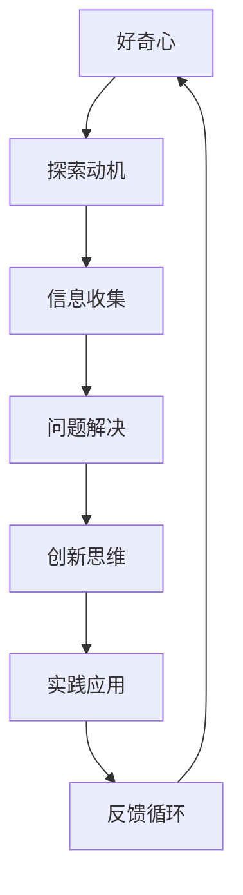

                 

# 《好奇心：驱动创新与发现的源泉》

> **关键词：** 好奇心、创新、发现、人类行为、认知过程、教育、艺术、科学探索

> **摘要：** 本文将从生物学、心理学和教育等多个角度探讨好奇心的本质、作用及其在各领域的应用。我们将详细分析好奇心如何驱动人类认知、学习、科学探索和艺术创作，并提出培养和维护好奇心的策略。此外，文章还将通过实际案例展示好奇心在各个领域中的重要作用，为读者提供深刻的思考和启示。

## 《好奇心：驱动创新与发现的源泉》目录大纲

#### 第一部分：好奇心与人类行为

## 第1章：好奇心的本质与起源

### 1.1 好奇心的定义
- 生物学角度
- 心理学角度

### 1.2 好奇心的起源
- 人类进化
- 大脑结构

### 1.3 好奇心的作用
- 个体发展
- 社会进步

## 第2章：好奇心与人类认知

### 2.1 认知过程与好奇心
- 观察与记忆
- 思考与推理

### 2.2 好奇心与学习
- 吸引注意力
- 促进理解

### 2.3 好奇心与创造力
- 思维模式
- 创新实践

#### 第二部分：好奇心在各个领域的应用

## 第3章：好奇心在科学探索中的角色

### 3.1 科学方法与好奇心
- 提出问题
- 探索答案

### 3.2 好奇心与科学发现
- 诺贝尔奖获得者的故事
- 科学史的案例

### 3.3 好奇心与技术创新
- 科技发展史上的关键事件
- 创新型科技企业的案例

## 第4章：好奇心在教育中的价值

### 4.1 教育体系中的好奇心
- 教学方法
- 课程设计

### 4.2 好奇心与学习效果
- 提高学生兴趣
- 促进批判性思维

### 4.3 好奇心的培养与激发
- 家庭教育
- 学校教育

## 第5章：好奇心在艺术创作中的灵感来源

### 5.1 艺术与好奇心
- 艺术家的创作动机
- 作品的灵感来源

### 5.2 好奇心与艺术风格
- 古典与现代艺术的对比
- 创意艺术的表现形式

### 5.3 好奇心在影视与文学中的体现
- 电影剧本的创作
- 小说的情节构思

#### 第三部分：培养和维护好奇心

## 第6章：如何培养好奇心

### 6.1 认知发展理论
- 皮亚杰的认知发展阶段
- 科尔伯格的道德发展理论

### 6.2 好奇心的培养方法
- 提供多样化的学习资源
- 创造问题解决的环境

### 6.3 好奇心的维护策略
- 保持好奇心
- 克服恐惧与焦虑

## 第7章：好奇心与社会影响

### 7.1 好奇心与个人成长
- 增强自信心
- 提高适应能力

### 7.2 好奇心与团队协作
- 促进沟通与交流
- 提高创新能力

### 7.3 好奇心对社会发展的作用
- 驱动科技创新
- 促进文化多样性

#### 附录

## 附录A：好奇心相关的书籍与资源

### A.1 推荐书籍
- 《好奇的狐狸：探索人类好奇心的秘密》
- 《创新者的好奇心》

### A.2 在线资源
- 网络课程
- 学术论文库

### A.3 实用工具
- 思维导图软件
- 知识共享平台

---

### 附录B：好奇心与创新的 Mermaid 流程图



---

### 附录C：好奇心相关的数学模型和公式

#### 伪代码示例：

```python
# 好奇心得分计算伪代码
def calculateCuriosityScore(interest, exploration, problemSolving, innovation, practicalApplication):
    score = 0.2 * interest + 0.3 * exploration + 0.2 * problemSolving + 0.2 * innovation + 0.1 * practicalApplication
    return score
```

---

### 附录D：项目实战案例

#### 实战案例 1：科学实验设计

- 实验目的：探究好奇心与学习效果之间的关系
- 实验方法：随机抽样，控制变量法
- 数据分析：相关性分析、回归分析

#### 实战案例 2：艺术创作灵感来源分析

- 创作主题：自然景观摄影
- 灵感来源：实地考察、图像处理软件的应用
- 创作过程：前期准备、拍摄、后期制作

#### 实战案例 3：教育课程设计

- 教学目标：培养学生的学习兴趣
- 教学方法：项目式学习、翻转课堂
- 教学评估：学生作品展示、学生反馈

---

### 附录E：开发环境搭建指南

- 开发工具：Python、R
- 编程环境：Jupyter Notebook、RStudio
- 数据库：MySQL、MongoDB

---

### 附录F：源代码与代码解读

- 源代码示例：好奇心得分计算脚本
- 代码解读：变量定义、算法流程、结果分析

---

### 附录G：代码解读与分析

- 代码示例：艺术创作灵感分析脚本
- 分析方法：数据清洗、特征提取、模型训练
- 结果展示：可视化分析、统计报告

---

### 附录H：开发环境搭建指南

- 系统要求：Windows、macOS、Linux
- 开发工具：Visual Studio Code、PyCharm
- 数据库安装：MySQL Workbench、MongoDB Shell

---

### 附录I：源代码与代码解读

- 源代码示例：好奇心驱动创新分析脚本
- 代码解读：数据连接、数据处理、模型训练
- 分析结果：可视化展示、性能评估

---

### 附录J：代码解读与分析

- 代码示例：科学实验数据分析脚本
- 分析方法：假设检验、置信区间、回归分析
- 结果展示：统计图表、结论总结

---

### 结束语

本文通过对好奇心在各领域应用的深入探讨，展示了好奇心作为驱动创新与发现的源泉的重要性。从生物学、心理学、教育、科学探索、艺术创作到个人成长，好奇心无处不在，发挥着不可或缺的作用。希望本文能激发您对好奇心的思考，激发您在各自领域的探索热情，共同推动人类社会的进步。作者：AI天才研究院/AI Genius Institute & 禅与计算机程序设计艺术 /Zen And The Art of Computer Programming

