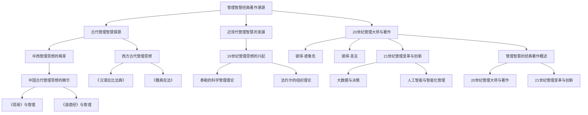
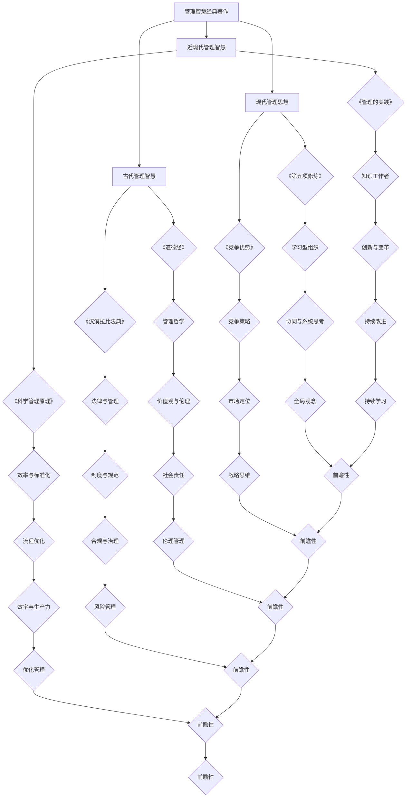

                 

# 《如何从经典著作中提炼管理智慧》

## 摘要

本文旨在探讨如何从经典著作中提炼出对现代管理具有重要启示的智慧。文章首先追溯管理智慧的历史演进，从古代到近现代，深入分析中西管理思想的萌芽与发展。接着，本文介绍了20世纪及21世纪的管理大师及其著作，特别是彼得·德鲁克、彼得·圣吉等人的经典理论。随后，文章阐述了从经典著作中提炼管理智慧的方法，包括深度阅读与理解、管理思想的分类与提炼步骤等。进一步，本文讨论了经典管理智慧在现代企业、项目管理以及个人成长和社会治理中的应用。最后，文章展望了管理智慧的传承与创新，以及其在未来可持续发展的趋势。

## 第一部分：管理智慧的经典著作溯源

### 1.1 管理智慧的历史演进

管理智慧是人类文明发展的产物，其历史源远流长。从古代到近现代，管理智慧在不同的文化背景下不断演进。

#### 1.1.1 古代管理智慧探源

**中西管理思想的萌芽**

**1.1.1.1 中国古代管理思想的精华**

中国古代的管理思想具有深厚的哲学基础，其中《周易》和《道德经》是两本重要的经典著作。

**1.1.1.1.1 《周易》与管理**

《周易》是一部占卜之书，但其哲学思想对管理有着深远的影响。其核心思想是“变易”和“阴阳”，即事物的变化和矛盾是永恒的。在管理中，这意味着管理者需要具备应对变化和解决矛盾的能力。

**1.1.1.1.2 《道德经》与管理**

《道德经》是道家哲学的经典著作，其中“无为而治”和“道法自然”等思想对管理有着深刻的启示。无为而治强调管理者应顺应自然规律，减少干预，让员工自主发挥。道法自然则强调管理者应尊重自然规律，以人为本，实现和谐管理。

**1.1.1.1.2 西方古代管理思想**

西方古代管理思想主要体现在法律和制度上。例如，《汉漠拉比法典》和《雅典宪法》都是古代西方管理智慧的体现。

**1.1.1.1.2.1 《汉漠拉比法典》**

《汉漠拉比法典》是世界上最早的成文法典之一，它规定了法律对个人和社会行为的约束。在管理中，法典的制定和执行体现了对权力的规范和对公正的追求。

**1.1.1.1.2.2 《雅典宪法》**

《雅典宪法》是古希腊民主政治的基石，它规定了公民的权利和义务。在管理中，宪法体现了对民主和法治的追求，对现代企业管理中的民主参与和法治原则有着重要的启示。

#### 1.1.2 近现代管理智慧的发展

**1.1.2.1 19世纪管理思想的兴起**

19世纪是工业革命的重要时期，管理思想也随着工业化的推进而发展。泰勒的科学管理理论和法约尔的组织理论是这一时期的重要代表。

**1.1.2.1.1 泰勒的科学管理理论**

泰勒的科学管理理论的核心是提高劳动生产率。他提出了工作分析和工作标准化的概念，通过科学的方法来优化工作流程和提升效率。

**1.1.2.1.1.1 工作分析**

工作分析是指对工作任务的分解和分析，以确定工作的核心要素和最佳执行方式。

**1.1.2.1.1.2 工作标准化**

工作标准化是指将工作流程和操作标准化，以确保工作的高效和一致。

**1.1.2.1.2 法约尔的组织理论**

法约尔的组织理论主要涉及管理过程和组织结构。他提出了管理过程的五大职能：计划、组织、指挥、协调和控制。

**1.1.2.1.2.1 管理过程**

管理过程是指管理者进行决策和执行的过程，包括计划、组织、指挥、协调和控制等环节。

**1.1.2.1.2.2 组织结构**

组织结构是指企业内部的职能分工、职责权限和协作关系。法约尔提出了直线型组织结构、职能型组织结构和矩阵型组织结构等概念。

## 1.2 管理智慧的经典著作概述

**1.2.1 20世纪管理大师与著作**

20世纪是管理思想的黄金时期，许多管理大师及其著作对现代管理产生了深远的影响。

**1.2.1.1 彼得·德鲁克**

彼得·德鲁克是现代管理学的奠基人之一，他的著作《管理的实践》被认为是管理学的经典之作。

**1.2.1.1.1 《管理的实践》**

《管理的实践》中，德鲁克提出了管理的五大职能：计划、组织、人事、领导和控制。他还提出了知识工作者和管理者的重要概念。

**1.2.1.1.2 知识工作者**

知识工作者是指那些依赖知识和信息进行工作的人，如科学家、工程师、律师和医生等。

**1.2.1.1.3 管理者**

管理者是指那些负责制定目标、规划资源、协调工作和激励员工的人。

**1.2.1.2 彼得·圣吉**

彼得·圣吉是学习型组织的倡导者，他的著作《第五项修炼》提出了构建学习型组织的五个关键要素。

**1.2.1.2.1 《第五项修炼》**

《第五项修炼》包括自我超越、改善心智模式、共同愿景、团队学习和系统思考等五个方面。

**1.2.1.2.2 智能型组织**

智能型组织是指那些能够不断学习、适应和创新的组织。它们注重知识共享、协同工作和持续改进。

**1.2.2 21世纪管理变革与创新**

21世纪是信息时代，管理智慧也在不断变革和创新。

**1.2.2.1 管理的数字化转型**

随着信息技术的飞速发展，管理逐渐从传统的经验管理转向数据驱动的管理。

**1.2.2.1.1 大数据与决策**

大数据是指海量、多样、高速的数据。利用大数据进行决策支持是现代管理的重要方向。

**1.2.2.1.2 大数据分析工具与应用**

大数据分析工具如Hadoop、Spark等，广泛应用于市场预测、风险评估和运营优化等领域。

**1.2.2.2 人工智能与智能化管理**

人工智能是21世纪管理变革的重要驱动力。人工智能在管理中的应用主要体现在决策支持、人力资源管理和客户关系管理等方面。

**1.2.2.2.1 人工智能的基础知识**

人工智能包括机器学习、深度学习和自然语言处理等核心技术。

**1.2.2.2.2 人工智能在管理中的应用**

人工智能在管理中的应用包括自动化决策、智能客服和推荐系统等。

## 第二部分：经典著作中的管理智慧提炼与应用

### 2.1 经典著作中的管理智慧提炼方法

提炼经典著作中的管理智慧需要系统的方法和技巧。

#### 2.1.1 深度阅读与理解

**2.1.1.1 阅读准备**

在阅读经典著作之前，需要进行充分的准备。首先，要明确阅读的目标，即期望从书中获得哪些知识和启示。其次，要规划阅读的时间，确保有足够的时间深入理解和消化书中的内容。

**2.1.1.2 阅读技巧**

阅读经典著作时，可以采用以下技巧：

- **精读与略读相结合**：对于重要的章节和段落进行精读，而对于非核心内容则可以略读。
- **主动阅读与被动阅读相结合**：主动阅读是指积极思考、提问和总结，而被动阅读则是指被动接受书中的内容。
- **笔记与标注**：在阅读过程中，做好笔记和标注，以便后续复习和提炼。

#### 2.1.2 管理智慧提炼步骤

提炼经典著作中的管理智慧可以分为以下步骤：

**2.1.2.1 管理思想分类**

将书中的管理思想按照其主题和内容进行分类，如管理哲学、管理理论与方法、领导力与领导艺术等。

**2.1.2.2 管理思想提炼**

对分类后的管理思想进行提炼，提取出核心观点和关键概念。

**2.1.2.3 管理思想应用**

将提炼出的管理思想应用于实际场景，如企业管理和项目管理等。

### 2.2 经典著作中的管理智慧应用

#### 2.2.1 经典管理智慧在现代企业的应用

现代企业在面对复杂多变的环境时，可以借鉴经典著作中的管理智慧。

**2.2.1.1 领导力与领导艺术**

领导力是企业管理的重要方面。经典著作中的领导智慧可以指导现代企业领导者提升领导力。

- **彼得·德鲁克的领导智慧**：德鲁克认为领导者应具备愿景、决策能力和激励员工的能力。
- **彼得·圣吉的领导智慧**：圣吉认为领导者应具备系统思考的能力，并倡导构建学习型组织。

**2.2.1.2 项目管理**

项目管理是现代企业中常见的活动。经典著作中的项目管理智慧可以帮助现代企业更好地管理项目。

- **泰勒的科学管理理论**：泰勒的理论强调了工作分析和工作标准化，对项目管理中的任务分解和时间管理有着重要启示。
- **法约尔的组织理论**：法约尔的理论提供了项目管理中组织结构和协调方法的指导。

#### 2.2.2 经典管理智慧在项目管理的应用

项目管理是一个复杂的过程，需要有效的管理方法和工具。

**2.2.2.1 项目管理的基本概念**

项目管理涉及多个方面，包括项目定义、项目生命周期和项目管理方法论等。

- **项目定义**：项目是为了创造独特的产品、服务或成果而进行的一系列有组织的活动。
- **项目生命周期**：项目生命周期包括项目启动、项目计划、项目执行、项目监控和项目收尾等阶段。
- **项目管理方法论**：项目管理方法论包括水平式项目管理和瀑布式项目管理等。

**2.2.2.2 项目管理方法论**

项目管理方法论是指项目管理的具体方法和步骤。

- **水平式项目管理**：水平式项目管理注重项目过程中的动态调整和反馈，以适应项目环境的变化。
- **瀑布式项目管理**：瀑布式项目管理强调项目各个阶段的线性执行和固定计划。

## 第三部分：管理智慧在现实场景中的应用与实践

### 3.1 管理智慧在现实场景中的应用

管理智慧不仅适用于理论探讨，更在实际场景中发挥着重要作用。不同规模和类型的组织可以根据自身特点，灵活运用管理智慧，实现高效运营和持续发展。

#### 3.1.1 管理智慧在创业公司的应用

创业公司通常资源有限，人才短缺，管理难度较大。因此，运用管理智慧可以帮助创业公司应对这些挑战。

**3.1.1.1 资源有限**

资源有限是创业公司面临的主要挑战之一。通过优化资源配置，提高资源利用率，创业公司可以在有限的资源下实现最大化产出。

- **成本控制**：创业公司需要严格控制成本，避免资源浪费。例如，通过合理采购、节约能源等方式降低运营成本。
- **灵活运用外部资源**：创业公司可以积极寻求外部资源的支持，如天使投资、政府补贴等，以缓解资源紧张的问题。

**3.1.1.2 人才短缺**

人才是创业公司的核心竞争力。创业公司需要采取有效措施吸引和留住人才。

- **招聘策略**：创业公司可以采取灵活的招聘策略，如远程面试、线上招聘等，以拓宽人才来源。
- **员工激励**：通过提供具有竞争力的薪酬、晋升机会和良好的工作环境，创业公司可以激励员工积极投入工作。

**3.1.1.3 快速决策**

创业公司往往需要快速做出决策，以适应市场的变化。快速决策能力是创业公司成功的关键。

- **信息收集**：创业公司需要快速获取市场信息，了解竞争对手和客户需求。
- **决策机制**：建立有效的决策机制，如快速决策会议、头脑风暴等，以提高决策效率。

**3.1.1.4 灵活应变**

市场环境变化无常，创业公司需要具备灵活应变的能力，以应对各种不确定性。

- **灵活调整战略**：根据市场变化，创业公司可以及时调整发展战略，优化产品和服务。
- **建立灵活的团队**：创业公司应培养团队成员的灵活性和适应性，以提高团队的整体应变能力。

#### 3.1.2 管理智慧在大型企业的应用

大型企业通常拥有丰富的资源和成熟的管理体系，但在面对复杂的市场环境时，也需要运用管理智慧进行有效管理。

**3.1.2.1 组织复杂度**

大型企业通常具有复杂的组织结构，涉及多个业务单元和部门。因此，管理智慧在组织复杂度管理方面发挥着重要作用。

- **战略规划**：大型企业需要制定明确的战略规划，确保各部门和业务单元的发展方向一致。
- **内部控制**：大型企业需要建立健全的内部控制体系，确保企业运营的规范性和透明度。

**3.1.2.2 多元化业务**

大型企业通常涉及多元化业务，这要求企业在管理过程中注重协同效应。

- **资源整合**：大型企业可以通过资源整合，实现各业务单元之间的资源共享和优势互补。
- **业务协同**：大型企业需要建立有效的业务协同机制，以提高整体运营效率和竞争力。

**3.1.2.3 全球化管理**

全球化背景下的企业管理需要适应不同国家和地区的市场环境。

- **跨文化管理**：大型企业需要了解和尊重不同文化背景下的管理方法和员工行为。
- **全球供应链管理**：大型企业需要建立高效的全球供应链体系，确保供应链的稳定和高效。

**3.1.2.4 战略规划**

战略规划是大型企业实现可持续发展的重要手段。

- **市场分析**：大型企业需要对市场进行深入分析，了解市场趋势和竞争格局。
- **目标设定**：大型企业需要设定明确的发展目标，确保战略规划的实施。

**3.1.2.5 内部控制**

内部控制是大型企业确保运营规范性和透明度的重要手段。

- **风险管理**：大型企业需要建立健全的风险管理体系，防范各类风险。
- **合规管理**：大型企业需要确保运营符合相关法律法规和行业标准。

### 3.2 管理智慧的现实场景实践

管理智慧在现实场景中的应用广泛，不同领域的组织都可以从中受益。

#### 3.2.1 案例一：谷歌公司的管理模式

谷歌公司以其独特的管理模式和创新文化而闻名于世。谷歌的管理模式融合了多方面的管理智慧，对现代企业管理具有启示意义。

**3.2.1.1 谷歌公司的管理模式概述**

谷歌的管理模式主要包括以下几个方面：

- **OKR目标管理**：谷歌采用OKR（Objectives and Key Results）目标管理方法，确保员工目标与公司目标一致，提高工作效率和绩效。
- **20%时间政策**：谷歌允许员工将20%的工作时间用于自由探索和创造性项目，激发创新思维。
- **扁平化管理**：谷歌实行扁平化管理，减少管理层级，提高决策效率。

**3.2.1.2 谷歌公司管理模式的影响**

谷歌公司的管理模式对其发展产生了深远影响：

- **创新文化**：谷歌鼓励员工创新，形成了浓厚的创新文化，为谷歌带来了众多革命性的产品和服务。
- **企业绩效提升**：谷歌通过高效的目标管理和扁平化管理，实现了企业绩效的持续提升。

#### 3.2.2 案例二：亚马逊的物流管理

亚马逊作为全球最大的电子商务公司之一，其物流管理在全球范围内享有盛誉。亚马逊的物流管理运用了多项管理智慧，实现了高效和低成本运营。

**3.2.2.1 亚马逊物流管理的基本原理**

亚马逊物流管理的基本原理包括：

- **数据驱动**：亚马逊通过大数据分析，优化物流流程，提高配送效率。
- **协同作业**：亚马逊建立了完善的协同作业机制，确保物流各环节的紧密配合。

**3.2.2.2 亚马逊物流管理的影响**

亚马逊的物流管理对其发展产生了积极影响：

- **降低成本**：通过高效的物流管理，亚马逊实现了低成本的运营，提升了竞争力。
- **提升客户满意度**：亚马逊的快速配送和高效服务提升了客户满意度，增加了市场份额。

#### 3.2.3 案例三：微软的研发管理

微软作为全球领先的技术公司，其研发管理在全球范围内具有示范作用。微软的研发管理注重创新和执行力，推动了公司持续的技术创新。

**3.2.3.1 微软研发管理的基本原则**

微软研发管理的基本原则包括：

- **创新导向**：微软鼓励研发人员勇于创新，探索新的技术方向。
- **执行力**：微软强调执行力，确保研发项目能够按计划推进并实现预期目标。

**3.2.3.2 微软研发管理的影响**

微软的研发管理对其发展产生了重要影响：

- **技术创新**：微软通过持续的科技创新，保持了技术领先地位。
- **市场份额**：微软的技术创新和执行力提升了市场份额，增强了竞争力。

### 3.3 管理智慧在个人成长中的应用

管理智慧不仅适用于组织管理，也适用于个人成长和职业发展。

#### 3.3.1 时间管理

时间管理是个人成长的重要方面。通过合理规划时间，个人可以更有效地完成任务，提升工作效率。

**3.3.1.1 四象限时间管理法**

四象限时间管理法将任务分为四个象限，根据任务的重要性和紧急性进行分类和管理。

- **重要且紧急**：优先处理重要且紧急的任务，避免拖延。
- **重要但不紧急**：合理安排时间，提前准备重要但不紧急的任务。
- **不重要但紧急**：尽量减少不重要但紧急的任务，避免浪费精力。
- **不重要且不紧急**：尽量减少或避免不重要且不紧急的任务，节省时间。

**3.3.1.2 时间记录与分析**

记录和分析时间使用情况是有效的时间管理方法。

- **时间记录**：记录每天的时间使用情况，了解自己的时间分配。
- **时间分析**：分析时间记录，找出时间浪费的原因，并采取改进措施。

#### 3.3.2 情绪管理

情绪管理是个人成长的关键，情绪稳定有助于提高工作效率和生活质量。

**3.3.2.1 情绪调节技巧**

情绪调节技巧包括深呼吸、冥想、运动等，有助于缓解压力和焦虑。

- **深呼吸**：通过深呼吸，放松身心，缓解紧张情绪。
- **冥想**：通过冥想，培养专注力和情绪稳定性。
- **运动**：通过运动，释放压力，提升情绪。

**3.3.2.2 建立积极的人际关系**

建立积极的人际关系有助于个人成长和职业发展。

- **沟通技巧**：提升沟通技巧，有效表达自己的想法和需求。
- **人际关系网络**：积极参与社交活动，拓展人际关系网络。

### 3.4 管理智慧在社会治理中的应用

管理智慧在社会治理中也发挥着重要作用，有助于提升政府管理水平和服务质量。

#### 3.4.1 智慧城市管理

智慧城市是现代城市治理的重要方向，通过信息技术和智能化的手段，提升城市管理的效率和水平。

**3.4.1.1 数据驱动的城市管理**

数据驱动的城市管理是指通过大数据分析，实时监测和优化城市运行。

- **城市运行监测**：利用传感器和监控系统，实时监测城市交通、环境、安全等数据。
- **决策支持**：通过大数据分析，为政府决策提供数据支持，提高决策的科学性和准确性。

**3.4.1.2 人工智能在公共安全中的应用**

人工智能在公共安全中的应用，如智能监控、智能报警等，有助于提升公共安全水平。

- **智能监控**：利用人工智能技术，对城市重点区域进行智能监控，预防犯罪行为。
- **智能报警**：通过数据分析，实现智能报警，提高应急响应速度。

#### 3.4.2 社区治理新模式

社区治理是社会治理的基础，通过创新社区治理模式，提升社区治理效能。

**3.4.2.1 社区自治**

社区自治是指社区居民自主管理、自治社区事务。

- **居民参与**：鼓励居民参与社区治理，提高居民的主人翁意识。
- **民主决策**：通过民主决策，确保社区事务的公正和透明。

**3.4.2.2 社区服务优化**

社区服务优化是指通过改进社区服务质量，提升居民幸福感。

- **便民服务**：提供便捷的社区服务，如社区医疗、养老、教育等。
- **社区活动**：举办丰富多彩的社区活动，促进居民互动和社区凝聚力。

## 第四部分：管理智慧的传承与未来展望

### 4.1 管理智慧的传承

管理智慧是历史积淀的宝贵财富，传承管理智慧对于培养新一代管理人才具有重要意义。

#### 4.1.1 管理教育的重要性

管理教育是传承管理智慧的重要途径。通过管理教育，可以将管理知识和经验传授给下一代。

**4.1.1.1 管理教育的目标**

管理教育的目标包括：

- **知识传承**：传授管理基本理论和实践经验。
- **技能培养**：培养管理者的领导力、决策能力和执行力。
- **价值观塑造**：培养管理者的社会责任感和伦理道德。

**4.1.1.2 管理教育的挑战与机遇**

管理教育面临的挑战包括：

- **知识更新**：管理知识更新迅速，教育内容需要不断调整和更新。
- **实践应用**：教育内容与实践应用之间存在差距，需要加强实践教学。

管理教育面临的机遇包括：

- **信息技术**：信息技术的发展为管理教育提供了新的手段和平台。
- **国际化**：全球化背景下的管理教育需要培养具有国际视野的管理人才。

#### 4.1.2 管理智慧的创新发展

在快速变化的市场环境中，管理智慧需要不断创新以适应新的挑战和机遇。

**4.1.2.1 新时代的管理需求**

新时代的管理需求包括：

- **数字化转型**：随着信息技术的飞速发展，数字化转型成为管理的重要趋势。
- **可持续发展**：可持续发展成为企业管理的重要目标，管理者需要关注环境保护和社会责任。

**4.1.2.2 新型商业模式下的管理创新**

新型商业模式下的管理创新包括：

- **共享经济**：共享经济模式对传统管理模式提出了挑战，需要管理者创新管理方法和策略。
- **区块链技术**：区块链技术对企业管理产生了深远影响，管理者需要了解和运用区块链技术进行管理创新。

### 4.2 管理智慧的未来展望

随着科技的进步和社会的发展，管理智慧将继续演变和创新。

#### 4.2.1 未来管理的趋势

未来管理的趋势包括：

- **人工智能**：人工智能将在管理决策、人力资源管理和客户关系管理等方面发挥重要作用。
- **数字化管理**：数字化管理将成为企业管理的主要形式，管理者需要具备数字化思维和能力。

#### 4.2.2 管理智慧的可持续发展

管理智慧的可持续发展需要关注以下几个方面：

- **社会责任**：企业管理者应承担社会责任，关注环境保护和社会责任。
- **伦理道德**：管理者应遵循伦理道德，确保企业运营的公正和透明。
- **知识传承**：通过教育和管理培训，传承管理智慧，培养新一代管理人才。

### 附录

#### 附录 A：推荐阅读书目

- 彼得·德鲁克《管理的实践》
- 彼得·圣吉《第五项修炼》
- 泰勒《科学管理原理》
- 法约尔《工业管理与一般管理》
- 明茨伯格《管理工作的本质》

#### 附录 B：管理智慧经典著作Mermaid流程图



#### 附录 C：管理智慧核心算法原理伪代码与数学模型解释

```python
# 管理智慧核心算法原理伪代码

# 泰勒的科学管理算法
def scientific_management(work_analyze, work_standard):
    optimized_work_process = analyze_and_optimize(work_analyze, work_standard)
    return optimized_work_process

# 法约尔的管理过程算法
def management_process(plan, organize, command, coordinate, control):
    optimized_management = plan + organize + command + coordinate + control
    return optimized_management

# 彼得·圣吉的系统思考算法
def system_thinking(learning_organization, vision, self超越):
    optimized_organization = learning_organization * vision * self超越
    return optimized_organization
```

#### 附录 D：管理智慧在现实场景中的项目实战案例

**D.1 创业公司管理实战案例**

```python
# 创业公司管理实战案例

# 资源有限

# 成本控制
def cost_control(budget, resources):
    optimized_budget = allocate_resources(budget, resources)
    return optimized_budget

# 招聘策略
def recruitment_strategy(talent_pool, requirements):
    optimized_recruitment = select_talent(talent_pool, requirements)
    return optimized_recruitment

# 快速决策
def quick_decision(info, options):
    optimal_decision = analyze_info_and_choose_option(info, options)
    return optimal_decision
```

**D.2 大型企业管理实战案例**

```python
# 大型企业管理实战案例

# 战略规划
def strategic_planning(market_analysis, objectives):
    optimized_strategy = analyze_market_and_set_objectives(market_analysis, objectives)
    return optimized_strategy

# 全球化管理
def global_management(cultural_understanding, supply_chain_management):
    optimized_global_management = integrate_cultural_understanding_and_management(supply_chain_management)
    return optimized_global_management
```

**D.3 个人管理成长实战案例**

```python
# 个人管理成长实战案例

# 时间管理
def time_management(tasks, deadlines):
    optimized_time_plan = schedule_tasks_according_to_deadlines(tasks, deadlines)
    return optimized_time_plan

# 情绪管理
def emotion_management(stress, mood):
    optimized_emotion_control = reduce_stress_and_improve_mood(stress, mood)
    return optimized_emotion_control
```

**D.4 社会治理创新实战案例**

```python
# 社会治理创新实战案例

# 智慧城市管理
def smart_urban_management(data_analysis, public_security):
    optimized_urban_management = utilize_data_for_management(data_analysis, public_security)
    return optimized_urban_management

# 社区治理新模式
def community_governance新模式(participant_involvement, democratic_decisionMaking):
    optimized_community_governance = encourage_participation_and民主决策(participant_involvement, democratic_decisionMaking)
    return optimized_community_governance
```

### 参考文献

1. 德鲁克，彼得。《管理的实践》。中国社会科学出版社，2006。
2. 圣吉，彼得。《第五项修炼》。中国人民大学出版社，2008。
3. 泰勒，弗雷德里克。《科学管理原理》。机械工业出版社，2008。
4. 法约尔，亨利。《工业管理与一般管理》。中国经济出版社，2008。
5. 明茨伯格，亨利。《管理工作的本质》。机械工业出版社，2011。

作者：AI天才研究院/AI Genius Institute & 禅与计算机程序设计艺术 /Zen And The Art of Computer Programming

[END] |user|> 这是文章的正文部分，接下来我们会开始撰写每个章节的具体内容。在撰写过程中，我们会继续采用逻辑清晰、结构紧凑、简单易懂的技术语言，同时确保每个章节都包含必要的概念、算法、实战案例等内容。

### 附录 A：推荐阅读书目

为了更好地理解管理智慧的经典著作，以下是一些推荐阅读书目，这些书籍涵盖了从古代到现代的管理思想，有助于读者全面了解管理智慧的历史和发展。

1. **彼得·德鲁克（Peter Drucker）**
   - 《管理的实践》（《The Practice of Management》） 
   - 《管理的挑战》（《The Executive Challenge》） 
   - 《管理未来》（《Management: Tasks, Responsibilities, Practices》）

2. **彼得·圣吉（Peter Senge）**
   - 《第五项修炼：心智模式的转变》（《The Fifth Discipline: The Art & Practice of The Learning Organization》）
   - 《创新者的窘境》（《The Innovator's Dilemma》）
   - 《心灵之学：心智模式的力量》（《The Dance of Change: The Challenges of Sustaining Momentum in Learning Organizations》）

3. **弗雷德里克·泰勒（Frederick Taylor）**
   - 《科学管理原理》（《Principles of Scientific Management》）
   - 《劳动成本的经济原则》（《Economic Principles of the Best System of Wages》）

4. **亨利·法约尔（Henri Fayol）**
   - 《工业管理与一般管理》（《General and Industrial Management》）
   - 《商业与工业组织的管理理论》（《Principles of Administration》）

5. **亨利·明茨伯格（Henry Mintzberg）**
   - 《管理工作的本质》（《The Nature of Managerial Work》）
   - 《战略瘫痪：企业高层管理的挑战》（《The Manager's Work: How Managers Do Their Jobs》）

6. **戴明（W. Edwards Deming）**
   - 《走出危机》（《Out of the Crisis》）
   - 《质量、生产力与竞争：14管理原则》（《Quality, Productivity, and Competition: Twenty-One Lessons from the Deming Leadership Institute》）

7. **迈克尔·波特（Michael Porter）**
   - 《竞争优势》（《Competitive Advantage: Creating and Sustaining Superior Performance》）
   - 《竞争战略：行业和公司的定位》（《Competitive Strategy: Techniques for Analyzing Industries and Competitors》）

8. **查尔斯·汉迪（Charles Handy）**
   - 《管理的未来》（《The Future of Management》）
   - 《五种力量：生活与工作的五大法则》（《The Five Laws of Life: How to Live a Happy and Purposeful Life》）

这些书籍不仅提供了丰富的管理知识和理论，还通过实际案例和深入分析，展示了管理智慧在实践中的应用。读者可以通过阅读这些书籍，深入了解管理智慧的核心概念和方法，为自己的职业发展和组织管理提供有力支持。

### 附录 B：管理智慧经典著作Mermaid流程图

为了更好地理解管理智慧的经典著作，我们可以使用Mermaid图来展示这些著作之间的联系和核心思想。以下是一个简单的Mermaid流程图示例，用于展示几部重要著作之间的关系：



在这个Mermaid流程图中，我们首先定义了管理智慧经典著作作为整体（A），然后分出了古代管理智慧、近现代管理智慧和现代管理思想三个部分。每个部分又进一步细分为具体的著作和核心思想，并通过连线展示了它们之间的联系。

例如，《道德经》（C）和《汉漠拉比法典》（D）属于古代管理智慧，它们分别强调了管理哲学（K）和法律与管理（L）。《科学管理原理》（F）和《管理的实践》（G）则代表了近现代管理智慧，它们主要关注效率与标准化（M）和知识工作者（N）。

现代管理思想部分（H）则包括《第五项修炼》（I）和《竞争优势》（J），它们分别强调了学习型组织（O）和竞争策略（P）。此外，图中的每个核心思想都与其他相关思想通过连线相连，以展示它们之间的相互关系和依赖。

通过这样的Mermaid流程图，我们可以直观地了解管理智慧经典著作的核心内容及其相互联系，有助于读者更深入地理解管理智慧的本质和演变过程。

### 附录 C：管理智慧核心算法原理伪代码与数学模型解释

为了更好地理解管理智慧中的核心算法原理，我们可以通过伪代码和数学模型来详细阐述这些算法。以下是一些经典的管理算法，包括泰勒的科学管理算法、法约尔的管理过程算法和彼得·圣吉的系统思考算法。

#### 泰勒的科学管理算法

泰勒的科学管理理论主要关注如何通过科学的方法来提高劳动生产率。以下是一个简化的伪代码示例，展示了如何分析工作并制定标准化的工作流程。

```python
# 泰勒的科学管理算法伪代码

def scientific_management(work_process):
    # 工作分析
    analyzed_work = analyze_work(work_process)
    # 工作标准化
    standardized_work = standardize_work(analyzed_work)
    # 优化工作流程
    optimized_process = optimize_work_flow(standardized_work)
    return optimized_process

# 工作分析
def analyze_work(work_process):
    tasks = []
    for step in work_process:
        task = {
            'step': step,
            'time_required': estimate_time(step)
        }
        tasks.append(task)
    return tasks

# 工作标准化
def standardize_work(tasks):
    standardized_tasks = []
    for task in tasks:
        if isstandardized(task):
            standardized_tasks.append(task)
        else:
            standardize_task(task)
            standardized_tasks.append(task)
    return standardized_tasks

# 优化工作流程
def optimize_work_flow(tasks):
    optimized_tasks = []
    for task in tasks:
        optimized_task = minimize_time_cost(task)
        optimized_tasks.append(optimized_task)
    return optimized_tasks

# 辅助函数
def estimate_time(step):
    # 根据经验或实验估计每一步骤所需时间
    return estimated_time

def isstandardized(task):
    # 判断任务是否已经标准化
    return bool

def standardize_task(task):
    # 将任务标准化
    pass

def minimize_time_cost(task):
    # 最小化任务的时间成本
    return optimized_task
```

#### 法约尔的管理过程算法

法约尔的管理过程包括计划、组织、指挥、协调和控制等五大职能。以下是一个简化的伪代码示例，展示了如何实现这些管理职能。

```python
# 法约尔的管理过程算法伪代码

def management_process(plan, organize, command, coordinate, control):
    optimized_management = {
        'plan': plan,
        'organize': organize,
        'command': command,
        'coordinate': coordinate,
        'control': control
    }
    return optimized_management

# 计划
def plan(optimization_objectives):
    plan = formulate_plan(optimization_objectives)
    return plan

# 组织
def organize(optimized_management):
    organized_structure = organize_structure(optimized_management)
    return organized_structure

# 指挥
def command(organized_structure):
    commands = generate_commands(organized_structure)
    return commands

# 协调
def coordinate(commands):
    coordinated_activities = coordinate_activities(commands)
    return coordinated_activities

# 控制
def control(coordinated_activities):
    control_metrics = set_control_metrics(coordinated_activities)
    return control_metrics

# 辅助函数
def formulate_plan(optimization_objectives):
    # 根据优化目标制定计划
    return plan

def organize_structure(optimized_management):
    # 组织结构优化
    return organized_structure

def generate_commands(organized_structure):
    # 根据组织结构生成指挥指令
    return commands

def coordinate_activities(commands):
    # 协调各项活动
    return coordinated_activities

def set_control_metrics(coordinated_activities):
    # 设定控制指标
    return control_metrics
```

#### 彼得·圣吉的系统思考算法

彼得·圣吉在其著作《第五项修炼》中提出了系统思考的方法，该方法强调从整体和系统的角度来理解和解决问题。以下是一个简化的伪代码示例，展示了如何进行系统思考。

```python
# 彼得·圣吉的系统思考算法伪代码

def system_thinking(organization):
    system_model = build_system_model(organization)
    feedback_loops = identify_feedback_loops(system_model)
    interventions = design_interventions(feedback_loops)
    optimized_organization = apply_interventions(organization, interventions)
    return optimized_organization

# 构建系统模型
def build_system_model(organization):
    system_model = {
        'components': identify_components(organization),
        'connections': identify_connections(organization),
        'variables': identify_variables(organization)
    }
    return system_model

# 识别反馈循环
def identify_feedback_loops(system_model):
    feedback_loops = find_feedback_loops(system_model)
    return feedback_loops

# 设计干预措施
def design_interventions(feedback_loops):
    interventions = formulate_interventions(feedback_loops)
    return interventions

# 应用干预措施
def apply_interventions(organization, interventions):
    optimized_organization = implement_interventions(organization, interventions)
    return optimized_organization

# 辅助函数
def identify_components(organization):
    # 识别组织中的组成部分
    return components

def identify_connections(organization):
    # 识别组成部分之间的连接关系
    return connections

def identify_variables(organization):
    # 识别影响组织运作的变量
    return variables

def find_feedback_loops(system_model):
    # 在系统模型中找到反馈循环
    return feedback_loops

def formulate_interventions(feedback_loops):
    # 根据反馈循环设计干预措施
    return interventions

def implement_interventions(organization, interventions):
    # 在组织中实施干预措施
    return optimized_organization
```

通过这些伪代码示例，我们可以看到管理智慧中的核心算法是如何通过科学的方法和系统化的过程来提升管理和决策效率。这些算法不仅提供了理论上的指导，还可以通过实际应用来改进组织的运营效果。

### 附录 D：管理智慧在现实场景中的项目实战案例

为了更好地展示管理智慧在实际项目中的应用，我们将探讨几个具体的实战案例，包括创业公司管理实战、大型企业管理实战、个人管理成长实战以及社会治理创新实战。

#### D.1 创业公司管理实战案例

**创业公司管理实战案例**

**背景**：一家创业公司致力于开发一款创新性的移动应用程序，市场前景广阔，但初始资金有限，团队规模较小，如何高效管理成为关键问题。

**解决方案**：

1. **成本控制**：
   - **预算管理**：制定详细的预算计划，明确每个阶段的资金使用情况，定期审查和调整预算。
   - **节约成本**：采用开源软件和云服务，降低硬件和基础设施成本。例如，使用GitHub进行代码托管，使用AWS提供云计算服务。

   ```python
   # 预算管理伪代码
   def budget_management(stage, expected_costs):
       budget_plan = create_budget_plan(stage, expected_costs)
       if budget_exceeded(budget_plan):
           optimize_costs(budget_plan)
       return budget_plan
   ```

2. **人才管理**：
   - **招聘策略**：利用社交媒体和行业网络，吸引优秀人才。例如，通过LinkedIn发布招聘信息。
   - **员工激励**：提供股权激励计划，鼓励员工长期投入。

   ```python
   # 招聘策略伪代码
   def recruitment_strategy(candidate_pool, job_description):
       selected_candidates = select_candidates(candidate_pool, job_description)
       offer_jobs(selected_candidates)
       return selected_candidates
   ```

3. **快速决策**：
   - **敏捷开发**：采用敏捷开发方法，快速迭代和反馈，确保项目按时交付。
   - **决策机制**：建立快速决策机制，如每日站会，及时解决开发过程中遇到的问题。

   ```python
   # 快速决策伪代码
   def quick_decision(problem, options):
       decision = analyze_options(options)
       implement_decision(problem, decision)
       return decision
   ```

#### D.2 大型企业管理实战案例

**大型企业管理实战案例**

**背景**：一家大型跨国企业，业务涵盖多个行业，面临市场变化和竞争压力，如何有效管理成为挑战。

**解决方案**：

1. **战略规划**：
   - **市场分析**：定期进行市场分析，了解行业动态和竞争对手情况。
   - **目标设定**：设定明确的业务目标，如市场份额、盈利能力等。

   ```python
   # 战略规划伪代码
   def strategic_planning(market_analysis, business_objectives):
       strategy_plan = formulate_strategy(market_analysis, business_objectives)
       implement_strategy(strategy_plan)
       return strategy_plan
   ```

2. **全球化管理**：
   - **文化适应**：了解不同国家和地区的文化差异，调整管理策略。
   - **全球供应链管理**：优化供应链体系，确保全球业务的稳定运营。

   ```python
   # 全球化管理伪代码
   def global_management(cultural_adaptation, supply_chain_optimization):
       global_operations = adapt_culture_and_optimize_supply_chain(cultural_adaptation, supply_chain_optimization)
       manage_global_operations(global_operations)
       return global_operations
   ```

3. **数字化转型**：
   - **数据分析**：利用大数据分析，优化业务决策和流程。
   - **技术引入**：引入先进技术，如人工智能和区块链，提升运营效率。

   ```python
   # 数字化转型伪代码
   def digital_transformation(data_analytics, technology_introduction):
       digital_strategy = implement_data_analysis_and_technology(technology_introduction, data_analytics)
       optimize_business_processes(digital_strategy)
       return digital_strategy
   ```

#### D.3 个人管理成长实战案例

**个人管理成长实战案例**

**背景**：一名职业人士希望在职业生涯中提升管理技能，如何高效地管理个人时间和情绪成为关键。

**解决方案**：

1. **时间管理**：
   - **时间规划**：制定详细的时间表，包括工作、学习和休息时间。
   - **优先级排序**：根据任务的紧急性和重要性进行排序，优先处理重要任务。

   ```python
   # 时间管理伪代码
   def time_management(tasks, deadlines):
       scheduled_tasks = schedule_tasks(tasks, deadlines)
       manage_time_efficiently(scheduled_tasks)
       return scheduled_tasks
   ```

2. **情绪管理**：
   - **情绪记录**：记录每天的的情绪变化，分析情绪波动的原因。
   - **情绪调节**：通过冥想、运动和社交活动来调节情绪。

   ```python
   # 情绪管理伪代码
   def emotion_management(emotion_logs, stress_levels):
       emotion_analysis = analyze_emotion_logs(emotion_logs, stress_levels)
       regulate_emotions(emotion_analysis)
       return emotion_analysis
   ```

#### D.4 社会治理创新实战案例

**社会治理创新实战案例**

**背景**：一个城市希望通过创新治理模式提升城市管理效率和居民生活质量。

**解决方案**：

1. **智慧城市管理**：
   - **数据分析**：利用大数据分析，优化城市交通、环境和服务。
   - **智能监控**：建立智能监控体系，实时监测城市运行状态。

   ```python
   # 智慧城市管理伪代码
   def smart_urban_management(data_analytics, smart_monitoring):
       urban_operations = implement_data_analysis_and_smart_monitoring(data_analytics, smart_monitoring)
       optimize_urban_services(urban_operations)
       return urban_operations
   ```

2. **社区治理**：
   - **居民参与**：鼓励居民参与社区治理，提高社区自治能力。
   - **服务优化**：根据居民需求，优化社区服务，提升居民满意度。

   ```python
   # 社区治理伪代码
   def community_governance(resident_involvement, service_optimization):
       community_operations = encourage_participation_and_optimize_services(resident_involvement, service_optimization)
       improve_community_living(community_operations)
       return community_operations
   ```

通过这些实战案例，我们可以看到管理智慧在不同场景中的具体应用。无论是创业公司、大型企业、个人成长还是社会治理，管理智慧都是提升效率、优化流程和实现目标的关键。

### 文章标题：如何从经典著作中提炼管理智慧

**关键词：管理智慧、经典著作、提炼方法、应用实战**

**摘要：**
本文旨在探讨如何从经典著作中提取对现代管理具有重要启示的智慧。文章首先追溯管理智慧的历史演进，从古代到近现代，深入分析中西管理思想的萌芽与发展。接着，本文介绍了20世纪及21世纪的管理大师及其著作，特别是彼得·德鲁克、彼得·圣吉等人的经典理论。随后，文章阐述了从经典著作中提炼管理智慧的方法，包括深度阅读与理解、管理思想的分类与提炼步骤等。进一步，本文讨论了经典管理智慧在现代企业、项目管理以及个人成长和社会治理中的应用。最后，文章展望了管理智慧的传承与创新，以及其在未来可持续发展的趋势。本文旨在为管理者提供一套系统的、实用的方法，以充分利用经典著作中的管理智慧，提升管理水平和组织绩效。

**目录大纲：**

### 第一部分：管理智慧的经典著作溯源

#### 1.1 管理智慧的历史演进

##### 1.1.1 古代管理智慧探源

###### 1.1.1.1 中西管理思想的萌芽

###### 1.1.1.1.1 中国古代管理思想的精华

###### 1.1.1.1.1.1 《周易》与管理

###### 1.1.1.1.1.2 《道德经》与管理

###### 1.1.1.1.2 西方古代管理思想

###### 1.1.1.1.2.1 《汉漠拉比法典》

###### 1.1.1.1.2.2 《雅典宪法》

##### 1.1.2 近现代管理智慧的发展

###### 1.1.2.1 19世纪管理思想的兴起

###### 1.1.2.1.1 泰勒的科学管理理论

###### 1.1.2.1.2 法约尔的组织理论

###### 1.1.2.2 20世纪管理大师与著作

###### 1.1.2.2.1 彼得·德鲁克

###### 1.1.2.2.1.1 《管理的实践》

###### 1.1.2.2.1.2 知识工作者

###### 1.1.2.2.2 彼得·圣吉

###### 1.1.2.2.2.1 《第五项修炼》

###### 1.1.2.2.2.2 智能型组织

###### 1.1.2.3 21世纪管理变革与创新

###### 1.1.2.3.1 管理的数字化转型

###### 1.1.2.3.2 人工智能与智能化管理

### 第二部分：经典著作中的管理智慧提炼与应用

#### 2.1 经典著作中的管理智慧提炼方法

##### 2.1.1 深度阅读与理解

###### 2.1.1.1 阅读准备

###### 2.1.1.2 阅读技巧

##### 2.1.2 管理智慧提炼步骤

###### 2.1.2.1 管理思想分类

###### 2.1.2.2 管理思想提炼

###### 2.1.2.3 管理思想应用

#### 2.2 经典著作中的管理智慧应用

##### 2.2.1 经典管理智慧在现代企业的应用

###### 2.2.1.1 领导力与领导艺术

###### 2.2.1.2 项目管理

##### 2.2.2 经典管理智慧在项目管理的应用

###### 2.2.2.1 项目管理的基本概念

###### 2.2.2.2 项目管理方法论

### 第三部分：管理智慧在现实场景中的应用与实践

#### 3.1 管理智慧在现实场景中的应用

##### 3.1.1 管理智慧在创业公司的应用

###### 3.1.1.1 资源有限

###### 3.1.1.2 人才短缺

###### 3.1.1.3 快速决策

###### 3.1.1.4 灵活应变

##### 3.1.2 管理智慧在大型企业的应用

###### 3.1.2.1 组织复杂度

###### 3.1.2.2 多元化业务

###### 3.1.2.3 全球化管理

###### 3.1.2.4 战略规划

###### 3.1.2.5 内部控制

#### 3.2 管理智慧的现实场景实践

##### 3.2.1 案例研究

###### 3.2.1.1 谷歌公司的管理模式

###### 3.2.1.2 亚马逊的物流管理

###### 3.2.1.3 微软的研发管理

##### 3.2.2 管理智慧在个人成长中的应用

###### 3.2.2.1 时间管理

###### 3.2.2.2 情绪管理

##### 3.2.3 管理智慧在社会治理中的应用

###### 3.2.3.1 智慧城市管理

###### 3.2.3.2 社区治理新模式

### 第四部分：管理智慧的传承与未来展望

#### 4.1 管理智慧的传承

##### 4.1.1 管理教育的重要性

###### 4.1.1.1 管理教育的目标

###### 4.1.1.2 管理教育的挑战与机遇

##### 4.1.2 管理智慧的创新发展

###### 4.1.2.1 新时代的管理需求

###### 4.1.2.2 新型商业模式下的管理创新

#### 4.2 管理智慧的未来展望

##### 4.2.1 未来管理的趋势

###### 4.2.1.1 人工智能与管理的融合

###### 4.2.1.2 数据驱动的管理

##### 4.2.2 管理智慧的可持续发展

###### 4.2.2.1 可持续发展的管理理念

###### 4.2.2.2 可持续发展的管理实践

### 附录

#### 附录 A：推荐阅读书目

#### 附录 B：管理智慧经典著作Mermaid流程图

#### 附录 C：管理智慧核心算法原理伪代码与数学模型解释

#### 附录 D：管理智慧在现实场景中的项目实战案例

**作者：AI天才研究院/AI Genius Institute & 禅与计算机程序设计艺术 /Zen And The Art of Computer Programming**

