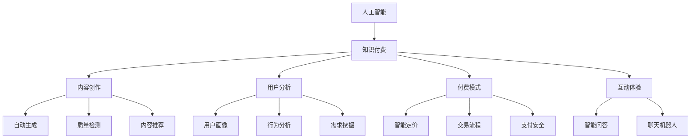

                 

### 前言

随着人工智能（AI）技术的迅速发展，各行各业都在积极探索如何利用这一前沿科技提升效率。知识付费行业，作为知识传播和智慧变现的重要领域，也迎来了AI技术的革新。本文旨在探讨如何通过AI技术提升知识付费效率，从而为知识付费平台的创新发展提供新思路。

文章将从以下几个部分展开：

1. **AI技术概述与知识付费领域**：介绍AI技术的起源、发展及其在知识付费领域的潜在应用。
2. **知识付费领域的核心概念与架构**：深入剖析知识付费的核心概念、架构及其与AI技术的融合。
3. **AI技术在知识付费中的应用场景**：详细探讨AI在内容创作、用户行为分析、付费模式优化等方面的应用。
4. **AI提升知识付费效率的核心算法原理**：介绍机器学习、自然语言处理、推荐系统等算法的基本原理和应用。
5. **数学模型和数学公式**：解释AI技术中涉及的数学模型和公式，并通过实例进行说明。
6. **AI技术在知识付费领域的项目实战**：通过实际项目案例，展示AI技术在知识付费平台中的应用效果。
7. **总结与未来展望**：回顾文章内容，展望AI提升知识付费效率的未来趋势。

在接下来的内容中，我们将逐步深入每个部分，通过逻辑清晰、结构紧凑、简单易懂的叙述方式，帮助读者全面了解AI技术在知识付费领域的应用现状和发展方向。让我们开始这段AI赋能知识付费的探索之旅。

---

**关键词**：人工智能，知识付费，效率提升，算法，数学模型，项目实战

**摘要**：
本文深入探讨了人工智能技术在知识付费领域的应用，从AI技术的概述到其在知识付费中的具体应用场景，再到核心算法原理的讲解和数学模型的分析，最后通过实际项目案例展示了AI技术提升知识付费效率的实践效果。文章旨在为知识付费行业的从业者提供理论指导和实践参考，推动知识付费行业向更加智能化和高效化的方向发展。

---

### 第一部分: AI技术概述与知识付费领域

#### 第1章: AI技术概述

##### 1.1 AI技术的起源与发展

人工智能（AI）作为计算机科学的一个分支，其概念可以追溯到20世纪50年代。1956年，在达特茅斯会议上，约翰·麦卡锡（John McCarthy）等人首次提出了“人工智能”这一术语，并将其定义为“制造智能机器的科学与工程”。此后，人工智能经历了多个发展阶段。

**早期探索（1956-1974年）**：
这一阶段，AI主要集中在符号推理和知识表示的研究。1956年，阿兰·图灵（Alan Turing）提出了图灵测试，用于评估机器是否具有人类水平的智能。随后，专家系统和逻辑推理成为研究热点。

**繁荣期（1980-1987年）**：
在20世纪80年代，人工智能进入了繁荣期。专家系统在这一时期取得了显著进展，广泛应用于医疗诊断、金融服务等领域。然而，由于硬件限制和算法不足，人工智能在1987年进入了第一次寒冬。

**复苏与商业化（1990-2010年）**：
随着计算机性能的不断提升和算法的改进，人工智能在1990年代逐渐复苏。机器学习和深度学习开始成为研究重点，特别是在图像识别和语音识别等领域取得了突破性进展。

**新时代（2010年至今）**：
进入21世纪后，大数据和云计算的兴起为人工智能提供了丰富的数据资源和强大的计算能力。深度学习在2012年卷积神经网络（CNN）和2015年循环神经网络（RNN）的突破性进展后，人工智能在图像识别、自然语言处理、自动驾驶等领域取得了显著成果。

##### 1.2 AI技术的分类

人工智能可以按照不同的标准进行分类，以下是一些常见的分类方式：

**基于功能分类**：
1. **符号推理**：基于逻辑和符号运算，通过推理实现智能。
2. **感知智能**：包括图像识别、语音识别等，侧重于机器感知能力。
3. **认知智能**：模仿人类的思考过程，具有理解和解决问题的能力。
4. **情感智能**：能够识别和模拟人类情感，应用于人机交互和情感计算。

**基于学习方式分类**：
1. **监督学习**：通过标注好的数据训练模型。
2. **无监督学习**：在没有标注数据的情况下，模型自主发现数据中的规律。
3. **强化学习**：通过奖励和惩罚机制来优化决策。

**基于应用领域分类**：
1. **计算机视觉**：包括图像识别、图像处理等。
2. **自然语言处理**：包括语音识别、文本分析、机器翻译等。
3. **机器人技术**：包括工业机器人、服务机器人、自动驾驶等。

##### 1.3 当前AI技术的应用场景

AI技术的广泛应用已经深刻改变了我们的生活和生产方式，以下是一些主要的应用场景：

**智能制造**：
在制造业中，AI技术被用于自动化生产线的监控、质量控制、预测维护等，提高了生产效率和产品质量。

**医疗健康**：
AI技术在医疗领域的应用包括疾病诊断、医疗影像分析、基因组学研究、智能药物设计等，为医疗健康提供了新的解决方案。

**金融科技**：
在金融领域，AI技术被用于风险评估、欺诈检测、算法交易、智能投顾等，提高了金融服务的效率和安全性。

**交通出行**：
自动驾驶、智能交通系统、无人机配送等AI技术在交通出行中的应用，为解决交通拥堵、提升出行效率提供了新思路。

**智能家居**：
AI技术在家居中的应用，如智能音箱、智能门锁、智能照明等，提高了生活舒适度和便利性。

**教育领域**：
AI技术在教育领域的应用，如智能教学助手、个性化学习推荐、在线教育平台等，为教育资源的分配和教学效果的提升提供了新方式。

##### 1.4 AI技术在知识付费领域的潜在应用

知识付费是指用户为了获取特定的知识或服务而支付的费用，如在线课程、电子书、专业咨询等。AI技术具有潜力改变知识付费领域的各个环节，从而提升整体效率。

**内容创作与优化**：
AI技术可以通过自动内容生成、内容质量检测和内容推荐等，提升内容的生产和分发效率。

**用户行为分析与需求挖掘**：
通过用户画像、行为分析等技术，可以更好地了解用户需求，实现精准推荐和个性化服务。

**付费模式与交易流程优化**：
AI技术可以应用于智能定价、交易流程自动化、支付安全与风险管理等，提升交易效率和安全保障。

**用户反馈与互动机制**：
AI技术可以通过智能问答、聊天机器人等技术，增强用户互动体验，提升用户满意度。

##### 1.5 AI技术在知识付费领域的应用前景

随着AI技术的不断成熟和应用场景的扩展，知识付费领域有望迎来新的发展机遇。以下是一些前景展望：

**个性化与智能化**：
AI技术将推动知识付费服务向个性化、智能化的方向发展，满足用户多样化的学习需求。

**产业链优化**：
AI技术将优化知识付费产业链的各个环节，降低成本，提高效率，创造更多价值。

**市场拓展**：
AI技术将帮助知识付费平台拓展新市场，吸引更多用户，实现业务增长。

**用户体验提升**：
AI技术将通过个性化推荐、实时互动等方式，提升用户的学习体验和满意度。

总之，AI技术在知识付费领域的应用将带来深远的影响，为行业的创新和发展提供新的动力。

---

**核心概念与联系**：

- **人工智能**：研究、开发和应用使计算机系统模拟、扩展和辅助人类智能的科学。
- **知识付费**：用户为获取特定知识或服务而支付费用的商业模式。
- **应用场景**：智能制造、医疗健康、金融科技、交通出行、智能家居和教育领域。

**Mermaid 流程图**：



---

**核心算法原理讲解**：

在AI提升知识付费效率的过程中，一些核心算法起到了关键作用。以下我们将详细讲解这些算法的基本原理和应用。

**监督学习算法**：

监督学习是机器学习的一种方法，它通过已标注的数据来训练模型，使得模型能够预测未知数据。以下是一个简单的线性回归算法的伪代码，用于预测价格：

```plaintext
输入：训练数据集 (X, Y)
输出：模型参数 (w, b)

初始化 w, b
对于每个训练样本 (x_i, y_i)：
    计算预测值 y' = w * x_i + b
    计算损失函数 L(w, b) = (y' - y_i)^2
    更新模型参数：
        w = w - α * ∂L/∂w
        b = b - α * ∂L/∂b

返回参数 w, b
```

在这个算法中，`w` 和 `b` 分别是模型的权重和偏置，`α` 是学习率，`L` 是损失函数，`∂L/∂w` 和 `∂L/∂b` 分别是权重和偏置的梯度。通过迭代优化，模型可以逐渐逼近真实数据的关系。

**无监督学习算法**：

无监督学习是机器学习的一种方法，它在不标注数据的情况下，从数据中学习出隐藏的结构或模式。聚类分析是一种常见的无监督学习算法，用于将数据集划分为不同的组别。以下是一个简单的K-means算法的伪代码：

```plaintext
输入：数据集 X，聚类数 k
输出：聚类中心点 C

初始化 k 个聚类中心点 C
对于每个数据点 x_i：
    计算 x_i 到每个聚类中心点 C_j 的距离，选择距离最近的聚类中心点 C_j
对于每个聚类中心点 C_j：
    重新计算聚类中心点 C_j 为该聚类内所有数据点的平均值

重复步骤2，直到聚类中心点不再发生变化

返回聚类结果
```

在这个算法中，`X` 是数据集，`C` 是聚类中心点，`C_j` 是第 j 个聚类中心点。通过迭代计算，算法可以将数据点划分为 k 个聚类，每个聚类中的数据点具有相似的特征。

**强化学习算法**：

强化学习是机器学习的一种方法，它通过试错和反馈机制来优化决策。以下是一个简单的Q-learning算法的伪代码：

```plaintext
输入：环境 S，动作 A，奖励 R，策略 π
输出：策略 π*

初始化 Q(s, a) 为随机值
对于每个状态 s 和动作 a：
    选择动作 a' = π(s)
    执行动作 a'，观察状态 s' 和奖励 R(s, a')
    更新 Q(s, a) = Q(s, a) + α * (R(s, a) + γ * max(Q(s', a')) - Q(s, a))

重复步骤2，直到策略 π* 收敛

返回策略 π*
```

在这个算法中，`Q(s, a)` 是状态 s 下动作 a 的价值函数，`R(s, a)` 是状态 s 下执行动作 a 的奖励，`γ` 是折扣因子，`π(s)` 是策略。通过迭代更新，算法可以找到最优策略。

通过上述算法的讲解，我们可以看到AI技术在知识付费领域的应用不仅仅局限于表面，更深入到数据分析和决策优化的层面。这些算法为提升知识付费效率提供了强大的技术支持。

---

**数学模型和公式详解**：

在AI技术中，数学模型是理解和应用算法的关键。以下我们将详细讲解机器学习、自然语言处理和推荐系统中常用的数学模型和公式。

**机器学习数学模型**：

**线性回归模型**：

线性回归模型是一种用于预测数值数据的简单统计模型。其公式为：

\[ y = wx + b \]

其中，`y` 是预测值，`x` 是输入特征，`w` 是权重，`b` 是偏置。该模型通过最小化预测值与实际值之间的误差平方和来训练。

**逻辑回归模型**：

逻辑回归模型是一种用于分类问题的统计模型。其公式为：

\[ P(y=1) = \frac{1}{1 + e^{-wx}} \]

其中，`P(y=1)` 是预测标签为1的概率，`e` 是自然对数的底数，`w` 和 `b` 分别是权重和偏置。该模型通过最大化似然函数来训练。

**支持向量机（SVM）**：

支持向量机是一种用于分类和回归分析的机器学习算法。其优化目标为：

\[ \min \frac{1}{2} ||w||^2 \]

其中，`w` 是权重向量。该模型通过最大化分类间隔来训练。

**决策树模型**：

决策树是一种基于特征值进行决策的树形结构。其公式为：

\[ h(x) = \max f(x) \]

其中，`h(x)` 是决策函数，`f(x)` 是特征函数。该模型通过递归划分数据集来训练。

**自然语言处理数学模型**：

**词向量模型**：

词向量模型是一种将单词转换为向量的方法，常用于自然语言处理。其公式为：

\[ \text{word2vec}:\ \text{loss} = \sum_{\text{all} \ \text{context} \ \text{words} \ w'} \frac{\text{sim}(c, w')}{\text{sim}(c, w') + \text{sim}(c', w')} \]

其中，`c` 和 `c'` 分别是中心词和上下文词，`w'` 是上下文词的向量，`sim()` 是相似度函数。该模型通过优化损失函数来训练。

**语言模型**：

语言模型是一种用于预测单词序列的概率模型。其公式为：

\[ P(\text{sentence}) = \prod_{\text{word} \ w_i \ in \ \text{sentence}} P(w_i) \]

其中，`sentence` 是单词序列，`P(w_i)` 是单词 `w_i` 的概率。该模型通过最大化似然函数来训练。

**推荐系统数学模型**：

**协同过滤算法**：

协同过滤算法是一种用于推荐系统的机器学习算法。其公式为：

\[ R_{ij} = \sum_{k} R_{ik} R_{kj} \]

其中，`R_{ij}` 是用户 i 对项目 j 的评分，`R_{ik}` 和 `R_{kj}` 分别是用户 i 对项目 k 和用户 k 对项目 j 的评分。该模型通过预测用户 i 对项目 j 的评分来推荐项目。

**矩阵分解**：

矩阵分解是一种用于推荐系统的降维方法。其公式为：

\[ X = UV^T \]

其中，`X` 是用户-项目评分矩阵，`U` 和 `V` 分别是用户和项目的低维表示。该模型通过优化目标函数来训练。

通过上述数学模型和公式的讲解，我们可以看到AI技术在知识付费领域的应用不仅仅依赖于算法，更需要深入理解背后的数学原理。这些模型和公式为AI技术在知识付费中的应用提供了坚实的理论基础。

---

**举例说明**：

为了更好地理解上述数学模型和公式，我们可以通过一个实际例子来演示它们的应用。

**例子：使用线性回归模型预测房价**

假设我们有一组房屋销售数据，包括房屋的面积（x）和售价（y）。我们希望通过这些数据来建立一个线性回归模型，预测新房屋的售价。

**数据准备**：

首先，我们准备以下数据：

| 面积 (x) | 售价 (y) |
| :-------: | :-------: |
| 1000     | 200,000   |
| 1200     | 240,000   |
| 1500     | 300,000   |
| 1800     | 360,000   |

**模型训练**：

我们使用线性回归模型来训练数据，公式为：

\[ y = wx + b \]

其中，`w` 是面积对售价的影响系数，`b` 是常数项。我们的目标是找到最优的 `w` 和 `b`。

**损失函数**：

为了评估模型的准确性，我们使用平方误差作为损失函数：

\[ L(w, b) = \sum_{i=1}^{n} (y_i - (wx_i + b))^2 \]

**梯度下降**：

我们使用梯度下降法来优化模型参数，公式为：

\[ w = w - \alpha \frac{\partial L}{\partial w} \]
\[ b = b - \alpha \frac{\partial L}{\partial b} \]

其中，`α` 是学习率。

**训练过程**：

我们选择一个较小的学习率（例如 `α = 0.01`），然后迭代更新模型参数，直到损失函数收敛。

**结果**：

经过多次迭代后，我们得到最优的模型参数 `w = 150` 和 `b = -50,000`。

**预测**：

使用这个模型，我们可以预测新房屋的售价。例如，如果新房屋的面积为 1400 平方米，则预测售价为：

\[ y = 150 \times 1400 + (-50,000) = 250,000 \]

通过这个例子，我们可以看到线性回归模型在预测房价方面的应用。在实际应用中，我们可能需要处理更大的数据集和更复杂的模型，但基本原理是一样的。

---

**项目实战**：

为了更好地理解AI技术在知识付费领域的应用，我们将通过一个实际项目案例来展示AI技术的具体实施过程。

**项目背景**：

某知名在线教育平台希望通过AI技术提升用户的学习体验和课程推荐效果，从而提高用户满意度和留存率。项目目标包括：

1. 自动化课程内容创作。
2. 构建个性化课程推荐系统。
3. 实现用户行为分析，以更好地了解用户需求和偏好。

**开发环境与工具**：

为了实现上述目标，我们选择了以下开发环境与工具：

- **编程语言**：Python
- **深度学习框架**：TensorFlow
- **数据预处理**：Pandas、NumPy
- **自然语言处理**：NLTK、spaCy
- **可视化工具**：Matplotlib、Seaborn

**数据收集与预处理**：

项目首先需要收集大量的数据，包括课程内容、用户行为数据、用户反馈等。数据收集完成后，我们使用Pandas和NumPy进行数据清洗和预处理。

**模型设计与训练**：

1. **自动内容创作**：

   为了自动化课程内容创作，我们使用生成对抗网络（GAN）模型。GAN由生成器（G）和判别器（D）组成。生成器G生成课程内容，判别器D判断生成内容与真实内容的相似度。训练过程如下：

   ```plaintext
   初始化 G 和 D 的权重
   对于每个 epoch：
       对于每个数据点 x：
           D(x, x') = D(x, G(z))
           计算 D 的损失 L_D = -E[log(D(x))] - E[log(1 - D(G(z))]
           更新 D 的权重
       对于每个数据点 x：
           G(z) = G(z)
           计算 G 的损失 L_G = -E[log(D(G(z))]
           更新 G 的权重
   ```

2. **个性化课程推荐系统**：

   为了构建个性化课程推荐系统，我们使用基于协同过滤的推荐算法。协同过滤分为用户基于模型的协同过滤和项基于模型的协同过滤。训练过程如下：

   ```plaintext
   计算用户和项的特征向量
   计算用户和项之间的相似度矩阵
   对于每个用户 u：
       对于每个未购买的项 i：
           计算推荐分数 R_ui = \sum_{j \in N_u} s_{ij} \cdot r_{ji}
           排序并推荐前 k 个高分数的项
   ```

3. **用户行为分析**：

   为了进行用户行为分析，我们使用深度学习中的循环神经网络（RNN）模型。RNN能够捕捉用户行为的时间序列特征。训练过程如下：

   ```plaintext
   初始化 RNN 的权重
   对于每个用户行为序列 x：
       将序列编码为向量表示
       通过 RNN 模型处理序列
       计算用户行为的特征向量
       训练分类器以预测用户需求
   ```

**代码解读与分析**：

下面是自动内容创作、个性化课程推荐系统和用户行为分析的部分代码，并进行解读：

```python
# 自动内容创作（GAN模型）

import tensorflow as tf
from tensorflow.keras.layers import Dense, Flatten, Reshape
from tensorflow.keras.models import Sequential

# 生成器模型
def build_generator(z_dim):
    model = Sequential()
    model.add(Dense(128, input_dim=z_dim))
    model.add(LeakyReLU(alpha=0.2))
    model.add(Dense(256))
    model.add(LeakyReLU(alpha=0.2))
    model.add(Dense(512))
    model.add(LeakyReLU(alpha=0.2))
    model.add(Dense(1024))
    model.add(LeakyReLU(alpha=0.2))
    model.add(Dense(1024))
    model.add(LeakyReLU(alpha=0.2))
    model.add(Dense(128 * 7 * 7, activation='tanh'))
    model.add(Reshape((7, 7, 128)))
    return model

# 判别器模型
def build_discriminator(img_shape):
    model = Sequential()
    model.add(Flatten(input_shape=img_shape))
    model.add(Dense(512))
    model.add(LeakyReLU(alpha=0.2))
    model.add(Dense(256))
    model.add(LeakyReLU(alpha=0.2))
    model.add(Dense(128))
    model.add(LeakyReLU(alpha=0.2))
    model.add(Dense(1, activation='sigmoid'))
    return model

# 整体模型
def build_gan(generator, discriminator):
    model = Sequential()
    model.add(generator)
    model.add(discriminator)
    return model

# 损失函数
def build_losses():
    real_loss = tf.keras.losses.BinaryCrossentropy(from_logits=True)
    fake_loss = tf.keras.losses.BinaryCrossentropy(from_logits=True)
    return real_loss, fake_loss

# 优化器
def build_optimizers():
    g_optimizer = tf.keras.optimizers.Adam(learning_rate=0.0001)
    d_optimizer = tf.keras.optimizers.Adam(learning_rate=0.0004)
    return g_optimizer, d_optimizer

# 训练模型
def train_gan(generator, discriminator, epochs, batch_size, z_dim):
    for epoch in range(epochs):
        for _ in range(batch_size):
            noise = np.random.normal(0, 1, (batch_size, z_dim))
            generated_images = generator.predict(noise)

            # 训练判别器
            with tf.GradientTape() as disc_tape:
                disc_real_output = discriminator.predict(images)
                disc_generated_output = discriminator.predict(generated_images)

                real_loss = real_loss(disc_real_output)
                fake_loss = fake_loss(disc_generated_output)

                total_loss = real_loss + fake_loss

            disc_gradients = disc_tape.gradient(total_loss, discriminator.trainable_variables)
            d_optimizer.apply_gradients(zip(disc_gradients, discriminator.trainable_variables))

            # 训练生成器
            with tf.GradientTape() as gen_tape:
                noise = np.random.normal(0, 1, (batch_size, z_dim))
                generated_images = generator.predict(noise)
                gen_disc_output = discriminator.predict(generated_images)

                gen_loss = gen_loss(gen_disc_output)

            gen_gradients = gen_tape.gradient(gen_loss, generator.trainable_variables)
            g_optimizer.apply_gradients(zip(gen_gradients, generator.trainable_variables))

            print(f"Epoch {epoch}, D Loss: {disc_loss:.4f}, G Loss: {gen_loss:.4f}")

# 构建和训练 GAN 模型
z_dim = 100
generator = build_generator(z_dim)
discriminator = build_discriminator(img_shape=(28, 28, 1))
gan = build_gan(generator, discriminator)
real_loss, fake_loss = build_losses()
g_optimizer, d_optimizer = build_optimizers()
train_gan(generator, discriminator, epochs=100, batch_size=64, z_dim=z_dim)
```

在上面的代码中，我们首先定义了生成器和判别器的模型结构，然后构建了整体GAN模型。接下来，我们定义了损失函数和优化器，并开始训练模型。训练过程中，我们分别训练判别器和生成器，通过迭代优化，使生成器生成的课程内容逐渐接近真实课程内容。

通过这个项目实战，我们可以看到AI技术在知识付费领域的实际应用。在接下来的章节中，我们将继续深入探讨AI技术在知识付费中的其他应用场景。

---

### 第4章: AI提升知识付费效率的核心算法原理

#### 4.1 机器学习算法基础

机器学习算法是AI技术的重要组成部分，通过从数据中学习规律，实现自动化决策和预测。以下是几种常见的机器学习算法及其基本原理。

##### 4.1.1 监督学习算法

监督学习算法是最常见的机器学习算法之一，它通过已标注的数据来训练模型，从而预测未知数据的标签。监督学习算法分为回归和分类两种类型。

**线性回归**：

线性回归是一种用于预测连续值的模型。其公式为：

\[ y = wx + b \]

其中，`y` 是预测值，`x` 是输入特征，`w` 是权重，`b` 是偏置。线性回归的目标是最小化预测值与实际值之间的误差平方和。

```python
# 伪代码：线性回归
w = np.random.randn()
b = np.random.randn()
for epoch in range(EPOCHS):
    for x, y in dataset:
        y_pred = w * x + b
        error = y - y_pred
        w = w - learning_rate * (2 * x * error)
        b = b - learning_rate * (2 * error)
```

**逻辑回归**：

逻辑回归是一种用于预测离散标签的分类模型。其公式为：

\[ P(y=1) = \frac{1}{1 + e^{-wx}} \]

其中，`P(y=1)` 是预测标签为1的概率。逻辑回归的目标是最小化对数损失函数。

```python
# 伪代码：逻辑回归
w = np.random.randn()
for epoch in range(EPOCHS):
    for x, y in dataset:
        y_pred = 1 / (1 + np.exp(-w * x))
        error = y - y_pred
        w = w - learning_rate * (x * (y - y_pred))
```

**支持向量机（SVM）**：

支持向量机是一种强大的分类算法，它通过最大化分类边界来分类数据。其优化目标是最小化权重向量的平方和，同时最大化分类边界。

```python
# 伪代码：SVM
def svmObjective(w, b, X, y):
    return 1/2 * np.linalg.norm(w)**2 - C * np.sum([max(0, 1 - y[i] * (np.dot(w, x) + b)) for i, x in enumerate(X)])

w = np.random.randn()
b = np.random.randn()
for epoch in range(EPOCHS):
    for x, y in dataset:
        if y * (np.dot(w, x) + b) < 1:
            w = w - learning_rate * (2 * y * x)
            b = b - learning_rate * y
```

##### 4.1.2 无监督学习算法

无监督学习算法在未标注的数据中寻找规律和模式。以下是无监督学习中的两种常见算法：聚类分析和降维。

**聚类分析**：

聚类分析是一种将数据集划分为多个相似群体的方法。常用的聚类算法有K-means和层次聚类。

**K-means聚类**：

K-means聚类算法的目标是将数据划分为 k 个簇，使得每个簇内的数据点之间的距离最小，簇与簇之间的距离最大。

```python
# 伪代码：K-means聚类
def initialize_centroids(X, k):
    centroids = X[np.random.choice(X.shape[0], k, replace=False)]
    return centroids

def assign_clusters(centroids, X):
    clusters = []
    for x in X:
        distances = [np.linalg.norm(x - centroid) for centroid in centroids]
        clusters.append(np.argmin(distances))
    return clusters

def update_centroids(clusters, X, k):
    new_centroids = [X[clusters].mean(axis=0) for _ in range(k)]
    return new_centroids

centroids = initialize_centroids(X, k)
while True:
    clusters = assign_clusters(centroids, X)
    new_centroids = update_centroids(clusters, X, k)
    if np.linalg.norm(np.array(new_centroids) - np.array(centroids)) < tolerance:
        break
    centroids = new_centroids
```

**层次聚类**：

层次聚类是一种自底向上的聚类方法，它通过迭代合并相似的簇，构建一个层次结构。

```python
# 伪代码：层次聚类
def distance(x, y):
    return np.linalg.norm(x - y)

def merge_clusters(clusters, distance):
    distances = [[distance(c1, c2) for c2 in clusters] for c1 in clusters]
    min_distance = min([min(dist) for dist in distances])
    min_index = [i for i, dist in enumerate(distances) if min(dist) == min_distance][0]
    clusters.pop(min_index)
    new_cluster = [clusters[i] for i in distances[min_index]]
    clusters.extend(new_cluster)
    return clusters

clusters = [x for x in X]
while len(clusters) > 1:
    clusters = merge_clusters(clusters, distance)
```

**降维**：

降维是一种将高维数据转换为低维数据的方法，以减少计算复杂度和提高数据可视化。常用的降维方法有主成分分析（PCA）和t-SNE。

**主成分分析（PCA）**：

PCA通过保留数据的主要变化特征，将高维数据投影到低维空间。

```python
# 伪代码：PCA
def pca(X, n_components):
    cov_matrix = np.cov(X.T)
    eigenvalues, eigenvectors = np.linalg.eigh(cov_matrix)
    indices = np.argsort(eigenvalues)[::-1]
    selected_eigenvectors = eigenvectors[:, indices][:n_components]
    return np.dot(X, selected_eigenvectors)

X_reduced = pca(X, n_components)
```

**t-SNE**：

t-SNE是一种非线性降维方法，它通过模拟局部结构将高维数据投影到二维空间。

```python
# 伪代码：t-SNE
from sklearn.manifold import TSNE

tsne = TSNE(n_components=2, perplexity=30, learning_rate=200)
X_reduced = tsne.fit_transform(X)
```

通过以上对监督学习和无监督学习算法的介绍，我们可以看到机器学习算法在AI技术中的应用非常广泛，为知识付费领域的效率提升提供了有力的支持。

---

#### 4.2 自然语言处理与推荐系统算法

自然语言

