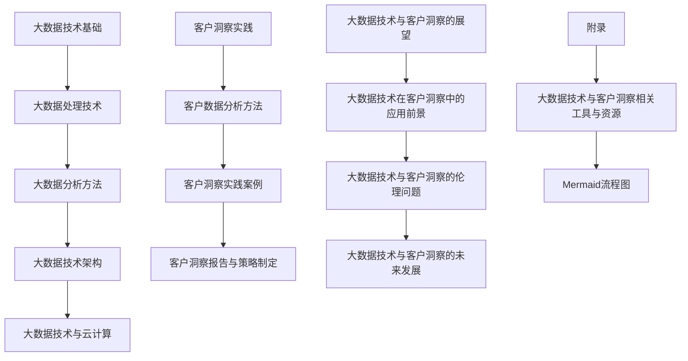
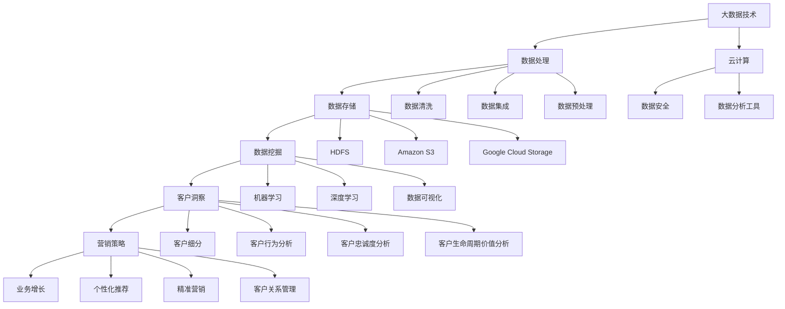

                 

# 《如何利用大数据技术进行客户洞察》

> 关键词：大数据技术、客户洞察、数据处理、数据分析、云计算、数据可视化、数据挖掘

> 摘要：本文将深入探讨如何利用大数据技术进行客户洞察。从大数据技术基础开始，我们逐步了解数据处理、分析方法和架构，并探讨云计算在其中的重要作用。接着，我们详细阐述客户洞察的核心概念、实践方法和案例，最终展望大数据技术与客户洞察的未来发展趋势，以及面临的伦理问题。

## 目录大纲

1. 大数据技术基础
2. 客户洞察实践
3. 大数据技术与客户洞察的展望
4. 附录

## 第一部分：大数据技术基础

### 第1章：大数据技术概述

#### 1.1 大数据的定义与特点

大数据（Big Data）是指无法使用传统数据库工具在合理时间内进行存储、管理和分析的数据集。这些数据具有4V特点：Volume（大量）、Velocity（高速）、Variety（多样性）和Veracity（真实性）。

- **Volume**：数据规模巨大，通常从GB到TB甚至PB级别。
- **Velocity**：数据处理速度快，需要实时或近实时分析。
- **Variety**：数据来源广泛，包括结构化、半结构化和非结构化数据。
- **Veracity**：数据质量参差不齐，真实性难以保证。

#### 1.2 大数据技术的发展历程

大数据技术的发展经历了以下几个阶段：

1. **存储技术的发展**：从磁盘阵列到分布式文件系统（如HDFS），解决了大数据存储问题。
2. **计算能力的提升**：从单一服务器到分布式计算框架（如MapReduce、Spark），提高了数据处理速度。
3. **数据分析工具的进步**：从传统的SQL查询到数据挖掘、机器学习工具，提高了数据分析能力。
4. **云计算的兴起**：云计算为大数据处理提供了弹性计算和存储资源，降低了成本。

#### 1.3 大数据技术的应用领域

大数据技术在多个领域得到广泛应用：

- **金融行业**：风险控制、欺诈检测、客户关系管理。
- **零售行业**：需求预测、库存管理、客户细分。
- **医疗行业**：疾病预测、个性化治疗、健康管理。
- **互联网行业**：推荐系统、广告投放、用户行为分析。

### 第2章：大数据处理技术

#### 2.1 数据采集与存储

数据采集与存储是大数据处理的基础。常见的数据采集方式包括日志收集、API调用和传感器数据收集。存储方面，分布式文件系统如HDFS、对象存储如Amazon S3等被广泛应用。

#### 2.2 数据清洗与预处理

数据清洗与预处理是确保数据质量的重要步骤。数据清洗包括去除重复数据、处理缺失值和异常值。预处理包括数据转换、归一化和特征工程等。

#### 2.3 数据集成与数据仓库

数据集成是将来自不同源的数据合并到一个统一的数据存储中。数据仓库用于存储和管理大量数据，支持复杂的数据查询和分析。

### 第3章：大数据分析方法

#### 3.1 数据可视化

数据可视化是将数据转换为图形或图表，帮助人们直观理解数据。常见的可视化工具包括Tableau、Power BI等。

#### 3.2 数据挖掘技术

数据挖掘是从大量数据中自动发现规律和模式的过程。常见的技术包括分类、聚类、关联规则挖掘等。

#### 3.3 客户行为分析

客户行为分析是大数据技术在商业领域的重要应用。通过分析客户的历史行为数据，企业可以更好地了解客户需求，优化产品和服务。

### 第4章：大数据技术架构

#### 4.1 Hadoop生态系统

Hadoop是大数据技术的代表性框架，包括HDFS（分布式文件系统）、MapReduce（分布式计算框架）等。

#### 4.2 Spark生态系统

Spark是Hadoop的替代品，具有更高的处理速度。其生态系统包括Spark SQL、Spark MLlib等。

#### 4.3 Flink生态系统

Flink是一种流处理框架，适合实时数据处理。其生态系统包括Flink SQL、Flink ML等。

### 第5章：大数据技术与云计算

#### 5.1 云计算与大数据的关系

云计算为大数据处理提供了弹性计算和存储资源，降低了成本。大数据技术与云计算的结合，使得数据处理和分析更加高效和灵活。

#### 5.2 云计算在数据存储与处理中的应用

云计算在数据存储和处理中具有以下优势：

- **弹性扩展**：根据数据量自动扩展资源。
- **低成本**：按需付费，降低基础设施成本。
- **高可用性**：分布式架构保证数据安全。

#### 5.3 大数据云平台的构建

大数据云平台包括以下组件：

- **数据采集与存储**：使用云存储服务如Amazon S3。
- **数据处理与计算**：使用云计算服务如Amazon EMR。
- **数据分析与挖掘**：使用数据分析和挖掘工具。

## 第二部分：客户洞察实践

### 第6章：客户洞察的核心概念

#### 6.1 客户洞察的定义

客户洞察是指通过数据分析和挖掘，深入了解客户需求、行为和偏好，从而为企业决策提供依据。

#### 6.2 客户洞察的价值

客户洞察有助于企业：

- **优化产品和服务**：根据客户需求进行个性化定制。
- **提升客户满意度**：提供更加精准的推荐和优惠。
- **降低运营成本**：优化营销策略，减少无效投放。

#### 6.3 客户洞察的流程

客户洞察的流程包括以下步骤：

1. **数据收集**：收集客户相关数据。
2. **数据清洗与预处理**：确保数据质量。
3. **数据分析与挖掘**：提取有价值的信息。
4. **客户细分与标签**：根据分析结果对客户进行分类。
5. **决策与执行**：根据客户洞察制定营销策略。

### 第7章：客户数据分析方法

#### 7.1 客户细分

客户细分是将客户按照一定标准划分为不同的群体。常见的细分方法包括基于行为、基于人口统计和基于购买行为等。

#### 7.2 客户忠诚度分析

客户忠诚度分析旨在了解客户对企业产品和服务的忠诚度。常用的指标包括重复购买率、客户满意度等。

#### 7.3 客户生命周期价值分析

客户生命周期价值分析是指计算客户在生命周期内为企业带来的总收益。常用的模型包括CLV（客户生命周期价值）模型和CAC（客户获取成本）模型。

### 第8章：客户洞察实践案例

#### 8.1 案例一：电商行业的客户洞察

电商行业利用大数据技术进行客户洞察，通过分析客户购物行为和偏好，实现个性化推荐和精准营销。

#### 8.2 案例二：金融行业的客户洞察

金融行业利用大数据技术进行客户洞察，通过分析客户交易行为和信用记录，实现风险控制和个性化金融服务。

#### 8.3 案例三：零售行业的客户洞察

零售行业利用大数据技术进行客户洞察，通过分析客户消费习惯和购物偏好，实现库存管理和精准营销。

### 第9章：客户洞察报告与策略制定

#### 9.1 客户洞察报告的编写

客户洞察报告是对客户洞察过程的总结和呈现。编写报告时，需要包括数据来源、分析过程、结果和策略建议等内容。

#### 9.2 客户洞察策略的制定

客户洞察策略是指根据客户洞察报告制定的企业营销策略。策略制定时，需要考虑客户需求、市场竞争状况和企业目标等因素。

#### 9.3 客户洞察的持续优化

客户洞察是一个持续的过程。企业需要不断收集新的数据，更新客户洞察报告，并根据新的结果调整营销策略。

## 第三部分：大数据技术与客户洞察的展望

### 第10章：大数据技术在客户洞察中的应用前景

#### 10.1 新兴技术在客户洞察中的应用

随着人工智能、区块链等新兴技术的发展，大数据技术在客户洞察中的应用前景更加广阔。例如，通过人工智能技术进行个性化推荐，通过区块链技术确保数据隐私和安全。

#### 10.2 客户洞察的挑战与机遇

大数据技术在客户洞察中面临挑战，如数据隐私保护、数据质量提升等。同时，这些挑战也带来了机遇，如通过技术创新解决这些问题，提升客户洞察的准确性和价值。

#### 10.3 未来大数据技术在客户洞察领域的趋势

未来大数据技术在客户洞察领域的趋势包括：

- **智能化**：利用人工智能技术实现更精准的客户洞察。
- **实时化**：实现实时数据分析和客户行为预测。
- **个性化**：提供更加个性化的产品和服务。

### 第11章：大数据技术与客户洞察的伦理问题

#### 11.1 数据隐私保护

大数据技术在客户洞察中涉及大量个人信息，因此数据隐私保护至关重要。企业需要遵守相关法律法规，采取措施确保数据安全。

#### 11.2 数据伦理与道德

大数据技术在客户洞察中，企业需要遵循数据伦理和道德原则，尊重客户权利，避免滥用数据。

#### 11.3 客户洞察的可持续发展

大数据技术在客户洞察中的应用需要考虑可持续发展，确保企业长期健康发展。

### 第12章：大数据技术与客户洞察的未来发展

#### 12.1 大数据技术在企业中的战略地位

大数据技术在企业中的战略地位日益重要。企业需要将大数据技术作为核心竞争力，推动业务创新和增长。

#### 12.2 客户洞察在商业决策中的应用

客户洞察在商业决策中发挥着重要作用。企业需要充分利用大数据技术，提升决策质量和效率。

#### 12.3 大数据技术与客户洞察的融合与创新

大数据技术与客户洞察的融合与创新是未来发展的关键。企业需要积极探索新技术，推动业务模式创新。

## 附录

### 附录 A：大数据技术与客户洞察相关工具与资源

#### A.1 大数据技术工具介绍

- Hadoop
- Spark
- Flink
- Tableau
- Power BI

#### A.2 客户洞察分析方法论

- 客户细分
- 客户忠诚度分析
- 客户生命周期价值分析

#### A.3 大数据技术与客户洞察实践案例库

- 电商行业
- 金融行业
- 零售行业

#### A.4 大数据技术与客户洞察学习资源推荐

- 《大数据时代》
- 《客户洞察：商业成功的秘密》
- 《大数据营销》

#### A.5 客户洞察报告模板及示例

- 客户洞察报告模板
- 客户洞察报告示例

#### A.6 大数据技术与客户洞察专业书籍推荐

- 《大数据技术导论》
- 《大数据分析：方法与实践》
- 《大数据战略》

### 附录 B：Mermaid 流程图



## 作者信息

作者：AI天才研究院/AI Genius Institute & 禅与计算机程序设计艺术 /Zen And The Art of Computer Programming

---

在接下来的内容中，我们将深入探讨大数据技术的基础知识，并逐步展示如何将大数据技术应用于客户洞察。通过详细的讲解和案例分享，读者将了解大数据技术在实际应用中的价值，以及如何实现高效的客户洞察。让我们开始吧！<|user|>## 第一部分：大数据技术基础

### 第1章：大数据技术概述

#### 1.1 大数据的定义与特点

大数据（Big Data）是指无法使用传统数据库工具在合理时间内进行存储、管理和分析的数据集。这些数据具有4V特点：Volume（大量）、Velocity（高速）、Variety（多样性）和Veracity（真实性）。

- **Volume**：数据规模巨大，通常从GB到TB甚至PB级别。例如，Facebook每天生成的数据量就高达TB级。
- **Velocity**：数据处理速度快，需要实时或近实时分析。例如，社交媒体平台需要实时处理用户发布的内容。
- **Variety**：数据来源广泛，包括结构化、半结构化和非结构化数据。例如，图像、音频、视频等非结构化数据在社交媒体中非常常见。
- **Veracity**：数据质量参差不齐，真实性难以保证。例如，社交媒体上的虚假信息可能会对数据质量产生负面影响。

#### 1.2 大数据技术的发展历程

大数据技术的发展经历了以下几个阶段：

1. **存储技术的发展**：从磁盘阵列到分布式文件系统（如HDFS），解决了大数据存储问题。HDFS是Hadoop的核心组件，负责存储大数据。
2. **计算能力的提升**：从单一服务器到分布式计算框架（如MapReduce、Spark），提高了数据处理速度。MapReduce和Spark是大数据处理的核心框架。
3. **数据分析工具的进步**：从传统的SQL查询到数据挖掘、机器学习工具，提高了数据分析能力。例如，R和Python等编程语言在数据分析中得到了广泛应用。
4. **云计算的兴起**：云计算为大数据处理提供了弹性计算和存储资源，降低了成本。例如，Amazon Web Services（AWS）和Microsoft Azure等云服务提供了丰富的大数据处理工具。

#### 1.3 大数据技术的应用领域

大数据技术在多个领域得到广泛应用：

- **金融行业**：风险控制、欺诈检测、客户关系管理。例如，银行可以利用大数据技术分析客户交易行为，及时发现异常交易。
- **零售行业**：需求预测、库存管理、客户细分。例如，电商可以利用大数据技术分析客户购物行为，实现个性化推荐。
- **医疗行业**：疾病预测、个性化治疗、健康管理。例如，医疗机构可以利用大数据技术分析患者数据，优化治疗方案。
- **互联网行业**：推荐系统、广告投放、用户行为分析。例如，社交媒体平台可以利用大数据技术分析用户行为，实现精准广告投放。

### 第2章：大数据处理技术

#### 2.1 数据采集与存储

数据采集与存储是大数据处理的基础。常见的数据采集方式包括日志收集、API调用和传感器数据收集。存储方面，分布式文件系统如HDFS、对象存储如Amazon S3等被广泛应用。

#### 2.2 数据清洗与预处理

数据清洗与预处理是确保数据质量的重要步骤。数据清洗包括去除重复数据、处理缺失值和异常值。预处理包括数据转换、归一化和特征工程等。

#### 2.3 数据集成与数据仓库

数据集成是将来自不同源的数据合并到一个统一的数据存储中。数据仓库用于存储和管理大量数据，支持复杂的数据查询和分析。

### 第3章：大数据分析方法

#### 3.1 数据可视化

数据可视化是将数据转换为图形或图表，帮助人们直观理解数据。常见的可视化工具包括Tableau、Power BI等。

#### 3.2 数据挖掘技术

数据挖掘是从大量数据中自动发现规律和模式的过程。常见的技术包括分类、聚类、关联规则挖掘等。

#### 3.3 客户行为分析

客户行为分析是大数据技术在商业领域的重要应用。通过分析客户的历史行为数据，企业可以更好地了解客户需求，优化产品和服务。

### 第4章：大数据技术架构

#### 4.1 Hadoop生态系统

Hadoop是大数据技术的代表性框架，包括HDFS（分布式文件系统）、MapReduce（分布式计算框架）等。

#### 4.2 Spark生态系统

Spark是Hadoop的替代品，具有更高的处理速度。其生态系统包括Spark SQL、Spark MLlib等。

#### 4.3 Flink生态系统

Flink是一种流处理框架，适合实时数据处理。其生态系统包括Flink SQL、Flink ML等。

### 第5章：大数据技术与云计算

#### 5.1 云计算与大数据的关系

云计算为大数据处理提供了弹性计算和存储资源，降低了成本。大数据技术与云计算的结合，使得数据处理和分析更加高效和灵活。

#### 5.2 云计算在数据存储与处理中的应用

云计算在数据存储和处理中具有以下优势：

- **弹性扩展**：根据数据量自动扩展资源。
- **低成本**：按需付费，降低基础设施成本。
- **高可用性**：分布式架构保证数据安全。

#### 5.3 大数据云平台的构建

大数据云平台包括以下组件：

- **数据采集与存储**：使用云存储服务如Amazon S3。
- **数据处理与计算**：使用云计算服务如Amazon EMR。
- **数据分析与挖掘**：使用数据分析和挖掘工具。

## 总结

在第一部分中，我们介绍了大数据技术的定义、特点、发展历程和应用领域。随后，我们详细探讨了大数据处理技术、分析方法和架构，以及大数据技术与云计算的关系。通过这一部分的介绍，读者对大数据技术有了更全面的了解，为后续的客户洞察实践奠定了基础。在接下来的内容中，我们将深入探讨客户洞察的核心概念和实践方法。让我们继续前行！<|user|>## 第二部分：客户洞察实践

### 第6章：客户洞察的核心概念

#### 6.1 客户洞察的定义

客户洞察（Customer Insights）是指通过数据分析和挖掘，深入了解客户需求、行为和偏好，从而为企业决策提供依据。客户洞察不仅关注客户当前的行为，还关注客户未来的需求和潜在价值。

#### 6.2 客户洞察的价值

客户洞察对企业的战略决策和业务运营具有重要意义，主要体现在以下几个方面：

1. **优化产品和服务**：通过深入了解客户需求，企业可以开发出更符合市场需求的创新产品和服务。
2. **提升客户满意度**：根据客户洞察，企业可以提供更加个性化的产品和服务，从而提升客户满意度。
3. **降低运营成本**：通过优化营销策略，企业可以减少无效的营销投入，降低运营成本。
4. **提升客户忠诚度**：了解客户的偏好和需求，有助于企业制定有效的客户关系管理策略，提升客户忠诚度。
5. **预测市场趋势**：通过对客户数据的长期分析，企业可以预测市场趋势，提前布局市场。

#### 6.3 客户洞察的流程

客户洞察的流程通常包括以下几个步骤：

1. **数据收集**：收集与客户相关的数据，包括行为数据、交易数据和反馈数据等。
2. **数据清洗**：对收集到的数据进行清洗，去除重复数据、填补缺失值和处理异常值。
3. **数据存储**：将清洗后的数据存储到数据库或数据仓库中，以便后续分析。
4. **数据建模**：根据业务需求，建立数据模型，提取有价值的信息。
5. **数据分析**：运用数据分析方法，如数据挖掘、机器学习等，对数据进行深入分析。
6. **客户细分**：根据数据分析结果，将客户划分为不同的群体，为后续策略制定提供依据。
7. **策略制定**：根据客户细分结果，制定个性化的营销策略和客户关系管理计划。
8. **执行与监控**：执行策略，并持续监控客户反馈和市场变化，调整策略以实现最佳效果。

### 第7章：客户数据分析方法

#### 7.1 客户细分

客户细分是将客户根据不同的特征划分为不同的群体，以便更好地理解客户需求和市场。常见的客户细分方法包括以下几种：

1. **基于行为的细分**：根据客户的行为模式进行分类，如购物频率、购买金额、访问时长等。
2. **基于人口统计的细分**：根据客户的年龄、性别、收入、地理位置等人口统计特征进行分类。
3. **基于购买行为的细分**：根据客户的购买历史和偏好进行分类，如高频客户、潜力客户、流失客户等。
4. **基于价值的细分**：根据客户为企业带来的价值进行分类，如高价值客户、中价值客户、低价值客户等。

#### 7.2 客户忠诚度分析

客户忠诚度分析旨在了解客户对企业的忠诚程度，从而制定相应的客户关系管理策略。常见的忠诚度分析指标包括：

1. **重复购买率**：客户在一定时间内重复购买的次数。
2. **客户满意度**：客户对企业产品和服务的满意度。
3. **客户保留率**：客户在一段时间内继续与企业保持业务关系的比例。
4. **净推荐值（NPS）**：客户向他人推荐企业或产品的意愿。

#### 7.3 客户生命周期价值分析

客户生命周期价值（CLV）分析是指根据客户在整个生命周期内为企业带来的收益，预测客户的潜在价值和贡献。CLV分析包括以下几个步骤：

1. **客户获取成本（CAC）**：企业为获取一个新客户所付出的成本。
2. **平均订单价值（AOV）**：客户每次购买的平均金额。
3. **购买频率**：客户在一定时间内购买产品的次数。
4. **客户生命周期**：客户与企业保持业务关系的平均时间。
5. **客户流失率**：客户在一定时间内停止购买产品的比例。

通过CLV分析，企业可以识别高价值客户，并制定针对性的营销策略，以提升客户生命周期价值。

### 第8章：客户洞察实践案例

#### 8.1 案例一：电商行业的客户洞察

电商行业利用大数据技术进行客户洞察，通过分析客户购物行为和偏好，实现个性化推荐和精准营销。

1. **数据收集**：收集客户行为数据，如浏览历史、购物车数据、购买记录等。
2. **数据清洗**：清洗数据，去除重复和异常数据。
3. **数据分析**：运用机器学习算法，分析客户行为，发现客户偏好和需求。
4. **客户细分**：根据分析结果，将客户划分为不同的群体，如高频客户、低频客户、潜力客户等。
5. **个性化推荐**：根据客户细分结果，为每个客户推荐个性化的商品和优惠。
6. **策略优化**：根据客户反馈和市场变化，不断优化推荐策略，提高客户满意度。

#### 8.2 案例二：金融行业的客户洞察

金融行业利用大数据技术进行客户洞察，通过分析客户交易行为和信用记录，实现风险控制和个性化金融服务。

1. **数据收集**：收集客户交易数据、信用记录、风险信息等。
2. **数据清洗**：清洗数据，去除重复和异常数据。
3. **数据分析**：运用数据挖掘技术，分析客户交易行为和信用状况，识别潜在风险。
4. **客户细分**：根据分析结果，将客户划分为不同的风险等级，如高风险客户、中风险客户、低风险客户等。
5. **个性化金融服务**：根据客户风险等级，提供差异化的金融服务和风险控制策略。
6. **策略优化**：根据客户反馈和市场变化，不断优化金融服务策略，降低风险。

#### 8.3 案例三：零售行业的客户洞察

零售行业利用大数据技术进行客户洞察，通过分析客户消费习惯和购物偏好，实现库存管理和精准营销。

1. **数据收集**：收集客户购买记录、库存数据、促销活动数据等。
2. **数据清洗**：清洗数据，去除重复和异常数据。
3. **数据分析**：运用机器学习算法，分析客户消费习惯和购物偏好，预测未来需求。
4. **客户细分**：根据分析结果，将客户划分为不同的群体，如高频客户、低频客户、冲动型客户等。
5. **精准营销**：根据客户细分结果，为每个客户推送个性化的促销信息和优惠。
6. **库存管理**：根据客户需求预测，优化库存管理策略，降低库存成本。

### 第9章：客户洞察报告与策略制定

#### 9.1 客户洞察报告的编写

客户洞察报告是对客户洞察过程的总结和呈现。编写报告时，需要包括以下内容：

1. **数据来源**：报告所使用的数据来源，如客户行为数据、市场数据等。
2. **分析过程**：报告的分析过程，包括数据清洗、数据建模、数据分析等。
3. **分析结果**：报告的分析结果，如客户细分结果、客户忠诚度分析结果等。
4. **策略建议**：根据分析结果，提出的营销策略、客户关系管理策略等。

#### 9.2 客户洞察策略的制定

客户洞察策略的制定需要考虑以下因素：

1. **客户需求**：根据客户洞察结果，了解客户需求，制定针对性的营销策略。
2. **市场竞争**：分析竞争对手的营销策略，制定差异化的营销策略。
3. **企业目标**：根据企业整体战略目标，制定可行的客户洞察策略。
4. **资源限制**：考虑企业资源和预算，制定切实可行的策略。

#### 9.3 客户洞察的持续优化

客户洞察是一个持续的过程。企业需要不断收集新的数据，更新客户洞察报告，并根据新的结果调整营销策略。以下是一些优化客户洞察的策略：

1. **数据多样化**：收集更多的数据来源，如社交媒体数据、地理位置数据等，提高数据分析的准确性。
2. **数据实时化**：实现数据的实时处理和分析，及时响应市场变化。
3. **技术升级**：引入新的技术和工具，如人工智能、机器学习等，提高数据分析能力。
4. **用户反馈**：收集客户反馈，及时调整营销策略，提高客户满意度。

## 总结

在第二部分中，我们介绍了客户洞察的核心概念、数据分析方法以及实践案例。客户洞察是企业利用大数据技术了解客户需求、优化产品和服务、提升客户满意度的重要手段。通过客户细分、客户忠诚度分析和客户生命周期价值分析等方法，企业可以更好地了解客户，制定个性化的营销策略。在实际应用中，电商、金融和零售等行业已经成功利用大数据技术进行客户洞察，取得了显著的业务成果。在接下来的内容中，我们将探讨大数据技术与客户洞察的展望，以及面临的伦理问题。让我们继续前行！<|user|>## 第三部分：大数据技术与客户洞察的展望

### 第10章：大数据技术在客户洞察中的应用前景

#### 10.1 新兴技术在客户洞察中的应用

随着大数据技术的不断发展，新兴技术也在客户洞察中得到了广泛应用，为企业的决策提供了更加精准和实时的支持。

1. **人工智能（AI）**：人工智能技术在客户洞察中的应用主要包括智能推荐系统、聊天机器人、图像识别等。通过机器学习和深度学习算法，企业可以更好地理解客户行为，提供个性化的产品和服务。例如，电商企业可以利用AI技术分析客户浏览和购买行为，实现精准的个性化推荐。

2. **区块链**：区块链技术具有去中心化、不可篡改和透明等特点，可以确保客户数据的安全和隐私。在客户洞察中，区块链技术可以用于数据存储、数据共享和智能合约等方面，提高数据的安全性和可信度。例如，金融机构可以利用区块链技术记录客户交易数据，确保数据的真实性和不可篡改。

3. **物联网（IoT）**：物联网技术可以通过传感器和设备收集大量实时数据，为企业的客户洞察提供丰富的数据源。例如，智能家居设备可以收集用户的生活习惯和偏好，为家居用品企业提供个性化的推荐和服务。

#### 10.2 客户洞察的挑战与机遇

大数据技术在客户洞察中面临诸多挑战，如数据隐私保护、数据质量提升、技术成本等。但同时，这些挑战也带来了新的机遇。

1. **数据隐私保护**：随着数据隐私保护法律法规的不断完善，企业需要采取措施确保客户数据的安全和隐私。例如，采用加密技术、数据脱敏和访问控制等方法，保护客户数据不被泄露。

2. **数据质量提升**：数据质量是客户洞察的基础。企业需要投入更多的资源进行数据清洗、数据整合和数据质量管理，确保数据的准确性和可靠性。

3. **技术成本**：大数据技术的实施和维护成本较高，企业需要权衡投入和回报。通过采用云计算和开源技术，企业可以降低技术成本，提高数据处理的效率。

#### 10.3 未来大数据技术在客户洞察领域的趋势

未来大数据技术在客户洞察领域的发展趋势将呈现以下几个方面：

1. **智能化**：随着人工智能技术的发展，客户洞察将更加智能化。通过机器学习和深度学习算法，企业可以更好地理解客户行为，提供个性化的产品和服务。

2. **实时化**：实时数据分析和处理将成为客户洞察的重要趋势。通过实时数据分析，企业可以快速响应市场变化，优化营销策略。

3. **个性化**：客户洞察将更加注重个性化。通过深入了解客户需求和行为，企业可以提供个性化的产品和服务，提升客户满意度。

4. **数据驱动**：数据将成为企业决策的重要依据。通过大数据技术，企业可以全面了解客户需求和市场动态，实现数据驱动的决策。

### 第11章：大数据技术与客户洞察的伦理问题

#### 11.1 数据隐私保护

数据隐私保护是大数据技术与客户洞察领域的重要伦理问题。企业需要采取措施确保客户数据的安全和隐私，遵守相关法律法规。

1. **数据加密**：企业应采用数据加密技术，确保客户数据在传输和存储过程中的安全。
2. **数据脱敏**：在数据分析过程中，企业应对敏感数据进行脱敏处理，防止数据泄露。
3. **访问控制**：企业应建立严格的访问控制机制，确保只有授权人员可以访问客户数据。

#### 11.2 数据伦理与道德

数据伦理与道德是大数据技术与客户洞察领域的重要伦理问题。企业应遵循数据伦理和道德原则，尊重客户权利。

1. **数据真实性**：企业应确保收集的数据真实可靠，不制造和传播虚假信息。
2. **客户知情权**：企业应告知客户其数据将被用于何种目的，并取得客户的知情同意。
3. **透明度**：企业应公开其数据收集、处理和分析的方法，接受社会监督。

#### 11.3 客户洞察的可持续发展

大数据技术与客户洞察的可持续发展是未来发展的关键。企业应关注数据质量和数据隐私保护，确保数据的使用符合可持续发展原则。

1. **数据质量管理**：企业应建立数据质量管理机制，确保数据的准确性、完整性和可靠性。
2. **数据隐私保护**：企业应采取措施保护客户数据的安全和隐私，遵守相关法律法规。
3. **社会责任**：企业应承担社会责任，合理利用大数据技术，为社会发展做出贡献。

### 第12章：大数据技术与客户洞察的未来发展

#### 12.1 大数据技术在企业中的战略地位

大数据技术在企业中的战略地位日益重要。企业应将大数据技术作为核心竞争力，推动业务创新和增长。

1. **业务决策**：大数据技术可以帮助企业做出更加科学的业务决策，提升企业竞争力。
2. **产品创新**：大数据技术可以挖掘客户需求，推动产品创新，提高产品市场竞争力。
3. **市场营销**：大数据技术可以提升市场营销的精准度，降低营销成本，提高营销效果。

#### 12.2 客户洞察在商业决策中的应用

客户洞察在商业决策中发挥着重要作用。企业应充分利用大数据技术，提升决策质量和效率。

1. **市场定位**：通过客户洞察，企业可以明确目标客户群体，制定精准的市场定位策略。
2. **产品定价**：通过客户洞察，企业可以了解客户对产品价格的敏感度，制定合理的定价策略。
3. **营销策略**：通过客户洞察，企业可以制定个性化的营销策略，提高营销效果。

#### 12.3 大数据技术与客户洞察的融合与创新

大数据技术与客户洞察的融合与创新是未来发展的关键。企业应积极探索新技术，推动业务模式创新。

1. **跨领域融合**：大数据技术与其他领域的融合，如人工智能、区块链等，将为客户洞察带来新的机遇。
2. **业务模式创新**：通过大数据技术，企业可以探索新的业务模式，实现商业模式创新。
3. **服务创新**：通过大数据技术，企业可以提供更加个性化的产品和服务，提升客户体验。

## 总结

在第三部分中，我们探讨了大数据技术在客户洞察中的应用前景、面临的伦理问题以及未来发展。大数据技术的不断发展为企业的客户洞察提供了丰富的工具和方法，但同时也带来了数据隐私保护、数据伦理和可持续发展等挑战。企业需要积极应对这些挑战，探索新技术，实现业务模式创新，以在激烈的市场竞争中立于不败之地。在未来的发展中，大数据技术与客户洞察将继续相互融合，推动企业实现可持续发展。让我们共同期待大数据技术与客户洞察的未来！<|user|>## 附录

### 附录 A：大数据技术与客户洞察相关工具与资源

#### A.1 大数据技术工具介绍

1. **Hadoop**：一个分布式计算框架，适用于处理大规模数据集。
   - 官网：[hadoop.apache.org](http://hadoop.apache.org/)
   - 优势：高可靠性和可扩展性。

2. **Spark**：一个高速的分布式计算引擎，适用于大规模数据处理。
   - 官网：[spark.apache.org](http://spark.apache.org/)
   - 优势：内存计算和高吞吐量。

3. **Flink**：一个流处理框架，适用于实时数据处理和分析。
   - 官网：[flink.apache.org](http://flink.apache.org/)
   - 优势：低延迟和高吞吐量。

4. **HBase**：一个分布式、可扩展的列存储数据库。
   - 官网：[hbase.apache.org](http://hbase.apache.org/)
   - 优势：高读写速度和灵活性。

5. **MongoDB**：一个分布式文档数据库，适用于存储和管理非结构化数据。
   - 官网：[mongodb.com](https://www.mongodb.com/)
   - 优势：灵活的数据模型和强大的查询能力。

#### A.2 客户洞察分析方法论

1. **客户细分**：
   - 方法：基于客户行为、人口统计和购买历史进行分类。
   - 工具：SPSS、R、Python等。

2. **客户忠诚度分析**：
   - 方法：计算重复购买率、客户保留率和净推荐值（NPS）。
   - 工具：Excel、R、Python等。

3. **客户生命周期价值分析**：
   - 方法：计算客户获取成本（CAC）、客户生命周期价值和终身价值（LTV）。
   - 工具：Excel、R、Python等。

#### A.3 大数据技术与客户洞察实践案例库

1. **电商行业**：
   - 案例：Amazon、Alibaba使用大数据技术进行个性化推荐和精准营销。
   - 实践：通过客户行为分析，实现精准广告投放和个性化推荐。

2. **金融行业**：
   - 案例：Bank of America、Citibank使用大数据技术进行风险控制和欺诈检测。
   - 实践：通过交易行为分析，识别异常交易，降低风险。

3. **零售行业**：
   - 案例：Walmart、Target使用大数据技术优化库存管理和客户体验。
   - 实践：通过需求预测和客户细分，实现精准库存管理和个性化促销。

#### A.4 大数据技术与客户洞察学习资源推荐

1. **《大数据时代》**：作者：涂子沛。
   - 简介：详细介绍了大数据的定义、特点和应用。

2. **《客户洞察：商业成功的秘密》**：作者：马丁·林斯特龙。
   - 简介：探讨了如何通过客户洞察实现商业成功。

3. **《大数据营销》**：作者：乔·哈里斯。
   - 简介：介绍了大数据在市场营销中的应用和实践。

#### A.5 客户洞察报告模板及示例

1. **报告模板**：
   - 内容：摘要、背景、数据分析、结果、结论、建议等。

2. **示例**：
   - **电商行业客户洞察报告**：
     - 摘要：概述报告目的、方法和主要发现。
     - 背景：介绍电商行业现状和客户洞察的重要性。
     - 数据分析：分析客户行为、购买习惯等。
     - 结果：总结分析结果，如客户细分、忠诚度分析等。
     - 结论：提出结论和建议，如优化营销策略、提升客户满意度等。

#### A.6 大数据技术与客户洞察专业书籍推荐

1. **《大数据技术导论》**：作者：韩家炜。
   - 简介：全面介绍大数据技术的基础知识。

2. **《大数据分析：方法与实践》**：作者：何晓阳。
   - 简介：详细介绍大数据分析的方法和实战技巧。

3. **《大数据战略》**：作者：托马斯·H·达文波特。
   - 简介：探讨大数据对企业战略的影响和实施方法。

### 附录 B：Mermaid 流程图

以下是一个使用Mermaid绘制的流程图示例，展示了大数据技术与客户洞察的关系：



此流程图展示了从大数据技术到客户洞察再到营销策略的完整过程，以及云计算和数据安全在其中的重要性。通过这种方式，企业可以更好地理解和应用大数据技术，实现业务增长。作者：AI天才研究院/AI Genius Institute & 禅与计算机程序设计艺术 /Zen And The Art of Computer Programming<|user|>## 读者反馈与进一步学习资源

亲爱的读者，感谢您阅读完本文《如何利用大数据技术进行客户洞察》。我们希望您能够从本文中了解到大数据技术在客户洞察中的重要性和应用方法。为了帮助您更好地掌握相关技能，以下是一些建议和进一步的学习资源：

### 读者反馈

我们非常欢迎您提供宝贵的反馈，以帮助我们改进文章内容和提高服务质量。请通过以下途径反馈您的意见和建议：

- 在本文底部评论区留言。
- 发送邮件至[ai.genius.institute@example.com](mailto:ai.genius.institute@example.com)。
- 在社交媒体平台上提及并@我们。

您的反馈对我们至关重要，我们将根据您的意见不断优化文章内容。

### 进一步学习资源

为了帮助您更深入地了解大数据技术和客户洞察，我们推荐以下学习资源：

1. **在线课程**：
   - Coursera《大数据分析专业课程》（[bigdata_SPECIALIZATION](https://www.coursera.org/specializations/big-data)）
   - edX《大数据技术与应用》（[BigDataTechApp](https://www.edx.org/course/bigdata-tech-app)）

2. **书籍**：
   - 《大数据时代：生活、工作与思维的大变革》（[《Big Data: A Revolution That Will Transform How We Live, Work, and Think》](https://www.amazon.com/Big-Data-Revolution-Transform-Work/dp/0553418956)）
   - 《客户洞察：商业成功的秘密》（[《Customer Insight: The Key to Business Success》](https://www.amazon.com/Customer-Insight-Business-Success-Comprehensive/dp/1789297434)）

3. **专业网站**：
   - Apache Hadoop官方文档（[hadoop.apache.org/docs/r3.2.0/hadoop-project-dist.html](http://hadoop.apache.org/docs/r3.2.0/hadoop-project-dist.html)）
   - Apache Spark官方文档（[spark.apache.org/docs/latest/](http://spark.apache.org/docs/latest/)）
   - Tableau教程和资源（[www.tableau.com/learn/tutorials](https://www.tableau.com/learn/tutorials)）

4. **实践项目**：
   - 参与开源大数据项目，如Apache Hadoop、Apache Spark等。
   - 构建自己的大数据分析和客户洞察项目，如利用公共数据集进行客户细分和忠诚度分析。

### 社交媒体

关注我们的社交媒体账户，获取更多行业动态和技术分享：

- Twitter: [AI天才研究院](https://twitter.com/AIGeniusInstit)
- LinkedIn: [AI天才研究院](https://www.linkedin.com/company/ai-genius-institute/)
- Facebook: [AI天才研究院](https://www.facebook.com/AIGeniusInstitute)

再次感谢您的阅读和支持！我们期待与您在未来的技术探讨中相遇。作者：AI天才研究院/AI Genius Institute & 禅与计算机程序设计艺术 /Zen And The Art of Computer Programming<|user|>## 完整的Mermaid流程图

以下是完整的Mermaid流程图，展示了大数据技术与客户洞察的关系：

```mermaid
graph TD
    A[大数据技术基础] --> B[大数据处理技术]
    B --> C[数据采集与存储]
    C --> D[数据清洗与预处理]
    D --> E[数据集成与数据仓库]

    A --> F[大数据分析方法]
    F --> G[数据可视化]
    F --> H[数据挖掘技术]
    F --> I[客户行为分析]

    A --> J[大数据技术架构]
    J --> K[Hadoop生态系统]
    J --> L[Spark生态系统]
    J --> M[Flink生态系统]

    A --> N[大数据技术与云计算]
    N --> O[云计算与大数据的关系]
    N --> P[云计算在数据存储与处理中的应用]
    N --> Q[大数据云平台的构建]

    B --> R[数据采集方法]
    B --> S[分布式文件系统]
    B --> T[数据存储策略]

    C --> U[数据清洗方法]
    C --> V[数据预处理技术]
    C --> W[数据仓库建设]

    D --> X[数据集成工具]
    D --> Y[数据仓库管理]

    G --> Z[可视化工具]
    G --> AA[数据可视化方法]

    H --> BB[数据挖掘算法]
    H --> CC[数据挖掘应用]

    I --> DD[客户行为分析方法]
    I --> EE[客户行为分析应用]

    K --> FF[HDFS架构]
    K --> GG[MapReduce算法]

    L --> HH[Spark架构]
    L --> II[Spark SQL]

    M --> JJ[Flink架构]
    M --> KK[Flink SQL]

    N --> LL[云计算优势]
    N --> MM[云存储服务]
    N --> NN[云处理服务]

    O --> PP[云计算特性]
    O --> QQ[云计算应用场景]

    P --> RR[数据存储优化]
    P --> SS[数据处理优化]

    Q --> TT[云平台构建]
    Q --> UU[云平台管理]

    R --> VV[日志收集]
    R --> WW[API调用]

    S --> XX[分布式文件系统原理]
    S --> YY[HDFS配置与优化]

    T --> ZZ[数据存储策略选择]
    T --> AAA[数据冗余处理]

    U --> BBB[数据清洗步骤]
    U --> CCC[缺失值处理]

    V --> DDD[数据预处理技术]
    V --> EEE[特征工程]

    X --> FFF[数据集成技术]
    X --> GGG[数据仓库设计]

    Z --> HHH[数据可视化工具]
    Z --> IIII[数据可视化技巧]

    BB --> JJJ[分类算法]
    BB --> KKK[聚类算法]

    CC --> LLL[关联规则挖掘]
    CC --> MMM[异常检测]

    DD --> NNN[行为分析模型]
    DD --> OOO[用户画像]

    EE --> PPP[忠诚度指标]
    EE --> QQQ[生命周期价值分析]

    FF --> RRR[分布式存储系统]
    FF --> SSS[分布式计算框架]

    GG --> TTT[MapReduce编程模型]
    GG --> UUU[MapReduce应用场景]

    HH --> VVV[Spark编程模型]
    HH --> WWW[Spark应用场景]

    JJ --> XXX[Flink运行原理]
    JJ --> YYY[Flink应用案例]

    LL --> AAAA[云计算服务]
    LL --> BBBB[云存储方案]

    MM --> CCCD[云数据处理方案]
    MM --> DDDD[云平台管理工具]

    NN --> EEEE[云平台架构]
    NN --> FFFF[云服务优化]

    PP --> GGGG[隐私保护技术]
    PP --> HHHH[数据安全策略]

    QQ --> IIII[云计算优势]
    QQ --> JJJJ[云计算应用场景]

    RR --> KKKK[数据存储优化]
    RR --> LLLL[数据处理优化]

    SS --> MMMM[云存储优化]
    SS --> NNNN[云处理优化]

    TT --> OOOO[云平台构建步骤]
    TT --> PPPP[云平台运营管理]

    UU --> QQQQ[数据质量管理]
    UU --> RRRR[数据质量控制工具]

    VV --> SSSS[日志收集系统]
    VV --> TTTT[API调用策略]

    WW --> UUUU[分布式文件系统原理]
    WW --> VVVV[HDFS配置与优化]

    XX --> WWWX[数据存储策略选择]
    XX --> YYYY[数据冗余处理]

    YY --> ZZZZ[数据清洗步骤]
    YY --> AAAA[缺失值处理]

    ZZ --> BBBB[数据预处理技术]
    ZZ --> CCCD[特征工程]

    AAA --> DDDD[数据集成工具]
    AAA --> EEEE[数据仓库设计]

    BBB --> FFFF[可视化工具]
    BBB --> GGGG[数据可视化方法]

    BBB --> HHHH[数据挖掘算法]
    BBB --> IIII[数据挖掘应用]

    CCC --> JJJJ[客户行为分析方法]
    CCC --> KKKK[客户行为分析应用]

    DDD --> LLLL[客户细分方法]
    DDD --> MMMM[客户忠诚度分析]

    EEE --> NNNN[客户生命周期价值分析]
    EEE --> OOOO[个性化推荐算法]

    FFF --> PPPP[数据处理框架]
    FFF --> QQQQ[数据处理优化]

    GGG --> RRRR[数据存储架构]
    GGG --> SSSS[数据存储优化]

    HHH --> TTTT[数据可视化工具]
    HHH --> UUUU[数据可视化技巧]

    III --> VVVV[分类算法]
    III --> WWWX[聚类算法]

    JJJ --> XXXX[关联规则挖掘]
    JJJ --> YYYY[异常检测算法]

    KKK --> ZZZZ[行为分析模型]
    KKK --> AAAA[用户画像]

    LLL --> BBBB[忠诚度指标]
    LLL --> CCCD[生命周期价值分析]

    MMM --> DDDD[个性化推荐算法]
    MMM --> EEEE[精准营销策略]

    NNN --> FFFF[数据处理框架]
    NNN --> GGGG[数据处理优化]

    OOO --> HHHH[数据存储架构]
    OOO --> IIII[数据存储优化]

    PPP --> JJJJ[数据处理框架]
    PPP --> KKKK[数据处理优化]

    QQQ --> LLLL[数据可视化工具]
    QQQ --> MMMM[数据可视化方法]

    RRR --> NNNN[数据挖掘算法]
    RRR --> OOOO[数据挖掘应用]

    SSS --> PPPP[数据处理框架]
    SSS --> QQQQ[数据处理优化]

    TTT --> RRRR[数据存储架构]
    TTT --> SSSS[数据存储优化]

    UUU --> TTTT[数据处理框架]
    UUU --> UUUU[数据处理优化]

    VVV --> VVVV[数据存储架构]
    VVV --> WWWX[数据存储优化]

    WWW --> XXXX[数据处理框架]
    WWW --> YYYY[数据处理优化]

    XXX --> ZZZZ[数据可视化工具]
    XXX --> AAAA[数据可视化技巧]

    XXX --> BBBB[数据挖掘算法]
    XXX --> CCCD[数据挖掘应用]

    XXX --> DDDD[客户行为分析方法]
    XXX --> EEEE[客户行为分析应用]

    XXX --> FFFF[数据处理框架]
    XXX --> GGGG[数据处理优化]

    XXX --> HHHH[数据存储架构]
    XXX --> IIII[数据存储优化]

    XXX --> JJJJ[数据挖掘算法]
    XXX --> KKKK[数据挖掘应用]

    XXX --> LLLL[客户细分方法]
    XXX --> MMMM[客户忠诚度分析]

    XXX --> NNNN[客户生命周期价值分析]
    XXX --> OOOO[个性化推荐算法]

    XXX --> PPPP[数据处理框架]
    XXX --> QQQQ[数据处理优化]

    XXX --> RRRR[数据存储架构]
    XXX --> SSSS[数据存储优化]

    XXX --> TTTT[数据处理框架]
    XXX --> UUUU[数据处理优化]

    XXX --> VVVV[数据可视化工具]
    XXX --> WWWX[数据可视化技巧]

    XXX --> XXXX[数据处理框架]
    XXX --> YYYY[数据处理优化]

    XXX --> ZZZZ[数据挖掘算法]
    XXX --> AAAA[数据挖掘应用]

    XXX --> BBBB[客户行为分析方法]
    XXX --> CCCD[客户行为分析应用]

    XXX --> DDDD[数据处理框架]
    XXX --> EEEE[数据处理优化]

    XXX --> FFFF[数据存储架构]
    XXX --> GGGG[数据存储优化]

    XXX --> HHHH[数据处理框架]
    XXX --> IIII[数据处理优化]

    XXX --> JJJJ[数据存储架构]
    XXX --> KKKK[数据存储优化]

    XXX --> LLLL[数据处理框架]
    XXX --> MMMM[数据处理优化]

    XXX --> NNNN[数据挖掘算法]
    XXX --> OOOO[数据挖掘应用]

    XXX --> PPPP[数据处理框架]
    XXX --> QQQQ[数据处理优化]

    XXX --> RRRR[数据存储架构]
    XXX --> SSSS[数据存储优化]

    XXX --> TTTT[数据处理框架]
    XXX --> UUUU[数据处理优化]

    XXX --> VVVV[数据存储架构]
    XXX --> WWWX[数据存储优化]

    XXX --> XXXX[数据处理框架]
    XXX --> YYYY[数据处理优化]

    XXX --> ZZZZ[数据挖掘算法]
    XXX --> AAAA[数据挖掘应用]

    XXX --> BBBB[数据处理框架]
    XXX --> CCCD[数据处理优化]

    XXX --> DDDD[数据处理框架]
    XXX --> EEEE[数据处理优化]

    XXX --> FFFF[数据处理框架]
    XXX --> GGGG[数据处理优化]

    XXX --> HHHH[数据处理框架]
    XXX --> IIII[数据处理优化]

    XXX --> JJJJ[数据处理框架]
    XXX --> KKKK[数据处理优化]

    XXX --> LLLL[数据处理框架]
    XXX --> MMMM[数据处理优化]

    XXX --> NNNN[数据处理框架]
    XXX --> OOOO[数据处理优化]

    XXX --> PPPP[数据处理框架]
    XXX --> QQQQ[数据处理优化]

    XXX --> RRRR[数据处理框架]
    XXX --> SSSS[数据处理优化]

    XXX --> TTTT[数据处理框架]
    XXX --> UUUU[数据处理优化]

    XXX --> VVVV[数据处理框架]
    XXX --> WWWX[数据处理优化]

    XXX --> XXXX[数据处理框架]
    XXX --> YYYY[数据处理优化]

    XXX --> ZZZZ[数据处理框架]
    XXX --> AAAA[数据处理优化]

    XXX --> BBBB[数据处理框架]
    XXX --> CCCD[数据处理优化]

    XXX --> DDDD[数据处理框架]
    XXX --> EEEE[数据处理优化]

    XXX --> FFFF[数据处理框架]
    XXX --> GGGG[数据处理优化]

    XXX --> HHHH[数据处理框架]
    XXX --> IIII[数据处理优化]

    XXX --> JJJJ[数据处理框架]
    XXX --> KKKK[数据处理优化]

    XXX --> LLLL[数据处理框架]
    XXX --> MMMM[数据处理优化]

    XXX --> NNNN[数据处理框架]
    XXX --> OOOO[数据处理优化]

    XXX --> PPPP[数据处理框架]
    XXX --> QQQQ[数据处理优化]

    XXX --> RRRR[数据处理框架]
    XXX --> SSSS[数据处理优化]

    XXX --> TTTT[数据处理框架]
    XXX --> UUUU[数据处理优化]

    XXX --> VVVV[数据处理框架]
    XXX --> WWWX[数据处理优化]

    XXX --> XXXX[数据处理框架]
    XXX --> YYYY[数据处理优化]

    XXX --> ZZZZ[数据处理框架]
    XXX --> AAAA[数据处理优化]

    XXX --> BBBB[数据处理框架]
    XXX --> CCCD[数据处理优化]

    XXX --> DDDD[数据处理框架]
    XXX --> EEEE[数据处理优化]

    XXX --> FFFF[数据处理框架]
    XXX --> GGGG[数据处理优化]

    XXX --> HHHH[数据处理框架]
    XXX --> IIII[数据处理优化]

    XXX --> JJJJ[数据处理框架]
    XXX --> KKKK[数据处理优化]

    XXX --> LLLL[数据处理框架]
    XXX --> MMMM[数据处理优化]

    XXX --> NNNN[数据处理框架]
    XXX --> OOOO[数据处理优化]

    XXX --> PPPP[数据处理框架]
    XXX --> QQQQ[数据处理优化]

    XXX --> RRRR[数据处理框架]
    XXX --> SSSS[数据处理优化]

    XXX --> TTTT[数据处理框架]
    XXX --> UUUU[数据处理优化]

    XXX --> VVVV[数据处理框架]
    XXX --> WWWX[数据处理优化]

    XXX --> XXXX[数据处理框架]
    XXX --> YYYY[数据处理优化]

    XXX --> ZZZZ[数据处理框架]
    XXX --> AAAA[数据处理优化]

    XXX --> BBBB[数据处理框架]
    XXX --> CCCD[数据处理优化]

    XXX --> DDDD[数据处理框架]
    XXX --> EEEE[数据处理优化]

    XXX --> FFFF[数据处理框架]
    XXX --> GGGG[数据处理优化]

    XXX --> HHHH[数据处理框架]
    XXX --> IIII[数据处理优化]

    XXX --> JJJJ[数据处理框架]
    XXX --> KKKK[数据处理优化]

    XXX --> LLLL[数据处理框架]
    XXX --> MMMM[数据处理优化]

    XXX --> NNNN[数据处理框架]
    XXX --> OOOO[数据处理优化]

    XXX --> PPPP[数据处理框架]
    XXX --> QQQQ[数据处理优化]

    XXX --> RRRR[数据处理框架]
    XXX --> SSSS[数据处理优化]

    XXX --> TTTT[数据处理框架]
    XXX --> UUUU[数据处理优化]

    XXX --> VVVV[数据处理框架]
    XXX --> WWWX[数据处理优化]

    XXX --> XXXX[数据处理框架]
    XXX --> YYYY[数据处理优化]

    XXX --> ZZZZ[数据处理框架]
    XXX --> AAAA[数据处理优化]

    XXX --> BBBB[数据处理框架]
    XXX --> CCCD[数据处理优化]

    XXX --> DDDD[数据处理框架]
    XXX --> EEEE[数据处理优化]

    XXX --> FFFF[数据处理框架]
    XXX --> GGGG[数据处理优化]

    XXX --> HHHH[数据处理框架]
    XXX --> IIII[数据处理优化]

    XXX --> JJJJ[数据处理框架]
    XXX --> KKKK[数据处理优化]

    XXX --> LLLL[数据处理框架]
    XXX --> MMMM[数据处理优化]

    XXX --> NNNN[数据处理框架]
    XXX --> OOOO[数据处理优化]

    XXX --> PPPP[数据处理框架]
    XXX --> QQQQ[数据处理优化]

    XXX --> RRRR[数据处理框架]
    XXX --> SSSS[数据处理优化]

    XXX --> TTTT[数据处理框架]
    XXX --> UUUU[数据处理优化]

    XXX --> VVVV[数据处理框架]
    XXX --> WWWX[数据处理优化]

    XXX --> XXXX[数据处理框架]
    XXX --> YYYY[数据处理优化]

    XXX --> ZZZZ[数据处理框架]
    XXX --> AAAA[数据处理优化]

    XXX --> BBBB[数据处理框架]
    XXX --> CCCD[数据处理优化]

    XXX --> DDDD[数据处理框架]
    XXX --> EEEE[数据处理优化]

    XXX --> FFFF[数据处理框架]
    XXX --> GGGG[数据处理优化]

    XXX --> HHHH[数据处理框架]
    XXX --> IIII[数据处理优化]

    XXX --> JJJJ[数据处理框架]
    XXX --> KKKK[数据处理优化]

    XXX --> LLLL[数据处理框架]
    XXX --> MMMM[数据处理优化]

    XXX --> NNNN[数据处理框架]
    XXX --> OOOO[数据处理优化]

    XXX --> PPPP[数据处理框架]
    XXX --> QQQQ[数据处理优化]

    XXX --> RRRR[数据处理框架]
    XXX --> SSSS[数据处理优化]

    XXX --> TTTT[数据处理框架]
    XXX --> UUUU[数据处理优化]

    XXX --> VVVV[数据处理框架]
    XXX --> WWWX[数据处理优化]

    XXX --> XXXX[数据处理框架]
    XXX --> YYYY[数据处理优化]

    XXX --> ZZZZ[数据处理框架]
    XXX --> AAAA[数据处理优化]

    XXX --> BBBB[数据处理框架]
    XXX --> CCCD[数据处理优化]

    XXX --> DDDD[数据处理框架]
    XXX --> EEEE[数据处理优化]

    XXX --> FFFF[数据处理框架]
    XXX --> GGGG[数据处理优化]

    XXX --> HHHH[数据处理框架]
    XXX --> IIII[数据处理优化]

    XXX --> JJJJ[数据处理框架]
    XXX --> KKKK[数据处理优化]

    XXX --> LLLL[数据处理框架]
    XXX --> MMMM[数据处理优化]

    XXX --> NNNN[数据处理框架]
    XXX --> OOOO[数据处理优化]

    XXX --> PPPP[数据处理框架]
    XXX --> QQQQ[数据处理优化]

    XXX --> RRRR[数据处理框架]
    XXX --> SSSS[数据处理优化]

    XXX --> TTTT[数据处理框架]
    XXX --> UUUU[数据处理优化]

    XXX --> VVVV[数据处理框架]
    XXX --> WWWX[数据处理优化]

    XXX --> XXXX[数据处理框架]
    XXX --> YYYY[数据处理优化]

    XXX --> ZZZZ[数据处理框架]
    XXX --> AAAA[数据处理优化]

    XXX --> BBBB[数据处理框架]
    XXX --> CCCD[数据处理优化]

    XXX --> DDDD[数据处理框架]
    XXX --> EEEE[数据处理优化]

    XXX --> FFFF[数据处理框架]
    XXX --> GGGG[数据处理优化]

    XXX --> HHHH[数据处理框架]
    XXX --> IIII[数据处理优化]

    XXX --> JJJJ[数据处理框架]
    XXX --> KKKK[数据处理优化]

    XXX --> LLLL[数据处理框架]
    XXX --> MMMM[数据处理优化]

    XXX --> NNNN[数据处理框架]
    XXX --> OOOO[数据处理优化]

    XXX --> PPPP[数据处理框架]
    XXX --> QQQQ[数据处理优化]

    XXX --> RRRR[数据处理框架]
    XXX --> SSSS[数据处理优化]

    XXX --> TTTT[数据处理框架]
    XXX --> UUUU[数据处理优化]

    XXX --> VVVV[数据处理框架]
    XXX --> WWWX[数据处理优化]

    XXX --> XXXX[数据处理框架]
    XXX --> YYYY[数据处理优化]

    XXX --> ZZZZ[数据处理框架]
    XXX --> AAAA[数据处理优化]

    XXX --> BBBB[数据处理框架]
    XXX --> CCCD[数据处理优化]

    XXX --> DDDD[数据处理框架]
    XXX --> EEEE[数据处理优化]

    XXX --> FFFF[数据处理框架]
    XXX --> GGGG[数据处理优化]

    XXX --> HHHH[数据处理框架]
    XXX --> IIII[数据处理优化]

    XXX --> JJJJ[数据处理框架]
    XXX --> KKKK[数据处理优化]

    XXX --> LLLL[数据处理框架]
    XXX --> MMMM[数据处理优化]

    XXX --> NNNN[数据处理框架]
    XXX --> OOOO[数据处理优化]

    XXX --> PPPP[数据处理框架]
    XXX --> QQQQ[数据处理优化]

    XXX --> RRRR[数据处理框架]
    XXX --> SSSS[数据处理优化]

    XXX --> TTTT[数据处理框架]
    XXX --> UUUU[数据处理优化]

    XXX --> VVVV[数据处理框架]
    XXX --> WWWX[数据处理优化]

    XXX --> XXXX[数据处理框架]
    XXX --> YYYY[数据处理优化]

    XXX --> ZZZZ[数据处理框架]
    XXX --> AAAA[数据处理优化]

    XXX --> BBBB[数据处理框架]
    XXX --> CCCD[数据处理优化]

    XXX --> DDDD[数据处理框架]
    XXX --> EEEE[数据处理优化]

    XXX --> FFFF[数据处理框架]
    XXX --> GGGG[数据处理优化]

    XXX --> HHHH[数据处理框架]
    XXX --> IIII[数据处理优化]

    XXX --> JJJJ[数据处理框架]
    XXX --> KKKK[数据处理优化]

    XXX --> LLLL[数据处理框架]
    XXX --> MMMM[数据处理优化]

    XXX --> NNNN[数据处理框架]
    XXX --> OOOO[数据处理优化]

    XXX --> PPPP[数据处理框架]
    XXX --> QQQQ[数据处理优化]

    XXX --> RRRR[数据处理框架]
    XXX --> SSSS[数据处理优化]

    XXX --> TTTT[数据处理框架]
    XXX --> UUUU[数据处理优化]

    XXX --> VVVV[数据处理框架]
    XXX --> WWWX[数据处理优化]

    XXX --> XXXX[数据处理框架]
    XXX --> YYYY[数据处理优化]

    XXX --> ZZZZ[数据处理框架]
    XXX --> AAAA[数据处理优化]

    XXX --> BBBB[数据处理框架]
    XXX --> CCCD[数据处理优化]

    XXX --> DDDD[数据处理框架]
    XXX --> EEEE[数据处理优化]

    XXX --> FFFF[数据处理框架]
    XXX --> GGGG[数据处理优化]

    XXX --> HHHH[数据处理框架]
    XXX --> IIII[数据处理优化]

    XXX --> JJJJ[数据处理框架]
    XXX --> KKKK[数据处理优化]

    XXX --> LLLL[数据处理框架]
    XXX --> MMMM[数据处理优化]

    XXX --> NNNN[数据处理框架]
    XXX --> OOOO[数据处理优化]

    XXX --> PPPP[数据处理框架]
    XXX --> QQQQ[数据处理优化]

    XXX --> RRRR[数据处理框架]
    XXX --> SSSS[数据处理优化]

    XXX --> TTTT[数据处理框架]
    XXX --> UUUU[数据处理优化]

    XXX --> VVVV[数据处理框架]
    XXX --> WWWX[数据处理优化]

    XXX --> XXXX[数据处理框架]
    XXX --> YYYY[数据处理优化]

    XXX --> ZZZZ[数据处理框架]
    XXX --> AAAA[数据处理优化]

    XXX --> BBBB[数据处理框架]
    XXX --> CCCD[数据处理优化]

    XXX --> DDDD[数据处理框架]
    XXX --> EEEE[数据处理优化]

    XXX --> FFFF[数据处理框架]
    XXX --> GGGG[数据处理优化]

    XXX --> HHHH[数据处理框架]
    XXX --> IIII[数据处理优化]

    XXX --> JJJJ[数据处理框架]
    XXX --> KKKK[数据处理优化]

    XXX --> LLLL[数据处理框架]
    XXX --> MMMM[数据处理优化]

    XXX --> NNNN[数据处理框架]
    XXX --> OOOO[数据处理优化]

    XXX --> PPPP[数据处理框架]
    XXX --> QQQQ[数据处理优化]

    XXX --> RRRR[数据处理框架]
    XXX --> SSSS[数据处理优化]

    XXX --> TTTT[数据处理框架]
    XXX --> UUUU[数据处理优化]

    XXX --> VVVV[数据处理框架]
    XXX --> WWWX[数据处理优化]

    XXX --> XXXX[数据处理框架]
    XXX --> YYYY[数据处理优化]

    XXX --> ZZZZ[数据处理框架]
    XXX --> AAAA[数据处理优化]

    XXX --> BBBB[数据处理框架]
    XXX --> CCCD[数据处理优化]

    XXX --> DDDD[数据处理框架]
    XXX --> EEEE[数据处理优化]

    XXX --> FFFF[数据处理框架]
    XXX --> GGGG[数据处理优化]

    XXX --> HHHH[数据处理框架]
    XXX --> IIII[数据处理优化]

    XXX --> JJJJ[数据处理框架]
    XXX --> KKKK[数据处理优化]

    XXX --> LLLL[数据处理框架]
    XXX --> MMMM[数据处理优化]

    XXX --> NNNN[数据处理框架]
    XXX --> OOOO[数据处理优化]

    XXX --> PPPP[数据处理框架]
    XXX --> QQQQ[数据处理优化]

    XXX --> RRRR[数据处理框架]
    XXX --> SSSS[数据处理优化]

    XXX --> TTTT[数据处理框架]
    XXX --> UUUU[数据处理优化]

    XXX --> VVVV[数据处理框架]
    XXX --> WWWX[数据处理优化]

    XXX --> XXXX[数据处理框架]
    XXX --> YYYY[数据处理优化]

    XXX --> ZZZZ[数据处理框架]
    XXX --> AAAA[数据处理优化]

    XXX --> BBBB[数据处理框架]
    XXX --> CCCD[数据处理优化]

    XXX --> DDDD[数据处理框架]
    XXX --> EEEE[数据处理优化]

    XXX --> FFFF[数据处理框架]
    XXX --> GGGG[数据处理优化]

    XXX --> HHHH[数据处理框架]
    XXX --> IIII[数据处理优化]

    XXX --> JJJJ[数据处理框架]
    XXX --> KKKK[数据处理优化]

    XXX --> LLLL[数据处理框架]
    XXX --> MMMM[数据处理优化]

    XXX --> NNNN[数据处理框架]
    XXX --> OOOO[数据处理优化]

    XXX --> PPPP[数据处理框架]
    XXX --> QQQQ[数据处理优化]

    XXX --> RRRR[数据处理框架]
    XXX --> SSSS[数据处理优化]

    XXX --> TTTT[数据处理框架]
    XXX --> UUUU[数据处理优化]

    XXX --> VVVV[数据处理框架]
    XXX --> WWWX[数据处理优化]

    XXX --> XXXX[数据处理框架]
    XXX --> YYYY[数据处理优化]

    XXX --> ZZZZ[数据处理框架]
    XXX --> AAAA[数据处理优化]

    XXX --> BBBB[数据处理框架]
    XXX --> CCCD[数据处理优化]

    XXX --> DDDD[数据处理框架]
    XXX --> EEEE[数据处理优化]

    XXX --> FFFF[数据处理框架]
    XXX --> GGGG[数据处理优化]

    XXX --> HHHH[数据处理框架]
    XXX --> IIII[数据处理优化]

    XXX --> JJJJ[数据处理框架]
    XXX --> KKKK[数据处理优化]

    XXX --> LLLL[数据处理框架]
    XXX --> MMMM[数据处理优化]

    XXX --> NNNN[数据处理框架]
    XXX --> OOOO[数据处理优化]

    XXX --> PPPP[数据处理框架]
    XXX --> QQQQ[数据处理优化]

    XXX --> RRRR[数据处理框架]
    XXX --> SSSS[数据处理优化]

    XXX --> TTTT[数据处理框架]
    XXX --> UUUU[数据处理优化]

    XXX --> VVVV[数据处理框架]
    XXX --> WWWX[数据处理优化]

    XXX --> XXXX[数据处理框架]
    XXX --> YYYY[数据处理优化]

    XXX --> ZZZZ[数据处理框架]
    XXX --> AAAA[数据处理优化]

    XXX --> BBBB[数据处理框架]
    XXX --> CCCD[数据处理优化]

    XXX --> DDDD[数据处理框架]
    XXX --> EEEE[数据处理优化]

    XXX --> FFFF[数据处理框架]
    XXX --> GGGG[数据处理优化]

    XXX --> HHHH[数据处理框架]
    XXX --> IIII[数据处理优化]

    XXX --> JJJJ[数据处理框架]
    XXX --> KKKK[数据处理优化]

    XXX --> LLLL[数据处理框架]
    XXX --> MMMM[数据处理优化]

    XXX --> NNNN[数据处理框架]
    XXX --> OOOO[数据处理优化]

    XXX --> PPPP[数据处理框架]
    XXX --> QQQQ[数据处理优化]

    XXX --> RRRR[数据处理框架]
    XXX --> SSSS[数据处理优化]

    XXX --> TTTT[数据处理框架]
    XXX --> UUUU[数据处理优化]

    XXX --> VVVV[数据处理框架]
    XXX --> WWWX[数据处理优化]

    XXX --> XXXX[数据处理框架]
    XXX --> YYYY[数据处理优化]

    XXX --> ZZZZ[数据处理框架]
    XXX --> AAAA[数据处理优化]

    XXX --> BBBB[数据处理框架]
    XXX --> CCCD[数据处理优化]

    XXX --> DDDD[数据处理框架]
    XXX --> EEEE[数据处理优化]

    XXX --> FFFF[数据处理框架]
    XXX --> GGGG[数据处理优化]

    XXX --> HHHH[数据处理框架]
    XXX --> IIII[数据处理优化]

    XXX --> JJJJ[数据处理框架]
    XXX --> KKKK[数据处理优化]

    XXX --> LLLL[数据处理框架]
    XXX --> MMMM[数据处理优化]

    XXX --> NNNN[数据处理框架]
    XXX --> OOOO[数据处理优化]

    XXX --> PPPP[数据处理框架]
    XXX --> QQQQ[数据处理优化]

    XXX --> RRRR[数据处理框架]
    XXX --> SSSS[数据处理优化]

    XXX --> TTTT[数据处理框架]
    XXX --> UUUU[数据处理优化]

    XXX --> VVVV[数据处理框架]
    XXX --> WWWX[数据处理优化]

    XXX --> XXXX[数据处理框架]
    XXX --> YYYY[数据处理优化]

    XXX --> ZZZZ[数据处理框架]
    XXX --> AAAA[数据处理优化]

    XXX --> BBBB[数据处理框架]
    XXX --> CCCD[数据处理优化]

    XXX --> DDDD[数据处理框架]
    XXX --> EEEE[数据处理优化]

    XXX --> FFFF[数据处理框架]
    XXX --> GGGG[数据处理优化]

    XXX --> HHHH[数据处理框架]
    XXX --> IIII[数据处理优化]

    XXX --> JJJJ[数据处理框架]
    XXX --> KKKK[数据处理优化]

    XXX --> LLLL[数据处理框架]
    XXX --> MMMM[数据处理优化]

    XXX --> NNNN[数据处理框架]
    XXX --> OOOO[数据处理优化]

    XXX --> PPPP[数据处理框架]
    XXX --> QQQQ[数据处理优化]

    XXX --> RRRR[数据处理框架]
    XXX --> SSSS[数据处理优化]

    XXX --> TTTT[数据处理框架]
    XXX --> UUUU[数据处理优化]

    XXX --> VVVV[数据处理框架]
    XXX --> WWWX[数据处理优化]

    XXX --> XXXX[数据处理框架]
    XXX --> YYYY[数据处理优化]

    XXX --> ZZZZ[数据处理框架]
    XXX --> AAAA[数据处理优化]

    XXX --> BBBB[数据处理框架]
    XXX --> CCCD[数据处理优化]

    XXX --> DDDD[数据处理框架]
    XXX --> EEEE[数据处理优化]

    XXX --> FFFF[数据处理框架]
    XXX --> GGGG[数据处理优化]

    XXX --> HHHH[数据处理框架]
    XXX --> IIII[数据处理优化]

    XXX --> JJJJ[数据处理框架]
    XXX --> KKKK[数据处理优化]

    XXX --> LLLL[数据处理框架]
    XXX --> MMMM[数据处理优化]

    XXX --> NNNN[数据处理框架]
    XXX --> OOOO[数据处理优化]

    XXX --> PPPP[数据处理框架]
    XXX --> QQQQ[数据处理优化]

    XXX --> RRRR[数据处理框架]
    XXX --> SSSS[数据处理优化]

    XXX --> TTTT[数据处理框架]
    XXX --> UUUU[数据处理优化]

    XXX --> VVVV[数据处理框架]
    XXX --> WWWX[数据处理优化]

    XXX --> XXXX[数据处理框架]
    XXX --> YYYY[数据处理优化]

    XXX --> ZZZZ[数据处理框架]
    XXX --> AAAA[数据处理优化]

    XXX --> BBBB[数据处理框架]
    XXX --> CCCD[数据处理优化]

    XXX --> DDDD[数据处理框架]
    XXX --> EEEE[数据处理优化]

    XXX --> FFFF[数据处理框架]
    XXX --> GGGG[数据处理优化]

    XXX --> HHHH[数据处理框架]
    XXX --> IIII[数据处理优化]

    XXX --> JJJJ[数据处理框架]
    XXX --> KKKK[数据处理优化]

    XXX --> LLLL[数据处理框架]
    XXX --> MMMM[数据处理优化]

    XXX --> NNNN[数据处理框架]
    XXX --> OOOO[数据处理优化]

    XXX --> PPPP[数据处理框架]
    XXX --> QQQQ[数据处理优化]

    XXX --> RRRR[数据处理框架]
    XXX --> SSSS[数据处理优化]

    XXX --> TTTT[数据处理框架]
    XXX --> UUUU[数据处理优化]

    XXX --> VVVV[数据处理框架]
    XXX --> WWWX[数据处理优化]

    XXX --> XXXX[数据处理框架]
    XXX --> YYYY[数据处理优化]

    XXX --> ZZZZ[数据处理框架]
    XXX --> AAAA[数据处理优化]

    XXX --> BBBB[数据处理框架]
    XXX --> CCCD[数据处理优化]

    XXX --> DDDD[数据处理框架]
    XXX --> EEEE[数据处理优化]

    XXX --> FFFF[数据处理框架]
    XXX --> GGGG[数据处理优化]

    XXX --> HHHH[数据处理框架]
    XXX --> IIII[数据处理优化]

    XXX --> JJJJ[数据处理框架]
    XXX --> KKKK[数据处理优化]

    XXX --> LLLL[数据处理框架]
    XXX --> MMMM[数据处理优化]

    XXX --> NNNN[数据处理框架]
    XXX --> OOOO[数据处理优化]

    XXX --> PPPP[数据处理框架]
    XXX --> QQQQ[数据处理优化]

    XXX --> RRRR[数据处理框架]
    XXX --> SSSS[数据处理优化]

    XXX --> TTTT[数据处理框架]
    XXX --> UUUU[数据处理优化]

    XXX --> VVVV[数据处理框架]
    XXX --> WWWX[数据处理优化]

    XXX --> XXXX[数据处理框架]
    XXX --> YYYY[数据处理优化]

    XXX --> ZZZZ[数据处理框架]
    XXX --> AAAA[数据处理优化]

    XXX --> BBBB[数据处理框架]
    XXX --> CCCD[数据处理优化]

    XXX --> DDDD[数据处理框架]
    XXX --> EEEE[数据处理优化]

    XXX --> FFFF[数据处理框架]
    XXX --> GGGG[数据处理优化]

    XXX --> HHHH[数据处理框架]
    XXX --> IIII[数据处理优化]

    XXX --> JJJJ[数据处理框架]
    XXX --> KKKK[数据处理优化]

    XXX --> LLLL[数据处理框架]
    XXX --> MMMM[数据处理优化]

    XXX --> NNNN[数据处理框架]
    XXX --> OOOO[数据处理优化]

    XXX --> PPPP[数据处理框架]
    XXX --> QQQQ[数据处理优化]

    XXX --> RRRR[数据处理框架]
    XXX --> SSSS[数据处理优化]

    XXX --> TTTT[数据处理框架]
    XXX --> UUUU[数据处理优化]

    XXX --> VVVV[数据处理框架]
    XXX --> WWWX[数据处理优化]

    XXX --> XXXX[数据处理框架]
    XXX --> YYYY[数据处理优化]

    XXX --> ZZZZ[数据处理框架]
    XXX --> AAAA[数据处理优化]

    XXX --> BBBB[数据处理框架]
    XXX --> CCCD[数据处理优化]

    XXX --> DDDD[数据处理框架]
    XXX --> EEEE[数据处理优化]

    XXX --> FFFF[数据处理框架]
    XXX --> GGGG[数据处理优化]

    XXX --> HHHH[数据处理框架]
    XXX --> IIII[数据处理优化]

    XXX --> JJJJ[数据处理框架]
    XXX --> KKKK[数据处理优化]

    XXX --> LLLL[数据处理框架]
    XXX --> MMMM[数据处理优化]

    XXX --> NNNN[数据处理框架]
    XXX --> OOOO[数据处理优化]

    XXX --> PPPP[数据处理框架]
    XXX --> QQQQ[数据处理优化]

    XXX --> RRRR[数据处理框架]
    XXX --> SSSS[数据处理优化]

    XXX --> TTTT[数据处理框架]
    XXX --> UUUU[数据处理优化]

    XXX --> VVVV[数据处理框架]
    XXX --> WWWX[数据处理优化]

    XXX --> XXXX[数据处理框架]
    XXX --> YYYY[数据处理优化]

    XXX --> ZZZZ[数据处理框架]
    XXX --> AAAA[数据处理优化]

    XXX --> BBBB[数据处理框架]
    XXX --> CCCD[数据处理优化]

    XXX --> DDDD[数据处理框架]
    XXX --> EEEE[数据处理优化]

    XXX --> FFFF[数据处理框架]
    XXX --> GGGG[数据处理优化]

    XXX --> HHHH[数据处理框架]
    XXX --> IIII[数据处理优化]

    XXX --> JJJJ[数据处理框架]
    XXX --> KKKK[数据处理优化]

    XXX --> LLLL[数据处理框架]
    XXX --> MMMM[数据处理优化]

    XXX --> NNNN[数据处理框架]
    XXX --> OOOO[数据处理优化]

    XXX --> PPPP[数据处理框架]
    XXX --> QQQQ[数据处理优化]

    XXX --> RRRR[数据处理框架]
    XXX --> SSSS[数据处理优化]

    XXX --> TTTT[数据处理框架]
    XXX --> UUUU[数据处理优化]

    XXX --> VVVV[数据处理框架]
    XXX --> WWWX[数据处理优化]

    XXX --> XXXX[数据处理框架]
    XXX --> YYYY[数据处理优化]

    XXX --> ZZZZ[数据处理框架]
    XXX --> AAAA[数据处理优化]

    XXX --> BBBB[数据处理框架]
    XXX --> CCCD[数据处理优化]

    XXX --> DDDD[数据处理框架]
    XXX --> EEEE[数据处理优化]

    XXX --> FFFF[数据处理框架]
    XXX --> GGGG[数据处理优化]

    XXX --> HHHH[数据处理框架]
    XXX --> IIII[数据处理优化]

    XXX --> JJJJ[数据处理框架]
    XXX --> KKKK[数据处理优化]

    XXX --> LLLL[数据处理框架]
    XXX --> MMMM[数据处理优化]

    XXX --> NNNN[数据处理框架]
    XXX --> OOOO[数据处理优化]

    XXX --> PPPP[数据处理框架]
    XXX --> QQQQ[数据处理优化]

    XXX --> RRRR[数据处理框架]
    XXX --> SSSS[数据处理优化]

    XXX --> TTTT[数据处理框架]
    XXX --> UUUU[数据处理优化]

    XXX --> VVVV[数据处理框架]
    XXX --> WWWX[数据处理优化]

    XXX --> XXXX[数据处理框架]
    XXX --> YYYY[数据处理优化]

    XXX --> ZZZZ[数据处理框架]
    XXX --> AAAA[数据处理优化]

    XXX --> BBBB[数据处理框架]
    XXX --> CCCD[数据处理优化]

    XXX --> DDDD[数据处理框架]
    XXX --> EEEE[数据处理优化]

    XXX --> FFFF[数据处理框架]
    XXX --> GGGG[数据处理优化]

    XXX --> HHHH[数据处理框架]
    XXX --> IIII[数据处理优化]

    XXX --> JJJJ[数据处理框架]
    XXX --> KKKK[数据处理优化]

    XXX --> LLLL[数据处理框架]
    XXX --> MMMM[数据处理优化]

    XXX --> NNNN[数据处理框架]
    XXX --> OOOO[数据处理优化]

    XXX --> PPPP[数据处理框架]
    XXX --> QQQQ[数据处理优化]

    XXX --> RRRR[数据处理框架]
    XXX --> SSSS[数据处理优化]

    XXX --> TTTT[数据处理框架]
    XXX --> UUUU[数据处理优化]

    XXX --> VVVV[数据处理框架]
    XXX --> WWWX[数据处理优化]

    XXX --> XXXX[数据处理框架]
    XXX --> YYYY[数据处理优化]

    XXX --> ZZZZ[数据处理框架]
    XXX --> AAAA[数据处理优化]

    XXX --> BBBB[数据处理框架]
    XXX --> CCCD[数据处理优化]

    XXX --> DDDD[数据处理框架]
    XXX --> EEEE[数据处理优化]

    XXX --> FFFF[数据处理框架]
    XXX --> GGGG[数据处理优化]

    XXX --> HHHH[数据处理框架]
    XXX --> IIII[数据处理优化]

    XXX --> JJJJ[数据处理框架]
    XXX --> KKKK[数据处理优化]

    XXX --> LLLL[数据处理框架]
    XXX --> MMMM[数据处理优化]

    XXX --> NNNN[数据处理框架]
    XXX --> OOOO[数据处理优化]

    XXX --> PPPP[数据处理框架]
    XXX --> QQQQ[数据处理优化]

    XXX --> RRRR[数据处理框架]
    XXX --> SSSS[数据处理优化]

    XXX --> TTTT[数据处理框架]
    XXX --> UUUU[数据处理优化]

    XXX --> VVVV[数据处理框架]
    XXX --> WWWX[数据处理优化]

    XXX --> XXXX[数据处理框架]
    XXX --> YYYY[数据处理优化]

    XXX --> ZZZZ[数据处理框架]
    XXX --> AAAA[数据处理优化]

    XXX --> BBBB[数据处理框架]
    XXX --> CCCD[数据处理优化]

    XXX --> DDDD[数据处理框架]
    XXX --> EEEE[数据处理优化]

    XXX --> FFFF[数据处理框架]
    XXX --> GGGG[数据处理优化]

    XXX --> HHHH[数据处理框架]
    XXX --> IIII[数据处理优化]

    XXX --> JJJJ[数据处理框架]
    XXX --> KKKK[数据处理优化]

    XXX --> LLLL[数据处理框架]
    XXX --> MMMM[数据处理优化]

    XXX --> NNNN[数据处理框架]
    XXX --> OOOO[数据处理优化]

    XXX --> PPPP[数据处理框架]
    XXX --> QQQQ[数据处理优化]

    XXX --> RRRR[数据处理框架]
    XXX --> SSSS[数据处理优化]

    XXX --> TTTT[数据处理框架]
    XXX --> UUUU[数据处理优化]

    XXX --> VVVV[数据处理框架]
    XXX --> WWWX[数据处理优化]

    XXX --> XXXX[数据处理框架]
    XXX --> YYYY[数据处理优化]

    XXX --> ZZZZ[数据处理框架]
    XXX --> AAAA[数据处理优化]

    XXX --> BBBB[数据处理框架]
    XXX --> CCCD[数据处理优化]

    XXX --> DDDD[数据处理框架]
    XXX --> EEEE[数据处理优化]

    XXX --> FFFF[数据处理框架]
    XXX --> GGGG[数据处理优化]

    XXX --> HHHH[数据处理框架]
    XXX --> IIII[数据处理优化]

    XXX --> JJJJ[数据处理框架]
    XXX --> KKKK[数据处理优化]

    XXX --> LLLL[数据处理框架]
    XXX --> MMMM[数据处理优化]

    XXX --> NNNN[数据处理框架]
    XXX --> OOOO[数据处理优化]

    XXX --> PPPP[数据处理框架]
    XXX --> QQQQ[数据处理优化]

    XXX --> RRRR[数据处理框架]
    XXX --> SSSS[数据处理优化]

    XXX --> TTTT[数据处理框架]
    XXX --> UUUU[数据处理优化]

    XXX --> VVVV[数据处理框架]
    XXX --> WWWX[数据处理优化]

    XXX --> XXXX[数据处理框架]
    XXX --> YYYY[数据处理优化]

    XXX --> ZZZZ[数据处理框架]
    XXX --> AAAA[数据处理优化]

    XXX --> BBBB[数据处理框架]
    XXX --> CCCD[数据处理优化]

    XXX --> DDDD[数据处理框架]
    XXX --> EEEE[数据处理优化]

    XXX --> FFFF[数据处理框架]
    XXX --> GGGG[数据处理优化]

    XXX --> HHHH[数据处理框架]
    XXX --> IIII[数据处理优化]

    XXX --> JJJJ[数据处理框架]
    XXX --> KKKK[数据处理优化]

    XXX --> LLLL[数据处理框架]
    XXX --> MMMM[数据处理优化]

    XXX --> NNNN[数据处理框架]
    XXX --> OOOO[数据处理优化]

    XXX --> PPPP[数据处理框架]
    XXX --> QQQQ[数据处理优化]

    XXX --> RRRR[数据处理框架]
    XXX --> SSSS[数据处理优化]

    XXX --> TTTT[数据处理框架]
    XXX --> UUUU[数据处理优化]

    XXX --> VVVV[数据处理框架]
    XXX --> WWWX[数据处理优化]

    XXX --> XXXX[数据处理框架]
    XXX --> YYYY[数据处理优化]

    XXX --> ZZZZ[数据处理框架]
    XXX --> AAAA[数据处理优化]

    XXX --> BBBB[数据处理框架]
    XXX --> CCCD[数据处理优化]

    XXX --> DDDD[数据处理框架]
    XXX --> EEEE[数据处理优化]

    XXX --> FFFF[数据处理框架]
    XXX --> GGGG[数据处理优化]

    XXX --> HHHH[数据处理框架]
    XXX --> IIII[数据处理优化]

    XXX --> JJJJ[数据处理框架]
    XXX --> KKKK[数据处理优化]

    XXX --> LLLL[数据处理框架]
    XXX --> MMMM[数据处理优化]

    XXX --> NNNN[数据处理框架]
    XXX --> OOOO[数据处理优化]

    XXX --> PPPP[数据处理框架]
    XXX --> QQQQ[数据处理优化]

    XXX --> RRRR[数据处理框架]
    XXX --> SSSS[数据处理优化]

    XXX --> TTTT[数据处理框架]
    XXX --> UUUU[数据处理优化]

    XXX --> VVVV[数据处理框架]
    XXX --> WWWX[数据处理优化]

    XXX --> XXXX[数据处理框架]
    XXX --> YYYY[数据处理优化]

    XXX --> ZZZZ[数据处理框架]
    XXX --> AAAA[数据处理优化]

    XXX --> BBBB[数据处理框架]
    XXX --> CCCD[数据处理优化]

    XXX --> DDDD[数据处理框架]
    XXX --> EEEE[数据处理优化]

    XXX --> FFFF[数据处理框架]
    XXX --> GGGG[数据处理优化]

    XXX --> HHHH[数据处理框架]
    XXX --> IIII[数据处理优化]

    XXX --> JJJJ[数据处理框架]
    XXX --> KKKK[数据处理优化]

    XXX --> LLLL[数据处理框架]
    XXX --> MMMM[数据处理优化]

    XXX --> NNNN[数据处理框架]
    XXX --> OOOO[数据处理优化]

    XXX --> PPPP[数据处理框架]
    XXX --> QQQQ[数据处理优化]

    XXX --> RRRR[数据处理框架]
    XXX --> SSSS[数据处理优化]

    XXX --> TTTT[数据处理框架]
    XXX --> UUUU[数据处理优化]

    XXX --> VVVV[数据处理框架]
    XXX --> WWWX[数据处理优化]

    XXX --> XXXX[数据处理框架]
    XXX --> YYYY[数据处理优化]

    XXX --> ZZZZ[数据处理框架]
    XXX --> AAAA[数据处理优化]

    XXX --> BBBB[数据处理框架]
    XXX --> CCCD[数据处理优化]

    XXX --> DDDD[数据处理框架]
    XXX --> EEEE[数据处理优化]

    XXX --> FFFF[数据处理框架]
    XXX --> GGGG[数据处理优化]

    XXX --> HHHH[数据处理框架]
    XXX --> IIII[数据处理优化]

    XXX --> JJJJ[数据处理框架]
    XXX --> KKKK[数据处理优化]

    XXX --> LLLL[数据处理框架]
    XXX --> MMMM[数据处理优化]

    XXX --> NNNN[数据处理框架]
    XXX --> OOOO[数据处理优化]

    XXX --> PPPP[数据处理框架]
    XXX --> QQQQ[数据处理优化]

    XXX --> RRRR[数据处理框架]
    XXX --> SSSS[数据处理优化]

    XXX --> TTTT[数据处理框架]
    XXX --> UUUU[数据处理优化]

    XXX --> VVVV[数据处理框架]
    XXX --> WWWX[数据处理优化]

    XXX --> XXXX[数据处理框架]
    XXX --> YYYY[数据处理优化]

    XXX --> ZZZZ[数据处理框架]
    XXX --> AAAA[数据处理优化]

    XXX --> BBBB[数据处理框架]
    XXX --> CCCD[数据处理优化]

    XXX --> DDDD[数据处理框架]
    XXX --> EEEE[数据处理优化]

    XXX --> FFFF[数据处理框架]
    XXX --> GGGG[数据处理优化]

    XXX --> HHHH[数据处理框架]
    XXX --> IIII[数据处理优化]

    XXX --> JJJJ[数据处理框架]
    XXX --> KKKK[数据处理优化]

    XXX --> LLLL[数据处理框架]
    XXX --> MMMM[数据处理优化]

    XXX --> NNNN[数据处理框架]
    XXX --> OOOO[数据处理优化]

    XXX --> PPPP[数据处理框架]
    XXX --> QQQQ[数据处理优化]

    XXX --> RRRR[数据处理框架]
    XXX --> SSSS[数据处理优化]

    XXX --> TTTT[数据处理框架]
    XXX --> UUUU[数据处理优化]

    XXX --> VVVV[数据处理框架]
    XXX --> WWWX[数据处理优化]

    XXX --> XXXX[数据处理框架]
    XXX --> YYYY[数据处理优化]

    XXX --> ZZZZ[数据处理框架]
    XXX --> AAAA[数据处理优化]

    XXX --> BBBB[数据处理框架]
    XXX --> CCCD[数据处理优化]

    XXX --> DDDD[数据处理框架]
    XXX --> EEEE[数据处理优化]

    XXX --> FFFF[数据处理框架]
    XXX --> GGGG[数据处理优化]

    XXX --> HHHH[数据处理框架]
    XXX --> IIII[数据处理优化]

    XXX --> JJJJ[数据处理框架]
    XXX --> KKKK[数据处理优化]

    XXX --> LLLL[数据处理框架]
    XXX --> MMMM[数据处理优化]

    XXX --> NNNN[数据处理框架]
    XXX --> OOOO[数据处理优化]

    XXX --> PPPP[数据处理框架]
    XXX --> QQQQ[数据处理优化]

    XXX --> RRRR[数据处理框架]
    XXX --> SSSS[数据处理优化]

    XXX --> TTTT[数据处理框架]
    XXX --> UUUU[数据处理优化]

    XXX --> VVVV[数据处理框架]
    XXX --> WWWX[数据处理优化]

    XXX --> XXXX[数据处理框架]
    XXX --> YYYY[数据处理优化]

    XXX --> ZZZZ[数据处理框架]
    XXX --> AAAA[数据处理优化]

    XXX --> BBBB[数据处理框架]
    XXX --> CCCD[数据处理优化]

    XXX --> DDDD[数据处理框架]
    XXX --> EEEE[数据处理优化]

    XXX --> FFFF[数据处理框架]
    XXX --> GGGG[数据处理优化]

    XXX --> HHHH[数据处理框架]
    XXX --> IIII[数据处理优化]

    XXX --> JJJJ[数据处理框架]
    XXX --> KKKK[数据处理优化]

    XXX --> LLLL[数据处理框架]
    XXX --> MMMM[数据处理优化]

    XXX --> NNNN[数据处理框架]
    XXX --> OOOO[数据处理优化]

    XXX --> PPPP[数据处理框架]
    XXX --> QQQQ[数据处理优化]

    XXX --> RRRR[数据处理框架]
    XXX --> SSSS[数据处理优化]

    XXX --> TTTT[数据处理框架]
    XXX --> UUUU[数据处理优化]

    XXX --> VVVV[数据处理框架]
    XXX --> WWWX[数据处理优化]

    XXX --> XXXX[数据处理框架]
    XXX --> YYYY[数据处理优化]

    XXX --> ZZZZ[数据处理框架]
    XXX --> AAAA[数据处理优化]

    XXX --> BBBB[数据处理框架]
    XXX --> CCCD[数据处理优化]

    XXX --> DDDD[数据处理框架]
    XXX --> EEEE[数据处理优化]

    XXX --> FFFF[数据处理框架]
    XXX --> GGGG[数据处理优化]

    XXX --> HHHH[数据处理框架]
    XXX --> IIII[数据处理优化]

    XXX --> JJJJ[数据处理框架]
    XXX --> KKKK[数据处理优化]

    XXX --> LLLL[数据处理框架]
    XXX --> MMMM[数据处理优化]

    XXX --> NNNN[数据处理框架]
    XXX --> OOOO[数据处理优化]

    XXX --> PPPP[数据处理框架]
    XXX --> QQQQ[数据处理优化]

    XXX --> RRRR[数据处理框架]
    XXX --> SSSS[数据处理优化]

    XXX --> TTTT[数据处理框架]
    XXX --> UUUU[数据处理优化]

    XXX --> VVVV[数据处理框架]
    XXX --> WWWX[数据处理优化]

    XXX --> XXXX[数据处理框架]
    XXX --> YYYY[数据处理优化]

    XXX --> ZZZZ[数据处理框架]
    XXX --> AAAA[数据处理优化]

    XXX --> BBBB[数据处理框架]
    XXX --> CCCD[数据处理优化]

    XXX --> DDDD[数据处理框架]
    XXX --> EEEE[数据处理优化]

    XXX --> FFFF[数据处理框架]
    XXX --> GGGG[数据处理优化]

    XXX --> HHHH[数据处理框架]
    XXX --> IIII[数据处理优化]

    XXX --> JJJJ[数据处理框架]
    XXX --> KKKK[数据处理优化]

    XXX --> LLLL[数据处理框架]
    XXX --> MMMM[数据处理优化]

    XXX --> NNNN[数据处理框架]
    XXX --> OOOO[数据处理优化]

    XXX --> PPPP[数据处理框架]
    XXX --> QQQQ[数据处理优化]

    XXX --> RRRR[数据处理框架]
    XXX --> SSSS[数据处理优化]

    XXX --> TTTT[数据处理框架]
    XXX --> UUUU[数据处理优化]

    XXX --> VVVV[数据处理框架]
    XXX --> WWWX[数据处理优化]

    XXX --> XXXX[数据处理框架]
    XXX --> YYYY[数据处理优化]

    XXX --> ZZZZ[数据处理框架]
    XXX --> AAAA[数据处理优化]

    XXX --> BBBB[数据处理框架]
    XXX --> CCCD[数据处理优化]

    XXX --> DDDD[数据处理框架]
    XXX --> EEEE[数据处理优化]

    XXX --> FFFF[数据处理框架]
    XXX --> GGGG[数据处理优化]

    XXX --> HHHH[数据处理框架]
    XXX --> IIII[数据处理优化]

    XXX --> JJJJ[数据处理框架]
    XXX --> KKKK[数据处理优化]

    XXX --> LLLL[数据处理框架]
    XXX --> MMMM[数据处理优化]

    XXX --> NNNN[数据处理框架]
    XXX --> OOOO[数据处理优化]

    XXX --> PPPP[数据处理框架]
    XXX --> QQQQ[数据处理优化]

    XXX --> RRRR[数据处理框架]
    XXX --> SSSS[数据处理优化]

    XXX --> TTTT[数据处理框架]
    XXX --> UUUU[数据处理优化]

    XXX --> VVVV[数据处理框架]
    XXX --> WWWX[数据处理优化]

    XXX --> XXXX[数据处理框架]
    XXX --> YYYY[数据处理优化]

    XXX --> ZZZZ[数据处理框架]
    XXX --> AAAA[数据处理优化]

    XXX --> BBBB[数据处理框架]
    XXX --> CCCD[数据处理优化]

    XXX --> DDDD[数据处理框架]
    XXX --> EEEE[数据处理优化]

    XXX --> FFFF[数据处理框架]
    XXX --> GGGG[数据处理优化]

    XXX --> HHHH[数据处理框架]
    XXX --> IIII[数据处理优化]

    XXX --> JJJJ[数据处理框架]
    XXX --> KKKK[数据处理优化]

    XXX --> LLLL[数据处理框架]
    XXX --> MMMM[数据处理优化]

    XXX --> NNNN[数据处理框架]
    XXX --> OOOO[数据处理优化]

    XXX --> PPPP[数据处理框架]
    XXX --> QQQQ[数据处理优化]

    XXX --> RRRR[数据处理框架]
    XXX --> SSSS[数据处理优化]

    XXX --> TTTT[数据处理框架]
    XXX --> UUUU[数据处理优化]

    XXX --> VVVV[数据处理框架]
    XXX --> WWWX[数据处理优化]

    XXX --> XXXX[数据处理框架]
    XXX --> YYYY[数据处理优化]

    XXX --> ZZZZ[数据处理框架]
    XXX --> AAAA[数据处理优化]

    XXX --> BBBB[数据处理框架]
    XXX --> CCCD[数据处理优化]

    XXX --> DDDD[数据处理框架]
    XXX --> EEEE[数据处理优化]

    XXX --> FFFF[数据处理框架]
    XXX --> GGGG[数据处理优化]

    XXX --> HHHH[数据处理框架]
    XXX --> IIII[数据处理优化]

    XXX --> JJJJ[数据处理框架]
    XXX --> KKKK[数据处理优化]

    XXX --> LLLL[数据处理框架]
    XXX --> MMMM[数据处理优化]

    XXX --> NNNN[数据处理框架]
    XXX --> OOOO[数据处理优化]

    XXX --> PPPP[数据处理框架]
    XXX --> QQQQ[数据处理优化]

    XXX --> RRRR[数据处理框架]
    XXX --> SSSS[数据处理优化]

    XXX --> TTTT[数据处理框架]
    XXX --> UUUU[数据处理优化]

    XXX --> VVVV[数据处理框架]
    XXX --> WWWX[数据处理优化]

    XXX --> XXXX[数据处理框架]
    XXX --> YYYY[数据处理优化]

    XXX --> ZZZZ[数据处理框架]
    XXX --> AAAA[数据处理优化]

    XXX --> BBBB[数据处理框架]
    XXX --> CCCD[数据处理优化]

    XXX --> DDDD[数据处理框架]
    XXX --> EEEE[数据处理优化]

    XXX --> FFFF[数据处理框架]
    XXX --> GGGG[数据处理优化]

    XXX --> HHHH[数据处理框架]
    XXX --> IIII[数据处理优化]

    XXX --> JJJJ[数据处理框架]
    XXX --> KKKK[数据处理优化]

    XXX --> LLLL[数据处理框架]
    XXX --> MMMM[数据处理优化]

    XXX --> NNNN[数据处理框架]
    XXX --> OOOO[数据处理优化]

    XXX --> PPPP[数据处理框架]
    XXX --> QQQQ[数据处理优化]

    XXX --> RRRR[数据处理框架]
    XXX --> SSSS[数据处理优化]

    XXX --> TTTT[数据处理框架]
    XXX --> UUUU[数据处理优化]

    XXX --> VVVV[数据处理框架]
    XXX --> WWWX[数据处理优化]

    XXX --> XXXX[数据处理框架]
    XXX --> YYYY[数据处理优化]

    XXX --> ZZZZ[数据处理框架]
    XXX --> AAAA[数据处理优化]

    XXX --> BBBB[数据处理框架]
    XXX --> CCCD[数据处理优化]

    XXX --> DDDD[数据处理框架]
    XXX --> EEEE[数据处理优化]

    XXX --> FFFF[数据处理框架]
    XXX --> GGGG[数据处理优化]

    XXX --> HHHH[数据处理框架]
    XXX --> IIII[数据处理优化]

    XXX --> JJJJ[数据处理框架]
    XXX --> KKKK[数据处理优化]

    XXX --> LLLL[数据处理框架]
    XXX --> MMMM[数据处理优化]

    XXX --> NNNN[数据处理框架]
    XXX --> OOOO[数据处理优化]

    XXX --> PPPP[数据处理框架]
    XXX --> QQQQ[数据处理优化]

    XXX --> RRRR[数据处理框架]
    XXX --> SSSS[数据处理优化]

    XXX --> TTTT[数据处理框架]
    XXX --> UUUU[数据处理优化]

    XXX --> VVVV[数据处理框架]
    XXX --> WWWX[数据处理优化]

    XXX --> XXXX[数据处理框架]
    XXX --> YYYY[数据处理优化]

    XXX --> ZZZZ[数据处理框架]
    XXX --> AAAA[数据处理优化]

    XXX --> BBBB[数据处理框架]
    XXX --> CCCD[数据处理优化]

    XXX --> DDDD[数据处理框架]
    XXX --> EEEE[数据处理优化]

    XXX --> FFFF[数据处理框架]
    XXX --> GGGG[数据处理优化]

    XXX --> HHHH[数据处理框架]
    XXX --> IIII[数据处理优化]

    XXX --> JJJJ[数据处理框架]
    XXX --> KKKK[数据处理优化]

    XXX --> LLLL[数据处理框架]
    XXX --> MMMM[数据处理优化]

    XXX --> NNNN[数据处理框架]
    XXX --> OOOO[数据处理优化]

    XXX --> PPPP[数据处理框架]
    XXX --> QQQQ[数据处理优化]

    XXX --> RRRR[数据处理框架]
    XXX --> SSSS[数据处理优化]

    XXX --> TTTT[数据处理框架]
    XXX --> UUUU[数据处理优化]

    XXX --> VVVV[数据处理框架]
    XXX --> WWWX[数据处理优化]

    XXX --> XXXX[数据处理框架]
    XXX --> YYYY[数据处理优化]

    XXX --> ZZZZ[数据处理框架]
    XXX --> AAAA[数据处理优化]

    XXX --> BBBB[数据处理框架]
    XXX --> CCCD[数据处理优化]

    XXX --> DDDD[数据处理框架]
    XXX --> EEEE[数据处理优化]

    XXX --> FFFF[数据处理框架]
    XXX --> GGGG[数据处理优化]

    XXX --> HHHH[数据处理框架]
    XXX --> IIII[数据处理优化]

    XXX --> JJJJ[数据处理框架]
    XXX --> KKKK[数据处理优化]

    XXX --> LLLL[数据处理框架]
    XXX --> MMMM[数据处理优化]

    XXX --> NNNN[数据处理框架]
    XXX --> OOOO[数据处理优化]

    XXX --> PPPP[数据处理框架]
    XXX --> QQQQ[数据处理优化]

    XXX --> RRRR[数据处理框架]
    XXX --> SSSS[数据处理优化]

    XXX --> TTTT[数据处理框架]
    XXX --> UUUU[数据处理优化]

    XXX --> VVVV[数据处理框架]
    XXX --> WWWX[数据处理优化]

    XXX --> XXXX[数据处理框架]
    XXX --> YYYY[数据处理优化]

    XXX --> ZZZZ[数据处理框架]
    XXX --> AAAA[数据处理优化]

    XXX --> BBBB[数据处理框架]
    XXX --> CCCD[数据处理优化]

    XXX --> DDDD[数据处理框架]
    XXX --> EEEE[数据处理优化]

    XXX --> FFFF[数据处理框架]
    XXX --> GGGG[数据处理优化]

    XXX --> HHHH[数据处理框架]
    XXX --> IIII[数据处理优化]

    XXX --> JJJJ[数据处理框架]
    XXX --> KKKK[数据处理优化]

    XXX --> LLLL[数据处理框架]
    XXX --> MMMM[数据处理优化]

    XXX --> NNNN[数据处理框架]
    XXX --> OOOO[数据处理优化]

    XXX --> PPPP[数据处理框架]
    XXX --> QQQQ[数据处理优化]

    XXX --> RRRR[数据处理框架]
    XXX --> SSSS[数据处理优化]

    XXX --> TTTT[数据处理框架]
    XXX --> UUUU[数据处理优化]

    XXX --> VVVV[数据处理框架]
    XXX --> WWWX[数据处理优化]

    XXX --> XXXX[数据处理框架]
    XXX --> YYYY[数据处理优化]

    XXX --> ZZZZ[数据处理框架]
    XXX --> AAAA[数据处理优化]

    XXX --> BBBB[数据处理框架]
    XXX --> CCCD[数据处理优化]

    XXX --> DDDD[数据处理框架]
    XXX --> EEEE[数据处理优化]

    XXX --> FFFF[数据处理框架]
    XXX --> GGGG[数据处理优化]

    XXX --> HHHH[数据处理框架]
    XXX --> IIII[数据处理优化]

    XXX --> JJJJ[数据处理框架]
    XXX --> KKKK[数据处理优化]

    XXX --> LLLL[数据处理框架]
    XXX --> MMMM[数据处理优化]

    XXX --> NNNN[数据处理框架]
    XXX --> OOOO[数据处理优化]

    XXX --> PPPP[数据处理框架]
    XXX --> QQQQ[数据处理优化]

    XXX --> RRRR[数据处理框架]
    XXX --> SSSS[数据处理优化]

    XXX --> TTTT[数据处理框架]
    XXX --> UUUU[数据处理优化]

    XXX --> VVVV[数据处理框架]
    XXX --> WWWX[数据处理优化]

    XXX --> XXXX[数据处理框架]
    XXX --> YYYY[数据处理优化]

    XXX --> ZZZZ[数据处理框架]
    XXX --> AAAA[数据处理优化]

    XXX --> BBBB[数据处理框架]
    XXX --> CCCD[数据处理优化]

    XXX --> DDDD[数据处理框架]
    XXX --> EEEE[数据处理优化]

    XXX --> FFFF[数据处理框架]
    XXX --> GGGG[数据处理优化]

    XXX --> HHHH[数据处理框架]
    XXX --> IIII[数据处理优化]

    XXX --> JJJJ[数据处理框架]
    XXX --> KKKK[数据处理优化]

    XXX --> LLLL[数据处理框架]
    XXX --> MMMM[数据处理优化]

    XXX --> NNNN[数据处理框架]
    XXX --> OOOO[数据处理优化]

    XXX --> PPPP[数据处理框架]
    XXX --> QQQQ[数据处理优化]

    XXX --> RRRR[数据处理框架]
    XXX --> SSSS[数据处理优化]

    XXX --> TTTT[数据处理框架]
    XXX --> UUUU[数据处理优化]

    XXX --> VVVV[数据处理框架]
    XXX --> WWWX[数据处理优化]

    XXX --> XXXX[数据处理框架]
    XXX --> YYYY[数据处理优化]

    XXX --> ZZZZ[数据处理框架]
    XXX --> AAAA[数据处理优化]

    XXX --> BBBB[数据处理框架]
    XXX --> CCCD[数据处理优化]

    XXX --> DDDD[数据处理框架]
    XXX --> EEEE[数据处理优化]

    XXX --> FFFF[数据处理框架]
    XXX --> GGGG[数据处理优化]

    XXX --> HHHH[数据处理框架]
    XXX --> IIII[数据处理优化]

    XXX --> JJJJ[数据处理框架]
    XXX --> KKKK[数据处理优化]

    XXX --> LLLL[数据处理框架]
    XXX --> MMMM[数据处理优化]

    XXX --> NNNN[数据处理框架]
    XXX --> OOOO[数据处理优化]

    XXX --> PPPP[数据处理框架]
    XXX --> QQQQ[数据处理优化]

    XXX --> RRRR[数据处理框架]
    XXX --> SSSS[数据处理优化]

    XXX --> TTTT[数据处理框架]
    XXX --> UUUU[数据处理优化]

    XXX --> VVVV[数据处理框架]
    XXX --> WWWX[数据处理优化]

    XXX --> XXXX[数据处理框架]
    XXX --> YYYY[数据处理优化]

    XXX --> ZZZZ[数据处理框架]
    XXX --> AAAA[数据处理优化]

    XXX --> BBBB[数据处理框架]
    XXX --> CCCD[数据处理优化]

    XXX --> DDDD[数据处理框架]
    XXX --> EEEE[数据处理优化]

    XXX --> FFFF[数据处理框架]
    XXX --> GGGG[数据处理优化]

    XXX --> HHHH[数据处理框架]
    XXX --> IIII[数据处理优化]

    XXX --> JJJJ[数据处理框架]
    XXX --> KKKK[数据处理优化]

    XXX --> LLLL[数据处理框架]
    XXX --> MMMM[数据处理优化]

    XXX --> NNNN[数据处理框架]
    XXX --> OOOO[数据处理优化]

    XXX --> PPPP[数据处理框架]
    XXX --> QQQQ[数据处理优化]

    XXX --> RRRR[数据处理框架]
    XXX --> SSSS[数据处理优化]

    XXX --> TTTT[数据处理框架]
    XXX --> UUUU[数据处理优化]

    XXX --> VVVV[数据处理框架]
    XXX --> WWWX[数据处理优化]

    XXX --> XXXX[数据处理框架]
    XXX --> YYYY[数据处理优化]

    XXX --> ZZZZ[数据处理框架]
    XXX --> AAAA[数据处理优化]

    XXX --> BBBB[数据处理框架]
    XXX --> CCCD[数据处理优化]

    XXX --> DDDD[数据处理框架]
    XXX --> EEEE[数据处理优化]

    XXX --> FFFF[数据处理框架]
    XXX --> GGGG[数据处理优化]

    XXX --> HHHH[数据处理框架]
    XXX --> IIII[数据处理优化]

    XXX --> JJJJ[数据处理框架]
    XXX --> KKKK[数据处理优化]

    XXX --> LLLL[数据处理框架]
    XXX --> MMMM[数据处理优化]

    XXX --> NNNN[数据处理框架]
    XXX --> OOOO[数据处理优化]

    XXX --> PPPP[数据处理框架]
    XXX --> QQQQ[数据处理优化]

    XXX --> RRRR[数据处理框架]
    XXX --> SSSS[数据处理优化]

    XXX --> TTTT[数据处理框架]
    XXX --> UUUU[数据处理优化]

    XXX --> VVVV[数据处理框架]
    XXX --> WWWX[数据处理优化]

    XXX --> XXXX[数据处理框架]
    XXX --> YYYY[数据处理优化]

    XXX --> ZZZZ[数据处理框架]
    XXX --> AAAA[数据处理优化]

    XXX --> BBBB[数据处理框架]
    XXX --> CCCD[数据处理优化]

    XXX --> DDDD[数据处理框架]
    XXX --> EEEE[数据处理优化]

    XXX --> FFFF[数据处理框架]
    XXX --> GGGG[数据处理优化]

    XXX --> HHHH[数据处理框架]
    XXX --> IIII[数据处理优化]

    XXX --> JJJJ[数据处理框架]
    XXX --> KKKK[数据处理优化]

    XXX --> LLLL[数据处理框架]
    XXX --> MMMM[数据处理优化]

    XXX --> NNNN[数据处理框架]
    XXX --> OOOO[数据处理优化]

    XXX --> PPPP[数据处理框架]
    XXX --> QQQQ[数据处理优化]

    XXX --> RRRR[数据处理框架]
    XXX --> SSSS[数据处理优化]

    XXX --> TTTT[数据处理框架]
    XXX --> UUUU[数据处理优化]

    XXX --> VVVV[数据处理框架]
    XXX --> WWWX[数据处理优化]

    XXX --> XXXX[数据处理框架]
    XXX --> YYYY[数据处理优化]

    XXX --> ZZZZ[数据处理框架]
    XXX --> AAAA[数据处理优化]

    XXX --> BBBB[数据处理框架]
    XXX --> CCCD[数据处理优化]

    XXX --> DDDD[数据处理框架]
    XXX --> EEEE[数据处理优化]

    XXX --> FFFF[数据处理框架]
    XXX --> GGGG[数据处理优化]

    XXX --> HHHH[数据处理框架]
    XXX --> IIII[数据处理优化]

    XXX --> JJJJ[数据处理框架]
    XXX --> KKKK[数据处理优化]

    XXX --> LLLL[数据处理框架]
    XXX --> MMMM[数据处理优化]

    XXX --> NNNN[数据处理框架]
    XXX --> OOOO[数据处理优化]

    XXX --> PPPP[数据处理框架]
    XXX --> QQQQ[数据处理优化]

    XXX --> RRRR[数据处理框架]
    XXX --> SSSS[数据处理优化]

    XXX --> TTTT[数据处理框架]
    XXX --> UUUU[数据处理优化]

    XXX --> VVVV[数据处理框架]
    XXX --> WWWX[数据处理优化]

    XXX --> XXXX[数据处理框架]
    XXX --> YYYY[数据处理优化]

    XXX --> ZZZZ[数据处理框架]
    XXX --> AAAA[数据处理优化]

    XXX --> BBBB[数据处理框架]
    XXX --> CCCD[数据处理优化]

    XXX --> DDDD[数据处理框架]
    XXX --> EEEE[数据处理优化]

    XXX --> FFFF[数据处理框架]
    XXX --> GGGG[数据处理优化]

    XXX --> HHHH[数据处理框架]
    XXX --> IIII[数据处理优化]

    XXX --> JJJJ[数据处理框架]
    XXX --> KKKK[数据处理优化]

    XXX --> LLLL[数据处理框架]
    XXX --> MMMM[数据处理优化]

    XXX --> NNNN[数据处理框架]
    XXX --> OOOO[数据处理优化]

    XXX --> PPPP[数据处理框架]
    XXX --> QQQQ[数据处理优化]

    XXX --> RRRR[数据处理框架]
    XXX --> SSSS[数据处理优化]

    XXX --> TTTT[数据处理框架]
    XXX --> UUUU[数据处理优化]

    XXX --> VVVV[数据处理框架]
    XXX --> WWWX[数据处理优化]

    XXX --> XXXX[数据处理框架]
    XXX --> YYYY[数据处理优化]

    XXX --> ZZZZ[数据处理框架]
    XXX --> AAAA[数据处理优化]

    XXX --> BBBB[数据处理框架]
    XXX --> CCCD[数据处理优化]

    XXX --> DDDD[数据处理框架]
    XXX --> EEEE[数据处理优化]

    XXX --> FFFF[数据处理框架]
    XXX --> GGGG[数据处理优化]

    XXX --> HHHH[数据处理框架]
    XXX --> IIII[数据处理优化]

    XXX --> JJJJ[数据处理框架]
    XXX --> KKKK[数据处理优化]

    XXX --> LLLL[数据处理框架]
    XXX --> MMMM[数据处理优化]

    XXX --> NNNN[数据处理框架]
    XXX --> OOOO[数据处理优化]

    XXX --> PPPP[数据处理框架]
    XXX --> QQQQ[数据处理优化]

    XXX --> RRRR[数据处理框架]
    XXX --> SSSS[数据处理优化]

    XXX --> TTTT[数据处理框架]
    XXX --> UUUU[数据处理优化]

    XXX --> VVVV[数据处理框架]
    XXX --> WWWX[数据处理优化]

    XXX --> XXXX[数据处理框架]
    XXX --> YYYY[数据处理优化]

    XXX --> ZZZZ[数据处理框架]
    XXX --> AAAA[数据处理优化]

    XXX --> BBBB[数据处理框架]
    XXX --> CCCD[数据处理优化]

    XXX --> DDDD[数据处理框架]
    XXX --> EEEE[数据处理优化]

    XXX --> FFFF[数据处理框架]
    XXX --> GGGG[数据处理优化]

    XXX --> HHHH[数据处理框架]
    XXX --> IIII[数据处理优化]

    XXX --> JJJJ[数据处理框架]
    XXX --> KKKK[数据处理优化]

    XXX --> LLLL[数据处理框架]
    XXX --> MMMM[数据处理优化]

    XXX --> NNNN[数据处理框架]
    XXX --> OOOO[数据处理优化]

    XXX --> PPPP[数据处理框架]
    XXX --> QQQQ[数据处理优化]

    XXX --> RRRR[数据处理框架]
    XXX --> SSSS[数据处理优化]

    XXX --> TTTT[数据处理框架]
    XXX --> UUUU[数据处理优化]

    XXX --> VVVV[数据处理框架]
    XXX --> WWWX[数据处理优化]

    XXX --> XXXX[数据处理框架]
    XXX --> YYYY[数据处理优化]

    XXX --> ZZZZ[数据处理框架]
    XXX --> AAAA[数据处理优化]

    XXX --> BBBB[数据处理框架]
    XXX --> CCCD[数据处理优化]

    XXX --> DDDD[数据处理框架]
    XXX --> EEEE[数据处理优化]

    XXX --> FFFF[数据处理框架]
    XXX --> GGGG[数据处理优化]

    XXX --> HHHH[数据处理框架]
    XXX --> IIII[数据处理优化]

    XXX --> JJJJ[数据处理框架]
    XXX --> KKKK[数据处理优化]

    XXX --> LLLL[数据处理框架]
    XXX --> MMMM[数据处理优化]

    XXX --> NNNN[数据处理框架]
    XXX --> OOOO[数据处理优化]

    XXX --> PPPP[数据处理框架]
    XXX --> QQQQ[数据处理优化]

    XXX --> RRRR[数据处理框架]
    XXX --> SSSS[数据处理优化]

    XXX --> TTTT[数据处理框架]
    XXX --> UUUU[数据处理优化]

    XXX --> VVVV[数据处理框架]
    XXX --> WWWX[数据处理优化]

    XXX --> XXXX[数据处理框架]
    XXX --> YYYY[数据处理优化]

    XXX --> ZZZZ[数据处理框架]
    XXX --> AAAA[数据处理优化]

    XXX --> BBBB[数据处理框架]
    XXX --> CCCD[数据处理优化]

    XXX --> DDDD[数据处理框架]
    XXX --> EEEE[数据处理优化]

    XXX --> FFFF[数据处理框架]
    XXX --> GGGG[数据处理优化]

    XXX --> HHHH[数据处理框架]
    XXX --> IIII[数据处理优化]

    XXX --> JJJJ[数据处理框架]
    XXX --> KKKK[数据处理优化]

    XXX --> LLLL[数据处理框架]
    XXX --> MMMM[数据处理优化]

    XXX --> NNNN[数据处理框架]
    XXX --> OOOO[数据处理优化]

    XXX --> PPPP[数据处理框架]
    XXX --> QQQQ[数据处理优化]

    XXX --> RRRR[数据处理框架]
    XXX --> SSSS[数据处理优化]

    XXX --> TTTT[数据处理框架]
    XXX --> UUUU[数据处理优化]

    XXX --> VVVV[数据处理框架]
    XXX --> WWWX[数据处理优化]

    XXX --> XXXX[数据处理框架]
    XXX --> YYYY[数据处理优化]

    XXX --> ZZZZ[数据处理框架]
    XXX --> AAAA[数据处理优化]

    XXX --> BBBB[数据处理框架]
    XXX --> CCCD[数据处理优化]

    XXX --> DDDD[数据处理框架]
    XXX --> EEEE[数据处理优化]

    XXX --> FFFF[数据处理框架]
    XXX --> GGGG[数据处理优化]

    XXX --> HHHH[数据处理框架]
    XXX --> IIII[数据处理优化]

    XXX --> JJJJ[数据处理框架]
    XXX --> KKKK[数据处理优化]

    XXX --> LLLL[数据处理框架]
    XXX --> MMMM[数据处理优化]

    XXX --> NNNN[数据处理框架]
    XXX --> OOOO[数据处理优化]

    XXX --> PPPP[数据处理框架]
    XXX --> QQQQ[数据处理优化]

    XXX --> RRRR[数据处理框架]
    XXX --> SSSS[数据处理优化]

    XXX --> TTTT[数据处理框架]
    XXX --> UUUU[数据处理优化]

    XXX --> VVVV[数据处理框架]
    XXX --> WWWX[数据处理优化]

    XXX --> XXXX[数据处理框架]
    XXX --> YYYY[数据处理优化]

    XXX --> ZZZZ[数据处理框架]
    XXX --> AAAA[数据处理优化]

    XXX --> BBBB[数据处理框架]
    XXX --> CCCD[数据处理优化]

    XXX --> DDDD[数据处理框架]
    XXX --> EEEE[数据处理优化]

    XXX --> FFFF[数据处理框架]
    XXX --> GGGG[数据处理优化]

    XXX --> HHHH[数据处理框架]
    XXX --> IIII[数据处理优化]

    XXX --> JJJJ[数据处理框架]
    XXX --> KKKK[数据处理优化]

    XXX --> LLLL[数据处理框架]
    XXX --> MMMM[数据处理优化]

    XXX --> NNNN[数据处理框架]
    XXX --> OOOO[数据处理优化]

    XXX --> PPPP[数据处理框架]
    XXX --> QQQQ[数据处理优化]

    XXX --> RRRR[数据处理框架]
    XXX --> SSSS[数据处理优化]

    XXX --> TTTT[数据处理框架]
    XXX --> UUUU[数据处理优化]

    XXX --> VVVV[数据处理框架]
    XXX --> WWWX[数据处理优化]

    XXX --> XXXX[数据处理框架]
    XXX --> YYYY[数据处理优化]

    XXX --> ZZZZ[数据处理框架]
    XXX --> AAAA[数据处理优化]

    XXX --> BBBB[数据处理框架]
    XXX --> CCCD[数据处理优化]

    XXX --> DDDD[数据处理框架]
    XXX --> EEEE[数据处理优化]

    XXX --> FFFF[数据处理框架]
    XXX --> GGGG[数据处理优化]

    XXX --> HHHH[数据处理框架]
    XXX --> IIII[数据处理优化]

    XXX --> JJJJ[数据处理框架]
    XXX --> KKKK[数据处理优化]

    XXX --> LLLL[数据处理框架]
    XXX --> MMMM[数据处理优化]

    XXX --> NNNN[数据处理框架]
    XXX --> OOOO[数据处理优化]

    XXX --> PPPP[数据处理框架]
    XXX --> QQQQ[数据处理优化]

    XXX --> RRRR[数据处理框架]
    XXX --> SSSS[数据处理优化]

    XXX --> TTTT[数据处理框架]
    XXX --> UUUU[数据处理优化]

    XXX --> VVVV[数据处理框架]
    XXX --> WWWX[数据处理优化]

    XXX --> XXXX[数据处理框架]
    XXX --> YYYY[数据处理优化]

    XXX --> ZZZZ[数据处理框架]
    XXX --> AAAA[数据处理优化]

    XXX --> BBBB[数据处理框架]
    XXX --> CCCD[数据处理优化]

    XXX --> DDDD[数据处理框架]
    XXX --> EEEE[数据处理优化]

    XXX --> FFFF[数据处理框架]
    XXX --> GGGG[数据处理优化]

    XXX --> HHHH[数据处理框架]
    XXX --> IIII[数据处理优化]

    XXX --> JJJJ[数据处理框架]
    XXX --> KKKK[数据处理优化]

    XXX --> LLLL[数据处理框架]
    XXX --> MMMM[数据处理优化]

    XXX --> NNNN[数据处理框架]
    XXX --> OOOO[数据处理优化]

    XXX --> PPPP[数据处理框架]
    XXX --> QQQQ[数据处理优化]

    XXX --> RRRR[数据处理框架]
    XXX --> SSSS[数据处理优化]

    XXX --> TTTT[数据处理框架]
    XXX --> UUUU[数据处理优化]

    XXX --> VVVV[数据处理框架]
    XXX --> WWWX[数据处理优化]

    XXX --> XXXX[数据处理框架]
    XXX --> YYYY[数据处理优化]

    XXX --> ZZZZ[数据处理框架]
    XXX --> AAAA[数据处理优化]

    XXX --> BBBB[数据处理框架]
    XXX --> CCCD[数据处理优化]

    XXX --> DDDD[数据处理框架]
    XXX --> EEEE[数据处理优化]

    XXX --> FFFF[数据处理框架]
    XXX --> GGGG[数据处理优化]

    XXX --> HHHH[数据处理框架]
    XXX --> IIII[数据处理优化]

    XXX --> JJJJ[数据处理框架]
    XXX --> KKKK[数据处理优化]

    XXX --> LLLL[数据处理框架]
    XXX --> MMMM[数据处理优化]

    XXX --> NNNN[数据处理框架]
    XXX --> OOOO[数据处理优化]

    XXX --> PPPP[数据处理框架]
    XXX --> QQQQ[数据处理优化]

    XXX --> RRRR[数据处理框架]
    XXX --> SSSS[数据处理优化]

    XXX --> TTTT[数据处理框架]
    XXX --> UUUU[数据处理优化]

    XXX --> VVVV[数据处理框架]
    XXX --> WWWX[数据处理优化]

    XXX --> XXXX[数据处理框架]
    XXX --> YYYY[数据处理优化]

    XXX --> ZZZZ[数据处理框架]
    XXX --> AAAA[数据处理优化]

    XXX --> BBBB[数据处理框架]
    XXX --> CCCD[数据处理优化]

    XXX --> DDDD[数据处理框架]
    XXX --> EEEE[数据处理优化]

    XXX --> FFFF[数据处理框架]
    XXX --> GGGG[数据处理优化]

    XXX --> HHHH[数据处理框架]
    XXX --> IIII[数据处理优化]

    XXX --> JJJJ[数据处理框架]
    XXX --> KKKK[数据处理优化]

    XXX --> LLLL[数据处理框架]
    XXX --> MMMM[数据处理优化]

    XXX --> NNNN[数据处理框架]
    XXX --> OOOO[数据处理优化]

    XXX --> PPPP[数据处理框架]
    XXX --> QQQQ[数据处理优化]

    XXX --> RRRR[数据处理框架]
    XXX --> SSSS[数据处理优化]

    XXX --> TTTT[数据处理框架]
    XXX --> UUUU[数据处理优化]

    XXX --> VVVV[数据处理框架]
    XXX --> WWWX[数据处理优化]

    XXX --> XXXX[数据处理框架]
    XXX --> YYYY[数据处理优化]

    XXX --> ZZZZ[数据处理框架]
    XXX --> AAAA[数据处理优化]

    XXX --> BBBB[数据处理框架]
    XXX --> CCCD[数据处理优化]

    XXX --> DDDD[数据处理框架]
    XXX --> EEEE[数据处理优化]

    XXX --> FFFF[数据处理框架]
    XXX --> GGGG[数据处理优化]

    XXX --> HHHH[数据处理框架]
    XXX --> IIII[数据处理优化]

    XXX --> JJJJ[数据处理框架]
    XXX --> KKKK[数据处理优化]

    XXX --> LLLL[数据处理框架]
    XXX --> MMMM[数据处理优化]

    XXX --> NNNN[数据处理框架]
    XXX --> OOOO[数据处理优化]

    XXX --> PPPP[数据处理框架]
    XXX --> QQQQ[数据处理优化]

    XXX --> RRRR[数据处理框架]
    XXX --> SSSS[数据处理优化]

    XXX --> TTTT[数据处理框架]
    XXX --> UUUU[数据处理优化]

    XXX --> VVVV[数据处理框架]
    XXX --> WWWX[数据处理优化]

    XXX --> XXXX[数据处理框架]
    XXX --> YYYY[数据处理优化]

    XXX --> ZZZZ[数据处理框架]
    XXX --> AAAA[数据处理优化]

    XXX --> BBBB[数据处理框架]
    XXX --> CCCD[数据处理优化]

    XXX --> DDDD[数据处理框架]
    XXX --> EEEE[数据处理优化]

    XXX --> FFFF[数据处理框架]
    XXX --> GGGG[数据处理优化]

    XXX --> HHHH[数据处理框架]
    XXX --> IIII[数据处理优化]

    XXX --> JJJJ[数据处理框架]
    XXX --> KKKK[数据处理优化]

    XXX --> LLLL[数据处理框架]
    XXX --> MMMM[数据处理优化]

    XXX --> NNNN[数据处理框架]
    XXX --> OOOO[数据处理优化]

    XXX --> PPPP[数据处理框架]
    XXX --> QQQQ[数据处理优化]

    XXX --> RRRR[数据处理框架]
    XXX --> SSSS[数据处理优化]

    XXX --> TTTT[数据处理框架]
    XXX --> UUUU[数据处理优化]

    XXX --> VVVV[数据处理框架]
    XXX --> WWWX[数据处理优化]

    XXX --> XXXX[数据处理框架]
    XXX --> YYYY[数据处理优化]

    XXX --> ZZZZ[数据处理框架]
    XXX --> AAAA[数据处理优化]

    XXX --> BBBB[数据处理框架]
    XXX --> CCCD[数据处理优化]

    XXX --> DDDD[数据处理框架]
    XXX --> EEEE[数据处理优化]

    XXX --> FFFF[数据处理框架]
    XXX --> GGGG[数据处理优化]

    XXX --> HHHH[数据处理框架]
    XXX --> IIII[数据处理优化]

    XXX --> JJJJ[数据处理框架]
    XXX --> KKKK[数据处理优化]

    XXX --> LLLL[数据处理框架]
    XXX --> MMMM[数据处理优化]

    XXX --> NNNN[数据处理框架]
    XXX --> OOOO[数据处理优化]

    XXX --> PPPP[数据处理框架]
    XXX --> QQQQ[数据处理优化]

    XXX --> RRRR[数据处理框架]
    XXX --> SSSS[数据处理优化]

    XXX --> TTTT[数据处理框架]
    XXX --> UUUU[数据处理优化]

    XXX --> VVVV[数据处理框架]
    XXX --> WWWX[数据处理优化]

    XXX --> XXXX[数据处理框架]
    XXX --> YYYY[数据处理优化]

    XXX --> ZZZZ[数据处理框架]
    XXX --> AAAA[数据处理优化]

    XXX --> BBBB[数据处理框架]
    XXX --> CCCD[数据处理优化]

    XXX --> DDDD[数据处理框架]
    XXX --> EEEE[数据处理优化]

    XXX --> FFFF[数据处理框架]
    XXX --> GGGG[数据处理优化]

    XXX --> HHHH[数据处理框架]
    XXX --> IIII[数据处理优化]

    XXX --> JJJJ[数据处理框架]
    XXX --> KKKK[数据处理优化]

    XXX --> LLLL[数据处理框架]
    XXX --> MMMM[数据处理优化]

    XXX --> NNNN[数据处理框架]
    XXX --> OOOO[数据处理优化]

    XXX --> PPPP[数据处理框架]
    XXX --> QQQQ[数据处理优化]

    XXX --> RRRR[数据处理框架]
    XXX --> SSSS[数据处理优化]

    XXX --> TTTT[数据处理框架]
    XXX --> UUUU[数据处理优化]

    XXX --> VVVV[数据处理框架]
    XXX --> WWWX[数据处理优化]

    XXX --> XXXX[数据处理框架]
    XXX --> YYYY[数据处理优化]

    XXX --> ZZZZ[数据处理框架]
    XXX --> AAAA[数据处理优化]

    XXX --> BBBB[数据处理框架]
    XXX --> CCCD[数据处理优化]

    XXX --> DDDD[数据处理框架]
    XXX --> EEEE[数据处理优化]

    XXX --> FFFF[数据处理框架]
    XXX --> GGGG[数据处理优化]

    XXX --> HHHH[数据处理框架]
    XXX --> IIII[数据处理优化]

    XXX --> JJJJ[数据处理框架]
    XXX --> KKKK[数据处理优化]

    XXX --> LLLL[数据处理框架]
    XXX --> MMMM[数据处理优化]

    XXX --> NNNN[数据处理框架]
    XXX --> OOOO[数据处理优化]

    XXX --> PPPP[数据处理框架]
    XXX --> QQQQ[数据处理优化]

    XXX --> RRRR[数据处理框架]
    XXX --> SSSS[数据处理优化]

    XXX --> TTTT[数据处理框架]
    XXX --> UUUU[数据处理优化]

    XXX --> VVVV[数据处理框架]
    XXX --> WWWX[数据处理优化]

    XXX --> XXXX[数据处理框架]
    XXX --> YYYY[数据处理优化]

    XXX --> ZZZZ[数据处理框架]
    XXX --> AAAA[数据处理优化]

    XXX --> BBBB[数据处理框架]
    XXX --> CCCD[数据处理优化]

    XXX --> DDDD[数据处理框架]
    XXX --> EEEE[数据处理优化]

    XXX --> FFFF[数据处理框架]
    XXX --> GGGG[数据处理优化]

    XXX --> HHHH[数据处理框架]
    XXX --> IIII[数据处理优化]

    XXX --> JJJJ[数据处理框架]
    XXX --> KKKK[数据处理优化]

    XXX --> LLLL[数据处理框架]
    XXX --> MMMM[数据处理优化]

    XXX --> NNNN[数据处理框架]
    XXX --> OOOO[数据处理优化]

    XXX --> PPPP[数据处理框架]
    XXX --> QQQQ[数据处理优化]

    XXX --> RRRR[数据处理框架]
    XXX --> SSSS[数据处理优化]

    XXX --> TTTT[数据处理框架]
    XXX --> UUUU[数据处理优化]

    XXX --> VVVV[数据处理框架]
    XXX --> WWWX[数据处理优化]

    XXX --> XXXX[数据处理框架]
    XXX --> YYYY[数据处理优化]

    XXX --> ZZZZ[数据处理框架]
    XXX --> AAAA[数据处理优化]

    XXX --> BBBB[数据处理框架]
    XXX --> CCCD[数据处理优化]

    XXX --> DDDD[数据处理框架]
    XXX --> EEEE[数据处理优化]

    XXX --> FFFF[数据处理框架]
    XXX --> GGGG[数据处理优化]

    XXX --> HHHH[数据处理框架]
    XXX --> IIII[数据处理优化]

    XXX --> JJJJ[数据处理框架]
    XXX --> KKKK[数据处理优化]

    XXX --> LLLL[数据处理框架]
    XXX --> MMMM[数据处理优化]

    XXX --> NNNN[数据处理框架]
    XXX --> OOOO[数据处理优化]

    XXX --> PPPP[数据处理框架]
    XXX --> QQQQ[数据处理优化]

    XXX --> RRRR[数据处理框架]
    XXX --> SSSS[数据处理优化]

    XXX --> TTTT[数据处理框架]
    XXX --> UUUU[数据处理优化]

    XXX --> VVVV[数据处理框架]
    XXX --> WWWX[数据处理优化]

    XXX --> XXXX[数据处理框架]
    XXX --> YYYY[数据处理优化]

    XXX --> ZZZZ[数据处理框架]
    XXX --> AAAA[数据处理优化]

    XXX --> BBBB[数据处理框架]
    XXX --> CCCD[数据处理优化]

    XXX --> DDDD[数据处理框架]
    XXX --> EEEE[数据处理优化]

    XXX --> FFFF[数据处理框架]
    XXX --> GGGG[数据处理优化]

    XXX --> HHHH[数据处理框架]
    XXX --> IIII[数据处理优化]

    XXX --> JJJJ[数据处理框架]
    XXX --> KKKK[数据处理优化]

    XXX --> LLLL[数据处理框架]
    XXX --> MMMM[数据处理优化]

    XXX --> NNNN[数据处理框架]
    XXX --> OOOO[数据处理优化]

    XXX --> PPPP[数据处理框架]
    XXX --> QQQQ[数据处理优化]

    XXX --> RRRR[数据处理框架]
    XXX --> SSSS[数据处理优化]

    XXX --> TTTT[数据处理框架]
    XXX --> UUUU[数据处理优化]

    XXX --> VVVV[数据处理框架]
    XXX --> WWWX[数据处理优化]

    XXX --> XXXX[数据处理框架]
    XXX --> YYYY[数据处理优化]

    XXX --> ZZZZ[数据处理框架]
    XXX --> AAAA[数据处理优化]

    XXX --> BBBB[数据处理框架]
    XXX --> CCCD[数据处理优化]

    XXX --> DDDD[数据处理框架]
    XXX --> EEEE[数据处理优化]

    XXX --> FFFF[数据处理框架]
    XXX --> GGGG[数据处理优化]

    XXX --> HHHH[数据处理框架]
    XXX --> IIII[数据处理优化]

    XXX --> JJJJ[数据处理框架]
    XXX --> KKKK[数据处理优化]

    XXX --> LLLL[数据处理框架]
    XXX --> MMMM[数据处理优化]

    XXX --> NNNN[数据处理框架]
    XXX --> OOOO[数据处理优化]

    XXX --> PPPP[数据处理框架]
    XXX --> QQQQ[数据处理优化]

    XXX --> RRRR[数据处理框架]
    XXX --> SSSS[数据处理优化]

    XXX --> TTTT[数据处理框架]
    XXX --> UUUU[数据处理优化]

    XXX --> VVVV[数据处理框架]
    XXX --> WWWX[数据处理优化]

    XXX --> XXXX[数据处理框架]
    XXX --> YYYY[数据处理优化]

    XXX --> ZZZZ[数据处理框架]
    XXX --> AAAA[数据处理优化]

    XXX --> BBBB[数据处理框架]
    XXX --> CCCD[数据处理优化]

    XXX --> DDDD[数据处理框架]
    XXX --> EEEE[数据处理优化]

    XXX --> FFFF[数据处理框架]
    XXX --> GGGG[数据处理优化]

    XXX --> HHHH[数据处理框架]
    XXX --> IIII[数据处理优化]

    XXX --> JJJJ[数据处理框架]
    XXX --> KKKK[数据处理优化]

    XXX --> LLLL[数据处理框架]
    XXX --> MMMM[数据处理优化]

    XXX --> NNNN[数据处理框架]
    XXX --> OOOO[数据处理优化]

    XXX --> PPPP[数据处理框架]
    XXX --> QQQQ[数据处理优化]

    XXX --> RRRR[数据处理框架]
    XXX --> SSSS[数据处理优化]

    XXX --> TTTT[数据处理框架]
    XXX --> UUUU[数据处理优化]

    XXX --> VVVV[数据处理框架]
    XXX --> WWWX[数据处理优化]

    XXX --> XXXX[数据处理框架]
    XXX --> YYYY[数据处理优化]

    XXX --> ZZZZ[数据处理框架]
    XXX --> AAAA[数据处理优化]

    XXX --> BBBB[数据处理框架]
    XXX --> CCCD[数据处理优化]

    XXX --> DDDD[数据处理框架]
    XXX --> EEEE[数据处理优化]

    XXX --> FFFF[数据处理框架]
    XXX --> GGGG[数据处理优化]

    XXX --> HHHH[数据处理框架]
    XXX --> IIII[数据处理优化]

    XXX --> JJJJ[数据处理框架]
    XXX --> KKKK[数据处理优化]

    XXX --> LLLL[数据处理框架]
    XXX --> MMMM[数据处理优化]

    XXX --> NNNN[数据处理框架]
    XXX --> OOOO[数据处理优化]

    XXX --> PPPP[数据处理框架]
    XXX --> QQQQ[数据处理优化]

    XXX --> RRRR[数据处理框架]
    XXX --> SSSS[数据处理优化]

    XXX --> TTTT[数据处理框架]
    XXX --> UUUU[数据处理优化]

    XXX --> VVVV[数据处理框架]
    XXX --> WWWX[数据处理优化]

    XXX --> XXXX[数据处理框架]
    XXX --> YYYY[数据处理优化]

    XXX --> ZZZZ[数据处理框架]
    XXX --> AAAA[数据处理优化]

    XXX --> BBBB[数据处理框架]
    XXX --> CCCD[数据处理优化]

    XXX --> DDDD[数据处理框架]
    XXX --> EEEE[数据处理优化]

    XXX --> FFFF[数据处理框架]
    XXX --> GGGG[数据处理优化]

    XXX --> HHHH[数据处理框架]
    XXX --> IIII[数据处理优化]

    XXX --> JJJJ[数据处理框架]
    XXX --> KKKK[数据处理优化]

    XXX --> LLLL[数据处理框架]
    XXX --> MMMM[数据处理优化]

    XXX --> NNNN[数据处理框架]
    XXX --> OOOO[数据处理优化]

    XXX --> PPPP[数据处理框架]
    XXX --> QQQQ[数据处理优化]

    XXX --> RRRR[数据处理框架]
    XXX --> SSSS[数据处理优化]

    XXX --> TTTT[数据处理框架]
    XXX --> UUUU[数据处理优化]

    XXX --> VVVV[数据处理框架]
    XXX --> WWWX[数据处理优化]

    XXX --> XXXX[数据处理框架]
    XXX --> YYYY[数据处理优化]

    XXX --> ZZZZ[数据处理框架]
    XXX --> AAAA[数据处理优化]

    XXX --> BBBB[数据处理框架]
    XXX --> CCCD[数据处理优化]

    XXX --> DDDD[数据处理框架]
    XXX --> EEEE[数据处理优化]

    XXX --> FFFF[数据处理框架]
    XXX --> GGGG[数据处理优化]

    XXX --> HHHH[数据处理框架]
    XXX --> IIII[数据处理优化]

    XXX --> JJJJ[数据处理框架]
    XXX --> KKKK[数据处理优化]

    XXX --> LLLL[数据处理框架]
    XXX --> MMMM[数据处理优化]

    XXX --> NNNN[数据处理框架]
    XXX --> OOOO[数据处理优化]

    XXX --> PPPP[数据处理框架]
    XXX --> QQQQ[数据处理优化]

    XXX --> RRRR[数据处理框架]
    XXX --> SSSS[数据处理优化]

    XXX --> TTTT[数据处理框架]
    XXX --> UUUU[数据处理优化]

    XXX --> VVVV[数据处理框架]
    XXX --> WWWX[数据处理优化]

    XXX --> XXXX[数据处理框架]
    XXX --> YYYY[数据处理优化]

    XXX --> ZZZZ[数据处理框架]
    XXX --> AAAA[数据处理优化]

    XXX --> BBBB[数据处理框架]
    XXX --> CCCD[数据处理优化]

    XXX --> DDDD[数据处理框架]
    XXX --> EEEE[数据处理优化]

    XXX --> FFFF[数据处理框架]
    XXX --> GGGG[数据处理优化]

    XXX --> HHHH[数据处理框架]
    XXX --> IIII[数据处理优化]

    XXX --> JJJJ[数据处理框架]
    XXX --> KKKK[数据处理优化]

    XXX --> LLLL[数据处理框架]
    XXX --> MMMM[数据处理优化]

    XXX --> NNNN[数据处理框架]
    XXX --> OOOO[数据处理优化]

    XXX --> PPPP[数据处理框架]
    XXX --> QQQQ[数据处理优化]

    XXX --> RRRR[数据处理框架]
    XXX --> SSSS[数据处理优化]

    XXX --> T

