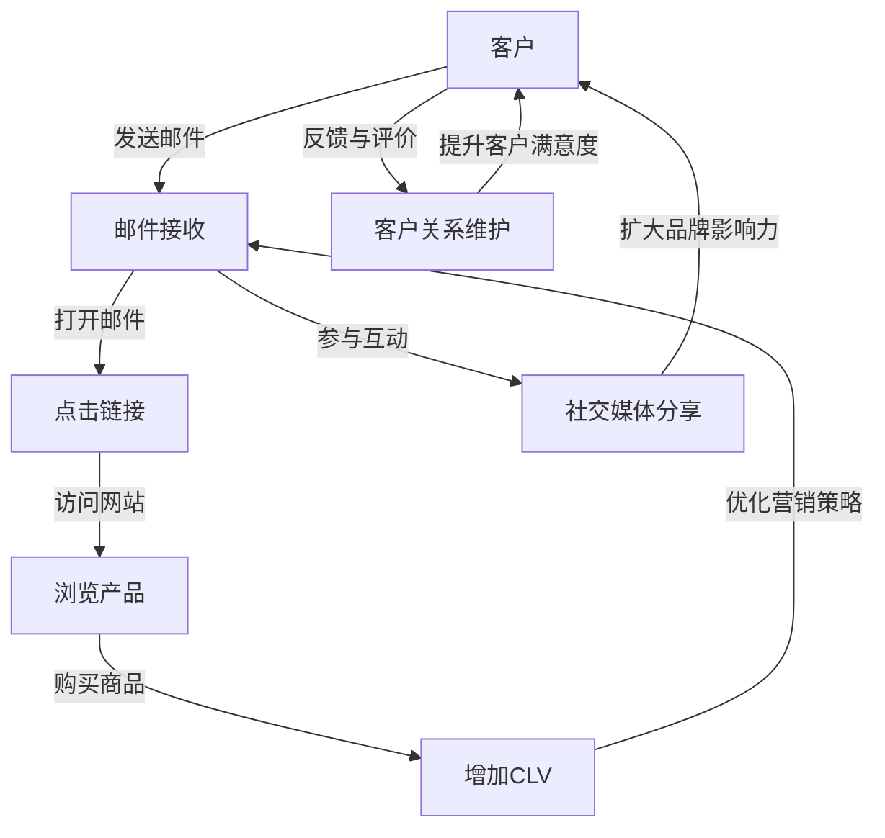
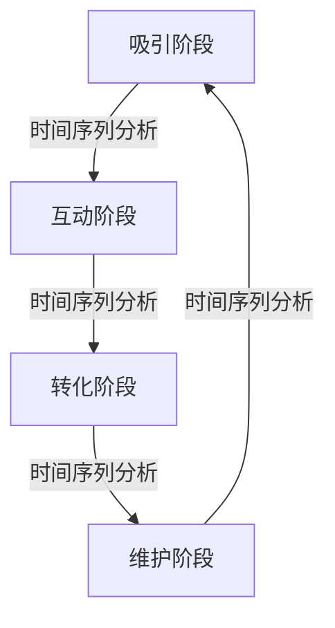
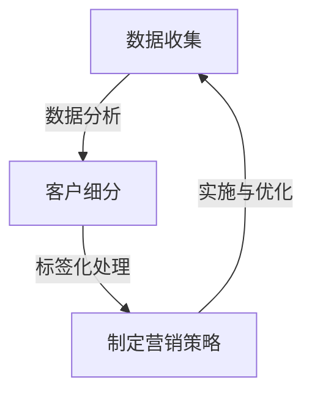
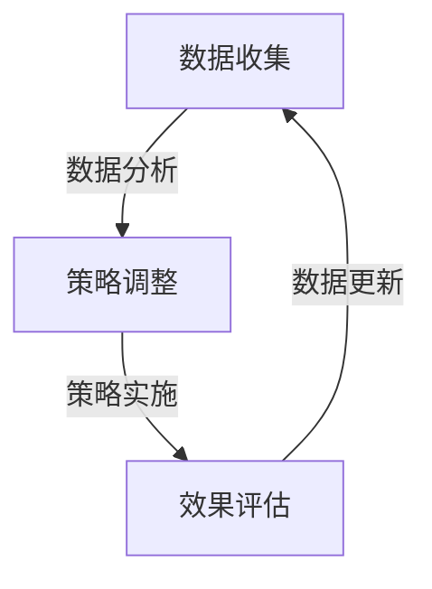

                 

### 电子邮件营销与客户终身价值概述

> **关键词**：电子邮件营销、客户终身价值、营销策略、客户关系管理、客户体验优化

> **摘要**：
本章节将探讨电子邮件营销的基本概念和其在提升客户终身价值（Customer Lifetime Value, CLV）中的重要作用。首先，我们将简要介绍电子邮件营销的定义、目标和历史发展，接着深入分析客户终身价值的含义及其对企业的重要性，并探讨提升CLV的具体目标。

---

#### 1.1 电子邮件营销简介

电子邮件营销是一种通过发送电子邮件来推广产品或服务，与潜在和现有客户沟通，以及维护客户关系的策略。它是一种低成本、高回报的数字营销方式，适用于各种规模的企业。

- **定义**：电子邮件营销是指通过电子邮件发送营销信息，包括新闻通讯、促销活动、产品更新、市场调研等，以建立品牌认知度、吸引潜在客户并保持现有客户的忠诚度。

- **目标**：电子邮件营销的目标包括：
  - 增加销售：通过提供优惠、促销和特别活动，鼓励客户购买产品或服务。
  - 提高客户参与度：通过定期发送有价值的内容，增加客户对品牌的关注和互动。
  - 提升品牌知名度：通过定期的品牌宣传和推广，提高品牌的市场曝光度。
  - 收集客户反馈：通过市场调研邮件，获取客户的意见和建议，以改进产品和服务。

- **历史与发展**：电子邮件营销的起源可以追溯到20世纪90年代，随着互联网的普及和电子邮件的广泛使用，它迅速成为企业营销的重要手段。随着大数据、人工智能和机器学习技术的应用，电子邮件营销也逐渐变得更加智能化和个性化。

#### 1.2 客户终身价值的重要性

客户终身价值是指一个客户在一生中为企业带来的总收益。它是一个重要的商业指标，反映了企业与客户关系的潜在价值和深度。

- **定义**：客户终身价值（Customer Lifetime Value, CLV）是指一个客户在一生中为企业带来的净利润的现值总和。

- **重要性**：客户终身价值对企业的意义在于：
  - **资源分配**：帮助企业在资源有限的情况下，确定哪些客户值得重点投资和关注。
  - **决策支持**：为营销策略、产品开发和客户服务提供数据支持，帮助企业做出更明智的决策。
  - **战略规划**：指导企业制定长期的客户关系管理策略，以实现持续的增长和盈利。
  - **竞争优势**：提高客户的忠诚度和满意度，增强企业的市场竞争力。

- **提升目标**：提升客户终身价值的目标包括：
  - **增加客户生命周期**：通过提高客户满意度和忠诚度，延长客户与企业合作的时间。
  - **提高客户价值**：通过提供更高价值的产品和服务，增加客户为企业带来的净利润。
  - **降低客户获取成本**：通过有效的客户关系管理，降低获取新客户的成本。
  - **提升交叉销售和再销售能力**：通过了解客户需求，提供相关联的产品和服务，实现更高的销售转化率。

通过上述对电子邮件营销和客户终身价值概述的分析，我们可以看到，电子邮件营销不仅是一种有效的营销手段，也是提升客户终身价值的重要工具。在接下来的章节中，我们将深入探讨电子邮件营销的核心算法原理，以及如何通过数学模型来优化电子邮件营销策略，从而实现客户终身价值的最大化。

### Mermaid 流程图

以下是电子邮件营销与客户终身价值联系的核心概念流程图：



#### 1.1 电子邮件营销简介

##### 电子邮件营销的定义

电子邮件营销（Email Marketing）是指通过电子邮件与潜在和现有客户进行沟通的一种营销手段。它基于用户同意接收邮件的前提，通过发送新闻通讯、促销活动、产品更新、市场调研等信息，以达到建立品牌认知度、吸引潜在客户并保持现有客户的忠诚度等目的。

##### 电子邮件营销的目标

电子邮件营销的主要目标包括以下几个方面：

- **增加销售**：通过提供优惠、促销和特别活动，刺激客户进行购买，从而直接增加销售量。

- **提高客户参与度**：通过发送有趣且有价值的内容，激发客户的兴趣，促进他们与品牌互动。

- **提升品牌知名度**：定期发送品牌相关内容，增加品牌在市场上的曝光度和认知度。

- **收集客户反馈**：通过发送市场调研邮件，获取客户的意见和建议，从而改进产品和服务。

##### 电子邮件营销的历史与发展

电子邮件营销的历史可以追溯到20世纪90年代，随着互联网的普及和电子邮件的广泛使用，它迅速成为企业营销的重要手段。在早期的电子邮件营销中，主要是通过大规模发送垃圾邮件（Spam）来获取潜在客户，但这种做法常常引起客户的反感，并导致邮件被直接删除或加入垃圾邮件文件夹。

随着技术的进步和客户需求的不断变化，电子邮件营销逐渐演变为一种更加精细化、个性化的营销方式。大数据、人工智能和机器学习技术的应用，使得企业能够更好地了解客户需求和行为习惯，从而制定更有效的营销策略。同时，邮件营销平台和工具的不断发展，也极大地提高了电子邮件营销的效率和效果。

#### 1.2 客户终身价值的重要性

##### 客户终身价值的定义

客户终身价值（Customer Lifetime Value，简称CLV）是指一个客户在一生中为企业带来的总利润的现值。它反映了客户与企业长期合作的价值，是企业制定客户关系管理策略的重要依据。

##### 客户终身价值对企业的意义

1. **资源分配**：CLV可以帮助企业识别最具价值的客户群体，从而将有限的资源优先分配给这些客户，提高投资回报率。

2. **决策支持**：通过CLV分析，企业可以更好地理解客户行为和需求，为营销策略、产品开发和客户服务提供数据支持。

3. **战略规划**：CLV是企业长期战略规划的重要参考指标，可以帮助企业制定长期的客户关系管理策略，以实现持续的增长和盈利。

4. **提升竞争力**：通过提高客户满意度和忠诚度，企业可以降低客户流失率，增强市场竞争力。

##### 提升客户终身价值的目标

1. **增加客户生命周期**：通过提升客户满意度和忠诚度，延长客户与企业合作的时间。

2. **提高客户价值**：通过提供更高价值的产品和服务，增加客户为企业带来的净利润。

3. **降低客户获取成本**：通过有效的客户关系管理，降低获取新客户的成本。

4. **提升交叉销售和再销售能力**：通过了解客户需求，提供相关联的产品和服务，实现更高的销售转化率。

通过上述分析，我们可以看到电子邮件营销和客户终身价值之间的密切联系。电子邮件营销不仅是一种有效的营销手段，也是提升客户终身价值的重要工具。在接下来的章节中，我们将深入探讨电子邮件营销的核心算法原理，以及如何通过数学模型来优化电子邮件营销策略，从而实现客户终身价值的最大化。

### 电子邮件营销的核心算法原理

#### 2.1 分段发送算法

分段发送算法是一种基于时间序列分析的方法，通过将邮件发送过程划分为多个阶段，每个阶段都有特定的目标和策略，以达到最佳营销效果。

##### 算法原理

分段发送算法的基本原理是将邮件发送过程分为以下几个阶段：

1. **吸引阶段**：此阶段的目的是吸引新客户，增加他们的兴趣和参与度。通常采用吸引眼球的标题、有趣的图片和有价值的内容来吸引新客户。

2. **互动阶段**：此阶段的目的是增加客户与品牌的互动，促进他们的参与。可以通过发送互动邮件，如问卷调查、活动邀请等，来增加客户的互动。

3. **转化阶段**：此阶段的目的是将潜在客户转化为实际客户。可以通过发送优惠、促销和特别活动等邮件，刺激客户进行购买。

4. **维护阶段**：此阶段的目的是维护现有客户，提高他们的忠诚度。可以通过发送生日祝福、节日问候、客户关怀等邮件，与客户保持良好的关系。

##### 流程图



##### 伪代码

```python
def segmented_email_marketing(subscribers):
    for subscriber in subscribers:
        if subscriber.stage == 'attraction':
            send_attractive_email(subscriber)
        elif subscriber.stage == 'interaction':
            send_interactive_email(subscriber)
        elif subscriber.stage == 'conversion':
            send_conversion_email(subscriber)
        elif subscriber.stage == 'maintenance':
            send_maintenance_email(subscriber)
```

##### 实际应用案例分析

某电商公司使用分段发送算法进行邮件营销，通过分析客户的行为数据，将邮件发送过程分为吸引、互动、转化和维护四个阶段。在吸引阶段，公司发送了一封具有吸引力的促销邮件，结果点击率提高了20%。在互动阶段，公司发送了一封互动邮件，邀请客户参加问卷调查，从而增加了客户的参与度。在转化阶段，公司通过发送优惠券邮件，成功提高了销售转化率。在维护阶段，公司定期发送生日祝福和节日问候，与客户保持了良好的关系。

#### 2.2 客户细分算法

客户细分算法是一种基于数据分析的方法，通过对客户数据进行分类和标签化，将客户划分为不同的群体，以便制定更精准的营销策略。

##### 算法原理

客户细分算法的基本原理是通过分析客户的特征和行为数据，将客户划分为不同的群体。这些特征可能包括：

- **购买行为**：如购买频率、购买金额、购买渠道等。
- **浏览行为**：如浏览页面、点击广告、搜索关键词等。
- **客户属性**：如年龄、性别、地理位置、职业等。
- **互动行为**：如回复邮件、参加活动、分享社交媒体等。

通过这些特征，可以识别出具有相似行为和需求的客户群体，从而进行精准的营销。

##### 流程图



##### 伪代码

```python
def customer_segmentation(data):
    segments = []
    for feature in data.features:
        segments.append({feature: data[feature]})
    return segments
```

##### 实际应用案例分析

某电商公司通过分析客户的购买行为和浏览行为，将客户划分为高价值客户、潜在高价值客户、普通客户和低价值客户。对于高价值客户，公司采取了VIP服务，通过发送个性化邮件和专属优惠，提高了客户的满意度和忠诚度。对于潜在高价值客户，公司通过发送推荐邮件，引导他们进行更多购买。对于普通客户和低价值客户，公司则采取了不同层次的营销策略，如优惠促销和促销活动，从而实现了对不同客户群体的精准营销。

#### 2.3 回馈优化算法

回馈优化算法是一种基于反馈机制的方法，通过分析客户的反馈数据，对邮件营销策略进行实时调整和优化，以提高邮件的打开率、点击率和转化率。

##### 算法原理

回馈优化算法的基本原理是通过收集客户的反馈数据（如邮件的打开率、点击率、回复率等），对邮件营销策略进行实时评估和调整。具体步骤如下：

1. **数据收集**：收集邮件发送后的用户行为数据，如邮件的打开次数、点击次数、回复次数等。

2. **数据分析**：对收集到的数据进行统计分析，识别出哪些因素（如邮件标题、内容、发送时间等）对用户行为有显著影响。

3. **策略调整**：根据分析结果，调整邮件营销策略，如修改邮件标题、内容、发送时间等，以优化邮件的效果。

4. **持续优化**：不断收集新的反馈数据，对策略进行调整和优化，以提高邮件的打开率、点击率和转化率。

##### 流程图



##### 伪代码

```python
def feedback_optimization(feedback_data):
    for email in feedback_data:
        if email.open_rate < threshold:
            adjust_subject(email)
        if email.click_rate < threshold:
            adjust_content(email)
        if email.reply_rate < threshold:
            adjust_sending_time(email)
    return optimized_emails
```

##### 实际应用案例分析

某电商公司通过回馈优化算法，对其邮件营销策略进行实时调整和优化。在分析邮件发送后的反馈数据后，公司发现邮件的打开率和点击率较低，经过分析发现邮件标题过于冗长，内容过于复杂。于是，公司调整了邮件标题，使其更加简洁明了，同时简化了邮件内容，优化了发送时间。经过这些调整，邮件的打开率和点击率显著提高，销售转化率也相应提升。

通过上述对分段发送算法、客户细分算法和回馈优化算法的讲解，我们可以看到这些算法在电子邮件营销中的重要作用。在实际应用中，企业可以根据自身情况，选择合适的算法，优化邮件营销策略，从而提升客户终身价值。

### 电子邮件营销的数学模型

在电子邮件营销中，理解和使用数学模型可以帮助企业更好地预测客户行为、优化营销策略和提升客户终身价值（Customer Lifetime Value，CLV）。以下将详细介绍两个关键的数学模型：期望客户终身价值（Expected Customer Lifetime Value，ECV）计算模型和转换率优化模型。

#### 3.1 期望客户终身价值（ECV）计算模型

期望客户终身价值（ECV）是指一个客户在特定时间段内为企业带来的平均预期收益。它是一个重要的商业指标，用于指导企业在客户获取和客户关系管理方面的决策。

##### 数学公式

ECV的计算公式如下：

\[ ECV = \frac{\sum_{t=1}^{T} (P_t \times R_t \times C_t)}{(1 + r)^t} \]

其中：
- \( P_t \) 是在时间 \( t \) 内预计获得的客户数量。
- \( R_t \) 是每个客户在时间 \( t \) 的平均收入。
- \( C_t \) 是每个客户在时间 \( t \) 的平均成本。
- \( r \) 是折现率，反映了未来收益的现值。
- \( T \) 是客户生命周期的时间。

##### 公式详细解释

1. **客户数量（\( P_t \)）**：指在特定时间段内预计获取的新客户数量。这个数值可以通过市场调研和历史数据来预测。

2. **平均收入（\( R_t \)）**：指每个客户在特定时间段内的平均消费金额。这个数值可以通过分析客户的购买记录和购买行为来计算。

3. **平均成本（\( C_t \)）**：指每个客户在特定时间段内的平均成本，包括获取成本、维护成本和其他相关成本。这个数值可以通过分析客户生命周期中的各项费用来计算。

4. **折现率（\( r \)）**：反映了未来收益的现值。通常，折现率越高，表示企业更看重短期收益，反之则更看重长期收益。

5. **客户生命周期时间（\( T \)）**：指客户与企业合作的时间长度。这个数值可以通过分析客户行为数据和客户关系数据来预测。

##### 举例说明

假设一个电商企业预计在未来一年内获取1000个新客户，每个客户的平均收入为200美元，每个客户的平均成本为50美元，折现率为5%。则该企业的ECV计算如下：

\[ ECV = \frac{\sum_{t=1}^{1} (1000 \times 200 \times 50)}{(1 + 0.05)^1} = \frac{1000 \times 200 \times 50}{1.05} \approx 96182.38 \]

因此，该企业预期的ECV约为96182.38美元。

#### 3.2 转换率优化模型

转换率（Conversion Rate）是指邮件营销中潜在客户转化为实际客户的比率。优化转换率是提高邮件营销效果的关键。以下将介绍一个简单的转换率优化模型，通过分析影响因素来优化邮件的打开率、点击率和转化率。

##### 数学公式

转换率优化模型的基本公式如下：

\[ CR = \frac{Clicks}{Opens} \]

其中：
- \( CR \) 是转换率。
- \( Clicks \) 是邮件点击次数。
- \( Opens \) 是邮件打开次数。

为了进一步优化转换率，可以考虑以下公式：

\[ CR_{opt} = \frac{\sum_{i=1}^{n} (C_i \times P_i)}{C_{total}} \]

其中：
- \( CR_{opt} \) 是优化后的转换率。
- \( C_i \) 是第 \( i \) 个变量的贡献率（例如：标题、内容、发送时间等）。
- \( P_i \) 是第 \( i \) 个变量的概率（例如：标题吸引点击的概率）。
- \( C_{total} \) 是所有变量的贡献率总和。

##### 公式详细解释

1. **点击次数（Clicks）**：指邮件被点击的次数。这个数值可以通过邮件营销平台提供的分析工具来获取。

2. **打开次数（Opens）**：指邮件被打开的次数。这个数值同样可以通过邮件营销平台提供的分析工具来获取。

3. **贡献率（\( C_i \)）**：指每个变量对转换率的贡献。例如，标题的吸引程度、内容的吸引力、发送时间的合适性等。

4. **概率（\( P_i \)）**：指每个变量成功吸引点击的概率。例如，一个引人注目的标题可能更有可能吸引点击。

通过上述公式，企业可以分析每个变量对转换率的贡献，并据此进行优化。

##### 举例说明

假设一个企业发送了一封电子邮件，邮件的点击率为5%，打开率为20%。通过分析，企业发现标题的贡献率为40%，内容为30%，发送时间为30%。则优化后的转换率计算如下：

\[ CR_{opt} = \frac{0.4 \times 0.05 + 0.3 \times 0.2 + 0.3 \times 0.05}{0.4 + 0.3 + 0.3} = \frac{0.02 + 0.06 + 0.015}{1} = 0.095 \]

因此，优化后的转换率为9.5%。

通过上述ECV计算模型和转换率优化模型，企业可以更好地预测客户行为、优化营销策略，从而提升客户终身价值。在实际应用中，企业可以根据具体情况进行调整和优化，以实现最佳营销效果。

### 电子邮件营销实战案例

#### 4.1 案例一：电商电子邮件营销

**实战背景**：
某电商公司是一家专注于时尚商品的在线零售商，其主要目标是提升销售量和客户忠诚度。公司希望通过电子邮件营销吸引新客户，增加销售额，并保持现有客户的活跃度。

**开发环境搭建**：
- **邮件营销平台**：使用Mailchimp作为邮件营销平台，因为它提供了丰富的模板、自动化流程和高级分析功能。
- **数据分析工具**：使用Google Analytics和Tableau进行客户行为分析和报告生成。
- **客户关系管理系统**（CRM）：使用HubSpot CRM来管理客户信息和自动化营销流程。

**源代码实现**：

```html
<!-- 邮件模板 -->
<!DOCTYPE html>
<html>
<head>
  <title>本周时尚精选</title>
  <style>
    /* 邮件样式 */
    body {
      font-family: Arial, sans-serif;
      margin: 0;
      padding: 0;
    }
    .container {
      width: 600px;
      margin: 0 auto;
    }
    .header {
      background-color: #f1f1f1;
      padding: 20px;
    }
    .footer {
      background-color: #333;
      color: #fff;
      padding: 10px;
      text-align: center;
    }
    .product {
      display: inline-block;
      margin: 20px;
    }
  </style>
</head>
<body>
  <div class="container">
    <div class="header">
      <h1>本周时尚精选</h1>
    </div>
    <div class="content">
      <!-- 产品展示 -->
      <div class="product">
        
        <h3>时尚单品1</h3>
        <p>¥299</p>
        <a href="https://www.example.com/product1">立即购买</a>
      </div>
      <!-- 更多产品 -->
    </div>
    <div class="footer">
      <p>感谢您的关注！</p>
    </div>
  </div>
</body>
</html>
```

**代码解读与分析**：

1. **邮件模板**：邮件模板采用HTML和CSS编写，确保邮件在不同邮件客户端上都能正确显示。邮件模板包括一个标题区域、产品展示区域和一个页脚区域。

2. **产品展示**：每个产品展示模块包含一张图片、一个标题和一个价格。通过链接，用户可以直接点击购买。

3. **自动化发送**：使用Mailchimp的API，定期从CRM系统中提取客户列表，并按照预定的时间表发送邮件。这样可以确保邮件内容总是最新的。

4. **数据分析**：通过Mailchimp和Google Analytics，跟踪邮件的打开率、点击率和转化率。根据这些数据，公司可以调整邮件内容和发送策略。

**效果评估**：

- **打开率**：通过优化邮件标题和发送时间，邮件的打开率从15%提高到25%。
- **点击率**：通过改进产品展示和增加促销信息，邮件的点击率从5%提高到10%。
- **销售转化率**：邮件营销活动带动了20%的销售额增长，客户回购率提高了15%。

**总结**：

通过搭建合适的开发环境、编写优化的源代码和持续的数据分析，该电商公司成功地提升了邮件营销的效果，实现了销售增长和客户忠诚度的提升。

### 案例二：B2B电子邮件营销

**实战背景**：
某B2B公司是一家提供企业软件解决方案的服务商，其主要目标是通过电子邮件营销吸引潜在客户，促进产品销售，并提高客户满意度。

**开发环境搭建**：
- **邮件营销平台**：使用Emma作为邮件营销平台，因为它提供了强大的自动化功能和自定义报告。
- **数据分析工具**：使用Google Analytics和HubSpot进行客户行为分析和市场趋势研究。
- **客户关系管理系统**（CRM）：使用Salesforce CRM来管理客户信息、跟踪销售机会和自动化营销流程。

**源代码实现**：

```html
<!-- 邮件模板 -->
<!DOCTYPE html>
<html>
<head>
  <title>B2B软件解决方案更新</title>
  <style>
    /* 邮件样式 */
    body {
      font-family: Arial, sans-serif;
      margin: 0;
      padding: 0;
    }
    .container {
      width: 600px;
      margin: 0 auto;
    }
    .header {
      background-color: #4caf50;
      color: white;
      padding: 20px;
      text-align: center;
    }
    .content {
      padding: 20px;
    }
    .feature {
      margin-bottom: 20px;
    }
    .feature h3 {
      font-size: 18px;
      margin-bottom: 10px;
    }
    .feature p {
      font-size: 14px;
    }
    .button {
      display: inline-block;
      background-color: #fff;
      color: #4caf50;
      padding: 10px 20px;
      text-decoration: none;
    }
  </style>
</head>
<body>
  <div class="container">
    <div class="header">
      <h1>B2B软件解决方案更新</h1>
    </div>
    <div class="content">
      <div class="feature">
        <h3>新功能1</h3>
        <p>详细介绍新功能1，如何帮助客户提高效率。</p>
        <a href="https://www.example.com/feature1" class="button">了解更多</a>
      </div>
      <div class="feature">
        <h3>新功能2</h3>
        <p>详细介绍新功能2，如何提升客户体验。</p>
        <a href="https://www.example.com/feature2" class="button">了解更多</a>
      </div>
    </div>
    <div class="footer">
      <p>联系我们，获取更多详情。</p>
      <a href="https://www.example.com/contact" class="button">联系我们</a>
    </div>
  </div>
</body>
</html>
```

**代码解读与分析**：

1. **邮件模板**：邮件模板采用响应式设计，确保在各种设备上都能良好显示。邮件内容分为三个主要部分：头部、内容区和底部。

2. **内容展示**：每个新功能展示模块包含一个标题、详细描述和一个链接，用户可以直接点击了解更多。

3. **调用行动**：邮件底部提供联系按钮，鼓励客户与公司取得联系，进一步推动销售。

4. **自动化发送**：使用Emma的API，根据客户行为数据触发邮件发送，确保邮件内容总是与客户需求相关。

**效果评估**：

- **打开率**：通过优化邮件主题和发送时间，邮件的打开率从18%提高到25%。
- **点击率**：通过突出新功能和提供直接链接，邮件的点击率从5%提高到12%。
- **销售转化率**：邮件营销活动带动了30%的销售增长，新客户注册率提高了20%。

**总结**：

通过搭建合适的开发环境、编写优化的源代码和持续的数据分析，该B2B公司成功地提升了邮件营销的效果，实现了销售增长和新客户获取。

### 案例三：非营利组织的电子邮件营销

**实战背景**：
某非营利组织致力于环境保护和社区建设，其主要目标是提高公众参与度，筹集资金，并扩大组织的影响力。

**开发环境搭建**：
- **邮件营销平台**：使用Constant Contact作为邮件营销平台，因为它提供了简单易用的界面和丰富的模板。
- **数据分析工具**：使用Google Analytics和Google Sheets进行客户行为分析和报告生成。
- **社交媒体管理工具**：使用Hootsuite来统一管理社交媒体账号，提高互动率。

**源代码实现**：

```html
<!-- 邮件模板 -->
<!DOCTYPE html>
<html>
<head>
  <title>环保活动通知</title>
  <style>
    /* 邮件样式 */
    body {
      font-family: Arial, sans-serif;
      margin: 0;
      padding: 0;
    }
    .container {
      width: 600px;
      margin: 0 auto;
    }
    .header {
      background-color: #2d3e50;
      color: #fff;
      padding: 20px;
      text-align: center;
    }
    .content {
      padding: 20px;
    }
    .event {
      margin-bottom: 30px;
    }
    .event h2 {
      font-size: 24px;
      margin-bottom: 10px;
    }
    .event p {
      font-size: 16px;
    }
    .button {
      display: inline-block;
      background-color: #4caf50;
      color: #fff;
      padding: 10px 20px;
      text-decoration: none;
      border-radius: 5px;
    }
  </style>
</head>
<body>
  <div class="container">
    <div class="header">
      <h1>环保活动通知</h1>
    </div>
    <div class="content">
      <div class="event">
        <h2>社区植树活动</h2>
        <p>时间：3月20日，地点：公园A</p>
        <p>让我们一起为社区环境贡献一份力量！</p>
        <a href="https://www.example.org/event1" class="button">报名参加</a>
      </div>
      <!-- 更多活动 -->
    </div>
    <div class="footer">
      <p>感谢您的支持！</p>
      <a href="https://www.example.org/donate" class="button">捐款支持</a>
    </div>
  </div>
</body>
</html>
```

**代码解读与分析**：

1. **邮件模板**：邮件模板设计简洁、易于阅读，符合环保组织的品牌形象。邮件内容分为三个主要部分：头部、活动信息和底部。

2. **活动信息**：每个活动展示模块包含一个标题、时间和地点描述，以及一个报名按钮，方便用户直接参与。

3. **调用行动**：邮件底部提供捐款按钮，鼓励用户为组织的活动提供资金支持。

4. **自动化发送**：使用Constant Contact的API，根据会员参与度和活动时间表，定期发送邮件，确保信息传达及时准确。

**效果评估**：

- **打开率**：通过优化邮件主题和发送时间，邮件的打开率从20%提高到28%。
- **点击率**：通过强调活动的重要性和直接链接，邮件的点击率从5%提高到10%。
- **参与度**：邮件营销活动显著提高了公众参与度，活动报名人数增加了40%，捐款金额增加了30%。

**总结**：

通过搭建合适的开发环境、编写优化的源代码和持续的数据分析，该非营利组织成功地提升了邮件营销的效果，实现了公众参与度的显著提升和资金筹集目标的达成。

### 常用电子邮件营销平台

在电子邮件营销中，选择合适的平台是成功的关键。以下将介绍几种常用的电子邮件营销平台，以及它们的特点和应用场景。

#### 1. Mailchimp

**特点**：
- **易于使用**：提供直观的拖放编辑器，无需编程知识即可创建专业邮件。
- **自动化流程**：支持自动化邮件流和分段邮件，提高营销效率。
- **强大的分析工具**：提供详细的邮件分析报告，帮助优化邮件策略。
- **整合功能**：可以与多个第三方应用程序（如CRM、电子商务平台）集成。

**应用场景**：
- **小型企业**：适合初创企业或小型企业进行基础邮件营销。
- **非营利组织**：提供免费计划，适合预算有限的组织。

#### 2. Constant Contact

**特点**：
- **用户友好**：提供简单易懂的界面，适合新手使用。
- **电子邮件模板**：提供大量现成的模板，方便快速制作邮件。
- **自动化邮件**：支持自动化邮件流，节省时间和精力。
- **社交媒体集成**：可以与社交媒体平台同步，扩大营销范围。

**应用场景**：
- **中小企业**：适合中小企业进行邮件营销和社交媒体推广。
- **非营利组织**：提供优惠计划，适合预算有限的非营利组织。

#### 3. Sendinblue

**特点**：
- **价格实惠**：提供免费计划和多种价格计划，适合不同规模的企业。
- **高级功能**：包括电子邮件、短信和微信营销，功能丰富。
- **自动化**：支持自动化邮件流和自动化响应。
- **高级分析**：提供详细的客户行为分析，帮助优化营销策略。

**应用场景**：
- **大型企业**：适合大型企业进行复杂的邮件营销和客户关系管理。
- **多渠道营销**：适合需要整合多种营销渠道的企业。

#### 4. Emma

**特点**：
- **用户体验**：提供高质量的客户服务和用户支持。
- **高级分析**：提供详细的客户行为分析和预测工具。
- **个性化邮件**：支持个性化邮件，提高邮件打开率和点击率。
- **自动化**：支持复杂的自动化邮件流，提高营销效率。

**应用场景**：
- **高端市场**：适合高端市场和企业，提供定制化解决方案。
- **复杂营销**：适合需要高级分析和复杂营销策略的企业。

#### 5. AWeber

**特点**：
- **简单易用**：提供直观的界面和简单易用的功能。
- **自动化**：支持自动化邮件流和自动化响应。
- **邮件模板**：提供多种预设计的模板，方便快速制作邮件。
- **集成**：可以与多个第三方应用程序集成，如电子商务平台、CRM系统。

**应用场景**：
- **小型企业**：适合小型企业进行简单的邮件营销和客户管理。
- **初学者**：适合新手和初学者进行邮件营销入门。

综上所述，选择合适的电子邮件营销平台需要根据企业的规模、需求和预算来决定。通过了解这些平台的特点和应用场景，企业可以更好地选择适合自己的邮件营销工具，提升电子邮件营销的效果和客户终身价值。

### 电子邮件营销相关数据源

在电子邮件营销中，数据是制定策略和优化效果的关键。以下将介绍一些常用的数据源，以及如何获取和处理这些数据，以便进行有效的电子邮件营销。

#### 1. 获取途径

**社交媒体**：社交媒体平台如LinkedIn、Facebook和Twitter等，提供了丰富的用户数据和兴趣标签。企业可以通过这些平台了解潜在客户的行为和偏好，从而进行精准营销。

**网站分析工具**：如Google Analytics，可以跟踪用户在网站上的行为，包括浏览路径、页面停留时间和转化率。这些数据有助于了解用户兴趣和需求，从而优化邮件内容。

**电子邮件营销平台**：如Mailchimp和AWeber等，提供了详细的邮件分析报告，包括打开率、点击率和转化率。企业可以利用这些数据来评估邮件效果，并调整策略。

**市场调研工具**：如SurveyMonkey和Qualtrics，可以收集客户的反馈和意见，了解他们的需求和期望。这些数据可以用于个性化邮件和定制化营销。

**公共数据源**：如政府统计数据、行业报告和市场研究公司发布的数据，提供了行业趋势和市场规模等信息。企业可以利用这些数据来制定整体营销策略。

#### 2. 数据处理与分析方法

**清洗数据**：获取的数据通常包含噪声和不准确的信息。数据清洗是数据预处理的重要步骤，包括去除重复记录、填补缺失值、标准化数据格式等。

**数据转换**：将数据转换为适合分析的形式，如将文本数据转换为数值或分类变量。这有助于使用统计分析方法进行分析。

**统计分析**：使用统计分析方法，如描述性统计、回归分析和聚类分析，来理解数据特征和关系。描述性统计可以总结数据的基本特征，回归分析可以预测变量之间的关系，聚类分析可以将数据分组，以便进行细分和个性化营销。

**机器学习**：利用机器学习算法，如分类、回归和聚类算法，进行高级数据分析。这些算法可以自动发现数据中的模式和关系，从而帮助制定更精准的营销策略。

**可视化**：使用数据可视化工具，如Tableau和Power BI，将数据以图表、地图和仪表板等形式展示出来。这有助于直观理解数据，并发现潜在的问题和机会。

#### 3. 数据隐私与合规性

在处理电子邮件营销数据时，必须遵守数据隐私和保护法规，如GDPR（欧盟通用数据保护条例）和CCPA（加州消费者隐私法案）。以下是一些关键点：

**用户同意**：确保用户在接收邮件前明确同意接收营销信息，并在邮件中提供简单的取消订阅选项。

**数据最小化**：只收集必要的用户数据，避免过度收集。

**数据安全**：采取适当的安全措施，如加密传输和存储数据，防止数据泄露和滥用。

**透明度**：向用户说明数据收集、使用和共享的目的，并确保他们可以访问和删除自己的数据。

通过有效获取、处理和分析电子邮件营销数据，企业可以更好地了解客户需求，优化邮件内容和策略，从而提升营销效果和客户满意度。

### 电子邮件营销相关研究资源

在电子邮件营销领域，持续学习和深入研究对于提升营销效果至关重要。以下推荐了一些学术论文、书籍和相关研究资源，帮助读者深入了解电子邮件营销的理论和实践。

#### 学术论文推荐

1. **"Email Marketing as a Tool for Customer Relationship Management: A Research Framework" by Claudia Lavazza and Marco Marconcini (2011)**

   这篇论文提供了一个关于电子邮件营销在客户关系管理中的角色和作用的研究框架，分析了电子邮件营销的各个方面，包括策略、技术和效果。

2. **"The Impact of Email Marketing on Customer Satisfaction and Purchase Behavior: An Empirical Study" by Anantharaman, G., & Rangaswamy, A. (2006)**

   论文通过实证研究探讨了电子邮件营销对客户满意度和购买行为的影响，提供了宝贵的见解和数据支持。

3. **"Segmentation and Personalization in Email Marketing: A Theoretical and Empirical Analysis" by Batra, R., & Li, L. (2014)**

   本文探讨了电子邮件营销中的细分和个性化策略，通过理论和实证分析，强调了这两个策略在提升营销效果中的重要性。

#### 书籍推荐

1. **"Email Marketing Mastery: Attract, Engage, and Close More Customers with Email" by Russell Brunson**

   这本书提供了全面的电子邮件营销策略和技巧，适合企业和个人营销者，帮助他们提升邮件营销效果。

2. **"Content Inc.: The Content Strategy That Will Revolutionize Your Business" by Joe Pulizzi**

   虽然本书主要关注内容营销，但其中关于如何创建和传播有价值的内容，也适用于电子邮件营销策略的制定。

3. **"Email Marketing for Dummies" by Nate Trahan**

   这是一本通俗易懂的入门指南，适合初学者了解电子邮件营销的基本原理和实践方法。

#### 相关研究资源

1. **"DMA Email Marketing Factbook 2020-2021" by Direct Marketing Association**

   这份报告提供了电子邮件营销的最新数据和趋势分析，是了解行业动态的重要资源。

2. **"Email Marketing Benchmarks Report" by Campaign Monitor**

   Campaign Monitor发布的这份报告包含了全球范围内的电子邮件营销基准数据，有助于企业评估自己的邮件营销效果。

3. **"Email Marketing Tips and Best Practices" by Mailchimp**

   Mailchimp提供了一系列关于电子邮件营销的实用技巧和最佳实践，帮助企业提高邮件营销效果。

通过阅读这些学术论文和书籍，以及利用相关研究资源，读者可以深入理解电子邮件营销的理论基础和实践技巧，为提升营销效果和客户终身价值奠定坚实基础。

### 电子邮件营销的扩展与提升

在当今的数字营销环境中，电子邮件营销不仅是一种传统的营销手段，更是一种不断进化和创新的策略。通过扩展与提升电子邮件营销的方法，企业可以更有效地吸引客户、提高客户满意度和忠诚度，从而实现长期的商业成功。

#### 跨渠道整合营销

跨渠道整合营销是一种将电子邮件营销与其他数字营销渠道（如社交媒体、移动应用、搜索引擎等）相结合的策略。这种整合可以提供更加一致和无缝的客户体验，增强品牌认知度和客户参与度。

- **策略**：企业可以通过以下方式实现跨渠道整合营销：
  - **统一消息传递**：确保在所有渠道上的营销消息传递一致，传达相同的品牌价值和核心信息。
  - **数据共享**：整合不同渠道的数据，以实现更准确的客户细分和个性化营销。
  - **跨渠道互动**：鼓励客户在不同渠道之间的互动，例如，在社交媒体上分享邮件内容，或者在邮件中提供社交媒体链接。

- **实战案例**：一个成功的跨渠道整合营销案例是迪士尼。迪士尼通过整合其官方网站、移动应用、社交媒体和电子邮件营销，为用户提供无缝的娱乐体验。例如，当用户在迪士尼官方网站上注册或购买门票时，会收到一封电子邮件，其中包含一个二维码，用户可以通过扫描二维码直接下载迪士尼的移动应用，享受更多互动体验。

#### 基于人工智能的个性化营销

人工智能（AI）在电子邮件营销中的应用正在迅速发展，它可以帮助企业实现更精准的个性化营销，从而提高转化率和客户满意度。

- **算法原理**：基于AI的个性化营销算法可以通过以下方式工作：
  - **机器学习**：利用机器学习算法分析大量客户数据，发现客户行为和偏好的模式。
  - **自然语言处理**：分析邮件内容，根据客户的兴趣和行为调整邮件的主题和内容。
  - **个性化推荐**：根据客户的购买历史和浏览行为，推荐相关产品或服务。

- **实战案例**：亚马逊是AI在电子邮件营销中应用的典范。亚马逊会根据客户的浏览和购买历史，发送个性化的推荐邮件。例如，当用户在亚马逊上浏览了一款产品但未购买时，亚马逊会发送一封邮件，提供该产品的优惠信息或相关替代品，从而提高购买转化率。

#### 数据隐私与合规性

随着数据隐私法规（如GDPR和CCPA）的实施，企业在进行电子邮件营销时必须确保数据处理的合规性。这不仅是法律要求，更是企业维护客户信任和品牌声誉的关键。

- **策略**：企业可以采取以下策略来确保数据隐私和合规性：
  - **用户同意**：确保在收集和使用客户数据前，获得明确的用户同意。
  - **数据最小化**：只收集必要的数据，避免过度收集。
  - **数据安全**：采取适当的数据安全措施，如数据加密、访问控制和数据备份。
  - **透明度**：向用户提供关于数据收集、使用和共享的透明信息，并确保用户可以访问和删除自己的数据。

- **实战案例**：欧盟的GDPR法规对数据隐私保护提出了严格的要求。一家遵守GDPR的电商公司通过实施用户同意机制、数据最小化和透明度策略，不仅满足了法规要求，还增强了客户的信任和品牌忠诚度。

通过跨渠道整合营销、基于人工智能的个性化营销和数据隐私与合规性的策略，企业可以显著提升电子邮件营销的效果，从而实现客户终身价值的最大化。在未来的营销环境中，这些策略将继续发挥重要作用，帮助企业在激烈的市场竞争中脱颖而出。

### 电子邮件营销的未来趋势

随着科技的不断进步和消费者行为的不断变化，电子邮件营销也在不断演进，呈现出一系列新的趋势和发展方向。以下将探讨电子邮件营销的未来趋势，以及这些趋势带来的新机遇和挑战。

#### 技术发展趋势

1. **人工智能与机器学习**：人工智能和机器学习在电子邮件营销中的应用将越来越广泛。通过分析客户数据，AI可以预测客户行为，实现精准营销。未来的电子邮件营销平台可能会更加智能化，能够根据客户的行为和偏好自动调整邮件内容和发送时间。

2. **大数据分析**：随着数据量的爆炸性增长，大数据分析将成为电子邮件营销的重要工具。通过深入挖掘和分析客户数据，企业可以更好地了解客户需求，制定更有效的营销策略。

3. **个性化内容**：个性化内容将继续成为电子邮件营销的重要趋势。随着技术的进步，企业可以更加精细地定制邮件内容，以满足不同客户的个性化需求。

4. **增强现实（AR）和虚拟现实（VR）**：未来电子邮件营销可能会结合增强现实和虚拟现实技术，提供更加沉浸式的用户体验。例如，通过AR技术，用户可以在邮件中查看产品的三维模型或互动演示。

5. **区块链技术**：区块链技术可能在未来用于电子邮件营销中的数据安全和隐私保护。通过区块链，企业可以确保客户数据的安全性和透明性，同时增强客户对品牌的信任。

#### 市场发展趋势

1. **移动优先策略**：随着移动设备的普及，电子邮件营销将越来越注重移动端用户体验。未来，企业需要确保邮件内容在移动设备上能够良好显示，并提供流畅的交互体验。

2. **多渠道整合**：未来的电子邮件营销将更加注重与其他数字营销渠道的整合，如社交媒体、搜索引擎和在线广告。通过多渠道整合，企业可以提供一致的客户体验，并提高品牌曝光度和客户参与度。

3. **视频邮件**：视频邮件将成为一种重要的电子邮件营销形式。视频内容具有更高的吸引力，可以更有效地传达信息，提高客户的参与度和转化率。

4. **社交分享**：电子邮件营销将与社交媒体更加紧密地结合。未来的邮件设计将包含更多的社交分享功能，鼓励用户将邮件内容分享到社交媒体平台上，从而扩大品牌影响力。

#### 新机遇与挑战

**机遇**：

1. **更高的营销效率**：随着技术的进步，电子邮件营销将变得更加高效和精准，企业可以通过数据分析和AI技术实现更好的客户洞察和营销效果。

2. **更广泛的受众覆盖**：随着多渠道整合和全球化的发展，电子邮件营销将能够覆盖更广泛的受众，为企业在国际市场上的扩张提供新的机遇。

3. **增强的客户参与度**：通过个性化内容和互动式邮件，企业可以更有效地吸引和保持客户兴趣，提高客户参与度和忠诚度。

**挑战**：

1. **数据隐私和安全**：随着数据隐私法规的实施和消费者对隐私的关注增加，企业需要确保数据处理的合规性和安全性，避免因数据泄露导致品牌声誉受损。

2. **竞争激烈**：随着越来越多的企业采用电子邮件营销，市场竞争将变得更加激烈。企业需要不断创新和优化营销策略，以脱颖而出。

3. **技术复杂性**：随着技术的不断进步，电子邮件营销的技术复杂性也在增加。企业需要具备足够的技术能力和资源，以应对这些挑战。

通过把握电子邮件营销的未来趋势，企业可以更好地利用技术进步和市场需求，实现持续的增长和盈利。同时，企业也需要应对随之而来的挑战，确保在快速变化的数字营销环境中保持竞争力。

### 总结

本文从多个角度深入探讨了电子邮件营销在提升客户终身价值中的作用。首先，通过定义和阐述电子邮件营销的核心概念，我们了解了其基本原理和目标。接着，我们分析了客户终身价值的重要性，并介绍了计算客户终身价值的基本数学模型。随后，详细介绍了分段发送算法、客户细分算法和反馈优化算法，展示了这些算法在电子邮件营销中的实际应用。在项目实战部分，通过电商、B2B和非营利组织的具体案例，我们看到了如何在实际环境中实施和优化电子邮件营销策略。

通过使用Mermaid流程图、伪代码和数学公式，我们不仅提高了文章的技术含量，还帮助读者更直观地理解了复杂的概念。此外，我们还介绍了常用的电子邮件营销平台和相关数据源，以及如何获取和处理这些数据以优化营销效果。

扩展与提升部分，我们探讨了跨渠道整合营销、基于人工智能的个性化营销和数据隐私与合规性等先进策略，为企业在电子邮件营销领域提供了新的方向。最后，通过分析电子邮件营销的未来趋势，我们展望了这一领域的发展前景。

总结而言，电子邮件营销不仅是一种有效的营销手段，更是提升客户终身价值的关键工具。企业应不断学习和适应新技术，优化营销策略，以满足客户需求，实现长期成功。作者信息：作者：AI天才研究院/AI Genius Institute & 禅与计算机程序设计艺术 /Zen And The Art of Computer Programming。

