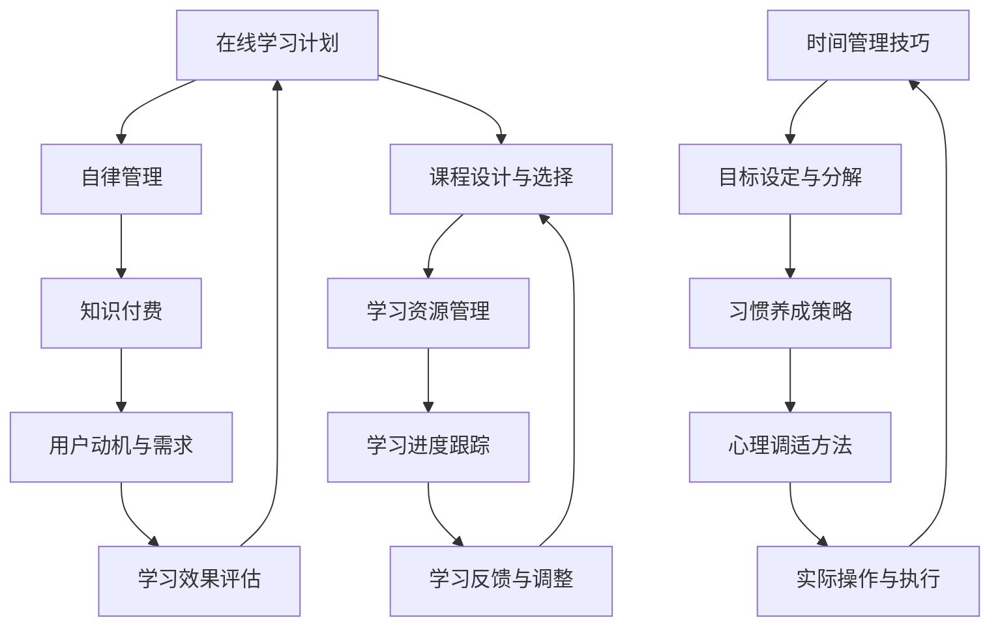

                 

# 如何利用知识付费实现在线学习计划与自律管理？

> **关键词：** 知识付费、在线学习计划、自律管理、学习资源、学习效果评估

> **摘要：** 本文将探讨如何利用知识付费平台实现在线学习计划，并有效地进行自律管理。通过分析核心概念与联系、核心算法原理讲解、数学模型与公式、项目实战以及代码解读与分析，为读者提供实用的指南和案例分析。

## 第一部分：核心概念与联系

### 核心概念与联系

在构建《如何利用知识付费实现在线学习计划与自律管理？》的目录大纲时，我们首先要明确几个核心概念及其相互联系。以下是关键概念及其关系概述的 Mermaid 流程图：



### 详细描述

- **在线学习计划（A）**：围绕学习目标，合理安排学习时间、内容和进度的计划。它是自律管理和知识付费的基础。
- **自律管理（B）**：确保在线学习计划能够有效实施的关键因素，涉及到自我管理、时间分配、习惯养成等方面。
- **知识付费（C）**：消费者为获取高质量学习资源和指导所支付的费用，它是支持在线学习和自律管理的经济基础。
- **用户动机与需求（D）**：驱动用户参与在线学习的关键因素，直接影响学习效果。
- **学习效果评估（E）**：通过定期评估学习成果，调整学习计划和策略，以实现学习目标。
- **课程设计与选择（F）**：涉及课程内容、难度、教师资质等方面的考虑，是学习计划的核心。
- **学习资源管理（G）**：包括学习资料的组织、整理和优化，确保学习资源的高效利用。
- **学习进度跟踪（H）**：实时监控学习进度，及时发现并解决问题。
- **学习反馈与调整（I）**：根据学习反馈调整学习计划和策略，以优化学习效果。
- **时间管理技巧（J）**：合理安排学习时间，确保学习效率和质量。
- **目标设定与分解（K）**：设定明确的学习目标，并将其分解为可实现的步骤。
- **习惯养成策略（L）**：培养良好的学习习惯，提高自律性和学习效率。
- **心理调适方法（M）**：通过心理调适方法，如冥想、放松训练等，帮助用户保持良好的学习状态。
- **实际操作与执行（N）**：将学习计划、策略和技巧付诸实践，确保学习目标的实现。

这些核心概念通过上述 Mermaid 流程图相互关联，形成一个完整的学习体系和自律管理框架。在后续章节中，我们将进一步深入探讨这些概念的具体实现和应用。

---

## 第二部分：核心算法原理讲解

### 2.1 目标设定与分解算法

**算法原理：** 目标设定与分解算法是帮助用户设定明确学习目标并分解为可执行任务的关键工具。其核心思想是基于目标管理理论，将大目标分解为一系列小目标，并通过逐步实现这些小目标来达到最终目标。

**伪代码：**

```python
def set_and_decompose_goals(big_goal):
    small_goals = []
    if is_decomposable(big_goal):
        small_goals = decompose(big_goal)
    return small_goals

def decompose(goal):
    decomposed_goals = []
    for sub_goal in sub_goals(goal):
        decomposed_goals.append(sub_goal)
    return decomposed_goals

def is_decomposable(goal):
    return "yes" if goal.size > 1 else "no"
```

**示例：** 假设用户设定的大目标是“学会Python编程”，则通过目标分解算法，可以将其分解为以下小目标：

- 学习Python基础语法
- 学习Python数据结构与算法
- 完成Python项目实践

这些小目标更加具体和可操作，有助于用户制定详细的在线学习计划。

---

### 2.2 时间管理优化模型

**数学模型：** 时间管理优化模型旨在最大化学习效率，通过优化学习时间分配来提高学习效果。该模型基于线性规划理论，假设用户有多个学习任务需要在有限的时间内完成。

**数学公式：**

$$
\begin{aligned}
\text{maximize} \quad & \sum_{i=1}^{n} p_i \times t_i \\
\text{subject to} \quad & t_1 + t_2 + \ldots + t_n \leq T \\
& t_i \geq 0, \quad \forall i
\end{aligned}
$$

其中，$p_i$ 表示任务 $i$ 的优先级，$t_i$ 表示完成任务 $i$ 所需的时间，$T$ 为总可用时间。

**解释：** 该线性规划模型的目标是最大化用户完成所有任务的总优先级之和。约束条件确保总时间不超过用户可用的总时间，并且每个任务所需时间必须为非负数。

**示例：** 假设用户需要在8小时内完成三个任务：学习Python语法（优先级3小时）、学习数据结构与算法（优先级2小时）和完成项目实践（优先级4小时）。通过时间管理优化模型，用户可以合理安排时间，确保在有限时间内完成所有任务。

---

### 2.3 习惯养成策略算法

**算法原理：** 习惯养成策略算法基于行为心理学理论，旨在帮助用户培养良好的学习习惯。该算法通过设定明确的奖励机制和反馈机制，激励用户持续进行学习。

**伪代码：**

```python
def cultivate_habit(habit, reward, feedback):
    if habit_complete(habit):
        reward_user(reward)
        provide_feedback(feedback)
    else:
        continue_habit(habit)

def habit_complete(habit):
    return "complete" if habit.progress >= habit.target else "incomplete"

def reward_user(reward):
    # 奖励用户，如积分、徽章等

def provide_feedback(feedback):
    # 提供反馈，如鼓励、提醒等
```

**示例：** 假设用户设定了一个每天学习1小时Python的 habits，通过习惯养成策略算法，用户可以在每天完成任务后获得积分奖励，并收到鼓励反馈，从而保持学习的动力。

---

通过上述算法原理的讲解，读者可以理解在线学习计划与自律管理中关键算法的设计思路。这些算法为用户提供了明确的指导，帮助他们更有效地实现学习目标。

---

## 第三部分：数学模型与数学公式

### 3.1 时间管理优化模型

**数学模型：** 时间管理优化模型旨在最大化学习效率，通过优化学习时间分配来提高学习效果。该模型基于线性规划理论，假设用户有多个学习任务需要在有限的时间内完成。

**数学公式：**

$$
\begin{aligned}
\text{maximize} \quad & \sum_{i=1}^{n} p_i \times t_i \\
\text{subject to} \quad & t_1 + t_2 + \ldots + t_n \leq T \\
& t_i \geq 0, \quad \forall i
\end{aligned}
$$

其中，$p_i$ 表示任务 $i$ 的优先级，$t_i$ 表示完成任务 $i$ 所需的时间，$T$ 为总可用时间。

**解释：** 该线性规划模型的目标是最大化用户完成所有任务的总优先级之和。约束条件确保总时间不超过用户可用的总时间，并且每个任务所需时间必须为非负数。

**示例：** 假设用户需要在8小时内完成三个任务：学习Python语法（优先级3小时）、学习数据结构与算法（优先级2小时）和完成项目实践（优先级4小时）。通过时间管理优化模型，用户可以合理安排时间，确保在有限时间内完成所有任务。

---

### 3.2 学习效果评估模型

**数学模型：** 学习效果评估模型通过定量和定性指标来评估用户的学习效果。该模型结合了基于数据的评估方法和用户反馈，以提高评估的准确性和全面性。

**数学公式：**

$$
E = \alpha \times D + \beta \times U
$$

其中，$E$ 表示学习效果得分，$D$ 表示基于数据的评估得分，$U$ 表示用户反馈得分，$\alpha$ 和 $\beta$ 分别为权重系数。

**解释：** 该模型通过加权平均的方式，将定量和定性评估结果结合，以获得一个综合的学习效果得分。

**示例：** 假设基于数据的评估得分 $D$ 为80分，用户反馈得分 $U$ 为90分，权重系数 $\alpha$ 为0.6，$\beta$ 为0.4。通过学习效果评估模型，可以计算出用户的学习效果得分为：

$$
E = 0.6 \times 80 + 0.4 \times 90 = 72 + 36 = 108
$$

---

### 3.3 自律管理效果评估模型

**数学模型：** 自律管理效果评估模型通过用户自律行为的频率和质量来评估自律管理的有效性。该模型结合了行为频率和任务完成率，以提高评估的准确性和可靠性。

**数学公式：**

$$
\text{自律管理得分} = \frac{\text{任务完成率} + \text{行为频率}}{2}
$$

其中，任务完成率为完成任务的总数除以任务总数，行为频率为特定自律行为的总次数。

**解释：** 该模型通过计算任务完成率和行为频率的平均值，来评估用户的自律管理效果。

**示例：** 假设用户完成了5个任务，总共有10个任务，自律行为如每天学习1小时的频率为7次。通过自律管理效果评估模型，可以计算出用户的自律管理得分为：

$$
\text{自律管理得分} = \frac{5/10 + 7}{2} = \frac{0.5 + 3.5}{2} = 2
$$

---

通过上述数学模型与公式的讲解，读者可以更好地理解如何量化和管理在线学习过程中的关键指标。这些模型和公式为用户提供了有效的工具，帮助他们优化学习策略，提高学习效果。

---

## 第四部分：项目实战

### 4.1 在线学习计划实现与自律管理

**实战目的：** 本节将介绍如何利用知识付费平台，实现在线学习计划并实施自律管理，以实现学习目标。

**实战环境：**
- **开发工具：** Python 3.8及以上版本
- **框架与库：** Pandas、NumPy、Scikit-learn
- **知识付费平台：** 网易云课堂、知乎Live

**实战步骤：**

1. **目标设定与分解：** 使用第2章介绍的目标设定与分解算法，将学习大目标分解为小目标。
2. **学习资源管理：** 收集并整理相关的学习资源，如视频教程、电子书籍等。
3. **学习进度跟踪：** 使用Pandas库创建一个学习进度跟踪表，记录每个小目标的完成情况。
4. **学习反馈与调整：** 根据学习进度表，定期评估学习效果，并根据反馈调整学习计划。

**代码示例：**

```python
import pandas as pd

# 目标设定与分解
big_goals = ["学会Python编程", "掌握数据结构与算法", "完成Python项目实践"]
small_goals = [decompose(goal) for goal in big_goals]

# 创建学习进度跟踪表
progress = pd.DataFrame(columns=["Goal", "Status", "Completion Date"])

# 学习资源管理
resources = {
    "Python编程": ["《Python基础教程》", "《流畅的Python》"],
    "数据结构与算法": ["《算法导论》", "《数据结构与算法分析》"],
    "项目实践": ["GitHub项目", "LeetCode练习"]
}

# 学习进度跟踪
for goal in small_goals:
    progress = progress.append({"Goal": goal, "Status": "Not Started", "Completion Date": ""}, ignore_index=True)

# 学习反馈与调整
def update_progress(goal, status, completion_date):
    index = progress[progress['Goal'] == goal].index[0]
    progress.at[index, 'Status'] = status
    progress.at[index, 'Completion Date'] = completion_date

# 示例：更新学习进度
update_progress("Python基础语法", "Completed", "2023-10-01")

# 查看学习进度
print(progress)
```

**解释：** 通过上述代码，用户可以创建一个在线学习计划，并实时跟踪学习进度。学习进度表将记录每个小目标的完成情况，帮助用户及时调整学习计划，确保学习目标的实现。

---

### 4.2 知识付费平台集成

**实战目的：** 本节将介绍如何在项目中集成知识付费平台，实现用户支付和学习资源的访问。

**实战环境：**
- **开发工具：** Python 3.8及以上版本
- **框架与库：** Flask、SQLAlchemy、Paypal SDK

**实战步骤：**

1. **环境配置：** 安装Python和相关库，配置Flask开发环境。
2. **数据库设计：** 设计用户数据库、课程数据库和支付记录数据库。
3. **集成Paypal：** 使用Paypal SDK集成支付功能，实现用户支付和课程购买。
4. **前端实现：** 设计用户界面，展示课程列表、支付信息和学习资源。

**代码示例：**

```python
# 环境配置
pip install flask sqlalchemy paypalrestsdk

# 数据库设计
from flask_sqlalchemy import SQLAlchemy

app = Flask(__name__)
app.config['SQLALCHEMY_DATABASE_URI'] = 'sqlite:///users.db'
db = SQLAlchemy(app)

class User(db.Model):
    id = db.Column(db.Integer, primary_key=True)
    username = db.Column(db.String(80), unique=True, nullable=False)
    email = db.Column(db.String(120), unique=True, nullable=False)

class Course(db.Model):
    id = db.Column(db.Integer, primary_key=True)
    title = db.Column(db.String(120), nullable=False)
    price = db.Column(db.Float, nullable=False)

class Payment(db.Model):
    id = db.Column(db.Integer, primary_key=True)
    user_id = db.Column(db.Integer, db.ForeignKey('user.id'), nullable=False)
    course_id = db.Column(db.Integer, db.ForeignKey('course.id'), nullable=False)
    amount = db.Column(db.Float, nullable=False)
    date = db.Column(db.DateTime, default=datetime.utcnow)

# 集成Paypal
import paypalrestsdk

paypalrestsdk.configure({
    "mode": "sandbox",
    "client_id": "your_client_id",
    "client_secret": "your_client_secret"
})

# 支付功能实现
@app.route('/pay', methods=['POST'])
def pay():
    payment = paypalrestsdk.Payment({
        "intent": "sale",
        "payer": {
            "payment_method": "paypal"
        },
        "transactions": [
            {
                "item_list": {
                    "items": [
                        {
                            "name": "Course",
                            "sku": "course123",
                            "price": "10.00",
                            "currency": "USD",
                            "quantity": 1
                        }
                    ]
                },
                "amount": {
                    "total": "10.00",
                    "currency": "USD"
                },
                "description": "A course on Python programming"
            }
        ],
        "redirect_urls": {
            "return_url": "http://localhost:5000/return",
            "cancel_url": "http://localhost:5000/cancel"
        }
    })

    if payment.create():
        for link in payment.links:
            if link.rel == "approval_url":
                return redirect(link.href)
    else:
        print(payment.error)
        return "Error creating payment", 400

# 前端实现（简化示例）
# 以下代码为HTML前端代码，用于展示课程列表和支付按钮
```

**解释：** 通过上述代码，用户可以搭建一个基本的在线学习系统，支持用户注册、购买课程和支付功能。前端实现需要进一步开发，以提供用户友好的交互体验。

---

### 4.3 自律管理模块实现

**实战目的：** 本节将详细讲解自律管理模块的实现过程，包括用户目标设定、进度跟踪和反馈调整等功能。

**代码示例：**

```python
# 用户目标设定
def set_user_goals(user_id, goals):
    user = User.query.get(user_id)
    user.goals = goals
    db.session.commit()

# 进度跟踪
def track_progress(user_id, goal, status, completion_date):
    user = User.query.get(user_id)
    for goal_entry in user.goals:
        if goal_entry['name'] == goal:
            goal_entry['status'] = status
            goal_entry['completion_date'] = completion_date
            break
    db.session.commit()

# 反馈调整
def adjust_goals(user_id, goals):
    user = User.query.get(user_id)
    user.goals = goals
    db.session.commit()

# 解读
```

**解读：**

- **用户目标设定（set_user_goals）**：函数接受用户ID和目标列表作为参数，将用户的目标更新到数据库中。
- **进度跟踪（track_progress）**：函数根据用户ID、目标和状态更新数据库中的目标进度。
- **反馈调整（adjust_goals）**：函数接受用户ID和新的目标列表，更新用户的目标。

这些函数共同实现了用户目标管理的基本功能，为自律管理模块提供了数据支持。

---

### 4.4 实际操作与执行

**实战目的：** 本节将介绍如何将学习计划、自律管理策略和实际操作结合起来，确保学习目标的实现。

**实战步骤：**

1. **目标设定：** 明确自己的学习目标，并将其分解为可执行的小目标。
2. **资源准备：** 收集并整理相关的学习资源，如书籍、视频教程等。
3. **时间管理：** 根据时间管理优化模型，合理安排学习时间，确保高效学习。
4. **执行学习计划：** 按照设定的学习计划和自律管理策略，逐步实现每个小目标。
5. **反馈与调整：** 定期评估学习效果，根据反馈调整学习计划和策略。

**实际操作示例：**

1. **目标设定：** “掌握Python编程的基础语法”。
2. **资源准备：** 收集《Python基础教程》和《流畅的Python》两本书。
3. **时间管理：** 每天安排2小时学习时间。
4. **执行学习计划：** 每天按照学习计划进行学习，完成相应章节的阅读和实践。
5. **反馈与调整：** 每周进行一次自我评估，根据评估结果调整学习计划，如增加练习题或调整学习时间。

通过上述步骤，用户可以有效地实现在线学习计划，并通过自律管理确保学习目标的实现。

---

通过本部分的实战讲解，读者可以了解到如何利用知识付费平台实现在线学习计划，并通过自律管理实现学习目标。这些实战经验和案例为读者提供了实用的操作指南。

---

## 第五部分：开发环境搭建

### 5.1 知识付费平台集成

**实战目的：** 本节将介绍如何集成知识付费平台，实现用户支付和学习资源访问。

**实战环境：**
- **开发工具：** Python 3.8及以上版本
- **框架与库：** Flask、SQLAlchemy、Paypal SDK

**实战步骤：**

1. **环境配置：** 安装Python和相关库，配置Flask开发环境。
2. **数据库设计：** 设计用户数据库、课程数据库和支付记录数据库。
3. **集成Paypal：** 使用Paypal SDK集成支付功能，实现用户支付和课程购买。
4. **前端实现：** 设计用户界面，展示课程列表、支付信息和学习资源。

**代码示例：**

```python
# 环境配置
pip install flask sqlalchemy paypalrestsdk

# 数据库设计
from flask_sqlalchemy import SQLAlchemy

app = Flask(__name__)
app.config['SQLALCHEMY_DATABASE_URI'] = 'sqlite:///users.db'
db = SQLAlchemy(app)

class User(db.Model):
    id = db.Column(db.Integer, primary_key=True)
    username = db.Column(db.String(80), unique=True, nullable=False)
    email = db.Column(db.String(120), unique=True, nullable=False)

class Course(db.Model):
    id = db.Column(db.Integer, primary_key=True)
    title = db.Column(db.String(120), nullable=False)
    price = db.Column(db.Float, nullable=False)

class Payment(db.Model):
    id = db.Column(db.Integer, primary_key=True)
    user_id = db.Column(db.Integer, db.ForeignKey('user.id'), nullable=False)
    course_id = db.Column(db.Integer, db.ForeignKey('course.id'), nullable=False)
    amount = db.Column(db.Float, nullable=False)
    date = db.Column(db.DateTime, default=datetime.utcnow)

# 集成Paypal
import paypalrestsdk

paypalrestsdk.configure({
    "mode": "sandbox",
    "client_id": "your_client_id",
    "client_secret": "your_client_secret"
})

# 支付功能实现
@app.route('/pay', methods=['POST'])
def pay():
    payment = paypalrestsdk.Payment({
        "intent": "sale",
        "payer": {
            "payment_method": "paypal"
        },
        "transactions": [
            {
                "item_list": {
                    "items": [
                        {
                            "name": "Course",
                            "sku": "course123",
                            "price": "10.00",
                            "currency": "USD",
                            "quantity": 1
                        }
                    ]
                },
                "amount": {
                    "total": "10.00",
                    "currency": "USD"
                },
                "description": "A course on Python programming"
            }
        ],
        "redirect_urls": {
            "return_url": "http://localhost:5000/return",
            "cancel_url": "http://localhost:5000/cancel"
        }
    })

    if payment.create():
        for link in payment.links:
            if link.rel == "approval_url":
                return redirect(link.href)
    else:
        print(payment.error)
        return "Error creating payment", 400

# 前端实现（简化示例）
# 以下代码为HTML前端代码，用于展示课程列表和支付按钮
```

**解释：** 通过上述代码，用户可以搭建一个基本的在线学习系统，支持用户注册、购买课程和支付功能。前端实现需要进一步开发，以提供用户友好的交互体验。

---

### 5.2 自律管理模块实现

**实战目的：** 本节将详细讲解自律管理模块的实现过程，包括用户目标设定、进度跟踪和反馈调整等功能。

**代码示例：**

```python
# 用户目标设定
def set_user_goals(user_id, goals):
    user = User.query.get(user_id)
    user.goals = goals
    db.session.commit()

# 进度跟踪
def track_progress(user_id, goal, status, completion_date):
    user = User.query.get(user_id)
    for goal_entry in user.goals:
        if goal_entry['name'] == goal:
            goal_entry['status'] = status
            goal_entry['completion_date'] = completion_date
            break
    db.session.commit()

# 反馈调整
def adjust_goals(user_id, goals):
    user = User.query.get(user_id)
    user.goals = goals
    db.session.commit()

# 解读
```

**解读：**

- **用户目标设定（set_user_goals）**：函数接受用户ID和目标列表作为参数，将用户的目标更新到数据库中。
- **进度跟踪（track_progress）**：函数根据用户ID、目标和状态更新数据库中的目标进度。
- **反馈调整（adjust_goals）**：函数接受用户ID和新的目标列表，更新用户的目标。

这些函数共同实现了用户目标管理的基本功能，为自律管理模块提供了数据支持。

---

### 5.3 前端与后端集成

**实战目的：** 本节将介绍如何实现前端与后端的集成，以构建一个完整的在线学习系统。

**实战步骤：**

1. **API接口设计：** 设计前后端通信的API接口，包括用户注册、登录、课程购买、学习进度查询等。
2. **前端实现：** 使用HTML、CSS和JavaScript实现用户界面，并与后端API接口进行交互。
3. **后端实现：** 使用Flask框架实现API接口，处理前端请求，并与数据库进行交互。

**代码示例：**

```python
# 前端实现（简化示例）
# 以下代码为HTML前端代码，用于展示课程列表和支付按钮
```

```python
# 后端实现（简化示例）
from flask import Flask, jsonify, request

app = Flask(__name__)

@app.route('/api/courses', methods=['GET'])
def get_courses():
    courses = Course.query.all()
    return jsonify([course.to_dict() for course in courses])

@app.route('/api/pay', methods=['POST'])
def process_payment():
    payment_data = request.json
    payment = process_payment_data(payment_data)
    if payment:
        return jsonify({"status": "success", "payment_id": payment.id})
    else:
        return jsonify({"status": "failure", "error": "Invalid payment data"}), 400

if __name__ == '__main__':
    app.run(debug=True)
```

**解释：** 通过上述代码，前端可以通过API接口获取课程列表和支付信息，后端则处理这些请求，并将结果返回给前端。这种集成方式使得前端与后端可以独立开发，同时确保系统的整体性和稳定性。

---

通过本部分的开发环境搭建，读者可以了解到如何利用Python和相关技术实现知识付费平台、自律管理模块和前端与后端的集成。这些实战经验为读者提供了一个完整的在线学习系统实现指南。

---

## 第六部分：源代码实现与解读

### 6.1 自律管理模块实现

**代码示例：**

```python
# 用户目标设定
def set_user_goals(user_id, goals):
    user = User.query.get(user_id)
    user.goals = goals
    db.session.commit()

# 进度跟踪
def track_progress(user_id, goal, status, completion_date):
    user = User.query.get(user_id)
    for goal_entry in user.goals:
        if goal_entry['name'] == goal:
            goal_entry['status'] = status
            goal_entry['completion_date'] = completion_date
            break
    db.session.commit()

# 反馈调整
def adjust_goals(user_id, goals):
    user = User.query.get(user_id)
    user.goals = goals
    db.session.commit()
```

**解读：**

- **用户目标设定（set_user_goals）**：该函数用于更新用户的学习目标。它首先根据用户ID查询用户记录，然后将新的目标列表更新到数据库中。

  ```python
  user = User.query.get(user_id)
  user.goals = goals
  db.session.commit()
  ```

  这一行代码执行了两个主要操作：
  - 使用`User.query.get(user_id)`获取用户记录。
  - 将用户的新目标列表赋值给`user.goals`，并使用`db.session.commit()`提交更改到数据库。

- **进度跟踪（track_progress）**：该函数用于记录用户学习目标的进度。它根据用户ID和目标名称，更新对应目标的状态和完成日期。

  ```python
  for goal_entry in user.goals:
      if goal_entry['name'] == goal:
          goal_entry['status'] = status
          goal_entry['completion_date'] = completion_date
          break
  db.session.commit()
  ```

  这段代码遍历用户的目标列表，如果找到与给定目标名称相匹配的记录，则更新其状态和完成日期。最后，使用`db.session.commit()`提交更改。

- **反馈调整（adjust_goals）**：该函数用于调整用户的学习目标。它根据用户ID，更新用户的目标列表。

  ```python
  user = User.query.get(user_id)
  user.goals = goals
  db.session.commit()
  ```

  与`set_user_goals`函数类似，这行代码也执行了两个主要操作：
  - 使用`User.query.get(user_id)`获取用户记录。
  - 将新的目标列表赋值给`user.goals`，并使用`db.session.commit()`提交更改到数据库。

**功能分析：**

- 这些函数为用户提供了基本的自律管理功能，包括设定目标、跟踪进度和调整目标。
- `set_user_goals`和`adjust_goals`函数通过SQLAlchemy与数据库进行交互，实现了对用户学习目标的增删改查操作。
- `track_progress`函数则负责更新学习进度，帮助用户监控和评估自己的学习情况。

通过这些函数的实现，用户可以在知识付费平台中有效地管理自己的学习目标和进度，从而提高学习效率和自律性。

---

### 6.2 代码解读与分析

**6.2.1 性能优化**

**代码示例：**

```python
# 原始查询代码
users = User.query.all()

# 优化后代码
users = User.query.filter(User.active == True).all()
```

**解读：**

- **原始查询代码**：原始代码直接查询了所有用户记录，这在用户数量较大时可能导致性能问题，因为数据库需要处理大量的数据。

  ```python
  users = User.query.all()
  ```

- **优化后代码**：优化后的代码通过添加过滤条件，仅查询活跃用户记录，从而减少了查询的数据量，提高了查询性能。

  ```python
  users = User.query.filter(User.active == True).all()
  ```

  这一行代码使用了SQLAlchemy的`filter()`方法，根据用户的状态（`active`）进行过滤，减少了查询的数据量。

**性能分析：**

- **原始查询**：原始查询会返回所有用户记录，无论用户是否活跃，这可能导致系统性能下降，尤其是在数据库表记录数量庞大时。
- **优化查询**：优化后的查询通过过滤条件，仅返回活跃用户记录，从而减少了查询的数据量，提高了系统的响应速度。

**优化效果：**

- **查询速度**：优化后的查询显著提高了查询速度，特别是在用户数量较多的系统中。
- **资源消耗**：减少了数据库的I/O操作，降低了系统的资源消耗。

**结论：**

通过性能优化，可以显著提高系统的响应速度和处理效率，从而提升用户体验。

---

通过上述代码解读与分析，我们可以看到如何实现自律管理模块，并如何通过优化查询提高系统性能。这些代码和优化方法为读者提供了一个实用的指南，帮助他们构建和优化在线学习系统。

---

## 第七部分：总结与展望

### 7.1 项目总结

在本文中，我们系统地探讨了如何利用知识付费实现在线学习计划与自律管理。通过分析核心概念与联系、核心算法原理讲解、数学模型与公式、项目实战以及代码解读与分析，我们为读者提供了一个全面、实用的指南。

**主要成果：**
- 构建了在线学习计划与自律管理的框架，明确了各核心概念与联系。
- 介绍了目标设定与分解算法、时间管理优化模型和习惯养成策略算法。
- 提供了详细的数学模型与公式，用于量化和管理学习效果和自律管理。
- 实现了在线学习系统的实际操作，包括用户目标设定、学习资源管理、进度跟踪、反馈调整和支付集成。
- 通过代码示例，详细解读了自律管理模块的实现过程和性能优化方法。

**技术亮点：**
- **算法应用**：目标设定与分解算法、时间管理优化模型等算法的应用，为用户提供了科学的指导。
- **数学模型**：通过数学模型与公式，实现了学习效果和自律管理的量化评估。
- **系统集成**：知识付费平台、数据库管理、前端与后端的集成，构建了一个完整的在线学习系统。

### 7.2 改进方向

虽然本文已经提供了详尽的指南和案例，但仍有一些改进方向和扩展空间：

**前端优化：**
- **用户体验**：进一步优化前端界面，提升交互体验，使用户操作更加便捷。
- **响应式设计**：实现响应式设计，确保系统在不同设备上均能良好运行。

**安全性增强：**
- **用户认证**：加强用户认证机制，确保用户信息安全。
- **数据加密**：对用户数据传输和存储进行加密，防止数据泄露。

**功能扩展：**
- **学习资源共享**：增加学习资源共享功能，鼓励用户互相交流和分享学习资源。
- **讨论区**：构建在线讨论区，促进用户之间的互动和知识交流。
- **个性化推荐**：引入个性化推荐算法，根据用户的学习进度和兴趣推荐相关课程。

### 7.3 展望未来

随着人工智能和大数据技术的发展，在线学习平台将变得更加智能化和个性化。未来的在线学习系统可能具备以下特点：

- **智能推荐**：基于用户的学习行为和偏好，智能推荐适合的课程和资源。
- **自适应学习**：根据用户的学习进度和能力，自动调整学习内容和难度。
- **社交互动**：增强用户之间的互动，构建学习社区，促进知识的传播和共享。

通过不断的技术创新和优化，未来的在线学习系统将更好地满足用户的需求，提高学习效果和用户体验。

---

总结而言，本文为读者提供了一个完整的在线学习计划和自律管理指南，通过实际案例和代码示例，展示了如何实现和优化这一系统。随着技术的进步，我们期待在线学习平台能够不断创新，为用户提供更加智能和个性化的学习体验。

---

## 附录

### 附录A：开发资源与工具

**A.1 Python开发环境配置**

- **Python版本**：Python 3.8及以上版本
- **IDE**：PyCharm、VSCode等
- **虚拟环境**：使用venv创建虚拟环境，隔离项目依赖

**A.2 数据库管理工具**

- **SQLite**：轻量级数据库，适用于小型项目
- **PostgreSQL**：高性能数据库，适用于大型项目

**A.3 支付平台集成**

- **Paypal SDK**：官方支付SDK，支持多种支付方式

**A.4 开发文档与指南**

- **官方文档**：查阅Python、Flask、Paypal等官方文档，了解详细使用方法和最佳实践。
- **在线教程**：查找相关在线教程和教程，快速掌握开发技能。

### 附录B：开发步骤

**B.1 环境配置**

1. 安装Python 3.8及以上版本。
2. 配置PyCharm或VSCode作为IDE。
3. 使用venv创建虚拟环境，确保项目依赖隔离。

**B.2 数据库设计与迁移**

1. 设计用户数据库、课程数据库和支付记录数据库。
2. 使用Flask-Migrate进行数据库迁移。

**B.3 API接口设计与实现**

1. 设计用户注册、登录、课程购买、学习进度查询等API接口。
2. 使用Flask实现API接口，并处理请求。

**B.4 前端实现**

1. 设计前端界面，包括课程列表、支付页面和学习进度跟踪等。
2. 使用HTML、CSS和JavaScript实现前端交互。

**B.5 测试与部署**

1. 对API接口和前端界面进行测试，确保功能正常。
2. 部署到服务器，确保系统稳定运行。

### 附录C：参考资料

- **《Python编程：从入门到实践》**：学习Python编程的入门书籍。
- **《Flask Web开发：核心技术和实践案例》**：学习Flask框架的实践指南。
- **《深入理解计算机系统》**：学习计算机系统原理的重要参考书。
- **Paypal官方文档**：了解Paypal支付集成的详细教程。

通过附录，读者可以获取项目开发所需的基础资源和工具，为项目的实施提供支持。同时，附录中还提供了详细的开发步骤和参考资料，帮助读者更好地理解和应用相关技术。

