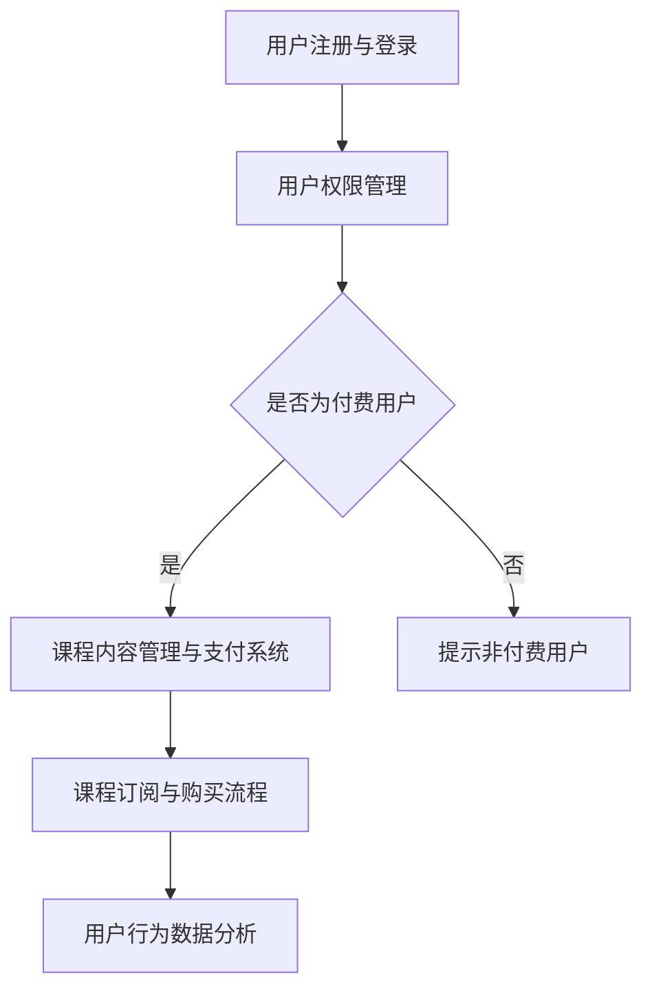

                 

### 第1章：知识付费与移动应用开发概述

#### 1.1 知识付费的定义与现状

**知识付费**，顾名思义，指的是用户为获取特定知识或技能而进行的付费行为。它是一种新兴的商业模式，借助互联网平台，将知识传授者与学习者有效连接。知识付费在近年来迅速崛起，已成为知识经济时代的重要组成部分。

在知识付费领域，用户通过支付费用来购买专业课程、电子书籍、在线问答等服务。根据支付方式的不同，知识付费可以分为一次性付费和订阅制两种模式。一次性付费是指用户为某个具体知识或服务支付一次费用，而订阅制则是用户为获得持续的更新和内容支付定期费用。

知识付费行业的现状可谓繁荣景象。随着移动互联网的普及和在线教育的兴起，越来越多的平台和机构加入到知识付费的行列。根据市场调研数据显示，全球知识付费市场规模逐年增长，预计到2025年将达到数千亿美元。

知识付费的发展趋势主要体现在以下几个方面：

1. **用户需求多样化**：随着互联网的普及，用户对知识的需求越来越多样化。除了传统的教育课程外，专业技能培训、职场经验分享、兴趣爱好学习等新兴领域也成为用户关注的焦点。
   
2. **内容质量提升**：知识付费平台和内容创作者逐渐意识到内容质量的重要性，纷纷加大内容研发和制作投入。高质量的内容不仅能够提升用户满意度，还能增强平台的竞争力。

3. **科技赋能**：人工智能、大数据等先进技术在知识付费领域的应用日益广泛。通过技术手段，平台可以更好地理解用户需求，实现个性化推荐，提高内容变现效率。

4. **跨界融合**：知识付费与其他行业如电商、社交、直播等的跨界融合趋势明显。例如，电商平台通过引入知识付费内容，提升用户购物体验；社交平台则通过知识付费实现流量变现。

#### 1.2 移动应用开发概述

**移动应用开发**指的是开发针对移动设备（如智能手机、平板电脑等）的应用程序。随着智能手机的普及和移动互联网的发展，移动应用市场呈现出爆炸式增长。移动应用不仅改变了人们的日常生活，也为企业和个人带来了巨大的商业价值。

**移动应用的基本概念**包括以下几个方面：

1. **移动操作系统**：常见的移动操作系统有iOS和Android。iOS主要应用于苹果公司的iPhone和iPad设备，而Android则广泛应用于各种安卓设备。

2. **应用架构**：移动应用通常采用客户端-服务器架构。客户端（应用程序）负责与用户交互，服务器则提供数据存储、处理等服务。

3. **用户界面**：移动应用的用户界面设计要考虑触控操作、屏幕尺寸等因素，确保用户使用体验良好。

**移动应用开发的流程**主要包括以下几个阶段：

1. **需求分析**：明确应用的目标用户、功能需求、性能要求等。

2. **系统设计**：根据需求分析结果，设计应用的整体架构和模块划分。

3. **开发实现**：编写代码，实现应用的功能和界面。

4. **测试与优化**：对应用进行功能测试、性能测试，确保其稳定性和可用性。

5. **发布与运营**：将应用发布到应用商店，并进行后续的运营和维护。

**移动应用开发的技术栈**包括：

1. **编程语言**：如Swift（iOS）和Java/Kotlin（Android）。

2. **开发工具**：如Xcode（iOS）和Android Studio（Android）。

3. **框架**：如React Native、Flutter等跨平台开发框架。

4. **数据库**：如SQLite、MySQL等。

通过以上概述，我们可以了解到知识付费和移动应用开发的基本概念、现状及发展趋势。接下来的章节将进一步探讨这两者如何结合，实现移动应用与小程序开发。在接下来的讨论中，我们将详细分析移动应用与小程序开发的基础，以及如何利用知识付费平台实现两者的有机结合。

### 第2章：移动应用与小程序开发基础

#### 2.1 移动应用开发基础

移动应用开发是一个复杂的过程，涵盖了从需求分析到发布和运营的多个阶段。在这一部分，我们将详细介绍移动应用开发的基础知识，包括其架构、常用开发框架以及最佳实践。

**移动应用架构**

移动应用架构通常采用客户端-服务器架构，该架构将应用分为前端（客户端）和后端（服务器）两部分。前端负责用户界面和交互，而后端负责数据处理、存储和业务逻辑处理。

1. **客户端架构**：客户端架构主要关注用户交互和数据展示。常见的客户端架构模式包括MVC（Model-View-Controller）和MVVM（Model-View-ViewModel）。

   - **MVC**：MVC模式将应用分为模型（Model）、视图（View）和控制器（Controller）。模型负责处理数据，视图负责显示数据，控制器负责处理用户输入，并协调模型和视图之间的交互。
   - **MVVM**：MVVM模式进一步抽象了视图和模型之间的关系，通过ViewModel来连接视图和模型，使得视图和模型之间不再直接交互，提高了应用的灵活性和可维护性。

2. **后端架构**：后端架构主要负责数据处理和存储。常见的技术栈包括Node.js、Java、Python等。

   - **Node.js**：Node.js是一个基于Chrome V8引擎的JavaScript运行环境，它可以处理并发请求，适用于高并发的应用场景。
   - **Java**：Java是一种跨平台的编程语言，适用于大型、复杂的应用开发。Java后端框架如Spring、Hibernate等广泛应用于企业级应用开发。
   - **Python**：Python是一种简洁易学的编程语言，适用于快速开发和原型设计。Python后端框架如Django、Flask等在Web开发中广泛使用。

**常见的移动应用开发框架**

移动应用开发框架可以帮助开发者快速构建应用，提高开发效率。以下是一些常用的移动应用开发框架：

1. **React Native**：React Native是一个由Facebook开发的跨平台开发框架，允许开发者使用JavaScript编写原生应用。它通过React组件实现UI渲染，同时支持iOS和Android平台。
   
2. **Flutter**：Flutter是由Google开发的跨平台UI框架，使用Dart语言编写。Flutter提供了丰富的UI组件，并支持热重载功能，使得开发者可以快速进行界面调整和测试。

3. **Xamarin**：Xamarin是由微软推出的跨平台开发框架，使用C#语言编写。Xamarin可以将共享代码库用于iOS、Android和Windows平台，从而提高开发效率。

**移动应用开发的最佳实践**

为了确保移动应用的稳定性和可用性，以下是一些最佳实践：

1. **代码规范**：遵循统一的代码规范和命名规范，确保代码的可读性和可维护性。
   
2. **模块化设计**：将应用拆分为多个模块，每个模块负责独立的功能。模块化设计有助于代码的重用和维护。
   
3. **版本控制**：使用版本控制系统（如Git）进行代码管理，确保代码的版本可追溯和可回滚。
   
4. **自动化测试**：编写自动化测试脚本，对应用进行功能测试、性能测试和安全测试，确保应用的质量。
   
5. **持续集成和持续部署**：使用持续集成和持续部署（CI/CD）工具，自动化构建、测试和部署流程，提高开发效率和响应速度。

通过以上介绍，我们可以对移动应用开发的基础知识有一个全面的了解。在接下来的章节中，我们将探讨小程序开发的基础知识，并分析如何将知识付费与小程序开发相结合。

#### 2.2 小程序开发基础

**小程序**（Mini Program）是一种不需要下载安装即可使用的应用，它实现了应用“触手可及”的概念，用户可以通过微信、支付宝等入口一键使用。小程序的出现，极大地简化了用户获取服务的流程，也为企业和开发者提供了新的机遇。

**小程序的定义与特点**

小程序是由微信于2017年1月推出的一种轻量级应用。与传统的移动应用不同，小程序具有以下几个特点：

1. **无需安装与卸载**：用户无需下载和安装小程序，直接通过微信或其他平台入口即可使用。
2. **快速启动**：小程序的启动速度非常快，通常在几秒内即可加载完成。
3. **沉浸式体验**：小程序的用户界面设计更加简洁，可以提供沉浸式的用户体验。
4. **功能丰富**：小程序支持丰富的API，可以集成各种功能，如支付、地图、语音等。

**小程序开发的技术栈**

小程序开发的技术栈主要包括以下几个方面：

1. **编程语言**：小程序使用JavaScript作为主要编程语言，同时支持WXML（类似HTML）和WXSS（类似CSS）进行页面渲染和样式设计。
2. **开发工具**：小程序开发者工具是小程序开发的核心工具，提供了代码编辑、预览、调试等功能。微信官方提供了Windows和Mac两个版本的开发者工具。
3. **框架**：虽然小程序可以使用原生开发，但许多开发者更倾向于使用框架，如WePY、Taro、uni-app等，这些框架可以提高开发效率和代码可维护性。

**小程序开发的流程与规范**

小程序开发的一般流程包括以下几个阶段：

1. **需求分析与规划**：明确小程序的目标用户、功能需求和性能要求。
2. **设计阶段**：设计小程序的界面和交互逻辑，通常使用工具如Sketch、Figma等。
3. **开发阶段**：使用小程序开发工具和框架进行编码实现，包括页面渲染、数据绑定、功能开发等。
4. **测试阶段**：对小程序进行功能测试、性能测试和安全测试，确保其稳定性。
5. **上线阶段**：将小程序提交到微信小程序平台进行审核，审核通过后即可发布。

小程序开发的规范包括以下几个方面：

1. **编码规范**：遵循统一的编码规范，确保代码的可读性和可维护性。
2. **界面规范**：小程序界面设计需符合微信官方的设计规范，确保用户体验一致。
3. **性能优化**：优化小程序的加载速度和响应速度，提高用户体验。
4. **安全性**：确保小程序的数据安全和用户隐私保护。

**小程序开发的最佳实践**

为了确保小程序的质量和用户体验，以下是一些最佳实践：

1. **用户体验优先**：在设计小程序时，始终将用户体验放在首位，确保界面简洁、操作流畅。
2. **模块化设计**：将小程序拆分为多个模块，每个模块负责独立的功能，便于维护和扩展。
3. **版本控制**：使用版本控制系统，如Git，进行代码管理，确保代码的可追踪性和可回滚性。
4. **自动化测试**：编写自动化测试脚本，对小程序进行功能测试和性能测试，确保其质量。
5. **持续集成**：使用持续集成工具，自动化构建、测试和部署流程，提高开发效率和响应速度。

通过以上介绍，我们可以对小程序开发有一个全面的认识。在接下来的章节中，我们将探讨如何将知识付费与移动应用、小程序开发相结合，实现两者的有机结合。

### 第3章：知识付费在移动应用中的实现

随着知识付费市场的日益繁荣，越来越多的开发者开始探索如何在移动应用中集成知识付费功能。本章将详细讨论如何设计知识付费模块，并在移动应用中实现课程内容管理、支付系统和用户行为数据分析等功能。

#### 3.1 知识付费模块的设计

知识付费模块是移动应用的核心部分，它决定了用户能否顺利地享受付费内容。在设计知识付费模块时，需要考虑以下几个方面：

1. **用户角色与权限管理**：移动应用需要为不同类型的用户设置不同的权限。例如，普通用户可以浏览免费内容，而付费用户可以访问高级课程。权限管理可以通过用户身份验证、权限标签等方式实现。

2. **课程内容管理**：课程内容管理包括课程目录的创建、课程的添加、删除、更新和分类等功能。移动应用需要提供一个直观易用的后台管理系统，以便管理员可以方便地管理课程内容。

3. **支付系统**：支付系统是知识付费模块的重要组成部分。移动应用需要集成多种支付方式，如支付宝、微信支付、信用卡支付等，以满足不同用户的需求。支付系统还需要确保交易的安全性，保护用户的支付信息。

4. **会员服务**：除了单次购买课程外，移动应用还可以提供会员服务，让用户可以按月或按年订阅课程内容。会员服务需要提供丰富的权益，如课程折扣、专属活动等，以增加用户的粘性。

#### 3.2 移动应用中知识付费的实现方法

在移动应用中实现知识付费功能，需要考虑以下几个方面：

1. **在线课程与会员服务**：移动应用可以提供在线课程观看、学习进度跟踪、问答社区等功能。对于会员服务，用户可以通过订阅或购买会员资格来获得更多权益。

2. **课程订阅与购买流程**：课程订阅与购买流程需要简单直观，用户可以方便地浏览课程目录，选择课程进行订阅或购买。在购买流程中，需要引导用户选择支付方式，完成支付后，用户即可访问课程内容。

3. **用户行为数据分析**：通过收集用户的行为数据，如课程观看时长、学习进度、互动行为等，移动应用可以分析用户的兴趣和需求，从而优化课程推荐和内容布局。

以下是一个简单的用户行为数据分析的伪代码示例：

```plaintext
function analyzeUserBehavior(dataSet) {
    // 初始化用户行为分析数据结构
    let userBehaviorMap = new Map();
    
    // 遍历数据集中的每个用户行为
    for (let behavior of dataSet) {
        let userId = behavior.userId;
        
        // 如果用户不存在，创建一个新的数据结构
        if (!userBehaviorMap.has(userId)) {
            userBehaviorMap.set(userId, []);
        }
        
        // 将行为数据添加到用户的行为列表中
        userBehaviorMap.get(userId).push(behavior);
    }
    
    // 对每个用户的行为进行分析
    for (let [userId, behaviors] of userBehaviorMap) {
        // 计算用户的活跃度
        let activityScore = behaviors.length;
        
        // 更新用户行为数据
        userBehaviorMap.set(userId, {activityScore, behaviors});
    }
    
    // 返回处理后的用户行为数据
    return userBehaviorMap;
}
```

通过用户行为数据分析，移动应用可以了解用户的兴趣点和行为模式，从而优化课程推荐和内容布局。

#### 3.3 知识付费模块的技术实现

知识付费模块的技术实现包括前端和后端两个方面：

1. **前端实现**：
   - **用户界面**：使用React、Vue等前端框架构建用户界面，提供课程浏览、订阅、购买等交互功能。
   - **API接口**：通过RESTful API或GraphQL提供数据接口，实现课程内容、用户行为数据的查询和更新。
   - **状态管理**：使用Redux、Vuex等状态管理库，确保应用的状态一致性和可维护性。

2. **后端实现**：
   - **服务架构**：采用微服务架构，将课程内容管理、支付系统、用户行为分析等模块分离，便于维护和扩展。
   - **数据库**：使用MySQL、MongoDB等数据库存储用户数据、课程数据和行为数据。
   - **支付集成**：集成支付宝、微信支付等第三方支付服务，实现安全的支付流程。

以下是一个简单的用户行为数据分析的后端实现示例：

```plaintext
// 用户行为数据存储模型（以MongoDB为例）
const MongoClient = require('mongodb').MongoClient;
const uri = "mongodb://localhost:27017/";
const client = new MongoClient(uri, { useNewUrlParser: true, useUnifiedTopology: true });

// 用户行为数据分析函数
async function analyzeUserBehavior() {
    try {
        await client.connect();
        const database = client.db('knowledge_platform');
        const behaviorCollection = database.collection('user_behavior');

        // 获取所有用户行为数据
        const behaviors = await behaviorCollection.find({}).toArray();

        // 初始化用户行为分析数据结构
        let userBehaviorMap = new Map();

        // 遍历数据集中的每个用户行为
        for (let behavior of behaviors) {
            let userId = behavior.userId;

            // 如果用户不存在，创建一个新的数据结构
            if (!userBehaviorMap.has(userId)) {
                userBehaviorMap.set(userId, []);
            }

            // 将行为数据添加到用户的行为列表中
            userBehaviorMap.get(userId).push(behavior);
        }

        // 对每个用户的行为进行分析
        for (let [userId, behaviors] of userBehaviorMap) {
            // 计算用户的活跃度
            let activityScore = behaviors.length;

            // 更新用户行为数据
            await behaviorCollection.updateOne(
                { _id: ObjectId(userId) },
                { $set: { activityScore: activityScore } }
            );
        }

        console.log('User behavior analysis completed');
    } finally {
        client.close();
    }
}

analyzeUserBehavior();
```

通过以上示例，我们可以看到如何使用MongoDB存储用户行为数据，并编写一个简单的用户行为分析函数，计算并更新用户的活跃度。

通过本章的介绍，我们可以了解到在移动应用中实现知识付费模块的各个方面，包括设计、实现方法和技术实现。在下一章中，我们将探讨如何在小程序中实现知识付费功能。

### 第4章：小程序中的知识付费策略

随着移动互联网的普及，小程序作为一种轻量级应用，逐渐成为知识付费平台的重要载体。本章将详细介绍小程序中的知识付费模式，包括短视频教学、在线测试与答疑、以及知识付费广告与推广策略，并探讨开发过程中的关键技术与挑战。

#### 4.1 小程序中的知识付费模式

**短视频教学**：短视频教学是小程序中的一种重要内容形式。它以短小精悍、易于传播的特点，吸引了大量用户。通过短视频，知识传授者可以快速传递知识点，用户也能在短时间内获取所需信息。短视频教学的优势在于：

- **高效传播**：短视频易于在社交媒体上分享，可以快速触达大量用户。
- **降低学习门槛**：短视频内容短小精悍，用户可以随时随地学习，降低了学习门槛。

**在线测试与答疑**：在线测试与答疑是知识付费平台的重要功能，它可以帮助用户检验学习成果，并及时解决学习中遇到的问题。在线测试与答疑的优势包括：

- **即时反馈**：在线测试可以即时反馈用户答案，帮助用户了解自己的掌握情况。
- **互动性强**：答疑功能为用户提供了与知识传授者互动的机会，增强了用户的学习体验。

**知识付费广告与推广**：知识付费广告与推广是知识付费平台变现的重要手段。通过小程序内置的广告位，平台可以投放相关课程广告，吸引用户购买。知识付费广告与推广的优势包括：

- **精准投放**：根据用户行为数据，精准推送相关课程广告，提高广告点击率和转化率。
- **高效变现**：通过广告收入，平台可以快速实现盈利。

#### 4.2 小程序开发中的关键技术与挑战

**小程序的性能优化**：性能优化是小程序开发中的重要一环，它直接关系到用户的体验。以下是一些性能优化的关键技术和方法：

- **代码优化**：通过减少代码体积、优化算法等方式，降低应用启动时间。
- **内存管理**：合理分配和管理内存资源，避免内存泄漏，提高应用的稳定性。
- **网络优化**：优化网络请求，减少数据传输时间和延迟。

**小程序的稳定性与安全性**：稳定性与安全性是小程序开发的重要保障。以下是一些保证稳定性和安全性的关键技术和方法：

- **异常处理**：对可能出现的异常进行捕获和处理，确保应用不会因异常而崩溃。
- **数据加密**：对用户数据进行加密处理，确保数据传输和存储的安全性。
- **权限控制**：严格权限控制，确保用户数据和隐私不被非法访问。

**小程序的生态与生态系统**：小程序生态包括开发者、平台、用户等多个参与者，构建良好的生态系统对小程序的发展至关重要。以下是一些生态构建的关键技术和方法：

- **开发者工具**：提供高效的开发者工具，如代码编辑器、调试工具等，降低开发门槛。
- **平台服务**：提供丰富的平台服务，如支付、认证、数据分析等，满足开发者的多样化需求。
- **用户互动**：鼓励用户互动，如分享、评论、打赏等，提高用户参与度和粘性。

#### 4.3 小程序开发中的关键挑战

**开发技术选择**：小程序开发涉及多种技术和框架，选择合适的技术栈对开发效率和稳定性至关重要。开发者需要在性能、稳定性、开发难度等方面进行权衡。

**内容质量与监管**：内容质量是知识付费平台的核心竞争力。平台需要制定严格的内容审核标准，确保内容的专业性和合规性。同时，监管也是一大挑战，平台需遵守相关法规和政策，确保运营合规。

**用户隐私保护**：用户隐私保护是当前互联网领域的重要议题。小程序开发需严格保护用户隐私，遵循数据保护法规，确保用户数据的安全。

**市场竞争力**：随着知识付费市场的竞争日益激烈，平台需要不断创新，提高用户体验和服务质量，以保持竞争力。

通过本章的介绍，我们可以了解到小程序中的知识付费模式及其优势，以及小程序开发中的关键技术和挑战。在下一章中，我们将通过实战案例进一步探讨如何实现小程序中的知识付费功能。

### 第5章：移动应用与小程序开发实战

#### 5.1 移动应用开发实战

**项目背景**：某在线教育平台计划开发一款移动应用，旨在为用户提供丰富的在线课程资源，并实现知识付费功能。该应用需要支持用户注册、登录、课程浏览、购买、学习进度跟踪等功能。

**功能模块设计**：

1. **用户模块**：包括用户注册、登录、个人信息管理、课程订阅等功能。
2. **课程模块**：包括课程分类、课程列表、课程详情、课程播放、学习进度跟踪等功能。
3. **支付模块**：集成支付宝、微信支付等支付方式，实现课程购买和支付功能。
4. **数据模块**：包括用户行为数据分析、课程推荐等功能。

**技术实现与优化**：

1. **前端实现**：
   - **用户界面**：使用React Native框架构建用户界面，提供流畅的交互体验。
   - **API接口**：使用RESTful API进行前后端通信，提供用户、课程、支付等数据接口。
   - **状态管理**：使用Redux进行状态管理，确保应用的状态一致性和可维护性。

2. **后端实现**：
   - **服务架构**：采用微服务架构，将用户、课程、支付等模块分离，提高系统的可扩展性。
   - **数据库**：使用MongoDB存储用户数据、课程数据和行为数据。
   - **支付集成**：集成支付宝、微信支付等第三方支付服务，实现安全的支付流程。

3. **性能优化**：
   - **代码优化**：通过减少代码体积、优化算法等方式，降低应用启动时间。
   - **内存管理**：使用React Native内存分析工具，监控内存使用情况，及时优化内存管理。
   - **网络优化**：使用缓存策略，减少网络请求次数和响应时间。

**代码解读与分析**：

以下是一个简单的用户注册功能的代码示例：

```javascript
// 用户注册API接口
async function registerUser(username, password) {
    try {
        const response = await fetch('https://api.education-platform.com/users/register', {
            method: 'POST',
            headers: {
                'Content-Type': 'application/json'
            },
            body: JSON.stringify({ username, password })
        });
        
        if (response.ok) {
            const data = await response.json();
            return data;
        } else {
            throw new Error('Registration failed');
        }
    } catch (error) {
        console.error('Error:', error);
    }
}

// 注册用户
registerUser('john_doe', 'password123').then(response => {
    if (response.success) {
        console.log('User registered successfully');
    } else {
        console.log('Failed to register user');
    }
});
```

这个示例展示了如何使用Fetch API向服务器发送用户注册请求，并处理响应结果。通过这个示例，我们可以看到如何实现用户注册功能，并处理可能出现的错误。

**总结**：

通过移动应用开发实战，我们可以了解到如何设计功能模块、选择合适的技术栈、实现功能以及进行性能优化。在下一部分，我们将继续探讨小程序开发中的实战案例。

#### 5.2 小程序开发实战

**项目背景**：某在线教育平台计划开发一款微信小程序，旨在为用户提供便捷的在线学习体验，并实现知识付费功能。该小程序需要支持课程浏览、购买、学习进度跟踪、用户互动等功能。

**功能模块设计**：

1. **用户模块**：包括用户注册、登录、个人信息管理等功能。
2. **课程模块**：包括课程分类、课程列表、课程详情、课程播放、学习进度跟踪等功能。
3. **支付模块**：集成微信支付等支付方式，实现课程购买和支付功能。
4. **互动模块**：包括课程评论、问答等功能，增强用户互动。

**技术实现与优化**：

1. **前端实现**：
   - **用户界面**：使用微信小程序框架（wxml和wxss）构建用户界面，提供简洁、直观的交互体验。
   - **API接口**：使用微信小程序提供的API进行数据通信，提供用户、课程、支付等数据接口。
   - **状态管理**：使用Redux进行状态管理，确保应用的状态一致性和可维护性。

2. **后端实现**：
   - **服务架构**：采用微服务架构，将用户、课程、支付等模块分离，提高系统的可扩展性。
   - **数据库**：使用MongoDB存储用户数据、课程数据和行为数据。
   - **支付集成**：集成微信支付等第三方支付服务，实现安全的支付流程。

3. **性能优化**：
   - **代码优化**：通过减少代码体积、优化算法等方式，降低应用启动时间。
   - **内存管理**：使用微信小程序内存分析工具，监控内存使用情况，及时优化内存管理。
   - **网络优化**：使用缓存策略，减少网络请求次数和响应时间。

**代码解读与分析**：

以下是一个简单的用户注册功能的代码示例：

```html
<!-- 用户注册页面（wxml） -->
<view class="container">
    <input class="input" placeholder="用户名" bindinput="handleUsernameInput"/>
    <input class="input" placeholder="密码" type="password" bindinput="handlePasswordInput"/>
    <button class="button" bindtap="handleRegister">注册</button>
</view>

<!-- 用户注册逻辑（js） -->
Page({
    data: {
        username: '',
        password: ''
    },
    handleUsernameInput: function(e) {
        this.setData({ username: e.detail.value });
    },
    handlePasswordInput: function(e) {
        this.setData({ password: e.detail.value });
    },
    handleRegister: async function() {
        const { username, password } = this.data;
        const response = await wx.request({
            url: 'https://api.education-platform.com/users/register',
            method: 'POST',
            data: {
                username,
                password
            }
        });
        if (response.data.success) {
            wx.showToast({ title: '注册成功', icon: 'success' });
        } else {
            wx.showToast({ title: '注册失败', icon: 'none' });
        }
    }
});
```

这个示例展示了如何使用微信小程序框架实现用户注册功能。通过这个示例，我们可以看到如何使用wxml构建用户界面，使用js处理用户输入和发起网络请求，以及如何处理响应结果。

**总结**：

通过小程序开发实战，我们可以了解到如何设计功能模块、选择合适的技术栈、实现功能以及进行性能优化。移动应用与小程序开发的实战案例，为我们提供了丰富的经验和参考，有助于我们更好地理解和应用这些技术。

### 第6章：知识付费与移动应用开发的策略与运营

#### 6.1 知识付费运营策略

知识付费运营策略的核心在于满足用户需求、提高用户满意度和实现盈利。以下是一些关键的运营策略：

**用户需求分析**

了解用户需求是知识付费平台运营的基础。通过市场调研、用户访谈、数据分析等方法，平台可以深入了解用户的兴趣点、学习需求和购买习惯。例如，可以通过分析用户行为数据，识别哪些课程最受欢迎，哪些时间段用户活跃度最高，从而优化课程推荐和内容布局。

**内容策划与推广**

内容策划与推广是知识付费运营的关键环节。平台需要制定合理的内容规划，确保课程内容的丰富性和专业性。例如，可以邀请行业专家、知名讲师进行课程录制，同时提供多种课程形式，如视频课程、电子书籍、直播讲座等，以满足不同用户的需求。

在推广方面，可以利用社交媒体、搜索引擎优化（SEO）、内容营销等手段，提高课程的曝光率和知名度。例如，通过撰写高质量的博客文章、发布行业报告、举办线上活动等方式，吸引用户关注和参与。

**用户行为数据分析**

用户行为数据分析可以帮助平台更好地了解用户需求，优化运营策略。例如，可以通过分析用户的学习进度、观看时长、互动行为等数据，识别用户的学习习惯和偏好，从而提供更个性化的推荐和服务。以下是一个简单的用户行为数据分析的示例：

```plaintext
// 用户行为数据分析示例
function analyzeUserBehavior(dataSet) {
    let userBehaviorMap = new Map();

    for (let behavior of dataSet) {
        let userId = behavior.userId;

        if (!userBehaviorMap.has(userId)) {
            userBehaviorMap.set(userId, []);
        }

        userBehaviorMap.get(userId).push(behavior);
    }

    for (let [userId, behaviors] of userBehaviorMap) {
        let activityScore = behaviors.length;
        console.log(`User ${userId} has an activity score of ${activityScore}`);
    }
}
```

通过这个示例，我们可以看到如何通过用户行为数据分析来计算用户的活跃度，并输出相应的数据。

**用户行为分析与优化**

基于用户行为数据，平台可以进行以下优化措施：

- **课程推荐**：根据用户的行为数据，推荐用户可能感兴趣的课程，提高课程的点击率和购买率。
- **内容调整**：根据用户的学习进度和反馈，调整课程内容，提高课程的质量和用户满意度。
- **活动策划**：根据用户的行为数据，策划相应的线上活动，如限时优惠、积分兑换等，提高用户参与度和活跃度。

**用户留存与转化**

用户留存与转化是衡量知识付费平台运营效果的重要指标。以下是一些提高用户留存与转化的策略：

- **个性化服务**：提供个性化的推荐和服务，如定制课程、专属顾问等，提高用户的满意度和忠诚度。
- **社区互动**：建立用户社区，鼓励用户分享学习心得、参与讨论，增强用户粘性。
- **优惠活动**：定期举办优惠活动，如限时折扣、团购等，吸引用户购买和留存。
- **服务优化**：持续优化用户服务体验，如提升课程质量、改善支付流程等，提高用户满意度。

通过以上运营策略，知识付费平台可以更好地满足用户需求，提高用户满意度和留存率，从而实现可持续的盈利。

#### 6.2 移动应用与小程序运营策略

**用户留存与转化**

移动应用与小程序的用户留存与转化策略至关重要。以下是一些提高用户留存与转化的策略：

1. **新手引导**：为新手用户提供详细的新手引导，帮助他们快速了解应用功能和使用方法，提高用户留存率。
2. **用户体验优化**：持续优化用户体验，如界面设计、操作流程等，确保用户使用过程顺畅。
3. **个性化推荐**：基于用户行为数据，提供个性化的课程推荐和内容推荐，提高用户粘性。
4. **优惠活动**：定期举办优惠活动，如限时折扣、积分兑换等，吸引用户购买和留存。

**社交传播与口碑营销**

社交传播和口碑营销是移动应用与小程序获取用户的有效手段。以下是一些策略：

1. **社交媒体推广**：利用社交媒体平台（如微信、微博等）进行推广，发布优质内容，吸引潜在用户。
2. **用户互动**：鼓励用户在社区中分享学习心得、发表评论，增强用户之间的互动，提高口碑传播效果。
3. **KOL合作**：与知名博主、意见领袖合作，通过他们的影响力推广产品和服务。
4. **用户奖励**：对积极参与社区互动、分享内容的用户给予奖励，如优惠券、积分等，激励用户传播。

**数据分析与效果评估**

数据分析与效果评估是移动应用与小程序运营的重要环节。以下是一些关键指标和评估方法：

1. **用户活跃度**：通过用户登录次数、使用时长、互动行为等指标评估用户活跃度。
2. **课程转化率**：通过课程观看时长、购买转化率等指标评估课程效果。
3. **广告效果**：通过广告点击率、转化率等指标评估广告效果。
4. **用户留存率**：通过用户留存率、用户流失率等指标评估产品服务质量。

以下是一个简单的数据分析示例：

```javascript
// 用户活跃度分析示例
function analyzeActiveUsers(dataSet) {
    let activeUsers = [];

    for (let user of dataSet) {
        if (user.activeDays >= 7) {
            activeUsers.push(user);
        }
    }

    console.log(`Active users: ${activeUsers.length}`);
}

// 假设数据集为
let userDataSet = [
    { id: 1, activeDays: 10 },
    { id: 2, activeDays: 5 },
    { id: 3, activeDays: 20 },
];

// 调用分析函数
analyzeActiveUsers(userDataSet);
```

通过这个示例，我们可以看到如何通过简单的数据分析方法，评估用户活跃度。

**总结**：

通过合理的运营策略和数据分析，移动应用与小程序可以在激烈的市场竞争中脱颖而出，提高用户留存率和转化率，实现可持续发展。在下一章中，我们将探讨知识付费与移动应用开发的未来趋势。

### 第7章：未来展望与趋势

随着科技的不断进步，知识付费与移动应用开发正面临着前所未有的机遇与挑战。本章节将探讨未来知识付费与移动应用开发的趋势，包括人工智能与大数据的融合、新型教育模式的出现以及移动应用的智能化发展等方面。

#### 7.1 知识付费与移动应用开发的未来趋势

**人工智能与大数据的融合**

人工智能（AI）与大数据的结合，正在彻底改变知识付费与移动应用开发的格局。通过AI技术，平台可以更精准地分析用户行为，提供个性化的课程推荐和服务。例如，基于用户的浏览记录、学习习惯和互动行为，AI算法可以预测用户未来的学习需求，从而推荐最适合的课程。

**大数据技术的应用**使得平台能够收集和分析海量的用户数据，从中提取有价值的信息。大数据分析不仅有助于优化课程内容和推荐算法，还能为运营策略提供数据支持。例如，通过分析用户购买行为，平台可以发现用户偏好的课程类型和价格区间，从而调整定价策略。

以下是一个简单的AI推荐算法的示例：

```python
# AI推荐算法示例
from sklearn.neighbors import NearestNeighbors

# 假设我们已经收集了用户行为数据，并构建了用户-课程矩阵
user_course_matrix = [
    [1, 0, 1, 1],  # 用户1对课程1、3、4感兴趣
    [1, 1, 0, 0],  # 用户2对课程1、2感兴趣
    [0, 1, 1, 1],  # 用户3对课程2、3、4感兴趣
    # 更多用户行为数据...
]

# 使用NearestNeighbors算法进行课程推荐
def recommend_courses(user_index, top_n=3):
    neighbors = NearestNeighbors(n_neighbors=top_n).fit(user_course_matrix)
    distances, indices = neighbors.kneighbors([user_course_matrix[user_index]], n_neighbors=top_n)
    
    recommended_courses = []
    for index in indices.flatten():
        recommended_courses.append(f'Course {index+1}')
    
    return recommended_courses

# 假设我们要推荐用户1的课程
recommended_courses = recommend_courses(0)
print(f"Recommended courses for user 1: {recommended_courses}")
```

**新型教育模式的出现**

未来的教育模式将更加多样化和灵活。知识付费平台正在探索线上线下结合的教学模式，例如，通过直播课程、在线讨论和线下实践相结合，提供更加全面的学习体验。此外，沉浸式学习、虚拟现实（VR）和增强现实（AR）等新技术也正在被引入到教育领域，为学生提供更加生动、直观的学习体验。

**移动应用的智能化发展**

随着移动应用的不断发展，智能化将成为未来移动应用开发的重要趋势。例如，通过集成语音识别、自然语言处理（NLP）和图像识别等技术，移动应用可以实现更加智能的用户交互。此外，基于AI的智能客服和智能推荐系统，将大大提高用户的满意度和用户体验。

以下是一个简单的智能客服对话系统的示例：

```python
# 智能客服对话系统示例
from textblob import TextBlob

def get_response(user_input):
    sentiment = TextBlob(user_input).sentiment
    if sentiment.polarity > 0:
        return "很高兴听到您的好消息！有什么其他问题我可以帮助您解答吗？"
    elif sentiment.polarity < 0:
        return "抱歉听到您的不满，我会尽力帮助您解决问题。您能否详细描述一下问题？"
    else:
        return "很抱歉，我不太明白您的问题。请尽量详细地描述，我会尽力帮助您。"

# 假设用户输入了一条消息
user_input = "我不太满意课程的质量。"
print(get_response(user_input))
```

通过这个示例，我们可以看到如何使用NLP技术构建一个简单的智能客服系统，根据用户的情绪和内容提供相应的回复。

#### 7.2 未来技术发展对知识付费与移动应用开发的影响

**物联网与移动应用的结合**

物联网（IoT）技术的发展，将使移动应用与物理世界更加紧密地结合。例如，通过智能设备（如智能手表、智能耳机等）收集用户的数据，移动应用可以实现更加个性化的服务和推荐。例如，一款健康管理的移动应用，可以通过智能手环收集用户的心率、步数等数据，结合用户的健康状况，推荐适合的运动方案和营养建议。

**区块链技术在知识付费中的应用**

区块链技术因其去中心化、透明、不可篡改的特性，正在被越来越多地应用于知识付费领域。例如，通过区块链技术，可以确保知识付费过程中的透明度和公正性，防止课程盗版和重复收费。此外，区块链还可以实现智能合约，自动完成课程购买和支付流程，提高效率。

**新型数字货币的兴起**

随着数字货币（如比特币、以太坊等）的普及，知识付费领域也逐渐引入了新型数字货币。数字货币具有安全、便捷、去中心化的特点，可以为用户和内容创作者提供更加灵活的支付方式。例如，用户可以使用数字货币购买课程，而内容创作者则可以直接获取收益，减少中间环节。

通过以上探讨，我们可以看到未来知识付费与移动应用开发将面临诸多技术变革和机遇。这些技术的发展，将极大地改变教育领域的格局，为用户和内容创作者带来更多价值。在下一部分，我们将介绍开发工具与资源，帮助读者更好地开展知识付费与移动应用开发的工作。

### 附录

#### 附录 A：开发工具与资源

在知识付费与移动应用开发中，选择合适的开发工具和资源至关重要。以下是一些常用的工具和资源，涵盖移动应用和小程序开发、知识付费平台的搭建与运营。

**移动应用开发工具**：

1. **Xcode**：苹果官方的移动应用开发工具，用于开发iOS应用。
2. **Android Studio**：谷歌官方的移动应用开发工具，用于开发Android应用。
3. **React Native**：由Facebook推出的跨平台移动应用开发框架，支持iOS和Android。
4. **Flutter**：由Google推出的跨平台UI框架，使用Dart语言，支持iOS和Android。
5. **Swift**：iOS平台的主要编程语言。
6. **Kotlin**：Android平台的主要编程语言。

**小程序开发工具**：

1. **微信开发者工具**：微信官方提供的小程序开发工具，支持代码编辑、预览和调试。
2. **支付宝小程序开发者工具**：支付宝官方提供的小程序开发工具。
3. **uni-app**：一款用于开发跨平台小程序、移动应用和Web应用的框架。

**知识付费平台搭建与运营工具**：

1. **内容管理系统（CMS）**：用于管理课程内容、用户资料等。
2. **支付系统**：如支付宝、微信支付、Stripe等，用于处理用户支付。
3. **用户行为分析工具**：如Google Analytics、GrowingIO等，用于分析用户行为。
4. **营销工具**：如邮件营销工具、社交媒体营销工具等，用于推广课程和用户活动。
5. **客户关系管理（CRM）系统**：用于管理客户信息、销售机会等。

#### 附录 B：示例代码与参考资料

**移动应用开发示例代码**：

以下是一个简单的移动应用登录功能示例，使用React Native框架实现：

```javascript
import React, { useState } from 'react';
import { View, TextInput, Button, StyleSheet } from 'react-native';

const LoginForm = () => {
  const [username, setUsername] = useState('');
  const [password, setPassword] = useState('');

  const handleLogin = () => {
    // 发送登录请求
    // ...
  };

  return (
    <View style={styles.container}>
      <TextInput
        style={styles.input}
        placeholder="用户名"
        value={username}
        onChangeText={setUsername}
      />
      <TextInput
        style={styles.input}
        placeholder="密码"
        value={password}
        onChangeText={setPassword}
        secureTextEntry
      />
      <Button title="登录" onPress={handleLogin} />
    </View>
  );
};

const styles = StyleSheet.create({
  container: {
    flex: 1,
    justifyContent: 'center',
    padding: 20,
  },
  input: {
    height: 40,
    borderColor: 'gray',
    borderWidth: 1,
    marginBottom: 20,
    paddingHorizontal: 10,
  },
});

export default LoginForm;
```

**小程序开发示例代码**：

以下是一个简单的微信小程序用户登录功能示例：

```html
<!DOCTYPE html>
<html>
<head>
    <meta charset="utf-8">
    <title>用户登录</title>
</head>
<body>
    <view class="container">
        <input class="input" placeholder="用户名" bindinput="handleUsernameInput"/>
        <input class="input" placeholder="密码" type="password" bindinput="handlePasswordInput"/>
        <button class="button" bindtap="handleLogin">登录</button>
    </view>

    <script>
        Page({
            data: {
                username: '',
                password: ''
            },
            handleUsernameInput: function(e) {
                this.setData({ username: e.detail.value });
            },
            handlePasswordInput: function(e) {
                this.setData({ password: e.detail.value });
            },
            handleLogin: function() {
                // 发送登录请求
                // ...
            }
        });
    </script>
</body>
</html>
```

**知识付费相关文献与资料**：

1. **《知识付费：互联网时代的知识服务模式》** - 该书详细分析了知识付费的发展背景、市场现状和未来趋势。
2. **《移动应用开发实战》** - 一本关于移动应用开发的实践指南，涵盖了iOS和Android平台的应用开发。
3. **《小程序开发实战》** - 一本关于微信小程序开发的技术书籍，详细介绍了小程序的开发流程和技术要点。

通过附录部分的工具、代码和资料，读者可以更好地理解和实践知识付费与移动应用开发的相关技术。

### Mermaid 流程图

以下是“知识付费在移动应用中的实现”的Mermaid流程图：



这个流程图描述了知识付费在移动应用中实现的主要步骤，从用户注册与登录开始，经过权限管理，最终实现课程订阅与购买以及用户行为数据分析。

### 核心算法原理讲解

以下是“用户行为数据分析”的伪代码：

```plaintext
// 用户行为数据分析伪代码
function analyzeUserBehavior(dataSet) {
    // 初始化数据结构
    let userBehaviorMap = new Map();
    
    // 遍历数据集中的每个用户行为
    for (let behavior of dataSet) {
        let userId = behavior.userId;
        
        // 如果用户不存在，创建一个新的数据结构
        if (!userBehaviorMap.has(userId)) {
            userBehaviorMap.set(userId, []);
        }
        
        // 将行为数据添加到用户的行为列表中
        userBehaviorMap.get(userId).push(behavior);
    }
    
    // 对每个用户的行为进行分析
    for (let [userId, behaviors] of userBehaviorMap) {
        // 计算用户的活跃度
        let activityScore = behaviors.length;
        
        // 更新用户行为数据
        userBehaviorMap.set(userId, {activityScore, behaviors});
    }
    
    // 返回处理后的用户行为数据
    return userBehaviorMap;
}
```

这个伪代码展示了如何通过用户行为数据分析来计算每个用户的活跃度。具体步骤如下：

1. 初始化一个用户行为数据结构，使用Map来存储每个用户的行为列表。
2. 遍历数据集中的每个用户行为，根据用户的ID将行为数据添加到对应用户的行为列表中。
3. 对每个用户的行为列表进行统计，计算用户的活跃度（即行为列表的长度）。
4. 更新用户行为数据结构，将用户的活跃度添加到数据结构中。
5. 返回处理后的用户行为数据。

通过这个伪代码，我们可以看到用户行为数据分析的核心算法是如何实现的。

### 数学模型与公式讲解

以下是“用户活跃度计算”的数学模型：

$$
\text{ActivityScore} = \sum_{i=1}^{n} \frac{1}{\text{TimeGap}_{i}}
$$

其中，$n$ 为用户行为数，$\text{TimeGap}_{i}$ 为相邻两个行为之间的时间间隔。

这个数学模型用于计算用户的活跃度。具体解释如下：

1. **用户行为数（n）**：表示用户在一定时间内产生的行为总数。
2. **相邻两个行为之间的时间间隔（TimeGap$_{i}$）**：表示用户在产生第$i$个行为与前一个行为之间的时间差。

模型的核心思想是，通过计算用户在一段时间内行为的密集程度，来衡量用户的活跃度。时间间隔越小，活跃度越高。

**示例说明**：

假设用户A在一个月内产生了5个行为，这些行为的时间间隔分别为2天、1天、3天、2天和1天。那么，用户A的活跃度计算如下：

$$
\text{ActivityScore} = \frac{1}{2} + \frac{1}{1} + \frac{1}{3} + \frac{1}{2} + \frac{1}{1}
$$

计算结果为：

$$
\text{ActivityScore} = 0.5 + 1 + 0.3333 + 0.5 + 1 = 2.8333
$$

因此，用户A在这个月的活跃度为2.8333。

通过这个示例，我们可以更直观地理解用户活跃度计算公式是如何应用的。

### 项目实战

以下是一个关于“小程序开发中的用户行为数据分析”的项目实战示例。

**项目背景**：某知识付费平台希望通过用户行为数据分析，了解用户的活跃度和兴趣点，从而优化课程推荐算法和提高用户满意度。

**开发环境**：

- **编程语言**：Python
- **数据分析库**：Pandas、NumPy
- **可视化工具**：Matplotlib
- **小程序开发框架**：WeChat Mini Program Framework

**项目实现**：

1. **数据收集**：

   从小程序后台获取用户行为数据，包括用户的登录时间、浏览课程记录、购买行为等。数据存储在CSV文件中，格式如下：

   ```plaintext
   userId,action,time
   1,login,2023-03-01 10:00:00
   1,browse,2023-03-01 10:15:00
   1,checkout,2023-03-01 10:30:00
   2,login,2023-03-02 09:00:00
   2,browse,2023-03-02 09:15:00
   2,browse,2023-03-02 09:30:00
   ```

2. **数据处理**：

   使用Pandas库对数据进行清洗和预处理，包括去除重复数据、填补缺失值等。

   ```python
   import pandas as pd
   
   # 读取数据
   data = pd.read_csv('user_behavior.csv')
   
   # 填补缺失值
   data['time'] = pd.to_datetime(data['time'])
   data['time_diff'] = (data['time'] - data['login_time']).dt.total_seconds()
   
   # 去除重复数据
   data = data.drop_duplicates(subset=['userId'])
   ```

3. **数据分析**：

   利用NumPy和Pandas库对用户行为数据进行分析，计算每个用户的活跃度得分。

   ```python
   import numpy as np
   
   # 计算用户活跃度得分
   data['activity_score'] = np.mean(data['time_diff'])
   
   # 按照活跃度得分排序
   sorted_data = data.sort_values(by='activity_score', ascending=False)
   ```

4. **结果可视化**：

   使用Matplotlib库将用户活跃度得分进行可视化，展示用户的活跃度分布。

   ```python
   import matplotlib.pyplot as plt
   
   # 可视化用户活跃度分布
   plt.hist(sorted_data['activity_score'], bins=30, alpha=0.5, color='g')
   plt.xlabel('Activity Score')
   plt.ylabel('Frequency')
   plt.title('User Activity Score Distribution')
   plt.show()
   ```

**代码解读与分析**：

- **数据读取与预处理**：使用Pandas库读取CSV文件，将时间字段转换为日期格式，并计算时间差（time_diff）。去除重复数据，确保数据的唯一性。
- **活跃度计算**：计算用户活跃度得分，使用NumPy的平均值函数（np.mean）计算每个用户的时间差均值。
- **结果可视化**：使用Matplotlib库将活跃度得分进行可视化，通过直方图展示用户的活跃度分布。

通过这个项目实战，我们可以了解到如何利用Python和相关库对用户行为数据进行收集、处理、分析和可视化，从而为知识付费平台提供数据支持。在实际应用中，可以根据具体需求调整代码和模型，以提高数据分析和预测的准确性。

### 代码解读与分析

在本章的项目实战中，我们通过一个具体的案例展示了如何在小程序开发中进行用户行为数据分析。以下是对代码的详细解读与分析：

#### 数据处理

```python
import pandas as pd

# 读取数据
data = pd.read_csv('user_behavior.csv')

# 填补缺失值
data['time'] = pd.to_datetime(data['time'])
data['time_diff'] = (data['time'] - data['login_time']).dt.total_seconds()

# 去除重复数据
data = data.drop_duplicates(subset=['userId'])
```

**解读**：

1. **读取数据**：使用Pandas库的`read_csv`函数读取CSV文件，将其转换为DataFrame结构，便于后续处理。
2. **填补缺失值**：将时间字段`time`转换为日期格式，这是进行时间差计算的前提。`dt.total_seconds()`方法用于计算两个日期之间的总秒数，作为用户行为的时间间隔。
3. **去除重复数据**：通过`drop_duplicates`函数，确保每个用户的数据唯一性，避免重复行为数据的干扰。

**分析**：

这些步骤是数据处理的基础，通过填补缺失值和去除重复数据，我们确保了数据的质量和一致性，为后续的用户行为分析提供了可靠的数据基础。

#### 活跃度计算

```python
import numpy as np

# 计算用户活跃度得分
data['activity_score'] = np.mean(data['time_diff'])

# 按照活跃度得分排序
sorted_data = data.sort_values(by='activity_score', ascending=False)
```

**解读**：

1. **计算用户活跃度得分**：使用NumPy的`mean`函数计算每个用户的时间差均值，即活跃度得分。这个得分反映了用户在一定时间内行为发生的频率。
2. **排序**：按照活跃度得分对数据进行排序，便于后续的展示和分析。

**分析**：

通过计算用户活跃度得分，我们可以了解每个用户的行为活跃程度。排序步骤使得我们能够识别出活跃度最高的用户，从而有针对性地进行后续分析。

#### 结果可视化

```python
import matplotlib.pyplot as plt

# 可视化用户活跃度分布
plt.hist(sorted_data['activity_score'], bins=30, alpha=0.5, color='g')
plt.xlabel('Activity Score')
plt.ylabel('Frequency')
plt.title('User Activity Score Distribution')
plt.show()
```

**解读**：

1. **绘制直方图**：使用Matplotlib的`hist`函数绘制直方图，展示用户活跃度得分的分布情况。`bins=30`参数指定了直方图的分组数量，`alpha=0.5`用于设置图形的透明度，`color='g'`指定了直方图的颜色。
2. **设置标签和标题**：通过`xlabel`、`ylabel`和`title`函数设置坐标轴标签和图表标题，提高图表的可读性。

**分析**：

直方图为我们提供了用户活跃度得分的直观分布情况。通过分析直方图，我们可以发现活跃度最高的用户群体，以及活跃度的整体分布情况。这有助于我们了解用户的行为模式，为进一步优化小程序的功能和用户体验提供数据支持。

综上所述，这段代码通过数据处理、活跃度计算和结果可视化，实现了用户行为数据的深入分析。在实际应用中，根据具体需求，我们可以调整数据处理的逻辑和活跃度计算的方法，以提高分析的准确性和实用性。

### 作者信息

作者：AI天才研究院/AI Genius Institute & 禅与计算机程序设计艺术 /Zen And The Art of Computer Programming

