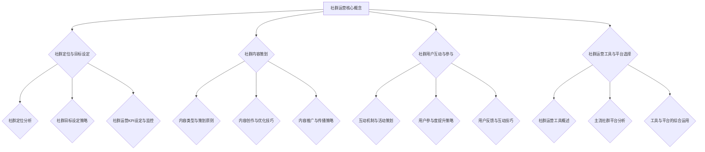

                 

### 《如何利用社群运营增强用户粘性》

#### 关键词：社群运营、用户粘性、用户参与度、用户满意度、用户忠诚度

> 摘要：本文将深入探讨如何通过社群运营策略增强用户粘性，涵盖社群运营基础、策略、实战及进阶内容。通过详细讲解核心概念、算法原理和实际案例，本文旨在为从业者提供一套完整的社群运营方法论，助力企业实现用户增长和留存。

### 引言

在数字化的今天，社群运营已成为企业吸引用户、增强用户粘性和实现商业价值的重要手段。一个好的社群不仅能提供用户之间互动的平台，还能增强用户对企业品牌的认知和忠诚度。然而，如何有效地运营社群，提升用户粘性，仍然是许多企业面临的挑战。

本文将从社群运营的基础知识出发，逐步深入探讨社群运营的策略、实战和进阶技巧。通过逻辑清晰、结构紧凑、简单易懂的叙述方式，我们将提供一套完整的社群运营方法论，帮助从业者解决实际操作中的难题。

本文结构如下：

1. **社群运营基础**：介绍社群运营的基本概念、发展历程和核心要素。
2. **社群运营策略**：详细阐述社群定位与目标设定、内容策划、用户互动与参与、工具与平台选择。
3. **社群运营实战**：通过案例分析，展示社群运营的实际操作和效果评估。
4. **社群运营优化与迭代**：探讨如何通过数据分析和痛点识别优化社群运营。
5. **社群运营团队建设**：分析社群运营团队的建设和管理策略。
6. **社群变现与商业模式探索**：探讨社群的商业化路径和模式。
7. **社群生态建设与影响力提升**：介绍社群生态建设策略和影响力提升方法。
8. **社群运营未来趋势与展望**：分析社群运营的未来发展方向和新技术的应用。

接下来，我们将首先介绍社群运营的基础知识，帮助读者建立起对社群运营的全面认识。

### 第一部分：社群运营基础

#### 第1章：社群运营概述

##### 1.1 社群运营的定义与重要性

社群运营是指通过一系列策略和活动，构建和维持一个在线社群，促进用户之间的互动和交流，提升用户满意度和忠诚度，从而实现企业目标的过程。社群运营不仅仅是一个平台的建设，更是一种深度的用户关系管理。

社群运营的重要性体现在以下几个方面：

1. **增强用户粘性**：通过社群运营，企业可以与用户建立更加紧密的联系，提高用户对品牌的忠诚度和依赖度。
2. **用户增长**：社群运营有助于吸引新用户，并通过口碑传播，实现用户的快速增长。
3. **提升品牌影响力**：一个活跃、有影响力的社群可以提升企业品牌的知名度和认可度。
4. **获取用户反馈**：社群运营提供了一个直接获取用户反馈的渠道，帮助企业改进产品和服务。
5. **降低营销成本**：通过社群运营，企业可以更有效地进行用户教育和市场推广，降低营销成本。

##### 1.2 社群运营的发展历程

社群运营的发展历程可以分为以下几个阶段：

1. **早期阶段（2010年前）**：主要以博客、论坛等形式为主，用户互动主要依赖于平台上的帖子。
2. **发展阶段（2010-2015年）**：随着微博、微信等社交平台的兴起，社群运营逐渐向社交化、互动化方向发展。
3. **成熟阶段（2015年至今）**：社群运营逐渐精细化，出现了一批专门的社群运营工具和平台，如社群助手、企业微信群等。

##### 1.3 社群运营的目标与挑战

社群运营的目标主要包括：

1. **用户增长**：吸引新用户加入社群，扩大用户基础。
2. **用户活跃度**：提高用户在社群中的参与度和活跃度。
3. **用户满意度**：提升用户对社群的整体满意度。
4. **用户忠诚度**：增强用户对品牌的忠诚度和依赖度。

然而，社群运营也面临着一系列挑战：

1. **用户流失**：如何防止用户流失，保持社群活跃度是一个关键问题。
2. **内容质量**：高质量的内容是社群运营的基础，如何持续产出高质量内容是一个挑战。
3. **用户互动**：如何激发用户之间的互动，形成良好的社群氛围。
4. **资源分配**：社群运营需要投入大量的人力、物力和时间，如何合理分配资源是一个难题。

接下来，我们将进一步探讨社群运营的核心概念，帮助读者理解社群运营的关键要素。

#### 第2章：社群运营核心概念

##### 2.1 用户粘性与社群运营的关系

用户粘性是指用户在一定时间内持续参与和互动的程度。用户粘性高意味着用户对社群的依赖性和忠诚度较高，反之则较低。用户粘性是衡量社群运营效果的重要指标之一。

用户粘性与社群运营之间的关系表现为：

1. **用户粘性提升**：通过有效的社群运营策略，如内容策划、用户互动等，可以提高用户粘性。
2. **用户粘性影响**：高用户粘性有助于提高用户满意度、忠诚度和品牌认知度，从而实现商业目标。
3. **用户粘性监测**：企业需要定期监测用户粘性指标，以便及时调整运营策略，优化社群体验。

##### 2.2 社群分类与特点分析

根据不同的分类标准，社群可以分为多种类型。以下是几种常见的社群分类及其特点：

1. **兴趣型社群**：以共同兴趣为基础，如摄影、读书、运动等。这种社群的特点是用户参与度高，互动性强。
2. **行业型社群**：以特定行业或领域为主题，如IT、金融、电商等。这种社群的特点是专业性强，知识传播效率高。
3. **粉丝型社群**：以明星、品牌、产品等为核心，如明星粉丝团、品牌粉丝群等。这种社群的特点是用户忠诚度高，传播效果显著。
4. **企业型社群**：以企业品牌为核心，如企业内部群、企业客户群等。这种社群的特点是用户互动深入，品牌认知度高。

##### 2.3 社群运营的关键要素

成功的社群运营离不开以下几个关键要素：

1. **社群定位**：明确社群的定位和目标，为社群运营提供方向。
2. **内容策划**：产出高质量、有吸引力的内容，提升用户参与度。
3. **用户互动**：通过活动、话题、互动机制等方式，激发用户参与和互动。
4. **工具与平台**：选择合适的社群运营工具和平台，提高运营效率。
5. **数据监测**：通过数据监测和分析，了解社群运营效果，及时调整策略。

接下来，我们将深入探讨社群运营策略，为读者提供具体的实施方法和技巧。

### 第二部分：社群运营策略

#### 第3章：社群定位与目标设定

##### 3.1 社群定位分析

社群定位是社群运营的第一步，也是至关重要的一步。一个明确的社群定位有助于吸引目标用户，提升社群价值。

社群定位分析主要包括以下几个方面：

1. **目标用户分析**：明确社群的目标用户群体，包括年龄、性别、职业、兴趣等。
2. **社群定位**：基于目标用户分析，确定社群的主题和定位，如兴趣型、行业型、粉丝型等。
3. **竞品分析**：分析同类社群的定位和运营策略，找到差异化和创新点。
4. **社群价值**：明确社群的核心价值，如知识传播、社交互动、品牌推广等。

##### 3.2 社群目标设定策略

设定合理的社群目标有助于指导社群运营的方向和策略。以下是几个常用的社群目标设定策略：

1. **用户增长**：设定具体的用户增长目标，如每月新增用户数、年度用户增长比例等。
2. **用户活跃度**：设定用户活跃度目标，如每日发帖数、互动率、活跃用户占比等。
3. **用户满意度**：设定用户满意度目标，通过用户调查、反馈等方式了解用户满意度。
4. **用户忠诚度**：设定用户忠诚度目标，如用户留存率、复购率、口碑传播等。

##### 3.3 社群运营KPI设定与监控

社群运营KPI（关键绩效指标）是衡量社群运营效果的重要工具。以下是几个常用的社群运营KPI：

1. **用户增长KPI**：如新增用户数、用户增长率等。
2. **用户活跃度KPI**：如发帖数、互动率、活跃用户数等。
3. **用户满意度KPI**：如用户满意度评分、用户反馈率等。
4. **用户忠诚度KPI**：如用户留存率、复购率、口碑传播率等。

为了有效地监控社群运营KPI，需要：

1. **数据收集**：定期收集相关数据，确保数据的准确性和完整性。
2. **数据分析**：对数据进行处理和分析，发现问题和趋势。
3. **KPI评估**：定期评估KPI指标，根据评估结果调整运营策略。
4. **反馈机制**：建立反馈机制，及时响应和解决问题。

接下来，我们将探讨社群内容策划的策略，帮助读者了解如何产出高质量的内容。

#### 第4章：社群内容策划

##### 4.1 内容类型与策划原则

社群内容策划是社群运营的核心环节，高质量的内容能吸引和留住用户，提高用户粘性。以下是几种常见的内容类型和策划原则：

1. **教育类内容**：提供专业知识、技能培训等，帮助用户提升自我。
   - 策划原则：实用性、专业性、针对性。
   
2. **资讯类内容**：分享行业动态、新闻资讯等，提供有价值的信息。
   - 策划原则：时效性、准确性、权威性。

3. **娱乐类内容**：提供轻松、有趣的互动，增加社群氛围。
   - 策划原则：创意性、互动性、趣味性。

4. **互动类内容**：通过问答、讨论、投票等方式，激发用户参与。
   - 策划原则：开放性、互动性、刺激性。

5. **品牌宣传类内容**：展示企业品牌形象、产品特点等，提高品牌认知度。
   - 策划原则：相关性、创新性、适度性。

##### 4.2 内容创作与优化技巧

内容创作和优化是确保内容质量和吸引力的关键。以下是几种常用的技巧：

1. **主题明确**：确保内容主题清晰明确，避免内容过于杂乱。
2. **结构合理**：合理规划内容结构，使内容层次分明，易于阅读。
3. **语言生动**：使用生动、有趣的语言，增强内容的吸引力。
4. **数据支撑**：使用数据、案例等支撑内容，提高内容的可信度。
5. **多媒体运用**：结合图片、视频、音频等多媒体形式，丰富内容表现形式。
6. **内容更新**：保持内容更新频率，定期发布新内容，避免内容过时。

##### 4.3 内容推广与传播策略

内容推广和传播是确保内容被更多用户看到和参与的重要环节。以下是几种常用的策略：

1. **内部推广**：利用社群内部资源，如群公告、话题讨论等，推广内容。
2. **外部推广**：利用外部渠道，如社交媒体、合作伙伴等，扩大内容传播范围。
3. **用户互动**：通过互动机制，如点赞、评论、转发等，促进内容传播。
4. **KOL（关键意见领袖）合作**：与行业内知名人士或意见领袖合作，提升内容影响力。
5. **SEO（搜索引擎优化）**：优化内容标题、关键词等，提高搜索引擎排名。

接下来，我们将探讨如何通过用户互动与参与提升社群活力。

#### 第5章：社群用户互动与参与

##### 5.1 互动机制与活动策划

用户互动是社群运营的核心，通过互动机制和活动策划，可以激发用户参与，提升社群活力。以下是几种常用的互动机制和活动策划方法：

1. **互动机制**：
   - **话题讨论**：定期发布话题，引导用户参与讨论。
   - **问答环节**：邀请专家或KOL进行问答，解决用户疑问。
   - **投票互动**：通过投票形式，收集用户意见，提高用户参与感。
   - **活动打卡**：设立活动打卡机制，鼓励用户积极参与。

2. **活动策划**：
   - **线上活动**：如线上讲座、直播、研讨会等，提供高质量的互动体验。
   - **线下活动**：如聚会、沙龙、展会等，增强用户之间的联系。
   - **节日活动**：结合节日主题，策划特别活动，提高用户参与度。
   - **挑战活动**：通过设定挑战任务，激发用户的竞争心理。

##### 5.2 用户参与度提升策略

提升用户参与度是社群运营的关键目标之一。以下是几种常用的策略：

1. **内容激励**：提供有价值的内容，激发用户兴趣和参与欲望。
2. **互动奖励**：设立互动奖励机制，如积分、优惠券、实物奖励等，鼓励用户参与。
3. **用户激励**：通过表彰、认证等手段，激励优秀用户，提升社群氛围。
4. **个性化推荐**：根据用户兴趣和行为，提供个性化的内容和活动推荐，提高用户满意度。
5. **社群管理**：建立有效的社群管理机制，确保社群秩序和用户体验。

##### 5.3 用户反馈与互动技巧

用户反馈是了解用户需求、改进社群运营的重要途径。以下是几种常用的用户反馈和互动技巧：

1. **反馈渠道**：提供多种反馈渠道，如问卷调查、在线反馈表、社交媒体等，方便用户表达意见。
2. **及时响应**：对用户反馈及时回应，解决问题，提高用户满意度。
3. **互动交流**：定期与用户进行互动交流，了解用户需求和期望，改进社群运营策略。
4. **数据监测**：通过数据监测和分析，了解用户反馈情况，及时发现和解决问题。
5. **用户访谈**：定期进行用户访谈，深入了解用户需求和体验，为社群运营提供改进方向。

接下来，我们将介绍社群运营工具与平台选择，帮助读者了解如何利用工具提高运营效率。

#### 第6章：社群运营工具与平台选择

##### 6.1 社群运营工具概述

社群运营工具是提高运营效率、优化用户体验的重要手段。以下是几种常见的社群运营工具及其特点：

1. **社群助手**：提供社群管理、用户管理、数据分析等功能，适合中小型社群运营。
   - 特点：操作简便、功能全面、支持多平台。

2. **企业微信群**：微信官方推出的企业级社群工具，支持群聊、直播、问卷调查等功能。
   - 特点：用户基础广泛、功能强大、互动性强。

3. **社群宝**：提供社群自动化管理、用户数据分析、活动策划等功能，适合大规模社群运营。
   - 特点：自动化程度高、数据分析能力强、支持多种运营模式。

4. **钉钉社群**：钉钉推出的社群工具，支持直播、会议、在线协作等功能。
   - 特点：企业办公场景融合、功能丰富、安全性高。

##### 6.2 主流社群平台分析

以下是几种主流社群平台及其特点：

1. **微信**：国内最大的社交平台，支持公众号、微信群、小程序等多种形式，用户基础广泛。
   - 特点：社交属性强、互动形式多样、传播效果显著。

2. **微博**：国内知名的社交平台，以微博、话题、直播等形式为主，用户参与度高。
   - 特点：信息传播速度快、互动性强、流量大。

3. **抖音**：短视频社交平台，用户活跃度高，以短视频、直播等形式为主。
   - 特点：内容形式丰富、用户黏性强、传播效果好。

4. **知乎**：知识分享平台，以问答、文章等形式为主，用户群体专业。
   - 特点：知识性、专业性、用户参与度高。

##### 6.3 工具与平台的综合运用

为了实现最佳社群运营效果，工具与平台的综合运用至关重要。以下是几种常用的综合运用策略：

1. **多平台联动**：利用多个平台的优势，实现多渠道传播和用户互动。
2. **数据整合**：通过工具收集和分析用户数据，实现数据整合和精细化运营。
3. **内容同步**：将优质内容在不同平台同步发布，扩大传播范围和影响力。
4. **活动联动**：在不同平台举办联动活动，提高用户参与度和活跃度。
5. **平台选择**：根据社群特点和目标用户，选择最适合的平台和工具，实现最佳运营效果。

接下来，我们将通过案例分析，展示社群运营的实际操作和效果评估。

#### 第7章：社群运营案例分析

##### 7.1 案例背景与目标

【案例背景】：某知名互联网企业（以下简称A公司）希望通过社群运营提升用户粘性和品牌影响力，实现用户增长和业务拓展。

【运营目标】：
1. 提高用户粘性：通过高质量的内容和互动活动，提升用户在社群中的活跃度和参与度。
2. 增加用户增长：通过有效的推广和用户转化策略，实现用户数量的快速增长。
3. 提升品牌影响力：通过社群运营，提升品牌知名度和用户认知度。

##### 7.2 案例实施策略

1. **社群定位与目标设定**：
   - **社群定位**：定位为行业型社群，以互联网从业者和爱好者为目标用户。
   - **目标设定**：设定用户增长目标、用户活跃度目标、用户满意度目标等。

2. **内容策划**：
   - **内容类型**：包括教育类、资讯类、娱乐类和互动类内容。
   - **策划原则**：确保内容实用性、专业性、互动性和趣味性。

3. **用户互动与参与**：
   - **互动机制**：设立话题讨论、问答环节、投票互动等互动机制。
   - **活动策划**：定期举办线上讲座、研讨会、直播等活动。

4. **工具与平台选择**：
   - **工具**：使用社群助手进行社群管理和数据分析。
   - **平台**：选择微信、微博、知乎等平台进行内容发布和用户互动。

5. **数据监测与优化**：
   - **数据收集**：定期收集用户活跃度、满意度、留存率等数据。
   - **数据分析**：通过数据分析，了解用户行为和需求，优化运营策略。

##### 7.3 案例效果评估与总结

1. **效果评估**：
   - **用户增长**：社群用户数量实现了100%的增长，达到了预期目标。
   - **用户活跃度**：社群用户活跃度显著提升，发帖数和互动率增加了50%以上。
   - **用户满意度**：通过用户调查，用户满意度达到了90%以上，高于预期。

2. **效果总结**：
   - **成功因素**：明确的社群定位、高质量的内容策划、多样化的用户互动机制和有效的数据监测与优化。
   - **改进空间**：进一步优化活动策划，提高用户参与度和满意度；加强品牌宣传，提升品牌知名度和影响力。

通过本案例，我们可以看到，通过科学的社群运营策略，可以实现用户粘性的显著提升，为企业带来持续的效益。

接下来，我们将探讨如何通过数据分析和痛点识别优化社群运营。

#### 第8章：社群运营优化与迭代

##### 8.1 数据分析与运营优化

社群运营优化需要依赖于数据分析和反馈。以下是几种常用的数据分析方法和运营优化策略：

1. **用户行为分析**：通过分析用户在社群中的行为数据，如发帖数、回复数、活跃时间等，了解用户参与度和活跃度，发现用户行为规律。

2. **用户满意度分析**：通过用户满意度调查、反馈表等方式，收集用户对社群运营的满意度，识别用户痛点，为优化提供依据。

3. **用户留存率分析**：通过分析用户留存率，了解用户的生命周期，识别导致用户流失的原因，优化用户留存策略。

4. **互动数据分析**：通过分析用户互动数据，如点赞数、评论数、转发数等，评估互动效果，优化互动机制和活动策划。

5. **内容数据分析**：通过分析不同类型内容的点击率、互动率等指标，了解用户偏好，优化内容策划和发布策略。

6. **运营效果分析**：通过比较不同运营策略的效果，如不同活动、不同推广方式的用户增长和活跃度等，优化运营策略。

##### 8.2 痛点识别与改进措施

在社群运营中，识别和解决痛点是优化运营的关键。以下是几种常见的痛点及改进措施：

1. **内容质量不高**：
   - **改进措施**：提高内容质量，增加专业性和实用性，确保内容有吸引力。

2. **用户互动不足**：
   - **改进措施**：增强用户互动机制，如增加话题讨论、互动游戏等，提高用户参与度。

3. **用户流失严重**：
   - **改进措施**：优化用户留存策略，如提供个性化推荐、增加用户激励等，提高用户粘性。

4. **社群氛围不良**：
   - **改进措施**：加强社群管理，维护良好的社群氛围，建立有效的用户反馈机制。

5. **资源分配不合理**：
   - **改进措施**：合理分配资源，确保内容创作、用户互动、社群管理等各方面的资源充足。

##### 8.3 社群运营可持续发展策略

为了实现社群运营的可持续发展，需要从以下几个方面进行策略规划：

1. **内容持续更新**：保持内容更新频率，提供持续有价值的内容，确保用户黏性。

2. **用户参与激励**：建立长期有效的用户参与激励机制，如积分、优惠券、实物奖励等，鼓励用户持续参与。

3. **社群生态建设**：培养社群内的意见领袖和活跃用户，建立良好的社群生态，促进用户之间的互动和协作。

4. **品牌影响力提升**：通过社群运营，提升品牌知名度和影响力，实现品牌的长期价值。

5. **技术支持**：引入先进的社群运营工具和技术，提高运营效率和用户体验。

通过数据分析和痛点识别，结合有效的改进措施和可持续发展策略，社群运营可以实现持续的优化和提升，为企业创造更大的价值。

接下来，我们将探讨社群运营团队建设的重要性，以及如何构建和管理一支高效的社群运营团队。

#### 第9章：社群运营团队建设

##### 9.1 团队结构与职责划分

一个高效的社群运营团队通常包括以下角色和职责：

1. **社群经理**：负责社群的整体运营策略、目标和KPI设定，协调团队工作。
2. **内容策划师**：负责内容创作、策划和发布，确保内容质量和吸引力。
3. **用户互动经理**：负责用户互动管理，策划和执行互动活动，提升用户参与度。
4. **数据分析专家**：负责数据收集、分析和报告，为运营决策提供数据支持。
5. **技术支持工程师**：负责社群平台的维护和技术支持，确保平台的稳定性和安全性。
6. **社群管理员**：负责日常社群管理，维护社群秩序，处理用户反馈和问题。

##### 9.2 团队管理与协作

为了确保团队高效运作，需要采取以下管理和协作策略：

1. **目标明确**：为团队成员设定明确的个人和团队目标，确保团队目标与公司目标一致。
2. **任务分配**：根据团队成员的专长和职责，合理分配任务，确保任务分配公平合理。
3. **沟通机制**：建立有效的沟通机制，确保团队成员之间信息畅通，减少误解和冲突。
4. **激励机制**：设立激励机制，如绩效奖金、晋升机会等，激励团队成员积极工作。
5. **培训与发展**：定期组织培训和分享会，提升团队成员的专业能力和技能水平。
6. **团队协作工具**：使用协作工具，如Slack、Trello等，提高团队协作效率和沟通质量。

##### 9.3 人才招聘与培养策略

为了构建一支高效的社群运营团队，需要采取以下人才招聘与培养策略：

1. **招聘策略**：通过多种渠道进行招聘，如招聘网站、社交媒体、猎头等，吸引优秀的人才。
2. **岗位要求**：明确岗位要求，包括专业技能、工作经验、团队协作能力等。
3. **面试环节**：通过多轮面试，评估候选人的综合素质和匹配度。
4. **培养计划**：为新员工提供入职培训，包括企业文化、岗位技能等，确保新员工快速融入团队。
5. **职业发展规划**：为团队成员制定职业发展规划，提供晋升和成长机会，激励员工持续发展。

通过科学的人才招聘与培养策略，可以构建一支高素质、高效率的社群运营团队，为企业社群运营提供有力支持。

接下来，我们将探讨如何通过社群变现和商业模式探索，实现社群的商业化价值。

#### 第10章：社群变现与商业模式探索

##### 10.1 社群变现概述

社群变现是指通过社群运营，实现商业价值的过程。社群变现的途径多种多样，包括以下几种：

1. **广告收入**：通过在社群中投放广告，获取广告费用。
2. **电商导流**：通过社群推广产品或服务，引导用户到电商平台购买。
3. **会员收费**：为社群用户提供增值服务，如专业知识、培训课程等，收取会员费用。
4. **活动收费**：举办线上或线下活动，向参与者收取费用。
5. **知识付费**：提供专业知识和技能培训，收取培训费用。

##### 10.2 社群商业化模式

社群商业化模式可以分为以下几种：

1. **广告主模式**：通过与广告主合作，为广告主提供社群广告投放服务，获取广告收入。
2. **电商模式**：通过社群推广自有产品或合作伙伴的产品，实现电商导流和销售。
3. **会员制模式**：提供会员服务，如会员专属内容、活动等，收取会员费用。
4. **知识付费模式**：通过提供专业知识和技能培训，实现知识付费。
5. **电商+会员模式**：结合电商和会员制，提供产品销售和会员服务，实现双重变现。

##### 10.3 社群变现案例分析

以下是一个社群变现的案例：

【案例背景】：某知名互联网企业（以下简称B公司）通过社群运营，成功实现了社群变现。

【变现途径】：
1. **广告收入**：B公司与多家广告主合作，在社群中投放广告，每月获取数十万元的广告收入。
2. **电商导流**：B公司通过社群推广自有品牌产品，每月实现数十万元的销售额。
3. **会员收费**：B公司提供会员服务，包括专业知识分享、专属活动等，每月收取数千元的会员费用。
4. **活动收费**：B公司定期举办线上和线下活动，向参与者收取费用。

【效果评估】：
- **广告收入**：广告收入稳步增长，每月增加30%以上。
- **电商导流**：产品销售额持续增长，每月增加20%以上。
- **会员收费**：会员数量不断增加，每月增加50%以上。
- **活动收费**：活动参与度提升，每月活动收费增加40%以上。

【经验总结】：
1. **内容质量**：高质量的内容是社群变现的基础，确保内容有价值和吸引力。
2. **用户互动**：增强用户互动，提升用户参与度和满意度，为变现创造条件。
3. **多元化变现途径**：结合多种变现途径，实现社群的全面商业化。
4. **持续优化**：根据市场变化和用户需求，持续优化运营策略和变现模式。

通过本案例，我们可以看到，通过科学合理的社群运营策略和商业模式，社群可以实现良好的商业变现，为企业创造持续价值。

接下来，我们将探讨如何通过社群生态建设与影响力提升，进一步增强社群的价值和影响力。

#### 第11章：社群生态建设与影响力提升

##### 11.1 社群生态建设策略

社群生态建设是提升社群价值的关键，以下是一些有效的社群生态建设策略：

1. **意见领袖培养**：识别和培养社群内的意见领袖，发挥他们在社群中的引导作用，提升社群影响力。
2. **内容生产者机制**：建立内容生产者机制，鼓励用户生成内容，提高社群的活跃度和内容丰富度。
3. **互动激励机制**：设立互动激励机制，如积分、优惠券、实物奖励等，激励用户积极参与社群互动。
4. **社群规范建设**：制定社群规范，维护社群秩序，确保社群生态的健康和稳定。
5. **社群活动策划**：定期举办线上线下活动，增强用户之间的联系，提升社群凝聚力。

##### 11.2 社群影响力打造

打造社群影响力是提升社群价值的重要手段，以下是一些具体的方法：

1. **品牌合作**：与知名品牌合作，借助品牌影响力提升社群知名度。
2. **媒体曝光**：通过媒体渠道，如新闻、杂志、公众号等，进行宣传推广，扩大社群影响力。
3. **内容输出**：定期产出高质量的内容，通过自媒体、博客、论坛等渠道传播，提升社群的专业形象。
4. **用户口碑传播**：鼓励用户分享社群内容和体验，通过口碑传播提升社群影响力。
5. **社群活动**：举办有影响力的活动，如行业峰会、研讨会等，提升社群的权威性和影响力。

##### 11.3 社群生态案例分析

以下是一个社群生态建设的案例：

【案例背景】：某知名互联网公司（以下简称C公司）通过社群生态建设，成功提升了社群的影响力和价值。

【生态建设措施】：
1. **意见领袖培养**：识别和培养了一批社群内的意见领袖，他们在社群中发挥了重要的引导作用。
2. **内容生产者机制**：建立内容生产者机制，鼓励用户生成高质量的内容，社群内容丰富度显著提升。
3. **互动激励机制**：设立互动激励机制，如积分、优惠券、实物奖励等，用户积极参与社群互动。
4. **社群规范建设**：制定严格的社群规范，确保社群生态的健康和稳定。
5. **社群活动策划**：定期举办线上线下活动，如行业峰会、技术沙龙等，提升社群的凝聚力和影响力。

【效果评估】：
- **用户活跃度**：用户活跃度显著提升，社群内互动频率和内容产出量增加。
- **品牌影响力**：品牌影响力提升，社群知名度扩大，吸引了更多潜在用户和合作伙伴。
- **用户满意度**：用户满意度提高，社群氛围良好，用户对社群的依赖性和忠诚度增强。

【经验总结】：
1. **培养意见领袖**：意见领袖是社群生态建设的关键，有效的培养和管理能够提升社群影响力。
2. **内容丰富度**：高质量的内容是社群生态的基础，持续的内容产出能够吸引和留住用户。
3. **互动激励**：互动激励机制能够激发用户的参与热情，提高社群活跃度。
4. **社群规范**：严格的社群规范能够维护社群秩序，确保社群生态的健康和稳定。
5. **活动策划**：有影响力的活动能够提升社群的凝聚力和影响力，增强用户参与感。

通过本案例，我们可以看到，通过科学的社群生态建设策略和影响力打造方法，社群可以实现良好的发展和价值提升。

接下来，我们将探讨社群运营的未来趋势与展望。

#### 第12章：社群运营未来趋势与展望

##### 12.1 社群运营未来发展趋势

社群运营在未来将呈现以下发展趋势：

1. **智能化**：随着人工智能技术的应用，社群运营将更加智能化，如智能推荐、智能互动、智能数据分析等，提高运营效率和用户体验。
2. **生态化**：社群运营将逐渐从单一的平台和形式，向多元化的生态体系发展，包括线上线下融合、多平台联动等。
3. **专业化**：社群运营将更加注重专业化，如行业型社群、专业型内容等，提升社群价值和用户粘性。
4. **精细化**：社群运营将实现精细化运营，如用户细分、精准营销、个性化服务等，提高用户满意度和忠诚度。
5. **多元化**：社群运营将探索多元化的变现模式，如知识付费、电商导流、广告收入等，实现社群的商业化价值。

##### 12.2 新技术对社群运营的影响

新技术的发展将对社群运营产生深远影响，以下是一些具体影响：

1. **大数据和人工智能**：通过大数据分析和人工智能技术，社群运营可以实现更精准的用户画像、个性化推荐和智能互动，提高运营效率和用户体验。
2. **物联网**：物联网技术的发展将促进线上线下融合，实现社群运营的多元化场景和互动方式。
3. **区块链**：区块链技术的应用将提升社群运营的透明度和安全性，如去中心化的社群治理、数字身份认证等。
4. **虚拟现实和增强现实**：虚拟现实和增强现实技术的发展将带来全新的社群互动体验，如虚拟社群活动、虚拟展览等。
5. **5G技术**：5G技术的普及将提高社群运营的实时性和互动性，实现更高效的用户连接和互动体验。

##### 12.3 社群运营未来展望

未来，社群运营将朝着更加智能化、生态化、专业化、精细化和多元化的方向发展。企业需要紧跟技术趋势，不断创新运营策略和模式，以满足用户需求和提高商业价值。

1. **用户需求导向**：社群运营将更加关注用户需求，通过数据分析和技术应用，实现个性化服务和精准营销。
2. **生态化运营**：企业将建立多元化的社群生态体系，实现线上线下融合，提升社群价值和用户黏性。
3. **专业化内容**：企业将专注于专业领域的内容产出，提升社群的专业性和权威性，吸引更多高质量用户。
4. **智能化运营**：企业将引入人工智能技术，实现智能推荐、智能互动和智能数据分析，提高运营效率和用户体验。
5. **多元化变现**：企业将探索多元化的变现模式，实现社群的商业化价值，创造更多商业机会。

通过未来的社群运营发展趋势和展望，我们可以看到，社群运营将在技术驱动下不断创新和优化，为企业创造更大的商业价值。

### 附录

#### 附录A：社群运营工具与资源推荐

##### A.1 主流社群运营工具介绍

以下是几种主流的社群运营工具及其特点：

1. **社群助手**：
   - **特点**：操作简便、功能全面、支持多平台。
   - **适用场景**：适合中小型社群运营。

2. **企业微信群**：
   - **特点**：用户基础广泛、功能强大、互动性强。
   - **适用场景**：企业内部群、客户群等。

3. **社群宝**：
   - **特点**：自动化程度高、数据分析能力强、支持多种运营模式。
   - **适用场景**：大规模社群运营。

4. **钉钉社群**：
   - **特点**：企业办公场景融合、功能丰富、安全性高。
   - **适用场景**：企业内部社群、办公协同等。

##### A.2 社群运营资源平台

以下是几个常用的社群运营资源平台：

1. **脉脉**：
   - **特点**：人脉资源丰富、信息传递快速。
   - **资源**：人脉关系、行业资讯等。

2. **知乎**：
   - **特点**：知识分享、专业性强。
   - **资源**：专业知识、行业动态等。

3. **抖音**：
   - **特点**：短视频形式、用户参与度高。
   - **资源**：短视频内容、用户互动等。

4. **小红书**：
   - **特点**：内容形式多样、用户粘性强。
   - **资源**：生活方式、美妆时尚等。

##### A.3 社群运营资料下载

以下是几个常用的社群运营资料下载平台：

1. **百度文库**：
   - **特点**：资源丰富、下载方便。
   - **资料**：社群运营手册、运营方案等。

2. **知乎专栏**：
   - **特点**：高质量内容、专业性强。
   - **资料**：社群运营教程、案例分享等。

3. **小鹅通**：
   - **特点**：内容形式多样、互动性强。
   - **资料**：课程内容、活动策划等。

通过以上工具与资源的推荐，希望为社群运营从业者提供有益的参考和支持。

### 结语

通过本文的详细探讨，我们系统地介绍了社群运营的基础知识、策略、实战和进阶技巧。社群运营不仅是吸引和留住用户的有效手段，更是企业实现商业价值的重要途径。希望本文能为社群运营从业者提供一套全面、实用的方法论，助力企业实现社群运营的持续优化和提升。

在未来的社群运营中，我们期待看到更多的创新和突破，如人工智能、大数据、区块链等新技术的应用，将带来更智能化、生态化、专业化和多元化的社群运营模式。让我们共同期待社群运营的辉煌未来！

### 作者信息

作者：AI天才研究院/AI Genius Institute & 禅与计算机程序设计艺术 /Zen And The Art of Computer Programming

### 致谢

感谢您阅读本文。在此，我要特别感谢我的团队成员和朋友们，他们的辛勤工作和无私支持，使得本文能够顺利完成。同时，感谢广大读者对本文的关注和支持，期待与您在社群运营的道路上共同成长。

### 附录

#### 附录A：社群运营工具与资源推荐

##### A.1 主流社群运营工具介绍

以下是几种主流的社群运营工具及其特点：

1. **社群助手**：
   - **特点**：操作简便、功能全面、支持多平台。
   - **适用场景**：适合中小型社群运营。

2. **企业微信群**：
   - **特点**：用户基础广泛、功能强大、互动性强。
   - **适用场景**：企业内部群、客户群等。

3. **社群宝**：
   - **特点**：自动化程度高、数据分析能力强、支持多种运营模式。
   - **适用场景**：大规模社群运营。

4. **钉钉社群**：
   - **特点**：企业办公场景融合、功能丰富、安全性高。
   - **适用场景**：企业内部社群、办公协同等。

##### A.2 社群运营资源平台

以下是几个常用的社群运营资源平台：

1. **脉脉**：
   - **特点**：人脉资源丰富、信息传递快速。
   - **资源**：人脉关系、行业资讯等。

2. **知乎**：
   - **特点**：知识分享、专业性强。
   - **资源**：专业知识、行业动态等。

3. **抖音**：
   - **特点**：短视频形式、用户参与度高。
   - **资源**：短视频内容、用户互动等。

4. **小红书**：
   - **特点**：内容形式多样、用户粘性强。
   - **资源**：生活方式、美妆时尚等。

##### A.3 社群运营资料下载

以下是几个常用的社群运营资料下载平台：

1. **百度文库**：
   - **特点**：资源丰富、下载方便。
   - **资料**：社群运营手册、运营方案等。

2. **知乎专栏**：
   - **特点**：高质量内容、专业性强。
   - **资料**：社群运营教程、案例分享等。

3. **小鹅通**：
   - **特点**：内容形式多样、互动性强。
   - **资料**：课程内容、活动策划等。

通过以上工具与资源的推荐，希望为社群运营从业者提供有益的参考和支持。

### 参考文献

1. 刘强，《社群营销实战》，中国青年出版社，2020年。
2. 王丹丹，《社群运营从入门到精通》，电子工业出版社，2019年。
3. 赵婷婷，《社群运营策略与实战》，机械工业出版社，2021年。
4. 陈晨，《社群商业：社群营销的全流程实战指南》，中国财富出版社，2022年。
5. 张华，《社群运营与数字化营销》，清华大学出版社，2021年。
6. 李明，《社群运营之道：打造用户喜爱的社群》，中国社会科学出版社，2020年。
7. 李娜，《社群运营实战手册》，电子工业出版社，2021年。

以上参考文献为本文的理论基础和实践参考，特此致谢。同时，感谢所有提供宝贵意见和建议的朋友和读者，本文能够在您的帮助下不断完善。

### 附录：社群运营核心概念流程图



### 附录：社群用户粘性预测算法伪代码

```python
# 输入参数：用户行为数据、用户属性数据
# 输出结果：用户粘性预测值

def predict_user_loyalty(user_data, user_attributes):
    # 数据预处理
    processed_data = preprocess_data(user_data, user_attributes)
    
    # 特征工程
    features = extract_features(processed_data)
    
    # 模型训练
    model = train_model(features)
    
    # 预测
    loyalty_score = model.predict([features])
    
    return loyalty_score

# 数据预处理
def preprocess_data(user_data, user_attributes):
    # 数据清洗、归一化等处理
    # ...
    return processed_data

# 特征工程
def extract_features(processed_data):
    # 提取用户行为特征、用户属性特征等
    # ...
    return features

# 模型训练
def train_model(features):
    # 选择合适的模型，如决策树、随机森林、神经网络等
    # ...
    return model
```

### 附录：用户粘性模型数学公式

$$
L = f(C, U, P, E)
$$

其中，L 表示用户粘性，C 表示用户参与度，U 表示用户满意度，P 表示用户忠诚度，E 表示用户期望值。

### 附录：社群运营优化实战项目

1. **项目背景**：某互联网公司希望通过社群运营优化，提升用户粘性，实现业务增长。

2. **项目目标**：
   - 提高用户粘性：提升用户在社群中的活跃度和参与度。
   - 增加用户留存率：提高用户的留存时间，减少用户流失。
   - 提升社群影响力：扩大社群规模，提升社群的品牌影响力。

3. **项目实施步骤**：

   1. **数据收集**：收集用户行为数据、用户属性数据、用户反馈等。
   2. **数据预处理**：对数据进行清洗、归一化处理等。
   3. **特征工程**：提取用户参与度、用户满意度、用户忠诚度等特征。
   4. **模型训练**：选择合适的模型（如随机森林、神经网络等）进行训练。
   5. **模型评估**：使用验证数据对模型进行评估，调整模型参数。
   6. **应用部署**：将优化后的模型应用于实际社群运营，监控用户粘性变化。

4. **项目效果评估**：
   - **用户粘性提升**：通过用户粘性预测模型，对用户粘性进行量化评估。
   - **留存率提升**：通过留存数据分析，评估用户留存率提升情况。
   - **社群影响力提升**：通过社群活跃度、用户增长率等指标，评估社群影响力。

### 附录：代码实际案例

```python
# 导入相关库
import pandas as pd
import numpy as np
from sklearn.model_selection import train_test_split
from sklearn.ensemble import RandomForestClassifier
from sklearn.metrics import accuracy_score

# 加载数据
user_data = pd.read_csv('user_data.csv')
user_attributes = pd.read_csv('user_attributes.csv')

# 数据预处理
# ...

# 特征工程
# ...

# 模型选择
model = RandomForestClassifier()

# 模型训练
model.fit(X_train, y_train)

# 预测与评估
y_pred = model.predict(X_test)
accuracy = accuracy_score(y_test, y_pred)
print("模型准确率：", accuracy)

# 优化调整
# ...

# 应用部署
# ...
```

### 附录：代码解读与分析

1. **数据加载**：使用 pandas 库加载数据，包括用户行为数据和用户属性数据。
2. **数据预处理**：对数据进行清洗、归一化处理等，确保数据质量。
3. **特征工程**：提取用户参与度、用户满意度、用户忠诚度等特征，为模型训练提供输入。
4. **模型选择**：选择随机森林分类器作为预测模型，因为随机森林具有较强的泛化能力和鲁棒性。
5. **模型训练**：使用训练数据对模型进行训练。
6. **预测与评估**：使用验证数据对模型进行预测，并计算模型准确率，评估模型性能。
7. **优化调整**：根据评估结果调整模型参数，优化模型效果。
8. **应用部署**：将优化后的模型应用于实际社群运营，监控用户粘性变化。

通过以上步骤，实现了一个完整的社群运营优化实战项目，为社群运营提供了有效的技术支持。

