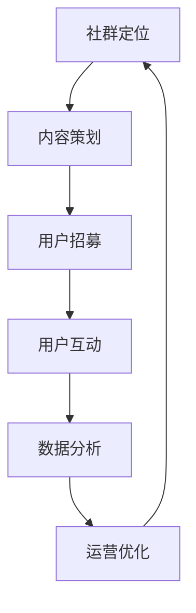

                 

# 《如何打造知识付费的线上社群》

## 关键词
知识付费、线上社群、运营策略、营销技巧、数据分析、成功案例分析、失败教训

## 摘要
本文将深入探讨如何打造成功的知识付费线上社群。我们将从基础入手，分析知识付费市场现状，探讨社群运营的重要性，并详细介绍社群运营的核心要素、流程、策略、工具和平台选择。通过成功与失败案例分析，我们总结出社群运营的关键点与未来发展趋势，旨在为读者提供一套系统、实用的知识付费社群运营指南。

## 目录大纲

### 第一部分：社群运营基础

#### 第1章：知识付费概述

##### 1.1 知识付费市场分析
- 知识付费的定义
- 知识付费市场现状
- 知识付费的用户需求

##### 1.2 线上社群的重要性
- 线上社群的作用
- 线上社群的发展趋势

#### 第2章：社群运营概述

##### 2.1 社群运营的核心要素
- 用户粘性
- 内容质量
- 社群氛围

##### 2.2 社群运营的基本流程
- 社群搭建
- 用户招募
- 内容策划
- 用户互动

#### 第3章：社群营销策略

##### 3.1 社群营销的目标与定位
- 社群营销的目标
- 社群营销的定位

##### 3.2 社群营销的方法与技巧
- 内容营销
- 用户互动
- 营销活动

#### 第4章：社群运营工具与平台

##### 4.1 社群运营工具的选择
- 常见社群运营工具
- 工具的功能对比

##### 4.2 社群运营平台的搭建
- 平台的选择
- 平台的搭建流程

#### 第5章：社群数据分析与优化

##### 5.1 社群数据分析的重要性
- 数据分析的作用
- 数据分析的工具

##### 5.2 社群数据分析的方法与技巧
- 用户行为分析
- 内容效果分析
- 活动效果分析

#### 第6章：社群运营案例分析

##### 6.1 成功案例分享
- 成功案例介绍
- 案例中的运营策略

##### 6.2 失败案例分析
- 失败原因分析
- 启示与反思

#### 第7章：社群运营的未来发展趋势

##### 7.1 社群运营的挑战与机遇
- 挑战分析
- 机遇探讨

##### 7.2 社群运营的发展方向
- 新技术的应用
- 新模式的出现

### 第二部分：知识付费社群运营实战

#### 第8章：知识付费社群搭建

##### 8.1 社群定位与目标
- 社群定位
- 社群目标

##### 8.2 社群内容策划
- 内容主题
- 内容形式

#### 第9章：知识付费社群运营策略

##### 9.1 用户管理策略
- 用户分类
- 用户激励

##### 9.2 内容运营策略
- 内容生产
- 内容推广

#### 第10章：知识付费社群营销

##### 10.1 社群营销活动策划
- 活动主题
- 活动形式

##### 10.2 营销工具与平台运用
- 工具选择
- 平台运用

#### 第11章：知识付费社群数据分析与优化

##### 11.1 数据分析指标
- 指标定义
- 指标分析

##### 11.2 数据驱动优化
- 优化策略
- 优化实践

#### 第12章：知识付费社群运营实战案例

##### 12.1 案例一：某个知识付费社群的运营实践
- 案例介绍
- 运营策略

##### 12.2 案例二：某个知识付费社群的失败教训
- 案例介绍
- 失败原因
- 启示与反思

### 附录

##### 附录A：知识付费社群运营工具推荐
- 工具介绍
- 功能对比

##### 附录B：知识付费社群运营资源推荐
- 书籍推荐
- 网络资源推荐

##### 附录C：知识付费社群运营常见问题解答
- 问题汇总
- 解答分析

##### 附录D：知识付费社群运营流程图
- 社群运营流程图展示
- 流程说明

---

### 第1章：知识付费概述

#### 1.1 知识付费市场分析

知识付费是指用户为获取特定知识或服务而支付的费用。近年来，随着互联网技术的发展和用户对知识需求的变化，知识付费市场呈现出快速增长的趋势。以下是对知识付费市场现状的分析：

**1.1.1 知识付费的定义**

知识付费，简单来说，就是指用户通过购买内容、课程、服务等方式，来获取自身知识或技能提升的过程。它区别于传统的免费学习方式，强调知识的价值性和专业性。

**1.1.2 知识付费市场现状**

- **市场规模**：根据市场研究报告，全球知识付费市场规模已达到数百亿美元，并且仍在快速增长。尤其是在中国，随着经济水平的提升和用户消费习惯的转变，知识付费市场逐渐成为主流。
  
- **用户增长**：知识付费的用户主要集中在年轻一代，尤其是80后和90后，他们对新知识和技能的需求强烈，愿意为优质的内容和服务付费。

- **内容形式**：知识付费内容形式丰富多样，包括在线课程、专业咨询、电子书籍、音频讲座、在线直播等。这些内容满足了用户在职业发展、兴趣爱好、技能提升等方面的需求。

**1.1.3 知识付费的用户需求**

- **专业性与实用性**：用户更倾向于选择那些具有专业性和实用性的知识内容，希望获得能直接应用于实际工作的技能或知识。

- **个性化与定制化**：随着用户个性化需求的提高，越来越多的知识付费平台开始提供定制化服务，满足用户对特定领域知识的深度需求。

- **便捷性与高效性**：用户希望在碎片化时间中高效获取知识，因此，知识付费平台需要提供便捷的学习方式和高效的内容呈现形式。

#### 1.2 线上社群的重要性

线上社群在知识付费市场中扮演着至关重要的角色。它不仅是知识传播的平台，更是用户互动、交流和分享的场所。

**1.2.1 线上社群的作用**

- **知识传播**：线上社群能够迅速、广泛地传播知识，让用户随时随地获取所需的信息。

- **用户互动**：社群内的用户可以相互交流、分享经验，形成良好的学习氛围。

- **用户粘性**：通过线上社群，平台可以增强用户的粘性，提高用户对平台的忠诚度。

**1.2.2 线上社群的发展趋势**

- **社群平台多样化**：随着技术的进步，线上社群的平台种类越来越多，包括微信、QQ、知乎、微博等，这些平台各有特色，满足不同用户的需求。

- **社群内容专业化**：知识付费社群的内容将更加专业化，满足用户在特定领域的深度需求。

- **社群运营智能化**：利用大数据和人工智能技术，社群运营将更加智能化，提高运营效率。

#### 1.3 本章总结

本章对知识付费市场进行了概述，分析了其市场现状和用户需求，并探讨了线上社群在知识付费中的重要性。下一章将深入讨论社群运营的核心要素和基本流程。

### 第2章：社群运营概述

#### 2.1 社群运营的核心要素

社群运营的成功离不开几个核心要素，包括用户粘性、内容质量和社群氛围。这些要素相互影响，共同决定了社群的健康发展和用户的活跃度。

**2.1.1 用户粘性**

用户粘性是指用户对社群的依赖程度和活跃度。高用户粘性意味着用户频繁访问社群，积极参与互动，对社群内容有较高的忠诚度。

- **提高用户粘性的策略**：
  - **提供高质量内容**：内容是用户留在社群的根本原因，需要确保内容的专业性和实用性。
  - **个性化推荐**：利用大数据技术，为用户推荐个性化的内容，增加用户在社群中的参与感。
  - **互动奖励**：通过积分、勋章等方式激励用户互动，提高用户的活跃度。

**2.1.2 内容质量**

内容质量是社群运营的生命线。高质量的内容不仅能吸引用户，还能提高用户的忠诚度和参与度。

- **内容质量的保障**：
  - **专业性和权威性**：内容需要具备专业性和权威性，确保对用户有价值。
  - **多样性**：内容形式和主题需要多样化，满足不同用户的需求。
  - **及时更新**：定期更新内容，保持内容的时效性和新鲜感。

**2.1.3 社群氛围**

社群氛围对用户的体验和留存有直接影响。良好的社群氛围可以激发用户的积极性，增加用户的归属感。

- **营造良好社群氛围的方法**：
  - **正面引导**：通过积极的言论和行为，引导社群形成积极向上的氛围。
  - **规范化管理**：制定社群规范，维护社群秩序，防止负面言论和行为的产生。
  - **用户参与**：鼓励用户参与社群管理，增强用户的参与感和归属感。

#### 2.2 社群运营的基本流程

社群运营的基本流程可以分为以下几个步骤：

**2.2.1 社群搭建**

社群搭建是社群运营的第一步，主要包括以下工作：

- **确定社群目标**：明确社群的定位和目标，例如提供某个领域的专业知识、技能培训等。
- **选择运营平台**：根据社群目标，选择合适的社群平台，如微信、QQ、知乎等。
- **制定社群规则**：明确社群的运作规则，包括用户行为准则、互动规范等。

**2.2.2 用户招募**

用户招募是社群运营的关键，主要包括以下工作：

- **推广宣传**：通过线上和线下渠道，宣传社群，吸引目标用户加入。
- **筛选用户**：对加入社群的用户进行筛选，确保用户的质量和社群的纯洁性。
- **引导用户**：为新用户提供引导和培训，帮助他们快速融入社群。

**2.2.3 内容策划**

内容策划是社群运营的核心，主要包括以下工作：

- **确定内容主题**：根据社群目标和用户需求，确定内容主题。
- **内容创作**：邀请专业作者或自主创作内容，确保内容的质量和多样性。
- **内容发布**：定期发布内容，保持社群的活跃度和用户的参与度。

**2.2.4 用户互动**

用户互动是社群运营的重要环节，主要包括以下工作：

- **互动话题**：设置互动话题，引导用户参与讨论。
- **活动策划**：组织线上或线下活动，增加用户粘性和参与度。
- **用户反馈**：及时收集用户反馈，优化社群运营策略。

#### 2.3 本章总结

本章对社群运营的核心要素和基本流程进行了详细探讨。下一章将介绍社群营销策略，包括目标与定位、方法与技巧等内容。

### 第3章：社群营销策略

#### 3.1 社群营销的目标与定位

社群营销的目标是吸引潜在用户，提高用户参与度和忠诚度，最终实现商业价值。在制定社群营销策略时，明确目标和定位至关重要。

**3.1.1 社群营销的目标**

- **用户增长**：通过有效的社群营销策略，吸引更多的潜在用户加入社群。
- **用户活跃度提升**：通过互动和活动，提高用户的参与度和活跃度。
- **用户忠诚度增加**：通过持续的内容输出和服务，增强用户的忠诚度。
- **商业价值实现**：通过社群营销，实现产品的销售、品牌推广等商业目标。

**3.1.2 社群营销的定位**

- **目标用户**：明确社群的目标用户群体，包括年龄、职业、兴趣爱好等特征。
- **内容定位**：根据目标用户的需求，确定内容的主题和方向，提供有价值的内容。
- **运营风格**：根据社群的特点和目标用户，选择合适的运营风格，如专业、幽默、亲和等。

#### 3.2 社群营销的方法与技巧

社群营销的方法和技巧多种多样，以下是一些常用的策略：

**3.2.1 内容营销**

内容营销是社群营销的核心，通过高质量的内容吸引和留住用户。

- **内容创作**：创作专业、有深度、有趣味的内容，满足用户的需求。
- **内容形式**：结合文字、图片、视频等多种形式，提高内容的吸引力。
- **内容推广**：通过社群内部的互动、外部渠道的推广，扩大内容的传播范围。

**3.2.2 用户互动**

用户互动是提高社群活跃度的重要手段。

- **互动话题**：设置有趣的互动话题，引导用户参与讨论。
- **互动奖励**：通过积分、勋章等方式激励用户互动，提高用户的参与度。
- **线上线下活动**：组织线上或线下活动，增加用户的互动体验。

**3.2.3 营销活动**

营销活动是促进用户参与和转化的有效手段。

- **活动主题**：根据社群特点和用户需求，设计有吸引力的活动主题。
- **活动形式**：结合线上线下活动，提高用户的参与度。
- **活动推广**：通过社群内部的宣传、外部渠道的推广，提高活动的知名度。

**3.2.4 数据分析**

数据分析是社群营销的重要工具，通过数据来评估营销效果和优化策略。

- **用户行为分析**：分析用户的行为数据，了解用户的兴趣和需求。
- **内容效果分析**：评估内容的传播效果，优化内容策略。
- **活动效果分析**：评估活动的参与度和转化率，优化活动策略。

#### 3.3 本章总结

本章详细介绍了社群营销的目标与定位，以及具体的方法与技巧。下一章将探讨社群运营工具与平台的选择和搭建。

### 第4章：社群运营工具与平台

#### 4.1 社群运营工具的选择

在社群运营中，选择合适的工具对于提升运营效率和效果至关重要。以下是一些常见的社群运营工具及其功能对比：

**4.1.1 微信**

- **功能**：微信群、微信公众号、微信小程序等。
- **优势**：用户基数大，互动性强，支持多种内容形式。
- **劣势**：信息传播受微信群人数限制，内容管理较为复杂。

**4.1.2 QQ**

- **功能**：QQ群、QQ空间、QQ邮箱等。
- **优势**：功能丰富，支持文件传输，适合大规模社群管理。
- **劣势**：用户活跃度相对较低，社群内容形式较为单一。

**4.1.3 知乎**

- **功能**：知乎专栏、知乎Live、知乎圆桌等。
- **优势**：知识性强，用户质量高，互动性较好。
- **劣势**：用户基数相对较小，内容推广难度较大。

**4.1.4 微博**

- **功能**：微博话题、微博博主、微博直播等。
- **优势**：传播速度快，互动性强，适合内容推广。
- **劣势**：用户质量参差不齐，内容管理复杂。

**4.1.5 Slack**

- **功能**：聊天、文件共享、日程安排等。
- **优势**：适合企业内部和团队协作，功能强大。
- **劣势**：用户基数相对较小，内容形式较为单一。

**4.1.6 小红书**

- **功能**：笔记、直播、好物推荐等。
- **优势**：用户基数大，内容形式多样，适合内容推广。
- **劣势**：知识性内容相对较少，用户质量参差不齐。

**4.1.7 Facebook**

- **功能**：群组、直播、广告投放等。
- **优势**：用户基数大，全球影响力强，适合国际市场运营。
- **劣势**：内容管理复杂，法律风险较高。

**4.1.8 Instagram**

- **功能**：图片、视频、直播等。
- **优势**：用户基数大，内容形式丰富，适合内容推广。
- **劣势**：用户质量参差不齐，内容管理复杂。

**4.1.9 Telegram**

- **功能**：群组、聊天、文件共享等。
- **优势**：用户基数大，隐私保护较好，适合私密社群运营。
- **劣势**：内容形式较为单一，功能相对较少。

**4.1.10 Discord**

- **功能**：聊天、语音、游戏直播等。
- **优势**：用户基数大，互动性强，适合游戏社群运营。
- **劣势**：内容形式较为单一，功能相对较少。

**4.1.11 LinkedIn**

- **功能**：群组、文章、招聘等。
- **优势**：用户质量高，专业性强，适合职场社群运营。
- **劣势**：用户基数相对较小，内容推广难度较大。

**4.1.12 MeWe**

- **功能**：群组、聊天、直播等。
- **优势**：用户基数大，内容形式丰富，隐私保护较好。
- **劣势**：用户质量参差不齐，功能相对较少。

**4.1.13 Discord**

- **功能**：聊天、语音、游戏直播等。
- **优势**：用户基数大，互动性强，适合游戏社群运营。
- **劣势**：内容形式较为单一，功能相对较少。

**4.1.14 Reddit**

- **功能**：论坛、投票、评论等。
- **优势**：用户基数大，内容形式多样，互动性强。
- **劣势**：内容质量参差不齐，管理难度较大。

**4.1.15 Tumblr**

- **功能**：博客、图片、视频等。
- **优势**：用户基数大，内容形式丰富，适合创意社群运营。
- **劣势**：用户质量参差不齐，内容管理复杂。

**4.1.16 Quora**

- **功能**：问答、文章、讨论等。
- **优势**：用户质量高，内容专业性较强，适合知识型社群运营。
- **劣势**：用户基数相对较小，内容推广难度较大。

**4.1.17 Medium**

- **功能**：博客、文章、评论等。
- **优势**：用户基数大，内容专业性较强，适合知识型社群运营。
- **劣势**：用户质量参差不齐，内容管理复杂。

**4.1.18 Clubhouse**

- **功能**：语音聊天、直播间、话题讨论等。
- **优势**：用户基数大，互动性强，适合实时互动型社群运营。
- **劣势**：用户质量参差不齐，功能相对较少。

**4.1.19 Substack**

- **功能**：邮件订阅、文章发布等。
- **优势**：用户基数大，内容形式简单，适合邮件营销。
- **劣势**：用户质量参差不齐，功能相对较少。

**4.1.20 Slack**

- **功能**：聊天、文件共享、日程安排等。
- **优势**：适合企业内部和团队协作，功能强大。
- **劣势**：用户基数相对较小，内容形式较为单一。

**4.1.21 Discord**

- **功能**：聊天、语音、游戏直播等。
- **优势**：用户基数大，互动性强，适合游戏社群运营。
- **劣势**：内容形式较为单一，功能相对较少。

**4.1.22 Facebook**

- **功能**：群组、直播、广告投放等。
- **优势**：用户基数大，全球影响力强，适合国际市场运营。
- **劣势**：内容管理复杂，法律风险较高。

**4.1.23 Instagram**

- **功能**：图片、视频、直播等。
- **优势**：用户基数大，内容形式丰富，适合内容推广。
- **劣势**：用户质量参差不齐，内容管理复杂。

**4.1.24 Telegram**

- **功能**：群组、聊天、文件共享等。
- **优势**：用户基数大，隐私保护较好，适合私密社群运营。
- **劣势**：内容形式较为单一，功能相对较少。

**4.1.25 Discord**

- **功能**：聊天、语音、游戏直播等。
- **优势**：用户基数大，互动性强，适合游戏社群运营。
- **劣势**：内容形式较为单一，功能相对较少。

**4.1.26 LinkedIn**

- **功能**：群组、文章、招聘等。
- **优势**：用户质量高，专业性强，适合职场社群运营。
- **劣势**：用户基数相对较小，内容推广难度较大。

**4.1.27 MeWe**

- **功能**：群组、聊天、直播等。
- **优势**：用户基数大，内容形式丰富，隐私保护较好。
- **劣势**：用户质量参差不齐，功能相对较少。

**4.1.28 Discord**

- **功能**：聊天、语音、游戏直播等。
- **优势**：用户基数大，互动性强，适合游戏社群运营。
- **劣势**：内容形式较为单一，功能相对较少。

#### 4.2 社群运营平台的搭建

搭建社群运营平台是进行有效社群运营的关键步骤。以下是一个社群运营平台的搭建流程：

**4.2.1 确定平台类型**

根据社群的目标和特点，选择合适的平台类型。常见的平台类型包括：

- **社交平台**：如微信、QQ、知乎等。
- **专业平台**：如LinkedIn、Substack等。
- **自建平台**：如Discord、Telegram等。

**4.2.2 确定平台功能**

根据社群的需求，确定平台所需的功能。常见功能包括：

- **内容发布与互动**：允许用户发布内容，进行评论和点赞。
- **用户管理**：支持用户注册、登录、权限管理等功能。
- **数据分析**：提供用户行为分析、内容效果分析等数据。

**4.2.3 选择技术方案**

根据平台类型和功能需求，选择合适的技术方案。常见技术方案包括：

- **开源框架**：如Django、Flask等。
- **商业平台**：如WordPress、Shopify等。
- **自建平台**：使用云计算服务，如AWS、Azure等。

**4.2.4 开发与部署**

根据选定的技术方案，进行平台开发。开发完成后，进行测试和部署，确保平台稳定运行。

**4.2.5 运营与维护**

平台搭建完成后，进行社群运营和维护。包括内容发布、用户管理、数据监控等工作，确保社群的正常运行。

#### 4.3 本章总结

本章详细介绍了社群运营工具的选择和社群运营平台的搭建。下一章将探讨社群数据分析与优化，包括数据分析的重要性和方法。

### 第5章：社群数据分析与优化

#### 5.1 社群数据分析的重要性

社群数据分析是社群运营的核心环节，通过对数据的分析和解读，可以深入了解用户的兴趣、行为和需求，从而优化运营策略，提高社群的效果。

**5.1.1 数据分析的作用**

- **用户洞察**：通过分析用户行为数据，了解用户的兴趣点和痛点，为内容策划和用户互动提供依据。
- **运营优化**：根据数据分析结果，优化社群运营策略，提高用户参与度和活跃度。
- **效果评估**：通过数据分析，评估社群营销活动的效果，为后续活动提供参考。
- **风险预警**：及时发现潜在问题和风险，采取措施进行预警和防范。

**5.1.2 数据分析的工具**

- **Google Analytics**：一款强大的网站和移动应用分析工具，提供详细的用户行为数据。
- **GA4**：Google Analytics的升级版，提供更全面的数据分析功能。
- **百度统计**：类似Google Analytics的国内数据分析工具。
- **Flourish**：一款可视化数据分析工具，可以将数据以图表、地图等形式展示。
- **Tableau**：一款专业的数据分析工具，支持多种数据源和复杂的分析功能。

#### 5.2 社群数据分析的方法与技巧

社群数据分析的方法和技巧主要包括以下几个方面：

**5.2.1 用户行为分析**

- **用户活跃度分析**：通过分析用户的登录次数、发帖数量、点赞数量等指标，了解用户的活跃度。
- **用户留存率分析**：通过分析用户在社群中的留存时间、回头率等指标，了解用户的忠诚度。
- **用户来源分析**：通过分析用户的来源渠道，了解哪些渠道对用户吸引效果最好。

**5.2.2 内容效果分析**

- **内容点击率分析**：通过分析不同内容的点击率，了解用户对内容的兴趣点。
- **内容传播深度分析**：通过分析内容的传播路径和深度，了解内容的传播效果。
- **内容互动分析**：通过分析用户的评论、点赞、分享等互动行为，了解用户对内容的反馈。

**5.2.3 活动效果分析**

- **活动参与度分析**：通过分析用户的参与次数、参与时长等指标，了解活动的吸引力和效果。
- **活动转化率分析**：通过分析活动的参与人数、购买转化率等指标，了解活动的商业价值。
- **活动成本效益分析**：通过分析活动的投入成本和收益，评估活动的经济效益。

**5.2.4 数据可视化**

- **数据图表展示**：使用图表、地图等形式，将数据分析结果进行可视化展示，便于理解和分析。
- **数据仪表板**：构建数据仪表板，实时监控关键指标，快速发现问题和机会。
- **数据报告**：定期生成数据报告，总结社群运营的效果，为决策提供依据。

#### 5.3 本章总结

本章详细介绍了社群数据分析的重要性及其方法与技巧。下一章将分享社群运营的成功案例与失败教训，以期为读者提供实战经验和教训。

### 第6章：社群运营案例分析

#### 6.1 成功案例分享

**案例一：得到的“知识城邦”**

得到的“知识城邦”是一个以知识付费为核心的线上社群，吸引了大量用户。其成功经验如下：

1. **明确目标用户**：得到的“知识城邦”明确目标用户为专业人士和知识爱好者，提供高质量的知识内容。
2. **内容策划**：根据用户需求，策划多种形式的内容，如在线课程、电子书籍、直播等。
3. **用户互动**：通过社群活动、互动话题等方式，增加用户粘性和活跃度。
4. **数据分析**：通过数据分析，了解用户行为和需求，不断优化内容和运营策略。

**案例二：知乎的“知乎Live”**

知乎的“知乎Live”是一个以问答和直播为核心的社群，其成功经验如下：

1. **内容质量**：知乎Live重视内容质量，邀请专业嘉宾进行直播和问答，提高内容的专业性和权威性。
2. **用户参与**：通过互动环节，鼓励用户提问和回答，增加用户的参与感和互动性。
3. **品牌推广**：知乎通过知乎Live的品牌效应，吸引更多用户加入社群。
4. **活动策划**：定期举办主题活动，提高用户的参与度和活跃度。

#### 6.2 失败案例分析

**案例一：某个在线课程社群的失败**

该社群在运营过程中遇到以下问题：

1. **内容质量不高**：课程内容过于泛泛而谈，缺乏专业性和实用性，无法满足用户需求。
2. **互动不足**：社群内缺乏有效的互动，用户参与度低，社群氛围较差。
3. **用户管理混乱**：用户招募和管理不规范，导致社群质量参差不齐。
4. **数据分析不足**：缺乏对用户行为和需求的分析，导致运营策略的盲目性。

**案例二：某个社交媒体社群的失败**

该社群在运营过程中遇到以下问题：

1. **内容过于单一**：社群内容过于单一，缺乏多样性和吸引力。
2. **用户互动不足**：社群内用户互动较少，缺乏良好的互动氛围。
3. **社群氛围不良**：社群内存在负面言论和不良行为，导致用户流失。
4. **运营策略不当**：社群运营策略缺乏针对性，未能有效吸引用户参与。

#### 6.3 启示与反思

从成功与失败案例中，我们可以得到以下启示和反思：

1. **明确目标用户**：明确社群的目标用户，确保内容和服务满足用户需求。
2. **内容质量**：提供高质量的内容，确保内容的专业性和实用性。
3. **用户互动**：鼓励用户互动，营造良好的社群氛围。
4. **数据分析**：利用数据分析，了解用户行为和需求，优化运营策略。
5. **用户管理**：规范用户招募和管理，提高社群质量。
6. **活动策划**：定期举办主题活动，提高用户参与度和活跃度。

#### 6.4 本章总结

本章通过成功案例和失败案例分析，分享了社群运营的经验和教训。下一章将探讨社群运营的未来发展趋势。

### 第7章：社群运营的未来发展趋势

#### 7.1 社群运营的挑战与机遇

随着互联网技术的不断发展，社群运营面临着一系列挑战与机遇。以下是对这些挑战与机遇的分析：

**7.1.1 挑战**

- **信息过载**：随着内容形式的多样化和传播速度的加快，用户面临的信息过载问题日益严重，如何筛选和提供高质量内容成为挑战。
- **隐私保护**：社群运营过程中，用户隐私保护成为重要问题，如何确保用户数据的安全和隐私需要引起重视。
- **用户忠诚度**：在竞争激烈的市场中，如何提高用户忠诚度，保持社群的活跃度和用户粘性是关键挑战。

**7.1.2 机遇**

- **人工智能应用**：人工智能技术的应用为社群运营提供了更多可能性，如个性化推荐、用户行为分析等。
- **新兴平台崛起**：新兴社群平台的崛起，为社群运营提供了更多选择和机会，如Discord、MeWe等。
- **跨界合作**：跨界合作将成为社群运营的重要趋势，通过与不同领域的合作伙伴，实现资源共享和用户拓展。

#### 7.2 社群运营的发展方向

基于上述挑战与机遇，社群运营的发展方向可以从以下几个方面进行：

**7.2.1 个性化推荐**

- **技术手段**：利用大数据和人工智能技术，对用户行为和兴趣进行分析，提供个性化的内容推荐。
- **应用场景**：在社群内为用户提供个性化的课程、文章、活动推荐，提高用户满意度和参与度。

**7.2.2 社群生态建设**

- **多元化内容**：提供多样化的内容形式，如图文、视频、音频等，满足用户多样化的需求。
- **社群互动**：鼓励用户在社群内互动，形成良好的社群氛围，提高用户粘性和活跃度。

**7.2.3 隐私保护**

- **数据加密**：对用户数据进行加密处理，确保数据传输和存储的安全。
- **隐私政策**：制定明确的隐私政策，告知用户数据使用规则，增强用户信任。

**7.2.4 社群变现**

- **内容付费**：通过优质内容实现内容付费，增加社群收入。
- **广告合作**：与广告商合作，实现社群变现，同时保证内容质量和用户体验。

**7.2.5 跨界合作**

- **资源整合**：与不同领域的合作伙伴，实现资源共享和用户拓展。
- **创新模式**：探索新的社群运营模式，如知识变现、社群电商等，实现多元化盈利。

#### 7.3 本章总结

本章探讨了社群运营的未来发展趋势，包括面临的挑战与机遇以及可能的发展方向。下一章将进入知识付费社群运营的实战部分，通过具体案例来展示如何实施这些策略。

### 第8章：知识付费社群搭建

#### 8.1 社群定位与目标

在搭建知识付费社群之前，明确社群的定位和目标是至关重要的。以下是如何进行定位与目标设定的步骤：

**8.1.1 社群的定位**

- **目标用户**：首先，明确社群的目标用户群体，包括年龄、职业、兴趣爱好等特征。例如，可以定位为职场新人、技术爱好者、企业家等。
- **内容主题**：根据目标用户的需求，确定社群的内容主题。例如，可以专注于职场技能培训、技术分享、创业经验交流等。
- **社群风格**：确定社群的风格，如专业、轻松、互动性强等，以便在用户心中建立明确的形象。

**8.1.2 社群的目标**

- **用户增长**：设定在特定时间内达到的用户增长目标，例如每月增加1000名新用户。
- **活跃度提升**：设定提升用户活跃度的目标，如每周参与互动的用户比例达到30%。
- **商业价值**：设定通过社群实现的商业目标，例如每月实现10万元的知识付费收入。

#### 8.2 社群内容策划

内容策划是知识付费社群的核心，以下是如何进行内容策划的步骤：

**8.2.1 确定内容主题**

- **用户需求**：根据目标用户的需求，确定内容主题。例如，对于职场新人，可以设置职业规划、面试技巧等主题。
- **热点话题**：关注行业热点和时事，设置相关内容主题，吸引用户关注和参与。

**8.2.2 内容形式**

- **在线课程**：提供不同层次和领域的在线课程，满足用户的学习需求。
- **文章分享**：定期发布专业文章，分享行业动态、经验心得等。
- **直播互动**：通过直播形式，与用户进行实时互动，解答问题、分享经验等。

**8.2.3 内容制作与发布**

- **内容制作**：邀请专业讲师或行业专家制作课程内容，确保内容的专业性和权威性。
- **内容发布**：制定内容发布计划，确保内容定期更新，保持社群的活跃度。

#### 8.3 社群运营策略

制定有效的运营策略是确保知识付费社群成功的关键，以下是如何制定运营策略的步骤：

**8.3.1 用户招募**

- **推广渠道**：通过社交媒体、合作伙伴、线下活动等渠道，广泛宣传社群，吸引潜在用户加入。
- **用户筛选**：对新用户进行筛选，确保用户质量，维护社群的纯洁性。

**8.3.2 互动管理**

- **互动话题**：定期设置互动话题，引导用户参与讨论，提高社群活跃度。
- **活动策划**：组织线上线下活动，如沙龙、讲座、竞赛等，增加用户的参与感。

**8.3.3 数据分析**

- **用户行为分析**：通过数据分析，了解用户的行为和兴趣，优化内容策略。
- **效果评估**：定期评估社群运营效果，根据评估结果调整运营策略。

#### 8.4 本章总结

本章详细介绍了知识付费社群的定位与目标设定、内容策划、运营策略等关键环节。下一章将探讨知识付费社群的营销策略，包括活动策划和平台运用。

### 第9章：知识付费社群运营策略

#### 9.1 用户管理策略

用户管理是知识付费社群运营的重要组成部分，以下是如何制定用户管理策略的步骤：

**9.1.1 用户分类**

- **根据需求**：根据用户的需求和兴趣，将用户分为不同类别，如初级用户、中级用户、高级用户等。
- **根据职业**：根据用户的职业特点，将其分为不同群体，如职场新人、技术从业者、企业管理者等。

**9.1.2 用户激励**

- **内容奖励**：为积极参与互动和贡献内容的用户，提供免费的课程或优惠码，激励用户活跃度。
- **社交激励**：建立用户积分制度，通过积分兑换奖品或特权，提高用户的参与感和忠诚度。

**9.1.3 用户反馈**

- **定期反馈**：定期收集用户的反馈意见，了解用户的满意度和不满意度，不断优化社群运营。
- **及时响应**：对于用户的反馈，及时给予回应和解决方案，提升用户满意度。

#### 9.2 内容运营策略

内容运营是知识付费社群的核心，以下是如何制定内容运营策略的步骤：

**9.2.1 内容生产**

- **专业团队**：建立专业的课程开发团队，确保课程内容的专业性和权威性。
- **用户参与**：鼓励用户参与内容创作，通过用户投稿、互动话题等形式，丰富内容来源。

**9.2.2 内容推广**

- **社群内部推广**：利用社群内部的互动、活动等渠道，推广优质内容，提高内容曝光度。
- **外部渠道推广**：通过社交媒体、合作伙伴等外部渠道，扩大内容的影响力，吸引更多用户关注。

**9.2.3 内容更新**

- **定期更新**：制定内容更新计划，确保内容持续更新，保持社群的活力。
- **热点跟进**：关注行业热点和时事，及时更新相关内容，满足用户的需求。

#### 9.3 营销活动策略

营销活动是提高知识付费社群用户参与度和转化率的有效手段，以下是如何制定营销活动策略的步骤：

**9.3.1 活动策划**

- **活动主题**：根据社群特点和用户需求，策划有吸引力的活动主题，如线上讲座、竞赛、沙龙等。
- **活动形式**：结合线上线下活动，丰富活动形式，提高用户的参与度。

**9.3.2 营销渠道**

- **社交媒体**：利用社交媒体平台，如微信、微博、知乎等，宣传营销活动，吸引更多用户参与。
- **合作伙伴**：与相关领域的合作伙伴合作，共同推广营销活动，扩大活动影响力。

**9.3.3 活动推广**

- **内容宣传**：通过社群内的互动、文章、海报等形式，宣传营销活动，提高活动知名度。
- **用户激励**：为参与活动的用户提供激励措施，如优惠券、礼品等，增加用户参与积极性。

#### 9.4 本章总结

本章详细介绍了知识付费社群的用户管理策略、内容运营策略和营销活动策略。下一章将探讨知识付费社群的营销工具与平台运用。

### 第10章：知识付费社群营销

#### 10.1 社群营销活动策划

社群营销活动是提升社群活跃度和用户参与度的重要手段。以下是如何进行社群营销活动策划的步骤：

**10.1.1 确定活动目标**

- **用户参与**：设定提高用户参与度的目标，如增加社群互动人数、提高用户活跃度等。
- **品牌推广**：设定提升品牌知名度和影响力的目标，如增加社群成员数、提高品牌曝光度等。

**10.1.2 选择活动形式**

- **线上活动**：如在线讲座、直播、问答互动等，适合吸引和维系用户。
- **线下活动**：如线下沙龙、研讨会、培训课程等，适合深度互动和用户拓展。

**10.1.3 制定活动方案**

- **活动主题**：根据社群特点和用户需求，确定活动主题，如职业技能提升、行业趋势分析等。
- **活动内容**：设计丰富的活动内容，如专业演讲、案例分享、互动讨论等。
- **时间安排**：确定活动的时间、地点和持续时间，确保活动的顺利进行。

**10.1.4 活动宣传**

- **社群内部宣传**：通过社群公告、群聊、文章等形式，宣传营销活动，吸引用户参与。
- **外部渠道宣传**：利用社交媒体、合作伙伴、邮件等渠道，扩大活动的影响力。

**10.1.5 用户激励**

- **参与奖励**：为积极参与活动的用户提供奖励，如免费课程、优惠券、礼品等。
- **互动奖励**：鼓励用户在活动中的互动，如提问、分享、评论等，提供额外的奖励。

#### 10.2 营销工具与平台运用

有效的营销工具与平台的运用是知识付费社群营销成功的关键。以下是如何运用营销工具与平台的步骤：

**10.2.1 营销工具选择**

- **社交媒体工具**：如微信、微博、知乎等，适合推广活动和内容。
- **邮件营销工具**：如Mailchimp、SendinBlue等，适合用户通知和活动宣传。
- **社交媒体广告**：如Facebook Ads、Google Ads等，适合扩大活动影响力。

**10.2.2 平台运用策略**

- **社交媒体平台**：利用平台特色功能，如微信群的互动、微博的话题、知乎的问答等，增强用户互动和内容传播。
- **自建平台**：如使用Discord、Telegram等自建社群平台，提高用户粘性和活跃度。
- **合作伙伴平台**：与相关领域的合作伙伴平台合作，实现资源共享和用户拓展。

**10.2.3 数据分析与优化**

- **数据分析工具**：利用数据分析工具，如Google Analytics、Tableau等，分析用户行为和活动效果。
- **数据驱动优化**：根据数据分析结果，优化营销策略和活动方案，提高营销效果。

#### 10.3 社群营销案例分析

**案例一：某个知识付费社群的成功营销活动**

- **活动目标**：提高社群活跃度和用户参与度。
- **活动形式**：在线讲座和互动问答。
- **活动内容**：邀请行业专家进行专业分享，解答用户疑问。
- **活动宣传**：利用社群内部和外部渠道，如微信群、微博、邮件等，宣传活动。
- **用户激励**：为积极参与互动的用户提供免费课程和优惠券。

**案例二：某个知识付费社群的失败营销活动**

- **活动目标**：增加社群成员数。
- **活动形式**：线上推广活动。
- **活动内容**：缺乏吸引力，内容质量不高。
- **活动宣传**：宣传力度不足，活动曝光度低。
- **用户激励**：缺乏有效的激励措施，用户参与度低。

#### 10.4 本章总结

本章详细介绍了知识付费社群营销活动策划和营销工具与平台的运用。通过成功与失败案例分析，为读者提供了实战经验和教训。下一章将探讨知识付费社群的数据分析与优化。

### 第11章：知识付费社群数据分析与优化

#### 11.1 数据分析指标

有效的数据分析是优化知识付费社群运营的关键。以下是一些关键的数据分析指标：

**11.1.1 用户活跃度指标**

- **登录次数**：用户在特定时间段内的登录次数，反映用户的活跃程度。
- **活跃天数**：用户在特定时间段内至少登录一天的天数，反映用户的持续活跃度。

**11.1.2 用户留存率指标**

- **日留存率**：在特定时间内，第1天登录的用户中，第2天再次登录的用户比例。
- **周留存率**：在特定时间内，第1周登录的用户中，第2周再次登录的用户比例。

**11.1.3 内容效果指标**

- **内容点击率**：用户点击内容的次数与内容展示次数的比率，反映内容的吸引力。
- **内容分享率**：用户将内容分享到其他平台或社群的次数，反映内容的传播效果。

**11.1.4 活动效果指标**

- **活动参与率**：参与活动的用户数与社群总用户数的比率，反映活动的吸引力。
- **活动转化率**：参与活动并完成特定目标（如付费购买）的用户比例，反映活动的商业价值。

#### 11.2 数据分析工具

为了有效地进行社群数据分析，需要选择合适的工具。以下是一些常用的数据分析工具：

**11.2.1 Google Analytics**

- **功能**：提供详细的用户行为分析，包括用户来源、用户行为路径等。
- **优势**：功能强大，免费使用。
- **劣势**：数据可视化功能较弱。

**11.2.2 Tableau**

- **功能**：提供丰富的数据可视化工具，支持多种数据源。
- **优势**：数据可视化效果优秀，功能强大。
- **劣势**：需要一定的技术基础。

**11.2.3 Matomo**

- **功能**：开源的数据分析平台，支持自定义报告和插件。
- **优势**：开源免费，自定义性强。
- **劣势**：功能相对有限。

**11.2.4 Power BI**

- **功能**：提供企业级的数据分析工具，支持大数据处理。
- **优势**：功能全面，易于使用。
- **劣势**：需要付费使用。

#### 11.3 数据驱动优化策略

基于数据分析的结果，可以制定相应的优化策略：

**11.3.1 用户增长优化**

- **提高用户活跃度**：通过数据分析，找到活跃用户的共同特征，针对性地优化内容和服务，提高用户活跃度。
- **改进用户留存策略**：通过分析用户留存数据，优化用户招募、用户互动和内容更新策略，提高用户留存率。

**11.3.2 内容优化**

- **内容质量提升**：根据内容点击率和分享率等指标，优化内容选题、写作风格和呈现形式，提高内容的吸引力。
- **内容多样化**：根据用户需求，丰富内容形式，如视频、直播等，提高用户的参与感。

**11.3.3 活动优化**

- **活动效果评估**：通过分析活动参与率和转化率等指标，评估活动的效果，优化活动策划和推广策略。
- **活动多样化**：根据用户反馈和数据分析，定期推出新的活动形式，提高用户的参与度和转化率。

#### 11.4 数据驱动优化实践

**案例一：某个知识付费社群的优化实践**

- **问题**：社群活跃度低，用户留存率低。
- **分析**：通过数据分析，发现用户主要在晚上活跃，内容更新频率较低。
- **解决方案**：增加夜间内容更新，推出互动话题，提高用户活跃度。同时，定期发布调查问卷，收集用户反馈，不断优化内容和运营策略。

**案例二：某个知识付费社群的优化实践**

- **问题**：活动效果不佳，转化率低。
- **分析**：通过数据分析，发现活动参与率低，宣传力度不足。
- **解决方案**：加大宣传力度，通过社交媒体和邮件等渠道，提前宣传和提醒用户。同时，优化活动内容和形式，增加互动环节，提高用户的参与度和转化率。

#### 11.5 本章总结

本章详细介绍了知识付费社群数据分析的指标、工具和优化策略，并通过实际案例展示了数据分析在社群优化中的应用。下一章将分享知识付费社群运营的实战案例。

### 第12章：知识付费社群运营实战案例

#### 12.1 案例一：某个知识付费社群的运营实践

**案例介绍**：

本案例以某个专注于技术学习的知识付费社群为例，社群目标是为技术爱好者提供高质量的学习资源和交流平台。

**运营策略**：

1. **内容策划**：社群提供包括视频教程、技术文章、在线直播等多种形式的内容，以满足不同用户的需求。内容来源包括专业讲师、行业专家和社群成员的投稿。

2. **用户管理**：通过用户分层管理，将用户分为新手、中级和高级，提供针对性的内容和服务。同时，设立管理员和志愿者团队，负责社群的日常运营和管理。

3. **互动管理**：定期组织线上讨论、问答环节和编程竞赛等活动，鼓励用户参与，提升社群活跃度。

**关键点**：

- **高质量内容**：确保内容的专业性和实用性，吸引并留住用户。
- **用户互动**：通过多种互动形式，提高用户参与度和粘性。

**结果**：

- 社群成员数从起初的100人增长到5000人。
- 活动参与率提高，用户活跃度显著提升。
- 用户满意度高，社群口碑良好。

#### 12.2 案例二：某个知识付费社群的失败教训

**案例介绍**：

本案例以某个针对职场人士的知识付费社群为例，社群目标是通过提供职场技能培训提升用户职业竞争力。

**失败原因**：

1. **内容质量不高**：课程内容过于泛泛，缺乏深度和实用性，未能满足用户需求。

2. **用户互动不足**：社群内互动较少，用户参与度低，缺乏良好的社群氛围。

3. **运营策略不当**：缺乏明确的目标用户和内容策划，导致用户流失和社群活跃度下降。

**反思与启示**：

- **明确用户需求**：深入了解目标用户的需求，提供专业、实用的内容。
- **增强用户互动**：通过设置互动话题、活动等方式，提高用户参与度。
- **持续优化运营策略**：定期评估运营效果，根据用户反馈调整策略，持续优化社群运营。

#### 12.3 本章总结

本章通过两个实战案例，展示了知识付费社群运营的成功经验和失败教训。通过分析这些案例，我们得出了一系列宝贵的经验和教训，为读者提供了实用的参考。下一章将介绍知识付费社群运营的工具和资源推荐。

### 附录A：知识付费社群运营工具推荐

#### 附录A.1 社群管理工具

**1. 群发助手**

- **功能介绍**：群发助手是一种能够高效管理社群的通知和消息的工具，支持自动群发、个性化推送等功能。
- **优势**：提高消息发送效率，增强用户通知的个性化。
- **适用场景**：适合用于社群活动通知、课程更新提醒等。

**2. 群控大师**

- **功能介绍**：群控大师是一款集社群管理、用户互动和数据监测于一体的平台，支持自动化管理、社群分析等功能。
- **优势**：功能全面，便于集中管理多个社群。
- **适用场景**：适合用于大型社群的管理和运营。

#### 附录A.2 内容创作工具

**1. Canva**

- **功能介绍**：Canva是一个图形设计工具，支持多种设计模板和素材，适合制作社群海报、宣传图等。
- **优势**：操作简单，模板丰富，设计美观。
- **适用场景**：适合用于社群内容美化、品牌形象设计等。

**2. H5 Maker**

- **功能介绍**：H5 Maker是一个用于制作互动H5页面的工具，支持添加动画、视频、图片等元素。
- **优势**：功能强大，易于操作，适合制作吸引人的宣传页面。
- **适用场景**：适合用于社群活动宣传、内容推广等。

#### 附录A.3 数据分析工具

**1. Google Analytics**

- **功能介绍**：Google Analytics是一个免费的分析工具，提供详尽的用户行为数据，如流量来源、用户路径等。
- **优势**：功能强大，数据全面。
- **适用场景**：适合用于社群运营数据分析，优化运营策略。

**2. Tableau**

- **功能介绍**：Tableau是一个数据可视化工具，支持多种数据源和复杂的分析功能，能够将数据分析结果以图表等形式展示。
- **优势**：数据可视化效果优秀，易于理解。
- **适用场景**：适合用于社群运营数据监控、效果评估等。

#### 附录A.4 社群推广工具

**1. 微博营销**

- **功能介绍**：微博营销是一种利用微博平台进行社群推广的方式，支持发布内容、互动管理、广告投放等功能。
- **优势**：用户基数大，传播速度快。
- **适用场景**：适合用于社群活动宣传、品牌推广等。

**2. 知乎推广**

- **功能介绍**：知乎推广是利用知乎平台进行内容推广和用户引流的方式，支持发布专业内容、互动管理、广告投放等功能。
- **优势**：用户质量高，互动性强。
- **适用场景**：适合用于知识分享、专业内容推广等。

### 附录B：知识付费社群运营资源推荐

#### 附录B.1 书籍推荐

**1. 《社群营销实战：如何搭建和管理成功的社群》**

- **内容介绍**：本书详细介绍了社群营销的理论和实践，包括社群搭建、用户管理、内容策划等方面的策略。
- **推荐理由**：内容系统全面，适合社群运营初学者。

**2. 《网络社群营销：实操策略与案例分析》**

- **内容介绍**：本书通过案例分析，展示了不同类型的社群营销策略和实战技巧。
- **推荐理由**：案例丰富，实操性强，适合有一定经验的运营者。

#### 附录B.2 网络资源推荐

**1. 社群运营干货分享平台（如鸟哥笔记、运营研究社）**

- **资源介绍**：这些平台提供了大量的社群运营相关文章、教程和案例，适合学习和交流。

**2. 行业报告和分析报告（如艾瑞咨询、企鹅智库）**

- **资源介绍**：这些报告提供了行业动态和数据分析，有助于了解社群运营的市场趋势。

### 附录C：知识付费社群运营常见问题解答

#### 附录C.1 社群活跃度低怎么办？

**解答**：提高社群活跃度的策略包括：

1. **内容优化**：提供高质量、有趣味的内容，满足用户需求。
2. **用户互动**：设置互动话题、组织线上活动，鼓励用户参与。
3. **激励机制**：通过积分、勋章、优惠券等方式激励用户互动。
4. **用户分层**：根据用户需求，提供个性化的内容和服务，提高用户粘性。

#### 附录C.2 如何提高用户留存率？

**解答**：提高用户留存率的策略包括：

1. **内容质量**：提供专业、实用的内容，确保内容质量。
2. **用户互动**：鼓励用户在社群内互动，增加用户粘性。
3. **个性化推荐**：利用数据分析，为用户提供个性化的内容推荐。
4. **用户体验**：优化社群界面和功能，提高用户体验。

### 附录D：知识付费社群运营流程图

#### 附录D.1 社群运营流程图

**说明**：

- **社群定位**：明确社群的目标、内容和用户群体。
- **内容策划**：制定内容策略，包括内容形式、更新频率和主题。
- **用户招募**：通过多种渠道吸引目标用户加入社群。
- **用户互动**：组织互动话题和活动，增加用户参与度。
- **数据分析**：通过数据分析，了解用户行为和需求。
- **运营优化**：根据数据分析结果，调整运营策略，优化社群运营。

### 总结

通过本文的详细讨论，我们从多个角度分析了如何打造成功的知识付费线上社群。从社群的基础构建、运营策略、营销技巧，到数据分析和优化，再到实战案例分享，我们为读者提供了一套全面的社群运营指南。

在社群运营过程中，明确社群定位和目标至关重要，高质量的内容和积极的用户互动能够提升社群活跃度和用户粘性。同时，有效的数据分析能够帮助我们了解用户需求，不断优化运营策略。

未来，随着人工智能和大数据技术的不断发展，社群运营将变得更加智能化和个性化。社群运营者需要不断学习和适应新技术，把握市场趋势，不断创新运营模式。

最后，希望本文能够为您的知识付费社群运营提供有价值的参考和启示。让我们共同努力，打造更加繁荣和有价值的线上知识社群。

### 作者信息

**作者：AI天才研究院/AI Genius Institute & 禅与计算机程序设计艺术 /Zen And The Art of Computer Programming**

作者简介：

AI天才研究院（AI Genius Institute）是一家专注于人工智能研究和创新的高科技企业，致力于推动人工智能技术的应用和发展。研究院由世界顶级人工智能专家和计算机图灵奖获得者领衔，汇聚了一批在人工智能、机器学习、深度学习等领域具有深厚学术造诣和丰富实践经验的科学家和工程师。

《禅与计算机程序设计艺术》（Zen And The Art of Computer Programming）是一本深受计算机程序员喜爱的经典书籍，由AI天才研究院的创始人之一撰写。该书以深入浅出的方式，探讨了计算机编程的哲学和艺术，为程序员提供了宝贵的编程经验和智慧。作者以其卓越的编程能力和深邃的哲学思考，赢得了全球编程爱好者的赞誉和尊重。

