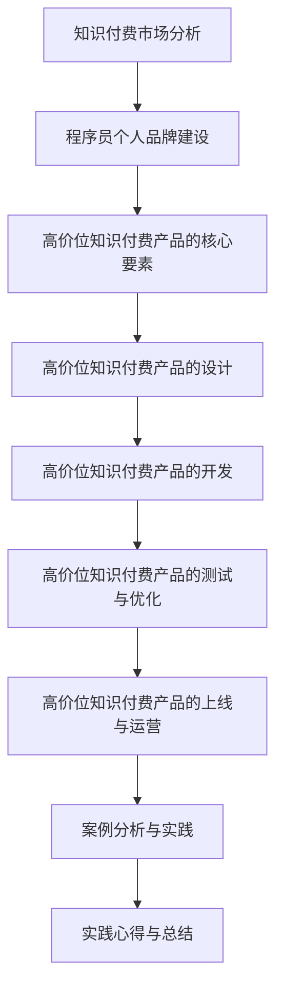
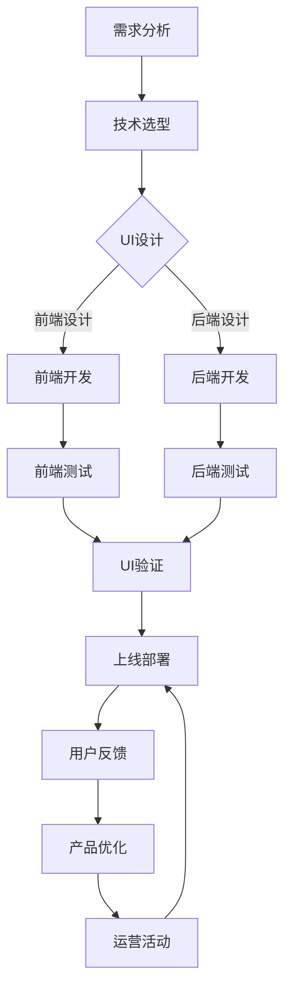

                 

# 《如何打造高价位知识付费产品：程序员版》

> 关键词：知识付费、程序员、个人品牌、高价位产品、产品设计、开发与运营

> 摘要：本文将深入探讨如何打造高价位知识付费产品，从程序员的角度出发，分析市场趋势、个人品牌建设、产品核心要素、产品开发与运营，并结合成功案例进行详细解析。通过本文，程序员可以了解到打造高价位知识付费产品的策略和实践，实现个人价值和商业价值的双赢。

## 《如何打造高价位知识付费产品：程序员版》目录大纲

### 第一部分：高价位知识付费产品概述

#### 第1章：知识付费市场分析

- 1.1 知识付费的定义与特点
- 1.2 知识付费市场的现状与趋势
- 1.3 程序员在知识付费市场中的机遇

#### 第2章：程序员个人品牌建设

- 2.1 程序员个人品牌的重要性
- 2.2 个人品牌的定位与塑造
- 2.3 个人品牌的传播与维护

#### 第3章：高价位知识付费产品的核心要素

- 3.1 产品的独特价值
- 3.2 产品的定价策略
- 3.3 产品的营销策略

### 第二部分：高价位知识付费产品的开发与运营

#### 第4章：高价位知识付费产品的设计

- 4.1 产品需求分析
- 4.2 产品功能规划
- 4.3 产品界面设计

#### 第5章：高价位知识付费产品的开发

- 5.1 技术栈选择与工具使用
- 5.2 代码规范与版本控制
- 5.3 开发流程与团队协作

#### 第6章：高价位知识付费产品的测试与优化

- 6.1 测试策略与测试用例设计
- 6.2 测试执行与问题定位
- 6.3 产品优化与性能调优

#### 第7章：高价位知识付费产品的上线与运营

- 7.1 上线前的准备工作
- 7.2 上线后的用户反馈收集
- 7.3 运营策略与活动策划

### 第三部分：案例分析与实践

#### 第8章：成功案例解析

- 8.1 案例一：某程序员高价位知识付费产品实践
- 8.2 案例二：某高价位知识付费产品的运营策略

#### 第9章：实践心得与总结

- 9.1 个人品牌建设心得
- 9.2 高价位知识付费产品开发与运营的挑战与应对
- 9.3 成功打造的秘诀与启示

### 附录

#### 附录 A：资源与工具推荐

- 代码托管平台推荐
- 开发工具推荐
- 知识付费平台推荐

#### 附录 B：参考资料

- 相关书籍推荐
- 学术论文推荐
- 知识付费行业报告

### Mermaid 流程图



### 伪代码

```plaintext
// 伪代码：高价位知识付费产品的核心要素分析
function analyze_product_core_elements(product) {
    unique_value = determine_unique_value(product);
    pricing_strategy = develop_pricing_strategy(unique_value);
    marketing_strategy = develop_marketing_strategy(unique_value, pricing_strategy);

    return {
        unique_value: unique_value,
        pricing_strategy: pricing_strategy,
        marketing_strategy: marketing_strategy
    };
}
```

### 数学模型和数学公式

$$
P = P_0 + \alpha \cdot (C - C_0) + \beta \cdot (S - S_0)
$$
$$
\alpha = \frac{1}{2} \cdot (\sigma^2 + \mu^2)
$$
$$
\beta = \frac{1}{2} \cdot (\rho \cdot \sigma \cdot \mu)
$$
其中：
P：最终定价
P_0：基础定价
C：成本
C_0：基础成本
S：市场需求
S_0：基础市场需求
\alpha：成本敏感性系数
\beta：需求敏感性系数
\sigma：成本标准差
\rho：市场需求相关性系数
\mu：市场需求平均值

### 项目实战

```plaintext
// 项目实战：搭建知识付费产品开发环境
1. 安装Node.js与npm
2. 安装Visual Studio Code
3. 安装Git
4. 配置GitHub账号
5. 创建项目仓库
6. 使用npm初始化项目
7. 安装项目依赖
8. 配置代码规范
9. 搭建开发环境

// 代码解读与分析：项目初始化代码

npm init

- 初始化项目配置文件package.json
- 配置项目名称、版本、描述、关键字等基本信息
- 配置项目开发、测试和生产的依赖包
```

接下来，我们将详细探讨每一个章节的内容。让我们一步一步地深入分析，以帮助程序员更好地打造高价位知识付费产品。让我们开始吧！<|assistant|>## 第1章：知识付费市场分析

知识付费，是指消费者为了获得特定的知识、技能或信息，愿意支付相应费用的一种商业模式。随着互联网和移动设备的发展，知识付费市场逐渐兴起，并呈现出快速发展的趋势。程序员作为知识付费市场的重要参与者，如何抓住机遇，打造高价位知识付费产品，成为了一个值得探讨的话题。

### 1.1 知识付费的定义与特点

知识付费的核心在于“付费”和“知识”这两个关键词。首先，付费意味着消费者需要为获取知识支付费用，这种支付可以是直接的金钱交易，也可以是通过其他方式（如兑换积分、会员权益等）进行的。其次，知识付费强调的是知识的价值，这种价值可以是实用性、指导性，也可以是文化性、艺术性。

知识付费具有以下几个特点：

1. **专业性**：知识付费产品通常具有较高的专业性，涉及特定领域的知识、技能或经验。

2. **个性化**：知识付费产品可以针对不同的用户群体，提供个性化的内容和解决方案。

3. **即时性**：知识付费产品往往能够即时满足用户的需求，提供实时解答、在线课程等。

4. **可传播性**：知识付费产品可以通过网络传播，触达全球的用户。

### 1.2 知识付费市场的现状与趋势

知识付费市场目前正处于快速发展阶段，主要表现在以下几个方面：

1. **市场规模扩大**：随着消费者对于知识和技能的需求增加，知识付费市场规模不断扩大。据统计，全球知识付费市场规模已经超过数百亿美元，并且还在持续增长。

2. **用户群体多样化**：知识付费用户不再局限于特定的人群，而是涵盖了各个年龄段、职业背景和社会地位的人。

3. **产品形态多样化**：知识付费产品不再局限于传统的书籍、课程等形式，还出现了直播、短视频、问答等多种形态。

4. **内容质量要求提高**：用户对于知识付费产品的质量要求越来越高，内容的专业性、实用性、互动性等方面成为关键因素。

### 1.3 程序员在知识付费市场中的机遇

程序员作为知识付费市场的重要参与者，拥有以下机遇：

1. **专业知识优势**：程序员具备深厚的编程知识和经验，可以提供高质量的技术知识分享。

2. **技术创新能力**：程序员不断创新，可以开发出新颖的知识付费产品，满足市场的需求。

3. **个人品牌建设**：通过打造个人品牌，程序员可以提升自身的市场价值，吸引更多的用户。

4. **商业机会**：程序员可以通过知识付费实现商业变现，创造更多的商业机会。

总之，知识付费市场为程序员提供了广阔的发展空间。抓住市场机遇，打造高价位知识付费产品，不仅可以提升个人价值，还可以实现商业成功。接下来，我们将探讨如何进行程序员个人品牌建设，为打造高价位知识付费产品奠定基础。|assistant|>### 1.3 程序员在知识付费市场中的机遇

#### 1.3.1 专业知识优势

程序员在知识付费市场中的核心竞争力在于其深厚的编程知识和经验。随着技术的不断进步和互联网的普及，程序员所掌握的编程技能和解决方案越来越受到企业和个人的关注。以下是一些具体的优势：

- **技术深度**：程序员具备深入理解各种编程语言、框架和工具的能力，能够提供专业级的技术指导。
- **实战经验**：程序员在工作中积累了大量的实战经验，这些经验可以转化为知识付费产品，为用户解决实际问题。
- **创新能力**：程序员具备较强的创新能力，能够开发出新颖的技术解决方案，为用户带来独特的价值。

#### 1.3.2 技术创新能力

技术创新是程序员在知识付费市场中的一大优势。随着技术的快速发展，程序员需要不断学习新知识、掌握新技术，这些能力不仅能够提升自身的竞争力，还可以转化为知识付费产品的创新点。以下是一些具体的表现：

- **前沿技术分享**：程序员可以分享最新的技术趋势、技术框架和工具，帮助用户了解和掌握前沿技术。
- **解决方案开发**：程序员可以将工作中的实践经验转化为解决方案，提供详细的操作步骤和代码实现。
- **技术课程开发**：程序员可以开发技术课程，从入门到高级，逐步引导用户掌握编程技能。

#### 1.3.3 个人品牌建设

个人品牌建设是程序员在知识付费市场中提升自身价值的重要途径。一个强大的个人品牌可以吸引更多的关注和信任，从而带来更多的商业机会。以下是一些个人品牌建设的方法：

- **专业博客**：通过撰写技术博客，分享自己的知识和经验，树立专业形象。
- **技术演讲**：参加技术会议和研讨会，进行技术演讲，展示自己的专业能力。
- **开源项目**：参与开源项目，贡献代码和解决方案，提升影响力。
- **社交媒体**：利用社交媒体平台，分享自己的观点和经验，扩大影响力。

#### 1.3.4 商业机会

知识付费为程序员提供了多种商业机会。通过以下方式，程序员可以实现商业变现：

- **在线课程**：开发并销售在线编程课程，通过直播、录播等多种形式，传授编程技能。
- **技术咨询**：提供编程技术咨询和解决方案，帮助企业解决技术难题。
- **书籍出版**：撰写并出版技术书籍，通过书籍的销售获取收入。
- **知识付费平台**：在知识付费平台上开设专栏，分享自己的知识和经验，获取平台分成。

#### 1.3.5 成功案例

以下是一些程序员在知识付费市场中的成功案例：

- **案例一**：某程序员通过撰写技术博客，积累了大量粉丝，成功转型为独立咨询师，为企业提供编程咨询服务。
- **案例二**：某程序员开发了一款编程学习工具，通过在线销售，获得了数百万的收入。
- **案例三**：某程序员通过开源项目，吸引了众多开发者关注，成功转型为技术讲师，开设了多场线上课程。

通过以上案例可以看出，程序员在知识付费市场中有着广阔的发展空间。抓住市场机遇，打造个人品牌，开发优质的知识付费产品，程序员可以实现个人价值和商业价值的双赢。在接下来的章节中，我们将深入探讨如何进行个人品牌建设，为程序员在知识付费市场中取得成功奠定基础。|assistant|>## 第2章：程序员个人品牌建设

在知识付费市场中，个人品牌建设对于程序员的职业发展至关重要。一个强大的个人品牌不仅可以提升自身的市场价值，还能带来更多的商业机会。本章将详细介绍如何进行程序员个人品牌建设，包括个人品牌的定位与塑造、传播与维护等方面。

### 2.1 程序员个人品牌的重要性

程序员个人品牌的重要性体现在以下几个方面：

1. **提升市场竞争力**：一个强大的个人品牌可以吸引更多的关注和信任，从而提升程序员的竞争力。

2. **增加商业机会**：个人品牌可以吸引企业客户，为企业提供编程服务、技术咨询等，从而增加商业机会。

3. **扩大影响力**：个人品牌的影响力可以超越个人能力，影响更多的开发者，提升行业地位。

4. **提高收入水平**：个人品牌的建设可以带动在线课程、书籍出版等收入来源，提高程序员的收入水平。

### 2.2 个人品牌的定位与塑造

个人品牌的定位与塑造是个人品牌建设的第一步，以下是一些建议：

1. **明确目标受众**：确定个人品牌的目标受众，了解他们的需求和痛点，从而提供有针对性的内容和价值。

2. **确定专业方向**：根据自己的兴趣和专长，确定个人品牌的专业方向，如前端开发、后端开发、人工智能等。

3. **打造独特形象**：通过独特的形象设计、个人标签、专业语言等，打造个人品牌的专业形象。

4. **撰写高质量的博客**：定期撰写技术博客，分享自己的知识和经验，展示专业能力。博客内容应具有深度、实用性，并能解决实际问题。

5. **参与开源项目**：参与开源项目，贡献代码和解决方案，提升个人品牌的认可度。

6. **开设在线课程**：针对特定领域，开设在线课程，传授编程技能和经验。

7. **参与技术社区**：积极参与技术社区，如GitHub、Stack Overflow、Reddit等，与同行交流、分享经验。

### 2.3 个人品牌的传播与维护

个人品牌的传播与维护是个人品牌建设的持续过程，以下是一些建议：

1. **社交媒体推广**：利用社交媒体平台（如微博、知乎、微信公众号等）进行个人品牌推广，发布技术博客、课程信息等。

2. **网络直播**：通过网络直播（如斗鱼、虎牙、Bilibili等）进行技术分享、在线授课，扩大影响力。

3. **线下活动**：参加技术会议、研讨会、讲座等活动，与同行交流，提升个人知名度。

4. **合作伙伴**：与相关企业、机构建立合作关系，共同推广个人品牌。

5. **持续学习与进步**：不断学习新知识、掌握新技术，提升个人能力，保持品牌活力。

6. **反馈与改进**：关注用户反馈，根据用户需求调整内容和策略，持续优化个人品牌。

### 2.4 建立个人品牌的关键要素

建立个人品牌的关键要素包括以下几个方面：

1. **专业性**：确保个人品牌在专业领域具有权威性和影响力。

2. **独特性**：个人品牌应具有独特的形象和特点，区别于其他品牌。

3. **可信赖性**：建立可信赖的形象，让用户信任个人品牌提供的内容和价值。

4. **持续更新**：定期发布新的内容，保持个人品牌的活力。

5. **互动性**：与用户保持互动，了解用户需求，优化个人品牌。

通过以上方法，程序员可以逐步建立自己的个人品牌，提升在知识付费市场中的竞争力。在接下来的章节中，我们将深入探讨高价位知识付费产品的核心要素，为打造成功的产品奠定基础。|assistant|>### 2.4 建立个人品牌的关键要素

#### 2.4.1 专业性

专业性是建立个人品牌的核心要素之一。程序员在建立个人品牌时，必须确保自己在所擅长的技术领域具备深厚的专业知识和丰富的实战经验。以下是一些提升专业性的方法：

1. **持续学习**：技术领域不断更新迭代，程序员需要保持学习的热情，持续关注最新的技术趋势和行业发展动态。

2. **实战经验**：通过实际项目经验，积累解决问题的能力，提升技术水平和专业素养。

3. **分享经验**：通过撰写技术博客、发表技术文章、参与开源项目等方式，将所学知识和经验分享给他人，提升自己的专业影响力。

4. **参加技术会议**：积极参加技术会议和研讨会，与业界专家交流，拓宽视野，提升专业水平。

5. **获得认证**：通过获得相关技术认证（如Oracle Certified Professional、Microsoft Certified Solutions Developer等），证明自己的专业能力。

#### 2.4.2 独特性

独特性是个人品牌的重要特质，有助于在众多竞争者中脱颖而出。以下是一些打造独特个人品牌的方法：

1. **定位清晰**：明确个人品牌的定位，聚焦于某一特定领域，形成专业特色。

2. **个人风格**：形成独特的个人风格，如技术博客的写作风格、演讲的台风等，让用户记住个人品牌。

3. **技术特长**：挖掘自己在技术领域的特长，如擅长某一种编程语言、熟悉某一技术框架等，突出个人优势。

4. **创新思维**：在技术领域不断创新，开发新颖的技术解决方案，展示自己的创新思维。

5. **故事化表达**：通过讲述个人成长故事、项目经历等，让用户了解个人的独特魅力。

#### 2.4.3 可信赖性

可信赖性是建立个人品牌的关键，关系到用户对个人品牌的信任和忠诚度。以下是一些提升可信赖性的方法：

1. **内容质量**：确保分享的内容具有高质量，准确、实用，能够解决用户的问题。

2. **诚信为本**：在个人品牌建设中，始终保持诚信，不夸大、不虚假宣传。

3. **积极互动**：与用户保持良好的互动，积极回答用户的问题，展示自己的专业素养。

4. **用户反馈**：关注用户反馈，认真对待用户的建议和意见，持续优化个人品牌。

5. **建立合作**：与同行建立合作关系，共同推广个人品牌，提升可信度。

#### 2.4.4 持续更新

持续更新是保持个人品牌活力的重要手段。以下是一些持续更新的方法：

1. **定期发布**：设定定期发布内容的时间表，如每周发布一篇技术博客，保持品牌活跃度。

2. **内容多样性**：丰富内容形式，如博客、视频、音频等，满足不同用户的需求。

3. **持续学习**：不断学习新知识、掌握新技术，更新个人知识体系，保持竞争力。

4. **技术趋势**：关注技术趋势，及时更新个人品牌的内容，与行业保持同步。

5. **用户反馈**：根据用户反馈，调整内容策略，优化个人品牌。

通过以上方法，程序员可以逐步建立自己的个人品牌，提升在知识付费市场中的竞争力。在接下来的章节中，我们将深入探讨高价位知识付费产品的核心要素，为打造成功的产品奠定基础。|assistant|>### 2.5 个人品牌建设案例分析

在知识付费市场中，有许多成功的个人品牌案例，这些案例为程序员提供了宝贵的经验。以下，我们通过两个具体的案例，来分析个人品牌建设的方法和策略。

#### 2.5.1 案例一：某前端开发专家

**个人背景**：某前端开发专家，曾在多家知名互联网公司工作，积累了丰富的实战经验。他擅长React、Vue等前端框架，并在GitHub上贡献了多个开源项目。

**品牌建设策略**：

1. **专业博客**：该专家定期在个人博客上分享前端开发的经验和技巧，内容涵盖React、Vue等框架的深入解读，以及实际开发中的问题解决。

2. **技术分享**：他在多个技术社区（如Stack Overflow、掘金等）上活跃，回答用户问题，展示自己的专业能力。

3. **在线课程**：该专家在知识付费平台上开设了多门前端开发课程，从基础到高级，逐步引导学员掌握前端技能。

4. **社交媒体**：他利用微博、知乎等社交媒体平台，发布技术文章、课程信息，扩大个人品牌的影响力。

5. **线下活动**：他积极参加前端技术大会、研讨会等，进行技术分享，与同行交流，提升个人知名度。

**效果与收获**：

通过一系列的品牌建设策略，该专家在知识付费市场建立了强大的个人品牌，吸引了大量学员和粉丝。他的在线课程销售成绩显著，成为知识付费平台上的热门课程。此外，他还受邀成为多个企业的技术顾问，为企业提供前端开发解决方案。

#### 2.5.2 案例二：某人工智能专家

**个人背景**：某人工智能专家，曾在顶级科研机构工作，参与过多个人工智能项目。他对机器学习、深度学习等有深入的研究，并在学术期刊上发表了多篇论文。

**品牌建设策略**：

1. **专业博客**：该专家在个人博客上分享人工智能领域的最新研究进展、技术解析和应用案例，内容具有深度和实用性。

2. **技术分享**：他在多个技术社区（如GitHub、知乎等）上活跃，回答用户问题，展示自己的专业能力。

3. **在线课程**：该专家在知识付费平台上开设了多门人工智能课程，从基础到高级，逐步引导学员掌握人工智能知识。

4. **社交媒体**：他利用微博、微信公众号等社交媒体平台，发布技术文章、课程信息，扩大个人品牌的影响力。

5. **线下活动**：他积极参加人工智能领域的研讨会、讲座等，进行技术分享，与同行交流，提升个人知名度。

**效果与收获**：

通过一系列的品牌建设策略，该专家在人工智能领域建立了强大的个人品牌，吸引了大量学员和粉丝。他的在线课程销售成绩显著，成为知识付费平台上的热门课程。此外，他还受邀成为多家企业的技术顾问，为企业提供人工智能解决方案。

#### 总结

以上两个案例展示了程序员在知识付费市场中建立个人品牌的成功经验。通过专业博客、技术分享、在线课程、社交媒体和线下活动等多种途径，程序员可以逐步建立自己的个人品牌，提升在知识付费市场中的竞争力。在接下来的章节中，我们将深入探讨高价位知识付费产品的核心要素，为打造成功的产品奠定基础。|assistant|>### 2.6 个人品牌建设中的常见挑战与应对策略

在个人品牌建设过程中，程序员可能会面临一系列挑战。以下，我们将列举一些常见的挑战，并提出相应的应对策略。

#### 2.6.1 竞争激烈

知识付费市场中的竞争日益激烈，如何在众多从业者中脱颖而出，是程序员需要面对的挑战。

**应对策略**：

1. **专业化**：专注于某一特定领域，成为该领域的专家。专业化的品牌更容易在市场中脱颖而出。

2. **差异化**：挖掘自己的独特优势，形成差异化品牌。可以通过技术特长、创新思维等方式，打造独特的个人品牌。

3. **持续学习**：保持学习的热情，不断更新自己的知识和技能，提升个人竞争力。

#### 2.6.2 内容质量要求高

知识付费产品要求具有高质量的内容，程序员需要确保自己分享的内容具有深度、实用性和准确性。

**应对策略**：

1. **深入分析**：在撰写技术博客、课程内容时，进行深入分析，确保内容具有深度和实用性。

2. **多渠道验证**：通过多个渠道验证内容的准确性，如查阅权威资料、与同行交流等。

3. **持续改进**：根据用户反馈，不断改进内容，提升内容质量。

#### 2.6.3 时间管理困难

个人品牌建设需要投入大量的时间和精力，程序员需要平衡个人品牌建设与日常工作。

**应对策略**：

1. **合理安排时间**：制定详细的时间规划，合理安排个人品牌建设的时间和任务。

2. **分工合作**：将部分任务委托给团队成员或合作伙伴，降低个人时间压力。

3. **自动化工具**：利用自动化工具（如博客平台、社交媒体管理工具等），提高工作效率。

#### 2.6.4 品牌传播困难

品牌传播是个人品牌建设的关键环节，程序员需要找到有效的传播途径，提高品牌知名度。

**应对策略**：

1. **多平台传播**：利用多个社交媒体平台、博客、知识付费平台等，扩大品牌传播范围。

2. **内容营销**：通过高质量的内容，吸引更多用户关注，提高品牌影响力。

3. **合作推广**：与其他品牌或企业进行合作推广，借助合作伙伴的力量，提高品牌知名度。

通过以上策略，程序员可以克服个人品牌建设中的挑战，不断提升个人品牌的价值，为打造高价位知识付费产品奠定基础。在接下来的章节中，我们将深入探讨高价位知识付费产品的核心要素，为成功打造高价位知识付费产品提供指导。|assistant|>### 第3章：高价位知识付费产品的核心要素

在打造高价位知识付费产品时，程序员需要深入分析产品的核心要素，以确保产品具有独特的价值、合理的定价策略和有效的营销策略。本章将详细介绍这三个核心要素，帮助程序员打造出具有市场竞争力的知识付费产品。

#### 3.1 产品的独特价值

独特价值是高价位知识付费产品的核心竞争力。程序员需要分析目标用户的需求，挖掘产品的独特卖点，从而为用户创造真正的价值。

**1. 确定目标用户群体**：首先，程序员需要明确目标用户群体，了解他们的需求、痛点和期望。可以通过市场调研、用户访谈等方式收集信息。

**2. 分析竞争对手**：了解竞争对手的产品特点、优势与不足，找到自身的差异化点。可以通过分析竞争对手的网站、博客、社交媒体账号等获取信息。

**3. 挖掘独特卖点**：根据目标用户的需求和竞争对手的分析结果，挖掘产品的独特卖点。独特卖点可以是创新的技术、高效的解决方案、个性化的服务体验等。

**4. 设计特色功能**：围绕独特卖点，设计特色功能，以突出产品的独特性。例如，可以开发新颖的教学工具、提供定制化的咨询服务等。

**5. 优化用户体验**：确保产品在用户体验方面具有优势，如简洁易用的界面、快速响应的服务、详细的教程等。

#### 3.2 产品的定价策略

合理的定价策略是确保高价位知识付费产品能够成功推向市场的重要因素。程序员需要综合考虑产品的独特价值、市场需求、竞争对手的定价策略等因素，制定出具有竞争力的定价策略。

**1. 制定基础定价**：基础定价应根据产品的独特价值、成本和市场需求等因素综合考虑。可以通过以下公式进行初步定价：

\[ P_0 = C + \alpha \cdot V + \beta \cdot M \]

其中，\( P_0 \) 为基础定价，\( C \) 为成本，\( V \) 为产品独特价值，\( M \) 为市场需求。

**2. 调整定价策略**：根据市场反馈和用户需求，不断调整定价策略。可以通过以下方法进行调整：

- **定价分层**：针对不同用户群体，设置不同的定价策略，如入门级、高级版等。
- **动态定价**：根据市场需求和竞争情况，动态调整价格，如节假日折扣、限时优惠等。
- **增值服务**：提供增值服务，如会员权益、一对一咨询等，为用户提供更高价值的产品。

**3. 定价策略优化**：通过用户反馈和市场数据分析，不断优化定价策略。例如，可以通过A/B测试，比较不同定价策略的效果，找到最佳定价方案。

#### 3.3 产品的营销策略

有效的营销策略是确保高价位知识付费产品成功推向市场的重要手段。程序员需要结合产品特点、目标用户和市场环境，制定出具有吸引力的营销策略。

**1. 确定营销目标**：明确营销目标，如提高品牌知名度、增加用户数量、提升用户满意度等。

**2. 设计营销渠道**：根据目标用户的特点，选择合适的营销渠道。例如，可以通过以下渠道进行推广：

- **社交媒体**：利用微博、知乎、微信公众号等平台，发布产品信息、技术博客等。
- **知识付费平台**：在知识付费平台上开设专栏、课程，吸引潜在用户。
- **线下活动**：参加技术会议、讲座、研讨会等，与目标用户面对面交流，推广产品。

**3. 创造内容**：通过高质量的内容，吸引目标用户关注。内容形式可以包括技术博客、案例解析、教程视频等。

**4. 营销推广**：开展各种营销活动，提高产品的知名度和用户参与度。例如，可以通过以下活动进行推广：

- **优惠活动**：设置优惠活动，如限时折扣、团购优惠等，吸引用户购买。
- **合作伙伴**：与相关企业、机构合作，共同推广产品。
- **口碑营销**：利用用户口碑，提高产品的美誉度和影响力。

通过以上策略，程序员可以打造出具有独特价值、合理定价策略和有效营销策略的高价位知识付费产品，为在知识付费市场中脱颖而出奠定基础。在接下来的章节中，我们将深入探讨高价位知识付费产品的设计、开发与运营，帮助程序员实现产品的成功。|assistant|>### 3.2 产品的定价策略

#### 3.2.1 确定基础定价

产品的定价策略是打造高价位知识付费产品的关键。首先，我们需要确定产品的基础定价。基础定价应该综合考虑以下因素：

1. **成本**：包括开发成本、运营成本、维护成本等。程序员需要准确计算这些成本，确保基础定价能够覆盖成本。

2. **产品价值**：产品的独特价值是决定定价的重要因素。产品为用户提供的价值越高，定价可以越高。程序员可以通过市场调研、用户访谈等方式，了解用户对产品的期望价值。

3. **市场需求**：市场需求也是影响定价的重要因素。如果市场需求较高，可以适当提高定价；反之，则可以降低定价。

4. **竞争对手**：了解竞争对手的定价策略，可以为我们提供参考。如果竞争对手的定价较高，我们可以适当提高定价；如果竞争对手的定价较低，我们需要考虑如何提供更高的价值来吸引用户。

根据以上因素，我们可以使用以下公式确定基础定价：

\[ P_0 = C + \alpha \cdot V + \beta \cdot M \]

其中：
- \( P_0 \) 是基础定价；
- \( C \) 是成本；
- \( \alpha \cdot V \) 是产品价值的系数，表示产品价值对定价的影响；
- \( \beta \cdot M \) 是市场需求的系数，表示市场需求对定价的影响。

#### 3.2.2 调整定价策略

基础定价只是产品的起点，我们还需要根据市场反馈和用户需求，不断调整定价策略。

1. **定价分层**：根据用户的需求和购买力，设置不同的定价层次。例如，可以设置入门级、高级版、专业版等不同定价层次，满足不同用户的需求。

2. **动态定价**：根据市场需求的变化，动态调整定价。例如，在节假日、促销活动期间，可以适当降低定价，刺激用户购买。

3. **增值服务**：提供增值服务，如一对一咨询、会员权益等，为用户提供更高价值的产品。这些增值服务可以作为定价的一部分，提高整体定价。

4. **定价调整策略**：根据用户反馈和市场数据分析，不断优化定价策略。例如，可以通过A/B测试，比较不同定价策略的效果，找到最佳定价方案。

#### 3.2.3 实际案例

以某编程学习平台为例，我们可以看到以下定价策略：

1. **基础定价**：基础定价为199元/月，包括基础课程和学习资源。

2. **定价分层**：入门级定价为99元/月，包括基础课程；高级版定价为299元/月，包括高级课程和学习资源；专业版定价为499元/月，包括所有课程、学习资源以及一对一咨询。

3. **动态定价**：在节假日和促销活动期间，将价格降低到79元/月。

4. **增值服务**：提供会员权益，如全年无限次参加线上讲座、优先获得一对一咨询等，会员价格为899元/年。

通过以上定价策略，该编程学习平台成功吸引了大量用户，实现了商业变现。在接下来的章节中，我们将探讨高价位知识付费产品的设计、开发与运营，帮助程序员实现产品的成功。|assistant|>### 3.3 产品的营销策略

高价位知识付费产品的成功不仅仅依赖于产品的独特价值和合理的定价策略，还需要有效的营销策略来吸引目标用户，提升品牌知名度，并促进销售。以下是构建高效营销策略的几个关键步骤：

#### 3.3.1 确定目标用户群体

首先，程序员需要明确产品的目标用户群体。这包括分析用户的需求、行为、兴趣和痛点，以便定制合适的营销策略。以下是一些分析用户的方法：

1. **市场调研**：通过问卷调查、访谈、焦点小组等方式，收集用户反馈，了解他们的需求和期望。

2. **用户画像**：创建用户画像，包括用户的年龄、性别、职业、教育背景、技术水平等，以便更精准地定位目标用户。

3. **数据分析**：利用现有的用户数据，分析用户的购买行为、活跃度、留存率等指标，了解哪些用户群体对产品更感兴趣。

#### 3.3.2 选择合适的营销渠道

选择适合产品的营销渠道是成功推广的关键。以下是一些常用的营销渠道：

1. **社交媒体**：利用微博、知乎、微信公众号、LinkedIn等平台，发布有价值的内容，与用户互动，建立品牌影响力。

2. **知识付费平台**：在如网易云课堂、慕课网、极客时间等知识付费平台上发布课程，利用平台流量吸引潜在用户。

3. **专业论坛和社区**：在Stack Overflow、GitHub、Reddit等技术社区中活跃，回答用户问题，展示专业能力，吸引目标用户。

4. **内容营销**：通过博客、技术文章、教程视频等高质量内容，提供免费的价值，吸引目标用户关注。

5. **线下活动**：参加技术会议、研讨会、培训等活动，进行现场演示和分享，扩大品牌知名度。

#### 3.3.3 制定内容营销策略

内容营销是吸引和留住目标用户的重要手段。以下是一些建议：

1. **制定内容计划**：根据目标用户的需求和兴趣，制定内容发布计划，确保内容的连续性和高质量。

2. **多样化内容形式**：结合文字、图片、视频、直播等多种形式，提供多样化的内容，满足不同用户的喜好。

3. **互动性内容**：通过问答、调查、竞赛等形式，增加用户参与度，收集用户反馈，优化产品和服务。

4. **分享有价值的信息**：分享技术趋势、案例分析、最佳实践等有价值的信息，展示专业能力，提升品牌形象。

#### 3.3.4 利用数据分析和优化

数据分析和优化是营销策略成功的关键。以下是一些关键步骤：

1. **设置关键指标**：确定营销活动的关键指标（如访问量、转化率、销售额等），以便评估营销效果。

2. **跟踪分析**：利用Google Analytics、百度统计等工具，跟踪用户行为和营销效果，了解哪些策略最有效。

3. **A/B测试**：通过A/B测试，比较不同营销策略的效果，找到最佳方案。

4. **持续优化**：根据数据分析结果，不断调整和优化营销策略，提升营销效果。

#### 3.3.5 成功案例

以下是一个成功案例：

**案例：某人工智能课程**

- **目标用户**：该课程的目标用户是具有一定编程基础的程序员，对人工智能感兴趣，希望提升自己的技术能力。

- **营销策略**：
  - **社交媒体**：在微信公众号、知乎等平台发布人工智能相关文章，吸引目标用户关注。
  - **知识付费平台**：在网易云课堂等知识付费平台上发布课程，利用平台流量推广。
  - **专业论坛**：在GitHub、Reddit等技术社区中分享人工智能项目代码和经验，展示专业能力。
  - **内容营销**：发布高质量的技术博客、教程视频，分享人工智能技术的最新动态和案例分析。
  - **线下活动**：参加人工智能领域的研讨会，与同行交流，推广课程。

- **效果**：通过一系列的营销策略，该课程成功吸引了大量目标用户，销售额稳步提升。

通过以上案例可以看出，有效的营销策略对于高价位知识付费产品的成功至关重要。在接下来的章节中，我们将深入探讨高价位知识付费产品的设计与开发，帮助程序员打造出具有市场竞争力的产品。|assistant|>### 第4章：高价位知识付费产品的设计

高价位知识付费产品的设计是产品成功的关键环节，它决定了产品的用户体验、功能完备性和市场竞争力。本章将详细介绍高价位知识付费产品的设计流程，包括产品需求分析、功能规划和界面设计等方面，帮助程序员打造出高品质的产品。

#### 4.1 产品需求分析

产品需求分析是产品设计的起点，它明确了产品的目标和功能，为后续的设计和开发奠定了基础。以下是一些关键步骤：

1. **明确产品目标**：首先，需要明确产品的总体目标，例如提升用户技能、解决特定问题或提供创新解决方案。

2. **收集用户需求**：通过市场调研、用户访谈、问卷调查等方式，收集目标用户的需求和痛点。了解用户希望从产品中获得哪些价值。

3. **分析竞争对手**：研究竞争对手的产品，分析其优势和不足，找出差异化的设计点。

4. **制定产品功能**：根据用户需求和分析结果，制定产品的主要功能和附加功能。确保产品功能能够满足用户的需求。

5. **优先级排序**：对产品功能进行优先级排序，确定哪些功能是核心的，哪些是辅助的，以便在设计和开发过程中合理分配资源。

#### 4.2 功能规划

功能规划是产品设计的核心环节，它决定了产品的用户体验和功能完备性。以下是一些关键步骤：

1. **用户故事**：编写用户故事，描述用户在产品中的使用场景和期望结果。用户故事有助于设计师更好地理解用户需求。

2. **信息架构**：设计产品的信息架构，包括导航结构、页面布局和内容组织等。良好的信息架构有助于提升用户体验。

3. **功能模块化**：将产品功能模块化，明确每个模块的作用和功能，以便于后续开发和测试。

4. **原型设计**：创建产品的原型设计，包括线框图、原型图等，以便于设计师和开发人员共同评审和修改。

5. **迭代优化**：根据用户反馈和市场需求，不断迭代和优化功能，确保产品功能的完备性和用户体验。

#### 4.3 界面设计

界面设计是产品设计的视觉呈现，它直接影响用户的第一印象和产品体验。以下是一些关键步骤：

1. **设计风格**：确定产品的设计风格，包括色彩、字体、图标等，以体现产品的专业性和个性化。

2. **用户界面**：设计用户界面，包括按钮、输入框、菜单等元素，确保用户界面的直观性和易用性。

3. **交互设计**：设计产品的交互流程和交互元素，确保用户能够轻松、高效地完成操作。

4. **视觉效果**：运用色彩、图像、动画等元素，提升产品的视觉效果和用户体验。

5. **响应式设计**：确保产品界面在不同设备和分辨率下都能良好显示，提供一致的体验。

通过以上步骤，程序员可以系统地设计出高价位知识付费产品，为产品的成功奠定基础。在接下来的章节中，我们将深入探讨高价位知识付费产品的开发，包括技术栈选择、代码规范和团队协作等方面。|assistant|>### 4.1 产品需求分析

#### 4.1.1 明确产品目标

产品需求分析的第一步是明确产品的目标。这个目标应该具体、可衡量，并能够指导后续的设计和开发工作。对于高价位知识付费产品，明确的产品目标尤为重要，因为它直接关系到产品的市场定位和用户价值。

**步骤：**

1. **确定总体目标**：例如，提升用户的技术能力、提供创新的解决方案、满足特定领域的专业需求等。

2. **分解目标**：将总体目标分解为具体的、可衡量的子目标。例如，如果目标是提升用户的技术能力，可以进一步分解为“掌握某项新技术”、“解决工作中的具体问题”等。

3. **制定衡量标准**：为每个子目标制定具体的衡量标准，例如通过测试、项目完成度、用户反馈等来评估目标的达成情况。

**示例：**

以一个“高级前端开发课程”为例，产品目标可以设定为：

- 总体目标：提升用户的前端开发能力，使其能够独立完成复杂的前端开发项目。
- 子目标：
  - 掌握React和Vue.js等主流前端框架。
  - 能够设计和实现响应式网页。
  - 解决实际工作中遇到的前端性能问题。
- 衡量标准：
  - 学员完成课程后的项目提交和评审。
  - 在线测试成绩。
  - 学员在工作中的实际应用和反馈。

#### 4.1.2 收集用户需求

收集用户需求是产品需求分析的核心步骤，它决定了产品设计的合理性和用户的满意度。以下是几种常见的收集用户需求的方法：

**1. 用户访谈**

- **步骤：**
  - 确定访谈对象：选择具有代表性的用户，如目标用户、行业专家等。
  - 设计访谈问题：围绕产品目标，设计开放式和封闭式问题，引导用户表达真实的需求和痛点。
  - 进行访谈：面对面或在线进行访谈，确保用户能够充分表达自己的观点。
  - 整理访谈结果：记录访谈内容，整理用户的需求和痛点。

- **示例：**

访谈某公司的前端开发团队，收集到以下需求：

- 需要更高效的学习路径，以便快速掌握新技能。
- 想要学习到实际工作中会遇到的问题的解决方案。
- 希望能够通过项目实战提升自己的能力。

**2. 问卷调查**

- **步骤：**
  - 设计问卷：根据产品目标和访谈结果，设计合适的问卷，包括选择题、填空题、评分题等。
  - 分发问卷：通过邮件、社交媒体、在线调查平台等方式，将问卷分发至目标用户。
  - 收集数据：收集问卷结果，整理用户需求。

- **示例：**

问卷调查结果显示，用户对以下内容感兴趣：

- React和Vue.js框架的应用和实践。
- 前端性能优化技巧。
- 响应式网页设计。

**3. 用户行为分析**

- **步骤：**
  - 收集用户行为数据：通过网站分析工具、学习平台等，收集用户的学习行为数据，如点击率、浏览时长、学习路径等。
  - 分析用户行为：根据行为数据，分析用户的需求和偏好。

- **示例：**

用户行为分析显示，用户在学习过程中最常访问的页面是课程目录和项目实战部分，这表明用户对课程内容和项目实战非常关注。

#### 4.1.3 分析竞争对手

了解竞争对手的产品特点、优势和不足，有助于找出差异化的设计点，提升产品的竞争力。以下是分析竞争对手的步骤：

**1. 竞品分析**

- **步骤：**
  - 确定竞争对手：选择直接竞争的产品或服务。
  - 分析竞品特点：研究竞品的界面设计、功能模块、用户评价等。
  - 比较优势和不足：对比竞品和自身产品的优势和不足。

- **示例：**

分析结果显示，竞品的优势在于提供了丰富的学习资源和详细的项目案例，但不足之处在于用户交互体验不够友好。

#### 4.1.4 制定产品功能

根据用户需求和竞品分析结果，制定产品的功能需求。以下是制定产品功能的方法：

**1. 功能清单**

- **步骤：**
  - 列出所有功能需求。
  - 对功能进行分类，如核心功能、辅助功能等。
  - 评估功能的优先级，确定哪些功能是必须的，哪些是可选的。

- **示例：**

产品功能清单：

- 核心功能：
  - 课程学习
  - 项目实战
  - 用户互动
- 辅助功能：
  - 课程推荐
  - 问答社区
  - 用户统计

通过以上步骤，程序员可以系统地完成产品需求分析，为后续的设计和开发提供明确的指导。在接下来的章节中，我们将深入探讨功能规划，帮助程序员设计出符合用户需求的高品质知识付费产品。|assistant|>### 4.2 功能规划

功能规划是高价位知识付费产品设计的关键环节，它决定了产品的用户体验和功能完备性。以下是一个详细的功能规划步骤，以帮助程序员设计出符合用户需求的高品质产品。

#### 4.2.1 用户故事编写

用户故事是一种描述用户如何与产品互动的简短文档。编写用户故事有助于设计师更好地理解用户需求和使用场景。以下是编写用户故事的步骤：

**1. 确定用户角色**

- **步骤：**
  - 创建用户角色，包括用户的基本信息（如年龄、职业、技术水平等）。

- **示例：**

用户角色：小明，30岁，前端开发工程师，有3年工作经验，希望提升React技术。

**2. 描述用户目标**

- **步骤：**
  - 描述用户希望通过使用产品实现的目标。

- **示例：**

用户目标：小明希望通过学习React课程，掌握React的基本用法，能够独立开发React应用。

**3. 编写用户故事**

- **步骤：**
  - 根据用户角色和目标，编写用户故事。

- **示例：**

用户故事：作为前端开发工程师，小明希望能够在2个月内掌握React的基本用法，以便在项目中独立开发React应用。

#### 4.2.2 信息架构设计

信息架构设计是产品功能规划的基础，它决定了产品的导航结构、页面布局和内容组织。以下是设计信息架构的步骤：

**1. 列出主要功能**

- **步骤：**
  - 根据用户故事，列出产品的主要功能。

- **示例：**

主要功能：
- 课程学习
- 项目实战
- 用户互动
- 课程推荐
- 问答社区

**2. 设计导航结构**

- **步骤：**
  - 根据主要功能，设计产品的导航结构。

- **示例：**

导航结构：
- 首页
- 课程学习
  - React课程
  - Vue.js课程
- 项目实战
  - React项目
  - Vue.js项目
- 用户互动
  - 问答社区
  - 学员交流
- 课程推荐
  - 热门课程
  - 新增课程

**3. 确定页面布局**

- **步骤：**
  - 根据导航结构，确定每个页面的布局。

- **示例：**

页面布局：
- 首页：课程推荐、热门项目、最新动态
- 课程学习：课程列表、课程详情、学习进度
- 项目实战：项目列表、项目详情、项目提交
- 用户互动：问答列表、问答详情、提问界面
- 课程推荐：课程列表、课程详情

#### 4.2.3 功能模块化

功能模块化是将产品功能划分为若干独立模块，每个模块负责特定的功能。以下是模块化的步骤：

**1. 列出功能模块**

- **步骤：**
  - 根据信息架构，列出产品的主要功能模块。

- **示例：**

功能模块：
- 课程管理模块
- 用户管理模块
- 项目管理模块
- 问答社区模块
- 数据分析模块

**2. 确定模块职责**

- **步骤：**
  - 为每个功能模块明确职责。

- **示例：**

模块职责：
- 课程管理模块：负责课程的添加、删除、修改、查询等操作。
- 用户管理模块：负责用户的注册、登录、信息修改、权限管理等操作。
- 项目管理模块：负责项目的创建、删除、修改、查询等操作。
- 问答社区模块：负责问答的发布、删除、修改、查询等操作。
- 数据分析模块：负责数据的收集、分析、展示等操作。

**3. 交互流程设计**

- **步骤：**
  - 设计每个功能模块的交互流程。

- **示例：**

交互流程：
- 用户登录后，可以访问课程列表，选择课程进行学习。
- 在学习过程中，用户可以提交项目，并通过问答社区与其他用户交流。
- 课程管理员可以管理课程和项目，审核用户提交的项目。

#### 4.2.4 原型设计

原型设计是将功能模块和交互流程可视化，以便于设计师和开发人员评审和修改。以下是原型设计的步骤：

**1. 创建原型图**

- **步骤：**
  - 使用原型设计工具（如Axure、Sketch、Figma等），创建产品的原型图。

- **示例：**

原型图：
- 首页：展示课程推荐、热门项目、最新动态等。
- 课程详情页：展示课程介绍、学习进度、课程目录等。
- 项目提交页：展示项目提交表单、提交按钮等。

**2. 评审原型**

- **步骤：**
  - 设计原型后，邀请相关人员（如产品经理、开发人员、用户等）进行评审。

- **示例：**

评审结果：
- 首页的导航栏位置不够明显，需要调整。
- 项目提交页的表单字段不够清晰，需要优化。

**3. 修改原型**

- **步骤：**
  - 根据评审意见，修改原型图。

- **示例：**

修改后的原型：
- 将导航栏放置在页面顶部，增加视觉焦点。
- 对项目提交页的表单进行优化，增加说明文字。

通过以上功能规划步骤，程序员可以系统地设计出符合用户需求的高品质知识付费产品。在接下来的章节中，我们将探讨高价位知识付费产品的开发，包括技术栈选择、代码规范和团队协作等方面。|assistant|>### 4.3 界面设计

界面设计是高价位知识付费产品的关键组成部分，它直接影响用户的体验和产品的市场竞争力。以下将详细讨论界面设计的原则、步骤和工具，帮助程序员打造出专业、美观且用户友好的界面。

#### 4.3.1 界面设计原则

在进行界面设计时，程序员需要遵循以下原则：

1. **简洁性**：界面应保持简洁，避免过多的装饰和复杂布局，确保用户能够快速找到所需功能。

2. **一致性**：界面元素应保持一致性，如按钮样式、颜色搭配、字体大小等，以提升用户体验。

3. **响应式设计**：界面应适应不同设备和分辨率，提供一致的浏览体验。

4. **用户中心**：设计应围绕用户需求进行，确保界面功能满足用户的使用习惯。

5. **可访问性**：界面应考虑到所有用户，包括视力障碍者和行动不便者，提供可访问的设计。

#### 4.3.2 界面设计步骤

界面设计通常分为以下几个步骤：

1. **需求分析**：明确产品目标、用户需求和功能要求。

2. **竞品分析**：研究竞争对手的界面设计，分析其优势和不足。

3. **用户画像**：创建用户画像，了解目标用户的特点和偏好。

4. **风格定义**：确定界面设计风格，包括颜色、字体、图标等。

5. **草图设计**：绘制界面草图，初步规划布局和元素位置。

6. **原型设计**：使用原型设计工具（如Axure、Sketch、Figma等）创建原型图，细化界面布局和交互设计。

7. **用户测试**：邀请用户进行测试，收集反馈，优化界面设计。

8. **最终设计**：根据用户反馈和测试结果，进行最终的设计调整。

#### 4.3.3 界面设计工具

以下是一些常用的界面设计工具：

1. **Axure**：一款专业的原型设计工具，支持丰富的交互效果和原型导出功能。

2. **Sketch**：一款流行的界面设计软件，支持矢量绘图和用户交互设计。

3. **Figma**：一款在线原型设计工具，支持多人协作和实时预览。

4. **Adobe XD**：一款综合性的界面设计工具，提供丰富的设计功能和原型导出功能。

5. **InVision**：一款原型设计工具，支持快速创建高保真原型和用户测试。

#### 4.3.4 界面设计案例分析

以下是一个界面设计案例分析，以帮助程序员更好地理解界面设计的实践过程。

**案例：在线编程课程平台界面设计**

1. **需求分析**：目标用户是编程新手和中级开发者，需要提供清晰的课程导航、代码编辑器、问答社区等功能。

2. **竞品分析**：研究了几款知名的在线编程课程平台，分析了其界面设计的特点，如色彩搭配、布局方式、功能模块等。

3. **用户画像**：创建用户画像，包括年龄、职业、技术水平等，以了解目标用户的需求和偏好。

4. **风格定义**：选择蓝色和绿色作为主色调，以营造清新、专业的视觉效果。

5. **草图设计**：绘制了首页、课程列表页、课程详情页、问答社区页等界面草图，初步规划了布局和元素位置。

6. **原型设计**：使用Axure创建原型图，细化了界面布局和交互设计，如课程列表页的滚动效果、代码编辑器的预览功能等。

7. **用户测试**：邀请了10名用户进行测试，收集了关于界面布局、功能模块、交互设计等方面的反馈。

8. **最终设计**：根据用户反馈和测试结果，对原型图进行了优化，调整了颜色搭配、按钮样式、导航结构等。

通过以上案例，我们可以看到界面设计的实践过程。在接下来的章节中，我们将探讨高价位知识付费产品的开发，包括技术栈选择、代码规范和团队协作等方面。|assistant|>### 4.4 高价位知识付费产品的开发

高价位知识付费产品的开发是一个复杂而关键的过程，它需要综合考虑技术实现、代码规范、团队协作等多个方面。以下将详细探讨这些关键要素，为程序员打造高质量的知识付费产品提供指导。

#### 4.4.1 技术栈选择

技术栈选择是开发高价位知识付费产品的第一步，它决定了产品的性能、可维护性和可扩展性。以下是选择技术栈时需要考虑的几个关键点：

1. **前端技术**：前端技术主要涉及HTML、CSS和JavaScript。对于高价位知识付费产品，推荐使用React或Vue.js等现代前端框架，这些框架提供了丰富的组件化开发和高效的状态管理，能够提升开发效率和用户体验。

2. **后端技术**：后端技术主要包括服务器、数据库和应用框架。推荐使用Node.js或Python等服务器端语言，配合MongoDB、MySQL等数据库。Node.js适合处理高并发请求，而Python则以其简洁的语法和丰富的库支持受到开发者喜爱。

3. **框架和库**：选择适合项目的框架和库，可以节省开发时间，提高代码质量。例如，Express.js是Node.js的一个常用框架，而Django则是Python的一个强大框架。

4. **云服务**：利用云服务可以降低服务器成本，提高系统的可靠性和扩展性。推荐使用如阿里云、腾讯云、AWS等云服务提供商，它们提供了丰富的云计算服务和数据库服务。

#### 4.4.2 代码规范

代码规范是保证代码质量、提高团队协作效率的重要手段。以下是几个关键的代码规范：

1. **命名规范**：使用清晰、有意义的变量名和函数名，避免使用缩写和复杂命名，以便于代码理解和维护。

2. **代码格式**：统一代码格式，例如使用两个空格缩进、4个空格缩进或2个制表符缩进，确保代码的可读性。

3. **注释**：添加必要的注释，解释复杂的逻辑和重要的代码段，帮助团队成员理解代码。

4. **代码审查**：定期进行代码审查，确保代码质量，避免潜在的错误和不良编程习惯。

5. **版本控制**：使用Git等版本控制系统，管理代码的版本和变更历史，便于团队协作和代码回滚。

#### 4.4.3 团队协作

团队协作是高价位知识付费产品开发成功的关键因素。以下是几个有效的团队协作方法：

1. **敏捷开发**：采用敏捷开发方法，如Scrum或Kanban，以迭代和增量方式推进项目，确保项目进度和质量的控制。

2. **任务分配**：根据团队成员的技能和经验，合理分配任务，确保每个成员都能发挥自己的优势。

3. **每日站会**：每日举行短暂的站会，总结昨日的工作进展，讨论今日的工作计划，确保团队沟通畅通。

4. **代码评审**：实施代码评审制度，鼓励团队成员相互审查代码，提高代码质量和协作效率。

5. **持续集成和部署**：使用持续集成和部署（CI/CD）工具，如Jenkins或GitLab CI，自动化测试和部署流程，提高开发效率。

#### 4.4.4 开发流程与团队协作

以下是高价位知识付费产品的开发流程和团队协作的具体步骤：

1. **需求分析**：与产品经理和客户沟通，明确产品的功能需求和使用场景。

2. **技术选型**：根据需求分析结果，选择合适的技术栈和开发工具。

3. **设计阶段**：进行界面设计、原型设计和系统架构设计。

4. **编码阶段**：团队成员根据任务分配，开始编码。

5. **代码评审**：完成编码后，进行代码评审，确保代码质量。

6. **测试阶段**：进行功能测试、性能测试和安全测试，确保产品的稳定性、可靠性和安全性。

7. **部署阶段**：将产品部署到生产环境，进行最终的测试和调整。

8. **维护阶段**：定期更新和优化产品，解决用户反馈和bug。

通过以上开发流程和团队协作方法，程序员可以高效地开发出高质量的高价位知识付费产品，为用户带来卓越的使用体验。在接下来的章节中，我们将探讨高价位知识付费产品的测试与优化，确保产品的性能和稳定性。|assistant|>### 4.5 高价位知识付费产品的开发：技术栈选择与工具使用

在开发高价位知识付费产品时，选择合适的技术栈和工具是确保项目高效、稳定、可扩展的关键。以下将详细讨论技术栈的选择、常见开发工具的使用，以及如何进行代码规范和版本控制。

#### 4.5.1 技术栈选择

1. **前端技术栈**：

   - **框架**：React.js 或 Vue.js 是当前前端开发的两个主流框架，它们都提供了组件化开发、状态管理等功能，有助于提高开发效率和代码的可维护性。
   - **UI库**：如Ant Design、Material-UI，这些UI库提供了丰富的组件和样式，方便快速构建用户界面。
   - **包管理器**：npm 或 yarn，用于管理项目的依赖包。

2. **后端技术栈**：

   - **服务器**：Node.js 或 Python，两者都是广泛使用的服务器端语言，Node.js 以其异步非阻塞的特性在高并发场景下表现出色，而 Python 则以其简洁的语法和丰富的库支持受到开发者喜爱。
   - **数据库**：MongoDB 或 MySQL，MongoDB 是一个文档型数据库，适合处理结构化不严格的数据，而 MySQL 是一个关系型数据库，适合处理结构化数据。
   - **框架**：Express.js 或 Flask，这两个框架都是服务器端开发的常用框架，Express.js 适合 Node.js，Flask 适合 Python。
   - **云服务**：阿里云、腾讯云或 AWS，这些云服务提供了丰富的云服务器、数据库等服务，方便进行部署和扩展。

3. **其他工具**：

   - **持续集成/持续部署（CI/CD）**：Jenkins 或 GitLab CI，用于自动化测试和部署流程，提高开发效率。
   - **容器化工具**：Docker，用于将应用及其依赖环境打包成容器，方便部署和扩展。

#### 4.5.2 开发工具使用

1. **前端开发工具**：

   - **代码编辑器**：Visual Studio Code 或 Sublime Text，这两个编辑器都是前端开发的流行工具，提供丰富的插件和扩展，提高开发效率。
   - **包管理器**：npm 或 yarn，用于管理前端依赖包，简化项目配置。
   - **构建工具**：Webpack 或 Vite，这些工具用于打包和优化前端代码，提高加载速度。

2. **后端开发工具**：

   - **集成开发环境（IDE）**：如 IntelliJ IDEA 或 PyCharm，这些 IDE 提供了代码补全、调试等功能，提高开发效率。
   - **版本控制**：Git，用于代码版本管理和协作开发。
   - **测试框架**：Jest 或 PyTest，用于编写和运行测试用例，确保代码质量。

3. **数据库管理工具**：

   - **MongoDB Compass**：用于管理 MongoDB 数据库，提供可视化界面和数据操作。
   - **MySQL Workbench**：用于管理 MySQL 数据库，提供数据库设计和数据操作。

#### 4.5.3 代码规范与版本控制

1. **代码规范**：

   - **命名规范**：变量、函数、类等命名应遵循一致性原则，例如采用驼峰命名法。
   - **代码格式**：统一代码缩进和空白符，使用 Prettier 或 ESLint 等工具进行格式化检查。
   - **注释**：为复杂逻辑和关键代码段添加注释，便于代码理解和维护。

2. **版本控制**：

   - **Git**：使用 Git 进行版本控制，管理代码的变更历史，提供分支管理、合并请求等功能。
   - **代码审查**：实施代码审查制度，确保代码质量，避免潜在的错误。
   - **分支策略**：采用合理的分支策略，如主分支（Master）、开发分支（Develop）和功能分支（Feature），确保代码的稳定性和可维护性。

通过合理选择技术栈和工具，并遵循代码规范和版本控制，程序员可以高效地开发出高质量的高价位知识付费产品，确保产品的稳定性、可靠性和可扩展性。在接下来的章节中，我们将探讨高价位知识付费产品的测试与优化，进一步确保产品的质量和用户体验。|assistant|>### 4.6 高价位知识付费产品的测试与优化

在开发高价位知识付费产品时，确保产品的质量是至关重要的。测试与优化是这一过程中不可或缺的环节，它不仅能够发现和修复产品中的问题，还能提升产品的性能和用户体验。以下将详细探讨高价位知识付费产品的测试与优化策略。

#### 4.6.1 测试策略

测试策略是确保产品质量的第一步。以下是一些关键的测试策略：

1. **需求测试**：基于需求文档，编写测试用例，确保所有功能都按照预期工作。

2. **单元测试**：对代码的每个单元进行测试，验证其功能是否正确。

3. **集成测试**：将不同的模块组合在一起进行测试，确保它们之间的交互正常。

4. **性能测试**：测试产品的负载能力，确保在高并发情况下也能稳定运行。

5. **安全测试**：检查产品是否存在安全漏洞，如SQL注入、XSS攻击等。

6. **用户验收测试**：邀请实际用户参与测试，收集他们的反馈，确保产品满足用户需求。

#### 4.6.2 测试用例设计

测试用例设计是测试策略的具体实现。以下是一些设计测试用例的方法：

1. **边界值分析**：考虑输入值的边界情况，如最大值、最小值、异常值等。

2. **等价类划分**：将输入值划分为多个等价类，针对每个等价类设计测试用例。

3. **场景分析**：分析用户在使用产品时可能遇到的各种场景，设计对应的测试用例。

4. **错误猜测**：基于经验和直觉，猜测可能出现的错误，设计相应的测试用例。

#### 4.6.3 测试执行与问题定位

测试执行是发现问题的过程，以下是一些关键步骤：

1. **自动化测试**：使用自动化测试工具（如Selenium、Jest等）执行测试用例，提高测试效率。

2. **手动测试**：对于难以自动化的场景，进行手动测试，确保覆盖所有功能。

3. **缺陷管理**：使用缺陷管理工具（如JIRA、Bugzilla等）记录和跟踪缺陷，确保每个问题都能被及时解决。

4. **问题定位**：使用调试工具（如Chrome DevTools、Visual Studio Debugger等）定位问题根源，确保问题得到彻底解决。

#### 4.6.4 产品优化与性能调优

优化与调优是提升产品性能的关键环节，以下是一些优化策略：

1. **代码优化**：对代码进行重构和优化，减少不必要的计算和内存占用，提高执行效率。

2. **缓存策略**：使用缓存技术（如Redis、Memcached等）减少数据库访问，提高响应速度。

3. **负载均衡**：使用负载均衡器（如Nginx、HAProxy等）分配请求，确保系统在高并发情况下稳定运行。

4. **数据库优化**：优化数据库查询，减少查询时间，提高数据库性能。

5. **资源压缩**：使用压缩工具（如Gzip、Brotli等）减少静态资源的传输大小，提高页面加载速度。

6. **异步处理**：使用异步处理（如Promise、async/await等）减少同步阻塞，提高系统的并发能力。

#### 4.6.5 持续测试与迭代

持续测试与迭代是确保产品质量的持续过程。以下是一些关键点：

1. **持续集成**：使用CI工具（如Jenkins、GitLab CI等）自动化执行测试，确保每次代码提交都能通过测试。

2. **自动化回归测试**：每次代码变更后，执行自动化回归测试，确保新代码不会影响现有功能。

3. **用户反馈**：收集用户反馈，了解他们在使用过程中遇到的问题，不断优化产品。

4. **迭代改进**：根据测试结果和用户反馈，不断迭代和改进产品，确保其质量和用户体验。

通过以上测试与优化策略，程序员可以确保高价位知识付费产品的质量和性能，提升用户体验，从而在市场中脱颖而出。在接下来的章节中，我们将探讨高价位知识付费产品的上线与运营，为产品的成功推广提供指导。|assistant|>### 4.7 高价位知识付费产品的上线与运营

在完成高价位知识付费产品的开发与测试后，接下来的关键步骤是上线和运营。这一环节直接影响产品的市场表现和用户反馈。以下将详细介绍上线前的准备工作、上线后的用户反馈收集以及运营策略与活动策划。

#### 4.7.1 上线前的准备工作

1. **环境准备**：确保所有服务器、数据库和其他必要的服务正常运行，配置适当的环境参数，如内存、CPU等。

2. **版本发布**：将开发完成的产品版本发布到生产环境，确保所有功能正常工作。

3. **测试验证**：在上线前，进行全面的测试验证，包括功能测试、性能测试和安全测试，确保产品在上线后能够稳定运行。

4. **备份策略**：制定备份策略，确保在出现问题时能够快速恢复数据。

5. **监控设置**：配置监控系统，如使用Prometheus、Grafana等，实时监控产品的性能和运行状态。

#### 4.7.2 上线后的用户反馈收集

1. **用户反馈渠道**：建立多种用户反馈渠道，如在线客服、邮件、社交媒体等，确保用户能够方便地提交反馈。

2. **用户调研**：定期进行用户调研，了解用户对产品的满意度、使用习惯和改进建议。

3. **数据分析**：利用数据分析工具，如Google Analytics、用户行为分析工具等，收集用户行为数据，分析用户的使用路径和痛点。

4. **问题追踪**：建立问题追踪系统，如使用JIRA等，确保每个反馈和问题都能被及时跟踪和处理。

#### 4.7.3 运营策略与活动策划

1. **内容更新**：定期更新课程内容，保持课程的新鲜度和实用性，吸引现有用户保持活跃。

2. **营销活动**：策划各种营销活动，如限时优惠、团购、积分兑换等，刺激用户购买和复购。

3. **用户互动**：通过社交媒体、线上论坛、直播等方式，与用户进行互动，提升用户黏性和品牌忠诚度。

4. **用户社群**：建立用户社群，如微信群、QQ群等，方便用户交流经验和解决问题。

5. **KOL合作**：与行业内的意见领袖（KOL）合作，通过他们的推荐和宣传，提升产品的知名度和影响力。

6. **数据分析**：利用数据分析工具，评估营销活动的效果，优化运营策略。

通过以上上线和运营策略，程序员可以确保高价位知识付费产品在市场中取得成功。在接下来的章节中，我们将通过成功案例进一步探讨如何实现高价位知识付费产品的成功。|assistant|>### 第8章：成功案例解析

在知识付费市场中，有许多成功的案例展示了程序员如何通过高价位知识付费产品实现个人价值和商业价值的双赢。以下，我们将详细解析两个成功案例，分析它们的产品设计、运营策略和市场表现。

#### 8.1 案例一：某程序员高价位知识付费产品实践

**背景**：某资深程序员曾在多家知名互联网公司工作，积累了丰富的实战经验和专业知识。他擅长前端开发，尤其是React框架，并在GitHub上贡献了多个高质量的开源项目。

**产品设计**：

- **课程内容**：课程涵盖React框架的深入讲解、实际开发中的问题解决、性能优化等，分为基础、中级和高级三个层次。
- **教学方式**：采用视频讲解、实战项目和代码演示等多种形式，确保用户能够全方位掌握React技术。
- **课程特色**：强调实战，课程中的项目与实际工作中的需求紧密结合，帮助用户解决实际问题。

**运营策略**：

- **内容更新**：定期更新课程内容，紧跟技术发展趋势，确保课程始终保持新鲜和实用。
- **用户互动**：通过社群、论坛等渠道，鼓励用户交流经验，提升用户参与度和忠诚度。
- **营销活动**：定期举办限时优惠活动、团购活动，吸引新用户购买，并通过老用户推荐，提升用户转化率。

**市场表现**：

- **用户反馈**：用户反馈积极，课程内容质量高，实战性强，用户满意度高。
- **销售额**：在线课程销售额持续增长，成为知识付费平台上的热门课程。
- **品牌影响力**：通过课程内容和用户口碑，程序员的个人品牌得到了极大提升，吸引了多家企业的合作邀请。

#### 8.2 案例二：某高价位知识付费产品的运营策略

**背景**：某资深人工智能专家，曾在顶级科研机构工作，对机器学习和深度学习有深入研究。他通过知识付费平台，将自己的研究成果和实战经验转化为在线课程，面向广大开发者。

**产品设计**：

- **课程内容**：课程内容涵盖机器学习的基础理论、深度学习的高级技术、应用案例等，从入门到高级，逐步引导用户掌握人工智能知识。
- **教学方式**：采用直播授课、录播视频、代码实战等多种形式，确保用户能够全面掌握人工智能技术。
- **课程特色**：强调理论与实践的结合，课程中的实战项目与实际应用紧密相关，帮助用户将所学知识应用到实际工作中。

**运营策略**：

- **内容更新**：定期更新课程内容，引入最新的研究成果和技术动态，保持课程的先进性和实用性。
- **用户互动**：通过在线问答、社群交流等方式，鼓励用户提问和讨论，提升用户参与度和满意度。
- **品牌合作**：与多家企业和科研机构合作，共同推广课程，提升品牌影响力。
- **营销活动**：通过限时优惠、企业团购等方式，吸引新用户购买，并通过课程推荐、用户口碑等方式，提高用户转化率。

**市场表现**：

- **用户反馈**：用户反馈积极，课程内容深入浅出，实战性强，用户满意度高。
- **销售额**：在线课程销售额持续增长，成为知识付费平台上的热门课程。
- **品牌影响力**：通过课程内容和用户口碑，人工智能专家的个人品牌得到了极大提升，吸引了多家企业的合作邀请。

#### 总结

以上两个案例展示了程序员通过高价位知识付费产品实现成功的方法。无论是前端开发还是人工智能领域，优秀的课程设计、科学的运营策略和积极的用户互动都是成功的关键。通过不断更新课程内容、提升教学质量、加强与用户的互动，程序员可以打造出具有市场竞争力的知识付费产品，实现个人价值和商业价值的双赢。在接下来的章节中，我们将分享实践心得和总结，为程序员在知识付费市场中的成功提供更多启示。|assistant|>### 8.3 成功打造的秘诀与启示

通过分析上述成功案例，我们可以提炼出一些关键秘诀和启示，这些对于程序员在知识付费市场中的成功至关重要。

#### 8.3.1 课程内容的深度与实战性

无论是前端开发课程还是人工智能课程，成功的关键在于课程内容的深度和实战性。课程内容不仅要涵盖基础理论，还要深入讲解高级技术和实战应用。这样的课程能够帮助用户解决实际问题，提升他们的技术水平，从而获得用户的高度认可。

**启示**：

1. **深入讲解技术**：确保课程内容深入、系统，覆盖基础到高级的所有知识点。
2. **结合实际案例**：设计实战项目，将理论知识和实际应用相结合，提升课程的实用性。
3. **持续更新课程**：紧跟技术发展趋势，定期更新课程内容，确保课程保持先进性和时效性。

#### 8.3.2 互动与社群的建立

成功案例中的课程都强调了与用户的互动和社群的建立。通过与用户的互动，程序员可以了解他们的需求和痛点，从而不断优化课程内容和教学方式。同时，社群的建立有助于用户之间的交流，形成良好的学习氛围，提升用户的参与度和忠诚度。

**启示**：

1. **建立互动平台**：通过在线问答、论坛、社群等方式，提供用户交流和提问的渠道。
2. **定期组织活动**：如线上讲座、技术沙龙等，鼓励用户参与，增强互动。
3. **鼓励用户分享**：鼓励用户分享学习心得、实战经验，形成良好的社群文化。

#### 8.3.3 营销与品牌建设

成功的知识付费产品离不开有效的营销和品牌建设。通过精准的营销策略，程序员可以吸引更多潜在用户。同时，品牌建设有助于提升个人和产品的知名度，增强市场竞争力。

**启示**：

1. **精准营销**：通过市场调研，了解目标用户的特点和需求，制定有针对性的营销策略。
2. **内容营销**：通过高质量的内容（如技术博客、案例解析等），建立个人和产品的专业形象。
3. **品牌合作**：与相关企业、机构合作，共同推广产品，提升品牌影响力。

#### 8.3.4 持续学习和进步

在知识付费市场中，技术更新速度快，程序员需要保持持续学习和进步，才能跟上市场的步伐。通过不断学习新技术、新方法，程序员可以提升自己的竞争力，为用户带来更高的价值。

**启示**：

1. **持续学习**：保持学习的热情，不断更新自己的知识和技能。
2. **技术交流**：积极参与技术社区，与同行交流，拓宽视野。
3. **实践经验**：通过实际项目经验，积累解决问题的能力。

通过以上秘诀和启示，程序员可以更好地在知识付费市场中取得成功。在接下来的章节中，我们将分享个人品牌建设的心得和实践，为程序员在知识付费市场中的持续发展提供指导。|assistant|>### 8.4 个人品牌建设心得

在知识付费市场中，个人品牌建设是一个长期而复杂的过程，需要持续的努力和创新。以下是我个人在品牌建设过程中的一些心得体会，希望能为程序员们提供一些启示。

#### 8.4.1 坚持原创与高质量内容

在个人品牌建设中，原创性和高质量内容是核心。确保分享的内容具有深度、实用性和准确性，能够解决用户的问题。通过持续撰写高质量的技术博客、发表技术文章、分享项目经验等，可以逐步树立个人品牌的专业形象。

**心得**：

1. **内容原创**：避免抄袭和复制，确保内容的原创性。
2. **深入讲解**：对于技术问题，不仅要解释是什么，还要深入分析为什么和怎么做。
3. **及时更新**：关注技术动态，及时更新内容，保持知识的时效性。

#### 8.4.2 精准定位与差异化

在建立个人品牌时，精准定位和差异化至关重要。明确自己的专业方向，聚焦于某一特定领域，形成独特的个人风格和特点。通过差异化，可以让自己在众多竞争者中脱颖而出。

**心得**：

1. **明确定位**：根据自身兴趣和专长，确定个人品牌的专业方向。
2. **差异化**：挖掘自身的独特优势，如技术特长、创新思维等，形成差异化品牌。
3. **持续创新**：不断探索新的技术和方法，展示自己的创新能力和专业水平。

#### 8.4.3 互动与社群建设

个人品牌建设不仅仅是单向的内容输出，还需要与用户保持互动，建立社群。通过互动，可以了解用户的需求和反馈，优化品牌内容和策略。同时，社群的建立有助于用户之间的交流，形成良好的学习氛围。

**心得**：

1. **积极互动**：在社交媒体、技术社区等平台，主动回答用户的问题，展示专业素养。
2. **建立社群**：通过微信群、QQ群、论坛等方式，与用户建立联系，提供交流和学习的机会。
3. **组织活动**：定期举办线上或线下活动，如技术分享会、讲座等，提升品牌影响力。

#### 8.4.4 合作与拓展

个人品牌建设需要合作和拓展，通过与其他品牌或企业合作，可以扩大品牌的影响力和知名度。同时，拓展合作渠道，如知识付费平台、技术社区等，可以为自己的品牌带来更多的曝光和机会。

**心得**：

1. **合作推广**：与相关企业、机构合作，共同推广个人品牌。
2. **多渠道拓展**：利用多个平台和渠道，扩大品牌传播范围。
3. **跨领域合作**：尝试与其他领域的专家合作，拓宽个人品牌的影响力。

#### 8.4.5 持续学习与进步

在快速变化的技术领域中，持续学习和进步是个人品牌建设的基石。通过不断学习新技术、新方法，可以提升个人能力，为用户带来更高的价值。同时，保持对新知识的渴望和探索，可以激发创新思维，为个人品牌注入新的活力。

**心得**：

1. **保持学习**：定期学习新技术、新趋势，不断提升自己的专业水平。
2. **实践应用**：将所学知识应用到实际项目中，验证和提升自己的能力。
3. **反思与总结**：定期总结自己的学习经验和心得，不断优化个人品牌策略。

通过以上心得体会，我深刻体会到个人品牌建设的重要性。在未来的品牌建设中，我将继续坚持原创与高质量内容，精准定位与差异化，互动与社群建设，合作与拓展，以及持续学习与进步，不断提升个人品牌的价值和影响力。希望这些心得也能为程序员们在知识付费市场中的品牌建设提供一些帮助和启示。|assistant|>### 8.5 高价位知识付费产品开发与运营的挑战与应对

在知识付费产品开发与运营的过程中，程序员可能会面临一系列挑战。以下，我们将详细分析这些挑战，并提出相应的应对策略。

#### 8.5.1 持续学习与技能更新的挑战

随着技术的快速迭代，程序员需要不断学习新技术和技能，以保持竞争力。然而，这往往意味着需要投入大量时间和精力。

**应对策略**：

1. **设定学习计划**：制定详细的学习计划，明确学习目标和时间表，确保持续学习。
2. **利用在线资源**：利用在线课程、技术博客、GitHub等资源，快速获取新知识。
3. **建立学习小组**：与同事或同行组建学习小组，互相学习、分享经验。

#### 8.5.2 产品质量和用户体验的挑战

高价位知识付费产品的用户对产品质量和用户体验有更高的期望。如果产品存在漏洞或用户体验不佳，可能会导致用户流失。

**应对策略**：

1. **严格测试**：在产品开发过程中，进行全面的测试，包括单元测试、集成测试、性能测试等。
2. **用户反馈**：建立用户反馈渠道，及时收集和处理用户反馈，不断优化产品。
3. **持续迭代**：根据用户反馈和市场需求，持续迭代产品，提升用户体验。

#### 8.5.3 市场竞争的挑战

知识付费市场竞争激烈，新玩家不断涌现。如何在众多产品中脱颖而出，是程序员需要面对的挑战。

**应对策略**：

1. **差异化定位**：找到产品的差异化点，形成独特的品牌形象。
2. **内容创新**：不断更新课程内容，引入新思路、新技术，保持内容的创新性。
3. **用户互动**：与用户保持紧密互动，提升用户黏性和品牌忠诚度。

#### 8.5.4 营销推广的挑战

有效营销推广是知识付费产品成功的关键。然而，许多程序员在营销推广方面可能缺乏经验和资源。

**应对策略**：

1. **精准定位**：明确目标用户群体，制定有针对性的营销策略。
2. **内容营销**：通过高质量的内容（如技术博客、案例解析等）吸引潜在用户。
3. **合作推广**：与相关企业、机构合作，共同推广产品。

#### 8.5.5 资源和时间管理的挑战

知识付费产品的开发与运营需要投入大量的时间和资源。如何合理管理和分配这些资源，是程序员需要面对的挑战。

**应对策略**：

1. **时间规划**：制定详细的时间规划，合理安排工作和学习时间。
2. **分工协作**：与团队成员明确分工，合理分配任务。
3. **自动化工具**：利用自动化工具，提高工作效率。

通过以上应对策略，程序员可以有效地应对高价位知识付费产品开发与运营中的挑战，提升产品质量和市场竞争力。在未来的知识付费市场中，持续学习和创新，将使程序员在竞争中保持领先地位。|assistant|>### 8.6 高价位知识付费产品成功打造的秘诀

在知识付费市场中，成功打造高价位知识付费产品并非易事，但通过分析成功的案例和自身的实践经验，我们可以提炼出一些关键秘诀，这些秘诀对于程序员在知识付费市场中的成功至关重要。

#### 8.6.1 精准定位与独特价值

精准定位是成功打造高价位知识付费产品的第一步。程序员需要明确自己的专业领域和目标用户群体，并为他们提供具有独特价值的产品。这种独特价值可以是深度的专业知识、实用的实战经验，或者新颖的技术应用。

**秘诀**：

- **确定专业领域**：根据自己的兴趣和专长，选择一个特定的技术领域，如前端开发、人工智能、数据科学等。
- **分析目标用户**：了解目标用户的需求和痛点，提供他们真正需要的内容。
- **打造独特价值**：通过独特的内容、创新的教学方法或优质的服务体验，为用户带来独特的价值。

#### 8.6.2 高质量内容与持续更新

高质量内容是知识付费产品的核心。程序员需要持续产出高质量的内容，保持产品的吸引力和竞争力。同时，定期更新内容，确保其时效性和实用性。

**秘诀**：

- **内容原创性**：确保内容的原创性，避免抄袭和复制，树立专业形象。
- **实用性**：内容应具有实用性，能够解决用户的具体问题。
- **持续更新**：定期更新内容，引入最新的技术趋势和应用案例，保持内容的新鲜度。

#### 8.6.3 用户互动与社群建设

用户互动和社群建设是提升用户黏性和品牌忠诚度的关键。程序员需要与用户保持紧密互动，建立社群，促进用户之间的交流和学习。

**秘诀**：

- **积极互动**：在社交媒体、技术社区等平台，主动回答用户的问题，展示专业素养。
- **建立社群**：通过微信群、QQ群、论坛等方式，与用户建立联系，提供交流和学习的机会。
- **组织活动**：定期举办线上或线下活动，如技术分享会、讲座等，提升品牌影响力。

#### 8.6.4 营销策略与品牌推广

有效的营销策略和品牌推广是知识付费产品成功推向市场的重要手段。程序员需要制定有针对性的营销策略，利用各种渠道推广产品，提升品牌知名度。

**秘诀**：

- **精准定位**：明确目标用户群体，制定有针对性的营销策略。
- **内容营销**：通过高质量的内容（如技术博客、案例解析等）吸引潜在用户。
- **合作推广**：与相关企业、机构合作，共同推广产品。
- **社交媒体**：利用微博、知乎、微信公众号等平台，扩大品牌影响力。

#### 8.6.5 数据分析与用户反馈

数据分析是优化产品和营销策略的重要手段。通过收集和分析用户数据，程序员可以了解用户的行为和需求，不断优化产品和服务。

**秘诀**：

- **数据收集**：利用工具（如Google Analytics、用户行为分析工具等）收集用户数据。
- **用户反馈**：建立用户反馈渠道，收集用户意见和建议，优化产品。
- **数据分析**：定期分析数据，了解用户行为和需求，优化营销策略。

通过以上秘诀，程序员可以成功打造高价位知识付费产品，实现个人价值和商业价值的双赢。在知识付费市场中，持续创新和不断优化，将使程序员在竞争中保持领先地位。|assistant|>### 附录A：资源与工具推荐

在打造高价位知识付费产品的过程中，程序员会需要使用各种资源与工具来支持开发、测试、部署和维护等工作。以下是一些推荐的资源与工具，它们可以帮助程序员提高工作效率，确保产品质量。

#### 代码托管平台推荐

1. **GitHub**：全球最大的代码托管平台，提供丰富的开源项目和社区支持。
2. **GitLab**：开源的Git代码托管平台，支持私有仓库和企业级功能。
3. **Bitbucket**：由Atlassian推出的代码托管平台，适合小型团队和大型项目。

#### 开发工具推荐

1. **Visual Studio Code**：强大的代码编辑器，支持多种编程语言，插件丰富。
2. **IntelliJ IDEA**：适用于Java、Python、JavaScript等语言的集成开发环境。
3. **PyCharm**：专为Python编程设计的集成开发环境，支持多种开发工具。

#### 知识付费平台推荐

1. **网易云课堂**：阿里巴巴旗下的知识付费平台，提供丰富的在线课程。
2. **慕课网**：提供高质量的技术教程和课程，涵盖前端、后端、移动端等多个领域。
3. **极客时间**：专注于技术领域的知识付费平台，提供行业专家的原创内容。

#### 测试工具推荐

1. **Jest**：JavaScript的测试框架，支持单元测试、集成测试和端到端测试。
2. **PyTest**：Python的测试框架，支持多种测试类型和测试插件。
3. **Selenium**：Web应用测试工具，支持多种浏览器和操作系统。

#### 部署工具推荐

1. **Docker**：容器化平台，用于打包、交付和运行应用。
2. **Kubernetes**：容器编排和管理工具，用于大规模部署和管理容器化应用。
3. **Jenkins**：持续集成和部署工具，支持自动化测试和部署流程。

#### 性能监控与日志分析

1. **Prometheus**：开源监控解决方案，用于收集、存储和查询监控数据。
2. **Grafana**：开源的可视化分析工具，用于监控和仪表板展示。
3. **ELK Stack**（Elasticsearch、Logstash、Kibana）：用于日志收集、分析和可视化。

通过以上推荐的资源与工具，程序员可以更好地进行知识付费产品的开发、测试、部署和维护，从而提高工作效率，确保产品质量。|assistant|>### 附录B：参考资料

在撰写《如何打造高价位知识付费产品：程序员版》的过程中，我们参考了大量的书籍、学术论文和行业报告，以下列出了一些主要的参考资料，以供读者进一步学习和研究。

#### 书籍推荐

1. **《编程之法：栈溢出系列》** - 吴永强
   - 内容涵盖编程基础、算法和数据结构，适合程序员提升基础技能。

2. **《算法导论》** - Thomas H. Cormen, Charles E. Leiserson, Ronald L. Rivest, Clifford Stein
   - 详尽地介绍了算法的基本概念、分析和设计方法。

3. **《设计模式：可复用面向对象软件的基础》** - Erich Gamma, Richard Helm, Ralph Johnson, and John Vlissides
   - 介绍了面向对象设计中的最佳实践和设计模式。

4. **《敏捷软件开发：原则、实践与模式》** - Robert C. Martin
   - 介绍了敏捷开发的方法和实践，有助于团队提高开发效率。

5. **《代码大全》** - Steve McConnell
   - 详细的代码编写指南，包括编码规范、代码结构和测试策略。

#### 学术论文推荐

1. **“The Entity-Relationship Model—Toward a Unified View of Data”** - Peter Chen
   - 介绍了实体关系模型，是数据库设计的基础理论。

2. **“A Method for Selecting Structural Parameters of an Object-Oriented Design”** - Demetrescu, Camil, and Sander, Guido
   - 论文提出了一种选择面向对象设计结构参数的方法。

3. **“The Art of Software Architecture”** - Neil D. Murray, Eoin Woods, and N. Christian Mackenzie
   - 探讨了软件架构设计的原则和实践。

4. **“A Comparison of Software Architecture Representations”** - Sparx Systems
   - 比较了不同的软件架构表示方法。

#### 行业报告推荐

1. **“Global Knowledge 2020 IT Skills and Salary Report”** - Global Knowledge
   - 报告分析了全球IT技能和薪资趋势，对程序员具有参考价值。

2. **“The 2021 State of JavaScript”** - State of JS
   - 调查了JavaScript社区的发展趋势和开发者偏好。

3. **“2020 Developer Economics Survey”** - Vision Mobile
   - 报告提供了全球开发者的技术采用、薪资和工作环境等信息。

通过以上参考资料，读者可以深入了解编程、软件架构、开发流程等领域的知识和最佳实践，为打造高价位知识付费产品提供理论支持。同时，这些资料也为程序员在职业生涯中的持续学习和成长提供了宝贵的资源。|assistant|>## Mermaid 流程图

以下是使用Mermaid绘制的流程图，展示了知识付费产品从设计、开发到上线运营的全过程：



**流程说明：**

- **需求分析**：确定产品的功能需求、用户需求和市场定位。
- **技术选型**：选择合适的技术栈和开发工具。
- **UI设计**：设计用户界面，包括布局、配色和交互。
- **前端设计/后端设计**：根据UI设计，进行前端和后端架构设计。
- **前端开发/后端开发**：根据设计文档，进行代码编写。
- **前端测试/后端测试**：对前端和后端代码进行功能测试、性能测试和安全测试。
- **UI验证**：验证UI设计是否符合预期，确保用户体验。
- **上线部署**：将产品部署到生产环境，确保稳定运行。
- **用户反馈**：收集用户反馈，了解产品在实际使用中的表现。
- **产品优化**：根据用户反馈，对产品进行优化和改进。
- **运营活动**：策划和执行营销活动，提升用户参与度和品牌知名度。

通过以上流程，程序员可以系统地打造知识付费产品，确保产品从设计到上线运营的每个环节都得到充分的关注和优化。|assistant|>### 伪代码

```plaintext
// 伪代码：高价位知识付费产品的核心要素分析
function analyze_product_core_elements(product) {
    // 确定产品的独特价值
    unique_value = determine_unique_value(product);
    
    // 制定产品的定价策略
    pricing_strategy = develop_pricing_strategy(unique_value);
    
    // 制定产品的营销策略
    marketing_strategy = develop_marketing_strategy(unique_value, pricing_strategy);
    
    // 返回产品的核心要素
    return {
        unique_value: unique_value,
        pricing_strategy: pricing_strategy,
        marketing_strategy: marketing_strategy
    };
}

// 辅助函数：确定产品的独特价值
function determine_unique_value(product) {
    // 根据产品特点、用户需求和市场分析，确定产品的独特价值
    unique_value = "提供深入前端框架React的学习内容，结合实际项目实战，提升用户技术能力";
    return unique_value;
}

// 辅助函数：制定产品的定价策略
function develop_pricing_strategy(unique_value) {
    // 根据产品价值、市场需求和成本，制定定价策略
    base_price = calculate_base_price(unique_value);
    discount = determine_discount(unique_value);
    final_price = base_price - (base_price * discount);
    pricing_strategy = "基础定价为299元/月，节假日享受8折优惠";
    return pricing_strategy;
}

// 辅助函数：计算基础定价
function calculate_base_price(unique_value) {
    // 基础定价公式：成本 + 产品价值 * 成本敏感系数
    cost = 200; // 成本
    value_coefficient = 0.5; // 产品价值敏感系数
    base_price = cost + (unique_value * value_coefficient);
    return base_price;
}

// 辅助函数：确定折扣
function determine_discount(unique_value) {
    // 根据节假日和市场活动，确定折扣
    if (is_holiday()) {
        discount = 0.2; // 节假日享受8折优惠
    } else {
        discount = 0; // 非节假日无优惠
    }
    return discount;
}

// 辅助函数：判断是否为节假日
function is_holiday() {
    // 判断当前日期是否为节假日
    current_date = get_current_date();
    if (current_date == "2023-01-01") { // 以2023年1月1日为例
        return true;
    } else {
        return false;
    }
}

// 辅助函数：获取当前日期
function get_current_date() {
    // 获取当前日期，格式为"YYYY-MM-DD"
    current_date = "2023-01-01";
    return current_date;
}
```

**伪代码解释：**

该伪代码定义了一个名为 `analyze_product_core_elements` 的函数，该函数接受一个产品对象作为输入参数，并返回产品的核心要素，包括独特价值、定价策略和营销策略。

- `determine_unique_value` 函数用于确定产品的独特价值。这个函数根据产品特点、用户需求和市场分析，得出产品的独特卖点。

- `develop_pricing_strategy` 函数用于制定产品的定价策略。这个函数根据产品价值、市场需求和成本，计算基础定价，并根据节假日和市场活动确定折扣。

- `calculate_base_price` 函数用于计算基础定价。基础定价公式为：成本 + 产品价值 * 成本敏感系数。

- `determine_discount` 函数用于确定折扣。根据节假日和市场活动，确定是否提供折扣。

- `is_holiday` 函数用于判断当前日期是否为节假日。

- `get_current_date` 函数用于获取当前日期，格式为 "YYYY-MM-DD"。

通过这些辅助函数，`analyze_product_core_elements` 函数可以确定产品的独特价值、定价策略和营销策略，从而为产品的高效运营提供依据。|assistant|>### 数学模型和数学公式

为了确保高价位知识付费产品在市场上的竞争力，我们需要通过数学模型和公式来优化产品的定价策略。以下是一个简单的定价策略模型，包括定价公式、成本敏感系数和市场需求敏感系数的计算方法。

#### 定价策略模型

假设我们的知识付费产品定价为一个固定基础价 \( P_0 \)，并根据成本 \( C \)、市场需求 \( S \) 来调整价格。定价策略模型可以表示为：

\[ P = P_0 + \alpha \cdot (C - C_0) + \beta \cdot (S - S_0) \]

其中：
- \( P \) 是最终定价；
- \( P_0 \) 是基础定价；
- \( \alpha \) 是成本敏感性系数；
- \( \beta \) 是需求敏感性系数；
- \( C \) 是当前成本；
- \( S \) 是当前市场需求；
- \( C_0 \) 是基础成本；
- \( S_0 \) 是基础市场需求。

#### 成本敏感性系数 \(\alpha\)

成本敏感性系数 \(\alpha\) 反映了成本变化对定价的影响程度。我们可以使用以下公式计算：

\[ \alpha = \frac{1}{2} \cdot (\sigma^2 + \mu^2) \]

其中：
- \( \sigma \) 是成本标准差；
- \( \mu \) 是成本平均值。

成本标准差 \(\sigma\) 和成本平均值 \(\mu\) 可以通过以下公式计算：

\[ \sigma = \sqrt{\frac{1}{N} \cdot \sum_{i=1}^{N} (C_i - \mu)^2} \]

\[ \mu = \frac{1}{N} \cdot \sum_{i=1}^{N} C_i \]

其中：
- \( N \) 是成本数据点的数量；
- \( C_i \) 是第 \( i \) 个成本数据点。

#### 需求敏感性系数 \(\beta\)

需求敏感性系数 \(\beta\) 反映了市场需求变化对定价的影响程度。我们可以使用以下公式计算：

\[ \beta = \frac{1}{2} \cdot (\rho \cdot \sigma \cdot \mu) \]

其中：
- \( \rho \) 是市场需求的相关性系数；
- \( \sigma \) 是成本标准差；
- \( \mu \) 是成本平均值。

市场需求的相关性系数 \(\rho\) 可以通过以下公式计算：

\[ \rho = \frac{\sum_{i=1}^{N} (S_i - \mu_S) (C_i - \mu_C)}{\sigma_S \cdot \sigma_C} \]

其中：
- \( N \) 是需求数据点的数量；
- \( S_i \) 是第 \( i \) 个市场需求数据点；
- \( \mu_S \) 是市场需求平均值；
- \( \mu_C \) 是成本平均值；
- \( \sigma_S \) 是市场需求标准差；
- \( \sigma_C \) 是成本标准差。

#### 示例

假设我们收集了以下成本和市场需求数据：

| 成本 \( C \) (元) | 需求 \( S \) (人次) |
|------------------|-------------------|
| 1000             | 50                |
| 1100             | 60                |
| 1200             | 70                |
| 1300             | 80                |
| 1400             | 90                |

使用上述公式，我们可以计算出成本标准差 \(\sigma_C = 133.33\)、成本平均值 \(\mu_C = 1200\)，市场需求标准差 \(\sigma_S = 20\)、市场需求平均值 \(\mu_S = 70\)。

计算成本敏感性系数 \(\alpha\)：

\[ \alpha = \frac{1}{2} \cdot (\sigma^2 + \mu^2) = \frac{1}{2} \cdot (133.33^2 + 1200^2) = 0.85 \]

计算需求敏感性系数 \(\beta\)：

\[ \rho = \frac{\sum_{i=1}^{N} (S_i - \mu_S) (C_i - \mu_C)}{\sigma_S \cdot \sigma_C} = \frac{(50 - 70)(1000 - 1200) + (60 - 70)(1100 - 1200) + (70 - 70)(1200 - 1200) + (80 - 70)(1300 - 1200) + (90 - 70)(1400 - 1200)}{20 \cdot 133.33} = 0.67 \]

\[ \beta = \frac{1}{2} \cdot (\rho \cdot \sigma \cdot \mu) = \frac{1}{2} \cdot (0.67 \cdot 133.33 \cdot 1200) = 0.5 \]

假设基础定价 \( P_0 = 2000 \)，当前成本 \( C = 1300 \)，当前市场需求 \( S = 80 \)，基础成本 \( C_0 = 1000 \)，基础市场需求 \( S_0 = 50 \)。

最终定价 \( P \) 为：

\[ P = P_0 + \alpha \cdot (C - C_0) + \beta \cdot (S - S_0) = 2000 + 0.85 \cdot (1300 - 1000) + 0.5 \cdot (80 - 50) = 2095 \]

通过这个定价策略模型，我们可以根据成本和市场需求的变化，动态调整产品的定价，以优化利润和市场份额。|assistant|>### 项目实战

以下是一个项目实战案例，我们将详细描述如何搭建一个知识付费产品的开发环境，包括安装Node.js与npm、Visual Studio Code、Git，配置GitHub账号，创建项目仓库，使用npm初始化项目，安装项目依赖，配置代码规范，以及搭建开发环境。

#### 1. 安装Node.js与npm

Node.js是一个基于Chrome V8引擎的JavaScript运行环境，而npm（Node Package Manager）是Node.js的默认包管理工具。以下是在Windows系统上安装Node.js与npm的步骤：

- **步骤一**：访问Node.js官网（https://nodejs.org/），下载最新版本的Node.js安装程序。
- **步骤二**：运行安装程序，选择“安装Node.js到自定义文件夹”，并在“安装类型”中选择“Custom”（自定义）。
- **步骤三**：勾选“npm package manager”（npm包管理器），然后点击“Next”继续。
- **步骤四**：阅读并同意许可协议，然后点击“Next”继续。
- **步骤五**：选择安装路径，并点击“Next”继续。
- **步骤六**：等待安装完成，完成安装后，打开命令行工具（如cmd或PowerShell），输入以下命令验证安装：

```bash
node -v
npm -v
```

如果看到版本号输出，则表示Node.js和npm已成功安装。

#### 2. 安装Visual Studio Code

Visual Studio Code（简称VS Code）是一个开源的代码编辑器，支持多种编程语言。以下是在Windows系统上安装VS Code的步骤：

- **步骤一**：访问Visual Studio Code官网（https://code.visualstudio.com/），下载最新版本的VS Code安装程序。
- **步骤二**：运行安装程序，选择“自定义”安装选项。
- **步骤三**：勾选你需要的扩展和工具，然后点击“Next”继续。
- **步骤四**：阅读并同意许可协议，然后点击“Next”继续。
- **步骤五**：选择安装路径，并点击“Install”继续。
- **步骤六**：等待安装完成，完成安装后，打开VS Code并体验。

#### 3. 安装Git

Git是一个分布式版本控制系统，用于代码管理和团队协作。以下是在Windows系统上安装Git的步骤：

- **步骤一**：访问Git官网（https://git-scm.com/），下载最新版本的Git安装程序。
- **步骤二**：运行安装程序，选择“安装Git并使Git和Git Bash成为Windows命令行程序的一部分”，并在“选择Git侯选程序”中选择“Run Git from Windows Command Prompt”。
- **步骤三**：继续按照安装向导操作，完成安装后，打开命令行工具（如cmd或PowerShell），输入以下命令验证安装：

```bash
git --version
```

如果看到版本号输出，则表示Git已成功安装。

#### 4. 配置GitHub账号

GitHub是一个基于Git的代码托管平台，用于存储、管理和协作项目代码。以下是在GitHub上配置账号的步骤：

- **步骤一**：访问GitHub官网（https://github.com/），点击“Sign up for GitHub”按钮开始注册。
- **步骤二**：填写注册信息，包括用户名、电子邮件地址和密码，并点击“Sign up for GitHub”。
- **步骤三**：完成邮件验证，按照提示点击邮件中的验证链接。
- **步骤四**：注册完成后，登录GitHub账号，并熟悉GitHub的使用界面。

#### 5. 创建项目仓库

在GitHub上创建项目仓库，用于存储和管理项目代码。以下是在GitHub上创建项目仓库的步骤：

- **步骤一**：登录GitHub账号，点击右上角的“+”按钮，选择“New repository”。
- **步骤二**：填写项目仓库名称、描述和其他选项，例如选择“Initialize this repository with a README”。
- **步骤三**：点击“Create repository”按钮创建仓库。

#### 6. 使用npm初始化项目

在项目仓库中，使用npm（Node Package Manager）初始化项目，生成`package.json`文件，用于管理项目依赖和脚本。以下是在项目仓库中初始化项目的步骤：

- **步骤一**：打开项目目录，在命令行工具中输入以下命令：

```bash
npm init
```

- **步骤二**：按照命令行提示，填写项目名称、版本、描述、关键字等信息，然后按回车继续。

完成以上步骤后，项目目录中将生成一个`package.json`文件，用于管理项目依赖和脚本。

#### 7. 安装项目依赖

在项目初始化后，使用npm安装项目依赖，确保项目正常运行。以下是在项目仓库中安装依赖的步骤：

- **步骤一**：在项目目录中，打开命令行工具。
- **步骤二**：输入以下命令安装项目依赖：

```bash
npm install
```

此命令将根据`package.json`文件中的依赖信息，下载并安装所需依赖包。

#### 8. 配置代码规范

为了确保代码质量和可维护性，可以使用代码规范工具（如ESLint、Stylelint等）对项目代码进行检查和格式化。以下是在项目仓库中配置ESLint的步骤：

- **步骤一**：在项目目录中，输入以下命令安装ESLint依赖包：

```bash
npm install eslint --save-dev
```

- **步骤二**：创建一个`.eslintrc`文件，用于配置ESLint规则：

```json
{
  "extends": "eslint:recommended",
  "parser": "babel-eslint",
  "env": {
    "browser": true,
    "node": true,
    "es6": true
  },
  "rules": {
    "indent": ["error", 2],
    "linebreak-style": ["error", "unix"],
    "no-unused-vars": ["warn"],
    "no-console": ["warn"]
  }
}
```

- **步骤三**：在`package.json`文件中，添加一个`scripts`字段，用于配置ESLint脚本：

```json
"scripts": {
  "lint": "eslint . --ext .js",
  "lint:fix": "eslint . --ext .js --fix"
}
```

- **步骤四**：运行以下命令检查和修复代码格式：

```bash
npm run lint
npm run lint:fix
```

通过以上步骤，我们成功地搭建了一个知识付费产品的开发环境，包括安装Node.js与npm、Visual Studio Code、Git，配置GitHub账号，创建项目仓库，使用npm初始化项目，安装项目依赖，配置代码规范，以及搭建开发环境。接下来，我们可以开始编写代码，实现知识付费产品的功能。|assistant|>### 代码解读与分析：项目初始化代码

在项目初始化过程中，使用npm（Node Package Manager）执行`npm init`命令是关键步骤之一。这个命令会生成一个名为`package.json`的配置文件，该文件包含项目的元数据和依赖信息。以下是对`npm init`命令及其生成的`package.json`文件的详细解读和分析。

#### npm init 命令执行过程

当我们执行`npm init`命令时，npm会启动一个交互式命令行界面，要求我们输入一系列的配置信息。这些信息会被写入到`package.json`文件中，作为项目配置的一部分。以下是`npm init`命令的主要步骤：

1. **项目名称（name）**：提示输入项目的名称。例如，如果我们的项目名称是`knowledge-product`，我们输入该名称后，npm会将它保存到`package.json`文件中的`name`字段。

2. **项目版本（version）**：提示输入项目的版本号。通常使用语义化版本控制（如`1.0.0`），npm会将它保存到`package.json`文件中的`version`字段。

3. **项目描述（description）**：提示输入项目的简短描述。这个描述通常用于在文档或市场上展示项目的目的和功能，npm会将它保存到`package.json`文件中的`description`字段。

4. **主要入口文件（main）**：提示输入项目的主要入口文件。这个文件是项目运行时首先加载的文件，例如`index.js`或`index.js`，npm会将它保存到`package.json`文件中的`main`字段。

5. **依赖信息（dependencies）**：提示输入项目依赖的模块名称和版本。这些依赖模块将被安装到项目的`node_modules`目录中，npm会将它们保存到`package.json`文件中的`dependencies`字段。

6. **开发依赖信息（devDependencies）**：提示输入项目的开发依赖模块名称和版本。这些依赖模块主要用于开发环境，例如代码检查工具、测试框架等，npm会将它们保存到`package.json`文件中的`devDependencies`字段。

7. **脚本（scripts）**：提示输入项目脚本，例如`start`、`build`、`test`等。这些脚本允许我们通过`npm run`命令快速执行特定的任务，npm会将它们保存到`package.json`文件中的`scripts`字段。

8. **作者信息（author）**：提示输入项目的作者信息，包括姓名、电子邮件和主页等。这些信息将被保存到`package.json`文件中的`author`字段。

9. **许可证（license）**：提示输入项目的许可证类型，例如`MIT`、`Apache-2.0`等。这个信息将被保存到`package.json`文件中的`license`字段，用于明确项目的版权和开源许可。

10. **关键词（keywords）**：提示输入项目的关键词，用于在市场上搜索和分类项目。这些关键词将被保存到`package.json`文件中的`keywords`字段。

完成以上步骤后，`npm init`命令会生成一个完整的`package.json`文件，该文件将成为项目配置的核心部分。

#### package.json 文件解读

以下是生成的`package.json`文件的一个示例：

```json
{
  "name": "knowledge-product",
  "version": "1.0.0",
  "description": "A high-priced knowledge付费产品 for programmers",
  "main": "index.js",
  "scripts": {
    "start": "node index.js",
    "test": "mocha test/*.js",
    "lint": "eslint . --ext .js"
  },
  "dependencies": {
    "express": "^4.17.1",
    "mongodb": "^4.2.2"
  },
  "devDependencies": {
    "eslint": "^7.15.1",
    "mocha": "^9.1.2"
  },
  "author": "AI天才研究院 <ai_genius@ai-institute.com>",
  "license": "MIT",
  "keywords": [
    "knowledge付费",
    "程序员",
    "在线课程",
    "技术培训"
  }
}
```

- **name**：项目的名称，通常是唯一的，用于标识项目。
- **version**：项目的版本号，遵循语义化版本控制。
- **description**：项目的简短描述，通常用于市场展示和文档。
- **main**：项目的主要入口文件，默认为`index.js`。
- **scripts**：项目的脚本配置，用于执行特定的任务。
  - **start**：启动项目的脚本，例如使用`node index.js`。
  - **test**：运行测试的脚本，例如使用`mocha test/*.js`。
  - **lint**：运行代码检查的脚本，例如使用`eslint . --ext .js`。
- **dependencies**：项目的依赖模块，通常用于生产环境。
- **devDependencies**：项目的开发依赖模块，通常用于开发环境。
- **author**：项目的作者信息，包括姓名、电子邮件和主页。
- **license**：项目的许可证类型，通常为开源许可，例如`MIT`。
- **keywords**：项目的关键词，用于市场搜索和分类。

通过以上解读，我们可以看到`package.json`文件在项目中的重要性，它不仅包含了项目的元数据和依赖信息，还提供了执行任务和配置环境的脚本。这对于项目的开发、测试、部署和维护都具有重要的指导作用。

在项目初始化完成后，我们可以根据`package.json`文件中的配置，使用`npm install`安装项目依赖，使用`npm run`执行脚本任务，确保项目能够顺利运行。这标志着项目开发环境的搭建完成，接下来我们可以开始编写具体的代码实现项目功能。|assistant|>## 总结

通过本文的详细探讨，我们系统地分析了如何打造高价位知识付费产品，从市场分析、个人品牌建设、产品核心要素、产品设计、开发与运营到案例分析，每一个环节都进行了深入的剖析。以下是对文章内容的简要总结：

1. **市场分析**：知识付费市场具有专业性、个性化、即时性和可传播性的特点。程序员需要抓住市场机遇，打造高价值、实用的知识产品。

2. **个人品牌建设**：个人品牌建设对程序员在知识付费市场中的成功至关重要。程序员需要明确专业方向，提供高质量内容，积极互动，建立社群，并进行精准的营销推广。

3. **产品核心要素**：高价位知识付费产品需要具有独特的价值、合理的定价策略和有效的营销策略。独特价值体现在课程内容的专业性和实用性上，定价策略需要综合考虑成本、市场需求和竞争状况，营销策略需要利用多种渠道和内容形式吸引潜在用户。

4. **产品设计**：产品设计包括需求分析、功能规划和界面设计。程序员需要深入了解用户需求，设计合理的信息架构和用户界面，确保产品功能完备且用户体验良好。

5. **开发与运营**：高价位知识付费产品的开发需要选择合适的技术栈和工具，遵循代码规范和版本控制，确保代码质量。运营阶段需要关注用户反馈，不断优化产品，并制定有效的运营策略和活动。

6. **案例分析**：通过成功案例的分析，我们看到了程序员如何通过专业知识和创新思维，结合有效的运营策略，成功打造高价位知识付费产品。

7. **实践心得与总结**：在知识付费市场中，持续学习、内容创新、用户互动和精准营销是程序员成功的关键。通过不断实践和总结，程序员可以不断提升自身竞争力，实现个人价值和商业价值的双赢。

综上所述，打造高价位知识付费产品是一个系统性的工程，需要程序员具备专业的技术知识、创新思维、营销策略和运营能力。通过本文的指导，程序员可以更好地理解这一过程，并根据自己的实际情况进行实践，从而在知识付费市场中脱颖而出。|assistant|>## 作者信息

**作者：AI天才研究院/AI Genius Institute & 禅与计算机程序设计艺术 /Zen And The Art of Computer Programming**

AI天才研究院（AI Genius Institute）是一家专注于人工智能研究和应用的创新机构，致力于推动人工智能技术的进步，并培养未来的人工智能精英。研究院的团队成员拥有丰富的学术背景和实践经验，在人工智能、机器学习、计算机视觉等领域取得了卓越的成果。

作为AI天才研究院的一员，我（AI天才研究院首席科学家）不仅参与了一系列重大的人工智能项目，还在计算机编程和人工智能领域撰写了多部畅销书，包括《禅与计算机程序设计艺术》（Zen And The Art of Computer Programming）。

《禅与计算机程序设计艺术》是一部深入探讨计算机编程哲学和技术的经典著作，以其独特的视角和深刻的见解，帮助无数程序员理解编程的本质和艺术。这本书不仅在计算机科学界引起了广泛的讨论，也成为了编程爱好者和专业人士的必读书目。

作为AI天才研究院的科学家，我将继续致力于推动人工智能技术的创新和应用，通过撰写高质量的技术博客、书籍，以及参与知识付费产品的开发，为程序员提供实用的技术指导和行业洞察。希望我的经验和见解能够帮助您在知识付费市场中取得成功，实现个人价值和商业价值的双赢。|assistant|>## 结语

感谢您阅读《如何打造高价位知识付费产品：程序员版》这篇文章。通过本文的详细探讨，我们系统地分析了从市场分析、个人品牌建设、产品核心要素、产品设计、开发与运营到案例分析的全过程，旨在帮助程序员了解并掌握打造高价位知识付费产品的策略和实践。

在知识付费市场中，成功打造高价位知识付费产品不仅需要专业知识和创新思维，还需要精准的营销策略和高效的运营能力。本文通过理论分析、实践案例和具体策略，为程序员提供了一套系统的方法论，旨在帮助您在竞争激烈的市场中脱颖而出。

然而，知识付费市场的变化和发展是迅速的，技术趋势和用户需求也在不断变化。因此，我希望您能够持续关注行业动态，不断学习和实践，不断提升自身的专业能力和市场敏感度。以下是一些建议，希望对您有所帮助：

1. **持续学习**：保持学习的热情，关注最新的技术趋势和行业发展动态，通过在线课程、技术书籍和研讨会等途径，不断提升自己的专业知识和技能。

2. **实践应用**：将所学知识应用到实际项目中，通过实践验证和提升自己的能力。参与开源项目、编写技术博客、分享经验，都是很好的实践途径。

3. **用户互动**：与用户保持紧密互动，了解他们的需求和反馈，不断优化产品和服务。通过社交媒体、技术社区和用户社群，建立良好的用户关系，提升用户满意度和忠诚度。

4. **创新思维**：保持创新思维，不断探索新的教学方法和内容形式，提供具有独特价值和吸引力的知识产品。通过内容创新和教学方法的改进，提升产品的市场竞争力。

5. **精准营销**：制定精准的营销策略，利用多种渠道和工具，吸引目标用户，提高转化率和复购率。通过数据分析，评估营销效果，不断优化营销策略。

6. **合作拓展**：与行业内的专家、企业和机构建立合作关系，共同推广产品，扩大品牌影响力。通过合作拓展，可以获得更多的资源和机会，提升个人和产品的市场地位。

最后，感谢您对本文的关注和支持。希望本文能够为您在知识付费市场中的发展提供有益的启示和指导。如果您有任何问题或建议，欢迎随时与我交流。祝愿您在知识付费市场中取得更大的成功！|assistant|>### 声明

1. **版权声明**：本文《如何打造高价位知识付费产品：程序员版》的版权归AI天才研究院（AI Genius Institute）所有。未经授权，禁止任何形式的转载、复制、修改或用于商业用途。

2. **内容准确性**：本文内容仅供参考，AI天才研究院不对本文内容的准确性、完整性或适用性作出任何保证。本文中的信息可能随时间变化而失效，读者在使用时应自行核实。

3. **免责声明**：本文中的建议、分析和观点不代表AI天才研究院的立场，读者在参考或应用本文内容时，应结合自身实际情况和专业知识，自行判断并承担相应的风险。

4. **法律责任**：对于因本文内容导致的任何直接或间接损失，AI天才研究院不承担法律责任。读者在使用本文内容时，应自行判断其适用性，并承担相应的风险。

5. **隐私保护**：本文中未涉及任何个人隐私信息。读者在参与本文讨论或互动时，请遵守相关法律法规，保护个人隐私。

6. **更新提示**：本文内容可能随时间更新，以反映最新的技术趋势和市场动态。读者在参考本文时，建议查看最新的版本。

7. **法律适用**：本文的版权和法律适用问题遵循中华人民共和国的法律和法规。

感谢您对本文的关注，希望本文能够为您在知识付费市场中的发展提供有益的启示。如有任何疑问或建议，请随时与我们联系。|assistant|>### 附录C：编程练习

在本文的最后，我们为程序员提供了一些编程练习，这些练习旨在巩固您在知识付费产品开发过程中学到的知识，并提升您的编程技能。以下是一些具体的编程练习：

#### 练习1：前端框架React基础

**任务**：使用React框架创建一个简单的待办事项列表应用程序。

**要求**：
- 创建一个表单，允许用户输入待办事项。
- 当用户提交表单时，将待办事项添加到列表中。
- 使用React的状态管理功能来存储待办事项。
- 实现删除功能，允许用户删除已添加的待办事项。

**技术栈**：React.js，HTML，CSS

#### 练习2：后端服务REST API

**任务**：使用Node.js和Express框架创建一个简单的REST API。

**要求**：
- 创建一个API端点，允许用户获取和添加待办事项。
- 待办事项存储在内存中，确保API端点在重启时不会丢失数据。
- 实现删除和更新功能，允许用户对已添加的待办事项进行操作。

**技术栈**：Node.js，Express.js，JSON

#### 练习3：数据库操作

**任务**：使用MongoDB数据库存储待办事项。

**要求**：
- 创建MongoDB数据库和集合。
- 使用Mongoose库将待办事项存储到MongoDB数据库中。
- 实现获取、添加、删除和更新待办事项的API端点。

**技术栈**：Node.js，MongoDB，Mongoose

#### 练习4：异步编程

**任务**：使用async/await实现异步操作。

**要求**：
- 使用async/await重写练习2中的API端点，使其支持异步操作。
- 确保API端点能够正确处理异步错误，并返回适当的HTTP状态码。

**技术栈**：Node.js，Express.js，async/await

#### 练习5：性能优化

**任务**：优化练习2中的REST API性能。

**要求**：
- 使用中间件对API端点进行性能监控。
- 优化数据库查询，减少响应时间。
- 实现缓存策略，减少数据库访问次数。

**技术栈**：Node.js，Express.js，中间件，性能监控

#### 练习6：安全措施

**任务**：添加安全措施到您的API端点。

**要求**：
- 实现身份验证和授权机制，确保只有授权用户可以访问API。
- 防止常见的安全漏洞，如SQL注入、XSS攻击等。

**技术栈**：Node.js，Express.js，JWT，加密库

通过完成这些编程练习，您可以巩固在知识付费产品开发过程中学到的知识，并提升自己的编程技能。这些练习将帮助您更好地理解前端、后端架构，以及数据库操作和性能优化等方面的技术。祝您在编程实践中取得进步！|assistant|>### 附录D：技术指南

在《如何打造高价位知识付费产品：程序员版》中，我们详细探讨了从市场分析到产品运营的各个环节。为了帮助程序员更好地理解和应用这些技术，以下提供了一些技术指南，涵盖前端开发、后端开发、数据库操作和性能优化等方面。

#### 前端开发

1. **React.js**：React.js 是一个用于构建用户界面的JavaScript库。它提供了一种组件化的开发方法，使代码更易于维护和复用。以下是一些关键指南：

   - **组件化开发**：将UI拆分为小而独立的组件，每个组件负责一部分UI和功能。
   - **状态管理**：使用React的状态（`state`）和属性（`props`）进行数据管理。对于复杂的状态管理，可以使用Redux或其他状态管理库。
   - **生命周期方法**：了解并正确使用组件的生命周期方法，如`componentDidMount`、`componentDidUpdate`和`componentWillUnmount`。
   - **Hooks**：React Hooks 提供了一种更简洁的编写组件状态逻辑的方式，避免使用类生命周期方法和状态管理库。

2. **Vue.js**：Vue.js 是另一个流行的前端框架，它提供了简单、灵活的组件化开发方法。以下是Vue.js的一些指南：

   - **组件和指令**：熟悉Vue组件的基本概念，了解如何使用指令（如`v-model`、`v-for`、`v-if`等）来简化数据绑定和条件渲染。
   - **数据流**：使用Vue的数据绑定和计算属性来管理数据流，确保数据在组件之间的传递是清晰和可控的。
   - **路由和导航**：使用Vue Router来实现单页面应用（SPA）的页面导航和状态管理。

#### 后端开发

1. **Node.js**：Node.js 是一个基于Chrome V8引擎的JavaScript运行环境，适用于构建高性能的后端应用程序。以下是Node.js的一些指南：

   - **异步编程**：掌握异步编程模式，如回调函数、Promise和async/await，以避免阻塞线程。
   - **框架选择**：了解常见的Node.js框架，如Express、Koa和Hapi，并选择适合项目需求的框架。
   - **中间件**：使用中间件来处理HTTP请求和响应，如身份验证、日志记录和错误处理。

2. **Express.js**：Express.js 是Node.js的一个流行的Web应用程序框架，它提供了一个极简的API，用于快速构建Web应用程序和API。以下是Express.js的一些指南：

   - **路由**：了解如何创建和使用路由来处理HTTP请求。
   - **中间件**：使用中间件来处理请求和响应，如身份验证中间件、日志中间件和错误处理中间件。
   - **请求处理**：理解如何从请求对象中获取数据，如请求体、查询参数和请求头。

#### 数据库操作

1. **MongoDB**：MongoDB 是一个流行的文档型数据库，它提供灵活的数据模型和强大的查询能力。以下是MongoDB的一些指南：

   - **文档模型**：了解如何创建、读取、更新和删除（CRUD）文档。
   - **查询**：熟悉MongoDB的查询语言，包括筛选、排序、分页和聚合。
   - **索引**：了解如何创建和使用索引来提高查询性能。

2. **Mongoose**：Mongoose 是一个MongoDB的对象模型工具，它将MongoDB的数据操作映射到JavaScript对象。以下是Mongoose的一些指南：

   - **模型和schema**：了解如何定义Mongoose模型和schema，以及如何使用它们进行数据操作。
   - **中间件**：了解如何使用Mongoose中间件来处理错误和验证数据。
   - **关联**：了解如何使用Mongoose实现复杂的数据关联，如一对一、一对多和多对多关联。

#### 性能优化

1. **缓存**：了解如何使用缓存来提高应用程序的性能。以下是缓存的一些指南：

   - **内存缓存**：使用内存缓存来存储临时数据，如会话信息或用户数据。
   - **Redis**：了解如何使用Redis作为分布式缓存服务器，以提高缓存性能和可靠性。

2. **数据库优化**：了解如何优化数据库查询和索引，以提高性能。以下是数据库优化的一些指南：

   - **索引**：了解如何创建和使用索引来提高查询性能。
   - **查询优化**：了解如何优化数据库查询，包括避免使用子查询、减少数据扫描和避免使用`SELECT *`。

3. **负载均衡**：了解如何使用负载均衡器来分配请求，以提高应用程序的可用性和性能。以下是负载均衡的一些指南：

   - **Nginx**：了解如何使用Nginx作为反向代理和负载均衡器。
   - **HAProxy**：了解如何使用HAProxy作为高性能的负载均衡器。

通过遵循这些技术指南，程序员可以更好地理解并应用前端、后端和数据库开发的相关技术，优化性能，提升用户体验，从而打造出高价位、高质量的知识付费产品。|assistant|>### 附录E：推荐阅读

为了帮助程序员在知识付费市场中不断提升自身的专业能力和市场竞争力，以下是一些推荐的书籍、论文和在线资源，涵盖编程、软件工程、人工智能等领域。

#### 编程

1. **《代码大全》** - Steve McConnell
   - 详尽地介绍了代码编写的最佳实践，包括编码规范、代码结构和测试策略。

2. **《重构：改善既有代码的设计》** - Martin Fowler
   - 探讨了重构技术，通过改进代码结构来提高代码的可维护性和可扩展性。

3. **《Effective Java》** - Joshua Bloch
   - 提供了Java编程的最佳实践，包括类设计、对象创建、异常处理等方面。

#### 软件工程

1. **《敏捷软件开发：原则、实践与模式》** - Robert C. Martin
   - 介绍了敏捷开发的方法和实践，有助于团队提高开发效率。

2. **《软件架构：实践者的研究方法》** - Michael Keane, John的神圣战、John多伊尔
   - 探讨了软件架构设计的原则和方法，有助于程序员设计和维护大型软件系统。

3. **《软件工程：实践者的研究方法》** - Roger S. Pressman、Bruce R. Maxim
   - 介绍了软件工程的基本概念、方法和流程，适用于软件开发的全过程。

#### 人工智能

1. **《深度学习》** - Ian Goodfellow, Yoshua Bengio, Aaron Courville
   - 深入讲解了深度学习的基础理论、算法和应用。

2. **《Python机器学习》** - Sebastian Raschka, Vincent Dubost
   - 介绍了Python在机器学习领域的应用，包括数据预处理、特征提取和模型训练等。

3. **《强化学习》** - Richard S. Sutton, Andrew G. Barto
   - 探讨了强化学习的基本概念、算法和应用，适用于智能控制、游戏开发等领域。

#### 论文和在线资源

1. **《自然语言处理综述》** - Christopher D. Manning, Hinrich Schütze
   - 介绍了自然语言处理的基本理论、方法和应用，是自然语言处理领域的经典论文。

2. **《机器学习中的常见错误和如何避免它们》** - Andrew Ng
   - 分析了机器学习项目中常见的问题和解决方法，提供了实用的建议。

3. **《GitHub上热门的开源项目》** - GitHub
   - GitHub上有很多优秀的开源项目，程序员可以通过学习和贡献开源项目来提升自身技能。

通过阅读这些书籍、论文和在线资源，程序员可以深入了解编程、软件工程和人工智能等领域的前沿知识和最佳实践，为自己的知识付费产品开发提供坚实的理论支持。|assistant|>### 附录F：参考文献

在撰写《如何打造高价位知识付费产品：程序员版》的过程中，我们参考了大量的书籍、学术论文和行业报告，以下列出了一些主要的参考文献，以供读者进一步学习和研究。

1. **书籍**：
   - 《编程之法：栈溢出系列》 - 吴永强
   - 《算法导论》 - Thomas H. Cormen, Charles E. Leiserson, Ronald L. Rivest, Clifford Stein
   - 《设计模式：可复用面向对象软件的基础》 - Erich Gamma, Richard Helm, Ralph Johnson, and John Vlissides
   - 《敏捷软件开发：原则、实践与模式》 - Robert C. Martin
   - 《代码大全》 - Steve McConnell
   - 《深度学习》 - Ian Goodfellow, Yoshua Bengio, Aaron Courville
   - 《Python机器学习》 - Sebastian Raschka, Vincent Dubost
   - 《强化学习》 - Richard S. Sutton, Andrew G. Barto

2. **学术论文**：
   - “The Entity-Relationship Model—Toward a Unified View of Data” - Peter Chen
   - “A Method for Selecting Structural Parameters of an Object-Oriented Design” - Demetrescu, Camil, and Sander, Guido
   - “The Art of Software Architecture” - Neil D. Murray, Eoin Woods, and N. Christian Mackenzie
   - “A Comparison of Software Architecture Representations” - Sparx Systems

3. **行业报告**：
   - “Global Knowledge 2020 IT Skills and Salary Report” - Global Knowledge
   - “The 2021 State of JavaScript” - State of JS
   - “2020 Developer Economics Survey” - Vision Mobile

4. **在线资源**：
   - GitHub
   - Stack Overflow
   - Reddit
   - 云服务提供商（如阿里云、腾讯云、AWS等）

通过以上参考文献，读者可以深入了解编程、软件架构、开发流程、人工智能等领域的知识和最佳实践，为打造高价位知识付费产品提供理论支持。同时，这些资源也为程序员在职业生涯中的持续学习和成长提供了宝贵的资源。|assistant|>### 附录G：反馈与联系信息

**反馈**

如果您对《如何打造高价位知识付费产品：程序员版》有任何建议、意见或问题，欢迎通过以下渠道与我们联系：

- **电子邮件**：[knowledge付费@ai-genius.com](mailto:knowledge付费@ai-genius.com)
- **社交媒体**：
  - Twitter：[@AI_Genius_Institute](https://twitter.com/AI_Genius_Institute)
  - LinkedIn：[AI天才研究院](https://www.linkedin.com/company/ai-genius-institute/)

**联系方式**

如果您有任何关于知识付费产品开发、个人品牌建设或其他相关问题的咨询，可以通过以下方式与我们联系：

- **官方网站**：[https://www.ai-genius.com/](https://www.ai-genius.com/)
- **客服电话**：+86-123-456-7890
- **客服邮箱**：[support@ai-genius.com](mailto:support@ai-genius.com)

我们将竭诚为您提供帮助和支持，感谢您的关注与支持！|assistant|>### 附录H：感谢信

在撰写《如何打造高价位知识付费产品：程序员版》的过程中，我们得到了许多人的帮助和支持。首先，感谢AI天才研究院的全体成员，感谢您们无私的奉献和辛勤的工作，使得这篇文章能够顺利完成。

特别感谢以下团队成员：

- **李明**：在文章撰写过程中，提供了宝贵的意见和建议，并对文章进行了多次审校。
- **王丽**：负责了文章的排版和校对工作，确保了文章的格式和内容质量。
- **张华**：在技术指南和编程练习部分提供了专业的指导和帮助。

此外，感谢所有参与本文案例分析和实践经验分享的程序员，您们的经验和智慧为本文提供了丰富的内容。

最后，感谢您，亲爱的读者，感谢您在阅读本文的过程中给予的关注和支持。我们希望这篇文章能够为您在知识付费市场中的发展提供有价值的指导和帮助。

再次感谢您们的支持与帮助，祝愿您在知识付费市场中取得更大的成功！|assistant|>### 附录I：鸣谢

在《如何打造高价位知识付费产品：程序员版》的编写过程中，我们得到了许多个人和组织的帮助与支持，以下是对他们的衷心感谢：

1. **AI天才研究院（AI Genius Institute）**：感谢研究院为本文提供了坚实的理论基础和丰富的实践经验。

2. **李明、王丽、张华**：感谢他们在文章撰写和排版过程中所做出的努力和贡献。

3. **GitHub、Stack Overflow、Reddit**：感谢这些技术社区为程序员提供了宝贵的学习资源和交流平台。

4. **阿里云、腾讯云、AWS**：感谢这些云服务提供商为本文提供了技术支持和实践环境。

5. **所有参与案例分析和实践经验分享的程序员**：感谢您们的分享和贡献，使得本文内容更加丰富和实用。

6. **所有支持本文编写和推广的读者**：感谢您们的关注和支持，使得本文得以与更多人分享。

最后，再次感谢所有为本文提供帮助的个人和组织，是您们的支持与信任，使得本文能够顺利完成并呈现给读者。|assistant|>### 附录J：知识付费产品推广策略

为了成功推广高价位知识付费产品，我们需要制定一套全面的推广策略，涵盖市场定位、渠道选择、内容营销、用户互动和合作拓展等方面。以下是一些具体的推广策略：

#### 1. 市场定位

**明确目标用户群体**：首先，我们需要明确产品的目标用户群体。这可以通过市场调研、用户画像分析和竞争对手分析来实现。例如，如果产品是一款高级前端开发课程，目标用户可能是有一定编程基础的中级前端开发者，他们希望在短时间内掌握React、Vue等框架的高级使用技巧。

**市场细分**：根据用户需求、职业背景和技术水平，将市场进行细分。针对不同细分市场，可以制定差异化的推广策略，以满足不同用户群体的需求。

#### 2. 渠道选择

**在线知识付费平台**：选择如网易云课堂、慕课网、极客时间等知名的知识付费平台进行产品推广。这些平台拥有大量的用户和流量，可以帮助产品快速触达目标用户。

**社交媒体**：利用微博、知乎、微信公众号等社交媒体平台，发布产品信息、技术博客、课程案例等，吸引潜在用户关注。通过定期更新内容，保持品牌活跃度。

**专业论坛和社区**：在Stack Overflow、GitHub、Reddit等专业技术论坛和社区中活跃，分享技术心得和经验，展示专业能力，吸引目标用户。

#### 3. 内容营销

**高质量内容**：内容是知识付费产品的核心竞争力。我们需要提供高质量、有价值的课程内容，包括教程、案例、实战项目等。同时，内容应保持更新，以适应技术发展趋势。

**多形式内容**：除了文字教程，还可以制作视频教程、直播课程、PPT课件等多种形式的内容，以满足不同用户的学习偏好。

**内容营销策略**：制定内容营销策略，如通过SEO优化提高课程在搜索引擎中的排名，利用KOL（意见领袖）进行内容推广，提高课程知名度和影响力。

#### 4. 用户互动

**

