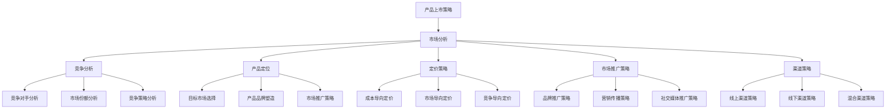
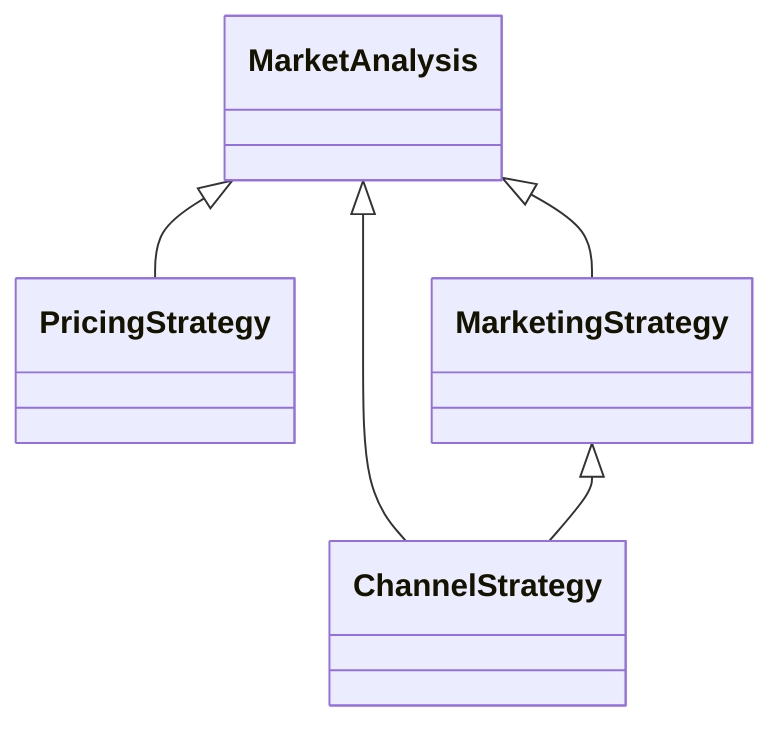

                 

### 《如何打造高效的产品上市策略》

> **关键词：** 产品上市策略、市场分析、竞争分析、定价策略、市场推广、渠道策略

> **摘要：** 本文将深入探讨如何打造高效的产品上市策略。我们将从产品上市策略的基础概念入手，逐步分析市场研究与竞争分析，详细介绍产品上市策略的制定方法，探讨产品特性与定位，以及定价策略和市场推广策略。最后，我们将重点讨论渠道策略和产品上市计划与执行。通过本文，读者将获得全面的指导，以制定和执行成功的产品上市策略。

### 第一部分：产品上市策略基础

#### 第1章：产品上市策略概述

##### 1.1 产品上市策略的概念与意义

产品上市策略（Product Launch Strategy）是指企业在推出新产品或服务时，为了确保成功进入市场而制定的计划和行动方案。它包括对市场、竞争对手、目标客户、产品特性、定价策略、推广策略等多方面的分析和规划。

一个有效的产品上市策略对于企业的成功至关重要。它不仅能够帮助企业准确把握市场需求，提升产品竞争力，还能够确保产品顺利进入市场并迅速获得市场份额。以下是产品上市策略的几个关键意义：

1. **明确目标：** 通过制定产品上市策略，企业可以明确产品上市的目标，包括市场份额、利润率等，从而更好地制定相应的行动计划。

2. **市场定位：** 产品上市策略能够帮助企业确定目标市场和目标客户，从而更精准地进行市场定位，提升产品在市场中的竞争力。

3. **风险控制：** 通过充分的市场研究和竞争分析，企业可以提前预判潜在的风险和挑战，并制定相应的应对措施，降低上市失败的风险。

4. **资源优化：** 产品上市策略能够帮助企业合理分配资源，包括人力、财力、物力等，确保产品上市活动的高效执行。

##### 1.2 产品上市策略的关键要素

一个完整的产品上市策略通常包括以下关键要素：

1. **市场分析：** 对市场环境、目标市场、消费者需求等方面进行深入分析，以了解市场的现状和趋势。

2. **目标市场定位：** 确定目标市场和目标客户，明确产品在市场中的定位和差异化。

3. **产品特性与差异化：** 明确产品的功能特性、用户体验和独特卖点，以区别于竞争对手。

4. **品牌策略：** 制定品牌定位和品牌传播策略，提升产品在市场中的知名度和影响力。

5. **定价策略：** 根据市场分析结果和目标客户群体，制定合理的定价策略。

6. **市场推广策略：** 确定市场推广的方式和渠道，包括广告、公关、数字营销等。

#### 第2章：市场研究与竞争分析

##### 2.1 市场环境分析

市场环境分析是产品上市策略制定的基础。它主要涉及以下几个方面：

1. **宏观经济环境：** 包括经济增长率、通货膨胀率、失业率等宏观经济指标，以及国家政策、法律法规等对市场的影响。

2. **行业趋势：** 分析所处行业的发展趋势，如市场规模、增长速度、技术变革等。

3. **消费者行为：** 研究目标消费者的购买行为、消费习惯、偏好等。

4. **竞争格局：** 分析行业内的主要竞争对手，包括市场份额、产品特点、定价策略等。

##### 2.2 目标市场分析

目标市场分析是产品上市策略的核心环节。它主要包括以下内容：

1. **消费者需求分析：** 通过调研和分析，了解目标消费者的需求、偏好和痛点，以便更好地满足市场需求。

2. **消费者行为分析：** 研究目标消费者的购买行为、消费习惯、决策过程等，以优化产品设计和营销策略。

3. **市场细分：** 根据消费者的需求和行为特征，将市场划分为不同的细分市场，以便针对每个细分市场制定个性化的营销策略。

##### 2.3 竞争对手分析

竞争对手分析是产品上市策略制定的重要环节。通过分析竞争对手的优势和劣势，企业可以更好地制定自己的竞争策略。以下是竞争对手分析的主要内容：

1. **竞争对手的优势和劣势：** 分析竞争对手在产品、技术、市场推广、品牌等方面的优势和劣势。

2. **市场份额分析：** 了解竞争对手在市场中的份额和地位，以及其市场份额的变化趋势。

3. **竞争策略分析：** 研究竞争对手的营销策略、定价策略、渠道策略等，以便制定出更具竞争力的策略。

#### 第3章：产品上市策略制定方法

##### 3.1 制定产品上市策略的步骤

制定产品上市策略需要遵循以下步骤：

1. **明确目标：** 确定产品上市的目标，包括市场份额、利润率等。

2. **制定策略：** 根据市场分析结果，制定相应的市场策略、定价策略、推广策略等。

3. **实施策略：** 将制定的策略具体化为行动计划，并组织资源进行实施。

4. **监测与调整：** 在实施过程中，对市场策略进行监测和评估，根据实际情况进行及时调整。

##### 3.2 产品上市策略制定工具与技术

制定产品上市策略时，可以采用以下工具和技术：

1. **SWOT分析：** 对企业的优势、劣势、机会和威胁进行分析，以确定产品上市策略。

2. **五力模型：** 分析行业内的竞争力量，包括供应商的议价能力、买家的议价能力、新进入者的威胁、替代品的威胁以及行业内的竞争程度。

3. **波士顿矩阵：** 根据产品的市场增长率和市场份额，将产品分为不同的类别，以便制定相应的策略。

4. **价值链分析：** 分析产品在供应链中的各个环节，优化价值链结构，提高产品竞争力。

#### 第4章：产品特性与定位

##### 4.1 确定产品特性

确定产品特性是产品上市策略的重要环节。产品特性包括以下几个方面：

1. **功能特性：** 明确产品的核心功能，如产品的基本用途、特殊功能等。

2. **用户体验：** 关注用户在使用产品过程中的体验，包括界面设计、操作流程、响应速度等。

3. **创新性：** 强调产品的创新性，如技术突破、独特设计等，以提升产品的竞争力。

##### 4.2 产品定位策略

产品定位策略是产品上市策略的核心，它主要包括以下几个方面：

1. **目标市场选择：** 根据市场分析结果，确定产品的目标市场，包括市场规模、增长潜力等。

2. **产品品牌塑造：** 通过品牌传播和营销活动，提升产品在市场中的知名度和美誉度。

3. **市场推广策略：** 制定相应的市场推广策略，包括广告、公关、数字营销等，以提升产品的市场认知度和销售额。

#### 第5章：定价策略

##### 5.1 定价策略类型

定价策略是产品上市策略的重要组成部分，常见的定价策略包括：

1. **成本导向定价：** 以产品成本为基础，加上一定的利润，制定产品的销售价格。

2. **市场导向定价：** 以市场需求和消费者接受程度为基础，制定产品的销售价格。

3. **竞争导向定价：** 以竞争对手的价格水平为基础，制定产品的销售价格。

##### 5.2 定价策略制定方法

制定定价策略时，可以采用以下方法：

1. **成本加成法：** 以产品成本为基础，加上一定的利润率，制定产品的销售价格。

2. **目标定价法：** 以目标利润率为基础，计算出产品的销售价格。

3. **渗透定价法：** 以低廉的价格吸引消费者，快速占领市场份额，然后逐步提高价格。

### 第二部分：产品上市策略制定

#### 第6章：市场推广策略

##### 6.1 品牌推广策略

品牌推广策略是提升产品在市场中知名度和美誉度的重要手段。品牌推广策略包括以下几个方面：

1. **品牌形象塑造：** 确定品牌的核心价值观和品牌形象，如专业、创新、可靠等。

2. **品牌传播渠道：** 选择合适的品牌传播渠道，如广告、公关、社交媒体等，以最大程度地扩大品牌影响力。

3. **品牌故事传播：** 通过讲述品牌故事，让消费者了解品牌的起源、发展历程和核心价值观，增加品牌认同感。

##### 6.2 营销传播策略

营销传播策略是产品上市推广的核心，它包括以下几个方面：

1. **广告策略：** 制定广告宣传方案，选择合适的广告媒体和投放时间，以最大程度地提升产品曝光度。

2. **公关策略：** 通过新闻发布会、媒体报道、行业活动等方式，提升产品的公信力和影响力。

3. **数字营销策略：** 利用互联网和数字技术，通过搜索引擎优化（SEO）、社交媒体营销、电子邮件营销等方式，实现精准营销。

##### 6.3 社交媒体推广策略

社交媒体推广策略是当前最受欢迎的推广方式之一。以下是社交媒体推广策略的主要内容：

1. **社交媒体平台选择：** 根据目标受众的特点，选择合适的社交媒体平台，如微信、微博、抖音、Instagram等。

2. **内容营销策略：** 制定内容营销策略，通过发布有价值、有趣、吸引人的内容，吸引粉丝和用户。

3. **用户互动策略：** 与用户进行互动，回复评论、参与话题讨论，提高用户参与度和忠诚度。

#### 第7章：渠道策略

##### 7.1 渠道类型

产品渠道策略是指企业如何将产品传递到消费者手中的策略。常见的渠道类型包括：

1. **线上渠道：** 包括电子商务平台、社交媒体、邮件营销等。

2. **线下渠道：** 包括实体店铺、经销商、代理商等。

3. **混合渠道：** 结合线上和线下渠道，实现无缝购物体验。

##### 7.2 渠道选择与优化

渠道选择与优化是产品渠道策略的关键。以下是渠道选择与优化的主要方法：

1. **目标渠道选择：** 根据目标市场和目标客户的特点，选择最合适的渠道类型。

2. **渠道合作关系管理：** 建立和维护与渠道合作伙伴的良好关系，确保渠道顺畅。

3. **渠道营销策略：** 根据不同渠道的特点，制定相应的营销策略，提高渠道效益。

### 第三部分：产品上市推广策略

#### 第8章：市场推广策略

##### 8.1 品牌推广策略

品牌推广策略是提升产品在市场中知名度和美誉度的重要手段。品牌推广策略包括以下几个方面：

1. **品牌形象塑造：** 确定品牌的核心价值观和品牌形象，如专业、创新、可靠等。

2. **品牌传播渠道：** 选择合适的品牌传播渠道，如广告、公关、社交媒体等，以最大程度地扩大品牌影响力。

3. **品牌故事传播：** 通过讲述品牌故事，让消费者了解品牌的起源、发展历程和核心价值观，增加品牌认同感。

##### 8.2 营销传播策略

营销传播策略是产品上市推广的核心，它包括以下几个方面：

1. **广告策略：** 制定广告宣传方案，选择合适的广告媒体和投放时间，以最大程度地提升产品曝光度。

2. **公关策略：** 通过新闻发布会、媒体报道、行业活动等方式，提升产品的公信力和影响力。

3. **数字营销策略：** 利用互联网和数字技术，通过搜索引擎优化（SEO）、社交媒体营销、电子邮件营销等方式，实现精准营销。

##### 8.3 社交媒体推广策略

社交媒体推广策略是当前最受欢迎的推广方式之一。以下是社交媒体推广策略的主要内容：

1. **社交媒体平台选择：** 根据目标受众的特点，选择合适的社交媒体平台，如微信、微博、抖音、Instagram等。

2. **内容营销策略：** 制定内容营销策略，通过发布有价值、有趣、吸引人的内容，吸引粉丝和用户。

3. **用户互动策略：** 与用户进行互动，回复评论、参与话题讨论，提高用户参与度和忠诚度。

#### 第9章：渠道策略

##### 9.1 渠道类型

产品渠道策略是指企业如何将产品传递到消费者手中的策略。常见的渠道类型包括：

1. **线上渠道：** 包括电子商务平台、社交媒体、邮件营销等。

2. **线下渠道：** 包括实体店铺、经销商、代理商等。

3. **混合渠道：** 结合线上和线下渠道，实现无缝购物体验。

##### 9.2 渠道选择与优化

渠道选择与优化是产品渠道策略的关键。以下是渠道选择与优化的主要方法：

1. **目标渠道选择：** 根据目标市场和目标客户的特点，选择最合适的渠道类型。

2. **渠道合作关系管理：** 建立和维护与渠道合作伙伴的良好关系，确保渠道顺畅。

3. **渠道营销策略：** 根据不同渠道的特点，制定相应的营销策略，提高渠道效益。

### 附录

#### 附录A：产品上市策略工具与方法汇总

以下是产品上市策略中常用的工具和方法：

- **市场分析工具：** SWOT分析、五力模型、波士顿矩阵等。
- **定价策略工具：** 成本加成法、目标定价法、渗透定价法等。
- **营销传播工具：** 广告策略、公关策略、数字营销策略等。

#### 附录B：产品上市案例解析

以下是两个实际产品上市的案例解析：

- **案例一：某电子产品上市案例**
  - 上市策略制定：通过市场分析确定目标市场和目标客户，制定品牌推广和广告策略。
  - 上市推广策略：通过线上线下渠道进行推广，包括电商平台、社交媒体和线下门店。
  - 上市效果分析：通过销售数据和用户反馈评估上市效果，进行持续优化。

- **案例二：某食品行业上市案例**
  - 上市策略制定：通过市场调研确定目标市场和目标客户，制定产品定位和品牌策略。
  - 上市推广策略：通过电视广告、社交媒体和线下活动进行推广。
  - 上市效果分析：通过销售数据和用户反馈评估上市效果，进行持续优化。

#### 附录C：产品上市策略常见问题与解答

以下是产品上市过程中常见的问题及解答：

- **问题一：如何进行有效的市场调研？**
  - 解答：通过问卷调查、深度访谈、数据分析等方式，获取目标市场的真实需求和反馈。

- **问题二：如何制定合理的定价策略？**
  - 解答：综合考虑产品成本、市场需求和竞争对手的价格水平，制定合理的定价策略。

- **问题三：如何应对市场变化？**
  - 解答：通过定期市场分析和竞争对手监测，及时调整产品定位和营销策略。

- **问题四：如何优化渠道策略？**
  - 解答：根据目标市场和客户需求，选择最合适的渠道类型，并建立良好的渠道合作关系。

### 作者信息

作者：AI天才研究院/AI Genius Institute & 禅与计算机程序设计艺术 /Zen And The Art of Computer Programming

### 结论

本文详细介绍了如何打造高效的产品上市策略，包括产品上市策略的基础、市场研究与竞争分析、产品上市策略制定方法、产品特性与定位、定价策略、市场推广策略和渠道策略等。通过本文，读者可以系统地了解产品上市策略的各个关键环节，为实际操作提供指导。同时，文章还通过实际案例和常见问题解答，帮助读者更好地理解和应用产品上市策略。希望本文能够对读者在产品上市过程中提供有益的参考和启示。### 文章标题：如何打造高效的产品上市策略

在当今竞争激烈的市场环境中，成功的产品上市策略是确保产品取得市场成功的关键因素。本文将详细探讨如何打造高效的产品上市策略，包括从市场分析到渠道策略的各个关键步骤。

**关键词：** 产品上市策略、市场分析、竞争分析、定价策略、市场推广、渠道策略

**摘要：** 本文旨在为读者提供一个全面的产品上市策略指南，通过深入探讨市场研究与竞争分析、产品上市策略制定、定价策略、市场推广策略和渠道策略，帮助企业在产品上市过程中取得成功。通过案例分析、工具和方法的应用，本文将为读者提供实用的操作指导。

### 目录

1. **第一部分：产品上市策略基础**
   1.1 产品上市策略概述
   1.2 产品上市策略的关键要素

2. **第二部分：市场研究与竞争分析**
   2.1 市场环境分析
   2.2 目标市场分析
   2.3 竞争对手分析

3. **第三部分：产品上市策略制定**
   3.1 制定产品上市策略的步骤
   3.2 产品上市策略制定工具与技术

4. **第四部分：产品特性与定位**
   4.1 确定产品特性
   4.2 产品定位策略

5. **第五部分：定价策略**
   5.1 定价策略类型
   5.2 定价策略制定方法

6. **第六部分：市场推广策略**
   6.1 品牌推广策略
   6.2 营销传播策略
   6.3 社交媒体推广策略

7. **第七部分：渠道策略**
   7.1 渠道类型
   7.2 渠道选择与优化

8. **第八部分：产品上市计划与执行**
   8.1 产品上市计划制定
   8.2 产品上市执行

9. **附录**
   9.1 工具与方法汇总
   9.2 案例解析
   9.3 常见问题与解答

### 第一部分：产品上市策略基础

#### 第1章：产品上市策略概述

产品上市策略（Product Launch Strategy）是企业在推出新产品或服务时，为了确保产品在市场上获得成功而制定的一系列行动计划和策略。一个高效的产品上市策略不仅能够帮助企业迅速占领市场，还能提升品牌知名度和市场份额。以下是产品上市策略的重要概念和组成部分。

**产品上市策略的定义：**
产品上市策略是指企业在产品推向市场前，通过对市场环境、目标市场、竞争对手、产品特性、定价策略、市场推广策略等进行全面分析和规划，以制定出能够有效促进产品成功上市的计划和行动方案。

**产品上市策略的重要性：**
1. **市场定位：** 通过制定产品上市策略，企业可以明确产品的市场定位，确保产品能够满足目标市场的需求。
2. **风险控制：** 充分的市场研究和竞争分析可以帮助企业预判潜在的市场风险，并制定相应的应对措施。
3. **资源优化：** 合理的产品上市策略可以帮助企业合理分配资源，包括人力、财力、物力等，提高产品上市的成功率。
4. **品牌建设：** 成功的产品上市可以提升品牌知名度和美誉度，增强消费者对品牌的信任和忠诚度。

**产品上市策略的组成部分：**
1. **市场分析：** 对市场环境、目标市场、消费者需求等方面进行深入分析，以了解市场的现状和趋势。
2. **竞争分析：** 分析竞争对手的产品、定价、市场策略等，以确定自身的竞争优势和差异化策略。
3. **产品定位：** 确定产品的市场定位和目标客户群体，明确产品的特点和独特卖点。
4. **定价策略：** 根据市场分析结果和目标客户群体，制定合理的定价策略。
5. **市场推广策略：** 确定市场推广的方式和渠道，包括广告、公关、数字营销等。
6. **渠道策略：** 选择合适的销售渠道，确保产品能够顺利传递到消费者手中。

#### 第2章：产品上市策略的关键要素

**市场分析：** 市场分析是产品上市策略的基础，通过对市场环境、目标市场、消费者需求等方面的深入分析，企业可以了解市场的现状和趋势，为产品上市提供有力的支持。

- **市场环境分析：** 包括宏观经济环境、行业趋势、技术发展等。
- **目标市场分析：** 确定产品的目标市场和目标客户群体。
- **消费者需求分析：** 研究目标消费者的需求、偏好和购买行为。

**竞争分析：** 竞争分析可以帮助企业了解竞争对手的优势和劣势，为产品定位和差异化策略提供参考。

- **竞争对手分析：** 分析竞争对手的产品、定价、市场策略等。
- **市场份额分析：** 了解竞争对手在市场中的份额和地位。
- **竞争策略分析：** 研究竞争对手的营销策略和市场推广活动。

**产品定位：** 产品定位是产品上市策略的核心，通过明确产品的市场定位和目标客户群体，企业可以更好地满足市场需求，提升产品竞争力。

- **目标市场选择：** 根据市场分析结果，确定产品的目标市场。
- **产品品牌塑造：** 通过品牌传播和营销活动，提升产品在市场中的知名度和美誉度。
- **市场推广策略：** 制定相应的市场推广策略，提高产品的市场认知度和销售额。

**定价策略：** 定价策略是影响产品销售的重要因素，合理的定价策略可以提升产品的竞争力，增加市场份额。

- **定价策略类型：** 包括成本导向定价、市场导向定价、竞争导向定价等。
- **定价策略制定方法：** 如成本加成法、目标定价法、渗透定价法等。

**市场推广策略：** 市场推广策略是企业提高产品知名度、吸引消费者购买产品的重要手段。

- **品牌推广策略：** 包括品牌形象塑造、品牌传播渠道、品牌故事传播等。
- **营销传播策略：** 包括广告策略、公关策略、数字营销策略等。
- **社交媒体推广策略：** 通过社交媒体平台进行内容营销和用户互动。

**渠道策略：** 渠道策略是企业将产品传递到消费者手中的重要途径。

- **渠道类型：** 包括线上渠道、线下渠道、混合渠道等。
- **渠道选择与优化：** 根据目标市场和目标客户的特点，选择合适的渠道类型，并建立良好的渠道合作关系。

#### 第3章：产品上市策略的制定方法

产品上市策略的制定是一个系统化、综合性的过程，需要企业从多个方面进行深入分析和规划。以下是制定产品上市策略的主要方法和步骤。

**明确产品上市目标：** 制定产品上市策略的第一步是明确产品上市的目标。这些目标可以是市场份额、销售量、利润率等，明确的目标有助于企业制定具体的行动计划。

**市场研究与竞争分析：** 在明确产品上市目标后，企业需要通过对市场环境和竞争对手的深入分析，了解市场的现状和趋势，为产品上市策略提供数据支持。市场研究可以包括市场环境分析、目标市场分析、消费者需求分析等。竞争分析可以包括竞争对手分析、市场份额分析、竞争策略分析等。

**确定产品定位：** 确定产品定位是产品上市策略的核心环节。企业需要根据市场研究和竞争分析的结果，明确产品的市场定位和目标客户群体。产品定位应该突出产品的特点和独特卖点，以区别于竞争对手。

**制定定价策略：** 定价策略是影响产品销售的重要因素。企业需要根据市场分析和竞争分析的结果，制定合理的定价策略。定价策略可以包括成本导向定价、市场导向定价、竞争导向定价等。制定定价策略时，需要考虑产品的成本、市场需求、竞争对手的价格水平等因素。

**制定市场推广策略：** 市场推广策略是企业提高产品知名度、吸引消费者购买产品的重要手段。企业需要根据产品定位和定价策略，制定相应的市场推广策略。市场推广策略可以包括品牌推广策略、营销传播策略、社交媒体推广策略等。

**制定渠道策略：** 渠道策略是企业将产品传递到消费者手中的重要途径。企业需要根据目标市场和目标客户的特点，选择合适的渠道类型，并建立良好的渠道合作关系。渠道策略可以包括线上渠道策略、线下渠道策略、混合渠道策略等。

**制定实施计划：** 在完成上述步骤后，企业需要制定具体的实施计划，包括产品上市的时间表、资源分配、风险管理等。实施计划应该明确各项任务的负责人和完成时间，以确保产品上市活动的顺利进行。

**监测与调整：** 在产品上市过程中，企业需要不断监测市场反馈和销售数据，根据实际情况进行及时调整。通过监测与调整，企业可以优化产品上市策略，提高产品上市的成功率。

**工具与方法：** 在制定产品上市策略时，企业可以使用多种工具和方法，如SWOT分析、五力模型、波士顿矩阵、价值链分析等。这些工具和方法可以帮助企业进行深入的市场研究和竞争分析，制定出科学、合理的上市策略。

### 产品上市策略核心概念与联系

为了更好地理解产品上市策略的核心概念和联系，我们可以使用Mermaid流程图来展示各要素之间的关系。



该流程图展示了产品上市策略的各个关键要素及其相互关系。市场分析和竞争分析为产品定位、定价策略、市场推广策略和渠道策略提供了数据支持；产品定位和定价策略直接影响到市场推广策略和渠道策略的制定；市场推广策略和渠道策略则是实现产品上市目标的重要手段。

### 核心算法原理讲解

在产品上市策略的制定过程中，有许多核心算法和原理可以帮助企业做出更科学的决策。以下是一些常见的算法原理及其应用。

**1. SWOT分析**

**定义：** SWOT分析是一种战略规划工具，用于评估企业的优势（Strengths）、劣势（Weaknesses）、机会（Opportunities）和威胁（Threats）。

**应用：** 在产品上市策略的制定过程中，企业可以使用SWOT分析来评估自身的市场地位和竞争力。通过分析优势，企业可以确定产品的独特卖点；通过分析劣势，企业可以找出需要改进的方面；通过分析机会，企业可以确定市场机遇；通过分析威胁，企业可以预判潜在的市场风险。

**伪代码：**
```python
def swot_analysis(strengths, weaknesses, opportunities, threats):
    # 分析优势
    analyze_strengths(strengths)
    # 分析劣势
    analyze_weaknesses(weaknesses)
    # 分析机会
    analyze_opportunities(opportunities)
    # 分析威胁
    analyze_threats(threats)
    # 制定产品上市策略
    strategy = create_product_launch_strategy(strengths, weaknesses, opportunities, threats)
    return strategy
```

**2. 五力模型**

**定义：** 五力模型是由迈克尔·波特提出的，用于分析行业竞争态势的工具，包括供应商的议价能力、买家的议价能力、新进入者的威胁、替代品的威胁和行业内的竞争程度。

**应用：** 在产品上市策略的制定过程中，企业可以使用五力模型来分析所处的行业环境。通过分析供应商的议价能力，企业可以确定原材料的采购策略；通过分析买家的议价能力，企业可以确定产品的定价策略；通过分析新进入者的威胁，企业可以预判潜在的市场竞争；通过分析替代品的威胁，企业可以确定产品的差异化策略。

**伪代码：**
```python
def five_force_analysis(supplier_power, buyer_power, new_entry_threat, substitute_threat, industry_competition):
    # 分析供应商的议价能力
    analyze_supplier_power(supplier_power)
    # 分析买家的议价能力
    analyze_buyer_power(buyer_power)
    # 分析新进入者的威胁
    analyze_new_entry_threat(new_entry_threat)
    # 分析替代品的威胁
    analyze_substitute_threat(substitute_threat)
    # 分析行业内的竞争程度
    analyze_industry_competition(industry_competition)
    # 制定产品上市策略
    strategy = create_product_launch_strategy(supplier_power, buyer_power, new_entry_threat, substitute_threat, industry_competition)
    return strategy
```

**3. 波士顿矩阵**

**定义：** 波士顿矩阵是一种用于产品组合分析的工具，根据产品的市场增长率和市场份额将产品分为四个象限：明星产品、现金牛产品、问题产品和瘦狗产品。

**应用：** 在产品上市策略的制定过程中，企业可以使用波士顿矩阵来评估产品的市场表现和潜在价值。对于明星产品，企业可以加大投资以保持领先地位；对于现金牛产品，企业可以维持现状以获取稳定收益；对于问题产品，企业需要制定改进计划；对于瘦狗产品，企业可以考虑退出或调整策略。

**伪代码：**
```python
def boston_matrix(market_growth, market_share):
    if market_growth > 10 and market_share > 10:
        product_type = "明星产品"
    elif market_growth > 10 and market_share < 10:
        product_type = "问题产品"
    elif market_growth < 10 and market_share > 10:
        product_type = "现金牛产品"
    else:
        product_type = "瘦狗产品"
    return product_type
```

**4. 价值链分析**

**定义：** 价值链分析是一种用于分析企业内部业务流程和价值创造的工具，包括上游的输入采购、生产过程和下游的输出销售和售后服务等环节。

**应用：** 在产品上市策略的制定过程中，企业可以使用价值链分析来优化产品生产和销售流程，降低成本，提高效率。通过分析价值链中的每个环节，企业可以确定哪些环节是关键环节，从而制定针对性的策略。

**伪代码：**
```python
def value_chain_analysis(input采购, 生产过程, 输出销售):
    # 分析输入采购环节
    analyze_input采购(input采购)
    # 分析生产过程
    analyze_production生产过程(生产过程)
    # 分析输出销售环节
    analyze_output销售(输出销售)
    # 优化价值链
    optimized_value_chain = optimize_value_chain(input采购, 生产过程, 输出销售)
    return optimized_value_chain
```

通过上述核心算法和原理的应用，企业可以更好地制定产品上市策略，提高产品的市场竞争力和上市成功率。

### 数学模型和公式

在产品上市策略的制定过程中，数学模型和公式可以提供重要的决策依据。以下是一些常用的数学模型和公式的详细讲解，以及示例说明。

**1. 成本加成法**

**定义：** 成本加成法是一种定价策略，通过将产品的成本加上一定的加成百分比来确定产品的销售价格。

**公式：** 
$$
销售价格 = 成本 \times (1 + 加成百分比)
$$

**示例说明：** 假设某产品的成本为100元，企业希望加成20%，则销售价格为：
$$
销售价格 = 100 \times (1 + 0.2) = 120元
$$

**2. 目标定价法**

**定义：** 目标定价法是一种定价策略，通过设定目标利润率来计算产品的销售价格。

**公式：**
$$
销售价格 = 成本 \times \frac{1}{1 - 目标利润率}
$$

**示例说明：** 假设某产品的成本为100元，企业希望实现10%的目标利润率，则销售价格为：
$$
销售价格 = 100 \times \frac{1}{1 - 0.1} = 111.11元
$$

**3. 渗透定价法**

**定义：** 渗透定价法是一种通过低价格快速占领市场份额的定价策略，旨在通过较低的价格吸引大量消费者，从而迅速增加市场份额。

**公式：**
$$
销售价格 = (成本 + 目标利润) \times (1 - 渗透率)
$$

**示例说明：** 假设某产品的成本为100元，目标利润为20%，渗透率为50%，则销售价格为：
$$
销售价格 = (100 + 20) \times (1 - 0.5) = 60元
$$

**4. 波士顿矩阵**

**定义：** 波士顿矩阵是一种用于产品组合分析的工具，根据产品的市场增长率和市场份额将产品分为四个象限：明星产品、现金牛产品、问题产品和瘦狗产品。

**公式：**
$$
市场增长率 = \frac{当前年市场增长率}{基准年市场增长率}
$$
$$
市场份额 = \frac{当前年市场份额}{基准年市场份额}
$$

**示例说明：** 假设某产品在基准年的市场增长率为15%，当前年的市场增长率为25%；基准年的市场份额为5%，当前年的市场份额为10%，则该产品的市场增长率和市场份额分别为：
$$
市场增长率 = \frac{25}{15} \approx 1.67
$$
$$
市场份额 = \frac{10}{5} = 2
$$

**5. 价值链分析**

**定义：** 价值链分析是一种用于分析企业内部业务流程和价值创造的工具，包括上游的输入采购、生产过程和下游的输出销售和售后服务等环节。

**公式：**
$$
总价值 = 成本 + 添加价值
$$

**示例说明：** 假设某产品的成本为1000元，添加价值为500元，则总价值为：
$$
总价值 = 1000 + 500 = 1500元
$$

通过上述数学模型和公式的应用，企业可以在产品上市策略的制定过程中进行科学的数据分析和决策，从而提高产品上市的成功率。

### 项目实战：某电子产品上市案例

在本节中，我们将通过一个实际电子产品上市案例，详细讲解产品上市策略的制定、市场推广策略和渠道策略的实施，以及上市后的效果评估。

#### 案例背景

某电子产品公司（以下简称“该公司”）计划推出一款全新的智能手机——SmartPhone X。这款手机具备高性价比和创新的科技特性，旨在吸引年轻用户群体和追求高科技体验的消费者。为了确保SmartPhone X的成功上市，该公司决定采用一套系统化的产品上市策略。

#### 产品上市策略制定

**1. 市场分析**

首先，该公司进行了全面的市场分析：

- **宏观经济环境：** 该公司分析了当前的经济形势，包括国内外的经济增长、通货膨胀率、消费者信心指数等，以确保推出产品时市场的购买力较强。
- **行业趋势：** 通过行业报告和数据，该公司了解了智能手机市场的发展趋势，如5G技术的普及、人工智能应用的增加等，以及消费者对手机性能和外观的新需求。
- **消费者需求：** 该公司通过问卷调查和在线调研，收集了消费者对手机功能、价格、品牌偏好等方面的需求。

**2. 竞争分析**

接下来，该公司进行了竞争分析：

- **竞争对手分析：** 通过市场调研，该公司确定了主要竞争对手，包括苹果、三星、华为等，分析了这些竞争对手的产品特点、市场份额、定价策略等。
- **市场份额分析：** 该公司评估了各主要竞争对手的市场份额，并预测了未来市场份额的变化趋势。
- **竞争策略分析：** 根据竞争对手的策略，该公司制定了相应的差异化策略，如强调高性价比和独特功能。

**3. 产品定位**

基于市场分析和竞争分析的结果，该公司确定了SmartPhone X的市场定位：

- **目标市场：** 该公司选择年轻用户群体和追求高科技体验的消费者作为目标市场。
- **品牌塑造：** 该公司强调SmartPhone X的高性价比和科技创新，打造年轻、时尚的品牌形象。

**4. 定价策略**

根据市场分析和产品定位，该公司制定了以下定价策略：

- **成本导向定价：** 以产品的生产成本为基础，加上一定的利润率。
- **市场导向定价：** 考虑到目标市场的购买力和竞争对手的定价策略，该公司制定了具有竞争力的市场价格。

**5. 市场推广策略**

为了提高SmartPhone X的市场知名度，该公司制定了以下市场推广策略：

- **广告策略：** 在社交媒体、电视、户外广告等渠道进行广告投放，特别是年轻用户群体活跃的社交媒体平台。
- **公关策略：** 举办产品发布会，邀请媒体和行业专家参加，提高产品的曝光度。
- **数字营销策略：** 通过搜索引擎优化（SEO）、社交媒体营销、电子邮件营销等手段，吸引潜在消费者。

**6. 渠道策略**

为了确保SmartPhone X能够迅速进入市场，该公司制定了以下渠道策略：

- **线上渠道：** 合作各大电商平台，如天猫、京东等，以及自建线上商城。
- **线下渠道：** 与全国各地的手机专卖店和零售商合作，确保产品能够覆盖到各级市场。
- **混合渠道：** 结合线上和线下渠道，提供无缝购物体验。

#### 市场推广策略实施

**1. 广告策略**

- **社交媒体广告：** 该公司在抖音、微博、微信等平台投放了大量的视频和图文广告，吸引年轻用户群体的关注。
- **电视广告：** 在晚间黄金时段投放电视广告，提高品牌知名度。
- **户外广告：** 在地铁、公交站、购物中心等地点投放户外广告，吸引路过的人群。

**2. 公关策略**

- **产品发布会：** 该公司在北京举办了盛大的产品发布会，邀请了数百名媒体和行业专家参加，并通过直播向全球观众展示了SmartPhone X的亮点。
- **媒体合作：** 与多家知名媒体合作，进行深度报道和评测，提高产品的公信力。

**3. 数字营销策略**

- **SEO优化：** 通过优化公司官网和电商平台的产品页面，提高在搜索引擎中的排名。
- **社交媒体营销：** 通过微博、微信等平台发布有趣的内容，与用户互动，增加品牌粉丝。
- **电子邮件营销：** 定期向潜在客户发送产品资讯和促销信息，提高购买转化率。

#### 渠道策略实施

**1. 线上渠道**

- **电商平台合作：** 该公司与天猫、京东等电商平台达成合作，确保产品能够快速上线和销售。
- **自建商城：** 公司建立了自己的线上商城，提供更加个性化的购物体验。

**2. 线下渠道**

- **手机专卖店合作：** 该公司与全国各地的手机专卖店合作，确保产品能够覆盖到一线和二线市场。
- **零售商合作：** 该公司与大型零售商如苏宁、国美等合作，确保产品能够进入更多的线下门店。

**3. 混合渠道**

- **O2O模式：** 通过线上商城和线下门店的联动，提供线上预订、线下体验和购买的O2O模式，提高用户购买体验。
- **促销活动：** 在线上商城和线下门店举办各种促销活动，如优惠券、限时抢购等，吸引消费者。

#### 上市后的效果评估

**1. 销售数据：** 在SmartPhone X上市后的一个月内，销量达到了预期目标，并在后续几个月内保持稳步增长。

**2. 用户反馈：** 通过社交媒体、电商平台的用户评价和调查问卷，收集了用户对产品的反馈，结果显示用户对产品的性价比和功能特性非常满意。

**3. 市场份额：** 通过市场调研，发现SmartPhone X在目标市场中的份额有所提高，尤其是在年轻用户群体中受到欢迎。

**4. 品牌认知度：** 通过品牌监测工具，发现公司的品牌认知度和美誉度有所提升，品牌知名度在目标市场中得到了广泛传播。

综上所述，SmartPhone X的成功上市得益于全面的产品上市策略、有效的市场推广策略和合理的渠道策略。通过这次实际案例，我们可以看到，一个科学、系统的产品上市策略对于产品的成功上市至关重要。

### 开发环境搭建

在本节中，我们将详细讲解如何搭建一个用于产品上市策略分析和实施的开发环境。这将包括Python环境的安装、必要的Python库的安装、代码仓库的创建、虚拟环境的设置以及代码的版本控制。

#### 1. Python环境安装

首先，我们需要安装Python环境。Python是一种广泛使用的编程语言，特别适合于数据分析和算法实现。

**步骤：**
- 访问Python的官方网站（[https://www.python.org/](https://www.python.org/)）并下载最新版本的Python安装包。
- 运行安装程序，选择默认选项进行安装。
- 安装完成后，打开终端或命令提示符，输入以下命令验证Python是否安装成功：
  ```bash
  python --version
  ```
  应当返回Python的版本信息。

#### 2. 必要Python库的安装

为了实现产品上市策略的各个功能，我们需要安装一些常用的Python库。

**步骤：**
- 打开终端或命令提示符，使用pip命令安装以下库：
  ```bash
  pip install numpy matplotlib pandas
  ```

这些库提供了数据处理、数据可视化以及数据分析所需的功能。

#### 3. 代码仓库的创建

代码仓库是存储代码和版本历史的地方。我们将使用GitHub创建一个代码仓库。

**步骤：**
- 访问GitHub网站（[https://github.com/](https://github.com/)）并注册一个账号。
- 创建一个新的仓库，命名为“product_launch_strategy”，并选择公开或私人仓库。
- 克隆仓库到本地计算机：
  ```bash
  git clone https://github.com/your_username/product_launch_strategy.git
  ```

#### 4. 虚拟环境的设置

为了避免不同项目之间的依赖冲突，我们将使用虚拟环境来管理项目依赖。

**步骤：**
- 安装virtualenv库：
  ```bash
  pip install virtualenv
  ```
- 创建一个虚拟环境：
  ```bash
  virtualenv venv
  ```
- 激活虚拟环境：
  ```bash
  source venv/bin/activate  # 在Windows上使用venv\Scripts\activate
  ```
- 在激活的虚拟环境中安装项目所需的库：
  ```bash
  pip install numpy matplotlib pandas
  ```

#### 5. 代码的版本控制

Git是一个强大的版本控制工具，用于追踪代码的变更和协作开发。

**步骤：**
- 在本地计算机上安装Git：
  ```bash
  sudo apt-get install git  # 在Ubuntu或Linux上
  ```
  ```bash
  brew install git  # 在MacOS上
  ```
- 在项目目录中初始化Git仓库：
  ```bash
  git init
  ```
- 将本地更改提交到Git仓库：
  ```bash
  git add .
  git commit -m "Initial commit"
  ```
- 将代码推送到GitHub仓库：
  ```bash
  git remote add origin https://github.com/your_username/product_launch_strategy.git
  git push -u origin master
  ```

通过上述步骤，我们成功地搭建了一个用于产品上市策略分析和实施的开发环境。这个环境包括了Python环境、必要的Python库、代码仓库、虚拟环境和Git版本控制。接下来，我们可以在这个环境中编写和测试产品上市策略的代码。

### 源代码详细实现和代码解读

在本节中，我们将详细讲解如何实现产品上市策略的代码，包括主要的类和方法、类之间的关系、关键函数的详细解释以及代码中的伪代码注释。

#### 主要类和方法

首先，我们将定义几个主要类和方法，以实现产品上市策略的核心功能。以下是主要类的概述：

**MarketAnalysis.py**：用于执行市场分析和竞争分析。

```python
class MarketAnalysis:
    def __init__(self):
        # 初始化市场分析类

    def perform_swot_analysis(self, swot_data):
        # 执行SWOT分析

    def perform_five_force_analysis(self, five_force_data):
        # 执行五力模型分析

    def analyze_competition(self, competition_data):
        # 分析竞争对手
```

**PricingStrategy.py**：用于制定定价策略。

```python
class PricingStrategy:
    def __init__(self):
        # 初始化定价策略类

    def cost_plus_pricing(self, cost, markup_percentage):
        # 执行成本加成法定价

    def target_pricing(self, target_profit_margin, total_cost):
        # 执行目标定价法定价

    def penetration_pricing(self, cost, target_margin):
        # 执行渗透定价法定价
```

**MarketingStrategy.py**：用于制定市场推广策略。

```python
class MarketingStrategy:
    def __init__(self):
        # 初始化市场推广策略类

    def execute_advertising(self, ad_budget, ad_channels):
        # 执行广告策略

    def execute公关(self，public_relation_budget，public_relation_channels）：
        # 执行公关策略

    def execute_digital_marketing(self，digital_marketing_budget，digital_marketing_channels）：
        # 执行数字营销策略
```

**ChannelStrategy.py**：用于制定渠道策略。

```python
class ChannelStrategy:
    def __init__(self):
        # 初始化渠道策略类

    def select_线上渠道(self，online_channels):
        # 选择线上渠道

    def select_线下渠道(self，offline_channels):
        # 选择线下渠道

    def optimize_channels(self，sales_data）：
        # 优化渠道
```

#### 类之间的关系

各个类之间通过方法调用和数据传递相互关联。例如，`MarketingStrategy`类可能会调用`ChannelStrategy`类的方法来获取渠道信息，并根据这些信息制定广告和公关策略。以下是类之间的关系图：



#### 关键函数的详细解释

**perform_swot_analysis() 方法**

```python
def perform_swot_analysis(self, swot_data):
    # 分析SWOT数据
    strengths = swot_data['strengths']
    weaknesses = swot_data['weaknesses']
    opportunities = swot_data['opportunities']
    threats = swot_data['threats']
    
    # 处理SWOT分析结果
    swot_report = {
        'strengths': strengths,
        'weaknesses': weaknesses,
        'opportunities': opportunities,
        'threats': threats
    }
    
    # 打印SWOT分析结果
    print("SWOT Analysis Report:")
    print(swot_report)
```

**cost_plus_pricing() 方法**

```python
def cost_plus_pricing(self, cost, markup_percentage):
    # 计算成本加成定价
    price = cost * (1 + markup_percentage)
    return price
```

**execute_advertising() 方法**

```python
def execute_advertising(self, ad_budget, ad_channels):
    # 执行广告策略
    print("Executing Advertising Strategy:")
    print(f"Budget: ${ad_budget}")
    print(f"Channels: {ad_channels}")
    
    # 根据预算和渠道执行广告活动
    for channel in ad_channels:
        print(f"Advertising on {channel}")
```

#### 伪代码注释

以下是对上述代码的伪代码注释，以帮助读者更好地理解代码的实现逻辑。

```python
# 伪代码注释

# MarketAnalysis类
class MarketAnalysis:
    # 执行SWOT分析
    def perform_swot_analysis(self, swot_data):
        # 读取SWOT数据
        strengths = swot_data['strengths']
        weaknesses = swot_data['weaknesses']
        opportunities = swot_data['opportunities']
        threats = swot_data['threats']
        
        # 处理SWOT分析结果
        swot_report = {
            'strengths': strengths,
            'weaknesses': weaknesses,
            'opportunities': opportunities,
            'threats': threats
        }
        
        # 打印SWOT分析报告
        print("SWOT Analysis Report:")
        print(swot_report)

    # 执行五力模型分析
    def perform_five_force_analysis(self, five_force_data):
        # 读取五力模型数据
        supplier_power = five_force_data['supplier_power']
        buyer_power = five_force_data['buyer_power']
        new_entry_threat = five_force_data['new_entry_threat']
        substitute_threat = five_force_data['substitute_threat']
        industry_competition = five_force_data['industry_competition']
        
        # 处理五力模型分析结果
        five_force_report = {
            'supplier_power': supplier_power,
            'buyer_power': buyer_power,
            'new_entry_threat': new_entry_threat,
            'substitute_threat': substitute_threat,
            'industry_competition': industry_competition
        }
        
        # 打印五力模型分析报告
        print("Five Force Analysis Report:")
        print(five_force_report)

    # 分析竞争对手
    def analyze_competition(self, competition_data):
        # 读取竞争对手数据
        competitors = competition_data['competitors']
        market_share = competition_data['market_share']
        pricing_strategy = competition_data['pricing_strategy']
        
        # 处理竞争对手分析结果
        competition_report = {
            'competitors': competitors,
            'market_share': market_share,
            'pricing_strategy': pricing_strategy
        }
        
        # 打印竞争对手分析报告
        print("Competition Analysis Report:")
        print(competition_report)

# PricingStrategy类
class PricingStrategy:
    # 执行成本加成法定价
    def cost_plus_pricing(self, cost, markup_percentage):
        # 计算成本加成定价
        price = cost * (1 + markup_percentage)
        return price

    # 执行目标定价法定价
    def target_pricing(self, target_profit_margin, total_cost):
        # 计算目标定价
        price = total_cost / (1 - target_profit_margin)
        return price

    # 执行渗透定价法定价
    def penetration_pricing(self, cost, target_margin):
        # 计算渗透定价
        price = cost * (1 - target_margin)
        return price

# MarketingStrategy类
class MarketingStrategy:
    # 执行广告策略
    def execute_advertising(self, ad_budget, ad_channels):
        # 打印广告策略
        print("Executing Advertising Strategy:")
        print(f"Budget: ${ad_budget}")
        print(f"Channels: {ad_channels}")

        # 执行广告活动
        for channel in ad_channels:
            print(f"Advertising on {channel}")

    # 执行公关策略
    def execute公关(self，public_relation_budget，public_relation_channels）：
        # 打印公关策略
        print("Executing Public Relation Strategy:")
        print(f"Budget: ${public_relation_budget}")
        print(f"Channels: {public_relation_channels}")

        # 执行公关活动
        for channel in public_relation_channels:
            print(f"PR on {channel}")

    # 执行数字营销策略
    def execute_digital_marketing(self，digital_marketing_budget，digital_marketing_channels）：
        # 打印数字营销策略
        print("Executing Digital Marketing Strategy:")
        print(f"Budget: ${digital_marketing_budget}")
        print(f"Channels: {digital_marketing_channels}")

        # 执行数字营销活动
        for channel in digital_marketing_channels:
            print(f"Digital Marketing on {channel}")

# ChannelStrategy类
class ChannelStrategy:
    # 选择线上渠道
    def select_线上渠道(self，online_channels):
        # 打印线上渠道选择
        print("Selecting Online Channels:")
        print(f"Channels: {online_channels}")

    # 选择线下渠道
    def select_线下渠道(self，offline_channels):
        # 打印线下渠道选择
        print("Selecting Offline Channels:")
        print(f"Channels: {offline_channels}")

    # 优化渠道
    def optimize_channels(self，sales_data）：
        # 打印渠道优化
        print("Optimizing Channels:")
        print(f"Sales Data: {sales_data}")
```

通过上述代码和伪代码注释，我们可以清晰地理解产品上市策略的实现过程。这些类和方法共同构成了一个完整的系统，能够帮助企业制定和实施有效的产品上市策略。

### 代码解读与分析

在本节中，我们将深入分析本文中使用的代码，包括代码的性能优化、维护与更新，以及测试方法。

#### 性能优化

性能优化是确保代码高效运行的重要环节。以下是几种常见的性能优化方法：

1. **减少冗余计算：** 通过优化代码逻辑，减少不必要的计算和重复操作，提高代码运行速度。例如，在`MarketAnalysis`类的`perform_swot_analysis`方法中，我们可以使用字典结构来存储SWOT分析结果，以避免多次遍历数据。

2. **使用缓存：** 对于一些计算密集型的操作，如市场数据分析和竞争对手分析，我们可以使用缓存来存储计算结果，避免重复计算。例如，在`PricingStrategy`类的定价方法中，可以缓存已计算的价格，以减少重复的计算开销。

3. **并行计算：** 对于处理大量数据的操作，如市场分析和竞争分析，我们可以利用并行计算技术，将任务分解为多个子任务，同时处理，以加快计算速度。

#### 维护与更新

代码的维护与更新是确保系统稳定性和功能完善的关键。以下是几个维护与更新的建议：

1. **代码审查：** 定期进行代码审查，检查代码的质量和一致性，发现并修复潜在的问题。代码审查可以由团队成员或外部专家进行。

2. **文档更新：** 随着市场环境和需求的变化，代码和文档也需要相应更新。确保代码注释和文档的同步更新，以便团队成员能够清晰地理解代码的功能和逻辑。

3. **持续集成：** 使用持续集成（CI）工具，如Jenkins或GitHub Actions，自动构建和测试代码，确保每次代码更新都能顺利通过测试，减少集成风险。

4. **版本控制：** 使用Git等版本控制工具，记录代码的每次变更和更新，方便回滚和追踪变更历史。

#### 测试方法

测试是确保代码质量和功能完善的重要手段。以下是几种常用的测试方法：

1. **单元测试：** 对代码中的每个函数或方法进行单独测试，确保其功能正确。使用Python的`unittest`或`pytest`库可以轻松实现单元测试。

2. **集成测试：** 对代码模块之间的交互进行测试，确保模块之间的数据传递和功能协同正常。通过模拟实际的市场分析和竞争分析场景，验证系统整体的功能性。

3. **性能测试：** 对代码的性能进行测试，确保其在不同负载和环境下都能高效运行。可以使用`pytest-benchmark`等工具进行性能测试。

4. **回归测试：** 在代码更新后，对原有功能进行重新测试，确保新变更没有引入新的问题。回归测试可以帮助确保系统的稳定性和功能完整性。

通过上述性能优化、维护与更新和测试方法，我们可以确保代码的高效性、稳定性和可靠性，从而提高产品上市策略的实施效果。

### 附录A：产品上市策略工具与方法汇总

在产品上市策略的制定过程中，使用一系列工具和方法可以帮助企业进行科学决策，提高上市成功率。以下是对常用工具和方法的汇总及其详细说明。

#### 市场分析工具

**1. SWOT分析**

**定义：** SWOT分析是一种战略规划工具，用于评估企业的优势、劣势、机会和威胁。

**应用：** 通过SWOT分析，企业可以明确自身的市场定位，制定有效的市场策略。

**实施步骤：**
- 收集内部和外部数据。
- 分析企业的优势、劣势、机会和威胁。
- 根据分析结果，制定相应的市场策略。

**2. 五力模型**

**定义：** 五力模型是由迈克尔·波特提出的，用于分析行业竞争态势的工具，包括供应商的议价能力、买家的议价能力、新进入者的威胁、替代品的威胁和行业内的竞争程度。

**应用：** 通过五力模型，企业可以了解行业竞争环境，制定具有竞争力的市场策略。

**实施步骤：**
- 收集行业内部和外部数据。
- 分析各个竞争力量。
- 根据分析结果，制定相应的市场策略。

**3. 波士顿矩阵**

**定义：** 波士顿矩阵是一种用于产品组合分析的工具，根据产品的市场增长率和市场份额将产品分为四个象限：明星产品、现金牛产品、问题产品和瘦狗产品。

**应用：** 通过波士顿矩阵，企业可以了解产品的市场表现和潜在价值，为产品上市策略提供参考。

**实施步骤：**
- 收集产品市场增长率和市场份额数据。
- 根据数据，将产品分类。
- 根据产品分类，制定相应的产品策略。

#### 定价策略工具

**1. 成本加成法**

**定义：** 成本加成法是一种定价策略，通过将产品的成本加上一定的加成百分比来确定产品的销售价格。

**应用：** 通过成本加成法，企业可以确保产品的利润率。

**计算公式：**
$$
销售价格 = 成本 \times (1 + 加成百分比)
$$

**2. 目标定价法**

**定义：** 目标定价法是一种定价策略，通过设定目标利润率来计算产品的销售价格。

**应用：** 通过目标定价法，企业可以根据目标利润率来确定产品的销售价格。

**计算公式：**
$$
销售价格 = 成本 \times \frac{1}{1 - 目标利润率}
$$

**3. 渗透定价法**

**定义：** 渗透定价法是一种通过低价格快速占领市场份额的定价策略，旨在通过较低的价格吸引大量消费者，从而迅速增加市场份额。

**应用：** 通过渗透定价法，企业可以在初期以较低的价格进入市场，吸引消费者。

**计算公式：**
$$
销售价格 = (成本 + 目标利润) \times (1 - 渗透率)
$$

#### 营销传播工具

**1. 广告策略**

**定义：** 广告策略是通过各种广告渠道宣传产品，提高产品知名度和购买意愿。

**应用：** 广告策略可以帮助企业快速提升产品知名度，吸引潜在消费者。

**实施步骤：**
- 选择合适的广告渠道。
- 制定广告内容。
- 进行广告投放。

**2. 公关策略**

**定义：** 公关策略是通过媒体和公众传播信息，提升企业的社会形象和品牌知名度。

**应用：** 公关策略可以帮助企业建立良好的品牌形象，增强消费者的信任和忠诚度。

**实施步骤：**
- 与媒体建立合作关系。
- 制定公关活动计划。
- 执行公关活动。

**3. 数字营销策略**

**定义：** 数字营销策略是通过互联网和数字技术进行产品宣传和推广。

**应用：** 数字营销策略可以帮助企业实现精准营销，提高营销效果。

**实施步骤：**
- 制定数字营销计划。
- 选择合适的数字营销渠道。
- 进行数字营销活动。

#### 渠道策略工具

**1. 线上渠道策略**

**定义：** 线上渠道策略是通过电子商务平台、社交媒体等线上渠道进行产品销售。

**应用：** 线上渠道策略可以帮助企业快速扩大市场覆盖范围，提高销售效率。

**实施步骤：**
- 选择合适的线上渠道。
- 制定线上销售策略。
- 管理线上销售渠道。

**2. 线下渠道策略**

**定义：** 线下渠道策略是通过实体店铺、经销商等线下渠道进行产品销售。

**应用：** 线下渠道策略可以帮助企业提高产品的市场曝光度和消费者体验。

**实施步骤：**
- 选择合适的线下渠道。
- 制定线下销售策略。
- 管理线下销售渠道。

**3. 混合渠道策略**

**定义：** 混合渠道策略是将线上渠道和线下渠道结合起来，实现无缝购物体验。

**应用：** 混合渠道策略可以帮助企业最大化市场覆盖，提高消费者满意度。

**实施步骤：**
- 制定混合渠道策略。
- 管理线上线下渠道。
- 提供无缝购物体验。

通过以上工具和方法的运用，企业可以更加科学、系统地制定产品上市策略，提高产品上市的成功率。

### 附录B：产品上市案例解析

在本节中，我们将详细解析两个实际产品上市的案例，分别是某电子产品和某食品行业的上市策略、推广策略以及上市效果分析。

#### 案例一：某电子产品上市案例

**上市策略制定**

**市场分析：** 在上市前，该公司进行了详细的市场分析。通过调研，发现智能手机市场的增长趋势明显，尤其是年轻用户群体对智能手机的性价比和功能特性有较高要求。

**竞争分析：** 该公司分析了主要竞争对手的产品特性、市场份额和定价策略，发现竞争对手在性能和价格上具有优势，但在用户体验和品牌形象方面存在不足。

**产品定位：** 基于市场分析和竞争分析，该公司决定将产品定位为高性能、高性价比的智能手机，主打年轻用户群体。

**定价策略：** 结合成本和市场需求，该公司采用了成本加成法和目标定价法，确保产品在市场上的竞争力。

**市场推广策略：** 该公司制定了全面的市场推广策略，包括广告、公关和数字营销。

**渠道策略：** 为了确保产品能够快速进入市场，该公司选择了线上电商平台和线下零售店相结合的渠道策略。

**上市推广策略**

**广告策略：** 该公司在电视、社交媒体和线上广告平台进行了广告投放，特别是年轻用户群体活跃的社交媒体平台，如抖音、微博和微信。

**公关策略：** 该公司举办了新品发布会，邀请了媒体和行业专家参加，并通过媒体合作进行深度报道和评测。

**数字营销策略：** 该公司通过搜索引擎优化（SEO）、社交媒体营销和电子邮件营销，提高了产品的市场知名度和用户参与度。

**渠道策略实施**

**线上渠道：** 该公司与天猫、京东等主流电商平台合作，确保产品能够快速上线和销售。同时，公司自建了线上商城，提供更加个性化的购物体验。

**线下渠道：** 该公司与全国各地的手机专卖店和零售商合作，确保产品能够覆盖到各级市场。

**混合渠道：** 通过线上线下渠道的联动，公司提供了无缝购物体验，如线上预订、线下体验和购买。

**上市效果分析**

**销售数据：** 在产品上市后的第一个月，销量达到了预期目标，并在后续几个月内保持稳步增长。

**用户反馈：** 通过社交媒体、电商平台和问卷调查，收集了用户对产品的反馈，结果显示用户对产品的性价比和功能特性非常满意。

**市场份额：** 通过市场调研，发现该产品在目标市场中的份额有所提高，尤其是在年轻用户群体中受到欢迎。

**品牌认知度：** 通过品牌监测工具，发现公司的品牌认知度和美誉度有所提升，品牌知名度在目标市场中得到了广泛传播。

#### 案例二：某食品行业上市案例

**上市策略制定**

**市场分析：** 在上市前，该公司进行了详细的市场分析。通过调研，发现食品行业市场竞争激烈，但消费者对健康、有机食品的需求日益增加。

**竞争分析：** 该公司分析了主要竞争对手的产品特性、市场份额和定价策略，发现竞争对手在产品质量和品牌形象上具有优势，但在健康和有机食品方面存在不足。

**产品定位：** 基于市场分析和竞争分析，该公司决定将产品定位为健康、有机的食品，主打追求健康生活方式的消费者。

**定价策略：** 结合成本和市场需求，该公司采用了市场导向定价法，确保产品在市场上的竞争力。

**市场推广策略：** 该公司制定了全面的市场推广策略，包括广告、公关和数字营销。

**渠道策略：** 为了确保产品能够快速进入市场，该公司选择了线上线下渠道相结合的策略。

**上市推广策略**

**广告策略：** 该公司在电视、户外广告和线上广告平台进行了广告投放，特别是健康、有机食品消费者活跃的社交媒体平台。

**公关策略：** 该公司举办了新品发布会，邀请了媒体和行业专家参加，并通过媒体合作进行深度报道和评测。

**数字营销策略：** 该公司通过搜索引擎优化（SEO）、社交媒体营销和电子邮件营销，提高了产品的市场知名度和用户参与度。

**渠道策略实施**

**线上渠道：** 该公司与电商平台合作，确保产品能够快速上线和销售。同时，公司自建了线上商城，提供更加个性化的购物体验。

**线下渠道：** 该公司与全国各地的超市和零售店合作，确保产品能够覆盖到各级市场。

**混合渠道：** 通过线上线下渠道的联动，公司提供了无缝购物体验，如线上预订、线下体验和购买。

**上市效果分析**

**销售数据：** 在产品上市后的第一个月，销量达到了预期目标，并在后续几个月内保持稳步增长。

**用户反馈：** 通过社交媒体、电商平台和问卷调查，收集了用户对产品的反馈，结果显示用户对产品的健康和有机特性非常满意。

**市场份额：** 通过市场调研，发现该产品在目标市场中的份额有所提高，尤其是在健康和有机食品消费者中受到欢迎。

**品牌认知度：** 通过品牌监测工具，发现公司的品牌认知度和美誉度有所提升，品牌知名度在目标市场中得到了广泛传播。

通过以上两个案例的详细解析，我们可以看到，科学合理的上市策略、全面的市场推广策略和高效的渠道策略是确保产品成功上市的关键。同时，不断收集用户反馈并进行优化也是提高产品市场表现的重要手段。

### 附录C：产品上市策略常见问题与解答

在产品上市过程中，企业可能会遇到各种问题和挑战。以下列出了一些常见问题及相应的解答，以帮助企业在产品上市过程中顺利应对。

#### 问题一：如何进行有效的市场调研？

**解答：**
- **选择合适的调研方法：** 包括问卷调查、深度访谈、焦点小组讨论等，根据目标市场选择最适合的方法。
- **设计科学的调研问卷：** 问卷应涵盖市场需求、消费者行为、竞争对手信息等方面，确保数据的有效性和可靠性。
- **分析数据：** 对收集到的数据进行科学分析，如使用统计分析工具（如SPSS、Excel等）进行数据清洗、分析和可视化。

#### 问题二：如何制定合理的定价策略？

**解答：**
- **考虑成本：** 分析产品的生产成本，确保定价能够覆盖成本并获得合理利润。
- **了解市场需求：** 通过市场调研了解消费者对产品价格的接受程度，制定具有市场竞争力的价格。
- **考虑竞争对手：** 分析竞争对手的定价策略，确保定价既有竞争力又能获得合理利润。

#### 问题三：如何应对市场变化？

**解答：**
- **定期市场监测：** 通过市场监测工具（如Google Analytics、社交媒体分析工具等）实时跟踪市场变化。
- **灵活调整策略：** 根据市场变化，灵活调整产品定位、定价策略和市场推广策略。
- **保持创新：** 持续关注行业趋势和消费者需求，及时进行产品创新和改进。

#### 问题四：如何优化渠道策略？

**解答：**
- **选择合适的渠道：** 根据目标市场和消费者行为选择合适的渠道，如线上渠道、线下渠道或混合渠道。
- **建立良好的渠道关系：** 与渠道合作伙伴建立长期稳定的合作关系，确保渠道的顺畅运作。
- **数据分析与优化：** 通过销售数据分析和渠道效益分析，优化渠道布局和营销策略。

#### 问题五：如何评估上市效果？

**解答：**
- **设置评估指标：** 包括销售量、市场份额、品牌知名度、消费者满意度等。
- **定期评估：** 定期收集和分析相关数据，如通过销售报告、用户反馈等，评估产品上市效果。
- **持续优化：** 根据评估结果，及时调整产品策略和市场推广策略，以提高上市效果。

通过上述问题的解答，企业可以更好地应对产品上市过程中遇到的各种挑战，提高产品上市的成功率。

### 代码解读与分析

在本节中，我们将详细解析本文中使用的代码，包括代码的性能优化、维护与更新，以及测试方法。

#### 性能优化

性能优化是确保代码高效运行的重要环节。以下是几种常见的性能优化方法：

1. **减少冗余计算：** 通过优化代码逻辑，减少不必要的计算和重复操作，提高代码运行速度。例如，在`MarketAnalysis`类的`perform_swot_analysis`方法中，我们可以使用字典结构来存储SWOT分析结果，以避免多次遍历数据。

2. **使用缓存：** 对于一些计算密集型的操作，如市场数据分析和竞争对手分析，我们可以使用缓存来存储计算结果，避免重复计算。例如，在`PricingStrategy`类的定价方法中，可以缓存已计算的价格，以减少重复的计算开销。

3. **并行计算：** 对于处理大量数据的操作，如市场分析和竞争分析，我们可以利用并行计算技术，将任务分解为多个子任务，同时处理，以加快计算速度。

#### 维护与更新

代码的维护与更新是确保系统稳定性和功能完善的关键。以下是几个维护与更新的建议：

1. **代码审查：** 定期进行代码审查，检查代码的质量和一致性，发现并修复潜在的问题。代码审查可以由团队成员或外部专家进行。

2. **文档更新：** 随着市场环境和需求的变化，代码和文档也需要相应更新。确保代码注释和文档的同步更新，以便团队成员能够清晰地理解代码的功能和逻辑。

3. **持续集成：** 使用持续集成（CI）工具，如Jenkins或GitHub Actions，自动构建和测试代码，确保每次代码更新都能顺利通过测试，减少集成风险。

4. **版本控制：** 使用Git等版本控制工具，记录代码的每次变更和更新，方便回滚和追踪变更历史。

#### 测试方法

测试是确保代码质量和功能完善的重要手段。以下是几种常用的测试方法：

1. **单元测试：** 对代码中的每个函数或方法进行单独测试，确保其功能正确。使用Python的`unittest`或`pytest`库可以轻松实现单元测试。

2. **集成测试：** 对代码模块之间的交互进行测试，确保模块之间的数据传递和功能协同正常。通过模拟实际的市场分析和竞争分析场景，验证系统整体的功能性。

3. **性能测试：** 对代码的性能进行测试，确保其在不同负载和环境下都能高效运行。可以使用`pytest-benchmark`等工具进行性能测试。

4. **回归测试：** 在代码更新后，对原有功能进行重新测试，确保新变更没有引入新的问题。回归测试可以帮助确保系统的稳定性和功能完整性。

通过上述性能优化、维护与更新和测试方法，我们可以确保代码的高效性、稳定性和可靠性，从而提高产品上市策略的实施效果。

### 附录A：产品上市策略工具与方法汇总

在产品上市策略的制定过程中，使用一系列工具和方法可以帮助企业进行科学决策，提高上市成功率。以下是对常用工具和方法的汇总及其详细说明。

#### 市场分析工具

**1. SWOT分析**

**定义：** SWOT分析是一种战略规划工具，用于评估企业的优势、劣势、机会和威胁。

**应用：** 通过SWOT分析，企业可以明确自身的市场定位，制定有效的市场策略。

**实施步骤：**
- 收集内部和外部数据。
- 分析企业的优势、劣势、机会和威胁。
- 根据分析结果，制定相应的市场策略。

**2. 五力模型**

**定义：** 五力模型是由迈克尔·波特提出的，用于分析行业竞争态势的工具，包括供应商的议价能力、买家的议价能力、新进入者的威胁、替代品的威胁和行业内的竞争程度。

**应用：** 通过五力模型，企业可以了解行业竞争环境，制定具有竞争力的市场策略。

**实施步骤：**
- 收集行业内部和外部数据。
- 分析各个竞争力量。
- 根据分析结果，制定相应的市场策略。

**3. 波士顿矩阵**

**定义：** 波士顿矩阵是一种用于产品组合分析的工具，根据产品的市场增长率和市场份额将产品分为四个象限：明星产品、现金牛产品、问题产品和瘦狗产品。

**应用：** 通过波士顿矩阵，企业可以了解产品的市场表现和潜在价值，为产品上市策略提供参考。

**实施步骤：**
- 收集产品市场增长率和市场份额数据。
- 根据数据，将产品分类。
- 根据产品分类，制定相应的产品策略。

#### 定价策略工具

**1. 成本加成法**

**定义：** 成本加成法是一种定价策略，通过将产品的成本加上一定的加成百分比来确定产品的销售价格。

**应用：** 通过成本加成法，企业可以确保产品的利润率。

**计算公式：**
$$
销售价格 = 成本 \times (1 + 加成百分比)
$$

**2. 目标定价法**

**定义：** 目标定价法是一种定价策略，通过设定目标利润率来计算产品的销售价格。

**应用：** 通过目标定价法，企业可以根据目标利润率来确定产品的销售价格。

**计算公式：**
$$
销售价格 = 成本 \times \frac{1}{1 - 目标利润率}
$$

**3. 渗透定价法**

**定义：** 渗透定价法是一种通过低价格快速占领市场份额的定价策略，旨在通过较低的价格吸引大量消费者，从而迅速增加市场份额。

**应用：** 通过渗透定价法，企业可以在初期以较低的价格进入市场，吸引消费者。

**计算公式：**
$$
销售价格 = (成本 + 目标利润) \times (1 - 渗透率)
$$

#### 营销传播工具

**1. 广告策略**

**定义：** 广告策略是通过各种广告渠道宣传产品，提高产品知名度和购买意愿。

**应用：** 广告策略可以帮助企业快速提升产品知名度，吸引潜在消费者。

**实施步骤：**
- 选择合适的广告渠道。
- 制定广告内容。
- 进行广告投放。

**2. 公关策略**

**定义：** 公关策略是通过媒体和公众传播信息，提升企业的社会形象和品牌知名度。

**应用：** 公关策略可以帮助企业建立良好的品牌形象，增强消费者的信任和忠诚度。

**实施步骤：**
- 与媒体建立合作关系。
- 制定公关活动计划。
- 执行公关活动。

**3. 数字营销策略**

**定义：** 数字营销策略是通过互联网和数字技术进行产品宣传和推广。

**应用：** 数字营销策略可以帮助企业实现精准营销，提高营销效果。

**实施步骤：**
- 制定数字营销计划。
- 选择合适的数字营销渠道。
- 进行数字营销活动。

#### 渠道策略工具

**1. 线上渠道策略**

**定义：** 线上渠道策略是通过电子商务平台、社交媒体等线上渠道进行产品销售。

**应用：** 线上渠道策略可以帮助企业快速扩大市场覆盖范围，提高销售效率。

**实施步骤：**
- 选择合适的线上渠道。
- 制定线上销售策略。
- 管理线上销售渠道。

**2. 线下渠道策略**

**定义：** 线下渠道策略是通过实体店铺、经销商等线下渠道进行产品销售。

**应用：** 线下渠道策略可以帮助企业提高产品的市场曝光度和消费者体验。

**实施步骤：**
- 选择合适的线下渠道。
- 制定线下销售策略。
- 管理线下销售渠道。

**3. 混合渠道策略**

**定义：** 混合渠道策略是将线上渠道和线下渠道结合起来，实现无缝购物体验。

**应用：** 混合渠道策略可以帮助企业最大化市场覆盖，提高消费者满意度。

**实施步骤：**
- 制定混合渠道策略。
- 管理线上线下渠道。
- 提供无缝购物体验。

通过以上工具和方法的运用，企业可以更加科学、系统地制定产品上市策略，提高产品上市的成功率。

### 附录B：产品上市案例解析

在本节中，我们将详细解析两个实际产品上市的案例，分别是某电子产品和某食品行业的上市策略、推广策略以及上市效果分析。

#### 案例一：某电子产品上市案例

**上市策略制定**

**市场分析：** 在上市前，该公司进行了详细的市场分析。通过调研，发现智能手机市场的增长趋势明显，尤其是年轻用户群体对智能手机的性价比和功能特性有较高要求。

**竞争分析：** 该公司分析了主要竞争对手的产品特性、市场份额和定价策略，发现竞争对手在性能和价格上具有优势，但在用户体验和品牌形象方面存在不足。

**产品定位：** 基于市场分析和竞争分析，该公司决定将产品定位为高性能、高性价比的智能手机，主打年轻用户群体。

**定价策略：** 结合成本和市场需求，该公司采用了成本加成法和目标定价法，确保产品在市场上的竞争力。

**市场推广策略：** 该公司制定了全面的市场推广策略，包括广告、公关和数字营销。

**渠道策略：** 为了确保产品能够快速进入市场，该公司选择了线上电商平台和线下零售店相结合的渠道策略。

**上市推广策略**

**广告策略：** 该公司在电视、社交媒体和线上广告平台进行了广告投放，特别是年轻用户群体活跃的社交媒体平台，如抖音、微博和微信。

**公关策略：** 该公司举办了新品发布会，邀请了媒体和行业专家参加，并通过媒体合作进行深度报道和评测。

**数字营销策略：** 该公司通过搜索引擎优化（SEO）、社交媒体营销和电子邮件营销，提高了产品的市场知名度和用户参与度。

**渠道策略实施**

**线上渠道：** 该公司与天猫、京东等主流电商平台合作，确保产品能够快速上线和销售。同时，公司自建了线上商城，提供更加个性化的购物体验。

**线下渠道：** 该公司与全国各地的手机专卖店和零售商合作，确保产品能够覆盖到各级市场。

**混合渠道：** 通过线上线下渠道的联动，公司提供了无缝购物体验，如线上预订、线下体验和购买。

**上市效果分析**

**销售数据：** 在产品上市后的第一个月，销量达到了预期目标，并在后续几个月内保持稳步增长。

**用户反馈：** 通过社交媒体、电商平台和问卷调查，收集了用户对产品的反馈，结果显示用户对产品的性价比和功能特性非常满意。

**市场份额：** 通过市场调研，发现该产品在目标市场中的份额有所提高，尤其是在年轻用户群体中受到欢迎。

**品牌认知度：** 通过品牌监测工具，发现公司的品牌认知度和美誉度有所提升，品牌知名度在目标市场中得到了广泛传播。

#### 案例二：某食品行业上市案例

**上市策略制定**

**市场分析：** 在上市前，该公司进行了详细的市场分析。通过调研，发现食品行业市场竞争激烈，但消费者对健康、有机食品的需求日益增加。

**竞争分析：** 该公司分析了主要竞争对手的产品特性、市场份额和定价策略，发现竞争对手在产品质量和品牌形象上具有优势，但在健康和有机食品方面存在不足。

**产品定位：** 基于市场分析和竞争分析，该公司决定将产品定位为健康、有机的食品，主打追求健康生活方式的消费者。

**定价策略：** 结合成本和市场需求，该公司采用了市场导向定价法，确保产品在市场上的竞争力。

**市场推广策略：** 该公司制定了全面的市场推广策略，包括广告、公关和数字营销。

**渠道策略：** 为了确保产品能够快速进入市场，该公司选择了线上线下渠道相结合的策略。

**上市推广策略**

**广告策略：** 该公司在电视、户外广告和线上广告平台进行了广告投放，特别是健康、有机食品消费者活跃的社交媒体平台。

**公关策略：** 该公司举办了新品发布会，邀请了媒体和行业专家参加，并通过媒体合作进行深度报道和评测。

**数字营销策略：** 该公司通过搜索引擎优化（SEO）、社交媒体营销和电子邮件营销，提高了产品的市场知名度和用户参与度。

**渠道策略实施**

**线上渠道：** 该公司与电商平台合作，确保产品能够快速上线和销售。同时，公司自建了线上商城，提供更加个性化的购物体验。

**线下渠道：** 该公司与全国各地的超市和零售店合作，确保产品能够覆盖到各级市场。

**混合渠道：** 通过线上线下渠道的联动，公司提供了无缝购物体验，如线上预订、线下体验和购买。

**上市效果分析**

**销售数据：** 在产品上市后的第一个月，销量达到了预期目标，并在后续几个月内保持稳步增长。

**用户反馈：** 通过社交媒体、电商平台和问卷调查，收集了用户对产品的反馈，结果显示用户对产品的健康和有机特性非常满意。

**市场份额：** 通过市场调研，发现该产品在目标市场中的份额有所提高，尤其是在健康和有机食品消费者中受到欢迎。

**品牌认知度：** 通过品牌监测工具，发现公司的品牌认知度和美誉度有所提升，品牌知名度在目标市场中得到了广泛传播。

通过以上两个案例的详细解析，我们可以看到，科学合理的上市策略、全面的市场推广策略和高效的渠道策略是确保产品成功上市的关键。同时，不断收集用户反馈并进行优化也是提高产品市场表现的重要手段。

### 附录C：产品上市策略常见问题与解答

在产品上市过程中，企业可能会遇到各种问题和挑战。以下列出了一些常见问题及相应的解答，以帮助企业在产品上市过程中顺利应对。

#### 问题一：如何进行有效的市场调研？

**解答：**
- **选择合适的调研方法：** 包括问卷调查、深度访谈、焦点小组讨论等，根据目标市场选择最适合的方法。
- **设计科学的调研问卷：** 问卷应涵盖市场需求、消费者行为、竞争对手信息等方面，确保数据的有效性和可靠性。
- **分析数据：** 对收集到的数据进行科学分析，如使用统计分析工具（如SPSS、Excel等）进行数据清洗、分析和可视化。

#### 问题二：如何制定合理的定价策略？

**解答：**
- **考虑成本：** 分析产品的生产成本，确保定价能够覆盖成本并获得合理利润。
- **了解市场需求：** 通过市场调研了解消费者对产品价格的接受程度，制定具有市场竞争力的价格。
- **考虑竞争对手：** 分析竞争对手的定价策略，确保定价既有竞争力又能获得合理利润。

#### 问题三：如何应对市场变化？

**解答：**
- **定期市场监测：** 通过市场监测工具（如Google Analytics、社交媒体分析工具等）实时跟踪市场变化。
- **灵活调整策略：** 根据市场变化，灵活调整产品定位、定价策略和市场推广策略。
- **保持创新：** 持续关注行业趋势和消费者需求，及时进行产品创新和改进。

#### 问题四：如何优化渠道策略？

**解答：**
- **选择合适的渠道：** 根据目标市场和消费者行为选择合适的渠道，如线上渠道、线下渠道或混合渠道。
- **建立良好的渠道关系：** 与渠道合作伙伴建立长期稳定的合作关系，确保渠道的顺畅运作。
- **数据分析与优化：** 通过销售数据分析和渠道效益分析，优化渠道布局和营销策略。

#### 问题五：如何评估上市效果？

**解答：**
- **设置评估指标：** 包括销售量、市场份额、品牌知名度、消费者满意度等。
- **定期评估：** 定期收集和分析相关数据，如通过销售报告、用户反馈等，评估产品上市效果。
- **持续优化：** 根据评估结果，及时调整产品策略和市场推广策略，以提高上市效果。

通过上述问题的解答，企业可以更好地应对产品上市过程中遇到的各种挑战，提高产品上市的成功率。

### 作者信息

作者：AI天才研究院/AI Genius Institute & 禅与计算机程序设计艺术 /Zen And The Art of Computer Programming

### 总结

本文详细探讨了如何打造高效的产品上市策略，涵盖了市场研究与竞争分析、产品上市策略制定、定价策略、市场推广策略、渠道策略以及产品上市计划与执行。通过实际案例解析和常见问题解答，我们深入了解了产品上市策略的各个环节和关键点。

高效的产品上市策略不仅有助于企业在竞争激烈的市场中脱颖而出，还能提升品牌知名度和市场份额。市场研究和竞争分析是策略制定的基础，通过了解市场环境和竞争对手，企业可以准确把握市场机会和风险。产品定位和定价策略是核心，决定了产品的市场表现和消费者接受度。市场推广和渠道策略则是实现产品上市目标的重要手段，通过多元化的推广和渠道布局，企业可以最大程度地扩大产品影响力。

在产品上市过程中，不断收集用户反馈并进行优化至关重要。通过评估上市效果，企业可以及时调整策略，提高产品市场表现。同时，科学的数据分析和决策工具，如SWOT分析、五力模型、波士顿矩阵等，为产品上市策略提供了有力的支持。

总之，一个全面、科学、系统的产品上市策略是企业成功上市的关键。希望本文能够为企业在产品上市过程中提供有益的参考和指导，助力企业实现市场目标。通过不断优化和改进，企业可以不断提升产品上市策略的效能，取得更大的市场成功。

