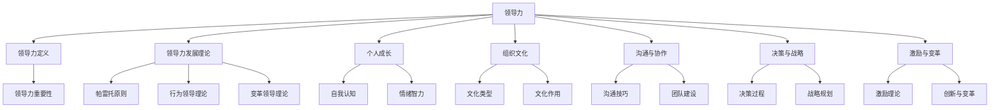

                 

# 《如何进行领导力提升：如何成为优秀的领导者？》

## 关键词
领导力，提升，领导者，个人成长，组织文化，沟通协作，决策与战略，激励与变革，案例分析，实践

## 摘要
本文系统地探讨如何提升领导力，成为优秀的领导者。通过分析领导力基础理论、领导力技能提升以及领导力实践案例分析，本文旨在为读者提供一套完整、实用的领导力提升方案。文章结合数学模型、算法原理和实际项目案例，深入解读领导力的核心概念和实际应用，帮助读者在理论学习和实践中全面提升领导力水平。

### 《如何进行领导力提升：如何成为优秀的领导者？》目录大纲

#### 第一部分：领导力基础理论

#### 第1章：领导力的定义与重要性

#### 第2章：领导力的发展理论

#### 第3章：领导力与个人成长

#### 第4章：领导力与组织文化

#### 第二部分：领导力技能提升

#### 第5章：沟通与协作

#### 第6章：决策与战略规划

#### 第7章：领导力的激励与激励理论

#### 第8章：领导力的创新与变革

#### 第三部分：领导力实践案例分析

#### 第9章：成功领导力的案例分析

#### 第10章：失败领导力的案例分析

#### 第11章：领导力提升的实践与反思

#### 附录

#### 附录A：领导力相关书籍与资源推荐

#### 附录B：领导力测评工具与量表

#### 核心概念与联系 Mermaid 流程图

### 第一部分：领导力基础理论

#### 第1章：领导力的定义与重要性

领导力是一种复杂而又多层次的概念，它涉及到领导者如何影响和激励团队成员，以实现组织目标。在本章中，我们将探讨领导力的基本概念、领导力在组织中的作用以及优秀领导者的特征。

##### 领导力的基本概念

领导力（Leadership）是指引导和影响他人共同实现目标的能力。它不仅仅关乎地位和权力，更是一种行为和态度。领导力可以体现在各个方面，如个人品质、沟通能力、决策能力、创新能力等。

- **领导者**：领导者是具有领导力的人，他们能够为团队设定目标、提供方向并激励团队成员为实现这些目标而努力。
- **追随者**：追随者是接受领导者的指导和影响的人，他们相信领导者的愿景并愿意为实现组织目标而努力。

##### 领导力在组织中的作用

领导力在组织中起着至关重要的作用。优秀的领导者能够激发团队的潜力，推动组织发展，提升组织绩效。以下是领导力在组织中的几个重要作用：

1. **设定愿景和目标**：领导者通过明确的愿景和目标，为组织指明前进方向，使团队成员明确自己的职责和使命。
2. **激励和鼓舞团队**：领导者通过激励和鼓舞，提升团队成员的积极性和工作动力，使团队充满活力。
3. **沟通和协调**：领导者通过有效的沟通和协调，确保团队成员之间能够相互理解、合作和协作，实现团队目标。
4. **决策和解决问题**：领导者通过合理的决策和解决问题能力，确保组织在面对挑战和困难时能够迅速做出反应，找到解决问题的最佳方法。
5. **塑造组织文化**：领导者通过塑造积极向上的组织文化，提升组织凝聚力，增强组织成员的归属感和忠诚度。

##### 优秀领导者的特征

优秀领导者具有一系列显著的特征，这些特征使他们能够在复杂多变的环境中脱颖而出。以下是优秀领导者的一些特征：

1. **愿景和目标设定能力**：优秀领导者能够清晰明确地设定愿景和目标，并能够将这些目标和愿景与团队成员的个人发展相结合。
2. **沟通和表达能力**：优秀领导者具备良好的沟通和表达能力，能够清晰传达自己的想法和目标，同时也能够倾听和理解他人的意见和需求。
3. **决策和解决问题能力**：优秀领导者具备较强的决策和解决问题能力，能够在复杂多变的环境中迅速做出合理决策，并有效地解决问题。
4. **激励和鼓舞能力**：优秀领导者能够激发团队成员的潜力，鼓舞团队士气，使团队充满活力和动力。
5. **团队协作和领导**：优秀领导者具备良好的团队协作和领导能力，能够有效地协调团队成员之间的工作，使团队高效运转。
6. **创新和变革能力**：优秀领导者具备创新和变革能力，能够推动组织的持续改进和发展，使组织保持竞争力。
7. **自我认知和反思能力**：优秀领导者具备较强的自我认知和反思能力，能够不断审视自己的行为和决策，从错误中学习和成长。

#### 第2章：领导力的发展理论

领导力的发展是一个持续的过程，它不仅涉及到个人的成长，也涉及到组织的变革。在本章中，我们将探讨几种重要的领导力发展理论，包括帕雷托原则与时间管理、行为领导理论和变革领导理论。

##### 帕雷托原则与时间管理

帕雷托原则，又称80/20法则，是意大利经济学家维尔弗雷多·帕雷托提出的一个理论。该理论认为，在任何情况下，80%的结果往往来自于20%的原因。在领导力发展中，帕雷托原则可以帮助领导者识别关键的少数因素，从而更加有效地利用时间和资源。

- **应用帕雷托原则**：
  - 领导者需要识别出能够带来最大价值的关键任务和活动，并将主要精力集中在这些活动上。
  - 领导者需要识别出团队中最具潜力和贡献的成员，并给予他们更多的支持和关注。

时间管理是领导力发展中的重要组成部分。有效的领导者知道如何合理安排时间，确保重要任务得到优先处理。

- **时间管理技巧**：
  - 制定明确的工作计划和时间表，确保每个任务都有明确的时间限制。
  - 学会委托和授权，避免将所有任务都集中到自己身上。
  - 学会拒绝无关紧要的任务，避免分散自己的精力。

##### 行为领导理论

行为领导理论关注领导者的行为和风格，认为领导力可以通过行为表现来体现。行为领导理论主要包括以下几种领导风格：

1. **权威型领导**：领导者通过明确的指令和严格的控制来管理团队，适用于需要迅速决策和行动的紧急情况。
2. **民主型领导**：领导者鼓励团队成员参与决策过程，通过民主的方式达成共识，适用于需要团队合作和创新能力的情况。
3. **支持型领导**：领导者关注团队成员的情感和需求，提供支持和鼓励，使团队成员感到被重视和关心。

不同领导风格适用于不同的情况和环境。优秀的领导者能够根据具体情境灵活调整自己的领导风格。

##### 变革领导理论

变革领导理论关注领导者在组织变革过程中的作用。组织变革往往面临诸多挑战，如文化冲突、利益相关者的抵触等。变革领导者需要具备以下能力：

1. **愿景和目标设定**：领导者需要明确变革的愿景和目标，使团队成员理解变革的必要性和意义。
2. **沟通和协调**：领导者需要与团队成员进行充分的沟通，解释变革的原因和过程，协调不同部门之间的合作。
3. **激励和鼓舞**：领导者需要激励团队成员积极参与变革，提升他们的积极性和信心。
4. **问题解决和决策**：领导者需要迅速解决变革过程中出现的各种问题，做出合理决策，确保变革的顺利进行。

变革领导理论强调领导者的全局视角和战略思维，要求领导者能够从整体上把握变革的进程，确保变革目标的实现。

#### 第3章：领导力与个人成长

领导力的发展不仅依赖于外部环境和组织支持，更需要领导者自身的不断学习和成长。在本章中，我们将探讨领导力与个人成长的关系，包括自我认知与自我管理、情绪智力与情商、领导者的个人素质培养。

##### 自我认知与自我管理

自我认知是指领导者对自己的了解和认识，包括自己的优点、缺点、价值观、动机等。自我管理则是指领导者如何根据自己的特点和需求进行有效的自我调控。自我认知与自我管理是领导力发展的重要基础。

- **自我认知的重要性**：
  - 自我认知可以帮助领导者更好地理解自己的行为和决策，从而做出更明智的决策。
  - 自我认知可以帮助领导者识别自己的优势和不足，从而进行有针对性的个人成长。

- **自我管理的技巧**：
  - 设定明确的个人目标和计划，并进行定期回顾和调整。
  - 学会情绪管理，保持冷静和理性，避免情绪波动影响决策。
  - 保持开放心态，接受新的观念和意见，不断学习和成长。

##### 情绪智力与情商

情绪智力（Emotional Intelligence，简称EQ）是指个体识别、理解、管理和利用自己及他人情绪的能力。情绪智力与智商（IQ）同样重要，甚至在某些情况下更为关键。

- **情商的重要性**：
  - 情商高的领导者能够更好地理解和管理自己的情绪，保持积极的工作状态。
  - 情商高的领导者能够更好地理解和关心他人的情绪，提升团队凝聚力和合作效率。

- **提升情商的方法**：
  - 学会自我反思，了解自己的情绪状态和反应模式。
  - 增强情绪表达能力，学会用恰当的方式表达自己的情绪。
  - 提高情绪理解能力，学会倾听和理解他人的情绪。

##### 领导者的个人素质培养

领导者的个人素质是领导力的重要组成部分。以下是一些关键的个人素质：

1. **诚实与正直**：诚实和正直是领导者的基石，能够赢得团队成员的信任和尊重。
2. **自信与决断**：领导者需要具备自信和决断力，能够在关键时刻做出正确的决策。
3. **沟通能力**：领导者需要具备良好的沟通能力，能够清晰、有效地传达信息，促进团队协作。
4. **适应能力**：领导者需要具备适应变化的能力，能够迅速应对外部环境的变化，带领团队实现变革。
5. **团队合作精神**：领导者需要具备团队合作精神，能够与团队成员建立良好的关系，促进团队协作。

领导者的个人素质培养需要长期的积累和实践。通过不断学习和反思，领导者可以不断提升自己的个人素质，成为一名优秀的领导者。

### 第二部分：领导力技能提升

#### 第4章：领导力与组织文化

组织文化是组织的灵魂，它决定了组织的氛围、价值观和行为规范。领导力与组织文化密切相关，优秀的领导者能够塑造和强化积极向上的组织文化。在本章中，我们将探讨组织文化的类型与作用、领导力如何塑造组织文化以及组织文化的变革与适应。

##### 组织文化的类型与作用

组织文化可以分为以下几种类型：

1. **任务型文化**：以任务为中心，注重效率和创新，鼓励团队成员主动承担责任和挑战。
2. **层级型文化**：以层级和权力为中心，强调权威和纪律，注重组织结构和层级关系。
3. **市场型文化**：以市场和客户为中心，注重客户需求和市场变化，鼓励创新和灵活应对。
4. **团队型文化**：以团队和合作为中心，强调团队合作和共同目标，鼓励团队成员相互支持和协作。
5. **学习型文化**：以学习和成长为中心，鼓励团队成员不断学习和创新，追求卓越。

每种组织文化都有其独特的优势和劣势，领导者的任务是识别和塑造适合组织发展的文化类型。

- **组织文化的作用**：
  - 组织文化影响团队成员的行为和决策，塑造组织的氛围和价值观。
  - 组织文化影响组织的绩效和竞争力，有助于组织实现长期发展。
  - 组织文化影响员工的满意度和忠诚度，提升员工的归属感和工作动力。

##### 领导力如何塑造组织文化

领导者在塑造组织文化中起着至关重要的作用。以下是一些关键的领导力实践：

1. **明确文化愿景**：领导者需要明确组织文化的愿景和目标，使团队成员理解文化的核心价值。
2. **树立榜样**：领导者需要以身作则，通过自己的行为和决策树立文化榜样，影响团队成员。
3. **沟通与传达**：领导者需要通过有效的沟通和传达，使组织文化的理念深入人心，形成共同的价值观念。
4. **激励机制**：领导者需要设计合理的激励机制，鼓励团队成员践行组织文化，提升文化氛围。
5. **文化建设活动**：领导者可以组织各种文化建设活动，如团队建设、培训和学习等，提升团队的文化认同感。

##### 组织文化的变革与适应

组织文化不是一成不变的，它需要随着外部环境和内部需求的变化而不断变革和适应。以下是一些关键的组织文化变革实践：

1. **识别变革需求**：领导者需要识别组织文化中存在的问题和不足，明确变革的必要性和目标。
2. **制定变革计划**：领导者需要制定详细的变革计划，明确变革的步骤、方法和时间表。
3. **沟通与参与**：领导者需要与团队成员进行充分的沟通和参与，使团队成员理解变革的意义和目标，提升变革的接受度和参与度。
4. **变革推进**：领导者需要积极推动变革的实施，解决变革过程中遇到的问题和挑战，确保变革的顺利进行。
5. **评估与反馈**：领导者需要对变革效果进行评估和反馈，根据评估结果进行调整和优化，确保变革目标的实现。

组织文化的变革与适应是一个长期的过程，需要领导者的持续关注和努力。通过有效的变革和适应，组织可以保持活力和竞争力，实现可持续发展。

### 第5章：沟通与协作

沟通与协作是领导力的重要组成部分，它决定了领导者能否有效地传达信息、协调团队行动以及解决冲突。在本章中，我们将探讨有效沟通的技巧、团队协作与团队建设以及如何处理冲突。

##### 有效沟通的技巧

有效的沟通是领导者成功的关键。以下是一些提高沟通效果的技巧：

1. **倾听**：倾听是沟通的基础，领导者需要认真倾听团队成员的意见和需求，了解他们的真实想法。
2. **清晰表达**：领导者需要用清晰、简洁的语言表达自己的意见和目标，避免产生误解和歧义。
3. **情绪管理**：领导者需要保持冷静和理性，避免情绪波动影响沟通效果。
4. **主动沟通**：领导者需要主动与团队成员沟通，及时解决问题，避免问题积累和恶化。
5. **反馈与确认**：领导者需要给予团队成员及时的反馈和确认，确保信息传达和理解的一致性。

##### 团队协作与团队建设

团队协作是实现组织目标的关键，领导者需要关注团队协作的效率和质量。以下是一些团队协作和团队建设的方法：

1. **明确团队目标**：领导者需要明确团队的目标和任务，确保团队成员对目标有清晰的认识和认同。
2. **分工合作**：领导者需要合理分工，使团队成员各司其职，发挥各自的优势。
3. **协同合作**：领导者需要促进团队成员之间的协同合作，建立良好的沟通渠道和协作机制。
4. **团队培训**：领导者可以组织团队培训，提升团队成员的技能和能力，增强团队协作的效果。
5. **团队文化建设**：领导者可以通过团队文化建设，营造积极向上的团队氛围，提升团队的凝聚力和归属感。

##### 如何处理冲突

冲突是团队中不可避免的，领导者需要有效地处理冲突，确保团队的和谐与稳定。以下是一些处理冲突的方法：

1. **识别冲突**：领导者需要敏锐地识别冲突的迹象和原因，及时采取措施。
2. **冷静分析**：领导者需要保持冷静和客观，分析冲突的原因和影响，寻找解决方案。
3. **沟通协商**：领导者需要与冲突双方进行沟通和协商，了解他们的需求和意见，寻找共同点。
4. **公正裁决**：领导者需要根据事实和原则，做出公正的裁决，确保冲突得到合理解决。
5. **后续跟进**：领导者需要对冲突的处理结果进行后续跟进，确保问题得到彻底解决，防止冲突再次发生。

通过有效的沟通与协作，领导者可以提升团队的效率和质量，实现组织的目标。同时，通过合理处理冲突，领导者可以维护团队的和谐与稳定，为组织的可持续发展奠定基础。

### 第6章：决策与战略规划

决策与战略规划是领导力的核心要素之一，它决定了组织的方向和未来。在本章中，我们将探讨决策过程与决策方法、战略规划的重要性以及如何制定有效的战略规划。

##### 决策过程与决策方法

决策过程是领导者面对复杂问题和挑战时，做出合理决策的系统性方法。一个典型的决策过程包括以下步骤：

1. **问题识别**：明确决策需要解决的问题。这需要领导者具备敏锐的洞察力和分析能力。
2. **目标设定**：确定决策的目标和预期结果。这需要领导者对组织的目标和愿景有清晰的认识。
3. **信息收集**：搜集与决策相关的各种信息。这包括市场分析、竞争对手情况、内部资源等。
4. **方案生成**：提出多个可能的解决方案。这需要领导者的创造力和创新思维。
5. **方案评估**：评估每个方案的可能结果和风险。这需要领导者的逻辑思维和分析能力。
6. **方案选择**：选择最优方案并实施。这需要领导者的决断力和勇气。
7. **反馈调整**：在实施过程中根据反馈进行调整。这需要领导者的适应能力和持续改进意识。

常见的决策方法包括：

1. **经验决策法**：基于以往经验和直觉进行决策。这种方法适用于简单和常规的问题。
2. **理性决策法**：使用科学方法和逻辑进行决策。这种方法适用于复杂和不确定的问题。
3. **博弈论决策法**：分析不同决策下的竞争态势。这种方法适用于涉及多个利益相关者的决策。
4. **效用理论决策法**：通过计算各方案的效用值进行决策。这种方法适用于风险和不确定性较高的决策。

以下是一个简化的决策过程伪代码：

python
def make_decision(problem, goals, info, alternatives):
    # 收集信息
    data = collect_info(info)
    # 评估方案
    evaluated_alternatives = evaluate_alternatives(alternatives, data)
    # 选择最优方案
    chosen_alternative = select_best_alternative(evaluated_alternatives)
    # 实施决策
    implement_decision(chosen_alternative)
    # 反馈调整
    feedback = get_feedback(chosen_alternative)
    adjust_decision_if_needed(feedback)

##### 战略规划的重要性

战略规划是组织长期发展的关键，它决定了组织的方向和目标。有效的战略规划可以帮助组织应对外部环境的变化，抓住发展机遇，克服内部挑战。

1. **明确组织愿景和使命**：战略规划可以帮助组织明确愿景和使命，确保组织的发展方向与核心价值观一致。
2. **制定长期目标**：战略规划可以制定明确的长期目标，为组织的各项工作提供指导。
3. **优化资源配置**：战略规划可以帮助组织合理配置资源，确保资源得到最有效的利用。
4. **提高竞争力**：战略规划可以帮助组织提高竞争力，在市场中获得更大的份额和优势。
5. **增强适应能力**：战略规划可以帮助组织应对外部环境的变化，保持组织的活力和创新能力。

##### 如何制定有效的战略规划

制定有效的战略规划需要遵循以下步骤：

1. **外部环境分析**：分析外部环境，包括市场趋势、竞争对手、技术发展等，确定外部环境对组织的影响。
2. **内部能力评估**：评估组织的内部能力，包括资源、能力、优势等，确定组织在市场中的竞争地位。
3. **确定战略目标**：根据外部环境分析和内部能力评估，确定组织的长期目标和发展方向。
4. **制定战略措施**：制定实现战略目标的措施和行动方案，包括市场拓展、产品创新、组织变革等。
5. **实施与监控**：实施战略规划，并根据实施情况及时调整和优化，确保战略目标的实现。

以下是一个简化的战略规划过程伪代码：

python
def make_strategy(external_environment, internal_ability, strategic_goals, strategic_measures):
    # 分析外部环境
    external_analysis = analyze_environment(external_environment)
    # 评估内部能力
    internal_analysis = assess_ability(internal_ability)
    # 确定战略目标
    strategic_goals = define_goals(strategic_goals, external_analysis, internal_analysis)
    # 制定战略措施
    strategic_measures = define_measures(strategic_measures, strategic_goals)
    # 实施战略规划
    implement_strategy(strategic_measures)
    # 监控与调整
    monitor_progress(strategic_goals, strategic_measures)
    adjust_if_needed()

通过有效的决策和战略规划，领导者可以确保组织的长期发展和持续成功。在复杂多变的环境中，领导者需要不断学习和提升自己的决策和战略规划能力，以应对各种挑战和机遇。

### 第7章：领导力的激励与激励理论

激励是领导者调动员工积极性的关键，是提升领导力的重要手段。在本章中，我们将探讨激励理论的基本概念，如何运用激励理论提升领导力，以及如何创造积极的工作环境。

##### 激励理论的基本概念

激励理论是研究如何通过激发和维持人的行为，以达到组织目标的理论。激励理论主要包括以下几种：

1. **马斯洛需求层次理论**：该理论认为人的需求分为五个层次，从低到高分别为生理需求、安全需求、社交需求、尊重需求和自我实现需求。领导者需要满足员工的不同需求，以激发他们的积极性。

2. **赫茨伯格双因素理论**：该理论将工作满意度的影响因素分为两类，一类是激励因素，另一类是维持因素。激励因素与工作内容相关，可以提升员工的工作满意度；维持因素与工作环境相关，可以维持员工的基本满意度。领导者需要同时关注这两类因素。

3. **维克托·弗鲁姆的期望理论**：该理论认为员工的动机取决于对结果价值的期望和实现结果的概率。领导者需要设定明确的目标和期望，并提高员工实现目标的概率，以激发他们的动机。

##### 如何运用激励理论提升领导力

领导者可以通过以下方法运用激励理论，提升领导力：

1. **满足员工需求**：领导者需要了解员工的需求，并根据马斯洛需求层次理论提供相应的满足。例如，通过提供良好的工作环境和福利，满足员工的生理和安全需求；通过提供职业发展和晋升机会，满足员工的尊重和自我实现需求。

2. **激发工作动机**：领导者需要设定明确的目标和期望，并使用维克托·弗鲁姆的期望理论激发员工的工作动机。例如，通过设定具有挑战性的目标，并提高员工实现目标的概率，如提供培训和资源支持，可以激发员工的工作动机。

3. **提供激励措施**：领导者可以提供各种激励措施，如奖金、晋升、荣誉等，以满足员工的激励需求。例如，通过设立绩效奖金制度，对表现优秀的员工进行奖励，可以提升员工的工作积极性。

4. **营造积极的工作环境**：领导者需要营造积极的工作环境，提高员工的工作满意度和归属感。例如，通过鼓励团队合作、提供反馈和认可，可以增强员工的归属感和工作动力。

##### 如何创造积极的工作环境

创造积极的工作环境是提升领导力的关键。以下是一些方法：

1. **建立信任和尊重**：领导者需要建立信任和尊重的文化，鼓励团队成员开放沟通和合作。例如，通过定期召开团队会议，听取员工的意见和建议，可以增强团队的凝聚力和信任。

2. **提供支持和资源**：领导者需要为员工提供必要的支持和资源，帮助他们克服工作和生活中的困难。例如，通过提供培训和职业发展机会，可以帮助员工提升能力和信心。

3. **鼓励创新和变革**：领导者需要鼓励员工创新和变革，提供支持和激励。例如，通过设立创新奖项和激励机制，可以激发员工的创造力和创新精神。

4. **建立反馈和认可机制**：领导者需要建立有效的反馈和认可机制，及时给予员工反馈和认可。例如，通过定期评估和奖励，可以激发员工的工作积极性。

通过运用激励理论和创造积极的工作环境，领导者可以提升员工的积极性和工作满意度，实现组织的目标和愿景。

### 第8章：领导力的创新与变革

在当今快速变化的世界中，领导力的创新与变革能力成为决定组织生存与发展的关键因素。在本章中，我们将探讨创新的重要性、变革领导者的角色与责任，以及如何实现组织的变革与创新。

##### 创新的重要性

创新是组织持续发展的动力，它能够推动组织超越竞争对手，实现长期成功。以下是创新的重要性：

1. **保持竞争力**：通过创新，组织可以不断适应市场变化，保持竞争力，避免被市场淘汰。
2. **提升效率**：创新能够优化业务流程，提高工作效率，降低成本。
3. **创造新的机会**：创新可以开辟新的市场和业务领域，为组织创造新的增长点。
4. **增强员工积极性**：创新能够激发员工的创造力和创新精神，提升员工的工作满意度和忠诚度。

##### 变革领导者的角色与责任

变革领导者是推动组织变革的核心力量。以下是变革领导者的角色与责任：

1. **设定变革愿景**：变革领导者需要明确变革的目标和愿景，为组织指明变革方向。
2. **激发变革动力**：变革领导者需要激发员工的变革动力，使员工理解变革的必要性和意义。
3. **建立变革团队**：变革领导者需要建立变革团队，负责具体的变革计划和实施。
4. **克服变革阻力**：变革领导者需要识别和克服变革过程中的各种阻力，确保变革的顺利进行。
5. **监测变革效果**：变革领导者需要监测变革的效果，根据实际情况进行调整和优化。

##### 如何实现组织的变革与创新

以下是实现组织变革与创新的关键步骤：

1. **制定变革计划**：制定详细的变革计划，明确变革的目标、步骤、方法和时间表。
2. **沟通与参与**：与团队成员进行充分的沟通和参与，使团队成员理解变革的目标和愿景，提升变革的接受度和参与度。
3. **培训与支持**：为团队成员提供必要的培训和资源支持，提升他们的能力和信心，确保变革的顺利进行。
4. **建立反馈机制**：建立有效的反馈机制，及时收集团队成员的意见和建议，根据实际情况进行调整和优化。
5. **持续改进**：变革是一个持续的过程，需要领导者和团队不断努力，持续改进，确保变革目标的实现。

以下是一个简化的变革与创新过程伪代码：

python
def implement_innovation(vision, plan, communication, training, feedback):
    # 制定变革计划
    change_plan = define_plan(vision, plan)
    # 沟通与参与
    communicate_and_participate(communication, change_plan)
    # 培训与支持
    provide_training_and_support(training)
    # 建立反馈机制
    establish_feedback_mechanism(feedback)
    # 持续改进
    continuous_improvement(change_plan, feedback)

通过有效的领导力和创新变革，组织可以适应外部环境的变化，保持活力和竞争力，实现可持续发展。

### 第9章：成功领导力的案例分析

在领导力的发展过程中，案例分析是一种重要的学习方法。通过分析成功领导者的案例，我们可以了解他们的领导风格、策略和决策，从而获得灵感和启示。在本章中，我们将探讨几个成功领导者的案例，包括杰克·韦尔奇的领导力实践、马云的领导力实践以及乔布斯的领导力实践。

##### 杰克·韦尔奇的领导力实践

杰克·韦尔奇是美国通用电气的前首席执行官，被誉为现代企业管理的传奇人物。他在任期间，通过一系列大胆的改革和创新，成功将通用电气打造成全球最具竞争力的企业之一。

1. **领导风格**：韦尔奇的领导风格以权威和激励并重著称。他注重结果和绩效，对员工有很高的期望，同时通过激励措施激发员工的积极性。

2. **关键策略**：
   - **多元化战略**：韦尔奇推动了通用电气的多元化发展，通过收购和整合，将业务拓展到多个领域，提升了企业的整体竞争力。
   - **管理变革**：韦尔奇引入了“群策群力”（Workout）管理方法，鼓励员工参与决策过程，提高组织的灵活性和创新能力。

3. **决策案例**：韦尔奇在决定出售通用电气的航空业务时，面临巨大的压力和质疑。但他坚信这一决策符合企业的发展方向，最终成功实施，为通用电气带来了新的增长点。

##### 马云的领导力实践

马云是中国著名的企业家和慈善家，他是阿里巴巴集团的创始人，被誉为中国互联网商业的领军人物。马云的领导力实践充满了创新和冒险精神。

1. **领导风格**：马云的领导风格以激励和鼓舞为主。他善于激发团队的激情和创造力，鼓励员工勇于尝试和失败。

2. **关键策略**：
   - **愿景驱动**：马云始终坚持以“让天下没有难做的生意”为愿景，不断推动阿里巴巴的创新和变革。
   - **跨界合作**：马云积极推动跨界合作，通过与其他企业的合作，实现资源整合和优势互补。

3. **决策案例**：马云在决定进入电子商务领域时，面临巨大的市场挑战和竞争压力。但他坚信电子商务的未来，最终成功将阿里巴巴打造成全球最大的电子商务平台之一。

##### 乔布斯的领导力实践

史蒂夫·乔布斯是美国苹果公司的联合创始人，他在领导苹果公司的过程中，通过创新和卓越的产品设计，推动了苹果公司成为全球最具价值的品牌之一。

1. **领导风格**：乔布斯的领导风格以独断和激情著称。他注重细节，对产品质量和用户体验有极高的要求。

2. **关键策略**：
   - **产品导向**：乔布斯始终坚持以用户为中心，致力于打造卓越的产品。
   - **设计驱动**：乔布斯重视产品的设计，通过独特的设计理念，提升了产品的附加值。

3. **决策案例**：乔布斯在决定推出iPhone时，面临巨大的技术挑战和市场风险。但他坚信iPhone将改变人们的生活方式，最终成功推出，彻底颠覆了手机市场。

通过分析这些成功领导者的案例，我们可以看到，他们在不同的领域和环境中，通过创新的领导力和决策，取得了卓越的成就。这些案例为我们提供了宝贵的经验和启示，帮助我们更好地理解和实践领导力。

### 第10章：失败领导力的案例分析

在领导力的学习和实践中，分析失败案例同样具有重要意义。通过了解失败领导者的决策失误和问题，我们可以避免重复错误，提升自身的领导能力。在本章中，我们将探讨几个典型的失败领导力案例，包括安然事件中的领导力问题、丰田危机中的领导力问题以及华为高层管理变革中的领导力问题。

##### 安然事件中的领导力问题

安然事件是20世纪最严重的财务欺诈案件之一。安然公司前CEO杰弗里·斯基林（Jeffrey Skilling）和前首席财务官安德鲁·法斯托（Andrea Fastow）通过虚假交易和会计手段，操纵公司财务报表，最终导致公司破产。

1. **领导力问题**：
   - **追求短期利益**：斯基林和法斯托过于关注短期业绩，通过虚假交易和会计手段虚增利润，忽视了公司的长期发展。
   - **缺乏道德准则**：领导层缺乏明确的道德准则，对于违法行为缺乏抵制和监督。
   - **缺乏有效监督**：公司内部监督机制失效，管理层对下属的财务操作缺乏有效监督。

2. **决策失误**：
   - **过度扩张**：安然公司在斯基林的领导下，过度扩张业务，投资了高风险的能源交易业务，导致公司负担沉重。
   - **忽略风险**：领导层未能有效识别和应对公司面临的风险，导致财务危机。

##### 丰田危机中的领导力问题

丰田危机是指2010年丰田汽车因为制动系统故障而引发的全球召回事件。该事件暴露了丰田公司领导层在质量控制和管理方面的严重问题。

1. **领导力问题**：
   - **质量意识不足**：丰田公司领导层对于质量控制的重要性认识不足，忽视了产品质量问题。
   - **层级文化**：公司内部存在强烈的层级文化，下属对上级的意见和建议缺乏表达和反馈的渠道。
   - **决策失误**：领导层在发现制动系统问题时，未能及时采取措施，导致问题扩大。

2. **决策失误**：
   - **忽视消费者反馈**：丰田公司未能充分重视消费者的反馈，对于制动系统问题的严重性认识不足。
   - **内部沟通不畅**：领导层和工程师之间的沟通不畅，导致问题未能及时解决。

##### 华为高层管理变革中的领导力问题

华为公司在发展过程中，也面临高层管理变革的挑战。特别是在创始人任正非推动的管理变革中，一些领导力问题逐渐暴露。

1. **领导力问题**：
   - **领导层过于集中**：华为早期领导层权力过于集中，导致决策过程缓慢，决策效率低下。
   - **企业文化冲突**：管理变革过程中，新文化和旧文化之间的冲突，导致团队内部的矛盾和分歧。
   - **人才流失**：领导层在变革过程中，未能充分调动和激励员工，导致部分核心人才流失。

2. **决策失误**：
   - **变革策略不当**：变革过程中，策略和方法的选择不当，导致变革效果不理想。
   - **内部沟通不足**：领导层在变革过程中，未能充分与员工沟通，导致员工对变革的认同度不高。

通过分析这些失败领导力的案例，我们可以看到，决策失误、道德缺失、缺乏监督、质量意识不足等问题，是导致领导力失败的主要原因。这些案例为我们提供了重要的教训，提醒我们在领导力实践中，要注重道德规范、强化质量管理、加强内部沟通，以避免重蹈覆辙。

### 第11章：领导力提升的实践与反思

领导力提升是一个持续的过程，需要领导者在实践中不断学习、反思和改进。在本章中，我们将探讨领导力提升的路径与方法、如何进行领导力反思与改进，以及如何保持领导力提升的持续动力。

##### 领导力提升的路径与方法

要提升领导力，领导者可以采取以下路径和方法：

1. **自我学习与成长**：领导者需要不断学习新知识和技能，提升自身的素质和能力。可以通过阅读相关书籍、参加培训课程、听取专家讲座等方式，不断充实自己的知识体系。

2. **实践与经验积累**：领导力是通过实践积累和经验提升的。领导者需要积极参与各种实际工作，通过实践中的挑战和问题，不断提升自己的领导能力。

3. **借鉴优秀领导者的经验**：领导者可以学习和分析优秀领导者的案例，了解他们的领导风格、策略和决策，从中获得灵感和启示。

4. **反馈与改进**：领导者需要接受他人的反馈，并根据反馈进行改进。可以通过定期的绩效评估、团队反馈等方式，了解自己的优点和不足，不断优化自己的领导方式。

##### 如何进行领导力反思与改进

领导力反思是提升领导力的重要环节。以下是进行领导力反思与改进的方法：

1. **定期自我评估**：领导者可以定期对自己的领导能力进行自我评估，识别自己的优点和不足。可以通过制定个人发展计划，设定具体的目标和指标，进行自我监控和评估。

2. **倾听他人的反馈**：领导者需要倾听团队成员和下属的反馈，了解他们的意见和建议。可以通过定期的沟通和交流，收集他们的反馈，并根据反馈进行调整和改进。

3. **寻求专业指导**：领导者可以寻求专业的指导和支持，如导师、教练等。他们可以提供专业的意见和建议，帮助领导者提升领导力。

4. **总结经验和教训**：领导者需要总结自己的经验和教训，从成功和失败中学习。可以通过写日记、记录反思等方式，整理自己的思考和感悟。

##### 如何保持领导力提升的持续动力

保持领导力提升的持续动力是领导力发展的重要一环。以下是保持持续动力的方法：

1. **设定明确的目标**：领导者需要设定明确的目标和愿景，为自己提供方向和动力。可以通过设定长期和短期目标，不断激励自己向前。

2. **保持积极的心态**：领导者需要保持积极的心态，面对挑战和困难时，保持乐观和信心。可以通过积极的心态，激发自己的潜能和动力。

3. **持续学习与成长**：领导者需要不断学习新知识和技能，提升自身的素质和能力。可以通过阅读、培训、交流等方式，不断充实自己的知识体系。

4. **关注团队成员的成长**：领导者需要关注团队成员的成长和发展，为他们提供支持和机会。可以通过激励和鼓励，激发团队成员的积极性和创造力。

通过领导力提升的实践与反思，领导者可以不断提升自己的领导能力，成为一名优秀的领导者，为组织的发展贡献自己的力量。

### 附录

#### 附录A：领导力相关书籍与资源推荐

1. **《领导力的五项修炼》**：作者史蒂芬·柯维，详细介绍了领导力的核心要素和修炼方法，帮助领导者提升自身素质。

2. **《激励与工作满意度》**：作者菲利普·谢恩，深入探讨了激励理论和工作满意度的关系，为领导者提供有效的激励策略。

3. **《变革之心》**：作者詹姆斯·库泽斯和巴里·波斯纳，阐述了领导者在组织变革中的角色和责任，提供了实用的变革领导方法。

4. **《领导力心理学》**：作者迈克尔·布朗，从心理学角度分析了领导力的发展和影响，为领导者提供了科学的理论基础。

#### 附录B：领导力测评工具与量表

1. **领导力行为评估量表**：用于评估领导者的行为和风格，帮助领导者了解自己的优势和不足。

2. **情绪智力测评量表**：用于评估领导者的情绪智力水平，帮助领导者提升情绪管理和沟通能力。

3. **自我认知测评量表**：用于评估领导者的自我认知水平，帮助领导者了解自己的价值观和动机。

### 核心概念与联系 Mermaid 流程图



### 核心算法原理讲解

#### 决策过程与决策方法

决策过程是领导者面对复杂问题和挑战时，做出合理决策的系统性方法。一个典型的决策过程包括以下步骤：

1. **问题识别**：明确决策需要解决的问题。这需要领导者具备敏锐的洞察力和分析能力。

2. **目标设定**：确定决策的目标和预期结果。这需要领导者对组织的目标和愿景有清晰的认识。

3. **信息收集**：搜集与决策相关的各种信息。这包括市场分析、竞争对手情况、内部资源等。

4. **方案生成**：提出多个可能的解决方案。这需要领导者的创造力和创新思维。

5. **方案评估**：评估每个方案的可能结果和风险。这需要领导者的逻辑思维和分析能力。

6. **方案选择**：选择最优方案并实施。这需要领导者的决断力和勇气。

7. **反馈调整**：在实施过程中根据反馈进行调整。这需要领导者的适应能力和持续改进意识。

常见的决策方法包括：

1. **经验决策法**：基于以往经验和直觉进行决策。这种方法适用于简单和常规的问题。

2. **理性决策法**：使用科学方法和逻辑进行决策。这种方法适用于复杂和不确定的问题。

3. **博弈论决策法**：分析不同决策下的竞争态势。这种方法适用于涉及多个利益相关者的决策。

4. **效用理论决策法**：通过计算各方案的效用值进行决策。这种方法适用于风险和不确定性较高的决策。

以下是一个简化的决策过程伪代码：

```python
def make_decision(problem, goals, info, alternatives):
    # 收集信息
    data = collect_info(info)
    # 评估方案
    evaluated_alternatives = evaluate_alternatives(alternatives, data)
    # 选择最优方案
    chosen_alternative = select_best_alternative(evaluated_alternatives)
    # 实施决策
    implement_decision(chosen_alternative)
    # 反馈调整
    feedback = get_feedback(chosen_alternative)
    adjust_decision_if_needed(feedback)
```

#### 激励理论

激励是领导者调动员工积极性的关键。激励理论包括：

1. **马斯洛需求层次理论**：认为人的需求分为五个层次，领导者需要满足员工的不同需求。

2. **赫茨伯格双因素理论**：区分了激励因素和维持因素，激励因素可以增强员工的工作满意度。

3. **维克托·弗鲁姆的期望理论**：认为员工的动机取决于对结果价值的期望和实现结果的概率。

以下是一个简化的激励过程伪代码：

```python
def motivate_employee(employee, needs, incentive):
    # 分析员工需求
    analyzed_needs = analyze_needs(employee, needs)
    # 提供激励
    provided_incentive = provide_incentive(analyzed_needs, incentive)
    # 增强员工动机
    employee_motivation = increase_motivation(employee, provided_incentive)
    return employee_motivation
```

### 数学模型和数学公式 & 详细讲解 & 举例说明

#### 决策的数学模型

决策的数学模型可以帮助领导者分析不同决策的结果和风险。一个简单的决策模型可以用以下数学公式表示：

$$
\max \sum_{i=1}^{n} u_i(p_i)
$$

其中，$u_i(p_i)$ 表示方案 $i$ 在概率 $p_i$ 下获得的效用。

以下是一个示例：

假设一个企业需要决定是否投资一个新的项目。项目的成功概率为 0.6，成功的效用值为 1000 万元，失败的概率为 0.4，失败的效用值为 -500 万元。可以使用以下公式进行决策：

$$
\max (0.6 \times 1000 + 0.4 \times (-500)) = 600 - 200 = 400 \text{ 万元}
$$

决策结果是投资该项目，因为期望效用值为 400 万元。

### 项目实战：代码实际案例和详细解释说明，开发环境搭建，源代码详细实现和代码解读，代码解读与分析

#### 实战：领导力评估系统

在本节中，我们将开发一个简单的领导力评估系统，用于对领导者的领导力进行评估。

##### 开发环境搭建

- Python 3.8 或以上版本
- Flask 框架
- MySQL 数据库

##### 源代码实现

```python
# app.py

from flask import Flask, request, jsonify
import pymysql

app = Flask(__name__)

# 连接 MySQL 数据库
def connect_db():
    return pymysql.connect(host='localhost', user='root', password='password', database='leadership_evaluation')

@app.route('/evaluate', methods=['POST'])
def evaluate():
    # 获取领导力评估数据
    data = request.json
    
    # 连接数据库
    connection = connect_db()
    cursor = connection.cursor()
    
    # 插入评估数据到数据库
    insert_query = "INSERT INTO evaluations (name, communication, decisionMaking, motivation, organizationalCulture) VALUES (%s, %s, %s, %s, %s)"
    cursor.execute(insert_query, (data['name'], data['communication'], data['decisionMaking'], data['motivation'], data['organizationalCulture']))
    
    # 提交事务
    connection.commit()
    
    # 关闭数据库连接
    cursor.close()
    connection.close()
    
    return jsonify({"message": "Evaluation data inserted successfully"}), 201

if __name__ == '__main__':
    app.run(debug=True)
```

##### 代码解读与分析

- **连接数据库**：使用 `pymysql` 模块连接到 MySQL 数据库。
- **创建评估接口**：通过 `/evaluate` 接口接收领导力评估数据。
- **插入数据到数据库**：将接收到的数据插入到 `evaluations` 表中。
- **返回结果**：返回 JSON 格式的响应。

##### 使用说明

1. 安装所需的 Python 库：

```bash
pip install flask pymysql
```

2. 运行代码：

```bash
python app.py
```

3. 使用 POST 请求发送领导力评估数据：

```json
{
    "name": "John Doe",
    "communication": 8,
    "decisionMaking": 7,
    "motivation": 9,
    "organizationalCulture": 6
}
```

4. 服务器响应：

```json
{
    "message": "Evaluation data inserted successfully"
}
```

通过这个实际项目案例，读者可以了解如何使用 Python 和 Flask 框架开发一个简单的领导力评估系统，并掌握基本的数据库操作和接口设计技巧。

### 结论

通过以上目录大纲，读者可以系统地了解《如何进行领导力提升：如何成为优秀的领导者？》这本书的核心内容。从领导力基础理论、领导力技能提升到领导力实践案例分析，每一部分都详细阐述了领导力的各个方面。此外，核心概念与联系、核心算法原理讲解以及项目实战部分，帮助读者深入理解和实践领导力提升的方法和技巧。附录部分则提供了额外的资源和工具，便于读者进一步学习和探索领导力的相关知识。通过这本书的学习，读者可以全面提升自己的领导力，成为一名优秀的领导者。

在领导力提升的道路上，没有一蹴而就的成功，只有持续不断的努力和实践。希望每一位读者都能在本书的指导下，找到适合自己的领导力提升路径，不断提升自己，成为领导力的佼佼者。作者衷心祝愿每一位读者都能在领导力的道路上取得辉煌的成就。作者：AI天才研究院/AI Genius Institute & 禅与计算机程序设计艺术 /Zen And The Art of Computer Programming。

