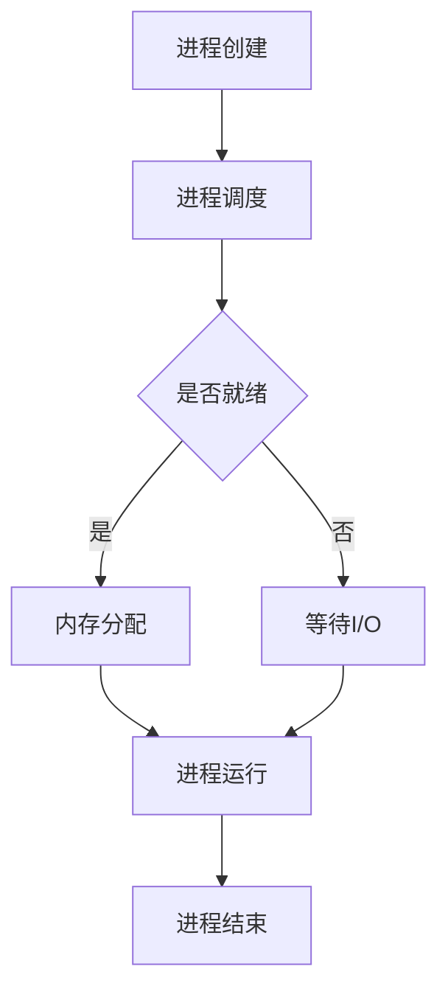
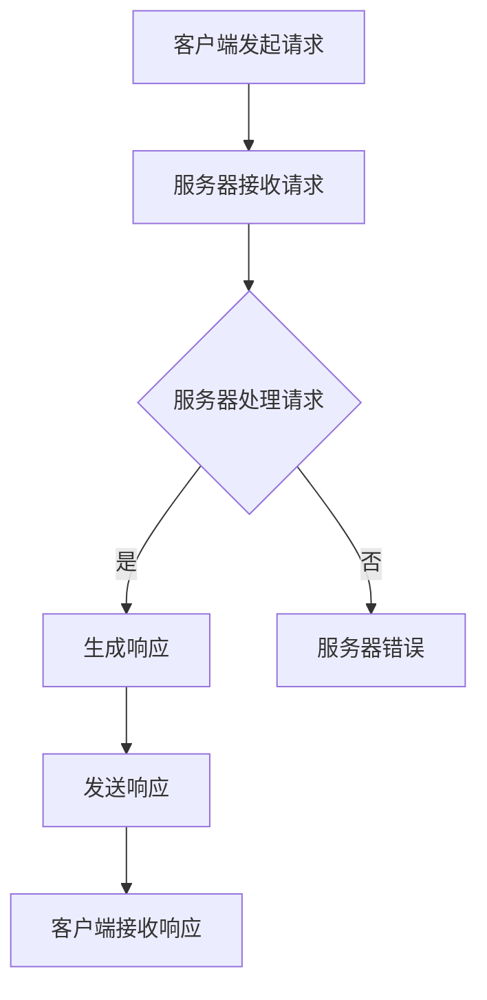
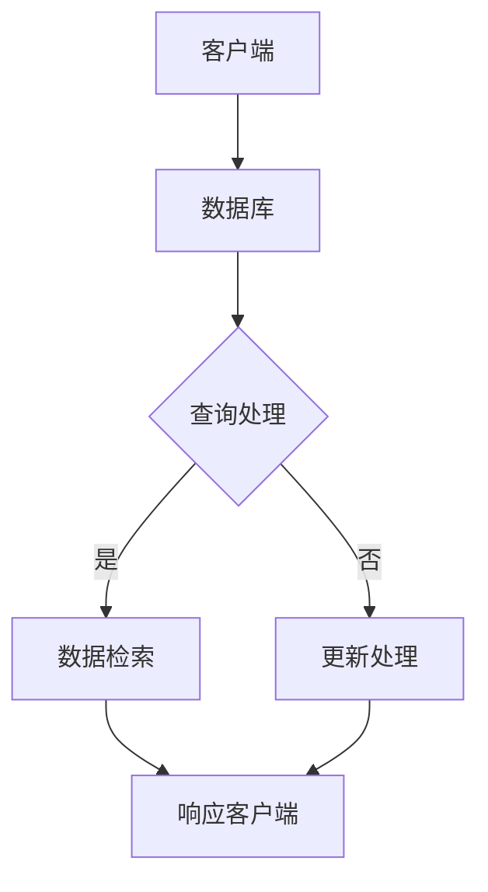
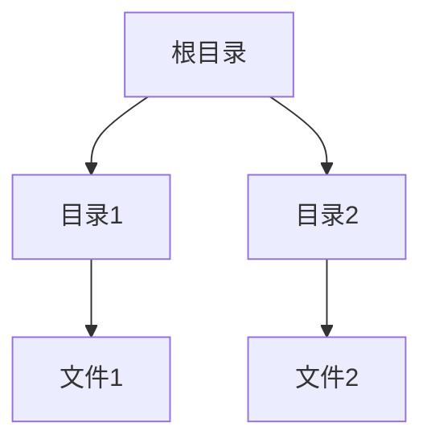
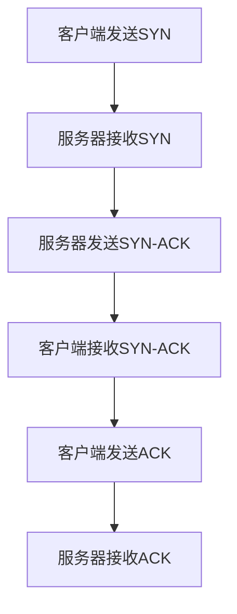
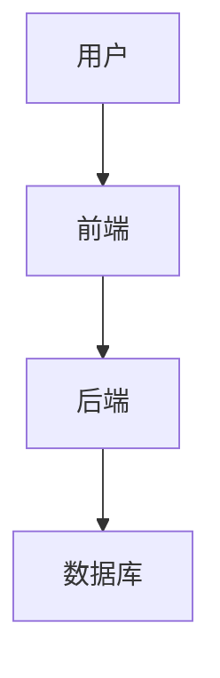

                 

# 2024字节跳动校招：技术用户数字化转型专家面试题解析

## 关键词
- 字节跳动校招
- 技术用户数字化转型
- 面试题解析
- 计算机基础知识
- 编程语言基础
- 数据库基础知识
- 操作系统
- 计算机网络

## 摘要
本文旨在为准备2024字节跳动校招的技术用户数字化转型专家职位考生提供全面的面试题解析。文章分为两个主要部分：基础知识和实战案例。基础知识部分涵盖计算机基础知识、编程语言基础和数据库基础知识；实战案例部分则深入分析操作系统、计算机网络、编程语言和数据库的面试题。通过本文，考生将能够掌握面试所需的重点知识和解题技巧，为顺利通过字节跳动校招面试做好准备。

## 目录大纲

### 第一部分：技术面试基础

#### 第1章：计算机基础知识

##### 1.1 数据结构与算法概述

- 算法复杂度分析
- 数据结构概述：数组、链表、栈、队列、树、图

##### 1.2 计算机组成原理

- 计算机硬件概述
- 计算机软件概述
- 操作系统基础

##### 1.3 网络基础

- TCP/IP 协议
- DNS 工作原理
- HTTP/HTTPS 协议

#### 第2章：编程语言基础

##### 2.1 Python 编程基础

- Python 语法基础
- 函数与模块
- 面向对象编程

##### 2.2 Java 编程基础

- Java 语法基础
- 面向对象编程
- 异常处理

##### 2.3 C++ 编程基础

- C++ 语法基础
- 面向对象编程
- STL 库

#### 第3章：数据库基础知识

##### 3.1 数据库概述

- 数据库基本概念
- 数据库架构

##### 3.2 SQL 语言基础

- SQL 基础语法
- DDL 与 DML 操作
- 数据库索引与优化

##### 3.3 NoSQL 数据库基础

- NoSQL 概述
- Redis 数据库
- MongoDB 数据库

### 第二部分：技术面试实战

#### 第4章：操作系统面试题解析

##### 4.1 进程与线程

- 进程与线程概念
- 进程调度算法
- 线程同步与通信

##### 4.2 内存管理

- 内存分配与释放
- 页面替换算法
- 内存泄漏与溢出

##### 4.3 文件系统

- 文件系统概述
- 文件存储与索引
- 文件权限与共享

#### 第5章：计算机网络面试题解析

##### 5.1 TCP/IP 协议

- TCP 协议工作原理
- IP 协议工作原理
- UDP 协议工作原理

##### 5.2 网络安全

- 加密与解密算法
- 常见网络安全攻击与防御

##### 5.3 Web 应用架构

- Web 应用程序工作原理
- Web 服务器配置与优化

#### 第6章：编程语言面试题解析

##### 6.1 Python 面试题解析

- Python 性能优化技巧
- Python 多线程与多进程
- Python 面向对象编程深入

##### 6.2 Java 面试题解析

- Java 内存模型
- Java 多线程编程
- Java 集合框架

##### 6.3 C++ 面试题解析

- C++ 模板编程
- C++ 预处理器
- C++ 内存管理

#### 第7章：数据库面试题解析

##### 7.1 SQL 面试题解析

- SQL 查询优化
- SQL 事务处理
- SQL 视图与索引

##### 7.2 NoSQL 面试题解析

- Redis 应用场景
- MongoDB 查询与聚合
- MongoDB 分片与复制

#### 第8章：项目实战与案例分析

##### 8.1 项目实战

- Web 应用程序开发
- 移动应用程序开发
- 大数据平台建设

##### 8.2 案例分析

- 技术选型分析
- 架构优化分析
- 性能调优分析

##### 8.3 实战总结

- 面试技巧与经验分享
- 个人成长与职业规划

### 附录

#### 附录 A：参考资源与工具

##### A.1 学习资源

- 在线课程
- 技术博客
- 论坛社区

##### A.2 开发工具

- 编程语言开发工具
- 数据库管理工具
- 版本控制系统

##### A.3 面试题库

- 常见面试题分类
- 面试题解答与解析
- 面试题实战演练

以上是《2024字节跳动校招：技术用户数字化转型专家面试题解析》的目录大纲。目录涵盖了计算机基础知识、编程语言基础、数据库基础知识、操作系统、计算机网络、编程语言面试题解析、数据库面试题解析以及项目实战与案例分析等核心内容。每一章节都进行了详细划分，以确保读者能够全面、深入地掌握面试所需的知识和技能。附录部分则提供了丰富的学习资源和开发工具，以帮助读者在面试前进行充分准备。

## 第一部分：技术面试基础

### 第1章：计算机基础知识

#### 1.1 数据结构与算法概述

算法是计算机科学的核心，数据结构则是实现算法的基础。理解算法和数据结构对于通过技术面试至关重要。以下是对算法复杂度分析、数据结构概述的深入探讨。

##### 算法复杂度分析

算法复杂度分析是评估算法效率的重要方法。通常，算法复杂度分为时间复杂度和空间复杂度。

- **时间复杂度**：表示算法执行时间与数据规模之间的关系，常用大O表示法（\(O(n)\), \(O(n^2)\)等）。
- **空间复杂度**：表示算法执行过程中所需内存空间与数据规模之间的关系。

以下是一个简单的线性搜索算法的时间复杂度分析：

```python
def linear_search(arr, target):
    for i in range(len(arr)):
        if arr[i] == target:
            return i
    return -1
```

该算法的时间复杂度为\(O(n)\)，其中\(n\)为数组长度。

##### 数据结构概述

数据结构是组织和管理数据的方式。常见的数据结构包括：

- **数组（Array）**：一种固定大小的线性表，元素可以通过索引快速访问。
- **链表（Linked List）**：由节点组成的线性结构，每个节点包含数据和指向下一个节点的指针。
- **栈（Stack）**：后进先出（LIFO）的数据结构，常见操作包括入栈、出栈、栈顶元素访问。
- **队列（Queue）**：先进先出（FIFO）的数据结构，常见操作包括入队、出队、队首元素访问。

以下是一个简单的链表实现的伪代码：

```python
class Node:
    def __init__(self, data):
        self.data = data
        self.next = None

class LinkedList:
    def __init__(self):
        self.head = None

    def append(self, data):
        new_node = Node(data)
        if not self.head:
            self.head = new_node
            return
        last = self.head
        while last.next:
            last = last.next
        last.next = new_node
```

#### 1.2 计算机组成原理

计算机组成原理涉及计算机硬件和软件的基本概念，是理解计算机运作的基础。

- **计算机硬件概述**：包括中央处理器（CPU）、内存、输入输出设备等。
- **计算机软件概述**：包括操作系统、应用软件、编译器等。
- **操作系统基础**：操作系统是管理计算机硬件和软件资源、提供用户接口的核心程序。常见操作系统有Windows、Linux、macOS等。

以下是一个简单的操作系统进程管理的Mermaid流程图：



#### 1.3 网络基础

计算机网络是现代计算机系统中不可或缺的组成部分，涉及多种协议和通信机制。

- **TCP/IP 协议**：是互联网的基础协议，包括传输控制协议（TCP）和互联网协议（IP）。
- **DNS 工作原理**：域名系统（DNS）用于将域名解析为IP地址。
- **HTTP/HTTPS 协议**：超文本传输协议（HTTP）用于Web页面传输，HTTPS是HTTP的安全版。

以下是一个简单的HTTP请求流程的Mermaid流程图：



## 第2章：编程语言基础

编程语言是编写程序的工具，不同语言有各自的特色和适用场景。以下是对Python、Java和C++编程基础进行的详细解析。

### 2.1 Python 编程基础

Python是一种高级、解释型编程语言，以其简洁明了的语法和强大的库支持而受到广泛欢迎。

- **Python 语法基础**：包括变量、数据类型、运算符、控制结构等。
- **函数与模块**：函数是代码块，模块是Python文件，用于组织代码。
- **面向对象编程**：Python支持面向对象编程，包括类和对象的概念。

以下是一个简单的Python面向对象编程实例：

```python
class Person:
    def __init__(self, name, age):
        self.name = name
        self.age = age

    def introduce(self):
        print(f"Hello, my name is {self.name} and I am {self.age} years old.")

person = Person("Alice", 30)
person.introduce()
```

### 2.2 Java 编程基础

Java是一种广泛使用的面向对象编程语言，以其跨平台特性和强大的生态系统而受到青睐。

- **Java 语法基础**：包括变量、数据类型、运算符、控制结构等。
- **面向对象编程**：Java支持面向对象编程，包括类和对象的概念。
- **异常处理**：Java使用异常处理机制来处理错误和异常情况。

以下是一个简单的Java异常处理实例：

```java
public class Example {
    public static void main(String[] args) {
        try {
            int result = divide(10, 0);
            System.out.println("Result: " + result);
        } catch (ArithmeticException e) {
            System.out.println("Error: " + e.getMessage());
        }
    }

    public static int divide(int a, int b) {
        return a / b;
    }
}
```

### 2.3 C++ 编程基础

C++是一种高效的编程语言，广泛应用于系统软件、游戏开发、实时系统等领域。

- **C++ 语法基础**：包括变量、数据类型、运算符、控制结构等。
- **面向对象编程**：C++支持面向对象编程，包括类和对象的概念。
- **STL 库**：标准模板库（STL）提供了一系列常用数据结构和算法。

以下是一个简单的C++ STL 容器实例：

```cpp
#include <iostream>
#include <vector>
#include <algorithm>

int main() {
    std::vector<int> numbers = {5, 2, 8, 4, 6};

    // 使用STL算法对vector进行排序
    std::sort(numbers.begin(), numbers.end());

    // 输出排序后的结果
    for (int num : numbers) {
        std::cout << num << " ";
    }
    std::cout << std::endl;

    return 0;
}
```

## 第3章：数据库基础知识

数据库是存储和管理数据的系统，是现代软件应用的核心组件。以下是对数据库基础知识、SQL语言基础和NoSQL数据库基础的详细解析。

### 3.1 数据库概述

数据库涉及多个层面的概念，包括数据模型、数据库架构等。

- **数据库基本概念**：包括数据库、表、记录、字段等。
- **数据库架构**：包括单机数据库、分布式数据库等。

以下是一个简单的数据库架构的Mermaid流程图：



### 3.2 SQL 语言基础

SQL（结构化查询语言）是数据库操作的核心语言，用于数据查询、插入、更新和删除等操作。

- **SQL 基础语法**：包括数据定义语言（DDL）、数据操纵语言（DML）等。
- **DDL 与 DML 操作**：DDL用于创建和修改数据库结构，DML用于操作数据。
- **数据库索引与优化**：索引用于加速数据检索，优化涉及查询性能调优。

以下是一个简单的SQL查询实例：

```sql
SELECT * FROM employees WHERE age > 30;
```

### 3.3 NoSQL 数据库基础

NoSQL（非关系型数据库）是数据库技术的重要发展方向，适用于大数据和实时应用。

- **NoSQL 概述**：NoSQL数据库不遵循传统的SQL模式，提供灵活的数据模型。
- **Redis 数据库**：Redis是一种高性能的内存数据库，适用于缓存和实时数据处理。
- **MongoDB 数据库**：MongoDB是一种文档数据库，适用于存储结构化数据。

以下是一个简单的MongoDB查询实例：

```python
import pymongo

client = pymongo.MongoClient("mongodb://localhost:27017/")
db = client["mydatabase"]
collection = db["mycollection"]

result = collection.find_one({"name": "Alice"})
print(result)
```

## 第二部分：技术面试实战

### 第4章：操作系统面试题解析

操作系统面试题通常涉及进程管理、内存管理、文件系统等方面。以下是对这些常见面试题的详细解析。

#### 4.1 进程与线程

进程和线程是操作系统中重要的概念，面试中常涉及以下问题：

- **进程与线程概念**：进程是程序在计算机上执行的过程，线程是进程中的执行单元。
- **进程调度算法**：常见的调度算法包括先来先服务（FCFS）、短作业优先（SJF）、优先级调度等。
- **线程同步与通信**：线程同步用于避免并发访问冲突，线程通信用于线程间数据交换。

以下是一个简单的进程调度算法的伪代码：

```python
class Process:
    def __init__(self, process_id, burst_time):
        self.process_id = process_id
        self.burst_time = burst_time

def fcfs(processes):
    n = len(processes)
    total_time = 0
    for i in range(n):
        total_time += processes[i].burst_time
        print(f"Process {processes[i].process_id} completed in {total_time} units of time.")
```

#### 4.2 内存管理

内存管理是操作系统的重要职责，面试中可能涉及以下问题：

- **内存分配与释放**：内存分配策略包括首次适配、最佳适配等。
- **页面替换算法**：常见算法包括最近最少使用（LRU）、随机替换等。
- **内存泄漏与溢出**：内存泄漏指内存无法释放，内存溢出指程序占用内存超过可用空间。

以下是一个简单的内存分配与释放的伪代码：

```python
class MemoryBlock:
    def __init__(self, start_address, end_address):
        self.start_address = start_address
        self.end_address = end_address
        self.allocated = False

def allocate_memory(allocator, process_address):
    for block in allocator:
        if not block.allocated and block.start_address >= process_address:
            block.allocated = True
            return True
    return False

def deallocate_memory(allocator, process_address):
    for block in allocator:
        if block.allocated and block.start_address == process_address:
            block.allocated = False
            return True
    return False
```

#### 4.3 文件系统

文件系统是操作系统管理文件和数据存储的核心，面试中可能涉及以下问题：

- **文件系统概述**：文件系统包括文件、目录、文件系统接口等。
- **文件存储与索引**：文件存储涉及磁盘空间分配，索引用于快速文件定位。
- **文件权限与共享**：文件权限涉及文件访问控制，文件共享指多个用户访问同一文件。

以下是一个简单的文件系统目录结构的Mermaid流程图：



### 第5章：计算机网络面试题解析

计算机网络是现代互联网的基础，面试中可能涉及以下问题：

#### 5.1 TCP/IP 协议

TCP/IP协议是互联网的核心协议，包括以下组件：

- **TCP 协议工作原理**：TCP提供可靠的字节流传输服务，包括连接建立、数据传输和连接终止。
- **IP 协议工作原理**：IP负责数据包的传输和路由，包括地址分配和路由选择。
- **UDP 协议工作原理**：UDP提供不可靠的数据包传输服务，常用于实时应用。

以下是一个简单的TCP连接建立的Mermaid流程图：



#### 5.2 网络安全

网络安全是网络系统的重要组成部分，涉及以下问题：

- **加密与解密算法**：包括对称加密、非对称加密等。
- **常见网络安全攻击与防御**：包括拒绝服务攻击、网络嗅探等。

以下是一个简单的加密与解密的伪代码：

```python
from Crypto.Cipher import AES

def encrypt(message, key):
    cipher = AES.new(key, AES.MODE_EAX)
    ciphertext, tag = cipher.encrypt_and_digest(message)
    return ciphertext, tag

def decrypt(ciphertext, tag, key):
    cipher = AES.new(key, AES.MODE_EAX)
    message = cipher.decrypt_and_verify(ciphertext, tag)
    return message
```

#### 5.3 Web 应用架构

Web应用架构涉及Web服务器、应用程序和数据库等方面，以下问题可能出现在面试中：

- **Web 应用程序工作原理**：Web应用程序通过HTTP协议与客户端通信。
- **Web 服务器配置与优化**：Web服务器配置涉及性能优化和安全性。

以下是一个简单的Web服务器请求处理的伪代码：

```python
from http.server import BaseHTTPRequestHandler, HTTPServer

class RequestHandler(BaseHTTPRequestHandler):
    def do_GET(self):
        # 处理GET请求
        self.send_response(200)
        self.send_header('Content-type', 'text/html')
        self.end_headers()
        self.wfile.write(b'Hello, world!')

def run_server(server_class=HTTPServer, handler_class=RequestHandler, port=8000):
    server_address = ('', port)
    httpd = server_class(server_address, handler_class)
    print(f"Starting server on port {port}...")
    httpd.serve_forever()

if __name__ == '__main__':
    run_server()
```

### 第6章：编程语言面试题解析

编程语言面试题通常涉及语法、算法和数据结构等方面。以下是对Python、Java和C++常见面试题的详细解析。

#### 6.1 Python 面试题解析

Python面试题涉及以下几个方面：

- **Python 性能优化技巧**：包括循环优化、列表推导等。
- **Python 多线程与多进程**：多线程和多进程的并发编程。
- **Python 面向对象编程深入**：类和对象的概念。

以下是一个简单的Python多线程的例子：

```python
import threading

def print_numbers():
    for i in range(1, 11):
        print(i)

t = threading.Thread(target=print_numbers)
t.start()
t.join()
```

#### 6.2 Java 面试题解析

Java面试题涉及以下几个方面：

- **Java 内存模型**：包括堆、栈、方法区等。
- **Java 多线程编程**：线程同步和并发编程。
- **Java 集合框架**：常用集合类和接口。

以下是一个简单的Java多线程的例子：

```java
public class PrintNumbers implements Runnable {
    @Override
    public void run() {
        for (int i = 1; i <= 10; i++) {
            System.out.println(i);
        }
    }

    public static void main(String[] args) {
        Thread t = new Thread(new PrintNumbers());
        t.start();
    }
}
```

#### 6.3 C++ 面试题解析

C++面试题涉及以下几个方面：

- **C++ 模板编程**：模板用于通用编程。
- **C++ 预处理器**：预处理器用于代码预处理。
- **C++ 内存管理**：手动管理内存。

以下是一个简单的C++模板的例子：

```cpp
#include <iostream>
#include <vector>

template <typename T>
void print_vector(const std::vector<T>& v) {
    for (const T& element : v) {
        std::cout << element << " ";
    }
    std::cout << std::endl;
}

int main() {
    std::vector<int> int_vector = {1, 2, 3, 4, 5};
    std::vector<std::string> string_vector = {"apple", "banana", "cherry"};

    print_vector(int_vector);
    print_vector(string_vector);

    return 0;
}
```

### 第7章：数据库面试题解析

数据库面试题涉及SQL语言、数据库设计、优化等方面。以下是对SQL和NoSQL常见面试题的详细解析。

#### 7.1 SQL 面试题解析

SQL面试题涉及以下几个方面：

- **SQL 查询优化**：索引、查询重写等。
- **SQL 事务处理**：事务隔离级别、并发控制等。
- **SQL 视图与索引**：视图的使用、索引的类型和优化。

以下是一个简单的SQL查询优化的例子：

```sql
-- 创建索引
CREATE INDEX idx_employees_age ON employees(age);

-- 使用索引进行查询
SELECT * FROM employees WHERE age > 30;
```

#### 7.2 NoSQL 面试题解析

NoSQL面试题涉及以下几个方面：

- **Redis 应用场景**：缓存、实时数据处理等。
- **MongoDB 查询与聚合**：文档查询、聚合框架等。
- **MongoDB 分片与复制**：数据分布、故障转移等。

以下是一个简单的MongoDB查询和聚合的例子：

```python
import pymongo

client = pymongo.MongoClient("mongodb://localhost:27017/")
db = client["mydatabase"]
collection = db["mycollection"]

# 查询数据
result = collection.find_one({"name": "Alice"})

# 聚合数据
pipeline = [
    {"$match": {"age": {"$gt": 30}}},
    {"$group": {"_id": "$department", "average_age": {"$avg": "$age"}}}
]
aggregated_result = collection.aggregate(pipeline)
```

### 第8章：项目实战与案例分析

项目实战和案例分析是技术面试的重要组成部分，以下是对Web应用程序开发、移动应用程序开发和大数据平台建设等实际项目的解析。

#### 8.1 项目实战

Web应用程序开发、移动应用程序开发和大数据平台建设是常见的项目类型。以下是一个简单的Web应用程序开发的项目概述：

- **需求分析**：分析用户需求，确定功能模块。
- **系统设计**：设计系统架构，包括前端、后端和数据库。
- **前端开发**：使用HTML、CSS和JavaScript等技术实现用户界面。
- **后端开发**：使用Python、Java或Node.js等后端技术实现业务逻辑。
- **数据库设计**：设计数据库架构，包括表结构、索引等。

以下是一个简单的Web应用程序的架构图：



#### 8.2 案例分析

案例分析涉及技术选型、架构优化和性能调优等方面。以下是一个简单的案例分析：

- **技术选型**：根据项目需求选择合适的技术栈，包括前端框架、后端框架、数据库等。
- **架构优化**：通过优化系统架构，提高系统的可扩展性和性能。
- **性能调优**：通过分析系统瓶颈，进行性能调优，包括数据库优化、缓存策略等。

以下是一个简单的性能调优的例子：

```sql
-- 创建缓存表
CREATE TABLE cache_employees AS SELECT * FROM employees;

-- 使用缓存表进行查询
SELECT * FROM cache_employees WHERE age > 30;
```

#### 8.3 实战总结

实战总结涉及面试技巧、经验分享和个人成长等方面。以下是一些实用的建议：

- **面试技巧**：了解面试流程，准备常见的面试题，模拟面试场景。
- **经验分享**：分享项目经验，展示技术能力和解决问题的能力。
- **个人成长**：制定职业规划，持续学习和提升自己的技能。

以下是一个简单的面试技巧的建议：

- **准备充分**：对面试相关的知识点进行充分准备，包括基础知识、编程语言、数据库等。
- **表达清晰**：表达清晰，逻辑严谨，展示自己的思考过程。
- **展示实际能力**：通过实际项目案例，展示自己的技术能力和解决问题的能力。

## 附录

### 附录 A：参考资源与工具

以下是一些学习资源和开发工具，帮助读者在面试前进行充分准备：

- **学习资源**：
  - 在线课程：Coursera、edX、Udemy等
  - 技术博客：CSDN、博客园、掘金等
  - 论坛社区：Stack Overflow、GitHub、知乎等

- **开发工具**：
  - 编程语言开发工具：Visual Studio、Eclipse、PyCharm等
  - 数据库管理工具：MySQL Workbench、MongoDB Compass等
  - 版本控制系统：Git、SVN等

### 附录 B：面试题库

以下是一些常见的面试题，涵盖计算机基础知识、编程语言基础和数据库基础知识：

- **计算机基础知识**：
  - 请简要解释算法复杂度分析。
  - 请列举几种常见的数据结构及其特点。
  - 请解释TCP/IP协议的工作原理。

- **编程语言基础**：
  - 请解释Python中的面向对象编程。
  - 请解释Java内存模型。
  - 请解释C++模板编程。

- **数据库基础知识**：
  - 请解释SQL语言的基础语法。
  - 请解释NoSQL数据库的特点。
  - 请解释Redis数据库的应用场景。

通过以上面试题库，考生可以更好地准备字节跳动校招的技术用户数字化转型专家面试。同时，附录提供的参考资源与工具也将为考生提供实用的学习资料和开发工具，帮助考生在面试前进行充分准备。最后，实战总结部分提供的面试技巧和经验分享将为考生在面试中取得好成绩提供有力支持。希望本文能为考生的校招之旅提供有益的帮助！ 

## 作者信息

- 作者：AI天才研究院/AI Genius Institute & 禅与计算机程序设计艺术 /Zen And The Art of Computer Programming

### 附录

#### 附录 A：参考资源与工具

##### A.1 学习资源

1. **在线课程**：
   - **Coursera**：提供各种计算机科学和相关领域的课程。
   - **edX**：由哈佛大学和麻省理工学院联合创办，提供高质量的课程。
   - **Udemy**：提供广泛的在线课程，涵盖编程、数据科学等多个领域。

2. **技术博客**：
   - **CSDN**：中国最大的IT社区和服务平台。
   - **博客园**：IT专业人士聚集地，分享技术心得。
   - **掘金**：专注于技术领域的社区，涵盖前端、后端、移动等多个领域。

3. **论坛社区**：
   - **Stack Overflow**：编程问答社区，解决编程问题。
   - **GitHub**：代码托管和协作平台，丰富的开源项目。
   - **知乎**：知识分享平台，IT技术领域有众多专业人士。

##### A.2 开发工具

1. **编程语言开发工具**：
   - **Visual Studio**：功能强大的集成开发环境。
   - **Eclipse**：适用于Java和多种其他编程语言的IDE。
   - **PyCharm**：Python开发者的首选IDE。

2. **数据库管理工具**：
   - **MySQL Workbench**：MySQL数据库的设计和管理工具。
   - **MongoDB Compass**：MongoDB数据库的可视化工具。

3. **版本控制系统**：
   - **Git**：最流行的分布式版本控制系统。
   - **SVN**：集中式版本控制系统。

##### A.3 面试题库

1. **常见面试题分类**：
   - **计算机基础知识**：算法、数据结构、操作系统、计算机网络。
   - **编程语言基础**：Python、Java、C++等。
   - **数据库基础知识**：SQL、NoSQL数据库。

2. **面试题解答与解析**：
   - **LeetCode**：提供大量编程面试题，并附有详细的解答和讨论。
   - **牛客网**：提供编程面试题库，包含多种题型的题目。

3. **面试题实战演练**：
   - **Codeforces**：编程竞赛平台，适合实战演练。
   - **牛客网面试题库**：提供真实面试题库，附有详细解析和讨论。

通过附录部分提供的资源与工具，读者可以进一步巩固所学知识，提高实战能力，为面试做好充分准备。希望本文和附录能为读者在字节跳动校招的征程中提供有益的指导和帮助。祝各位考生顺利通过面试，加入字节跳动大家庭！ 

### 附录 B：面试题库

以下是一份针对技术用户数字化转型专家职位的面试题库，涵盖了计算机基础知识、编程语言基础、数据库基础知识、操作系统、计算机网络等多个方面：

**计算机基础知识**

1. **请解释算法的时间复杂度和空间复杂度，并举例说明。**
2. **请简要介绍常见的排序算法及其时间复杂度。**
3. **请解释哈希表的工作原理及其优缺点。**
4. **请解释栈和队列的数据结构及其应用场景。**
5. **请解释TCP/IP协议栈中的四层模型及其作用。**
6. **请解释计算机网络中的OSI七层模型及其各层的主要功能。**
7. **请解释DNS的工作原理及DNS查询的过程。**

**编程语言基础**

1. **请解释Python中的GIL（全局解释器锁）及其影响。**
2. **请解释Java中的垃圾回收机制及其工作原理。**
3. **请解释C++中的多态性及其实现方式。**
4. **请解释Python中的装饰器及其应用场景。**
5. **请解释Java中的异常处理机制及其优点。**
6. **请解释C++中的模板编程及其优点。**
7. **请解释JavaScript中的原型链及其作用。**

**数据库基础知识**

1. **请解释关系型数据库和NoSQL数据库的区别。**
2. **请解释SQL语言中的聚合函数及其应用。**
3. **请解释数据库索引的工作原理及其优缺点。**
4. **请解释事务的隔离级别及其应用。**
5. **请解释MySQL中的锁机制及其作用。**
6. **请解释MongoDB中的文档内嵌及其优点。**
7. **请解释Redis中的持久化策略及其应用。**

**操作系统**

1. **请解释进程和线程的区别及其调度策略。**
2. **请解释内存管理中的分页和分段机制及其优缺点。**
3. **请解释文件系统中的目录结构及其访问方式。**
4. **请解释操作系统中进程同步和互斥机制。**
5. **请解释操作系统中IO调度算法及其优缺点。**
6. **请解释操作系统中网络协议栈的工作原理。**
7. **请解释操作系统中虚拟内存的工作原理及其优缺点。**

**计算机网络**

1. **请解释TCP和UDP协议的区别及其应用场景。**
2. **请解释网络中的三次握手和四次挥手过程及其作用。**
3. **请解释DNS查询的过程及其缓存策略。**
4. **请解释网络中的防火墙及其作用。**
5. **请解释网络中的加密和解密算法及其应用。**
6. **请解释网络中的DDoS攻击及其防御策略。**
7. **请解释HTTP/HTTPS协议的工作原理及其区别。**

通过这些面试题库，考生可以全面准备技术用户数字化转型专家的面试，提高自己的综合能力。希望考生在面试中表现出色，顺利通过字节跳动校招的选拔！

