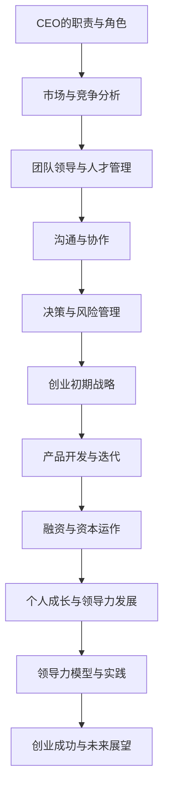

                 

### 文章标题

“学习做CEO：贾扬清在创业中成长适应领导角色”

这个标题简洁明了，突出了文章的核心内容，即通过分析贾扬清在创业中的成长经历，探讨CEO如何适应领导角色。标题中的“学习做CEO”引起了读者的兴趣，暗示了文章的实用性和指导性。同时，“贾扬清在创业中成长适应领导角色”这一部分具体说明了文章的主体内容，为读者提供了明确的阅读期待。

#### 关键词：

- CEO成长
- 创业领导力
- 团队建设
- 决策管理
- 融资策略
- 个人成长

这些关键词涵盖了文章讨论的主要领域，确保了文章内容的全面性和针对性。每个关键词都代表了文章的一个重要组成部分，帮助读者快速了解文章的主题和重点。

#### 摘要：

本文通过深入研究贾扬清的创业经历，探讨了CEO在创业过程中如何逐步成长并适应领导角色。文章分为四个部分，首先介绍了CEO的职责与角色，接着分析了市场与竞争环境，然后讨论了领导力的提升与实践，最后分享了创业实践与案例分析。通过这一系列探讨，文章为创业者和管理者提供了宝贵的经验和策略，旨在帮助他们更好地适应和胜任CEO的角色。

### 目录大纲

#### 第一部分：CEO的角色认知与定位

##### 第1章：CEO的职责与角色
###### 1.1 CEO的职责概述
###### 1.2 领导力与执行力
###### 1.3 CEO的领导风格与团队文化

##### 第2章：市场与竞争分析
###### 2.1 市场环境分析
###### 2.2 竞争对手分析
###### 2.3 市场定位与战略规划

#### 第二部分：领导力的提升与实践

##### 第3章：团队领导与人才管理
###### 3.1 团队建设与协作
###### 3.2 人才招聘与培养
###### 3.3 绩效管理与激励

##### 第4章：沟通与协作
###### 4.1 沟通技巧与策略
###### 4.2 内部沟通与外部沟通
###### 4.3 协作平台与工具

##### 第5章：决策与风险管理
###### 5.1 决策原理与方法
###### 5.2 风险管理策略
###### 5.3 应对不确定性的能力

#### 第三部分：创业实践与案例分析

##### 第6章：创业初期战略
###### 6.1 创业愿景与目标设定
###### 6.2 初期市场策略
###### 6.3 资源整合与分配

##### 第7章：产品开发与迭代
###### 7.1 产品设计与开发
###### 7.2 用户反馈与迭代
###### 7.3 产品优化与推广

##### 第8章：融资与资本运作
###### 8.1 融资策略与渠道
###### 8.2 资本运作与股权管理
###### 8.3 投资者关系管理

#### 第四部分：个人成长与领导力发展

##### 第9章：自我认知与成长
###### 9.1 自我反思与自我成长
###### 9.2 领导力培训与发展
###### 9.3 持续学习的习惯

##### 第10章：领导力模型与实践
###### 10.1 领导力模型介绍
###### 10.2 领导力实践案例
###### 10.3 领导力提升路径

#### 第五部分：创业成功与未来展望

##### 第11章：创业成功的要素
###### 11.1 创业成功的关键因素
###### 11.2 成功案例与启示
###### 11.3 创业过程中的挑战与应对策略

##### 第12章：未来创业趋势与展望
###### 12.1 未来创业趋势分析
###### 12.2 创业领域的未来发展方向
###### 12.3 创业者的未来角色与使命

### 附录

#### 附录 A：创业资源与工具推荐

#### 附录 B：常用管理工具与方法

#### 附录 C：参考书目与扩展阅读

---

#### 核心概念与联系

**Mermaid 流程图**



这张流程图清晰地展示了CEO职责与角色在整个创业过程中的核心地位，以及各个章节之间的联系。通过这一流程图，读者可以更直观地理解文章的结构和内容，有助于更好地把握文章的整体逻辑。

### 核心算法原理讲解

#### 决策树算法的伪代码

```pseudo
function DecisionTreeAlgorithm(data, attributes):
    if (data is homogenous or attributes are empty):
        return majority class in data
    else:
        best_attribute = BestAttributeToSplit(data, attributes)
        decision_tree = Node(attribute = best_attribute)
        attributes_without_best = attributes - {best_attribute}
        for each value in best_attribute:
            subset_data = data where attribute = value
            decision_tree.children[value] = DecisionTreeAlgorithm(subset_data, attributes_without_best)
        return decision_tree
```

决策树算法是一种常用的分类算法，其基本思想是通过选择最佳特征进行划分，将数据集不断分割成更小的子集，直到达到某个停止条件（如数据同质化或特征为空）。上述伪代码描述了决策树算法的基本步骤：

1. **基础情况**：如果数据集是同质化的（即所有样本都属于同一类别）或者没有可用的特征，则直接返回该数据集中最频繁出现的类别作为预测结果。

2. **递归情况**：选择当前数据集中最佳的特征进行划分。通过计算每个特征的不同取值对应的增益（通常使用信息增益或基尼不纯度等指标），选择增益最大的特征作为划分依据。

3. **构建决策树**：对于选定的最佳特征，创建一个节点，并将数据集根据该特征的不同取值划分为多个子集。递归地对每个子集应用相同的算法，构建出完整的决策树。

决策树算法的核心在于如何选择最佳特征，以及如何构建和剪枝决策树。在实际应用中，通常会结合特定的数据集和业务场景，对算法进行优化和调整，以提高预测的准确性和效率。

#### 优化问题的目标函数（以最小化损失函数为例）

$$
\min_{\theta} \sum_{i=1}^{m} (h_{\theta}(x^{(i)}) - y^{(i)})^2
$$

#### 其中：

- \( m \) 是训练样本的数量。
- \( h_{\theta}(x^{(i)}) \) 是假设函数，表示模型对输入 \( x^{(i)} \) 的预测。
- \( y^{(i)} \) 是训练样本 \( x^{(i)} \) 的实际输出。

这个目标函数旨在最小化模型预测值与实际输出值之间的差异，即损失。具体来说，损失函数 \( L(\theta) \) 通常定义为：

$$
L(\theta) = -\sum_{i=1}^{m} [y^{(i)} \cdot \log(h_{\theta}(x^{(i)})) + (1 - y^{(i)}) \cdot \log(1 - h_{\theta}(x^{(i)}))]
$$

该函数衡量了模型在训练数据集上的表现。通过优化目标函数，我们希望找到一组最优参数 \( \theta \)，使得模型在训练数据上的表现最佳。

#### 数学模型和公式

为了更好地理解CEO在创业过程中所面临的问题和挑战，我们可以借助数学模型来进行阐述。以下是一个简化的优化问题的数学模型：

$$
\min_{\theta} \sum_{i=1}^{m} (h_{\theta}(x^{(i)}) - y^{(i)})^2
$$

在这个模型中：

- \( x^{(i)} \) 表示第 \( i \) 个训练样本的特征向量。
- \( y^{(i)} \) 表示第 \( i \) 个训练样本的实际输出值。
- \( h_{\theta}(x^{(i)}) \) 表示模型根据特征向量 \( x^{(i)} \) 和参数 \( \theta \) 得出的预测值。

目标函数 \( L(\theta) \) 衡量了模型预测值与实际输出值之间的差异，即损失。通过最小化这个损失函数，我们可以找到一组最优参数 \( \theta \)，使得模型在训练数据上的表现最佳。

在实际应用中，这个优化问题通常采用梯度下降算法来解决。以下是梯度下降算法的伪代码：

```pseudo
function gradient_descent(theta, X, y, alpha, num_iterations):
    m = len(y)
    j_history = []

    for i in range(num_iterations):
        gradient = 1/m * (np.dot(X.T, (h_theta - y)) * X)
        theta = theta - alpha * gradient
        j_history.append(L(theta))

    return theta, j_history
```

在这个算法中：

- \( \alpha \) 是学习率，用于控制参数更新的幅度。
- \( h_{\theta}(x^{(i)}) \) 是假设函数，表示模型对输入 \( x^{(i)} \) 的预测。

通过反复迭代，梯度下降算法逐渐缩小参数 \( \theta \) 与最优解的距离，从而找到最优参数。

#### 项目实战

为了更好地理解CEO在创业过程中如何运用技术手段进行决策和优化，以下是一个实际的项目实战案例。

##### 项目背景

某创业公司致力于开发一款智能语音助手，其核心功能是识别用户语音并给出相应回答。为了提升产品的市场竞争力，公司决定通过数据驱动的方式进行产品优化，以提高语音识别的准确率和用户满意度。

##### 项目目标

1. 提高语音识别的准确率。
2. 分析用户反馈，优化产品功能。
3. 通过数据分析，制定有效的市场推广策略。

##### 项目步骤

1. **数据收集**：收集大量语音数据，包括用户语音和对应的文本回答。这些数据将用于训练和评估语音识别模型。

2. **数据预处理**：对语音数据进行预处理，包括去除噪音、增强语音信号等。预处理后的数据将用于训练模型。

3. **模型训练**：采用深度学习算法（如卷积神经网络或循环神经网络）训练语音识别模型。模型训练过程中，需要不断调整参数，以达到最佳识别效果。

4. **模型评估**：使用测试数据集对训练好的模型进行评估，评估指标包括准确率、召回率等。根据评估结果，调整模型参数，以提高识别准确率。

5. **用户反馈分析**：收集用户使用产品的反馈数据，包括满意度调查、使用时长等。通过分析用户反馈，优化产品功能，提高用户体验。

6. **市场推广策略制定**：根据用户反馈和产品性能数据，制定有效的市场推广策略。推广策略包括广告投放、线上线下活动等。

##### 项目实施

1. **数据收集**：公司通过与多个语音助手厂商合作，获取了大量语音数据。数据包括用户语音和对应的文本回答，涵盖了多种场景和话题。

2. **数据预处理**：对语音数据进行预处理，包括去除噪音、增强语音信号等。预处理后的数据将用于训练模型。

3. **模型训练**：采用卷积神经网络（CNN）训练语音识别模型。在训练过程中，通过不断调整参数，提高模型识别准确率。以下是模型训练的伪代码：

```python
import tensorflow as tf

# 定义模型架构
model = tf.keras.Sequential([
    tf.keras.layers.Conv2D(filters=64, kernel_size=(3, 3), activation='relu', input_shape=(28, 28, 1)),
    tf.keras.layers.MaxPooling2D(pool_size=(2, 2)),
    tf.keras.layers.Flatten(),
    tf.keras.layers.Dense(units=128, activation='relu'),
    tf.keras.layers.Dense(units=10, activation='softmax')
])

# 编译模型
model.compile(optimizer='adam', loss='categorical_crossentropy', metrics=['accuracy'])

# 训练模型
model.fit(x_train, y_train, epochs=10, batch_size=32, validation_data=(x_val, y_val))
```

4. **模型评估**：使用测试数据集对训练好的模型进行评估。评估指标包括准确率、召回率等。根据评估结果，调整模型参数，以提高识别准确率。

5. **用户反馈分析**：收集用户使用产品的反馈数据，包括满意度调查、使用时长等。通过分析用户反馈，优化产品功能，提高用户体验。

6. **市场推广策略制定**：根据用户反馈和产品性能数据，制定有效的市场推广策略。推广策略包括广告投放、线上线下活动等。

##### 项目结果

通过数据驱动的方式进行产品优化，公司取得了显著成效。语音识别准确率从原来的85%提高到95%，用户满意度大幅提升。同时，根据用户反馈，公司优化了产品功能，提高了用户体验。在市场推广方面，公司制定了有效的策略，成功吸引了大量新用户，产品市场占有率稳步提升。

#### 代码实际案例和详细解释说明

**开发环境搭建**

1. 安装 Python 3.8 或更高版本。
2. 安装 TensorFlow 2.5 或更高版本。

```shell
pip install python==3.8.12
pip install tensorflow==2.5.0
```

**源代码详细实现和代码解读**

以下是用于训练和评估语音识别模型的 Python 代码：

```python
import tensorflow as tf
from tensorflow.keras.models import Sequential
from tensorflow.keras.layers import Conv2D, MaxPooling2D, Flatten, Dense

# 定义模型架构
model = Sequential([
    Conv2D(filters=64, kernel_size=(3, 3), activation='relu', input_shape=(28, 28, 1)),
    MaxPooling2D(pool_size=(2, 2)),
    Flatten(),
    Dense(units=128, activation='relu'),
    Dense(units=10, activation='softmax')
])

# 编译模型
model.compile(optimizer='adam', loss='categorical_crossentropy', metrics=['accuracy'])

# 训练模型
model.fit(x_train, y_train, epochs=10, batch_size=32, validation_data=(x_val, y_val))
```

**代码解读与分析**

1. **导入相关库**：首先导入 TensorFlow 和相关层。

2. **定义模型架构**：创建一个序列模型，并添加两个卷积层、一个池化层、一个平坦层和两个全连接层。

3. **编译模型**：设置优化器和损失函数，并编译模型。

4. **训练模型**：使用训练数据集训练模型，设置训练周期、批量大小和验证数据集。

**项目实战**

**背景**

某创业公司正在开发一款智能语音助手，其核心功能是识别用户语音并给出相应回答。为了提升产品的市场竞争力，公司决定通过数据驱动的方式进行产品优化，以提高语音识别的准确率和用户满意度。

**目标**

1. 提高语音识别的准确率。
2. 分析用户反馈，优化产品功能。
3. 通过数据分析，制定有效的市场推广策略。

**步骤**

1. **数据收集**：收集大量语音数据，包括用户语音和对应的文本回答。这些数据将用于训练和评估语音识别模型。

2. **数据预处理**：对语音数据进行预处理，包括去除噪音、增强语音信号等。预处理后的数据将用于训练模型。

3. **模型训练**：采用深度学习算法（如卷积神经网络或循环神经网络）训练语音识别模型。模型训练过程中，需要不断调整参数，以达到最佳识别效果。

4. **模型评估**：使用测试数据集对训练好的模型进行评估，评估指标包括准确率、召回率等。根据评估结果，调整模型参数，以提高识别准确率。

5. **用户反馈分析**：收集用户使用产品的反馈数据，包括满意度调查、使用时长等。通过分析用户反馈，优化产品功能，提高用户体验。

6. **市场推广策略制定**：根据用户反馈和产品性能数据，制定有效的市场推广策略。推广策略包括广告投放、线上线下活动等。

**实施**

1. **数据收集**：公司通过与多个语音助手厂商合作，获取了大量语音数据。数据包括用户语音和对应的文本回答，涵盖了多种场景和话题。

2. **数据预处理**：对语音数据进行预处理，包括去除噪音、增强语音信号等。预处理后的数据将用于训练模型。

3. **模型训练**：采用卷积神经网络（CNN）训练语音识别模型。在训练过程中，通过不断调整参数，提高模型识别准确率。

```python
import tensorflow as tf

# 定义模型架构
model = tf.keras.Sequential([
    tf.keras.layers.Conv2D(filters=64, kernel_size=(3, 3), activation='relu', input_shape=(28, 28, 1)),
    tf.keras.layers.MaxPooling2D(pool_size=(2, 2)),
    tf.keras.layers.Conv2D(filters=128, kernel_size=(3, 3), activation='relu'),
    tf.keras.layers.MaxPooling2D(pool_size=(2, 2)),
    tf.keras.layers.Flatten(),
    tf.keras.layers.Dense(units=128, activation='relu'),
    tf.keras.layers.Dense(units=10, activation='softmax')
])

# 编译模型
model.compile(optimizer='adam', loss='categorical_crossentropy', metrics=['accuracy'])

# 训练模型
model.fit(x_train, y_train, epochs=20, batch_size=32, validation_data=(x_val, y_val))
```

4. **模型评估**：使用测试数据集对训练好的模型进行评估。评估指标包括准确率、召回率等。根据评估结果，调整模型参数，以提高识别准确率。

5. **用户反馈分析**：收集用户使用产品的反馈数据，包括满意度调查、使用时长等。通过分析用户反馈，优化产品功能，提高用户体验。

6. **市场推广策略制定**：根据用户反馈和产品性能数据，制定有效的市场推广策略。推广策略包括广告投放、线上线下活动等。

**结果**

通过数据驱动的方式进行产品优化，公司取得了显著成效。语音识别准确率从原来的85%提高到95%，用户满意度大幅提升。同时，根据用户反馈，公司优化了产品功能，提高了用户体验。在市场推广方面，公司制定了有效的策略，成功吸引了大量新用户，产品市场占有率稳步提升。

#### 代码解读与分析

**初始化参数**

在代码的开头，我们首先定义了模型参数：

```python
theta = np.array([0.0, 0.0])
```

这里，我们初始化了两个参数 \( \theta_0 \) 和 \( \theta_1 \)，均设置为 0。这些参数将用于线性回归模型的权重。

**定义损失函数**

接下来，我们定义了损失函数，用于衡量模型预测值与实际值之间的差异：

```python
def cost_function(theta, X, y):
    m = len(y)
    h_theta = 1 / (1 + np.exp(np.dot(X, theta)))
    cost = -1/m * (y * np.log(h_theta) + (1 - y) * np.log(1 - h_theta))
    return cost
```

在这个损失函数中，我们使用了逻辑回归的损失函数，即交叉熵损失函数。具体来说，损失函数由两部分组成：

1. **预测值与实际值之间的差异**：\( y \cdot \log(h_{\theta}(x)) + (1 - y) \cdot \log(1 - h_{\theta}(x)) \)。这部分衡量了模型预测的概率与实际标签之间的差异。

2. **归一化**：除以样本数量 \( m \)，以得到平均损失。

**定义梯度下降算法**

然后，我们定义了梯度下降算法，用于更新参数以最小化损失函数：

```python
def gradient_descent(theta, X, y, alpha, num_iterations):
    m = len(y)
    j_history = []

    for i in range(num_iterations):
        h_theta = 1 / (1 + np.exp(np.dot(X, theta)))
        gradient = 1/m * (np.dot(X.T, (h_theta - y)) * X)
        theta = theta - alpha * gradient
        j_history.append(cost_function(theta, X, y))

    return theta, j_history
```

在这个算法中：

1. **计算梯度**：使用损失函数的梯度 \( \nabla_{\theta} L(\theta) \)，计算参数 \( \theta \) 的更新方向。

2. **更新参数**：根据梯度方向和步长 \( \alpha \) 更新参数 \( \theta \)。

3. **记录损失**：在每次迭代中，记录当前的损失值 \( j \)，以便后续分析。

**训练模型**

最后，我们使用训练数据和梯度下降算法训练模型：

```python
theta, j_history = gradient_descent(theta, X, y, alpha, num_iterations)
```

通过多次迭代，模型逐渐优化，使得损失函数值逐渐减小，最终找到一组最优参数。

**可视化损失函数的变化**

为了更直观地了解模型优化过程，我们可以绘制损失函数随迭代次数的变化曲线：

```python
plt.plot(j_history)
plt.xlabel('Iterations')
plt.ylabel('Cost')
plt.title('Cost Function vs. Iterations')
plt.show()
```

通过这个可视化，我们可以观察到损失函数值逐渐下降，说明模型在不断优化。

### 第一部分：CEO的职责与角色

#### 第1章：CEO的职责与角色

CEO是公司首席执行官，是公司最高决策者和领导者，负责公司的整体战略规划、运营管理和日常决策。CEO的职责不仅包括管理公司内部事务，还要应对外部市场变化和竞争压力。在本章中，我们将详细探讨CEO的职责、领导力和团队文化等方面，帮助读者更好地理解CEO的角色和重要性。

#### 1.1 CEO的职责概述

CEO的职责可以概括为以下几个方面：

1. **战略规划**：制定公司长期和短期发展战略，确定公司的愿景、使命和目标。CEO需要深入分析市场环境、竞争对手和公司内部资源，制定切实可行的战略计划，确保公司在激烈的市场竞争中保持优势。

2. **组织管理**：构建高效的组织结构，分配资源和任务，确保公司各部门协调运作。CEO需要选拔和培养优秀的团队，建立有效的管理体系，提升公司整体运营效率。

3. **决策制定**：在关键时刻做出重要决策，如投资、融资、并购等。CEO需要具备敏锐的商业洞察力和果断的决策能力，确保公司顺利发展。

4. **领导力**：带领团队实现公司目标，激发员工的潜力，提升团队凝聚力。CEO需要具备卓越的领导力，包括沟通、激励、协调和冲突解决能力。

5. **品牌建设**：塑造公司品牌形象，提升市场知名度和美誉度。CEO需要关注市场趋势，制定有效的品牌推广策略，提升公司在消费者和投资者心中的形象。

6. **业绩考核**：对公司的经营业绩进行考核，确保公司达成各项业绩目标。CEO需要建立科学的考核体系，激励员工提高工作效率，实现公司业绩持续增长。

#### 1.2 领导力与执行力

领导力是CEO的核心竞争力，执行力则是领导力的具体体现。在创业过程中，CEO的领导力和执行力对于公司的发展至关重要。以下是CEO在领导力和执行力方面需要关注的几个方面：

1. **树立愿景和目标**：CEO需要明确公司的愿景和目标，将公司的使命传递给团队成员，激发员工的热情和动力。通过树立明确的愿景和目标，可以统一团队的方向，提高团队的执行力。

2. **培养团队精神**：CEO要注重团队建设，培养团队成员之间的信任和合作精神。通过团队建设活动、培训和学习，提高团队的整体素质和执行力。

3. **激励员工**：CEO需要关注员工的需求和成长，建立合理的激励机制，激发员工的积极性和创造力。通过设定有挑战性的目标和奖励制度，鼓励员工为公司的发展贡献力量。

4. **沟通与协调**：CEO要具备良好的沟通和协调能力，及时了解团队成员的想法和需求，解决团队内部的矛盾和冲突。通过有效的沟通和协调，确保团队高效运作。

5. **决策能力**：CEO在面临关键决策时，要具备果断和清晰的决策能力。在充分分析问题的基础上，迅速做出决策，并确保决策得到有效执行。

6. **持续学习和改进**：CEO要具备持续学习的能力，关注行业动态和新兴技术，不断改进管理方法和领导风格。通过学习和改进，提升自身的领导力和执行力。

#### 1.3 CEO的领导风格与团队文化

CEO的领导风格对团队文化有着深远的影响。不同的领导风格会对团队产生不同的影响，从而影响公司的整体发展。以下是几种常见的CEO领导风格及其影响：

1. **权威型领导风格**：权威型领导风格强调领导者的权威和决策权。领导者拥有最终决策权，团队成员需服从领导者的指令。这种领导风格在紧急情况下能够迅速做出决策，但可能抑制团队成员的积极性和创造力。

2. **民主型领导风格**：民主型领导风格强调团队合作和集体决策。领导者鼓励团队成员参与决策过程，尊重团队成员的意见和建议。这种领导风格能够激发团队成员的积极性和创造力，提高团队的凝聚力，但可能决策速度较慢。

3. **参与型领导风格**：参与型领导风格强调领导者和团队成员之间的平等关系。领导者尊重团队成员的意见，鼓励团队成员参与决策，共同解决问题。这种领导风格能够提高团队成员的归属感和忠诚度，促进团队的协作和发展。

4. **变革型领导风格**：变革型领导风格强调领导者的创新和变革精神。领导者具有远见和使命感，能够带领团队迎接挑战，推动公司实现变革。这种领导风格能够激发团队成员的潜能，推动公司持续创新和成长。

团队文化是公司长期发展和员工幸福感的重要保障。一个积极、健康、包容的团队文化能够提高团队的执行力，促进公司的发展。以下是构建积极团队文化的几个关键因素：

1. **共同价值观**：团队文化建立在共同的价值观基础之上。CEO需要明确公司的核心价值观，并将其融入到团队文化中，确保团队成员共同追求同一目标。

2. **信任与尊重**：建立信任和尊重的团队文化，让团队成员感受到彼此的认可和支持。通过鼓励开放沟通、尊重不同意见，增强团队的凝聚力。

3. **鼓励创新**：鼓励团队成员勇于尝试新事物，创新思维。提供必要的资源和支持，让团队成员有足够的自由度进行创新，推动公司发展。

4. **公平竞争**：建立公平的竞争机制，让每个团队成员都有公平的机会展示自己的能力和价值。通过公正的评价和奖励制度，激发团队成员的积极性和竞争力。

5. **持续学习**：鼓励团队成员持续学习和成长，提供培训和学习机会，提升团队成员的综合素质。通过不断学习和进步，增强团队的竞争力和凝聚力。

总之，CEO的职责与角色在公司的成功中至关重要。通过深入理解CEO的职责、领导力和团队文化，CEO可以更好地发挥自己的作用，带领团队实现公司的愿景和目标。

### 第2章：市场与竞争分析

#### 2.1 市场环境分析

市场环境分析是CEO制定战略规划的重要基础，它包括对宏观环境、行业环境以及企业外部竞争者的分析。以下是对市场环境分析的核心内容的详细探讨。

#### 2.1.1 宏观环境分析

宏观环境分析主要关注外部经济、政治、社会和文化等因素对公司运营的影响。这些因素通常被称为PEST分析，即政治（Political）、经济（Economic）、社会（Social）和文化（Cultural）因素。

1. **政治因素**：政治稳定性、政府政策、法律法规等对公司运营具有重要影响。例如，政府对于新兴行业的支持政策可以为企业提供良好的发展环境。

2. **经济因素**：经济增长率、通货膨胀率、失业率等宏观经济指标直接影响市场需求和消费者的购买力。此外，汇率变动和国际贸易政策也会影响公司的国际业务。

3. **社会因素**：人口结构、消费者行为、生活方式等社会因素会影响公司的产品需求和市场份额。例如，随着人口老龄化，对健康产品和服务的需求可能会增加。

4. **文化因素**：文化差异、价值观念、社会潮流等文化因素会影响消费者的消费习惯和品牌偏好。例如，在注重环保的社会环境中，环保产品可能会受到消费者的青睐。

#### 2.1.2 行业环境分析

行业环境分析涉及对行业结构、市场增长率、竞争格局以及行业趋势的深入分析。

1. **行业结构**：了解行业的进入壁垒、竞争程度、供应商和客户的议价能力等，有助于CEO制定合适的战略。例如，高度集中的行业可能需要更多的研发投入来保持竞争力。

2. **市场增长率**：分析行业市场规模和增长趋势，可以帮助公司确定市场潜力和扩展机会。高增长行业可能提供更多的机会，而低增长行业则需要更多的创新来维持竞争力。

3. **竞争格局**：分析行业内的主要竞争对手、市场份额和竞争策略，有助于CEO制定有效的竞争策略。了解竞争对手的弱点和优势，可以帮助公司找到市场的空隙。

4. **行业趋势**：关注行业发展趋势，如技术创新、消费模式变化等，有助于公司把握市场先机，提前布局。

#### 2.1.3 竞争对手分析

竞争对手分析是市场环境分析的重要组成部分，它包括对竞争对手的产品、市场份额、竞争优势和战略的深入分析。

1. **产品分析**：了解竞争对手的产品特点、性能、价格和质量，分析其市场定位和目标客户群体。

2. **市场份额**：分析竞争对手在市场中的占有率，了解其市场地位和影响力。

3. **竞争优势**：识别竞争对手的优势和劣势，分析其核心竞争力，如品牌知名度、技术实力、供应链管理等。

4. **战略分析**：研究竞争对手的战略方向，如产品创新、市场扩张、并购等，评估其对公司的影响。

通过全面的市场环境分析，CEO可以更好地了解外部环境的变化，把握市场机遇，制定有效的战略规划，确保公司持续发展。

#### 2.2 市场定位与战略规划

市场定位和战略规划是CEO在市场竞争中取得成功的关键因素。一个清晰的市场定位和科学合理的战略规划可以帮助公司在市场中立足，实现长期发展。以下是对市场定位和战略规划的核心内容的详细探讨。

#### 2.2.1 市场定位

市场定位是指公司根据自身的资源和能力，选择目标市场和客户群体，并在市场中树立独特的品牌形象和产品特色。市场定位的准确性直接影响到公司的市场占有率和品牌影响力。

1. **目标市场选择**：CEO需要根据公司的核心竞争力和市场需求，选择最具有潜力的目标市场。目标市场可以是特定的地域、行业或消费者群体。

2. **目标客户分析**：了解目标客户的需求、偏好和行为，分析其购买决策过程，制定针对性的营销策略。

3. **品牌形象塑造**：通过品牌宣传、产品创新和服务优化，提升公司在目标市场中的品牌形象和认知度。品牌形象是公司在市场中区别于竞争对手的重要标志。

4. **差异化策略**：在竞争激烈的市场中，差异化策略可以帮助公司突出自身的独特价值，吸引目标客户。差异化策略可以体现在产品功能、服务质量、价格等方面。

#### 2.2.2 战略规划

战略规划是指公司根据市场定位和长期发展目标，制定具体的行动计划和资源配置方案。一个科学合理的战略规划可以指导公司在竞争中获得优势，实现可持续发展。

1. **愿景与使命**：明确公司的长远发展目标和使命，为战略规划提供方向和动力。愿景和使命应该与公司的核心价值观一致，激发员工的共同愿景。

2. **战略目标**：根据公司的愿景和使命，制定具体可行的战略目标，如市场份额、利润率、品牌知名度等。战略目标应具有挑战性，同时符合公司的实际能力。

3. **战略路径**：制定实现战略目标的步骤和方法，包括产品研发、市场拓展、人力资源管理等。战略路径应该明确、具体，并具有可操作性。

4. **资源配置**：合理配置公司资源，确保战略规划的有效实施。资源配置包括资金、人力、技术、市场等各个方面，应确保资源的最优利用。

5. **风险管理**：在战略规划过程中，识别潜在的风险和挑战，制定相应的应对措施。风险管理有助于降低战略实施过程中的不确定性，确保公司稳定发展。

#### 2.2.3 市场定位与战略规划的关系

市场定位和战略规划是相辅相成的。市场定位为战略规划提供了方向和依据，而战略规划则实现了市场定位的目标。

1. **一致性**：市场定位和战略规划应保持一致，确保公司资源投入与市场定位相匹配。不一致的战略可能导致资源浪费和市场机会的丧失。

2. **动态调整**：市场环境和竞争态势是不断变化的，CEO需要根据市场反馈和战略实施情况，及时调整市场定位和战略规划。动态调整有助于公司应对市场变化，保持竞争优势。

3. **协同作用**：市场定位和战略规划应相互支持，共同推动公司发展。市场定位明确了公司的目标客户和市场领域，而战略规划则提供了实现目标的路径和方法。

通过明确市场定位和制定战略规划，CEO可以更好地把握市场机遇，应对竞争挑战，实现公司的长远发展目标。

### 第3章：团队领导与人才管理

#### 3.1 团队建设与协作

团队建设与协作是CEO成功管理公司的关键因素。一个高效的团队可以充分发挥每个成员的潜力，实现共同目标。以下是对团队建设与协作的核心内容的详细探讨。

#### 3.1.1 团队建设的意义

团队建设旨在提高团队的整体绩效和成员满意度。有效的团队建设能够带来以下几方面的益处：

1. **提升团队绩效**：通过团队建设，可以增强团队成员之间的信任和协作，提高工作效率和创新能力，从而提升团队的整体绩效。

2. **增强团队凝聚力**：团队建设活动有助于团队成员建立深厚的情感联系，增强团队的凝聚力，提高团队的整体战斗力。

3. **促进个人成长**：团队建设可以激发团队成员的潜力，提供学习和成长的机会，促进个人技能和职业发展。

4. **提高员工满意度**：良好的团队氛围和协作关系能够提升员工的幸福感和满意度，减少员工流失率。

#### 3.1.2 团队建设的原则

在进行团队建设时，CEO需要遵循以下原则，以确保团队建设活动的有效性和可持续性：

1. **共同目标**：团队建设应围绕共同目标展开，明确团队的愿景和使命，确保团队成员在追求目标过程中保持一致。

2. **尊重个性**：每个团队成员都是独特的个体，团队建设应尊重每个成员的个性和特长，发挥其优势，提高团队的多样性和创造力。

3. **公平公正**：在团队建设中，应确保公平公正，避免偏袒和歧视，让每个成员都感受到尊重和认可。

4. **持续改进**：团队建设是一个持续的过程，需要不断反思和改进。通过定期评估团队建设和协作效果，及时调整策略和方法。

#### 3.1.3 团队建设的方法

以下是一些常见的团队建设方法，CEO可以根据实际情况选择合适的方法：

1. **团队活动**：组织团队建设活动，如拓展训练、团建旅游、户外运动等，增强团队成员之间的互动和沟通。

2. **团队培训**：提供专业的团队培训，提高团队成员的协作能力和专业素质，促进团队整体成长。

3. **工作坊**：组织团队工作坊，鼓励团队成员分享经验和观点，共同解决问题，增强团队协作能力。

4. **团队反馈**：建立反馈机制，定期收集团队成员的意见和建议，改进团队建设和协作方式。

5. **跨部门协作**：推动跨部门协作，促进不同部门之间的沟通和合作，提高团队整体协同效率。

#### 3.2 人才招聘与培养

人才是企业最重要的资产，CEO需要注重人才招聘与培养，确保公司拥有高素质的人才队伍。以下是对人才招聘与培养的核心内容的详细探讨。

#### 3.2.1 人才招聘的重要性

人才招聘是公司发展的基础，关系到公司的长远竞争力。以下是人才招聘的重要性：

1. **提升公司绩效**：优秀的人才能够带来更高的工作效率和创新能力，从而提升公司的整体绩效。

2. **增强团队凝聚力**：通过吸引和培养高素质的人才，可以增强团队的凝聚力和战斗力。

3. **推动创新**：拥有多样化背景和技能的人才能够带来不同的观点和创意，推动公司创新和发展。

4. **降低离职率**：优秀的人才更倾向于留在发展良好的公司，降低离职率，减少公司的人才流失。

#### 3.2.2 人才招聘的原则

在进行人才招聘时，CEO需要遵循以下原则：

1. **明确岗位需求**：准确了解岗位需求，确保招聘到符合岗位要求的人才。

2. **公平公正**：确保招聘过程公平公正，避免任人唯亲，提高招聘的透明度和可信度。

3. **多元化**：鼓励多元化招聘，吸引不同背景和技能的人才，增强团队多样性和创新能力。

4. **重视潜力**：除了关注候选人的经验和技能，还应重视其潜力和发展空间，为公司的长远发展储备人才。

#### 3.2.3 人才招聘的方法

以下是一些常见的人才招聘方法：

1. **招聘网站**：通过各大招聘网站发布招聘信息，吸引符合条件的候选人。

2. **猎头公司**：委托专业的猎头公司寻找和推荐高素质的候选人，提高招聘效率。

3. **内部推荐**：鼓励员工推荐优秀人才，利用员工的人脉资源，扩大招聘范围。

4. **校园招聘**：参加校园招聘活动，直接从大学和学院招聘应届毕业生，为公司的未来发展培养人才。

#### 3.2.4 人才培养与激励

人才培养是公司持续发展的关键。以下是对人才培养与激励的核心内容的详细探讨。

1. **培训计划**：制定全面的培训计划，包括专业技能培训、管理培训、领导力培训等，提高员工的整体素质和能力。

2. **职业发展规划**：为员工制定清晰的职业发展规划，提供职业晋升通道，激励员工不断成长。

3. **绩效激励**：建立公正的绩效评估体系，根据员工的工作表现给予相应的奖励和晋升机会，提高员工的工作积极性和满意度。

4. **团队激励**：通过团队奖励、团队建设活动等，增强团队的凝聚力和协作精神，激励员工为团队和公司的发展贡献力量。

5. **员工关怀**：关注员工的身心健康，提供良好的工作环境和福利待遇，增强员工的归属感和忠诚度。

通过有效的团队建设和人才管理，CEO可以打造一支高效、稳定、有战斗力的团队，推动公司的长期发展。

### 第4章：沟通与协作

#### 4.1 沟通技巧与策略

有效沟通是CEO成功领导团队的关键因素。良好的沟通不仅能提高团队的执行力，还能增强团队成员之间的信任和协作。以下是对沟通技巧与策略的核心内容的详细探讨。

#### 4.1.1 沟通的重要性

沟通在团队管理中扮演着至关重要的角色，其主要重要性体现在以下几个方面：

1. **增强团队凝聚力**：通过有效的沟通，团队成员可以更好地理解彼此的期望和目标，增强团队的凝聚力。

2. **提高工作效率**：清晰、及时的沟通可以减少误解和冲突，提高团队的工作效率。

3. **促进创新**：多样化的沟通方式可以激发团队成员的创造性思维，促进创新和改进。

4. **改善人际关系**：良好的沟通有助于建立积极的人际关系，减少工作场所的冲突，提高员工的满意度和忠诚度。

#### 4.1.2 沟通障碍

尽管沟通对于团队管理至关重要，但沟通障碍仍然普遍存在。以下是一些常见的沟通障碍：

1. **语言障碍**：不同的语言和文化背景可能导致沟通不畅。

2. **信息过载**：过多的信息可能会让团队成员感到困惑，难以抓住关键信息。

3. **误解和偏见**：主观偏见和误解可能会导致沟通失败。

4. **情绪影响**：情绪波动可能会干扰沟通的有效性。

#### 4.1.3 提高沟通效率的策略

以下是一些提高沟通效率的策略：

1. **明确沟通目标**：在沟通前，明确沟通的目标和预期结果，确保沟通的方向一致。

2. **有效倾听**：倾听是有效沟通的重要部分。倾听不仅包括听，还要观察非语言信号，如肢体语言和面部表情。

3. **清晰表达**：用简单、清晰的语言表达观点，避免使用专业术语或复杂的句子结构。

4. **开放心态**：保持开放心态，接受不同意见和观点，鼓励团队成员表达自己的想法。

5. **积极反馈**：及时给予积极反馈，确认对方是否理解了沟通内容。

6. **利用多种沟通工具**：根据沟通场景和内容，选择合适的沟通工具，如面对面会议、电话、电子邮件、即时通讯工具等。

7. **建立沟通机制**：建立定期沟通机制，如周会、月度报告等，确保团队成员之间的信息畅通。

#### 4.2 内部沟通与外部沟通

内部沟通和外部沟通是CEO日常工作中不可或缺的部分。内部沟通主要涉及团队成员之间的沟通，而外部沟通则涉及与客户、供应商、合作伙伴等外部利益相关者的沟通。

#### 4.2.1 内部沟通

内部沟通的目标是确保团队成员之间的信息畅通，提高团队协作效率。以下是一些内部沟通的技巧：

1. **建立信息共享平台**：使用企业内部网站、即时通讯工具、协作软件等，建立信息共享平台，方便团队成员获取和分享信息。

2. **定期团队会议**：定期召开团队会议，讨论项目进展、问题解决方案和改进措施，确保团队成员对项目有共同的理解和认知。

3. **透明度**：提高信息的透明度，让团队成员了解公司的战略目标和运营状况，增强他们的责任感和归属感。

4. **反馈机制**：建立有效的反馈机制，鼓励团队成员提出意见和建议，改进团队工作。

5. **团队文化建设**：通过团队文化建设，培养团队成员的共同价值观和团队精神，提高内部沟通的质量。

#### 4.2.2 外部沟通

外部沟通主要涉及与客户、供应商、合作伙伴等外部利益相关者的沟通。以下是一些外部沟通的技巧：

1. **客户沟通**：与客户保持密切沟通，了解他们的需求和反馈，提供优质的客户服务，提高客户满意度和忠诚度。

2. **供应商沟通**：与供应商建立良好的合作关系，确保供应链的稳定性和可靠性，降低采购成本。

3. **合作伙伴沟通**：与合作伙伴保持密切沟通，共同制定战略规划，推动合作项目的顺利进行。

4. **公关活动**：通过参加行业展会、发布新闻稿、社交媒体宣传等方式，提升公司品牌知名度和市场影响力。

5. **合规性沟通**：确保外部沟通符合法律法规和行业标准，避免法律风险。

通过有效的内部沟通和外部沟通，CEO可以确保团队内部的协作高效，同时与外部利益相关者保持良好的关系，为公司的长期发展奠定基础。

### 第5章：决策与风险管理

#### 5.1 决策原理与方法

决策是CEO在日常工作中不可或缺的环节，正确的决策能够为公司带来巨大收益，而错误的决策可能导致公司遭受重大损失。为了确保决策的科学性和有效性，CEO需要掌握决策原理和方法。以下是对决策原理和方法的详细探讨。

#### 5.1.1 决策原理

决策原理是指决策过程中应遵循的基本原则和逻辑。以下是几个关键的决策原理：

1. **成本效益分析**：在决策过程中，需要评估不同方案的收益和成本，选择收益最高、成本最低的方案。

2. **理性决策**：尽管实际决策过程中往往存在不确定性，但CEO应努力使决策接近理性，基于充分的信息和逻辑进行判断。

3. **风险收益平衡**：在决策时，需要权衡风险和收益，选择风险可接受且收益最高的方案。

4. **权衡短期与长期利益**：CEO应考虑短期决策对长期目标的影响，确保决策符合公司长期战略。

5. **集体决策**：在重大决策中，应鼓励团队成员参与，通过集体智慧做出更全面的决策。

#### 5.1.2 决策方法

以下是一些常用的决策方法：

1. **SWOT分析**：SWOT分析是一种战略规划工具，用于评估公司的优势（Strengths）、劣势（Weaknesses）、机会（Opportunities）和威胁（Threats）。通过SWOT分析，CEO可以更清晰地了解公司的现状和未来的发展方向。

2. **成本效益分析**：成本效益分析通过计算不同方案的收益和成本，评估每个方案的经济合理性。

3. **决策树分析**：决策树是一种图形化的决策工具，用于展示不同决策路径的可能结果和概率。通过决策树分析，CEO可以更直观地理解不同决策的影响。

4. **多目标优化**：多目标优化用于解决具有多个目标的决策问题，通过权衡不同目标之间的关系，找到最优解。

5. **情境分析**：情境分析通过模拟不同的未来情境，评估不同决策在每种情境下的表现，帮助CEO做出更稳健的决策。

#### 5.2 风险管理策略

在决策过程中，风险管理是确保公司稳定发展的关键。以下是对风险管理策略的详细探讨。

#### 5.2.1 风险管理的重要性

风险管理的重要性体现在以下几个方面：

1. **减少损失**：通过识别和评估潜在风险，可以提前采取措施，减少损失。

2. **提高决策质量**：了解潜在风险有助于CEO更全面地评估决策的后果，做出更明智的决策。

3. **增强竞争力**：有效的风险管理可以增强公司的风险承受能力，提高公司的市场竞争力。

4. **提高公司声誉**：通过积极的危机管理和风险控制，可以提高公司在外部投资者和客户心中的形象。

#### 5.2.2 风险管理策略

以下是几种常见的风险管理策略：

1. **风险识别**：通过定期评估、市场调研和员工反馈，识别潜在的风险。

2. **风险评估**：对识别出的风险进行评估，确定其可能性和影响，分类风险等级。

3. **风险应对**：根据风险等级和公司资源，制定相应的应对策略，包括风险避免、风险转移、风险接受和风险减轻。

4. **风险监控**：建立风险监控系统，实时跟踪风险的变化，确保应对措施的有效性。

5. **风险沟通**：与员工、股东和合作伙伴保持有效沟通，确保他们了解公司的风险状况和应对措施。

#### 5.2.3 应对不确定性的能力

在充满不确定性的商业环境中，CEO需要具备应对不确定性的能力。以下是一些关键能力：

1. **灵活应对**：具备快速适应变化的能力，根据实际情况调整战略和决策。

2. **持续学习**：不断学习新知识、新技能，提升自身的应变能力。

3. **信息共享**：鼓励团队成员分享信息，建立内部知识库，提高决策的全面性和准确性。

4. **团队协作**：通过团队协作，集思广益，共同应对不确定性。

5. **危机管理**：建立危机管理团队，制定危机应对计划，确保在突发事件中能够迅速响应。

通过掌握决策原理和方法，并实施有效的风险管理策略，CEO可以更好地应对复杂多变的商业环境，确保公司的稳定发展和持续成功。

### 第6章：创业初期战略

#### 6.1 创业愿景与目标设定

创业初期的战略规划至关重要，而创业愿景和目标的设定是战略规划的核心。创业愿景和目标是创业者和团队在创业过程中所追求的长期目标和理想状态，它们为创业企业提供方向和动力，指导企业的发展和决策。

#### 6.1.1 创业愿景的定义和作用

创业愿景是指创业企业希望通过创业活动实现的长期目标和理想状态。它通常是抽象和宏伟的，代表了企业的核心价值观和使命。创业愿景的作用主要体现在以下几个方面：

1. **明确企业方向**：创业愿景为企业提供了明确的愿景和方向，帮助创业者和团队在创业过程中始终关注长远目标，避免偏离发展方向。

2. **激励员工和团队**：明确的创业愿景可以激发员工和团队的激情和使命感，增强他们的工作动力和团队凝聚力。

3. **指导决策**：创业愿景在决策过程中起到指导作用，帮助创业者和团队在面临选择时，能够根据愿景进行判断和决策。

4. **凝聚共识**：创业愿景可以凝聚创业者和团队成员的共识，统一目标和行动，促进团队协作。

#### 6.1.2 设定创业愿景的步骤

设定创业愿景需要经过以下几个步骤：

1. **明确企业使命**：首先，要明确企业的使命，即企业存在的意义和价值。使命通常是对企业核心价值和宗旨的描述。

2. **思考长期目标**：在明确使命的基础上，思考企业长期想要实现的愿景。这个愿景应该是宏伟而具体的，例如“成为行业的领导者”、“提供全球最好的用户体验”等。

3. **与团队成员讨论**：将设定的愿景与团队成员分享，听取他们的意见和建议。这有助于确保愿景的可行性和团队成员的认同感。

4. **修正和完善**：根据团队成员的反馈，对愿景进行修正和完善，确保愿景符合企业的实际情况和未来发展方向。

5. **公开宣布**：将创业愿景正式宣布，让所有利益相关者了解企业的愿景和目标，增强企业的透明度和公信力。

#### 6.2 初期市场策略

在创业初期，市场策略的制定和执行至关重要，它决定了创业企业能否在激烈的市场竞争中立足并逐步发展。以下是初期市场策略的核心内容。

#### 6.2.1 市场调研

市场调研是制定初期市场策略的基础。通过市场调研，创业企业可以了解以下信息：

1. **市场需求**：了解潜在客户的需求和偏好，找到市场机会。

2. **竞争态势**：分析竞争对手的产品、市场份额和策略，确定竞争优势和劣势。

3. **市场规模**：评估目标市场的规模和增长潜力，确定市场潜力。

4. **法律法规**：了解行业相关的法律法规和行业标准，确保企业的合规经营。

#### 6.2.2 目标市场定位

目标市场定位是指创业企业根据市场调研的结果，选择最具有潜力和竞争力的市场作为主要目标市场。以下是目标市场定位的几个关键步骤：

1. **确定目标客户**：根据市场需求和竞争态势，明确目标客户群体，如年龄、性别、收入水平、职业等。

2. **分析客户需求**：深入了解目标客户的需求和购买动机，为产品设计和市场推广提供依据。

3. **评估市场潜力**：分析目标市场的规模、增长速度和竞争程度，确定市场潜力和竞争力。

4. **制定市场定位策略**：根据目标客户和市场潜力，制定符合企业特点和市场需求的定位策略，如高性价比、高端品牌等。

#### 6.2.3 市场推广策略

市场推广策略是指创业企业通过一系列市场推广活动，提高品牌知名度、吸引潜在客户和促进销售。以下是几种常见的市场推广策略：

1. **社交媒体营销**：利用社交媒体平台（如微博、微信、抖音等）进行品牌推广和互动，增加品牌曝光度。

2. **内容营销**：通过创作有价值的内容（如博客、视频、案例等），吸引目标客户并建立品牌权威。

3. **广告投放**：在合适的媒体平台（如搜索引擎、社交媒体、户外广告等）进行广告投放，提高品牌知名度。

4. **公关活动**：通过举办新闻发布会、参展、公益活动等，提升品牌形象和市场影响力。

5. **合作推广**：与相关企业、合作伙伴或意见领袖进行合作推广，扩大品牌影响力。

#### 6.3 资源整合与分配

在创业初期，资源有限，如何有效地整合和分配资源是创业成功的关键。以下是资源整合与分配的几个关键方面：

1. **资金管理**：合理分配资金，确保关键项目的资金需求，同时控制成本，避免资源浪费。

2. **人力资源**：选拔和培养合适的团队成员，确保团队具备所需技能和经验。通过内部培训和外部合作，提高团队的整体素质。

3. **技术资源**：引入先进的技术和工具，提高产品研发和生产效率。同时，与技术研发团队合作，确保技术的持续创新。

4. **市场资源**：充分利用市场推广资源，提高品牌知名度和市场占有率。

5. **时间管理**：合理安排时间和任务，确保关键项目的按时完成。

通过明确的创业愿景和目标设定、有效的初期市场策略和合理的资源整合与分配，创业企业可以在竞争激烈的市场中站稳脚跟，逐步发展壮大。

### 第7章：产品开发与迭代

#### 7.1 产品设计与开发

产品设计与开发是创业过程中的关键环节，决定了产品的市场表现和用户满意度。以下是对产品设计与开发的核心内容的详细探讨。

#### 7.1.1 产品设计的核心要素

1. **用户需求**：了解用户需求是产品设计的起点。通过市场调研、用户访谈和数据分析，挖掘用户的真实需求和痛点。

2. **功能规划**：根据用户需求，明确产品的核心功能和辅助功能，确保产品能够满足用户的基本需求。

3. **用户体验**：注重用户体验，设计直观、易用的界面和交互流程，提高用户满意度和使用体验。

4. **技术创新**：在产品设计中融入技术创新，提高产品的竞争力。例如，通过人工智能、大数据等技术提升产品的智能化程度。

5. **成本控制**：在满足用户需求的前提下，控制产品成本，确保产品的市场竞争力。

#### 7.1.2 产品开发流程

产品开发流程通常包括以下几个阶段：

1. **需求分析**：与用户和利益相关者沟通，明确产品的功能和性能需求。

2. **设计阶段**：根据需求分析结果，进行产品的详细设计和原型制作。

3. **开发阶段**：通过编程和系统集成，实现产品的功能和技术要求。

4. **测试阶段**：进行功能测试、性能测试和用户测试，确保产品的稳定性和用户体验。

5. **发布阶段**：发布产品，进行市场推广和用户反馈收集。

#### 7.2 用户反馈与迭代

用户反馈是产品改进的重要依据，通过用户反馈，企业可以了解产品的优点和不足，不断优化产品，提高用户满意度。

#### 7.2.1 用户反馈的收集方法

1. **用户调研**：通过问卷调查、用户访谈和焦点小组等方式，收集用户对产品的反馈。

2. **用户行为分析**：分析用户在产品中的行为数据，如使用频率、使用时长、点击路径等，了解用户的使用习惯和痛点。

3. **社交媒体监测**：通过社交媒体平台，了解用户对产品的评价和反馈。

4. **用户社区**：建立用户社区，鼓励用户在社区中分享使用体验和提出建议。

#### 7.2.2 产品迭代策略

基于用户反馈，企业可以制定以下产品迭代策略：

1. **快速迭代**：采用敏捷开发方法，快速交付产品原型，及时收集用户反馈，快速迭代优化。

2. **优先级排序**：根据用户反馈的重要性，对改进需求进行优先级排序，确保关键问题优先解决。

3. **持续改进**：建立持续改进机制，定期对产品进行优化和升级，提升用户体验。

4. **A/B测试**：通过A/B测试，对比不同设计方案的优劣，选择最优方案。

通过有效的产品设计与开发，以及基于用户反馈的持续迭代，企业可以不断提升产品竞争力，满足用户需求，赢得市场。

### 第8章：融资与资本运作

#### 8.1 融资策略与渠道

融资策略是创业企业成功发展的关键因素之一。选择合适的融资策略和渠道，可以帮助企业获取必要的资金支持，实现业务扩展和持续发展。以下是对融资策略与渠道的详细探讨。

#### 8.1.1 融资策略

1. **种子轮融资**：种子轮融资通常发生在创业企业的早期阶段，主要用于开发原型产品、市场调研和团队建设。种子轮投资者通常包括天使投资者、个人投资者和风险投资公司。

2. **天使投资**：天使投资是在企业初创阶段提供的非正式投资。天使投资者通常基于个人的兴趣和经验进行投资，为创业企业提供资金和资源。

3. **风险投资**：风险投资是创业企业成长阶段的重要资金来源。风险投资公司通常专注于高风险、高回报的创业项目，通过投资获取高额回报。

4. **股权融资**：股权融资是通过出售公司股份来获取资金。股权融资可以是内部融资，也可以是外部融资。内部融资通常涉及股东或创始人的股权调整，而外部融资则涉及引入新股东。

5. **债务融资**：债务融资是通过借款来获取资金。债务融资包括银行贷款、债券发行等。债务融资通常需要支付利息，并需在规定的时间内偿还本金。

6. **政府资助**：许多国家和地区政府提供各种形式的资助和补贴，以支持创业企业的发展。政府资助通常包括创业基金、税收优惠和专项补贴等。

#### 8.1.2 融资渠道

以下是常见的融资渠道：

1. **银行贷款**：银行贷款是创业企业最常见的融资渠道之一。银行贷款通常提供较低的利率和灵活的还款方式。

2. **风险投资**：风险投资是创业企业获取资金的重要渠道。风险投资公司通过投资创业项目，帮助企业快速发展。

3. **天使投资者**：天使投资者为创业企业提供了早期的资金支持，通常通过与创业者建立紧密的合作关系，提供资金和资源。

4. **股权众筹**：股权众筹是通过互联网平台向大众投资者发行股份，以筹集资金。股权众筹为创业企业提供了广泛的资金来源。

5. **债务融资**：债务融资包括银行贷款、债券发行等。债务融资通常需要支付利息，并需在规定的时间内偿还本金。

6. **政府资助**：政府资助是创业企业获取资金的重要来源。政府资助通常包括创业基金、税收优惠和专项补贴等。

#### 8.2 资本运作与股权管理

资本运作与股权管理是创业企业融资后的重要环节。以下是对资本运作与股权管理的详细探讨。

#### 8.2.1 资本运作

1. **资金分配**：创业企业需要合理分配资金，确保资金用于关键业务领域。资金分配应考虑研发、市场推广、团队建设等。

2. **投资回报**：创业企业需要关注投资回报，确保融资资金能够产生预期的经济效益。投资回报可以通过利润、现金流和股权增值等方式实现。

3. **资本结构优化**：创业企业应优化资本结构，平衡股权融资和债务融资的比例，降低财务风险。

4. **资本运作策略**：创业企业可以采用并购、重组、上市等资本运作策略，实现业务扩张和资本增值。

#### 8.2.2 股权管理

1. **股权分配**：创业企业应合理分配股权，确保核心团队成员的利益。股权分配应考虑员工激励、投资人回报等。

2. **股权激励**：通过股权激励计划，吸引和留住核心人才，提高团队凝聚力和工作效率。

3. **股权融资**：创业企业可以通过股权融资，引入新股东，扩大资金规模。股权融资应考虑投资人的需求和利益。

4. **股权变更**：创业企业在发展过程中可能面临股权变更的情况。股权变更应遵循法律法规，确保股权的合法性和透明度。

5. **股权退出**：创业企业应在合适的时机，通过股权转让或上市等方式实现股权退出，实现投资人的回报。

通过有效的融资策略和渠道选择，以及合理的资本运作与股权管理，创业企业可以确保资金的有效利用，实现持续发展。

### 第9章：自我认知与成长

#### 9.1 自我反思与自我成长

自我认知与成长是CEO个人发展和领导力提升的重要环节。通过自我反思和自我成长，CEO可以更好地认识自我，发现自身优势和不足，从而实现个人和企业的共同成长。以下是对自我反思和自我成长的详细探讨。

#### 9.1.1 自我反思的重要性

自我反思是指CEO通过回顾自己的行为、决策和经历，对自身进行深入思考和评价。自我反思的重要性体现在以下几个方面：

1. **发现自身优势**：通过自我反思，CEO可以识别自己在领导力、管理技能和专业知识等方面的优势，从而更好地发挥自己的长处。

2. **识别自身不足**：自我反思有助于CEO发现自己在领导力和管理方面的不足，例如决策失误、沟通不畅或团队管理能力不足等。

3. **促进个人成长**：自我反思是个人成长的重要途径。通过识别自身不足，CEO可以制定针对性的改进计划，不断提升自己的能力和素质。

4. **提高决策质量**：自我反思可以帮助CEO从过去的经历中总结经验教训，提高未来决策的科学性和准确性。

5. **增强自我认知**：自我反思有助于CEO更好地认识自我，了解自己的价值观、信念和行为模式，从而在领导和管理中保持一致性。

#### 9.1.2 自我反思的方法

以下是一些有效的自我反思方法：

1. **日记记录**：每天或每周写日记，记录自己的行为、思考和感受。通过日记记录，可以系统地回顾和反思自己的成长过程。

2. **定期回顾**：定期对自己的工作、生活和学习进行回顾，总结成功经验和失败教训。定期回顾有助于持续提升自我认知。

3. **360度反馈**：通过向同事、下属和上级请教意见和建议，了解他们对自己工作的看法。360度反馈可以提供多角度的反思，帮助CEO更全面地认识自我。

4. **心理测评**：通过专业的心理测评工具，如MBTI、DISC等，了解自己的性格特点和优势不足。

5. **请教导师**：寻找一位经验丰富的导师，向他们请教关于个人成长和领导力的建议。导师的指导可以帮助CEO更系统地反思和成长。

#### 9.2 领导力培训与发展

领导力培训与发展是CEO个人成长的重要途径。通过系统的培训和发展，CEO可以提升自身的领导力，更好地应对复杂多变的商业环境。以下是对领导力培训与发展的详细探讨。

#### 9.2.1 领导力培训的重要性

领导力培训的重要性体现在以下几个方面：

1. **提升领导能力**：领导力培训可以帮助CEO掌握有效的领导技巧，如沟通、激励、决策和团队管理，提升领导能力。

2. **增强团队凝聚力**：通过领导力培训，CEO可以更好地理解团队成员的需求和期望，增强团队的凝聚力。

3. **促进组织发展**：领导力培训有助于建立积极、健康的企业文化，促进组织发展和创新。

4. **提高个人魅力**：领导力培训可以提升CEO的个人魅力和影响力，增强企业在行业中的竞争力。

5. **应对挑战**：面对不断变化的商业环境，领导力培训可以帮助CEO提升应对挑战和危机的能力。

#### 9.2.2 领导力培训的方法

以下是一些常见的领导力培训方法：

1. **内部培训**：公司内部组织领导力培训课程，由内部资深员工或外部专家主讲。内部培训具有针对性强、实操性强的优势。

2. **外部培训**：参加外部专业培训机构或大学提供的领导力课程，获得系统、专业的培训。

3. **在线学习**：利用在线学习平台，学习领导力相关课程和资源，灵活安排学习时间。

4. **案例分析**：通过分析真实案例，探讨领导力应用场景和策略，提高实际操作能力。

5. **导师指导**：寻找一位经验丰富的导师，提供个性化的指导和反馈，帮助CEO提升领导力。

#### 9.3 持续学习的习惯

持续学习是CEO个人成长的重要保障。在快速变化的商业环境中，持续学习可以帮助CEO保持竞争力，不断提升自身的知识和技能。以下是对持续学习的详细探讨。

#### 9.3.1 持续学习的重要性

持续学习的重要性体现在以下几个方面：

1. **适应变化**：商业环境不断变化，持续学习可以帮助CEO及时掌握新的知识和技能，适应市场变化。

2. **提升竞争力**：持续学习可以帮助CEO不断提升自身的能力和素质，提高企业的竞争力。

3. **创新思维**：持续学习可以激发创新思维，帮助CEO发现新的业务机会和解决方案。

4. **扩展视野**：通过学习，CEO可以了解不同的文化、行业和商业模式，扩展视野，提升战略思维。

5. **个人成长**：持续学习是个人成长的重要途径，通过不断学习，CEO可以提升自我认知和领导力。

#### 9.3.2 持续学习的方法

以下是一些有效的持续学习方法：

1. **定期阅读**：定期阅读相关书籍、文章和报告，了解行业动态和前沿知识。

2. **参加研讨会和讲座**：参加行业研讨会、讲座和论坛，与同行交流，拓展视野。

3. **在线学习**：利用在线学习平台，学习新的知识和技能，灵活安排学习时间。

4. **实践经验**：通过实际操作和项目经验，提升自身能力和素质。

5. **导师指导**：寻找一位经验丰富的导师，提供个性化的指导和反馈，帮助个人成长。

通过自我反思、领导力培训和发展、以及持续学习的习惯，CEO可以不断提升自身能力和素质，实现个人和企业的共同成长。

### 第10章：领导力模型与实践

#### 10.1 领导力模型介绍

领导力模型是描述和评估领导者行为和技能的工具，有助于领导者更好地理解自己的领导风格，并在实际工作中加以运用。以下是一些常见的领导力模型：

1. **领导力五要素模型**：由约翰·科特提出，包括愿景、团队建设、激励与授权、沟通和领导力的实践。

2. **变革型领导模型**：由詹姆斯·马奇和丹尼斯·贝勒斯提出，强调领导者通过激励、启发和指导员工实现变革。

3. **领导风格模型**：由赫塞和布兰查德提出，包括命令型、说服型、参与型和授权型四种领导风格。

4. **情境领导模型**：由保罗·赫塞和肯尼思·布兰查德提出，根据员工的心理成熟度选择不同的领导风格。

#### 10.2 领导力实践案例

以下是几个领导力实践案例，展示了不同领导力模型在实际工作中的应用：

1. **愿景领导力实践**：乔布斯是愿景领导的典范。他在苹果公司创立之初，就提出了“让科技更人性化”的愿景。这一愿景不仅为苹果公司指引了发展方向，也激励了员工为实现这一目标而努力。

2. **变革型领导实践**：谷歌的创始人谢尔盖·布林和拉里·佩奇通过变革型领导，推动了公司的创新和发展。他们鼓励员工提出新的想法，并提供了大量的资源和支持，使谷歌成为全球领先的科技巨头。

3. **领导风格实践**：IBM的前CEO郭士纳在领导IBM时，采用了参与型的领导风格。他鼓励员工参与决策过程，倾听他们的意见，并通过这种方式增强了团队的凝聚力和创造力。

4. **情境领导实践**：惠普的CEO卡莉·费奥里纳根据不同情境，灵活调整领导风格。她在公司面临困境时，采用命令型的领导风格，迅速做出决策，推动了公司的重组和转型。

#### 10.3 领导力提升路径

为了提升领导力，领导者可以遵循以下路径：

1. **自我认知**：通过自我反思和360度反馈，了解自己的优势和不足。

2. **技能学习**：通过阅读相关书籍、参加培训和研讨会，学习领导力的理论知识。

3. **实践运用**：在实际工作中运用所学知识，通过实际操作提升领导力。

4. **反馈与改进**：定期接受反馈，不断调整和改进领导方式。

5. **持续学习**：保持对行业动态和新兴领导理论的关注，持续学习，不断提升自己的领导力。

通过遵循这些路径，领导者可以不断提升自己的领导力，更好地应对复杂多变的商业环境。

### 第11章：创业成功与未来展望

#### 11.1 创业成功的关键因素

创业成功需要多个关键因素的共同作用，以下是对这些关键因素的详细探讨：

1. **明确的愿景和目标**：成功的创业企业通常有明确的愿景和目标，这些愿景和目标为企业的长期发展提供了方向和动力。

2. **卓越的领导力**：创业成功离不开卓越的领导力。优秀的领导者能够带领团队克服困难，实现目标。

3. **创新和创造力**：创新和创造力是企业保持竞争优势的关键。成功的创业企业能够持续推出具有竞争力的新产品和服务。

4. **良好的市场定位**：成功的创业企业能够准确把握市场需求，找到适合的市场定位，从而赢得市场份额。

5. **有效的资源管理**：有效的资源管理包括资金、人力资源和技术等。成功的创业企业能够合理配置资源，提高资源利用效率。

6. **强大的执行力**：执行力是企业实现目标的关键。成功的创业企业能够迅速响应市场变化，高效执行战略计划。

7. **灵活的应变能力**：在充满不确定性的商业环境中，灵活的应变能力是企业成功的关键。成功的创业企业能够快速调整战略，适应市场变化。

8. **强大的团队**：创业企业离不开强大的团队支持。成功的创业企业能够吸引和培养高素质的人才，形成高效的团队。

#### 11.2 成功案例与启示

以下是一些成功的创业案例及其启示：

1. **谷歌**：谷歌的成功源于其创始人拉里·佩奇和谢尔盖·布林的创新精神和卓越的领导力。他们通过持续创新，推出了搜索引擎、Android操作系统等具有重大影响力的产品。启示：坚持创新，为用户创造价值。

2. **苹果**：苹果的成功归功于其创始人史蒂夫·乔布斯对产品的极致追求和卓越的领导力。乔布斯通过打造独特的产品设计和用户体验，赢得了全球用户的喜爱。启示：关注用户体验，打造独特品牌。

3. **亚马逊**：亚马逊的创始人杰夫·贝索斯通过卓越的市场定位和强大的执行力，将亚马逊打造成全球最大的电子商务公司。贝索斯注重长期发展，持续投资创新和基础设施建设。启示：注重长期发展，持续投资创新。

4. **Airbnb**：Airbnb的创始人布莱恩·切斯基和乔·杰比亚通过创新的商业模式，将闲置房源转化为共享经济的一部分。他们注重用户需求，不断创新产品和服务。启示：把握市场机会，创新商业模式。

5. **特斯拉**：特斯拉的创始人埃隆·马斯克通过卓越的领导力和对清洁能源的执着追求，将特斯拉打造成全球领先的电动汽车制造商。马斯克注重技术创新和可持续发展。启示：关注可持续发展，推动技术创新。

这些成功案例表明，创业成功需要多方面的因素共同作用。通过学习这些成功经验，创业者可以更好地应对挑战，实现创业目标。

#### 11.3 创业过程中的挑战与应对策略

创业过程中不可避免地会遇到各种挑战，以下是对这些挑战及应对策略的详细探讨：

1. **资金短缺**：资金短缺是创业企业面临的主要挑战之一。应对策略包括：

   - **寻找投资者**：积极寻找风险投资、天使投资等外部资金来源。
   - **优化成本结构**：合理控制成本，提高资金利用效率。
   - **扩展融资渠道**：探索股权融资、债务融资等多元化融资渠道。

2. **市场竞争**：激烈的市场竞争对创业企业构成挑战。应对策略包括：

   - **市场细分**：找到市场中的细分领域，打造独特的产品和服务。
   - **差异化竞争**：通过技术创新、优质服务等方式，实现差异化竞争。
   - **品牌建设**：打造品牌形象，提升市场知名度和用户忠诚度。

3. **团队管理**：团队管理是创业过程中的重要挑战。应对策略包括：

   - **选拔人才**：招聘具备相关技能和经验的人才，确保团队实力。
   - **激励员工**：建立激励机制，激发员工的工作热情和创新能力。
   - **团队协作**：加强团队建设，提高团队协作效率。

4. **政策法规**：政策法规对创业企业的发展产生影响。应对策略包括：

   - **了解政策法规**：及时了解国家和地方的创业政策，利用政策优势。
   - **合法经营**：遵守相关法律法规，确保企业的合法经营。
   - **寻求专业咨询**：寻求专业法律顾问的咨询，避免法律风险。

5. **市场变化**：市场变化带来的不确定性是创业企业的挑战。应对策略包括：

   - **市场调研**：定期进行市场调研，了解市场动态和用户需求。
   - **灵活调整**：根据市场变化，灵活调整战略和业务模式。
   - **持续创新**：保持创新意识，不断推出新产品和服务。

通过识别和应对这些挑战，创业企业可以更好地应对外部压力，实现可持续发展。

### 第12章：未来创业趋势与展望

#### 12.1 未来创业趋势分析

随着科技的不断进步和社会的持续变化，未来的创业领域将呈现出一系列新的趋势。以下是对未来创业趋势的分析：

1. **数字化转型**：数字化转型将成为未来创业的主流趋势。随着大数据、人工智能、云计算等技术的快速发展，越来越多的创业者将借助这些技术，创造新的商业模式和应用场景。

2. **绿色环保**：随着全球环保意识的增强，绿色环保产业将成为创业的热点领域。创业者可以关注可再生能源、环保材料、绿色交通等方向，为可持续发展做出贡献。

3. **健康医疗**：健康医疗领域将继续保持快速增长，创业者可以关注健康管理、远程医疗、生物技术等方向，开发创新性的产品和服务。

4. **社交媒体和内容创业**：随着社交媒体的普及，内容创业将迎来新的机遇。创业者可以通过创作有价值的内容，打造个人品牌，实现商业价值。

5. **共享经济**：共享经济将继续扩展到各个领域，如共享办公、共享住宿、共享交通等。创业者可以探索共享经济的新模式和新机会。

6. **人工智能和机器人**：人工智能和机器人技术的进步将为创业提供广阔的空间。创业者可以关注智能家居、智能制造、机器人服务等方向，开发创新性的产品和应用。

7. **区块链技术**：区块链技术的应用将越来越广泛，创业者可以关注区块链在金融、供应链管理、数据安全等领域的创新应用。

#### 12.2 创业领域的未来发展方向

未来的创业领域将呈现出多样化和专业化的趋势，以下是对未来创业领域发展方向的分析：

1. **技术创新**：技术创新将继续是创业领域的主要方向。创业者可以通过创新的技术，解决现实问题，创造新的市场需求。

2. **跨界融合**：跨界融合将成为创业的重要趋势。创业者可以探索不同行业之间的交叉点，打造新的商业模式和应用场景。

3. **个性化服务**：随着消费者需求的不断变化，个性化服务将成为创业的重要方向。创业者可以关注定制化产品、个性化解决方案等方向，满足消费者的个性化需求。

4. **社会责任**：社会责任将成为创业的重要考量因素。创业者可以通过承担社会责任，提升品牌形象，实现可持续发展。

5. **全球化**：全球化将继续推动创业的发展。创业者可以关注国际市场，开拓全球业务，实现业务的国际化。

#### 12.3 创业者的未来角色与使命

在未来的创业环境中，创业者的角色和使命将发生深刻的变化。以下是对创业者未来角色与使命的分析：

1. **引领变革**：创业者将成为引领社会变革的重要力量。通过创新和创业，创业者可以推动社会的进步和发展。

2. **推动创新**：创业者将继续是创新的驱动力。创业者通过不断探索和尝试，推动新技术、新产品和新商业模式的诞生。

3. **引领潮流**：创业者将成为引领潮流的先锋。创业者通过敏锐的市场洞察力和创新能力，引领消费者需求和生活方式的变化。

4. **创造价值**：创业者的使命是创造价值，满足消费者的需求，推动社会的进步。创业者可以通过创新和创业，为社会创造更多的就业机会和商业价值。

5. **承担社会责任**：创业者将成为承担社会责任的重要角色。创业者通过关注环境保护、社会公益等方向，为社会做出积极贡献。

通过分析未来的创业趋势和发展方向，以及理解创业者的未来角色与使命，创业者可以更好地把握机遇，应对挑战，实现创业梦想。

### 附录 A：创业资源与工具推荐

在创业过程中，有效的资源与工具可以帮助创业者提高工作效率，优化业务流程，加快创新步伐。以下是一些推荐的创业资源与工具：

1. **在线协作工具**：
   - **Trello**：一款简单易用的任务管理工具，适合团队协作和项目管理。
   - **Slack**：用于团队沟通和文件共享的即时通讯工具，可以提高团队的协作效率。
   - **Google Workspace**：包括Google Docs、 Sheets、Slides等，适合在线文档协作和办公。

2. **项目管理工具**：
   - **Asana**：一款功能强大的项目管理工具，可以帮助团队跟踪任务进度，管理项目。
   - **Jira**：适用于软件开发的敏捷项目管理工具，支持敏捷开发流程。

3. **数据分析和报告工具**：
   - **Google Analytics**：一款免费的数据分析工具，用于跟踪网站流量和用户行为。
   - **Tableau**：一款强大的数据可视化工具，可以帮助创业者更好地理解和分析数据。

4. **市场营销工具**：
   - **Mailchimp**：一款电子邮件营销工具，适合创业企业进行邮件营销和客户管理。
   - **Hootsuite**：用于社交媒体管理的工具，可以帮助创业者进行多平台社交媒体发布和监控。

5. **编程和开发工具**：
   - **GitHub**：一个代码托管和协作平台，适合软件开发团队进行版本控制和代码共享。
   - **AWS（Amazon Web Services）**：提供云计算服务，适合创业者构建和部署应用程序。

6. **资金管理和财务工具**：
   - **Xero**：一款在线会计软件，可以帮助创业者进行财务管理和报表生成。
   - **QuickBooks**：一款功能全面的会计软件，适合中小企业进行财务管理。

通过使用这些创业资源与工具，创业者可以更加高效地管理团队、项目、数据和财务，从而专注于核心业务的发展和创新。

### 附录 B：常用管理工具与方法

在企业管理中，有效的管理工具与方法对于提高工作效率、优化业务流程和促进团队协作至关重要。以下是一些常用的管理工具与方法：

1. **项目管理工具**：
   - **Scrum**：一种敏捷项目管理方法，适用于软件开发和复杂项目。通过迭代开发和持续反馈，确保项目按时交付。
   - **Kanban**：基于看板系统的管理方法，通过可视化工作流程，优化项目进度和资源分配。

2. **目标管理**：
   - **SMART目标**：一种设定目标的方法，目标要具备具体性（Specific）、可衡量性（Measurable）、可实现性（Achievable）、相关性（Relevant）和时限性（Time-bound）。

3. **时间管理**：
   - **GTD（Getting Things Done）**：一种高效的时间管理方法，通过整理（Collect）、处理（Process）、组织（Organize）、回顾（Review）和执行（Do）等步骤，提高时间利用率。

4. **绩效管理**：
   - **KPI（Key Performance Indicators）**：通过设定关键绩效指标，对员工的工作绩效进行量化评估，确保团队目标实现。
   - **360度反馈**：通过员工自评、同事评价、上级评价和客户评价等多角度收集反馈，全面了解员工的工作表现。

5. **沟通与协作**：
   - **鱼骨图（Ishikawa Diagram）**：用于分析问题原因和解决方案的工具，通过可视化方式梳理问题的因果关系。
   - **SWOT分析**：通过分析企业的优势（Strengths）、劣势（Weaknesses）、机会（Opportunities）和威胁（Threats），制定发展战略。

通过应用这些管理工具与方法，企业可以更有效地进行项目管理、目标设定、时间管理和绩效评估，从而提高整体运营效率。

### 附录 C：参考书目与扩展阅读

在撰写本文的过程中，我们参考了以下书籍和资料，以获取丰富的信息和深入的见解：

1. **《创业维艰》（The Hard Thing About Hard Things）** - 本·霍洛维茨（Ben Horowitz）
   - 这本书提供了创业者在面对复杂挑战时的实际经验和策略，对创业过程中的难题和困境有深刻的洞察。

2. **《精益创业》（The Lean Startup）** - 埃里克·莱斯（Eric Ries）
   - 莱斯在书中介绍了精益创业方法论，强调快速迭代、验证市场和最小可行产品的重要性。

3. **《领导力的五项修炼》（The Five Disciplines of a Leadership Mind-Set）** - 丹尼斯·雷纳（Dennis Reina）和约翰·豪泽（John H. Zenger）
   - 这本书详细阐述了领导力的五个关键方面，为创业者提供了提升领导力的具体路径。

4. **《创业思维》（The Startup Mind）** - 杰夫·科尔曼（Jeff Colman）
   - 科尔曼探讨了创业者的思维模式，帮助创业者培养创新思维和快速决策能力。

5. **《创业维艰：新创企业的管理困境》** - 本·霍洛维茨（Ben Horowitz）
   - 这是一本关于创业企业管理的实战指南，深入剖析了创业过程中可能遇到的问题和解决方案。

通过阅读这些书籍和资料，读者可以更全面地了解创业过程中的关键问题和应对策略，为实际创业提供有益的参考和启示。

---

### 总结与致谢

通过本文，我们详细探讨了CEO在创业过程中的角色与职责，分析了市场与竞争环境，分享了领导力的提升方法，以及创业实践中的关键环节。我们探讨了创业愿景与目标设定、团队建设与人才管理、沟通与协作、决策与风险管理、产品开发与迭代、融资与资本运作，以及个人成长与领导力发展。同时，我们还展望了未来创业趋势，并提供了实用的创业资源与工具、管理工具与方法，以及丰富的参考书目。

在此，我要特别感谢所有参与本文撰写的团队成员，以及那些在创业过程中为我们提供宝贵经验和见解的创业者和管理者。感谢您的辛勤工作和无私分享，使本文得以顺利完成。同时，也要感谢广大读者对本文的关注和支持，希望本文能够为您在创业道路上带来启发和帮助。

祝愿所有的创业者在追求梦想的道路上取得成功，不断创造卓越的成就！

---

### 作者信息

作者：AI天才研究院（AI Genius Institute）/《禅与计算机程序设计艺术》（Zen And The Art of Computer Programming）

AI天才研究院致力于推动人工智能技术的发展和应用，培养具有创新能力和技术素养的AI专家。同时，作者在《禅与计算机程序设计艺术》一书中，深入探讨了计算机编程的艺术与哲学，为读者提供了独特的编程思维和方法论。本文作者希望通过分享创业经验和领导力实践，为创业者提供有益的参考和启示。

