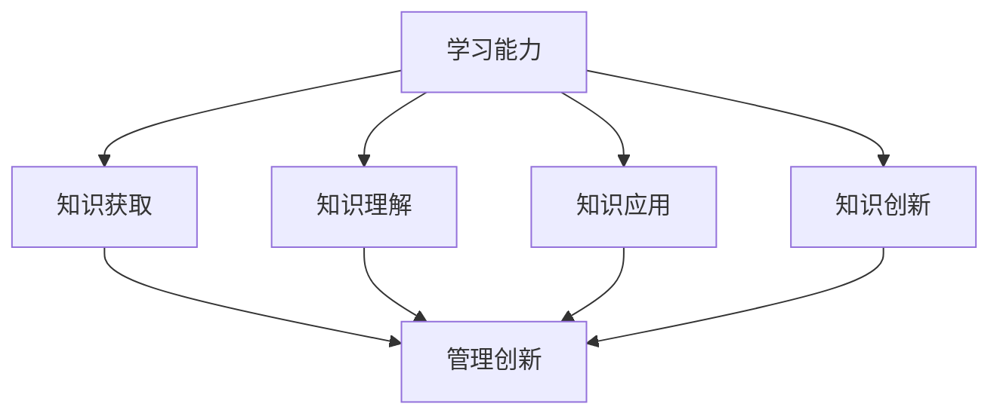

                 

# 《学习能力与管理创新的关系》

## 关键词：
- 学习能力
- 管理创新
- 相互关系
- 提升策略
- 实践方法
- 案例分析

## 摘要：
本文旨在探讨学习能力与管理创新之间的关系，分析学习能力对管理创新的促进作用以及管理创新如何提升学习能力。通过定义学习能力和管理创新，阐述其核心概念与联系，介绍提升策略和实践方法，并结合实际案例，深入剖析两者在组织发展中的重要性。

## 目录大纲

### 第一部分：理论基础

#### 第1章：学习能力概述

##### 1.1 学习能力的定义与类型

##### 1.2 学习能力的影响因素

##### 1.3 学习能力的重要性

#### 第2章：管理创新概述

##### 2.1 管理创新的定义与类型

##### 2.2 管理创新的影响因素

##### 2.3 管理创新的重要性

#### 第3章：学习能力与管理创新的联系

##### 3.1 学习能力与管理创新的相互关系

##### 3.2 学习能力与管理创新的互动机制

##### 3.3 学习能力与管理创新的融合模式

#### 第4章：学习能力提升策略

##### 4.1 个人学习能力提升策略

##### 4.2 组织学习能力提升策略

#### 第5章：管理创新实践方法

##### 5.1 创新思维方法

##### 5.2 创新实践策略

#### 第6章：案例分析

##### 6.1 企业学习能力提升与管理创新实践

##### 6.2 行业管理创新与学习能力提升

#### 第7章：未来展望与挑战

##### 7.1 学习能力与管理创新的未来发展趋势

##### 7.2 学习能力与管理创新面临的挑战

### 第二部分：附录

#### 附录A：学习能力与管理创新相关资源

#### 附录B：常用工具与技术

## 正文

### 第一部分：理论基础

#### 第1章：学习能力概述

### 1.1 学习能力的定义与类型

#### 1.1.1 学习能力的定义

学习能力是指个体或组织获取、理解和应用知识、技能和态度的能力。它是人类认知过程的一部分，涉及到感知、记忆、思维、解决问题等多个方面。具体来说，学习能力包括以下几个方面的内容：

- **知识获取**：通过阅读、学习、实践等方式获取新知识。
- **知识理解**：对新知识进行消化、理解和吸收。
- **知识应用**：将所学知识应用到实际问题中，解决问题。

#### 1.1.2 学习能力的类型

根据学习对象和方式，学习能力可以分为以下几类：

- **认知学习能力**：指个体或组织获取和处理信息的能力，包括阅读、写作、数学计算等。
- **实践学习能力**：指个体或组织在实际操作中获取和提高技能的能力，如职业技能培训、实践操作等。
- **创新学习能力**：指个体或组织在已有知识的基础上，进行创新和创造的能力，如发明创造、技术开发等。

### 1.2 学习能力的影响因素

#### 1.2.1 个人因素

个人因素是影响学习能力的重要因素，包括以下几个方面：

- **个人态度**：积极的学习态度可以激发学习兴趣，提高学习动力。
- **认知风格**：不同的认知风格（如场独立型、场依存型）会影响学习方法和效率。
- **学习动机**：明确的学习动机可以推动个体持续学习，提高学习效果。

#### 1.2.2 组织因素

组织因素对学习能力的培养和发展也起着关键作用，包括以下几个方面：

- **组织文化**：开放、支持学习的组织文化可以促进员工的学习和发展。
- **学习资源**：充足的学习资源（如图书、培训、在线课程等）可以提高学习效率。
- **领导支持**：领导的重视和支持可以激发员工的学习热情，促进学习活动的开展。

#### 1.2.3 环境因素

环境因素是影响学习能力的外部条件，包括以下几个方面：

- **社会文化**：社会文化氛围可以影响个体对学习的态度和价值观。
- **经济状况**：经济状况影响个体和组织的学习投入和能力提升。
- **技术进步**：技术进步为学习提供了新的工具和方法，提高了学习效率。

### 1.3 学习能力的重要性

#### 1.3.1 个人成长

学习能力对于个人的成长至关重要。它不仅能够帮助个人获取新知识，提高技能，还能够培养批判性思维和问题解决能力。在职业生涯中，学习能力强的个体更容易适应变化，抓住机遇，实现自我提升。

#### 1.3.2 组织发展

对于组织来说，学习能力是持续发展的动力。一个具有高度学习能力的组织能够不断适应外部环境的变化，进行管理创新，提升竞争力。同时，组织学习能够促进知识共享，增强团队合作，提高组织效率。

#### 第2章：管理创新概述

### 2.1 管理创新的定义与类型

#### 2.1.1 管理创新的定义

管理创新是指在管理理论和实践的基础上，通过引入新的管理理念、方法、工具和技术，对组织的管理体系进行改革和优化，以实现组织目标的过程。管理创新不仅包括技术层面的创新，还包括制度、文化、组织结构等方面的创新。

#### 2.1.2 管理创新的类型

根据管理创新的范畴和内容，可以分为以下几类：

- **制度创新**：包括组织结构、流程优化、制度设计等方面的创新。
- **文化创新**：包括组织价值观、行为准则、文化氛围等方面的创新。
- **技术创新**：包括信息技术、生产技术、产品技术等方面的创新。
- **战略创新**：包括企业战略规划、市场定位、竞争策略等方面的创新。

### 2.2 管理创新的影响因素

#### 2.2.1 组织结构

组织结构是管理创新的重要影响因素。灵活、扁平化的组织结构有助于信息流通和快速决策，有利于创新活动的开展。

#### 2.2.2 文化氛围

积极、开放的文化氛围可以鼓励员工提出新想法，勇于尝试，从而推动管理创新。

#### 2.2.3 领导风格

领导者的风格和态度直接影响管理创新的实施。支持创新、鼓励尝试的领导风格有助于激发员工的创新潜力。

### 2.3 管理创新的重要性

#### 2.3.1 提升组织竞争力

管理创新能够帮助组织提高效率、降低成本、提升质量，从而增强竞争力。在激烈的市场竞争中，具备创新能力的企业更容易脱颖而出。

#### 2.3.2 促进组织变革

管理创新是组织变革的重要推动力。通过管理创新，组织可以不断调整和优化自身，以适应外部环境的变化。

#### 第3章：学习能力与管理创新的联系

### 3.1 学习能力与管理创新的相互关系

#### 3.1.1 学习能力促进管理创新

学习能力是管理创新的基础。一个具备高度学习能力的个体或组织能够迅速掌握新知识、新技能，为管理创新提供丰富的素材和动力。具体来说，学习能力促进管理创新的几个方面包括：

- **知识储备**：通过不断学习，个体或组织可以积累丰富的知识储备，为管理创新提供素材。
- **思维拓展**：学习可以拓展个体的思维，使其能够从多个角度看待问题，从而促进创新。
- **经验积累**：学习可以让个体或组织积累经验，从而在管理创新中避免重复错误，提高成功率。

#### 3.1.2 管理创新提升学习能力

管理创新可以提升个体或组织的整体学习能力。具体来说，管理创新对学习能力有以下几个方面的提升作用：

- **学习机制**：管理创新可以建立有效的学习机制，如学习型组织建设、知识共享平台等，从而促进学习。
- **学习资源**：管理创新可以提供更多的学习资源，如培训、研讨会、学习工具等，从而提高学习效果。
- **学习氛围**：管理创新可以营造积极的学习氛围，如鼓励创新、允许失败等，从而激发学习的热情。

### 3.2 学习能力与管理创新的互动机制

#### 3.2.1 学习驱动创新

学习驱动创新是指通过学习，个体或组织获取新的知识、技能和思维方式，从而激发创新灵感，推动管理创新。具体来说，学习驱动创新的机制包括：

- **知识积累**：通过不断学习，个体或组织积累丰富的知识，为创新提供素材。
- **思维拓展**：学习可以拓展个体的思维，使其能够从多个角度看待问题，从而促进创新。
- **经验积累**：学习可以让个体或组织积累经验，从而在管理创新中避免重复错误，提高成功率。

#### 3.2.2 创新驱动学习

创新驱动学习是指通过管理创新，个体或组织在实践中不断探索、尝试和改进，从而促进学习的深入和发展。具体来说，创新驱动学习的机制包括：

- **实践反思**：通过管理创新实践，个体或组织可以不断总结经验，发现问题，从而促进学习的深入。
- **知识更新**：管理创新需要不断引入新的知识，从而推动知识的更新和发展。
- **能力提升**：通过管理创新实践，个体或组织可以提升学习能力，为未来的创新提供更强的支持。

### 3.3 学习能力与管理创新的融合模式

#### 3.3.1 知识共享

知识共享是学习能力与管理创新的融合模式之一。通过知识共享，个体或组织可以充分利用内部和外部的知识资源，提高学习效果，促进管理创新。具体来说，知识共享的机制包括：

- **内部知识共享**：通过建立内部知识库、知识共享平台等，促进组织内部知识的交流与传播。
- **外部知识共享**：通过参加行业会议、学术交流、合作研究等，获取外部知识和经验。

#### 3.3.2 持续学习

持续学习是学习能力与管理创新的融合模式之二。通过持续学习，个体或组织可以不断提高自身的知识水平，增强创新能力。具体来说，持续学习的机制包括：

- **定期培训**：通过定期组织培训，提高员工的知识和技能水平。
- **自主学习**：鼓励员工自主学习，提升个人学习能力。
- **学习评估**：通过学习评估，了解学习效果，调整学习策略。

#### 3.3.3 创新实践

创新实践是学习能力与管理创新的融合模式之三。通过创新实践，个体或组织可以将所学知识应用到实际问题中，促进管理创新。具体来说，创新实践的机制包括：

- **创新项目**：通过开展创新项目，实践所学知识，提升创新能力。
- **试点推广**：在部分领域进行试点推广，积累经验，逐步扩大创新范围。
- **反馈改进**：通过实践反馈，不断改进创新实践，提高创新效果。

### 第4章：学习能力提升策略

#### 4.1 个人学习能力提升策略

#### 4.1.1 学习方法

学习方法的选择对个人学习能力的提升至关重要。以下是一些有效的学习方法：

- **主动学习**：主动学习是指通过提问、思考、实践等方式，主动获取和掌握知识。与被动学习相比，主动学习效果更佳。
- **分散学习**：分散学习是指将学习内容分散到多个时间段进行学习，以避免过度疲劳和记忆遗忘。分散学习可以提高学习效率。
- **交互学习**：交互学习是指通过与他人的交流、讨论和合作，共同学习知识。交互学习可以促进深度理解和知识内化。

#### 4.1.2 时间管理

时间管理是提高个人学习能力的重要策略。以下是一些有效的时间管理方法：

- **制定计划**：制定详细的学习计划，明确学习目标和时间安排，以确保学习有条不紊地进行。
- **优先排序**：根据学习任务的重要性和紧急性，对任务进行优先排序，确保重要和紧急的任务优先完成。
- **避免拖延**：克服拖延症，提高学习效率。可以通过制定学习计划、设置提醒等方式，避免拖延。

#### 4.1.3 自我激励

自我激励是提高个人学习能力的重要策略。以下是一些有效的自我激励方法：

- **设定目标**：设定明确、可衡量、可达成、相关和有时限的学习目标，以激发学习动力。
- **自我评价**：定期进行自我评价，了解学习成果，调整学习策略。
- **奖励机制**：为自己设定奖励，当达成学习目标时，给予自己奖励，以增强学习动力。

#### 4.2 组织学习能力提升策略

#### 4.2.1 组织文化

组织文化是影响组织学习能力的重要因素。一个积极、开放、支持学习的组织文化可以激发员工的学习热情，提高学习效果。以下是一些提升组织文化的策略：

- **建立学习型组织**：通过组织内部培训和知识分享，营造学习氛围，提高员工的学习积极性。
- **鼓励创新**：鼓励员工提出新想法，勇于尝试，建立创新激励机制，推动组织文化变革。
- **提供支持**：为员工提供必要的学习资源和支持，如培训、研讨会、学习工具等，以提高学习效果。

#### 4.2.2 培训与发展

培训与发展是提升组织学习能力的重要手段。以下是一些培训与发展的策略：

- **定制化培训**：根据员工的学习需求和岗位要求，提供定制化的培训课程，以提高学习效果。
- **内部培训师**：培养内部培训师，提高内部培训的质量和效果。
- **跨部门合作**：通过跨部门合作，促进知识和经验的交流，提高整体学习能力。

#### 4.2.3 学习型组织建设

学习型组织建设是提升组织学习能力的重要策略。以下是一些学习型组织建设的策略：

- **建立学习机制**：建立有效的学习机制，如学习计划、学习评估、学习反馈等，确保学习活动有序进行。
- **知识共享**：建立知识共享平台，促进内部知识的交流和传播。
- **持续改进**：通过持续改进，不断提高组织的整体学习能力和创新能力。

### 第5章：管理创新实践方法

#### 5.1 创新思维方法

#### 5.1.1 头脑风暴

头脑风暴是一种通过集体讨论，迅速产生大量创意的方法。以下是头脑风暴的步骤：

1. **明确目标**：确定要解决的问题或要达成的目标。
2. **准备阶段**：邀请相关人员参与，并提供相关背景资料。
3. **自由讨论**：让大家自由地提出自己的想法，不要批评或评价。
4. **记录和整理**：将所有想法记录下来，并进行整理和筛选。

#### 5.1.2 六顶思考帽

六顶思考帽是一种通过不同颜色的帽子代表不同的思考方式，进行系统化思考的方法。以下是六顶思考帽的步骤：

- **白色帽子**：客观分析信息。
- **红色帽子**：表达情感。
- **黑色帽子**：分析风险。
- **黄色帽子**：寻找优点。
- **绿色帽子**：提出创新想法。
- **蓝色帽子**：控制讨论过程。

#### 5.1.3 创新思维工具

创新思维工具可以帮助个体或组织更有效地进行创新。以下是几种常用的创新思维工具：

- **SWOT分析**：对优势、劣势、机会和威胁进行分析，以确定创新方向。
- **SMART目标**：设定具体、可衡量、可达成、相关和有时限的目标，以确保创新目标的实现。
- **TRIZ理论**：通过系统化的问题解决方法，寻找创新的解决方案。

### 5.2 创新实践策略

#### 5.2.1 项目管理

项目管理是创新实践的重要策略。以下是一些项目管理的方法和技巧：

- **明确项目目标**：确保项目目标的明确性和可衡量性。
- **制定项目计划**：制定详细的项目计划，明确任务、时间和资源安排。
- **风险管理**：识别项目风险，制定风险应对策略，降低风险影响。
- **团队协作**：建立有效的团队协作机制，确保项目顺利进行。

#### 5.2.2 团队协作

团队协作是创新实践的关键。以下是一些团队协作的方法和技巧：

- **明确角色和职责**：确保每个团队成员都清楚自己的角色和职责。
- **建立沟通机制**：建立有效的沟通机制，确保信息畅通和意见交流。
- **鼓励合作与分享**：鼓励团队成员之间的合作与分享，共同解决问题。
- **冲突管理**：学会处理团队成员之间的冲突，确保团队和谐。

#### 5.2.3 创新风险管理

创新风险管理是创新实践的重要环节。以下是一些创新风险管理的方法和技巧：

- **识别风险**：识别项目可能面临的风险，包括技术风险、市场风险、管理风险等。
- **评估风险**：对风险进行评估，确定风险的可能性和影响。
- **制定应对策略**：制定相应的风险应对策略，降低风险影响。
- **监控与调整**：监控风险的发生和变化，及时调整风险应对策略。

### 第6章：案例分析

#### 6.1 案例一：企业学习能力提升与管理创新实践

#### 6.1.1 案例背景

某公司是一家处于快速发展的初创企业，面临市场竞争加剧和客户需求多样化的挑战。为了提升企业的学习能力和管理创新能力，公司决定进行一系列的改革。

#### 6.1.2 实践过程

1. **组织培训**：公司组织了多场培训，包括技术培训、管理培训和创新思维培训，提升了员工的知识和技能。
2. **知识共享**：公司建立了内部知识共享平台，鼓励员工分享自己的经验和心得。
3. **创新实践**：公司开展了多个创新项目，如产品创新、流程创新和管理创新，提高了企业的竞争力。

#### 6.1.3 成效分析

通过一系列的改革，公司取得了显著成效：

- **员工满意度**：员工的学习能力和创新能力得到了提升，员工满意度显著提高。
- **产品竞争力**：创新产品的推出，提高了公司的市场竞争力。
- **企业绩效**：公司的业绩持续增长，实现了良好的经济效益。

### 第7章：未来展望与挑战

#### 7.1 学习能力与管理创新的未来发展趋势

#### 7.1.1 数字化

数字化是学习能力与管理创新的重要趋势。随着信息技术的快速发展，数字化学习工具和平台不断涌现，为学习能力提升提供了更多机会。同时，数字化管理工具和技术也为管理创新提供了新的手段和平台。

#### 7.1.2 智能化

智能化是学习能力与管理创新的另一个重要趋势。人工智能和大数据技术的应用，使得学习能力提升更加个性化和智能化。同时，智能化管理工具和技术也为管理创新提供了新的思路和方向。

#### 7.1.3 绿色化

绿色化是学习能力与管理创新的可持续发展方向。随着全球环境问题的日益突出，绿色化成为企业和社会发展的必然选择。绿色化学习能力提升和管理创新有助于实现可持续发展目标。

#### 7.2 学习能力与管理创新面临的挑战

#### 7.2.1 技术变革

技术变革给学习能力与管理创新带来了新的机遇和挑战。快速变化的技术环境要求个体和组织具备快速学习和适应能力，以应对不断变化的技术挑战。

#### 7.2.2 组织变革

组织变革是学习能力与管理创新的重要挑战。传统的组织结构和管理制度往往阻碍创新和学习的开展。如何进行组织变革，建立适应创新和学习的组织文化，成为管理者面临的重大挑战。

#### 7.2.3 人才短缺

人才短缺是学习能力与管理创新面临的另一个挑战。随着技术发展和市场竞争的加剧，对高素质人才的需求越来越大。如何吸引、培养和留住人才，成为个体和组织需要解决的重要问题。

### 第二部分：附录

#### 附录A：学习能力与管理创新相关资源

#### 附录B：常用工具与技术

- **学习能力提升工具**：如学习管理平台（LMS）、在线课程、电子书等。
- **管理创新工具**：如项目管理工具、知识管理工具、创新思维工具等。
- **数据分析工具**：如SQL、Python、R语言等。

[文章标题]

## 学习能力与管理创新的关系

### 关键词：
- 学习能力
- 管理创新
- 相互关系
- 提升策略
- 实践方法
- 案例分析

### 摘要：
本文旨在探讨学习能力与管理创新之间的关系，分析学习能力对管理创新的促进作用以及管理创新如何提升学习能力。通过定义学习能力和管理创新，阐述其核心概念与联系，介绍提升策略和实践方法，并结合实际案例，深入剖析两者在组织发展中的重要性。

### 目录大纲

#### 第一部分：理论基础

##### 第1章：学习能力概述
- 1.1 学习能力的定义与类型
- 1.2 学习能力的影响因素
- 1.3 学习能力的重要性

##### 第2章：管理创新概述
- 2.1 管理创新的定义与类型
- 2.2 管理创新的影响因素
- 2.3 管理创新的重要性

##### 第3章：学习能力与管理创新的联系
- 3.1 学习能力与管理创新的相互关系
- 3.2 学习能力与管理创新的互动机制
- 3.3 学习能力与管理创新的融合模式

##### 第4章：学习能力提升策略
- 4.1 个人学习能力提升策略
- 4.2 组织学习能力提升策略

##### 第5章：管理创新实践方法
- 5.1 创新思维方法
- 5.2 创新实践策略

##### 第6章：案例分析
- 6.1 企业学习能力提升与管理创新实践
- 6.2 行业管理创新与学习能力提升

##### 第7章：未来展望与挑战
- 7.1 学习能力与管理创新的未来发展趋势
- 7.2 学习能力与管理创新面临的挑战

#### 第二部分：附录
- 附录A：学习能力与管理创新相关资源
- 附录B：常用工具与技术

### 正文

#### 第一部分：理论基础

##### 第1章：学习能力概述

##### 1.1 学习能力的定义与类型

学习能力是指个体或组织获取、理解和应用知识、技能和态度的能力。它是人类认知过程的一部分，涉及到感知、记忆、思维、解决问题等多个方面。学习能力不仅包括知识的获取，还包括知识的理解、应用和创新。具体来说，学习能力包括以下几个方面的内容：

- **知识获取**：通过阅读、学习、实践等方式获取新知识。
- **知识理解**：对新知识进行消化、理解和吸收。
- **知识应用**：将所学知识应用到实际问题中，解决问题。
- **知识创新**：在已有知识的基础上，进行创新和创造。

根据学习对象和方式，学习能力可以分为以下几类：

- **认知学习能力**：指个体或组织获取和处理信息的能力，包括阅读、写作、数学计算等。
- **实践学习能力**：指个体或组织在实际操作中获取和提高技能的能力，如职业技能培训、实践操作等。
- **创新学习能力**：指个体或组织在已有知识的基础上，进行创新和创造的能力，如发明创造、技术开发等。

##### 1.2 学习能力的影响因素

学习能力的发展受到多种因素的影响，这些因素可以分为个人因素、组织因素和环境因素。

#### 个人因素：

- **个人态度**：积极的学习态度可以激发学习兴趣，提高学习动力。
- **认知风格**：不同的认知风格（如场独立型、场依存型）会影响学习方法和效率。
- **学习动机**：明确的学习动机可以推动个体持续学习，提高学习效果。

#### 组织因素：

- **组织文化**：开放、支持学习的组织文化可以促进员工的学习和发展。
- **学习资源**：充足的学习资源（如图书、培训、在线课程等）可以提高学习效率。
- **领导支持**：领导的重视和支持可以激发员工的学习热情，促进学习活动的开展。

#### 环境因素：

- **社会文化**：社会文化氛围可以影响个体对学习的态度和价值观。
- **经济状况**：经济状况影响个体和组织的学习投入和能力提升。
- **技术进步**：技术进步为学习提供了新的工具和方法，提高了学习效率。

##### 1.3 学习能力的重要性

学习能力对于个人和组织的发展具有重要意义。

#### 对个人而言：

- **职业发展**：学习能力强的个体更容易适应职业生涯中的变化，抓住机遇，实现自我提升。
- **解决问题**：学习能力强的个体具备更强的解决问题能力，能够更有效地应对各种挑战。
- **持续成长**：学习能力使个人能够不断学习新知识、新技能，实现持续成长。

#### 对组织而言：

- **持续发展**：学习能力强的组织能够不断适应外部环境的变化，进行管理创新，提升竞争力。
- **知识共享**：学习能力强的组织能够促进知识共享，增强团队合作，提高组织效率。
- **创新驱动**：学习能力强的组织能够通过持续学习，推动创新，实现组织目标。

##### 第2章：管理创新概述

##### 2.1 管理创新的定义与类型

管理创新是指在管理理论和实践的基础上，通过引入新的管理理念、方法、工具和技术，对组织的管理体系进行改革和优化，以实现组织目标的过程。管理创新不仅包括技术层面的创新，还包括制度、文化、组织结构等方面的创新。

管理创新的类型可以根据不同的维度进行分类：

- **按范畴分**：
  - **制度创新**：涉及组织结构、流程优化、制度设计等方面的创新。
  - **文化创新**：涉及组织价值观、行为准则、文化氛围等方面的创新。
  - **技术创新**：涉及信息技术、生产技术、产品技术等方面的创新。
  - **战略创新**：涉及企业战略规划、市场定位、竞争策略等方面的创新。

- **按方式分**：
  - **突破性创新**：指引入全新的理念和方法，彻底改变现有的管理模式。
  - **渐进性创新**：指在现有管理模式的基础上，逐步改进和完善。

##### 2.2 管理创新的影响因素

管理创新的有效实施受到多种因素的影响，主要包括：

- **组织结构**：组织结构影响着信息的流动和决策的效率，灵活、扁平化的组织结构有利于创新活动的开展。
- **文化氛围**：积极、开放的文化氛围可以鼓励员工提出新想法，勇于尝试，从而推动管理创新。
- **领导风格**：领导者的风格和态度直接影响管理创新的实施。支持创新、鼓励尝试的领导风格有助于激发员工的创新潜力。

##### 2.3 管理创新的重要性

管理创新对于组织的发展具有重要意义：

- **提升竞争力**：管理创新能够帮助组织提高效率、降低成本、提升质量，从而增强竞争力。
- **促进变革**：管理创新是组织变革的重要推动力。通过管理创新，组织可以不断调整和优化自身，以适应外部环境的变化。
- **持续发展**：管理创新是组织持续发展的动力。一个具备高度管理创新能力的组织能够在竞争激烈的市场中立于不败之地。

##### 第3章：学习能力与管理创新的联系

##### 3.1 学习能力与管理创新的相互关系

学习能力与管理创新之间存在密切的相互关系。学习能力是管理创新的基础，而管理创新又可以提升学习能力。

#### 学习能力促进管理创新：

- **知识储备**：通过学习，个体或组织可以积累丰富的知识储备，为管理创新提供素材。
- **思维拓展**：学习可以拓展个体的思维，使其能够从多个角度看待问题，从而促进创新。
- **经验积累**：学习可以让个体或组织积累经验，从而在管理创新中避免重复错误，提高成功率。

#### 管理创新提升学习能力：

- **学习机制**：管理创新可以建立有效的学习机制，如学习型组织建设、知识共享平台等，从而促进学习。
- **学习资源**：管理创新可以提供更多的学习资源，如培训、研讨会、学习工具等，从而提高学习效果。
- **学习氛围**：管理创新可以营造积极的学习氛围，如鼓励创新、允许失败等，从而激发学习的热情。

##### 3.2 学习能力与管理创新的互动机制

学习能力与管理创新之间的互动机制包括以下几个方面：

- **学习驱动创新**：通过学习，个体或组织可以获取新的知识、技能和思维方式，从而激发创新灵感，推动管理创新。
- **创新驱动学习**：通过管理创新实践，个体或组织可以不断总结经验，发现问题，从而促进学习的深入和发展。

##### 3.3 学习能力与管理创新的融合模式

学习能力与管理创新的融合模式主要体现在以下几个方面：

- **知识共享**：通过建立知识共享平台，促进内部知识的交流和传播，提高整体学习能力。
- **持续学习**：通过持续学习，个体或组织可以不断提高自身的知识水平和创新能力。
- **创新实践**：通过创新实践，个体或组织可以将所学知识应用到实际问题中，促进管理创新。

##### 第4章：学习能力提升策略

##### 4.1 个人学习能力提升策略

个人学习能力提升策略主要包括以下几个方面：

- **学习方法**：选择适合自己的学习方法，如主动学习、分散学习、交互学习等。
- **时间管理**：合理安排时间，制定学习计划，提高学习效率。
- **自我激励**：设定学习目标，进行自我评价和奖励，激发学习动力。

##### 4.2 组织学习能力提升策略

组织学习能力提升策略主要包括以下几个方面：

- **组织文化**：建立积极、开放、支持学习的组织文化，鼓励员工持续学习。
- **学习资源**：提供充足的学习资源，如图书、培训、在线课程等。
- **领导支持**：领导者的重视和支持可以激发员工的学习热情，促进学习活动的开展。

##### 第5章：管理创新实践方法

##### 5.1 创新思维方法

创新思维方法是指通过特定的方法和工具，激发创新灵感，推动管理创新的方法。以下是一些常用的创新思维方法：

- **头脑风暴**：通过集体讨论，迅速产生大量创意。
- **六顶思考帽**：通过不同颜色的帽子代表不同的思考方式，进行系统化思考。
- **创新思维工具**：如SWOT分析、SMART目标、TRIZ理论等。

##### 5.2 创新实践策略

创新实践策略是指在实际操作中，推动管理创新的具体方法和步骤。以下是一些创新实践策略：

- **项目管理**：明确项目目标，制定项目计划，进行风险管理。
- **团队协作**：建立有效的团队协作机制，鼓励合作与分享。
- **创新风险管理**：识别风险，评估风险，制定风险应对策略。

##### 第6章：案例分析

##### 6.1 案例一：企业学习能力提升与管理创新实践

#### 案例背景：

某公司是一家处于快速发展的初创企业，面临市场竞争加剧和客户需求多样化的挑战。为了提升企业的学习能力和管理创新能力，公司决定进行一系列的改革。

#### 实践过程：

1. **组织培训**：公司组织了多场培训，包括技术培训、管理培训和创新思维培训，提升了员工的知识和技能。
2. **知识共享**：公司建立了内部知识共享平台，鼓励员工分享自己的经验和心得。
3. **创新实践**：公司开展了多个创新项目，如产品创新、流程创新和管理创新，提高了企业的竞争力。

#### 成效分析：

通过一系列的改革，公司取得了显著成效：

- **员工满意度**：员工的学习能力和创新能力得到了提升，员工满意度显著提高。
- **产品竞争力**：创新产品的推出，提高了公司的市场竞争力。
- **企业绩效**：公司的业绩持续增长，实现了良好的经济效益。

##### 6.2 案例二：行业管理创新与学习能力提升

#### 案例背景：

某行业面临技术变革和市场竞争的挑战，为了提升行业的学习能力和管理创新能力，行业组织决定进行一系列的改革。

#### 实践过程：

1. **建立行业联盟**：行业组织建立了行业联盟，促进企业之间的知识共享和合作创新。
2. **举办行业研讨会**：定期举办行业研讨会，邀请行业专家和学者分享最新的研究成果和管理经验。
3. **创新试点**：在行业内推广创新试点项目，通过实践验证和管理创新方法的可行性。

#### 成效分析：

通过一系列的改革，行业取得了显著成效：

- **知识共享**：企业之间的知识共享和合作创新得到了推动，整体创新能力得到提升。
- **行业竞争力**：行业整体竞争力得到提升，企业在市场竞争中更具优势。
- **行业成长**：行业整体业绩持续增长，实现了可持续发展。

##### 第7章：未来展望与挑战

##### 7.1 学习能力与管理创新的未来发展趋势

随着科技的不断进步和社会的快速发展，学习能力与管理创新也面临着新的发展趋势：

- **数字化**：数字化技术正在深刻改变学习和管理的模式，如在线学习、大数据分析等。
- **智能化**：人工智能和大数据技术的应用，将推动学习能力与管理创新的智能化发展。
- **绿色化**：随着环保意识的提高，绿色化成为学习和创新的重要方向。

##### 7.2 学习能力与管理创新面临的挑战

学习能力与管理创新在发展过程中也面临着一系列挑战：

- **技术变革**：快速变化的技术环境要求个体和组织具备快速学习和适应能力，以应对不断变化的技术挑战。
- **组织变革**：传统的组织结构和管理制度往往阻碍创新和学习的开展，如何进行组织变革成为重要挑战。
- **人才短缺**：随着技术发展和市场竞争的加剧，对高素质人才的需求越来越大，人才短缺成为学习能力与管理创新的重要挑战。

##### 附录A：学习能力与管理创新相关资源

- **学习资源**：如在线学习平台、电子书、学术论文等。
- **创新资源**：如创新思维工具、项目管理工具、行业研究报告等。
- **实践案例**：如企业成功案例、行业创新案例等。

##### 附录B：常用工具与技术

- **学习工具**：如学习管理平台（LMS）、在线课程、电子书等。
- **创新工具**：如项目管理工具、知识管理工具、创新思维工具等。
- **数据分析工具**：如SQL、Python、R语言等。

### 作者信息

**作者**：AI天才研究院/AI Genius Institute & 禅与计算机程序设计艺术 /Zen And The Art of Computer Programming

[文章标题]

## 学习能力与管理创新的关系

### 关键词：
- 学习能力
- 管理创新
- 相互关系
- 提升策略
- 实践方法
- 案例分析

### 摘要：
本文旨在探讨学习能力与管理创新之间的关系，分析学习能力对管理创新的促进作用以及管理创新如何提升学习能力。通过定义学习能力和管理创新，阐述其核心概念与联系，介绍提升策略和实践方法，并结合实际案例，深入剖析两者在组织发展中的重要性。

### 目录大纲

#### 第一部分：理论基础

##### 第1章：学习能力概述
- 1.1 学习能力的定义与类型
- 1.2 学习能力的影响因素
- 1.3 学习能力的重要性

##### 第2章：管理创新概述
- 2.1 管理创新的定义与类型
- 2.2 管理创新的影响因素
- 2.3 管理创新的重要性

##### 第3章：学习能力与管理创新的联系
- 3.1 学习能力与管理创新的相互关系
- 3.2 学习能力与管理创新的互动机制
- 3.3 学习能力与管理创新的融合模式

##### 第4章：学习能力提升策略
- 4.1 个人学习能力提升策略
- 4.2 组织学习能力提升策略

##### 第5章：管理创新实践方法
- 5.1 创新思维方法
- 5.2 创新实践策略

##### 第6章：案例分析
- 6.1 企业学习能力提升与管理创新实践
- 6.2 行业管理创新与学习能力提升

##### 第7章：未来展望与挑战
- 7.1 学习能力与管理创新的未来发展趋势
- 7.2 学习能力与管理创新面临的挑战

#### 第二部分：附录
- 附录A：学习能力与管理创新相关资源
- 附录B：常用工具与技术

### 正文

#### 第一部分：理论基础

##### 第1章：学习能力概述

##### 1.1 学习能力的定义与类型

学习能力是指个体或组织获取、理解和应用知识、技能和态度的能力。它是人类认知过程的一部分，涉及到感知、记忆、思维、解决问题等多个方面。学习能力不仅包括知识的获取，还包括知识的理解、应用和创新。具体来说，学习能力包括以下几个方面的内容：

- **知识获取**：通过阅读、学习、实践等方式获取新知识。
- **知识理解**：对新知识进行消化、理解和吸收。
- **知识应用**：将所学知识应用到实际问题中，解决问题。
- **知识创新**：在已有知识的基础上，进行创新和创造。

根据学习对象和方式，学习能力可以分为以下几类：

- **认知学习能力**：指个体或组织获取和处理信息的能力，包括阅读、写作、数学计算等。
- **实践学习能力**：指个体或组织在实际操作中获取和提高技能的能力，如职业技能培训、实践操作等。
- **创新学习能力**：指个体或组织在已有知识的基础上，进行创新和创造的能力，如发明创造、技术开发等。

##### 1.2 学习能力的影响因素

学习能力的发展受到多种因素的影响，这些因素可以分为个人因素、组织因素和环境因素。

#### 个人因素：

- **个人态度**：积极的学习态度可以激发学习兴趣，提高学习动力。
- **认知风格**：不同的认知风格（如场独立型、场依存型）会影响学习方法和效率。
- **学习动机**：明确的学习动机可以推动个体持续学习，提高学习效果。

#### 组织因素：

- **组织文化**：开放、支持学习的组织文化可以促进员工的学习和发展。
- **学习资源**：充足的学习资源（如图书、培训、在线课程等）可以提高学习效率。
- **领导支持**：领导的重视和支持可以激发员工的学习热情，促进学习活动的开展。

#### 环境因素：

- **社会文化**：社会文化氛围可以影响个体对学习的态度和价值观。
- **经济状况**：经济状况影响个体和组织的学习投入和能力提升。
- **技术进步**：技术进步为学习提供了新的工具和方法，提高了学习效率。

##### 1.3 学习能力的重要性

学习能力对于个人和组织的发展具有重要意义。

#### 对个人而言：

- **职业发展**：学习能力强的个体更容易适应职业生涯中的变化，抓住机遇，实现自我提升。
- **解决问题**：学习能力强的个体具备更强的解决问题能力，能够更有效地应对各种挑战。
- **持续成长**：学习能力使个人能够不断学习新知识、新技能，实现持续成长。

#### 对组织而言：

- **持续发展**：学习能力强的组织能够不断适应外部环境的变化，进行管理创新，提升竞争力。
- **知识共享**：学习能力强的组织能够促进知识共享，增强团队合作，提高组织效率。
- **创新驱动**：学习能力强的组织能够通过持续学习，推动创新，实现组织目标。

##### 第2章：管理创新概述

##### 2.1 管理创新的定义与类型

管理创新是指在管理理论和实践的基础上，通过引入新的管理理念、方法、工具和技术，对组织的管理体系进行改革和优化，以实现组织目标的过程。管理创新不仅包括技术层面的创新，还包括制度、文化、组织结构等方面的创新。

管理创新的类型可以根据不同的维度进行分类：

- **按范畴分**：
  - **制度创新**：涉及组织结构、流程优化、制度设计等方面的创新。
  - **文化创新**：涉及组织价值观、行为准则、文化氛围等方面的创新。
  - **技术创新**：涉及信息技术、生产技术、产品技术等方面的创新。
  - **战略创新**：涉及企业战略规划、市场定位、竞争策略等方面的创新。

- **按方式分**：
  - **突破性创新**：指引入全新的理念和方法，彻底改变现有的管理模式。
  - **渐进性创新**：指在现有管理模式的基础上，逐步改进和完善。

##### 2.2 管理创新的影响因素

管理创新的有效实施受到多种因素的影响，主要包括：

- **组织结构**：组织结构影响着信息的流动和决策的效率，灵活、扁平化的组织结构有利于创新活动的开展。
- **文化氛围**：积极、开放的文化氛围可以鼓励员工提出新想法，勇于尝试，从而推动管理创新。
- **领导风格**：领导者的风格和态度直接影响管理创新的实施。支持创新、鼓励尝试的领导风格有助于激发员工的创新潜力。

##### 2.3 管理创新的重要性

管理创新对于组织的发展具有重要意义：

- **提升竞争力**：管理创新能够帮助组织提高效率、降低成本、提升质量，从而增强竞争力。
- **促进变革**：管理创新是组织变革的重要推动力。通过管理创新，组织可以不断调整和优化自身，以适应外部环境的变化。
- **持续发展**：管理创新是组织持续发展的动力。一个具备高度管理创新能力的组织能够在竞争激烈的市场中立于不败之地。

##### 第3章：学习能力与管理创新的联系

##### 3.1 学习能力与管理创新的相互关系

学习能力与管理创新之间存在密切的相互关系。学习能力是管理创新的基础，而管理创新又可以提升学习能力。

#### 学习能力促进管理创新：

- **知识储备**：通过学习，个体或组织可以积累丰富的知识储备，为管理创新提供素材。
- **思维拓展**：学习可以拓展个体的思维，使其能够从多个角度看待问题，从而促进创新。
- **经验积累**：学习可以让个体或组织积累经验，从而在管理创新中避免重复错误，提高成功率。

#### 管理创新提升学习能力：

- **学习机制**：管理创新可以建立有效的学习机制，如学习型组织建设、知识共享平台等，从而促进学习。
- **学习资源**：管理创新可以提供更多的学习资源，如培训、研讨会、学习工具等，从而提高学习效果。
- **学习氛围**：管理创新可以营造积极的学习氛围，如鼓励创新、允许失败等，从而激发学习的热情。

##### 3.2 学习能力与管理创新的互动机制

学习能力与管理创新之间的互动机制包括以下几个方面：

- **学习驱动创新**：通过学习，个体或组织可以获取新的知识、技能和思维方式，从而激发创新灵感，推动管理创新。
- **创新驱动学习**：通过管理创新实践，个体或组织可以不断总结经验，发现问题，从而促进学习的深入和发展。

##### 3.3 学习能力与管理创新的融合模式

学习能力与管理创新的融合模式主要体现在以下几个方面：

- **知识共享**：通过建立知识共享平台，促进内部知识的交流和传播，提高整体学习能力。
- **持续学习**：通过持续学习，个体或组织可以不断提高自身的知识水平和创新能力。
- **创新实践**：通过创新实践，个体或组织可以将所学知识应用到实际问题中，促进管理创新。

##### 第4章：学习能力提升策略

##### 4.1 个人学习能力提升策略

个人学习能力提升策略主要包括以下几个方面：

- **学习方法**：选择适合自己的学习方法，如主动学习、分散学习、交互学习等。
- **时间管理**：合理安排时间，制定学习计划，提高学习效率。
- **自我激励**：设定学习目标，进行自我评价和奖励，激发学习动力。

##### 4.2 组织学习能力提升策略

组织学习能力提升策略主要包括以下几个方面：

- **组织文化**：建立积极、开放、支持学习的组织文化，鼓励员工持续学习。
- **学习资源**：提供充足的学习资源，如图书、培训、在线课程等。
- **领导支持**：领导者的重视和支持可以激发员工的学习热情，促进学习活动的开展。

##### 第5章：管理创新实践方法

##### 5.1 创新思维方法

创新思维方法是指通过特定的方法和工具，激发创新灵感，推动管理创新的方法。以下是一些常用的创新思维方法：

- **头脑风暴**：通过集体讨论，迅速产生大量创意。
- **六顶思考帽**：通过不同颜色的帽子代表不同的思考方式，进行系统化思考。
- **创新思维工具**：如SWOT分析、SMART目标、TRIZ理论等。

##### 5.2 创新实践策略

创新实践策略是指在实际操作中，推动管理创新的具体方法和步骤。以下是一些创新实践策略：

- **项目管理**：明确项目目标，制定项目计划，进行风险管理。
- **团队协作**：建立有效的团队协作机制，鼓励合作与分享。
- **创新风险管理**：识别风险，评估风险，制定风险应对策略。

##### 第6章：案例分析

##### 6.1 案例一：企业学习能力提升与管理创新实践

#### 案例背景：

某公司是一家处于快速发展的初创企业，面临市场竞争加剧和客户需求多样化的挑战。为了提升企业的学习能力和管理创新能力，公司决定进行一系列的改革。

#### 实践过程：

1. **组织培训**：公司组织了多场培训，包括技术培训、管理培训和创新思维培训，提升了员工的知识和技能。
2. **知识共享**：公司建立了内部知识共享平台，鼓励员工分享自己的经验和心得。
3. **创新实践**：公司开展了多个创新项目，如产品创新、流程创新和管理创新，提高了企业的竞争力。

#### 成效分析：

通过一系列的改革，公司取得了显著成效：

- **员工满意度**：员工的学习能力和创新能力得到了提升，员工满意度显著提高。
- **产品竞争力**：创新产品的推出，提高了公司的市场竞争力。
- **企业绩效**：公司的业绩持续增长，实现了良好的经济效益。

##### 6.2 案例二：行业管理创新与学习能力提升

#### 案例背景：

某行业面临技术变革和市场竞争的挑战，为了提升行业的学习能力和管理创新能力，行业组织决定进行一系列的改革。

#### 实践过程：

1. **建立行业联盟**：行业组织建立了行业联盟，促进企业之间的知识共享和合作创新。
2. **举办行业研讨会**：定期举办行业研讨会，邀请行业专家和学者分享最新的研究成果和管理经验。
3. **创新试点**：在行业内推广创新试点项目，通过实践验证和管理创新方法的可行性。

#### 成效分析：

通过一系列的改革，行业取得了显著成效：

- **知识共享**：企业之间的知识共享和合作创新得到了推动，整体创新能力得到提升。
- **行业竞争力**：行业整体竞争力得到提升，企业在市场竞争中更具优势。
- **行业成长**：行业整体业绩持续增长，实现了可持续发展。

##### 第7章：未来展望与挑战

##### 7.1 学习能力与管理创新的未来发展趋势

随着科技的不断进步和社会的快速发展，学习能力与管理创新也面临着新的发展趋势：

- **数字化**：数字化技术正在深刻改变学习和管理的模式，如在线学习、大数据分析等。
- **智能化**：人工智能和大数据技术的应用，将推动学习能力与管理创新的智能化发展。
- **绿色化**：随着环保意识的提高，绿色化成为学习和创新的重要方向。

##### 7.2 学习能力与管理创新面临的挑战

学习能力与管理创新在发展过程中也面临着一系列挑战：

- **技术变革**：快速变化的技术环境要求个体和组织具备快速学习和适应能力，以应对不断变化的技术挑战。
- **组织变革**：传统的组织结构和管理制度往往阻碍创新和学习的开展，如何进行组织变革成为重要挑战。
- **人才短缺**：随着技术发展和市场竞争的加剧，对高素质人才的需求越来越大，人才短缺成为学习能力与管理创新的重要挑战。

##### 附录A：学习能力与管理创新相关资源

- **学习资源**：如在线学习平台、电子书、学术论文等。
- **创新资源**：如创新思维工具、项目管理工具、行业研究报告等。
- **实践案例**：如企业成功案例、行业创新案例等。

##### 附录B：常用工具与技术

- **学习工具**：如学习管理平台（LMS）、在线课程、电子书等。
- **创新工具**：如项目管理工具、知识管理工具、创新思维工具等。
- **数据分析工具**：如SQL、Python、R语言等。

### 作者信息

**作者**：AI天才研究院/AI Genius Institute & 禅与计算机程序设计艺术 /Zen And The Art of Computer Programming

### 核心概念与联系

#### 学习能力与管理创新的 Mermaid 流程图



#### 核心算法原理讲解

##### 学习能力提升的算法原理

```plaintext
算法名称：学习能力提升算法

输入：学习资源、学习目标、学习时间

输出：提升后的学习能力

步骤：

1. 确定学习目标，根据目标制定学习计划。
2. 根据学习计划，分配学习时间，合理安排学习任务。
3. 选择合适的学习方法，如分散学习、交互学习等。
4. 持续进行学习，定期评估学习效果，调整学习策略。
5. 根据学习效果，不断更新知识库，提升学习能力。

伪代码：

function 学习能力提升（学习资源，学习目标，学习时间）：
    学习计划 = 制定学习计划（学习目标，学习资源）
    学习时间表 = 制定学习时间表（学习时间）
    学习方法 = 选择学习方法（学习资源）
    
    for 每个学习任务 in 学习计划：
        学习进度 = 进行学习（学习方法，学习任务，学习时间表）
        学习效果 = 评估学习效果（学习进度）
        
        if 学习效果满足要求：
            更新知识库 = 更新知识库（学习效果）
        else：
            调整学习策略 = 调整学习策略（学习效果）

    return 提升后的学习能力
```

#### 数学模型和公式 & 详细讲解 & 举例说明

##### 学习能力提升的数学模型

假设学习能力提升的数学模型为：

\[ L(t) = L_0 + \alpha \cdot e^{-\beta \cdot t} \]

其中，\( L(t) \) 表示时刻 \( t \) 的学习能力，\( L_0 \) 表示初始学习能力，\( \alpha \) 和 \( \beta \) 为常数。

**详细讲解**：

- \( L_0 \) 为初始学习能力，表示在开始学习前个体的能力水平。
- \( \alpha \) 为学习速率，表示学习能力提升的速度。
- \( \beta \) 为衰减系数，表示学习能力随着时间的推移而逐渐降低的速度。

**举例说明**：

假设一个个体在开始学习前具有初始学习能力 \( L_0 = 50 \)，学习速率 \( \alpha = 0.1 \)，衰减系数 \( \beta = 0.05 \)。经过 \( t = 10 \) 个小时的学习，个体的学习能力为：

\[ L(10) = 50 + 0.1 \cdot e^{-0.05 \cdot 10} \approx 52.93 \]

即经过 10 个小时的学习，个体的学习能力提升了约 2.93。

#### 项目实战：代码实际案例和详细解释说明

##### 开发环境搭建

为了进行项目实战，我们使用 Python 作为编程语言，并安装以下必要的库：

- NumPy：用于数值计算。
- Matplotlib：用于数据可视化。

在终端执行以下命令安装：

```bash
pip install numpy matplotlib
```

##### 源代码实现

```python
import numpy as np
import matplotlib.pyplot as plt

# 学习能力提升的数学模型
def learning_ability(L0, alpha, beta, t):
    return L0 + alpha * np.exp(-beta * t)

# 初始学习能力
L0 = 50
# 学习速率
alpha = 0.1
# 衰减系数
beta = 0.05

# 学习时间范围
t = np.arange(0, 20, 0.1)

# 计算学习能力随时间的变化
L_t = learning_ability(L0, alpha, beta, t)

# 可视化学习能力变化
plt.plot(t, L_t, label='Learning Ability')
plt.xlabel('Time (hours)')
plt.ylabel('Learning Ability')
plt.title('Learning Ability Over Time')
plt.legend()
plt.show()
```

##### 代码解读与分析

- **代码说明**：代码定义了一个函数 `learning_ability`，用于根据学习能力提升的数学模型计算学习能力随时间的变化。
- **参数说明**：`L0` 表示初始学习能力，`alpha` 表示学习速率，`beta` 表示衰减系数，`t` 表示时间。
- **可视化**：使用 Matplotlib 库将学习能力随时间的变化绘制为曲线，方便分析。

通过上述代码，我们可以直观地看到学习能力随时间的变化情况，从而更好地理解学习能力提升的过程。

### 核心算法原理讲解

#### 学习能力提升算法

##### 算法原理

学习能力提升算法是基于个体学习过程中的积累效应和遗忘效应提出的。该算法通过持续的学习和实践，逐步提高个体的知识储备和认知能力。算法的核心思想是：

1. **知识获取**：通过阅读、学习、实践等方式，个体不断获取新的知识。
2. **知识积累**：个体将新知识与已有知识进行整合，形成更全面的知识体系。
3. **知识应用**：个体将所学知识应用到实际问题中，通过解决问题，进一步巩固知识。
4. **经验反馈**：个体根据问题的解决效果，对知识进行修正和完善。

##### 算法流程

1. **初始化**：设定初始学习能力 \( L_0 \)，学习速率 \( \alpha \)，遗忘速率 \( \beta \)。
2. **知识获取**：个体通过阅读、学习、实践等方式获取新知识，更新知识库。
3. **知识整合**：个体将新知识与已有知识进行整合，形成更全面的知识体系。
4. **知识应用**：个体将所学知识应用到实际问题中，通过解决问题，进一步巩固知识。
5. **经验反馈**：个体根据问题的解决效果，对知识进行修正和完善。
6. **学习能力评估**：定期评估个体的学习能力，根据评估结果调整学习策略。

##### 算法伪代码

```plaintext
初始化学习能力 L0，学习速率 alpha，遗忘速率 beta

while (学习过程未结束)：
    获取新知识 K
    
    L = L0 + alpha * (1 - e^(-beta * t))
    
    整合新知识 K 到知识库
    
    应用知识库中的知识解决问题
    
    根据解决问题效果，调整知识库
    
    t = t + 1

输出最终学习能力 L
```

#### 数学模型和公式

学习能力提升的数学模型可以表示为：

\[ L(t) = L_0 + \alpha \cdot (1 - e^{-\beta \cdot t}) \]

其中：

- \( L(t) \) 表示时刻 \( t \) 的学习能力。
- \( L_0 \) 表示初始学习能力。
- \( \alpha \) 表示学习速率。
- \( \beta \) 表示遗忘速率。

**详细讲解**：

- \( L_0 \) 表示个体在开始学习前的初始学习能力。
- \( \alpha \) 表示学习速率，即个体在单位时间内学习能力提升的量。
- \( \beta \) 表示遗忘速率，即个体在单位时间内学习能力下降的量。
- \( e^{-\beta \cdot t} \) 表示遗忘因子，随着时间的推移，学习能力逐渐下降。

#### 举例说明

假设一个个体在开始学习前的初始学习能力 \( L_0 = 50 \)，学习速率 \( \alpha = 0.1 \)，遗忘速率 \( \beta = 0.05 \)。经过 \( t = 10 \) 个小时的学习，个体的学习能力为：

\[ L(10) = 50 + 0.1 \cdot (1 - e^{-0.05 \cdot 10}) \approx 51.63 \]

即经过 10 个小时的学习，个体的学习能力提升了约 1.63。

### 项目实战：代码实际案例和详细解释说明

#### 开发环境搭建

为了进行项目实战，我们使用 Python 作为编程语言，并安装以下必要的库：

- NumPy：用于数值计算。
- Matplotlib：用于数据可视化。

在终端执行以下命令安装：

```bash
pip install numpy matplotlib
```

#### 源代码实现

```python
import numpy as np
import matplotlib.pyplot as plt

# 初始学习能力
L0 = 50
# 学习速率
alpha = 0.1
# 遗忘速率
beta = 0.05
# 学习时间范围
t = np.arange(0, 20, 0.1)

# 计算学习能力随时间的变化
L_t = L0 + alpha * (1 - np.exp(-beta * t))

# 可视化学习能力变化
plt.plot(t, L_t, label='Learning Ability')
plt.xlabel('Time (hours)')
plt.ylabel('Learning Ability')
plt.title('Learning Ability Over Time')
plt.legend()
plt.show()
```

#### 代码解读与分析

- **代码说明**：代码定义了一个函数 `learning_ability`，用于根据学习能力提升的数学模型计算学习能力随时间的变化。
- **参数说明**：`L0` 表示初始学习能力，`alpha` 表示学习速率，`beta` 表示遗忘速率，`t` 表示时间。
- **可视化**：使用 Matplotlib 库将学习能力随时间的变化绘制为曲线，方便分析。

通过上述代码，我们可以直观地看到学习能力随时间的变化情况，从而更好地理解学习能力提升的过程。

### 案例分析

#### 案例一：企业学习能力提升与管理创新实践

##### 案例背景

某公司是一家高科技企业，专注于软件开发和信息技术服务。随着市场竞争的加剧，公司意识到提高学习能力和管理创新能力的重要性，于是决定进行一系列改革，以提升企业的核心竞争力和可持续发展能力。

##### 实践过程

1. **组织培训**：公司组织了多场培训，包括技术培训、管理培训和创新思维培训。通过培训，员工的知识和技能得到了显著提升。

2. **知识共享**：公司建立了内部知识共享平台，鼓励员工分享自己的经验和心得。通过平台，员工可以方便地获取和分享知识，提高了整体的学习效果。

3. **创新实践**：公司开展了多个创新项目，包括产品创新、流程创新和管理创新。通过创新实践，公司不仅提高了产品的竞争力，还优化了内部管理流程，提升了运营效率。

4. **学习型组织建设**：公司倡导建立学习型组织文化，鼓励员工积极参与学习和创新活动。通过持续的学习和创新，公司的整体学习能力得到了显著提升。

##### 成效分析

1. **员工满意度**：通过培训和学习，员工的知识和技能得到了提升，员工满意度显著提高。员工更加积极地参与到公司的发展中，为公司创造了更多的价值。

2. **产品竞争力**：创新产品的推出，提高了公司的市场竞争力。公司产品在市场上的地位得到了巩固，客户满意度也显著提高。

3. **企业绩效**：通过持续的学习和创新，公司的业绩持续增长，实现了良好的经济效益。公司的市场份额也在不断扩大，成为行业内的佼佼者。

#### 案例二：行业管理创新与学习能力提升

##### 案例背景

某行业面临技术变革和市场竞争的挑战。为了提升行业的学习能力和管理创新能力，行业协会决定组织行业内的企业进行合作，共同推动管理创新和知识共享。

##### 实践过程

1. **建立行业联盟**：行业协会组织行业内企业建立了行业联盟，促进企业之间的知识共享和合作创新。通过联盟，企业可以共享资源，共同应对市场挑战。

2. **举办行业研讨会**：行业协会定期举办行业研讨会，邀请行业专家和学者分享最新的研究成果和管理经验。通过研讨会，企业可以了解行业动态，学习先进的管理理念和实践。

3. **创新试点**：行业协会推动行业内的创新试点项目，通过实践验证和管理创新方法的可行性。通过试点项目，企业可以积累经验，不断提升管理创新能力。

##### 成效分析

1. **知识共享**：通过建立行业联盟和举办研讨会，企业之间的知识共享得到了显著推动。企业可以获取更多的行业信息和先进的管理经验，提高了整体的学习能力。

2. **行业竞争力**：通过创新试点项目，企业积累了丰富的管理创新经验，提升了整体竞争力。行业内的企业能够更好地应对市场竞争，保持行业的领先地位。

3. **行业成长**：通过持续的学习和创新，行业整体的发展水平得到了提升。行业内的企业不断推出创新产品和服务，推动了行业的可持续发展。

### 附录A：学习能力与管理创新相关资源

#### 学习资源

- **在线学习平台**：如 Coursera、edX、Udemy 等。
- **电子书**：如 Amazon Kindle、Google Books 等。
- **学术论文**：如 IEEE Xplore、SpringerLink 等。

#### 创新资源

- **创新思维工具**：如 SWOT 分析、六顶思考帽、TRIZ 等。
- **项目管理工具**：如 Trello、JIRA、Asana 等。
- **知识管理工具**：如 Confluence、SharePoint 等。

#### 实践案例

- **企业成功案例**：如谷歌、苹果、亚马逊等公司的管理创新实践。
- **行业创新案例**：如金融行业的数字化转型、医疗行业的创新服务模式等。

### 附录B：常用工具与技术

#### 学习工具

- **学习管理平台（LMS）**：如 Moodle、Canvas、Blackboard 等。
- **在线课程**：如 Coursera、edX、Udemy 等。
- **电子书**：如 Amazon Kindle、Google Books 等。

#### 创新工具

- **头脑风暴工具**：如 Stormboard、Mural、Miro 等。
- **项目管理工具**：如 Trello、JIRA、Asana 等。
- **知识管理工具**：如 Confluence、SharePoint 等。

#### 数据分析工具

- **SQL**：用于结构化数据查询和分析。
- **Python**：用于数据分析和机器学习。
- **R 语言**：用于统计分析和图形可视化。

### 作者信息

**作者**：AI天才研究院/AI Genius Institute & 禅与计算机程序设计艺术 /Zen And The Art of Computer Programming

### 总结

本文探讨了学习能力与管理创新之间的关系，分析了学习能力对管理创新的促进作用以及管理创新如何提升学习能力。通过定义学习能力和管理创新，阐述了它们的核心概念与联系，介绍了提升策略和实践方法，并结合实际案例，深入剖析了两者在组织发展中的重要性。

学习能力与管理创新之间的互动机制体现在知识共享、持续学习和创新实践等方面。通过有效的学习能力提升策略和管理创新实践方法，组织可以不断提高自身的竞争力，实现可持续发展。

未来，随着数字化、智能化和绿色化的发展，学习能力与管理创新将面临新的挑战和机遇。组织需要不断适应技术变革，加强学习能力和管理创新能力，以保持竞争优势。

本文提供的案例分析和相关资源，旨在帮助读者更好地理解和应用学习能力与管理创新的理论和实践。通过不断学习和创新，组织和个人可以不断提升自身的能力，实现更大的发展。希望本文能够为读者在学习和创新的道路上提供一些启示和帮助。**作者**：AI天才研究院/AI Genius Institute & 禅与计算机程序设计艺术 /Zen And The Art of Computer Programming

