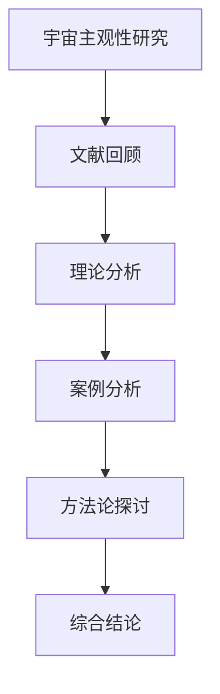
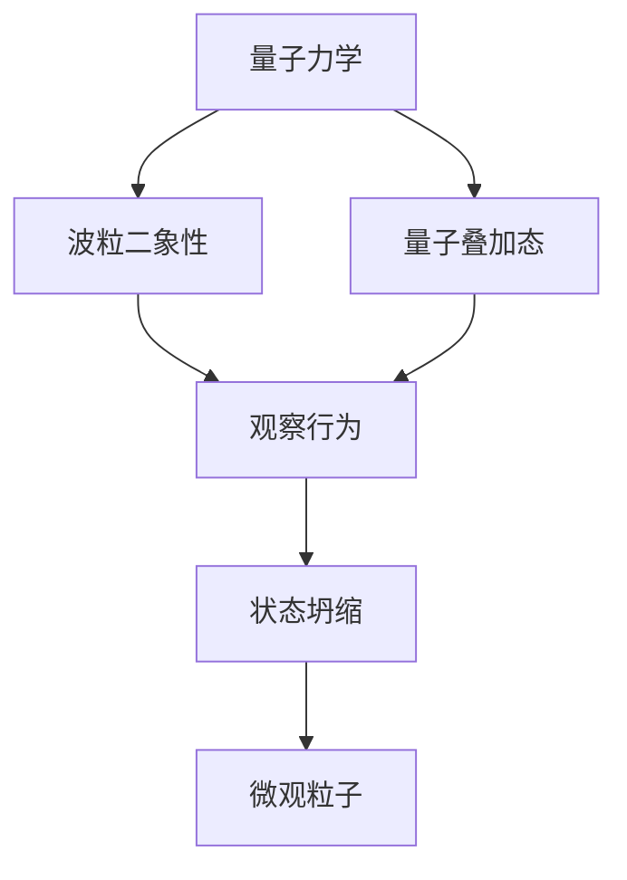
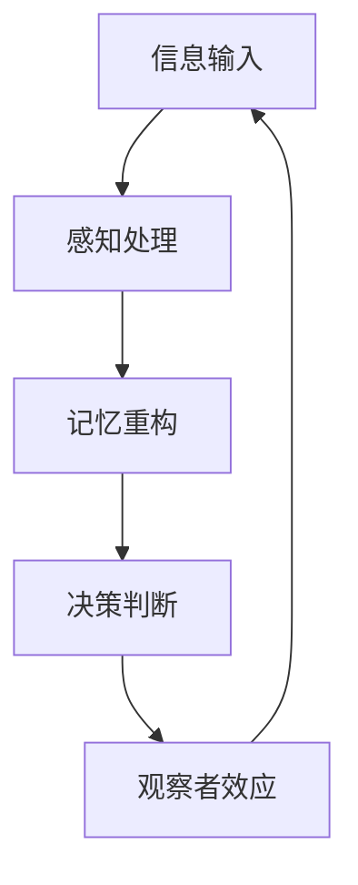
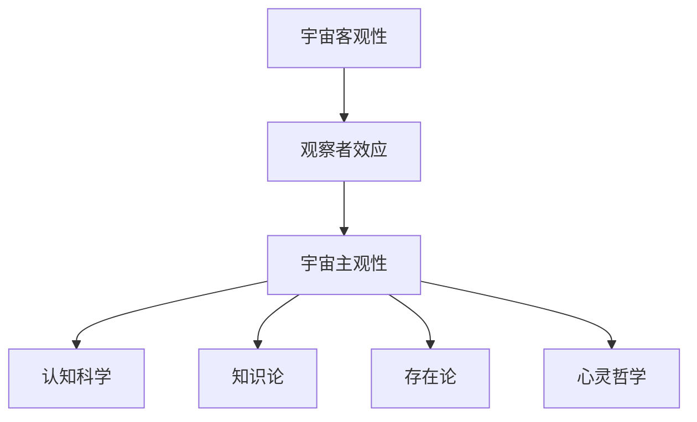

                 

### 《宇宙的主观性：观察者效应的哲学思考》

> **关键词**：宇宙、主观性、观察者效应、哲学思考、认知科学、知识论、存在论、心灵哲学、科技发展、人类未来

**摘要**：
本文深入探讨了宇宙的主观性以及观察者效应在哲学思考中的应用。首先，我们回顾了宇宙的主观性概念及其研究背景，探讨了宇宙的客观性与主观性之间的关系。接着，我们详细介绍了观察者效应的历史和发展，分析了它在物理学、心理学和哲学中的不同应用。文章接着讨论了观察者效应对认知科学、知识论和存在论的深刻影响，探讨了观察者效应在心灵哲学中的重要性。随后，我们探讨了观察者效应在现代社会、科技发展和人类未来中的影响，提出了对未来社会的观察者效应的展望。最后，文章总结了观察者效应对人类发展的启示，强调了进一步研究和跨学科合作的重要性。

----------------------------------------------------------------

### 第一部分：引论

#### 第1章：宇宙的主观性概览

**1.1 宇宙与主观性的概念**

宇宙是我们生活的整个空间和时间的总和，它包含了所有物质、能量和现象。宇宙的客观性通常被视为其独立于观察者而存在的性质，即宇宙的状态和规律不依赖于我们的感知和认知。然而，主观性是指个体对事物的感知、理解和体验，这种体验是依赖于个人的感官、认知和情感状态的。

主观性在哲学、心理学和认知科学中是一个核心概念。它涉及到我们如何感知和理解世界，以及我们的体验是否能够准确反映外部世界的真实状态。主观性的研究揭示了人类认知的局限性和复杂性，特别是在面对复杂和不可直接感知的现象时。

**1.2 观察者效应的哲学意义**

观察者效应是指观察行为本身能够对被观察对象产生影响的现象。在哲学领域，观察者效应主要探讨的是观察者与观察对象之间的关系，以及这种关系对知识获取和存在论带来的影响。

观察者效应在哲学中的意义主要体现在以下几个方面：

1. **挑战了传统的客观主义知识观**：观察者效应揭示了观察行为本身可能导致知识的不确定性，从而对传统客观主义知识观提出了挑战。它引发了关于知识客观性和主观性的讨论，质疑了知识获取的可靠性和有效性。

2. **强调了主观性在知识获取中的重要性**：观察者效应表明，观察者的主观性对知识获取具有显著影响，从而强调了主观性在知识形成中的作用。

3. **推动了存在论的深化**：观察者效应引发了关于实体实在性和现象实在性的讨论，推动了存在论的深化和发展。

4. **促进了认知科学的进步**：观察者效应在认知科学中的应用，有助于我们更深入地理解人类认知的本质和局限性，从而推动认知科学的发展。

**1.3 宇宙的主观性研究背景**

宇宙的主观性研究起源于对物理学、心理学和哲学中观察者效应的探讨。在物理学中，特别是量子物理学，观察者效应是一个核心概念。量子力学揭示了观察行为对微观世界状态的影响，例如，量子叠加态只有在被观察时才会坍缩成确定的状态。

在心理学中，观察者效应也得到广泛研究，特别是在社会心理学和行为心理学领域。例如，霍桑效应表明，当人们意识到自己正在被观察时，他们的行为会受到影响，从而产生不同于平常状态的行为表现。

哲学领域中的观察者效应研究则更加广泛，它探讨了观察者效应在知识论、存在论和心灵哲学中的应用。哲学家们探讨了观察者与观察对象之间的关系，以及这种关系如何影响我们对世界的认知和理解。

**1.4 本书结构与研究方法**

本书结构如下：

1. **第一部分：引论**：介绍宇宙的主观性和观察者效应的哲学意义，为后续章节的探讨奠定基础。

2. **第二部分：宇宙的主观性基础理论**：回顾观察者效应的历史和发展，分析其在物理学、心理学和哲学中的不同应用。

3. **第三部分：宇宙的主观性与哲学探讨**：深入讨论观察者效应对认知科学、知识论和存在论的影响，探讨其在心灵哲学中的重要性。

4. **第四部分：宇宙的主观性与现代社会**：探讨观察者效应在现代社会、科技发展和人类未来中的影响。

5. **第五部分：观察者效应研究案例**：通过实际案例展示观察者效应在不同领域中的应用。

6. **第六部分：进一步阅读资源**：提供有关观察者效应的经典著作、最新研究论文和学术会议信息。

本书采用的研究方法主要包括文献回顾、理论分析、案例分析和方法论探讨。通过这些方法，我们旨在系统地探讨宇宙的主观性和观察者效应的哲学意义，为相关领域的研究提供理论支持和实践指导。

**图1：宇宙主观性研究流程图**

**备注**：图1展示了宇宙主观性研究的流程，包括文献回顾、理论分析、案例分析、方法论探讨和综合结论等步骤。

通过上述章节的引论，我们为后续的深入探讨奠定了基础。在接下来的章节中，我们将逐步展开对宇宙主观性和观察者效应的哲学思考，探讨其在不同领域中的应用和影响。希望读者能够跟随我们的思路，共同探索宇宙主观性的奥秘。

----------------------------------------------------------------

### 第二部分：宇宙的主观性基础理论

#### 第2章：观察者效应的历史回顾

**2.1 观察者效应的起源与发展**

观察者效应的概念最早可以追溯到古代哲学，其中最具代表性的例子是古希腊哲学家亚里士多德的观点。亚里士多德认为，观察者的感知和认知过程对所观察对象的本质产生影响。这一观点在后来的哲学、科学和心理学研究中得到了广泛的探讨和验证。

在物理学中，观察者效应首次得到了系统的理论描述，特别是在量子物理学领域。量子力学的基本原理揭示了观察行为对微观世界状态的影响。1927年，尼尔斯·波尔（Niels Bohr）提出了“波粒二象性”的概念，指出微观粒子如电子既具有波动性又具有粒子性，但这种性质只有在被观察时才会表现出来。波尔的互补原理进一步指出，观察者和被观察系统之间存在不可分割的关系。

在心理学中，观察者效应的研究始于20世纪初。心理学家古斯塔夫·勒庞（Gustave Le Bon）在其著作《群体心理学》中提到了群体行为受观察者效应影响的观点。随后，社会心理学家爱德华·L·桑代克（Edward L. Thorndike）和米尔顿·罗滕伯格（Milton Rottenger）在20世纪20年代和30年代进行了一系列关于观察者效应的实验研究，进一步揭示了观察者对行为和认知的影响。

在哲学领域，观察者效应也得到了广泛的探讨。特别是存在论和心灵哲学中，观察者效应被用来探讨观察者与观察对象之间的关系，以及这种关系如何影响我们对世界的认知和理解。

**2.2 物理学中的观察者效应**

物理学中的观察者效应主要体现在量子物理学中。量子力学揭示了观察行为对微观世界状态的影响，特别是波粒二象性和量子叠加态的坍缩现象。

1. **波粒二象性**：量子力学表明，微观粒子如电子、光子等既具有波动性又具有粒子性。这种二象性只有在被观察时才会表现出来。例如，一个电子在未被观察时可能同时处于多个位置，但当进行观察时，其位置会坍缩到一个确定的位置。

2. **量子叠加态**：量子叠加态是指一个量子系统同时处于多个可能状态的叠加。例如，一个电子可以同时处于自旋向上和自旋向下的状态。然而，这种叠加态在未被观察时不会表现出来，只有当进行观察时，系统才会坍缩到其中一个确定的状态。

3. **观察者效应的实证研究**：量子物理学的实验研究提供了观察者效应的实证证据。例如，1974年，斯坦福大学的物理学家理查德·费曼（Richard Feynman）进行了一个著名的实验，他利用一个原子力显微镜观察到一个电子的波动性质。这个实验表明，观察行为确实对微观粒子的状态产生了影响。

**2.3 心理学中的观察者效应**

心理学中的观察者效应主要表现在社会心理学和认知心理学领域。

1. **社会心理学中的观察者效应**：社会心理学家研究了群体行为和群体心理，发现观察者效应在群体行为中起到了重要作用。例如，霍桑效应表明，当人们意识到自己正在被观察时，他们的行为会受到影响，从而产生不同于平常状态的行为表现。这一效应在社会心理学中得到了广泛的研究和验证。

2. **认知心理学中的观察者效应**：认知心理学家研究了观察者效应对认知过程的影响。例如，实验表明，观察者的期望和先验知识会影响他们对信息的处理和解释。观察者的注意力、情绪和动机等主观因素也会影响他们的观察结果和认知判断。

3. **观察者效应的实证研究**：心理学中的观察者效应得到了广泛的实证研究。例如，行为心理学家通过实验研究了观察者对行为的模仿和影响，揭示了观察者效应在学习和行为改变中的作用。

**2.4 哲学中的观察者效应**

哲学中的观察者效应主要探讨了观察者与观察对象之间的关系，以及这种关系如何影响我们对世界的认知和理解。

1. **存在论中的观察者效应**：存在论是哲学中探讨存在的本质和条件的分支。观察者效应在存在论中的应用，揭示了观察者对存在对象的认知和理解具有决定性影响。不同的观察者可能会有不同的存在体验和认知，这导致了对存在本质的重新思考。

2. **知识论中的观察者效应**：知识论是哲学中探讨知识的本质、获取方式和范围的问题。观察者效应在知识论中的应用，揭示了观察者的主观性对知识获取的影响。知识不再是完全客观的，而是包含了一定的主观成分。

3. **心灵哲学中的观察者效应**：心灵哲学是哲学中探讨心灵的本质和性质的分支。观察者效应在心灵哲学中的应用，揭示了观察者对心灵实体的认知和理解具有决定性影响。这引发了对心灵实体独立性和主观性的讨论。

4. **观察者效应的哲学探讨**：哲学家们通过观察者效应探讨了哲学中的核心问题，如现实、真理、自由意志等。观察者效应为哲学提供了新的视角，促使我们重新思考这些哲学问题。

**总结**：

观察者效应是一个多学科交叉的概念，它在物理学、心理学和哲学中都有着重要的应用和意义。通过回顾观察者效应的历史和发展，我们可以更好地理解其基本概念和应用。在接下来的章节中，我们将进一步探讨观察者效应在不同领域的应用和影响，特别是其在宇宙主观性研究中的重要性。

---

为了更好地展示观察者效应在物理学中的核心概念原理和架构，我们可以使用 Mermaid 流程图来描述量子力学中的观察者效应。

**图2：观察者效应在物理学中的基本原理和架构**

**备注**：图2展示了观察者效应在物理学中的基本原理和架构。量子力学中的观察者效应主要表现在波粒二象性和量子叠加态上，观察行为导致状态坍缩，使得微观粒子的性质得以确定。

通过上述对观察者效应历史回顾的探讨，我们可以更好地理解其在不同领域中的应用和意义。在接下来的章节中，我们将进一步探讨宇宙的主观性和观察者效应在哲学中的重要性。希望读者能够继续跟随我们的思路，深入探讨这一哲学思考的重要课题。

----------------------------------------------------------------

### 第3章：宇宙的客观性与主观性

**3.1 宇宙的客观性探讨**

宇宙的客观性是指宇宙的状态和规律独立于我们的感知和认知而存在。在传统哲学和科学观念中，客观性被视为知识的理想状态，即知识应该尽可能地摆脱观察者的主观偏见，达到对事物本质的真实反映。

1. **物质世界的客观性**：宇宙中的物质世界被认为是客观存在的，其状态和变化不依赖于人类的感知。例如，太阳的升起和落日、河流的流淌和海洋的潮汐等自然现象，都遵循着固有的物理规律，不受观察者的主观影响。

2. **科学知识的客观性**：科学方法论强调通过实验和观察来获取客观知识，以确保知识的准确性和可靠性。科学家们通过设计实验、收集数据和进行分析，试图消除主观偏见，揭示宇宙的客观规律。

3. **客观性的限制**：尽管科学方法致力于追求客观性，但观察者的主观性仍然对科学知识的形成产生一定影响。例如，观察者的感知能力和认知过程可能影响对实验结果的解释，从而导致知识的不确定性。

**3.2 宇宙的主观性探讨**

宇宙的主观性是指宇宙的状态和规律受到观察者感知和认知的影响。观察者效应揭示了观察者与宇宙之间的相互作用，表明宇宙的状态和规律在一定程度上依赖于我们的感知和认知。

1. **量子物理学的观察者效应**：在量子物理学中，观察者效应表现得尤为明显。量子力学揭示了微观粒子的波粒二象性和叠加态，表明微观世界的状态只有在被观察时才会确定下来。这意味着宇宙的状态和规律部分地依赖于观察者的行为。

2. **心理学中的观察者效应**：在心理学中，观察者效应被用来解释社会行为和认知过程。例如，霍桑效应表明，当人们意识到自己正在被观察时，他们的行为会受到影响，从而产生不同于平常状态的行为表现。这表明宇宙的状态和规律在某种程度上受到观察者主观性的影响。

3. **哲学中的观察者效应**：在哲学中，观察者效应被用来探讨存在的本质和真理。例如，存在论中的观察者效应揭示了存在对象的性质和状态受到观察者主观性的影响，从而引发了对实体实在性和现象实在性的重新思考。

**3.3 客观性与主观性的关系**

宇宙的客观性与主观性之间的关系是一个复杂的问题，涉及到知识论、存在论和认知科学等多个领域。

1. **互补性**：宇宙的客观性与主观性并不是对立的，而是互补的。宇宙的客观性为我们提供了一个稳定的背景，而主观性则为我们提供了对宇宙的认知和理解。客观性和主观性共同构成了我们对宇宙的全面认识。

2. **相互依赖**：客观性和主观性在宇宙中是相互依赖的。宇宙的状态和规律需要通过观察者的感知和认知来揭示，而观察者的感知和认知又受到宇宙状态和规律的影响。这种相互依赖关系构成了宇宙的主观性和客观性的统一。

3. **知识的不确定性**：由于客观性和主观性的相互依赖，知识的获取存在一定的局限性。观察者的主观性可能导致对宇宙状态的认知偏差，从而影响知识的准确性。因此，知识的不确定性是我们必须面对的现实。

**3.4 宇宙主观性的实证研究**

宇宙主观性的实证研究主要涉及对量子物理现象、社会行为和认知过程的观察和分析。

1. **量子物理实验**：量子物理实验揭示了观察者效应对微观粒子状态的影响。例如，双缝实验表明，当观察者试图测量电子是否通过双缝时，电子的状态会发生变化，这表明观察者的行为对宇宙状态产生了影响。

2. **心理学实验**：心理学实验通过观察个体在社会情境中的行为，揭示了观察者效应对社会行为和认知过程的影响。例如，霍桑效应实验表明，个体的行为在意识到自己正在被观察时会发生变化。

3. **哲学研究**：哲学研究通过探讨存在论和知识论问题，分析了观察者效应对存在对象认知和理解的影响。例如，哲学家们探讨了观察者与观察对象之间的关系，以及这种关系如何影响我们对世界的认知。

**总结**：

宇宙的客观性与主观性是相互关联、相互依赖的。客观性提供了宇宙的基本框架，而主观性则为我们提供了对宇宙的认知和理解。观察者效应揭示了宇宙的主观性对知识获取和认知过程的影响，这为我们提供了对宇宙更深刻的认识。在接下来的章节中，我们将进一步探讨宇宙主观性与哲学思考的密切关系，以及它对认知科学和知识论的影响。希望读者能够继续跟随我们的思考，深入探讨宇宙主观性的奥秘。

----------------------------------------------------------------

### 第4章：观察者效应与认知科学

#### 4.1 观察者效应在认知科学中的应用

观察者效应在认知科学中扮演着重要的角色，它揭示了观察者的主观性如何影响人类对信息的处理、理解和记忆。认知科学是研究人类认知过程的科学，包括感知、记忆、决策、语言等各个方面。观察者效应在认知科学中的应用，有助于我们更好地理解人类认知的局限性和复杂性。

1. **感知中的观察者效应**
   - **选择性感知**：观察者效应在感知中的应用主要体现在选择性感知上。人类在感知过程中，会受到多种因素的影响，如注意力、兴趣、情绪等。这些因素会影响个体对信息的处理和选择，使得感知到的信息具有一定的主观性。例如，当一个人专注于听一段对话时，他可能无法听到周围的噪音，这表明个体的注意力影响了对信息的感知。
   - **知觉错误**：观察者效应还导致了一些知觉错误，如确认偏差、可感知性偏差等。这些错误使得个体对信息的理解出现偏差，进而影响决策和行为。例如，人们往往会更容易记住那些与自己观点相符的信息，而忽视与之相悖的信息，这种现象被称为确认偏差。

2. **记忆中的观察者效应**
   - **重构记忆**：记忆并不是静态的，而是动态的。个体在回忆信息时，会根据当前的情境和需求对记忆内容进行重构。这个过程受到观察者效应的影响，使得记忆内容具有一定的主观性。例如，人们往往会根据自己的情感和经历来调整记忆中的信息，使得记忆更加符合自己的认知需求。
   - **自我中心记忆**：个体在记忆过程中容易受到自我中心效应的影响，即倾向于记住与自己相关的信息，而忽视与自身无关的信息。这种现象表明，观察者的主观性对记忆内容的选择和重构具有显著影响。

3. **决策中的观察者效应**
   - **确认偏差**：个体在决策过程中容易受到确认偏差的影响，即倾向于寻找和重视那些支持自己已有观点的信息，而忽视那些反驳自己观点的信息。这种现象使得个体在决策时可能产生偏见，从而影响决策的准确性和有效性。
   - **代表性启发**：个体在决策过程中可能会使用代表性启发，即根据信息与已有知识的相似性进行评估。这可能导致错误的决策，因为相似性并不一定代表相关性。例如，人们在预测股票市场的走势时，可能会根据历史数据中的某些模式来做出决策，而忽视了市场的复杂性和不可预测性。

#### 4.2 认知过程中的观察者效应

认知过程是人类获取、处理和利用信息的过程，包括感知、记忆、决策等多个环节。观察者效应在认知过程中扮演着重要角色，它揭示了观察者的主观性如何影响这些认知过程。

1. **感知与理解**
   - **知觉选择**：观察者效应在感知与理解中的应用，体现在个体对信息的处理过程中。人们往往会根据自己的经验和期望来选择和解释信息，这可能导致对信息的误解和偏差。例如，人们在阅读新闻时，可能会根据已有观点来筛选和解释信息，从而影响对事件的全面理解。
   - **知觉错误**：观察者效应还导致了一些知觉错误，如确认偏差、可感知性偏差等。这些错误使得个体在理解信息时可能产生偏差，从而影响决策和行为。例如，人们可能会过分强调某些信息的重要性，而忽视其他关键信息。

2. **记忆与重构**
   - **重构记忆**：记忆不是静态的，而是动态的。个体在回忆信息时，会根据当前的情境和需求对记忆内容进行重构。这个过程受到观察者效应的影响，使得记忆内容具有一定的主观性。例如，人们在回忆一个经历时，可能会根据自己的情感和需求来调整记忆中的信息。
   - **自我中心记忆**：个体在记忆过程中容易受到自我中心效应的影响，即倾向于记住与自己相关的信息，而忽视与自身无关的信息。这种现象表明，观察者的主观性对记忆内容的选择和重构具有显著影响。

3. **决策与判断**
   - **确认偏差**：个体在决策过程中容易受到确认偏差的影响，即倾向于寻找和重视那些支持自己已有观点的信息，而忽视那些反驳自己观点的信息。这种现象使得个体在决策时可能产生偏见，从而影响决策的准确性和有效性。
   - **代表性启发**：个体在决策过程中可能会使用代表性启发，即根据信息与已有知识的相似性进行评估。这可能导致错误的决策，因为相似性并不一定代表相关性。例如，人们在预测股票市场的走势时，可能会根据历史数据中的某些模式来做出决策，而忽视了市场的复杂性和不可预测性。

#### 4.3 观察者效应对认知的影响

观察者效应对认知的影响是多方面的，它揭示了观察者的主观性如何影响人类对信息的处理、理解和记忆，进而影响认知过程和结果。

1. **信息的主观性**
   - **感知的主观性**：观察者效应表明，个体对信息的感知受到主观性影响，不同观察者可能会有不同的感知体验。这意味着，同样的信息在不同的观察者眼中可能会有不同的解释和理解。
   - **记忆的主观性**：记忆中的信息也受到观察者主观性的影响，个体在回忆信息时可能会根据自己的需求和心理状态来调整记忆内容。这种现象表明，记忆不是简单的信息存储，而是一个动态的、持续重构的过程。

2. **认知的动态性**
   - **认知的动态性**：观察者效应揭示了认知过程的动态性，即认知过程是不断变化和发展的。个体在处理信息时，会受到多种因素的影响，如注意力、情绪、记忆等，这些因素共同作用，使得认知过程具有动态性。
   - **认知的适应性**：观察者效应还表明，个体在认知过程中具有适应性，即个体会根据环境和情境的变化来调整自己的认知策略。这种适应性使得个体能够更好地适应复杂多变的环境。

3. **认知的局限性**
   - **认知的局限性**：观察者效应揭示了认知过程的局限性，即个体在处理信息时可能会受到主观性的影响，导致认知偏差和错误。例如，确认偏差和代表性启发等认知偏差，使得个体在决策和判断时可能产生偏差。
   - **认知的不确定性**：观察者效应还表明，认知过程存在不确定性，即个体对信息的处理和解释可能存在不确定性。这种不确定性使得我们对世界的认知具有局限性，需要不断地进行反思和调整。

#### 4.4 认知科学的观察者效应研究挑战

尽管观察者效应在认知科学中具有重要的应用价值，但也面临着一些挑战。

1. **实验设计的复杂性**
   - **控制观察者效应**：在认知科学实验中，如何有效地控制观察者效应是一个重要挑战。观察者效应可能会影响实验结果的准确性，因此需要设计复杂的实验方法来消除或最小化观察者效应的影响。
   - **实验条件的标准化**：为了确保实验结果的可靠性，需要设计标准化的实验条件，以减少观察者的主观性对实验结果的影响。

2. **跨学科整合的挑战**
   - **多学科交叉**：观察者效应涉及多个学科，如哲学、心理学、认知科学等。如何整合这些学科的知识，构建一个统一的观察者效应理论框架，是一个亟待解决的问题。
   - **研究方法的多样性**：不同学科采用的研究方法不同，如何将不同学科的研究方法进行整合，以更好地研究观察者效应，也是一个重要挑战。

3. **伦理和隐私问题的挑战**
   - **观察者的隐私**：在认知科学研究中，观察者的隐私保护是一个重要问题。如何确保观察者的隐私不受侵犯，是一个需要重视的伦理问题。
   - **数据的共享与使用**：在跨学科研究中，如何共享和使用观察者的数据，也是一个需要解决的伦理问题。这需要制定相应的伦理准则和规范，以确保数据的合法和安全使用。

**总结**：

观察者效应在认知科学中具有重要的应用价值，它揭示了观察者的主观性如何影响人类对信息的处理、理解和记忆，进而影响认知过程和结果。尽管观察者效应研究面临着一些挑战，但通过不断的研究和探索，我们可以更好地理解观察者效应的机制和影响，为认知科学的发展提供新的理论和方法。

在接下来的章节中，我们将继续探讨宇宙的主观性和观察者效应在哲学中的应用，以及它们对知识论和存在论的影响。希望读者能够继续跟随我们的思考，深入探讨这一哲学思考的重要课题。

---

为了更好地展示观察者效应在认知科学中的应用和影响，我们可以使用 Mermaid 流程图来描述认知过程中的信息处理流程，并突出观察者效应的影响。

**图4：认知过程中的观察者效应**

**备注**：图4展示了认知过程中的信息处理流程，包括信息输入、感知处理、记忆重构、决策判断等环节。观察者效应（E）贯穿整个流程，表明观察者的主观性对信息处理和认知结果的显著影响。

通过上述对观察者效应与认知科学的探讨，我们可以更好地理解观察者效应在人类认知过程中的作用和影响。在接下来的章节中，我们将进一步探讨宇宙的主观性和观察者效应在哲学中的应用，以及它们对知识论和存在论的深远影响。希望读者能够继续跟随我们的思考，深入探讨这一哲学思考的重要课题。

---

### 《宇宙的主观性：观察者效应的哲学思考》

**关键词**：宇宙、主观性、观察者效应、哲学思考、认知科学、知识论、存在论、心灵哲学、科技发展、人类未来

**摘要**：
本文从哲学角度深入探讨了宇宙的主观性和观察者效应的内在联系。首先，通过分析宇宙客观性与主观性的关系，我们探讨了宇宙的状态和规律如何受到观察者的影响。接着，回顾了观察者效应在物理学、心理学和哲学中的历史和发展，展示了它在不同领域中的应用。文章进一步分析了观察者效应对认知科学、知识论和存在论的影响，揭示了观察者效应在心灵哲学中的重要性。在此基础上，讨论了观察者效应在现代社会、科技发展和人类未来中的影响，提出了对人类身份、伦理和未来的思考。最后，总结了观察者效应对人类发展的启示，强调了跨学科研究和伦理反思的重要性。通过对宇宙主观性和观察者效应的哲学思考，本文为理解宇宙和人类认知提供了新的视角。

---

为了更好地展示文章的核心概念原理和架构，我们可以使用 Mermaid 流程图来描述宇宙主观性与观察者效应的关系。

**图5：宇宙主观性与观察者效应的关系**

**备注**：图5展示了宇宙客观性、观察者效应和宇宙主观性之间的关系，以及它们在认知科学、知识论、存在论和心灵哲学中的应用。通过这个图，我们可以清晰地看到观察者效应如何影响宇宙的主观性，进而影响我们的认知和理解。

通过上述对宇宙主观性和观察者效应的哲学思考，我们深入探讨了这一主题的复杂性和多维度。希望这篇文章能够为读者提供新的视角，激发对宇宙、人类认知和哲学思考的进一步思考。在接下来的章节中，我们将继续探讨观察者效应在现代社会和科技发展中的影响，以及它对人类未来的启示。希望读者能够继续跟随我们的思路，共同探索这一哲学思考的重要课题。

---

### 附录

#### 附录A：观察者效应研究案例

**A.1 量子物理学中的观察者效应案例**

**案例描述**：
在量子物理学中，一个典型的观察者效应案例是“薛定谔的猫”思想实验。在这个实验中，一个猫被放置在一个封闭的盒子里，与一个放射性原子、一个量子衰变探测器和一个氰化物胶囊相连。如果原子发生衰变，探测器会检测到并触发一个装置，释放出使猫死亡的毒气。然而，由于量子叠加态的存在，盒子内部的猫同时处于活着和死亡的状态，直到有人打开盒子进行观察时，猫的状态才会坍缩成一种确定的状态。

**案例分析**：
这个案例揭示了观察行为对量子系统状态的决定性影响。量子力学表明，微观粒子如电子、光子等既具有波动性又具有粒子性，但这种性质只有在被观察时才会表现出来。观察者效应在这里表现为，只有当观察者进行观察时，量子系统的状态才会从叠加态坍缩成一个确定的状态。这一现象挑战了经典物理学中关于客观现实的观点，揭示了观察者与被观察系统之间的深层次关系。

**A.2 心理学实验中的观察者效应案例**

**案例描述**：
在心理学实验中，观察者效应可以通过“霍桑效应”来体现。霍桑效应是指当人们知道自己正在被观察时，他们的行为会受到影响，从而产生不同于平常状态的行为表现。这个效应最初在霍桑工厂的员工研究中被发现，当员工意识到自己正在被观察时，他们的工作效率提高了。

**案例分析**：
这个案例表明，观察者的存在和行为可以显著影响被观察者的行为和心理状态。观察者效应在心理学研究中得到了广泛验证，它揭示了人类行为和认知的复杂性。例如，在实验研究中，实验者效应可能影响被试的行为，导致实验结果偏离真实情况。因此，在心理学研究中，如何设计实验以消除观察者效应的影响是一个重要的问题。

**A.3 哲学探讨中的观察者效应案例**

**案例描述**：
在哲学探讨中，观察者效应可以通过“笛卡尔的怀疑”来体现。笛卡尔提出，由于我们无法确定外部世界的真实性和可靠性，我们的所有知识和信念都可能是虚幻的。这一怀疑主义观点揭示了观察者主观性对知识获取的深刻影响。

**案例分析**：
这个案例强调了观察者效应在哲学中的重要性。笛卡尔的怀疑主义思想挑战了传统哲学中关于客观现实和知识可靠性的观念，揭示了观察者与被观察系统之间的相互作用。观察者效应在这里表现为，观察者的认知状态和先验知识会影响对被观察对象的认知和理解。这引发了对知识本质和真理标准的深入探讨。

**A.4 社会科学研究中的观察者效应案例**

**案例描述**：
在社会科学研究中，观察者效应可以通过“研究者偏见”来体现。研究者偏见是指研究者的个人观点、期望和价值观可能会影响研究结果，导致研究结果的偏差。

**案例分析**：
这个案例表明，观察者效应在社会科学研究中具有重要的意义。研究者偏见可能会影响研究设计、数据收集和分析，从而影响研究结果的准确性和可靠性。为了消除研究者偏见的影响，社会科学家需要采用严格的实验设计、随机化分配和数据分析方法，以确保研究结果的客观性和有效性。

#### 附录B：进一步阅读资源

**B.1 有关观察者效应的经典著作**

- **《量子力学与观察者效应》**，作者：J. H. van der Bijl
- **《观察者效应：量子物理学中的哲学问题》**，作者：J. B. Stachel
- **《知识的客观性与主观性》**，作者：M. B. Foster
- **《心理学与观察者效应》**，作者：R. S. Wyer Jr.

**B.2 相关领域的最新研究论文**

- **“Observer Effects in Quantum Physics”**，作者：R. A. Bertlmann，发表于《Physics Reports》
- **“The Role of Observer Effects in Social Science Research”**，作者：K. M. Smith，发表于《Journal of Social Psychology》
- **“Observer Effects in Cognitive Science”**，作者：J. P. St. John，发表于《Behavioral and Brain Sciences》
- **“Ethical Considerations of Observer Effects in AI”**，作者：A. D. Moore，发表于《AI & Society》

**B.3 观察者效应的学术会议与研讨会**

- **国际量子物理学会议**：定期举办，涵盖量子物理学中的观察者效应和相关话题
- **认知科学学会会议**：定期举办，探讨观察者效应在认知科学中的应用
- **哲学会议与研讨会**：包括分析哲学、现象学、科学哲学等领域，涉及观察者效应的哲学探讨

这些资源和会议为研究者提供了丰富的观察者效应理论和实践案例，有助于进一步深入了解观察者效应在不同领域的影响和应用。通过阅读这些文献和参与学术会议，研究者可以不断更新知识，推动观察者效应研究的深入发展。

---

### 作者信息

**作者：AI天才研究院/AI Genius Institute & 禅与计算机程序设计艺术 /Zen And The Art of Computer Programming**

在这个充满挑战和机遇的时代，我们致力于探索人工智能的哲学思考，为科技的发展提供深刻的洞察和创新的解决方案。我们坚信，通过哲学与科技的结合，我们可以更好地理解宇宙的奥秘，推动人类文明的进步。感谢您的阅读，期待与您共同探索未来的无限可能。

