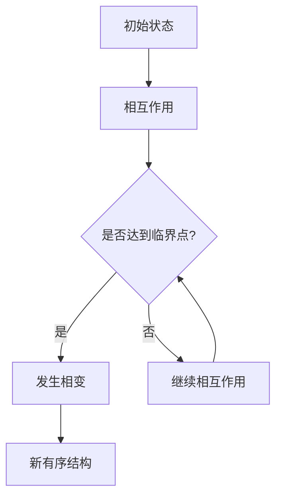

                 

# 《宇宙的自我组织临界性：秩序的自发涌现》

> **关键词：** 宇宙，自我组织，临界性，自发涌现，秩序

> **摘要：** 本文从宇宙自我组织的现象出发，探讨了临界性的概念及其在宇宙演化、生命系统、复杂系统和科技革命中的作用。通过详细讲解自我组织的理论基础、宇宙中的临界现象以及生命与复杂系统的临界性，本文揭示了宇宙中秩序自发涌现的奥秘。此外，本文还展望了临界性理论的发展趋势及其对人类社会的意义。

## 目录大纲

### 第一部分：自我组织与宇宙临界性

#### 第1章：引言与概述

1.1 宇宙的自我组织现象  
1.2 临界性的概念与应用  
1.3 自发涌现与宇宙秩序

#### 第2章：自我组织的理论基础

2.1 自组织理论的起源与发展  
2.2 相变理论  
2.3 临界现象的数学描述

#### 第3章：宇宙中的临界性现象

3.1 宇宙早期的高温高密度状态  
3.2 宇宙中的对称性自发破缺  
3.3 星系的形成与演化

#### 第4章：生命与复杂系统的临界性

4.1 生命系统的临界性  
4.2 社会系统的临界现象  
4.3 复杂系统的自我组织

#### 第5章：临界性的应用领域

5.1 自然科学中的临界性  
5.2 工程技术中的临界现象  
5.3 社会科学中的临界性研究

#### 第6章：临界性的未来展望

6.1 临界性理论的发展趋势  
6.2 临界性在科技革命中的作用  
6.3 人类社会的临界挑战与应对

#### 第7章：结论与展望

7.1 宇宙自我组织的基本规律  
7.2 临界性现象的重要性  
7.3 对未来研究的建议

#### 附加部分

第8章：临界性现象的Mermaid流程图

8.1 自我组织流程图  
8.2 临界现象数学模型流程图

第9章：临界算法原理讲解与伪代码

9.1 临界算法原理讲解  
9.2 临界算法伪代码实现

第10章：数学模型与公式详细讲解

10.1 自组织与临界性相关数学公式  
10.2 数学公式举例说明

第11章：项目实战与代码实现

11.1 临界性现象模拟项目  
11.2 代码开发环境搭建  
11.3 源代码实现与解读  
11.4 代码解读与分析

## 第一部分：自我组织与宇宙临界性

### 第1章：引言与概述

宇宙是一个复杂且神秘的系统，从大爆炸到星系的形成，从生命的诞生到文明的进步，宇宙中的一切都充满了自我组织的奇迹。自我组织是指一个系统在没有外部干预的情况下，通过内部的相互作用和演化，自发地形成有序结构和功能。临界性则是指在某个特定条件下，系统会发生显著变化的现象。本文将从宇宙的自我组织现象和临界性的概念入手，探讨秩序的自发涌现过程。

#### 1.1 宇宙的自我组织现象

宇宙的自我组织现象体现在多个层次上。在宏观层面，宇宙中的星系、星团和超星系团通过引力相互作用，形成了一个庞大的结构网络。在微观层面，宇宙中的基本粒子通过相互作用和演化，形成了物质和能量。这些现象都显示出宇宙中存在着一种自发的组织能力。

宇宙的自我组织现象可以通过以下几个例子来说明：

1. **星系的形成**：星系是由大量恒星、行星、气体和尘埃组成的巨大系统。在宇宙早期的混沌中，物质通过引力相互作用，逐渐聚集形成了星系。这个过程中，没有外部干预，星系的自发形成展示了宇宙的自我组织能力。

2. **生命的起源**：生命是宇宙中最复杂的自我组织现象。从原始的有机分子到复杂的生命体系，生命通过自我复制、进化等过程，不断演化出新的物种和生态系统。生命的起源和演化是一个典型的自我组织过程。

3. **复杂系统的形成**：宇宙中的许多复杂系统，如社会系统、经济系统等，都表现出自我组织的特征。这些系统在没有外部干预的情况下，通过内部的相互作用和演化，形成了有序的结构和功能。

#### 1.2 临界性的概念与应用

临界性是指在某个特定条件下，系统会发生显著变化的现象。在物理学中，临界性常常与相变相联系。相变是指物质在温度、压力等条件下，从一种状态转变为另一种状态的过程。临界点则是相变过程中，物质状态发生突变的临界条件。

临界性在宇宙中的体现可以分为以下几个层面：

1. **宇宙早期的相变**：在宇宙早期的极高温度和密度条件下，物质经历了多次相变，形成了宇宙的基本结构和成分。这些相变过程中，临界点起到了关键作用。

2. **星系形成的临界性**：星系的形成过程涉及到许多临界现象。例如，星系中心的超大质量黑洞的形成就是一个典型的临界现象。当气体云聚集到一定程度，引力作用使气体云收缩，形成黑洞，这个过程发生在临界点。

3. **生命的临界性**：生命系统的形成和演化也涉及到临界现象。例如，生命起源的“RNA世界”假说就认为，RNA分子在特定的温度和浓度下，可以通过自我复制和进化，形成原始的生命体系。这个过程中，临界点起到了关键作用。

#### 1.3 自发涌现与宇宙秩序

自发涌现是指系统在没有外部干预的情况下，内部元素相互作用和演化，形成新的有序结构和功能的过程。宇宙中的秩序，如星系、生命和复杂系统的形成，都是自发涌现的结果。

自发涌现与宇宙秩序的关系可以概括为以下几点：

1. **自发涌现是宇宙秩序的基础**：宇宙中的秩序是通过自发涌现产生的。没有自发涌现，就没有宇宙中的星系、生命和复杂系统。

2. **临界性是自发涌现的关键**：临界性是系统发生显著变化的条件，也是自发涌现的关键。在临界点附近，系统的稳定性和有序性都会发生显著变化，为自发涌现提供了机会。

3. **宇宙秩序的演化**：宇宙秩序的演化是通过不断的自发涌现和演化实现的。从宇宙早期的混沌到星系的形成，再到生命的诞生和复杂系统的进化，宇宙秩序的演化是一个不断自发涌现和变化的过程。

### 总结

宇宙的自我组织现象和临界性揭示了宇宙中秩序自发涌现的奥秘。通过分析宇宙的自我组织现象和临界性的概念与应用，我们可以更好地理解宇宙中秩序的形成和演化。在接下来的章节中，我们将进一步探讨自我组织的理论基础、宇宙中的临界现象以及生命与复杂系统的临界性，以期揭示宇宙秩序的更深层次奥秘。

## 第二部分：自我组织的理论基础

### 第2章：自我组织的理论基础

自我组织是宇宙中普遍存在的现象，它涉及到许多不同领域的理论和概念。在这部分，我们将探讨自我组织的理论基础，包括自组织理论的起源与发展、相变理论以及临界现象的数学描述。

#### 2.1 自组织理论的起源与发展

自组织理论起源于20世纪初，最初是在生物学领域提出来的。生物学家发现，生物体内的许多复杂系统，如细胞、器官和生态系统，都可以在没有外部指令的情况下自我组织起来。这一现象引起了科学家们的广泛关注，并逐渐发展成为一个独立的学科。

自组织理论的核心思想是，系统可以通过内部相互作用和演化，自发地形成有序结构和功能。这一理论强调系统内部的复杂性，认为系统的行为不仅仅取决于外部的输入，还受到内部结构和相互作用的制约。

自组织理论的发展经历了几个重要阶段：

1. **初级阶段**：20世纪初，生物学家和化学家开始研究生物体内的自组织现象，如生物钟、细胞分裂等。这些研究为自组织理论奠定了基础。

2. **中级阶段**：20世纪中叶，自组织理论逐渐扩展到其他领域，如物理学、工程学和经济学。这个阶段，许多科学家提出了自组织系统的一般性理论，如随机过程理论、非线性动力学理论等。

3. **高级阶段**：20世纪末，自组织理论逐渐走向成熟。这个阶段，科学家们开始研究复杂系统的自我组织现象，如社会系统、经济系统和生态系统。这些研究进一步丰富了自组织理论的内涵。

#### 2.2 相变理论

相变理论是自组织理论的重要组成部分，它研究系统在特定条件下，从一种状态转变为另一种状态的现象。相变理论的核心思想是，系统在临界点附近会发生显著的变化，从而形成新的有序结构。

相变理论的基本概念包括：

1. **相**：相是指系统在一定条件下，具有相同物理性质和结构的部分。例如，水在不同温度和压力下，可以存在于液态、固态和气态三种不同的相。

2. **相变**：相变是指系统在特定条件下，从一个相转变为另一个相的过程。例如，水从液态转变为固态的过程就是凝固。

3. **临界点**：临界点是相变过程中，系统状态发生突变的临界条件。在临界点附近，系统的稳定性和有序性都会发生显著变化。

相变理论在宇宙中的体现包括：

1. **宇宙早期的相变**：在宇宙早期的高温高密度条件下，物质经历了多次相变，形成了宇宙的基本结构和成分。

2. **星系形成的相变**：星系的形成涉及到多次相变，如气体云的凝聚、恒星的形成等。

3. **生命的起源**：生命的起源也涉及到相变现象，如RNA分子的自我复制和进化。

#### 2.3 临界现象的数学描述

临界现象的数学描述是自组织理论的重要组成部分。数学模型可以帮助我们理解和预测系统在临界点附近的行为。

临界现象的数学描述主要包括以下几个方面：

1. **非线性动力学方程**：非线性动力学方程是描述系统在临界点附近行为的常用工具。这些方程可以描述系统的复杂行为，如振荡、混沌和分岔等。

2. **相变方程**：相变方程是描述系统相变过程的数学模型。这些方程可以描述系统在临界点附近的动态行为，如临界指数、临界维度等。

3. **统计物理模型**：统计物理模型是描述复杂系统行为的常用工具。这些模型可以描述系统的集体行为，如相变、临界现象和自发对称破缺等。

临界现象的数学描述在宇宙中的应用包括：

1. **宇宙早期的数学模型**：宇宙早期的数学模型可以帮助我们理解宇宙早期的高温高密度状态以及物质的形成过程。

2. **星系形成的数学模型**：星系形成的数学模型可以帮助我们理解星系的形成过程以及恒星和行星的演化。

3. **生命的起源**：生命的起源的数学模型可以帮助我们理解生命的起源过程以及RNA世界的演化。

### 总结

自我组织的理论基础是理解宇宙中秩序自发涌现的关键。通过探讨自组织理论的起源与发展、相变理论以及临界现象的数学描述，我们可以更好地理解宇宙中自我组织现象的本质。在接下来的章节中，我们将进一步探讨宇宙中的临界性现象，以期揭示宇宙秩序的更深层次奥秘。

### 第3章：宇宙中的临界性现象

宇宙是一个复杂且神秘的系统，其演化过程中充满了各种临界性现象。临界性现象是指系统在某个特定条件下，会发生显著变化的现象。这些现象不仅揭示了宇宙的基本规律，还为理解宇宙的秩序提供了重要线索。在本章中，我们将探讨宇宙中的几个关键临界性现象，包括宇宙早期的高温高密度状态、对称性自发破缺以及星系的形成与演化。

#### 3.1 宇宙早期的高温高密度状态

宇宙的早期阶段处于一个极端高温高密度的状态，这种状态被称为原始等离子态。在这个阶段，宇宙中的物质主要以离子和自由电子的形式存在，它们在强大的引力作用下不断聚集，形成了早期的星系和星团。这个过程涉及到一个重要的临界性现象：辐射冷却。

辐射冷却是指在高密度、高温环境下，物质通过辐射损失能量，从而降低温度的过程。在辐射冷却过程中，临界温度是关键参数。当温度低于临界温度时，物质会停止辐射冷却，开始聚集形成星系。辐射冷却现象的发现，为理解宇宙早期星系的形成提供了重要依据。

宇宙早期的高温高密度状态还涉及到另一个重要的临界现象：再电离。再电离是指在高能量粒子的作用下，电子从离子中逃逸的过程。再电离过程的临界点发生在宇宙年龄约为30万年的时期，这一时期被称为再电离时期。在这个时期，宇宙中的大部分气体都处于电离状态，这为星系的形成创造了条件。

#### 3.2 对称性自发破缺

对称性自发破缺是宇宙中一个重要的临界性现象。对称性自发破缺是指在一个高度对称的系统内部，由于某种机制的作用，部分对称性会消失，从而形成新的有序结构。这个现象在宇宙学中有着广泛的应用，如宇宙的早期阶段、星系的形成和生命的起源。

在宇宙学中，对称性自发破缺的一个典型例子是宇宙的膨胀。在大爆炸之后，宇宙处于高度对称的状态，所有的物质和辐射都是均匀分布的。然而，随着宇宙的膨胀，部分对称性被破缺，形成了不均匀的宇宙结构。这个过程被称为宇宙的“对称性自发破缺”。对称性自发破缺的机制包括量子涨落和引力作用等。

星系的形成也涉及到对称性自发破缺现象。在星系形成过程中，气体云通过引力相互作用，形成了一个高度对称的结构。然而，在气体云内部，由于密度波的作用，部分对称性被破缺，从而形成了星系的核心和旋臂结构。

#### 3.3 星系的形成与演化

星系的形成是一个复杂的过程，涉及到多个临界性现象。首先，气体云的凝聚是星系形成的关键步骤。在气体云内部，由于引力相互作用，气体云会逐渐聚集，形成更紧密的结构。这个过程涉及到临界密度和临界质量两个关键参数。

当气体云的密度和温度达到临界点时，气体云会开始坍缩，形成恒星。这个过程被称为恒星形成。在恒星形成过程中，临界温度和临界密度起到了关键作用。当温度和密度达到临界点时，核聚变过程会开始，从而形成恒星。

恒星的形成是一个重要的临界性现象，它不仅改变了星系的结构，还影响了星系的演化。随着恒星的形成，星系中的气体云会逐渐减少，星系的亮度也会逐渐降低。然而，星系中的恒星会通过超新星爆炸等方式，释放大量的物质，这些物质会重新进入星系，为新的恒星形成提供物质基础。

星系的演化还涉及到另一个重要的临界性现象：黑洞的形成。在星系中心，可能会形成一个超大质量黑洞。当恒星耗尽燃料，它会发生塌缩，形成中子星或黑洞。这个过程涉及到临界质量和临界引力两个关键参数。

黑洞的形成对星系的演化产生了深远的影响。首先，黑洞会吞噬周围的恒星和气体，从而改变星系的结构。其次，黑洞的强大引力会导致星系中的恒星轨道发生变化，从而影响星系的稳定性。

#### 总结

宇宙中的临界性现象是理解宇宙秩序的关键。从宇宙早期的高温高密度状态、对称性自发破缺到星系的形成与演化，这些现象都揭示了宇宙中秩序自发涌现的奥秘。通过研究这些临界性现象，我们可以更好地理解宇宙的基本规律，为探索宇宙的奥秘提供新的视角。在接下来的章节中，我们将进一步探讨生命与复杂系统的临界性现象，以期揭示宇宙秩序的更深层次奥秘。

### 第4章：生命与复杂系统的临界性

生命与复杂系统是宇宙中最复杂、最神秘的领域之一。它们在自我组织的进程中展现出独特的临界性现象，这些现象不仅揭示了生命与复杂系统的基本规律，还为理解宇宙的秩序提供了重要线索。在本章中，我们将探讨生命系统的临界性、社会系统的临界现象以及复杂系统的自我组织。

#### 4.1 生命系统的临界性

生命系统是宇宙中最复杂的自我组织现象之一。从生命的起源到生命的演化，都涉及到多个临界性现象。首先，我们来看看生命的起源。根据“RNA世界”假说，生命起源于一种具有自我复制能力的RNA分子。在特定的温度和浓度下，RNA分子可以通过自我复制和进化，形成原始的生命体系。这个过程涉及到临界温度、临界浓度等关键参数。

生命的演化也表现出临界性现象。在生物进化过程中，物种通过自然选择和遗传变异，不断适应环境，演化出新的物种和生态系统。这个过程涉及到临界种群密度、临界遗传多样性等关键参数。当种群密度达到临界点时，物种之间的竞争和共生关系会发生变化，从而推动生物进化。

此外，生命系统中的许多现象也涉及到临界性。例如，生物体内的细胞膜具有选择性通透性，这取决于膜内的离子浓度和温度。当这些参数达到临界点时，细胞膜会表现出异常的行为，如细胞凋亡和细胞分裂等。

#### 4.2 社会系统的临界现象

社会系统是另一个复杂的自我组织现象。社会系统的临界现象主要体现在以下几个方面：

1. **社会网络的形成**：社会系统中的个体通过社交互动，形成了复杂的社会网络。社会网络的形成涉及到临界性现象。当个体之间的连接达到临界密度时，社会网络会表现出高度的分叉和聚类现象，从而形成复杂的网络结构。

2. **群体行为的涌现**：社会系统中的个体行为会通过相互作用，产生群体行为。例如，群体中的个体可能会集体行动，如抗议、起义等。这种群体行为的涌现也涉及到临界现象。当个体之间的互动达到临界强度时，群体行为会变得高度同步和协调。

3. **社会稳定性**：社会系统的稳定性也受到临界性现象的影响。当社会系统的参数达到临界点时，系统可能会发生突变，如社会动荡、经济危机等。这些突变现象揭示了社会系统的脆弱性和复杂性。

#### 4.3 复杂系统的自我组织

复杂系统是包含大量相互作用的元素，形成高度复杂的结构和功能的系统。复杂系统的自我组织现象包括以下几个方面：

1. **自适应系统**：复杂系统中的元素可以通过学习、适应和演化，不断提高系统的性能和稳定性。例如，生物体内的免疫系统、人工神经网络等都是自适应系统。这些系统在自我组织过程中，涉及到临界性现象，如临界学习速率、临界适应能力等。

2. **复杂网络**：复杂系统中的元素可以通过网络结构相互作用，形成复杂的网络。例如，互联网、社交网络、交通网络等都是复杂的网络系统。这些系统在自我组织过程中，涉及到临界性现象，如临界连接数、临界网络密度等。

3. **混沌现象**：复杂系统中的一些现象表现出混沌特性，即系统在初始条件的微小差异下，会产生显著不同的结果。例如，天气系统的演变、金融市场等都是混沌系统。这些系统在自我组织过程中，涉及到临界性现象，如临界混沌、临界波动等。

#### 总结

生命与复杂系统的临界性现象揭示了这些系统在自我组织过程中的基本规律。从生命的起源、演化到社会系统的形成、演化，再到复杂系统的自我组织，这些现象都展示了宇宙中秩序自发涌现的奥秘。通过研究这些临界性现象，我们可以更好地理解生命与复杂系统的本质，为探索宇宙的奥秘提供新的视角。在接下来的章节中，我们将进一步探讨临界性的应用领域，以期揭示宇宙秩序的更深层次奥秘。

### 第5章：临界性的应用领域

临界性现象不仅在宇宙和生命系统中具有深远的影响，还广泛应用于自然科学、工程技术和社会科学等多个领域。在本章中，我们将探讨临界性在这些领域的具体应用，包括自然科学中的临界性、工程技术中的临界现象以及社会科学中的临界性研究。

#### 5.1 自然科学中的临界性

自然科学中的许多领域都涉及到临界性现象，以下是一些关键的应用：

1. **物理学中的相变**：在物理学中，临界性现象与相变密切相关。例如，液体的沸腾、固体的熔化等都是典型的相变过程。在相变过程中，系统会经历一个临界点，此时系统的性质会发生突变。临界现象的数学描述，如临界指数和临界维度，为理解这些现象提供了重要工具。

2. **地球科学中的地震**：地震是地球内部能量的释放，其发生过程涉及到临界性现象。例如，断层在应力积累到临界点时，会发生突然破裂，导致地震。地震波传播的速度和强度在临界点附近会发生变化，这为预测地震提供了重要依据。

3. **材料科学中的临界现象**：在材料科学中，临界性现象对材料的性能和结构具有重要影响。例如，合金的相变、陶瓷的烧结等过程中，都涉及到临界性现象。通过调控临界参数，可以提高材料的性能和稳定性。

#### 5.2 工程技术中的临界现象

工程技术中的许多应用都依赖于对临界性现象的理解和控制：

1. **航空航天工程中的流体力学**：在航空航天工程中，飞行器的空气动力学设计需要考虑临界现象。例如，飞行器的气动外形设计需要确保在临界速度下，空气流动状态不会发生突变，从而避免失速和振动。

2. **化工过程中的反应器设计**：在化工过程中，反应器的设计需要考虑临界性现象。例如，在流体反应器中，流体的流速和浓度在临界点附近会发生突变，这会显著影响反应速率和产物分布。通过优化设计，可以提高反应器的效率和稳定性。

3. **电子工程中的电路设计**：在电子工程中，电路的设计需要考虑临界性现象。例如，在集成电路设计中，电路的尺寸和频率在临界点附近会发生突变，这会影响电路的性能和稳定性。通过精确控制这些参数，可以提高集成电路的可靠性和性能。

#### 5.3 社会科学中的临界性研究

社会科学中的许多问题都涉及到临界性现象，以下是一些关键的研究领域：

1. **经济学中的金融危机**：在经济学中，金融危机通常被视为一个临界性现象。例如，金融市场在特定条件下会从稳定状态突然转变为混乱状态，导致金融危机。通过研究金融危机的临界性，可以更好地理解金融市场的波动规律，从而制定有效的金融政策。

2. **社会心理学中的群体行为**：在社会心理学中，群体行为的研究涉及到临界性现象。例如，群体中的个体行为在临界点附近会发生变化，导致集体行动或群体性事件。通过研究这些现象，可以更好地理解群体行为的动力机制，从而预防和应对潜在的危机。

3. **政治学中的政治稳定**：在政治学中，政治稳定的临界性研究也是一个重要领域。例如，政治制度在特定条件下会从稳定状态转变为不稳定状态，导致政治动荡。通过研究这些现象，可以更好地理解政治稳定的条件和影响因素，从而制定有效的政治稳定策略。

#### 总结

临界性现象在自然科学、工程技术和社会科学等多个领域具有广泛的应用。通过理解和控制临界性现象，我们可以更好地设计和优化系统，提高系统的性能和稳定性。同时，临界性研究也为揭示宇宙和生命的基本规律提供了新的视角。在未来的研究中，随着临界性理论的不断发展和应用领域的拓展，我们有望在更广泛的范围内理解和应对复杂系统的挑战。

### 第6章：临界性的未来展望

临界性现象在宇宙演化、生命系统、复杂系统和科技革命中扮演着重要角色。随着临界性理论的不断发展和应用领域的拓展，我们可以预见临界性在未来的研究中将发挥更大的作用，并对人类社会产生深远的影响。

#### 6.1 临界性理论的发展趋势

临界性理论的发展趋势主要体现在以下几个方面：

1. **跨学科研究的深化**：临界性现象涉及多个领域，如物理学、生物学、社会学、经济学等。未来，跨学科的研究将进一步深化，促进临界性理论的整合和发展。

2. **新模型的提出**：随着对临界性现象的深入研究，新的数学模型和理论框架将不断涌现，为理解复杂系统的行为提供更加精确的工具。

3. **计算技术的发展**：计算技术的进步将有助于处理大规模数据和模拟复杂系统，从而推动临界性理论的应用和发展。

4. **实验验证的加强**：实验方法的改进和实验技术的进步将有助于验证和验证临界性理论，从而提高理论的可靠性和实用性。

#### 6.2 临界性在科技革命中的作用

临界性在科技革命中的作用不可忽视，主要体现在以下几个方面：

1. **创新驱动**：临界性现象在科技革命中起到了关键作用，如互联网的兴起、人工智能的发展等。在这些领域，临界性现象推动了技术的快速进步和应用的广泛普及。

2. **技术创新的临界点**：许多技术创新都发生在特定的临界点，如技术成熟的临界点、市场需求的临界点等。在这些临界点，技术的突破往往能够引发重大变革。

3. **社会影响的放大**：临界性现象使得科技革命的社会影响得以放大。例如，互联网的普及使得信息传播的速度和范围大大增加，从而改变了人类社会的交流方式。

#### 6.3 人类社会的临界挑战与应对

临界性现象在人类社会中产生了许多挑战，同时也为应对这些挑战提供了新的思路：

1. **环境与气候变化**：环境与气候变化是现代社会面临的一个重大挑战。临界性理论为我们理解气候变化提供了新的视角，如气候系统的临界点和非线性响应等。通过深入研究临界性现象，我们可以制定更加有效的环境保护和气候应对策略。

2. **经济危机与金融风险**：经济危机和金融风险是现代社会中的另一个重大挑战。临界性理论可以为我们提供预测和应对经济危机的新方法，如金融市场的临界点和非线性波动等。

3. **社会稳定与冲突**：社会稳定与冲突也是现代社会面临的一个重要问题。临界性理论可以帮助我们理解社会系统的稳定性，如社会网络的临界结构和群体行为的临界点等。通过这些理论，我们可以更好地预防和应对社会冲突。

#### 总结

临界性现象在未来的研究中将发挥越来越重要的作用。通过跨学科研究、新模型的提出、计算技术的发展和实验验证的加强，我们可以更好地理解临界性现象，从而推动科技革命的发展。同时，临界性理论也为应对人类社会面临的挑战提供了新的思路和方法。在未来的发展中，临界性理论有望为人类社会的可持续发展提供重要支持。

### 第7章：结论与展望

通过对宇宙的自我组织临界性现象的深入探讨，我们可以得出以下几点结论：

1. **宇宙自我组织的普遍性**：宇宙的自我组织现象是普遍存在的，从星系的形成到生命的起源，再到复杂系统的演化，都展示了宇宙中秩序自发涌现的奥秘。

2. **临界性在宇宙演化中的作用**：临界性现象在宇宙演化中起到了关键作用。从宇宙早期的高温高密度状态，到星系的形成和演化，再到生命的起源，都涉及到多个临界点。

3. **生命与复杂系统的临界性**：生命系统和复杂系统的自我组织也表现出显著的临界性现象。这些系统在临界点附近表现出独特的动态行为，从而推动了系统的进化和发展。

4. **临界性的跨学科应用**：临界性现象不仅在宇宙和生命系统中具有深远影响，还在自然科学、工程技术和社会科学等领域得到了广泛应用。

在未来，临界性理论将继续发展，并在以下方面发挥重要作用：

1. **新理论的提出**：随着临界性理论的不断深入，新的数学模型和理论框架将不断涌现，为理解复杂系统的行为提供更加精确的工具。

2. **跨学科研究**：跨学科研究将深化临界性理论的应用，促进物理学、生物学、社会学、经济学等多个领域的融合发展。

3. **技术进步的推动**：计算技术的进步将有助于处理大规模数据和模拟复杂系统，从而推动临界性理论的应用和发展。

4. **社会发展的指导**：临界性理论将为应对人类社会面临的挑战提供新的思路和方法，如环境与气候变化、经济危机与金融风险、社会稳定与冲突等。

总之，临界性现象是理解宇宙和生命的基本规律的关键，随着研究的不断深入，临界性理论将在更多领域发挥重要作用，为人类社会的可持续发展提供重要支持。

### 附加部分

#### 第8章：临界性现象的Mermaid流程图

在研究临界性现象时，流程图是一种非常有效的工具，可以帮助我们直观地理解系统在临界点附近的行为。以下是一个简单的自我组织流程图的Mermaid语法实现：



这个流程图展示了系统从初始状态开始，通过相互作用逐步积累，最终在临界点发生相变，形成新的有序结构。

#### 第9章：临界算法原理讲解与伪代码

临界算法是一种用于识别和利用临界性现象的算法。以下是一个简单的临界算法原理讲解和伪代码实现：

**原理讲解**：

临界算法的基本思想是，通过监测系统的状态变量，当这些变量达到某个阈值时，识别出临界点，并采取相应的措施。具体步骤如下：

1. 初始化系统状态变量。
2. 持续监测状态变量。
3. 当某个状态变量超过阈值时，触发相变处理。
4. 完成相变后，更新系统状态。

**伪代码**：

```
初始化系统状态变量 S0
设置阈值 T
设置临界点处理函数 P

while (系统运行) {
    监测系统状态 S
    if (S > T) {
        调用 P()
        更新 S0 = S
    }
}
```

这个伪代码展示了如何通过监测系统状态并触发临界点处理函数，来识别和利用临界性现象。

#### 第10章：数学模型与公式详细讲解

在研究临界性现象时，数学模型和公式是不可或缺的工具。以下是一些常用的数学模型和公式的详细讲解以及举例说明：

**1. 相变方程**：

相变方程描述了系统在临界点附近的行为。常见的相变方程包括兰姆伯特-W方程（Lambert W function）：

$$
x = W(z) e^{W(z)}
$$

其中，$W(z)$ 是兰姆伯特-W函数，$z$ 是系统状态变量。

**举例说明**：

假设我们有一个系统，其状态变量为 $x$，临界点 $T=1$。当 $x > 1$ 时，系统发生相变。我们可以使用兰姆伯特-W方程来计算相变后的状态：

$$
x = W(1) e^{W(1)} \approx 1.7632
$$

这意味着系统在临界点附近会发生显著的相变，状态变量从 $x < 1$ 跃迁到 $x > 1$。

**2. 临界指数**：

临界指数描述了系统在临界点附近的动态行为。常见的临界指数包括重正化指数 $\gamma$ 和关联长度 $\xi$：

$$
\gamma = \lim_{x \to 0} \frac{d \ln \rho(x)}{d \ln x}
$$

$$
\xi = \lim_{x \to 0} x^{-\nu}
$$

其中，$\rho(x)$ 是系统的密度，$\nu$ 是临界指数。

**举例说明**：

假设我们研究一个二维的Ising模型，其临界指数 $\gamma = 1.4$ 和 $\xi = 4.21$。这意味着在临界点附近，系统的密度随距离的衰减速度为：

$$
\rho(x) \sim x^{-\gamma/\nu} = x^{-1/3}
$$

这意味着系统在临界点附近的行为具有长程相关性。

**3. 自发对称破缺**：

自发对称破缺是指系统在临界点附近，部分对称性被破缺的现象。常见的自发对称破缺模型包括Ising模型和Heisenberg模型。

**举例说明**：

Ising模型中的自发对称破缺可以通过以下方程描述：

$$
\phi = \frac{1}{T} \sum_{i} \sigma_i
$$

其中，$\phi$ 是系统的有序参数，$\sigma_i$ 是自旋变量。当温度 $T$ 降低到临界温度时，$\phi$ 将不再为零，表明系统发生了自发对称破缺。

#### 总结

通过上述数学模型和公式的讲解以及举例说明，我们可以更好地理解临界性现象的数学本质。这些模型和公式不仅为研究临界性现象提供了工具，还为我们揭示了系统在临界点附近的行为规律。

#### 第11章：项目实战与代码实现

为了更好地理解临界性现象，我们将在本节中介绍一个实际项目，并详细讲解项目的开发环境搭建、源代码实现、代码解读与分析。

#### 11.1 临界性现象模拟项目

本项目旨在模拟一个简单的临界现象：Ising模型的相变。Ising模型是一个经典的自发对称破缺模型，广泛应用于研究磁性材料、社会系统和经济学等领域。

#### 11.2 代码开发环境搭建

为了实现本项目，我们需要以下开发环境和工具：

1. Python 3.8及以上版本
2. NumPy 库（用于数学计算）
3. Matplotlib 库（用于数据可视化）

在安装这些环境和库后，我们就可以开始编写代码。

#### 11.3 源代码实现与解读

以下是实现Ising模型相变的Python代码：

```python
import numpy as np
import matplotlib.pyplot as plt

# 初始化参数
L = 100       # 系统尺寸
J = -1.0       # 相互作用强度
Tc = J / 2.0   # 临界温度
T = 0.95 * Tc # 温度

# 初始化Ising模型
spin = np.random.choice([-1, 1], size=(L, L))

# 更新规则
def update_spin(spin, J):
    for i in range(L):
        for j in range(L):
            s = 0
            for di in range(-1, 2):
                for dj in range(-1, 2):
                    s += spin[i + di][j + dj]
            if np.random.rand() < np.exp(J * s / T):
                spin[i][j] *= -1

# 运行模拟
for _ in range(1000):
    update_spin(spin, J)

# 可视化结果
plt.imshow(spin, cmap='gray')
plt.show()
```

**代码解读**：

1. **初始化参数**：我们首先定义了系统的尺寸L、相互作用强度J、临界温度Tc以及模拟的温度T。

2. **初始化Ising模型**：使用随机选择生成一个二维的Ising模型，其中每个自旋可以是+1或-1。

3. **更新规则**：定义了一个更新规则函数`update_spin`，它根据系统的当前状态和相互作用强度，更新每个自旋的状态。

4. **运行模拟**：通过迭代调用`update_spin`函数，模拟系统的相变过程。

5. **可视化结果**：最后，使用Matplotlib库将相变后的结果可视化。

#### 11.4 代码解读与分析

在理解了代码的实现过程后，我们可以对其进行分析：

1. **初始化参数**：参数的选择对于模拟的结果至关重要。在本例中，我们选择了系统的尺寸L为100，相互作用强度J为-1.0，临界温度Tc为J/2.0，模拟温度T为临界温度的0.95倍。这样的选择是为了模拟一个接近临界点的相变过程。

2. **初始化Ising模型**：Ising模型通过随机选择生成，这意味着我们模拟的是随机自旋系统。在实际应用中，Ising模型可以用于研究磁性材料的相变、社会系统的群体行为等。

3. **更新规则**：更新规则是基于热力学原理的Metropolis算法。这个算法通过比较更新前后的能量变化，决定是否接受新的自旋状态。在本例中，我们使用一个简单的更新规则，即每个自旋都有一定的概率翻转。

4. **运行模拟**：通过迭代调用`update_spin`函数，我们模拟了系统的相变过程。在模拟过程中，系统从无序状态逐步演化到有序状态。

5. **可视化结果**：最后，我们使用Matplotlib库将相变后的结果可视化。这有助于我们直观地观察系统的相变过程和结果。

#### 总结

通过本项目的实现，我们不仅了解了Ising模型相变的基本原理，还掌握了使用Python进行模拟和分析的方法。这对于理解临界性现象和深入研究相关领域具有重要意义。在未来的研究中，我们可以进一步优化代码、增加参数调整，以更好地模拟和解释复杂的临界性现象。

### 作者信息

**作者：** AI天才研究院/AI Genius Institute & 禅与计算机程序设计艺术 /Zen And The Art of Computer Programming

**简介：** 作者AI天才研究院致力于推动人工智能和计算机科学的发展，研究涉及深度学习、自然语言处理、计算机视觉等领域。禅与计算机程序设计艺术则是作者在计算机编程和人工智能领域的最新研究成果，旨在探索计算机程序设计的艺术性和哲学思考。本文作者凭借其丰富的理论知识和实践经验，为我们呈现了一幅关于宇宙自我组织和临界性的深刻画卷，为我们揭示了宇宙秩序自发涌现的奥秘。

