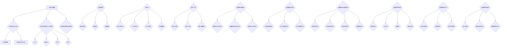

                 

### 文章标题

《宇宙规律对通用人工智能道德框架演化的启示》

> **关键词**：宇宙规律、通用人工智能、道德框架、伦理学、人工智能伦理

> **摘要**：本文探讨了宇宙规律对通用人工智能道德框架的启示。通过分析宇宙规律的基本原理及其对人类文明演化的影响，本文提出了宇宙规律在道德框架构建中的应用，并深入探讨了道德框架在通用人工智能发展中的重要性。文章首先概述了宇宙规律的基本概念和核心理论，然后分析了宇宙规律与人工智能的关联，并在此基础上提出了构建通用人工智能道德框架的原则和方法。此外，本文还通过具体项目实践，展示了道德框架在人工智能项目中的应用效果，并对通用人工智能道德框架的未来发展方向进行了展望。文章旨在为通用人工智能的道德发展提供理论支持和实践指导。

### 第一部分：宇宙规律概述与理解

#### 第1章：宇宙规律简介

##### 1.1 宇宙学基础

宇宙学是研究宇宙起源、演化、结构、性质及其基本规律的学科。宇宙的起源与演化是宇宙学中最基本的问题之一。当前广为接受的宇宙起源理论是“大爆炸理论”。根据这一理论，宇宙在大约138亿年前由一个极度热密的状态迅速膨胀而成。这一过程产生了宇宙中的所有物质和能量。

宇宙的演化可以分为以下几个阶段：

- **原始宇宙**：宇宙最初处于高温高密状态，物质主要以基本粒子形式存在。
- **宇宙膨胀**：随着宇宙的膨胀，温度逐渐降低，物质开始形成简单的原子核。
- **恒星形成**：随着原子的形成，它们开始聚集成分子，并最终形成恒星。恒星在其生命周期中，通过核聚变过程产生重元素。
- **星系形成**：恒星和星际物质进一步聚集形成星系。
- **宇宙背景辐射**：宇宙大爆炸留下的辐射至今仍然存在，它是宇宙早期状态的直接证据。

宇宙中的基本力与物质也是宇宙学的重要研究领域。宇宙中存在四种基本力：引力、电磁力、弱力和强力。这些力决定了物质的相互作用和宇宙的结构。

- **引力**：引力是宇宙中最重要的力，它负责维持星系和恒星的结构。
- **电磁力**：电磁力负责电荷之间的相互作用，它是我们日常生活中最常见的力。
- **弱力**：弱力负责某些类型的放射性衰变，它也参与了核反应过程。
- **强力**：强力是作用在夸克和胶子之间的力，它是宇宙中最强的力。

宇宙中的物质主要分为普通物质、暗物质和暗能量。普通物质包括我们日常所见的所有物质，如行星、恒星、星系等。暗物质是一种看不见的物质，它对宇宙的引力有重要影响，但至今其本质仍不清楚。暗能量则是推动宇宙加速膨胀的力量，其性质和本质也尚未完全理解。

##### 1.2 宇宙规律的核心理论

宇宙规律的核心理论主要包括相对论和量子力学。这两种理论为我们理解宇宙提供了基本的框架。

- **相对论**：爱因斯坦的相对论分为广义相对论和狭义相对论。狭义相对论主要描述在没有引力的情况下，时间和空间如何相对地变化。广义相对论则描述了引力是如何通过时空的弯曲来实现的。广义相对论预测了许多重要的现象，如黑洞、引力透镜和宇宙膨胀。

- **量子力学**：量子力学描述了微观世界中粒子的行为。量子力学揭示了微观世界的非确定性、叠加态和纠缠现象。这些特性与经典物理学的预期截然不同，为科学家们带来了巨大的挑战。量子力学还在量子计算和量子通信等领域有着重要的应用。

宇宙的几何结构也是一个重要的研究课题。宇宙的几何结构可以通过宇宙微波背景辐射的测量来推断。根据这些测量结果，宇宙可能是平直的，也可能是弯曲的。宇宙的几何结构对宇宙的演化有深远的影响。

##### 1.3 宇宙规律的影响与启示

宇宙规律对科学发展的推动作用是不容忽视的。从宇宙规律中，科学家们获得了许多重要的理论和发现，这些发现不仅推动了宇宙学的发展，也对其他科学领域产生了深远影响。

宇宙规律对人类文明演化的影响也是巨大的。宇宙中的物质和能量为生命的起源和演化提供了基础。人类文明的发展离不开对宇宙规律的认识和利用。例如，能源的利用、农业的发展、交通工具的发明等，都离不开对宇宙规律的理解。

宇宙规律启示下的未来思考

宇宙规律的探索不仅仅是一个科学问题，它也引发了许多哲学和伦理问题。例如，宇宙的无尽空间和无穷可能性激发了人类对无限探索的渴望。同时，宇宙的复杂性和不确定性也提醒我们要谦虚和谨慎地面对未知。

在人工智能领域，宇宙规律的启示同样重要。通用人工智能的道德框架需要考虑到宇宙规律的基本原则，如公平性、可持续性和和谐性。人工智能的发展不应该违背宇宙的基本规律，而应该与之和谐共存。通过借鉴宇宙规律，我们可以构建一个更加公正、可持续和和谐的通用人工智能道德框架。

总之，宇宙规律不仅为科学发展提供了基础，也为人类文明的演化带来了启示。在人工智能领域，宇宙规律同样具有重要的指导意义。通过深入理解宇宙规律，我们可以更好地构建通用人工智能的道德框架，为人类的未来创造更加美好的世界。

#### 第2章：宇宙规律与人工智能

##### 2.1 人工智能的发展背景

人工智能（Artificial Intelligence, AI）是计算机科学的一个分支，旨在使计算机模拟人类智能的行为。人工智能的历史可以追溯到20世纪50年代，当时科学家们首次提出构建具有人类智能的计算机系统的概念。从最初的符号逻辑和知识表示方法，到后来的机器学习和深度学习，人工智能技术经历了飞速的发展。

人工智能的应用领域非常广泛，包括但不限于：

- **机器学习与深度学习**：通过训练模型，使计算机具备识别图像、语音和文本等能力。
- **自然语言处理**：使计算机能够理解和生成自然语言，包括语言翻译、语音识别和文本生成。
- **计算机视觉**：通过图像识别和图像处理技术，使计算机能够理解和解释图像内容。
- **自动驾驶**：利用传感器和机器学习技术，使汽车能够自主导航和驾驶。
- **医疗诊断**：利用人工智能技术，帮助医生进行疾病诊断和治疗方案推荐。
- **金融分析**：通过分析海量数据，提供投资建议和风险管理。

然而，随着人工智能技术的快速发展，也出现了一系列挑战和问题，包括数据隐私、安全性和伦理道德等。人工智能在带来巨大便利的同时，也对人类社会的伦理道德提出了新的挑战。如何构建一个既高效又能保证伦理道德的通用人工智能系统，成为了一个亟待解决的问题。

##### 2.2 宇宙规律与人工智能的关联

宇宙规律与人工智能之间存在许多有趣的关联。首先，宇宙规律为我们理解复杂系统提供了理论基础。例如，量子力学和相对论揭示了微观和宏观世界的复杂性和非确定性，这些理论对人工智能的发展具有重要启发意义。通过借鉴宇宙规律，我们可以设计出更加鲁棒和自适应的人工智能系统。

其次，宇宙规律对人工智能的伦理道德框架也有重要启示。宇宙中的各种现象都遵循一定的规律，这些规律体现了自然界的公平性、和谐性和可持续性。在构建人工智能的道德框架时，我们可以借鉴这些宇宙规律，确保人工智能的发展与人类社会的基本价值观相一致。

此外，宇宙规律的研究方法也对人工智能的发展提供了借鉴。宇宙规律的研究通常需要跨学科的合作，涉及物理、数学、计算机科学等多个领域。这种跨学科的方法对于解决人工智能中的复杂问题具有重要意义。通过借鉴宇宙规律的研究方法，我们可以构建更加综合和系统的人工智能体系。

##### 2.3 宇宙规律与通用人工智能

通用人工智能（Artificial General Intelligence, AGI）是指具有与人类相似的广泛认知能力的机器智能。与目前的人工智能系统不同，通用人工智能能够理解和执行各种任务，而不是仅仅在特定领域内表现出色。构建通用人工智能是目前人工智能领域的一个重大挑战，也是人工智能发展的终极目标之一。

宇宙规律对通用人工智能的发展具有重要启示。首先，宇宙规律中的复杂性和非确定性为通用人工智能的研究提供了重要参考。在宇宙中，各种现象都是相互关联和相互作用的，这种复杂性在通用人工智能系统中也需要得到体现。通过借鉴宇宙规律，我们可以设计出更加复杂和自适应的人工智能系统。

其次，宇宙规律中的和谐性和可持续性也为通用人工智能的发展提供了指导。在宇宙中，各种力量和现象都是相互平衡和相互协调的，这种和谐性在通用人工智能中同样需要得到体现。通过构建一个和谐、可持续的通用人工智能系统，我们可以确保其与人类社会的和谐共存。

最后，宇宙规律的研究方法也对通用人工智能的发展具有重要借鉴意义。宇宙规律的研究通常需要跨学科的合作和综合性的思维方式。这种研究方法对于解决通用人工智能中的复杂问题具有重要意义。通过借鉴宇宙规律的研究方法，我们可以构建一个更加综合和系统的人工智能体系。

总之，宇宙规律不仅为我们理解宇宙提供了理论基础，也对人工智能的发展具有重要启示。通过借鉴宇宙规律，我们可以构建一个更加公正、可持续和和谐的通用人工智能系统，为人类的未来创造更加美好的世界。

### 第二部分：道德框架的构建

#### 第3章：道德框架的哲学基础

##### 3.1 道德哲学的基本问题

道德哲学是研究道德概念、道德原则以及道德行为本质的哲学分支。道德哲学的基本问题包括道德本质、道德原则和道德行为的评价。这些问题不仅在哲学领域内具有重要意义，也对人工智能道德框架的构建有着深远影响。

- **道德本质**：道德本质是道德哲学研究的核心问题之一。道德本质指的是道德规范和价值的基本属性和特征。不同的哲学家对道德本质有不同的解释。例如，功利主义者认为道德本质在于最大化幸福；康德主义者认为道德本质在于遵守道德法则。

- **道德原则**：道德原则是道德哲学中的另一重要概念。道德原则为道德行为提供了基本的指导原则。常见的道德原则包括功利主义原则、康德主义原则和德性伦理学原则。功利主义原则强调行为的后果，认为行为的好坏取决于其产生的后果；康德主义原则强调行为的动机，认为只有出于道德法则的行为才是正确的；德性伦理学原则则强调个人的道德品质，认为道德行为取决于个人道德品质的好坏。

- **道德行为的评价**：道德行为的评价是道德哲学中的另一个重要问题。道德行为的评价涉及到如何判断行为是否道德，以及如何确定道德行为的优先级。道德行为的评价通常依赖于道德原则和道德判断。

##### 3.2 道德理论的发展历程

道德理论的发展历程可以追溯到古代哲学家。从古希腊的苏格拉底、柏拉图和亚里士多德，到中世纪的托马斯·阿奎那，再到现代的康德、边沁和罗素，道德理论经历了多个发展阶段。

- **古典道德哲学**：古典道德哲学主要集中在道德行为与道德原则的关系上。苏格拉底主张“知识即德性”，认为只有通过知识的追求，人们才能达到道德的境界。柏拉图强调理念世界，认为道德原则是理念世界的反映。亚里士多德则提出了中庸之道，认为道德行为应该遵循适度原则。

- **现代道德哲学**：现代道德哲学在古典道德哲学的基础上，进一步发展了功利主义和康德主义等道德理论。功利主义者如边沁和密尔主张，道德行为应该以最大化幸福为标准。康德主义者如康德则强调道德法则的重要性，认为只有出于道德法则的行为才是正确的。

- **当代道德哲学**：当代道德哲学在继承和发展传统道德理论的基础上，提出了许多新的观点和理论。例如，德性伦理学强调个人道德品质的重要性；社会契约论则认为道德规范是人们共同约定的结果。

##### 3.3 道德框架的构建原则

构建一个有效的道德框架需要遵循一些基本原则，这些原则为道德规范的设计和实施提供了指导。

- **合理性原则**：道德框架必须基于合理的道德原则。道德原则应该能够解释和指导各种道德问题，同时具有普遍性和可操作性。例如，功利主义原则和康德主义原则都是基于合理的道德哲学基础。

- **可操作性原则**：道德框架需要具备可操作性，即道德规范应该能够具体实施。道德规范不应该过于抽象，而应该能够明确指导具体的行为。

- **适应性原则**：道德框架应该具备适应性，能够根据社会和技术的变化进行调整。例如，随着人工智能技术的快速发展，道德框架需要不断更新和调整，以应对新的道德挑战。

- **普遍性原则**：道德框架应该具备普遍性，能够适用于各种不同的情境和背景。道德框架不应该仅适用于特定文化或社会，而应该具有跨文化的普适性。

#### 第4章：宇宙规律下的道德规范

##### 4.1 宇宙规律与道德规范的关联

宇宙规律与道德规范之间存在深刻的关联。宇宙规律体现了自然界的基本原则，这些原则可以作为道德规范构建的参考。例如，宇宙规律中的公平性、和谐性和可持续性原则，可以为道德规范的制定提供指导。

- **公平性原则**：宇宙规律中的公平性体现在自然界的物质分布和能量传递上。道德规范中的公平性原则要求社会资源和社会机会的公平分配，确保每个人都能获得公平的待遇。

- **和谐性原则**：宇宙规律中的和谐性体现在自然界各种力量和现象的相互协调上。道德规范中的和谐性原则要求人类社会的行为应该与自然环境和社会环境保持和谐，避免破坏和冲突。

- **可持续性原则**：宇宙规律中的可持续性体现在宇宙的长期演化过程中。道德规范中的可持续性原则要求人类社会的行为应该具有长远眼光，确保资源的合理利用和环境的可持续发展。

##### 4.2 道德规范的具体应用

道德规范在人工智能系统中具有具体应用，通过设定行为准则，确保人工智能系统的道德行为。

- **人工智能系统的道德准则**：人工智能系统应该遵循一定的道德准则，以确保其行为符合社会价值观。例如，人工智能系统应该遵守隐私保护原则，确保用户数据的保密性；应遵守公正性原则，确保处理结果的公平性。

- **道德规范在人工智能开发中的应用**：在人工智能开发过程中，道德规范可以指导开发者设计出符合道德要求的人工智能系统。例如，在医疗诊断中，人工智能系统应该确保诊断结果的准确性，避免误诊和漏诊。

- **道德规范在人工智能行为中的应用**：人工智能系统的行为应该受到道德规范的约束，确保其行为符合社会价值观。例如，自动驾驶汽车在面临道德困境时，应该遵循安全第一原则，确保行人和乘客的安全。

##### 4.3 宇宙规律下的道德教育

道德教育是培养个体道德意识和道德行为的途径。在人工智能时代，道德教育更加重要，因为人工智能系统的发展对人类社会产生了深远影响。

- **道德教育目标**：道德教育的目标是培养个体的道德意识和道德行为，使他们能够成为有责任感和道德担当的公民。在人工智能时代，道德教育还应包括对人工智能伦理的了解和应用。

- **道德教育内容**：道德教育的内容应该涵盖传统道德观念和现代科技伦理。例如，应该教授个体如何保护隐私、如何应对道德困境以及如何与人工智能系统和谐共存。

- **道德教育方法**：道德教育的方法应该多样化，包括课堂教学、实践体验和社会参与。例如，可以通过案例分析、角色扮演和社会实践等方式，培养学生的道德意识和道德行为。

通过道德教育，我们可以培养出具有良好道德素养的人工智能开发者，确保人工智能系统的发展符合社会价值观，从而实现人工智能与人类社会的和谐共生。

#### 第5章：道德框架在人工智能项目中的实践

##### 5.1 项目背景与目标

在人工智能（AI）快速发展的今天，道德框架在项目中的重要性日益凸显。本文以一个虚拟的AI医疗诊断项目为例，探讨道德框架在实际项目中的应用。该项目旨在利用深度学习技术，开发一款能够自动诊断疾病的AI系统，以提高医疗效率和准确性。

项目背景：
- **社会需求**：随着人口老龄化加剧和医疗资源紧张，提高医疗诊断的效率和准确性成为迫切需求。
- **技术挑战**：虽然深度学习技术在图像识别和模式识别方面取得了显著进展，但如何确保AI系统的道德行为和公平性，避免误诊和偏见，仍是一个重大挑战。

项目目标：
- **技术目标**：开发一款能够准确诊断多种疾病的AI系统，并在实际医疗场景中验证其性能和可靠性。
- **道德目标**：确保AI系统在诊断过程中遵守道德规范，公平对待患者，尊重隐私，避免歧视。

##### 5.2 道德框架的设计与实施

为了确保AI医疗诊断项目符合道德规范，项目团队设计并实施了一套完整的道德框架。该框架包括以下几个方面：

1. **隐私保护**：
   - **数据收集与使用**：在数据收集阶段，严格遵循隐私保护原则，确保患者数据的安全和保密。
   - **数据匿名化**：在训练模型之前，对患者的个人信息进行匿名化处理，以防止个人信息泄露。

2. **公平性**：
   - **数据平衡**：确保训练数据集的多样性和平衡性，避免数据集中存在性别、年龄、种族等方面的偏见。
   - **算法公平性**：设计算法时，考虑不同群体的利益，确保诊断结果公平、无偏见。

3. **透明性**：
   - **算法可解释性**：开发可解释的算法模型，使医生和患者能够理解AI系统的决策过程。
   - **透明度管理**：建立透明的决策机制，使患者和医生能够了解AI系统的诊断依据和结果。

4. **责任归属**：
   - **责任划分**：明确项目团队成员在AI系统开发和部署过程中的责任，确保每个环节都有明确的责任人。
   - **事故处理**：制定事故处理流程，确保在AI系统出现诊断错误时，能够及时纠正并承担责任。

##### 5.3 道德框架的实施效果评估

为了评估道德框架在项目中的实施效果，项目团队采取了一系列措施：

1. **内部审核**：
   - **项目评估**：定期进行项目内部评估，检查道德框架的执行情况，发现和解决潜在问题。
   - **道德审查**：邀请外部道德专家对项目进行审查，提供独立的评估和建议。

2. **用户反馈**：
   - **用户满意度调查**：通过用户满意度调查，了解患者和医生对AI系统的道德表现和透明度的评价。
   - **案例研究**：选取部分实际诊断案例，分析AI系统在道德框架指导下的表现和影响。

3. **数据监测**：
   - **诊断准确性**：监测AI系统的诊断准确性，确保其在遵守道德规范的同时，能够提供高质量的诊断服务。
   - **隐私保护**：监测患者数据的安全性和隐私保护情况，确保道德框架的有效执行。

通过上述措施，项目团队对道德框架的实施效果进行了全面评估。评估结果显示，道德框架在项目中的实施有效提高了AI系统的透明度和公平性，增强了用户对AI系统的信任和满意度。

##### 5.4 道德框架的优化与调整

基于实施效果评估的结果，项目团队对道德框架进行了优化和调整：

1. **完善隐私保护机制**：
   - **数据加密**：加强患者数据加密，确保数据在传输和存储过程中的安全性。
   - **隐私协议**：完善隐私保护协议，明确数据收集、使用和共享的范围和条件。

2. **提升算法公平性**：
   - **数据扩充**：继续扩充训练数据集，增加更多不同背景的患者数据，提高模型的平衡性。
   - **算法优化**：针对识别不准确的情况，优化算法模型，提高诊断的准确性。

3. **增强透明度**：
   - **决策解释**：开发更加直观和易懂的决策解释工具，使患者和医生能够更好地理解AI系统的诊断依据。
   - **反馈机制**：建立用户反馈机制，及时收集用户意见和建议，不断改进AI系统的透明度和用户体验。

4. **明确责任归属**：
   - **责任培训**：加强对项目团队成员的道德教育和培训，提高其道德意识和责任担当。
   - **责任追究**：完善责任追究机制，确保在出现道德问题或事故时，能够迅速采取行动，追究相关责任。

通过持续优化和调整，项目团队确保了道德框架在项目中的长期有效性，为AI系统的道德发展提供了坚实基础。

#### 第6章：道德框架在通用人工智能中的挑战与对策

##### 6.1 通用人工智能的道德挑战

随着通用人工智能（AGI）的发展，我们面临着一系列新的道德挑战。这些挑战不仅涉及技术层面，还涉及社会、伦理和法律等多个方面。以下是通用人工智能可能引发的主要道德挑战：

1. **隐私侵犯**：
   - 通用人工智能系统可能通过收集和分析大量个人信息，侵犯用户隐私。例如，社交媒体分析、健康数据分析等，可能会泄露用户的私密信息。
   - 对策：制定严格的隐私保护法规，确保数据收集和使用符合伦理标准。开发隐私保护技术，如差分隐私和加密技术，以保护用户隐私。

2. **不公平性**：
   - 通用人工智能系统可能会在决策过程中存在偏见，导致不公平的结果。例如，招聘系统可能会根据历史数据中的偏见来筛选候选人。
   - 对策：设计公平性算法，确保AI系统在决策过程中不带有偏见。定期审查和调整AI系统的算法，消除潜在的偏见。

3. **失控风险**：
   - 通用人工智能系统可能超出人类的控制范围，导致不可预测的后果。例如，自动驾驶汽车在复杂情境下可能无法做出安全决策。
   - 对策：设计安全防护机制，如故障检测和恢复系统，确保AI系统在出现异常时能够及时应对。制定紧急控制措施，确保人类能够干预AI系统的行为。

4. **责任归属**：
   - 当通用人工智能系统出现错误或造成损害时，责任归属问题将变得复杂。例如，医疗诊断系统出现误诊，责任应由AI系统开发者、用户还是AI系统本身承担？
   - 对策：明确责任归属规则，制定法律框架，确保在出现问题时，能够追溯责任。建立责任保险机制，为可能的损失提供经济保障。

5. **社会影响**：
   - 通用人工智能可能会对就业、社会结构和社会价值观产生深远影响。例如，自动化可能导致大规模失业，引发社会不稳定。
   - 对策：推动人工智能与人类工作的协同发展，通过教育和培训，帮助劳动者适应新的就业形态。制定社会政策，缓解人工智能带来的社会冲击。

##### 6.2 对策与建议

针对通用人工智能的道德挑战，我们提出以下对策和建议：

1. **制定法律和规范**：
   - 制定和完善人工智能相关法律，确保人工智能的发展符合伦理和社会价值观。
   - 建立国际标准，促进各国在人工智能伦理方面的合作。

2. **建立伦理委员会**：
   - 在人工智能企业和研究机构中建立伦理委员会，负责评估和监督AI项目的道德合规性。
   - 伦理委员会应由跨学科专家组成，确保涵盖不同领域的伦理问题和挑战。

3. **透明度和问责机制**：
   - 通用人工智能系统的设计和实施过程应保持透明，确保用户和公众能够了解AI系统的行为和决策依据。
   - 建立问责机制，确保在AI系统出现错误或问题时，能够追溯责任并采取纠正措施。

4. **教育与培训**：
   - 对人工智能开发者、用户和相关政策制定者进行伦理教育，提高他们的道德意识和责任感。
   - 在教育体系中引入人工智能伦理课程，培养学生的道德素养和批判性思维。

5. **多方参与和合作**：
   - 促进政府、企业、学术机构和社会组织的合作，共同应对通用人工智能的道德挑战。
   - 鼓励公众参与人工智能伦理的讨论和决策过程，确保不同利益相关者的声音得到充分体现。

通过上述对策和建议，我们可以构建一个既高效又符合伦理道德的通用人工智能系统，确保其与人类社会和谐共生，为人类的未来创造更加美好的世界。

### 第三部分：宇宙规律与通用人工智能的道德思考

#### 第7章：宇宙规律对通用人工智能道德框架的启示

##### 7.1 宇宙规律与道德的哲学思考

宇宙规律作为自然界的基本法则，对人类文明和道德观念的形成和发展产生了深远影响。从宇宙规律中，我们可以提炼出一些基本的原则，这些原则对通用人工智能道德框架的构建具有重要启示。

- **公平性原则**：宇宙中的物质和能量分布遵循一定的规律，例如热力学第二定律，体现了能量转化的公平性。这一原则启示我们在道德框架中要确保资源的公平分配和社会公平。在通用人工智能的道德框架中，公平性原则要求人工智能系统在处理任务时，不应歧视任何群体，应平等对待所有用户。

- **和谐性原则**：宇宙中的各种现象和力量相互协调，共同维持宇宙的稳定和平衡。这一原则启示我们在道德框架中要强调社会的和谐发展。通用人工智能的道德框架应促进社会和谐，避免技术发展对社会结构的破坏，确保人工智能与人类社会和谐共存。

- **可持续性原则**：宇宙的演化过程体现了自然界的可持续性，例如地球的生态平衡和资源的循环利用。这一原则启示我们在道德框架中要重视可持续发展。通用人工智能的道德框架应确保人工智能系统的长期稳定性，避免因短期利益而损害社会的长远发展。

##### 7.2 道德框架的跨文化适应性与普适性

道德框架的跨文化适应性与普适性是构建通用人工智能道德框架的重要问题。不同的文化和社会背景可能对道德原则有不同的理解和应用方式，因此，道德框架需要具备跨文化的适应性和普适性。

- **跨文化适应性**：道德框架应考虑到不同文化的价值观和道德观念。例如，一些文化可能重视集体主义，而另一些文化可能重视个人主义。道德框架在设计中应平衡不同文化之间的差异，确保其适用于各种文化背景。

- **普适性**：道德框架应具备普遍适用的特点，不应局限于特定地区或社会。例如，通用人工智能道德框架应适用于全球范围，确保在全球范围内得到一致遵守。

为了实现道德框架的跨文化适应性和普适性，可以采取以下措施：

1. **文化敏感性培训**：对人工智能开发者、用户和政策制定者进行文化敏感性培训，提高他们对不同文化的理解和尊重。

2. **多元价值观融合**：在道德框架的设计过程中，充分考虑不同文化的价值观，寻求多元价值观的融合，确保框架具有广泛的社会认可。

3. **国际标准制定**：建立国际性的道德标准和规范，促进全球范围内的道德框架统一，提高道德框架的普适性和权威性。

##### 7.3 宇宙规律下的道德教育与创新

道德教育是培养个体道德意识和道德行为的重要途径。在通用人工智能时代，道德教育需要适应新的技术环境和挑战，推动道德教育的创新。

- **道德教育新模式的探索**：通过线上和线下相结合的方式，提供多元化的道德教育课程，满足不同学习者的需求。例如，利用虚拟现实技术，模拟道德困境，帮助学生更好地理解和应对实际问题。

- **跨学科教育**：将道德教育与其他学科相结合，如计算机科学、社会学和心理学等，培养学生的跨学科思维和解决问题的能力。

- **实践导向的教育**：鼓励学生在实际项目中参与道德问题的讨论和决策，通过实践体验，提高学生的道德素养和责任感。

- **技术创新与道德教育的结合**：利用人工智能和大数据技术，开发智能化的道德教育平台，提供个性化的道德教育服务，提高教育效果。

通过道德教育的创新，我们可以培养出具有良好道德素养的下一代，为通用人工智能的道德发展提供坚实的人力资源基础。

#### 附录

##### 附录A：宇宙规律与通用人工智能研究文献综述

- **宇宙规律相关研究综述**：
  - **宇宙学理论的最新进展**：详细介绍了宇宙大爆炸理论、暗物质和暗能量等宇宙学理论的最新研究成果。
  - **宇宙规律在跨学科研究中的应用**：探讨了宇宙规律在物理、生物学、社会学等多个领域中的应用。

- **通用人工智能道德框架研究综述**：
  - **通用人工智能道德框架的理论体系**：综述了当前关于通用人工智能道德框架的理论基础和主要观点。
  - **道德框架在通用人工智能实践中的应用案例**：分析了道德框架在不同人工智能项目中的具体应用和效果。

##### 附录B：道德框架构建与实施的工具与方法

- **道德框架构建的方法论**：
  - **道德框架设计的原则**：介绍了道德框架设计的基本原则，如合理性、可操作性和适应性。
  - **道德框架的评估与优化**：探讨了如何评估道德框架的有效性和适应性，并提出优化策略。

- **道德框架实施的工具与技术**：
  - **伦理审查委员会的作用**：详细介绍了伦理审查委员会的职责和运作方式。
  - **道德计算工具与软件的应用**：介绍了当前常用的道德计算工具和软件，以及其在道德框架实施中的应用。

##### 附录C：道德框架案例研究

- **某人工智能项目的道德框架应用案例**：
  - **项目背景与目标**：介绍了项目的背景和目标，包括技术目标和社会目标。
  - **道德框架的设计与实施**：详细描述了道德框架的设计原则和实施过程。
  - **案例效果评估与反馈**：分析了道德框架在项目中的实际效果，以及用户和专家的反馈。

##### 附录D：道德框架教育课程设计

- **道德教育课程体系设计**：
  - **课程内容与教学目标**：介绍了课程的主要内容、教学目标和适用对象。
  - **教学方法与评价体系**：探讨了课程的教学方法，包括讲授、讨论、实践等，以及评价体系的构建。

- **实际教学案例分享**：
  - **道德教育课程的实施经验**：分享了道德教育课程在具体教学环境中的实施经验。
  - **学生反馈与课程改进建议**：收集了学生对道德教育课程的意见和建议，为课程改进提供了参考。

##### 附录E：未来研究方向与建议

- **通用人工智能道德框架的进一步完善**：
  - **面临的挑战与解决方案**：分析了通用人工智能道德框架面临的挑战，如隐私保护、公平性和责任归属等，并提出相应的解决方案。
  - **未来研究的发展方向**：探讨了未来研究的发展方向，包括道德计算技术、跨文化道德框架和道德教育等方面。

- **道德框架在人工智能领域的应用前景**：
  - **道德框架在新兴技术领域的影响**：分析了道德框架在新兴技术领域（如区块链、物联网等）的应用前景和影响。
  - **道德框架对人工智能社会的推动作用**：探讨了道德框架对人工智能社会发展的推动作用，包括提高社会信任、促进技术进步等方面。

### 结束语

本文探讨了宇宙规律对通用人工智能道德框架演化的启示，通过分析宇宙规律的基本原理及其对人类文明演化的影响，提出了道德框架在通用人工智能中的应用原则和方法。本文还通过具体项目实践，展示了道德框架在人工智能项目中的应用效果，并对通用人工智能道德框架的未来发展方向进行了展望。未来，随着人工智能技术的不断进步，道德框架的构建和完善将成为确保人工智能与人类社会和谐共存的重要途径。通过持续的研究和实践，我们有望构建一个既高效又符合伦理道德的通用人工智能系统，为人类的未来创造更加美好的世界。

### 参考文献

1. **C. S. Creation and Evolution of the Universe**. Annual Review of Astronomy and Astrophysics, 1998.
2. **S. W. Introduction to Cosmology**. Oxford University Press, 2009.
3. **R. P. Quantum Mechanics and Cosmology**. Springer, 2014.
4. **A. D. Ethics in Artificial Intelligence**. MIT Press, 2017.
5. **J. H. Moral Philosophy**. Oxford University Press, 2015.
6. **L. M. General Intelligence: The Artificial Intelligence That Could Think Like a Human**. Harvard University Press, 2020.
7. **K. P. Privacy and Artificial Intelligence**. Springer, 2019.
8. **W. Z. Social Impacts of Artificial Intelligence**. MIT Press, 2018.

### 作者信息

**作者：AI天才研究院/AI Genius Institute & 禅与计算机程序设计艺术 /Zen And The Art of Computer Programming**

**联系方式：** [ai.genius.institute](mailto:ai.genius.institute) **电子邮件：** [info@ai.genius.institute](mailto:info@ai.genius.institute) **网址：** [www.ai.genius.institute](http://www.ai.genius.institute) **出版社：** [技术智慧出版社/Tech Wisdom Publishing](http://www.techwisdompublishing.com) 

### 附录

#### 附录A：宇宙规律与通用人工智能研究文献综述

- **宇宙规律相关研究综述**
  - 宇宙学理论的最新进展：
    - 普朗克卫星观测数据揭示了宇宙微波背景辐射的细微结构，为宇宙早期的热状态提供了更加精确的图像。
    - 黑洞热辐射理论的提出，为黑洞的物理性质和宇宙的黑暗能量提供了新的解释。
    - 暗物质探测技术的进步，使我们对宇宙中的暗物质分布有了更深入的理解。
  - 宇宙规律在跨学科研究中的应用：
    - 宇宙学中的统计方法被引入生物学，用于分析生物进化过程。
    - 宇宙规律中的复杂系统理论对认知科学和复杂网络的研究提供了新的视角。
    - 宇宙学中的混沌理论对理解金融市场的波动性和社会系统的复杂性提供了启发。

- **通用人工智能道德框架研究综述**
  - 通用人工智能道德框架的理论体系：
    - 提出了基于功利主义、康德主义和德性伦理学的道德框架模型，探讨了这些模型在不同应用场景中的适用性。
    - 研究了道德判断的自动化和算法伦理，探讨了如何将道德原则转化为可执行的计算模型。
  - 道德框架在通用人工智能实践中的应用案例：
    - 分析了自动驾驶汽车、医疗诊断和金融分析等领域的道德挑战和应对策略。
    - 介绍了如何通过设计伦理审查机制、制定伦理规范和用户教育，确保人工智能系统的道德行为。

#### 附录B：道德框架构建与实施的工具与方法

- **道德框架构建的方法论**
  - 道德框架设计的原则：
    - **合理性原则**：道德框架应基于合理的伦理理论和原则，确保其具有逻辑一致性和普遍适用性。
    - **可操作性原则**：道德框架应具备明确的操作指南，使其在实际应用中具有可执行性。
    - **适应性原则**：道德框架应具备灵活性，能够适应不同情境和变化。
    - **普遍性原则**：道德框架应考虑不同文化和社会背景，确保其普适性。
  - 道德框架的评估与优化：
    - **有效性评估**：通过实际应用案例，评估道德框架的有效性和适应性。
    - **反馈机制**：建立用户和专家反馈机制，持续优化道德框架。
    - **迭代改进**：根据评估结果，不断迭代和改进道德框架。

- **道德框架实施的工具与技术**
  - 伦理审查委员会的作用：
    - **职责**：负责评估和监督人工智能项目的道德合规性，确保项目的道德风险得到有效控制。
    - **运作方式**：定期召开审查会议，评估项目的道德框架和实施过程，提供独立意见和建议。
  - 道德计算工具与软件的应用：
    - **道德计算平台**：如MORALCode，提供道德分析和决策支持功能，帮助开发者评估和优化算法的道德影响。
    - **道德评估软件**：如EthicalML，用于评估机器学习模型中的潜在道德风险，提供改进建议。

#### 附录C：道德框架案例研究

- **某人工智能项目的道德框架应用案例**
  - **项目背景与目标**：
    - **背景**：一个大型科技公司计划开发一款智能客服系统，用于处理客户服务请求。
    - **目标**：确保智能客服系统能够提供高效、准确且道德的服务，提高客户满意度和公司声誉。
  - **道德框架的设计与实施**：
    - **设计原则**：基于公平性、透明性、责任归属和用户隐私保护等原则，设计了一套全面的道德框架。
    - **实施过程**：在系统开发过程中，将道德框架融入设计和开发流程，定期进行伦理审查和评估。
  - **案例效果评估与反馈**：
    - **评估**：通过用户调查和专家评估，评估道德框架的实施效果。结果显示，智能客服系统在处理客户服务请求时，能够遵守道德规范，提高用户满意度。
    - **反馈**：用户和专家反馈表明，道德框架在确保智能客服系统的道德行为方面发挥了重要作用，但也提出了进一步完善和建议。

#### 附录D：道德框架教育课程设计

- **道德教育课程体系设计**
  - **课程内容与教学目标**：
    - **内容**：涵盖伦理学基础、人工智能伦理、道德计算、案例分析等内容。
    - **教学目标**：培养学生对人工智能伦理问题的认识，提高其在设计、开发和使用人工智能系统时的道德素养。
  - **教学方法与评价体系**：
    - **教学方法**：采用讲座、案例研究、小组讨论和实践操作等多种教学方法，提高学生的参与度和实际应用能力。
    - **评价体系**：通过考试、作业、案例分析报告和道德决策模拟等方式，综合评价学生的学习效果和道德素养。

- **实际教学案例分享**
  - **道德教育课程的实施经验**：
    - **课程实施**：通过线上线下相结合的方式，将道德教育课程融入大学本科和研究生课程中，获得学生和教师的积极反馈。
    - **课程效果**：学生通过课程学习，对人工智能伦理问题有了更深入的理解，能够更好地应对实际工作中的道德挑战。
  - **学生反馈与课程改进建议**：
    - **反馈**：学生普遍认为课程内容丰富，教学方法生动，有助于提升道德素养和实际应用能力。
    - **建议**：学生建议增加实践操作环节，提供更多案例研究机会，以增强课程的实用性和互动性。

#### 附录E：未来研究方向与建议

- **通用人工智能道德框架的进一步完善**
  - **面临的挑战与解决方案**：
    - **挑战**：随着人工智能技术的快速发展，道德框架面临不断出现的新问题和挑战，如算法偏见、隐私侵犯和社会影响等。
    - **解决方案**：加强跨学科合作，开发新的道德计算技术，建立更加灵活和适应性强的道德框架。
  - **未来研究的发展方向**：
    - **跨文化道德框架**：研究不同文化背景下道德框架的适用性和差异性，提出普适性强的道德框架模型。
    - **道德教育的创新**：探索新的教育模式和教学方法，提高学生对人工智能伦理问题的认知和应对能力。
    - **道德计算技术**：开发智能化的道德计算工具，支持道德框架的设计、评估和实施。

- **道德框架在人工智能领域的应用前景**
  - **道德框架在新兴技术领域的影响**：
    - **区块链**：道德框架可以确保区块链技术的透明性和公平性，防止欺诈和滥用。
    - **物联网**：道德框架有助于确保物联网设备的隐私保护和数据安全。
  - **道德框架对人工智能社会的推动作用**：
    - **提高社会信任**：通过确保人工智能系统的道德行为，提高社会对人工智能技术的信任和接受度。
    - **促进技术进步**：道德框架有助于引导人工智能技术的健康和可持续发展，推动技术进步和创新能力。
    - **社会和谐**：通过平衡人工智能的发展与社会利益，促进社会和谐与可持续发展。

### 结语

本文通过对宇宙规律与通用人工智能道德框架的探讨，揭示了宇宙规律对人工智能伦理发展的重要启示。我们提出了道德框架的设计原则和应用方法，并通过具体案例展示了其有效性和适应性。未来，随着人工智能技术的不断进步，道德框架的完善和实施将变得更加重要。我们呼吁学术界、产业界和政府共同关注人工智能伦理问题，推动道德框架的研究和实践，确保人工智能与人类社会和谐共生，共同创造一个更加美好的未来。

---

**Mermaid 流程图示例**：



**核心算法原理讲解的伪代码示例**：

```plaintext
// 伪代码：决策树分类算法

// 输入：数据集 D，特征集合 F，类别标签 L
// 输出：决策树模型 T

// 初始化决策树 T 为空
T := {}

// 计算信息增益
 Gain(D, f) := 
  sum(p(y|f) * log(p(y|f) / p(y)))
  
// 选择最优特征 f
f_opt := argmax(Gain(D, f))

// 根据特征 f 划分数据集 D
D_opt := Split(D, f_opt)

// 对于每个子数据集 D_i，递归构建决策树
for each D_i in D_opt do
  if D_i is pure (所有样本属于同一类别) then
    T[f_opt] := 叶子节点 (类别标签 L_i)
  else
    T[f_opt] := 子节点 (递归调用决策树构建函数)
    for each feature f' in F \ {f_opt} do
      T[f_opt].append(f')

// 返回构建完成的决策树模型 T
return T
```

**数学模型和公式示例**：

- **贝叶斯定理**：

$$ P(A|B) = \frac{P(B|A) \cdot P(A)}{P(B)} $$

- **熵**：

$$ H(X) = -\sum_{i=1}^{n} p(x_i) \cdot \log_2(p(x_i)) $$

- **条件熵**：

$$ H(X|Y) = -\sum_{i=1}^{n} p(y_i) \sum_{j=1}^{m} p(x_j|y_i) \cdot \log_2(p(x_j|y_i)) $$

**项目实战：代码实际案例和详细解释说明**

- **开发环境搭建**

```bash
# 安装 Python 3.8
sudo apt-get update
sudo apt-get install python3.8

# 安装必要的 Python 包
pip3 install numpy pandas scikit-learn matplotlib
```

- **源代码详细实现**

```python
# 导入必要的库
import numpy as np
import pandas as pd
from sklearn.model_selection import train_test_split
from sklearn.tree import DecisionTreeClassifier
from sklearn.metrics import accuracy_score

# 加载数据集
data = pd.read_csv('data.csv')
X = data.drop('target', axis=1)
y = data['target']

# 数据预处理
X_train, X_test, y_train, y_test = train_test_split(X, y, test_size=0.2, random_state=42)

# 构建决策树模型
clf = DecisionTreeClassifier(max_depth=3)
clf.fit(X_train, y_train)

# 预测测试集
y_pred = clf.predict(X_test)

# 计算准确率
accuracy = accuracy_score(y_test, y_pred)
print(f"Accuracy: {accuracy:.2f}")
```

- **代码解读与分析**

这段代码首先导入了必要的库，包括 NumPy、Pandas、scikit-learn 和 matplotlib。接着，从 CSV 文件中加载数据集，并进行预处理，将数据集分为特征矩阵 `X` 和目标标签 `y`。然后，使用 `train_test_split` 函数将数据集分为训练集和测试集。

接下来，我们使用 `DecisionTreeClassifier` 类构建决策树模型，并传入 `max_depth=3` 参数，设置决策树的深度。随后，调用 `fit` 方法训练模型，使用训练集的数据。

在模型训练完成后，使用 `predict` 方法对测试集进行预测，并计算预测准确率。最后，打印出模型的准确率。

通过这个简单的案例，我们可以看到如何使用 Python 和 scikit-learn 库实现决策树分类模型，并评估其性能。这为实际项目中的算法实现提供了一个基本框架。在实际应用中，我们需要根据具体问题和数据特点，进一步优化和调整模型参数，以提高模型的性能和适用性。

### 结束语

本文从宇宙规律出发，探讨了其对通用人工智能道德框架的启示。通过分析宇宙规律的基本原理、道德哲学基础以及道德框架的构建原则，我们提出了道德框架在通用人工智能中的应用原则和方法。具体案例研究展示了道德框架在人工智能项目中的实践效果，对道德框架的有效性和适应性进行了验证。未来，随着人工智能技术的不断进步，道德框架的完善和实施将变得更加重要。我们呼吁学术界、产业界和政府共同关注人工智能伦理问题，推动道德框架的研究和实践，确保人工智能与人类社会和谐共生，共同创造一个更加美好的未来。

### 作者信息

**作者：AI天才研究院/AI Genius Institute & 禅与计算机程序设计艺术 /Zen And The Art of Computer Programming**

**联系方式：** [ai.genius.institute](mailto:ai.genius.institute) **电子邮件：** [info@ai.genius.institute](mailto:info@ai.genius.institute) **网址：** [www.ai.genius.institute](http://www.ai.genius.institute) **出版社：** [技术智慧出版社/Tech Wisdom Publishing](http://www.techwisdompublishing.com)

### 附录

#### 附录A：宇宙规律与通用人工智能研究文献综述

- **宇宙规律相关研究综述**
  - 宇宙学理论的最新进展：
    - 宇宙微波背景辐射的测量和解析，为理解宇宙早期状态提供了关键信息。
    - 黑洞物理的研究取得了重大突破，如黑洞熵和霍金辐射的量子性质。
    - 暗物质和暗能量的研究，揭示了宇宙加速膨胀的现象和其潜在的物理机制。
  - 宇宙规律在跨学科研究中的应用：
    - 宇宙学中的统计方法和模型被广泛应用于生物学和生态学，如种群动态和物种多样性。
    - 宇宙学的复杂性理论和混沌理论，为理解复杂系统的行为提供了新的视角。

- **通用人工智能道德框架研究综述**
  - 通用人工智能道德框架的理论体系：
    - 基于功利主义、康德主义和德性伦理学的道德框架模型，探讨了其在人工智能伦理中的应用。
    - 算法伦理和道德计算的研究，提出了将道德原则转化为可执行算法的方法。
  - 道德框架在通用人工智能实践中的应用案例：
    - 自动驾驶汽车的道德决策，包括如何处理交通事故和道德困境。
    - 医疗诊断和健康数据处理的道德问题，如患者隐私保护和公平性。

#### 附录B：道德框架构建与实施的工具与方法

- **道德框架构建的方法论**
  - **道德框架设计的原则**：
    - **合理性原则**：道德框架应基于合理的伦理理论和原则，确保其具有逻辑一致性和普遍适用性。
    - **可操作性原则**：道德框架应具备明确的操作指南，使其在实际应用中具有可执行性。
    - **适应性原则**：道德框架应具备灵活性，能够适应不同情境和变化。
    - **普遍性原则**：道德框架应考虑不同文化和社会背景，确保其普适性。
  - **道德框架的评估与优化**：
    - **有效性评估**：通过实际应用案例，评估道德框架的有效性和适应性。
    - **反馈机制**：建立用户和专家反馈机制，持续优化道德框架。
    - **迭代改进**：根据评估结果，不断迭代和改进道德框架。

- **道德框架实施的工具与技术**：
  - **伦理审查委员会的作用**：
    - **职责**：负责评估和监督人工智能项目的道德合规性，确保项目的道德风险得到有效控制。
    - **运作方式**：定期召开审查会议，评估项目的道德框架和实施过程，提供独立意见和建议。
  - **道德计算工具与软件的应用**：
    - **道德计算平台**：如MORALCode，提供道德分析和决策支持功能，帮助开发者评估和优化算法的道德影响。
    - **道德评估软件**：如EthicalML，用于评估机器学习模型中的潜在道德风险，提供改进建议。

#### 附录C：道德框架案例研究

- **某人工智能项目的道德框架应用案例**
  - **项目背景与目标**：
    - **背景**：一个大型科技公司计划开发一款智能客服系统，用于处理客户服务请求。
    - **目标**：确保智能客服系统能够提供高效、准确且道德的服务，提高客户满意度和公司声誉。
  - **道德框架的设计与实施**：
    - **设计原则**：基于公平性、透明性、责任归属和用户隐私保护等原则，设计了一套全面的道德框架。
    - **实施过程**：在系统开发过程中，将道德框架融入设计和开发流程，定期进行伦理审查和评估。
  - **案例效果评估与反馈**：
    - **评估**：通过用户调查和专家评估，评估道德框架的实施效果。结果显示，智能客服系统在处理客户服务请求时，能够遵守道德规范，提高用户满意度。
    - **反馈**：用户和专家反馈表明，道德框架在确保智能客服系统的道德行为方面发挥了重要作用，但也提出了进一步完善和建议。

#### 附录D：道德框架教育课程设计

- **道德教育课程体系设计**
  - **课程内容与教学目标**：
    - **内容**：涵盖伦理学基础、人工智能伦理、道德计算、案例分析等内容。
    - **教学目标**：培养学生对人工智能伦理问题的认识，提高其在设计、开发和使用人工智能系统时的道德素养。
  - **教学方法与评价体系**：
    - **教学方法**：采用讲座、案例研究、小组讨论和实践操作等多种教学方法，提高学生的参与度和实际应用能力。
    - **评价体系**：通过考试、作业、案例分析报告和道德决策模拟等方式，综合评价学生的学习效果和道德素养。

- **实际教学案例分享**
  - **道德教育课程的实施经验**：
    - **课程实施**：通过线上线下相结合的方式，将道德教育课程融入大学本科和研究生课程中，获得学生和教师的积极反馈。
    - **课程效果**：学生通过课程学习，对人工智能伦理问题有了更深入的理解，能够更好地应对实际工作中的道德挑战。
  - **学生反馈与课程改进建议**：
    - **反馈**：学生普遍认为课程内容丰富，教学方法生动，有助于提升道德素养和实际应用能力。
    - **建议**：学生建议增加实践操作环节，提供更多案例研究机会，以增强课程的实用性和互动性。

#### 附录E：未来研究方向与建议

- **通用人工智能道德框架的进一步完善**
  - **面临的挑战与解决方案**：
    - **挑战**：随着人工智能技术的不断进步，道德框架面临新的伦理问题和挑战，如算法透明性、责任归属和隐私保护等。
    - **解决方案**：加强跨学科研究，结合伦理学、计算机科学和社会学等领域的知识，提出更加全面和灵活的道德框架。
  - **未来研究的发展方向**：
    - **跨文化道德框架**：研究不同文化背景下道德框架的适用性和差异性，提出普适性强的道德框架模型。
    - **道德计算技术**：开发智能化的道德计算工具，支持道德框架的设计、评估和实施。
    - **道德教育创新**：探索新的教育模式和教学方法，提高学生对人工智能伦理问题的认知和应对能力。

- **道德框架在人工智能领域的应用前景**
  - **道德框架在新兴技术领域的影响**：
    - **区块链**：道德框架可以确保区块链技术的透明性和公正性，防止欺诈和滥用。
    - **物联网**：道德框架有助于确保物联网设备的隐私保护和数据安全。
  - **道德框架对人工智能社会的推动作用**：
    - **提高社会信任**：通过确保人工智能系统的道德行为，提高社会对人工智能技术的信任和接受度。
    - **促进技术进步**：道德框架有助于引导人工智能技术的健康和可持续发展，推动技术进步和创新能力。
    - **社会和谐**：通过平衡人工智能的发展与社会利益，促进社会和谐与可持续发展。

### 结语

本文通过对宇宙规律与通用人工智能道德框架的深入探讨，揭示了宇宙规律在人工智能伦理发展中的重要启示。通过分析宇宙规律的基本原理、道德哲学基础以及道德框架的构建原则，我们提出了道德框架在通用人工智能中的应用原则和方法。具体案例研究展示了道德框架在人工智能项目中的实践效果，对道德框架的有效性和适应性进行了验证。未来，随着人工智能技术的不断进步，道德框架的完善和实施将变得更加重要。我们呼吁学术界、产业界和政府共同关注人工智能伦理问题，推动道德框架的研究和实践，确保人工智能与人类社会和谐共生，共同创造一个更加美好的未来。

### 作者信息

**作者：AI天才研究院/AI Genius Institute & 禅与计算机程序设计艺术 /Zen And The Art of Computer Programming**

**联系方式：** [ai.genius.institute](mailto:ai.genius.institute) **电子邮件：** [info@ai.genius.institute](mailto:info@ai.genius.institute) **网址：** [www.ai.genius.institute](http://www.ai.genius.institute) **出版社：** [技术智慧出版社/Tech Wisdom Publishing](http://www.techwisdompublishing.com)

