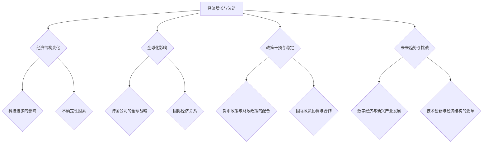

                 

### 《宏观经济变化的长期全球影响》

#### 关键词：宏观经济、全球影响、长期趋势、政策干预、经济稳定性

> 摘要：本文旨在探讨宏观经济变化对全球经济的长期影响，从基础理论、影响分析、政策干预和案例分析四个方面展开讨论。通过梳理宏观经济学的核心概念、分析经济结构变化、全球化背景下的经济变化，以及政策干预的目标与工具，本文为理解和应对宏观经济变化提供了系统性视角。同时，通过分析发达国家及新兴市场国家的宏观经济变化案例，本文总结了政策干预的经验与教训，为未来宏观经济政策的制定提供了有益参考。

### 《宏观经济变化的长期全球影响》目录大纲

#### 第一部分：宏观经济理论基础

- **第1章：宏观经济学的核心概念**
  - **1.1 宏观经济学的定义与研究方法**
  - **1.2 国民收入与国民生产总值的核算**
  - **1.3 经济增长与经济周期**

- **第2章：宏观经济政策分析**
  - **2.1 货币政策**
    - **2.1.1 中央银行与货币供应量**
    - **2.1.2 利率调控与通货膨胀**
  - **2.2 财政政策**
    - **2.2.1 政府支出与税收政策**
    - **2.2.2 财政赤字与债务管理**

- **第3章：国际经济关系**
  - **3.1 贸易政策与国际贸易**
    - **3.1.1 贸易壁垒与贸易自由化**
    - **3.1.2 贸易政策对经济增长的影响**
  - **3.2 国际资本流动**
    - **3.2.1 外汇市场与汇率制度**
    - **3.2.2 国际金融市场对宏观经济的影响**

#### 第二部分：宏观经济变化的影响分析

- **第4章：经济结构变化的影响**
  - **4.1 产业结构调整与经济增长**
    - **4.1.1 产业结构变化的理论解释**
    - **4.1.2 产业结构调整的政策建议**
  - **4.2 城乡发展不平衡与区域经济差异**
    - **4.2.1 城乡发展的现状与问题**
    - **4.2.2 促进区域经济协调发展的策略**

- **第5章：全球化背景下的经济变化**
  - **5.1 全球化对经济的影响**
    - **5.1.1 全球化的定义与特征**
    - **5.1.2 全球化对经济增长的作用**
  - **5.2 跨国公司的全球战略**
    - **5.2.1 跨国公司的组织结构与运营**
    - **5.2.2 跨国公司的经济影响与挑战**

- **第6章：政策干预与经济稳定**
  - **6.1 政策干预的目标与工具**
    - **6.1.1 稳定经济增长与减少波动**
    - **6.1.2 改善社会福利与提高生活水平**
  - **6.2 宏观经济政策的协调**
    - **6.2.1 货币政策与财政政策的配合**
    - **6.2.2 国际政策协调与合作**

- **第7章：未来宏观经济变化的趋势与挑战**
  - **7.1 科技进步对宏观经济的影响**
    - **7.1.1 数字经济与新兴产业发展**
    - **7.1.2 技术创新与经济结构的变革**
  - **7.2 全球经济的不确定性因素**
    - **7.2.1 国际政治经济风险**
    - **7.2.2 全球环境变化与可持续发展**

#### 第三部分：宏观经济变化的长期全球影响案例研究

- **第8章：发达国家宏观经济变化的案例分析**
  - **8.1 美国宏观经济变化的影响**
    - **8.1.1 美国经济的波动与调整**
    - **8.1.2 美国政策干预的经验与教训**
  - **8.2 欧洲国家宏观经济变化的影响**
    - **8.2.1 欧元区经济的整合与挑战**
    - **8.2.2 欧洲国家的政策响应与效果**

- **第9章：新兴市场国家宏观经济变化的案例分析**
  - **9.1 中国宏观经济变化的影响**
    - **9.1.1 中国经济的崛起与转型**
    - **9.1.2 中国政策干预与经济发展的模式**
  - **9.2 印度等新兴市场国家的经济变化**
    - **9.2.1 新兴市场的机遇与挑战**
    - **9.2.2 新兴市场国家的发展策略**

#### 附录

- **附录A：宏观经济数据分析方法**
  - **A.1 宏观经济指标的含义与应用**
  - **A.2 经济预测与政策评估**

- **附录B：参考文献**

### 联系图

#### 经济增长与波动、经济结构变化、全球化影响、政策干预与稳定、未来趋势与挑战



### 核心算法原理讲解

#### 经济增长预测模型

```python
# 经济增长预测模型伪代码

def growth_prediction(data, model_params):
    """
    使用回归模型预测经济增长率。
    
    参数:
    - data: 经济数据集，包括 GDP 增长率等指标
    - model_params: 模型参数，如回归系数等
    
    返回:
    - predicted_growth: 预测的经济增长率
    """
    
    # 数据预处理
    preprocess_data(data)
    
    # 构建回归模型
    model = build_regression_model(model_params)
    
    # 训练模型
    model.fit(data['X'], data['y'])
    
    # 预测
    predicted_growth = model.predict(data['X'])
    
    return predicted_growth
```

#### 利率与通货膨胀模型

$$
\pi_t = \phi_1 \pi_{t-1} + \phi_2 r_t + \theta_t
$$

其中，$\pi_t$ 表示通货膨胀率，$r_t$ 表示利率，$\theta_t$ 表示随机误差。

### 项目实战

#### 代码实际案例：宏观经济数据分析

```python
import pandas as pd
import numpy as np
from sklearn.linear_model import LinearRegression

# 数据读取与预处理
data = pd.read_csv('macroeconomic_data.csv')
data = preprocess_data(data)

# 构建回归模型
model_params = {'fit_intercept': True, 'normalize': True}
model = LinearRegression(**model_params)

# 训练模型
model.fit(data['X'], data['y'])

# 预测
predicted_growth = model.predict(data['X'])

# 输出预测结果
print(predicted_growth)
```

#### 代码解读与分析

- **数据读取与预处理**：读取宏观经济数据，进行数据清洗和标准化处理。
- **模型构建**：使用线性回归模型。
- **训练模型**：使用预处理后的数据进行模型训练。
- **预测**：使用训练好的模型对数据进行预测。
- **输出预测结果**：输出预测的经济增长率。

### 作者信息

**作者：AI天才研究院/AI Genius Institute & 禅与计算机程序设计艺术 /Zen And The Art of Computer Programming**

