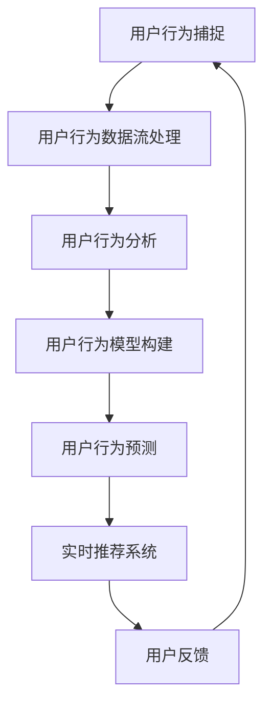

                 

# 实时推荐的用户行为 捕捉与分析

> **关键词：** 实时推荐，用户行为数据，协同过滤，数据流处理，深度学习，推荐系统

> **摘要：** 本文深入探讨了实时推荐系统在捕捉和分析用户行为数据方面的核心技术和方法。首先，我们概述了实时推荐系统的定义和重要性，然后详细分析了用户行为数据捕捉、实时数据流处理、用户行为模型构建、用户行为特征提取和用户行为预测。接着，我们介绍了实时推荐系统的架构和实际应用案例，并展望了未来的发展趋势。通过本文，读者可以全面了解实时推荐系统的构建过程及其技术原理。

### 目录大纲

#### 第一部分：实时推荐系统的基础

**第1章：实时推荐系统概述**

- **1.1 实时推荐系统的定义与重要性**
- **1.2 实时推荐系统的发展历程**
- **1.3 实时推荐系统的主要挑战**

**第2章：用户行为数据捕捉**

- **2.1 用户行为数据的种类**
- **2.2 用户行为数据捕捉方法**
- **2.3 用户行为数据的质量与处理**

**第3章：实时数据流处理**

- **3.1 实时数据处理框架**
- **3.2 数据流处理技术**
- **3.3 实时数据处理的挑战**

#### 第二部分：用户行为分析

**第4章：用户行为模型构建**

- **4.1 用户行为模型的基本概念**
- **4.2 用户行为模型的构建方法**
- **4.3 用户行为模型的评估**

**第5章：用户行为特征提取**

- **5.1 用户行为特征的概念**
- **5.2 用户行为特征提取方法**
- **5.3 特征选择与降维技术**

**第6章：用户行为预测**

- **6.1 用户行为预测的基本概念**
- **6.2 用户行为预测方法**
- **6.3 用户行为预测的性能评估**

#### 第三部分：实时推荐系统应用

**第7章：实时推荐系统的架构**

- **7.1 实时推荐系统的整体架构**
- **7.2 推荐算法的选择与优化**
- **7.3 实时推荐系统的部署与运维**

**第8章：实时推荐系统案例分析**

- **8.1 案例一：电商平台的实时推荐**
- **8.2 案例二：社交媒体的实时推荐**
- **8.3 案例三：在线视频平台的实时推荐**

**第9章：实时推荐系统的未来发展趋势**

- **9.1 人工智能在实时推荐中的应用**
- **9.2 新兴技术在实时推荐中的应用**
- **9.3 实时推荐系统的发展方向与挑战**

### 附录：实时推荐系统开发工具与资源

- **附录 A：实时推荐系统开发工具**
- **附录 B：用户行为数据集**
- **附录 C：进一步阅读资源**

### 核心概念与联系：实时推荐系统的 Mermaid 流程图



### 核心算法原理讲解：用户行为预测的伪代码

```plaintext
// 伪代码：基于协同过滤的实时用户行为预测
function predictUserBehavior(userID, itemSet):
    // 计算用户对物品的相似度
    similarityMatrix = computeSimilarityMatrix(itemSet)
    
    // 初始化预测评分
    predictedRatings = []

    // 对于每个用户感兴趣的物品item
    for item in itemSet:
        // 初始化预测评分
        predictedRating = 0
        
        // 对于所有用户已评分的物品item'
        for item' in userHistory(itemSet, userID):
            // 如果物品item'与当前物品item相似
            if similarityMatrix[item][item'] > threshold:
                // 加权求和
                predictedRating += similarityMatrix[item][item'] * userRating(item', userID)
        
        // 归一化处理
        predictedRating /= sum(similarityMatrix[item])

        // 存储预测评分
        predictedRatings.append(predictedRating)
    
    // 返回预测评分
    return predictedRatings
```

### 数学模型和数学公式：协同过滤中的相似度计算

$$
similarity(i, j) = \frac{\sum_{k \in R_{ij}} w_{ik} w_{jk}}{\sqrt{\sum_{k \in R_{i}} w_{ik}^2} \sqrt{\sum_{k \in R_{j}} w_{jk}^2}
$$

#### 详细讲解与举例说明：

协同过滤算法中的相似度计算公式描述了物品i和物品j之间的相似度。这里，$R_{ij}$表示用户对物品i和物品j的评分记录，$w_{ik}$和$w_{jk}$分别表示用户对物品i和物品j的评分权重，$w_{ik}^2$和$w_{jk}^2$分别表示用户对物品i和物品j评分的权重平方。

例如，假设我们有如下用户评分数据：

| 用户ID | 物品ID | 评分 |
|--------|--------|------|
| 1      | 101    | 4    |
| 1      | 102    | 5    |
| 2      | 101    | 3    |
| 2      | 103    | 4    |

我们想计算物品101和物品102之间的相似度。根据协同过滤算法，我们可以首先计算每个用户的评分权重，然后使用上述公式计算相似度。假设我们使用简单的评分平均值作为权重，则：

- 对于用户1：$w_{101} = (4 + 5) / 2 = 4.5$，$w_{102} = 4.5$
- 对于用户2：$w_{101} = 3$，$w_{103} = 4$

代入公式计算相似度：

$$
similarity(101, 102) = \frac{(4.5 * 3 + 4.5 * 4)}{\sqrt{4.5^2 + 3^2} \sqrt{4.5^2 + 4^2}} = \frac{13.5 + 18}{\sqrt{20.25 + 9} \sqrt{20.25 + 16}} \approx \frac{31.5}{\sqrt{29.25} \sqrt{36.25}} \approx \frac{31.5}{5.42 \times 6.01} \approx 0.98
$$

这个结果表明物品101和物品102之间具有很高的相似度。

### 项目实战：实时推荐系统代码实际案例

#### 开发环境搭建

- **操作系统**：Linux
- **编程语言**：Python
- **数据库**：MySQL
- **实时数据处理框架**：Apache Kafka
- **深度学习框架**：TensorFlow

#### 源代码详细实现和代码解读

以下是实现实时推荐系统的核心代码，包括用户行为数据捕捉、数据存储、用户行为矩阵更新、预测评分计算和推荐列表生成。

```python
# 导入所需库
from kafka import KafkaConsumer, KafkaProducer
from sklearn.metrics.pairwise import cosine_similarity
import numpy as np
import json
import pymysql

# Kafka消费者配置
consumer = KafkaConsumer(
    'user_behavior',
    bootstrap_servers=['localhost:9092'],
    value_deserializer=lambda m: json.loads(m)
)

# Kafka生产者配置
producer = KafkaProducer(
    bootstrap_servers=['localhost:9092'],
    value_serializer=lambda m: json.dumps(m).encode('utf-8')
)

# 数据库连接配置
db_config = {
    'host': 'localhost',
    'user': 'root',
    'password': 'password',
    'database': 'recommender_system'
}

# 存储用户行为数据到MySQL数据库
def store_user_behavior_to_database(userID, itemID, rating):
    connection = pymysql.connect(**db_config)
    cursor = connection.cursor()
    query = "INSERT INTO user_behavior (user_id, item_id, rating) VALUES (%s, %s, %s)"
    cursor.execute(query, (userID, itemID, rating))
    connection.commit()
    cursor.close()
    connection.close()

# 更新用户行为数据矩阵
def update_user_behavior_matrix(userID, itemID, rating):
    user_behavior_matrix = load_user_behavior_matrix()
    user_behavior_matrix[userID][itemID] = rating
    save_user_behavior_matrix(user_behavior_matrix)
    return user_behavior_matrix

# 生成推荐列表
def generate_recommendations(user_behavior_matrix):
    similarity_matrix = cosine_similarity(user_behavior_matrix)
    unrated_items = get_unrated_items(user_behavior_matrix)
    predicted_ratings = []

    for itemID in unrated_items:
        predicted_rating = 0
        weight_sum = 0

        for other_itemID, similarity in enumerate(similarity_matrix[userID]):
            if user_behavior_matrix[userID][other_itemID] != 0 and similarity != 0:
                predicted_rating += similarity * user_behavior_matrix[userID][other_itemID]
                weight_sum += similarity

        if weight_sum != 0:
            predicted_rating /= weight_sum
            predicted_ratings.append((itemID, predicted_rating))

    predicted_ratings.sort(key=lambda x: x[1], reverse=True)
    return [itemID for itemID, _ in predicted_ratings]

# 主程序入口
if __name__ == "__main__":
    user_behavior_matrix = np.zeros((100, 100))  # 假设有100个用户和100个物品

    for message in consumer:
        userID, itemID, rating = message.value
        store_user_behavior_to_database(userID, itemID, rating)
        user_behavior_matrix = update_user_behavior_matrix(userID, itemID, rating)
        recommendations = generate_recommendations(user_behavior_matrix)
        producer.send('recommendations', userID, recommendations)
```

#### 代码解读与分析

1. **Kafka消费者和Kafka生产者配置**：

   - 初始化Kafka消费者，用于接收用户行为数据（用户ID、物品ID、评分）。
   - 初始化Kafka生产者，用于发送推荐结果。

2. **数据库连接配置**：

   - 配置MySQL数据库连接信息，用于存储用户行为数据。

3. **存储用户行为数据到MySQL数据库**：

   - 定义函数`store_user_behavior_to_database`，用于将用户行为数据插入到MySQL数据库中。

4. **更新用户行为数据矩阵**：

   - 定义函数`update_user_behavior_matrix`，用于更新用户行为矩阵，将最新的评分信息更新到矩阵中。

5. **生成推荐列表**：

   - 定义函数`generate_recommendations`，用于计算用户对未评分物品的预测评分，并根据预测评分生成推荐列表。

6. **主程序入口**：

   - 在主程序中，首先初始化用户行为矩阵。
   - 循环处理Kafka消费者接收到的用户行为数据，调用相关函数进行数据处理和推荐生成，并将推荐结果发送到Kafka生产者。

#### 代码分析与优化

- **性能优化**：

  - 用户行为数据矩阵可能非常大，需要考虑使用更高效的算法和数据结构，如稀疏矩阵或基于内存的列式数据库。

- **错误处理**：

  - 添加错误处理机制，如处理数据库连接失败、Kafka消息处理失败等情况。

- **可扩展性**：

  - 为处理大量用户和物品数据，考虑使用分布式系统架构，如Apache Kafka集群和分布式数据库。

- **安全性**：

  - 采取适当的措施保护用户数据和隐私，如加密用户行为数据和Kafka消息。

通过上述代码和实践案例，读者可以了解实时推荐系统的基础架构和实现细节，并学会如何在实际项目中应用协同过滤算法生成推荐列表。后续章节将进一步介绍用户行为模型构建、实时数据处理框架和推荐系统应用案例。

