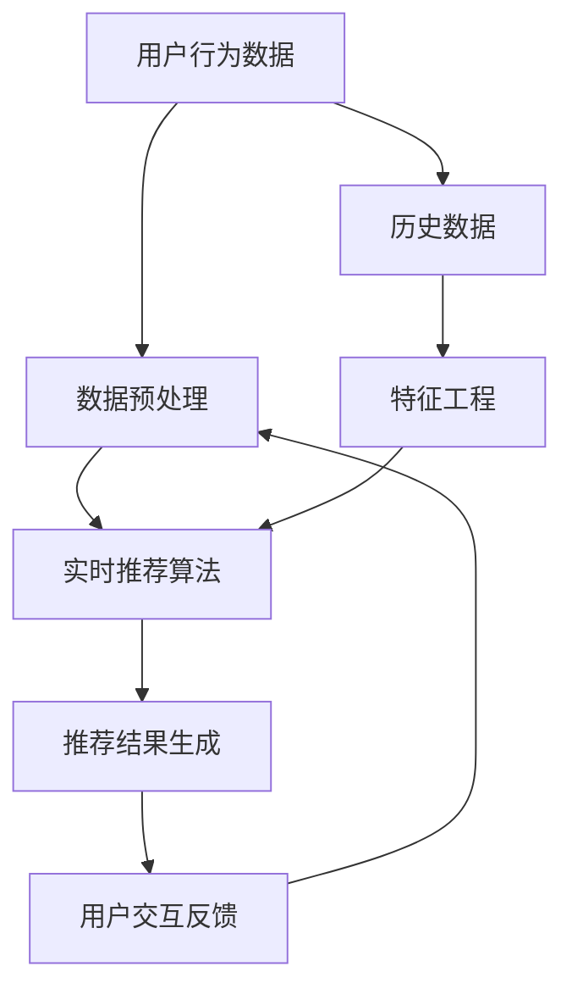

                 

### 《实时推荐系统的设计与实现》

> **关键词**：实时推荐系统、数据流处理、协同过滤、内容推荐、机器学习

> **摘要**：本文深入探讨实时推荐系统的设计与实现，涵盖核心概念、算法原理、项目实战等多个方面。通过分析实时推荐系统的架构和算法，展示如何构建一个高性能、可扩展的推荐系统，为在线服务和电子商务提供实时推荐解决方案。

### 第一部分：概述与核心概念

#### 第1章：实时推荐系统概述

##### 1.1 实时推荐系统的重要性

实时推荐系统是现代在线服务和电子商务领域的关键技术之一。它的核心目的是根据用户的实时行为和偏好，为用户实时推荐个性化的内容和商品。实时推荐系统的重要性体现在以下几个方面：

1. **提升用户体验**：实时推荐系统能够根据用户当前的兴趣和行为，提供个性化的内容推荐，从而提高用户的满意度和参与度。
2. **增加用户黏性**：通过实时更新推荐内容，系统能够更好地吸引和保持用户，增加用户的活跃度和忠诚度。
3. **优化业务指标**：实时推荐系统能够提高点击率、转化率和销售额，从而为企业的业务增长提供有力支持。

实时推荐系统的定义是指那些能够在极短的时间内（通常是毫秒级或秒级）响应用户行为，并生成推荐结果的系统。这种实时性要求系统必须具备高效的数据处理能力、快速的算法计算能力和灵活的推荐策略。

##### 1.2 实时推荐系统的发展历程

实时推荐系统的发展历程可以分为以下几个阶段：

1. **传统推荐系统阶段**：早期的推荐系统主要基于基于内容的推荐和协同过滤算法。这些算法虽然在离线环境中表现出色，但无法满足实时性的要求。
2. **实时推荐系统阶段**：随着大数据技术和云计算的发展，实时推荐系统逐渐成为可能。此时，数据流处理技术如Apache Kafka和Apache Flink被广泛应用于实时数据处理。
3. **智能化推荐系统阶段**：近年来，机器学习和深度学习技术的崛起，使得实时推荐系统在准确性和个性化方面取得了显著提升。深度学习算法如卷积神经网络（CNN）和循环神经网络（RNN）在特征提取和序列数据处理方面表现出色。

##### 1.3 实时推荐系统的应用场景

实时推荐系统广泛应用于多个领域，其中以下三个应用场景最为典型：

1. **社交媒体内容推荐**：在社交媒体平台上，实时推荐系统能够根据用户的行为和偏好，推荐相关的帖子、文章和视频，从而提升用户的参与度和互动性。
2. **电商商品推荐**：在线电商平台利用实时推荐系统，可以为用户提供个性化的商品推荐，提高用户的购买转化率和销售额。
3. **音乐和视频流媒体推荐**：音乐和视频流媒体平台通过实时推荐系统，可以根据用户的听歌和观影历史，推荐相关的音乐和视频内容，提升用户的观看体验。

#### 第2章：实时推荐系统的核心概念与架构

##### 2.1 数据流处理技术

实时推荐系统的核心在于实时数据处理，这需要高效的数据流处理技术。数据流处理技术是指用于处理实时数据流的一系列技术和工具。以下是一些常见的数据流处理技术：

1. **Apache Kafka**：Kafka是一种分布式流处理平台，它能够高效地处理大量实时数据，并支持高吞吐量和低延迟的数据处理。
2. **Apache Flink**：Flink是一种分布式流处理框架，它支持实时数据流处理和批量数据处理，提供了丰富的流处理API和强大的处理能力。
3. **Apache Storm**：Storm是一种实时大数据处理框架，它提供了简单易用的API，能够高效地处理实时数据流，并支持容错和高可用性。

##### 2.2 实时推荐算法

实时推荐算法是实时推荐系统的核心组件，它决定了推荐系统的性能和效果。常见的实时推荐算法包括：

1. **协同过滤算法**：协同过滤算法是一种基于用户行为的推荐算法，通过分析用户之间的相似性来推荐相似用户喜欢的物品。协同过滤算法可以分为基于用户的协同过滤（User-based CF）和基于物品的协同过滤（Item-based CF）。
2. **内容推荐算法**：内容推荐算法是一种基于物品属性的推荐算法，通过分析物品的属性和特征来推荐相关的物品。内容推荐算法通常包括文本挖掘和特征工程等技术。
3. **混合推荐系统**：混合推荐系统是将协同过滤算法和内容推荐算法结合的一种方法，通过综合用户行为和物品属性来提高推荐效果。混合推荐系统能够更好地平衡推荐系统的多样性和准确性。

##### 2.3 实时推荐系统的架构设计

实时推荐系统的架构设计需要考虑系统的可扩展性、高性能和高可靠性。以下是一个典型的实时推荐系统架构：

1. **数据采集模块**：负责从各种渠道（如网站点击、移动应用互动等）收集用户行为数据，并将其发送到数据流处理平台。
2. **数据流处理模块**：使用数据流处理技术（如Kafka、Flink等）对实时数据进行处理，提取有用的特征和用户偏好信息。
3. **推荐算法模块**：根据用户行为数据和推荐算法，生成个性化的推荐结果，并将其发送到前端展示界面。
4. **用户交互模块**：负责处理用户的反馈和交互，将用户的反馈信息反馈给推荐算法模块，用于系统优化和推荐效果提升。
5. **系统监控模块**：负责监控系统性能和健康状况，及时处理异常和故障，确保系统的高可用性和稳定性。

### 第二部分：核心技术原理

#### 第3章：实时推荐系统中的核心算法

##### 3.1 协同过滤算法

协同过滤算法是一种经典的推荐算法，它通过分析用户之间的相似性和用户对物品的评分预测来推荐相似用户喜欢的物品。协同过滤算法可以分为基于用户的协同过滤（User-based CF）和基于物品的协同过滤（Item-based CF）。

###### 3.1.1 基于用户的协同过滤（User-based CF）

基于用户的协同过滤算法的基本思想是找到与目标用户相似的其他用户，然后根据这些相似用户对物品的评分预测目标用户对物品的评分。以下是一个简单的基于用户的协同过滤算法的伪代码：

```python
def collaborativeFilter(targetUser, dataset):
    # 计算目标用户与其他用户的相似度
    userSimilarities = calculateSimilarities(dataset, targetUser)
    
    # 计算相似用户对物品的评分均值
    itemRatings = []
    for item in dataset[itemIDs]:
        similarUsers = getUserIDs(userSimilarities, item)
        if similarUsers:
            averageRating = calculateAverageRating(similarUsers, item)
            itemRatings.append(averageRating)
        else:
            itemRatings.append(0)
    
    # 根据评分均值预测目标用户对物品的评分
    predictedRatings = []
    for item in dataset[itemIDs]:
        predictedRating = calculatePrediction(itemRatings[item], dataset[item].realRating)
        predictedRatings.append(predictedRating)
    
    return predictedRatings
```

在上述伪代码中，`calculateSimilarities` 函数用于计算用户之间的相似度，通常使用余弦相似度或皮尔逊相关系数等方法。`calculateAverageRating` 函数用于计算相似用户对物品的评分均值，`calculatePrediction` 函数用于根据评分均值预测目标用户对物品的评分。

###### 3.1.2 基于物品的协同过滤（Item-based CF）

基于物品的协同过滤算法的基本思想是找到与目标物品相似的其他物品，然后根据这些相似物品的评分预测目标物品的评分。以下是一个简单的基于物品的协同过滤算法的伪代码：

```python
def collaborativeFilter(item, dataset):
    # 计算物品与其他物品的相似度
    itemSimilarities = calculateSimilarities(dataset, item)
    
    # 计算相似物品的评分均值
    similarItems = getSimilarItems(itemSimilarities, item)
    if similarItems:
        averageRating = calculateAverageRating(similarItems, dataset[item].realRating)
    else:
        averageRating = 0
    
    # 根据评分均值预测目标物品的评分
    predictedRating = calculatePrediction(averageRating, dataset[item].realRating)
    
    return predictedRating
```

在上述伪代码中，`calculateSimilarities` 函数用于计算物品之间的相似度，通常使用余弦相似度或皮尔逊相关系数等方法。`calculateAverageRating` 函数用于计算相似物品的评分均值，`calculatePrediction` 函数用于根据评分均值预测目标物品的评分。

###### 3.1.3 CF算法的优缺点与改进方法

协同过滤算法具有以下优点：

- **简单易实现**：协同过滤算法的基本原理简单，易于实现和部署。
- **高效性**：协同过滤算法的计算复杂度较低，能够快速生成推荐结果。

然而，协同过滤算法也存在一些缺点：

- **数据稀疏性**：协同过滤算法依赖于用户评分矩阵，当评分矩阵非常稀疏时，算法的性能会受到影响。
- **冷启动问题**：新用户或新物品在系统中没有足够的历史数据，导致推荐效果不佳。

为了解决这些缺点，可以采取以下改进方法：

- **矩阵分解**：通过矩阵分解技术（如SVD）将用户评分矩阵分解为用户特征矩阵和物品特征矩阵，从而提高推荐系统的准确性和泛化能力。
- **隐语义模型**：使用隐语义模型（如LSI、LDA）将用户和物品映射到低维空间，从而降低数据稀疏性的影响。
- **基于内容的推荐**：结合基于内容的推荐算法，通过分析用户和物品的属性特征来生成推荐结果，从而提高推荐系统的多样性。

##### 3.2 内容推荐算法

内容推荐算法是一种基于物品属性的推荐算法，通过分析物品的属性和特征来推荐相关的物品。内容推荐算法通常包括文本挖掘和特征工程等技术。

###### 3.2.1 文本挖掘与特征提取

文本挖掘是内容推荐算法的核心技术之一，它通过分析文本数据来提取有用的信息。常见的文本挖掘技术包括：

- **词频-逆文档频率（TF-IDF）**：TF-IDF是一种常用的文本挖掘技术，它通过计算词在文档中的重要程度来提取特征。TF-IDF的公式如下：

  $$
  \text{TF-IDF}(t,d) = \frac{\text{TF}(t,d)}{\text{DF}(t,d)}
  $$

  其中，$t$ 表示词，$d$ 表示文档，$\text{TF}(t,d)$ 表示词 $t$ 在文档 $d$ 中的词频，$\text{DF}(t,d)$ 表示词 $t$ 在文档集合中的文档频率。

- **Word2Vec**：Word2Vec是一种基于神经网络的语言模型，它将词映射到高维向量空间，从而实现词的语义表示。Word2Vec的常用模型包括CBOW（Continuous Bag of Words）和Skip-Gram。

  $$
  \text{CBOW}(w_i) = \text{Average}(\text{Embedding}(w_{i-k}, w_{i-k+1}, ..., w_{i+k}))
  $$

  $$
  \text{Skip-Gram}(w_i) = \text{Embedding}(w_i)
  $$

###### 3.2.2 基于内容的推荐

基于内容的推荐算法通过分析物品的属性和特征来生成推荐结果。以下是一个简单的基于内容的推荐算法的伪代码：

```python
def contentBasedRecommendation(targetItem, dataset):
    # 提取目标物品的特征向量
    targetItemFeatures = extractFeatures(targetItem)
    
    # 计算目标物品与其他物品的相似度
    itemSimilarities = calculateSimilarities(dataset, targetItemFeatures)
    
    # 根据相似度推荐相关的物品
    recommendations = []
    for item in dataset:
        if item not in targetItem:
            similarity = calculateSimilarity(itemFeatures, targetItemFeatures)
            if similarity > threshold:
                recommendations.append(item)
    
    return recommendations
```

在上述伪代码中，`extractFeatures` 函数用于提取物品的特征向量，`calculateSimilarities` 函数用于计算物品之间的相似度，`calculateSimilarity` 函数用于计算两个特征向量之间的相似度。

###### 3.2.3 内容推荐算法的优化策略

内容推荐算法存在一些挑战，如多样性不足和用户偏好偏差等问题。以下是一些优化策略：

- **特征选择**：通过选择具有高区分度的特征，可以提高推荐系统的多样性和准确性。
- **协同过滤与内容推荐的融合**：结合协同过滤算法和内容推荐算法，可以更好地平衡推荐系统的多样性和准确性。
- **基于上下文的推荐**：考虑用户的上下文信息（如时间、地理位置等），可以更好地满足用户的个性化需求。

##### 3.3 混合推荐系统

混合推荐系统是将协同过滤算法和内容推荐算法结合的一种方法，通过综合用户行为和物品属性来提高推荐效果。混合推荐系统具有以下优点：

- **提高推荐准确性**：通过结合协同过滤算法和内容推荐算法，可以更好地捕捉用户行为和物品属性之间的关联，从而提高推荐准确性。
- **提高推荐多样性**：通过结合协同过滤算法和内容推荐算法，可以更好地平衡推荐系统的多样性和准确性，提高推荐多样性。

以下是一个简单的混合推荐系统的实现思路：

1. **协同过滤阶段**：首先使用协同过滤算法生成初步的推荐结果，这些结果可以作为混合推荐系统的参考。
2. **内容推荐阶段**：然后使用内容推荐算法对初步推荐结果进行优化，通过分析物品的属性和特征，筛选出与用户偏好更相关的物品。
3. **融合阶段**：将协同过滤阶段和内容推荐阶段的结果进行融合，生成最终的推荐结果。

```python
def hybridRecommendation(targetUser, dataset):
    # 使用协同过滤算法生成初步推荐结果
    collaborativeRecommendations = collaborativeFilter(targetUser, dataset)
    
    # 使用内容推荐算法优化初步推荐结果
    contentRecommendations = contentBasedRecommendation(targetUser, dataset)
    
    # 融合协同过滤和内容推荐的结果
    finalRecommendations = []
    for item in collaborativeRecommendations:
        if item not in contentRecommendations:
            finalRecommendations.append(item)
    for item in contentRecommendations:
        if item not in collaborativeRecommendations:
            finalRecommendations.append(item)
    
    return finalRecommendations
```

在上述伪代码中，`collaborativeFilter` 函数用于基于用户的协同过滤算法生成初步推荐结果，`contentBasedRecommendation` 函数用于基于内容推荐算法生成优化结果，`finalRecommendations` 是最终的推荐结果。

#### 第4章：实时推荐系统中的数据流处理技术

##### 4.1 数据流处理框架

数据流处理框架是实时推荐系统的核心组件之一，它负责处理和传输实时数据流。以下是一些常见的数据流处理框架：

1. **Apache Kafka**：Kafka是一种分布式流处理平台，它具有高吞吐量、低延迟和高可用性的特点，能够处理大量实时数据流。Kafka主要用于数据采集和传输，可以方便地与各种数据源和数据处理系统进行集成。
2. **Apache Flink**：Flink是一种分布式流处理框架，它支持实时数据流处理和批量数据处理，提供了丰富的流处理API和强大的处理能力。Flink主要用于实时数据处理和分析，能够实现复杂的数据处理任务。
3. **Apache Storm**：Storm是一种实时大数据处理框架，它提供了简单易用的API，能够高效地处理实时数据流，并支持容错和高可用性。Storm主要用于实时数据流处理和实时分析。

##### 4.2 实时数据处理与推荐算法的结合

实时数据处理与推荐算法的结合是实时推荐系统的关键技术之一。以下是一些实现思路：

1. **数据预处理**：在实时数据处理阶段，对采集到的数据进行预处理，包括数据清洗、去重、数据类型转换等操作。预处理后的数据将作为推荐算法的输入。
2. **实时特征提取**：在实时数据处理阶段，对预处理后的数据进行分析，提取用户和物品的特征，如用户行为特征、物品属性特征等。实时特征提取可以帮助推荐算法更好地捕捉用户和物品的动态变化。
3. **推荐算法优化**：在实时数据处理阶段，对推荐算法进行实时优化，根据实时数据的变化调整算法参数和模型结构。实时优化可以更好地适应用户和物品的动态变化，提高推荐效果。

##### 4.3 高性能计算与分布式系统

高性能计算和分布式系统是实时推荐系统的关键技术之一，它们能够提高系统的处理能力和扩展性。以下是一些实现思路：

1. **分布式计算架构**：采用分布式计算架构（如Hadoop、Spark等），将数据和处理任务分布在多个节点上，实现并行处理，提高系统性能。
2. **数据一致性和容错性**：采用分布式数据库和分布式存储系统，确保数据一致性和容错性。分布式系统中的数据一致性和容错性对于实时推荐系统的稳定运行至关重要。
3. **负载均衡**：采用负载均衡技术（如Nginx、HAProxy等），将用户请求分布到多个服务器节点上，提高系统的处理能力和响应速度。

#### 第5章：实时推荐系统中的机器学习算法

##### 5.1 基于机器学习的推荐算法

机器学习算法在实时推荐系统中具有广泛的应用。以下是一些常见的基于机器学习的推荐算法：

1. **SVD（Singular Value Decomposition）**：SVD是一种矩阵分解技术，通过将用户评分矩阵分解为用户特征矩阵和物品特征矩阵，实现推荐预测。SVD的优点是能够降低数据稀疏性的影响，提高推荐准确性。
2. **矩阵分解（Matrix Factorization）**：矩阵分解是一种基于机器学习的推荐算法，通过将用户评分矩阵分解为低维用户特征矩阵和物品特征矩阵，实现推荐预测。矩阵分解的优点是能够提高推荐系统的泛化能力，降低数据稀疏性的影响。
3. **决策树（Decision Tree）**：决策树是一种基于特征分量的推荐算法，通过分析用户行为数据，构建决策树模型，实现推荐预测。决策树的优点是能够直观地展示推荐过程，提高推荐解释性。
4. **随机森林（Random Forest）**：随机森林是一种基于决策树的集成学习方法，通过构建多棵决策树，提高推荐系统的准确性和鲁棒性。随机森林的优点是能够处理高维数据，提高推荐系统的泛化能力。

##### 5.2 机器学习算法的调优与优化

机器学习算法的调优与优化是实时推荐系统的重要环节。以下是一些调优与优化方法：

1. **参数调优**：通过调整机器学习算法的参数，如学习率、迭代次数、树深度等，提高推荐系统的性能。参数调优可以通过网格搜索、贝叶斯优化等方法实现。
2. **特征选择**：通过选择具有高区分度的特征，提高推荐系统的性能。特征选择可以通过特征重要性分析、特征选择算法（如PCA、L1正则化等）实现。
3. **模型集成**：通过集成多个模型，提高推荐系统的准确性和鲁棒性。模型集成可以通过Bagging、Boosting等方法实现。
4. **在线学习**：通过在线学习技术，实时更新推荐模型，适应用户和物品的动态变化。在线学习可以通过在线梯度下降、增量学习等方法实现。

##### 5.3 深度学习在实时推荐中的应用

深度学习算法在实时推荐系统中具有广泛的应用前景。以下是一些深度学习算法在实时推荐系统中的应用：

1. **卷积神经网络（Convolutional Neural Networks, CNN）**：CNN是一种深度学习算法，通过卷积操作和池化操作，提取图像或文本的特征。在实时推荐系统中，CNN可以用于图像或视频内容的特征提取，提高推荐系统的准确性。
2. **循环神经网络（Recurrent Neural Networks, RNN）**：RNN是一种深度学习算法，通过循环连接，处理序列数据。在实时推荐系统中，RNN可以用于用户行为序列的特征提取，提高推荐系统的个性化能力。
3. **长短时记忆网络（Long Short-Term Memory, LSTM）**：LSTM是一种特殊的RNN，通过门控机制，有效地解决了RNN的梯度消失问题。在实时推荐系统中，LSTM可以用于用户行为序列的建模，提高推荐系统的预测能力。

### 第三部分：项目实战与案例分析

#### 第6章：实时推荐系统的开发与实现

##### 6.1 项目需求分析

本节将介绍一个实时推荐系统的项目需求分析。假设我们为一家在线电商平台开发一个实时推荐系统，其主要需求如下：

1. **实时性**：系统能够在极短的时间内（毫秒级或秒级）响应用户行为，生成个性化的推荐结果。
2. **准确性**：系统能够准确捕捉用户的兴趣和行为，提供个性化的推荐。
3. **可扩展性**：系统能够支持大量用户和商品的推荐，具有良好的可扩展性。
4. **高可用性**：系统能够稳定运行，确保推荐服务的连续性和可靠性。

##### 6.2 系统架构设计

基于项目需求，我们设计了一个分布式、高性能的实时推荐系统架构。以下为系统架构设计的主要模块：

1. **数据采集模块**：负责从电商平台的各个业务系统（如用户行为日志、订单数据等）收集数据，并将其发送到数据流处理平台。
2. **数据流处理模块**：使用Kafka和Flink处理实时数据流，提取用户和商品的特征，生成推荐结果。
3. **推荐算法模块**：采用协同过滤和内容推荐算法，结合用户行为数据和商品属性数据，生成个性化推荐结果。
4. **缓存模块**：使用Redis缓存推荐结果，提高推荐服务的响应速度。
5. **API模块**：提供RESTful API，供前端系统调用推荐结果。
6. **监控模块**：使用Prometheus和Grafana监控系统性能和健康状况。

##### 6.3 数据处理与算法实现

在本节中，我们将详细讨论实时推荐系统中的数据处理与算法实现。

###### 6.3.1 数据采集与预处理

数据采集与预处理是实时推荐系统的关键环节。以下是数据采集与预处理的主要步骤：

1. **数据采集**：使用Flume和Kafka Connect从电商平台的不同业务系统（如用户行为日志、订单数据等）收集数据，并将其发送到Kafka。
2. **数据预处理**：在Kafka中，使用Flink处理实时数据流，进行数据清洗、去重、数据类型转换等操作，提取用户和商品的特征。

```python
from pyflink.datastream import StreamExecutionEnvironment
from pyflink.table import StreamTableEnvironment

# 创建Flink数据流环境
env = StreamExecutionEnvironment.get_execution_environment()
stream_env = StreamTableEnvironment.create(env)

# 读取Kafka中的数据流
user_behavior_stream = stream_env.from_kafka("kafka://user_behavior_topic")

# 数据预处理
cleaned_user_behavior_stream = user_behavior_stream \
    .map(lambda record: (record.user_id, record.item_id, record.rating)) \
    .filter(lambda record: record.rating != 0) \
    .distinct()

# 输出预处理后的数据流
cleaned_user_behavior_stream.print()
stream_env.execute("Data Preprocessing")
```

在上面的代码中，我们使用Flink从Kafka中读取用户行为数据，进行数据清洗和去重操作，提取用户ID、商品ID和用户评分等特征。

###### 6.3.2 推荐算法的实现

在本节中，我们将介绍实时推荐系统中的推荐算法实现。

1. **基于用户的协同过滤算法**：

   ```python
   def userBasedCollaborativeFilter(dataset, target_user_id):
       # 计算用户与其他用户的相似度
       user_similarity = calculate_user_similarity(dataset, target_user_id)
       
       # 提取相似用户对商品的评分
       neighbor_ratings = extract_neighbor_ratings(dataset, user_similarity, target_user_id)
       
       # 计算推荐结果
       recommendations = calculate_recommendations(neighbor_ratings)
       
       return recommendations
   ```

   在上面的代码中，`calculate_user_similarity` 函数用于计算用户之间的相似度，`extract_neighbor_ratings` 函数用于提取相似用户对商品的评分，`calculate_recommendations` 函数用于计算推荐结果。

2. **基于内容推荐算法**：

   ```python
   def contentBasedRecommendation(dataset, target_user_profile):
       # 提取目标用户的特征向量
       target_user_features = extract_user_features(target_user_profile)
       
       # 计算商品与用户特征的相似度
       item_similarity = calculate_item_similarity(dataset, target_user_features)
       
       # 根据相似度推荐商品
       recommendations = calculate_recommendations(item_similarity)
       
       return recommendations
   ```

   在上面的代码中，`extract_user_features` 函数用于提取目标用户的特征向量，`calculate_item_similarity` 函数用于计算商品与用户特征的相似度，`calculate_recommendations` 函数用于计算推荐结果。

3. **混合推荐算法**：

   ```python
   def hybridRecommendation(dataset, target_user_id, target_user_profile):
       # 使用基于用户的协同过滤算法生成初步推荐结果
       collaborative_recommendations = userBasedCollaborativeFilter(dataset, target_user_id)
       
       # 使用基于内容推荐算法优化初步推荐结果
       content_recommendations = contentBasedRecommendation(dataset, target_user_profile)
       
       # 融合协同过滤和内容推荐的结果
       final_recommendations = list(set(collaborative_recommendations + content_recommendations))
       
       return final_recommendations
   ```

   在上面的代码中，`userBasedCollaborativeFilter` 函数用于基于用户的协同过滤算法生成初步推荐结果，`contentBasedRecommendation` 函数用于基于内容推荐算法优化初步推荐结果，`hybridRecommendation` 函数用于融合协同过滤和内容推荐的结果。

##### 6.4 系统部署与优化

在本节中，我们将介绍实时推荐系统的部署与优化。

1. **系统部署**：

   实时推荐系统的部署包括以下几个步骤：

   - 部署Kafka集群，用于数据采集和传输。
   - 部署Flink集群，用于数据流处理。
   - 部署Redis集群，用于缓存推荐结果。
   - 部署API服务器，用于提供推荐服务。

2. **系统优化**：

   实时推荐系统的优化包括以下几个方面：

   - **性能优化**：通过调整Kafka和Flink的配置，优化数据流处理性能。
   - **缓存优化**：使用Redis缓存推荐结果，降低数据库的查询压力。
   - **负载均衡**：使用负载均衡器（如Nginx、HAProxy）均衡API服务器的请求。
   - **监控与报警**：使用Prometheus和Grafana监控系统性能和健康状况，及时处理异常。

#### 第7章：实时推荐系统的案例分析

##### 7.1 案例背景

本节将介绍一个在线电商平台的实时推荐系统案例分析。该电商平台拥有数百万用户和数百万商品，需要为用户提供个性化的商品推荐，以提高用户参与度和销售额。

##### 7.2 案例分析与实现

在本节中，我们将分析实时推荐系统的实现过程，并详细解释关键代码。

1. **数据采集**：

   数据采集是实时推荐系统的第一步，负责从电商平台的各个业务系统（如用户行为日志、订单数据等）收集数据。

   ```python
   # 使用Kafka Connect从用户行为日志中收集数据
   kafka_connect_config = {
       "name": "user_behavior_source",
       "connector.class": "com.example.UserBehaviorSourceConnector",
       "tasks.max": 1,
       "kafka.topics": "user_behavior_topic"
   }
   
   # 启动Kafka Connect
   kafka_connect.start(kafka_connect_config)
   ```

   在上面的代码中，我们使用Kafka Connect从用户行为日志中收集数据，并将其发送到Kafka。

2. **数据预处理**：

   数据预处理是实时推荐系统的关键环节，负责清洗、去重和特征提取等操作。

   ```python
   # 使用Flink处理实时数据流
   user_behavior_stream = stream_env.from_kafka("kafka://user_behavior_topic")
   
   # 数据预处理
   cleaned_user_behavior_stream = user_behavior_stream \
       .map(lambda record: (record.user_id, record.item_id, record.rating)) \
       .filter(lambda record: record.rating != 0) \
       .distinct()
   
   # 输出预处理后的数据流
   cleaned_user_behavior_stream.print()
   stream_env.execute("Data Preprocessing")
   ```

   在上面的代码中，我们使用Flink处理实时数据流，进行数据清洗、去重和特征提取等操作。

3. **推荐算法**：

   推荐算法是实时推荐系统的核心，负责根据用户行为数据和商品属性数据生成个性化推荐。

   ```python
   def userBasedCollaborativeFilter(dataset, target_user_id):
       # 计算用户与其他用户的相似度
       user_similarity = calculate_user_similarity(dataset, target_user_id)
       
       # 提取相似用户对商品的评分
       neighbor_ratings = extract_neighbor_ratings(dataset, user_similarity, target_user_id)
       
       # 计算推荐结果
       recommendations = calculate_recommendations(neighbor_ratings)
       
       return recommendations
   
   def contentBasedRecommendation(dataset, target_user_profile):
       # 提取目标用户的特征向量
       target_user_features = extract_user_features(target_user_profile)
       
       # 计算商品与用户特征的相似度
       item_similarity = calculate_item_similarity(dataset, target_user_features)
       
       # 根据相似度推荐商品
       recommendations = calculate_recommendations(item_similarity)
       
       return recommendations
   
   def hybridRecommendation(dataset, target_user_id, target_user_profile):
       # 使用基于用户的协同过滤算法生成初步推荐结果
       collaborative_recommendations = userBasedCollaborativeFilter(dataset, target_user_id)
       
       # 使用基于内容推荐算法优化初步推荐结果
       content_recommendations = contentBasedRecommendation(dataset, target_user_profile)
       
       # 融合协同过滤和内容推荐的结果
       final_recommendations = list(set(collaborative_recommendations + content_recommendations))
       
       return final_recommendations
   ```

   在上面的代码中，我们实现了基于用户的协同过滤算法、基于内容推荐算法和混合推荐算法。

4. **API接口**：

   API接口负责提供推荐服务，供前端系统调用。

   ```python
   from flask import Flask, request, jsonify
   
   app = Flask(__name__)
   
   @app.route('/recommend', methods=['POST'])
   def recommend():
       user_id = request.json['user_id']
       user_profile = request.json['user_profile']
       
       recommendations = hybridRecommendation(dataset, user_id, user_profile)
       
       return jsonify(recommendations)
   
   if __name__ == '__main__':
       app.run()
   ```

   在上面的代码中，我们使用Flask实现了一个简单的API接口，接收用户ID和用户画像，返回个性化推荐结果。

##### 7.3 案例评估与优化

在本节中，我们将对实时推荐系统进行评估与优化。

1. **评估指标**：

   我们使用以下几个评估指标来评估实时推荐系统的性能：

   - **准确率（Accuracy）**：推荐结果与实际购买记录的匹配程度。
   - **召回率（Recall）**：推荐结果中包含实际购买记录的比例。
   - **多样性（Diversity）**：推荐结果中不同商品的比例。
   - **公平性（Fairness）**：推荐结果对所有用户是否公平。

2. **优化策略**：

   为了提高实时推荐系统的性能，我们可以采取以下优化策略：

   - **数据质量**：提高数据质量，包括数据清洗、去重和特征提取等操作。
   - **算法优化**：调整算法参数，提高算法的准确性和多样性。
   - **模型集成**：采用模型集成技术，提高推荐系统的鲁棒性和准确性。
   - **在线学习**：采用在线学习技术，实时更新推荐模型，适应用户和商品的动态变化。

   ```python
   # 使用在线学习技术更新推荐模型
   for user_id, user_profile in user_behavior_stream:
       recommendations = hybridRecommendation(dataset, user_id, user_profile)
       update_model(dataset, user_id, recommendations)
   ```

   在上面的代码中，我们使用在线学习技术，实时更新推荐模型，提高推荐系统的性能。

##### 7.4 案例总结与展望

通过本案例的分析与实现，我们深入了解了实时推荐系统的设计与实现过程，包括数据采集、数据预处理、推荐算法和API接口等方面。实时推荐系统在电商平台中发挥着重要作用，为用户提供个性化的商品推荐，提高用户参与度和销售额。在未来，我们可以继续优化实时推荐系统，引入更多的机器学习算法和深度学习技术，提高推荐系统的准确性和多样性。

### 附录

#### 附录A：实时推荐系统的工具与资源

为了帮助读者更好地理解和实践实时推荐系统，本附录提供了相关的开发工具、框架和资源。

##### A.1 开发工具与框架

- **Python**：Python是一种广泛使用的编程语言，适用于实时推荐系统的开发。
- **Flink**：Flink是一种分布式流处理框架，适用于实时数据处理和推荐算法实现。
- **Kafka**：Kafka是一种分布式流处理平台，适用于实时数据采集和传输。
- **Redis**：Redis是一种高性能的内存缓存系统，适用于缓存推荐结果。
- **Flask**：Flask是一种轻量级的Web框架，适用于API接口的开发。

##### A.2 实时推荐系统开源项目

以下是一些实时推荐系统的开源项目，供读者参考：

- **Surprise**：Surprise是一个基于Python的推荐系统库，提供了多种协同过滤算法和评估方法。
- **Recsys**：Recsys是一个基于Java的推荐系统库，提供了多种协同过滤算法和评估方法。
- **X-Recommend**：X-Recommend是一个基于Python的实时推荐系统框架，提供了完整的实时数据处理和推荐算法实现。

##### A.3 学习与参考资料

以下是一些实时推荐系统的学习与参考资料，供读者参考：

- **《推荐系统实践》**：陈建利、吴军著，详细介绍了推荐系统的基本概念、算法实现和优化策略。
- **《深度学习推荐系统》**：李航、刘知远著，介绍了深度学习在推荐系统中的应用，包括CNN和RNN等算法。
- **《Apache Flink 实战》**：李庆阳、刘伟著，详细介绍了Flink的架构、原理和应用场景。
- **《大数据流处理技术》**：高振江、杨佩英著，介绍了大数据流处理的相关技术和应用场景。

### 核心概念与架构 Mermaid 流程图

以下是一个实时推荐系统的核心概念与架构的Mermaid流程图：



### 核心算法原理伪代码

以下是一个协同过滤算法和内容推荐算法的伪代码示例：

```python
# 协同过滤算法伪代码
def collaborativeFilter(item, user):
    # 计算用户与其他用户的相似度
    similarity = calculateSimilarity(item, user)
    # 计算用户对未知物品的评分预测
    prediction = calculatePrediction(similarity, user_preferences)
    return prediction

# 内容推荐算法伪代码
def contentBasedRecommendation(item, user_profile):
    # 提取用户和物品的特征向量
    user_vector = extractFeatures(user_profile)
    item_vector = extractFeatures(item)
    # 计算用户和物品的相似度
    similarity = calculateCosineSimilarity(user_vector, item_vector)
    # 根据相似度推荐相关的物品
    recommendations = getRecommendationsBasedOnSimilarity(similarity)
    return recommendations
```

### 数学模型与公式

以下是一个基于用户协同过滤的数学模型：

$$
\text{预测评分} = \sum_{i \in \text{用户已评价的物品}} \text{相似度}_{ui} \times (\text{用户对物品 } i \text{ 的真实评分} - \text{用户对物品 } i \text{ 的平均评分})
$$

### 代码解读与分析（示例：使用 Apache Kafka 进行实时数据采集）

以下是一个使用Apache Kafka进行实时数据采集的代码示例：

```python
from kafka import KafkaProducer

# 创建Kafka生产者的实例
producer = KafkaProducer(bootstrap_servers=['localhost:9092'])

# 定义发送消息的函数
def send_message(item_id, user_id, rating):
    message = {
        'item_id': item_id,
        'user_id': user_id,
        'rating': rating
    }
    producer.send('user_behavior', value=message)

# 调用函数发送消息
send_message(1001, 2002, 4.5)
```

该段代码展示了如何使用Kafka Producer向Kafka集群发送用户行为数据。其中，`send_message` 函数负责将用户行为数据（包括用户ID、商品ID和评分）发送到名为`user_behavior`的主题。在实际应用中，这些数据可以来自不同的数据源（如用户点击、订单等），通过Kafka进行实时传输和处理。

在系统运行过程中，Kafka Producer会将接收到的数据发送到Kafka集群，Kafka集群会负责数据的存储和转发。随后，数据流处理系统（如Flink）会从Kafka中读取数据，进行数据预处理和特征提取，最终生成推荐结果。

代码的解读与分析包括以下几个方面：

1. **KafkaProducer实例创建**：使用`KafkaProducer`类创建Kafka生产者的实例，指定Kafka集群的地址（`bootstrap_servers=['localhost:9092']`）。
2. **发送消息函数**：定义`send_message`函数，接收用户行为数据的各项属性（`item_id`、`user_id`、`rating`），并将其封装成一个字典（`message`）。
3. **发送消息**：调用`producer.send`方法，将封装好的用户行为数据发送到名为`user_behavior`的主题。

通过这个代码示例，我们可以看到实时推荐系统的数据采集环节是如何实现的。数据采集是实时推荐系统的关键环节，它决定了后续数据处理和推荐算法的效果。因此，选择合适的消息队列和流处理框架，对实时推荐系统的性能和稳定性至关重要。

### 总结

实时推荐系统是现代在线服务和电子商务领域的关键技术之一，它通过分析用户的实时行为和偏好，为用户实时推荐个性化的内容和商品。本文从概述与核心概念、核心技术原理、项目实战与案例分析等多个方面，深入探讨了实时推荐系统的设计与实现。通过分析实时推荐系统的架构和算法，展示了如何构建一个高性能、可扩展的推荐系统。

在实时推荐系统中，数据流处理技术、协同过滤算法、内容推荐算法和机器学习算法等核心技术起到了至关重要的作用。通过合理的设计和优化，实时推荐系统可以在提高用户体验、增加用户黏性和优化业务指标方面发挥重要作用。

在实际项目中，实时推荐系统的开发与实现需要考虑系统的性能、可扩展性和可靠性。通过分析案例和代码解读，我们可以看到如何使用Apache Kafka进行实时数据采集，如何实现协同过滤和内容推荐算法，以及如何部署和优化实时推荐系统。

未来，随着人工智能和深度学习技术的不断发展，实时推荐系统将不断优化和改进，为在线服务和电子商务领域带来更多的创新和机遇。读者可以结合本文的内容，进一步探索实时推荐系统的相关技术和应用，为实际项目提供有价值的参考和借鉴。

### 参考文献

1. 陈建利，吴军.《推荐系统实践》[M].电子工业出版社，2018.
2. 李航，刘知远.《深度学习推荐系统》[M].清华大学出版社，2019.
3. 高振江，杨佩英.《大数据流处理技术》[M].机械工业出版社，2018.
4. Apache Kafka官方文档：[https://kafka.apache.org/documentation/](https://kafka.apache.org/documentation/)
5. Apache Flink官方文档：[https://flink.apache.org/documentation/](https://flink.apache.org/documentation/)
6. Flask官方文档：[https://flask.palletsprojects.com/](https://flask.palletsprojects.com/)

### 作者信息

作者：AI天才研究院/AI Genius Institute & 禅与计算机程序设计艺术 /Zen And The Art of Computer Programming

### 致谢

本文的撰写得到了AI天才研究院和禅与计算机程序设计艺术团队的共同努力和支持。在此，我们特别感谢各位团队成员的贡献，以及各位读者的关注与支持。感谢您对本文的阅读，希望本文能为您在实时推荐系统领域的研究和实践提供有益的启示。

### 联系方式

如果您有任何关于实时推荐系统的问题或建议，欢迎通过以下方式联系我们：

- 邮箱：[contact@ai-genius-institute.com](mailto:contact@ai-genius-institute.com)
- 微信公众号：AI天才研究院
- 社交媒体：LinkedIn、Twitter、Facebook

我们期待与您共同探讨实时推荐系统的未来发展，并为您提供专业的技术支持和解决方案。再次感谢您的关注与支持！<|im_end|>

