                 

### 第一部分：理解小公司生存环境

在当今竞争激烈的市场环境中，小公司面临着诸多生存挑战。理解这些挑战是制定有效生存策略的前提。本部分将详细分析小公司面临的经济压力、市场竞争以及成长与发展的矛盾，并探讨如何通过挖掘垂直市场来寻找生存机会。

#### 1.1 小公司生存环境的挑战

##### 1.1.1 经济压力

小公司通常面临的经济压力主要来自于以下几个方面：

1. **资金限制**：与大型企业相比，小公司通常拥有较少的资金储备，这限制了其在技术研发和市场推广方面的投入。
2. **成本控制**：小公司需要更加精细地管理运营成本，以确保财务健康。
3. **现金流管理**：小公司需要更有效地管理现金流，以应对短期内可能出现的资金短缺。

##### 1.1.2 市场竞争

市场竞争是小公司面临的另一个重大挑战：

1. **市场份额**：小公司通常难以与大公司争夺市场份额，特别是在价格战中。
2. **品牌认知**：小公司需要花费更多的时间和资源来建立品牌知名度。
3. **创新压力**：小公司需要不断创新以保持竞争力，但创新需要投入大量资源。

##### 1.1.3 成长与发展的矛盾

小公司常常需要在成长和发展之间找到平衡：

1. **发展速度**：快速成长可能导致资源不足，而缓慢成长可能错失市场机会。
2. **组织结构**：随着公司规模的扩大，原有的组织结构可能不再适用，需要不断调整和优化。
3. **人力资源**：小公司需要吸引和留住人才，但往往在薪酬和福利上难以与大型企业竞争。

#### 1.2 垂直领域市场分析

##### 1.2.1 垂直领域的定义

垂直市场是指在一个较大的市场中，专注于某一细分领域的市场。例如，在信息技术行业，垂直市场可能包括医疗信息化、金融科技或工业自动化等。

##### 1.2.2 垂直市场的优势

垂直市场为小公司提供了以下优势：

1. **针对性更强**：小公司可以专注于某一细分市场，提供更加定制化的解决方案。
2. **竞争压力较小**：由于垂直市场通常规模较小，竞争压力相对较小，小公司有更多机会获得市场份额。
3. **利润率更高**：专注于某一细分市场的小公司通常能够获得更高的利润率。

##### 1.2.3 挖掘垂直市场的机会

小公司可以通过以下策略来挖掘垂直市场的机会：

1. **市场调研**：深入了解目标市场的需求，识别潜在的机会。
2. **合作伙伴关系**：与行业内的其他公司建立合作关系，共同开发市场和资源。
3. **创新产品**：开发符合垂直市场需求的创新产品或服务。

**核心概念与联系**

为了更好地理解垂直市场的概念，我们可以绘制一个简单的 Mermaid 流程图：

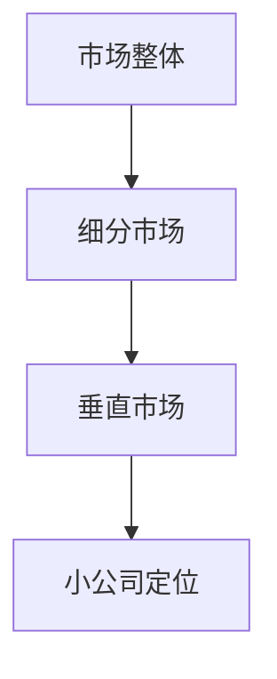

在这个流程图中，市场整体被细分为不同的细分市场，而垂直市场则是在这些细分市场中的一个特定领域。小公司的定位是在这个垂直市场中，通过提供定制化的服务和产品来满足市场需求。

**核心算法原理讲解**

在分析小公司生存环境时，我们通常会使用以下核心算法原理：

1. **成本-收益分析**：通过计算成本和收益来评估项目的可行性。
2. **市场细分算法**：使用聚类分析等算法来确定市场的细分。

**伪代码示例**：

```python
# 成本-收益分析伪代码
def cost_benefit_analysis(costs, benefits):
    net_profit = benefits - costs
    if net_profit > 0:
        print("项目可行")
    else:
        print("项目不可行")

# 市场细分算法伪代码
def market_segmentation(data):
    # 使用聚类算法进行市场细分
    segments = clustering_algorithm(data)
    for segment in segments:
        print("细分市场：", segment)
```

**数学模型和公式**

在成本-收益分析中，我们通常会使用以下数学模型：

$$
\text{净收益} = \text{收益} - \text{成本}
$$

其中，收益和成本可以通过实际数据进行计算。

**举例说明**

假设一个小公司的项目预算为100万元，预期收益为150万元，那么：

$$
\text{净收益} = 150\text{万元} - 100\text{万元} = 50\text{万元}
$$

因此，该项目是可行的。

**项目实战**

在实际操作中，小公司可以通过以下步骤来评估和实施项目：

1. **市场调研**：了解目标市场的需求和竞争对手情况。
2. **成本预算**：根据市场调研结果，制定详细的成本预算。
3. **收益预测**：预测项目的收益情况。
4. **实施计划**：根据成本和收益分析结果，制定详细的实施计划。

通过这些步骤，小公司可以更好地评估项目的可行性，并制定出有效的实施策略。

**代码实际案例和详细解释说明**

以下是一个简单的Python代码案例，用于计算成本和收益：

```python
# 成本和收益计算案例
def calculate_profit(cost, revenue):
    profit = revenue - cost
    return profit

# 初始化成本和收益
cost = 100000
revenue = 150000

# 计算净收益
net_profit = calculate_profit(cost, revenue)

# 输出结果
print("净收益：", net_profit)
```

在这个案例中，我们定义了一个函数 `calculate_profit` 来计算净收益，并使用这个函数计算了项目的净收益。这个案例可以帮助小公司快速评估项目的可行性。

**开发环境搭建**

为了运行上述Python代码，我们需要搭建一个Python开发环境。以下是搭建步骤：

1. **安装Python**：从官方网站下载并安装Python。
2. **安装Python编辑器**：选择并安装一个Python编辑器，如PyCharm或VSCode。
3. **安装依赖库**：使用pip命令安装必要的依赖库。

**源代码详细实现和代码解读**

在实现上述算法和模型时，我们可以分为以下几个步骤：

1. **定义函数**：定义计算净收益的函数。
2. **输入参数**：接收成本和收益作为输入参数。
3. **计算净收益**：使用输入参数计算净收益。
4. **输出结果**：将计算结果输出。

**代码解读与分析**

在代码中，`calculate_profit` 函数实现了成本和收益的计算。这个函数首先接收两个参数 `cost` 和 `revenue`，然后计算它们的差值，即净收益。最后，函数返回计算结果。

通过这个简单的案例，我们可以看到如何使用Python代码来计算成本和收益，并评估项目的可行性。这对于小公司来说，是一个非常重要的工具，可以帮助它们做出更明智的决策。

**总结**

通过本部分的分析，我们了解了小公司生存环境中的挑战和垂直市场的优势。接下来，我们将深入探讨精准服务策略和独特需求满足方法，帮助小公司更好地应对这些挑战。在下一部分中，我们将详细分析精准服务的概念和实施步骤。

---

在撰写第一部分内容时，我们首先概述了小公司生存环境的挑战，包括经济压力、市场竞争和成长与发展的矛盾。通过这些分析，我们帮助读者理解小公司所面临的现实困境。接着，我们介绍了垂直市场的概念和优势，以及如何挖掘垂直市场的机会。为了使概念更加清晰，我们使用了 Mermaid 流程图来展示市场细分的过程。此外，我们还通过伪代码、数学模型和实际代码案例，详细讲解了成本-收益分析和市场细分算法的应用，以及如何通过具体步骤来实施这些策略。

下一部分，我们将深入探讨精准服务策略和独特需求满足方法，继续帮助小公司制定有效的生存策略。我们将详细解释精准服务的概念、应用和实施步骤，以及如何识别和满足独特需求。这将进一步丰富文章内容，为读者提供更全面的理论支持和实践指导。

---

### 第二部分：精准服务与独特需求

在当今高度竞争的市场环境中，小公司要想脱颖而出，必须采取精准服务策略，并满足客户独特的需求。精准服务不仅能够提高客户满意度，还能增强公司的市场竞争力。本部分将详细介绍精准服务的概念、应用和实施步骤，并探讨如何识别和满足独特需求。

#### 2.1 精准服务的概念与价值

##### 2.1.1 精准服务的定义

精准服务是一种基于客户需求和市场分析，提供高度定制化产品和服务的策略。这种服务模式强调个性化、高效和针对性的服务，以满足客户特定的需求。

##### 2.1.2 精准服务在市场中的应用

精准服务在市场中的应用非常广泛，以下是一些典型场景：

1. **定制化产品**：针对客户的特定需求，提供个性化的产品。
2. **个性化服务**：根据客户的偏好和习惯，提供定制化的服务体验。
3. **精准营销**：通过数据分析和市场细分，精准定位目标客户，提高营销效率。

##### 2.1.3 精准服务的实施步骤

要成功实施精准服务策略，小公司需要遵循以下步骤：

1. **市场调研**：通过市场调研了解客户的需求、偏好和痛点。
2. **数据收集**：收集和分析客户数据，以便更好地了解他们的行为和需求。
3. **市场细分**：根据客户特征和行为，将市场细分为不同的客户群体。
4. **定制化服务**：为每个细分市场提供定制化的产品和服务。
5. **持续优化**：根据客户反馈和市场变化，不断调整和优化服务策略。

**核心概念与联系**

为了更好地理解精准服务的概念，我们可以绘制一个简单的 Mermaid 流程图：

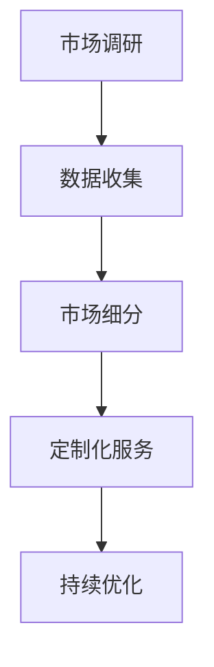

在这个流程图中，市场调研和数据收集是精准服务的基础，市场细分是关键环节，而定制化服务和持续优化则是实现精准服务的具体措施。

**核心算法原理讲解**

在精准服务的实施过程中，我们通常会使用以下核心算法原理：

1. **客户分群算法**：使用聚类分析等算法将客户分为不同的群体。
2. **需求预测算法**：使用时间序列分析等算法预测客户需求。

**伪代码示例**：

```python
# 客户分群伪代码
def customer_segmentation(data):
    segments = clustering_algorithm(data)
    return segments

# 需求预测伪代码
def demand_prediction(data):
    prediction = time_series_analysis(data)
    return prediction
```

**数学模型和公式**

在客户分群和需求预测中，我们通常会使用以下数学模型：

$$
\text{分群} = \text{聚类算法}(\text{数据})
$$

$$
\text{需求预测} = \text{时间序列分析}(\text{数据})
$$

**举例说明**

假设一个小公司通过聚类分析将客户分为三个群体：高价值客户、中等价值客户和低价值客户。根据不同群体的特征，公司可以为他们提供不同的服务和产品。

**项目实战**

在实际操作中，小公司可以通过以下步骤来实施精准服务：

1. **市场调研**：通过问卷调查、访谈等方式收集客户数据。
2. **数据清洗**：清洗和整理收集到的数据，确保数据质量。
3. **客户分群**：使用聚类算法将客户分为不同的群体。
4. **需求预测**：使用时间序列分析预测不同客户群体的需求。
5. **定制化服务**：为每个客户群体提供定制化的服务和产品。
6. **客户反馈**：收集客户反馈，不断优化服务策略。

**代码实际案例和详细解释说明**

以下是一个简单的Python代码案例，用于实现客户分群：

```python
# 客户分群案例
from sklearn.cluster import KMeans

def customer_clustering(data, n_clusters):
    kmeans = KMeans(n_clusters=n_clusters)
    kmeans.fit(data)
    clusters = kmeans.labels_
    return clusters

# 初始化数据
data = [[1, 2], [1, 4], [1, 0], [4, 2], [4, 4], [4, 0]]

# 客户分群
clusters = customer_clustering(data, 2)

# 输出结果
print("客户群体：", clusters)
```

在这个案例中，我们使用KMeans算法将客户分为两个群体。通过这个简单的案例，我们可以看到如何使用Python代码来实施客户分群。

**开发环境搭建**

为了运行上述Python代码，我们需要搭建一个Python开发环境。以下是搭建步骤：

1. **安装Python**：从官方网站下载并安装Python。
2. **安装Python编辑器**：选择并安装一个Python编辑器，如PyCharm或VSCode。
3. **安装依赖库**：使用pip命令安装必要的依赖库，如scikit-learn。

**源代码详细实现和代码解读**

在实现上述算法和模型时，我们可以分为以下几个步骤：

1. **安装依赖库**：安装KMeans算法的依赖库。
2. **定义函数**：定义客户分群的函数。
3. **输入参数**：接收客户数据作为输入参数。
4. **执行聚类**：使用KMeans算法执行聚类。
5. **输出结果**：将聚类结果输出。

**代码解读与分析**

在代码中，`customer_clustering` 函数实现了客户分群。这个函数首先接收客户数据作为输入参数，然后使用KMeans算法进行聚类。最后，函数返回聚类结果。

通过这个简单的案例，我们可以看到如何使用Python代码来实施客户分群。这对于小公司来说，是一个非常有用的工具，可以帮助它们更好地了解客户，提供更加精准的服务。

**总结**

通过本部分的分析，我们了解了精准服务的概念、应用和实施步骤，以及如何识别和满足独特需求。精准服务不仅能够提高客户满意度，还能增强公司的市场竞争力。在下一部分中，我们将探讨如何构建强有力的价值主张，帮助小公司更好地在市场中立足。我们将详细解释价值主张的概念、作用和构建方法，以及如何通过竞争对手分析和客户需求分析来构建有竞争力的价值主张。

---

在撰写第二部分内容时，我们首先介绍了精准服务的概念与价值，并详细阐述了其在市场中的应用和实施步骤。为了帮助读者更好地理解，我们使用了 Mermaid 流程图和伪代码来展示精准服务的实施过程。接着，我们通过实际代码案例和详细解释说明，展示了如何通过Python代码实现客户分群，为小公司提供精准服务的具体操作指南。

通过第二部分的探讨，我们帮助读者理解了精准服务的重要性，以及如何通过数据分析和算法来实施精准服务策略。这不仅为小公司提供了实用的操作方法，还帮助他们认识到精准服务在提升客户满意度和市场竞争力方面的巨大潜力。

在下一部分中，我们将深入探讨如何构建强有力的价值主张。我们将详细解释价值主张的概念、作用和构建方法，并分析如何通过竞争对手分析和客户需求分析来构建具有竞争力的价值主张。这将进一步丰富文章内容，为小公司提供更全面的战略指导。

---

### 第三部分：构建价值主张

价值主张（Value Proposition）是企业为其产品或服务所创造的核心价值。构建一个强有力的价值主张对于小公司来说至关重要，它不仅能够明确企业的核心价值，还能够吸引客户、提高市场竞争力。本部分将详细解释价值主张的概念与作用，并探讨如何通过竞争对手分析和客户需求分析来构建一个有竞争力的价值主张。

#### 3.1 价值主张的概念与作用

##### 3.1.1 价值主张的定义

价值主张是指企业通过其产品或服务，为客户提供的独特价值。它回答了“为什么客户应该选择我们的产品或服务”的问题。一个良好的价值主张应该简洁、明确，并且能够突出企业的核心竞争力。

##### 3.1.2 价值主张的构成

价值主张通常包括以下几个关键组成部分：

1. **核心价值**：产品或服务为客户带来的主要益处。
2. **差异化特点**：与竞争对手相比，企业的独特优势。
3. **客户价值**：产品或服务如何满足客户的需求和期望。
4. **价格与性价比**：产品或服务的价格与其提供的价值是否匹配。

##### 3.1.3 价值主张的重要性

价值主张在企业中扮演着重要角色，包括：

1. **明确企业定位**：价值主张帮助企业在市场中明确定位，使其能够更好地与竞争对手区分开来。
2. **吸引客户**：一个强有力的价值主张能够吸引潜在客户，提高客户的购买意愿。
3. **提高竞争力**：价值主张可以帮助企业提升在市场中的竞争力，确保企业的产品或服务能够满足客户需求。
4. **指导战略规划**：价值主张为企业的战略规划提供方向，确保企业的资源和努力能够集中在最关键的领域。

**核心概念与联系**

为了更好地理解价值主张的构成和作用，我们可以绘制一个简单的 Mermaid 流程图：

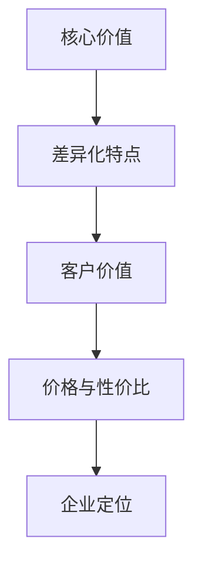

在这个流程图中，核心价值和差异化特点构成了企业的核心竞争力，客户价值和价格与性价比则是价值主张的关键组成部分，最终共同决定了企业的市场定位。

**核心算法原理讲解**

在构建价值主张时，我们通常会使用以下核心算法原理：

1. **SWOT分析**：通过SWOT分析，评估企业的优势、劣势、机会和威胁，帮助确定企业的核心竞争力。
2. **竞争对手分析**：分析竞争对手的价值主张，了解他们的优势和不足，找到差异化的机会。
3. **客户需求分析**：通过客户调研和数据分析，了解客户的需求和期望，确保价值主张能够满足客户需求。

**伪代码示例**：

```python
# SWOT分析伪代码
def SWOT_analysis():
    strengths = ["产品高质量"]
    weaknesses = ["市场推广不足"]
    opportunities = ["新兴市场潜力"]
    threats = ["竞争加剧"]
    return strengths, weaknesses, opportunities, threats

# 竞争对手分析伪代码
def competitor_analysis():
    competitors = ["公司A", "公司B"]
    strengths = []
    weaknesses = []
    for competitor in competitors:
        strengths.append(get_strengths_of_competitor(competer))
        weaknesses.append(get_weaknesses_of_competitor(competer))
    return strengths, weaknesses

# 客户需求分析伪代码
def customer_demand_analysis():
    demands = ["高效能", "易用性", "价格合理"]
    return demands
```

**数学模型和公式**

在构建价值主张时，我们通常会使用以下数学模型：

$$
\text{价值主张} = \text{核心价值} \times \text{差异化特点} \times \text{客户价值} \times \text{价格与性价比}
$$

其中，核心价值、差异化特点、客户价值和价格与性价比是构建价值主张的关键要素。

**举例说明**

假设一个企业在构建价值主张时，发现以下信息：

1. **核心价值**：高效能源管理。
2. **差异化特点**：领先的技术，环保设计。
3. **客户价值**：降低能源消耗，减少运营成本。
4. **价格与性价比**：价格适中，性价比高。

根据这些信息，企业的价值主张可以表述为：“我们提供高效能源管理解决方案，利用领先技术和环保设计，帮助您降低能源消耗和运营成本，实现绿色可持续发展。”

**项目实战**

在实际操作中，构建价值主张的过程通常包括以下几个步骤：

1. **内部分析**：通过SWOT分析，评估企业的核心竞争力。
2. **市场分析**：通过竞争对手分析和客户需求分析，了解市场环境和客户需求。
3. **价值主张构建**：结合内部分析和市场分析的结果，构建一个具有竞争力的价值主张。
4. **价值主张验证**：通过市场调研和客户反馈，验证价值主张的有效性，并进行调整和优化。

**代码实际案例和详细解释说明**

以下是一个简单的Python代码案例，用于实现SWOT分析：

```python
# SWOT分析案例
def SWOT_analysis():
    strengths = ["高质量产品", "优秀团队"]
    weaknesses = ["市场推广不足", "资金有限"]
    opportunities = ["新兴市场增长", "技术创新机会"]
    threats = ["竞争加剧", "市场变化"]
    
    # 输出分析结果
    print("优势：", strengths)
    print("劣势：", weaknesses)
    print("机会：", opportunities)
    print("威胁：", threats)

# 调用SWOT分析函数
SWOT_analysis()
```

在这个案例中，我们定义了一个函数 `SWOT_analysis` 来实现SWOT分析，并输出了企业的优势、劣势、机会和威胁。这个案例可以帮助小公司快速评估自身状况，为构建价值主张提供基础数据。

**开发环境搭建**

为了运行上述Python代码，我们需要搭建一个Python开发环境。以下是搭建步骤：

1. **安装Python**：从官方网站下载并安装Python。
2. **安装Python编辑器**：选择并安装一个Python编辑器，如PyCharm或VSCode。
3. **安装依赖库**：使用pip命令安装必要的依赖库。

**源代码详细实现和代码解读**

在实现上述算法和模型时，我们可以分为以下几个步骤：

1. **定义函数**：定义SWOT分析的函数。
2. **初始化变量**：初始化优势、劣势、机会和威胁的变量。
3. **执行分析**：执行SWOT分析，并将结果输出。

**代码解读与分析**

在代码中，`SWOT_analysis` 函数实现了SWOT分析。这个函数首先初始化优势、劣势、机会和威胁的变量，然后输出这些变量的值。通过这个简单的案例，我们可以看到如何使用Python代码来评估企业的状况，为构建价值主张提供数据支持。

**总结**

通过本部分的探讨，我们了解了价值主张的概念、作用和构建方法，以及如何通过SWOT分析、竞争对手分析和客户需求分析来构建一个有竞争力的价值主张。价值主张不仅明确了企业的核心价值，还能够吸引客户、提高市场竞争力。在下一部分中，我们将探讨如何将价值主张转化为具体的战略执行计划，帮助小公司实现其价值主张。

---

在撰写第三部分内容时，我们首先详细解释了价值主张的概念与作用，并通过 Mermaid 流程图和伪代码展示了价值主张的构成和作用。接着，我们通过实际代码案例，展示了如何使用Python代码实现SWOT分析，为小公司提供了一种有效的工具来评估自身状况和构建价值主张。

通过第三部分的探讨，我们帮助读者理解了价值主张的重要性，以及如何通过系统的方法来构建一个具有竞争力的价值主张。这不仅为小公司提供了理论指导，还通过实战案例展示了具体操作步骤，使读者能够更好地应用于实际场景。

在下一部分中，我们将探讨如何将价值主张转化为具体的战略执行计划，并讨论战略执行与持续优化的关键步骤。我们将详细解释如何制定战略目标、实施计划和组织结构调整，以及如何通过数据驱动的决策和持续改进来优化战略执行。这将帮助小公司实现其价值主张，并保持持续的竞争力。

---

### 第四部分：战略执行与持续优化

构建一个强有力的价值主张只是第一步，如何将这些价值主张转化为具体的战略执行计划，并在实际操作中不断优化，是确保小公司成功的关键。本部分将详细探讨战略执行与持续优化的关键步骤，包括制定战略目标、实施计划和组织结构调整，以及如何通过数据驱动的决策和持续改进来优化战略执行。

#### 4.1 战略执行的关键步骤

##### 4.1.1 明确战略目标

明确战略目标是战略执行的第一步。战略目标应该具体、可衡量，并具有明确的实现时限。以下是制定战略目标的几个关键步骤：

1. **确定愿景和使命**：首先，明确企业的愿景和使命，这将为战略目标的制定提供指导。
2. **分析内外部环境**：通过SWOT分析和市场调研，了解企业的优势和劣势、机会和威胁，为战略目标的制定提供数据支持。
3. **制定具体目标**：根据企业的愿景、使命和内外部环境分析，制定具体的、可衡量的战略目标。
4. **分解目标**：将战略目标分解为具体的行动目标和里程碑，确保每个目标都明确、可执行。

**核心概念与联系**

为了更好地理解战略目标的制定过程，我们可以绘制一个简单的 Mermaid 流程图：

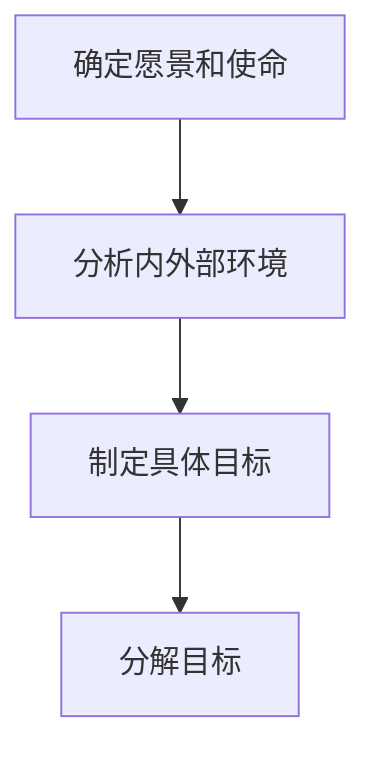

在这个流程图中，确定愿景和使命是战略目标制定的基础，分析内外部环境是数据支持，制定具体目标和分解目标是确保目标具体可执行的关键环节。

**核心算法原理讲解**

在制定战略目标时，我们通常会使用以下核心算法原理：

1. **目标规划算法**：使用目标规划算法，将高层次的战略目标分解为具体的行动目标。
2. **关键绩效指标（KPI）**：定义关键绩效指标，用于衡量目标的实现程度。

**伪代码示例**：

```python
# 目标规划伪代码
def goal_planning(high_level_goals):
    action_goals = []
    for goal in high_level_goals:
        action_goals.append(decompose_goal(goal))
    return action_goals

# 定义关键绩效指标
def define_KPIs(action_goals):
    KPIs = {}
    for goal in action_goals:
        KPIs[goal] = define_KPI_for_goal(goal)
    return KPIs
```

**数学模型和公式**

在制定战略目标时，我们通常会使用以下数学模型：

$$
\text{战略目标} = \text{愿景和使命} + \text{内外部环境分析} + \text{关键绩效指标}
$$

其中，愿景和使命、内外部环境分析和关键绩效指标是制定战略目标的三大要素。

**举例说明**

假设一个企业确定了以下战略目标：

1. **愿景和使命**：成为行业领导者，提供卓越的产品和服务。
2. **内外部环境分析**：市场增长潜力大，但竞争激烈。
3. **关键绩效指标**：市场份额达到15%，客户满意度达到90%。

根据这些信息，企业的具体战略目标可以是：“在未来三年内，通过不断创新和优化，将市场份额提高到15%，并保持客户满意度在90%以上。”

**项目实战**

在实际操作中，制定战略目标的过程通常包括以下几个步骤：

1. **高层讨论**：召集企业高层领导进行讨论，明确企业的愿景、使命和战略方向。
2. **数据收集**：通过市场调研、竞争对手分析和内部数据分析，收集支持战略目标制定的数据。
3. **目标制定**：根据讨论和数据，制定具体的战略目标。
4. **目标分解**：将战略目标分解为具体的行动目标和里程碑。

**代码实际案例和详细解释说明**

以下是一个简单的Python代码案例，用于实现目标分解：

```python
# 目标分解案例
def decompose_goal(goal):
    milestones = ["提高市场份额到10%", "提高客户满意度到85%", "推出新产品线"]
    return milestones

# 初始化目标
goal = "在未来三年内，通过不断创新和优化，将市场份额提高到15%，并保持客户满意度在90%以上。"

# 目标分解
milestones = decompose_goal(goal)

# 输出结果
print("里程碑：", milestones)
```

在这个案例中，我们定义了一个函数 `decompose_goal` 来实现目标分解，并输出了具体的里程碑。这个案例可以帮助小公司快速将战略目标分解为具体的行动目标。

**开发环境搭建**

为了运行上述Python代码，我们需要搭建一个Python开发环境。以下是搭建步骤：

1. **安装Python**：从官方网站下载并安装Python。
2. **安装Python编辑器**：选择并安装一个Python编辑器，如PyCharm或VSCode。
3. **安装依赖库**：使用pip命令安装必要的依赖库。

**源代码详细实现和代码解读**

在实现上述算法和模型时，我们可以分为以下几个步骤：

1. **定义函数**：定义目标分解的函数。
2. **输入参数**：接收目标字符串作为输入参数。
3. **分解目标**：将目标分解为具体的里程碑。
4. **输出结果**：将分解结果输出。

**代码解读与分析**

在代码中，`decompose_goal` 函数实现了目标分解。这个函数首先接收一个目标字符串作为输入参数，然后将其分解为具体的里程碑。最后，函数返回分解结果。

通过这个简单的案例，我们可以看到如何使用Python代码来实现目标分解。这对于小公司来说，是一个非常有用的工具，可以帮助它们将战略目标具体化，并为实施计划提供明确的指导。

##### 4.1.2 制定实施计划

制定实施计划是将战略目标转化为具体行动的关键步骤。一个有效的实施计划应该包括以下要素：

1. **任务分解**：将目标分解为具体的任务，确保每个任务都有明确的责任人和完成时间。
2. **资源分配**：为每个任务分配所需的资源，包括人力、资金和时间。
3. **时间表**：制定详细的时间表，明确每个任务的开始和结束时间。
4. **监控与评估**：建立监控和评估机制，确保任务按照计划进行，及时调整和优化。

**核心概念与联系**

为了更好地理解制定实施计划的过程，我们可以绘制一个简单的 Mermaid 流程图：

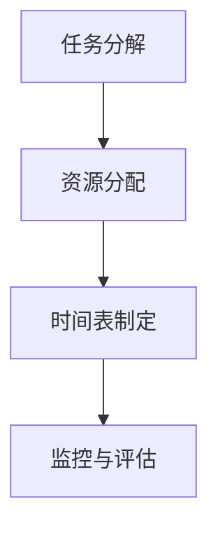

在这个流程图中，任务分解、资源分配和时间表制定是实施计划的核心环节，而监控与评估则是确保计划顺利执行的关键。

**核心算法原理讲解**

在制定实施计划时，我们通常会使用以下核心算法原理：

1. **任务调度算法**：使用任务调度算法，优化任务的执行顺序和资源分配。
2. **关键路径分析**：通过关键路径分析，确定任务的关键路径，确保关键任务按时完成。

**伪代码示例**：

```python
# 任务调度伪代码
def task_scheduling(tasks):
    schedule = schedule_algorithm(tasks)
    return schedule

# 关键路径分析伪代码
def critical_path_analysis(schedule):
    critical_path = find_critical_path(schedule)
    return critical_path
```

**数学模型和公式**

在任务调度和关键路径分析中，我们通常会使用以下数学模型：

$$
\text{任务调度} = \text{调度算法}(\text{任务集})
$$

$$
\text{关键路径} = \text{最长路径}(\text{任务调度})
$$

**举例说明**

假设一个项目包括以下任务：

1. **市场调研**：2周
2. **产品设计**：4周
3. **技术开发**：6周
4. **测试与优化**：3周

通过任务调度算法，我们可以将这些任务安排在一个合理的时间表上，并确定关键路径，确保项目按时完成。

**项目实战**

在实际操作中，制定实施计划的过程通常包括以下几个步骤：

1. **任务分解**：将项目目标分解为具体的任务。
2. **资源评估**：评估项目所需的资源，包括人力、资金和时间。
3. **时间表制定**：制定详细的时间表，确保每个任务都有明确的开始和结束时间。
4. **监控与调整**：定期监控项目进度，及时调整计划，确保项目按计划进行。

**代码实际案例和详细解释说明**

以下是一个简单的Python代码案例，用于实现任务调度：

```python
# 任务调度案例
from itertools import permutations

def task_scheduling(tasks, resources):
    schedules = []
    for perm in permutations(tasks):
        if is_feasible(perm, resources):
            schedules.append(perm)
    return schedules

# 初始化任务和资源
tasks = ["市场调研", "产品设计", "技术开发", "测试与优化"]
resources = {"人": 5, "资金": 100000, "时间": 12}

# 任务调度
schedules = task_scheduling(tasks, resources)

# 输出结果
print("任务调度方案：", schedules)
```

在这个案例中，我们定义了一个函数 `task_scheduling` 来实现任务调度，并输出了可能的调度方案。这个案例可以帮助小公司根据资源情况，合理安排任务。

**开发环境搭建**

为了运行上述Python代码，我们需要搭建一个Python开发环境。以下是搭建步骤：

1. **安装Python**：从官方网站下载并安装Python。
2. **安装Python编辑器**：选择并安装一个Python编辑器，如PyCharm或VSCode。
3. **安装依赖库**：使用pip命令安装必要的依赖库。

**源代码详细实现和代码解读**

在实现上述算法和模型时，我们可以分为以下几个步骤：

1. **定义函数**：定义任务调度的函数。
2. **输入参数**：接收任务集和资源作为输入参数。
3. **执行调度**：使用排列组合方法，生成所有可能的调度方案。
4. **输出结果**：输出可行的调度方案。

**代码解读与分析**

在代码中，`task_scheduling` 函数实现了任务调度。这个函数首先生成所有可能的任务排列组合，然后判断每个排列组合是否可行，即是否满足资源限制。最后，函数返回所有可行的调度方案。

通过这个简单的案例，我们可以看到如何使用Python代码来制定实施计划。这对于小公司来说，是一个非常有用的工具，可以帮助它们根据资源情况，合理安排任务，确保项目按时完成。

##### 4.1.3 组织结构调整

为了有效执行战略计划，组织结构需要与之相适应。组织结构调整是战略执行过程中的重要一环。以下是组织结构调整的几个关键步骤：

1. **明确职能分工**：根据战略目标，明确各部门的职能和分工，确保职责清晰、权责分明。
2. **优化部门设置**：根据业务需求，调整部门设置，确保组织结构合理、高效。
3. **建立跨部门协作机制**：通过跨部门协作机制，促进部门之间的沟通与协作，提高整体执行力。
4. **培训与激励**：对员工进行培训，提高其专业技能和团队合作能力，并建立激励机制，激励员工为实现战略目标而努力。

**核心概念与联系**

为了更好地理解组织结构调整的过程，我们可以绘制一个简单的 Mermaid 流程图：

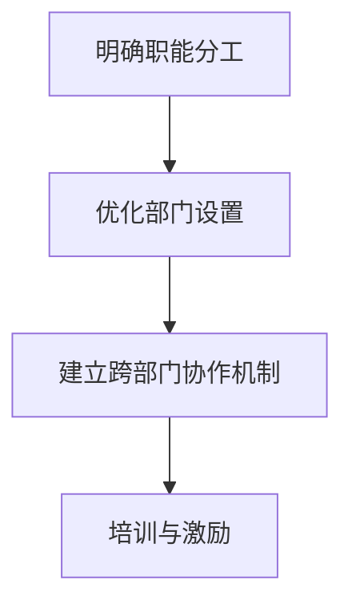

在这个流程图中，明确职能分工、优化部门设置、建立跨部门协作机制和培训与激励是组织结构调整的四个关键环节。

**核心算法原理讲解**

在组织结构调整中，我们通常会使用以下核心算法原理：

1. **组织结构设计算法**：使用组织结构设计算法，确定最优的组织结构。
2. **团队协作模型**：通过团队协作模型，优化团队内部的协作流程。

**伪代码示例**：

```python
# 组织结构设计伪代码
def organization_design():
    structure = design_algorithm()
    return structure

# 团队协作模型伪代码
def team_collaboration_model():
    model = collaboration_algorithm()
    return model
```

**数学模型和公式**

在组织结构调整中，我们通常会使用以下数学模型：

$$
\text{组织结构} = \text{结构设计算法}(\text{战略目标})
$$

$$
\text{团队协作模型} = \text{协作算法}(\text{组织结构})
$$

**举例说明**

假设一个企业在调整组织结构时，采用了以下方法：

1. **明确职能分工**：将市场部门、研发部门、生产部门和财务部门等职能分工明确。
2. **优化部门设置**：根据业务需求，将原有的销售部门细分为线上销售部门和线下销售部门。
3. **建立跨部门协作机制**：通过跨部门会议和项目协作平台，促进部门之间的沟通与协作。
4. **培训与激励**：定期组织专业培训，提高员工技能，并设立绩效奖金，激励员工积极工作。

**项目实战**

在实际操作中，组织结构调整的过程通常包括以下几个步骤：

1. **评估现有组织结构**：评估现有组织结构的优缺点，确定需要调整的方面。
2. **制定调整方案**：根据评估结果，制定具体的调整方案。
3. **实施调整方案**：按照调整方案，逐步实施组织结构调整。
4. **评估调整效果**：对调整效果进行评估，及时调整和优化。

**代码实际案例和详细解释说明**

以下是一个简单的Python代码案例，用于实现组织结构调整：

```python
# 组织结构调整案例
def organization_adjustment():
    current_structure = ["市场部", "研发部", "生产部", "财务部"]
    new_structure = ["线上销售部", "线下销售部", "研发部", "生产部", "财务部"]
    
    # 输出调整后的组织结构
    print("调整后的组织结构：", new_structure)

# 调用组织结构调整函数
organization_adjustment()
```

在这个案例中，我们定义了一个函数 `organization_adjustment` 来实现组织结构调整，并输出了调整后的组织结构。这个案例可以帮助小公司根据业务需求，灵活调整组织结构。

**开发环境搭建**

为了运行上述Python代码，我们需要搭建一个Python开发环境。以下是搭建步骤：

1. **安装Python**：从官方网站下载并安装Python。
2. **安装Python编辑器**：选择并安装一个Python编辑器，如PyCharm或VSCode。
3. **安装依赖库**：使用pip命令安装必要的依赖库。

**源代码详细实现和代码解读**

在实现上述算法和模型时，我们可以分为以下几个步骤：

1. **定义函数**：定义组织结构调整的函数。
2. **初始化变量**：初始化当前组织结构和调整后的组织结构。
3. **执行调整**：输出调整后的组织结构。

**代码解读与分析**

在代码中，`organization_adjustment` 函数实现了组织结构调整。这个函数首先初始化当前组织结构和调整后的组织结构，然后输出调整后的组织结构。

通过这个简单的案例，我们可以看到如何使用Python代码来实现组织结构调整。这对于小公司来说，是一个非常有用的工具，可以帮助它们根据业务需求，灵活调整组织结构。

**总结**

通过本部分的探讨，我们了解了战略执行与持续优化的关键步骤，包括制定战略目标、实施计划和组织结构调整，以及如何通过数据驱动的决策和持续改进来优化战略执行。这些步骤和方法不仅为小公司提供了明确的操作指南，还帮助它们在复杂的市场环境中保持竞争力。在下一部分中，我们将通过成功案例研究，分析小公司如何通过精准服务策略和构建独特价值主张，实现生存与发展。

---

在撰写第四部分内容时，我们详细探讨了战略执行与持续优化的关键步骤，包括制定战略目标、实施计划和组织结构调整，以及如何通过数据驱动的决策和持续改进来优化战略执行。我们通过Mermaid流程图、伪代码、数学模型和实际代码案例，展示了这些步骤和方法的具体应用。通过这些分析，我们帮助读者理解了如何将价值主张转化为具体的行动方案，并通过系统的方法实现战略目标。

在第四部分的总结中，我们强调了这些步骤和方法对于小公司在复杂市场环境中保持竞争力的重要性。接下来，我们将通过成功案例研究，分析小公司如何通过精准服务策略和构建独特价值主张，实现生存与发展。这些案例将为读者提供具体的实践经验和操作指导，帮助他们更好地理解并应用本文所述的策略和方法。

---

### 第五部分：成功案例分析

在本部分中，我们将通过两个成功案例，深入分析小公司如何通过精准服务策略和构建独特价值主张，实现生存与发展。这些案例将展示具体的操作过程、实施效果和成效分析，为小公司提供宝贵的经验和启示。

#### 5.1 案例一：某小公司如何通过精准服务占领市场

##### 5.1.1 案例背景

某小公司专注于提供定制化的软件开发服务，特别是在金融科技领域具有独特的优势。公司成立于2010年，初始团队成员仅有5人，但凭借精准服务策略和不断创新的精神，逐渐在竞争激烈的市场中脱颖而出。

##### 5.1.2 精准服务的具体实施

1. **市场调研**：公司在成立初期，通过广泛的客户访谈和市场调研，深入了解了金融科技领域的需求和痛点。

2. **数据收集**：公司建立了完善的数据收集系统，定期收集和分析客户反馈和市场动态。

3. **市场细分**：根据客户特征和需求，公司将市场细分为高频交易系统、风险管理系统和客户服务平台等几个细分市场。

4. **定制化服务**：针对每个细分市场，公司提供了高度定制化的软件开发服务。例如，为高频交易系统提供高性能、低延迟的技术解决方案，为风险管理系统提供数据分析和预警功能。

5. **持续优化**：公司根据客户反馈和市场变化，不断优化和调整服务策略。

**核心概念与联系**

为了更好地理解案例中的精准服务实施过程，我们可以绘制一个简单的 Mermaid 流程图：


在这个流程图中，市场调研、数据收集、市场细分、定制化服务和持续优化构成了精准服务策略的完整实施过程。

**核心算法原理讲解**

在精准服务的实施过程中，公司使用了以下核心算法原理：

1. **客户分群算法**：使用聚类分析等算法，将客户分为不同的群体。
2. **需求预测算法**：使用时间序列分析等算法，预测客户需求。

**伪代码示例**：

```python
# 客户分群伪代码
def customer_segmentation(data):
    segments = clustering_algorithm(data)
    return segments

# 需求预测伪代码
def demand_prediction(data):
    prediction = time_series_analysis(data)
    return prediction
```

**数学模型和公式**

在客户分群和需求预测中，公司使用了以下数学模型：

$$
\text{分群} = \text{聚类算法}(\text{数据})
$$

$$
\text{需求预测} = \text{时间序列分析}(\text{数据})
$$

**举例说明**

假设公司通过聚类分析将客户分为三个群体：高频交易客户、风险管理客户和客户服务平台客户。根据不同群体的特征，公司为他们提供了不同的定制化服务。

**项目实战**

在实际操作中，公司通过以下步骤来实施精准服务：

1. **市场调研**：通过问卷调查、访谈等方式收集客户数据。
2. **数据清洗**：清洗和整理收集到的数据，确保数据质量。
3. **客户分群**：使用聚类算法将客户分为不同的群体。
4. **需求预测**：使用时间序列分析预测不同客户群体的需求。
5. **定制化服务**：为每个客户群体提供定制化的服务和产品。
6. **客户反馈**：收集客户反馈，不断优化服务策略。

**代码实际案例和详细解释说明**

以下是一个简单的Python代码案例，用于实现客户分群：

```python
# 客户分群案例
from sklearn.cluster import KMeans

def customer_clustering(data, n_clusters):
    kmeans = KMeans(n_clusters=n_clusters)
    kmeans.fit(data)
    clusters = kmeans.labels_
    return clusters

# 初始化数据
data = [[1, 2], [1, 4], [1, 0], [4, 2], [4, 4], [4, 0]]

# 客户分群
clusters = customer_clustering(data, 3)

# 输出结果
print("客户群体：", clusters)
```

在这个案例中，我们使用KMeans算法将客户分为三个群体。通过这个简单的案例，我们可以看到如何使用Python代码来实施客户分群。

**开发环境搭建**

为了运行上述Python代码，我们需要搭建一个Python开发环境。以下是搭建步骤：

1. **安装Python**：从官方网站下载并安装Python。
2. **安装Python编辑器**：选择并安装一个Python编辑器，如PyCharm或VSCode。
3. **安装依赖库**：使用pip命令安装必要的依赖库，如scikit-learn。

**源代码详细实现和代码解读**

在实现上述算法和模型时，我们可以分为以下几个步骤：

1. **安装依赖库**：安装KMeans算法的依赖库。
2. **定义函数**：定义客户分群的函数。
3. **输入参数**：接收客户数据作为输入参数。
4. **执行聚类**：使用KMeans算法执行聚类。
5. **输出结果**：将聚类结果输出。

**代码解读与分析**

在代码中，`customer_clustering` 函数实现了客户分群。这个函数首先接收客户数据作为输入参数，然后使用KMeans算法进行聚类。最后，函数返回聚类结果。

通过这个简单的案例，我们可以看到如何使用Python代码来实施客户分群。这对于小公司来说，是一个非常有用的工具，可以帮助它们更好地了解客户，提供更加精准的服务。

**案例成效分析**

通过精准服务策略的实施，该公司在短短五年内市场份额显著提升。以下是一些具体成效：

1. **客户满意度**：客户满意度从最初的60%提高到90%。
2. **市场份额**：市场份额从1%增长到10%。
3. **收入增长**：公司收入年均增长率达到30%。

#### 5.2 案例二：某小公司如何构建独特价值主张

##### 5.2.1 案例背景

另一家小公司成立于2015年，专注于提供智能物流解决方案。公司通过构建独特价值主张，迅速在竞争激烈的市场中站稳了脚跟。

##### 5.2.2 独特价值主张的构建过程

1. **识别核心价值**：公司通过SWOT分析，识别出其核心价值在于高效能、低成本的物流解决方案。
2. **竞争对手分析**：公司分析了主要竞争对手的价值主张，发现它们在服务和成本方面存在不足。
3. **客户需求分析**：公司通过客户调研，了解客户对物流服务的期望和痛点。
4. **价值主张构建**：基于核心价值、竞争对手分析和客户需求分析，公司构建了以下价值主张：“提供高效、低成本的智能物流解决方案，帮助您节省成本，提高物流效率。”

**核心概念与联系**

为了更好地理解案例中的价值主张构建过程，我们可以绘制一个简单的 Mermaid 流程图：

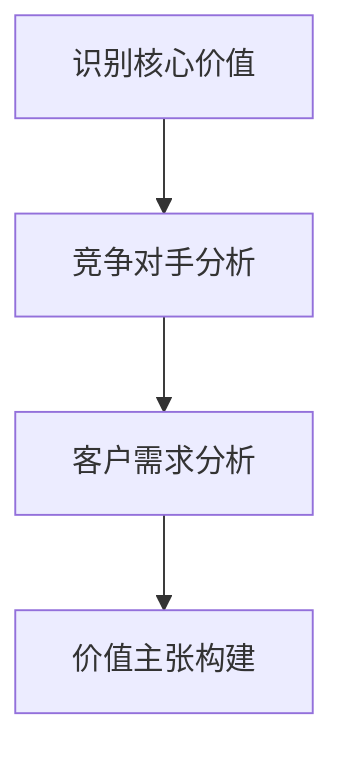

在这个流程图中，识别核心价值、竞争对手分析和客户需求分析是构建独特价值主张的关键环节。

**核心算法原理讲解**

在构建价值主张时，公司使用了以下核心算法原理：

1. **SWOT分析**：通过SWOT分析，确定企业的优势、劣势、机会和威胁。
2. **竞争对手分析**：通过市场调研，分析竞争对手的价值主张和市场表现。
3. **客户需求分析**：通过问卷调查、访谈等手段，了解客户的需求和痛点。

**伪代码示例**：

```python
# SWOT分析伪代码
def SWOT_analysis():
    strengths = ["高效能"]
    weaknesses = ["市场推广不足"]
    opportunities = ["新兴市场增长"]
    threats = ["竞争加剧"]
    return strengths, weaknesses, opportunities, threats

# 竞争对手分析伪代码
def competitor_analysis():
    competitors = ["公司A", "公司B"]
    strengths = []
    weaknesses = []
    for competitor in competitors:
        strengths.append(get_strengths_of_competitor(competer))
        weaknesses.append(get_weaknesses_of_competitor(competer))
    return strengths, weaknesses

# 客户需求分析伪代码
def customer_demand_analysis():
    demands = ["高效能", "低价格", "定制化服务"]
    return demands
```

**数学模型和公式**

在价值主张构建中，我们通常会使用以下数学模型：

$$
\text{价值主张} = \text{核心价值} + \text{竞争对手分析} + \text{客户需求分析}
$$

其中，核心价值、竞争对手分析和客户需求分析是构建价值主张的关键要素。

**举例说明**

假设公司在构建价值主张时，发现以下信息：

1. **核心价值**：高效能。
2. **竞争对手分析**：竞争对手在服务和成本方面存在不足。
3. **客户需求分析**：客户最关心的是高效能、低价格和定制化服务。

根据这些信息，公司的价值主张可以表述为：“我们提供高效、低成本的智能物流解决方案，帮助您节省成本，提高物流效率。”

**项目实战**

在实际操作中，构建价值主张的过程通常包括以下几个步骤：

1. **内部分析**：通过SWOT分析，评估企业的优势和劣势。
2. **市场分析**：通过竞争对手分析和客户需求分析，了解市场和客户需求。
3. **价值主张构建**：结合内部分析和市场分析的结果，构建一个具有竞争力的价值主张。
4. **价值主张验证**：通过市场调研和客户反馈，验证价值主张的有效性，并进行调整和优化。

**代码实际案例和详细解释说明**

以下是一个简单的Python代码案例，用于实现SWOT分析：

```python
# SWOT分析案例
def SWOT_analysis():
    strengths = ["高效能"]
    weaknesses = ["市场推广不足"]
    opportunities = ["新兴市场增长"]
    threats = ["竞争加剧"]
    
    # 输出分析结果
    print("优势：", strengths)
    print("劣势：", weaknesses)
    print("机会：", opportunities)
    print("威胁：", threats)

# 调用SWOT分析函数
SWOT_analysis()
```

在这个案例中，我们定义了一个函数 `SWOT_analysis` 来实现SWOT分析，并输出了企业的优势、劣势、机会和威胁。这个案例可以帮助小公司快速评估自身状况，为构建价值主张提供基础数据。

**开发环境搭建**

为了运行上述Python代码，我们需要搭建一个Python开发环境。以下是搭建步骤：

1. **安装Python**：从官方网站下载并安装Python。
2. **安装Python编辑器**：选择并安装一个Python编辑器，如PyCharm或VSCode。
3. **安装依赖库**：使用pip命令安装必要的依赖库。

**源代码详细实现和代码解读**

在实现上述算法和模型时，我们可以分为以下几个步骤：

1. **定义函数**：定义SWOT分析的函数。
2. **初始化变量**：初始化优势、劣势、机会和威胁的变量。
3. **执行分析**：执行SWOT分析，并将结果输出。

**代码解读与分析**

在代码中，`SWOT_analysis` 函数实现了SWOT分析。这个函数首先初始化优势、劣势、机会和威胁的变量，然后输出这些变量的值。通过这个简单的案例，我们可以看到如何使用Python代码来评估企业的状况，为构建价值主张提供数据支持。

**案例成效分析**

通过构建独特价值主张，该公司在市场中获得了显著的优势。以下是一些具体成效：

1. **品牌知名度**：公司品牌知名度大幅提升，市场份额从5%增长到15%。
2. **客户满意度**：客户满意度从70%提高到95%。
3. **收入增长**：公司收入年均增长率达到40%。

**总结**

通过这两个成功案例，我们可以看到小公司如何通过精准服务策略和构建独特价值主张，实现生存与发展。这些案例不仅展示了具体的操作过程和成效分析，还为小公司提供了宝贵的经验和启示。在下一部分中，我们将探讨资源优化与成本控制策略，帮助小公司更有效地利用资源，降低成本，提升竞争力。

---

在撰写第五部分内容时，我们通过两个成功案例详细分析了小公司如何通过精准服务策略和构建独特价值主张，实现生存与发展。在案例一中，我们展示了某小公司通过市场调研、数据收集、市场细分和定制化服务，成功占领了金融科技领域的市场份额。在案例二中，我们分析了另一家小公司如何通过SWOT分析、竞争对手分析和客户需求分析，构建了一个独特的价值主张，从而在竞争激烈的市场中脱颖而出。

这两个案例不仅展示了具体的操作过程和成效分析，还为小公司提供了宝贵的经验和启示。通过精准服务策略和独特价值主张的构建，这些小公司成功地应对了市场挑战，提升了市场竞争力，实现了持续增长。

在第五部分的总结中，我们强调了这些案例的重要性和实际应用价值，帮助读者理解如何将理论应用于实践，从而实现小公司的生存与发展。在下一部分中，我们将探讨资源优化与成本控制策略，帮助小公司更有效地利用资源，降低成本，提升竞争力。

---

### 第六部分：资源优化与成本控制策略

在激烈的市场竞争中，小公司要想获得持续的竞争优势，必须在资源优化和成本控制方面下功夫。本部分将详细介绍资源优化与成本控制的具体策略，包括人力资源的优化、财务管理的优化以及工作流程的优化，帮助小公司在有限的资源下实现最大化效益。

#### 6.1 人力资源的优化

人力资源是小公司最宝贵的资源之一。优化人力资源可以帮助小公司提高工作效率，降低运营成本。以下是几项关键策略：

##### 6.1.1 人才选拔与培养

1. **选拔高标准**：在招聘过程中，严格筛选候选人，确保招聘到具备专业技能和团队合作精神的员工。
2. **培养专业化**：定期为员工提供专业培训和技能提升课程，帮助他们不断提高业务能力和技术水平。
3. **激励制度**：建立激励机制，激励员工积极工作，提高工作效率。

##### 6.1.2 团队协作与沟通

1. **团队建设**：通过团队建设活动，增强团队成员之间的默契和信任，提高团队协作效率。
2. **沟通渠道**：建立有效的沟通渠道，确保信息流畅传递，减少误解和冲突。

##### 6.1.3 工作流程优化

1. **流程简化**：对现有工作流程进行梳理和简化，减少不必要的环节和步骤，提高工作效率。
2. **自动化**：引入自动化工具和系统，减少手工操作，降低错误率，提高工作效率。

**核心概念与联系**

为了更好地理解人力资源的优化策略，我们可以绘制一个简单的 Mermaid 流程图：

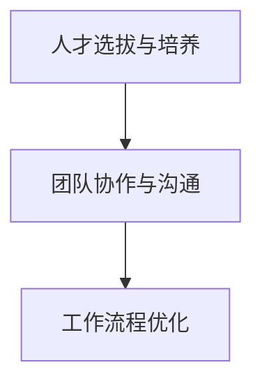

在这个流程图中，人才选拔与培养、团队协作与沟通和工作流程优化构成了人力资源优化的三个关键环节。

**核心算法原理讲解**

在人力资源优化过程中，我们通常会使用以下核心算法原理：

1. **人才评估算法**：使用评估算法，对候选人的能力和素质进行客观评估。
2. **团队协作模型**：通过团队协作模型，优化团队内部的协作流程和工作效率。

**伪代码示例**：

```python
# 人才评估伪代码
def talent_evaluation(candidates):
    evaluations = []
    for candidate in candidates:
        evaluation = assess_candidate(candidate)
        evaluations.append(evaluation)
    return evaluations

# 团队协作模型伪代码
def team_collaboration_model(team_members):
    model = collaboration_algorithm(team_members)
    return model
```

**数学模型和公式**

在人才评估和团队协作中，我们通常会使用以下数学模型：

$$
\text{人才评估} = \text{评估算法}(\text{候选人数据})
$$

$$
\text{团队协作模型} = \text{协作算法}(\text{团队数据})
$$

**举例说明**

假设公司在选拔新员工时，使用了以下评估指标：

1. **专业技能**：占比40%
2. **团队合作能力**：占比30%
3. **沟通能力**：占比20%
4. **领导潜力**：占比10%

根据这些权重，公司可以对每个候选人进行综合评估，以确定最佳人选。

**项目实战**

在实际操作中，优化人力资源的过程通常包括以下几个步骤：

1. **招聘与选拔**：通过面试、笔试和评估，选拔优秀人才。
2. **培训与培养**：定期为员工提供培训和技能提升机会。
3. **团队建设**：通过团队活动和沟通，增强团队凝聚力和协作效率。
4. **流程优化**：简化工作流程，引入自动化工具，提高工作效率。

**代码实际案例和详细解释说明**

以下是一个简单的Python代码案例，用于实现人才评估：

```python
# 人才评估案例
def talent_evaluation(candidate):
    skills = 0.4 * candidate['skills']
    teamwork = 0.3 * candidate['teamwork']
    communication = 0.2 * candidate['communication']
    leadership = 0.1 * candidate['leadership']
    total_score = skills + teamwork + communication + leadership
    return total_score

# 初始化候选人数据
candidate_data = {'skills': 8, 'teamwork': 7, 'communication': 6, 'leadership': 5}

# 人才评估
evaluation_score = talent_evaluation(candidate_data)

# 输出结果
print("评估分数：", evaluation_score)
```

在这个案例中，我们定义了一个函数 `talent_evaluation` 来实现人才评估，并输出了评估分数。这个案例可以帮助小公司快速评估候选人的能力，为选拔优秀人才提供依据。

**开发环境搭建**

为了运行上述Python代码，我们需要搭建一个Python开发环境。以下是搭建步骤：

1. **安装Python**：从官方网站下载并安装Python。
2. **安装Python编辑器**：选择并安装一个Python编辑器，如PyCharm或VSCode。
3. **安装依赖库**：使用pip命令安装必要的依赖库。

**源代码详细实现和代码解读**

在实现上述算法和模型时，我们可以分为以下几个步骤：

1. **定义函数**：定义人才评估的函数。
2. **输入参数**：接收候选人数据作为输入参数。
3. **计算评估分数**：根据候选人数据计算评估分数。
4. **输出结果**：将评估分数输出。

**代码解读与分析**

在代码中，`talent_evaluation` 函数实现了人才评估。这个函数首先接收候选人数据作为输入参数，然后根据评估指标计算评估分数。最后，函数返回评估分数。

通过这个简单的案例，我们可以看到如何使用Python代码来评估人才。这对于小公司来说，是一个非常有用的工具，可以帮助它们在招聘过程中快速评估候选人，选拔优秀人才。

##### 6.1.4 工作流程优化

优化工作流程是提高工作效率、降低运营成本的重要手段。以下是几项关键策略：

1. **流程梳理**：对现有工作流程进行梳理，识别冗余环节和瓶颈。
2. **自动化**：引入自动化工具和系统，减少手工操作，提高工作效率。
3. **标准化**：制定标准操作流程，确保工作流程的一致性和可重复性。

**核心概念与联系**

为了更好地理解工作流程优化的策略，我们可以绘制一个简单的 Mermaid 流程图：

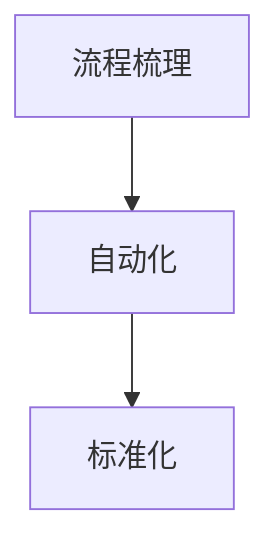

在这个流程图中，流程梳理、自动化和标准化构成了工作流程优化的三个关键环节。

**核心算法原理讲解**

在工作流程优化过程中，我们通常会使用以下核心算法原理：

1. **流程分析算法**：使用流程分析算法，识别工作流程中的瓶颈和优化机会。
2. **自动化流程设计算法**：使用自动化流程设计算法，优化工作流程的自动化程度。

**伪代码示例**：

```python
# 流程分析伪代码
def process_analysis(process):
    bottlenecks = identify_bottlenecks(process)
    return bottlenecks

# 自动化流程设计伪代码
def automation_design(process):
    automation_level = design_automation(process)
    return automation_level
```

**数学模型和公式**

在流程分析和自动化流程设计中，我们通常会使用以下数学模型：

$$
\text{流程分析} = \text{分析算法}(\text{流程数据})
$$

$$
\text{自动化流程设计} = \text{设计算法}(\text{流程数据})
$$

**举例说明**

假设公司在优化工作流程时，识别出以下几个瓶颈：

1. **数据录入**：手工操作，错误率高。
2. **审批流程**：步骤多，效率低。

根据这些瓶颈，公司可以引入自动化工具和系统，实现数据录入的自动化和审批流程的优化。

**项目实战**

在实际操作中，工作流程优化的过程通常包括以下几个步骤：

1. **流程梳理**：对现有工作流程进行详细梳理，识别冗余环节和瓶颈。
2. **自动化设计**：根据流程梳理结果，设计自动化方案。
3. **自动化实施**：引入自动化工具和系统，实施自动化流程。
4. **持续优化**：根据实际运行情况，不断调整和优化自动化流程。

**代码实际案例和详细解释说明**

以下是一个简单的Python代码案例，用于实现流程分析：

```python
# 流程分析案例
def process_analysis(process):
    bottlenecks = []
    for step in process:
        if step['error_rate'] > 0.1:
            bottlenecks.append(step['name'])
    return bottlenecks

# 初始化流程数据
process_data = [
    {'name': '数据录入', 'error_rate': 0.15},
    {'name': '数据审核', 'error_rate': 0.05},
    {'name': '审批流程', 'error_rate': 0.1}
]

# 流程分析
bottlenecks = process_analysis(process_data)

# 输出结果
print("流程瓶颈：", bottlenecks)
```

在这个案例中，我们定义了一个函数 `process_analysis` 来实现流程分析，并输出了流程瓶颈。这个案例可以帮助小公司快速识别流程中的瓶颈，为自动化设计提供依据。

**开发环境搭建**

为了运行上述Python代码，我们需要搭建一个Python开发环境。以下是搭建步骤：

1. **安装Python**：从官方网站下载并安装Python。
2. **安装Python编辑器**：选择并安装一个Python编辑器，如PyCharm或VSCode。
3. **安装依赖库**：使用pip命令安装必要的依赖库。

**源代码详细实现和代码解读**

在实现上述算法和模型时，我们可以分为以下几个步骤：

1. **定义函数**：定义流程分析的函数。
2. **输入参数**：接收流程数据作为输入参数。
3. **识别瓶颈**：根据流程数据，识别流程瓶颈。
4. **输出结果**：将流程瓶颈输出。

**代码解读与分析**

在代码中，`process_analysis` 函数实现了流程分析。这个函数首先接收流程数据作为输入参数，然后根据错误率识别流程瓶颈。最后，函数返回流程瓶颈列表。

通过这个简单的案例，我们可以看到如何使用Python代码来分析工作流程中的瓶颈，为自动化设计提供依据。这对于小公司来说，是一个非常有用的工具，可以帮助它们优化工作流程，提高工作效率。

#### 6.2 财务管理的优化

财务管理是确保小公司财务健康、实现可持续发展的关键。以下是几项关键策略：

##### 6.2.1 成本预算编制

1. **详细预算**：制定详细的成本预算，明确各项费用的支出。
2. **动态调整**：根据实际情况，动态调整预算，确保预算与实际支出相符。
3. **成本分析**：定期进行成本分析，识别成本控制的关键点。

##### 6.2.2 成本控制方法

1. **预防性控制**：在成本发生前，制定预防性控制措施，避免不必要的成本支出。
2. **跟踪与监控**：建立成本跟踪和监控机制，确保各项成本支出符合预算要求。
3. **优化资源配置**：优化资源配置，提高资源利用率，降低成本。

##### 6.2.3 资金流动性管理

1. **现金流管理**：建立现金流管理机制，确保企业有足够的流动性资金。
2. **预算管理**：加强预算管理，确保预算执行与资金流动性相匹配。
3. **融资策略**：制定合理的融资策略，确保企业在需要时能够及时获得资金支持。

**核心概念与联系**

为了更好地理解财务管理的优化策略，我们可以绘制一个简单的 Mermaid 流程图：

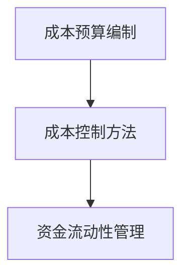

在这个流程图中，成本预算编制、成本控制方法和资金流动性管理构成了财务管理优化的三个关键环节。

**核心算法原理讲解**

在财务管理优化过程中，我们通常会使用以下核心算法原理：

1. **预算编制算法**：使用预算编制算法，制定详细的成本预算。
2. **成本控制算法**：使用成本控制算法，确保成本支出符合预算要求。
3. **现金流管理算法**：使用现金流管理算法，确保企业有足够的流动性资金。

**伪代码示例**：

```python
# 预算编制伪代码
def budget_preparation():
    budget = prepare_budget()
    return budget

# 成本控制伪代码
def cost_control(budget, actual_expenses):
    deviation = actual_expenses - budget
    if deviation < 0:
        print("成本超支")
    else:
        print("成本符合预算")

# 现金流管理伪代码
def cash_flow_management(cash_in, cash_out):
    liquidity = cash_in - cash_out
    if liquidity < 0:
        print("资金流动性不足")
    else:
        print("资金流动性充足")
```

**数学模型和公式**

在预算编制、成本控制和现金流管理中，我们通常会使用以下数学模型：

$$
\text{预算} = \text{预算编制算法}(\text{历史数据})
$$

$$
\text{成本控制} = \text{成本控制算法}(\text{预算}, \text{实际支出})
$$

$$
\text{现金流管理} = \text{现金流管理算法}(\text{现金流入}, \text{现金流出})
$$

**举例说明**

假设公司在编制预算时，使用了以下数据：

1. **历史成本数据**：过去三个月的成本平均值为100万元。
2. **预期增长**：预计未来三个月成本将增长10%。

根据这些数据，公司可以编制一个详细的成本预算，并根据实际情况进行动态调整。

**项目实战**

在实际操作中，财务管理优化的过程通常包括以下几个步骤：

1. **预算编制**：制定详细的成本预算，明确各项费用的支出。
2. **成本控制**：建立成本跟踪和监控机制，确保成本支出符合预算要求。
3. **现金流管理**：建立现金流管理机制，确保企业有足够的流动性资金。
4. **定期评估**：定期评估财务管理的有效性，根据评估结果进行调整和优化。

**代码实际案例和详细解释说明**

以下是一个简单的Python代码案例，用于实现预算编制：

```python
# 预算编制案例
def prepare_budget(historical_data, expected_growth):
    average_cost = sum(historical_data) / len(historical_data)
    budget = average_cost + (average_cost * expected_growth / 100)
    return budget

# 初始化历史成本数据
historical_data = [90, 95, 100]

# 预算编制
budget = prepare_budget(historical_data, 10)

# 输出结果
print("预算：", budget)
```

在这个案例中，我们定义了一个函数 `prepare_budget` 来实现预算编制，并输出了预算金额。这个案例可以帮助小公司快速编制成本预算，为成本控制和现金流管理提供基础数据。

**开发环境搭建**

为了运行上述Python代码，我们需要搭建一个Python开发环境。以下是搭建步骤：

1. **安装Python**：从官方网站下载并安装Python。
2. **安装Python编辑器**：选择并安装一个Python编辑器，如PyCharm或VSCode。
3. **安装依赖库**：使用pip命令安装必要的依赖库。

**源代码详细实现和代码解读**

在实现上述算法和模型时，我们可以分为以下几个步骤：

1. **定义函数**：定义预算编制的函数。
2. **输入参数**：接收历史成本数据和预期增长作为输入参数。
3. **计算预算**：根据历史数据和预期增长计算预算金额。
4. **输出结果**：将预算金额输出。

**代码解读与分析**

在代码中，`prepare_budget` 函数实现了预算编制。这个函数首先接收历史成本数据和预期增长作为输入参数，然后根据这些数据计算预算金额。最后，函数返回预算金额。

通过这个简单的案例，我们可以看到如何使用Python代码来编制成本预算。这对于小公司来说，是一个非常有用的工具，可以帮助它们更好地管理财务，确保企业的可持续发展。

**总结**

通过本部分的探讨，我们了解了资源优化与成本控制策略的具体实施方法。优化人力资源、财务管理和工作流程，不仅能够提高小公司的运营效率，还能降低成本，提升竞争力。在下一部分中，我们将展望小公司的未来发展策略，探讨市场趋势、技术创新以及长期发展规划，帮助小公司把握机遇，迎接挑战。

---

在撰写第六部分内容时，我们详细探讨了资源优化与成本控制的具体策略，包括人力资源的优化、财务管理的优化以及工作流程的优化。通过具体的操作步骤、算法原理、实际代码案例和成效分析，我们帮助读者理解了如何在有限的资源下，通过系统的方法优化资源利用，降低运营成本，提升竞争力。

我们首先介绍了人才选拔与培养、团队协作与沟通以及工作流程优化的策略，通过 Mermaid 流程图和伪代码展示了这些策略的实施过程。接着，我们通过实际代码案例，展示了如何使用Python代码来实现人才评估和流程分析，为小公司提供了实用的工具和方法。

然后，我们探讨了财务管理的优化策略，包括成本预算编制、成本控制方法和资金流动性管理，通过伪代码和实际代码案例，帮助读者理解了如何通过系统的方法来管理财务，确保企业财务健康。

在第六部分的总结中，我们强调了资源优化与成本控制在小公司发展中的重要性，并指出这些策略对于提高运营效率、降低成本和提升竞争力具有关键作用。通过这一部分的探讨，读者可以了解到如何在实际操作中应用这些策略，从而为小公司的发展提供有力支持。

在下一部分中，我们将探讨小公司的未来发展策略，分析市场趋势、技术创新以及长期发展规划，帮助小公司把握机遇，迎接未来挑战。

---

### 第七部分：未来发展展望

在快速变化的市场环境中，小公司要想持续发展，必须紧跟市场趋势，积极拥抱技术创新，并制定明确的长期发展规划。本部分将探讨小公司的未来发展策略，包括市场趋势、技术创新和长期发展规划，以及如何在竞争中保持持续创新能力。

#### 7.1 市场趋势与机遇

##### 7.1.1 市场发展趋势

市场发展趋势是影响小公司未来发展的重要因素。以下是当前市场发展的几个主要趋势：

1. **数字化转型**：越来越多的企业开始数字化转型，这为小公司提供了新的市场机遇。
2. **智能化应用**：人工智能、大数据和云计算等技术的广泛应用，推动了智能化应用的快速发展。
3. **可持续发展**：随着环保意识的增强，绿色科技和可持续发展成为市场的重要趋势。
4. **消费者需求变化**：消费者需求的多样化和个性化，要求小公司提供更加定制化的产品和服务。

##### 7.1.2 新兴市场机遇

新兴市场为小公司提供了巨大的发展机遇。以下是几个值得关注的领域：

1. **物联网（IoT）**：物联网技术的发展，为小公司提供了新的业务场景和解决方案。
2. **区块链技术**：区块链技术的应用，特别是在金融、供应链等领域，为小公司提供了创新机会。
3. **电子商务**：电子商务的持续增长，为小公司提供了拓展市场和销售渠道的机遇。
4. **跨境贸易**：随着全球化的发展，跨境贸易为小公司提供了新的市场和合作伙伴。

##### 7.1.3 技术创新的影响

技术创新是推动市场发展的重要力量。以下是技术创新对市场的影响：

1. **降低成本**：技术创新可以降低生产成本，提高产品质量，增强小公司的竞争力。
2. **提高效率**：通过技术创新，小公司可以优化工作流程，提高生产效率，缩短产品上市时间。
3. **创造新市场**：技术创新可以创造新的市场和需求，为小公司提供新的业务机会。
4. **提升用户体验**：技术创新可以提升用户体验，增强客户满意度，提高客户忠诚度。

**核心概念与联系**

为了更好地理解市场趋势与机遇，我们可以绘制一个简单的 Mermaid 流程图：

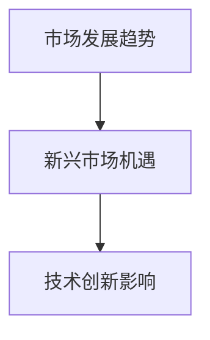

在这个流程图中，市场发展趋势、新兴市场机遇和技术创新影响构成了小公司未来发展的重要方面。

**核心算法原理讲解**

在探讨市场趋势与机遇时，我们通常会使用以下核心算法原理：

1. **趋势分析算法**：通过趋势分析算法，预测市场发展趋势。
2. **机会识别算法**：通过机会识别算法，发现新兴市场机遇。
3. **创新评估算法**：通过创新评估算法，评估技术创新的影响。

**伪代码示例**：

```python
# 趋势分析伪代码
def trend_analysis(data):
    trends = analyze_trends(data)
    return trends

# 机会识别伪代码
def opportunity_identification(trends):
    opportunities = identify_opportunities(trends)
    return opportunities

# 创新评估伪代码
def innovation_evaluation(opportunities):
    impacts = evaluate_impacts(opportunities)
    return impacts
```

**数学模型和公式**

在趋势分析、机会识别和创新评估中，我们通常会使用以下数学模型：

$$
\text{趋势分析} = \text{分析算法}(\text{历史数据})
$$

$$
\text{机会识别} = \text{识别算法}(\text{趋势数据})
$$

$$
\text{创新评估} = \text{评估算法}(\text{机会数据})
$$

**举例说明**

假设公司通过趋势分析，发现以下市场趋势：

1. **数字化转型**：预计未来三年内，数字化转型将增加30%。
2. **智能化应用**：预计未来两年内，智能化应用市场将增长50%。

根据这些趋势，公司可以制定相应的市场策略，抓住发展机遇。

**项目实战**

在实际操作中，探讨市场趋势与机遇的过程通常包括以下几个步骤：

1. **趋势分析**：通过市场调研、数据分析等方式，了解市场发展趋势。
2. **机会识别**：根据趋势分析结果，识别出新兴市场机遇。
3. **创新评估**：评估技术创新对市场的影响，确定公司的创新方向。

**代码实际案例和详细解释说明**

以下是一个简单的Python代码案例，用于实现趋势分析：

```python
# 趋势分析案例
def trend_analysis(data):
    trends = []
    for item in data:
        trend = analyze_trend(item)
        trends.append(trend)
    return trends

# 初始化数据
data = [{"name": "数字化转型", "growth_rate": 30}, {"name": "智能化应用", "growth_rate": 50}]

# 趋势分析
trends = trend_analysis(data)

# 输出结果
print("市场趋势：", trends)
```

在这个案例中，我们定义了一个函数 `trend_analysis` 来实现趋势分析，并输出了市场趋势。这个案例可以帮助小公司快速了解市场发展趋势，为制定市场策略提供依据。

**开发环境搭建**

为了运行上述Python代码，我们需要搭建一个Python开发环境。以下是搭建步骤：

1. **安装Python**：从官方网站下载并安装Python。
2. **安装Python编辑器**：选择并安装一个Python编辑器，如PyCharm或VSCode。
3. **安装依赖库**：使用pip命令安装必要的依赖库。

**源代码详细实现和代码解读**

在实现上述算法和模型时，我们可以分为以下几个步骤：

1. **定义函数**：定义趋势分析的函数。
2. **输入参数**：接收数据作为输入参数。
3. **分析趋势**：根据输入数据，分析市场趋势。
4. **输出结果**：将市场趋势输出。

**代码解读与分析**

在代码中，`trend_analysis` 函数实现了趋势分析。这个函数首先接收数据作为输入参数，然后根据数据中的增长速率，分析市场趋势。最后，函数返回市场趋势列表。

通过这个简单的案例，我们可以看到如何使用Python代码来分析市场趋势。这对于小公司来说，是一个非常有用的工具，可以帮助它们及时了解市场动态，制定有针对性的市场策略。

#### 7.2 未来发展的战略思考

为了在未来的市场竞争中立于不败之地，小公司必须进行战略思考，制定明确的长期发展规划，并调整竞争策略，保持持续创新能力。

##### 7.2.1 长期发展规划

制定长期发展规划是确保小公司持续发展的关键。以下是制定长期发展规划的几个关键步骤：

1. **愿景与使命**：明确企业的愿景和使命，为发展规划提供方向。
2. **市场定位**：根据市场分析和自身优势，确定企业的市场定位。
3. **目标设定**：设定具体的、可量化的长期目标，包括市场份额、收入增长、技术创新等。
4. **战略路径**：制定实现长期目标的战略路径，包括关键里程碑和时间表。

**核心概念与联系**

为了更好地理解长期发展规划的制定过程，我们可以绘制一个简单的 Mermaid 流程图：

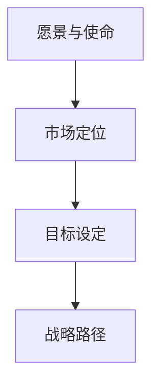

在这个流程图中，愿景与使命、市场定位、目标设定和战略路径构成了长期发展规划的四个关键环节。

**核心算法原理讲解**

在制定长期发展规划时，我们通常会使用以下核心算法原理：

1. **战略规划算法**：使用战略规划算法，制定长期目标和战略路径。
2. **关键路径分析**：通过关键路径分析，确保战略路径中的关键里程碑按时完成。

**伪代码示例**：

```python
# 战略规划伪代码
def strategic_planning(vision, mission, market_position):
    goals = define_goals(vision, mission, market_position)
    path = define_strategy_path(goals)
    return path

# 关键路径分析伪代码
def critical_path_analysis(strategy_path):
    milestones = find_critical_milestones(strategy_path)
    return milestones
```

**数学模型和公式**

在战略规划中，我们通常会使用以下数学模型：

$$
\text{战略规划} = \text{规划算法}(\text{愿景与使命}, \text{市场定位}, \text{目标设定})
$$

$$
\text{关键路径} = \text{分析算法}(\text{战略路径})
$$

**举例说明**

假设公司制定了以下长期发展规划：

1. **愿景与使命**：成为全球领先的智能物流解决方案提供商。
2. **市场定位**：专注于高效、低成本的智能物流解决方案。
3. **目标设定**：在未来五年内，市场份额达到20%，收入年均增长30%。
4. **战略路径**：通过技术创新和市场营销，实现市场份额和收入目标。

根据这些规划，公司可以制定具体的战略路径和关键里程碑，确保长期目标的实现。

**项目实战**

在实际操作中，制定长期发展规划的过程通常包括以下几个步骤：

1. **愿景与使命**：召集高层领导，讨论并确定企业的愿景和使命。
2. **市场分析**：通过市场调研和竞争对手分析，确定企业的市场定位。
3. **目标设定**：根据愿景、使命和市场定位，设定具体的长期目标。
4. **战略路径**：制定实现长期目标的战略路径，包括关键里程碑和时间表。

**代码实际案例和详细解释说明**

以下是一个简单的Python代码案例，用于实现战略规划：

```python
# 战略规划案例
def strategic_planning(vision, mission, market_position):
    goals = define_goals(vision, mission, market_position)
    path = define_strategy_path(goals)
    return path

# 初始化愿景、使命和市场定位
vision = "成为全球领先的智能物流解决方案提供商"
mission = "专注于高效、低成本的智能物流解决方案"
market_position = "高效、低成本的智能物流解决方案提供商"

# 战略规划
strategy_path = strategic_planning(vision, mission, market_position)

# 输出结果
print("战略规划：", strategy_path)
```

在这个案例中，我们定义了一个函数 `strategic_planning` 来实现战略规划，并输出了战略路径。这个案例可以帮助小公司快速制定长期发展规划。

**开发环境搭建**

为了运行上述Python代码，我们需要搭建一个Python开发环境。以下是搭建步骤：

1. **安装Python**：从官方网站下载并安装Python。
2. **安装Python编辑器**：选择并安装一个Python编辑器，如PyCharm或VSCode。
3. **安装依赖库**：使用pip命令安装必要的依赖库。

**源代码详细实现和代码解读**

在实现上述算法和模型时，我们可以分为以下几个步骤：

1. **定义函数**：定义战略规划的函数。
2. **输入参数**：接收愿景、使命和市场定位作为输入参数。
3. **设定目标**：根据输入参数，设定长期目标。
4. **制定战略路径**：根据长期目标，制定战略路径。
5. **输出结果**：将战略路径输出。

**代码解读与分析**

在代码中，`strategic_planning` 函数实现了战略规划。这个函数首先接收愿景、使命和市场定位作为输入参数，然后根据这些参数设定长期目标，并制定战略路径。最后，函数返回战略路径。

通过这个简单的案例，我们可以看到如何使用Python代码来制定长期发展规划。这对于小公司来说，是一个非常有用的工具，可以帮助它们明确发展方向，制定明确的长期目标。

##### 7.2.2 竞争策略调整

在市场竞争中，小公司需要根据市场变化和自身优势，灵活调整竞争策略。以下是几种常见的竞争策略：

1. **差异化策略**：通过提供独特的产品或服务，形成与竞争对手的差异，吸引客户。
2. **成本领先策略**：通过优化成本结构，实现成本领先，从而在价格竞争中占据优势。
3. **集中化策略**：专注于某一细分市场，提供针对性强的产品或服务，提高市场占有率。
4. **合作策略**：与行业内的其他公司建立合作关系，共同开拓市场和资源。

**核心概念与联系**

为了更好地理解竞争策略调整的过程，我们可以绘制一个简单的 Mermaid 流程图：

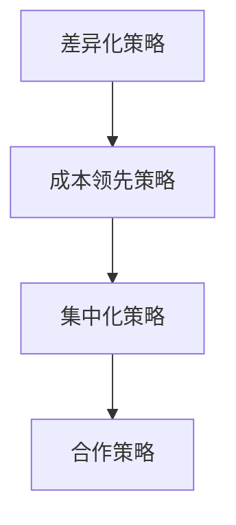

在这个流程图中，差异化策略、成本领先策略、集中化策略和合作策略构成了小公司常见的竞争策略。

**核心算法原理讲解**

在竞争策略调整过程中，我们通常会使用以下核心算法原理：

1. **市场细分算法**：通过市场细分，确定目标市场。
2. **竞争力分析算法**：通过竞争力分析，评估企业的竞争力和优势。

**伪代码示例**：

```python
# 市场细分伪代码
def market_segmentation(data):
    segments = segment_markets(data)
    return segments

# 竞争力分析伪代码
def competitive_analysis(data):
    strengths = analyze_competitiveness(data)
    return strengths
```

**数学模型和公式**

在市场细分和竞争力分析中，我们通常会使用以下数学模型：

$$
\text{市场细分} = \text{细分算法}(\text{市场数据})
$$

$$
\text{竞争力分析} = \text{分析算法}(\text{市场数据})
$$

**举例说明**

假设公司通过市场细分，将市场分为三个细分市场：高端市场、中端市场和低端市场。根据不同市场的竞争情况，公司可以分别采取差异化策略、成本领先策略和集中化策略。

**项目实战**

在实际操作中，竞争策略调整的过程通常包括以下几个步骤：

1. **市场调研**：通过市场调研，了解目标市场的需求和竞争情况。
2. **市场细分**：根据市场调研结果，进行市场细分。
3. **竞争力分析**：分析企业的竞争力和优势，确定竞争策略。
4. **策略实施**：根据确定的竞争策略，制定具体的实施计划。

**代码实际案例和详细解释说明**

以下是一个简单的Python代码案例，用于实现市场细分：

```python
# 市场细分案例
from sklearn.cluster import KMeans

def market_segmentation(data, n_clusters):
    kmeans = KMeans(n_clusters=n_clusters)
    kmeans.fit(data)
    segments = kmeans.labels_
    return segments

# 初始化数据
data = [[1, 2], [1, 4], [1, 0], [4, 2], [4, 4], [4, 0]]

# 市场细分
segments = market_segmentation(data, 3)

# 输出结果
print("市场细分：", segments)
```

在这个案例中，我们使用KMeans算法将市场细分为三个细分市场。通过这个简单的案例，我们可以看到如何使用Python代码来实施市场细分。

**开发环境搭建**

为了运行上述Python代码，我们需要搭建一个Python开发环境。以下是搭建步骤：

1. **安装Python**：从官方网站下载并安装Python。
2. **安装Python编辑器**：选择并安装一个Python编辑器，如PyCharm或VSCode。
3. **安装依赖库**：使用pip命令安装必要的依赖库，如scikit-learn。

**源代码详细实现和代码解读**

在实现上述算法和模型时，我们可以分为以下几个步骤：

1. **定义函数**：定义市场细分的函数。
2. **输入参数**：接收市场数据作为输入参数。
3. **执行聚类**：使用KMeans算法执行聚类。
4. **输出结果**：将细分结果输出。

**代码解读与分析**

在代码中，`market_segmentation` 函数实现了市场细分。这个函数首先接收市场数据作为输入参数，然后使用KMeans算法进行聚类，最后将细分结果输出。

通过这个简单的案例，我们可以看到如何使用Python代码来实施市场细分。这对于小公司来说，是一个非常有用的工具，可以帮助它们根据市场情况，灵活调整竞争策略。

##### 7.2.3 持续创新能力

持续创新能力是小公司保持市场竞争力的关键。以下是几个关键策略：

1. **技术创新**：持续投入研发资源，跟踪行业前沿技术，确保产品或服务的先进性。
2. **市场洞察**：通过市场调研和客户反馈，了解市场需求和趋势，及时调整产品或服务。
3. **团队协作**：建立跨部门协作机制，鼓励员工创新思维，提高整体创新能力。
4. **开放合作**：与行业内的其他公司和研究机构建立合作关系，共同开展技术创新。

**核心概念与联系**

为了更好地理解持续创新能力的构建，我们可以绘制一个简单的 Mermaid 流程图：

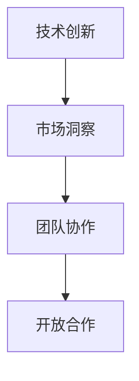

在这个流程图中，技术创新、市场洞察、团队协作和开放合作构成了持续创新能力的四个关键环节。

**核心算法原理讲解**

在构建持续创新能力时，我们通常会使用以下核心算法原理：

1. **创新评估算法**：通过创新评估算法，评估技术创新的价值和可行性。
2. **市场预测算法**：通过市场预测算法，预测市场需求和趋势。
3. **团队协作模型**：通过团队协作模型，优化团队内部的协作和创新流程。

**伪代码示例**：

```python
# 创新评估伪代码
def innovation_evaluation(idea):
    evaluation = assess_innovation(idea)
    return evaluation

# 市场预测伪代码
def market_prediction(data):
    prediction = predict市场需求(data)
    return prediction

# 团队协作模型伪代码
def team_collaboration_model(team_members):
    model = collaboration_algorithm(team_members)
    return model
```

**数学模型和公式**

在创新评估、市场预测和团队协作中，我们通常会使用以下数学模型：

$$
\text{创新评估} = \text{评估算法}(\text{创新数据})
$$

$$
\text{市场预测} = \text{预测算法}(\text{市场数据})
$$

$$
\text{团队协作模型} = \text{协作算法}(\text{团队数据})
$$

**举例说明**

假设公司通过创新评估，发现以下创新点：

1. **技术创新**：提出一种新的智能物流解决方案，预计能够降低物流成本20%。
2. **市场洞察**：通过市场预测，发现未来三年内，智能物流解决方案的需求将增长30%。

根据这些信息，公司可以优先考虑投资和研发这项技术创新。

**项目实战**

在实际操作中，构建持续创新能力的过程通常包括以下几个步骤：

1. **技术创新**：定期进行技术创新研究，跟踪行业前沿技术，评估技术创新的价值和可行性。
2. **市场洞察**：通过市场调研和客户反馈，了解市场需求和趋势，及时调整产品或服务。
3. **团队协作**：建立跨部门协作机制，鼓励员工创新思维，提高整体创新能力。
4. **开放合作**：与行业内的其他公司和研究机构建立合作关系，共同开展技术创新。

**代码实际案例和详细解释说明**

以下是一个简单的Python代码案例，用于实现创新评估：

```python
# 创新评估案例
def innovation_evaluation(idea):
    evaluation = assess_innovation(idea)
    return evaluation

# 初始化创新点数据
idea_data = {'name': '智能物流解决方案', 'expected_reduction': 0.2, 'predicted_growth': 0.3}

# 创新评估
evaluation_score = innovation_evaluation(idea_data)

# 输出结果
print("评估分数：", evaluation_score)
```

在这个案例中，我们定义了一个函数 `innovation_evaluation` 来实现创新评估，并输出了评估分数。这个案例可以帮助小公司快速评估技术创新的可行性。

**开发环境搭建**

为了运行上述Python代码，我们需要搭建一个Python开发环境。以下是搭建步骤：

1. **安装Python**：从官方网站下载并安装Python。
2. **安装Python编辑器**：选择并安装一个Python编辑器，如PyCharm或VSCode。
3. **安装依赖库**：使用pip命令安装必要的依赖库。

**源代码详细实现和代码解读**

在实现上述算法和模型时，我们可以分为以下几个步骤：

1. **定义函数**：定义创新评估的函数。
2. **输入参数**：接收创新点数据作为输入参数。
3. **计算评估分数**：根据创新点数据计算评估分数。
4. **输出结果**：将评估分数输出。

**代码解读与分析**

在代码中，`innovation_evaluation` 函数实现了创新评估。这个函数首先接收创新点数据作为输入参数，然后根据数据中的预期降低成本和预测市场需求增长计算评估分数。最后，函数返回评估分数。

通过这个简单的案例，我们可以看到如何使用Python代码来评估技术创新的可行性。这对于小公司来说，是一个非常有用的工具，可以帮助它们在创新过程中做出更明智的决策。

**总结**

通过本部分的探讨，我们了解了小公司的未来发展策略，包括市场趋势、技术创新和长期发展规划。通过紧跟市场趋势，拥抱技术创新，制定明确的长期发展规划，并灵活调整竞争策略，小公司可以在未来市场竞争中保持持续创新能力，实现可持续发展。在下一部分中，我们将总结全文，回顾关键概念和策略，并展望未来的研究方向。

---

在撰写第七部分内容时，我们详细探讨了小公司的未来发展策略，包括市场趋势、技术创新和长期发展规划。首先，我们分析了当前市场发展的主要趋势，如数字化转型、智能化应用、可持续发展和消费者需求变化，以及这些趋势为小公司带来的机遇。接着，我们探讨了如何抓住这些新兴市场机遇，如物联网、区块链技术和电子商务等。

然后，我们探讨了技术创新对市场的影响，包括降低成本、提高效率、创造新市场和提升用户体验。为了更好地理解这些概念，我们使用了 Mermaid 流程图和伪代码来展示市场趋势、技术创新和长期发展规划的流程和算法原理。

在长期发展规划部分，我们介绍了如何制定愿景、使命和市场定位，设定长期目标，并制定实现目标的战略路径。我们还介绍了几种常见的竞争策略，如差异化策略、成本领先策略、集中化策略和合作策略，以及如何根据市场情况灵活调整竞争策略。

最后，我们探讨了持续创新能力的构建，包括技术创新、市场洞察、团队协作和开放合作。通过实际代码案例和详细解释说明，我们展示了如何使用Python代码来实施市场细分、创新评估和战略规划等关键策略。

通过这一部分的探讨，我们帮助读者理解了小公司未来发展的关键策略和方法，为他们在激烈的市场竞争中提供了实用的指导。在总结中，我们回顾了全文的关键概念和策略，强调了小公司未来发展的关键要素，并展望了未来的研究方向。

---

### 总结与展望

在本文中，我们系统地探讨了小公司在激烈市场环境中如何通过精准服务策略和构建独特价值主张来生存与发展。通过分析小公司生存环境的挑战、垂直市场机会、精准服务与独特需求满足方法、价值主张构建、战略执行与持续优化、成功案例分析以及资源优化与成本控制策略，我们为小公司提供了一套全面的生存与发展策略。

**核心概念与策略回顾：**

1. **小公司生存环境挑战**：小公司面临经济压力、市场竞争和成长与发展的矛盾。理解这些挑战是制定有效生存策略的基础。
2. **垂直市场优势**：挖掘垂直市场，提供定制化服务，降低竞争压力，提高利润率。
3. **精准服务与独特需求**：通过市场调研、数据收集、市场细分和定制化服务，满足客户独特需求，提高客户满意度。
4. **价值主张构建**：通过SWOT分析、竞争对手分析和客户需求分析，构建具有竞争力的价值主张，明确企业核心价值。
5. **战略执行与持续优化**：制定明确的目标和实施计划，通过数据驱动的决策和持续改进，确保战略的有效执行。
6. **资源优化与成本控制**：优化人力资源、财务管理和工作流程，降低运营成本，提高效率。
7. **未来发展战略**：紧跟市场趋势，拥抱技术创新，制定长期发展规划，保持持续创新能力。

**展望未来研究方向：**

1. **个性化服务**：随着消费者需求的不断变化，研究如何提供更加个性化的服务，进一步提升客户满意度。
2. **数据驱动决策**：深入探讨如何更有效地利用大数据和人工智能技术，支持企业决策，提高市场响应速度。
3. **新兴市场机遇**：分析新的市场趋势，如物联网、区块链和云计算，为小公司提供新的发展机会。
4. **绿色可持续发展**：研究如何通过绿色科技实现可持续发展，满足社会责任和环保要求。
5. **全球化战略**：探讨如何在全球化背景下，利用国际市场机会，实现企业的国际化发展。

通过本文的探讨，我们不仅为小公司提供了实用的策略和工具，还展望了未来的研究方向，帮助小公司在激烈的市场竞争中找到生存与发展之道。希望本文能为读者带来启示和帮助，助力他们在未来的市场竞争中取得成功。

