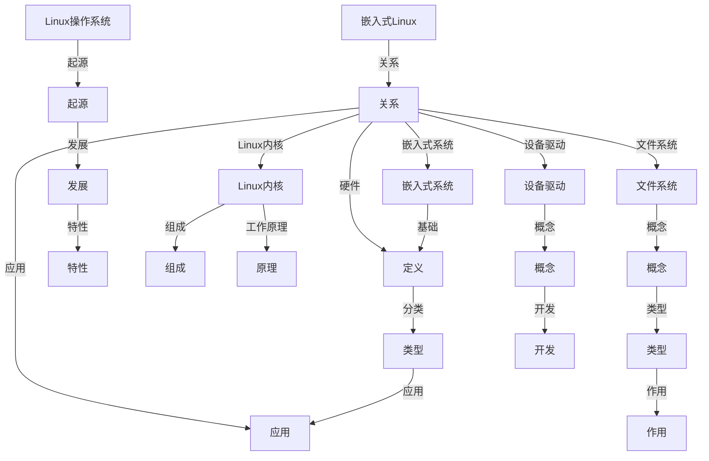

                 

### 引言

随着科技的飞速发展，嵌入式系统在各个领域得到了广泛的应用。从简单的消费电子设备到复杂的工业控制系统，嵌入式系统无处不在。而作为嵌入式系统的重要组成部分，操作系统扮演着至关重要的角色。在这其中，Linux操作系统以其开源、可定制性强、硬件兼容性好等优点，成为了嵌入式系统开发者的首选。尤其是嵌入式Linux，它在资源有限、对性能要求较高的嵌入式系统中展现出了极大的优势。

然而，嵌入式Linux的开发并不是一件简单的事情。开发者不仅需要熟悉Linux内核的工作原理，还需要具备一定的编程技能，才能实现高效的嵌入式系统开发。本文旨在为广大嵌入式Linux开发者提供一份详细的技术指南，帮助大家从基础到实践，全面了解嵌入式Linux系统的构建过程。

本文将分为四个主要部分：

1. **嵌入式Linux基础**：介绍嵌入式Linux的基本概念、历史与发展、系统架构以及硬件需求。
2. **嵌入式Linux开发环境**：讲解如何搭建嵌入式Linux开发环境，包括开发工具的选择、虚拟化技术、编译器选择与使用、内核编译等。
3. **嵌入式Linux应用开发**：介绍嵌入式Linux编程基础、设备驱动开发、系统安全以及定制化操作系统的构建。
4. **项目实战**：通过一个实际的嵌入式Linux系统构建项目，展示从需求分析、系统设计、开发与测试到系统部署与维护的全过程。

希望通过本文的阅读，读者能够对嵌入式Linux系统有一个全面而深入的理解，从而在未来的开发工作中更加得心应手。

### 嵌入式Linux核心概念与联系

要深入理解嵌入式Linux系统，首先需要明确几个核心概念：嵌入式系统、Linux操作系统、Linux内核、文件系统等。下面，我们将通过一个Mermaid流程图，对这些概念进行梳理，并展示它们之间的联系。



1. **嵌入式系统（A）**：是指嵌入在其他设备中的计算机系统，通常具备特定的功能，且资源有限。它分为多种类型，如消费类、工业控制类、网络设备类等，应用非常广泛。

2. **Linux操作系统（E）**：起源于1991年，由Linus Torvalds创建。它是一种开源、免费、多用户、多任务操作的操作系统，具有稳定性高、灵活性强的特点。

3. **Linux内核（I）**：是Linux操作系统的核心部分，负责管理和控制硬件资源，包括进程管理、内存管理、文件系统管理、设备管理等。内核的工作原理决定了操作系统的性能和稳定性。

4. **文件系统（L）**：是操作系统用于存储和访问文件的一种机制。文件系统有多种类型，如EXT4、JFFS2、YAFFS2等，每种文件系统都有其独特的特点和适用场景。

5. **设备驱动（P）**：是操作系统用于与硬件设备通信的软件模块。设备驱动负责将通用的操作系统接口映射到具体的硬件设备上，使得操作系统可以控制和管理这些设备。

6. **嵌入式Linux（S）**：是结合了嵌入式系统和Linux内核的操作系统。它充分利用了Linux的优点，同时针对嵌入式系统的特点进行了优化，非常适合用于嵌入式设备。

通过这个流程图，我们可以清晰地看到各个概念之间的联系。嵌入式Linux系统通过内核、文件系统和设备驱动等组件，实现了对嵌入式设备的全面控制和管理。每个组件都有其特定的功能和作用，但它们又是相互依赖、相互协作的，共同构成了嵌入式Linux系统的整体。

### 嵌入式Linux核心算法原理讲解

在嵌入式Linux系统中，许多关键功能都是通过算法实现的。以下是几个核心算法的伪代码和详细解释。

#### 1. 进程调度算法

进程调度是嵌入式Linux内核的重要功能之一。它决定了进程在处理器上的执行顺序。以下是一个简单的进程调度算法的伪代码：

```plaintext
// 伪代码：进程调度算法
function schedule()
    while (true) {
        // 检查是否有更高优先级的进程
        highest_priority_process = find_highest_priority_process()

        if (highest_priority_process != current_process) {
            // 交换当前进程和最高优先级进程
            swap_processes(highest_priority_process)
            current_process = highest_priority_process
        }

        // 执行当前进程
        execute(current_process)

        // 当前进程结束或阻塞，重新调度
        if (current_process.is_finished() || current_process.is_blocked()) {
            schedule()
        }
    }
```

**详细解释**：该算法基于优先级调度策略。内核维护一个进程优先级队列，每次调度时选择队列中优先级最高的进程执行。如果当前进程执行完毕或者因为某些原因（如等待I/O操作）而被阻塞，则重新调度。这种调度算法可以保证高优先级进程尽快得到执行，提高了系统的响应速度。

#### 2. 内存分配算法

内存分配是操作系统的重要功能，嵌入式Linux内核使用的是分页内存管理机制。以下是一个简单的内存分配算法的伪代码：

```plaintext
// 伪代码：内存分配算法
function allocate_memory(size)
    // 在内存池中寻找足够大的空闲内存块
    free_memory_block = find_free_memory_block(size)

    if (free_memory_block == null) {
        return null
    }

    // 从空闲内存块中分配所需大小的内存
    allocated_memory = free_memory_block.allocate(size)

    // 更新内存池信息
    update_memory_pool()

    return allocated_memory
```

**详细解释**：该算法首先在内存池中寻找一个足够大的空闲内存块。如果找到，则从该内存块中分配所需大小的内存，并将剩余的部分重新标记为空闲内存。如果找不到合适的空闲内存块，则返回null，表示内存分配失败。内存池信息的更新是必要的，以便下次内存分配时能够正确查找空闲内存。

#### 3. 文件系统缓存算法

文件系统缓存算法用于优化文件系统的性能。以下是一个简单的缓存算法的伪代码：

```plaintext
// 伪代码：文件系统缓存算法
function cache_file_data(file, data)
    // 在缓存中查找文件数据
    cached_data = find_cached_data(file)

    if (cached_data != null) {
        // 如果已缓存，直接返回缓存数据
        return cached_data
    }

    // 如果未缓存，从文件中读取数据并缓存
    data = read_data_from_file(file)
    cache_data(file, data)

    return data
```

**详细解释**：该算法首先在缓存中查找指定文件的数据。如果找到，则直接返回缓存数据，避免了重复从文件系统中读取。如果未找到，则从文件中读取数据，并将其缓存起来，以便下次访问时能够更快地获取。这种缓存机制可以显著提高文件系统的访问速度。

#### 4. 网络协议栈算法

网络协议栈是嵌入式Linux系统的重要组成部分，用于实现网络通信。以下是一个简单的网络协议栈算法的伪代码：

```plaintext
// 伪代码：网络协议栈算法
function send_packet(packet)
    // 将数据包发送到网络设备
    send_to_network_device(packet)

    // 如果发送成功，更新路由表和流量统计信息
    update_routing_table()
    update_traffic_statistics()

    // 如果网络状态发生变化，重新计算路由
    if (network_state_changed()) {
        recalculate_routing()
    }
```

**详细解释**：该算法首先将数据包发送到网络设备。如果发送成功，则更新路由表和流量统计信息。如果网络状态发生变化（如网络连接中断），则重新计算路由，以确保数据包能够正确地到达目的地。

通过上述伪代码和详细解释，我们可以看到嵌入式Linux系统中的核心算法是如何工作的。这些算法不仅保证了系统的性能和稳定性，还为开发者提供了丰富的功能。在实际应用中，这些算法可能会更加复杂，但基本原理是相同的。

### 数学模型和公式

在嵌入式Linux系统中，数学模型和公式经常用于描述和优化系统性能。以下是一些常用的数学模型和公式的详细讲解。

#### 1. 过程模型

过程模型是描述进程行为的数学模型。在嵌入式Linux系统中，进程通常按照以下公式进行调度：

\[ \text{CPU利用率} = \frac{\text{CPU工作时间}}{\text{总时间}} \]

该公式用于计算CPU的利用率，反映了系统资源被利用的程度。在实际应用中，CPU利用率可以通过以下步骤进行计算：

```latex
CPU利用率 = \frac{\text{CPU工作时间}}{\text{总时间}} \times 100\%
```

#### 2. 缓存命中率

缓存命中率是衡量缓存性能的重要指标，表示缓存成功访问的比例。在嵌入式Linux系统中，缓存命中率可以通过以下公式计算：

\[ \text{缓存命中率} = \frac{\text{缓存访问次数中成功的次数}}{\text{缓存访问次数}} \]

缓存命中率的计算步骤如下：

```latex
缓存命中率 = \frac{\text{缓存访问次数中成功的次数}}{\text{缓存访问次数}} \times 100\%
```

#### 3. 传输速率

传输速率是网络通信中的关键指标，表示数据传输的速度。在嵌入式Linux系统中，传输速率可以通过以下公式计算：

\[ \text{传输速率} = \frac{\text{传输数据量}}{\text{传输时间}} \]

传输速率的计算步骤如下：

```latex
传输速率 = \frac{\text{传输数据量}}{\text{传输时间}} \times 10^6 \text{字节/秒}
```

#### 4. 内核性能评估

内核性能评估是评估操作系统内核性能的数学模型。在嵌入式Linux系统中，内核性能可以通过以下公式进行计算：

\[ \text{内核性能} = \frac{\text{系统吞吐量}}{\text{系统开销}} \]

内核性能的计算步骤如下：

```latex
内核性能 = \frac{\text{系统吞吐量}}{\text{系统开销}} \times 100\%
```

通过上述数学模型和公式的讲解，我们可以更好地理解和优化嵌入式Linux系统的性能。这些模型和公式为系统性能分析提供了理论基础，有助于开发者在实际开发过程中进行性能优化。

### 嵌入式Linux项目实战：开发环境搭建

在开始嵌入式Linux项目的开发之前，搭建一个合适的开发环境是非常重要的一步。这不仅有助于提高开发效率，还可以减少因环境问题导致的开发难题。本文将详细介绍如何在不同的操作系统上搭建嵌入式Linux开发环境，包括所需工具的选择、配置步骤以及常见问题的解决方案。

#### 1. 开发工具的选择

选择合适的开发工具是搭建嵌入式Linux开发环境的关键。以下是一些常用的工具：

- **交叉编译工具链**：交叉编译工具链用于在宿主机上编译嵌入式目标机的程序。常见的交叉编译工具链包括`gcc-arm-none-eabi`、`gcc-arm-linux-gnueabi`等。
- **虚拟化技术**：虚拟化技术可以帮助我们在宿主机上模拟嵌入式目标机的硬件环境，常用的虚拟化工具包括`QEMU`和`Docker`。
- **集成开发环境（IDE）**：集成开发环境可以提供代码编写、编译、调试等功能，常用的IDE包括`Eclipse`、`GNOME Builder`等。
- **版本控制工具**：版本控制工具用于管理代码版本，常用的版本控制工具包括`Git`。

#### 2. 环境配置步骤

以下是在不同操作系统上搭建嵌入式Linux开发环境的详细步骤：

##### Windows系统

1. **安装交叉编译工具链**：
   - 在Windows上，可以通过`MinGW`安装gcc-arm-none-eabi工具链。
   - 下载并安装`MinGW`，在安装过程中选择`gcc-arm-none-eabi`工具链。
   - 安装完成后，在环境变量中添加MinGW的路径。

2. **安装虚拟化工具**：
   - 安装`QEMU`，可以从官方网站下载并安装。
   - 在安装过程中，选择安装QEMU的交叉编译工具链支持。

3. **安装IDE**：
   - 安装`Eclipse`或`GNOME Builder`，这些IDE都支持嵌入式Linux开发。

4. **配置版本控制工具**：
   - 安装`Git`，可以从官方网站下载并安装。

##### macOS系统

1. **安装交叉编译工具链**：
   - 使用`Homebrew`安装gcc-arm-none-eabi工具链。
   - 打开终端，运行以下命令：
     ```bash
     brew install gcc-arm-none-eabi
     ```

2. **安装虚拟化工具**：
   - 安装`QEMU`，可以通过Homebrew安装：
     ```bash
     brew install qemu
     ```

3. **安装IDE**：
   - 安装`Eclipse`或`GNOME Builder`。

4. **配置版本控制工具**：
   - 安装`Git`，可以通过Homebrew安装：
     ```bash
     brew install git
     ```

##### Linux系统

1. **安装交叉编译工具链**：
   - 在Linux系统上，可以直接通过包管理器安装gcc-arm-none-eabi工具链。
   - 例如，在基于Debian的系统上，可以使用以下命令：
     ```bash
     sudo apt-get install gcc-arm-none-eabi
     ```

2. **安装虚拟化工具**：
   - 安装`QEMU`，可以使用以下命令：
     ```bash
     sudo apt-get install qemu
     ```

3. **安装IDE**：
   - 安装`Eclipse`或`GNOME Builder`。

4. **配置版本控制工具**：
   - 安装`Git`，可以使用以下命令：
     ```bash
     sudo apt-get install git
     ```

#### 3. 常见问题的解决方案

在搭建嵌入式Linux开发环境时，可能会遇到一些问题。以下是一些常见问题的解决方案：

- **工具链路径问题**：
  - 如果在编译时遇到工具链路径问题，可以通过以下命令查看工具链的路径：
    ```bash
    which gcc-arm-none-eabi
    ```
  - 确保环境变量中包含了工具链的路径。

- **虚拟机内存不足**：
  - 如果虚拟机内存不足，可以尝试增加虚拟机的内存配置。

- **网络连接问题**：
  - 如果网络连接出现问题，可以尝试重启网络服务或检查网络配置。

- **版本控制问题**：
  - 如果遇到版本控制问题，可以尝试重新安装Git或检查Git的配置。

通过以上步骤，我们可以在不同操作系统上搭建一个完整的嵌入式Linux开发环境。这个环境将为我们后续的项目开发提供坚实的基础。

### 嵌入式Linux内核源代码阅读指南

阅读嵌入式Linux内核源代码是深入了解内核工作原理和进行内核定制的关键步骤。以下是关于如何阅读和理解嵌入式Linux内核源代码的详细指南。

#### B.1 内核源代码结构

Linux内核源代码目录结构复杂，但组织得相当清晰。以下是内核源代码的主要目录结构及其作用：

- `/Documentation/`：文档目录，包含内核文档、指南和示例代码。
- `/arch/`：架构目录，包含与特定处理器架构相关的代码，如`arm/`、`x86/`等。
- `/block/`：块设备驱动代码，管理块设备的I/O操作。
- `/fs/`：文件系统代码，包括EXT4、JFFS2等文件系统的实现。
- `/include/`：头文件目录，包含内核通用的头文件。
- `/kernel/`：内核核心代码，包括进程管理、内存管理、调度器等。
- `/drivers/`：设备驱动代码，包括字符设备、网络设备、USB设备等驱动。
- `/net/`：网络协议栈代码，包括TCP/IP协议栈的实现。

#### B.2 内核编译过程

编译Linux内核是构建嵌入式Linux系统的关键步骤。以下是内核编译过程的详细说明：

1. **获取内核源码**：
   - 从Linux内核官网（https://www.kernel.org/）下载最新的内核源码。
   - 使用`git`命令克隆源码仓库：
     ```bash
     git clone https://git.kernel.org/pub/scm/linux/kernel/git/torvalds/linux.git
     ```

2. **配置内核**：
   - 进入内核源码目录，使用`make`命令生成配置文件：
     ```bash
     make ARCH=arm menuconfig
     ```
   - 在`menuconfig`界面中配置内核选项，如选择支持的处理器架构、文件系统等。

3. **编译内核**：
   - 使用`make`命令编译内核：
     ```bash
     make ARCH=arm
     ```
   - 编译完成后，内核二进制文件`vmlinux`将位于`arch/arm/boot/`目录下。

4. **生成引导加载程序**：
   - 使用`mkimage`工具生成引导加载程序（如U-Boot）所需的内核映像文件：
     ```bash
     mkimage -A arm -O linux -T kernel -C none -a 0x00008000 -e 0x00008000 -n "Linux Kernel" -d arch/arm/boot/vmlinux boot.img
     ```

5. **安装内核**：
   - 将生成的内核映像文件`boot.img`复制到目标设备或虚拟机中。

#### B.3 内核调试方法

调试内核是发现和解决问题的重要手段。以下是几种常用的内核调试方法：

1. **使用KGDB**：
   - KGDB是一种用于调试Linux内核的GDB扩展。
   - 在内核编译时启用KGDB支持，并配置内核参数：
     ```bash
     make ARCH=arm oldconfig
     make ARCH=arm menusconfig
     ```
   - 在`Kernel Hacking`菜单中，选择`GDB remote debugging interface`并启用。
   - 在目标设备上启动KGDB服务，并使用GDB连接：
     ```bash
     gdb
     ```
     ```bash
     (gdb) target remote <目标设备的IP地址>:1234
     ```

2. **使用KPROBES**：
   - KPROBES是Linux内核提供的动态探针机制，可用于实时监控内核行为。
   - 使用`kprobes`工具添加探针点：
     ```bash
     echo 'kprobe_event __x64_start_handler' > /sys/kernel/debug/tracing/kprobe_events
     ```

3. **使用FTRACE**：
   - FTRACE（Function Tracing）是一种用于跟踪内核函数调用的机制。
   - 使用`ftrace`工具配置跟踪点：
     ```bash
     echo 'function' > /sys/kernel/debug/tracing/tracing_on
     ```

通过以上指南，开发者可以更好地阅读和理解嵌入式Linux内核源代码，并有效地进行内核调试。这为深入挖掘内核性能和定制化内核提供了强有力的支持。

### 嵌入式Linux系统安全

在嵌入式Linux系统中，安全性是一个不可忽视的重要方面。由于嵌入式系统通常在特定的环境中运行，其资源有限，且应用场景多样，因此，安全措施需要根据具体需求进行定制。本文将详细探讨嵌入式Linux系统的安全机制，包括用户空间和内核空间的安全措施，以及系统更新与安全加固的策略。

#### 7.1 嵌入式系统安全概述

**7.1.1 安全重要性**

嵌入式系统广泛应用于工业控制、医疗设备、交通系统、智能家居等领域。这些系统往往承担着重要的任务，一旦遭受攻击或出现安全漏洞，可能导致严重后果。例如，工业控制系统遭受攻击可能导致设备停机，医疗设备的安全问题可能危及患者生命，智能家居系统的安全漏洞可能被用于非法入侵。

因此，确保嵌入式系统的安全性至关重要。安全性不仅能够保护系统免受攻击，还能够确保数据的机密性、完整性和可用性。

**7.1.2 安全挑战**

嵌入式系统面临以下几类安全挑战：

- **资源受限**：嵌入式系统通常具有有限的计算资源，包括内存、处理能力和存储空间。这限制了可以部署的安全机制的数量和复杂性。
- **开发难度大**：嵌入式系统开发涉及到硬件和软件的紧密耦合，安全性需求需要从设计阶段就考虑进去，增加了开发的复杂性。
- **系统复杂度高**：嵌入式系统通常包含多个硬件组件和软件模块，这些组件和模块之间需要协同工作，增加了系统安全管理的难度。

**7.1.3 安全漏洞的影响**

安全漏洞可能导致以下几种影响：

- **数据泄露**：恶意攻击者可以通过漏洞获取敏感数据，如用户信息、医疗记录等。
- **系统崩溃**：某些安全漏洞可能导致系统崩溃或停止运行，影响关键任务的执行。
- **设备失控**：对于工业控制系统，安全漏洞可能导致设备失控，引发严重事故。
- **经济损失**：安全漏洞可能导致经济损失，如系统停机、设备损坏、法律诉讼等。

#### 7.2 用户空间安全机制

用户空间安全机制主要用于保护用户数据和程序执行的安全性。以下是一些常见的用户空间安全措施：

**7.2.1 权限管理**

权限管理是用户空间安全的基础。Linux操作系统通过用户权限和文件权限来控制对系统和资源的访问。

- **用户权限**：Linux操作系统将用户分为不同的用户组，每个用户属于一个或多个用户组。系统管理员（root用户）具有最高权限，其他用户权限较低。用户权限可以通过`chmod`命令进行设置。
- **文件权限**：文件权限用于控制用户对文件的访问权限，包括读（r）、写（w）和执行（x）。文件权限可以通过`chmod`命令进行设置。

**7.2.2 防火墙**

防火墙是一种网络安全设备，用于监控和控制进出网络的数据流量。在嵌入式Linux系统中，可以使用iptables等工具配置防火墙。

- **iptables**：iptables是一种命令行工具，用于配置Linux内核防火墙。通过iptables，可以设置规则来过滤数据包，允许或拒绝特定的流量。
- **防火墙类型**：防火墙可以分为包过滤防火墙、状态检测防火墙和应用层防火墙。包过滤防火墙根据数据包的源IP、目标IP、端口号等信息进行过滤；状态检测防火墙可以跟踪连接的状态，提供更细粒度的控制；应用层防火墙可以分析应用层协议的数据，提供更高级的安全控制。

**7.2.3 安全审计**

安全审计是一种监控和记录系统活动的技术，用于检测和应对安全威胁。在嵌入式Linux系统中，可以使用以下工具进行安全审计：

- **auditd**：auditd是Linux内核提供的一个审计服务，用于记录系统事件和用户操作。通过配置auditd，可以记录特定的操作和事件，如文件访问、系统调用等。
- **logwatch**：logwatch是一种日志分析工具，用于分析系统日志文件，生成报告，帮助管理员识别潜在的安全威胁。

#### 7.3 内核空间安全机制

内核空间安全机制主要用于保护内核代码和数据，防止恶意攻击者利用内核漏洞进行攻击。

**7.3.1 内核权限管理**

内核权限管理是内核空间安全的核心。Linux内核通过`Capabilities`机制提供了细粒度的权限控制。

- **Capabilities**：Capabilities是一种新的权限控制机制，它将传统的超级用户（root）权限分解为多个独立的权限，每个权限只控制内核中的一个特定功能。这样，即使某个权限被利用，攻击者也无法获得完整的root权限。
- **实现**：Capabilities通过内核模块实现，可以在内核编译时启用。启用Capabilities后，需要重新编译内核和相关的用户空间应用程序。

**7.3.2 内核防护措施**

内核防护措施是防止恶意攻击者通过内核漏洞进行攻击的重要手段。

- **SELinux**：SELinux（Security-Enhanced Linux）是一种基于安全上下文的强制访问控制（MAC）机制。通过SELinux，可以定义访问控制策略，确保内核和用户空间应用程序只能访问授权的资源。
- **AppArmor**：AppArmor是一种类似SELinux的MAC机制，它通过定义应用程序的访问控制规则来保护内核和用户空间应用程序。
- **内核补丁**：定期更新内核补丁是防止安全漏洞的重要措施。内核开发者会定期发布安全更新，修复已知的安全漏洞。

**7.3.3 内核漏洞管理**

内核漏洞管理是识别、报告和修复内核漏洞的关键环节。

- **漏洞报告**：发现内核漏洞后，可以通过内核漏洞报告系统（如CVE）报告给内核开发者。
- **漏洞修复**：内核开发者会根据漏洞报告进行漏洞修复，并发布安全更新。
- **安全加固**：在发布安全更新之前，可以通过配置和优化内核参数来缓解某些安全漏洞的影响。

#### 7.4 系统更新与安全加固

**7.4.1 系统更新概述**

系统更新是确保嵌入式Linux系统安全的关键措施。通过定期更新系统，可以修复已知的安全漏洞，增强系统的安全性。

- **更新策略**：制定合理的更新策略，包括更新频率、更新方式、备份策略等。
- **自动化更新**：使用自动化工具（如`cron`任务）定期检查和更新系统。

**7.4.2 安全加固策略**

安全加固策略是提高系统安全性的重要手段。以下是一些常见的安全加固策略：

- **最小权限原则**：确保系统运行时使用最低权限，避免使用root用户运行不必要的应用程序。
- **禁用不必要的服务**：关闭系统中不必要的服务和功能，减少攻击面。
- **配置审计**：启用审计功能，记录系统的访问和操作行为，以便在发生安全事件时进行追踪和分析。
- **使用安全加固的内核**：选择和使用经过安全加固的内核版本，如使用Capabilities、SELinux等安全机制。

通过上述安全机制和加固策略，可以显著提高嵌入式Linux系统的安全性，确保系统在复杂和多变的环境中运行稳定、可靠。

### 附录：资源与参考

#### 附录 A：嵌入式Linux资源链接

**A.1 嵌入式Linux官方网站**

- [Linux内核官方网站](https://www.kernel.org/)
  - 包含最新的内核发布信息、文档和源代码。
- [Linux内核邮件列表](https://www.kernel.org/mailman/listinfo/kernel)
  - 订阅该邮件列表，可以了解内核开发的最新动态。

**A.2 嵌入式Linux开发社区**

- [嵌入式Linux论坛](https://www.rdlabs.org/)
  - 一个关于嵌入式Linux和开源硬件的在线社区。
- [Linux内核社区](https://www.kernel.org/community/)
  - 提供社区新闻、开发者指南和开发资源。

**A.3 常用开发工具和框架**

- [GNU Compiler Collection (GCC)](https://gcc.gnu.org/)
  - 最常用的C/C++编译器。
- [GNU Build System (GnuPG)](https://www.gnupg.org/)
  - 用于签名和验证软件包的工具。

**A.4 嵌入式硬件资源**

- [ARM官方网站](https://www.arm.com/)
  - ARM处理器的技术文档和开发资源。
- [Raspberry Pi官方网站](https://www.raspberrypi.org/)
  - Raspberry Pi硬件的相关文档和社区支持。

#### 附录 B：嵌入式Linux内核源代码阅读指南

**B.1 内核源代码结构**

- `/Documentation/`：包含内核文档和指南。
- `/arch/`：包含与特定处理器架构相关的代码。
- `/fs/`：包含文件系统代码。
- `/kernel/`：包含内核核心代码。
- `/drivers/`：包含设备驱动代码。
- `/include/`：包含内核头文件。

**B.2 内核编译过程**

1. **获取源码**：使用`git`从Linux内核官网克隆源代码。
2. **配置内核**：使用`make`生成配置文件，并通过`menuconfig`或`xconfig`进行配置。
3. **编译内核**：使用`make`编译内核。
4. **安装内核**：将编译好的内核安装到目标设备。

**B.3 内核调试方法**

1. **KGDB**：通过`kgdb`模块和GDB进行内核调试。
2. **KPROBES**：使用`kprobes`添加探针点。
3. **FTRACE**：使用`ftrace`进行函数跟踪。

**B.4 内核模块开发**

1. **内核模块概念**：内核模块是用于扩展内核功能的可加载模块。
2. **编写内核模块**：使用内核API编写内核模块，并处理模块的初始化和清理。
3. **加载和卸载模块**：使用`modprobe`和`insmod`命令加载和卸载内核模块。

通过这些资源和指南，开发者可以更好地了解嵌入式Linux内核，进行内核定制和优化，确保系统的稳定性和安全性。

