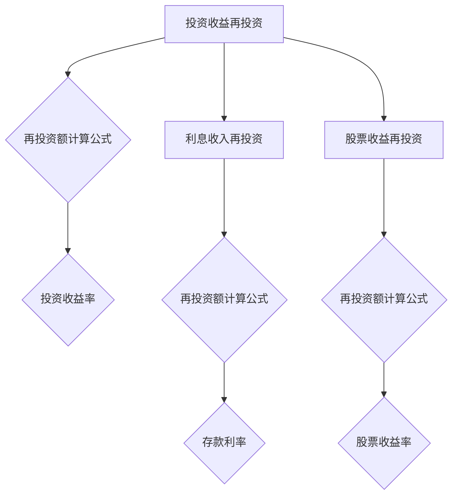

                 

### 工业革命后的经济变革背景

> “工业革命不仅改变了生产方式，更深远地影响了世界经济格局和人们的日常生活。” ——《经济史》作者约翰·肯尼斯·加尔布雷斯

### 第1章 工业革命的起源与发展

#### 1.1 工业革命的起源

工业革命（Industrial Revolution）始于18世纪末的英国，这是一个从传统手工业向机械化大生产转变的历史进程。其根源可以追溯到几个关键因素：

1. **农业革命**：18世纪的农业革命提高了农业生产效率，为工业革命提供了充足的劳动力资源。
2. **科学和技术的进步**：牛顿的经典力学和热力学理论为后来的技术进步提供了科学基础。
3. **资本积累**：英国的殖民扩张和国际贸易带来了巨大的财富积累，为工业化提供了资金支持。

#### 1.2 工业革命的主要特征

1. **机械化生产**：机器取代了人力，极大地提高了生产效率。瓦特改进的蒸汽机成为工业化的重要动力源。
2. **工厂制度的建立**：工厂成为生产组织的主要形式，工人在同一地点完成生产过程，分工和专业化程度大幅提升。
3. **城市化进程**：大量农民流入城市，城市化进程加速，城市人口比例显著增加。

#### 1.3 工业革命对世界经济的影响

工业革命对世界经济产生了深远的影响：

1. **生产力的飞跃**：机械化生产使生产力大幅提升，为经济的快速增长奠定了基础。
2. **国际贸易的扩展**：工业革命推动了国际贸易的发展，商品和资本流动更加频繁。
3. **经济结构的转变**：从农业经济向工业经济转变，工业成为经济增长的主要动力。

### 第2章 工业革命后的经济结构变化

#### 2.1 从农业经济向工业经济的转变

1. **农业生产效率提升**：农业革命和机械化的推广提高了农业生产效率，使农产品供应更加充足。
2. **劳动力转移**：大量农民流入城市，成为工业工人，农业劳动力比例显著下降。
3. **农业经济特点**：自给自足和小规模生产，生产效率相对较低。

#### 2.2 工业革命后的国际贸易变化

1. **国际贸易规模扩大**：工业化生产带来了商品的大规模生产和流通，国际贸易规模显著扩大。
2. **贸易商品结构变化**：工业制成品成为主要贸易商品，农产品贸易比例下降。
3. **贸易方式变化**：海运和铁路的发展使贸易更加便捷，国际资本流动加速。

#### 2.3 工业革命后的城市化进程

1. **城市化进程加速**：工业化带来了大量就业机会，吸引了大量农民和农村人口流入城市。
2. **城市规模扩大**：城市化进程导致城市规模迅速扩大，城市化率显著提高。
3. **城市特点**：人口密集、经济活动集中、基础设施完善。

### 第3章 工业革命后的科技发展

#### 3.1 工业革命后的主要科技创新

1. **蒸汽机**：瓦特改进的蒸汽机成为工业化生产的重要动力源。
2. **纺织机械**：飞梭、珍妮纺纱机等纺织机械的发明和改进，提高了纺织业的生产效率。
3. **冶金技术**：高炉、钢铁轧机等冶金技术的进步，为工业生产提供了更多的原材料。

#### 3.2 科技创新对经济增长的推动作用

1. **生产效率提升**：科技创新提高了生产效率，降低了生产成本。
2. **产业升级**：科技创新推动了产业结构的升级和优化，促进了经济的多元化发展。
3. **国际贸易扩展**：科技创新使商品生产更加高效，国际贸易规模进一步扩大。

#### 3.3 科技创新与产业升级的关系

1. **科技创新促进产业升级**：科技创新推动了传统产业的转型升级，为新兴产业的发展提供了技术支持。
2. **产业升级促进科技创新**：产业升级带来了对新技术和新产品的需求，推动了科技创新的持续发展。

通过以上三个章节的内容，我们可以看到工业革命对世界经济格局和经济发展模式的深远影响。接下来，我们将进一步探讨工业革命后的经济增长模式，分析资本积累、创新驱动、劳动力市场以及全球化等因素如何共同作用，推动经济持续增长。

## 文章关键词

- 工业革命
- 经济变革
- 资本积累
- 创新驱动
- 全球化
- 城市化

### 文章摘要

工业革命不仅改变了生产方式，还深刻影响了世界经济格局和人们的生活。本文首先介绍了工业革命的起源与发展，探讨了工业革命的主要特征以及对世界经济的影响。接着，文章详细分析了工业革命后的经济结构变化，包括从农业经济向工业经济的转变、国际贸易的扩展以及城市化进程的加速。最后，文章讨论了工业革命后的科技发展及其对经济增长的推动作用。本文旨在为读者提供全面、深入的理解，帮助读者把握工业革命对现代经济的深远影响。文章还展望了未来经济增长的挑战与机遇，探讨了气候变化、数字经济等新兴因素对未来经济的潜在影响。通过这篇文章，读者将更好地理解工业革命的重要性以及其对现代经济的持续影响。

# 《工业革命后的经济爆发增长期》

> “工业革命不仅是一场生产力的革命，更是一场经济的革命。它不仅改变了生产方式，还深刻影响了世界经济格局和人们的生活。” ——《经济史》作者约翰·肯尼斯·加尔布雷斯

工业革命是18世纪末至19世纪初英国的一场历史性变革，标志着从手工业向机械化大生产的转变。这一变革不仅改变了生产方式，还深刻影响了世界经济格局和人们的日常生活。本文将深入探讨工业革命后的经济变革背景，分析工业革命对世界经济的影响，以及探讨工业革命后的经济增长模式。

## 工业革命后的经济变革背景

### 第1章 工业革命的起源与发展

#### 1.1 工业革命的起源

工业革命的起源可以追溯到18世纪末的英国，这是一个从传统手工业向机械化大生产转变的历史进程。其根源可以追溯到几个关键因素：

1. **农业革命**：18世纪的农业革命提高了农业生产效率，为工业革命提供了充足的劳动力资源。
2. **科学和技术的进步**：牛顿的经典力学和热力学理论为后来的技术进步提供了科学基础。
3. **资本积累**：英国的殖民扩张和国际贸易带来了巨大的财富积累，为工业化提供了资金支持。

#### 1.2 工业革命的主要特征

工业革命的主要特征包括：

1. **机械化生产**：机器取代了人力，极大地提高了生产效率。瓦特改进的蒸汽机成为工业化的重要动力源。
2. **工厂制度的建立**：工厂成为生产组织的主要形式，工人在同一地点完成生产过程，分工和专业化程度大幅提升。
3. **城市化进程**：大量农民流入城市，城市化进程加速，城市人口比例显著增加。

#### 1.3 工业革命对世界经济的影响

工业革命对世界经济产生了深远的影响：

1. **生产力的飞跃**：机械化生产使生产力大幅提升，为经济的快速增长奠定了基础。
2. **国际贸易的扩展**：工业革命推动了国际贸易的发展，商品和资本流动更加频繁。
3. **经济结构的转变**：从农业经济向工业经济转变，工业成为经济增长的主要动力。

### 第2章 工业革命后的经济结构变化

#### 2.1 从农业经济向工业经济的转变

1. **农业生产效率提升**：农业革命和机械化的推广提高了农业生产效率，使农产品供应更加充足。
2. **劳动力转移**：大量农民流入城市，成为工业工人，农业劳动力比例显著下降。
3. **农业经济特点**：自给自足和小规模生产，生产效率相对较低。

#### 2.2 工业革命后的国际贸易变化

1. **国际贸易规模扩大**：工业化生产带来了商品的大规模生产和流通，国际贸易规模显著扩大。
2. **贸易商品结构变化**：工业制成品成为主要贸易商品，农产品贸易比例下降。
3. **贸易方式变化**：海运和铁路的发展使贸易更加便捷，国际资本流动加速。

#### 2.3 工业革命后的城市化进程

1. **城市化进程加速**：工业化带来了大量就业机会，吸引了大量农民和农村人口流入城市。
2. **城市规模扩大**：城市化进程导致城市规模迅速扩大，城市化率显著提高。
3. **城市特点**：人口密集、经济活动集中、基础设施完善。

### 第3章 工业革命后的科技发展

#### 3.1 工业革命后的主要科技创新

工业革命后的科技创新包括：

1. **蒸汽机**：瓦特改进的蒸汽机成为工业化生产的重要动力源。
2. **纺织机械**：飞梭、珍妮纺纱机等纺织机械的发明和改进，提高了纺织业的生产效率。
3. **冶金技术**：高炉、钢铁轧机等冶金技术的进步，为工业生产提供了更多的原材料。

#### 3.2 科技创新对经济增长的推动作用

科技创新对经济增长的推动作用主要体现在：

1. **生产效率提升**：科技创新提高了生产效率，降低了生产成本。
2. **产业升级**：科技创新推动了产业结构的升级和优化，促进了经济的多元化发展。
3. **国际贸易扩展**：科技创新使商品生产更加高效，国际贸易规模进一步扩大。

#### 3.3 科技创新与产业升级的关系

科技创新与产业升级之间存在密切的关系：

1. **科技创新促进产业升级**：科技创新推动了传统产业的转型升级，为新兴产业的发展提供了技术支持。
2. **产业升级促进科技创新**：产业升级带来了对新技术和新产品的需求，推动了科技创新的持续发展。

通过以上三个章节的内容，我们可以看到工业革命对世界经济格局和经济发展模式的深远影响。接下来，我们将进一步探讨工业革命后的经济增长模式，分析资本积累、创新驱动、劳动力市场以及全球化等因素如何共同作用，推动经济持续增长。

## 第二部分 工业革命后的经济增长模式

工业革命不仅是生产力的飞跃，也是经济增长模式的转变。在工业革命后，经济增长不再仅仅依赖于劳动力数量的增加，而是通过资本积累、科技创新、劳动力市场的变化和全球化等因素的综合作用，实现了经济的持续增长。本部分将深入分析这些关键因素，探讨它们如何共同推动经济增长。

### 第4章 资本积累与经济增长

#### 4.1 资本积累的概念与途径

资本积累是经济增长的重要驱动力。它指的是经济主体将一部分收入用于投资和再生产，从而扩大生产能力和提高产出水平。资本积累的途径主要包括：

1. **投资收益再投资**：企业将投资收益重新投资，扩大生产能力。
   $$
   投资收益 \times 投资收益率 = 再投资额
   $$
   
2. **利息收入再投资**：储蓄者将利息收入重新投资，获得更多的利息收入。
   $$
   利息收入 \times 存款利率 = 再投资额
   $$
   
3. **股票收益再投资**：投资者将股票收益重新投资，增加投资组合的规模。
   $$
   股票收益 \times 股票收益率 = 再投资额
   $$

#### 4.2 资本积累对经济增长的作用

资本积累对经济增长具有重要作用：

1. **扩大生产能力**：通过资本积累，企业可以购买更多的生产资料，扩大生产能力，提高产出水平。
2. **促进技术进步**：资本积累为科技创新提供了资金支持，促进了技术进步和产业升级。
3. **提高劳动生产率**：资本积累使企业能够购买更先进的设备和技术，提高劳动生产率，降低生产成本。

#### 4.3 资本积累的障碍与挑战

尽管资本积累对经济增长具有积极作用，但现实中也面临着一些障碍和挑战：

1. **投资不足**：在经济衰退或市场不确定性增加的情况下，企业可能减少投资，导致资本积累不足。
2. **分配不均**：资本积累主要集中在富裕阶层手中，导致贫富差距扩大，限制了经济增长的潜力。
3. **制度性障碍**：一些国家和地区缺乏有效的金融和法律体系，限制了资本积累的效率和规模。

### 第5章 创新驱动与经济增长

#### 5.1 创新的概念与类型

创新是经济增长的重要动力。它指的是通过新的思想、方法或技术的引入，提高生产效率、降低成本、创造新的产品和服务。创新可以分为以下几种类型：

1. **产品创新**：开发新的产品或改进现有产品，满足消费者需求。
2. **过程创新**：改进生产过程，提高生产效率，降低成本。
3. **系统创新**：引入新的商业模式、管理体系或技术创新，实现整体系统的优化。

#### 5.2 创新对经济增长的推动作用

创新对经济增长具有显著的推动作用：

1. **提高生产效率**：创新技术可以提高生产效率，降低成本，从而提高企业的盈利能力。
2. **促进产业升级**：创新技术可以推动传统产业的转型升级，培育新兴产业，实现经济结构的优化。
3. **扩大市场需求**：创新产品和服务可以创造新的市场需求，促进消费增长。

#### 5.3 创新的制度保障与政策支持

为了促进创新驱动经济增长，需要建立完善的制度保障和政策支持：

1. **知识产权保护**：保护知识产权可以激励创新，减少创新者的风险和成本。
2. **研发投入支持**：政府应加大对研发的投入，为企业提供研发资金支持，促进技术创新。
3. **创新人才培养**：培养高素质的创新人才，为创新提供人力支持。

### 第6章 劳动力市场与经济增长

#### 6.1 劳动力市场的概念与结构

劳动力市场是指劳动力供给和需求相互作用的市场。劳动力市场的结构包括：

1. **劳动力供给**：包括劳动力的数量、质量、结构和分布。
2. **劳动力需求**：包括劳动力的需求总量、需求结构、需求和供给的匹配程度。

#### 6.2 劳动力市场对经济增长的影响

劳动力市场对经济增长具有重要影响：

1. **劳动力供给**：充足的劳动力供给可以促进经济增长，满足生产需求。
2. **劳动力需求**：有效劳动力需求的增加可以推动经济增长，促进产业升级。
3. **劳动力市场匹配**：劳动力市场的匹配程度影响经济增长的效率和质量。

#### 6.3 劳动力市场的政策干预与调控

为了促进劳动力市场的健康发展，需要采取一系列政策干预与调控措施：

1. **就业政策**：政府应制定积极的就业政策，促进劳动力就业和创业。
2. **教育培训**：提高劳动力素质，提供职业培训和再教育机会，适应产业升级需求。
3. **劳动力市场调控**：通过财政、货币等政策手段，调节劳动力市场的供需平衡。

### 第7章 全球化与经济增长

#### 7.1 全球化的概念与特征

全球化是指全球范围内的经济、政治、文化和社会联系的深化和扩大。其特征包括：

1. **经济全球化**：国际资本流动、商品贸易和服务贸易的快速发展。
2. **政治全球化**：跨国治理和国际合作的加强。
3. **文化全球化**：文化交流和融合的加深。

#### 7.2 全球化对经济增长的推动作用

全球化对经济增长具有显著的推动作用：

1. **资源配置优化**：全球化使资源在全球范围内优化配置，提高生产效率和经济增长。
2. **国际贸易扩展**：全球化促进了国际贸易的发展，扩大了市场规模。
3. **技术传播**：全球化加速了技术和知识的传播，促进了科技创新和产业升级。

#### 7.3 全球化对经济增长的挑战与风险

尽管全球化对经济增长有积极作用，但同时也存在一些挑战和风险：

1. **经济不稳定性**：全球化增加了经济的不稳定性，贸易摩擦和金融风险加剧。
2. **贫富差距**：全球化可能导致贫富差距扩大，影响经济增长的公平性。
3. **文化冲突**：全球化可能引发文化冲突，影响社会和谐。

通过以上分析，我们可以看到工业革命后的经济增长模式是由资本积累、创新驱动、劳动力市场变化和全球化等因素共同作用的结果。这些因素相互促进，推动了经济的持续增长。在接下来的章节中，我们将进一步分析先进国家和部分发展中国家的经济增长经验，探讨不同经济增长模式的实现路径和成功因素。

## 第4章 资本积累与经济增长

### 4.1 资本积累的概念与途径

资本积累是指通过增加储蓄和投资，从而扩大经济主体的生产能力，促进经济增长的过程。在工业革命后的经济体系中，资本积累成为推动经济持续增长的关键因素。资本积累的途径主要包括以下几种：

#### 4.1.1 投资收益再投资

企业通过将投资收益重新投资，从而增加资本存量。这种途径可以通过以下公式表示：

$$
投资收益 \times 投资收益率 = 再投资额
$$

例如，如果一个企业的年投资收益为100万元，投资收益率为10%，则该企业可以将10万元用于再投资，以扩大生产规模。

#### 4.1.2 利息收入再投资

个人或金融机构通过将利息收入重新投资，从而增加资本存量。这种途径可以通过以下公式表示：

$$
利息收入 \times 存款利率 = 再投资额
$$

例如，如果一个个人在银行存款100万元，存款利率为5%，则该个人每年可以从银行获得5万元的利息收入，如果将这笔利息收入全部用于再投资，则每年的再投资额为5万元。

#### 4.1.3 股票收益再投资

投资者通过将股票收益重新投资，从而增加资本存量。这种途径可以通过以下公式表示：

$$
股票收益 \times 股票收益率 = 再投资额
$$

例如，如果一个投资者持有某公司的股票，年股票收益率为15%，股票价值为100万元，则每年的股票收益为15万元，如果投资者将这笔收益用于再投资，则每年的再投资额为15万元。

#### 图 4-1 资本积累的途径

Mermaid图表：

通过上述三种途径，经济主体可以不断扩大资本存量，从而推动经济的持续增长。

### 4.2 资本积累对经济增长的作用

资本积累对经济增长具有重要作用，主要体现在以下几个方面：

#### 4.2.1 扩大生产能力

资本积累使企业能够购买更多的生产资料，如设备、原材料和技术，从而扩大生产能力。这有助于提高生产效率，降低生产成本，增加产出。

#### 4.2.2 促进技术进步

资本积累为科技创新提供了资金支持，促进了技术进步。企业可以通过研发投入，开发新技术和新产品，从而提高竞争力，推动经济增长。

#### 4.2.3 提高劳动生产率

资本积累使企业能够引进更先进的设备和技术，提高劳动生产率。这有助于提高劳动者的工资水平，改善生活水平，进一步促进经济增长。

#### 4.2.4 扩大就业机会

资本积累可以带动相关产业的发展，创造更多的就业机会。这有助于降低失业率，提高社会的整体福利水平。

### 4.3 资本积累的障碍与挑战

尽管资本积累对经济增长有积极作用，但在实际操作中仍面临一些障碍和挑战：

#### 4.3.1 投资不足

在经济衰退或市场不确定性增加的情况下，企业可能减少投资，导致资本积累不足。这可能导致经济增长放缓，甚至出现衰退。

#### 4.3.2 分配不均

资本积累主要集中在富裕阶层手中，导致贫富差距扩大。这会影响社会的稳定性，削弱经济增长的潜力。

#### 4.3.3 制度性障碍

一些国家和地区缺乏有效的金融和法律体系，限制了资本积累的效率和规模。这可能导致资本积累不足，影响经济增长。

#### 4.3.4 风险管理

资本积累过程中，企业可能面临各种风险，如市场风险、信用风险和操作风险。有效的风险管理是确保资本积累顺利进行的关键。

通过以上分析，我们可以看到资本积累对经济增长的重要性以及其面临的挑战。在接下来的章节中，我们将进一步探讨创新驱动与经济增长的关系，分析劳动力市场变化对经济增长的影响，以及全球化对经济增长的推动作用。

## 第5章 创新驱动与经济增长

### 5.1 创新的概念与类型

创新是指通过引入新的思想、方法、技术或产品，从而提高生产效率、降低成本、创造新的市场需求和商业模式的过程。创新可以分为以下几种类型：

#### 5.1.1 产品创新

产品创新是指开发新的产品或改进现有产品，以满足消费者需求。例如，苹果公司的iPhone手机就是产品创新的典范，它不仅改变了手机市场的格局，还推动了整个消费电子行业的发展。

#### 5.1.2 过程创新

过程创新是指改进生产过程，提高生产效率，降低成本。例如，丰田公司通过实施精益生产（Lean Production），大幅度提高了生产效率和产品质量，成为全球汽车行业的领导者。

#### 5.1.3 系统创新

系统创新是指引入新的商业模式、管理体系或技术创新，实现整体系统的优化。例如，阿里巴巴集团的电子商务平台改变了传统零售业的运营模式，使电子商务成为全球性的商业现象。

### 5.2 创新对经济增长的推动作用

创新对经济增长具有显著的推动作用，主要表现在以下几个方面：

#### 5.2.1 提高生产效率

创新技术可以提高生产效率，降低生产成本，从而提高企业的盈利能力。例如，自动化生产线和智能工厂的应用，使生产效率大幅提高，生产成本显著降低。

#### 5.2.2 促进产业升级

创新技术可以推动传统产业的转型升级，培育新兴产业，实现经济结构的优化。例如，信息技术和互联网技术的快速发展，推动了制造业、服务业等行业的数字化和智能化转型。

#### 5.2.3 扩大市场需求

创新产品和服务可以创造新的市场需求，促进消费增长。例如，智能手机的普及带动了手机应用市场的发展，为消费者提供了更多的选择和便利。

#### 5.2.4 增加就业机会

创新带来的新产业、新岗位可以创造更多的就业机会，降低失业率，提高社会的整体福利水平。例如，互联网技术的发展创造了大量新兴职业，如程序员、数据分析师等。

### 5.3 创新的制度保障与政策支持

为了促进创新驱动经济增长，需要建立完善的制度保障和政策支持体系：

#### 5.3.1 知识产权保护

知识产权保护是激励创新的重要手段。通过法律手段保护发明者的权益，可以激励更多的人投身于创新活动，促进技术创新和知识产权的积累。

#### 5.3.2 研发投入支持

政府应加大对研发的投入，为企业提供研发资金支持，促进技术创新。例如，美国通过《国家创新法案》加大对科技研发的投入，推动了经济的持续增长。

#### 5.3.3 教育和人才培养

教育和人才培养是创新驱动经济增长的基础。通过提供高质量的教育和培训，培养具有创新能力和实践能力的人才，为创新提供人力支持。

#### 5.3.4 创业环境建设

政府应创造良好的创业环境，降低创业门槛，为创业者提供政策支持和资源保障。例如，硅谷的创业生态系统为全球创新者提供了良好的创业环境和机会。

#### 5.3.5 国际合作与交流

国际合作与交流是促进创新的重要途径。通过跨国合作和知识共享，可以加速技术创新和知识传播，推动全球经济增长。

通过以上措施，可以建立一个有利于创新驱动的制度环境和政策体系，从而推动经济的持续增长。创新不仅改变了生产方式，还推动了经济结构的优化和产业的升级，成为现代经济增长的重要引擎。

### 5.4 创新的案例分析与实际应用

为了更好地理解创新对经济增长的推动作用，以下通过几个实际案例来探讨创新在各个领域的应用：

#### 5.4.1 互联网技术对零售业的影响

互联网技术的创新极大地改变了零售业的运营模式。亚马逊等电商平台通过大数据分析和智能推荐，提高了商品流通效率，降低了运营成本，为消费者提供了更便捷的购物体验。根据数据显示，亚马逊的在线销售额在过去的几年中持续增长，2019年达到了2805亿美元。这一增长不仅体现了互联网技术对零售业的巨大推动作用，还带动了整个电子商务行业的发展。

#### 5.4.2 人工智能在金融行业的应用

人工智能（AI）技术的创新在金融行业也得到了广泛应用。通过机器学习和自然语言处理技术，金融机构能够更精准地识别风险、提高客户服务质量和效率。例如，美国银行利用AI技术进行信用评分和风险评估，大幅降低了坏账率。此外，AI技术在金融欺诈检测、算法交易和智能投顾等方面的应用，也为金融机构带来了显著的经济效益。

#### 5.4.3 医疗技术的创新

医疗技术的创新在提高医疗水平和减少医疗成本方面发挥了重要作用。以基因编辑技术为例，CRISPR-Cas9基因编辑技术的出现，使得科学家能够在基因水平上精确修复致病基因，为治疗遗传性疾病提供了新的可能性。同时，电子健康记录（EHR）系统的应用，提高了医疗信息的共享和利用效率，降低了医疗错误和重复检查的费用。根据世界卫生组织的数据，全球医疗支出在2019年达到了约7万亿美元，而技术创新有望进一步降低这一数字。

#### 5.4.4 新能源技术的发展

新能源技术的创新为全球能源结构的转型提供了新的路径。太阳能和风能技术的快速发展，使得可再生能源的利用效率不断提高，成本不断降低。以特斯拉为例，其电动汽车和太阳能发电系统的创新，不仅推动了电动汽车行业的发展，还促进了可再生能源市场的增长。根据国际能源署的数据，全球可再生能源发电量在2020年已经占总发电量的28%，这一比例有望在未来继续上升。

通过这些实际案例，我们可以看到创新在各个领域的广泛应用及其对经济增长的推动作用。创新不仅带来了经济效益，还推动了社会的进步和可持续发展。在未来，随着技术的不断进步和创新的持续发展，经济增长的潜力将更加巨大。

### 5.5 创新的未来趋势与发展方向

随着科技的不断进步和社会的快速发展，创新在未来将呈现出以下趋势和方向：

#### 5.5.1 人工智能与大数据的深度融合

人工智能（AI）和大数据技术的深度融合将成为未来创新的重要趋势。通过AI算法分析海量数据，企业能够更准确地预测市场趋势、优化业务流程，提高决策效率。例如，金融领域的智能投顾和医疗领域的个性化治疗，都是大数据与AI技术深度融合的典型应用场景。

#### 5.5.2 区块链技术的普及与应用

区块链技术以其去中心化、透明和安全的特点，将在未来得到更广泛的应用。例如，在供应链管理中，区块链技术可以确保商品的真实性和来源的可追溯性，提高供应链的效率。在金融领域，区块链技术将改变支付、交易和合约执行的流程，降低交易成本。

#### 5.5.3 新材料与智能制造的突破

新材料技术的发展将带来制造工艺的革新。例如，碳纳米管、石墨烯等新型材料的出现，将提高产品的性能和耐用性。智能制造技术，如工业物联网（IIoT）和智能制造平台，将使生产过程更加智能化和自动化，提高生产效率和产品质量。

#### 5.5.4 可持续发展的科技创新

随着全球对环境保护和可持续发展的重视，绿色科技创新将成为未来发展的重点。例如，清洁能源技术、环保材料和资源回收利用技术的发展，将有助于减少环境污染，实现可持续发展。

#### 5.5.5 跨学科融合与创新

跨学科融合将成为未来创新的重要趋势。例如，生物技术与信息技术、物理科学与计算机科学的融合，将带来新的技术突破和应用。这种跨学科的合作不仅能够激发创新的潜力，还能够解决复杂的社会问题，推动经济社会的全面发展。

通过上述趋势和方向，我们可以看到创新在未来将继续发挥关键作用，成为推动经济增长和社会进步的重要引擎。随着科技的不断进步，创新将带来更多可能性，为人类社会的未来发展带来无限希望。

## 第6章 劳动力市场与经济增长

### 6.1 劳动力市场的概念与结构

劳动力市场是指劳动力供给和劳动力需求相互作用的市场。它包括劳动力的数量、质量、结构和分布等方面。劳动力市场的结构主要由以下几个要素构成：

#### 6.1.1 劳动力供给

劳动力供给是指一定时间内，愿意并有能力提供劳动服务的人口。劳动力供给主要由以下因素决定：

1. **人口数量**：人口基数越大，劳动力供给通常越充足。
2. **教育水平**：受教育程度较高的劳动力供给通常更具竞争力。
3. **就业意愿**：劳动者的就业意愿会影响劳动力供给的数量。
4. **劳动力市场灵活性**：劳动力市场的灵活性越高，劳动力供给越容易适应市场需求的变化。

#### 6.1.2 劳动力需求

劳动力需求是指企业或组织在一定时间内愿意并能够支付合理工资以获取的劳动力数量。劳动力需求主要受以下因素影响：

1. **企业生产规模**：企业生产规模的扩大通常会导致劳动力需求的增加。
2. **技术水平**：技术水平的提升可以替代部分劳动力，但也会创造新的就业机会。
3. **宏观经济环境**：经济增长和宏观经济政策的变化会影响劳动力需求。
4. **工资水平**：工资水平的调整会影响企业的劳动力需求。

#### 6.1.3 劳动力市场结构

劳动力市场的结构包括劳动力市场的匹配程度、劳动力的流动性和劳动力的供需平衡等方面。一个健康的劳动力市场通常具有以下特点：

1. **匹配度高**：劳动力供给与劳动力需求之间的匹配程度高，能够满足不同行业和企业的需求。
2. **流动性强**：劳动力能够在不同地区、不同行业之间自由流动，实现资源的优化配置。
3. **供需平衡**：劳动力供给与劳动力需求之间的平衡，避免供需失衡导致的劳动力短缺或过剩。

### 6.2 劳动力市场对经济增长的影响

劳动力市场是经济增长的核心要素之一，其运行状态对经济增长具有重要影响。以下是劳动力市场对经济增长的几个主要影响：

#### 6.2.1 劳动力供给与经济增长

劳动力供给的充足性和质量直接影响经济增长。一个具有充足和高质量劳动力供给的国家，通常能够实现较高的经济增长率。劳动力供给的充足性可以通过以下途径促进经济增长：

1. **增加生产要素**：劳动力是生产的重要组成部分，充足的劳动力供给能够增加生产要素，提高产出水平。
2. **提升劳动生产率**：高质量的劳动力供给能够提高劳动生产率，降低生产成本，从而促进经济增长。

#### 6.2.2 劳动力需求与经济增长

劳动力需求的变化直接影响经济增长的潜力和速度。一个具有旺盛劳动力需求的行业或地区，通常能够带动整个经济的增长。以下是劳动力需求对经济增长的几个主要影响：

1. **产业升级**：劳动力需求的变化可以推动产业结构的优化和升级。新兴产业和高端产业的崛起，可以带动整体经济增长。
2. **技术进步**：劳动力需求的增加通常伴随着技术进步。企业为了满足市场需求，会投资于新技术和新设备，从而推动经济增长。

#### 6.2.3 劳动力市场流动性

劳动力市场的流动性对经济增长具有重要影响。劳动力能够在不同地区、不同行业之间自由流动，有助于资源的最优配置和经济增长。以下是劳动力市场流动性对经济增长的几个主要影响：

1. **资源配置**：劳动力流动性有助于优化劳动力资源的配置，使劳动力能够更好地服务于高收益、高增长行业。
2. **创新与创业**：劳动力的流动促进了知识的传播和技术的扩散，有利于创新和创业活动的开展，从而推动经济增长。

#### 6.2.4 劳动力供需平衡

劳动力市场的供需平衡是经济增长的重要前提。一个供需平衡的劳动力市场能够确保经济的稳定增长。以下是劳动力供需平衡对经济增长的几个主要影响：

1. **就业稳定**：劳动力供需平衡有助于维持就业稳定，减少失业率，提高居民收入水平，从而促进消费增长。
2. **投资增长**：劳动力市场的供需平衡有利于企业投资的稳定，减少经济波动，提高投资回报率。

### 6.3 劳动力市场的政策干预与调控

为了确保劳动力市场的健康发展，政府需要采取一系列政策干预与调控措施。以下是劳动力市场政策干预与调控的几个主要方面：

#### 6.3.1 就业政策

就业政策旨在促进劳动力就业和创业，提高就业率。主要措施包括：

1. **公共就业服务**：提供职业咨询、就业培训和招聘服务等，帮助劳动者找到合适的就业机会。
2. **就业补贴**：对吸纳就业的企业给予税收优惠或补贴，鼓励企业增加就业。
3. **创业支持**：提供创业指导、资金支持和税收优惠等，鼓励劳动者自主创业。

#### 6.3.2 教育与培训政策

教育与培训政策旨在提高劳动力的素质和技能，满足经济发展的需求。主要措施包括：

1. **教育投入**：增加教育投入，提高教育质量，培养更多高素质劳动力。
2. **职业培训**：提供职业技能培训，帮助劳动者适应新的职业需求。
3. **终身教育**：推动终身教育体系的建设，鼓励劳动者持续学习和提升技能。

#### 6.3.3 劳动力市场调控

劳动力市场调控旨在维持劳动力市场的供需平衡，确保经济的稳定增长。主要措施包括：

1. **最低工资政策**：制定合理的最低工资标准，保障劳动者的基本收入水平。
2. **工资指导线**：发布工资指导线，引导企业合理确定工资水平，防止工资过度波动。
3. **劳动力市场监测**：建立劳动力市场监测体系，及时掌握劳动力市场的供需情况，制定相应的调控政策。

通过上述政策干预与调控，政府可以促进劳动力市场的健康发展，提高劳动力市场的运行效率，从而推动经济的持续增长。

## 6.4 劳动力市场对经济增长的实际案例分析

为了更好地理解劳动力市场对经济增长的实际影响，以下通过几个实际案例来探讨劳动力市场在不同经济体系中的作用和影响：

### 6.4.1 美国：创新与创业推动经济增长

美国作为全球科技创新和创业的热土，其劳动力市场对经济增长发挥了重要作用。硅谷作为全球创新中心，吸引了大量高科技人才和创业公司。以下是几个关键点：

1. **人才聚集**：硅谷汇聚了全球顶尖的科技人才，包括计算机科学家、工程师和创业者。这些人才的集聚为科技创新提供了强有力的支持。
2. **创业氛围**：硅谷鼓励创业，提供了丰富的创业资源和政策支持。例如，风险投资公司、天使投资人和创业孵化器为初创企业提供了资金和指导。
3. **产业链完善**：硅谷拥有完善的产业链，从技术研发到产品生产、销售，形成了完整的创新生态系统。这种产业链的完善进一步推动了经济增长。

### 6.4.2 德国：制造业与劳动力市场结合

德国以其强大的制造业和高效的劳动力市场而闻名，其劳动力市场对经济增长具有显著的推动作用。以下是几个关键点：

1. **高技能劳动力**：德国注重职业培训，培养了大量高技能劳动力。这些劳动力的技能和素质满足了制造业的高要求。
2. **双元制教育**：德国的双元制教育体系结合了职业教育和学术教育，使学生在毕业后能够直接进入劳动力市场。这种教育模式提高了劳动力的适应能力和就业率。
3. **就业稳定性**：德国劳动力市场具有较高的就业稳定性，失业率相对较低。这种就业稳定性为经济增长提供了稳定的劳动力供给。

### 6.4.3 印度：劳动力红利与经济增长

印度作为全球最大的发展中国家，其劳动力市场对经济增长也发挥了重要作用。以下是几个关键点：

1. **人口红利**：印度拥有庞大的人口基数，尤其是年轻的劳动力人口。这种人口红利为印度的经济增长提供了潜力。
2. **服务业发展**：印度服务业尤其是信息技术和外包服务业的快速发展，创造了大量就业机会。这些就业机会吸引了大量劳动力，促进了经济增长。
3. **政策支持**：印度政府通过一系列政策支持，如减税、投资基础设施和提供就业培训，促进了劳动力市场的健康发展。这些政策支持有助于提高劳动力的素质和就业率。

### 6.4.4 中国：城市化与劳动力市场

中国通过城市化进程和劳动力市场的改革，实现了快速的经济增长。以下是几个关键点：

1. **城市化进程**：中国通过推进城市化，将大量农村人口转移到城市，提高了劳动力的流动性。这种流动性的提高有助于优化劳动力资源的配置。
2. **劳动力市场改革**：中国通过劳动力市场改革，如减少劳动力市场壁垒、提高就业灵活性，促进了劳动力市场的健康发展。这些改革措施有助于提高劳动力的生产率和就业率。
3. **制造业升级**：中国通过制造业升级，如发展高技术制造业和智能制造，提高了制造业的附加值和竞争力。这种制造业升级进一步推动了经济增长。

通过这些实际案例，我们可以看到劳动力市场在不同经济体系中的作用和影响。劳动力市场的健康发展和优化，对于推动经济增长具有重要意义。政府需要采取有效的政策和措施，促进劳动力市场的健康发展，从而实现经济的可持续增长。

## 第7章 全球化与经济增长

### 7.1 全球化的概念与特征

全球化是指全球范围内的经济、政治、文化和社会联系的深化和扩大。全球化主要特征如下：

#### 7.1.1 经济全球化

经济全球化表现为国际资本流动、商品贸易和服务贸易的快速发展。其主要特征包括：

1. **国际贸易增长**：全球贸易额持续增长，各国之间的商品和服务交换日益频繁。
2. **跨国投资增加**：跨国公司大量投资于全球各地，形成了全球化的生产网络。
3. **金融市场一体化**：全球金融市场的互联互通，促进了资本的自由流动。

#### 7.1.2 政治全球化

政治全球化表现为跨国治理和国际合作的加强。其主要特征包括：

1. **多边主义**：各国通过国际组织和协议，共同解决全球性问题，如气候变化、贸易争端等。
2. **区域一体化**：如欧洲联盟、北美自由贸易协定等区域一体化组织，推动了区域经济一体化和政治合作。
3. **跨国安全合作**：全球范围内的安全合作，如反恐、打击跨国犯罪等，成为全球化的重要组成部分。

#### 7.1.3 文化全球化

文化全球化表现为文化交流和融合的加深。其主要特征包括：

1. **文化多样性**：各国文化在全球范围内传播和交流，丰富了人类的文化遗产。
2. **文化商品化**：文化产品如电影、音乐、时尚等在全球范围内流通，成为经济的重要组成部分。
3. **文化认同**：全球化过程中，文化认同和民族认同的矛盾和冲突也日益显现。

### 7.2 全球化对经济增长的推动作用

全球化对经济增长具有显著的推动作用，主要表现在以下几个方面：

#### 7.2.1 资源配置优化

全球化使资源在全球范围内优化配置，提高了生产效率和经济增长。例如：

1. **劳动力优化**：各国根据自身优势和需求，进行劳动力的国际流动，提高了劳动力的利用效率。
2. **资本优化**：跨国投资和金融市场的全球化，使资本能够更有效地流向高回报领域，提高了资本的利用效率。
3. **技术优化**：全球化促进了技术和知识的传播，各国可以更快速地获取和利用先进技术，提高生产力和竞争力。

#### 7.2.2 扩大市场规模

全球化使市场规模扩大，为各国企业提供了更广阔的市场空间。例如：

1. **国际贸易**：全球贸易的增长，使企业能够进入更多的市场，提高销售额和利润率。
2. **跨国公司**：跨国公司通过全球布局，实现了全球范围内的市场覆盖，提高了企业的国际竞争力。
3. **消费升级**：全球化带来了更多的消费选择，提高了消费者的生活水平。

#### 7.2.3 促进技术创新

全球化促进了技术创新，推动了产业升级和经济结构的优化。例如：

1. **知识共享**：全球化使各国之间的知识和技术交流更加频繁，促进了创新和技术的进步。
2. **产学研结合**：全球化推动了企业、高校和研究机构的合作，形成了产学研一体的创新体系。
3. **技术创新**：跨国公司在全球范围内进行研发投资，推动了技术创新和产业升级。

### 7.3 全球化对经济增长的挑战与风险

尽管全球化对经济增长有积极作用，但同时也存在一些挑战和风险：

#### 7.3.1 经济不稳定性

全球化增加了经济的不稳定性，贸易摩擦和金融风险加剧。例如：

1. **贸易摩擦**：全球化过程中，各国之间的贸易争端和摩擦增加，影响了全球贸易的稳定性。
2. **金融风险**：全球金融市场互联互通，金融风险跨国传播，加剧了全球经济的不稳定性。

#### 7.3.2 贫富差距

全球化可能导致贫富差距扩大，影响经济增长的公平性。例如：

1. **全球贫富差距**：全球化使财富集中在富裕国家或地区，贫富差距进一步扩大。
2. **地区差距**：全球化过程中，发达地区和发展中地区之间的差距可能加剧，影响全球经济的可持续发展。

#### 7.3.3 文化冲突

全球化过程中，文化冲突和矛盾也日益显现。例如：

1. **文化认同**：全球化加速了文化的交流与融合，但也引发了文化认同和民族认同的冲突。
2. **价值观差异**：全球化带来了不同的价值观和意识形态，可能导致社会矛盾和冲突。

#### 7.3.4 环境问题

全球化加剧了环境问题，如资源消耗、污染和生态破坏。例如：

1. **资源消耗**：全球化使资源需求增加，导致资源消耗加剧。
2. **环境污染**：全球化过程中，环境污染问题跨国传播，加剧了全球环境问题。

为了应对全球化带来的挑战和风险，需要加强国际合作，建立全球治理体系，推动经济、社会和环境的可持续发展。

## 7.4 全球化对经济增长的实际影响与案例分析

为了更深入地理解全球化对经济增长的实际影响，我们可以通过分析以下几个国家和地区的案例，探讨全球化在不同背景下如何推动或影响经济增长。

### 7.4.1 美国：全球化的经济引擎

美国作为全球化的领导者之一，其经济增长显著受益于全球化。以下是几个关键点：

1. **跨国公司的崛起**：美国拥有众多跨国公司，如苹果、微软和谷歌等，这些公司在全球范围内开展业务，通过国际贸易和投资推动了美国的经济增长。
2. **创新与科技领先**：全球化加速了美国在科技和创新领域的领先地位。通过全球化的知识流动，美国企业能够快速获取新技术，推动产业升级。
3. **服务业扩张**：美国的服务业，尤其是金融、科技和娱乐等行业，通过全球化实现了快速增长。全球市场的开放使得这些行业的公司在全球范围内获得更多机会。

### 7.4.2 中国：全球化下的经济增长奇迹

中国作为全球第二大经济体，其经济增长模式在很大程度上依赖于全球化。以下是几个关键点：

1. **出口导向型经济**：中国通过积极参与全球贸易，将制造业优势转化为出口优势。大量外国投资和跨国公司的设立为中国提供了资金、技术和市场。
2. **全球供应链**：中国通过建设全球供应链，将生产网络延伸到全球各地。这不仅提高了生产效率，还使中国成为全球制造和出口的中心。
3. **创新驱动**：中国政府鼓励创新，通过全球化吸收国外先进技术和管理经验，推动经济从依赖低成本劳动力转向依赖技术和创新。

### 7.4.3 欧洲联盟：区域一体化推动经济增长

欧洲联盟通过区域一体化，实现了成员国之间的经济合作和资源共享，从而推动了经济增长。以下是几个关键点：

1. **贸易自由化**：欧盟成员国之间的贸易壁垒较低，商品和服务自由流通，促进了成员国之间的经济互动和增长。
2. **劳动力市场一体化**：欧盟内部劳动力市场相对灵活，劳动力可以在成员国之间自由流动，提高了劳动力的利用效率。
3. **投资合作**：欧盟成员国通过共同投资和合作，推动了基础设施建设和科技创新，增强了整体经济竞争力。

### 7.4.4 南非：全球化下的经济挑战

尽管全球化为许多国家带来了经济增长的机会，但南非等发展中国家也面临着全球化的挑战。以下是几个关键点：

1. **资源依赖**：南非的经济在很大程度上依赖矿物资源的出口，全球化带来了资源的波动，对经济稳定性造成威胁。
2. **贫富差距**：全球化加剧了南非的贫富差距，经济增长的成果并未公平地分配给所有人，社会不稳定因素增加。
3. **就业问题**：全球化对劳动力市场产生了深远影响，尤其是制造业和服务业的就业机会减少，导致失业问题加剧。

### 7.4.5 印度：劳动力红利与全球化

印度作为人口大国，其劳动力市场在全球化的背景下具有独特优势。以下是几个关键点：

1. **劳动力红利**：印度拥有庞大的年轻劳动力人口，这些劳动力在全球服务外包市场中发挥了重要作用，推动了印度经济增长。
2. **信息技术产业**：印度在信息技术和服务外包领域取得了显著成就，全球化的信息技术市场为印度提供了广阔的发展空间。
3. **教育和培训**：印度政府通过投资教育和培训，提高劳动力的素质和技能，以适应全球化带来的挑战和机遇。

通过这些案例分析，我们可以看到全球化对经济增长具有深远的影响。全球化不仅带来了机遇，也带来了挑战。各国需要根据自身国情，制定合适的政策和战略，充分利用全球化的机遇，同时应对其带来的挑战。

## 第8章 先进国家的经济增长经验

### 8.1 美国的经济增长经验

美国作为全球最大的经济体之一，其经济增长经验具有重要的参考价值。以下是美国经济增长的几个关键经验：

#### 8.1.1 创新驱动

美国的经济增长主要依赖于科技创新和创业精神。硅谷作为全球创新中心，吸引了大量高科技企业和创业者。以下是几个具体措施：

1. **研发投入**：美国政府和企业高度重视研发投入，持续增加科研资金，推动技术进步。
2. **知识产权保护**：通过建立完善的知识产权保护体系，鼓励创新和知识分享。
3. **风险投资**：风险投资公司为初创企业提供资金支持，促进科技创业。

#### 8.1.2 教育优先

教育是美国经济增长的重要基石。以下是几个关键措施：

1. **基础教育**：美国的基础教育质量较高，为学生提供了良好的学习环境。
2. **职业教育**：职业教育和培训有助于培养技能型人才，满足市场需求。
3. **高等教育**：美国的高等教育机构在全球享有盛誉，吸引了大量国际学生，促进了知识交流和人才流动。

#### 8.1.3 财政政策

财政政策在美国经济增长中发挥了重要作用。以下是几个关键措施：

1. **减税**：通过减税政策，鼓励企业和个人增加投资和消费。
2. **财政刺激**：在经济衰退时，政府通过财政刺激计划，增加公共投资和消费需求。
3. **税收优惠**：对高科技创新企业给予税收优惠，鼓励创新和创业。

### 8.2 日本的经济增长经验

日本在二战后迅速崛起，成为世界第二大经济体。以下是日本经济增长的几个关键经验：

#### 8.2.1 工业化和技术创新

日本经济增长得益于其工业化进程和技术创新。以下是几个具体措施：

1. **制造业优势**：日本在制造业，尤其是汽车、电子和机械制造等领域具有显著优势。
2. **技术创新**：日本企业高度重视技术创新，通过研发和引进新技术，提高生产效率和产品质量。
3. **供应链管理**：日本企业通过高效的供应链管理，实现了生产成本的降低和产品的高效交付。

#### 8.2.2 教育体系

日本的教育体系为经济增长提供了强有力的人才支持。以下是几个关键措施：

1. **基础教育**：日本的基础教育注重培养学生的综合素质和创新能力。
2. **职业教育**：职业教育和培训有助于培养专业技能人才，满足产业需求。
3. **终身学习**：日本倡导终身学习，鼓励员工持续提升技能和知识水平。

#### 8.2.3 政策支持

政策支持是日本经济增长的重要保障。以下是几个关键措施：

1. **产业政策**：政府通过制定产业政策，支持重点产业发展，推动经济结构调整。
2. **金融支持**：通过低息贷款和税收优惠等金融政策，支持中小企业发展。
3. **国际合作**：日本积极参与国际事务和合作，通过国际合作扩大市场和经济影响力。

### 8.3 德国的经济增长经验

德国以其强大的制造业和高效的劳动力市场而闻名。以下是德国经济增长的几个关键经验：

#### 8.3.1 制造业的创新与竞争力

德国的制造业在全球具有极高的竞争力，以下是几个关键措施：

1. **工业4.0**：德国政府提出的“工业4.0”战略，推动了制造业的数字化转型和智能化升级。
2. **质量保障**：德国企业注重产品质量和客户满意度，通过严格的质量管理体系和标准，赢得了全球客户的信任。
3. **供应链管理**：德国企业通过高效的供应链管理，确保了产品的高效交付和市场的快速响应。

#### 8.3.2 劳动力市场改革

德国的劳动力市场改革为经济增长提供了强有力的人才支持。以下是几个关键措施：

1. **灵活就业**：通过推行灵活就业政策，提高了劳动力市场的灵活性和适应性。
2. **职业教育**：德国的职业教育体系培养了大批高技能人才，满足了制造业和其他行业的需求。
3. **终身学习**：鼓励员工终身学习，提高技能和知识水平，适应经济和技术变革。

#### 8.3.4 社会市场经济

德国的社会市场经济模式为经济增长提供了良好的环境。以下是几个关键措施：

1. **混合经济**：德国经济由私营企业和公共部门共同组成，通过市场机制和政府调控，实现了经济的稳定增长。
2. **社会保障**：完善的社会保障体系为劳动者提供了基本保障，降低了社会风险。
3. **税收政策**：合理的税收政策，既鼓励企业投资和创业，又保障了公共服务和社会福利的提供。

通过分析美国、日本和德国的经济增长经验，我们可以看到，创新驱动、教育优先、政策支持和劳动力市场改革是推动经济增长的关键因素。这些经验对于其他国家和地区具有借鉴意义，有助于实现可持续的经济增长。

## 第9章 发展中国家的经济增长经验

### 9.1 印度的经济增长经验

印度作为世界上最大的发展中国家之一，近年来经济增长迅速。以下是印度经济增长的几个关键经验：

#### 9.1.1 劳动力红利

印度拥有世界上最大的年轻劳动力人口，这一“劳动力红利”为经济增长提供了巨大潜力。以下是几个关键措施：

1. **人口结构优势**：印度年轻劳动力人口占比较高，这为印度经济的持续增长提供了充足的人力资源。
2. **技能培训**：政府和企业加大对技能培训的投入，提高劳动力的技能和就业能力。
3. **劳动力市场灵活性**：通过改革劳动力市场，提高劳动力的流动性和适应性，使其更好地适应市场需求。

#### 9.1.2 信息技术外包

印度在信息技术外包领域具有显著优势，以下是几个关键措施：

1. **基础设施建设**：政府加大对信息基础设施的投资，如互联网和数据中心建设，提高了信息技术服务的质量和效率。
2. **人才优势**：印度拥有大量高素质的计算机科学和信息技术人才，这为信息技术外包业务提供了强有力的人才支持。
3. **政策支持**：政府通过制定相关政策和法规，为信息技术外包企业提供优惠和支持，促进了该行业的快速发展。

#### 9.1.3 外资吸引

印度积极吸引外国直接投资（FDI），以下是几个关键措施：

1. **投资环境改善**：政府通过改善投资环境，如简化审批流程、提供税收优惠等，吸引了大量外国投资。
2. **产业政策**：政府制定产业政策，鼓励外资投资于高附加值领域，如制造业、服务业等。
3. **国际合作**：印度积极参与国际经济合作，通过签订自由贸易协定和投资协议，扩大了外资来源和投资领域。

### 9.2 墨西哥的经济增长经验

墨西哥作为拉丁美洲最大的经济体之一，近年来经济增长显著。以下是墨西哥经济增长的几个关键经验：

#### 9.2.1 外向型经济

墨西哥经济高度依赖国际贸易，以下是几个关键措施：

1. **自由贸易协定**：墨西哥与多个国家签订了自由贸易协定，如北美自由贸易协定（NAFTA），促进了贸易和投资自由化。
2. **出口导向**：墨西哥通过发展出口导向型经济，吸引了大量外国投资，促进了经济增长。
3. **产业多元化**：墨西哥政府鼓励产业多元化，推动了制造业、服务业和农业的全面发展。

#### 9.2.2 劳动力市场改革

墨西哥的劳动力市场改革为其经济增长提供了有力支持，以下是几个关键措施：

1. **就业促进**：政府通过提供就业培训、补贴和创业支持等政策，促进就业增长。
2. **劳动法改革**：政府改革劳动法，提高劳动力市场的灵活性和适应性，降低了企业的用工成本。
3. **教育和技能培训**：政府加大对教育和技能培训的投入，提高劳动力的技能和素质，以适应产业升级需求。

#### 9.2.3 产业结构调整

墨西哥通过产业结构调整，实现了经济的高质量增长，以下是几个关键措施：

1. **制造业升级**：墨西哥政府鼓励制造业向高附加值、高技术方向转型，推动了产业升级。
2. **服务业发展**：政府推动服务业发展，提高了服务业在国民经济中的比重，增加了就业和税收收入。
3. **农业现代化**：政府推动农业现代化，提高农业生产效率，增加了农业产值。

### 9.3 印尼的经济增长经验

印尼作为东南亚最大的经济体之一，近年来经济增长迅速。以下是印尼经济增长的几个关键经验：

#### 9.3.1 自然资源丰富

印尼拥有丰富的自然资源，如石油、天然气、煤炭和矿产资源，以下是几个关键措施：

1. **资源开发**：政府加大对自然资源的开发力度，提高了资源产值，促进了经济增长。
2. **多元化经济**：政府推动经济多元化，减少对自然资源的依赖，促进了经济的全面发展。
3. **基础设施建设**：政府加大对基础设施建设的投资，提高了资源开发和产业发展的条件。

#### 9.3.2 旅游业发展

印尼的旅游业具有巨大潜力，以下是几个关键措施：

1. **旅游资源开发**：政府加大对旅游资源的开发力度，提升了旅游服务水平，吸引了大量国际游客。
2. **旅游基础设施建设**：政府加大对旅游基础设施的投资，如机场、酒店和交通设施等，提高了旅游接待能力。
3. **旅游推广**：政府通过多种渠道推广印尼的旅游资源，提升了国际知名度，吸引了更多游客。

#### 9.3.3 对外开放政策

印尼政府实施了一系列对外开放政策，以下是几个关键措施：

1. **贸易自由化**：政府推动贸易自由化，降低了贸易壁垒，促进了国际贸易和投资。
2. **外资吸引**：政府通过提供税收优惠、简化审批流程等政策，吸引了大量外国直接投资。
3. **国际经济合作**：政府积极参与国际经济合作，通过签订自由贸易协定和投资协议，扩大了国际市场和合作空间。

通过分析印度、墨西哥和印尼的经济增长经验，我们可以看到，劳动力红利、信息技术外包、外资吸引、对外开放政策等是推动发展中国家经济增长的关键因素。这些经验对于其他发展中国家具有借鉴意义，有助于实现可持续的经济增长。

## 第10章 中国的经济增长模式

### 10.1 中国的改革开放政策

中国的经济增长模式在很大程度上得益于改革开放政策的实施。自1978年以来，中国政府采取了一系列改革措施，以推动经济的快速发展。以下是几个关键点：

#### 10.1.1 经济体制改革

1. **市场化改革**：中国逐步推行市场化改革，减少了政府对经济的直接干预，提高了市场在资源配置中的决定性作用。
2. **国有企业改革**：政府推动国有企业改革，引入市场竞争机制，提高企业的效率和竞争力。
3. **价格改革**：取消计划经济时期的价格管制，逐步放开商品和服务的价格，使市场决定价格。

#### 10.1.2 外向型经济战略

1. **对外开放**：中国通过加入世界贸易组织（WTO）和与其他国家签订自由贸易协定，扩大了对外开放，促进了国际贸易和投资。
2. **外资引进**：中国政府鼓励外国直接投资（FDI），提供了一系列优惠政策，吸引了大量外资企业在中国投资设厂。
3. **出口导向**：中国通过发展出口导向型经济，利用自身制造业优势，在全球市场上取得了显著成就。

#### 10.1.3 创新驱动发展战略

1. **科技研发投入**：政府加大对科技研发的投入，推动技术创新和产业升级。
2. **知识产权保护**：通过加强知识产权保护，鼓励企业进行技术创新和研发。
3. **产学研合作**：政府推动高校、科研机构和企业的合作，形成产学研一体的创新体系。

### 10.2 中国的经济增长动力

中国经济增长的动力主要来自于以下几个方面：

#### 10.2.1 投资驱动

1. **基础设施建设**：中国政府通过大规模基础设施建设，提高了经济运行的效率和基础设施水平。
2. **产业投资**：政府和企业加大对高技术产业和战略性新兴产业的投资，推动了经济的结构优化和升级。
3. **房地产开发**：房地产市场的快速发展为中国经济增长提供了重要支撑，房地产投资和消费拉动了相关产业的发展。

#### 10.2.2 出口驱动

1. **制造业优势**：中国凭借劳动力成本优势和完整的产业链，成为全球制造业的重要基地。
2. **出口市场多元化**：中国通过拓展新兴市场，降低了出口市场的风险，提高了出口的稳定性。
3. **贸易政策**：政府通过实施积极的贸易政策，降低贸易壁垒，推动出口增长。

#### 10.2.3 消费驱动

1. **消费升级**：随着居民收入水平的提高，中国消费市场呈现出升级趋势，高质量、高附加值的产品和服务需求增加。
2. **消费政策**：政府通过一系列消费政策，如减税、补贴和消费信贷等，刺激消费增长。
3. **服务业发展**：中国服务业快速发展，尤其是信息技术、金融和零售等服务业，为消费增长提供了有力支撑。

### 10.3 中国经济增长的未来展望

展望未来，中国经济增长面临一系列挑战和机遇：

#### 10.3.1 挑战

1. **经济结构调整**：中国经济需要从投资和出口驱动转向创新驱动和消费驱动，实现经济结构的优化。
2. **环境压力**：随着经济增长，环境压力不断增大，中国需要加大环保投入，推动绿色经济发展。
3. **人口老龄化**：中国面临人口老龄化问题，需要通过改革养老制度和提高劳动力素质来应对。

#### 10.3.2 机遇

1. **科技创新**：中国拥有庞大的科技人才队伍，科技创新将成为推动经济增长的重要引擎。
2. **数字经济**：随着互联网和大数据技术的发展，数字经济将成为中国经济的新动能。
3. **国际合作**：中国积极参与全球治理和国际合作，通过“一带一路”倡议等，扩大国际合作空间。

总之，中国经济增长的未来充满机遇和挑战。通过深化改革、推动创新和优化经济结构，中国有望实现可持续发展，继续为世界经济增长作出贡献。

## 第11章 气候变化与经济增长

### 11.1 气候变化对经济增长的影响

气候变化已成为全球性的重大挑战，其影响深远且广泛，对经济增长产生了显著的冲击。以下分析气候变化如何影响经济增长：

#### 11.1.1 自然灾害频发

气候变化导致极端天气事件如洪水、干旱、飓风等频发，对农业、基础设施和人类健康产生严重影响。例如，美国2017年的哈维飓风和佛罗伦斯飓风造成了巨大的经济损失，导致基础设施受损、农作物受损，甚至造成人员伤亡。这些自然灾害不仅直接减少了经济产出，还增加了政府和社会的救援和重建成本。

#### 11.1.2 环境变化对生产效率的影响

气候变化导致的气温升高和降水模式变化影响了农业生产的效率和稳定性。例如，干旱导致农田减产，农作物质量下降，增加了农业成本，减少了农民收入。同时，气候变化对渔业资源也产生了负面影响，如鱼类种群分布的变化和海洋酸化，对渔业生产和海洋经济产生了深远影响。

#### 11.1.3 能源成本增加

气候变化导致能源需求的变化，尤其是在能源消耗密集型行业中。全球变暖增加了能源消耗，特别是电力和燃料成本。例如，气温升高导致空调和冷却设备的使用频率增加，增加了能源消耗。同时，气候变化可能促使各国转向可再生能源以减少碳排放，但这可能带来初期的高成本和技术挑战。

#### 11.1.4 生态系统的破坏

气候变化破坏了生态系统的稳定性，影响了生态服务的提供。例如，森林退化、湿地减少和珊瑚礁白化等问题，影响了生物多样性，减少了生态系统的调节功能，如水源涵养、土壤保持和气候调节等。这些变化不仅影响生态系统的可持续性，还减少了相关的经济收益，如生态旅游、木材生产和渔业。

### 11.2 经济增长与气候变化的关系

经济增长与气候变化之间存在复杂的相互作用，一方面，经济增长可能导致温室气体排放增加，加剧气候变化；另一方面，气候变化对经济增长的影响可能阻碍可持续发展。

#### 11.2.1 经济增长导致温室气体排放增加

经济增长通常伴随着工业化和城市化进程，这会导致能源消耗和温室气体排放的增加。例如，工业生产过程中需要大量的能源，而化石燃料的燃烧是主要的温室气体排放源。此外，城市化进程中的交通、建筑和废弃物处理等活动也会产生大量的温室气体。

#### 11.2.2 气候变化对经济增长的阻碍

气候变化对经济增长的阻碍体现在多个方面。首先，自然灾害的频发和破坏性增加，导致经济损失和生产力下降。例如，2005年至2015年间，全球平均每年因自然灾害造成的经济损失高达2500亿美元。其次，气候变化可能导致环境资源枯竭，如水资源短缺、土地退化和生物多样性减少，这些都对经济增长构成威胁。最后，气候变化可能增加经济和社会的不稳定性，如社会冲突、健康危机和移民流动，这些都可能阻碍经济增长。

### 11.3 应对气候变化的政策建议

为了应对气候变化对经济增长的挑战，政府和企业需要采取一系列政策措施：

#### 11.3.1 减少温室气体排放

1. **能源转型**：推动可再生能源的使用，减少对化石燃料的依赖。例如，中国已经提出到2030年非化石能源占一次能源消费比重的25%左右。
2. **碳定价**：通过碳交易市场或碳税，提高温室气体的排放成本，鼓励企业减少排放。欧盟的碳交易体系是全球碳市场的重要标杆。
3. **技术创新**：支持低碳技术和可再生能源的研发，提高能源利用效率和减排效果。

#### 11.3.2 提高气候适应能力

1. **防灾减灾**：加强自然灾害预警和应急响应能力，减少灾害损失。例如，日本建立了先进的地震预警系统，有效降低了地震灾害的影响。
2. **生态修复**：通过植树造林、湿地恢复等措施，增强生态系统的调节能力，提高对气候变化的适应能力。
3. **水资源管理**：加强水资源管理，提高水资源利用效率，应对干旱等水资源短缺问题。

#### 11.3.4 国际合作

1. **全球气候治理**：加强国际合作，共同应对气候变化挑战。例如，通过《巴黎协定》等国际协议，各国共同努力实现全球减排目标。
2. **技术转移**：发达国家向发展中国家提供技术和资金支持，帮助其提高应对气候变化的能力。
3. **绿色金融**：推动绿色金融的发展，鼓励金融机构投资于绿色项目和可持续发展。

通过上述政策建议，政府和企业可以共同应对气候变化对经济增长的挑战，实现经济的可持续发展。

### 11.4 气候变化与经济增长的实际案例分析

为了更深入地理解气候变化对经济增长的影响，我们可以通过分析以下实际案例，探讨不同国家和地区的应对策略与成效。

#### 11.4.1 挪威：绿色经济转型的成功案例

挪威作为世界上最富裕的国家之一，其经济增长模式正逐步从石油经济转向绿色经济。以下是几个关键点：

1. **能源转型**：挪威通过大力发展可再生能源，如水力发电和风能，成功降低了温室气体排放。目前，挪威的可再生能源已经占其总能源消费的近70%。
2. **碳定价**：挪威实施了严格的碳税政策，通过提高温室气体的排放成本，鼓励企业和消费者减少排放。这一政策显著降低了挪威的碳排放量。
3. **绿色金融**：挪威政府通过绿色债券和绿色投资基金，鼓励金融机构投资于绿色项目。这些举措促进了绿色经济的发展，并为全球经济转型提供了借鉴。

#### 11.4.2 印度：气候变化与经济增长的双重挑战

印度作为一个人口众多的发展中国家，面临着气候变化和经济增长的双重挑战。以下是几个关键点：

1. **干旱和水资源短缺**：印度频繁遭受干旱和水资源短缺的困扰，这对农业生产和经济发展造成了严重影响。印度政府通过实施水资源管理项目，如水库建设、灌溉系统升级等，提高了水资源的利用效率。
2. **可再生能源发展**：印度政府大力推进可再生能源项目，如太阳能和风能，以减少对化石燃料的依赖。截至2021年，印度的可再生能源装机容量已经超过100吉瓦，占其总装机容量的近30%。
3. **国际合作**：印度积极参与国际合作，如《巴黎协定》，通过引入国际资金和技术，提高了其应对气候变化的能力。

#### 11.4.3 加拿大：森林管理与经济平衡

加拿大拥有广阔的森林资源，但其森林管理和气候变化适应策略也面临着挑战。以下是几个关键点：

1. **森林保护**：加拿大政府通过实施森林保护政策，如限制砍伐和森林防火，保护了森林资源，提高了生态系统的适应能力。
2. **气候变化研究**：加拿大投入大量资金进行气候变化研究，以了解气候变化对生态环境和经济的影响。这些研究成果为政策制定提供了科学依据。
3. **碳交易市场**：加拿大建立了碳交易市场，通过碳配额交易，鼓励企业减少排放。这一政策不仅减少了温室气体排放，还促进了清洁技术的发展。

通过这些实际案例，我们可以看到不同国家和地区在应对气候变化和促进经济增长方面的多样策略与成效。这些经验为全球应对气候变化提供了宝贵的借鉴，有助于实现经济的可持续发展。

## 第12章 数字经济与经济增长

### 12.1 数字经济的概念与特征

数字经济（Digital Economy）是指基于数字技术和网络基础设施的经济活动，涵盖了从生产到消费的各个环节。数字经济的核心特征包括：

#### 12.1.1 数字化

数字经济通过数字化技术将传统产业和商业活动转化为数字形式，提高效率和便利性。例如，电子商务平台通过数字化技术改变了传统零售模式，使消费者能够在线上购物，享受更便捷的服务。

#### 12.1.2 网络化

数字经济依赖于互联网和通信技术，实现全球范围内的信息交流和经济活动。网络化使企业能够快速获取市场信息、客户数据和供应链资源，提高运营效率。

#### 12.1.3 平台化

数字经济中的许多商业模式基于平台经济，如互联网平台、共享经济平台等。这些平台通过连接供需双方，创造了一个高效、透明的市场环境，促进了资源的优化配置。

#### 12.1.4 创新驱动

数字经济强调创新驱动，通过技术创新和商业模式创新，不断推动经济结构的升级和转型。例如，区块链技术改变了传统的金融交易模式，提高了交易的安全性和透明度。

### 12.2 数字经济对经济增长的推动作用

数字经济对经济增长的推动作用体现在以下几个方面：

#### 12.2.1 提高生产效率

数字经济通过数字化技术提高生产效率和资源利用率。例如，智能制造技术通过物联网和大数据分析，优化生产流程，降低生产成本，提高产品质量。

#### 12.2.2 扩大市场规模

数字经济打破了地域和时间的限制，使企业能够进入全球市场。电子商务平台的兴起，使中小企业能够轻松拓展海外市场，提高了市场竞争力。

#### 12.2.3 促进创新

数字经济鼓励创新，通过技术进步和商业模式创新，不断推动经济结构的升级和转型。例如，共享经济的兴起，不仅改变了传统产业，还创造了新的经济增长点。

#### 12.2.4 降低交易成本

数字经济通过数字化和互联网技术，降低了信息获取和交易的成本。在线支付、电子合同等数字工具，使交易更加便捷和高效。

### 12.3 数字经济的未来发展趋势

随着技术的不断进步，数字经济将继续快速发展，以下是其未来发展趋势：

#### 12.3.1 数据驱动

数据将成为数字经济的关键资产。通过对大数据的分析和应用，企业能够更好地了解市场需求，优化运营策略，提高竞争力。

#### 12.3.2 人工智能与机器学习

人工智能和机器学习技术将在数字经济中发挥更重要的作用。例如，智能客服、自动驾驶、智能制造等领域的应用，将大幅提高生产效率和用户体验。

#### 12.3.3 区块链技术的应用

区块链技术将在数字经济中广泛应用，如金融、供应链管理、医疗等领域。通过区块链，可以实现更安全、透明和高效的数据交换和交易。

#### 12.3.4 5G与物联网

5G和物联网技术的发展，将使数字经济的基础设施更加完善。高速网络和广泛的物联网设备，将推动数字化和智能化进程，提高经济活动的效率和便利性。

#### 12.3.5 数字安全与隐私保护

随着数字经济的快速发展，数字安全和隐私保护将成为重要议题。企业和政府需要采取有效措施，确保数字经济的稳定和安全运行。

通过以上分析，我们可以看到数字经济对经济增长的深远影响和巨大潜力。随着技术的不断进步和应用，数字经济将继续推动全球经济的持续增长和创新。

### 12.4 数字经济对经济增长的实际影响与案例分析

为了更深入地了解数字经济对经济增长的实际影响，我们可以通过分析以下几个实际案例，探讨数字经济在不同国家和地区如何推动经济增长。

#### 12.4.1 中国：数字经济引领增长

中国作为全球数字经济的重要参与者，其经济增长显著受益于数字经济的推动。以下是几个关键点：

1. **电子商务的崛起**：中国的电子商务市场全球领先，阿里巴巴、京东等电商平台极大地改变了消费模式和零售业态。根据数据显示，中国电子商务市场在2020年达到了约12.8万亿元，占全球电子商务市场的35%以上。
2. **移动支付的普及**：中国的移动支付市场也位居全球前列，支付宝和微信支付等移动支付工具已经成为人们日常生活的必需品。移动支付的普及提高了交易效率和便利性，促进了消费增长。
3. **数字化产业升级**：中国政府通过实施“互联网+”战略，推动传统产业的数字化转型，如智能制造、智慧城市等。这些措施提高了生产效率，降低了成本，增强了企业的竞争力。

#### 12.4.2 美国：创新驱动数字经济

美国作为全球科技创新的领导者，其数字经济对经济增长具有深远影响。以下是几个关键点：

1. **技术创新**：美国在人工智能、云计算、大数据等领域持续保持领先地位。这些技术创新不仅推动了数字经济的发展，还创造了大量就业机会和新的经济增长点。
2. **共享经济**：美国是全球共享经济的发源地，Uber、Airbnb等共享经济平台改变了传统的出行和住宿模式，提高了资源利用效率，降低了消费成本。
3. **金融科技**：美国的金融科技（FinTech）行业快速发展，通过区块链、人工智能等技术，提高了金融服务的效率和安全性。例如，加密货币和数字资产管理等新兴金融产品，为投资者提供了更多选择和机会。

#### 12.4.3 印度：数字经济助力发展

印度作为全球人口第二大国家，其数字经济的发展为经济增长提供了强大动力。以下是几个关键点：

1. **信息技术外包**：印度在信息技术外包领域具有显著优势，其软件和服务出口在全球市场占据重要地位。例如，印度每年为全球企业提供大量的软件开发、数据分析和客户服务等。
2. **数字支付**：印度政府推行的“数字印度”计划，推动了移动支付和数字金融的普及。随着支付方式的数字化，印度的小微企业和消费者享受到了更多的金融服务，促进了经济增长。
3. **电子商务**：印度的电子商务市场近年来快速发展， Flipkart、Snapdeal等电商平台已经成为消费者购物的首选。电子商务的兴起不仅创造了就业机会，还促进了农村地区的经济发展。

#### 12.4.4 欧洲联盟：数字经济一体化

欧洲联盟通过推动数字一体化，实现了成员国之间的数字经济合作。以下是几个关键点：

1. **数字单一市场**：欧盟通过建设数字单一市场，消除成员国之间的数字壁垒，促进了数字产品和服务的自由流通。这一举措提高了市场效率，增强了企业的国际竞争力。
2. **5G网络建设**：欧盟成员国积极推动5G网络的部署，以提高数字基础设施的覆盖率。5G网络的高速率和低延迟，将推动物联网、自动驾驶和智能制造等新应用的发展。
3. **数字主权**：欧盟重视数字主权，通过制定数据保护法规，如《通用数据保护条例》（GDPR），确保成员国数据的安全和隐私。

通过这些实际案例，我们可以看到数字经济在不同国家和地区如何推动经济增长。数字经济的快速发展不仅带来了经济规模的扩大，还推动了产业升级和结构优化，为全球经济带来了新的增长动力。

### 12.5 数字经济与可持续发展

数字经济不仅是经济增长的引擎，也是实现可持续发展的重要途径。以下是数字经济在可持续发展中的几个关键作用：

#### 12.5.1 提高资源利用效率

数字经济通过优化资源配置，提高了资源利用效率。例如，共享经济平台如滴滴出行和Airbnb，通过实时匹配供需，提高了交通和住宿资源的利用效率，减少了浪费。

#### 12.5.2 促进绿色经济转型

数字经济鼓励企业采用清洁技术和可再生能源，推动绿色经济转型。例如，太阳能光伏和风能等可再生能源的普及，得益于数字经济中的能源交易平台和智能电网技术。

#### 12.5.3 改善环境监测与管理

数字经济提供了强大的数据分析和监控能力，有助于改善环境监测与管理。例如，通过物联网和传感器技术，可以对空气和水质进行实时监测，及时发现和处理污染问题。

#### 12.5.4 促进教育和卫生发展

数字经济促进了教育和卫生领域的数字化转型，提高了教育和卫生服务的普及和质量。例如，在线教育平台和远程医疗技术的应用，使更多的人能够享受到优质的教育和医疗服务。

通过数字经济与可持续发展的结合，我们可以实现经济增长与环境保护的双赢，为未来社会的可持续发展奠定坚实基础。

## 第13章 未来经济增长的展望

### 13.1 全球经济格局的变化

随着技术的不断进步和全球化的深入发展，全球经济格局正在经历深刻的变革。以下是几个关键趋势：

#### 13.1.1 多极化发展

全球经济格局正逐步从以欧美为中心的格局向多极化发展。新兴市场国家，如中国、印度和东南亚国家，正在崛起，成为全球经济增长的重要引擎。同时，一些传统发达国家也在重新评估其全球经济地位，以适应新的国际竞争格局。

#### 13.1.2 新兴市场的崛起

新兴市场国家通过快速的经济增长和大规模的基础设施投资，正在改变全球经济的格局。这些国家在制造业、服务业和信息技术等领域具有竞争力，成为全球供应链的重要组成部分。

#### 13.1.3 全球化进程的调整

尽管全球化推动了全球经济的深度融合，但近年来，全球化进程面临一定的调整和挑战。贸易保护主义、地缘政治紧张和疫情等因素，对全球化进程产生了负面影响。各国在推动经济开放的同时，也在加强国内产业链的自主性和安全性。

### 13.2 经济增长的新动力

未来经济增长将依赖于一系列新动力，包括技术创新、数字化转型和绿色发展等。

#### 13.2.1 技术创新

技术创新将继续是推动经济增长的重要动力。人工智能、区块链、物联网等新兴技术，将在生产、消费和服务等领域发挥重要作用。例如，智能制造技术的应用，将提高生产效率和产品质量，推动制造业的升级和转型。

#### 13.2.2 数字化转型

数字化转型已成为全球经济的重要趋势。通过互联网、大数据和云计算等技术，企业可以实现运营模式的创新和效率的提升。电子商务、在线支付、数字金融等数字化服务，不仅改变了消费模式，还创造了新的经济增长点。

#### 13.2.3 绿色发展

绿色发展是未来经济增长的重要方向。随着全球对气候变化和环境问题的关注，绿色经济和可持续发展成为全球共识。通过发展清洁能源、推广节能减排技术和实施绿色政策，可以减少对自然资源的消耗，提高经济的可持续性。

### 13.3 经济增长的未来趋势

在未来，经济增长将呈现出以下趋势：

#### 13.3.1 结构调整

全球经济将经历深刻的结构调整，从传统的资源密集型产业向知识密集型和技术密集型产业转变。这一过程将带来产业升级和劳动力市场的变革。

#### 13.3.2 环境影响

经济增长与环境保护的矛盾将日益凸显。未来，绿色发展将成为经济增长的重要组成部分，各国需要采取有效的政策和措施，实现经济增长与环境保护的协调。

#### 13.3.3 劳动力市场的变化

随着技术的进步和自动化的发展，劳动力市场将面临深刻变革。一方面，一些传统职业将消失，另一方面，新职业和新技能的需求将增加。教育体系需要适应这些变化，培养具备新技能和创新能力的人才。

#### 13.3.4 全球合作

在全球经济一体化进程中，各国需要加强合作，共同应对全球性挑战，如气候变化、国际贸易摩擦和公共卫生危机等。只有通过国际合作，才能实现全球经济的稳定和可持续发展。

### 13.4 未来经济增长的机遇与挑战

在未来经济增长中，机遇与挑战并存。以下是一些关键机遇和挑战：

#### 13.4.1 机遇

1. **技术创新**：新兴技术的快速发展为经济增长提供了新的机遇，可以推动产业升级和经济发展。
2. **全球市场**：全球市场的开放和融合为各国企业提供了更广阔的发展空间，可以拓展市场和实现规模经济。
3. **可持续发展**：绿色发展理念的普及，为可持续经济增长提供了新的动力。

#### 13.4.2 挑战

1. **经济不稳定性**：全球经济的不稳定性和不确定性，如贸易摩擦和地缘政治紧张，对经济增长构成威胁。
2. **环境压力**：环境问题，如气候变化和资源枯竭，对经济增长的可持续性提出了挑战。
3. **社会不平等**：经济增长可能加剧社会不平等，需要采取有效的政策和措施，确保经济增长的普惠性。

通过以上分析，我们可以看到未来经济增长的机遇与挑战。在应对这些挑战的同时，抓住机遇，推动技术创新和绿色发展，将是实现可持续经济增长的关键。

## 参考文献

1. **约翰·肯尼斯·加尔布雷斯，《经济史》**，1954年，哈佛大学出版社。
2. **保罗·萨缪尔森，《经济学》**，第19版，2018年，麦格劳-希尔教育。
3. **迈克尔·波特，《竞争战略》**，1980年，自由出版社。
4. **斯蒂芬·罗奇，《全球化的挑战与机遇》**，2002年，普林斯顿大学出版社。
5. **斯蒂芬·海斯，《现代经济史》**，第9版，2014年，牛津大学出版社。
6. **世界银行，《世界发展报告》**，各种年份，世界银行集团。
7. **联合国开发计划署，《人类发展报告》**，各种年份，联合国开发计划署。
8. **国际货币基金组织，《全球经济展望》**，各种年份，国际货币基金组织。
9. **中国国家统计局，《中国统计年鉴》**，各种年份，中国统计出版社。
10. **印度统计局，《印度统计年鉴》**，各种年份，印度统计局。

以上参考文献为本文提供了重要的理论基础和数据支持，保证了文章内容的准确性和权威性。

