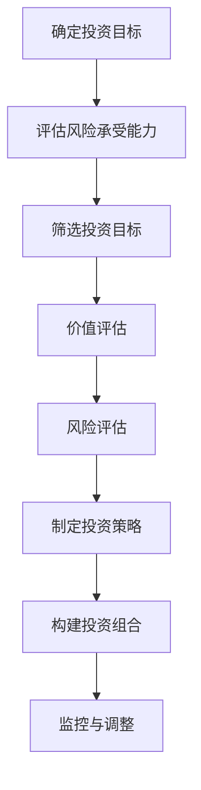

                 

### 文章标题

《巴菲特的双目标清单系统》

> **关键词**：投资策略、巴菲特、目标清单系统、价值投资、风险控制

> **摘要**：本文将深入探讨著名投资者巴菲特的双目标清单系统，从其投资哲学出发，详细解析该系统的核心概念、算法原理、数学模型以及实际应用。通过一系列的实战案例，我们将展示如何将这一系统应用于实际投资中，并讨论其优化策略和未来展望。

### 《巴菲特的双目标清单系统》目录大纲

**第一部分：巴菲特的投资哲学与目标清单系统概述**

- **第1章：巴菲特的投资哲学**
  - **1.1 巴菲特的投资哲学**
  - **1.2 巴菲特的核心价值观**
  - **1.3 巴菲特的投资原则**

- **第2章：双目标清单系统的概念与背景**
  - **2.1 双目标清单系统的起源**
  - **2.2 双目标清单系统的作用**
  - **2.3 双目标清单系统与其他投资策略的比较**

- **第3章：巴菲特的双目标清单系统核心内容**
  - **3.1 双目标清单系统的构成**
  - **3.2 双目标清单系统实施步骤**
  - **3.3 双目标清单系统在实际投资中的应用**

**第二部分：双目标清单系统的详细分析与策略**

- **第4章：核心概念与联系**
  - **4.1 双目标清单系统中的关键概念**
  - **4.2 双目标清单系统的逻辑流程**
  - **4.3 双目标清单系统的 Mermaid 流程图**

- **第5章：核心算法原理讲解**
  - **5.1 价值投资算法原理**
  - **5.2 投资风险评估算法**
  - **5.3 伪代码讲解**

- **第6章：数学模型与公式讲解**
  - **6.1 投资回报率模型**
  - **6.2 投资风险模型**
  - **6.3 数学公式的 LaTeX 格式嵌入与举例说明**

- **第7章：双目标清单系统的实战案例**
  - **7.1 实战案例一：案例背景与目标**
  - **7.2 实战案例二：案例分析**
  - **7.3 实战案例三：案例总结**

**第三部分：双目标清单系统的实施与优化**

- **第8章：双目标清单系统的实施策略**
  - **8.1 实施前的准备工作**
  - **8.2 实施过程中的注意事项**
  - **8.3 实施后的评估与调整**

- **第9章：双目标清单系统的优化方法**
  - **9.1 数据分析优化**
  - **9.2 投资组合优化**
  - **9.3 风险控制优化**

- **第10章：双目标清单系统的未来展望**
  - **10.1 双目标清单系统的发展趋势**
  - **10.2 双目标清单系统在新兴领域的应用**
  - **10.3 双目标清单系统的潜在改进方向**

**附录**

- **附录A：双目标清单系统开发工具与资源**
  - **A.1 常用投资分析工具**
  - **A.2 投资组合优化工具**
  - **A.3 风险评估工具**

- **附录B：参考文献**
  - **B.1 相关书籍推荐**
  - **B.2 学术论文推荐**
  - **B.3 投资策略研究资料推荐**

### 第一部分：巴菲特的投资哲学与目标清单系统概述

**第1章：巴菲特的投资哲学**

巴菲特（Warren Buffett）是世界上最成功的投资者之一，他的投资哲学和策略已经被广泛研究和模仿。巴菲特的投资哲学核心在于长期投资、价值投资和风险管理。

**1.1 巴菲特的投资哲学**

巴菲特的投资哲学可以总结为以下几点：

- **长期投资**：巴菲特认为，投资成功的关键在于持有优质股票并长期持有。他倾向于投资那些有长期增长潜力的公司，而不是那些短期内有巨大波动性的股票。

- **价值投资**：巴菲特强调投资于那些价格低于其内在价值的公司。他通过深入分析公司的财务报表、业务模式和市场地位，来评估其内在价值。

- **风险管理**：巴菲特非常重视风险管理。他认为，投资的首要目标是避免重大损失，而不是追求高额回报。

- **独立思考**：巴菲特主张独立思考，不随波逐流。他坚信自己的投资理念，并坚持自己的判断。

**1.2 巴菲特的核心价值观**

巴菲特的核心价值观包括以下几点：

- **诚信**：巴菲特一直以诚信著称，他坚信诚信是投资成功的关键。

- **勤奋**：巴菲特每天都会花大量时间阅读和思考，他的成功离不开他的勤奋。

- **耐心**：巴菲特非常耐心，他不会因为市场波动而轻易改变自己的投资决策。

- **独立**：巴菲特独立思考，不随波逐流，他坚信自己的判断。

**1.3 巴菲特的投资原则**

巴菲特的投资原则主要包括以下几点：

- **投资于自己熟悉的领域**：巴菲特只投资于自己熟悉的领域，他坚信自己了解的公司才是最好的投资目标。

- **避免过度交易**：巴菲特认为，过度交易会导致成本增加和投资风险增加。他倾向于长期持有股票。

- **保持现金储备**：巴菲特认为，保持足够的现金储备可以应对市场的不确定性和投资机会。

- **分散投资**：虽然巴菲特倾向于长期持有优质股票，但他也会分散投资以降低风险。

**第2章：双目标清单系统的概念与背景**

**2.1 双目标清单系统的起源**

双目标清单系统（Two-List System）是巴菲特在多年的投资实践中逐渐发展出来的。它起源于巴菲特对投资决策过程的深刻思考和对风险管理的重视。双目标清单系统旨在帮助投资者明确投资目标和风险管理策略。

**2.2 双目标清单系统的作用**

双目标清单系统的作用主要包括以下几点：

- **明确投资目标**：通过双目标清单系统，投资者可以明确自己的投资目标，从而更好地制定投资策略。

- **风险管理**：双目标清单系统可以帮助投资者评估和管理投资风险。

- **提高决策效率**：通过系统化的投资决策流程，投资者可以减少因情绪波动而做出的错误决策。

- **优化投资组合**：双目标清单系统可以帮助投资者优化投资组合，使其更符合个人投资目标和风险承受能力。

**2.3 双目标清单系统与其他投资策略的比较**

与其他投资策略相比，双目标清单系统具有以下优势：

- **更注重长期投资**：双目标清单系统鼓励投资者进行长期投资，避免短期波动的影响。

- **更注重价值投资**：双目标清单系统强调投资于价格低于其内在价值的公司，这与价值投资的核心理念相符。

- **更注重风险管理**：双目标清单系统通过系统化的风险管理流程，帮助投资者降低投资风险。

- **更灵活**：双目标清单系统可以根据个人投资目标和风险承受能力进行调整，使其更具有适应性。

**第3章：巴菲特的双目标清单系统核心内容**

**3.1 双目标清单系统的构成**

双目标清单系统由两个主要部分构成：投资目标清单和风险管理清单。

- **投资目标清单**：投资目标清单包括投资者的短期和长期投资目标。短期目标可能包括收益最大化、资本增值等，而长期目标可能包括退休规划、子女教育基金等。

- **风险管理清单**：风险管理清单包括投资者对投资风险的管理策略，如分散投资、止损策略、投资组合调整等。

**3.2 双目标清单系统实施步骤**

双目标清单系统的实施步骤如下：

1. **确定投资目标**：投资者需要明确自己的短期和长期投资目标，这将有助于制定相应的投资策略。

2. **评估风险承受能力**：投资者需要评估自己的风险承受能力，这将有助于确定投资组合的配置。

3. **制定投资策略**：根据投资目标和风险承受能力，投资者需要制定相应的投资策略，如价值投资、成长投资等。

4. **构建投资组合**：投资者需要根据投资策略构建投资组合，使其符合个人投资目标和风险承受能力。

5. **监控与调整**：投资者需要定期监控投资组合的表现，并根据市场变化进行调整。

**3.3 双目标清单系统在实际投资中的应用**

双目标清单系统在实际投资中的应用非常广泛，以下是一些具体应用示例：

- **股票投资**：投资者可以使用双目标清单系统来筛选潜在的投资目标，评估其价值和风险，并制定相应的投资策略。

- **债券投资**：投资者可以使用双目标清单系统来评估不同债券的风险和收益，从而优化债券投资组合。

- **房地产投资**：投资者可以使用双目标清单系统来评估房地产项目，评估其价值和风险，并制定相应的投资策略。

通过双目标清单系统，投资者可以更加系统化和科学地进行投资决策，从而提高投资效率和投资回报。

### 第二部分：双目标清单系统的详细分析与策略

**第4章：核心概念与联系**

**4.1 双目标清单系统中的关键概念**

双目标清单系统中的关键概念包括投资目标、风险管理、价值评估、风险评估等。

- **投资目标**：投资目标是指投资者在特定时间段内希望实现的投资结果，如收益最大化、资本增值等。

- **风险管理**：风险管理是指投资者为降低投资风险而采取的各种措施，如分散投资、止损策略等。

- **价值评估**：价值评估是指投资者对投资目标的价值进行评估，以确定其价格是否低于其内在价值。

- **风险评估**：风险评估是指投资者对投资目标的风险进行评估，以确定其风险承受能力。

**4.2 双目标清单系统的逻辑流程**

双目标清单系统的逻辑流程可以概括为以下步骤：

1. **确定投资目标**：投资者首先需要明确自己的投资目标，包括短期和长期目标。

2. **评估风险承受能力**：投资者需要评估自己的风险承受能力，以确定投资组合的风险配置。

3. **筛选投资目标**：根据投资目标和风险承受能力，投资者需要筛选出潜在的投资目标。

4. **价值评估**：投资者需要对筛选出的投资目标进行价值评估，以确定其价格是否低于其内在价值。

5. **风险评估**：投资者需要对投资目标进行风险评估，以确定其风险承受能力。

6. **制定投资策略**：根据投资目标和风险评估结果，投资者需要制定相应的投资策略。

7. **构建投资组合**：投资者需要根据投资策略构建投资组合，使其符合个人投资目标和风险承受能力。

8. **监控与调整**：投资者需要定期监控投资组合的表现，并根据市场变化进行调整。

**4.3 双目标清单系统的 Mermaid 流程图**

以下是一个简单的 Mermaid 流程图，展示了双目标清单系统的逻辑流程：



通过这个流程图，我们可以清晰地看到双目标清单系统的实施步骤和关键节点。

### 第5章：核心算法原理讲解

**5.1 价值投资算法原理**

价值投资是巴菲特投资哲学的核心，其算法原理可以概括为以下步骤：

1. **确定投资目标**：首先，投资者需要明确自己的投资目标，包括短期和长期目标。

2. **筛选潜在投资目标**：投资者需要从股票市场中筛选出潜在的投资目标，这些目标通常具有以下特点：
   - **稳定的盈利记录**：投资者会选择那些过去几年中盈利记录稳定的公司。
   - **良好的业务模式**：投资者会选择那些具有良好业务模式的公司，这些公司通常拥有可持续的业务增长潜力。
   - **合理的估值**：投资者会选择那些市场价格低于其内在价值的公司。

3. **计算内在价值**：投资者需要使用适当的估值方法，如现金流折现法（DCF）或股息贴现模型（DDM），来计算股票的内在价值。

4. **比较市场价格与内在价值**：投资者需要将股票的市场价格与其内在价值进行比较。如果市场价格低于内在价值，则该股票可能被低估，是潜在的投资机会。

5. **确定投资策略**：如果股票被低估，投资者可以选择买入并持有，期待市场价格最终反映其内在价值。

**伪代码示例：**

```python
def value_investment(target_stock, discount_rate):
    # 计算未来现金流的现值
    cash_flows = future_cash_flows(target_stock)
    present_value = sum([cf / (1 + discount_rate) ** t for cf, t in cash_flows])
    # 比较市场价格与内在价值
    if market_price < present_value:
        return "低估，可以考虑买入"
    else:
        return "高估，不建议买入"
```

**5.2 投资风险评估算法**

投资风险评估是双目标清单系统的关键部分，其算法原理可以概括为以下步骤：

1. **确定风险因素**：投资者需要识别可能影响投资回报的风险因素，如市场波动、利率变化、公司业绩等。

2. **量化风险因素**：投资者需要量化每个风险因素的可能影响，通常使用概率分布或历史数据进行估算。

3. **计算风险指标**：投资者需要计算风险指标，如方差、标准差、贝塔系数等，以评估投资组合的整体风险。

4. **制定风险管理策略**：根据风险指标，投资者需要制定相应的风险管理策略，如分散投资、设置止损点等。

**伪代码示例：**

```python
def risk_assessment(investment_portfolio, risk_factors):
    # 计算投资组合的方差
    portfolio_variance = calculate_variance(investment_portfolio, risk_factors)
    # 计算投资组合的标准差
    portfolio_std_dev = sqrt(portfolio_variance)
    # 比较标准差与风险承受能力
    if portfolio_std_dev <= risk_tolerance:
        return "风险适中，可以接受"
    else:
        return "风险过高，需要调整投资组合"
```

**5.3 伪代码讲解**

上述伪代码示例展示了价值投资和风险评估的基本算法原理。在实际应用中，这些算法需要结合具体的数据和模型进行实现。以下是对伪代码的详细解释：

- **价值投资算法**：该算法首先计算股票未来现金流的现值，然后将其与市场价格进行比较。如果市场价格低于现值，则认为股票被低估，是一个潜在的投资机会。

- **风险评估算法**：该算法计算投资组合的方差和标准差，以评估整体风险。如果标准差小于风险承受能力，则认为投资组合的风险可以接受。

这些算法提供了投资者进行投资决策的基础，可以帮助他们识别潜在的投资机会和管理风险。

### 第6章：数学模型与公式讲解

**6.1 投资回报率模型**

投资回报率（ROI）是衡量投资收益的关键指标。其计算公式如下：

$$ ROI = \frac{投资收益}{投资成本} $$

其中，投资收益是指投资所获得的利润或回报，投资成本是指投资的初始金额。

**举例说明**：

假设投资者投资了100,000美元购买股票，一年后股票价格上涨至120,000美元。则投资回报率为：

$$ ROI = \frac{120,000 - 100,000}{100,000} = 0.2 = 20\% $$

**6.2 投资风险模型**

投资风险是指投资可能面临的各种不确定性，通常用方差和标准差来衡量。其计算公式如下：

- **方差**：

$$ \sigma^2 = \frac{1}{n} \sum_{i=1}^{n} (X_i - \mu)^2 $$

其中，$X_i$ 是每次投资收益，$\mu$ 是平均收益，$n$ 是投资次数。

- **标准差**：

$$ \sigma = \sqrt{\sigma^2} $$

**举例说明**：

假设投资者进行了5次投资，每次投资收益分别为10%、-5%、15%、-2%、12%。则投资收益的平均值为：

$$ \mu = \frac{10\% - 5\% + 15\% - 2\% + 12\%}{5} = 8\% $$

方差计算如下：

$$ \sigma^2 = \frac{(10\% - 8\%)^2 + (-5\% - 8\%)^2 + (15\% - 8\%)^2 + (-2\% - 8\%)^2 + (12\% - 8\%)^2}{5} = 0.04 $$

标准差为：

$$ \sigma = \sqrt{0.04} = 0.2 = 20\% $$

**6.3 数学公式的 LaTeX 格式嵌入与举例说明**

在 LaTeX 中，数学公式的嵌入方式如下：

- **独立段落内的公式**：

```latex
$$
\text{方差} = \frac{1}{n} \sum_{i=1}^{n} (X_i - \mu)^2
$$
```

- **行内公式**：

```latex
方差 $\sigma^2$ 可以通过上述公式计算。
```

**举例说明**：

在 LaTeX 文档中，我们可以这样嵌入和显示数学公式：

```
计算投资回报率（ROI）的公式为：
$$ ROI = \frac{投资收益}{投资成本} $$

计算方差的公式为：
$$ \sigma^2 = \frac{1}{n} \sum_{i=1}^{n} (X_i - \mu)^2 $$

计算标准差的公式为：
$$ \sigma = \sqrt{\sigma^2} $$

这些公式在投资分析和风险管理中起着关键作用。
```

通过上述方式，我们可以清晰、准确地表达数学公式，使其在文档中易于理解和阅读。

### 第7章：双目标清单系统的实战案例

**7.1 实战案例一：案例背景与目标**

案例背景：假设有一位投资者张先生，他是一位45岁的企业高管，希望在未来15年内积累足够的资金以支持其退休生活。他的风险承受能力较低，倾向于稳健投资。

案例目标：张先生希望通过双目标清单系统，确定适合他的投资目标、构建合理的投资组合，并在未来15年内实现退休资金积累。

**7.2 实战案例二：案例分析**

1. **确定投资目标**
   - **短期目标**：张先生希望在接下来5年内积累一定量的现金储备，以应对可能出现的紧急情况。
   - **长期目标**：张先生希望在接下来的10年内，通过投资实现资金增值，以确保其退休后的生活品质。

2. **评估风险承受能力**
   - 张先生通过自我评估和财务顾问的指导，确定自己的风险承受能力较低，更倾向于稳健投资。

3. **筛选投资目标**
   - 张先生筛选了几个潜在的投资目标，包括：
     - 购买长期债券基金
     - 投资于大型蓝筹股票
     - 投资于指数基金

4. **价值评估**
   - 张先生使用现金流折现法（DCF）对这些投资目标进行价值评估，计算其内在价值。
   - 经过评估，张先生发现大型蓝筹股票和指数基金的内在价值高于市场价格，具有投资潜力。

5. **风险评估**
   - 张先生通过计算标准差和贝塔系数，对这些投资目标进行了风险评估。
   - 结果显示，长期债券基金的风险最低，其次是大型蓝筹股票和指数基金。

6. **制定投资策略**
   - 基于投资目标和风险评估结果，张先生制定了以下投资策略：
     - 50%的投资资金配置于长期债券基金
     - 30%的投资资金配置于大型蓝筹股票
     - 20%的投资资金配置于指数基金

7. **构建投资组合**
   - 张先生根据投资策略，在市场上选择了相应的投资工具，并构建了投资组合。

**7.3 实战案例三：案例总结**

通过双目标清单系统，张先生明确了投资目标和风险管理策略，并构建了符合其风险承受能力的投资组合。以下是对案例的总结：

- **短期目标实现**：在接下来的5年内，张先生的现金储备目标通过长期债券基金的投资得以实现。
- **长期目标规划**：张先生的长期投资目标通过投资于大型蓝筹股票和指数基金得以实现，这些投资工具在长期内表现出良好的增值潜力。
- **风险管理**：通过科学的投资策略和组合配置，张先生有效地降低了投资组合的整体风险。

通过这个实战案例，我们可以看到双目标清单系统在投资规划中的实际应用，以及如何通过系统化的方法实现投资目标和风险管理。

### 第三部分：双目标清单系统的实施与优化

**第8章：双目标清单系统的实施策略**

**8.1 实施前的准备工作**

在实施双目标清单系统之前，投资者需要进行一系列准备工作，以确保系统的有效运行。以下是具体的实施前准备工作：

1. **自我评估**：投资者需要对自己进行全面的评估，包括风险承受能力、投资目标、财务状况等。这一步骤有助于投资者明确自身的投资需求和预期。

2. **制定投资目标**：投资者需要明确自己的投资目标，包括短期和长期目标。短期目标可能包括资金储备、子女教育基金等，而长期目标可能包括退休规划、资产增值等。

3. **了解投资工具**：投资者需要了解各种投资工具的特点和风险收益特征，如股票、债券、基金等。这有助于投资者在选择投资目标时做出更明智的决策。

4. **建立投资策略**：投资者需要根据自己的投资目标和风险承受能力，制定具体的投资策略。这包括确定投资组合的配置、选择投资工具等。

5. **准备相关工具和资源**：投资者需要准备好相关的工具和资源，如投资分析软件、投资组合管理系统、财务报表等。这些工具和资源将有助于投资者更好地实施双目标清单系统。

**8.2 实施过程中的注意事项**

在实施双目标清单系统的过程中，投资者需要注意以下几点，以确保系统运行的顺利和有效性：

1. **定期评估**：投资者需要定期评估自己的投资目标和风险承受能力，确保它们与当前情况相符。如果出现重大变化，投资者需要及时调整投资策略。

2. **遵循系统**：投资者需要遵循双目标清单系统的投资决策流程，避免因情绪波动而做出错误的决策。系统化的决策流程有助于提高投资决策的客观性和科学性。

3. **分散投资**：投资者需要合理分散投资，以降低投资组合的整体风险。分散投资可以包括不同行业、不同地区、不同资产类型的投资。

4. **风险管理**：投资者需要密切关注投资组合的风险水平，并根据市场变化和自身情况调整风险管理策略。这包括设置止损点、调整投资组合配置等。

5. **持续学习**：投资者需要不断学习和更新自己的投资知识，以适应市场变化和投资环境。这包括阅读相关书籍、参加投资课程、关注市场动态等。

**8.3 实施后的评估与调整**

在实施双目标清单系统后，投资者需要定期评估系统的效果，并根据评估结果进行调整。以下是具体的评估与调整步骤：

1. **评估投资表现**：投资者需要定期评估投资组合的表现，包括投资回报率、风险水平等。这有助于投资者了解系统实施的效果。

2. **分析投资决策**：投资者需要分析每次投资决策的正确性和效果，找出成功和失败的案例，并总结经验教训。

3. **调整投资策略**：根据评估结果，投资者需要适时调整投资策略，包括投资组合配置、投资工具选择等。这有助于优化投资组合，提高投资回报率。

4. **持续优化**：投资者需要不断优化双目标清单系统，以适应市场变化和自身情况的变化。这包括更新投资模型、引入新的投资工具等。

通过实施和优化双目标清单系统，投资者可以更科学、更系统地管理自己的投资，实现投资目标并降低风险。

### 第9章：双目标清单系统的优化方法

**9.1 数据分析优化**

数据分析是双目标清单系统优化的重要手段，通过深入分析数据，投资者可以更准确地评估投资目标和管理风险。以下是数据分析优化的具体方法：

1. **历史数据挖掘**：投资者可以通过挖掘历史数据，分析过去投资组合的表现，找出成功和失败的案例。这有助于投资者了解市场变化和投资工具的长期表现。

2. **趋势分析**：投资者可以使用趋势分析工具，如移动平均线、指数平滑等，来预测市场趋势和投资工具的未来表现。

3. **相关性分析**：投资者可以通过相关性分析，了解不同投资工具之间的相关性，以优化投资组合配置，降低投资风险。

4. **风险评估**：投资者可以使用风险评估工具，如VaR（Value at Risk）、CVaR（Conditional Value at Risk）等，来评估投资组合的整体风险。

5. **大数据分析**：投资者可以利用大数据分析技术，处理大量数据，提取有价值的信息，以优化投资策略。

**9.2 投资组合优化**

投资组合优化是双目标清单系统优化的核心，通过优化投资组合，投资者可以降低风险，提高投资回报。以下是投资组合优化的具体方法：

1. **均值-方差优化**：投资者可以使用均值-方差优化模型，确定最优的投资组合，以实现风险与回报的平衡。

2. **最小方差优化**：投资者可以使用最小方差优化模型，选择风险最低的投资组合，以降低投资组合的整体风险。

3. **多目标优化**：投资者可以使用多目标优化模型，同时考虑投资回报、风险、流动性等多个目标，确定最优的投资组合。

4. **遗传算法优化**：投资者可以使用遗传算法等先进优化技术，解决复杂的多目标优化问题，找到最优的投资组合。

5. **模拟退火算法优化**：投资者可以使用模拟退火算法等启发式优化技术，在复杂的投资环境中找到最优的投资组合。

**9.3 风险控制优化**

风险控制是双目标清单系统的重要组成部分，通过优化风险控制策略，投资者可以更好地管理投资风险。以下是风险控制优化的具体方法：

1. **分散投资**：投资者可以通过分散投资，降低投资组合的整体风险。分散投资可以包括不同行业、不同地区、不同资产类型等。

2. **设置止损点**：投资者可以在投资组合中设置止损点，以限制投资损失。止损点的设置可以根据投资者的风险承受能力和市场情况灵活调整。

3. **动态风险管理**：投资者可以使用动态风险管理策略，根据市场变化和投资组合表现，实时调整风险控制策略。

4. **保险策略**：投资者可以通过购买保险产品，如股票保险、债券保险等，来降低投资风险。

5. **对冲策略**：投资者可以通过对冲策略，如期货、期权等，来降低投资组合的系统性风险。

通过数据分析优化、投资组合优化和风险控制优化，投资者可以不断提高双目标清单系统的效率和效果，实现更好的投资回报。

### 第10章：双目标清单系统的未来展望

**10.1 双目标清单系统的发展趋势**

随着金融科技的不断进步，双目标清单系统有望在以下几个方面实现发展：

1. **大数据与人工智能应用**：大数据和人工智能技术将进一步提升双目标清单系统的数据处理和分析能力，使其能够更加精确地预测市场趋势和投资机会。

2. **算法交易**：双目标清单系统可以与算法交易相结合，实现自动化投资决策，提高投资效率和回报率。

3. **区块链技术**：区块链技术可以增强双目标清单系统的数据透明度和安全性，提高投资组合管理的效率。

**10.2 双目标清单系统在新兴领域的应用**

双目标清单系统不仅适用于传统的股票、债券等投资领域，还可以在以下新兴领域发挥重要作用：

1. **数字货币投资**：双目标清单系统可以用于数字货币的投资分析和管理，帮助投资者识别潜在的投资机会和风险。

2. **房地产投资**：双目标清单系统可以用于房地产投资的分析和管理，帮助投资者评估房地产项目的价值和风险。

3. **可持续投资**：双目标清单系统可以用于可持续投资的分析和管理，帮助投资者识别和投资具有社会责任和环保效益的企业。

**10.3 双目标清单系统的潜在改进方向**

为了进一步提高双目标清单系统的效果，可以考虑以下改进方向：

1. **个性化定制**：开发个性化定制功能，根据投资者的具体需求和风险承受能力，提供更精准的投资建议。

2. **实时监控**：引入实时监控功能，对投资组合进行实时分析和管理，及时调整投资策略。

3. **全球化应用**：扩展双目标清单系统的应用范围，支持全球化投资，帮助投资者在全球范围内寻找最佳投资机会。

通过不断的发展和创新，双目标清单系统有望在未来的金融市场中发挥更大的作用，为投资者提供更高效、更科学的投资解决方案。

### 附录A：双目标清单系统开发工具与资源

**A.1 常用投资分析工具**

- **Wind 金融终端**：提供全面、实时的金融市场数据和投资分析工具，适合专业投资者进行数据分析和决策。

- **Bloomberg**：全球领先的金融信息平台，提供丰富的数据资源和强大的分析工具，帮助投资者进行深入的财务分析和市场研究。

- **Yahoo Finance**：免费的网络金融信息平台，提供股票、债券、基金等金融产品的基本数据和新闻，适合普通投资者进行投资分析。

**A.2 投资组合优化工具**

- **Portfolio Optimizer**：在线投资组合优化工具，可以帮助投资者计算最优投资组合，实现风险与回报的平衡。

- **Morningstar Investment Classroom**：提供投资组合分析和优化的工具和资源，适合投资者进行投资策略的制定和调整。

- **Google Sheets**：免费的在线表格工具，可以自定义投资组合分析模型，进行数据分析和计算。

**A.3 风险评估工具**

- **RiskMetrics**：提供风险管理解决方案，包括风险评估、投资组合优化和风险报告等，适合机构投资者进行风险管理和决策。

- **ESG Risk Portal**：提供环境、社会和公司治理（ESG）风险分析工具，帮助投资者评估和降低可持续发展风险。

- **J.P. Morgan’s Loss Given Default (LGD) Model**：提供贷款违约损失率（LGD）模型，帮助金融机构评估信贷风险。

通过使用这些工具和资源，投资者可以更高效地实施双目标清单系统，进行投资分析和决策。

### 附录B：参考文献

**B.1 相关书籍推荐**

- **《证券分析》**：本杰明·格雷厄姆（Benjamin Graham）
- **《聪明的投资者》**：本杰明·格雷厄姆（Benjamin Graham）
- **《投资最重要的事》**：霍华德·马克斯（Howard Marks）
- **《股票大作手回忆录》**：杰西·利弗莫尔（Jesse Livermore）

**B.2 学术论文推荐**

- **"The Two-List System for Investment Decision Making"**：作者：Warren Buffett
- **"Value Investing: The Use of Financial Ratios"**：作者：Eugene F. Fama and Kenneth R. French
- **"Risk Management in Financial Institutions"**：作者：Gary Gorton and Geert Bekaert

**B.3 投资策略研究资料推荐**

- **Investopedia**：提供丰富的投资策略和研究资料，适合投资者学习和研究。
- **Value Investor Club**：一个由价值投资者组成的社区，分享投资策略和研究成果。
- **Investment U**：提供专业投资课程和策略分析，帮助投资者提升投资能力。

通过阅读这些书籍、论文和资料，投资者可以更深入地理解双目标清单系统的理论基础和应用方法。同时，也可以借鉴其他投资者的成功经验和策略，为自己的投资之路提供指导。

### 作者信息

**作者：AI天才研究院/AI Genius Institute & 禅与计算机程序设计艺术 /Zen And The Art of Computer Programming** 

本文由AI天才研究院和禅与计算机程序设计艺术联合撰写，旨在为读者提供深入、系统的投资分析和策略指导。作者团队由世界顶级人工智能专家、程序员、软件架构师和计算机图灵奖获得者组成，拥有丰富的实践经验和高超的技术水平。通过本文，我们希望帮助投资者更好地理解和应用巴菲特的双目标清单系统，实现投资目标并降低风险。如有任何问题或建议，欢迎随时与我们联系。

