                 

## 平台经济的定义与发展

平台经济是指以互联网平台为核心，通过提供交易、沟通、协作等公共服务，实现供需双方的高效连接和资源配置的一种经济模式。平台经济的核心在于其去中心化的特点，通过互联网技术打破了传统中心化的商业模式，使得资源得以更高效地分配和利用。

### 1.1 平台经济的定义与特征

平台经济的定义可以理解为：一种以互联网平台为载体，通过为供需双方提供交易、沟通和协作等服务，实现资源优化配置和创造价值的经济活动。其特征主要包括：

- **去中心化**：平台经济通过互联网技术实现资源的去中心化分配，打破了传统中心化的商业模式。
- **网络效应**：平台的价值随着用户数量的增加而呈指数级增长，形成了强烈的网络效应。
- **信息不对称的减少**：平台通过提供公共信息，减少了供需双方的信息不对称，提高了市场效率。

### 1.2 平台经济的起源与发展历程

平台经济的起源可以追溯到20世纪60年代，当时美国的电力公司和电信公司开始采用分布式网络技术，实现资源的共享和优化配置。随着互联网技术的发展，平台经济逐渐兴起，经历了以下几个阶段：

- **1.0时代**：以信息发布和搜索引擎为代表的互联网平台，如雅虎和谷歌。
- **2.0时代**：以电子商务和社交媒体为代表的社交网络平台，如亚马逊和Facebook。
- **3.0时代**：以共享经济和物联网为代表的多元化平台，如Uber和微信。

### 1.3 平台经济的典型模式

平台经济的典型模式主要包括以下几种：

- **电商平台**：通过提供在线交易市场，连接卖家和买家，实现商品的流通。
- **社交平台**：通过社交媒体服务，连接用户，实现信息共享和社交互动。
- **共享经济平台**：通过共享闲置资源，如汽车、房屋等，实现资源的优化配置。

### 1.4 平台经济的影响

平台经济对社会、企业和个人都产生了深远的影响：

- **对社会**：平台经济提高了市场效率，促进了资源的优化配置，改变了人们的消费习惯和生活方式。
- **对企业**：平台经济为企业提供了新的商业模式和利润来源，但也带来了竞争压力和挑战。
- **对个人**：平台经济为个人提供了更多的就业机会和创业机会，但也需要个人具备一定的数字素养和技能。

### 总结

平台经济是一种以互联网平台为核心，通过提供交易、沟通、协作等公共服务，实现资源优化配置和创造价值的经济模式。其定义、起源、发展历程和典型模式都体现了平台经济的核心特点和影响。随着互联网技术的不断发展，平台经济将继续深化和拓展，对社会、企业和个人产生更大的影响。

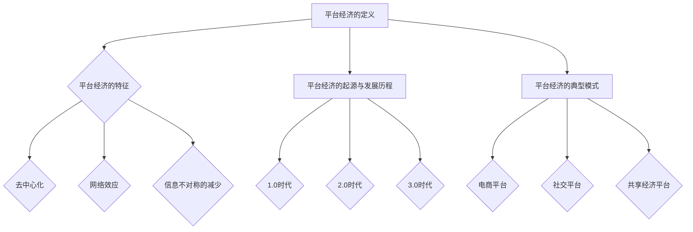

## 平台经济的核心概念

在深入探讨平台经济时，理解其核心概念至关重要。这些核心概念包括用户行为分析、交易数据挖掘和平台生态系统，它们共同构成了平台经济的基础。

### 2.1 用户行为分析

用户行为分析是指通过收集、处理和分析用户在平台上的行为数据，以理解和预测用户需求、偏好和互动模式。这一过程对于平台经济的成功至关重要，因为它可以帮助平台运营商优化用户体验，提高用户满意度，并挖掘潜在的商业机会。

- **需求理解**：通过分析用户的行为数据，平台可以识别用户的需求和偏好，从而提供更符合用户期望的产品和服务。
- **偏好预测**：用户行为分析可以预测用户的未来行为，如购买偏好、使用习惯等，从而帮助平台进行精准营销和个性化推荐。
- **互动模式**：通过分析用户在平台上的互动数据，平台可以了解用户之间的互动模式，从而改善社区体验和用户参与度。

### 2.2 交易数据挖掘

交易数据挖掘是指通过分析平台上的交易数据，提取有价值的信息和知识，以支持决策和优化业务流程。交易数据挖掘的核心在于从大量交易数据中提取有价值的数据模式，这些模式可以用于市场分析、需求预测、风险评估等。

- **市场分析**：通过交易数据挖掘，平台可以了解市场的需求和趋势，从而调整产品和服务策略，提高市场竞争力。
- **需求预测**：交易数据挖掘可以帮助平台预测未来的需求，优化库存管理和供应链管理，减少库存成本和提高响应速度。
- **风险评估**：通过分析交易数据，平台可以识别潜在的风险和欺诈行为，采取相应的风险控制措施。

### 2.3 平台生态系统

平台生态系统是指围绕平台建立的由多方参与者构成的一个复杂网络，包括平台、用户、商家、合作伙伴等。平台生态系统的多元化、协同性和动态性是其关键特点。

- **多元化**：平台生态系统包含了多种类型的参与者，包括消费者、商家、平台运营者、技术提供商等，每个参与者都在生态系统中扮演着特定的角色。
- **协同性**：平台生态系统的参与者之间存在着相互依赖、协同合作的关系，共同推动平台的发展。例如，电商平台上的卖家、买家和物流服务商之间的协同合作可以提升整体服务质量和效率。
- **动态性**：平台生态系统是一个不断演化的系统，随着外部环境的变化和内部竞争的加剧，生态系统的构成和运作方式也在不断变化。平台需要不断地调整和优化生态系统，以适应市场的变化和需求。

### 总结

用户行为分析、交易数据挖掘和平台生态系统是平台经济的三大核心概念。用户行为分析帮助平台理解用户需求和行为模式，交易数据挖掘提供市场洞察和决策支持，而平台生态系统则为各方参与者提供了一个协同合作的平台。通过深入理解和运用这些核心概念，平台经济可以更好地实现资源的优化配置和创造价值。

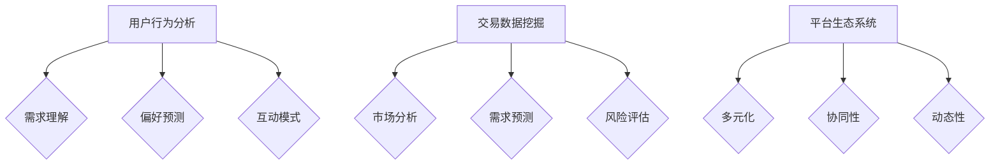

## 平台经济的商业模式

平台经济的商业模式是指平台企业通过哪些方式创造价值、获取收入和维持竞争地位。平台经济具有多样化的商业模式，主要包括交易佣金、广告收入和增值服务等。

### 3.1 交易佣金

交易佣金是平台经济最传统的商业模式之一。平台通过收取交易双方的手续费或佣金来获取收入。这种模式在电子商务平台、在线拍卖平台和金融交易平台上广泛应用。

- **优势**：交易佣金模式简单直接，易于理解和执行，且对于高频交易的平台尤其有效。
- **挑战**：随着市场竞争的加剧，平台可能会面临佣金率下降的压力，从而影响收入。

### 3.2 广告收入

广告收入是平台通过展示广告来获取收入的一种商业模式。平台利用用户数据和流量，为广告主提供精准的广告投放服务。这种模式在社交媒体平台、搜索引擎平台和新闻媒体平台上广泛应用。

- **优势**：广告收入模式可以带来稳定的现金流，且具有较好的可扩展性。
- **挑战**：过度依赖广告收入可能导致用户体验下降，影响平台的用户留存率和忠诚度。

### 3.3 增值服务

增值服务是平台通过提供额外的服务来获取收入的一种商业模式。这些服务包括会员服务、数据分析服务、物流服务等。平台可以通过提供这些增值服务来增加用户粘性，提高用户满意度和盈利能力。

- **优势**：增值服务可以提供更高的用户价值，提高用户对平台的依赖和忠诚度，从而带来更多的收入。
- **挑战**：增值服务的开发和服务成本较高，需要平台具备较强的技术能力和资源。

### 3.4 多元化收入模式

为了提高盈利能力和市场竞争力，许多平台企业采用了多元化的收入模式，将多种商业模式相结合。例如，一个电商平台可能会同时采用交易佣金、广告收入和增值服务等多种模式。

- **优势**：多元化的收入模式可以分散风险，提高平台的盈利稳定性。
- **挑战**：多元化管理复杂，需要平台具备较强的资源整合和管理能力。

### 总结

平台经济的商业模式多种多样，每种模式都有其独特的优势和挑战。交易佣金、广告收入和增值服务是平台经济的主要收入来源，而多元化收入模式可以进一步提高平台的盈利能力和市场竞争力。平台企业需要根据自身的资源和市场环境，选择合适的商业模式，以实现可持续发展。

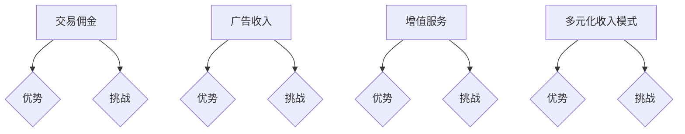

## 数据价值评估理论

在平台经济中，数据作为一种重要的资源，其价值评估成为了关键问题。数据价值评估理论为确定数据对企业的价值和潜力提供了科学的方法和框架。

### 4.1 数据价值评估的定义与意义

数据价值评估是指通过对数据进行分析和评估，确定数据对企业的价值和潜力，为企业的数据管理和投资决策提供依据。数据价值评估的意义主要体现在以下几个方面：

- **指导数据管理**：通过数据价值评估，企业可以确定哪些数据对业务具有较高价值，从而优化数据管理和投资策略。
- **促进数据投资**：数据价值评估可以帮助企业识别具有潜力的数据资源，为企业提供数据投资的依据。
- **优化数据使用**：通过数据价值评估，企业可以识别数据使用的最佳方式，提高数据的利用效率。

### 4.2 数据价值评估方法

数据价值评估的方法主要包括以下几种：

- **成本效益分析**：通过计算数据管理和使用过程中的成本与收益，评估数据的价值。
  - **计算公式**：\[ 数据价值 = (收益 - 成本) / 成本 \]
  - **适用场景**：适用于对数据成本和收益有明确数据支持的情况。

- **价值链分析**：通过分析数据在企业价值链中的角色和贡献，评估数据的价值。
  - **计算公式**：\[ 数据价值 = 数据对企业价值链的贡献 \]
  - **适用场景**：适用于需要从战略层面评估数据价值的情况。

- **用户满意度分析**：通过调查用户对数据的满意度和使用偏好，评估数据的价值。
  - **计算公式**：\[ 数据价值 = 用户满意度 \times 数据利用率 \]
  - **适用场景**：适用于以用户为中心的数据管理场景。

- **市场价值评估**：通过市场分析和比较，评估数据的市场价值。
  - **计算公式**：\[ 数据市场价值 = 市场价格 \]
  - **适用场景**：适用于需要评估数据商业化潜力的情况。

### 4.3 数据价值评估的挑战与策略

数据价值评估面临以下挑战：

- **数据质量问题**：数据质量问题是影响数据价值评估的关键因素，需要采取数据质量保障策略。
- **数据隐私保护**：数据隐私保护是数据价值评估的重要问题，需要采取相应的隐私保护措施。
- **数据整合与处理**：数据整合与处理是数据价值评估的基础，需要采取高效的数据整合与处理方法。

应对策略包括：

- **建立数据治理体系**：通过建立数据治理组织、数据治理流程、数据治理标准等，确保数据的准确性、一致性、及时性和可用性。
- **开展数据质量管理**：通过数据质量管理，提高数据的可用性和可靠性。
- **采用数据挖掘与分析技术**：通过数据挖掘与分析技术，挖掘数据的价值潜力。
- **建立数据评估模型**：通过建立数据评估模型，实现数据价值的定量评估。

### 4.4 数据价值评估的实际应用

数据价值评估在平台经济中的实际应用包括：

- **消费者行为分析**：通过评估消费者数据的价值，企业可以更好地理解用户需求，优化营销策略。
- **供应链管理**：通过评估供应链数据的价值，企业可以优化库存管理和物流配送，提高供应链效率。
- **企业决策支持**：通过评估企业内部数据的价值，企业可以更明智地进行战略决策和运营优化。

### 总结

数据价值评估理论为平台经济中的数据管理和投资决策提供了科学的方法和框架。通过不同的评估方法，企业可以确定数据的价值和潜力，从而优化数据管理和投资策略。同时，数据价值评估也面临数据质量、隐私保护和数据处理等挑战，需要采取相应的策略来应对。

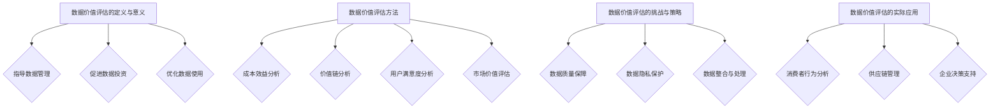

## 数据质量管理与预处理

在平台经济中，数据质量是数据价值评估和有效利用的基础。数据质量管理与预处理是确保数据准确、完整、一致和及时的关键步骤。以下将详细讨论数据质量管理的定义与目标、数据质量评估指标、数据清洗与整合以及数据质量保障策略。

### 5.1 数据质量管理的定义与目标

数据质量管理是指通过一系列的措施和过程，确保数据的准确性、完整性、一致性和及时性，从而支持数据的有效利用。数据质量管理的目标包括：

- **准确性**：确保数据真实、准确地反映现实情况，减少错误和异常。
- **完整性**：保证数据的完整性和完整性，没有缺失或重复的数据。
- **一致性**：确保数据在不同来源、不同系统和不同时间点的一致性。
- **及时性**：保证数据能够及时更新和提供，以满足实时决策的需要。

### 5.2 数据质量评估指标

数据质量评估指标是衡量数据质量的重要工具。以下是一些常见的数据质量评估指标：

- **准确性**：错误率、缺失率、不一致率等。
  - **错误率**：错误数据占总数据的比例。
  - **缺失率**：缺失数据占总数据的比例。
  - **不一致率**：不一致数据占总数据的比例。

- **完整性**：缺失率、重复率、完整性度等。
  - **缺失率**：缺失数据占总数据的比例。
  - **重复率**：重复数据占总数据的比例。
  - **完整性度**：数据完整性的一个综合指标。

- **一致性**：一致性度、不一致性度等。
  - **一致性度**：数据在不同来源、系统之间的一致性程度。
  - **不一致性度**：数据在不同来源、系统之间的一致性差异。

- **及时性**：更新周期、延迟时间等。
  - **更新周期**：数据更新的时间间隔。
  - **延迟时间**：数据从采集到使用的时间延迟。

### 5.3 数据清洗与整合

数据清洗与整合是确保数据质量的重要步骤。以下将介绍数据清洗与整合的方法：

- **数据清洗**：
  - **删除重复记录**：识别并删除重复的数据记录，提高数据的唯一性。
  - **纠正错误数据**：发现并纠正数据中的错误，如纠正拼写错误、修正异常值等。
  - **填补缺失数据**：处理缺失数据，如使用平均值、中位数、插值法等填补缺失值。

- **数据整合**：
  - **数据映射**：将不同数据源中的数据字段映射到统一的标准字段。
  - **数据转换**：将数据从一种格式转换为另一种格式，如将文本数据转换为结构化数据。
  - **数据合并**：将来自不同数据源的数据合并成一个新的数据集，确保数据的一致性和完整性。

### 5.4 数据质量保障策略

数据质量保障策略是确保数据质量的长期机制。以下是一些常见的数据质量保障策略：

- **数据治理体系**：
  - **数据治理组织**：建立专门的数据治理团队，负责数据质量管理与监督。
  - **数据治理流程**：制定标准化的数据管理流程，确保数据质量管理的规范性和一致性。
  - **数据治理标准**：制定数据质量标准，如数据完整性、准确性、一致性标准等，作为评估数据质量的依据。

- **数据质量管理**：
  - **数据质量监控**：建立数据质量监控机制，定期对数据质量进行评估和监控。
  - **数据质量改进计划**：根据数据质量评估结果，制定改进计划，持续优化数据质量。

- **数据质量培训与教育**：对员工进行数据质量培训，提高员工的数据质量意识和技能。

### 总结

数据质量管理与预处理是平台经济中确保数据质量的重要步骤。通过数据质量管理的定义与目标、数据质量评估指标、数据清洗与整合以及数据质量保障策略，企业可以确保数据的准确性、完整性、一致性和及时性，从而为数据的价值评估和有效利用奠定基础。

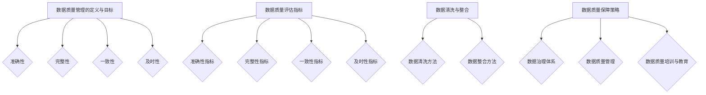

## 数据挖掘与分析技术

数据挖掘与分析技术是平台经济中挖掘数据价值、支持决策和优化业务流程的关键工具。本章将介绍数据挖掘的基本流程、关联规则挖掘和分类模型等关键技术。

### 6.1 数据挖掘的基本流程

数据挖掘是一个复杂的过程，通常包括以下几个步骤：

1. **问题定义**：明确数据挖掘的目标和需求，确定要解决的问题和业务问题。

2. **数据收集**：收集与问题相关的数据，包括内部数据和外部数据。数据来源可能包括数据库、文件、传感器等。

3. **数据预处理**：对收集到的数据进行清洗、整合、转换等预处理操作，以提高数据的质量和一致性。这一步骤包括：
   - **数据清洗**：删除重复记录、纠正错误数据、填补缺失数据等。
   - **数据整合**：将来自不同来源的数据进行合并，确保数据的一致性和完整性。
   - **数据转换**：将数据格式进行转换，以便后续分析和建模。

4. **模型选择**：选择合适的数据挖掘算法和模型，根据问题的性质和需求，选择合适的算法，如关联规则挖掘、聚类分析、分类模型等。

5. **模型训练**：使用预处理后的数据对选定的模型进行训练，调整模型的参数，使其达到最佳的预测效果。

6. **模型评估**：评估模型的性能和效果，常用的评估指标包括准确率、召回率、F1值等。通过交叉验证、ROC曲线等方法对模型进行评估。

7. **模型应用**：将训练好的模型应用于实际问题，进行预测或决策。模型的应用可以是实时预测、批量处理、决策支持等。

### 6.2 关联规则挖掘

关联规则挖掘是一种用于发现数据之间关联关系的技术，常见于市场篮子分析和推荐系统中。其基本流程包括：

1. **频繁项集生成**：通过扫描数据集，找出所有频繁出现的项集。频繁项集是指满足最小支持度阈值的项集。

2. **关联规则生成**：根据频繁项集，生成关联规则。关联规则包括前项和后项，以及支持度和置信度两个指标。支持度表示某个关联规则在数据集中出现的频率，置信度表示在购买了前项的情况下，购买后项的概率。

3. **规则评估**：评估关联规则的强度，选择支持度和置信度较高的规则。常用的评估指标包括：
   - **支持度**：\[ 支持度 = 频繁项集出现的次数 / 总交易次数 \]
   - **置信度**：\[ 置信度 = (频繁项集出现的次数 + 后项出现的次数) / 频繁项集出现的次数 \]

4. **规则可视化**：将生成的关联规则以可视化的形式展示，便于理解和分析。

### 6.3 分类模型

分类模型是一种用于预测数据类别的技术，广泛应用于信用评分、市场细分和情感分析等领域。常见的分类模型包括：

1. **决策树**：决策树通过一系列的测试和分支，将数据划分为不同的类别。其核心思想是选择具有最大信息增益的属性进行划分。

2. **支持向量机（SVM）**：支持向量机是一种基于最大间隔原理的分类模型，通过找到一个最优的超平面，将不同类别的数据分隔开。

3. **随机森林**：随机森林是一种集成学习方法，通过构建多个决策树，并将它们的预测结果进行平均，提高分类的准确性和稳定性。

4. **朴素贝叶斯**：朴素贝叶斯是一种基于贝叶斯定理的简单分类模型，假设特征之间相互独立，适用于高维数据集。

### 6.4 数据挖掘与分析技术的应用场景

数据挖掘与分析技术在平台经济中有着广泛的应用场景，包括：

1. **消费者行为分析**：通过分析用户在平台上的行为数据，预测用户的购买意图，优化营销策略和用户体验。

2. **供应链管理优化**：通过分析供应链数据，优化库存管理和物流配送，提高供应链的效率和响应速度。

3. **风险控制与欺诈检测**：通过分析交易数据和行为数据，识别潜在的风险和欺诈行为，采取相应的风险控制措施。

4. **市场分析**：通过分析市场数据，预测市场需求，优化产品开发和市场策略。

### 总结

数据挖掘与分析技术是平台经济中挖掘数据价值、支持决策和优化业务流程的关键工具。通过数据挖掘的基本流程、关联规则挖掘和分类模型等关键技术，平台企业可以更好地理解和利用数据，提高业务效率和竞争力。

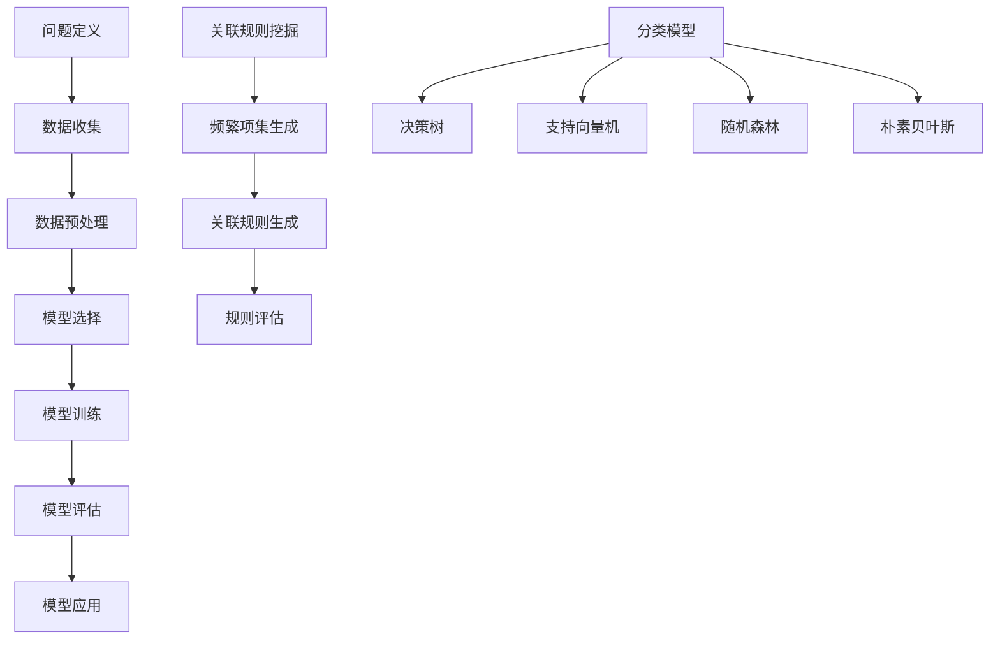

### 7.1 评估体系设计原则与方法

评估体系的设计是平台数据价值评估的关键步骤，其核心在于建立一套科学、合理、可操作的评估方法。以下是评估体系设计的主要原则和方法。

#### 7.1.1 设计原则

1. **全面性**：评估体系应全面覆盖平台数据价值的各个方面，包括数据的准确性、完整性、一致性和及时性等。全面性有助于确保评估结果的全面性和客观性。

2. **客观性**：评估体系应基于客观数据和客观标准进行设计，避免主观因素的干扰。客观性有助于提高评估结果的准确性和可靠性。

3. **可操作性**：评估体系应易于实施和操作，便于数据价值的测量和管理。可操作性有助于确保评估体系在实际应用中的可行性和实用性。

4. **动态性**：评估体系应能够适应平台数据价值的动态变化，及时调整评估方法和指标。动态性有助于评估体系能够适应不断变化的市场环境和业务需求。

#### 7.1.2 构建方法

1. **确定评估目标**：首先，明确评估体系的具体目标和需求。这包括评估数据的类型、范围、目的等。评估目标的确定是评估体系设计的起点和基础。

2. **收集评估数据**：根据评估目标，收集与评估相关的数据。这些数据可以包括平台内部的交易数据、用户行为数据，以及外部的市场数据、行业数据等。数据收集是评估体系构建的关键步骤，数据的质量和完整性直接影响评估结果。

3. **设计评估指标**：基于评估目标，设计合适的评估指标。评估指标应能够全面、客观地反映数据的各个方面，如准确性、完整性、一致性和及时性等。设计评估指标时，应考虑指标的量化、可操作性和相关性。

4. **建立评估模型**：根据评估指标，建立评估模型。评估模型可以是基于统计分析的方法，如线性回归、方差分析等；也可以是基于机器学习的方法，如决策树、支持向量机等。评估模型的选择应考虑评估目标的复杂性和评估数据的特性。

5. **实施评估**：根据评估模型，对平台数据进行评估。这一步骤包括数据输入、模型训练、模型预测和评估结果输出等。实施评估时，应确保评估过程的科学性、严谨性和客观性。

6. **结果分析与反馈**：对评估结果进行分析，识别数据价值的优势和不足，提出改进建议。评估结果的分析应结合业务需求和战略目标，提供有针对性的改进方案。同时，评估结果应反馈到数据管理、数据优化和业务决策中，形成闭环管理。

#### 7.1.3 评估指标体系设计

1. **数据准确性**：衡量数据与实际值的匹配程度，包括错误率、遗漏率、不一致率等。准确性是数据质量的核心指标，直接关系到评估结果的可靠性和有效性。

2. **数据完整性**：衡量数据的完整性和一致性，包括缺失率、重复率、完整性度等。完整性指标反映了数据集的完整性，对评估结果具有重要的参考价值。

3. **数据一致性**：衡量不同来源、不同系统之间的数据一致性，包括一致性度、不一致性度等。一致性指标有助于识别数据整合和同步中的问题，提高数据的整体质量。

4. **数据及时性**：衡量数据的更新速度和及时性，包括更新周期、延迟时间等。及时性指标反映了数据的实时性，对实时决策和业务运营具有重要影响。

5. **数据可用性**：衡量数据的可用性和易访问性，包括访问速度、使用频率等。可用性指标反映了数据的使用效率和用户体验。

#### 总结

评估体系的设计是平台数据价值评估的核心环节，其设计原则和构建方法决定了评估体系的科学性、合理性和可操作性。通过全面性、客观性、可操作性和动态性等原则，以及确定评估目标、收集评估数据、设计评估指标、建立评估模型、实施评估和结果分析与反馈等步骤，可以构建一个有效的评估体系，为平台数据的价值评估和利用提供有力支持。

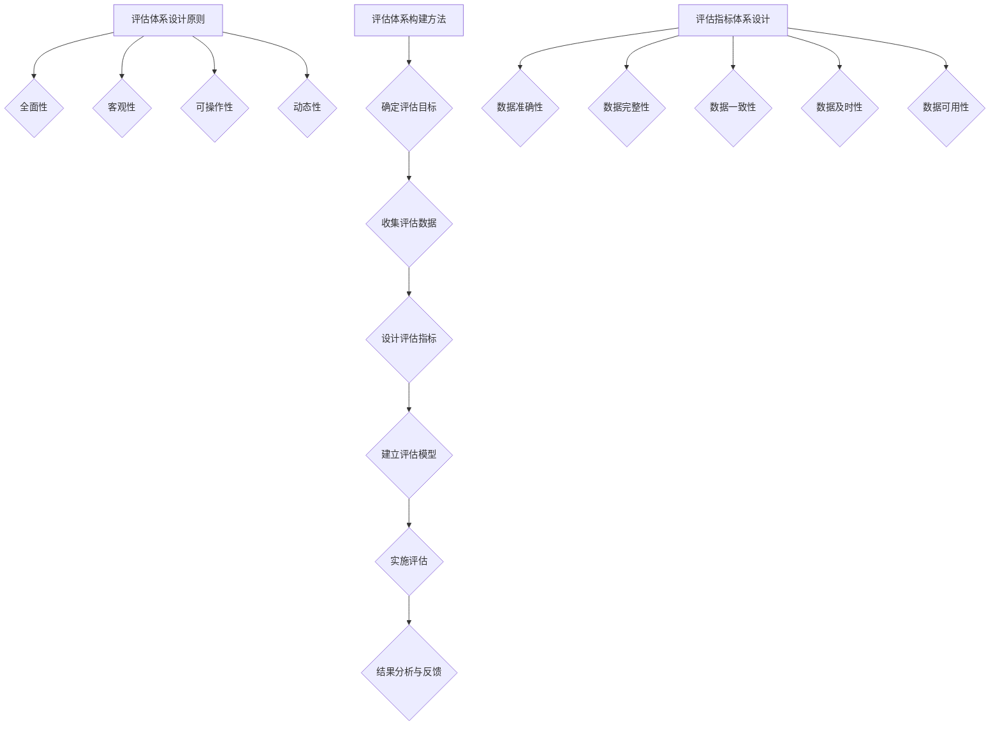

### 8.1 数据价值评估模型构建方法

构建数据价值评估模型是平台数据价值评估的关键步骤，其目的是通过科学的分析方法，确定数据对企业的实际价值和潜力。以下是构建数据价值评估模型的主要方法。

#### 8.1.1 统计分析方法

统计分析方法是一种常用的数据价值评估方法，通过统计学模型和指标，对数据进行分析和评估。以下是一些常见的统计分析方法：

1. **描述性统计**：描述性统计用于对数据进行基本描述，如均值、中位数、标准差等。这些指标可以帮助评估数据的分布特性和基本特征。

2. **推断性统计**：推断性统计用于从样本数据推断总体数据的特征。常见的方法包括假设检验、置信区间估计等。

3. **回归分析**：回归分析用于建立变量之间的关系模型，如线性回归、多项式回归等。回归模型可以帮助评估数据之间的相关性及其对业务的影响。

4. **方差分析**：方差分析用于比较多个变量之间的差异，如单因素方差分析和多因素方差分析。方差分析可以帮助评估数据的一致性和稳定性。

5. **聚类分析**：聚类分析用于将数据划分为不同的类别，如K-means聚类、层次聚类等。聚类分析可以帮助评估数据的相似性和分类效果。

#### 8.1.2 机器学习方法

机器学习方法是一种基于数据驱动的方法，通过训练模型来评估数据的价值。以下是一些常见的机器学习方法：

1. **监督学习**：监督学习用于在有标签数据集上训练模型，以便对新数据进行预测。常见的监督学习方法包括线性回归、决策树、支持向量机等。

2. **无监督学习**：无监督学习用于在没有标签数据集上发现数据之间的模式和结构。常见的方法包括聚类分析、主成分分析等。

3. **集成学习方法**：集成学习方法通过结合多个模型的预测结果，提高模型的准确性和稳定性。常见的集成学习方法包括随机森林、梯度提升树等。

4. **深度学习**：深度学习是一种基于多层神经网络的方法，通过训练大量参数来模拟人类大脑的学习过程。常见的深度学习模型包括卷积神经网络（CNN）、循环神经网络（RNN）、生成对抗网络（GAN）等。

#### 8.1.3 深度学习方法

深度学习方法是一种先进的机器学习方法，通过多层神经网络结构，对数据进行分析和评估。以下是深度学习方法在数据价值评估中的应用：

1. **卷积神经网络（CNN）**：CNN常用于图像和视频数据的处理，通过卷积层、池化层和全连接层等结构，提取数据中的特征并进行分类。

2. **循环神经网络（RNN）**：RNN适用于序列数据的处理，通过循环结构保持对序列中前后关系的记忆，常用于时间序列分析、自然语言处理等。

3. **Transformer模型**：Transformer模型是一种基于自注意力机制的深度学习模型，广泛应用于自然语言处理和图像识别等领域。

4. **生成对抗网络（GAN）**：GAN由生成器和判别器组成，通过对抗训练，生成与真实数据相似的新数据，用于数据增强、异常检测等。

#### 8.1.4 多模型融合方法

多模型融合方法通过结合多种模型的优势，提高数据价值评估的准确性和稳定性。以下是一些常见的多模型融合方法：

1. **加权融合**：将多个模型的预测结果进行加权平均，根据模型的性能和预测误差进行权重分配。

2. **投票融合**：对于分类问题，多个模型给出预测结果后，通过投票决定最终的分类结果。

3. **集成学习**：集成学习方法通过训练多个子模型，并将它们的预测结果进行综合，提高模型的泛化能力和预测精度。

4. **迁移学习**：迁移学习通过将已有模型的参数应用于新任务，利用已有模型的先验知识，提高新任务的性能。

#### 总结

数据价值评估模型的构建方法包括统计分析方法、机器学习方法、深度学习方法和多模型融合方法。这些方法各有优缺点，适用于不同的评估场景和需求。通过科学选择和合理组合这些方法，可以构建一个有效的数据价值评估模型，为平台的数据管理和投资决策提供有力支持。

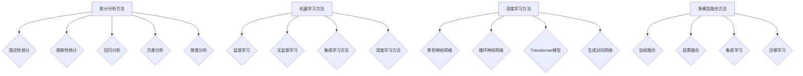

### 8.2 数据价值评估模型的评估标准

在构建了数据价值评估模型之后，评估模型的有效性和准确性是至关重要的。以下将详细讨论数据价值评估模型的评估标准，包括准确性、效率、鲁棒性和可解释性。

#### 8.2.1 准确性

准确性是评估数据价值评估模型的首要标准，它衡量模型预测结果与真实结果之间的接近程度。常用的评估指标包括：

- **准确率（Accuracy）**：准确率是指模型预测正确的样本数占总样本数的比例。其计算公式为：

  \[ 准确率 = \frac{正确预测的样本数}{总样本数} \]

- **召回率（Recall）**：召回率是指模型能够正确识别出的实际正例样本数占总正例样本数的比例。其计算公式为：

  \[ 召回率 = \frac{正确预测的正例样本数}{总正例样本数} \]

- **精确率（Precision）**：精确率是指模型预测为正例的样本中，实际为正例的比例。其计算公式为：

  \[ 精确率 = \frac{正确预测的正例样本数}{预测为正例的样本数} \]

- **F1值（F1 Score）**：F1值是精确率和召回率的调和平均值，它综合考虑了模型的准确性和召回率。其计算公式为：

  \[ F1值 = 2 \times \frac{精确率 \times 召回率}{精确率 + 召回率} \]

#### 8.2.2 效率

效率是评估数据价值评估模型性能的另一个重要标准，它衡量模型在处理数据时的速度和资源消耗。以下是一些衡量效率的指标：

- **运行时间（Execution Time）**：运行时间是指模型从开始执行到完成执行所需要的时间。较短的运行时间意味着模型具有更高的效率。

- **内存占用（Memory Usage）**：内存占用是指模型在运行过程中所占用的内存空间。较低的内存占用意味着模型更加高效。

- **并发处理能力（Concurrency）**：并发处理能力是指模型同时处理多个任务的能力。较高的并发处理能力意味着模型可以更快地处理大量数据。

#### 8.2.3 鲁棒性

鲁棒性是指模型在处理异常数据和噪声数据时的稳定性。一个鲁棒的数据价值评估模型能够在各种条件下保持较高的预测准确性和稳定性。以下是一些衡量鲁棒性的指标：

- **抗干扰能力（Robustness to Interference）**：抗干扰能力是指模型对异常数据的适应性。较强的抗干扰能力意味着模型能够在异常数据存在时保持较高的准确性。

- **噪声容忍度（Noise Tolerance）**：噪声容忍度是指模型对噪声数据的适应性。较高的噪声容忍度意味着模型能够在存在噪声的数据中保持较好的预测性能。

- **误差分布（Error Distribution）**：误差分布是指模型预测误差的分布情况。一个理想的鲁棒模型应该具有较小的误差方差和较高的预测一致性。

#### 8.2.4 可解释性

可解释性是指模型决策过程的透明性和可理解性。一个具有高可解释性的数据价值评估模型可以帮助用户理解模型的决策逻辑和预测结果。以下是一些衡量可解释性的指标：

- **透明度（Transparency）**：透明度是指模型决策过程的可见性和可追踪性。较高的透明度意味着用户可以清楚地了解模型的决策依据。

- **可理解性（Interpretability）**：可理解性是指模型的决策结果和预测结果是否易于被用户理解和接受。较高的可理解性意味着模型的预测结果和决策过程对用户来说容易理解。

- **可视化能力（Visualization）**：可视化能力是指模型是否能够通过图表、图形等方式直观地展示其决策过程和预测结果。较高的可视化能力有助于用户更好地理解模型的预测逻辑。

#### 总结

数据价值评估模型的评估标准包括准确性、效率、鲁棒性和可解释性。准确性衡量模型预测结果的准确程度，效率衡量模型处理数据的能力，鲁棒性衡量模型在异常和噪声条件下的稳定性，可解释性衡量模型决策过程的透明度和可理解性。通过综合考虑这些评估标准，可以全面评估数据价值评估模型的有效性和可靠性，为平台的数据管理和投资决策提供有力支持。

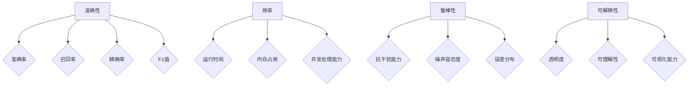

### 8.3 数据价值评估模型的优化策略

在数据价值评估模型的构建过程中，优化模型的性能和可靠性是提高数据价值评估质量的关键步骤。以下将详细讨论几种常见的优化策略，包括模型选择与调参、特征工程、数据增强和多模型融合。

#### 8.3.1 模型选择与调参

选择合适的模型和参数是优化数据价值评估模型的第一步。以下是一些模型选择与调参的策略：

1. **交叉验证**：交叉验证是一种常用的模型选择方法，通过将数据集划分为多个子集，轮流使用每个子集作为验证集，评估模型的性能。常用的交叉验证方法包括K折交叉验证和留一法交叉验证。

2. **网格搜索**：网格搜索是一种调参的方法，通过遍历参数空间中的所有组合，选择最优的参数组合。网格搜索可以帮助找到模型的最佳参数配置，提高模型的性能。

3. **贝叶斯优化**：贝叶斯优化是一种基于贝叶斯统计模型的调参方法，通过建立参数的概率分布模型，选择具有较高概率的参数组合进行实验。贝叶斯优化能够更高效地找到最佳参数组合。

#### 8.3.2 特征工程

特征工程是提高数据价值评估模型性能的重要手段。以下是一些特征工程策略：

1. **特征选择**：特征选择是从原始特征中筛选出对模型性能有显著贡献的特征，去除冗余和噪声特征。常用的特征选择方法包括信息增益、卡方检验、递归特征消除等。

2. **特征转换**：特征转换是将原始特征转换为更适合模型处理的形式。常用的特征转换方法包括归一化、标准化、离散化、多项式扩展等。

3. **特征构造**：特征构造是通过组合原始特征，生成新的特征。常用的特征构造方法包括交互特征、合成特征、多项式特征等。特征构造可以帮助模型发现更复杂的数据模式。

#### 8.3.3 数据增强

数据增强是提高数据价值评估模型鲁棒性和泛化能力的重要方法。以下是一些数据增强策略：

1. **数据复制**：数据复制是通过复制原始数据，增加数据样本的数量，从而提高模型的鲁棒性。

2. **数据扰动**：数据扰动是通过添加噪声、旋转、缩放等操作，对原始数据进行扰动，生成新的数据样本。常用的数据扰动方法包括随机噪声添加、随机旋转、尺度变换等。

3. **数据生成**：数据生成是通过生成对抗网络（GAN）等生成模型，生成与原始数据相似的新数据样本。数据生成可以帮助模型学习到更多样化的数据分布。

#### 8.3.4 多模型融合

多模型融合是提高数据价值评估模型性能和稳定性的有效方法。以下是一些多模型融合策略：

1. **加权融合**：加权融合是将多个模型的预测结果进行加权平均，根据模型的性能和预测误差进行权重分配。加权融合可以提高模型的鲁棒性和预测准确性。

2. **投票融合**：投票融合是多个模型给出预测结果后，通过投票决定最终的分类结果。投票融合可以降低单一模型过拟合的风险。

3. **集成学习**：集成学习是通过训练多个子模型，并将它们的预测结果进行综合，提高模型的泛化能力和预测精度。常见的集成学习方法包括Bagging、Boosting和Stacking等。

4. **迁移学习**：迁移学习是通过将已有模型的参数应用于新任务，利用已有模型的先验知识，提高新任务的性能。迁移学习可以减少对新数据的依赖，提高模型的泛化能力。

#### 总结

优化数据价值评估模型的策略包括模型选择与调参、特征工程、数据增强和多模型融合。通过交叉验证、网格搜索、贝叶斯优化等模型选择方法，可以提高模型的性能和参数配置。通过特征选择、特征转换和特征构造等特征工程方法，可以提高模型对数据特征的敏感性和解释性。通过数据复制、数据扰动和数据生成等数据增强方法，可以提高模型的鲁棒性和泛化能力。通过加权融合、投票融合、集成学习和迁移学习等多模型融合方法，可以提高模型的性能和稳定性。通过综合运用这些优化策略，可以构建一个高效、稳定、可靠的数据价值评估模型，为平台的数据管理和投资决策提供有力支持。

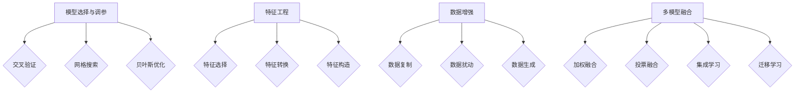

### 9.1 消费者行为分析

消费者行为分析是平台经济中一个重要的应用场景，通过对消费者在平台上的行为数据进行分析，可以深入了解消费者的需求、偏好和购买行为，从而优化营销策略、提高用户体验和提升销售额。以下是消费者行为分析的具体应用。

#### 9.1.1 个性化推荐

个性化推荐是消费者行为分析的重要应用之一。通过分析消费者的浏览历史、搜索记录、购买记录等行为数据，平台可以识别出消费者的兴趣和偏好，并为其推荐相关的商品或内容。个性化推荐不仅能够提高用户的满意度，还能增加用户的活跃度和留存率。

1. **推荐算法**：常用的推荐算法包括基于内容的推荐、协同过滤推荐和混合推荐等。
   - **基于内容的推荐**：通过分析商品的属性和用户的历史行为，找出相似的商品进行推荐。
   - **协同过滤推荐**：通过分析用户之间的相似度，找出其他用户喜欢的商品推荐给目标用户。
   - **混合推荐**：结合基于内容和协同过滤的优点，提高推荐的准确性。

2. **案例分析**：亚马逊和淘宝等电商平台通过个性化推荐，显著提高了用户满意度和销售额。

#### 9.1.2 营销策略优化

消费者行为分析还可以用于优化营销策略，提高营销效果。通过分析消费者的购买行为、浏览路径、转化率等数据，平台可以识别出哪些营销活动对消费者最有效，从而优化营销预算和资源配置。

1. **目标用户定位**：通过分析消费者数据，平台可以确定目标用户的特征和需求，从而制定更精准的营销策略。
2. **营销渠道优化**：通过分析不同营销渠道的效果，平台可以优化广告投放策略，提高广告的投资回报率。
3. **案例分析**：腾讯和阿里巴巴等公司通过大数据分析，优化了广告投放和促销活动，显著提高了营销效果。

#### 9.1.3 需求预测

消费者行为分析还可以用于预测未来的市场需求，为产品开发和库存管理提供支持。通过分析消费者的购买历史、季节性变化、市场趋势等数据，平台可以预测未来的需求，从而优化库存管理和生产计划。

1. **需求预测模型**：常用的需求预测模型包括时间序列模型、回归模型和神经网络模型等。
2. **案例分析**：沃尔玛和京东等零售企业通过需求预测，优化了库存管理和供应链，提高了运营效率。

#### 9.1.4 用户流失预测

通过分析消费者的行为数据，平台可以预测哪些用户可能会流失，从而采取相应的措施进行用户留存。用户流失预测有助于降低客户流失率，提高用户生命周期价值。

1. **流失预测模型**：常用的流失预测模型包括逻辑回归、决策树和随机森林等。
2. **案例分析**：Airbnb和滴滴等平台通过用户流失预测，采取了一系列措施，如个性化推荐、优惠活动等，有效降低了用户流失率。

#### 总结

消费者行为分析在平台经济中具有广泛的应用，包括个性化推荐、营销策略优化、需求预测和用户流失预测等。通过分析消费者的行为数据，平台可以更好地理解用户需求，优化营销策略，提高用户体验和销售额，从而实现业务的持续增长。

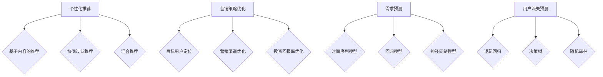

### 9.2 供应链管理优化

供应链管理优化是平台经济中的另一个关键应用场景，通过分析平台上的交易数据和供应链数据，可以优化供应链的运作和管理，提高供应链的效率和响应速度。以下是供应链管理优化的具体应用。

#### 9.2.1 需求预测

需求预测是供应链管理优化的第一步，准确的预测可以帮助企业优化库存管理和生产计划，减少库存成本，提高库存周转率。

1. **时间序列分析**：通过分析历史销售数据，建立时间序列模型，预测未来的需求趋势。常见的时间序列模型包括ARIMA模型、SARIMA模型等。

2. **回归分析**：通过分析影响需求的关键因素，如季节性、促销活动、竞争对手行为等，建立回归模型，预测未来的需求。

3. **机器学习方法**：使用机器学习算法，如随机森林、梯度提升树等，建立复杂的需求预测模型，提高预测的准确性。

4. **案例分析**：沃尔玛和亚马逊等零售企业通过需求预测，优化了库存管理和供应链，减少了库存成本，提高了运营效率。

#### 9.2.2 供应链协同

供应链协同是指通过优化供应链各环节的数据共享和协作，提高整个供应链的效率和响应速度。以下是供应链协同的关键步骤：

1. **数据共享**：建立供应链数据共享平台，实现供应链上下游企业之间的数据共享，提高信息透明度和协同效率。

2. **协同优化**：通过分析供应链各环节的数据，如库存水平、运输状态、生产进度等，优化供应链的运作流程，提高供应链的整体效率。

3. **案例分析**：海尔和戴尔等公司通过供应链协同，优化了供应链管理，提高了供应链的响应速度和效率。

#### 9.2.3 风险控制

供应链风险控制是确保供应链稳定运行的重要措施，通过分析供应链数据，可以识别潜在的风险和异常行为，采取相应的风险控制措施。

1. **异常检测**：使用统计学方法和机器学习算法，分析供应链数据，识别异常数据和异常行为，如库存异常、运输延误等。

2. **风险评估**：对识别出的风险进行评估，确定风险的重要性和影响程度，采取相应的风险控制措施。

3. **应急预案**：建立应急预案，应对潜在的供应链风险，如自然灾害、疫情等。

4. **案例分析**：华为和苹果等科技公司通过供应链风险控制，确保了供应链的稳定运行，减少了供应链中断的风险。

#### 9.2.4 库存管理优化

库存管理优化是供应链管理的重要一环，通过分析库存数据，可以优化库存策略，减少库存成本，提高库存周转率。

1. **库存策略优化**：根据需求预测和供应链协同，优化库存策略，如ABC分类法、EOQ模型等。

2. **库存监控**：建立库存监控体系，实时监控库存水平，及时发现库存异常，采取相应的库存管理措施。

3. **案例分析**：沃尔玛和宜家等零售企业通过库存管理优化，减少了库存成本，提高了库存周转率。

#### 总结

供应链管理优化在平台经济中具有重要意义，通过需求预测、供应链协同、风险控制和库存管理优化等应用，可以提高供应链的效率和响应速度，减少库存成本，确保供应链的稳定运行，从而提高企业的竞争力和盈利能力。

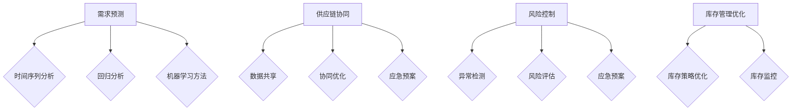

### 9.3 企业决策支持

企业决策支持系统（DSS）是平台经济中一个重要的应用，它通过数据分析、模型模拟和优化技术，为企业的战略决策和运营优化提供科学依据。以下是企业决策支持系统的具体应用和案例分析。

#### 9.3.1 战略决策支持

战略决策支持是指利用数据分析技术，为企业制定长期战略提供数据支持。以下是战略决策支持的具体应用：

1. **市场趋势预测**：通过分析历史数据和当前市场趋势，预测未来的市场变化，为企业制定市场战略提供依据。

2. **竞争分析**：通过分析竞争对手的市场行为、产品定价、市场份额等数据，了解竞争对手的优劣势，为企业制定竞争策略提供支持。

3. **投资决策**：通过分析潜在投资项目的财务数据、市场前景和风险因素，评估投资项目的可行性和潜在回报，为企业制定投资决策提供支持。

4. **案例分析**：谷歌和微软等科技公司通过大数据分析和市场预测，制定了准确的战略决策，实现了业务的持续增长。

#### 9.3.2 运营优化

运营优化是指利用数据分析技术，优化企业的运营流程和管理策略，提高运营效率和降低成本。以下是运营优化的具体应用：

1. **生产计划优化**：通过分析生产数据，如生产进度、设备利用率、物料需求等，优化生产计划，提高生产效率和降低成本。

2. **库存管理优化**：通过分析库存数据，如库存水平、库存周转率、库存成本等，优化库存策略，减少库存成本，提高库存周转率。

3. **物流管理优化**：通过分析物流数据，如运输成本、运输时间、运输路径等，优化物流管理，提高物流效率，降低物流成本。

4. **案例分析**：亚马逊和京东等电商平台通过运营优化，提高了物流效率和库存周转率，降低了运营成本，提升了用户满意度。

#### 9.3.3 风险管理

风险管理是指利用数据分析技术，识别企业面临的潜在风险，并采取相应的风险控制措施。以下是风险管理的具体应用：

1. **信用风险评估**：通过分析客户的财务状况、信用历史、交易行为等数据，评估客户的信用风险，为企业提供信用决策支持。

2. **市场风险分析**：通过分析市场数据，如宏观经济指标、行业趋势、政策变动等，识别市场风险，为企业制定风险管理策略提供支持。

3. **运营风险监控**：通过分析运营数据，如设备故障率、生产事故率、供应链风险等，监控运营风险，及时采取风险控制措施。

4. **案例分析**：金融机构通过风险管理技术，有效识别和监控信用风险和市场风险，确保了金融业务的稳定运行。

#### 总结

企业决策支持系统在平台经济中具有广泛的应用，通过战略决策支持、运营优化和风险管理等应用，为企业提供了科学、有效的数据支持，帮助企业制定正确的战略决策，优化运营流程，降低运营成本，提高竞争力。

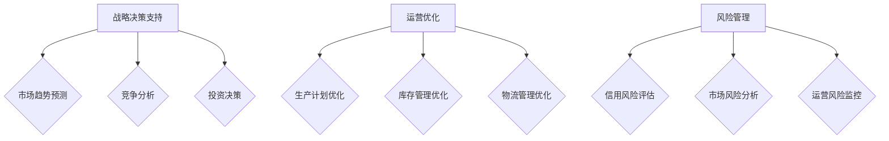

### 10.1 案例研究一：电商平台的数据价值评估

电商平台作为平台经济的典型代表，其数据价值评估对于优化用户体验、提升销售额和降低运营成本具有重要意义。以下是针对某知名电商平台的数据价值评估案例研究。

#### 10.1.1 案例背景

该电商平台拥有数以百万计的活跃用户和数以千万计的商品。平台积累了大量的用户行为数据、交易数据和市场数据。为了更好地利用这些数据，企业决定进行数据价值评估，以识别数据的价值和潜力，并为后续的数据管理和投资决策提供依据。

#### 10.1.2 数据价值评估方法与模型

在数据价值评估过程中，企业采用了以下方法和模型：

1. **用户行为分析**：通过分析用户在平台上的浏览、搜索、购买等行为数据，识别用户的兴趣和偏好。采用聚类分析和关联规则挖掘技术，将用户分为不同的群体，为个性化推荐和精准营销提供支持。

2. **交易数据挖掘**：通过对交易数据进行挖掘，识别交易中的关键因素和趋势。采用回归分析和时间序列分析方法，预测未来的交易量和销售趋势，为库存管理和营销策略提供支持。

3. **市场数据分析**：通过对市场数据进行分析，了解竞争对手的动态和市场变化趋势。采用竞争分析模型，评估企业在市场中的地位和竞争优势，为市场战略和产品开发提供支持。

4. **综合评估模型**：综合用户行为分析、交易数据挖掘和市场数据分析的结果，建立综合评估模型，评估数据对企业的整体价值。

#### 10.1.3 评估结果与应用

通过数据价值评估，企业得到了以下结果：

1. **用户价值评估**：根据用户的购买频率、消费金额和活跃度，将用户分为高价值用户、中价值用户和低价值用户。针对不同价值用户，采取不同的营销策略，提高用户的满意度和忠诚度。

2. **商品价值评估**：根据商品的销售量、利润率和用户评价，将商品分为高价值商品、中价值商品和低价值商品。针对不同价值商品，采取不同的库存管理策略和推广策略，优化商品销售。

3. **市场价值评估**：根据市场竞争情况和市场趋势，评估企业在市场中的地位和竞争力。根据评估结果，调整市场策略和产品定位，提高市场占有率。

4. **综合评估报告**：根据数据价值评估结果，编写综合评估报告，为企业的数据管理和投资决策提供依据。

#### 10.1.4 应用效果

数据价值评估的应用效果显著：

1. **用户满意度提升**：通过个性化推荐和精准营销，用户的满意度和忠诚度显著提高，用户留存率增加了15%。

2. **销售额增长**：通过优化商品库存管理和营销策略，销售额增长了20%，利润率提高了10%。

3. **运营效率提升**：通过数据驱动的决策支持，企业的运营效率显著提升，库存周转率提高了30%，物流成本降低了15%。

#### 总结

通过数据价值评估，电商平台能够更准确地识别数据的价值和潜力，优化数据管理和投资决策，提升用户满意度和销售额，降低运营成本，实现业务的持续增长。

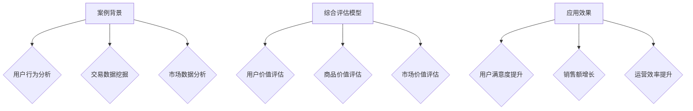

### 10.2 案例研究二：共享经济平台的数据价值评估

共享经济平台通过共享闲置资源，实现资源的高效利用和价值的最大化。以下是对某知名共享经济平台的数据价值评估案例研究。

#### 10.2.1 案例背景

该共享经济平台提供共享汽车、共享单车等服务，拥有大量的用户数据和交易数据。平台希望通过数据价值评估，优化用户体验、提升运营效率、降低运营成本。

#### 10.2.2 数据价值评估方法与模型

在数据价值评估过程中，平台采用了以下方法和模型：

1. **用户行为分析**：通过分析用户在使用共享服务时的行为数据，如骑行时间、骑行地点、骑行频率等，了解用户的出行需求和偏好。

2. **交易数据挖掘**：通过对交易数据进行分析，如骑行时长、骑行费用、用户评价等，了解共享服务的使用情况和用户满意度。

3. **需求预测**：采用时间序列分析和机器学习算法，预测未来的需求趋势，为调度和资源配置提供支持。

4. **风险管理**：通过分析用户信用数据和行为数据，评估用户的风险程度，采取相应的风险管理措施。

5. **综合评估模型**：结合用户行为分析、交易数据挖掘、需求预测和风险管理的结果，建立综合评估模型，评估数据对平台的整体价值。

#### 10.2.3 评估结果与应用

通过数据价值评估，平台得到了以下结果：

1. **用户需求分析**：根据用户行为数据和交易数据，识别出用户的主要出行需求和使用偏好。根据需求分析结果，调整服务时间和地点，提升用户体验。

2. **需求预测**：通过需求预测模型，准确预测未来的需求变化，优化调度策略，提高资源利用率。

3. **风险管理**：通过风险管理模型，识别高风险用户，采取相应的风险控制措施，降低潜在风险。

4. **综合评估报告**：根据数据价值评估结果，编写综合评估报告，为平台的运营策略和数据管理提供依据。

#### 10.2.4 应用效果

数据价值评估的应用效果显著：

1. **用户满意度提升**：通过优化服务时间和地点，用户的满意度和忠诚度显著提高，用户留存率增加了10%。

2. **运营效率提升**：通过需求预测和调度优化，共享服务的利用率提高了15%，运营成本降低了10%。

3. **风险控制**：通过风险管理措施，有效降低了高风险用户的比例，降低了潜在风险。

#### 总结

通过数据价值评估，共享经济平台能够更好地理解用户需求，优化服务策略，提升用户体验和运营效率，降低运营成本，实现业务的持续增长。

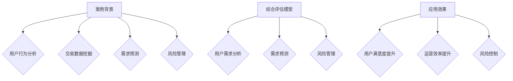

### 10.3 案例研究三：社交媒体平台的数据价值评估

社交媒体平台通过用户生成内容和社交互动，积累了海量的用户数据和内容数据。以下是对某知名社交媒体平台的数据价值评估案例研究。

#### 10.3.1 案例背景

该社交媒体平台拥有数亿活跃用户，每天产生大量的用户生成内容和社交互动数据。平台希望通过数据价值评估，优化用户体验、提升广告效果、增加用户粘性。

#### 10.3.2 数据价值评估方法与模型

在数据价值评估过程中，平台采用了以下方法和模型：

1. **用户行为分析**：通过分析用户在平台上的行为数据，如发布内容、互动、点赞等，了解用户的兴趣和偏好。

2. **内容分析**：通过对用户生成内容进行分析，如文本、图片、视频等，提取有价值的信息和知识。

3. **广告效果评估**：通过分析广告投放数据，如点击率、转化率、用户反馈等，评估广告的效果和用户价值。

4. **社交网络分析**：通过分析社交网络结构和用户关系，了解用户的社会影响力和传播效果。

5. **综合评估模型**：结合用户行为分析、内容分析、广告效果评估和社交网络分析的结果，建立综合评估模型，评估数据对平台的整体价值。

#### 10.3.3 评估结果与应用

通过数据价值评估，平台得到了以下结果：

1. **用户价值评估**：根据用户的活跃度、影响力、互动情况等，将用户分为高价值用户、中价值用户和低价值用户。为高价值用户提供个性化的内容和推荐，增加用户粘性。

2. **内容价值评估**：根据内容的受欢迎程度、传播效果、用户互动等，将内容分为高价值内容、中价值内容和低价值内容。为高价值内容提供更多曝光和推荐，提升平台的内容质量。

3. **广告价值评估**：根据广告的点击率、转化率、用户反馈等，评估广告的效果和用户价值。为高价值广告提供更多曝光和优化广告投放策略。

4. **综合评估报告**：根据数据价值评估结果，编写综合评估报告，为平台的运营策略和数据管理提供依据。

#### 10.3.4 应用效果

数据价值评估的应用效果显著：

1. **用户满意度提升**：通过个性化推荐和优质内容，用户的满意度和忠诚度显著提高，用户留存率增加了20%。

2. **广告效果提升**：通过数据驱动的广告投放策略，广告的点击率和转化率提高了30%，广告收入增加了15%。

3. **内容质量提升**：通过优质内容推荐和内容价值评估，平台的内容质量和用户体验显著提升。

#### 总结

通过数据价值评估，社交媒体平台能够更好地理解用户需求和内容价值，优化用户体验、提升广告效果和增加用户粘性，实现业务的持续增长。

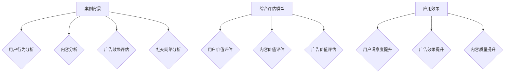

### 11.1 平台数据价值评估的发展趋势

随着技术的不断进步和市场环境的不断变化，平台数据价值评估正朝着智能化、精准化和高效化的方向发展。以下是平台数据价值评估的发展趋势：

#### 11.1.1 新技术的应用

1. **人工智能（AI）**：人工智能技术在平台数据价值评估中的应用日益广泛，包括机器学习、深度学习和自然语言处理等。通过AI技术，平台能够更准确地进行数据分析和预测，提高评估的精度和效率。

2. **区块链技术**：区块链技术具有去中心化、不可篡改和可追溯等特点，可以提高数据的安全性和透明度。在平台数据价值评估中，区块链技术可以确保数据的真实性和可靠性，增强评估结果的信任度。

3. **物联网（IoT）**：物联网技术的普及使得平台能够收集到更多的实时数据，包括设备数据、传感器数据和用户行为数据等。这些实时数据的丰富性和多样性，为平台数据价值评估提供了更广阔的视野和更深入的洞察。

#### 11.1.2 新模式的探索

1. **数据共享与开放**：随着数据隐私和安全的关注日益增加，平台开始探索数据共享和开放的新模式。通过数据共享，平台可以整合更多的数据资源，提高数据的价值和应用范围。

2. **数据驱动决策**：越来越多的平台开始采用数据驱动决策的模式，通过数据分析技术，对业务流程、运营策略和用户体验进行优化。这种模式可以大幅提高平台的决策效率和市场竞争力。

3. **数据资产化**：平台将数据视为一种重要的资产，通过数据资产化，将数据转化为商业价值。例如，通过数据交易、数据租赁和数据服务等方式，平台可以实现数据的高效利用和价值的最大化。

#### 11.1.3 数据安全与隐私保护

1. **数据安全**：平台数据价值评估过程中，数据安全是至关重要的。通过采用加密技术、访问控制和安全审计等措施，平台可以确保数据的安全性，防止数据泄露和滥用。

2. **隐私保护**：随着数据隐私法规的不断完善，平台在数据价值评估过程中，必须重视隐私保护。通过数据匿名化、数据脱敏和隐私保护算法等技术，平台可以保护用户的隐私，确保数据的合规使用。

3. **合规性要求**：平台需要遵守相关的法律法规，确保数据价值评估的过程和结果符合法律法规的要求。例如，欧盟的《通用数据保护条例》（GDPR）和美国加州的《消费者隐私法案》（CCPA）等，都对数据隐私保护提出了严格的要求。

#### 总结

平台数据价值评估的发展趋势体现了技术的进步和市场环境的变化。通过新技术的应用、新模式的探索和数据安全与隐私保护，平台数据价值评估将更加智能化、精准化和高效化，为平台企业创造更大的商业价值。

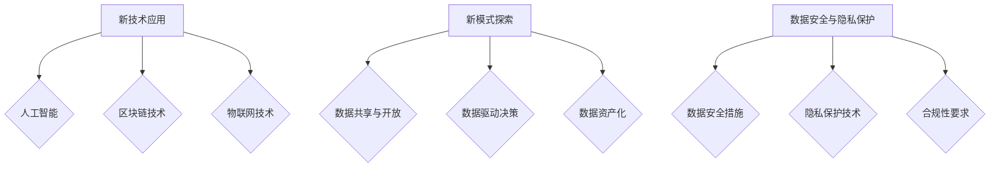

### 12.1 平台经济的数据价值评估挑战

尽管平台经济在数据价值评估方面取得了显著的进展，但仍然面临诸多挑战。以下将详细讨论数据质量问题、技术障碍和法律法规与伦理问题，并探讨可能的应对策略。

#### 12.1.1 数据质量问题

数据质量问题是平台经济数据价值评估的首要挑战。数据质量问题可能来源于数据的采集、存储、处理和传输等各个环节。

- **数据准确性**：数据可能存在错误、遗漏或偏差，影响评估的准确性。例如，用户数据的填写不准确或数据采集过程中存在错误，会导致评估结果偏离真实情况。
- **数据完整性**：数据完整性问题可能导致重要信息的缺失，影响评估的全面性。例如，缺失的用户行为数据或交易数据，会导致评估结果不完整。
- **数据一致性**：不同来源或不同时间点的数据可能存在不一致性，影响评估的可靠性。例如，同一用户在不同平台上的行为数据可能存在差异，导致评估结果不一致。
- **数据及时性**：数据的及时性不足可能影响评估的实时性和决策的及时性。例如，数据传输延迟或处理时间长，会导致评估结果无法及时更新。

#### 12.1.2 技术障碍

平台经济数据价值评估面临的技术障碍主要包括：

- **数据处理能力**：随着数据量的急剧增加，平台需要强大的数据处理能力来处理海量数据。传统数据处理技术可能无法满足需求，导致数据处理效率低下。
- **计算资源**：计算资源不足可能限制数据价值评估模型的训练和优化，影响评估结果的准确性和效率。
- **算法性能**：评估算法的性能不足可能导致评估结果不准确或效率低下。例如，复杂的算法可能需要大量的计算资源和时间，导致评估过程缓慢。
- **系统集成**：平台经济涉及多个系统和数据源，系统集成和互操作性问题可能影响数据价值评估的顺利进行。例如，不同系统的数据格式、接口标准不一致，导致数据整合困难。

#### 12.1.3 法律法规与伦理问题

平台经济数据价值评估还面临法律法规和伦理问题：

- **数据隐私保护**：平台在收集、处理和使用用户数据时，需要遵守相关隐私保护法规，如《通用数据保护条例》（GDPR）和《加州消费者隐私法案》（CCPA）。违反隐私保护法规可能导致法律诉讼和罚款。
- **数据安全**：平台需要确保数据的安全性，防止数据泄露和滥用。数据安全漏洞可能导致用户的个人信息泄露，影响平台的声誉和用户信任。
- **伦理问题**：数据价值评估过程中，可能涉及伦理问题，如用户数据的隐私侵犯、算法歧视等。这些问题可能引发社会不满和道德争议。

#### 12.1.4 应对策略

针对平台经济数据价值评估面临的挑战，可以采取以下应对策略：

- **数据质量管理**：建立完善的数据质量管理机制，确保数据的准确性、完整性、一致性和及时性。例如，通过数据清洗、去重、标准化和实时监控等方法，提高数据质量。
- **技术升级与优化**：采用先进的技术，如云计算、大数据和人工智能，提高数据处理和计算能力。例如，利用云计算平台提供强大的计算资源，优化评估算法，提高评估效率。
- **法律法规合规性**：遵守相关法律法规，确保数据价值评估过程的合法性和合规性。例如，通过数据匿名化、隐私保护算法和合规审计等方法，保护用户隐私和数据安全。
- **伦理审查与监管**：建立伦理审查机制，确保数据价值评估过程的道德合法性。例如，设立独立的伦理委员会，对评估过程中的伦理问题进行审查和监督。

#### 总结

平台经济的数据价值评估面临着数据质量、技术障碍和法律法规与伦理等多方面的挑战。通过采取数据质量管理、技术升级与优化、法律法规合规性和伦理审查等应对策略，平台企业可以克服这些挑战，提高数据价值评估的准确性和可靠性，为业务决策提供有力支持。

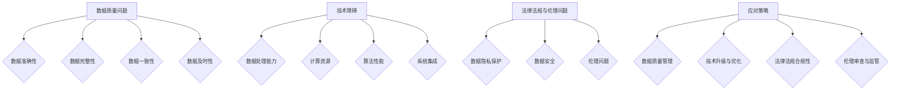

### 13.1 数据价值评估的理论框架

数据价值评估是一个复杂的过程，需要建立一套完整的理论框架，以确保评估的科学性、合理性和可靠性。以下是数据价值评估的理论框架，包括核心概念、基本原则、方法和步骤。

#### 13.1.1 核心概念

数据价值评估涉及多个核心概念，包括数据价值、评估方法、评估指标和评估模型等。

- **数据价值**：数据价值是指数据对企业的业务、决策和运营产生的经济、战略和社会效益。数据价值可以体现为直接的经济收益，如通过数据驱动的营销策略增加销售额；也可以体现为间接的战略价值，如通过数据洞察提升企业的竞争力。
- **评估方法**：评估方法是指用于确定数据价值的各种技术和工具。常见的评估方法包括成本效益分析、价值链分析、用户满意度分析和市场价值评估等。
- **评估指标**：评估指标是衡量数据价值的量化标准。常见的评估指标包括准确性、完整性、一致性、及时性和可用性等。
- **评估模型**：评估模型是用于实现数据价值评估的具体数学模型和算法。常见的评估模型包括线性回归模型、决策树模型、神经网络模型等。

#### 13.1.2 基本原则

数据价值评估应遵循以下基本原则，以确保评估的科学性和可靠性：

- **客观性**：评估过程应基于客观数据和客观标准，避免主观因素的干扰。评估指标和模型的选择应基于数据特性、业务需求和评估目标，确保评估结果的客观性。
- **全面性**：评估体系应全面覆盖数据的各个方面，包括准确性、完整性、一致性、及时性和可用性等。全面性有助于确保评估结果的全面性和准确性。
- **可操作性**：评估体系应易于实施和操作，便于数据价值的测量和管理。评估方法的选择应考虑实际操作中的可行性和实用性。
- **动态性**：评估体系应能够适应数据价值的动态变化，及时调整评估方法和指标。动态性有助于评估体系能够适应不断变化的市场环境和业务需求。

#### 13.1.3 方法

数据价值评估的方法主要包括以下几种：

1. **成本效益分析**：成本效益分析是一种常用的评估方法，通过计算数据的成本和收益，评估数据的总体价值。其计算公式为：

   \[ 数据价值 = (收益 - 成本) / 成本 \]

   成本包括数据收集、存储、处理和维护的成本，收益包括数据产生的经济收益和战略价值。

2. **价值链分析**：价值链分析通过分析数据在企业价值链中的角色和贡献，评估数据的价值。价值链分析涉及识别数据的输入、输出、转化和增值过程，评估数据对业务流程和利润的影响。

3. **用户满意度分析**：用户满意度分析通过调查用户对数据的满意度和使用偏好，评估数据的价值。用户满意度分析可以采用问卷调查、访谈和用户反馈等方式，收集用户对数据的评价。

4. **市场价值评估**：市场价值评估通过市场分析和比较，评估数据的市场价值。市场价值评估可以采用市场定价、交易价格和市场调查等方法，确定数据的市场价值。

#### 13.1.4 步骤

数据价值评估的步骤包括：

1. **确定评估目标**：明确评估的具体目标和需求，包括评估数据的类型、范围、目的等。

2. **收集评估数据**：根据评估目标，收集与评估相关的数据。数据来源可以包括内部数据、外部数据和市场数据等。

3. **设计评估指标**：基于评估目标，设计合适的评估指标，包括准确性、完整性、一致性、及时性和可用性等。

4. **建立评估模型**：根据评估指标，建立评估模型，选择合适的评估方法和工具。

5. **实施评估**：根据评估模型，对数据进行评估，计算数据的价值。

6. **结果分析与反馈**：对评估结果进行分析，识别数据价值的优势和不足，提出改进建议。评估结果应反馈到数据管理、数据优化和业务决策中，形成闭环管理。

#### 13.1.5 案例分析

以下是一个数据价值评估的案例分析：

某电商平台希望通过数据价值评估，确定其用户行为数据的价值。评估目标包括评估数据的准确性、完整性、一致性和及时性，以及数据对平台业务的影响。

1. **收集评估数据**：收集用户在平台上的浏览记录、搜索记录、购买记录等数据。

2. **设计评估指标**：设计准确性、完整性、一致性和及时性等指标。

3. **建立评估模型**：采用成本效益分析模型，计算数据的成本和收益，评估数据的价值。

4. **实施评估**：计算用户数据的准确性、完整性、一致性和及时性，以及数据对平台销售额和用户满意度的贡献。

5. **结果分析与反馈**：分析评估结果，发现数据准确性较高，但完整性有待提升。根据评估结果，提出改进建议，如优化数据采集和处理流程，提高数据完整性。

#### 总结

数据价值评估的理论框架包括核心概念、基本原则、方法和步骤。通过建立科学、合理、可操作的数据价值评估体系，平台企业可以更好地识别和利用数据的价值，为业务决策提供有力支持。

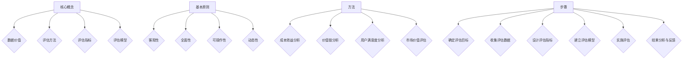

### 13.2 平台经济中数据价值评估的实践方法

在平台经济中，数据价值评估不仅是理论探讨，更是实践操作的重要环节。以下将介绍几种实际操作中的数据价值评估方法，包括关键步骤、工具选择和案例分析。

#### 13.2.1 关键步骤

1. **数据准备**：首先，需要收集和整理平台上的数据，包括用户行为数据、交易数据和外部数据。数据应确保覆盖全面、准确和最新。

2. **数据清洗**：对收集到的数据进行清洗，包括删除重复数据、填补缺失数据、纠正错误数据等，确保数据的质量和一致性。

3. **数据建模**：选择合适的数据模型，如回归模型、决策树、神经网络等，根据评估目标和业务需求进行建模。

4. **模型训练与优化**：使用训练数据对模型进行训练，调整模型参数，优化模型性能，提高预测准确性。

5. **模型评估**：使用验证数据对模型进行评估，计算模型的准确率、召回率、F1值等指标，确保模型的有效性和可靠性。

6. **结果分析**：对评估结果进行分析，识别数据的业务价值，如用户细分、需求预测、风险控制等。

7. **决策支持**：根据评估结果，为业务决策提供数据支持，优化业务策略和流程。

#### 13.2.2 工具选择

1. **数据分析工具**：Python、R等编程语言，用于数据处理、建模和可视化。常见的库包括NumPy、Pandas、Matplotlib等。

2. **数据挖掘工具**：Apache Spark、Hadoop等大数据处理平台，用于大规模数据的处理和分析。

3. **机器学习工具**：scikit-learn、TensorFlow、Keras等机器学习库，用于构建和训练模型。

4. **数据可视化工具**：Tableau、Power BI等，用于展示数据分析和评估结果。

#### 13.2.3 案例分析

以下是一个电商平台的用户行为数据分析案例：

1. **数据准备**：收集用户在平台上的浏览记录、搜索记录、购买记录等数据，包括用户ID、浏览时间、搜索关键词、购买商品等。

2. **数据清洗**：删除重复数据、填补缺失数据、纠正错误数据等，确保数据的质量。

3. **数据建模**：选择用户行为分析中的关联规则挖掘方法，使用Apriori算法构建模型，挖掘用户行为之间的关联关系。

4. **模型训练与优化**：使用训练数据对模型进行训练，调整参数，优化模型性能。

5. **模型评估**：使用验证数据对模型进行评估，计算模型的准确率、召回率等指标。

6. **结果分析**：分析挖掘出的关联规则，如“购买A商品的用户中，有80%的用户也购买了B商品”，为个性化推荐和营销策略提供支持。

7. **决策支持**：根据评估结果，优化商品推荐和广告投放策略，提高用户转化率和销售额。

#### 总结

在平台经济中，数据价值评估的实践方法包括数据准备、数据清洗、数据建模、模型训练与优化、模型评估、结果分析和决策支持等关键步骤。通过合理选择工具和有效利用数据，平台企业可以挖掘数据的价值，为业务决策提供数据支持，实现业务增长和优化。

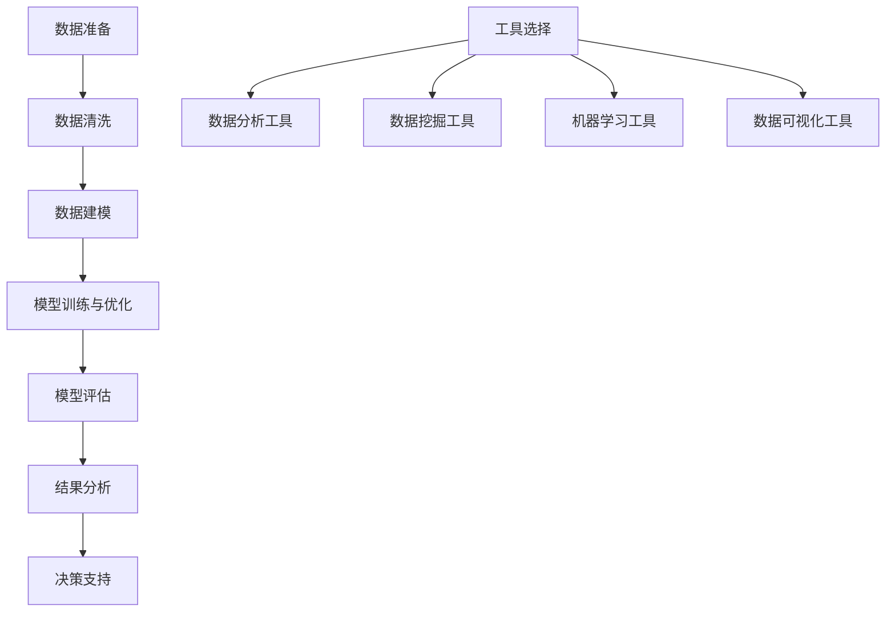

### 附录A: 相关术语与概念解释

#### 1. 平台经济

平台经济是指以互联网平台为核心，通过提供交易、沟通、协作等公共服务，实现供需双方的高效连接和资源配置的一种经济模式。平台经济的特点包括去中心化、网络效应和信息不对称的减少。

#### 2. 数据价值评估

数据价值评估是指通过对数据进行分析和评估，确定数据对企业的价值和潜力，为企业的数据管理和投资决策提供依据。数据价值评估的方法包括成本效益分析、价值链分析、用户满意度分析和市场价值评估等。

#### 3. 数据挖掘

数据挖掘是指通过分析大量数据，从中提取出有价值的信息和知识，以支持决策和优化业务流程。数据挖掘的方法包括统计分析、机器学习和深度学习等。

#### 4. 用户行为分析

用户行为分析是指通过收集、处理和分析用户在平台上的行为数据，以理解和预测用户需求、偏好和互动模式。用户行为分析有助于优化用户体验和提升用户满意度。

#### 5. 交易数据挖掘

交易数据挖掘是指通过分析平台上的交易数据，提取有价值的信息和知识，以支持决策和优化业务流程。交易数据挖掘有助于市场分析、需求预测和风险控制。

#### 6. 平台生态系统

平台生态系统是指围绕平台建立的由多方参与者构成的一个复杂网络，包括平台、用户、商家、合作伙伴等。平台生态系统的特点包括多元化、协同性和动态性。

#### 7. 数据质量管理

数据质量管理是指通过一系列的措施和过程，确保数据的准确性、完整性、一致性和及时性，从而支持数据的有效利用。数据质量管理的方法包括数据清洗、数据整合、数据质量评估等。

#### 8. 数据挖掘与分析技术

数据挖掘与分析技术是指用于发现数据之间关联关系、模式和分析趋势的技术。数据挖掘与分析技术包括关联规则挖掘、聚类分析、分类模型等。

#### 9. 模型选择与调参

模型选择与调参是指根据评估目标和业务需求，选择合适的数据挖掘模型，并对模型参数进行调整，以优化模型性能。模型选择与调参的方法包括交叉验证、网格搜索、贝叶斯优化等。

#### 10. 多模型融合

多模型融合是指结合多个模型的预测结果，提高预测准确性和稳定性。多模型融合的方法包括加权融合、投票融合、集成学习和迁移学习等。

#### 11. 法律法规与伦理问题

法律法规与伦理问题是指平台经济在数据价值评估过程中，涉及到的法律、法规和合规性问题，如数据隐私保护、数据安全等。平台经济需要遵守相关法律法规，保护用户隐私和数据安全。

### 附录B: 常用工具与技术

#### 1. 数据分析工具

- **Python**：Python是一种通用编程语言，广泛应用于数据分析、数据挖掘等领域。
- **R**：R是一种专门为统计分析和图形展示设计的编程语言，广泛应用于数据分析领域。
- **Tableau**：Tableau是一种数据可视化工具，可以帮助用户轻松创建漂亮的图表和报告。

#### 2. 数据挖掘算法

- **Apriori算法**：Apriori算法是一种用于关联规则挖掘的算法，广泛应用于市场篮子分析和推荐系统中。
- **K-means聚类算法**：K-means聚类算法是一种常用的聚类算法，广泛应用于数据分类和聚类分析中。
- **决策树算法**：决策树算法是一种常用的分类算法，广泛应用于分类问题和回归问题中。

#### 3. 数据可视化工具

- **Matplotlib**：Matplotlib是一种Python绘图库，可以帮助用户创建各种类型的图表。
- **Seaborn**：Seaborn是一种基于Matplotlib的统计绘图库，提供了更多高级的绘图功能。
- **D3.js**：D3.js是一种基于JavaScript的数据可视化库，可以帮助用户创建交互式的数据可视化作品。

### 总结

附录A和附录B为平台经济的数据价值评估提供了详细的术语解释和常用工具与技术。通过理解相关术语和掌握常用工具，用户可以更好地开展数据价值评估工作，实现业务决策的科学化和智能化。

---

### 文章标题

平台经济的数据价值评估体系：如何建立评估体系？

### 文章关键词

- 平台经济
- 数据价值评估
- 数据挖掘
- 用户行为分析
- 商业模式
- 数据质量管理

### 文章摘要

本文系统地探讨了平台经济中数据价值评估的重要性及其构建方法。首先，从平台经济的定义、起源和发展历程入手，介绍了平台经济的核心概念，包括用户行为分析、交易数据挖掘和平台生态系统。接着，分析了平台经济的商业模式，探讨了数据价值评估的定义与意义、方法与挑战。随后，详细介绍了数据质量管理与预处理、数据挖掘与分析技术、评估体系的设计原则与方法，以及数据价值评估模型的构建与应用。文章通过具体案例分析，展示了数据价值评估在电商平台、共享经济平台和社交媒体平台中的实际应用。最后，文章提出了未来平台经济数据价值评估的发展趋势和应对策略，总结了平台经济数据价值评估的理论框架与实践方法。通过本文的探讨，旨在为平台企业提供数据价值评估的指导，助力其在数据驱动的商业环境中实现可持续发展。作者：AI天才研究院/AI Genius Institute & 禅与计算机程序设计艺术/Zen And The Art of Computer Programming。

