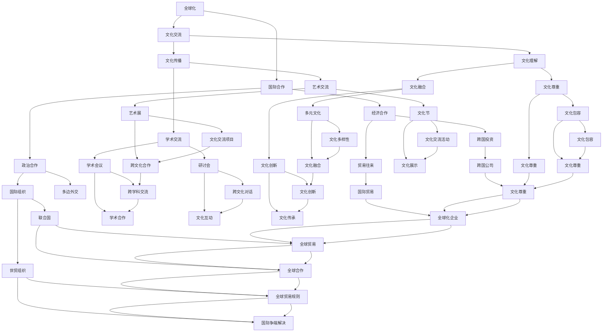

                 

## 2050年的全球化：国际合作与文化交流

全球化，这一现代社会的主要特征，其影响已经渗透到经济、政治、文化等多个领域。本文将深入探讨2050年全球化的趋势，以及国际合作和文化交流在这一过程中所扮演的重要角色。

### 关键词：

- **全球化**
- **国际合作**
- **文化交流**
- **信息技术**
- **可持续发展**
- **全球治理**

### 摘要：

本文首先回顾全球化的背景和历史发展，分析技术革新、国际合作和文化交流在全球化进程中的作用。接着，讨论全球化对教育、城市可持续发展、气候变化应对、数字经济等方面的深远影响。最后，展望2050年全球化的前景，提出在全球化进程中面临的挑战及应对策略。通过本文的探讨，希望能为读者提供一个全面、深入的全球化视角。

## 第一部分：全球化趋势分析

### 第1章：全球化背景与历史回顾

全球化并非一夜之间发生，而是经历了长期的发展过程。从早期的贸易全球化，到现代的资本全球化、信息全球化，全球化始终伴随着人类社会的发展。本章将回顾全球化的历史，分析其定义与发展，探讨全球化过程中的主要驱动因素和面临的挑战与机遇。

#### 1.1 全球化的定义与发展

全球化是指全球范围内国家、地区、社会和文化之间相互联系和依赖的不断加深。从经济角度来看，全球化主要体现在国际贸易、跨国投资和资本流动的不断增加。从政治角度来看，全球化意味着国际政治、安全和文化交流的日益密切。从社会和文化角度来看，全球化促进了不同文化之间的交流与融合。

全球化的概念最早可以追溯到20世纪60年代，当时主要是为了推动国际贸易的发展。随着信息技术、交通运输和物流技术的进步，全球化逐渐从经济领域扩展到政治、社会和文化领域。到了21世纪初，全球化已经成为全球经济发展的主要趋势，也对各国政治、社会和文化产生了深远影响。

#### 1.2 全球化的主要驱动因素

全球化的主要驱动因素包括技术革新、国际贸易、跨国投资和全球化治理等。

1. **技术革新**：信息技术、互联网和人工智能等技术的快速发展，极大地推动了全球化。这些技术不仅改变了人们的生活和工作方式，也打破了地理和文化的障碍，使得信息传播更加迅速，全球贸易更加便捷。

2. **国际贸易**：国际贸易是全球化的重要表现之一。随着全球化进程的加快，国际贸易规模不断扩大，贸易方式和结构也发生了变化。传统的制造业和服务业逐渐向高科技、高附加值的方向发展，跨国公司成为全球贸易的主要推动力量。

3. **跨国投资**：跨国投资是全球化进程中的另一个重要驱动因素。随着全球资本市场的整合，跨国投资成为企业拓展市场和资源的重要手段。跨国投资不仅促进了资本流动，也带动了技术、管理和人才的国际交流。

4. **全球化治理**：全球化治理是指国际社会通过多边机制、国际组织和国际法规等手段，共同应对全球性问题，维护全球秩序和稳定。全球化治理体系的发展，有助于解决全球性问题，如气候变化、公共卫生和反恐等。

#### 1.3 全球化过程中的挑战与机遇

全球化虽然带来了许多机遇，但也面临诸多挑战。

1. **挑战**：
   - **经济不平衡**：全球化过程中，发达国家和发展中国家之间的经济差距加大，一些国家出现了贫困、失业等问题。
   - **文化冲突**：全球化加速了文化交融，但也带来了文化冲突。不同文化之间的价值观、信仰和行为方式的差异，可能导致误解和冲突。
   - **环境问题**：全球化加剧了环境问题，如气候变化、资源消耗和环境污染等。

2. **机遇**：
   - **经济增长**：全球化促进了全球经济的增长，各国可以通过国际贸易、跨国投资和全球产业链的协作，实现经济繁荣。
   - **技术创新**：全球化为技术创新提供了广阔的空间，各国可以共同研究和开发新技术，推动科技进步。
   - **文化交流**：全球化促进了文化交流，各国可以共享文化成果，增进相互了解和友谊。

### 第2章：技术革新与全球化

技术革新是全球化进程中的重要推动力量。信息技术、物流与运输技术的进步，以及数字经济的崛起，极大地改变了全球化的模式，也带来了新的机遇和挑战。

#### 2.1 信息技术对全球化的影响

信息技术的发展，是全球化进程中最具革命性的力量之一。互联网的普及和电子商务的兴起，使得全球贸易变得更加便捷和高效。信息技术不仅改变了人们的生活方式，也重塑了经济结构和商业模式。

1. **电子商务**：电子商务的出现，使得跨国购物和国际贸易变得更加简单和便捷。消费者可以通过互联网购买全球各地的商品，企业也可以通过网络销售产品，打破了传统的地理和时空限制。

2. **物联网**：物联网技术的应用，使得各种设备和系统能够相互连接和通信，提高了物流和供应链的效率。例如，智能物流系统可以实现实时跟踪货物的运输状态，提高物流的准确性和及时性。

3. **大数据与人工智能**：大数据和人工智能技术的应用，为全球化提供了强大的数据支持和智能决策能力。企业可以通过大数据分析，了解全球市场的需求和趋势，制定更有效的市场策略。人工智能技术则可以自动化一些复杂的任务，提高生产效率和服务质量。

#### 2.2 物流与运输技术的进步

物流与运输技术的进步，也是全球化的重要推动力量。现代物流与运输技术的应用，使得全球贸易的成本降低，速度提高，为全球化提供了坚实的支撑。

1. **集装箱运输**：集装箱运输的出现，使得货物运输变得更加高效和标准化。集装箱运输不仅可以提高运输效率，还可以降低运输成本，为全球贸易的发展提供了重要保障。

2. **航空运输**：航空运输的快速发展，使得全球货物和人员的运输速度大大提高。航空运输不仅为跨国贸易提供了高效的运输方式，也为跨国合作和文化交流提供了便利。

3. **智能物流**：智能物流技术的应用，使得物流系统的智能化水平提高。智能物流系统可以通过物联网技术、大数据分析和人工智能技术，实现物流过程的实时监控和优化，提高物流效率和准确性。

#### 2.3 数字经济与全球化

数字经济的崛起，是全球化进程中的另一个重要趋势。数字经济是指基于数字技术和网络平台的经济发展模式，包括电子商务、电子支付、在线服务等。

1. **电子商务**：电子商务的快速发展，极大地推动了全球化的进程。电子商务不仅改变了消费者的购物方式，也为企业提供了更广阔的市场。通过电子商务，企业可以轻松进入全球市场，开展跨国业务。

2. **电子支付**：电子支付技术的普及，使得跨境支付变得更加便捷和快速。电子支付不仅降低了支付成本，还提高了支付的安全性。

3. **在线服务**：在线服务的兴起，为全球化提供了新的商业模式。在线服务包括远程医疗、在线教育、在线娱乐等，这些服务不仅为人们提供了便利，也为企业提供了新的市场机会。

### 第3章：国际合作机制与全球化

国际合作是全球化的重要组成部分，通过国际合作，各国可以共同应对全球性问题，实现共同发展和繁荣。本章将探讨国际合作机制，包括国际组织的角色、区域合作与自由贸易区，以及全球治理与全球化。

#### 3.1 国际组织的角色

国际组织在国际合作中扮演着重要角色，它们通过协调各国政策、提供平台和资源，推动国际合作。

1. **国际货币基金组织（IMF）**：IMF 是全球性的经济协调机构，主要负责监督全球金融体系的稳定，提供金融援助，促进国际经济合作。

2. **世界银行**：世界银行旨在通过提供贷款和技术援助，帮助发展中国家实现经济和社会发展。

3. **世界贸易组织（WTO）**：WTO 是全球贸易的规则制定机构，致力于促进贸易自由化和公平贸易，解决贸易争端。

4. **联合国**：联合国是一个多边国际组织，致力于维护国际和平与安全，促进可持续发展，推动国际合作。

#### 3.2 区域合作与自由贸易区

区域合作和自由贸易区是国际合作的重要形式，通过区域合作和自由贸易区，各国可以更紧密地联系在一起，实现资源共享和市场拓展。

1. **欧盟（EU）**：欧盟是一个经济和政治联盟，成员国之间实现了自由贸易、资本流动和劳动力流动。

2. **北美自由贸易区（NAFTA）**：NAFTA 是美国、加拿大和墨西哥之间的自由贸易区，旨在促进三国之间的贸易和投资。

3. **亚太经合组织（APEC）**：APEC 是亚太地区的一个主要经济合作论坛，成员国之间通过加强经济合作，推动区域经济发展。

#### 3.3 全球治理与全球化

全球治理是指国际社会通过多边机制、国际组织和国际法规等手段，共同应对全球性问题，维护全球秩序和稳定。全球治理的发展，有助于实现全球化进程中的公平和可持续发展。

1. **全球治理体系**：全球治理体系包括国际组织、国际法规和国际合作机制等，通过这些体系，国际社会可以共同应对全球性问题，如气候变化、公共卫生和恐怖主义等。

2. **全球治理的挑战**：全球治理面临诸多挑战，如国际政治格局的变化、全球性问题的不确定性等。为了应对这些挑战，需要加强国际合作，完善全球治理体系。

3. **全球治理的前景**：随着全球化的深入发展，全球治理将变得更加重要。未来，国际社会需要共同努力，推动全球治理体系的改革和完善，以应对全球性挑战，实现全球共同发展。

## 第二部分：文化交流与全球化

### 第4章：文化交流的重要性

文化交流是全球化的重要组成部分，它不仅促进了不同文化之间的相互了解和尊重，还为全球化进程提供了文化基础。本章将探讨文化交流的重要性，分析文化的定义与多样性，以及文化交流的意义和影响。

#### 4.1 文化的定义与多样性

文化是一个复杂的概念，它涉及人们的生活方式、价值观、信仰、习俗和行为。文化的定义与多样性是理解文化交流的基础。

1. **文化的定义**：文化是一个社会或群体所共有的知识、信仰、艺术、道德、法律、习俗和其他行为模式。文化不仅包括物质的方面，如建筑、艺术和工艺品，也包括非物质的方面，如语言、音乐、宗教和习俗。

2. **文化的多样性**：文化多样性是指不同文化之间的差异和多样性。地球上的文化多样性极为丰富，从传统农耕文化到现代都市文化，从东方文化到西方文化，每一种文化都有其独特的特点和价值观。

#### 4.2 文化交流的意义

文化交流的意义在于它能够促进不同文化之间的相互理解和尊重，增进全球社会的和谐与稳定。

1. **增进相互理解**：文化交流有助于人们了解其他文化的价值观、习俗和行为，减少误解和偏见。通过文化交流，人们可以更好地理解不同文化的差异，从而增进相互理解和尊重。

2. **促进文化创新**：文化交流不仅能够传递文化知识，还能够激发文化创新。不同文化的交流与融合，往往会产生新的艺术形式、思想理念和科技发明，推动文化的发展和进步。

3. **增强全球认同**：在全球化的背景下，文化交流有助于形成全球认同，构建人类命运共同体。通过文化交流，人们可以感受到共同的人性和价值观，增强对全球社会的归属感和责任感。

#### 4.3 文化交流的影响

文化交流对个人、社会和全球化进程都有着深远的影响。

1. **对个人的影响**：文化交流可以丰富个人的生活经历和视野，帮助人们形成多元的思维方式和全球视野。通过了解和体验其他文化，个人可以获得新的知识和技能，提高自身的综合素质。

2. **对社会的影响**：文化交流可以促进社会的进步和发展。不同文化之间的交流与融合，可以激发社会的创新活力，推动社会的多元化和包容性发展。

3. **对全球化进程的影响**：文化交流是全球化的重要推动力量。通过文化交流，不同文化之间可以相互借鉴和融合，形成新的文化形态，促进全球社会的和谐与稳定。

### 第5章：国际教育交流

国际教育交流是文化交流的重要组成部分，它通过留学生、学术交流和跨国教育项目，促进了不同文化之间的相互理解和尊重。本章将探讨国际教育交流的重要性，分析留学生与学术交流、国际学校和在线教育的现状，以及跨文化交流项目。

#### 5.1 留学生与学术交流

留学生和学术交流是国际教育交流的核心，它们为不同文化之间的交流提供了平台。

1. **留学生的重要性**：留学生是文化交流的桥梁，他们通过在异国他乡的学习和生活，深入了解和体验其他文化，将所学知识带回自己的国家。留学生不仅促进了文化交流，也为全球社会带来了新的知识和观念。

2. **学术交流的作用**：学术交流是推动科学技术和文化发展的重要手段。通过学术交流，学者们可以分享研究成果，探讨学术问题，推动学科的发展和进步。

3. **现状与挑战**：随着全球化的深入发展，国际教育交流规模不断扩大。然而，国际教育交流也面临一些挑战，如文化差异、语言障碍和签证政策等。为了促进国际教育交流，需要加强国际合作，提供更好的政策支持和资源保障。

#### 5.2 国际学校与在线教育

国际学校和在线教育是国际教育交流的重要形式，它们为不同文化之间的交流提供了新的途径。

1. **国际学校的优势**：国际学校通常采用国际化的教学方法和课程体系，为学生提供了丰富的国际教育资源。国际学校不仅有助于学生提高语言能力，还可以让他们深入了解其他文化。

2. **在线教育的兴起**：随着互联网技术的发展，在线教育逐渐成为国际教育交流的新趋势。在线教育不仅打破了地理和时空的限制，还可以提供个性化的教学服务，满足不同学生的需求。

3. **现状与挑战**：国际学校和在线教育在全球范围内迅速发展，但也面临一些挑战，如教育资源分配不均、教学质量和监管等。为了推动国际教育交流，需要加强国际教育合作，提高在线教育的质量和管理水平。

#### 5.3 跨文化交流项目

跨文化交流项目是促进文化交流和相互理解的有效手段，它们通过不同文化之间的互动和合作，推动了全球社会的和谐与稳定。

1. **项目形式**：跨文化交流项目包括国际学术会议、文化节、艺术展览、体育竞赛等。这些项目不仅展示了不同文化的独特魅力，还为人们提供了交流和互动的平台。

2. **项目效果**：跨文化交流项目有助于加深不同文化之间的相互了解和尊重，促进文化多样性的发展。通过跨文化交流项目，人们可以学习到其他文化的优秀传统和先进经验，推动全球社会的进步和发展。

3. **未来展望**：随着全球化的深入发展，跨文化交流项目将发挥越来越重要的作用。未来，国际社会需要加强合作，共同推动跨文化交流项目的发展，构建人类命运共同体。

### 第6章：媒体与文化交流

媒体是文化交流的重要载体，它通过传播信息和价值观，促进了不同文化之间的交流和互动。本章将探讨媒体在全球化的背景下所扮演的角色，分析媒体在文化交流中的作用，以及媒介素养与全球化。

#### 6.1 媒体的全球化

媒体的全球化是指媒体跨越国界，在全球范围内传播信息和价值观。随着互联网和信息技术的发展，媒体的全球化速度加快，全球受众可以轻松获取来自不同国家和地区的新闻和信息。

1. **媒体全球化的原因**：媒体全球化主要受到以下几个因素的影响：
   - 信息技术的发展：互联网和移动通信技术的普及，使得媒体可以迅速、广泛地传播信息。
   - 经济全球化：全球经济的联系日益紧密，企业需要全球化的媒体宣传，以拓展市场和品牌影响力。
   - 文化多样性：不同文化之间的交流和互动，为媒体全球化提供了丰富的内容和题材。

2. **媒体全球化的影响**：媒体全球化对文化交流产生了深远影响：
   - 提高了信息传播的效率：全球化媒体可以迅速传递全球各地的新闻和信息，提高了信息传播的速度和覆盖范围。
   - 增强了文化交流的互动性：全球化媒体为不同文化之间的交流提供了更多渠道和平台，促进了文化的多样性和融合。
   - 引发了文化冲突和竞争：全球化媒体在传播过程中，也可能引发文化冲突和竞争，如文化霸权主义和媒体殖民主义等。

#### 6.2 媒体在文化交流中的作用

媒体在文化交流中发挥着重要作用，它不仅传递信息，还塑造了人们对其他文化的认知和态度。

1. **文化展示**：媒体通过新闻报道、纪录片、电影、电视剧等形式，展示了不同文化的独特魅力和优秀传统。例如，中国春节、美国独立日等节日，在全球媒体上得到了广泛的报道和宣传。

2. **文化传播**：媒体通过广告、社交媒体、在线平台等渠道，推广了各种文化产品和活动，如音乐、电影、图书、艺术节等。这些活动不仅传播了文化，还促进了文化消费和文化产业的发展。

3. **文化争议**：媒体在传播文化的同时，也可能引发文化争议。例如，一些媒体可能夸大或歪曲其他文化的形象，引发误解和偏见。因此，媒体在传播文化时，需要尊重事实和多样性，避免文化偏见和歧视。

#### 6.3 媒介素养与全球化

媒介素养是指人们理解和批判媒体信息的能力，它对文化交流和全球化具有重要意义。

1. **媒介素养的重要性**：随着全球化的深入发展，人们需要具备良好的媒介素养，以正确理解和批判媒体信息。媒介素养有助于人们识别和抵制虚假信息、不良信息和偏见信息，提高媒体使用的质量和效果。

2. **媒介素养的培养**：媒介素养的培养需要从教育、媒体和政府三个层面进行：
   - 教育层面：在学校和社区开展媒介素养教育，培养学生批判性思维和批判性阅读能力。
   - 媒体层面：媒体应承担社会责任，提供高质量、多元化的媒体内容，提高公众的媒介素养。
   - 政府层面：政府应制定相关政策和法规，规范媒体传播，保护公民的媒介权益。

3. **媒介素养与全球化的关系**：媒介素养与全球化密切相关。全球化带来了信息传播的便利，但也带来了信息泛滥和虚假信息的问题。通过培养良好的媒介素养，人们可以更好地应对全球化的挑战，提高媒体使用的质量和效果。

### 第7章：跨文化商业与全球化

跨文化商业是在全球化背景下，企业跨越不同文化区域进行的商业活动。本章将探讨跨文化管理与沟通、跨国公司的文化适应策略，以及跨文化交流中的商业案例。

#### 7.1 跨文化管理与沟通

跨文化管理与沟通是跨文化商业成功的关键。不同文化之间的价值观、行为规范和沟通方式存在差异，这给跨文化管理带来了挑战。

1. **跨文化管理的重要性**：跨文化管理有助于企业理解和尊重不同文化的差异，提高团队的凝聚力和效率。有效的跨文化管理可以促进跨国团队的协作，提高企业的国际竞争力。

2. **跨文化沟通的障碍**：跨文化沟通存在语言障碍、文化差异和行为习惯等方面的障碍。语言障碍可能导致沟通误解，文化差异可能导致行为冲突，行为习惯的差异可能导致文化冲突。

3. **跨文化管理的策略**：
   - **文化培训**：对企业员工进行跨文化培训，提高他们的文化认知和沟通能力。
   - **文化包容**：尊重不同文化的差异，鼓励多元文化的交流和融合。
   - **文化适应性**：根据目标市场的文化特点，调整企业的产品、服务和营销策略。

#### 7.2 跨国公司的文化适应策略

跨国公司在全球化的背景下，需要采取有效的文化适应策略，以应对不同市场的文化差异。

1. **本土化策略**：跨国公司通过本地化产品和服务，适应目标市场的文化需求。例如，可口可乐在中国推出红色瓶身，符合中国市场的文化特征。

2. **国际化策略**：跨国公司通过推广全球统一的品牌和理念，实现文化的国际化。例如，星巴克在全球范围内推广其“第三空间”理念，打造统一的咖啡文化体验。

3. **文化融合策略**：跨国公司通过文化融合，将不同文化的优点结合起来，创造新的文化价值。例如，IBM通过全球虚拟团队，融合不同文化的优势，提高企业的创新能力和竞争力。

#### 7.3 跨文化交流中的商业案例

跨文化交流中的商业案例丰富多样，以下是几个具有代表性的案例：

1. **微软公司的全球化布局**：微软作为全球领先的技术公司，通过在全球范围内建立研发中心、销售网络和合作伙伴关系，实现了全球化的商业布局。微软在不同的文化区域，采取不同的文化适应策略，提高了其市场竞争力。

2. **麦当劳的本土化策略**：麦当劳在全球范围内推行本土化策略，根据不同市场的文化特点和消费者需求，调整菜单、餐厅设计和营销策略。例如，麦当劳在中国推出猪肉汉堡，满足了当地市场的需求。

3. **谷歌的文化多样性管理**：谷歌作为全球领先的技术公司，注重文化多样性的管理。谷歌在全球范围内招聘多元文化背景的员工，建立多元文化的团队，鼓励员工分享不同的文化经验和观点，提高了企业的创新能力和竞争力。

### 第三部分：未来展望与挑战

### 第8章：2050年的全球化前景

2050年，全球化将继续发展，但其模式、内容和影响可能会有所不同。本章将探讨全球化趋势的未来发展，分析文化交流的未来趋势，以及全球化过程中可能面临的挑战和应对策略。

#### 8.1 全球化趋势的未来发展

1. **技术驱动的全球化**：未来，信息技术、人工智能和生物技术等前沿科技将继续推动全球化的发展。这些技术将加速信息传播、提升生产效率和促进创新，为全球化注入新的动力。

2. **经济全球化的深化**：随着全球经济的深度融合，各国之间的贸易、投资和资本流动将更加频繁和紧密。全球供应链、全球金融市场和全球产业链将进一步整合，推动全球经济的共同繁荣。

3. **全球化治理的完善**：随着全球化进程的深入，全球治理体系将不断改革和完善，以应对全球性问题，如气候变化、能源安全和公共卫生等。国际组织和多边机制将在全球治理中发挥更加重要的作用。

#### 8.2 文化交流的未来趋势

1. **文化交流的多元化**：未来，文化交流将更加多元和丰富。不同文化之间的互动和融合将更加频繁，各种文化形式，如艺术、音乐、电影和文学等，将在全球范围内得到更广泛的传播和认可。

2. **文化创新与融合**：文化交流将促进文化创新与融合，形成新的文化形态。不同文化的交融将创造出新的艺术形式、思想和科技，推动人类文明的进步。

3. **文化多样性的保护**：在全球化进程中，文化多样性的保护将成为重要议题。国际社会需要共同努力，保护各种文化传统，防止文化同质化和文化霸权主义的威胁。

#### 8.3 全球化过程中的挑战与应对

1. **经济不平衡**：全球化进程中，经济不平衡问题将依然存在，甚至可能加剧。发展中国家和发达国家之间的经济差距，可能导致社会不稳定和冲突。应对策略包括加强国际合作，推动全球经济增长的普惠性和可持续性。

2. **文化冲突**：全球化加速了文化交融，但同时也可能引发文化冲突。不同文化之间的价值观和行为方式的差异，可能导致误解和冲突。应对策略包括加强文化交流，提高文化敏感性和包容性，推动文化多样性的发展。

3. **环境问题**：全球化进程中的环境污染和资源消耗问题，将越来越严重。气候变化、生物多样性和水资源问题，可能对全球社会的可持续发展构成威胁。应对策略包括加强国际合作，推动绿色技术和可持续发展政策，实现全球环境的可持续性。

4. **全球治理的挑战**：全球治理体系在全球化进程中，将面临诸多挑战。国际政治格局的变化、全球性问题的不确定性等，都可能影响全球治理的效率和效果。应对策略包括加强国际合作，推动全球治理体系的改革和完善，提高全球治理的能力和水平。

### 第9章：全球化与可持续发展

全球化与可持续发展密切相关。全球化进程中的经济、社会和环境问题，都需要通过可持续发展的理念和方法来解决。本章将探讨可持续发展的定义与原则，分析全球化对环境的影响，以及全球化和可持续发展策略。

#### 9.1 可持续发展的定义与原则

1. **可持续发展的定义**：可持续发展是指满足当前需求，不损害子孙后代满足自身需求的能力的发展。它涵盖了经济、社会和环境三个方面的可持续性。

2. **可持续发展的原则**：
   - **公平性**：可持续发展要考虑代内公平和代际公平，保障所有人享有公平的发展机会。
   - **效率性**：可持续发展要追求资源的高效利用，提高生产效率和服务质量。
   - **可持续性**：可持续发展要保护自然环境，维护生态系统的稳定和生物多样性。

#### 9.2 全球化对环境的影响

全球化对环境产生了深远的影响。一方面，全球化促进了经济增长和资源利用，推动了环境保护技术的发展。另一方面，全球化也加剧了环境污染和资源消耗问题。

1. **环境污染**：全球化进程中的大规模生产和消费，导致了严重的环境污染。大气污染、水污染和土壤污染等问题，对人类健康和生态系统造成了巨大威胁。

2. **资源消耗**：全球化加速了资源的消耗，尤其是能源和矿产资源的开采和使用。资源的过度消耗可能导致资源枯竭，对全球社会的可持续发展构成威胁。

3. **生态破坏**：全球化进程中的城市化、工业化和农业活动，对自然环境造成了严重破坏。森林砍伐、草原退化、土地沙漠化等问题，威胁到生态系统的稳定和生物多样性。

#### 9.3 全球化和可持续发展策略

1. **绿色经济**：发展绿色经济是全球化与可持续发展的重要策略。绿色经济通过提高资源利用效率，减少环境污染和资源消耗，实现经济、社会和环境的协调发展。

2. **低碳经济**：低碳经济是通过减少碳排放，实现经济发展的可持续性。低碳经济需要推动能源结构的优化，发展清洁能源，提高能源利用效率，减少碳排放。

3. **循环经济**：循环经济是通过资源的循环利用，实现经济发展的可持续性。循环经济需要构建资源循环利用体系，提高资源的利用效率，减少废弃物的产生。

4. **生态保护**：生态保护是全球化与可持续发展的重要任务。生态保护需要加强生态系统保护和修复，维护生态系统的稳定和生物多样性。

5. **国际合作**：全球化与可持续发展需要国际社会的共同努力。国际合作可以通过技术交流、资源共享和共同行动，推动全球环境的保护和可持续发展。

### 第10章：全球化与全球治理

全球化进程中的全球性问题，如气候变化、能源安全、公共卫生和恐怖主义等，需要国际社会的共同治理。全球治理是全球化的重要组成部分，它通过国际合作和协调，解决全球性问题，维护全球和平与稳定。本章将探讨全球治理的必要性，分析全球治理体系的发展，以及全球化对全球治理的影响。

#### 10.1 全球治理的必要性

1. **全球治理的定义**：全球治理是指国际社会通过多边机制、国际组织和国际法规等手段，共同应对全球性问题，维护全球秩序和稳定的过程。

2. **全球治理的必要性**：
   - **应对全球性挑战**：全球化带来了诸多全球性挑战，如气候变化、能源危机、恐怖主义和传染病等。这些挑战需要国际社会共同应对，通过全球治理来协调和解决。
   - **维护全球秩序**：全球化进程中的利益冲突和矛盾，可能导致全球秩序的动荡和混乱。全球治理通过国际合作和协调，维护全球秩序的稳定和公平。
   - **促进可持续发展**：全球化与可持续发展密切相关。全球治理通过推动全球经济增长、社会进步和环境保护，实现全球可持续发展的目标。

#### 10.2 全球治理体系的发展

全球治理体系是国际社会共同应对全球性问题的组织框架和机制。全球治理体系的发展经历了从无序到有序、从分散到集中、从双边关系到多边合作的过程。

1. **全球治理体系的发展历程**：
   - **二战后初期**：二战后，国际社会开始建立一些国际组织和多边机制，如联合国、世界银行和国际货币基金组织等，以维护全球秩序和促进国际合作。
   - **冷战时期**：冷战时期，全球治理体系的发展受到政治格局的影响，国际合作和协调受到限制。
   - **冷战结束后**：冷战结束后，全球治理体系逐渐发展壮大，国际组织和多边机制在全球治理中的作用日益重要。

2. **全球治理体系的主要特点**：
   - **多边主义**：全球治理体系强调多边合作和国际协调，通过国际合作和协商解决全球性问题。
   - **非政府参与**：全球治理体系鼓励非政府组织、私营部门和公民社会的参与，共同推动全球治理的发展。
   - **治理机制多样化**：全球治理体系包括国际组织、多边机制、国际法规和国际合作等多个层面，形成了多样化的治理机制。

#### 10.3 全球化对全球治理的影响

全球化对全球治理产生了深远的影响，既带来了挑战，也提供了机遇。

1. **全球化对全球治理的挑战**：
   - **全球性问题加剧**：全球化加剧了全球性问题，如气候变化、能源危机和恐怖主义等，对全球治理提出了更高的要求。
   - **国际政治格局变化**：全球化进程中的国际政治格局变化，可能导致全球治理体系的失衡和冲突。
   - **治理机制效率低下**：全球治理体系在全球化进程中面临效率低下、决策缓慢等问题，难以及时应对全球性挑战。

2. **全球化对全球治理的机遇**：
   - **国际合作深化**：全球化促进了国际合作和协调，为全球治理提供了更广泛的合作基础。
   - **治理模式创新**：全球化推动了全球治理模式的创新，如多边合作、公共参与和科技治理等，提高了全球治理的效率和质量。
   - **治理资源增加**：全球化带来了更多的治理资源，如资金、技术和人才等，为全球治理提供了更多的支持。

#### 10.4 全球治理的未来展望

1. **全球治理的趋势**：未来，全球治理将呈现以下趋势：
   - **多边主义加强**：全球化背景下，多边主义将成为全球治理的重要趋势，通过多边合作和协商解决全球性问题。
   - **科技治理崛起**：随着信息技术的快速发展，科技治理将在全球治理中发挥越来越重要的作用，如网络安全、人工智能治理等。
   - **可持续发展优先**：可持续发展将成为全球治理的核心目标，全球治理体系将更加关注环境保护和资源管理。

2. **全球治理的挑战与机遇**：未来，全球治理将面临诸多挑战，如全球性问题加剧、国际政治格局变化等。但与此同时，全球化也提供了许多机遇，如国际合作深化、治理模式创新等。通过应对挑战和把握机遇，全球治理将不断发展和完善，为全球社会的和平与繁荣做出贡献。

### 附录

#### 附录A：全球化与文化交流的统计数据与报告

1. **全球化发展指数**：全球化发展指数（GDI）是衡量全球化程度的重要指标，涵盖经济、政治、社会和文化等多个维度。根据不同研究机构发布的GDI报告，可以了解全球化的最新趋势和动态。

2. **文化交流的国际项目**：文化交流的国际项目包括各种形式的文化交流活动，如文化节、艺术展览、学术会议和跨文化交流项目等。这些项目在全球范围内推广，促进了不同文化之间的交流和相互理解。

3. **全球化与文化交流的研究报告**：全球化和文化交流的研究报告提供了关于全球化对文化交流的影响、文化交流的机制和效果等方面的深入分析。这些报告为政策制定者、学者和从业者提供了重要的参考。

#### 附录B：全球化与文化交流的参考资料

1. **推荐阅读书籍**：
   - 《全球化及其后果》（Globalization and Its Consequences）- 拉斯·特维贝克（Laszlo Toubes）
   - 《文化全球化》（Cultural Globalization）- 阿尔文·T·洛克（Alvin T. Locke）
   - 《全球化时代的文化冲突与融合》（Cultural Conflicts and Integration in the Age of Globalization）- 马丁·阿尔布劳（Martin Albrecht）

2. **重要的国际组织与报告**：
   - 联合国：联合国发布了多个关于全球化和文化交流的重要报告，如《世界文化报告》（World Culture Report）和《人类发展报告》（Human Development Report）。
   - 国际文化交流协会：国际文化交流协会（International Association for Cultural Exchange）发布了关于文化交流的重要研究成果和政策建议。

3. **学术论文与研究报告**：
   - 学术期刊：《全球化与社会科学》、《国际关系研究》、《文化研究》等学术期刊发表了大量关于全球化和文化交流的高质量论文。
   - 研究机构：如世界银行、国际货币基金组织、联合国教科文组织等国际组织发布了关于全球化和文化交流的研究报告。

### 核心概念与联系

**全球化**：描述国家之间经济、政治、文化等方面相互联系和依赖的程度。

**国际合作**：指多个国家或地区之间为共同目标和利益而进行的合作。

**文化交流**：不同文化之间的互动和传播。

### Mermaid 流程图



### 核心算法原理讲解

全球化与文化交流过程中，涉及多个核心算法原理，以下简要介绍：

1. **数据挖掘算法**：用于分析大量数据，挖掘有价值的信息。例如，通过文本挖掘分析文化交流中的文化特点、趋势等。

2. **聚类算法**：用于将相似的数据划分为一组，用于分析文化群体、经济区域等。

3. **分类算法**：用于将数据分类到不同的类别中，用于分析不同文化类型、经济发展阶段等。

4. **关联规则算法**：用于发现数据之间的关联关系，用于分析文化交流中的文化影响、经济互动等。

5. **神经网络算法**：用于模拟人脑神经元之间的交互，用于预测文化交流趋势、经济走势等。

### 伪代码示例

```python
# 伪代码：全球化与文化交流评估

# 数据预处理
data_preprocessing(data)

# 数据挖掘
data_mining(data)

# 聚类分析
clusters = clustering(data)

# 分类分析
categories = classification(data)

# 关联规则分析
rules = association_rules(data)

# 神经网络预测
predictions = neural_network_prediction(data)

# 结果分析
analyze_results(clusters, categories, rules, predictions)
```

### 数学模型和数学公式 & 详细讲解 & 举例说明

1. **全球文化多样性指数（GDI）**：用于衡量全球文化多样性水平。

   公式：

   $$ GDI = \frac{1}{N} \sum_{i=1}^{N} D_i $$

   其中，$N$ 表示文化数量，$D_i$ 表示第 $i$ 个文化的多样性程度。

   举例：

   假设有 5 种文化，每种文化的多样性程度分别为 0.8、0.9、0.7、0.6、0.5，则 GDI 为：

   $$ GDI = \frac{1}{5} (0.8 + 0.9 + 0.7 + 0.6 + 0.5) = 0.72 $$

2. **全球化发展指数（GDI）**：用于衡量全球化程度。

   公式：

   $$ GDI = \frac{1}{3} (E + P + C) $$

   其中，$E$ 表示经济全球化程度，$P$ 表示政治全球化程度，$C$ 表示文化全球化程度。

   举例：

   假设经济全球化程度为 0.8、政治全球化程度为 0.6、文化全球化程度为 0.7，则 GDI 为：

   $$ GDI = \frac{1}{3} (0.8 + 0.6 + 0.7) = 0.69 $$

### 项目实战

#### 案例一：跨国文化节项目

**项目背景**：

跨国文化节项目旨在通过举办各种文化交流活动，促进不同文化之间的理解和尊重。项目涉及多个国家和地区，包括中国、美国、法国、日本等。

**项目目标**：

1. 促进文化交流，增进不同文化之间的理解和尊重。
2. 丰富当地文化，提高居民的文化素养。
3. 推动旅游业发展，提升城市形象。

**项目实施**：

1. 项目策划：根据参与国家和地区的文化特点，策划各种文化交流活动，如音乐会、艺术展览、舞蹈表演等。
2. 活动组织：协调参与国家和地区的文化活动组织者，确保活动的顺利进行。
3. 宣传推广：通过媒体、社交媒体等渠道，宣传推广项目，吸引更多人参与。
4. 反馈评估：收集参与者的反馈，评估项目效果，提出改进建议。

**项目效果**：

1. 文化交流：通过举办各种文化活动，促进了不同文化之间的交流和相互理解。
2. 文化素养：项目参与者对文化有了更深入的了解，提高了文化素养。
3. 旅游发展：项目吸引了大量游客，提升了当地旅游业的发展。

#### 案例二：跨国贸易平台项目

**项目背景**：

跨国贸易平台项目旨在通过搭建一个在线贸易平台，促进不同国家和地区之间的贸易往来。平台提供各种贸易服务，如商品展示、在线支付、物流配送等。

**项目目标**：

1. 促进跨国贸易，降低贸易成本。
2. 提高贸易效率，降低贸易风险。
3. 促进文化交流，增进国际友谊。

**项目实施**：

1. 平台建设：搭建在线贸易平台，提供各种贸易服务。
2. 服务优化：根据用户需求，优化平台功能和服务。
3. 物流合作：与物流公司合作，提供便捷的物流配送服务。
4. 营销推广：通过线上线下渠道，宣传推广平台，吸引更多商家和消费者。

**项目效果**：

1. 贸易促进：平台为商家和消费者提供了便捷的贸易渠道，降低了贸易成本，提高了贸易效率。
2. 文化交流：平台上的商家和消费者来自不同国家和地区，促进了文化交流，增进了国际友谊。
3. 经济发展：跨国贸易的快速发展，促进了当地经济的发展。

### 代码解读与分析

以下以 Python 语言为例，展示一个跨国贸易平台项目的核心代码实现。

```python
# 跨国贸易平台项目代码实现

class TradePlatform:
    def __init__(self):
        self.products = []
        self.users = []

    def add_product(self, product):
        self.products.append(product)

    def remove_product(self, product):
        self.products.remove(product)

    def add_user(self, user):
        self.users.append(user)

    def remove_user(self, user):
        self.users.remove(user)

    def display_products(self):
        for product in self.products:
            print(product)

    def display_users(self):
        for user in self.users:
            print(user)

# 源代码解读

class TradePlatform:
    # 初始化方法，创建产品列表和用户列表
    def __init__(self):
        self.products = []  # 创建产品列表
        self.users = []  # 创建用户列表

    # 添加产品方法，将产品添加到产品列表
    def add_product(self, product):
        self.products.append(product)

    # 删除产品方法，从产品列表中删除产品
    def remove_product(self, product):
        self.products.remove(product)

    # 添加用户方法，将用户添加

