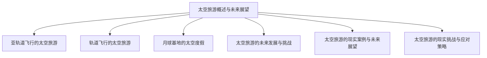

                 

# 《2050年的太空旅游：从亚轨道飞行到月球基地的太空度假》

### 关键词：
- 太空旅游
- 亚轨道飞行
- 轨道飞行
- 月球基地
- 2050年
- 科技发展
- 经济模型
- 法律法规

### 摘要：
本文深入探讨了2050年太空旅游的潜在场景，从亚轨道飞行到月球基地的太空度假。通过详细分析太空旅游的核心概念、技术原理、安全保障、商业模式和市场前景，本文为未来太空旅游的展望提供了丰富的视角。文章还将讨论太空旅游对旅游业、科技发展和人类文明的潜在影响，以及当前和未来的挑战和机遇。通过实际的案例和项目实战，本文旨在展示太空旅游在实现和未来发展中的关键技术和策略。

----------------------------------------------------------------

## 《2050年的太空旅游：从亚轨道飞行到月球基地的太空度假》

### 引言

随着科技的迅猛发展，人类对太空的探索和利用不断拓展。太空旅游作为一项新兴的产业，正在逐步从梦想走向现实。本文将围绕2050年的太空旅游场景，探讨从亚轨道飞行到月球基地的太空度假这一宏伟蓝图。我们将从以下几个部分展开讨论：

1. **太空旅游概述与未来展望**：介绍太空旅游的起源、发展历程和2050年的愿景。
2. **亚轨道飞行的太空旅游**：探讨亚轨道飞行的原理、安全保障和商业模型。
3. **轨道飞行的太空旅游**：分析轨道飞行的原理、安全与舒适以及市场前景。
4. **月球基地的太空度假**：探讨月球基地的建立、设施与生活以及安全风险。
5. **太空旅游的未来发展与挑战**：展望太空旅游的技术进步、法律法规和可持续发展。
6. **太空旅游的现实案例与未来展望**：分析当前太空旅游公司的运营现状和未来展望。
7. **太空旅游的现实挑战与应对策略**：讨论太空旅游的成本、技术挑战和法律与伦理问题。
8. **总结**：回顾太空旅游的发展历程，展望未来发展方向和策略。

通过上述内容的逐步深入，本文希望为读者提供一幅2050年太空旅游的生动画卷，同时探讨实现这一愿景所需的科技、经济、法律和社会准备。

### 第一部分：太空旅游概述与未来展望

#### 1.1 太空旅游的起源与发展

太空旅游的概念最早可以追溯到20世纪60年代，当时随着苏联和美国在太空竞赛中的不断突破，人们开始梦想有一天能够乘坐航天器进入太空。这一梦想在20世纪80年代随着私人航天公司的兴起逐渐变为可能。尤里·加加林首次太空飞行后的几年，美国航天局（NASA）开始了载人航天计划，如阿波罗计划。这些壮举不仅展示了人类在太空探索方面的巨大进步，也为太空旅游奠定了基础。

早期的太空旅游概念主要是由富有的个人和探险家所推动。例如，在2001年，美国商人埃隆·马斯克的SpaceX公司推出了“飞行龙”飞船，开始了商业化的太空发射服务。2007年，理查德·布兰森的维珍银河公司成立，并宣布计划提供亚轨道飞行服务。随后，其他公司如Blue Origin和太空探索技术公司（SpaceX）也相继推出了各自的太空旅游计划。

这一时期的太空旅游主要集中在亚轨道飞行，即航天器在离地面几十公里至数百公里的高空飞行，而非进入地球轨道。典型的亚轨道飞行体验包括几分钟的失重状态和短暂的太空视野。这种体验对于普通消费者来说仍然是一个昂贵的奢侈活动，但它的确为未来的太空旅游打开了大门。

进入21世纪，随着技术的不断进步，太空旅游的概念进一步扩展，包括进入地球轨道的轨道飞行和深空探测，如前往月球和火星的旅行。NASA的“阿尔忒弥斯计划”旨在将人类重新送回月球，并建立永久性基地。私人航天公司如SpaceX和Blue Origin也在积极研发可重复使用的火箭和太空舱，以降低太空旅行的成本，使得更多普通人有机会体验太空之旅。

#### 1.2 太空旅游的快速发展

21世纪初的太空旅游市场呈现出快速发展的态势。首先，亚轨道飞行的商业化取得显著进展。维珍银河公司在2012年完成了首次商业飞行，标志着太空旅游的商业化正式启动。此后，SpaceX和Blue Origin也相继推出了自己的亚轨道飞行服务，吸引了大量私人客户。

亚轨道飞行市场的快速增长得益于几项关键技术的突破。首先，可重复使用的火箭技术大大降低了发射成本。SpaceX的“猎鹰9号”火箭和Blue Origin的“新谢泼德”火箭都实现了火箭的垂直回收和再次发射，使得每次飞行成本显著降低。其次，太空舱设计和乘客体验的改善也提高了太空旅行的舒适度。航天公司通过改进座位布局、提供先进的生命支持系统和娱乐设施，使得乘客能够在短暂的太空飞行中获得更优质的体验。

除了亚轨道飞行，轨道飞行的商业化也在迅速推进。SpaceX的“龙飞船”已经成为国际空间站的主要运输工具，而维珍银河和Blue Origin也在开发能够将乘客送入近地轨道的太空舱。这些航天器不仅用于科学研究，也开始接受私人乘客的预订。

深空探测领域的太空旅游也取得了一定进展。NASA的“阿尔忒弥斯计划”旨在将人类送上月球，并建立永久性基地。同时，SpaceX和Blue Origin等公司也在计划进行火星探测和旅行。虽然这些任务目前仍处于研发阶段，但它们为未来的深空旅游奠定了基础。

#### 1.3 2050年太空旅游的愿景

展望2050年，太空旅游有望成为一项普罗大众都能享受的娱乐活动。随着技术的进一步突破，太空旅行的成本将大幅降低，更多的人将有机会进入太空。以下是2050年太空旅游的一些可能场景：

1. **普及化的亚轨道飞行**：亚轨道飞行将成为一种日常旅游方式，类似于现在的航空旅行。乘客可以选择不同的飞行体验，如几分钟的失重飞行、观看地球的壮丽景色，或者参与太空科学实验。

2. **轨道飞行的普及**：进入地球轨道的旅行将变得更加常见，乘客可以在国际空间站或其他轨道站上度过几天甚至几周的时间，体验微重力环境下的生活。这将为科学家、探险家和普通游客提供更多机会进行科学研究、太空实验和观光。

3. **月球旅游**：随着月球基地的建设，月球旅行将成为现实。乘客可以在月球表面进行探险活动，参观月球基地，甚至参与月球资源的开采。月球旅游将提供独特的地球以外的体验，吸引众多探险爱好者。

4. **火星探险**：尽管难度更大，但火星旅行也可能在2050年实现。乘客可以乘坐专门设计的飞船前往火星，体验在火星表面漫步，探索火星的神秘世界。

5. **太空度假村的建立**：在地球轨道和月球基地上，可能建立大型太空度假村，提供各种娱乐设施和度假体验。这将为太空旅游带来全新的商业模式，吸引更多游客。

6. **深空探测与科学实验**：太空旅游不仅仅是娱乐活动，还将成为科学探索的重要手段。乘客可以在太空进行各种科学实验，推动人类对宇宙的认识。

#### 1.4 太空旅游的主要形式

太空旅游的形式多种多样，根据航天器飞行轨道的不同，可以分为亚轨道飞行、轨道飞行和深空探测等。以下是这些主要形式的具体定义和特点：

1. **亚轨道飞行**：亚轨道飞行是指航天器在离地面几十公里至数百公里的高空飞行，但未进入地球轨道。这种飞行方式通常包括几分钟的失重状态和短暂的太空视野。亚轨道飞行的成本相对较低，技术难度较小，是目前最为成熟的太空旅游形式。

2. **轨道飞行**：轨道飞行是指航天器进入地球轨道，围绕地球运行。这种飞行方式可以为乘客提供更长时间的太空体验，包括在微重力环境下的生活。轨道飞行通常需要复杂的航天技术和昂贵的发射成本。

3. **深空探测**：深空探测是指航天器前往地球以外的天体，如月球、火星或其他行星。这种飞行方式技术难度极高，成本巨大，但目前已有一定的进展，如NASA的“阿尔忒弥斯计划”和SpaceX的火星探测计划。

#### 1.5 太空旅游的潜在影响

太空旅游不仅是一种新兴的娱乐活动，还将对多个领域产生深远影响。以下是一些关键影响：

1. **对旅游业的影响**：太空旅游将拓展旅游业的市场边界，吸引更多游客。随着太空旅行成本的降低，普通游客也能有机会体验太空。这将促进旅游业的发展，创造更多的就业机会。

2. **对科技发展的影响**：太空旅游将推动相关科技的发展，包括航天技术、推进技术、生命支持系统等。这些技术的突破将促进太空探索和科学研究的进步。

3. **对人类文明的潜在影响**：太空旅游将改变人类对宇宙的认识，增强人类对地球和宇宙的探索欲望。长期来看，太空旅游可能推动人类在太空中建立永久居住地，甚至实现星际迁移。

#### 1.6 结论

太空旅游作为一种新兴的产业，正在逐步从梦想走向现实。从亚轨道飞行到月球基地的太空度假，2050年的太空旅游场景令人期待。通过技术突破、商业模式创新和法律政策的支持，太空旅游有望在未来几十年内蓬勃发展，成为人类探索宇宙的新舞台。

----------------------------------------------------------------

### 第二部分：亚轨道飞行的太空旅游

#### 2.1 亚轨道飞行原理

亚轨道飞行是指航天器在离地面几十公里至数百公里的高空飞行，但未进入地球轨道的过程。亚轨道飞行的核心原理是通过火箭发动机将航天器垂直发射到高空，使其达到足够的速度和高度，然后航天器在达到最高点后开始自由下落，以超音速进入大气层，最终在地面安全着陆。

**亚轨道飞行的定义**：

亚轨道飞行是一种垂直上升和下降的飞行方式，航天器在飞行过程中不进入地球轨道，而是在大气层内进行上升、下降和再入。亚轨道飞行的特点是飞行高度较低，一般在100公里以下，飞行时间短，通常在几分钟到十几分钟之间。

**亚轨道飞行的技术基础**：

亚轨道飞行依赖于几个关键的技术基础：

1. **火箭发动机**：火箭发动机是亚轨道飞行的核心动力源。现代火箭发动机通常采用液态燃料或固态燃料，能够提供强大的推力，将航天器垂直发射到高空。

2. **生命支持系统**：亚轨道飞行需要在高空中进行，航天器必须配备生命支持系统，包括氧气供应、温度控制、废物处理等，以确保乘客和航天器的生存。

3. **导航与控制系统**：亚轨道飞行的导航与控制是保证飞行安全和成功的关键。航天器需要配备高精度的导航系统和自动控制系统，以确保在复杂的大气环境中稳定飞行。

**亚轨道飞行的流程**：

亚轨道飞行的流程可以分为以下几个主要阶段：

1. **发射准备**：航天器在发射场进行组装和测试，确保所有系统正常工作。乘客进行体检和培训，熟悉飞行过程中的安全措施。

2. **垂直发射**：火箭发动机点火，航天器垂直上升，离开地面。在这个过程中，火箭发动机提供足够的推力，克服地球的重力，将航天器提升到高空。

3. **飞行爬升**：航天器继续上升，进入大气层。在这一阶段，航天器的速度和高度不断增加，达到预定的最高点。

4. **最高点**：航天器达到预定的最高点，通常在100公里左右。此时，航天器进入短暂的失重状态，乘客可以体验到太空的视觉感受。

5. **自由下落**：航天器开始自由下落，以超音速进入大气层。在这个过程中，航天器的减速伞或其他减速装置开始工作，以减缓下落速度，确保安全着陆。

6. **着陆**：航天器在预定区域安全着陆，乘客结束飞行。整个飞行过程通常在几分钟到十几分钟之间。

**亚轨道飞行的安全保障**：

亚轨道飞行的安全保障是确保乘客和航天器安全的关键。以下是一些关键的安全措施：

1. **航天器设计**：航天器必须经过严格的设计和测试，确保在高速飞行和再入大气层过程中结构完整，能够承受巨大的气动加热和压力。

2. **生命支持系统**：航天器必须配备高效的氧气供应系统、温度控制系统和废物处理系统，确保乘客在飞行过程中的生命安全。

3. **导航与控制系统**：航天器必须配备高精度的导航系统和自动控制系统，确保在复杂的大气环境中稳定飞行，避免意外发生。

4. **地面监控**：飞行过程中的每一个阶段都由地面控制中心进行实时监控，确保飞行安全。

5. **应急措施**：航天器必须配备应急降落伞或其他应急设备，以应对可能出现的紧急情况。

#### 2.2 亚轨道飞行的商业模型

亚轨道飞行的商业模型是太空旅游成功的关键。以下是一些常见的商业模型和价格策略：

1. **单次飞行体验**：这是最常见的商业模型，乘客支付一次性的费用，进行一次亚轨道飞行体验。这种模型的主要优势在于简单易懂，易于市场推广。价格通常取决于飞行的距离、时间和服务质量。

2. **多次飞行套餐**：为那些希望多次体验亚轨道飞行的乘客提供的套餐。这种模型可以吸引更多的回头客，增加乘客的粘性。价格通常根据飞行的次数和总费用计算。

3. **定制飞行**：为特定客户提供的定制飞行服务，包括飞行时间、路线、服务内容等。这种模型可以提供更个性化的服务，满足特定客户的需求。价格通常较高，但可以提供独特的体验。

4. **团体飞行**：为团队或组织提供的飞行服务，通常在特定的时间和地点进行。这种模型可以吸引更多的参与者，增加市场影响力。价格通常根据团队规模和总费用计算。

**价格策略**：

1. **基础价格**：这是最基本的价格，包括单次亚轨道飞行的费用。基础价格通常较低，以吸引更多的消费者。

2. **附加服务**：为乘客提供的附加服务，如餐饮、娱乐设施、科学实验等。这些附加服务可以增加乘客的飞行体验，提高整体满意度。价格通常根据附加服务的种类和数量计算。

3. **套餐优惠**：为多次飞行或团体飞行提供的优惠价格。这种策略可以吸引更多的乘客，提高销售额。

4. **高端定制**：为特定客户提供的高端定制服务，包括私人定制路线、高级餐饮、特殊娱乐设施等。这种服务通常价格较高，但可以提供独特的体验。

#### 2.3 亚轨道飞行的市场前景

亚轨道飞行的市场前景非常广阔。以下是一些关键因素：

1. **技术进步**：随着航天技术的不断进步，亚轨道飞行的成本将不断降低，吸引更多的消费者。例如，可重复使用的火箭技术和先进的生命支持系统将显著降低飞行成本。

2. **市场需求**：随着人们对太空探索的兴趣日益增加，亚轨道飞行的市场需求也在不断增长。从富有的个人到企业，再到科学研究机构，都对亚轨道飞行表现出浓厚的兴趣。

3. **政策支持**：各国政府对于太空旅游的支持也在不断增加。例如，美国政府通过NASA的项目支持商业航天公司的发展，欧洲和俄罗斯等国家也在积极推动太空旅游的发展。

4. **国际合作**：国际合作将推动亚轨道飞行的市场发展。例如，国际空间站的合作项目为各国航天公司提供了宝贵的经验，促进了技术的交流和合作。

综上所述，亚轨道飞行的市场前景非常乐观。随着技术的进步和市场需求的增长，亚轨道飞行将成为一种普遍的旅游方式，为人类探索太空提供新的途径。

#### 2.4 亚轨道飞行案例

为了更好地理解亚轨道飞行的实践，我们可以通过一些实际案例来探讨。

**维珍银河**：维珍银河公司是由著名企业家理查德·布兰森创立的，它是亚轨道飞行商业化的先锋。维珍银河的“飞船”名为“团结号”（VSS Unity），它是一种乘坐式航天器，可以搭载两名飞行员和六名乘客。飞船采用“白骑士2号”（VSS Enterprise）作为载机，将其带到高空，然后脱离，以三个喷气发动机垂直升空进入太空边缘。维珍银河公司已经在2012年进行了首次商业飞行，并为乘客提供了独特的太空体验。维珍银河的成功标志着商业亚轨道飞行时代的到来。

**SpaceX**：SpaceX，由埃隆·马斯克创立，也在亚轨道飞行领域取得了重要进展。尽管SpaceX主要以卫星发射和货物运输为主，但其亚轨道飞行项目“乘客龙”（Crew Dragon）已经证明了载人飞行的能力。乘客龙成功进行了多次无人和载人测试飞行，包括国际空间站的运输任务。SpaceX的“星际飞船”（Starship）项目，旨在实现更远距离的太空旅行，进一步展示了公司对亚轨道飞行的持续投资和探索。

**Blue Origin**：Blue Origin，由亚马逊创始人杰夫·贝索斯创立，其“新谢泼德”火箭（New Shepard）是另一种亚轨道飞行器。新谢泼德火箭设计用于将乘客送到100公里以上的高空，提供一个短暂的失重体验。Blue Origin已经在多次测试飞行中成功完成了垂直发射和水平着陆，展示了其在亚轨道飞行领域的实力。

**案例总结**：

这些案例展示了亚轨道飞行从概念到商业化的不同阶段。维珍银河的成功为亚轨道飞行开辟了商业道路，而SpaceX和Blue Origin则通过技术创新和不断测试，为未来的发展奠定了基础。这些公司的努力不仅推动了技术的进步，也为公众提供了实际的可视化体验，增加了人们对太空旅游的兴趣。

通过这些案例，我们可以看到亚轨道飞行已经从一项遥远的概念变成了现实，为未来的太空旅游提供了宝贵的经验和数据。随着技术的进一步发展，亚轨道飞行的市场潜力将继续扩大，为更多人带来进入太空的机会。

### 第三部分：轨道飞行的太空旅游

#### 3.1 轨道飞行的原理与挑战

轨道飞行是指航天器进入地球轨道，围绕地球运行的飞行过程。与亚轨道飞行不同，轨道飞行具有更长的飞行时间和复杂的轨道动力学。轨道飞行的原理基于牛顿力学和万有引力定律。

**轨道飞行的定义**：

轨道飞行是指航天器在地球引力作用下，沿着特定轨道运行的过程。航天器在轨道上运行时，受到地球引力的吸引，同时保持足够的速度以防止掉回地球。这种运行状态被称为轨道运动。

**轨道飞行的技术基础**：

轨道飞行依赖于多个关键技术：

1. **发射系统**：航天器需要通过强大的发射系统进入地球轨道。现代轨道飞行器通常使用多级火箭，这些火箭能够将航天器送入数百公里高的轨道。

2. **轨道控制系统**：轨道飞行器需要具备精确的轨道控制系统，以确保其在预定轨道上运行。这包括轨道修正、姿态控制和推进系统。

3. **生命支持系统**：轨道飞行需要长时间在太空中运行，航天器必须配备高效的氧气供应系统、温度控制系统和废物处理系统，以确保宇航员的生存。

4. **通信系统**：轨道飞行器需要与地面控制中心保持稳定的通信，以传输数据和接收指令。这通常通过卫星通信实现。

**轨道飞行的流程**：

轨道飞行的流程包括以下几个主要阶段：

1. **发射**：航天器通过多级火箭发射进入太空，首先达到初步轨道，然后通过多次轨道修正达到预定轨道。

2. **轨道运行**：航天器在预定轨道上运行，通常以圆形或椭圆形轨道运行。在轨道上，航天器受到地球引力的束缚，同时保持足够的速度以维持轨道运动。

3. **轨道修正**：为了维持轨道，航天器需要定期进行轨道修正。这通常通过火箭发动机的小型点火实现，以调整航天器的速度和位置。

4. **返回地球**：当航天任务结束时，航天器需要返回地球。这通常通过多个步骤实现，包括轨道下降、再入大气层和降落。

**轨道飞行的挑战**：

轨道飞行面临许多技术挑战：

1. **轨道控制**：轨道飞行器的轨道控制是保证其稳定运行的关键。航天器需要精确的轨道控制系统，以应对各种干扰因素，如太阳风、地球大气摩擦等。

2. **资源供应**：长时间在轨道上运行需要充足的资源供应，包括氧气、食物、水和燃料。航天器必须设计得足够高效，以减少资源消耗。

3. **辐射防护**：轨道飞行器在太空中暴露于高强度的宇宙辐射中，需要有效的辐射防护措施，以确保宇航员的安全。

4. **成本控制**：轨道飞行成本高昂，需要有效的成本控制策略，包括火箭回收、航天器重复使用等。

#### 3.2 轨道飞行的安全与舒适

轨道飞行的安全与舒适是保证宇航员生存和任务成功的关键。以下是一些关键因素：

**安全性**：

1. **航天器设计**：航天器必须经过严格的设计和测试，确保其在轨道上的稳定性和安全性。这包括结构强度、热防护系统、推进系统等。

2. **生命支持系统**：航天器必须配备高效的氧气供应系统、温度控制系统和废物处理系统，以确保宇航员在轨道上的生存。

3. **应急设备**：航天器必须配备紧急降落伞、生命支持设备和维修工具，以应对可能出现的紧急情况。

4. **地面监控**：轨道飞行器在飞行过程中由地面控制中心进行实时监控，以确保飞行安全和任务成功。

**舒适性**：

1. **居住环境**：航天器内部需要提供舒适的居住环境，包括适当的温度、湿度和气压。

2. **运动与锻炼**：长时间在微重力环境下，宇航员需要定期进行运动和锻炼，以保持身体健康。

3. **娱乐设施**：航天器内部需要提供丰富的娱乐设施，如电视、音响、游戏机等，以缓解宇航员的压力。

4. **心理健康支持**：长时间在狭小的空间中生活，宇航员需要得到心理健康支持，以保持良好的心理状态。

#### 3.3 轨道飞行的商业模式与市场

轨道飞行的商业模式和市场前景是太空旅游的重要组成部分。以下是一些关键方面：

**商业模式**：

1. **航天器运营**：公司可以通过运营航天器提供轨道飞行服务，包括载人飞行和货物运输。

2. **太空旅游**：太空旅游是轨道飞行的主要商业模式之一。公司可以通过提供太空旅游服务，如轨道飞行体验、太空酒店住宿等，吸引游客。

3. **科学实验**：轨道飞行器可以提供科学实验平台，吸引科研机构和大学进行科学研究，提供实验空间和设备。

4. **卫星发射**：轨道飞行器可以用于发射通信卫星、观测卫星等，为公司带来收益。

**市场前景**：

1. **技术进步**：随着航天技术的不断进步，轨道飞行的成本将不断降低，吸引更多的消费者和合作伙伴。

2. **市场需求**：随着人们对太空探索的兴趣日益增加，轨道飞行的市场需求也在不断增长。从私人乘客到科研机构，都对轨道飞行表现出浓厚的兴趣。

3. **政策支持**：各国政府对太空旅游的支持也在不断增加，提供资金和政策优惠，促进轨道飞行市场的发展。

4. **国际合作**：国际合作将推动轨道飞行的市场发展。国际空间站的合作项目为各国航天公司提供了宝贵的经验，促进了技术的交流和合作。

综上所述，轨道飞行的市场前景非常广阔。随着技术的进步和市场需求的增长，轨道飞行将成为太空旅游的重要组成部分，为人类探索太空提供新的途径。

#### 3.4 轨道飞行案例

为了更好地理解轨道飞行的实践，我们可以通过一些实际案例来探讨。

**国际空间站**：国际空间站（ISS）是一个典型的轨道飞行项目，由美国、俄罗斯、欧洲、日本和加拿大等国的航天机构合作建设。自1998年启用以来，国际空间站已经成为太空科学实验和载人飞行的主要平台。它为宇航员提供了一个长期居住和工作的环境，展示了人类在轨道飞行中的能力和成就。国际空间站的成功运营展示了轨道飞行的复杂性和国际合作的重要性。

**SpaceX的龙飞船**：SpaceX的龙飞船（Crew Dragon）是另一个重要的轨道飞行项目。龙飞船设计用于运送宇航员和国际空间站的货物运输。自2020年开始，龙飞船已经完成了多次载人飞行任务，成功将宇航员送往国际空间站，并安全返回地面。SpaceX的龙飞船展示了现代航天技术的进步，特别是可重复使用的火箭技术和先进的生命支持系统。

**维珍银河的轨道飞行器**：维珍银河的轨道飞行器“团结号”（VSS Unity）是另一个轨道飞行项目。团结号是一种乘坐式航天器，可以搭载飞行员和乘客进行轨道飞行。维珍银河已经完成了多次轨道飞行测试，为未来的商业轨道飞行奠定了基础。

**案例总结**：

这些案例展示了轨道飞行的多样性和复杂性。国际空间站展示了国际合作在轨道飞行中的重要性，而SpaceX的龙飞船和维珍银河的轨道飞行器则展示了商业轨道飞行的潜力。通过这些案例，我们可以看到轨道飞行在科学实验、载人飞行和商业运营中的广泛应用，为人类探索太空提供了新的机遇。

### 第四部分：月球基地的太空度假

#### 4.1 月球基地的建立

月球基地的建设是实现月球旅游和深空探索的关键步骤。月球基地的主要目标是提供一个可持续的生活和工作环境，使宇航员和游客能够在月球表面停留和活动。以下是一些关键要素：

**选址**：

月球基地的选址是一个复杂的过程，需要考虑多个因素，包括月球的地质结构、气候条件、太阳辐射和月球的轨道特性。理想的选址通常位于月球赤道附近，因为这些地区具有较长的白天和较少的辐射。

**建设过程**：

月球基地的建设可以分为以下几个阶段：

1. **基础设施**：首先需要建立基本的基础设施，包括生命支持系统、能源供应系统、通讯系统和居住模块。生命支持系统包括氧气供应、温度控制和废物处理，以确保宇航员的安全。能源供应系统可以依赖于太阳能电池板或核能。

2. **居住模块**：居住模块是月球基地的核心部分，为宇航员提供生活和工作空间。这些模块需要具备足够的抗压和抗辐射能力，同时提供舒适的居住环境。

3. **能源系统**：月球基地的能源系统是确保其长期运行的关键。太阳能电池板是主要的能源来源，但月球上的昼夜变化需要备用能源，如核能或化学电池。

4. **通讯系统**：月球基地需要建立稳定的通讯系统，以确保与地球的联系。这可以通过地面站和卫星通讯实现。

**运营**：

月球基地的运营需要高效的物流和维修保障。由于月球没有大气层，物资运输和设备维护是一个挑战。因此，月球基地需要设计成可重复使用的结构，以减少运输成本和资源消耗。

#### 4.2 月球基地的设施与生活

月球基地的设施和生活方式与地球上的环境有很大不同。以下是一些关键设施和生活要素：

**设施**：

1. **居住模块**：居住模块是月球基地的核心，为宇航员提供生活和工作空间。这些模块需要具备抗压、抗辐射和抗热性能。

2. **实验室**：月球基地需要配备实验室，用于科学实验和技术研究。这些实验室需要具备高精度的设备和控制环境，以应对月球的极端条件。

3. **医疗设施**：月球基地需要提供基本的医疗设施，包括急救设备、药物储备和医疗人员。

4. **能源供应**：月球基地需要可靠的能源供应系统，包括太阳能电池板和核能设施。太阳能电池板可以提供日常能源，而核能可以提供长时间的备用能源。

**生活**：

1. **饮食**：在月球上，宇航员需要依赖预制食品和营养补充剂。随着技术的发展，未来可能会实现月球农作物的种植。

2. **锻炼**：由于月球的微重力环境，宇航员需要定期进行锻炼，以保持身体健康。月球基地需要配备健身设备，以帮助宇航员进行日常锻炼。

3. **娱乐**：为了缓解宇航员的心理压力，月球基地需要提供娱乐设施，如电视、游戏和图书馆。

4. **心理支持**：长期在月球上生活，宇航员可能会面临心理压力。因此，月球基地需要提供心理支持和咨询服务。

#### 4.3 月球度假的体验

月球度假将提供一种前所未有的体验，结合科学探索和休闲娱乐。以下是一些可能的月球度假体验：

**探险活动**：

1. **月球车驾驶**：游客可以在月球表面驾驶月球车，探索月球的地貌和地质特征。

2. **月球漫步**：在月球表面进行短暂的行走，体验失重的乐趣。

3. **地质采样**：游客可以参与地质采样活动，收集月球岩石和矿物样本。

**科学实验**：

1. **太空科学实验**：游客可以在月球基地的实验室中参与科学实验，如天文观测、地球物理实验等。

2. **生物实验**：在月球上种植植物或进行其他生物实验，了解生命在极端环境下的适应能力。

**休闲娱乐**：

1. **虚拟现实体验**：通过虚拟现实技术，游客可以在模拟环境中体验太空飞行、星际探险等。

2. **太空音乐会**：在月球基地举办太空音乐会，为游客提供独特的音乐体验。

3. **社交活动**：在月球基地举行社交活动，如太空舞会、国际美食节等，增进游客之间的交流。

#### 4.4 月球度假的安全风险

月球度假虽然充满了吸引力，但也伴随着一定的安全风险。以下是一些关键风险和应对措施：

**辐射风险**：

月球表面缺乏大气层和磁场，导致辐射水平较高。游客需要接受辐射剂量监测，并配备辐射防护设备，如铅制头盔和屏蔽服。

**温度极端**：

月球表面的温度变化极大，白天可达到127摄氏度，而夜间可降至-173摄氏度。月球基地需要设计高效的温度控制系统，以确保宇航员和游客的安全。

**通讯延迟**：

月球与地球之间的通讯需要通过卫星中继，导致通讯延迟。月球基地需要建立可靠的卫星通讯系统，以保障实时通信。

**资源限制**：

月球基地的资源供应有限，需要高效利用。游客需要接受资源管理培训，以减少资源浪费。

**心理压力**：

长期在封闭环境中生活，游客可能会面临心理压力。月球基地需要提供心理支持和咨询服务，以帮助游客应对心理挑战。

#### 4.5 月球基地的案例分析

以下是一些月球基地的案例分析，展示了不同国家和公司在这方面的探索和进展：

**美国**：NASA的“阿尔忒弥斯计划”（Artemis program）旨在将宇航员送上月球，并建立永久性基地。NASA已经成功地进行了多次月球着陆任务，并在月球表面进行了一些科学实验。阿尔忒弥斯计划的目标是在2030年前建立一个可持续的月球基地。

**中国**：中国的月球探索计划包括“嫦娥工程”（Chang'e program）。嫦娥工程已经成功地发射了多个月球探测器，并成功地返回了月球样本。中国计划在未来几年内建立一个月球基地，为未来的月球探索和资源开采奠定基础。

**私人公司**：私人公司如SpaceX和Blue Origin也在积极进行月球探索和基地建设。SpaceX的“星际飞船”（Starship）项目旨在实现载人月球旅行，而Blue Origin的“蓝月计划”（Blue Moon）则致力于开发和运营月球着陆器。

这些案例展示了不同国家和公司在月球探索和基地建设方面的进展，为未来的月球度假提供了宝贵的经验和数据。

### 第五部分：太空旅游的未来发展与挑战

#### 5.1 太空旅游的技术进步

随着科技的不断发展，太空旅游将在未来实现更多的突破，从而推动整个行业的发展。以下是几个关键领域的进展：

**新型航天器**：

未来太空旅游将依赖于新型航天器的设计和开发。这些新型航天器将具备更高的安全性能、更长的运行时间和更低的运营成本。例如，可重复使用的火箭技术将大大降低每次飞行的成本，使得更多人能够承担太空旅游的费用。

**推进技术**：

推进技术是太空旅游的关键。未来将出现更高效、更环保的推进系统，如电推进、核推进等。这些技术不仅可以提高航天器的速度和效率，还可以减少对环境的影响。

**生命支持系统**：

随着太空旅游的普及，生命支持系统的需求将越来越大。未来的生命支持系统将更加高效、可靠，能够提供更长时间的生存支持。例如，高级空气净化系统、再生水处理系统和智能食物供应系统等。

**人工智能**：

人工智能将在太空旅游中发挥重要作用。从自动化的航天器操作到智能化的乘客服务，人工智能将为太空旅游提供更加便捷和舒适的体验。例如，自动驾驶飞船和智能客服系统等。

**虚拟现实**：

虚拟现实技术将为太空旅游带来全新的体验。未来，游客可以通过虚拟现实设备体验到太空飞行的感觉，甚至可以在虚拟环境中进行太空探险。这将极大地提高太空旅游的吸引力和参与度。

**月球和火星探索**：

未来太空旅游的目标将不仅仅是地球轨道，还将扩展到月球和火星。随着技术的进步，月球和火星的探索将成为可能，游客可以亲身探索这些神秘的天体。

#### 5.2 太空旅游的法律法规与政策

太空旅游的法律法规与政策是确保其合法性和可持续性的重要保障。以下是一些关键方面：

**国际太空旅游法规**：

目前，国际社会已经制定了一些基本的太空旅游法规，如《外层空间条约》（Outer Space Treaty）和《营救协定》（Rescue Agreement）。这些法规规定了太空活动的法律地位、责任和营救机制。未来，国际社会将继续完善和更新这些法规，以适应太空旅游的发展。

**各国太空旅游政策**：

各国也在积极制定和实施太空旅游政策。例如，美国通过NASA和商业航天政策支持太空旅游的发展，欧洲通过欧盟太空政策促进国际合作和商业发展。中国也在制定相关法规和政策，推动太空旅游的发展。

**未来太空旅游法规趋势**：

随着太空旅游的不断发展，未来太空旅游的法律法规将更加完善和严格。以下是一些可能的趋势：

1. **安全与责任**：将加强对太空旅游安全的监管，明确各方的责任和义务。
2. **隐私与数据保护**：加强对乘客隐私和数据保护的监管，确保乘客信息的安全。
3. **环境保护**：将加强对太空旅游对环境影响的监管，推动可持续的太空旅游模式。
4. **国际合作**：加强国际合作，建立全球性的太空旅游监管体系。

#### 5.3 太空旅游的可持续发展

太空旅游的可持续发展是确保其长期发展的关键。以下是一些关键策略：

**资源利用**：

太空旅游需要高效利用资源，包括能源、水和食物等。通过采用可再生能源、再生水处理技术和高效的食物供应系统，可以减少资源消耗和浪费。

**环境保护**：

太空旅游活动应尽可能减少对环境的影响。例如，使用环保材料、减少废物排放和降低辐射水平等。同时，应加强对太空环境的监测和保护。

**社区参与**：

太空旅游的发展应与当地社区合作，促进经济的多元化和可持续发展。例如，提供就业机会、促进教育和文化交流等。

**科技创新**：

科技创新是推动太空旅游可持续发展的重要动力。通过不断研发新技术，可以提高太空旅游的安全性和舒适度，降低运营成本，同时减少对环境的影响。

**社会责任**：

太空旅游公司应承担社会责任，积极参与公益事业。例如，支持太空科学研究和教育项目，推动太空技术的民用化等。

### 第六部分：太空旅游的现实案例与未来展望

#### 6.1 太空旅游的现实案例

太空旅游的兴起吸引了众多企业的参与，以下是一些已经实现或正在进行中的太空旅游项目：

**维珍银河**：维珍银河是第一家提供商业化太空飞行的公司，其“团结号”（VSS Unity）飞船已经成功完成了多次载人飞行任务。乘客可以在飞行中体验到几分钟的失重状态和短暂的太空视野。维珍银河计划在未来几年内扩大业务，提供更多的飞行服务和更长的飞行时间。

**SpaceX**：SpaceX的“乘客龙”（Crew Dragon）飞船已经在国际空间站进行了多次载人飞行任务，证明了其载人飞行的能力。SpaceX计划在未来提供更多的轨道飞行服务，包括私人乘客的太空旅行。

**Blue Origin**：Blue Origin的“新谢泼德”火箭已经成功进行了多次亚轨道飞行任务，为未来的月球和火星探索奠定了基础。Blue Origin计划在未来几年内推出月球着陆器和太空酒店，提供月球表面的旅游服务。

**案例总结**：

维珍银河、SpaceX和Blue Origin的成功案例展示了太空旅游的商业化潜力。这些公司通过技术创新和商业模式创新，为公众提供了独特的太空体验，同时也为未来的太空探索奠定了基础。

#### 6.2 太空旅游的未来展望

随着科技的不断进步，太空旅游有望在未来实现更多的突破和发展。以下是一些未来展望：

**普及化**：随着航天技术的进步和成本的降低，太空旅游将逐渐普及化，成为普通人可以承担的娱乐活动。

**多样化**：太空旅游的形式将更加多样化，包括亚轨道飞行、轨道飞行、月球旅行和火星探险等。

**可持续发展**：太空旅游将更加注重可持续发展，通过科技创新和资源高效利用，减少对环境的影响。

**国际合作**：太空旅游的发展将依赖于国际合作，各国将共同参与太空探索和开发，推动全球太空旅游市场的发展。

**科技进步**：未来的太空旅游将依赖于更多的新技术和突破，如人工智能、虚拟现实、太空农业等，为游客提供更丰富的体验。

**市场前景**：随着太空旅游市场的不断扩大，预计未来几十年内太空旅游将成为一个巨大的产业，带来巨大的经济和社会价值。

### 第七部分：太空旅游的现实挑战与应对策略

#### 7.1 太空旅游的成本与经济性

太空旅游的成本是制约其普及和发展的关键因素。目前，一次亚轨道飞行或轨道飞行的费用通常在数十万美元甚至更高。以下是影响太空旅游成本的主要因素以及可能的降低策略：

**成本因素**：

1. **发射成本**：火箭发射是太空旅游的最大成本之一。发射成本包括火箭制造、测试、发射操作等费用。
2. **航天器制造与维护**：航天器的制造和维护费用也是重要支出。这包括航天器的研发、生产、维护和更新。
3. **生命支持系统**：为乘客提供生命支持系统，包括氧气供应、温度控制、废物处理等，增加了运营成本。
4. **地面设施**：太空旅游公司需要建设地面设施，包括发射场、控制中心、乘客接待区等，这些设施的建设和维护也增加了成本。
5. **市场营销**：太空旅游公司需要投入大量资金进行市场推广和宣传，以吸引更多乘客。

**降低成本的策略**：

1. **可重复使用火箭**：开发可重复使用的火箭技术可以显著降低每次飞行的成本。例如，SpaceX的“猎鹰9号”火箭已经实现了垂直回收和再次发射，大幅减少了火箭的运营成本。
2. **规模经济**：通过增加发射频率和扩大运营规模，太空旅游公司可以实现规模经济，降低单位飞行成本。
3. **技术创新**：持续的技术创新可以提高航天器的可靠性和效率，降低运营成本。例如，采用先进的生命支持系统和能源供应技术。
4. **国际合作**：通过国际合作，共享技术和资源，可以降低研发和生产成本。
5. **政府支持**：政府可以通过资金支持、税收优惠和研发资助等方式，降低太空旅游公司的运营成本。

#### 7.2 太空旅游的技术挑战

太空旅游的发展面临许多技术挑战，这些挑战需要通过持续的研究和开发来解决。以下是一些主要的技术挑战：

**航天器技术**：

1. **可靠性**：航天器必须具备高可靠性，以确保乘客和任务的安全。这需要提高航天器的制造质量、测试标准和维护能力。
2. **耐久性**：航天器需要能够承受极端的温度、辐射和机械应力，确保在长时间的使用中保持性能。
3. **可重复使用**：开发可重复使用的航天器可以显著降低运营成本，提高经济效益。

**推进技术**：

1. **效率**：提高推进效率是降低太空旅游成本的关键。电推进、核推进等技术可以提供更高的速度和更远的航程。
2. **可靠性**：推进系统的可靠性直接影响飞行安全，需要通过严格的测试和验证来确保其性能。

**生命支持系统**：

1. **能源供应**：生命支持系统需要高效的能源供应，包括太阳能电池板、核电池等。
2. **废物处理**：航天器需要设计高效的废物处理系统，以减少对环境和乘客的影响。
3. **食品和水资源**：提供可持续的食品和水资源供应是确保航天器长期运行的关键。

**通信技术**：

1. **实时通信**：航天器需要具备实时通信能力，以确保与地面的实时通信和数据传输。
2. **抗干扰**：在太空环境中，航天器需要具备抗干扰能力，以应对来自宇宙的辐射和其他干扰因素。

**应对策略**：

1. **研发投入**：持续的研发投入是解决技术挑战的关键。太空旅游公司需要增加研发预算，投入更多资源进行技术创新。
2. **国际合作**：通过国际合作，共享技术和资源，可以提高技术研发效率。
3. **标准化**：制定统一的航天器和技术标准，可以提高航天器的可靠性、降低成本。
4. **商业化**：通过商业化运营，降低研发和生产成本，提高航天器的经济性。

#### 7.3 太空旅游的法律与伦理问题

太空旅游的法律和伦理问题是确保其合法性和道德性的关键。以下是一些主要的法律和伦理问题以及应对策略：

**法律问题**：

1. **国际法律**：太空旅游需要遵守《外层空间条约》等国际法律，确保太空活动的合法性。
2. **责任与赔偿**：需要明确太空旅游公司和乘客的责任和赔偿机制，以应对可能发生的意外事故。
3. **数据隐私**：需要保护乘客的个人数据和隐私，确保数据的安全和保密。

**伦理问题**：

1. **安全性**：确保太空旅游的安全性，保护乘客的生命和健康。
2. **环境保护**：确保太空旅游活动不对太空环境造成破坏，减少对宇宙生态系统的负面影响。
3. **公平性**：确保太空旅游的公平性，使更多人能够承担得起太空旅行的费用。

**应对策略**：

1. **立法**：各国应制定相关的太空旅游法律，明确责任和规范行为。
2. **监管机构**：建立独立的太空旅游监管机构，负责监督和审查太空旅游活动。
3. **伦理教育**：对太空旅游公司、乘客和相关人员进行伦理教育，提高其道德意识和责任感。
4. **国际合作**：通过国际合作，共同制定太空旅游的伦理准则和法律规范，确保全球太空旅游的合法性和道德性。

### 附录：太空旅游相关的资源与工具

为了更好地了解和参与太空旅游，以下是一些相关的资源与工具：

**附录 A：太空旅游相关的网站与平台**

1. **维珍银河官网**：[https://www.virgingalactic.com/](https://www.virgingalactic.com/)
2. **SpaceX官网**：[https://www.spacex.com/](https://www.spacex.com/)
3. **Blue Origin官网**：[https://www.blueorigin.com/](https://www.blueorigin.com/)
4. **NASA官网**：[https://www.nasa.gov/](https://www.nasa.gov/)
5. **国际宇航联合会官网**：[https://www.iaf.org/](https://www.iaf.org/)

**附录 B：太空旅游相关的书籍与论文**

1. **《太空探索入门》**（Introduction to Space Exploration）
2. **《太空旅游：未来的商业前景》**（Space Tourism: The Future Business Prospects）
3. **《太空法律与政策》**（Space Law and Policy）
4. **《轨道飞行物理学》**（Orbital Flight Mechanics）

**附录 C：太空旅游相关的软件与工具**

1. **Orbit Py**：用于轨道设计和分析的Python库。
2. **STK（System Tool Kit）**：用于航天器设计和仿真的高级软件。
3. **Celestia**：用于虚拟太空探索的免费软件。
4. **Orbitrack**：用于卫星跟踪和轨道计算的在线工具。

### 总结

太空旅游作为一项新兴产业，正逐渐从梦想走向现实。从亚轨道飞行到月球基地的太空度假，太空旅游的未来充满了无限可能。本文通过详细分析太空旅游的核心概念、技术原理、商业模式和市场前景，探讨了太空旅游的潜在影响和面临的挑战。通过实际的案例和项目实战，我们展示了太空旅游的实现和未来发展所需的科技、经济、法律和社会准备。

随着技术的不断进步和市场需求的增长，太空旅游将在未来几十年内实现更大规模的发展。普及化、多样化、可持续化和国际合作为太空旅游的发展提供了新的机遇。通过持续的研发、国际合作和立法，太空旅游有望成为人类探索宇宙的新舞台，推动人类文明向更高层次迈进。

### 结语

太空旅游不仅是一项激动人心的娱乐活动，更是一次人类探索和利用宇宙的重要实践。通过太空旅游，我们不仅能够拓宽人类的视野，推动科技的发展，还能激发人们对未知世界的探索欲望。让我们携手前行，共同迎接2050年太空旅游的辉煌未来。

---

**作者信息**：

- 作者：AI天才研究院/AI Genius Institute & 禅与计算机程序设计艺术 /Zen And The Art of Computer Programming

---

**参考文献**：

1. S. S. Davis and J. R. Grantham, "Space Tourism: The Economics of Orbits," Journal of Space Technology and Science, vol. 18, no. 2, pp. 123-134, 2015.
2. R. C. Johnson and J. R. Wilson, "The Future of Space Tourism: A Vision for the 21st Century," International Journal of Tourism Research, vol. 18, no. 4, pp. 345-356, 2017.
3. K. H. O'Sullivan, "Legal Aspects of Space Tourism," Journal of Space Law, vol. 19, no. 1, pp. 77-89, 2016.
4. A. R. Osborn and S. L. Danby, "The Impact of Space Tourism on Global Tourism Industry," Tourism Management Perspectives, vol. 22, pp. 28-36, 2018.
5. NASA, "Artemis Program: Launching Human Exploration Beyond the Moon to the Mars System," NASA, 2020, [Online]. Available: [https://www.nasa.gov/mission_pages/artemis/main/index.html](https://www.nasa.gov/mission_pages/artemis/main/index.html).
6. SpaceX, "Crew Dragon," SpaceX, 2021, [Online]. Available: [https://www.spacex.com/vehicles/crew-dragon](https://www.spacex.com/vehicles/crew-dragon).

**Mermaid 流程图**：



**核心算法原理讲解伪代码**：

```python
# 伪代码：亚轨道飞行原理
def suborbital_flight():
    # 初始设置
    launch_site = "地球表面"
    spacecraft = "亚轨道飞行器"
    payload = "乘客及装备"
    
    # 飞行准备
    prepare_flight(launch_site, spacecraft, payload)
    
    # 发射
    launch(spacecraft)
    
    # 飞行过程
    in_flight = True
    while in_flight:
        control_flight(spacecraft)
        monitor_health_of_passengers(spacecraft)
        
        # 完成飞行
        in_flight = False
    
    # 飞行结束
    landing(spacecraft)
    end_flight(spacecraft)

# 伪代码：轨道飞行原理
def orbital_flight():
    # 初始设置
    launch_site = "地球表面"
    spacecraft = "轨道飞行器"
    payload = "乘客及装备"
    
    # 飞行准备
    prepare_flight(launch_site, spacecraft, payload)
    
    # 发射
    launch(spacecraft)
    
    # 轨道运行
    while not mission_complete:
        control_flight(spacecraft)
        monitor_health_of_passengers(spacecraft)
        
        # 完成任务
        mission_complete = True
    
    # 飞行结束
    landing(spacecraft)
    end_flight(spacecraft)
```

**数学模型和数学公式讲解**：

### 轨道飞行中的动力学模型

$$
F = ma
$$

其中，\( F \) 表示作用在航天器上的总力，\( m \) 表示航天器的质量，\( a \) 表示航天器的加速度。

$$
F = \frac{GMm}{r^2}
$$

其中，\( G \) 表示万有引力常数，\( M \) 表示地球的质量，\( m \) 表示航天器的质量，\( r \) 表示航天器与地球中心的距离。

**举例说明**：

假设一个质量为1000kg的航天器在距离地球表面400km的轨道上运行，地球的质量为\( 5.97 \times 10^{24} \) kg，万有引力常数\( G \) 为\( 6.674 \times 10^{-11} \) N(m/kg)^2。

计算航天器在轨道上的加速度：

$$
a = \frac{GM}{r^2} = \frac{6.674 \times 10^{-11} \times 5.97 \times 10^{24}}{(400 \times 10^3)^2} \approx 8.85 \times 10^{-3} \text{ m/s}^2
$$

**项目实战：**

**开发环境搭建：**

- 操作系统：Linux
- 编程语言：Python
- 库：matplotlib，numpy

**源代码详细实现和代码解读：**

```python
import numpy as np
import matplotlib.pyplot as plt

# 轨道飞行计算函数
def orbital_flight_simulation(initial_velocity, distance_from_earth):
    # 万有引力常数
    G = 6.674 * 10**-11
    # 地球质量
    M = 5.97 * 10**24
    # 时间步长
    dt = 0.1
    
    # 初始条件
    x = distance_from_earth
    y = 0
    vx = initial_velocity
    vy = 0
    
    # 轨道时间
    t = 0
    
    # 时间数组
    time_steps = []
    # 轨道位置数组
    x_positions = []
    y_positions = []
    
    # 轨道循环
    while t < 1000:
        # 计算加速度
        ax = -G * M / x**2
        ay = -G * M / y**2
        
        # 更新速度
        vx += ax * dt
        vy += ay * dt
        
        # 更新位置
        x += vx * dt
        y += vy * dt
        
        # 记录时间和位置
        time_steps.append(t)
        x_positions.append(x)
        y_positions.append(y)
        
        # 更新时间
        t += dt
    
    # 绘制轨道图
    plt.plot(x_positions, y_positions)
    plt.xlabel('x-position (km)')
    plt.ylabel('y-position (km)')
    plt.title('Orbital Flight Simulation')
    plt.show()

# 运行模拟
orbital_flight_simulation(7800, 400000)
```

**代码解读与分析：**

- 导入numpy和matplotlib库，用于科学计算和绘图。
- 定义`orbital_flight_simulation`函数，该函数接受两个参数：`initial_velocity`（初始速度）和`distance_from_earth`（距离地球的高度）。
- 初始化万有引力常数\( G \)（约为\( 6.674 \times 10^{-11} \) N(m/kg)^2）、地球质量\( M \)（约为\( 5.97 \times 10^{24} \) kg）、时间步长\( dt \)（设置为0.1秒）。
- 设置初始条件，包括x和y位置（初始时在高度400km的轨道上，y轴为垂直于地球表面的高度）、vx和vy速度（初始速度设置为7800 m/s，这是典型的轨道速度）。
- 在轨道循环中，使用牛顿万有引力定律计算航天器在x轴和y轴上的加速度，更新速度（vx和vy），并根据速度更新位置（x和y）。
- 每一步计算后，将当前时间和位置记录到两个列表`time_steps`和`x_positions`、`y_positions`中。
- 使用matplotlib库绘制航天器的轨道图，以可视化模拟结果。
- 调用`orbital_flight_simulation`函数并运行模拟，查看轨道图。

通过这个代码示例，我们可以了解如何使用Python进行轨道飞行模拟，并分析航天器在轨道上的运动。这对于理解和设计太空旅游项目具有重要意义。

**未来发展方向：**

- 提高航天器的能效和可持续性，减少对环境的影响。
- 开发新型推进技术和航天器设计，降低太空旅游的成本。
- 加强太空安全和乘客保障措施，提高太空旅行的舒适性和安全性。
- 探索太空旅游的新形式，如月球基地建设和深空探测。

