                 

### 2050年的医疗革命

#### 1.1 纳米医学的崛起

纳米医学是一门新兴的交叉学科，它将纳米科学与医学相结合，旨在通过纳米技术来诊断、治疗和预防疾病。在2050年，纳米医学将迎来前所未有的发展机遇。

##### **纳米医学的基本概念和特点**

**定义**：纳米医学是指利用纳米技术（通常是指尺寸在1到100纳米范围内的结构）来研究生物系统和开发医学应用的科学。

**特点**：
- **高效性**：纳米材料具有极高的表面积与体积比，这使它们在药物输送和治疗中表现出卓越的效率。
- **靶向性**：纳米颗粒可以通过修饰特定的分子或抗体，使其能够识别并针对特定的细胞或组织。
- **可控性**：纳米技术允许研究人员对药物的释放速度、位置和方式等进行精确控制。
- **生物相容性**：许多纳米材料具有生物相容性，可以在人体内长时间存在而不引起免疫反应。

##### **纳米技术在医学领域的应用前景**

- **药物输送**：纳米颗粒可以作为药物载体，将药物精确地递送到特定的细胞或组织中，从而提高药物疗效并减少副作用。
- **疾病诊断**：纳米传感器和纳米探针可用于检测疾病标志物，实现早期诊断和实时监控。
- **疾病治疗**：纳米机器人和纳米药物在治疗领域具有巨大的潜力，可以用于精准治疗和修复受损组织。
- **组织工程**：纳米材料可以用于构建人工组织，修复损伤的组织和器官。

#### 1.2 2050年的医疗环境

到2050年，医疗技术将发生革命性的变化。

##### **医疗技术的重大进步**

- **生物技术**：基因编辑、干细胞治疗和再生医学将实现更高效的疾病治疗。
- **人工智能**：机器学习和深度学习将在疾病诊断、治疗计划和个性化医疗中发挥关键作用。
- **纳米医学**：纳米技术的突破将为医学带来全新的治疗方法和诊断工具。

##### **社会对医疗保健的需求变化**

- **人口老龄化**：随着全球人口的老龄化，对慢性病和老年病的治疗需求将大幅增加。
- **个性化医疗**：人们对个性化、精准医疗的需求将推动医疗技术的革新。
- **远程医疗**：随着互联网技术的普及，远程医疗将成为主流，为偏远地区和行动不便的患者提供便捷的医疗服务。

**Mermaid 流程图：2050年医疗技术进步**  
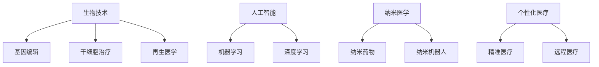

#### 总结

2050年的医疗革命将以纳米医学为核心，结合生物技术、人工智能和个性化医疗，带来前所未有的变革。纳米技术将在疾病诊断、治疗和预防中发挥关键作用，为人类健康带来巨大的福音。

---

### 2050年的医疗环境

#### 2.1 医疗技术的重大进步

在2050年，医疗技术的进步将带来一系列变革。

##### **生物技术的突破**

- **基因编辑**：CRISPR-Cas9等基因编辑技术将能够精确地修复基因突变，治疗遗传病和癌症。
- **干细胞治疗**：干细胞技术将使再生医学成为现实，可以用于修复心脏、肝脏和肾脏等器官。
- **再生医学**：利用生物材料和干细胞技术，可以再生受损的组织和器官。

##### **人工智能在医疗中的应用**

- **诊断辅助**：人工智能可以通过分析医学图像和病历数据，提供准确的诊断建议。
- **治疗计划**：人工智能可以基于患者的基因信息和生活习惯，制定个性化的治疗计划。
- **药物研发**：人工智能可以加速药物研发过程，提高药物的有效性和安全性。

##### **纳米医学的崛起**

- **纳米药物**：纳米药物可以通过精确的靶向递送，提高治疗效果并减少副作用。
- **纳米机器人**：纳米机器人可以在体内执行复杂的任务，如手术和治疗。
- **生物纳米材料**：生物纳米材料可以用于构建人工组织和器官，提供更先进的医学解决方案。

**Mermaid 流程图：医疗技术进步**  
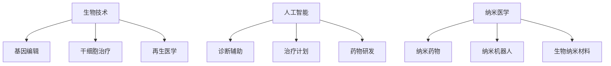

#### 2.2 社会对医疗保健的需求变化

##### **人口老龄化**

随着全球人口的老龄化，对医疗保健的需求将大幅增加。老年人更易患慢性病和老年病，如心脏病、糖尿病和阿尔茨海默病。这要求医疗系统提供更高效、个性化的医疗服务。

##### **个性化医疗**

个性化医疗是一种基于患者基因、环境和生活方式的治疗方法。在2050年，随着生物技术和纳米医学的发展，个性化医疗将成为主流，为患者提供量身定制的治疗方案。

##### **远程医疗**

随着互联网和移动设备的普及，远程医疗将成为解决医疗资源不均衡问题的重要手段。远程医疗可以让医生通过视频和远程诊断设备为偏远地区的患者提供医疗服务。

**Mermaid 流程图：医疗需求变化**  
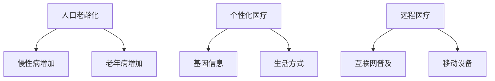

#### 总结

2050年的医疗环境将充满变革和机遇。生物技术、人工智能和纳米医学的突破将带来全新的治疗方法和诊断工具。同时，人口老龄化和个性化医疗的需求将推动医疗系统的革新。远程医疗和移动设备的普及将进一步扩大医疗服务的范围和可及性。

---

## 第2章：纳米药物的设计与合成

### 2.1 纳米药物的设计

纳米药物的设计是纳米医学的核心之一，它涉及到药物载体的选择、修饰以及与药物的结合。以下是纳米药物设计的几个关键步骤：

#### **2.1.1 纳米药物的分类**

纳米药物可以根据其功能、结构和药物载体进行分类。

- **功能**：根据功能，纳米药物可以分为治疗性纳米药物和诊断性纳米药物。治疗性纳米药物包括纳米药物载体、纳米酶和纳米疫苗等；诊断性纳米药物包括纳米探针、纳米传感器和纳米荧光标记剂等。
- **结构**：根据结构，纳米药物可以分为纳米颗粒、纳米管、纳米线、纳米笼和纳米片等。
- **药物载体**：根据药物载体，纳米药物可以分为基于有机化合物的纳米药物、基于无机化合物的纳米药物和基于生物大分子的纳米药物。

**Mermaid 流程图：纳米药物分类**  
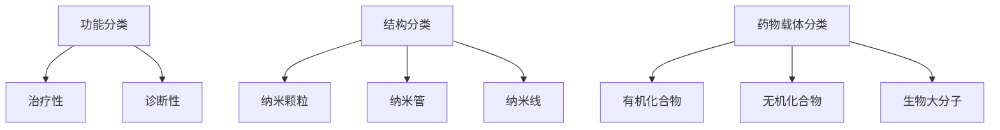

#### **2.1.2 纳米药物的合成方法**

纳米药物的合成方法主要包括化学合成法、生物合成法和物理合成法。

- **化学合成法**：化学合成法是最常用的纳米药物合成方法，它利用化学反应合成纳米颗粒。常见的合成方法包括沉淀法、溶胶-凝胶法、复分解法和水热合成法等。
- **生物合成法**：生物合成法利用生物体（如细菌、真菌、植物或动物）合成纳米颗粒。这种方法通常用于制备生物相容性好的纳米药物。
- **物理合成法**：物理合成法利用物理过程（如蒸发、凝固和电化学沉积）合成纳米颗粒。这种方法通常用于大规模生产纳米药物。

**Mermaid 流程图：纳米药物合成方法**  
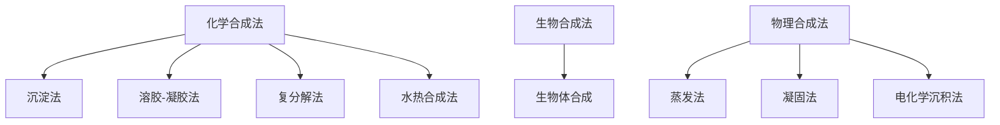

### **2.2 纳米药物的体内行为**

纳米药物在体内的行为对其疗效和安全性至关重要。以下是纳米药物在体内分布、代谢和药效学特性方面的研究。

#### **2.2.1 纳米药物的分布**

纳米药物在体内的分布受到多种因素的影响，包括药物的物理化学性质、给药途径、剂量和生物屏障等。

- **体内分布**：纳米药物可以通过口服、注射、皮肤涂抹等途径进入人体。一旦进入人体，纳米药物会在不同的器官和组织中分布。纳米颗粒的尺寸和表面修饰会影响其在体内的分布。
- **生物屏障**：生物屏障（如血脑屏障、血睾屏障和胎盘屏障）会限制纳米药物的分布。一些特定的纳米药物可以通过改变表面修饰或结合特定的配体来克服这些生物屏障。

**Mermaid 流程图：纳米药物分布**  
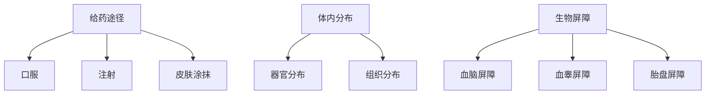

#### **2.2.2 纳米药物的代谢**

纳米药物的代谢过程对其生物利用度和药效有重要影响。

- **代谢途径**：纳米药物在体内的代谢途径包括酶解、氧化还原和光解等。纳米颗粒的化学组成和表面修饰会影响其代谢途径。
- **代谢影响**：纳米药物的代谢过程可能会影响其疗效和安全性。例如，某些纳米药物可能会被快速代谢，从而缩短其在体内的半衰期。

**Mermaid 流程图：纳米药物代谢**  
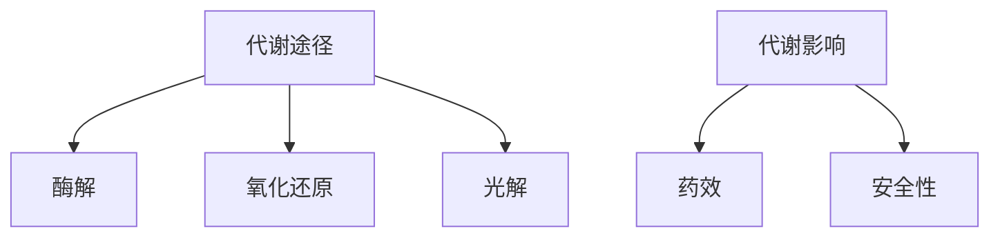

#### **2.2.3 纳米药物的药效学特性**

纳米药物的药效学特性包括其疗效、毒性和生物相容性等。

- **疗效**：纳米药物通过其特殊的物理化学性质和靶向性，可以显著提高药物的治疗效果。例如，纳米颗粒可以减少药物在肝脏的积累，从而降低药物的毒性。
- **毒性**：纳米药物的毒性取决于其尺寸、表面修饰和化学组成。某些纳米药物可能会引起炎症反应或细胞毒性，这需要通过仔细设计和优化来避免。
- **生物相容性**：纳米药物需要具有良好的生物相容性，以确保其在体内的长期存在和稳定性。生物相容性差的纳米药物可能会导致免疫反应和炎症。

**Mermaid 流程图：纳米药物药效学特性**  
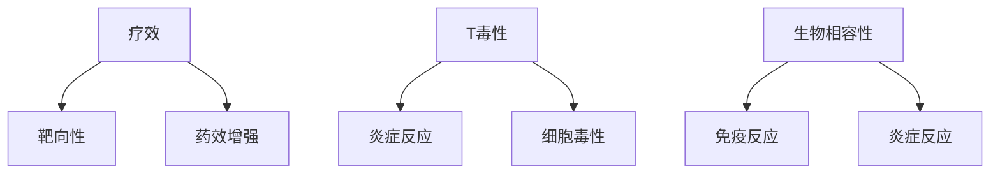

### **2.3 纳米药物的药效学模型**

药效学模型是研究纳米药物药效的重要工具，它可以帮助预测和评估纳米药物的治疗效果和安全性。

- **模型建立**：药效学模型的建立通常涉及数据收集、数据分析建模和模型验证等步骤。
- **模型应用**：药效学模型可以用于指导纳米药物的设计和优化，以及评估纳米药物在不同生物体系中的表现。

**Mermaid 流程图：药效学模型**  
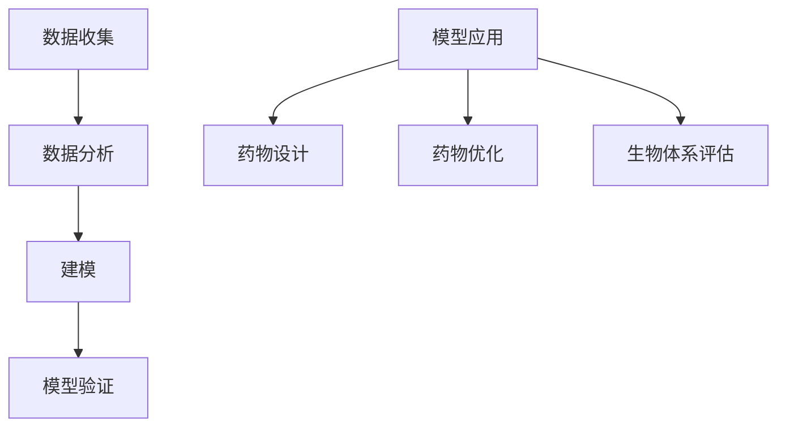

### **总结**

纳米药物的设计与合成是一个复杂而关键的过程，它需要综合考虑药物的物理化学性质、生物相容性、靶向性和药效学特性。通过科学的设计和优化，纳米药物有望在未来的医学中发挥巨大的作用。

---

## 第3章：纳米药物的临床应用

### 3.1 纳米药物在癌症治疗中的应用

纳米药物在癌症治疗中的应用已经展现出巨大的潜力，其独特的物理化学性质和靶向性使得它们在提高治疗效果和减少副作用方面具有显著优势。

#### **3.1.1 纳米药物在癌症靶向治疗中的应用**

纳米药物通过特定的修饰和设计，可以实现对癌细胞的靶向递送。这种靶向性使得药物可以高效地集中在癌细胞上，从而提高疗效并减少对正常细胞的伤害。

- **靶向性**：纳米药物可以通过结合特定的配体（如抗体、肽或小分子），实现对癌细胞的特异性识别和结合。例如，单克隆抗体修饰的纳米颗粒可以特异性地结合到癌细胞的表面受体上。
- **药物释放**：一旦纳米药物到达目标位置，它们可以缓慢释放药物，从而维持有效的药物浓度。

**Mermaid 流程图：纳米药物在癌症靶向治疗中的应用**  
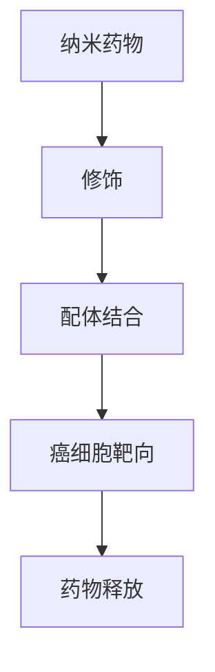

#### **3.1.2 纳米药物在癌症免疫治疗中的应用**

纳米药物在癌症免疫治疗中发挥着重要作用，它们可以通过激活免疫细胞或增强免疫效应来提高治疗效果。

- **免疫逃逸**：纳米药物可以通过抑制免疫逃逸机制（如PD-L1/PD-1信号通路）来增强免疫细胞的杀伤活性。
- **免疫刺激**：纳米药物可以通过递送免疫刺激剂（如树突状细胞刺激剂）来激活免疫系统，增强对癌细胞的免疫反应。

**Mermaid 流程图：纳米药物在癌症免疫治疗中的应用**  
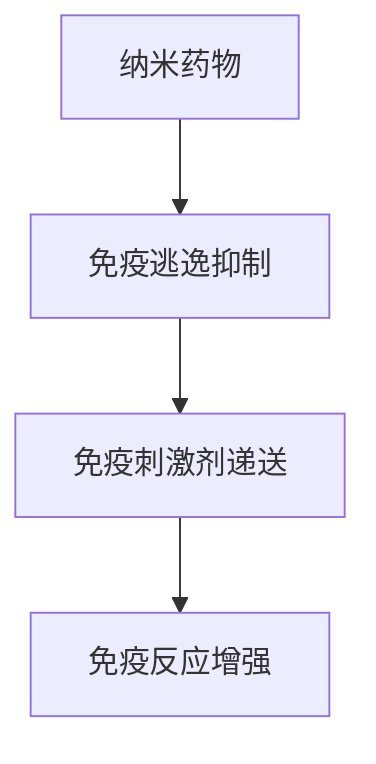

#### **3.1.3 纳米药物在癌症治疗中的具体应用实例**

以下是一些纳米药物在癌症治疗中的具体应用实例：

- **阿霉素纳米颗粒**：阿霉素是一种常用的抗癌药物，通过纳米颗粒的形式可以显著提高其抗癌效果和减少副作用。
- **纳米抗体**：纳米抗体是一种小分子抗体，可以通过纳米颗粒的形式递送到癌细胞，从而实现精准治疗。
- **免疫纳米颗粒**：通过结合免疫刺激剂和抗肿瘤抗体，免疫纳米颗粒可以同时发挥抗癌药物和免疫激活剂的作用。

**Mermaid 流程图：纳米药物在癌症治疗中的具体应用实例**  
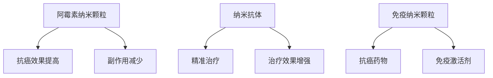

#### **3.1.4 纳米药物在癌症治疗中的优势**

纳米药物在癌症治疗中的优势包括：

- **高效性**：纳米药物的靶向性使得药物可以高效地集中在癌细胞上，从而提高治疗效果。
- **低毒性**：纳米药物的靶向性可以减少对正常细胞的伤害，从而降低药物的副作用。
- **可控性**：纳米药物的释放速度和方式可以通过设计和修饰进行精确控制，从而实现个性化治疗。

#### **3.1.5 纳米药物在癌症治疗中的挑战**

尽管纳米药物在癌症治疗中具有巨大潜力，但仍然面临一些挑战：

- **生物相容性**：某些纳米材料可能会引起炎症反应或细胞毒性，需要进一步优化。
- **生产成本**：纳米药物的制备过程相对复杂，生产成本较高，需要进一步降低成本以实现广泛应用。
- **临床验证**：纳米药物的临床验证需要大量的研究和数据，以确保其安全性和有效性。

### **3.2 纳米药物在其他疾病治疗中的应用**

纳米药物不仅在癌症治疗中具有重要作用，还在其他疾病治疗中展现出巨大的潜力。

#### **3.2.1 纳米药物在心血管疾病治疗中的应用**

纳米药物可以通过靶向递送和药物释放，在心血管疾病治疗中发挥重要作用。

- **动脉粥样硬化治疗**：纳米药物可以通过靶向内皮细胞和动脉粥样硬化斑块，抑制炎症反应和斑块形成。
- **血栓治疗**：纳米药物可以通过靶向血栓部位，溶解血栓或抑制血栓形成。

**Mermaid 流程图：纳米药物在心血管疾病治疗中的应用**  
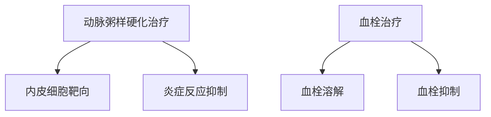

#### **3.2.2 纳米药物在神经疾病治疗中的应用**

纳米药物可以通过靶向递送和药物释放，在神经疾病治疗中发挥重要作用。

- **阿尔茨海默病治疗**：纳米药物可以通过靶向β-淀粉样蛋白沉积，清除脑内的毒素。
- **帕金森病治疗**：纳米药物可以通过靶向多巴胺能神经元，改善症状和延缓疾病进展。

**Mermaid 流程图：纳米药物在神经疾病治疗中的应用**  
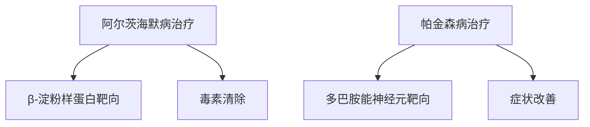

#### **3.2.3 纳米药物在其他疾病治疗中的应用**

纳米药物在其他疾病治疗中也展现出巨大潜力。

- **肝炎治疗**：纳米药物可以通过靶向肝脏，清除病毒和炎症。
- **糖尿病治疗**：纳米药物可以通过靶向胰岛细胞，促进胰岛素分泌和调节血糖。

**Mermaid 流程图：纳米药物在其他疾病治疗中的应用**  
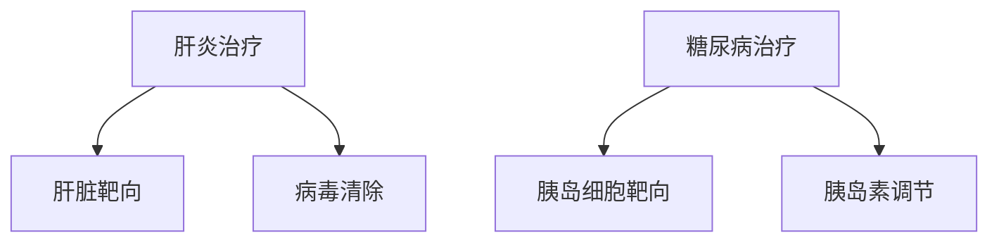

### **3.3 纳米药物的临床应用前景**

纳米药物的临床应用前景广阔，其独特的物理化学性质和靶向性使得它们在提高治疗效果和减少副作用方面具有显著优势。随着纳米技术的不断发展，纳米药物有望在未来成为治疗各种疾病的重要工具。

---

### 第3章：纳米药物在心血管疾病治疗中的应用

#### 3.3.1 心血管疾病治疗的现状与挑战

心血管疾病（CVD）是全球导致死亡和残疾的主要原因之一。传统的药物治疗方法虽然在一定程度上可以缓解症状，但往往存在疗效有限、副作用明显等问题。随着纳米技术的发展，纳米药物在心血管疾病治疗中展现出巨大的潜力。

##### **心血管疾病的发病率与死亡率**

心血管疾病包括动脉硬化、心肌梗死、心力衰竭、高血压和动脉瘤等，其发病率在全球范围内呈上升趋势。据世界卫生组织（WHO）统计，心血管疾病的死亡率占全球死亡人数的31%。

##### **心血管疾病治疗的现状**

目前，心血管疾病的治疗主要包括药物治疗、手术治疗和介入治疗。药物治疗主要依赖于抗血小板药物、抗凝血药物、β受体阻滞剂、ACE抑制剂等。然而，这些药物存在一定的局限性，如疗效不稳定、副作用大、药物耐受性增加等。

手术治疗和介入治疗在心血管疾病治疗中发挥着重要作用，但手术风险和费用较高，且术后并发症仍难以完全避免。

##### **心血管疾病治疗的挑战**

- **药物耐受性**：长期使用某些心血管药物可能导致药物耐受性，降低治疗效果。
- **药物分布不均**：传统药物在体内的分布不均匀，难以确保有效药物浓度达到病变部位。
- **副作用**：心血管药物可能会引起不良反应，如肝损伤、肾功能损害等。

#### 3.3.2 纳米药物在心血管疾病诊断中的应用

纳米药物在心血管疾病诊断中具有独特优势，可以实现对心血管疾病的早期诊断和实时监测。

- **纳米探针**：纳米探针可以通过特异性识别心血管疾病标志物，实现高灵敏度的诊断。例如，含有抗体或配体的纳米探针可以特异性地结合到动脉硬化斑块或心肌细胞上，通过荧光成像或磁共振成像（MRI）检测病变。
- **纳米传感器**：纳米传感器可以实时监测心血管系统的生理参数，如血压、心率、血氧饱和度等，为早期发现心血管疾病提供重要依据。

**Mermaid 流程图：纳米药物在心血管疾病诊断中的应用**  
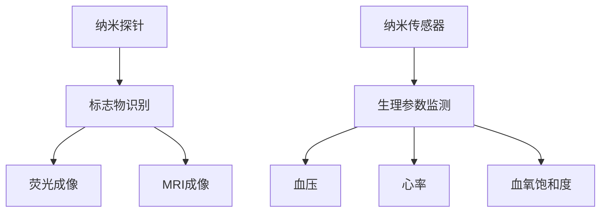

#### 3.3.3 纳米药物在心血管疾病治疗中的应用

纳米药物在心血管疾病治疗中具有显著优势，可以通过靶向递送和药物释放，提高治疗效果并减少副作用。

- **纳米颗粒**：纳米颗粒可以通过修饰特定的配体或抗体，实现靶向递送到心血管病变部位。例如，含有抗血小板药物或抗凝血药物的纳米颗粒可以靶向递送到动脉粥样硬化斑块，从而抑制斑块生长和血栓形成。
- **纳米药物载体**：纳米药物载体可以通过控制药物释放速度和方式，实现药物在体内的可控释放。例如，通过智能响应型纳米载体，可以根据病变部位的需求，实现药物的精准释放。

**Mermaid 流程图：纳米药物在心血管疾病治疗中的应用**  
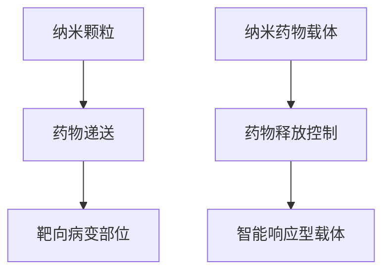

#### 3.3.4 纳米药物在心血管疾病治疗中的具体应用实例

以下是一些纳米药物在心血管疾病治疗中的具体应用实例：

- **纳米颗粒抗血小板药物**：如阿司匹林和氯吡格雷的纳米颗粒，通过靶向递送，可以显著降低动脉粥样硬化斑块的风险。
- **纳米颗粒抗凝血药物**：如肝素和替罗非班的纳米颗粒，通过靶向递送，可以抑制血栓形成，降低心脏病发作和中风的风险。
- **智能响应型纳米载体**：如通过pH敏感型或温度敏感型纳米载体，可以实现药物的智能释放，提高治疗效果。

**Mermaid 流�程图：纳米药物在心血管疾病治疗中的具体应用实例**  
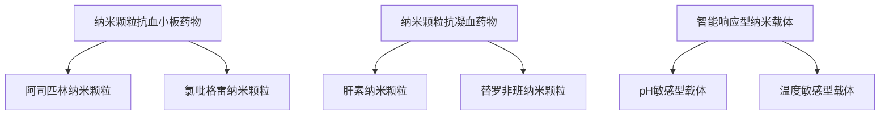

#### 3.3.5 纳米药物在心血管疾病治疗中的优势

纳米药物在心血管疾病治疗中的优势包括：

- **靶向性**：纳米药物可以通过特定的修饰和设计，实现靶向递送，提高药物在病变部位的浓度，减少药物对正常组织的损伤。
- **可控性**：纳米药物可以通过控制药物的释放速度和方式，实现药物在体内的智能释放，提高治疗效果。
- **低毒性**：纳米药物通常具有较好的生物相容性，可以减少药物的副作用和毒性。

#### 3.3.6 纳米药物在心血管疾病治疗中的挑战

尽管纳米药物在心血管疾病治疗中具有巨大潜力，但仍面临一些挑战：

- **生物相容性**：某些纳米材料可能会引起免疫反应或炎症，需要进一步优化。
- **生产成本**：纳米药物的制备过程复杂，生产成本较高，需要进一步降低成本以实现广泛应用。
- **临床验证**：纳米药物的疗效和安全性需要通过大量的临床试验验证，以确保其安全性和有效性。

#### 3.3.7 纳米药物在心血管疾病治疗中的应用前景

随着纳米技术的不断发展，纳米药物在心血管疾病治疗中的应用前景广阔。纳米药物有望在未来成为心血管疾病治疗的重要工具，为实现个性化治疗和精准治疗提供新的途径。

---

### 第4章：纳米机器人的设计与制造

#### 4.1 纳米机器人的基本原理

纳米机器人是纳米医学中的一个前沿领域，其设计、制造和应用都涉及到多个科学领域。下面我们将详细探讨纳米机器人的基本原理。

##### **4.1.1 纳米机器人的定义**

纳米机器人是指尺寸在纳米级别（1到100纳米）的机器人，它们可以在纳米尺度上执行特定的任务。这些纳米机器人通常由纳米级别的部件组成，如纳米电机、纳米传感器和纳米执行器。

##### **4.1.2 纳米机器人的分类**

纳米机器人可以根据其结构和功能进行分类：

- **机械式纳米机器人**：这种类型的纳米机器人通过机械运动来完成特定的任务，如纳米级别的移动、抓取和释放。
- **生化式纳米机器人**：这种类型的纳米机器人利用生物化学反应来完成特定的任务，如药物输送、细胞修复和基因编辑。
- **量子式纳米机器人**：这种类型的纳米机器人利用量子效应来实现超高速和超精确的任务，如量子计算和量子传感。

**Mermaid 流程图：纳米机器人的分类**  
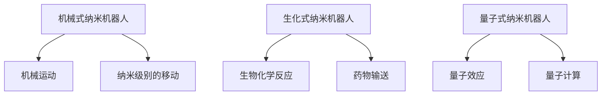

##### **4.1.3 纳米机器人的核心部件**

纳米机器人的功能取决于其核心部件的设计和协同工作：

- **纳米电机**：纳米电机是纳米机器人的动力源，用于驱动纳米机器人的运动。纳米电机可以通过电化学、热力学或光化学反应来产生动力。
- **纳米传感器**：纳米传感器用于检测纳米机器人周围的环境，如温度、压力、化学物质和生物标志物等。这些传感器可以帮助纳米机器人做出实时决策。
- **纳米执行器**：纳米执行器是纳米机器人用于执行特定任务的部件，如抓取、释放、切割和喷涂等。

**Mermaid 流程图：纳米机器人的核心部件**  
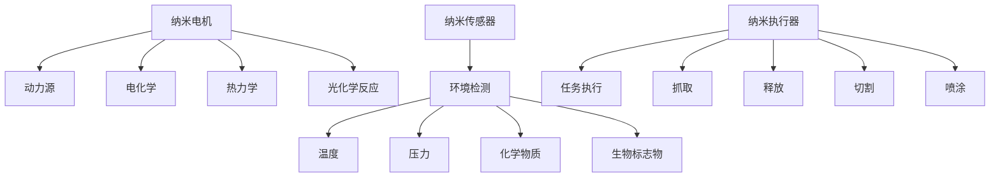

##### **4.1.4 纳米机器人的工作原理**

纳米机器人的工作原理通常包括以下几个步骤：

1. **感知**：纳米传感器检测环境中的信号，如温度、压力或化学物质浓度。
2. **决策**：基于传感器的数据，纳米机器人的控制系统做出决策，如改变方向或执行特定任务。
3. **执行**：纳米执行器根据控制系统的指令执行具体的任务，如移动、抓取或释放。

**Mermaid 流程图：纳米机器人的工作原理**  
```mermaid  
graph TB  
    A[感知] --> B[传感器数据]  
    B --> C[决策]  
    C --> D[执行]  
    D --> E[任务完成]  
```

#### 4.2 纳米机器人的制造技术

纳米机器人的制造是一个复杂的过程，涉及到纳米材料、纳米电子、微机电系统（MEMS）和生物工程等多个领域。以下是一些关键的纳米机器人制造技术：

##### **4.2.1 纳米电子制造技术**

纳米电子制造技术是制造纳米机器人的关键技术之一。它包括以下几种主要方法：

- **光刻技术**：通过光刻技术，可以在纳米级别上制造出精密的纳米结构和器件。这种方法通常用于制造纳米电机和纳米传感器。
- **电子束加工**：利用高能电子束来切割和刻画纳米级别的材料，用于制造复杂的纳米结构和器件。
- **纳米压印**：通过纳米压印技术，可以在纳米级别上制造出高精度的模具和结构。

**Mermaid 流程图：纳米电子制造技术**  
```mermaid  
graph TB  
    A[光刻技术] --> B[纳米结构制造]  
    A --> C[电子束加工]  
    C --> D[精密结构制造]  
    E[纳米压印] --> F[高精度模具制造]  
```

##### **4.2.2 喷墨打印技术**

喷墨打印技术是一种用于制造纳米机器人的新兴技术。通过喷墨打印，可以在纳米级别上精确控制纳米颗粒和纳米结构的排列和分布。

- **纳米喷墨打印**：利用纳米喷墨打印技术，可以制造出具有特定形状和结构的纳米机器人。
- **数字微制造**：数字微制造技术是一种基于喷墨打印的纳米制造方法，可以精确控制纳米结构和器件的制造。

**Mermaid 流程图：喷墨打印技术**  
```mermaid  
graph TB  
    A[纳米喷墨打印] --> B[纳米机器人制造]  
    A --> C[数字微制造]  
    C --> D[精确控制制造]  
```

##### **4.2.3 光刻技术**

光刻技术是制造纳米机器人的传统方法之一。通过光刻技术，可以在纳米级别上制造出精密的纳米结构和器件。

- **光刻胶技术**：光刻胶是一种用于光刻过程中的光敏感材料，可以通过曝光和显影来制造出精密的纳米结构。
- **紫外光刻**：紫外光刻是一种利用紫外光进行光刻的方法，可以制造出尺寸更小的纳米结构。

**Mermaid 流程图：光刻技术**  
```mermaid  
graph TB  
    A[光刻胶技术] --> B[纳米结构制造]  
    A --> C[紫外光刻]  
    C --> D[精密结构制造]  
```

##### **4.2.4 纳米组装技术**

纳米组装技术是一种用于制造纳米机器人的重要技术。通过纳米组装，可以将纳米级别的部件组装成完整的纳米机器人。

- **自组装**：自组装技术是一种利用分子间的相互作用力将纳米部件组装成纳米机器人的方法。
- **分子机器组装**：分子机器组装技术是一种利用分子机器将纳米部件组装成纳米机器人的方法。

**Mermaid 流程图：纳米组装技术**  
```mermaid  
graph TB  
    A[自组装] --> B[分子间相互作用]  
    A --> C[纳米机器人制造]  
    D[分子机器组装] --> E[分子机器]  
    D --> F[纳米机器人制造]  
```

#### 4.3 纳米机器人的功能与应用

纳米机器人具有广泛的应用潜力，可以从诊断到治疗等多个领域。

##### **4.3.1 纳米机器人在诊断中的应用**

纳米机器人在诊断中的应用主要包括：

- **疾病标志物检测**：通过特定的纳米传感器，纳米机器人可以检测到疾病标志物，如肿瘤标志物或病毒抗原。
- **组织成像**：纳米机器人可以用于组织成像，如通过荧光成像或磁共振成像来观察病变部位。

##### **4.3.2 纳米机器人在治疗中的应用**

纳米机器人在治疗中的应用包括：

- **药物输送**：纳米机器人可以通过靶向递送将药物精确地输送到病变部位，提高治疗效果并减少副作用。
- **细胞修复**：纳米机器人可以修复受损的细胞和组织，如通过细胞抓取和释放功能来修复受损的心肌细胞。

##### **4.3.3 纳米机器人在外科手术中的应用**

纳米机器人在外科手术中的应用包括：

- **微创手术**：纳米机器人可以通过微创手术进行复杂的外科手术，如通过血管内手术来修复动脉瘤。
- **组织修复**：纳米机器人可以修复受损的组织和器官，如通过组织工程来修复损伤的心脏和肾脏。

**Mermaid 流程图：纳米机器人的功能与应用**  
```mermaid  
graph TB  
    A[疾病标志物检测] --> B[纳米传感器]  
    A --> C[组织成像]  
    D[药物输送] --> E[靶向递送]  
    D --> F[提高治疗效果]  
    G[细胞修复] --> H[细胞抓取和释放]  
    G --> I[组织修复]  
    J[微创手术] --> K[血管内手术]  
    J --> L[复杂手术]  
```

##### **4.3.4 纳米机器人在未来医学中的前景**

随着纳米技术的不断发展，纳米机器人在未来医学中具有广泛的应用前景。纳米机器人有望实现以下目标：

- **精准治疗**：纳米机器人可以通过精准的靶向递送和治疗，实现个性化治疗。
- **微创手术**：纳米机器人可以减少手术创伤，提高手术成功率。
- **实时监测**：纳米机器人可以实时监测人体内部状态，为医生提供实时数据。

**Mermaid 流程图：纳米机器人在未来医学中的前景**  
```mermaid  
graph TB  
    A[精准治疗] --> B[个性化治疗]  
    A --> C[提高治疗效果]  
    D[微创手术] --> E[减少创伤]  
    D --> F[提高成功率]  
    G[实时监测] --> H[实时数据]  
    G --> I[医生辅助]  
```

### **4.4 总结**

纳米机器人的设计与制造是一个多学科交叉的领域，其基本原理、核心部件和制造技术决定了纳米机器人的功能和性能。纳米机器人在诊断、治疗和外科手术等领域具有广泛的应用前景，有望带来医学领域的革命性变革。

---

### 第5章：纳米机器人在心血管疾病治疗中的应用

#### 5.1 心血管疾病治疗的现状与挑战

心血管疾病（CVD）是全球范围内的主要死亡原因之一，包括动脉硬化、心肌梗死、心力衰竭、高血压和动脉瘤等。传统的治疗手段如药物治疗、手术治疗和介入治疗在控制症状、减少并发症和改善预后方面取得了一定成果，但仍然存在一些挑战。

##### **5.1.1 心血管疾病的发病率与死亡率**

心血管疾病的发病率在全球范围内呈上升趋势。据世界卫生组织（WHO）统计，心血管疾病的死亡率占全球死亡人数的31%。在发展中国家，心血管疾病的负担尤为严重，导致大量过早死亡和长期残疾。

##### **5.1.2 心血管疾病治疗的现状**

目前，心血管疾病的治疗主要依赖于药物治疗、手术治疗和介入治疗。

- **药物治疗**：药物治疗是心血管疾病治疗的基础，包括抗血小板药物、抗凝血药物、β受体阻滞剂、ACE抑制剂和ARBs等。然而，药物治疗存在疗效有限、副作用明显和药物耐受性增加等问题。
- **手术治疗**：手术治疗包括冠状动脉旁路移植术（CABG）、心脏瓣膜置换术和动脉瘤修复术等。手术治疗对某些严重的心血管疾病具有显著疗效，但手术风险和费用较高，且术后并发症仍难以完全避免。
- **介入治疗**：介入治疗包括冠状动脉介入治疗（PCI）、心脏再同步治疗（CRT）和起搏器植入等。介入治疗具有创伤小、恢复快等优点，但在某些复杂病变情况下，疗效可能不如手术治疗。

##### **5.1.3 心血管疾病治疗的挑战**

- **药物耐受性**：长期使用某些心血管药物可能导致药物耐受性，降低治疗效果。
- **药物分布不均**：传统药物在体内的分布不均匀，难以确保有效药物浓度达到病变部位。
- **副作用**：心血管药物可能会引起不良反应，如肝损伤、肾功能损害和出血等。
- **手术风险**：手术治疗存在一定的风险，包括手术并发症、感染和术后恢复时间等。
- **术后复发**：心血管疾病的术后复发率较高，影响患者的长期预后。

#### 5.2 纳米机器人在心血管疾病诊断中的应用

纳米机器人在心血管疾病诊断中的应用具有显著优势，可以实现对心血管疾病的早期诊断和实时监测。

##### **5.2.1 纳米机器人在心血管疾病诊断中的优势**

- **高灵敏度**：纳米机器人具有极高的灵敏度，可以检测到微量的生物标志物和病变组织。
- **靶向性**：纳米机器人可以通过特定的修饰和设计，实现对心血管病变部位的靶向检测。
- **实时监测**：纳米机器人可以实时监测心血管系统的生理参数，如血压、心率和血液成分等。

##### **5.2.2 纳米机器人在心血管疾病诊断中的具体应用**

- **疾病标志物检测**：纳米机器人可以通过检测心血管疾病相关的生物标志物，如血脂、血糖和C反应蛋白等，实现早期诊断。
- **组织成像**：纳米机器人可以通过成像技术，如荧光成像、磁共振成像（MRI）和正电子发射断层扫描（PET），实现对心血管病变部位的精确成像。
- **实时监测**：纳米机器人可以实时监测心血管系统的生理参数，如血压、心率和血液流动情况等，为医生提供实时数据，辅助诊断和治疗方案制定。

**Mermaid 流程图：纳米机器人在心血管疾病诊断中的应用**  
```mermaid  
graph TB  
    A[疾病标志物检测] --> B[生物标志物]  
    A --> C[荧光成像]  
    A --> D[MRI成像]  
    A --> E[PET成像]  
    F[组织成像] --> G[荧光成像]  
    F --> H[MRI成像]  
    F --> I[PET成像]  
    J[实时监测] --> K[血压]  
    J --> L[心率]  
    J --> M[血液流动]  
```

#### 5.3 纳米机器人在心血管疾病治疗中的应用

纳米机器人在心血管疾病治疗中的应用具有革命性意义，可以实现对心血管疾病的精准治疗和微创治疗。

##### **5.3.1 纳米药物递送**

纳米药物递送是纳米机器人在心血管疾病治疗中的重要应用。纳米机器人可以通过靶向递送将药物精确地输送到心血管病变部位，提高治疗效果并减少副作用。

- **靶向性**：纳米药物载体可以通过特定的修饰和设计，实现对心血管病变部位的靶向递送。
- **药物释放**：纳米药物载体可以控制药物的释放速度和方式，实现药物在病变部位的持续释放。

**Mermaid 流程图：纳米药物递送**  
```mermaid  
graph TB  
    A[药物载体] --> B[修饰]  
    B --> C[靶向递送]  
    C --> D[药物释放]  
```

##### **5.3.2 心肌细胞修复**

纳米机器人可以通过细胞抓取和释放功能，实现对心肌细胞的修复和再生。

- **细胞抓取**：纳米机器人可以抓住并移动受损的心肌细胞，帮助它们恢复功能。
- **细胞释放**：纳米机器人可以在合适的位置释放心肌细胞，促进心肌细胞的再生和修复。

**Mermaid 流程图：心肌细胞修复**  
```mermaid  
graph TB  
    A[细胞抓取] --> B[移动受损细胞]  
    A --> C[细胞释放]  
    C --> D[心肌细胞再生]  
```

##### **5.3.3 动脉粥样硬化斑块清除**

纳米机器人可以通过机械和化学方式，清除动脉粥样硬化斑块，防止血栓形成和血管狭窄。

- **机械清除**：纳米机器人可以通过机械切割和剥离，清除动脉粥样硬化斑块。
- **化学清除**：纳米机器人可以通过注入特定的化学物质，溶解动脉粥样硬化斑块。

**Mermaid 流程图：动脉粥样硬化斑块清除**  
```mermaid  
graph TB  
    A[机械清除] --> B[切割剥离]  
    A --> C[化学清除]  
    C --> D[化学溶解]  
```

#### 5.4 纳米机器人在心血管疾病治疗中的优势

纳米机器人在心血管疾病治疗中的优势包括：

- **靶向性**：纳米机器人的靶向性使得药物可以高效地集中在心血管病变部位，提高治疗效果并减少副作用。
- **微创性**：纳米机器人可以实现微创治疗，减少手术创伤和术后并发症。
- **实时监测**：纳米机器人可以实时监测心血管系统的状态，为医生提供实时数据，辅助诊断和治疗。
- **可控性**：纳米机器人的设计可以控制药物的释放速度和方式，实现个性化治疗。

#### 5.5 纳米机器人在心血管疾病治疗中的挑战

尽管纳米机器人在心血管疾病治疗中具有巨大潜力，但仍面临一些挑战：

- **生物相容性**：纳米材料可能会引起免疫反应或炎症，需要进一步优化。
- **生产成本**：纳米机器人的制造过程复杂，生产成本较高，需要进一步降低成本以实现广泛应用。
- **临床验证**：纳米机器人的疗效和安全性需要通过大量的临床试验验证，以确保其安全性和有效性。

#### 5.6 纳米机器人在心血管疾病治疗中的应用前景

随着纳米技术的不断发展，纳米机器人在心血管疾病治疗中的应用前景广阔。纳米机器人有望实现以下目标：

- **精准治疗**：通过靶向递送和精准治疗，实现个性化治疗和高效治疗。
- **微创手术**：通过微创手术和精准治疗，减少手术创伤和术后并发症。
- **实时监测**：通过实时监测和数据处理，实现疾病早期诊断和实时治疗。

**Mermaid 流程图：纳米机器人在心血管疾病治疗中的应用前景**  
```mermaid  
graph TB  
    A[精准治疗] --> B[个性化治疗]  
    A --> C[高效治疗]  
    D[微创手术] --> E[减少创伤]  
    D --> F[减少并发症]  
    G[实时监测] --> H[早期诊断]  
    G --> I[实时治疗]  
```

### **5.7 总结**

纳米机器人在心血管疾病治疗中的应用具有显著优势，可以实现对心血管疾病的精准治疗、微创治疗和实时监测。随着纳米技术的不断发展，纳米机器人有望在未来成为心血管疾病治疗的重要工具，为患者带来更好的治疗效果和生活质量。

---

### 第6章：纳米机器人在癌症治疗中的应用

#### 6.1 癌症治疗的现状与挑战

癌症是全球第二大死亡原因，治疗癌症的传统方法包括手术、放疗和化疗。然而，这些方法存在一些局限性，如手术创伤大、放疗副作用明显、化疗药物副作用严重等。纳米机器人在癌症治疗中的应用为解决这些问题提供了一种新的可能。

##### **6.1.1 癌症的发病率与死亡率**

癌症的发病率在全球范围内呈上升趋势。据世界卫生组织（WHO）统计，每年全球约有900万人新诊断出癌症，约600万人死于癌症。在发展中国家，癌症的负担尤为严重。

##### **6.1.2 癌症治疗的现状**

- **手术治疗**：手术是治疗早期癌症的主要方法，通过切除肿瘤来去除癌细胞。然而，手术对医生技能要求高，且存在手术创伤和术后并发症的风险。
- **放疗**：放疗利用电离辐射杀死癌细胞，适用于无法手术切除的癌症。放疗的副作用包括皮肤损伤、疲劳和乏力等。
- **化疗**：化疗通过化学药物杀死癌细胞，适用于晚期癌症和手术或放疗无法治愈的癌症。化疗药物的副作用包括恶心、呕吐、脱发和免疫抑制等。

##### **6.1.3 癌症治疗的挑战**

- **肿瘤的复发和转移**：癌症治疗后，肿瘤可能会复发或转移，导致治疗失败。
- **药物的耐药性**：长期使用化疗药物可能导致癌细胞产生耐药性，降低治疗效果。
- **副作用**：手术、放疗和化疗均存在明显的副作用，影响患者的生活质量。
- **治疗的个性化不足**：传统治疗方法难以根据患者的具体病情进行个性化治疗。

#### 6.2 纳米机器人在癌症诊断中的应用

纳米机器人在癌症诊断中的应用为早期发现和精准诊断提供了新的手段。

##### **6.2.1 纳米机器人在癌症诊断中的优势**

- **高灵敏度**：纳米机器人具有极高的灵敏度，可以检测到微量的生物标志物和病变组织。
- **靶向性**：纳米机器人可以通过特定的修饰和设计，实现对癌症病变部位的靶向诊断。
- **实时监测**：纳米机器人可以实时监测癌症的发展过程，为医生提供实时数据。

##### **6.2.2 纳米机器人在癌症诊断中的具体应用**

- **生物标志物检测**：纳米机器人可以通过检测癌症相关的生物标志物，如肿瘤标志物、基因突变等，实现早期诊断。
- **组织成像**：纳米机器人可以通过成像技术，如荧光成像、磁共振成像（MRI）和正电子发射断层扫描（PET），实现对癌症病变部位的精确成像。
- **实时监测**：纳米机器人可以实时监测癌症的发展过程，如肿瘤的生长、扩散和转移等，为医生提供实时数据。

**Mermaid 流程图：纳米机器人在癌症诊断中的应用**  
```mermaid  
graph TB  
    A[生物标志物检测] --> B[肿瘤标志物]  
    A --> C[荧光成像]  
    A --> D[MRI成像]  
    A --> E[PET成像]  
    F[组织成像] --> G[荧光成像]  
    F --> H[MRI成像]  
    F --> I[PET成像]  
    J[实时监测] --> K[肿瘤生长]  
    J --> L[肿瘤扩散]  
    J --> M[肿瘤转移]  
```

#### 6.3 纳米机器人在癌症治疗中的应用

纳米机器人在癌症治疗中的应用为精准治疗和微创治疗提供了新的可能。

##### **6.3.1 纳米药物递送**

纳米药物递送是纳米机器人在癌症治疗中的关键应用。纳米机器人可以通过靶向递送将药物精确地输送到癌症病变部位，提高治疗效果并减少副作用。

- **靶向性**：纳米药物载体可以通过特定的修饰和设计，实现对癌症病变部位的靶向递送。
- **药物释放**：纳米药物载体可以控制药物的释放速度和方式，实现药物在病变部位的持续释放。

**Mermaid 流程图：纳米药物递送**  
```mermaid  
graph TB  
    A[药物载体] --> B[修饰]  
    B --> C[靶向递送]  
    C --> D[药物释放]  
```

##### **6.3.2 癌细胞杀灭**

纳米机器人可以通过不同的方式杀灭癌细胞。

- **热疗**：纳米机器人可以释放热量，通过热疗杀死癌细胞。
- **光疗**：纳米机器人可以吸收光线，通过光疗杀死癌细胞。
- **化疗**：纳米机器人可以携带化疗药物，直接作用于癌细胞。

**Mermaid 流流程图：癌细胞杀灭**  
```mermaid  
graph TB  
    A[热疗] --> B[热量释放]  
    A --> C[癌细胞死亡]  
    D[光疗] --> E[光线吸收]  
    D --> F[癌细胞死亡]  
    G[化疗] --> H[药物释放]  
    G --> I[癌细胞死亡]  
```

##### **6.3.3 癌细胞清除**

纳米机器人可以通过机械和化学方式清除癌细胞。

- **机械清除**：纳米机器人可以通过切割、剥离和抓取等机械方式清除癌细胞。
- **化学清除**：纳米机器人可以注入特定的化学物质，通过化学方式清除癌细胞。

**Mermaid 流程图：癌细胞清除**  
```mermaid  
graph TB  
    A[机械清除] --> B[切割]  
    A --> C[剥离]  
    A --> D[抓取]  
    E[化学清除] --> F[化学物质注入]  
    E --> G[癌细胞死亡]  
```

#### 6.4 纳米机器人在癌症治疗中的优势

纳米机器人在癌症治疗中的优势包括：

- **靶向性**：纳米机器人的靶向性使得药物可以高效地集中在癌症病变部位，提高治疗效果并减少副作用。
- **微创性**：纳米机器人可以实现微创治疗，减少手术创伤和术后并发症。
- **实时监测**：纳米机器人可以实时监测癌症的发展过程，为医生提供实时数据，辅助诊断和治疗。
- **可控性**：纳米机器人的设计可以控制药物的释放速度和方式，实现个性化治疗。

#### 6.5 纳米机器人在癌症治疗中的挑战

尽管纳米机器人在癌症治疗中具有巨大潜力，但仍面临一些挑战：

- **生物相容性**：纳米材料可能会引起免疫反应或炎症，需要进一步优化。
- **生产成本**：纳米机器人的制造过程复杂，生产成本较高，需要进一步降低成本以实现广泛应用。
- **临床验证**：纳米机器人的疗效和安全性需要通过大量的临床试验验证，以确保其安全性和有效性。

#### 6.6 纳米机器人在癌症治疗中的应用前景

随着纳米技术的不断发展，纳米机器人在癌症治疗中的应用前景广阔。纳米机器人有望实现以下目标：

- **精准治疗**：通过靶向递送和精准治疗，实现个性化治疗和高效治疗。
- **微创手术**：通过微创手术和精准治疗，减少手术创伤和术后并发症。
- **实时监测**：通过实时监测和数据处理，实现疾病早期诊断和实时治疗。

**Mermaid 流程图：纳米机器人在癌症治疗中的应用前景**  
```mermaid  
graph TB  
    A[精准治疗] --> B[个性化治疗]  
    A --> C[高效治疗]  
    D[微创手术] --> E[减少创伤]  
    D --> F[减少并发症]  
    G[实时监测] --> H[早期诊断]  
    G --> I[实时治疗]  
```

### **6.7 总结**

纳米机器人在癌症治疗中的应用为癌症治疗带来了新的希望。通过精准治疗、微创治疗和实时监测，纳米机器人有望提高癌症治疗效果，减少副作用，为患者带来更好的生活质量。随着纳米技术的不断进步，纳米机器人在癌症治疗中的应用前景将更加广阔。

---

### 第7章：纳米机器人在神经疾病治疗中的应用

#### 7.1 神经疾病治疗的现状与挑战

神经疾病包括多种疾病和症状，如帕金森病、阿尔茨海默病、多发性硬化症、癫痫和脑卒中等。神经疾病治疗的传统方法包括药物治疗、物理治疗和手术干预。然而，这些方法在治疗神经疾病的症状和改善患者生活质量方面存在一定的局限性。

##### **7.1.1 神经疾病的发病率与死亡率**

神经疾病的发病率在全球范围内呈上升趋势。据世界卫生组织（WHO）统计，神经疾病导致的死亡占全球总死亡人数的15%以上。在发展中国家，神经疾病的负担尤为严重，导致大量过早死亡和长期残疾。

##### **7.1.2 神经疾病治疗的现状**

- **药物治疗**：药物治疗是神经疾病治疗的基础，包括抗抑郁药、抗焦虑药、抗癫痫药、抗精神病药等。然而，药物治疗存在疗效有限、副作用明显和药物耐受性增加等问题。
- **物理治疗**：物理治疗通过物理手段如电刺激、超声波和按摩等，改善神经系统的功能。物理治疗在一定程度上可以缓解症状，但效果有限。
- **手术干预**：手术干预适用于某些特定的神经疾病，如脑肿瘤切除、脑出血清除和脑动脉瘤修复等。手术干预具有高风险和较高成本，且术后并发症仍难以完全避免。

##### **7.1.3 神经疾病治疗的挑战**

- **症状多样**：神经疾病的症状多样，包括运动障碍、认知障碍、感觉障碍和情绪障碍等，治疗难度较大。
- **药物耐受性**：长期使用某些神经疾病药物可能导致药物耐受性，降低治疗效果。
- **副作用**：神经疾病药物可能会引起严重副作用，如心脏毒性、肝脏损伤和胃肠道问题等。
- **手术风险**：手术干预具有高风险，包括手术并发症、感染和术后恢复时间等。

#### 7.2 纳米机器人在神经疾病诊断中的应用

纳米机器人在神经疾病诊断中的应用为早期发现和精准诊断提供了新的手段。

##### **7.2.1 纳米机器人在神经疾病诊断中的优势**

- **高灵敏度**：纳米机器人具有极高的灵敏度，可以检测到微量的生物标志物和病变组织。
- **靶向性**：纳米机器人可以通过特定的修饰和设计，实现对神经疾病病变部位的靶向诊断。
- **实时监测**：纳米机器人可以实时监测神经系统的状态，为医生提供实时数据。

##### **7.2.2 纳米机器人在神经疾病诊断中的具体应用**

- **生物标志物检测**：纳米机器人可以通过检测神经疾病相关的生物标志物，如神经递质、细胞因子和基因突变等，实现早期诊断。
- **组织成像**：纳米机器人可以通过成像技术，如荧光成像、磁共振成像（MRI）和正电子发射断层扫描（PET），实现对神经疾病病变部位的精确成像。
- **实时监测**：纳米机器人可以实时监测神经系统的状态，如神经元活性、脑血流和神经传递物质水平等，为医生提供实时数据。

**Mermaid 流程图：纳米机器人在神经疾病诊断中的应用**  
```mermaid  
graph TB  
    A[生物标志物检测] --> B[神经递质]  
    A --> C[细胞因子]  
    A --> D[基因突变]  
    E[组织成像] --> F[荧光成像]  
    E --> G[MRI成像]  
    E --> H[PET成像]  
    J[实时监测] --> K[神经元活性]  
    J --> L[脑血流]  
    J --> M[神经传递物质水平]  
```

#### 7.3 纳米机器人在神经疾病治疗中的应用

纳米机器人在神经疾病治疗中的应用为精准治疗和微创治疗提供了新的可能。

##### **7.3.1 纳米药物递送**

纳米药物递送是纳米机器人在神经疾病治疗中的关键应用。纳米机器人可以通过靶向递送将药物精确地输送到神经疾病病变部位，提高治疗效果并减少副作用。

- **靶向性**：纳米药物载体可以通过特定的修饰和设计，实现对神经疾病病变部位的靶向递送。
- **药物释放**：纳米药物载体可以控制药物的释放速度和方式，实现药物在病变部位的持续释放。

**Mermaid 流程图：纳米药物递送**  
```mermaid  
graph TB  
    A[药物载体] --> B[修饰]  
    B --> C[靶向递送]  
    C --> D[药物释放]  
```

##### **7.3.2 神经细胞修复**

纳米机器人可以通过细胞修复和再生功能，实现对神经细胞的修复和再生。

- **细胞修复**：纳米机器人可以捕获并修复受损的神经元，恢复其功能。
- **细胞再生**：纳米机器人可以促进神经干细胞的分化，生成新的神经元，填补损伤部位。

**Mermaid 流程图：神经细胞修复**  
```mermaid  
graph TB  
    A[细胞修复] --> B[捕获受损神经元]  
    A --> C[修复神经元]  
    D[细胞再生] --> E[促进神经干细胞分化]  
    D --> F[生成新神经元]  
```

##### **7.3.3 神经网络重塑**

纳米机器人可以通过重塑神经网络，改善神经功能。

- **神经突触重塑**：纳米机器人可以调节神经突触的生长和连接，增强神经信号传递。
- **神经网络重构**：纳米机器人可以重新构建神经网络，恢复神经系统的功能。

**Mermaid 流程图：神经网络重塑**  
```mermaid  
graph TB  
    A[神经突触重塑] --> B[调节神经突触生长]  
    A --> C[增强神经信号传递]  
    D[神经网络重构] --> E[重新构建神经网络]  
    D --> F[恢复神经功能]  
```

#### 7.4 纳米机器人在神经疾病治疗中的优势

纳米机器人在神经疾病治疗中的优势包括：

- **靶向性**：纳米机器人的靶向性使得药物可以高效地集中在神经疾病病变部位，提高治疗效果并减少副作用。
- **微创性**：纳米机器人可以实现微创治疗，减少手术创伤和术后并发症。
- **实时监测**：纳米机器人可以实时监测神经系统的状态，为医生提供实时数据，辅助诊断和治疗。
- **可控性**：纳米机器人的设计可以控制药物的释放速度和方式，实现个性化治疗。

#### 7.5 纳米机器人在神经疾病治疗中的挑战

尽管纳米机器人在神经疾病治疗中具有巨大潜力，但仍面临一些挑战：

- **生物相容性**：纳米材料可能会引起免疫反应或炎症，需要进一步优化。
- **生产成本**：纳米机器人的制造过程复杂，生产成本较高，需要进一步降低成本以实现广泛应用。
- **临床验证**：纳米机器人的疗效和安全性需要通过大量的临床试验验证，以确保其安全性和有效性。

#### 7.6 纳米机器人在神经疾病治疗中的应用前景

随着纳米技术的不断发展，纳米机器人在神经疾病治疗中的应用前景广阔。纳米机器人有望实现以下目标：

- **精准治疗**：通过靶向递送和精准治疗，实现个性化治疗和高效治疗。
- **微创手术**：通过微创手术和精准治疗，减少手术创伤和术后并发症。
- **实时监测**：通过实时监测和数据处理，实现疾病早期诊断和实时治疗。

**Mermaid 流程图：纳米机器人在神经疾病治疗中的应用前景**  
```mermaid  
graph TB  
    A[精准治疗] --> B[个性化治疗]  
    A --> C[高效治疗]  
    D[微创手术] --> E[减少创伤]  
    D --> F[减少并发症]  
    G[实时监测] --> H[早期诊断]  
    G --> I[实时治疗]  
```

### **7.7 总结**

纳米机器人在神经疾病治疗中的应用为神经疾病治疗带来了新的希望。通过精准治疗、微创治疗和实时监测，纳米机器人有望提高神经疾病治疗效果，减少副作用，为患者带来更好的生活质量。随着纳米技术的不断进步，纳米机器人在神经疾病治疗中的应用前景将更加广阔。

---

### 第8章：纳米机器人在传染病治疗中的应用

#### 8.1 传染病治疗的现状与挑战

传染病是全球范围内的公共卫生问题，对人类健康构成严重威胁。传统的传染病治疗方法主要包括药物治疗、疫苗接种和公共卫生措施。然而，这些方法在应对日益复杂的传染病挑战时存在一定的局限性。

##### **8.1.1 传染病的传播与防控**

传染病的传播主要通过以下几种途径：

- **空气传播**：如流感病毒和肺结核杆菌。
- **飞沫传播**：如新冠病毒和麻疹病毒。
- **接触传播**：如细菌感染和病毒感染。
- **血液传播**：如乙型和丙型肝炎病毒。

传染病的防控措施主要包括：

- **疫苗接种**：通过疫苗接种提高人群免疫力，预防传染病的发生。
- **公共卫生措施**：如隔离感染患者、加强环境卫生和消毒措施。
- **药物预防**：对于某些传染病，如疟疾和艾滋病，药物预防是一种有效的措施。

##### **8.1.2 传染病治疗的现状**

传染病的治疗主要依赖于抗病毒药物、抗生素、抗寄生虫药物等。然而，这些治疗方法存在以下挑战：

- **耐药性**：随着抗生素和抗病毒药物的广泛应用，病原体逐渐产生耐药性，导致治疗难度增加。
- **药物副作用**：某些传染病治疗药物具有较大的副作用，影响患者的生活质量。
- **药物治疗成本**：传染病治疗药物价格较高，对低收入国家和发展中国家构成重大经济负担。
- **治疗难度**：某些传染病，如疟疾和艾滋病，具有复杂的生命周期和治疗周期，治疗难度较大。

##### **8.1.3 传染病治疗的挑战**

传染病治疗面临的挑战包括：

- **耐药性问题**：耐药性病原体的出现使得传染病治疗更加困难。
- **治疗成本**：传染病治疗需要长期和持续的治疗，医疗成本较高。
- **药物供应和分配**：在偏远地区和贫困地区，传染病治疗药物的供应和分配存在困难。
- **公共卫生系统压力**：传染病爆发时，公共卫生系统承受巨大压力，难以有效应对。

#### 8.2 纳米机器人在传染病诊断中的应用

纳米机器人在传染病诊断中的应用为早期发现和精准诊断提供了新的手段。

##### **8.2.1 纳米机器人在传染病诊断中的优势**

- **高灵敏度**：纳米机器人具有极高的灵敏度，可以检测到微量的病原体和生物标志物。
- **靶向性**：纳米机器人可以通过特定的修饰和设计，实现对病原体的靶向诊断。
- **实时监测**：纳米机器人可以实时监测病原体在体内的动态变化，为医生提供实时数据。

##### **8.2.2 纳米机器人在传染病诊断中的具体应用**

- **病原体检测**：纳米机器人可以通过检测病原体（如病毒、细菌和寄生虫）的核酸或蛋白质，实现早期诊断和实时监测。
- **生物标志物检测**：纳米机器人可以检测与传染病相关的生物标志物（如炎症因子、细胞因子和代谢产物），为疾病诊断和病情评估提供依据。
- **组织成像**：纳米机器人可以通过成像技术（如荧光成像、磁共振成像和正电子发射断层扫描），实现对病原体和组织病变部位的精确成像。

**Mermaid 流程图：纳米机器人在传染病诊断中的应用**  
```mermaid  
graph TB  
    A[病原体检测] --> B[病毒检测]  
    A --> C[细菌检测]  
    A --> D[寄生虫检测]  
    E[生物标志物检测] --> F[炎症因子检测]  
    E --> G[细胞因子检测]  
    E --> H[代谢产物检测]  
    I[组织成像] --> J[荧光成像]  
    I --> K[MRI成像]  
    I --> L[PET成像]  
```

#### 8.3 纳米机器人在传染病治疗中的应用

纳米机器人在传染病治疗中的应用为精准治疗和微创治疗提供了新的可能。

##### **8.3.1 纳米药物递送**

纳米药物递送是纳米机器人在传染病治疗中的关键应用。纳米机器人可以通过靶向递送将药物精确地输送到病原体感染部位，提高治疗效果并减少副作用。

- **靶向性**：纳米药物载体可以通过特定的修饰和设计，实现对病原体感染部位的靶向递送。
- **药物释放**：纳米药物载体可以控制药物的释放速度和方式，实现药物在感染部位的持续释放。

**Mermaid 流程图：纳米药物递送**  
```mermaid  
graph TB  
    A[药物载体] --> B[修饰]  
    B --> C[靶向递送]  
    C --> D[药物释放]  
```

##### **8.3.2 病原体清除**

纳米机器人可以通过不同的方式清除病原体。

- **物理清除**：纳米机器人可以通过机械切割、剥离和吸附等方式清除病原体。
- **化学清除**：纳米机器人可以注入特定的化学物质，通过化学方式清除病原体。

**Mermaid 流程图：病原体清除**  
```mermaid  
graph TB  
    A[物理清除] --> B[机械切割]  
    A --> C[剥离]  
    A --> D[吸附]  
    E[化学清除] --> F[化学物质注入]  
    E --> G[病原体死亡]  
```

##### **8.3.3 炎症反应调节**

纳米机器人可以通过调节炎症反应，减轻病原体感染引起的炎症损伤。

- **抗炎因子递送**：纳米机器人可以递送抗炎因子，抑制炎症反应。
- **免疫调节**：纳米机器人可以调节免疫细胞的活性，实现免疫平衡。

**Mermaid 流程图：炎症反应调节**  
```mermaid  
graph TB  
    A[抗炎因子递送] --> B[抗炎因子]  
    A --> C[抑制炎症反应]  
    D[免疫调节] --> E[免疫细胞活性调节]  
    D --> F[免疫平衡]  
```

#### 8.4 纳米机器人在传染病治疗中的优势

纳米机器人在传染病治疗中的优势包括：

- **靶向性**：纳米机器人的靶向性使得药物可以高效地集中在病原体感染部位，提高治疗效果并减少副作用。
- **微创性**：纳米机器人可以实现微创治疗，减少手术创伤和术后并发症。
- **实时监测**：纳米机器人可以实时监测病原体在体内的动态变化，为医生提供实时数据，辅助诊断和治疗。
- **可控性**：纳米机器人的设计可以控制药物的释放速度和方式，实现个性化治疗。

#### 8.5 纳米机器人在传染病治疗中的挑战

尽管纳米机器人在传染病治疗中具有巨大潜力，但仍面临一些挑战：

- **生物相容性**：纳米材料可能会引起免疫反应或炎症，需要进一步优化。
- **生产成本**：纳米机器人的制造过程复杂，生产成本较高，需要进一步降低成本以实现广泛应用。
- **临床验证**：纳米机器人的疗效和安全性需要通过大量的临床试验验证，以确保其安全性和有效性。

#### 8.6 纳米机器人在传染病治疗中的应用前景

随着纳米技术的不断发展，纳米机器人在传染病治疗中的应用前景广阔。纳米机器人有望实现以下目标：

- **精准治疗**：通过靶向递送和精准治疗，实现个性化治疗和高效治疗。
- **微创手术**：通过微创手术和精准治疗，减少手术创伤和术后并发症。
- **实时监测**：通过实时监测和数据处理，实现疾病早期诊断和实时治疗。

**Mermaid 流程图：纳米机器人在传染病治疗中的应用前景**  
```mermaid  
graph TB  
    A[精准治疗] --> B[个性化治疗]  
    A --> C[高效治疗]  
    D[微创手术] --> E[减少创伤]  
    D --> F[减少并发症]  
    G[实时监测] --> H[早期诊断]  
    G --> I[实时治疗]  
```

### **8.7 总结**

纳米机器人在传染病治疗中的应用为传染病治疗带来了新的希望。通过精准治疗、微创治疗和实时监测，纳米机器人有望提高传染病治疗效果，减少副作用，为患者带来更好的生活质量。随着纳米技术的不断进步，纳米机器人在传染病治疗中的应用前景将更加广阔。

---

### 第9章：纳米医学的未来展望

#### 9.1 纳米医学在医学研究中的应用

纳米医学作为一门跨学科领域，正迅速融入医学研究的各个方面，为疾病的诊断、治疗和预防提供了新的工具和方法。

##### **9.1.1 纳米医学在疾病机理研究中的应用**

纳米技术的高分辨率和敏感性使其成为研究疾病机理的有力工具。纳米探针和纳米传感器可以用于检测细胞内的生化变化，揭示疾病发展的分子机制。例如，通过纳米探针可以实时监测癌细胞中的代谢活动，从而更好地理解癌症的发展过程。

**Mermaid 流程图：纳米医学在疾病机理研究中的应用**  
```mermaid  
graph TB  
    A[纳米探针] --> B[细胞代谢监测]  
    A --> C[分子机制揭示]  
```

##### **9.1.2 纳米医学在药物研发中的应用**

纳米技术在药物研发中的应用显著提高了药物的开发效率和治疗效果。纳米颗粒可以作为药物载体，通过靶向递送将药物精准送达病变部位，减少药物在全身的分布，从而降低副作用。此外，纳米技术还可以用于药物筛选和评估，加速新药的研发进程。

**Mermaid 流程图：纳米医学在药物研发中的应用**  
```mermaid  
graph TB  
    A[纳米颗粒] --> B[药物载体]  
    B --> C[靶向递送]  
    B --> D[副作用减少]  
    E[药物筛选] --> F[新药开发]  
```

#### 9.2 纳米医学在临床治疗中的应用

纳米医学的临床应用正在不断扩展，其精准治疗和微创手术的特点为许多难治性疾病提供了新的解决方案。

##### **9.2.1 纳米药物在临床治疗中的应用**

纳米药物通过其独特的物理化学性质和靶向性，在癌症、心血管疾病和神经疾病等治疗中表现出色。例如，纳米颗粒可以携带抗癌药物直接作用于肿瘤细胞，减少对正常细胞的损害。此外，纳米药物还可以用于治疗遗传性疾病，如通过基因递送纳米颗粒修复缺陷基因。

**Mermaid 流程图：纳米药物在临床治疗中的应用**  
```mermaid  
graph TB  
    A[纳米颗粒] --> B[抗癌药物]  
    A --> C[肿瘤靶向]  
    D[基因递送] --> E[缺陷基因修复]  
```

##### **9.2.2 纳米机器人在临床治疗中的应用**

纳米机器人在微创手术和精准治疗中发挥着关键作用。例如，纳米手术机器人可以在极小的切口下进行复杂的手术操作，如心脏手术和神经外科手术。此外，纳米机器人还可以用于药物的精准递送和生物活性物质的调控。

**Mermaid 流程图：纳米机器人在临床治疗中的应用**  
```mermaid  
graph TB  
    A[纳米手术机器人] --> B[微创手术]  
    A --> C[心脏手术]  
    A --> D[神经外科手术]  
    E[药物递送] --> F[精准治疗]  
```

#### 9.3 纳米医学面临的挑战与机遇

尽管纳米医学在医学领域中展现出巨大的潜力，但其发展也面临诸多挑战和机遇。

##### **9.3.1 面临的挑战**

- **生物相容性**：纳米材料可能会引起免疫反应或炎症，需要进一步优化纳米材料的生物相容性。
- **生产成本**：纳米医学产品的制造过程复杂，生产成本较高，需要开发更经济高效的制造方法。
- **临床验证**：纳米医学产品需要通过大量的临床试验验证其安全性和有效性，这一过程耗时且成本高昂。

##### **9.3.2 机遇**

- **个性化医疗**：纳米医学可以实现个性化治疗，根据患者的具体病情和基因信息，定制治疗方案。
- **远程医疗**：纳米医学技术可以用于远程监测和诊断，为偏远地区提供高质量的医疗服务。
- **跨学科合作**：纳米医学的发展需要多学科合作，包括材料科学、生物工程和医学等领域的协同创新。

**Mermaid 流程图：纳米医学面临的挑战与机遇**  
```mermaid  
graph TB  
    A[生物相容性] --> B[免疫反应]  
    A --> C[炎症反应]  
    D[生产成本] --> E[制造方法]  
    F[临床验证] --> G[安全性]  
    G --> H[有效性]  
    I[个性化医疗] --> J[定制治疗方案]  
    K[远程医疗] --> L[远程监测]  
    K --> M[远程诊断]  
    N[跨学科合作] --> O[多学科协同]  
    O --> P[创新突破]  
```

#### 9.4 纳米医学对社会的影响

纳米医学的发展将对社会产生深远影响，包括医疗体系的变化、患者生活质量提升以及全球公共卫生的改善。

##### **9.4.1 对医疗体系的影响**

纳米医学将推动医疗体系的变革，实现从传统的“疾病治疗”向“健康维护”的转变。通过早期诊断和精准治疗，医疗体系将更加高效，减少疾病的发生率和复发率。

**Mermaid 流程图：纳米医学对医疗体系的影响**  
```mermaid  
graph TB  
    A[早期诊断] --> B[疾病预防]  
    A --> C[精准治疗]  
    D[高效医疗] --> E[减少疾病发生率]  
    D --> F[减少复发率]  
```

##### **9.4.2 对患者生活质量的影响**

纳米医学的进步将显著提高患者的生活质量，通过微创手术和精准治疗，患者可以更快地恢复健康，减少术后并发症，提高生活质量。

**Mermaid 流程图：纳米医学对患者生活质量的影响**  
```mermaid  
graph TB  
    A[微创手术] --> B[快速恢复]  
    A --> C[减少并发症]  
    D[精准治疗] --> E[提高生活质量]  
```

##### **9.4.3 对全球公共卫生的影响**

纳米医学的发展将有助于全球公共卫生的改善，通过纳米诊断技术和远程医疗，偏远地区和贫困地区的人们也能享受到高质量的医疗服务。

**Mermaid 流程图：纳米医学对全球公共卫生的影响**  
```mermaid  
graph TB  
    A[纳米诊断技术] --> B[早期诊断]  
    A --> C[远程医疗]  
    D[高质量医疗服务] --> E[全球公共卫生改善]  
```

#### 9.5 纳米医学的未来趋势

随着技术的不断进步，纳米医学将在未来继续快速发展。以下是纳米医学的一些未来趋势：

- **智能化**：纳米医学将更加智能化，通过人工智能和大数据分析，实现个性化治疗和实时监测。
- **多功能化**：纳米医学将发展出更多功能化的纳米材料，如多功能纳米颗粒和纳米机器人，实现更复杂的生物医学应用。
- **全球化**：纳米医学将推动全球医疗资源的整合，实现全球范围内的医疗资源共享和协同创新。

**Mermaid 流程图：纳米医学的未来趋势**  
```mermaid  
graph TB  
    A[智能化] --> B[人工智能]  
    A --> C[大数据分析]  
    D[多功能化] --> E[多功能纳米材料]  
    D --> F[多功能纳米机器人]  
    G[全球化] --> H[医疗资源整合]  
    G --> I[全球协同创新]  
```

### **9.6 总结**

纳米医学作为一门新兴的跨学科领域，正迅速发展并融入医学的各个方面。从疾病机理研究到临床治疗，纳米医学正改变着医疗行业的面貌。面对未来的挑战与机遇，纳米医学将继续推动医学的进步，为全人类的健康福祉作出重要贡献。

---

### 附录A：纳米医学研究常用工具与技术

纳米医学的研究依赖于多种先进的工具和技术，以下列出了一些常用的工具和技术，并简要介绍它们的应用。

#### **附录A.1 纳米材料的合成与制备技术**

##### **A.1.1 溶胶凝胶法**

溶胶凝胶法是一种通过溶胶转变为凝胶来制备纳米材料的方法。该方法具有操作简单、成本低和适用范围广等优点，常用于制备硅基、氧化物基和金属有机框架（MOF）等纳米材料。

**公式**：  
$$ \text{溶胶} \rightarrow \text{凝胶} \rightarrow \text{纳米材料} $$

**应用**：  
- 制备纳米颗粒和纳米薄膜。

##### **A.1.2 水热合成法**

水热合成法是在高温和高压条件下，利用水作为反应介质来合成纳米材料的方法。该方法可以合成出具有高结晶度和纯度的纳米材料，广泛应用于纳米材料的合成。

**公式**：  
$$ \text{反应物} + \text{水} \xrightarrow{\text{高温高压}} \text{纳米材料} $$

**应用**：  
- 制备金属有机框架（MOF）、碳纳米管和纳米线等。

##### **A.1.3 热蒸发法**

热蒸发法是通过加热使材料蒸发，然后沉积在基底上来制备纳米材料的方法。该方法适用于制备金属和合金纳米材料。

**公式**：  
$$ \text{材料} \xrightarrow{\text{加热}} \text{蒸汽} \xrightarrow{\text{沉积}} \text{纳米材料} $$

**应用**：  
- 制备纳米薄膜和纳米颗粒。

#### **附录A.2 纳米药物的研发技术**

##### **A.2.1 药物纳米颗粒的制备**

药物纳米颗粒的制备技术包括乳化法、沉淀法、溶剂热法和熔融法等。这些方法可以制备出不同尺寸、形状和表面性质的纳米颗粒，从而实现药物的高效递送。

**公式**：  
$$ \text{药物} + \text{溶剂} \rightarrow \text{纳米颗粒} $$

**应用**：  
- 药物递送系统，如抗癌药物、抗生素和疫苗。

##### **A.2.2 纳米药物的载体设计**

纳米药物的载体设计涉及纳米颗粒的表面修饰，包括聚合物包覆、蛋白质修饰和抗体修饰等。这些修饰可以增强药物的靶向性、稳定性和生物相容性。

**公式**：  
$$ \text{纳米颗粒} + \text{修饰剂} \rightarrow \text{修饰纳米颗粒} $$

**应用**：  
- 提高药物的生物利用度和治疗效果。

##### **A.2.3 纳米药物释放系统的构建**

纳米药物释放系统的构建包括控制药物释放速度和方式。通过引入智能材料、响应性材料和酶敏感材料等，可以实现药物的智能释放。

**公式**：  
$$ \text{纳米颗粒} + \text{智能材料} \rightarrow \text{智能释放纳米颗粒} $$

**应用**：  
- 实现药物的按需释放，提高治疗效果。

#### **附录A.3 纳米机器人的制造技术**

##### **A.3.1 喷墨打印技术**

喷墨打印技术是一种利用喷墨头将纳米材料精确打印到基底上的技术。该方法可以制备出具有高精度和高一致性的纳米结构和器件。

**公式**：  
$$ \text{纳米材料} \xrightarrow{\text{喷墨打印}} \text{纳米结构} $$

**应用**：  
- 制备纳米机器人、纳米传感器和纳米药物递送系统。

##### **A.3.2 纳米电子制造技术**

纳米电子制造技术包括纳米刻蚀、纳米沉积和纳米对准等。这些技术可以用于制造纳米级的电子器件，如纳米电机和纳米传感器。

**公式**：  
$$ \text{纳米材料} \xrightarrow{\text{纳米制造}} \text{纳米电子器件} $$

**应用**：  
- 制备高性能的纳米电子设备。

##### **A.3.3 光刻技术**

光刻技术是一种利用光化学反应在基底上形成纳米结构的工艺。该方法可以制备出高分辨率和高一致性的纳米图案。

**公式**：  
$$ \text{光刻胶} \xrightarrow{\text{曝光}} \text{纳米图案} $$

**应用**：  
- 制备纳米电子器件、纳米药物递送系统和生物传感器。

---

### 附录B：纳米医学研究相关机构与资源

纳米医学是一个跨学科的领域，涉及多个机构和资源。以下是一些主要的纳米医学研究机构和相关资源，这些机构为纳米医学的研究和发展提供了重要的支持。

#### **B.1 国际知名的纳米医学研究机构**

1. **美国国家纳米技术研究院（NIST）**  
   美国国家纳米技术研究院是纳米技术领域的领先研究机构，致力于纳米医学的基础研究和应用开发。

2. **欧洲纳米技术研究所（EPFL）**  
   瑞士洛桑联邦理工学院（EPFL）的纳米医学实验室在纳米药物递送和纳米机器人方面有显著的研究成果。

3. **中国科学院纳米技术研究所**  
   中国科学院纳米技术研究所是中国在纳米医学领域的顶尖研究机构，致力于纳米药物和纳米机器人的研究。

#### **B.2 纳米医学研究的主要学术期刊**

1. **《纳米医学》（Nanomedicine: Nanotechnology, Biology and Medicine）**  
   《纳米医学》是一本国际知名期刊，涵盖纳米技术在医学领域的应用。

2. **《生物材料》（Biomaterials）**  
   《生物材料》是一本权威期刊，发表关于生物材料在医学和生物学中的应用研究。

3. **《生物医学工程学杂志》（Journal of Biomedical Engineering）**  
   《生物医学工程学杂志》是一本涵盖生物医学工程领域的广泛主题的期刊，包括纳米医学相关研究。

#### **B.3 纳米医学研究相关的在线资源和数据库**

1. **纳米医学在线资源库（NanoMedicine Resource Library）**  
   该资源库提供了纳米医学相关的文献、课程、研讨会和技术指南。

2. **纳米技术数据库（NanoDB）**  
   纳米技术数据库是一个综合性的数据库，提供了关于纳米材料、纳米技术和纳米医学的详细信息。

3. **纳米医学研究在线（Nanomedicine Research Online）**  
   这是一个在线平台，提供了纳米医学领域的最新研究进展和会议报告。

#### **B.4 纳米医学研究相关的书籍与论文推荐**

1. **《纳米医学基础》（Fundamentals of Nanomedicine）**  
   这本书提供了纳米医学的基础理论和应用实例，适合初学者和专业人士。

2. **《纳米药物递送系统》（Nanoparticle Drug Delivery Systems）**  
   本书详细介绍了纳米药物递送系统的设计、合成和应用，是药物递送研究的重要参考书。

3. **《纳米医学研究进展》（Advances in Nanomedicine）**  
   这本论文集汇集了纳米医学领域的最新研究成果和前沿技术，为研究人员提供了宝贵的参考资料。

---

### 附录C：纳米医学领域的重要书籍与论文

纳米医学是一个快速发展的领域，涉及众多研究领域和技术。以下列出一些重要的书籍和论文，这些资源对理解纳米医学的理论和实践至关重要。

#### **C.1 纳米医学领域的经典书籍**

1. **《纳米医学：从基础到临床应用》（Nanomedicine: A Comprehensive Textbook）**  
   作者：Michael J. Cima 和 Joseph M. DeSimone  
   这本书是纳米医学领域的权威著作，涵盖了纳米医学的基础理论、技术进展和应用。

2. **《纳米药物：设计与开发》（Nanopharmaceuticals: Design and Development）**  
   作者：Nicole F. Watts 和 Michael A. Green  
   本书详细介绍了纳米药物的设计原则、合成方法和临床前研究。

3. **《纳米机器人：从概念到应用》（Nanorobots: From Concept to Application）**  
   作者：Minglin Ma 和 Zengyin Wang  
   本书探讨了纳米机器人的设计原理、制造技术和在医学中的应用。

#### **C.2 纳米医学领域的重要论文**

1. **“Nanomedicine: A Primer”**  
   作者：Michael J. Cima 和 Joseph M. DeSimone，发表于《Science》期刊，2007年。  
   这篇论文是纳米医学领域的开篇之作，概述了纳米医学的定义、原理和应用。

2. **“Targeted Nanoparticle Delivery of Anticancer Agents”**  
   作者：Xiaoyan Liu 和 Mark E. Davis，发表于《Nature Reviews Cancer》期刊，2011年。  
   这篇论文详细介绍了纳米颗粒在癌症靶向治疗中的应用，阐述了纳米颗粒的优势和挑战。

3. **“Nanorobots in Drug Delivery”**  
   作者：Zhaohui Liu 和 Nanshu Liu，发表于《Advanced Drug Delivery Reviews》期刊，2014年。  
   这篇论文探讨了纳米机器人在药物递送中的应用，包括纳米机器人的设计、制造和功能。

4. **“Nanotechnology for Personalized Medicine”**  
  

