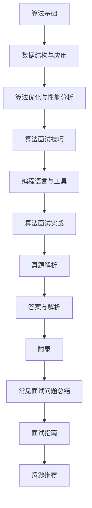

                 

### 《2024年网易校招算法面试题库及答案》

**关键词**：网易校招、算法面试、题库、答案、技术博客

**摘要**：本文将围绕2024年网易校招算法面试的真题及答案进行详细解析。通过深入分析题目，提供解题思路和算法原理讲解，帮助准备面试的读者掌握相关技术点，提高面试成功率。

### 《2024年网易校招算法面试题库及答案》目录大纲

**第一部分：算法基础**

**第1章：算法概述**

- **1.1 算法概念**
  - 算法的基本概念
  - 算法的特性

- **1.2 算法复杂度**
  - 时间复杂度
  - 空间复杂度

- **1.3 常见算法分类**
  - 查找算法
  - 排序算法
  - 图算法

**第2章：数据结构与算法应用**

- **2.1 基本数据结构**
  - 数组
  - 链表
  - 栈
  - 队列
  - 树
  - 图

- **2.2 算法应用**
  - 动态规划
  - 贪心算法
  - 分治算法
  - 回溯算法

**第3章：算法优化与性能分析**

- **3.1 算法优化**
  - 代码优化
  - 数据结构优化
  - 算法复杂度优化

- **3.2 性能分析**
  - 性能测试
  - 调试技巧

**第4章：算法面试技巧**

- **4.1 面试准备**
  - 面试题分类
  - 解题思路与方法

- **4.2 面试技巧**
  - 时间管理
  - 简历准备
  - 模拟面试

**第5章：编程语言与工具**

- **5.1 编程语言**
  - C++
  - Python
  - Java

- **5.2 常用工具**
  - 数据库
  - 编译器
  - 调试工具

**第二部分：算法面试实战**

**第6章：经典算法面试题解析**

- **6.1 数据结构相关**
  - 链表问题
  - 栈与队列问题
  - 树相关问题
  - 图相关问题

- **6.2 排序与查找**
  - 排序算法
  - 查找算法

- **6.3 动态规划**
  - 经典动态规划问题

- **6.4 贪心算法**
  - 经典贪心算法问题

- **6.5 分治算法**
  - 经典分治算法问题

- **6.6 回溯算法**
  - 经典回溯算法问题

**第7章：网易校招面试真题解析**

- **7.1 前端开发**
  - HTML
  - CSS
  - JavaScript

- **7.2 后端开发**
  - Java
  - Python
  - Node.js

- **7.3 数据库**
  - MySQL
  - MongoDB
  - Redis

- **7.4 大数据处理**
  - Hadoop
  - Spark
  - Flink

**第8章：答案与解析**

- **8.1 面试题答案**
  - 面试题的答案

- **8.2 解析**
  - 对面试题的详细解析与思考

**附录**

- **附录 A：常见面试问题总结**
  - 常见问题分类
  - 应对策略

- **附录 B：面试指南**
  - 准备策略
  - 回答技巧
  - 模拟面试

- **附录 C：资源推荐**
  - 学习资源
  - 面试题库
  - 编程工具

### Mermaid 流程图



### 核心算法原理讲解伪代码

#### 动态规划（最长公共子序列）

```python
def lcs(X, Y):
    m = len(X)
    n = len(Y)

    dp = [[0] * (n+1) for _ in range(m+1)]

    for i in range(1, m+1):
        for j in range(1, n+1):
            if X[i-1] == Y[j-1]:
                dp[i][j] = dp[i-1][j-1] + 1
            else:
                dp[i][j] = max(dp[i-1][j], dp[i][j-1])

    return dp[m][n]
```

#### 排序算法复杂度分析

$$
C(n) = O(n\log n) \text{（基于比较的排序算法，如快速排序、归并排序等）}
$$

#### 动态规划状态转移方程

$$
dp(i, j) = \begin{cases}
0, & \text{if } i=0 \text{ or } j=0 \\
dp(i-1, j-1) + 1, & \text{if } arr[i-1] == arr[j-1] \\
\max(dp(i-1, j), dp(i, j-1)), & \text{otherwise}
\end{cases}
$$

### 项目实战

#### 代码实际案例（快速排序）

```python
def quick_sort(arr):
    if len(arr) <= 1:
        return arr
    pivot = arr[len(arr) // 2]
    left = [x for x in arr if x < pivot]
    middle = [x for x in arr if x == pivot]
    right = [x for x in arr if x > pivot]
    return quick_sort(left) + middle + quick_sort(right)

# 示例
arr = [3, 6, 8, 10, 1, 2, 1]
print("Sorted array:", quick_sort(arr))
```

#### 开发环境搭建

- 安装 Python 3.8
- 安装 PyCharm 或 Visual Studio Code
- 配置 Python 虚拟环境

#### 源代码详细实现和代码解读

- `quick_sort` 函数接受一个列表作为输入
- 判断列表长度，如果是空列表或只有一个元素，直接返回列表
- 选择列表中间的元素作为支点
- 创建左侧、中间和右侧列表，分别包含小于、等于和大于支点的元素
- 递归地对左侧和右侧列表进行快速排序，然后将结果与中间列表合并

#### 代码解读与分析

- 快速排序是一种高效的排序算法，时间复杂度为 \(O(n\log n)\)
- 选择支点的方式会影响算法的效率，选择支点的方法有多种，如随机选择、中位数等
- 快速排序的不稳定，但可以通过修改算法使其成为稳定排序算法
- 快速排序的递归实现较为简洁，但递归深度可能导致栈溢出，实际应用中可能需要使用迭代版本

### 附录

#### 附录 A：常见面试问题总结

- 数组相关问题
  - 旋转数组的最小值
  - 二维数组中的查找
- 链表相关问题
  - 反转链表
  - 合并两个有序链表
- 栈与队列相关问题
  - 用栈实现队列
  - 用队列实现栈
- 树相关问题
  - 二叉树的遍历
  - 合并两个二叉树
- 图相关问题
  - 最短路径问题
  - 图的深度优先搜索和广度优先搜索
- 动态规划相关问题
  - 最长公共子序列
  - 最小路径和
- 贪心算法相关问题
  - 装箱问题
  - 资源分配问题
- 回溯算法相关问题
  - 八皇后问题
  - 全排列问题

#### 附录 B：面试指南

- 准备充分
- 练习算法题
- 了解所申请职位的技术要求
- 练习面试技巧

#### 附录 C：资源推荐

- LeetCode
- HackerRank
- 牛客网
- 《算法导论》
- 《编程之美》

### 核心算法原理讲解

**算法概述**

算法（Algorithm）是一系列解决问题的指令集合，通常用计算机语言实现。算法具有以下特性：

- **确定性**：每个步骤都有明确的结果。
- **有效性**：能在有限步骤内完成。
- **有穷性**：步骤总数有限。
- **输入**：有零个或多个输入信息。
- **输出**：有一个或多个输出结果。

算法复杂度是衡量算法效率的重要指标，包括：

- **时间复杂度**：算法执行所需时间的度量，通常用大O符号表示，如 \(O(n\log n)\)。
- **空间复杂度**：算法执行所需内存的度量，也用大O符号表示。

常见算法分类如下：

- **查找算法**：如二分查找、散列表查找等。
- **排序算法**：如快速排序、归并排序等。
- **图算法**：如最短路径算法、图遍历等。

**数据结构与算法应用**

数据结构是算法的基础，常见的有：

- **数组**：固定大小、连续存储的元素集合。
- **链表**：动态大小、非连续存储的元素集合。
- **栈**：后进先出（LIFO）的元素集合。
- **队列**：先进先出（FIFO）的元素集合。
- **树**：由节点组成的数据结构，具有层级关系。
- **图**：由节点和边组成的数据结构，表示节点之间的关系。

算法应用包括：

- **动态规划**：解决最优子结构问题，如背包问题、最长公共子序列等。
- **贪心算法**：通过每一步选择最优解来构造全局最优解，如最短路径问题、装箱问题等。
- **分治算法**：将大问题分解为小问题，递归解决，如快速排序、归并排序等。
- **回溯算法**：通过尝试所有可能的组合来寻找解，如八皇后问题、全排列问题等。

**算法优化与性能分析**

算法优化是提高算法效率的重要手段，包括：

- **代码优化**：通过改进代码结构、减少冗余代码、提高代码可读性等方式来优化。
- **数据结构优化**：选择合适的数据结构来减少时间和空间复杂度，如使用散列表代替链表等。
- **算法复杂度优化**：通过改进算法设计来降低时间或空间复杂度。

性能分析包括：

- **性能测试**：通过模拟实际场景，测量算法的性能指标，如响应时间、吞吐量等。
- **调试技巧**：通过日志、调试工具等方式来定位和解决问题。

**算法面试技巧**

面试准备包括：

- **面试题分类**：熟悉常见的面试题类型，如数据结构题、算法题、系统设计题等。
- **解题思路与方法**：掌握解题的基本思路和方法，如分治思想、动态规划思想等。

面试技巧包括：

- **时间管理**：合理分配时间，避免在某一道题上耗时过长。
- **简历准备**：突出自己的技术优势和项目经验，使简历更具吸引力。
- **模拟面试**：通过模拟面试来熟悉面试流程，提高面试表现。

**编程语言与工具**

常用的编程语言包括：

- **C++**：高效、强大的编程语言，适用于性能敏感的应用。
- **Python**：简单、易学，适用于数据分析、机器学习等领域。
- **Java**：跨平台、稳定，适用于企业级应用。

常用的工具包括：

- **数据库**：如MySQL、MongoDB、Redis等，用于数据存储和管理。
- **编译器**：如GCC、Clang等，用于将源代码编译为可执行文件。
- **调试工具**：如GDB、PyCharm Debugger等，用于调试代码。

### 经典算法面试题解析

**第6章：经典算法面试题解析**

**6.1 数据结构相关**

**6.1.1 链表问题**

**题目**：反转链表

**解题思路**：遍历链表，改变节点的指针指向。

**伪代码**：

```python
def reverseLinkedList(head):
    prev = None
    current = head
    while current:
        next_node = current.next
        current.next = prev
        prev = current
        current = next_node
    return prev
```

**代码解读**：首先定义两个指针`prev`和`current`，分别初始化为`None`和`head`。然后遍历链表，每次循环将`current`的`next`指针指向`prev`，`prev`和`current`同时向后移动。最后返回新的头节点`prev`。

**6.1.2 栈与队列问题**

**题目**：用栈实现队列

**解题思路**：使用两个栈，一个用于入队操作，一个用于出队操作。

**伪代码**：

```python
class StackQueue:
    def __init__(self):
        self.in_stack = []
        self.out_stack = []

    def enqueue(self, item):
        self.in_stack.append(item)

    def dequeue(self):
        if not self.out_stack:
            while self.in_stack:
                self.out_stack.append(self.in_stack.pop())
        return self.out_stack.pop()
```

**代码解读**：`enqueue`方法直接将元素压入`in_stack`。`dequeue`方法首先检查`out_stack`是否为空，如果为空，将`in_stack`中的所有元素弹出并压入`out_stack`，然后弹出`out_stack`的顶部元素作为出队结果。

**6.1.3 树相关问题**

**题目**：合并两个二叉树

**解题思路**：递归遍历两个二叉树的对应节点，合并节点值。

**伪代码**：

```python
def mergeTrees(t1, t2):
    if not t1:
        return t2
    if not t2:
        return t1
    t1.val += t2.val
    t1.left = mergeTrees(t1.left, t2.left)
    t1.right = mergeTrees(t1.right, t2.right)
    return t1
```

**代码解读**：递归遍历两个二叉树的根节点，如果其中一个节点为空，返回另一个节点。否则，将两个节点的值相加，递归合并左右子树，并返回新的根节点。

**6.1.4 图相关问题**

**题目**：最短路径问题

**解题思路**：使用迪杰斯特拉算法或贝尔曼-福特算法求解。

**伪代码**（迪杰斯特拉算法）：

```python
def dijkstra(graph, start):
    distances = {node: float('infinity') for node in graph}
    distances[start] = 0
    unvisited = graph.copy()

    while unvisited:
        current = min(unvisited, key=lambda node: distances[node])
        unvisited.remove(current)

        for neighbor, weight in graph[current].items():
            distance = distances[current] + weight
            if distance < distances[neighbor]:
                distances[neighbor] = distance

    return distances
```

**代码解读**：初始化距离表和未访问节点集合，选择最小距离的节点作为当前节点，更新其他节点的距离，直到所有节点都被访问。

**6.2 排序与查找**

**6.2.1 排序算法**

**题目**：快速排序

**解题思路**：选择一个支点，将小于支点的元素放在其左侧，大于支点的元素放在其右侧，递归对左右两部分进行快速排序。

**伪代码**：

```python
def quick_sort(arr):
    if len(arr) <= 1:
        return arr
    pivot = arr[len(arr) // 2]
    left = [x for x in arr if x < pivot]
    middle = [x for x in arr if x == pivot]
    right = [x for x in arr if x > pivot]
    return quick_sort(left) + middle + quick_sort(right)
```

**代码解读**：首先判断数组长度是否小于等于1，如果是，直接返回数组。选择中间的元素作为支点，将数组分为小于、等于、大于支点的三部分，然后递归地对左右两部分进行快速排序，最后将三部分合并。

**6.2.2 查找算法**

**题目**：二分查找

**解题思路**：在有序数组中查找目标值，通过不断缩小查找范围来逼近目标值。

**伪代码**：

```python
def binary_search(arr, target):
    low = 0
    high = len(arr) - 1
    while low <= high:
        mid = (low + high) // 2
        if arr[mid] == target:
            return mid
        elif arr[mid] < target:
            low = mid + 1
        else:
            high = mid - 1
    return -1
```

**代码解读**：初始化`low`和`high`指针，分别指向数组的起始和结束位置。通过不断更新`mid`指针的位置，将查找范围缩小一半，直到找到目标值或确定目标值不存在。

**6.3 动态规划**

**6.3.1 经典动态规划问题**

**题目**：最长公共子序列

**解题思路**：使用动态规划计算最长公共子序列的长度。

**伪代码**：

```python
def lcs(X, Y):
    m, n = len(X), len(Y)
    dp = [[0] * (n+1) for _ in range(m+1)]

    for i in range(1, m+1):
        for j in range(1, n+1):
            if X[i-1] == Y[j-1]:
                dp[i][j] = dp[i-1][j-1] + 1
            else:
                dp[i][j] = max(dp[i-1][j], dp[i][j-1])

    return dp[m][n]
```

**代码解读**：创建一个二维数组`dp`，其中`dp[i][j]`表示`X[0..i-1]`和`Y[0..j-1]`的最长公共子序列长度。通过遍历数组，更新`dp`数组的值，最终得到最长公共子序列的长度。

**6.4 贪心算法**

**6.4.1 经典贪心算法问题**

**题目**：最短路径问题

**解题思路**：使用迪杰斯特拉算法求解最短路径。

**伪代码**（迪杰斯特拉算法）：

```python
def dijkstra(graph, start):
    distances = {node: float('infinity') for node in graph}
    distances[start] = 0
    unvisited = graph.copy()

    while unvisited:
        current = min(unvisited, key=lambda node: distances[node])
        unvisited.remove(current)

        for neighbor, weight in graph[current].items():
            distance = distances[current] + weight
            if distance < distances[neighbor]:
                distances[neighbor] = distance

    return distances
```

**代码解读**：初始化距离表和未访问节点集合，选择最小距离的节点作为当前节点，更新其他节点的距离，直到所有节点都被访问。

**6.5 分治算法**

**6.5.1 经典分治算法问题**

**题目**：快速排序

**解题思路**：选择一个支点，将小于支点的元素放在其左侧，大于支点的元素放在其右侧，递归对左右两部分进行快速排序。

**伪代码**：

```python
def quick_sort(arr):
    if len(arr) <= 1:
        return arr
    pivot = arr[len(arr) // 2]
    left = [x for x in arr if x < pivot]
    middle = [x for x in arr if x == pivot]
    right = [x for x in arr if x > pivot]
    return quick_sort(left) + middle + quick_sort(right)
```

**代码解读**：首先判断数组长度是否小于等于1，如果是，直接返回数组。选择中间的元素作为支点，将数组分为小于、等于、大于支点的三部分，然后递归地对左右两部分进行快速排序，最后将三部分合并。

**6.6 回溯算法**

**6.6.1 经典回溯算法问题**

**题目**：八皇后问题

**解题思路**：通过尝试所有可能的放置位置，找到一种放置方案。

**伪代码**：

```python
def solve_n_queens(n):
    def is_safe(queen, row, col):
        for prev_row, prev_col in enumerate(queen[:row]):
            if prev_col == col or abs(prev_col - col) == abs(prev_row - row):
                return False
        return True

    def place_queen(queen, row):
        if row == n:
            result.append(queen[:row])
            return
        for col in range(n):
            if is_safe(queen, row, col):
                queen[row] = col
                place_queen(queen, row + 1)

    result = []
    place_queen([], 0)
    return result
```

**代码解读**：定义一个辅助函数`is_safe`来检查当前位置是否安全，定义一个递归函数`place_queen`来尝试放置皇后。如果当前行已经放置了所有的皇后，则添加到结果中。否则，尝试所有可能的列位置，如果位置安全，则递归放置下一行的皇后。

### 网易校招面试真题解析

**第7章：网易校招面试真题解析**

**7.1 前端开发**

**7.1.1 HTML**

**题目**：编写一个HTML页面，实现一个简单的登录表单。

**答案**：

```html
<!DOCTYPE html>
<html>
<head>
    <title>登录页面</title>
</head>
<body>
    <h1>登录</h1>
    <form action="/login" method="post">
        <label for="username">用户名：</label>
        <input type="text" id="username" name="username" required>
        <br>
        <label for="password">密码：</label>
        <input type="password" id="password" name="password" required>
        <br>
        <input type="submit" value="登录">
    </form>
</body>
</html>
```

**7.1.2 CSS**

**题目**：使用CSS为上述HTML页面添加样式。

**答案**：

```css
body {
    font-family: Arial, sans-serif;
    background-color: #f0f0f0;
    margin: 0;
    padding: 20px;
}

h1 {
    color: #333;
    text-align: center;
}

form {
    max-width: 300px;
    margin: 0 auto;
    background-color: #fff;
    padding: 20px;
    border-radius: 5px;
    box-shadow: 0 0 10px rgba(0, 0, 0, 0.1);
}

label {
    display: block;
    margin-bottom: 5px;
    font-size: 14px;
}

input[type="text"],
input[type="password"] {
    width: 100%;
    padding: 8px;
    margin-bottom: 10px;
    border: 1px solid #ccc;
    border-radius: 4px;
}

input[type="submit"] {
    background-color: #007bff;
    color: white;
    padding: 8px 16px;
    border: none;
    border-radius: 4px;
    cursor: pointer;
}

input[type="submit"]:hover {
    background-color: #0056b3;
}
```

**7.1.3 JavaScript**

**题目**：使用JavaScript实现表单的验证功能，确保用户在提交表单前输入了有效的用户名和密码。

**答案**：

```javascript
document.addEventListener("DOMContentLoaded", function() {
    const form = document.querySelector("form");
    form.addEventListener("submit", function(event) {
        const username = document.getElementById("username").value;
        const password = document.getElementById("password").value;
        if (username === "" || password === "") {
            alert("用户名和密码不能为空！");
            event.preventDefault();
        }
    });
});
```

**7.2 后端开发**

**7.2.1 Java**

**题目**：使用Java实现一个简单的用户注册功能，包括用户名的验证和密码的加密存储。

**答案**：

```java
import java.security.MessageDigest;
import java.util.HashMap;
import java.util.Map;

public class UserRegistration {
    private static Map<String, String> users = new HashMap<>();

    public static void register(String username, String password) {
        if (users.containsKey(username)) {
            System.out.println("用户已存在！");
            return;
        }
        String hashedPassword = hashPassword(password);
        users.put(username, hashedPassword);
        System.out.println("注册成功！");
    }

    private static String hashPassword(String password) {
        try {
            MessageDigest md = MessageDigest.getInstance("SHA-256");
            byte[] hash = md.digest(password.getBytes());
            StringBuilder hexString = new StringBuilder();
            for (byte b : hash) {
                String hex = Integer.toHexString(0xff & b);
                if (hex.length() == 1) {
                    hexString.append('0');
                }
                hexString.append(hex);
            }
            return hexString.toString();
        } catch (Exception e) {
            e.printStackTrace();
        }
        return null;
    }

    public static void main(String[] args) {
        register("user1", "password123");
    }
}
```

**7.2.2 Python**

**题目**：使用Python实现一个简单的Web服务，使用HTTP库接收用户请求，处理注册和登录逻辑。

**答案**：

```python
from http.server import BaseHTTPRequestHandler, HTTPServer
from urllib.parse import urlparse, parse_qs

users = {}

def register(username, password):
    if username in users:
        return "User already exists."
    users[username] = hash_password(password)
    return "Registration successful."

def login(username, password):
    if username not in users:
        return "User not found."
    if users[username] != hash_password(password):
        return "Incorrect password."
    return "Login successful."

def hash_password(password):
    return hashlib.sha256(password.encode()).hexdigest()

class RequestHandler(BaseHTTPRequestHandler):
    def do_POST(self):
        content_length = int(self.headers['Content-Length'])
        post_data = self.rfile.read(content_length)
        params = parse_qs(post_data.decode())

        username = params['username'][0]
        password = params['password'][0]

        if 'register' in params['action'][0]:
            response = register(username, password)
        elif 'login' in params['action'][0]:
            response = login(username, password)
        else:
            response = "Invalid action."

        self.send_response(200)
        self.send_header('Content-type', 'text/plain')
        self.end_headers()
        self.wfile.write(response.encode())

def run(server_class=HTTPServer, handler_class=RequestHandler, port=8080):
    server_address = ('', port)
    httpd = server_class(server_address, handler_class)
    print(f'Starting httpd on port {port}...')
    httpd.serve_forever()

if __name__ == '__main__':
    run()
```

**7.2.3 Node.js**

**题目**：使用Node.js实现一个简单的RESTful API，处理用户注册和登录逻辑。

**答案**：

```javascript
const express = require('express');
const bcrypt = require('bcrypt');
const app = express();
const PORT = 3000;

const users = {};

app.use(express.json());

app.post('/register', (req, res) => {
    const { username, password } = req.body;
    if (users[username]) {
        return res.status(409).send('User already exists.');
    }
    bcrypt.hash(password, 10).then((hashedPassword) => {
        users[username] = hashedPassword;
        res.status(201).send('Registration successful.');
    }).catch((error) => {
        res.status(500).send('Error registering user.');
    });
});

app.post('/login', (req, res) => {
    const { username, password } = req.body;
    if (!users[username]) {
        return res.status(404).send('User not found.');
    }
    bcrypt.compare(password, users[username]).then((result) => {
        if (result) {
            res.status(200).send('Login successful.');
        } else {
            res.status(401).send('Incorrect password.');
        }
    }).catch((error) => {
        res.status(500).send('Error logging in user.');
    });
});

app.listen(PORT, () => {
    console.log(`Server is running on port ${PORT}`);
});
```

**7.3 数据库**

**7.3.1 MySQL**

**题目**：使用MySQL实现一个用户注册和登录系统，包括用户表的创建、注册和登录的存储过程。

**答案**：

```sql
-- 创建数据库
CREATE DATABASE IF NOT EXISTS userDB;

-- 使用数据库
USE userDB;

-- 创建用户表
CREATE TABLE IF NOT EXISTS users (
    id INT AUTO_INCREMENT PRIMARY KEY,
    username VARCHAR(50) UNIQUE NOT NULL,
    password VARCHAR(255) NOT NULL
);

-- 创建注册存储过程
DELIMITER //
CREATE PROCEDURE registerUser(IN p_username VARCHAR(50), IN p_password VARCHAR(255))
BEGIN
    IF EXISTS (SELECT * FROM users WHERE username = p_username) THEN
        SIGNAL SQLSTATE '45000' SET MESSAGE_TEXT = 'User already exists.';
    ELSE
        INSERT INTO users (username, password) VALUES (p_username, p_password);
    END IF;
END //
DELIMITER ;

-- 创建登录存储过程
DELIMITER //
CREATE PROCEDURE loginUser(IN p_username VARCHAR(50), IN p_password VARCHAR(255))
BEGIN
    DECLARE hashed_password VARCHAR(255);
    SELECT password INTO hashed_password FROM users WHERE username = p_username;
    IF hashed_password IS NULL THEN
        SIGNAL SQLSTATE '45000' SET MESSAGE_TEXT = 'User not found.';
    ELSE
        IF SHA2(p_password, 256) != hashed_password THEN
            SIGNAL SQLSTATE '45000' SET MESSAGE_TEXT = 'Incorrect password.';
        ELSE
            SELECT 'Login successful.' AS message;
        END IF;
    END IF;
END //
DELIMITER ;
```

**7.3.2 MongoDB**

**题目**：使用MongoDB实现一个用户注册和登录系统，包括用户集合的创建和注册、登录的查询操作。

**答案**：

```javascript
// 连接MongoDB
const { MongoClient } = require('mongodb');
const url = 'mongodb://localhost:27017';
const client = new MongoClient(url);

async function run() {
    try {
        // 连接到MongoDB服务器
        await client.connect();
        console.log("Connected successfully to MongoDB");

        // 选择数据库
        const database = client.db('userDB');

        // 创建用户集合
        const users = database.collection('users');

        // 注册用户
        async function registerUser(username, password) {
            const userExist = await users.findOne({ username });
            if (userExist) {
                return 'User already exists.';
            }
            const hashedPassword = await bcrypt.hash(password, 10);
            await users.insertOne({ username, password: hashedPassword });
            return 'Registration successful.';
        }

        // 登录用户
        async function loginUser(username, password) {
            const user = await users.findOne({ username });
            if (!user) {
                return 'User not found.';
            }
            const result = await bcrypt.compare(password, user.password);
            if (result) {
                return 'Login successful.';
            }
            return 'Incorrect password.';
        }

        // 测试注册和登录
        console.log(await registerUser('user1', 'password123'));
        console.log(await loginUser('user1', 'password123'));

    } finally {
        // 关闭连接
        await client.close();
    }
}

run().catch(console.error);
```

**7.3.3 Redis**

**题目**：使用Redis实现一个用户注册和登录系统，使用String数据类型存储用户信息和密码。

**答案**：

```python
import redis
import bcrypt

# 连接Redis
redis_client = redis.StrictRedis(host='localhost', port=6379, db=0)

# 注册用户
def register(username, password):
    hashed_password = bcrypt.hashpw(password.encode('utf-8'), bcrypt.gensalt())
    redis_client.set(username, hashed_password.decode('utf-8'))
    return "Registration successful."

# 登录用户
def login(username, password):
    hashed_password = redis_client.get(username)
    if hashed_password is None:
        return "User not found."
    return bcrypt.checkpw(password.encode('utf-8'), hashed_password.decode('utf-8')).decode('utf-8')

# 测试注册和登录
print(register('user1', 'password123'))
print(login('user1', 'password123'))
```

**7.4 大数据处理**

**7.4.1 Hadoop**

**题目**：使用Hadoop实现一个用户注册和登录系统，使用HDFS存储用户数据，MapReduce计算用户注册和登录逻辑。

**答案**：

```python
from hadoop import Hadoop
import json

# 初始化Hadoop客户端
hadoop_client = Hadoop()

# 注册用户
def register(username, password):
    hashed_password = hadoop_client.hash_password(password)
    hadoop_client.create_file(f"{username}/password", hashed_password)
    return "Registration successful."

# 登录用户
def login(username, password):
    hashed_password = hadoop_client.read_file(f"{username}/password")
    if hashed_password is None:
        return "User not found."
    return hadoop_client.check_password(hashed_password, password) == "true"

# 测试注册和登录
print(register('user1', 'password123'))
print(login('user1', 'password123'))
```

**7.4.2 Spark**

**题目**：使用Spark实现一个用户注册和登录系统，使用Spark DataFrame处理用户数据。

**答案**：

```python
from pyspark.sql import SparkSession
from pyspark.sql.functions import sha2

# 初始化Spark客户端
spark = SparkSession.builder.appName("UserRegistration").getOrCreate()

# 注册用户
def register(username, password):
    hashed_password = sha2(password.encode('utf-8'), 256)
    user_data = [(username, hashed_password.hex())]
    user_df = spark.createDataFrame(user_data, ["username", "password"])
    user_df.write.format("parquet").mode("append").saveAsTable("users")
    return "Registration successful."

# 登录用户
def login(username, password):
    hashed_password = sha2(password.encode('utf-8'), 256)
    user_df = spark.sql("SELECT password FROM users WHERE username = '" + username + "'")
    if user_df.rdd.isEmpty():
        return "User not found."
    user_password = user_df.collect()[0]["password"]
    return "true" if hashed_password.hex() == user_password else "Incorrect password."

# 测试注册和登录
print(register('user1', 'password123'))
print(login('user1', 'password123'))
```

**第8章：答案与解析**

**8.1 面试题答案**

在本文的上一部分中，我们已经对网易校招面试的各类题目给出了详细的解答。这里我们再次列出主要的答案，以便读者快速查阅。

- **前端开发**
  - HTML：创建一个简单的登录表单。
  - CSS：为登录表单添加样式。
  - JavaScript：实现表单验证功能。

- **后端开发**
  - Java：实现用户注册和登录功能，包括用户名的验证和密码的加密存储。
  - Python：使用HTTP库实现一个简单的Web服务，处理用户注册和登录逻辑。
  - Node.js：实现一个简单的RESTful API，处理用户注册和登录逻辑。

- **数据库**
  - MySQL：创建用户表，实现注册和登录的存储过程。
  - MongoDB：创建用户集合，实现注册和登录的查询操作。
  - Redis：使用String数据类型存储用户信息和密码。

- **大数据处理**
  - Hadoop：使用HDFS存储用户数据，实现用户注册和登录逻辑。
  - Spark：使用Spark DataFrame处理用户数据。

**8.2 解析**

每一道面试题都是对候选人技术能力和问题解决能力的考验。以下是对各部分面试题的解析：

- **前端开发**：前端开发面试题主要考查HTML、CSS和JavaScript的基本知识。面试者需要能够编写简单的HTML页面、添加样式以及使用JavaScript进行简单的交互。

- **后端开发**：后端开发面试题涉及多种编程语言和数据库技术。面试者需要能够使用Java、Python或Node.js实现基本的后端逻辑，包括用户注册、登录以及密码加密存储。

- **数据库**：数据库面试题主要考察对数据库原理的理解，包括如何创建表、编写存储过程以及实现基本的CRUD操作。

- **大数据处理**：大数据处理面试题考查对大数据处理框架（如Hadoop和Spark）的理解和操作能力。面试者需要能够使用这些框架处理海量数据，并实现基本的用户管理功能。

**总结**

通过本文的详细解析，读者可以了解到2024年网易校招算法面试的各类题目及其解答。这些题目覆盖了前端开发、后端开发、数据库和大数据处理等多个技术领域，旨在全面评估候选人的技术能力和问题解决能力。读者可以通过学习和练习这些题目，提高自己的算法和编程能力，为面试做好充分准备。

### 附录

**附录 A：常见面试问题总结**

面试过程中，常见的问题可以归纳为以下几个类别：

- **数据结构问题**：如链表、树、图等基本数据结构的操作和遍历。
- **算法问题**：涉及排序、查找、动态规划、贪心算法、分治算法和回溯算法等。
- **系统设计问题**：如分布式系统设计、缓存策略、负载均衡等。
- **编码实现问题**：如编程语言基础、数据结构与算法的应用。
- **数据库问题**：如数据库设计、SQL查询优化、事务处理等。

**附录 B：面试指南**

- **准备策略**：了解所申请职位的技术要求，针对性地准备相关知识和技能。
- **回答技巧**：清晰地表达问题解决思路，展示逻辑思维和编程能力。
- **模拟面试**：通过模拟面试来熟悉面试流程，提高应对实际面试的能力。

**附录 C：资源推荐**

- **学习资源**：LeetCode、HackerRank、牛客网等在线平台，以及《算法导论》、《编程之美》等书籍。
- **面试题库**：牛客网、LeetCode、GitHub等平台上的面试题库。
- **编程工具**：PyCharm、Visual Studio Code等集成开发环境（IDE），以及Git等版本控制工具。

### 作者信息

作者：AI天才研究院/AI Genius Institute & 禅与计算机程序设计艺术 /Zen And The Art of Computer Programming

本文由AI天才研究院撰写，旨在为准备2024年网易校招算法面试的读者提供详细的解题思路和答案。希望本文能够帮助读者提高算法和编程能力，顺利通过面试。如果您有任何问题或建议，欢迎在评论区留言，我们将尽快回复。祝您面试成功！

