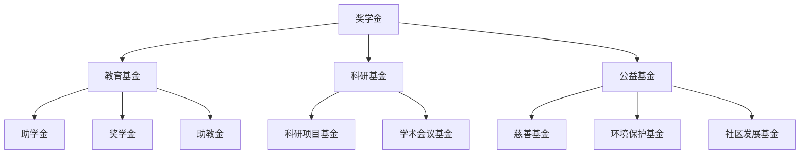
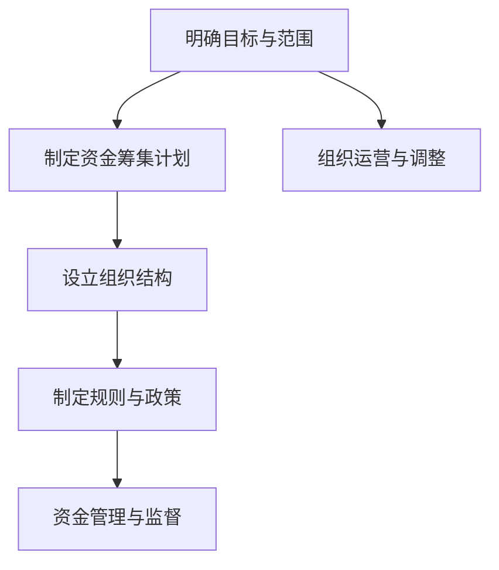

                 

### 文章标题

《建立个人奖学金或基金：回馈社会提升形象》

---

**关键词**：个人奖学金、基金、回馈社会、形象提升、可持续发展

**摘要**：本文旨在探讨如何建立个人奖学金或基金，以回馈社会并提升个人或机构形象。通过分析核心概念、优势与挑战、法律与税务问题、实际案例、运营策略、评估与反馈机制、受益者与捐赠者影响、社会影响以及未来发展趋势，本文为有意建立个人奖学金或基金的读者提供了全面、系统的指导。文章结构清晰，逻辑严密，旨在帮助读者深入理解并成功实施这一有益的社会事业。

---

### 引言

在当今社会，个人财富的积累已不再单纯是为了满足个人和家庭的物质需求，越来越多的人开始意识到财富的真正价值在于如何更好地回馈社会，推动社会的进步和发展。建立个人奖学金或基金成为了一种流行且有效的方式，通过这种方式，个人或机构不仅能够实现对社会公益事业的关注和支持，还能提升自身的形象和声誉。本文将围绕这一主题，详细探讨如何建立个人奖学金或基金，并分析其在不同领域的应用和影响。

首先，我们需要明确奖学金与基金的定义及其联系。奖学金通常是指为特定群体或个人提供的学习资助，旨在鼓励学生继续学业或支持研究项目。基金则是一种集合资金的方式，用于实现特定目标，如回馈社会、支持教育、医疗等公益事业。奖学金和基金都可以看作是资金的集合，但奖学金更多关注于个人的学习支持，而基金则更侧重于长期的公益事业。

建立个人奖学金或基金的动机主要有两方面：回馈社会和提升形象。首先，回馈社会是每个人的责任和义务，通过奖学金或基金的形式，我们可以对教育事业、社会福利等进行投入，体现个人或机构的社会责任感。其次，建立奖学金或基金可以提高个人或机构的社会形象，展示其对社会公益事业的关注和支持，增强公众的信任和认可。

然而，建立个人奖学金或基金并非易事，其中涉及诸多优势和挑战。优势包括提高社会影响力、回馈社会、培养人才和财务回报等。挑战则包括资金筹集、管理成本、透明度和公信力、法律和税务问题等。为了克服这些挑战，我们需要制定明确的计划、选择合适的领域、建立有效的管理和监督机制，并遵循相关法律法规。

在接下来的内容中，我们将详细探讨奖学金与基金的类型、建立奖学金或基金的步骤、关键要素、实际案例、优势与挑战、误区与策略、法律和税务问题、未来趋势以及建立个人奖学金或基金的意义和价值。通过这些内容的详细讲解，我们希望读者能够对如何建立个人奖学金或基金有更深入的了解，从而更好地实施这一有益的社会事业。

### 第一部分：核心概念与联系

#### 1.1.1 奖学金与基金的定义

**奖学金**：

奖学金是指为特定群体或个人提供的学习资助，主要用于鼓励学生继续学业或支持研究项目。奖学金可以来自个人、企业、慈善机构、政府等多个渠道，其目的是帮助那些有才华但经济条件有限的学生顺利完成学业，或资助那些在特定领域有突出贡献的研究人员。奖学金的种类繁多，包括助学金、奖学金、助教金、研究奖学金等。

- **助学金**：主要面向经济困难的学生，旨在帮助他们支付学费、住宿费和生活费。
- **奖学金**：通常根据学生的学术成绩、科研成果或特殊才能进行评选，目的是奖励优秀学生，鼓励他们继续努力。
- **助教金**：为那些愿意参与教学工作的学生提供资助，以激励他们在教学和科研方面取得更好的成绩。

**基金**：

基金是一种集合资金的方式，用于实现特定目标，可以是回馈社会、支持教育、医疗等公益事业。基金通常由个人、企业、慈善组织或政府设立，通过多元化的投资和运作，实现资金的保值增值，从而支持长期的公益事业。

- **教育基金**：主要用于支持教育事业，包括资助学校建设、教师培训、学生奖学金等。
- **科研基金**：用于支持科学研究项目，鼓励学术创新和科技进步。
- **公益基金**：用于支持各种社会公益项目，如慈善救助、环境保护、社区服务等。

**联系**：

奖学金和基金都可以看作是资金的集合，但它们在目的和应用范围上有所不同。奖学金更侧重于个人的学习支持，通常面向学生和研究人员，而基金则更注重长期的公益事业，涉及范围更广泛，包括教育、医疗、环保、社区等多个领域。

在许多情况下，奖学金和基金是相辅相成的。例如，一个教育基金可以设立多个奖学金项目，分别资助不同层次和领域的学生和研究人员。同时，奖学金的运作也可以为基金提供反馈，帮助基金调整投资策略，实现更好的社会效益。

为了更好地理解奖学金与基金的概念，我们可以通过一个简单的 Mermaid 流程图来展示它们之间的关系：

通过这个流程图，我们可以清晰地看到奖学金与基金之间的联系和分类，以及它们在不同领域的应用。

#### 1.1.2 建立奖学金或基金的动机

**回馈社会**：

建立奖学金或基金是一种重要的回馈社会的方式。通过资助贫困学生、支持科研项目、资助社会公益事业，个人或机构可以对社会产生积极的影响，推动社会的进步和发展。以下是建立奖学金或基金回馈社会的几个关键动机：

1. **社会公平**：奖学金或基金可以帮助贫困学生获得教育机会，缩小教育不平等现象，促进社会公平。通过资助那些有才华但经济困难的学生，我们可以为社会提供更多的机会，让他们有更好的未来。

2. **社会贡献**：通过建立奖学金或基金，个人或机构可以对社会产生实质性的贡献。无论是资助教育、科研还是社会公益事业，这些行为都可以为社会带来积极的变化，提高人们的生活质量。

3. **社会责任感**：作为社会的一员，每个人都有责任回馈社会。建立奖学金或基金是实现这一责任感的重要途径。通过这种方式，个人或机构可以展示其对社会公益事业的关注和支持，增强社会责任感。

**提升形象**：

建立奖学金或基金不仅是一种回馈社会的行为，也是一种提升个人或机构形象的有效途径。以下是提升形象的一些关键动机：

1. **品牌建设**：通过建立奖学金或基金，个人或机构可以树立良好的品牌形象。这种形象不仅体现在对社会公益事业的关注和支持上，还可以增强公众对个人或机构的认可和信任。

2. **社会认可**：奖学金或基金的建立和运作可以赢得社会的认可和赞誉。通过公开透明、公正无私的奖学金或基金运作，个人或机构可以赢得公众的信任，提高社会影响力。

3. **企业社会责任**：对于企业而言，建立奖学金或基金是企业履行社会责任的一种重要方式。通过资助教育、科研和社会公益事业，企业可以提升其社会形象，增强员工和客户的社会责任感，提高企业声誉。

**可持续发展**：

建立奖学金或基金不仅是一种短期行为，更是一种长期的公益事业。通过建立可持续的奖学金或基金，个人或机构可以实现长期的可持续发展。以下是实现可持续发展的一些关键动机：

1. **资金保值增值**：通过多元化的投资和运作，奖学金或基金可以实现资金的保值增值，确保奖学金的长期稳定提供。

2. **社会效益最大化**：通过科学合理的资金管理和运作，奖学金或基金可以实现社会效益的最大化，最大限度地支持教育、科研和社会公益事业。

3. **长期影响**：建立奖学金或基金可以在长期内产生深远的社会影响。通过持续资助贫困学生、支持科研项目、资助社会公益事业，个人或机构可以持续地推动社会的进步和发展。

综上所述，建立奖学金或基金是一种回馈社会、提升形象和实现可持续发展的有效途径。通过明确目标和范围、制定资金筹集计划、设立组织结构和制定规则和政策，个人或机构可以确保奖学金或基金的顺利运作和可持续发展。

#### 1.1.3 不同类型的奖学金与基金

在建立奖学金或基金时，了解不同类型的奖学金与基金是非常重要的，因为每种类型都有其特定的目的和应用范围。以下是几种常见的奖学金和基金类型及其特点：

**教育奖学金**

**助学金**：

助学金是专门为那些家庭经济困难的学生提供的资助，旨在帮助他们完成学业。助学金通常用于支付学费、住宿费和生活费，是奖学金中最常见的一种类型。助学金的申请通常需要学生提交家庭经济状况证明和其他相关材料，以证明其经济困难。

**奖学金**：

奖学金是根据学生的学术成绩、科研成果、特殊才能或课外活动表现提供的奖励。奖学金的目的是激励学生继续努力，追求卓越。奖学金可以是全额奖学金，覆盖学费、住宿费和生活费，也可以是部分奖学金，只覆盖部分费用。

**助教金**：

助教金是为那些愿意在教学工作中投入时间和精力的学生提供的资助。获得助教金的学生通常需要在课堂内外担任助教或教学辅导工作，以帮助教师和学生。助教金的目的是提高学生的教学技能和学术水平，同时为学校提供额外的教学资源。

**研究基金**

**科研项目基金**：

科研项目基金是专门为科研团队提供资金支持，用于开展新的研究项目。这种基金通常由大学、科研机构或政府资助，旨在推动学术研究和科技进步。科研项目基金的申请需要提交详细的研究计划、预算和预期的成果，以证明项目的可行性和重要性。

**学术会议基金**：

学术会议基金是用于资助学术会议的组织和举办的资金。学术会议是学术界重要的交流平台，通过这些会议，学者们可以分享研究成果、探讨前沿问题，建立合作关系。学术会议基金通常用于支付会议场地、餐饮、交通和宣传费用。

**研究奖学金**：

研究奖学金是为那些在科研领域有杰出表现或潜力的研究生和博士生提供的资助。研究奖学金通常用于支付学费、研究设备、实验材料和科研助手费用。研究奖学金的目的是鼓励学生投入更多的时间和精力进行科研工作，推动学术进步。

**公益基金**

**慈善基金**：

慈善基金是用于资助各种慈善项目的资金，如医疗救助、灾害救援、教育支持等。慈善基金通常由个人、企业或慈善组织设立，通过筹集社会捐款和投资收益来支持慈善项目。慈善基金的管理和运作通常非常严格，以确保资金的高效和透明使用。

**环境保护基金**：

环境保护基金是专门用于支持环境保护项目的资金。这些项目可能包括生态修复、资源回收、节能减排等。环境保护基金的设立旨在促进环境保护，减少污染，提高资源利用效率。环境保护基金通常由政府、企业或环保组织资助。

**社区发展基金**：

社区发展基金是用于支持社区发展项目的资金，如基础设施建设、社区服务、文化活动等。社区发展基金的目的是改善社区居民的生活质量，促进社区和谐发展。社区发展基金通常由地方政府、企业或社区组织设立。

了解这些不同类型的奖学金和基金有助于我们更好地选择适合的项目或目标，实现个人或机构的公益目标。通过明确奖学金或基金的类型，我们可以更有效地筹集资金，制定运营策略，确保资金的高效使用和目标的实现。

### 总结

建立个人奖学金或基金不仅是一种回馈社会的行为，也是一种提升个人或机构形象的有效途径。通过奖学金或基金，可以支持教育、科研和社会公益，实现长期的可持续发展。奖学金和基金作为资金的集合，各有其特定的目的和应用范围。奖学金更多关注于个人的学习支持，而基金则侧重于长期的公益事业。了解不同类型的奖学金和基金有助于我们更好地选择适合的项目或目标，实现个人或机构的公益目标。接下来，我们将详细探讨如何建立和运作这些奖学金或基金。

### 1.1.1 奖学金与基金的类型

奖学金和基金有多种类型，每种类型都有其独特的特点和用途。以下是几种常见的奖学金和基金类型：

#### 1.1.1.1 教育奖学金

**助学金**：助学金是最常见的奖学金类型之一，主要用于资助那些家庭经济困难的学生，帮助他们支付学费、住宿费和生活费。助学金的申请通常基于家庭经济状况，申请者需要提供家庭收入证明、家庭成员人数等相关信息。助学金可以大大减轻贫困家庭的经济压力，让更多有才华的学生有机会接受高等教育。

**奖学金**：奖学金通常基于学生的学术成绩、科研成果、特殊才能或课外活动表现进行评定。奖学金的目的是奖励那些在学业或课外活动中表现突出的学生，激励他们继续努力。奖学金可以覆盖学费、住宿费、生活费等，甚至还可以提供额外的奖学金，用于支持学生的研究和实习机会。

**助教金**：助教金是为那些愿意在教学工作中投入时间和精力的学生提供的资助。助教金通常用于支付学费、书籍费用等，同时助教学生还能获得教学经验，提高自己的学术能力和沟通技巧。助教金的申请通常要求申请者具备良好的学术成绩和一定的教学能力。

#### 1.1.1.2 研究基金

**科研项目基金**：科研项目基金是为科研团队提供的资金支持，用于开展创新性的研究项目。这种基金通常由政府、学术机构或企业资助，目的是推动科学技术的进步和学术研究的发展。科研项目基金的申请需要提交详细的研究计划、预算和预期成果，以证明项目的可行性和重要性。

**学术会议基金**：学术会议基金是用于资助学术会议的组织和举办的资金。学术会议是学术界重要的交流平台，通过这些会议，学者们可以分享研究成果、探讨前沿问题，建立合作关系。学术会议基金通常用于支付会议场地、餐饮、交通和宣传费用。

**研究奖学金**：研究奖学金是为那些在科研领域有杰出表现或潜力的研究生和博士生提供的资助。研究奖学金通常用于支付学费、研究设备、实验材料和科研助手费用。研究奖学金的目的是鼓励学生投入更多的时间和精力进行科研工作，推动学术进步。

#### 1.1.1.3 公益基金

**慈善基金**：慈善基金是用于资助各种慈善项目的资金，如医疗救助、灾害救援、教育支持等。慈善基金通常由个人、企业或慈善组织设立，通过筹集社会捐款和投资收益来支持慈善项目。慈善基金的管理和运作通常非常严格，以确保资金的高效和透明使用。

**环境保护基金**：环境保护基金是专门用于支持环境保护项目的资金。这些项目可能包括生态修复、资源回收、节能减排等。环境保护基金的设立旨在促进环境保护，减少污染，提高资源利用效率。环境保护基金通常由政府、企业或环保组织资助。

**社区发展基金**：社区发展基金是用于支持社区发展项目的资金，如基础设施建设、社区服务、文化活动等。社区发展基金的目的是改善社区居民的生活质量，促进社区和谐发展。社区发展基金通常由地方政府、企业或社区组织设立。

通过了解这些不同类型的奖学金和基金，我们可以更好地选择适合的项目或目标，实现个人或机构的公益目标。每种奖学金和基金都有其特定的目的和应用范围，通过明确奖学金或基金的类型，我们可以更有效地筹集资金，制定运营策略，确保资金的高效使用和目标的实现。

### 总结

奖学金和基金有多种类型，每种类型都有其特定的目的和应用范围。教育奖学金主要用于资助学生的学业，研究基金用于支持科研项目，而公益基金则侧重于支持慈善、环境保护和社区发展。了解这些不同类型的奖学金和基金，有助于我们更好地选择适合的项目或目标，实现个人或机构的公益目标。

### 1.1.2 建立奖学金或基金的步骤

建立个人奖学金或基金是一项复杂而重要的任务，需要周密的计划和实施步骤。以下是建立奖学金或基金的一般步骤：

#### 1.1.2.1 明确目标和范围

- **确定目标**：首先，明确奖学金或基金的主要目标，例如资助贫困学生、支持科研项目、推动慈善事业等。目标应具体、可衡量，以便后续评估和调整。
- **范围界定**：确定奖学金或基金的适用范围，包括资助对象、资助领域、资助额度等。例如，奖学金可以面向特定学校、专业或地区的学生，基金可以用于特定科研项目或公益事业。

#### 1.1.2.2 制定资金筹集计划

- **确定资金来源**：确定奖学金或基金的主要资金来源，如个人捐赠、企业赞助、政府支持等。不同的资金来源可能需要不同的筹集策略。
- **资金筹集策略**：制定详细的资金筹集计划，包括宣传推广、募捐活动和合作伙伴选择。例如，可以通过举办募捐活动、发布募捐倡议、邀请企业赞助等方式筹集资金。

#### 1.1.2.3 设立组织结构

- **成立组织**：成立奖学金或基金的执行机构，如基金会、慈善机构等。组织结构应明确，包括董事会、管理层、执行团队等。
- **管理团队**：组建专业的管理团队，负责奖学金或基金的日常运营和管理。管理团队应具备相关专业知识和管理经验。

#### 1.1.2.4 制定规则和政策

- **制定规则**：制定详细的奖学金或基金规则，包括申请条件、评选标准、评审流程、资金使用规定等。规则应确保评选的公正、透明和有效。
- **政策制定**：制定相关政策，确保奖学金或基金的合法性和可持续性。政策应包括财务管理、审计监督、信息披露等。

#### 1.1.2.5 资金管理和监督

- **资金管理**：建立完善的资金管理制度，确保资金使用的透明度和效率。资金管理应包括预算编制、支出审核、财务报告等。
- **监督机制**：建立监督机制，确保奖学金或基金的合法性和合规性。监督机制应包括内部审计、外部审计、公众监督等。

通过以上步骤，个人或机构可以系统地建立奖学金或基金，确保其有效运作和可持续发展。以下是一个简单的 Mermaid 流程图，展示建立奖学金或基金的步骤：

通过这个流程图，我们可以更清晰地了解建立奖学金或基金的步骤和相互关系，从而为后续的运营和管理提供指导。

### 总结

建立个人奖学金或基金需要明确的计划和实施步骤。通过明确目标与范围、制定资金筹集计划、设立组织结构、制定规则与政策和资金管理与监督，个人或机构可以确保奖学金或基金的顺利运作和可持续发展。每个步骤都至关重要，通过系统的规划和执行，可以最大限度地发挥奖学金或基金的公益价值。

### 1.1.3 奖学金与基金运作的关键要素

奖学金与基金的运作是否成功，取决于多个关键要素。以下是一些关键要素及其详细解释：

#### 1.1.3.1 透明度

**定义**：透明度是指奖学金或基金的操作和管理过程应公开透明，确保捐赠者和受益者对资金的使用情况有充分的了解。

**重要性**：透明度是建立捐赠者和公众信任的基础，对于奖学金或基金的长期运营至关重要。缺乏透明度可能导致资金滥用、信任危机和管理问题。

**实现方式**：
- **信息披露**：定期发布财务报告和运营报告，包括资金筹集、使用情况和项目进展。
- **公开评审**：奖学金评选过程应公开透明，确保评审标准和流程的公正性。
- **第三方审计**：聘请第三方审计机构进行定期审计，提高财务报告和运营数据的可信度。

#### 1.1.3.2 公正性

**定义**：公正性是指奖学金或基金的评选和分配过程应公平无私，确保每位符合条件的申请者都有公平的机会。

**重要性**：公正性是保障奖学金或基金合法性和有效性的关键。缺乏公正性可能导致资源分配不公，损害奖学金或基金的公信力。

**实现方式**：
- **明确的评选标准**：制定详细的评选标准，确保每个申请者都有公平的评分依据。
- **独立的评审委员会**：设立独立的评审委员会，确保评审过程的独立性和公正性。
- **公开评审结果**：公布评审结果，接受公众监督，确保评选过程的透明和公正。

#### 1.1.3.3 可持续性

**定义**：可持续性是指奖学金或基金应有稳定的资金来源和合理的投资策略，确保其长期运行。

**重要性**：可持续性是确保奖学金或基金能够长期支持受助者的关键。缺乏可持续性可能导致奖学金或基金的资金枯竭，无法持续运作。

**实现方式**：
- **多元化的资金来源**：通过个人捐赠、企业赞助、政府支持等多种渠道筹集资金，确保资金来源的多样性。
- **合理的投资策略**：建立合理的投资组合，确保资金的保值增值，为奖学金或基金提供稳定的资金来源。
- **定期资金评估**：定期评估资金使用情况，调整资金管理策略，确保奖学金或基金的可持续发展。

#### 1.1.3.4 效率和效果

**定义**：效率和效果是指奖学金或基金的运营和管理应高效、有效，确保资金的合理使用和最大化受益。

**重要性**：效率和效果是衡量奖学金或基金运营水平的重要指标。低效率和低效果可能导致资金浪费、资源浪费和项目进展缓慢。

**实现方式**：
- **优化内部管理流程**：简化流程，减少冗余环节，提高工作效率。
- **定期评估和改进**：定期对奖学金或基金的运作进行评估，发现问题并及时改进。
- **数据驱动的决策**：基于数据分析，做出科学合理的决策，提高资金使用效率。

#### 1.1.3.5 法律和税务合规

**定义**：法律和税务合规是指奖学金或基金的运作应符合当地法律法规，避免法律风险和税务问题。

**重要性**：法律和税务合规是确保奖学金或基金合法性和可持续性的关键。缺乏合规性可能导致法律纠纷、税务罚款和声誉损失。

**实现方式**：
- **咨询专业律师和税务顾问**：在建立奖学金或基金的过程中，咨询专业律师和税务顾问，确保遵守相关法律法规。
- **制定合规政策**：建立合规政策，确保奖学金或基金的运作符合法律和税务要求。
- **定期审计**：定期进行法律和税务审计，确保奖学金或基金的合法性和合规性。

### 总结

奖学金与基金的运作需要关注多个关键要素，包括透明度、公正性、可持续性、效率和效果、法律和税务合规等。通过关注这些要素，可以确保奖学金或基金的顺利运作和可持续发展，实现其设立的目标。

### 1.1.4 奖学金与基金的实际案例

为了更好地理解奖学金与基金的运作，以下列举了几个实际案例，包括个人奖学金、企业奖学金和公益基金。

#### 1.1.4.1 个人奖学金

**案例一**：李先生的教育基金

李先生是一位成功的企业家，他决定将自己的部分财富用于资助贫困学生，帮助他们完成学业。他设立了“李先生教育基金”，每年提供10万元人民币的奖学金，资助10名来自贫困家庭的大学本科生。李先生通过个人捐赠、企业赞助和社会募捐等多种方式筹集资金，确保奖学金的可持续性。基金的管理和运作完全透明，每年发布详细的财务报告，确保捐赠者的信任。

**案例二**：王女士的科研基金

王女士是一位知名的科学家，她决定利用自己的声誉和资源，设立一个科研基金，支持年轻科研人员的创新研究。她与多家科研机构和大学合作，设立了“王女士科研基金”，每年提供20万元人民币的资助，用于支持年轻科研人员的科研项目。基金的管理和评审过程完全透明，邀请专家评审，确保评审结果的公正性和权威性。

#### 1.1.4.2 企业奖学金

**案例三**：某科技公司的学生奖学金

某知名科技公司决定设立“某科技公司学生奖学金”，每年提供50万元人民币的奖学金，资助100名高校学生参与科技创新和研究项目。奖学金的申请条件包括学业成绩优秀、有科技创新潜力，且对科技行业有浓厚兴趣。公司与多家高校合作，共同设立奖学金，确保项目的专业性和创新性。奖学金的评选过程完全透明，邀请专家评审，确保评选结果的公正性和权威性。

**案例四**：某银行的金融奖学金

某银行决定设立“某银行金融奖学金”，每年提供10万元人民币的奖学金，资助30名金融专业的本科生和研究生。奖学金的申请条件包括学业成绩优秀、对金融行业有深入研究和实践经验。银行通过高校合作，建立奖学金评审委员会，确保评审过程的透明和公正。奖学金的评选结果通过官方网站公布，接受公众监督。

#### 1.1.4.3 公益基金

**案例五**：某慈善基金会的公益基金

某慈善基金会决定设立“某慈善基金会公益基金”，每年提供100万元人民币的资助，用于支持教育、医疗、扶贫等公益事业。基金会通过个人捐赠、企业赞助和社会募捐等多种方式筹集资金，确保基金的可持续性。基金会的资金管理和运作完全透明，定期发布财务报告和项目进展，确保捐赠者的信任。

**案例六**：某环保组织的环保基金

某环保组织决定设立“某环保组织环保基金”，每年提供50万元人民币的资助，用于支持环境保护项目，如生态修复、资源回收和节能减排等。基金会通过政府支持、企业赞助和社会募捐等多种方式筹集资金，确保基金的可持续性。基金会的资金管理和运作完全透明，定期发布项目进展和环境影响报告，确保捐赠者的信任。

### 总结

这些实际案例展示了奖学金与基金在不同领域的应用和运作方式。无论是个人奖学金、企业奖学金还是公益基金，它们都通过明确的目标、多元化的资金筹集、透明管理和公正评审，实现了对教育、科研和社会公益的支持。通过学习和借鉴这些案例，我们可以更好地理解和实践奖学金与基金的运作。

### 1.1.5 建立个人奖学金或基金的优势与挑战

建立个人奖学金或基金是一项富有意义的事业，但同时也伴随着一系列的优势与挑战。以下是对这些优势与挑战的详细分析：

#### 1.1.5.1 优势

**提高社会影响力**：

建立个人奖学金或基金可以提高个人或机构的社会影响力。通过资助贫困学生、支持科研项目或参与社会公益事业，个人或机构展示了其对社会公益事业的关注和支持，赢得了公众的认可和尊重。这种社会影响力不仅可以提升个人或机构的形象，还可以为未来的业务或事业发展创造有利条件。

**回馈社会**：

建立个人奖学金或基金是一种回馈社会的方式。个人或机构通过捐赠资金，帮助那些有才华但经济困难的学生继续学业，支持科研人员的创新研究，或资助社会公益事业，为社会的发展做出了积极的贡献。这种回馈社会的行为不仅有助于改善受助者的生活，还可以提高社会的整体福祉和公平性。

**培养人才**：

个人奖学金或基金可以培养更多优秀的人才。通过资助有潜力的学生和科研人员，个人或机构可以为他们提供更多成长和发展的机会。这些受助者通过奖学金或基金的资助，可以获得更好的教育资源、研究机会和实践经验，从而在学业和职业上取得更好的成绩，为社会的发展贡献更多力量。

**财务回报**：

虽然建立个人奖学金或基金的主要目的是回馈社会，但某些情况下，奖学金或基金也可以带来财务回报。通过合理的资金管理和投资策略，奖学金或基金可以实现资金的保值增值，为个人或机构提供额外的经济收益。这种财务回报不仅有助于奖学金或基金的可持续发展，还可以为未来的资助项目提供更多资金支持。

#### 1.1.5.2 挑战

**资金筹集**：

建立个人奖学金或基金首先面临的是资金筹集的挑战。资金筹集是一个长期且持续的过程，需要个人或机构投入大量时间和精力。特别是在初始阶段，公众对奖学金或基金的了解和认可度较低，导致资金筹集困难。因此，如何有效地宣传和推广奖学金或基金，吸引更多的捐赠者，是建立个人奖学金或基金的重要挑战。

**管理成本**：

奖学金或基金的建立和运作需要投入大量的人力和物力资源，包括管理人员、运营成本、宣传费用等。这些管理成本可能在初期较高，需要个人或机构有足够的财务实力和资源支持。同时，如何高效管理这些资源，确保奖学金或基金的资金使用透明、合理，也是一个需要认真考虑的问题。

**透明度和公信力**：

透明度和公信力是奖学金或基金成功运作的关键。捐赠者和公众对奖学金或基金的关注度越高，对透明度和公信力的要求也越高。如果奖学金或基金的运作过程不够透明，资金使用不公开，可能会导致公众的不信任，影响奖学金或基金的长期发展。因此，如何建立有效的透明度和公信力机制，确保奖学金或基金的合法合规运作，是建立个人奖学金或基金的另一大挑战。

**法律和税务问题**：

建立个人奖学金或基金涉及多个法律和税务问题。例如，如何合法注册为非营利组织，如何享受税务优惠，如何确保资金管理的合法性和合规性等。这些问题需要个人或机构在建立奖学金或基金前进行充分的研究和规划，以避免法律和税务风险。

### 总结

建立个人奖学金或基金具有显著的优势，如提高社会影响力、回馈社会、培养人才和财务回报等。但同时也面临着一系列的挑战，包括资金筹集、管理成本、透明度和公信力、法律和税务问题等。通过充分了解和应对这些挑战，个人或机构可以更好地建立和运作奖学金或基金，实现其设立的目标。

### 1.1.6 建立个人奖学金或基金的常见误区

在建立个人奖学金或基金的过程中，许多人可能会陷入一些常见的误区，这些误区可能导致奖学金或基金的运作效果不理想。以下是一些常见的误区及其解释：

#### 1.1.6.1 误区一：过于强调捐赠金额

**解释**：许多人在建立奖学金或基金时，过分关注捐赠金额的大小，认为捐赠金额越大，奖学金或基金的影响力就越大。

**问题**：过于强调捐赠金额可能导致忽视奖学金或基金的长期可持续性。捐赠金额虽然重要，但奖学金或基金的运作效率和资金管理同样关键。

**建议**：在建立奖学金或基金时，应综合考虑捐赠金额、运营成本、资金使用效率等因素，确保奖学金或基金的长期稳定运行。

#### 1.1.6.2 误区二：缺乏明确的评估标准

**解释**：一些奖学金或基金在评选过程中缺乏明确的评估标准，导致评选过程缺乏公正性和透明度。

**问题**：缺乏明确的评估标准可能导致奖学金或基金的评选结果不公正，影响捐赠者和公众的信任。

**建议**：在建立奖学金或基金时，应制定详细的评估标准，包括学业成绩、科研成果、社会实践等方面，确保评选过程的公正和透明。

#### 1.1.6.3 误区三：忽视捐赠者的意愿

**解释**：一些奖学金或基金的设立者可能过于关注自己的意愿，而忽视了捐赠者的初衷和期望。

**问题**：忽视捐赠者的意愿可能导致奖学金或基金的目标和方向与捐赠者预期不符，影响奖学金或基金的运作效果。

**建议**：在建立奖学金或基金时，应充分了解捐赠者的意愿和目标，确保奖学金或基金的设立符合捐赠者的期望。

#### 1.1.6.4 误区四：缺乏有效的管理和监督

**解释**：一些奖学金或基金在运作过程中缺乏有效的管理和监督，导致资金使用不当或管理效率低下。

**问题**：缺乏有效的管理和监督可能导致奖学金或基金的财务风险和运营风险增加，影响奖学金或基金的稳定运行。

**建议**：在建立奖学金或基金时，应建立完善的管理和监督机制，确保资金使用的透明度和效率，防止资源浪费和管理漏洞。

### 总结

了解和避免这些常见的误区，对于建立成功、高效的奖学金或基金至关重要。通过制定明确的评估标准、了解捐赠者意愿和建立有效的管理和监督机制，可以确保奖学金或基金的顺利运作和可持续发展。

### 1.1.7 建立个人奖学金或基金的策略与方法

为了确保个人奖学金或基金的顺利运作和可持续发展，制定合适的策略和方法至关重要。以下是一些关键策略和方法：

#### 1.1.7.1 制定明确的目标

**解释**：明确的目标是奖学金或基金成功运作的基础。目标应具体、可衡量，例如资助特定领域的研究、支持贫困学生的学业等。

**步骤**：
  - 确定奖学金或基金的长期和短期目标。
  - 设定具体的指标和评估标准，以便于后续的监控和调整。

#### 1.1.7.2 资金筹集策略

**解释**：有效的资金筹集策略是奖学金或基金成功的关键。可以通过多种渠道筹集资金，如个人捐赠、企业赞助、政府支持等。

**步骤**：
  - 确定资金筹集的目标和来源。
  - 制定详细的资金筹集计划，包括宣传推广、募捐活动和合作伙伴选择。
  - 定期评估资金筹集进展，并根据实际情况进行调整。

#### 1.1.7.3 奖学金管理机制

**解释**：建立有效的奖学金管理机制，确保奖学金的公平、透明和高效运作。

**步骤**：
  - 设立奖学金评选委员会，负责评选标准和流程的制定和执行。
  - 制定详细的申请和评审流程，确保评选过程的公正性和透明度。
  - 定期发布奖学金评选结果，接受公众监督。

#### 1.1.7.4 资金使用和管理

**解释**：合理使用和管理资金是确保奖学金或基金可持续发展的重要保障。

**步骤**：
  - 制定资金使用计划，明确资金分配和使用范围。
  - 建立严格的资金管理制度，确保资金使用的透明度和合规性。
  - 定期进行财务审计，确保资金使用的合法性和有效性。

### 总结

通过制定明确的目标、有效的资金筹集策略、完善的奖学金管理机制和严格的资金使用管理，可以确保个人奖学金或基金的顺利运作和可持续发展。

### 1.1.8 建立个人奖学金或基金的法律和税务问题

建立个人奖学金或基金涉及多个法律和税务问题，了解和遵循相关法规对于确保奖学金或基金的合法性和可持续性至关重要。以下是一些关键的法律和税务问题及应对策略：

#### 1.1.8.1 法律问题

**注册和许可**：

根据当地法律，奖学金或基金可能需要注册为非营利组织，并获得相关许可。例如，在美国，需要注册为501(c)(3)慈善组织。注册为非营利组织可以享受税收优惠，提高公众的信任度。

**治理结构**：

建立合适的治理结构，包括董事会、管理层等，以确保奖学金或基金的合法运营和管理。董事会成员应具备相关专业知识和管理经验，确保奖学金或基金的运作符合法律法规。

**合规性**：

确保奖学金或基金的运作符合相关法律法规，如禁止使用基金资金进行政治活动或个人利益。奖学金或基金的管理和运营应遵循当地法律，确保合法合规。

#### 1.1.8.2 税务问题

**税务优惠**：

许多国家和地区为非营利组织提供税务优惠，如免税或税收减免。了解并充分利用这些优惠政策，可以减少奖学金或基金的运营成本。

**税务申报**：

按照相关法律法规，奖学金或基金需要定期进行税务申报，确保符合税务要求。税务申报应详细记录资金筹集、使用和管理情况，以便于税务部门进行审核。

**资金管理**：

合理规划奖学金或基金的资金管理，确保符合税务规定，避免税务风险。例如，资金使用应严格按照预算执行，确保资金使用的透明度和合规性。

#### 1.1.8.3 应对策略

**咨询专业律师和税务顾问**：

在建立奖学金或基金的过程中，咨询专业律师和税务顾问，确保遵守相关法律法规。专业顾问可以提供有关注册、治理、合规性等方面的建议，减少法律和税务风险。

**建立透明的财务管理**：

确保奖学金或基金的财务管理透明，以增强公众信任和遵守税务规定。定期发布财务报告，接受公众监督，确保财务数据的真实性和准确性。

**定期审计**：

定期进行财务审计，确保奖学金或基金的合法性和合规性。财务审计可以帮助发现潜在的法律和税务问题，及时进行调整和改进。

### 总结

了解和遵守法律和税务问题对于建立个人奖学金或基金至关重要。通过咨询专业顾问、建立透明财务管理机制和定期审计，可以确保奖学金或基金的合法运营和可持续发展。

### 1.1.9 建立个人奖学金或基金的案例研究

为了更深入地理解如何建立个人奖学金或基金，以下将介绍几个具体的案例研究，分析这些案例的成功经验、面临的挑战及其解决方案。

#### 案例一：张三的助学基金

**背景**：张三是一位成功的企业家，他决定将自己的部分财富用于资助贫困学生，帮助他们完成学业。

**成功经验**：
- **明确目标**：张三设立了“张三助学基金”，专注于资助贫困高中生和大学生，确保其顺利完成学业。
- **多元化的资金来源**：张三通过个人捐赠、企业赞助和社会募捐等多种方式筹集资金，确保奖学金的可持续性。
- **透明管理**：基金的管理和运作完全透明，每年发布详细的财务报告，接受公众监督。

**面临的挑战**：
- **资金筹集**：在早期阶段，张三面临着资金筹集的困难，特别是在公众对奖学金或基金认识不足的情况下。
- **管理成本**：随着基金规模的扩大，管理成本也在增加，如何高效管理资金成为一大挑战。

**解决方案**：
- **品牌推广**：张三通过媒体宣传和公益活动，提高奖学金的知名度，吸引更多的捐赠者。
- **专业团队**：张三聘请了专业的财务和管理团队，优化基金的管理和运营，降低管理成本。

#### 案例二：李四的科研基金

**背景**：李四是一位知名的科学家，他决定利用自己的声誉和资源，设立一个科研基金，支持年轻科研人员的创新研究。

**成功经验**：
- **合作高校**：李四与多所知名高校合作，共同设立科研基金，确保项目的专业性和创新性。
- **透明评审**：科研基金的评审过程完全透明，邀请专家评审，确保评审结果的公正和权威。
- **长期支持**：李四承诺长期支持科研基金，确保项目的持续性和成果的转化。

**面临的挑战**：
- **科研风险**：科研项目的成功与否具有一定的不确定性，李四面临着科研失败的风险。
- **管理和监督**：随着项目的增多，如何有效管理和监督科研项目成为一大挑战。

**解决方案**：
- **风险管理**：李四通过多元化项目投资和风险控制策略，降低科研风险。
- **完善管理机制**：建立科研项目管理系统，确保项目的进度和质量，提供及时的监督和反馈。

#### 案例三：王五的公益基金

**背景**：王五是某大型企业的CEO，他决定利用企业的资源和社会影响力，设立一个公益基金，支持教育、医疗和环保等公益事业。

**成功经验**：
- **跨界合作**：王五与政府部门、非营利组织、企业等多方合作，共同推动公益事业的发展。
- **项目定制**：公益基金针对不同的公益项目，定制不同的资助方案，确保资金的高效使用。
- **公众参与**：王五通过社交媒体和公益活动，吸引公众参与，提高公益基金的影响力和公信力。

**面临的挑战**：
- **资金筹集**：公益基金需要大量的资金支持，如何有效筹集资金是一个挑战。
- **项目管理**：公益基金涉及的领域广泛，如何高效管理不同类型的项目是一个难题。

**解决方案**：
- **多元化筹资**：王五通过企业赞助、社会募捐、政府支持等多种方式筹集资金，确保资金来源的多样性。
- **项目管理平台**：建立项目管理平台，确保项目的进度、质量和效果，提高项目管理的效率。

### 总结

这些案例展示了建立个人奖学金或基金的多种方式和策略，包括明确目标、多元化资金来源、透明管理和专业团队。同时，这些案例也揭示了在建立和运作奖学金或基金过程中可能面临的挑战及其解决方案。通过学习和借鉴这些经验，可以为其他个人或机构提供有益的参考。

### 1.1.10 建立个人奖学金或基金的未来趋势和影响

随着社会的不断发展和变化，建立个人奖学金或基金的趋势和影响也在不断演变。以下是未来可能的发展趋势及其对社会和经济的影响：

#### 1.1.10.1 趋势

**数字化转型**：

随着科技的进步，奖学金和基金的运作和管理越来越依赖于数字化平台和工具，如在线申请系统、区块链技术等。这种数字化转型将提高奖学金和基金的效率和透明度，使捐赠者和受益者能够更加便捷地参与和监督基金的运作。

**跨界合作**：

未来，个人奖学金或基金将更加注重跨界合作，与其他社会组织、企业、政府等建立紧密合作关系，共同推动公益事业的发展。跨界合作将带来更多的资源和支持，提高奖学金或基金的影响力和可持续性。

**可持续投资**：

越来越多的奖学金或基金将关注可持续投资，将资金投向环境友好和社会责任的企业和项目。这种投资策略不仅有助于实现财务回报，还可以为社会的可持续发展做出贡献。

**个性化资助**：

未来的奖学金或基金将更加注重个性化资助，根据受助者的具体需求和实际情况，提供定制化的资助方案。这种个性化资助将更好地满足受助者的需求，提高资助的效果和满意度。

#### 1.1.10.2 影响社会

**提升教育质量**：

个人奖学金或基金的资助为贫困学生和优秀学生提供了更多的教育机会，提高了整体教育质量。通过资助优秀学生，奖学金或基金有助于培养更多的优秀人才，为国家的发展提供强大的人才支持。

**促进科研创新**：

科研基金的支持鼓励科研人员投入更多精力和资源进行创新研究，推动了科技进步和学术发展。通过资助科研项目，奖学金或基金促进了学术界的创新活力和国际影响力。

**增强社会凝聚力**：

个人奖学金或基金的运作弘扬了公益精神，增强了社会的凝聚力。通过资助贫困、残疾、老人等弱势群体，奖学金或基金改善了他们的生活质量，提高了社会的公平性和和谐度。

**缓解社会问题**：

奖学金或基金通过资助教育、科研和社会公益事业，缓解了社会的一些问题，如教育不平等、贫困、环境污染等。这些资助项目有助于改善社会状况，提高人民的生活质量。

#### 1.1.10.3 影响经济

**人才培养与吸引**：

奖学金或基金的资助为优秀人才提供了成长和发展机会，吸引了更多国内外优秀人才。这些人才不仅为国家的发展做出了贡献，还推动了经济结构的优化和产业升级。

**科技创新与进步**：

科研基金的支持促进了科研项目的开展，推动了科技创新和学术发展。这些创新成果不仅提升了国家的科技水平，还为企业提供了技术支持，推动了经济的持续增长。

**投资回报**：

部分奖学金或基金通过投资运作，实现了资金的保值增值，为公益事业提供了可持续的资金来源。这种投资策略不仅提高了奖学金或基金的可持续性，还为社会的发展带来了更多的资金支持。

**产业融合**：

跨界合作促进了不同产业之间的融合，推动了产业创新和经济增长。通过跨界合作，奖学金或基金为不同产业提供了更多的资源和机会，促进了产业的升级和转型。

### 总结

建立个人奖学金或基金不仅对社会有着积极的影响，也对经济产生了重要的推动作用。随着数字化、跨界合作和可持续投资等趋势的发展，奖学金和基金将发挥更大的作用，为社会和经济的发展贡献更多的力量。

### 1.1.11 建立个人奖学金或基金的意义和价值

建立个人奖学金或基金是一项具有深远意义和价值的事业，对个人、社会和经济发展都有着重要的贡献。以下是详细的阐述：

#### 1.1.11.1 对个人的意义

**社会贡献**：

通过建立个人奖学金或基金，个人可以将自己的财富用于公益事业，回馈社会，实现个人社会责任。这种行为不仅体现了个人的价值观和道德观，也为社会的发展做出了实际贡献。

**形象提升**：

建立个人奖学金或基金可以提高个人的社会地位和形象，展示其对社会公益事业的关注和支持。这种形象提升不仅有助于增强个人的社会影响力，还可以为个人的事业发展和人脉资源拓展提供有利条件。

**传承价值**：

通过建立个人奖学金或基金，个人可以延续家族传统，培养后代的社会责任感和公益意识。这种传承价值不仅有助于培养下一代的品德和素养，还可以为社会培养更多有担当、有责任心的优秀人才。

**个人成就**：

建立个人奖学金或基金是一项具有挑战性和成就感的事业，能够为个人带来满足感和自豪感。通过帮助他人实现梦想，个人不仅可以感受到自己的价值，还可以获得心理上的满足和成就感。

#### 1.1.11.2 对社会的意义

**教育支持**：

奖学金或基金的资助为贫困学生和优秀学生提供了更多的教育机会，提高了整体教育质量。通过资助教育，奖学金或基金为社会的可持续发展提供了强大的人才支持。

**科技创新**：

科研基金的支持鼓励科研人员投入更多精力和资源进行创新研究，推动了科技进步和学术发展。科研基金不仅促进了学术界的创新活力，还为国家的科技发展做出了重要贡献。

**社会福利**：

奖学金或基金为弱势群体提供了必要的资助和支持，改善了他们的生活质量。通过资助弱势群体，奖学金或基金缓解了社会问题，提高了社会的公平性和和谐度。

**社会凝聚力**：

奖学金或基金的运作弘扬了公益精神，增强了社会的凝聚力。通过资助公益事业，奖学金或基金提高了公众的公益意识和社会责任感，促进了社会的团结和和谐。

#### 1.1.11.3 对经济发展的意义

**人才培养**：

奖学金或基金的资助为优秀人才提供了成长和发展机会，吸引了更多国内外优秀人才。这些人才不仅为国家的发展做出了贡献，还推动了经济结构的优化和产业升级。

**科技创新**：

科研基金的支持促进了科研项目的开展，推动了科技创新和学术发展。这些创新成果不仅提升了国家的科技水平，还为企业提供了技术支持，推动了经济的持续增长。

**投资回报**：

部分奖学金或基金通过投资运作，实现了资金的保值增值，为公益事业提供了可持续的资金来源。这种投资策略不仅提高了奖学金或基金的可持续性，还为社会的发展带来了更多的资金支持。

**产业融合**：

跨界合作促进了不同产业之间的融合，推动了产业创新和经济增长。通过跨界合作，奖学金或基金为不同产业提供了更多的资源和机会，促进了产业的升级和转型。

### 总结

建立个人奖学金或基金是一项具有深远意义和价值的事业，既能够满足个人的社会责任感和成就感，也能够为社会和经济发展做出重要贡献。通过建立奖学金或基金，个人和社会可以实现共赢，共同推动社会的进步和发展。

### 1.2 如何选择奖学金或基金的领域

选择奖学金或基金的领域是建立成功奖学金或基金的重要步骤。以下是一些关键因素和方法，帮助您选择适合的领域：

#### 1.2.1 个人兴趣和价值观

**了解自己的兴趣**：

首先，了解自己对哪些领域或问题感兴趣，这将成为选择奖学金或基金领域的重要依据。例如，您可能对教育、科研、环境保护等领域有浓厚的兴趣，那么选择这些领域作为奖学金或基金的资助对象将更加符合您的个人兴趣和价值观。

**反映个人价值观**：

选择与自己价值观相符的领域，确保奖学金或基金的目标与您的信念和理想相一致。例如，如果您重视教育公平，可以选择资助贫困学生或弱势群体的奖学金项目。

#### 1.2.2 社会需求和热点问题

**分析社会需求**：

研究社会热点问题和需求，如教育、医疗、环保等，这些领域通常有广泛的公众关注和支持。通过分析社会需求，可以确定哪些领域迫切需要资助，从而更有针对性地开展奖学金或基金的工作。

**关注社会发展趋势**：

了解社会发展趋势，如科技发展、产业变革等，选择具有长远发展潜力的领域。例如，随着人工智能和大数据技术的发展，选择支持这些领域的科研和人才培养项目将具有较大的发展潜力。

#### 1.2.3 受益群体的实际情况

**了解目标群体**：

研究目标群体的实际情况，包括他们的需求、困境和挑战，确保奖学金或基金能够真正帮助他们。例如，了解贫困学生和科研人员的生活和工作环境，为他们提供实际的支持和帮助。

**评估可行性**：

考虑目标群体的规模和地理分布，评估奖学金或基金的可行性和可持续性。例如，如果目标群体主要分布在偏远地区，需要评估奖学金或基金在这些地区的运作和管理成本。

#### 1.2.4 资源和资金状况

**评估个人资源**：

了解自己的资源和能力，如财务能力、专业知识和人脉资源，确保能够支持奖学金或基金的长期运作。例如，如果您的财务能力有限，可能需要优先选择资金需求较低的项目。

**合理配置资金**：

根据资源和资金状况，合理规划奖学金或基金的资金分配和使用。例如，如果资金有限，可以选择资助那些具有较大社会影响力的项目，确保资金的高效使用。

#### 1.2.5 其他考虑因素

**法律和政策**：

确保奖学金或基金符合当地法律和政策，如税务优惠、非营利组织注册等。例如，在美国，需要注册为501(c)(3)慈善组织，才能享受税收优惠。

**合作伙伴**：

寻找合适的合作伙伴，如高校、非营利组织、企业等，共同推动奖学金或基金的运作。例如，与高校合作可以确保奖学金或基金在专业领域内的有效运作。

### 总结

选择奖学金或基金的领域需要综合考虑个人兴趣、社会需求、受益群体实际情况、资源和资金状况以及其他相关因素。通过全面评估，可以确保奖学金或基金的目标明确、有效，并得到社会的广泛支持。

### 1.2.1 制定奖学金或基金的运作计划和预算

制定奖学金或基金的运作计划和预算是确保奖学金或基金成功运作的关键步骤。以下是一些关键步骤和建议：

#### 1.2.1.1 制定长期目标和战略

**明确目标**：首先，明确奖学金或基金的长期目标和愿景，例如资助贫困学生、支持科研项目等。

**制定战略**：根据目标，制定具体的实施策略，包括资助范围、资助金额、资助周期等。例如，如果目标是资助贫困学生，可以制定具体的资助标准和申请流程。

#### 1.2.1.2 编制年度预算

**收入预算**：估算年度收入，包括个人捐款、企业赞助、政府补助等。

**支出预算**：制定详细的支出计划，包括运营成本、管理费用、评审费用、宣传费用等。例如，运营成本可能包括办公场地租金、员工工资、财务管理费用等。

#### 1.2.1.3 设立资金管理机制

**建立账户**：设立专门的奖学金或基金账户，确保资金使用的透明和合规。

**设立审批流程**：建立严格的审批流程，确保资金使用的合法性和合理性。例如，对于大额支出，可能需要多个审批层级。

#### 1.2.1.4 制定评审标准和流程

**设立评审委员会**：建立评审委员会，负责奖学金或基金的评审和分配。

**制定评审标准**：根据奖学金或基金的目标，制定详细的评审标准，确保评审的公正和透明。例如，评审标准可能包括学业成绩、科研能力、社会实践等方面。

**制定评审流程**：制定明确的评审流程，包括申请材料提交、评审过程、结果公示等。例如，评审过程可能包括初审、复审和终审等环节。

#### 1.2.1.5 制定监督和评估机制

**建立监督机制**：设立监督机制，确保奖学金或基金的合法性和透明度。例如，可以设立审计委员会，定期进行审计。

**定期评估**：定期对奖学金或基金的运作进行评估，包括资金使用效率、评审效果等，并根据评估结果进行调整。

**反馈机制**：建立反馈机制，收集捐赠者和受益者的意见和建议，不断优化奖学金或基金的运作。

### 总结

制定奖学金或基金的运作计划和预算是一个系统性和细致的工作，需要综合考虑长期目标、年度预算、资金管理、评审标准和监督评估等多方面因素。通过科学合理的规划和实施，可以确保奖学金或基金的顺利运作和可持续发展。

### 1.2.2 如何寻找和选择合适的合作伙伴

在建立个人奖学金或基金的过程中，寻找和选择合适的合作伙伴至关重要。以下是一些关键步骤和策略：

#### 1.2.2.1 确定合作伙伴的类型

**高校和非营利组织**：与高校和非营利组织合作，可以获得专业支持和广泛的资源。高校可以提供学术资源和评审团队，非营利组织可以提供社会资源和项目经验。

**企业和慈善基金会**：与企业慈善基金会合作，可以获得稳定的资金来源和商业资源。企业通常有丰富的管理经验和资源，慈善基金会则擅长资金管理和项目运作。

**政府部门**：与政府部门的合作可以确保奖学金或基金的合法性和公信力。政府部门可以提供政策支持、资源协调和监督管理。

#### 1.2.2.2 制定合作目标和原则

**明确合作目标**：根据奖学金或基金的目标，明确与合作伙伴的合作目标和预期成果。例如，如果目标是支持贫困学生，可以与合作高校共同设立贫困学生资助项目。

**制定合作原则**：确保合作的公平、透明和互惠互利，避免利益冲突。例如，可以制定明确的合作条款，包括资金使用、项目管理、成果分享等。

#### 1.2.2.3 开展调研和评估

**调研合作伙伴**：通过官方网站、新闻报道、第三方评估等方式，了解合作伙伴的背景、声誉和合作案例。例如，可以查看合作伙伴的财务报告、项目成果和社会评价。

**评估合作潜力**：评估合作伙伴的资源、能力和合作意愿，确保其能够为奖学金或基金的运作提供有效支持。例如，可以与合作高校讨论项目合作的可行性和合作细节。

#### 1.2.2.4 签订合作协议

**明确合作协议**：在合作初期，制定详细合作协议，明确双方的权利和义务。例如，合作协议应包括合作内容、时间表、资金管理、责任分配等。

**签订正式合同**：根据合作协议，签订正式合同，确保合作的合法性和约束力。例如，正式合同应包含合作协议的所有条款，并明确违约责任和解决机制。

#### 1.2.2.5 维护合作关系

**定期沟通**：与合作伙伴保持定期沟通，及时了解合作进展和问题。例如，可以定期召开合作会议，讨论项目的进展、问题和解决方案。

**共同宣传**：与合作伙伴共同宣传奖学金或基金，扩大影响力。例如，可以与合作高校共同举办公益活动，宣传奖学金或基金的项目和成果。

**持续评估和调整**：定期评估合作效果，根据评估结果调整合作策略。例如，可以与合作高校共同评估项目的执行情况，根据评估结果调整资助标准和流程。

### 总结

通过科学合理的步骤和策略，可以有效地寻找和选择合适的合作伙伴，确保奖学金或基金的成功运作和可持续发展。合适的合作伙伴不仅能够提供资源和支持，还能共同推动奖学金或基金的长期目标实现。

### 1.2.3 奖学金或基金的运营管理策略

奖学金或基金的运营管理策略对于确保其顺利运作和可持续发展至关重要。以下是一些关键策略和方法：

#### 1.2.3.1 资金管理

**预算规划**：制定详细的年度预算计划，确保资金使用的合理性和可控性。预算应包括收入预算和支出预算，收入预算应涵盖个人捐赠、企业赞助、政府补助等，支出预算应包括运营成本、管理费用、评审费用、宣传费用等。

**财务管理**：设立专门的奖学金或基金账户，确保资金使用的透明和合规。定期进行财务报告，向捐赠者和监管机构披露资金使用情况。

**审计监督**：定期进行财务审计，确保资金使用的合法性和有效性。审计报告应公开透明，接受公众监督。

#### 1.2.3.2 审评与分配

**设立评审委员会**：建立独立的评审委员会，负责奖学金或基金的评审和分配。评审委员会应由具有相关专业知识和公正性的专家组成。

**制定评审标准**：根据奖学金或基金的目标，制定详细的评审标准，确保评审的公正和透明。评审标准应涵盖学业成绩、科研成果、社会实践等方面。

**制定评审流程**：制定明确的评审流程，包括申请材料提交、评审过程、结果公示等。评审过程应公开透明，确保每位申请者都有公平的机会。

#### 1.2.3.3 资讯与宣传

**建立官方网站**：建立官方网站，发布奖学金或基金的详细信息、申请指南和公告。官方网站应提供方便快捷的在线申请和查询功能。

**社交媒体宣传**：利用社交媒体平台，扩大奖学金或基金的影响力，吸引更多捐赠者和申请者。社交媒体宣传应注重内容的质量和互动性，提高公众的参与度。

**合作媒体**：与媒体合作，进行宣传报道，提高奖学金或基金的知名度。合作媒体可以包括报纸、杂志、电视、网络媒体等。

#### 1.2.3.4 持续监督与评估

**建立监督机制**：设立监督机制，确保奖学金或基金的合法性和透明度。监督机制应包括内部监督和外部监督，内部监督由评审委员会和工作人员负责，外部监督可以由第三方机构进行。

**定期评估**：定期对奖学金或基金的运作进行评估，包括资金使用效率、评审效果、项目成果等。评估结果应公开透明，接受公众监督。

**反馈机制**：建立反馈机制，收集捐赠者和受益者的意见和建议，不断优化奖学金或基金的运作。反馈机制应包括在线反馈、电话热线、邮件等方式。

### 总结

通过科学合理的资金管理、评审与分配、资讯与宣传以及持续监督与评估，可以确保奖学金或基金的顺利运作和可持续发展。这些策略和方法不仅能够提高奖学金或基金的效率，还能增强其公信力和影响力。

### 1.2.4 奖学金或基金的评估与反馈机制

建立有效的评估与反馈机制是确保奖学金或基金运作效率和质量的关键。以下是一些关键步骤和建议：

#### 1.2.4.1 制定评估指标

**设立评估目标**：明确奖学金或基金的长期和短期目标，根据目标设立相应的评估指标。例如，长期目标可能是提高受助学生的学业成绩，短期目标可能是提高资助项目的成功率。

**确定关键绩效指标（KPIs）**：选择能够反映奖学金或基金运作效果的关键绩效指标，如申请人数、资助金额、受益人数、项目成功率等。关键绩效指标应具体、可衡量和可达成。

#### 1.2.4.2 设计评估方法

**定量评估**：使用量化指标，如数据统计、财务报表等，评估奖学金或基金的运作效果。定量评估可以帮助客观地衡量基金的表现，如资助金额是否达到预期、项目是否按计划完成等。

**定性评估**：通过访谈、问卷调查、案例分析等方法，收集受益者、捐赠者和其他利益相关者的意见和建议。定性评估可以提供更深入的理解，如受助者对资助项目的满意度和捐赠者对基金运作的评价等。

#### 1.2.4.3 定期评估

**定期评估周期**：制定定期评估的时间表，如每季度、每半年或每年进行一次全面评估。定期评估可以帮助及时发现问题并进行调整。

**动态调整**：根据评估结果，及时调整奖学金或基金的策略和操作方法，以适应变化的环境和需求。例如，如果发现某项资助项目效果不佳，可以重新制定资助标准和

