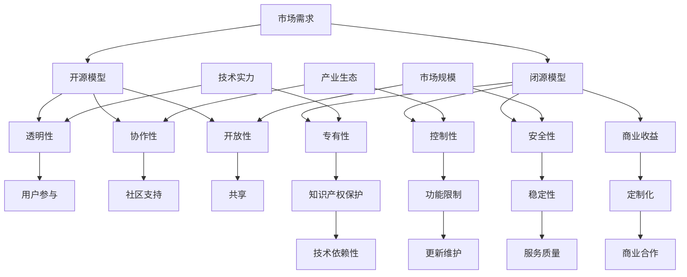

                 

# 《开源模型vs闭源模型：市场格局分析》

## 关键词
- 开源模型
- 闭源模型
- 市场格局
- 技术创新
- 产业生态
- 商业模式

## 摘要
本文旨在深入分析开源模型与闭源模型在当前市场格局中的表现，探讨两者在技术创新、产业生态和商业模式等方面的差异与联系。通过对开源模型和闭源模型的定义、特点、发展历程、主要应用场景、优势与挑战的详细解析，结合实际案例分析，本文将揭示两种模型的市场需求、技术实力、产业生态和市场规模，并对未来的发展趋势进行预测。最终，本文将提出针对开源模型和闭源模型的发展建议，为企业在技术创新和市场策略选择上提供参考。

## 目录
----------------------------------------------------------------

# 《开源模型vs闭源模型：市场格局分析》

## 第一部分：引言
### 1.1 书籍背景与目标
### 1.2 开源模型与闭源模型概述
### 1.3 市场格局分析的重要性

## 第二部分：开源模型分析
### 2.1 开源模型的定义与特点
### 2.2 开源模型的发展历程
### 2.3 开源模型的主要应用场景
### 2.4 开源模型的优势与挑战
### 2.5 开源模型的主要代表

## 第三部分：闭源模型分析
### 3.1 闭源模型的定义与特点
### 3.2 闭源模型的发展历程
### 3.3 闭源模型的主要应用场景
### 3.4 闭源模型的优势与挑战
### 3.5 闭源模型的主要代表

## 第四部分：市场格局对比分析
### 4.1 市场需求对比
### 4.2 技术实力对比
### 4.3 产业生态对比
### 4.4 市场规模对比
### 4.5 未来发展趋势预测

## 第五部分：案例分析
### 5.1 开源模型案例分析
### 5.2 闭源模型案例分析
### 5.3 案例分析总结

## 第六部分：结论与建议
### 6.1 研究结论
### 6.2 针对开源模型的建议
### 6.3 针对闭源模型的建议
### 6.4 行业发展展望

## 附录
### 附录A：开源模型与闭源模型核心概念与联系
### 附录B：开源模型与闭源模型核心算法原理
### 附录C：开源模型与闭源模型数学模型和数学公式详解
### 附录D：开源模型与闭源模型项目实战
### 附录E：参考文献

----------------------------------------------------------------

## 第一部分：引言

### 1.1 书籍背景与目标

在当前快速发展的信息技术时代，开源模型和闭源模型已成为企业创新和竞争的重要方式。开源模型强调资源共享、透明性和协同合作，而闭源模型则强调知识产权保护和商业利益的最大化。这两种模型在技术、商业和产业生态中扮演着不同但互补的角色。

本文的目标是通过对开源模型和闭源模型的深入分析，揭示它们在市场格局中的表现和相互关系。通过分析开源模型和闭源模型的定义、特点、发展历程、应用场景、优势与挑战，以及市场需求、技术实力、产业生态和市场规模，本文旨在为读者提供全面而深刻的理解，为企业在技术创新和市场策略选择上提供指导。

### 1.2 开源模型与闭源模型概述

开源模型（Open Source Model）通常指软件开发过程中，软件的源代码可以被公众自由地访问、使用、修改和分发。开源模型的核心特点是开放性、透明性和协作性。开源软件的开发通常通过社区合作，鼓励用户参与代码改进和功能扩展。著名开源软件如Linux操作系统、Apache Web服务器、MySQL数据库等，都是开源模型的代表。

闭源模型（Closed Source Model），又称专有模型（Proprietary Model），是指软件的源代码不被公开，仅由软件开发者或版权持有人控制和授权使用。闭源模型强调知识产权保护和商业利益的保护，通常需要用户支付费用才能使用。闭源模型的应用广泛，如Microsoft Windows操作系统、Adobe Photoshop软件等。

### 1.3 市场格局分析的重要性

市场格局分析是企业在市场竞争中制定战略的重要依据。开源模型和闭源模型在技术创新、市场策略和商业模式上存在显著差异，这些差异直接影响企业的市场定位、竞争力和盈利能力。

通过市场格局分析，企业可以更准确地把握市场需求，了解竞争对手的动向，优化产品和服务策略。同时，市场格局分析有助于识别新兴市场机会，提前布局，抢占市场先机。此外，市场格局分析还可以为企业提供行业趋势预测，帮助企业在不确定的市场环境中做出明智的决策。

## 第二部分：开源模型分析

### 2.1 开源模型的定义与特点

开源模型（Open Source Model）是一种软件开发和分发模式，其中软件的源代码可以被公众自由地访问、使用、修改和分发。开源模型的核心理念是共享、透明和协作。以下是开源模型的主要特点：

1. **开放性**：开源模型的源代码是公开的，任何人都可以自由地查看、使用和修改。这种开放性促进了代码的透明性和可理解性，使用户能够更好地理解和信任软件。

2. **透明性**：开源模型鼓励用户参与代码审查和改进，使得软件开发过程更加透明。开发者可以通过代码库和社区论坛实时跟踪代码变更，及时修复漏洞和优化性能。

3. **协作性**：开源模型强调社区协作，鼓励开发者和用户共同参与软件的开发和改进。通过协作，开源项目可以聚集更多的智慧和资源，加速创新和迭代。

4. **共享**：开源模型促进了知识的共享和传播，用户可以免费使用、修改和分发开源软件，从而推动了软件生态系统的繁荣。

5. **灵活性和定制化**：开源模型允许用户根据需求对软件进行定制化修改，满足特定场景和应用的需求。这种灵活性是闭源模型所不具备的。

### 2.2 开源模型的发展历程

开源模型的发展历程可以追溯到20世纪80年代。以下是开源模型发展的一些关键节点：

1. **1983年**：Richard Stallman创建了自由软件基金会（FSF），并推出了GNU项目，旨在创建一个完全自由的操作系统。GNU项目的成功为开源模型奠定了基础。

2. **1991年**：Linus Torvalds发布了Linux内核，标志着开源操作系统的一个重要里程碑。Linux内核的发布激发了全球开发者的参与热情，促进了开源模型的普及。

3. **1998年**：Eclipse基金会成立，致力于推动开源软件开发工具的发展。Eclipse平台的成功为开源软件在开发工具领域奠定了主导地位。

4. **2000年代**：开源软件在各个领域得到了广泛应用，如Web服务器（Apache）、数据库（MySQL）、操作系统（Linux）等。开源模型在商业环境中逐渐成为一种主流的开发模式。

5. **2010年代**：随着云计算和大数据技术的发展，开源模型在云计算平台（如OpenStack、Kubernetes）、大数据工具（如Hadoop、Spark）等领域得到了广泛应用。

### 2.3 开源模型的主要应用场景

开源模型在多个领域和应用场景中取得了显著的成功，以下是其中一些主要的应用场景：

1. **操作系统**：Linux操作系统是开源模型的代表，被广泛应用于服务器、桌面和嵌入式系统。Linux的灵活性和稳定性使其成为互联网和数据中心的关键基础设施。

2. **Web服务器**：Apache Web服务器是开源模型在Web服务领域的代表，以其高性能、可扩展性和安全性被广泛采用。

3. **数据库**：MySQL、PostgreSQL等开源数据库在商业应用中占据了重要地位，提供了可靠的数据存储和管理解决方案。

4. **开发工具**：Eclipse、NetBeans等开源开发工具为开发者提供了强大的编程环境，降低了开发成本，提高了开发效率。

5. **云计算平台**：OpenStack、Kubernetes等开源云计算平台提供了灵活的云基础设施管理解决方案，促进了云计算技术的普及和应用。

6. **大数据工具**：Hadoop、Spark等开源大数据工具在数据存储、处理和分析方面发挥了重要作用，为企业和组织提供了强大的数据处理能力。

### 2.4 开源模型的优势与挑战

开源模型具有许多优势，但也面临一定的挑战。以下是开源模型的主要优势与挑战：

#### 优势：

1. **成本效益**：开源软件可以免费获取和使用，降低了企业的软件采购成本。

2. **灵活性**：开源软件允许用户根据自己的需求进行定制化修改，提高了软件的适用性和灵活性。

3. **创新性**：开源模型的社区协作模式鼓励开发者不断改进和优化软件，推动了技术的快速创新和迭代。

4. **社区支持**：开源项目通常拥有一个活跃的社区，为用户提供技术支持和培训，降低了用户的学习和使用门槛。

5. **生态系统**：开源模型促进了软件生态系统的繁荣，为开发者提供了丰富的工具和资源，增强了开发体验。

#### 挑战：

1. **知识产权保护**：开源软件的源代码公开，可能导致知识产权保护的问题，尤其是在商业环境中。

2. **技术依赖性**：用户可能过度依赖开源软件，失去自主可控的能力，增加了技术风险。

3. **代码质量**：开源项目的代码质量可能参差不齐，部分项目的稳定性、安全性和性能可能受到影响。

4. **商业利益**：开源模型可能对企业的商业利益产生挑战，尤其是在市场竞争激烈的环境中。

5. **社区治理**：开源社区可能面临治理挑战，如决策效率、资源分配等问题，可能影响项目的可持续发展。

### 2.5 开源模型的主要代表

开源模型在多个领域和行业中都有成功的代表，以下是其中一些主要的代表：

1. **Linux内核**：Linux内核是开源模型的代表，已经成为服务器、桌面和嵌入式系统的重要操作系统。

2. **Apache Web服务器**：Apache Web服务器是全球最受欢迎的Web服务器软件，以其高性能和可靠性而著称。

3. **MySQL数据库**：MySQL数据库是一种流行的开源关系型数据库，广泛应用于企业级应用。

4. **Eclipse开发工具**：Eclipse是一种流行的开源集成开发环境（IDE），为Java开发者提供了强大的开发工具。

5. **OpenStack云计算平台**：OpenStack是一种开源的云计算平台，提供了灵活的云基础设施管理解决方案。

6. **Hadoop大数据工具**：Hadoop是一种开源的大数据处理框架，广泛应用于数据存储、处理和分析。

7. **Kubernetes容器编排平台**：Kubernetes是一种开源的容器编排平台，已经成为容器化应用程序部署和管理的事实标准。

## 第三部分：闭源模型分析

### 3.1 闭源模型的定义与特点

闭源模型（Closed Source Model），又称专有模型（Proprietary Model），是一种软件开发和分发模式，其中软件的源代码不被公开，仅由软件开发者或版权持有人控制和授权使用。闭源模型的核心特点是知识产权保护和商业利益的保护。以下是闭源模型的主要特点：

1. **专有性**：闭源模型的源代码是保密的，只有经过授权的用户才能访问和使用。这种专有性有助于保护软件开发者的知识产权和商业利益。

2. **控制性**：闭源模型允许软件开发者对软件的使用进行严格的控制和限制，包括功能限制、使用限制和分发限制等。

3. **安全性**：闭源模型通常提供更高的安全性，因为源代码的保密性使得潜在的安全漏洞和攻击途径更难以发现。

4. **稳定性**：闭源模型的软件通常经过严格的质量控制和测试，以确保其稳定性和可靠性。

5. **商业收益**：闭源模型通过销售软件或提供订阅服务来获得商业收益，为软件开发者提供了可持续的收入来源。

6. **定制化**：闭源模型允许根据客户需求进行定制化开发，以满足特定的业务需求。

### 3.2 闭源模型的发展历程

闭源模型的发展历程可以追溯到计算机软件商业化的初期。以下是闭源模型发展的一些关键节点：

1. **1970年代**：随着计算机技术的发展，软件开始作为商业产品出售。闭源模型逐渐成为软件企业的主要商业模式。

2. **1980年代**：微软公司的成功推动了闭源模型的普及。微软的Windows操作系统和Office办公软件成为闭源模型的代表。

3. **1990年代**：互联网的兴起促进了闭源模型的进一步发展。许多软件公司通过在线订阅和云服务模式，实现了商业收益的稳定增长。

4. **2000年代**：开源模型的兴起对闭源模型造成了一定的冲击。但闭源模型通过不断提升软件质量和提供个性化服务，保持了其在市场上的竞争力。

5. **2010年代**：随着云计算和移动设备的发展，闭源模型在云服务和移动应用领域取得了新的突破。

### 3.3 闭源模型的主要应用场景

闭源模型在多个领域和应用场景中取得了成功，以下是其中一些主要的应用场景：

1. **操作系统**：微软的Windows操作系统是闭源模型的代表，广泛应用于个人电脑和企业服务器。

2. **办公软件**：微软的Office办公软件是闭源模型在办公领域的重要应用，提供了强大的文字处理、电子表格和演示功能。

3. **数据库**：Oracle、Microsoft SQL Server等闭源数据库在企业级应用中占据了重要地位，提供了高性能的数据存储和管理解决方案。

4. **开发工具**：Adobe Photoshop、Autodesk AutoCAD等闭源开发工具在图形设计、建筑设计和工业设计领域具有广泛的应用。

5. **企业软件**：SAP、Oracle等闭源企业软件在企业管理、客户关系管理和供应链管理等领域提供了全面和专业的解决方案。

6. **游戏软件**：闭源模型在游戏行业得到了广泛应用，如《魔兽世界》、《英雄联盟》等大型游戏都是闭源模型的代表。

### 3.4 闭源模型的优势与挑战

闭源模型具有许多优势，但也面临一定的挑战。以下是闭源模型的主要优势与挑战：

#### 优势：

1. **知识产权保护**：闭源模型通过保密源代码，有效保护了软件开发者的知识产权。

2. **商业收益**：闭源模型通过销售软件或提供订阅服务，为软件开发者提供了稳定的商业收益。

3. **质量控制**：闭源模型的软件通常经过严格的质量控制和测试，以确保其稳定性和可靠性。

4. **定制化服务**：闭源模型允许根据客户需求进行定制化开发，提供个性化的解决方案。

5. **安全性和控制性**：闭源模型提供更高的安全性和控制性，有助于防止软件滥用和非法分发。

#### 挑战：

1. **成本**：闭源模型的软件通常需要支付费用，增加了企业的运营成本。

2. **技术依赖性**：用户可能过度依赖闭源软件，失去自主可控的能力，增加了技术风险。

3. **更新和维护**：闭源模型的软件更新和维护通常由供应商负责，用户可能需要支付额外费用。

4. **灵活性**：闭源模型的软件通常缺乏灵活性，用户难以进行定制化修改。

5. **竞争**：开源模型的崛起对闭源模型造成了一定的竞争压力，迫使闭源模型不断提高软件质量和提供更好的服务。

### 3.5 闭源模型的主要代表

闭源模型在多个领域和行业中都有成功的代表，以下是其中一些主要的代表：

1. **微软Windows操作系统**：微软的Windows操作系统是闭源模型的代表，广泛应用于个人电脑和企业服务器。

2. **微软Office办公软件**：微软的Office办公软件是闭源模型在办公领域的重要应用，提供了强大的文字处理、电子表格和演示功能。

3. **Oracle数据库**：Oracle数据库是企业级数据库市场的领导者，以其高性能、可靠性和安全性而著称。

4. **SAP企业软件**：SAP是企业级企业管理软件的领导者，提供了全面的客户关系管理、供应链管理和人力资源管理等解决方案。

5. **Adobe Photoshop**：Adobe Photoshop是闭源模型在图形设计领域的代表，提供了强大的图像处理和编辑功能。

6. **Autodesk AutoCAD**：Autodesk AutoCAD是闭源模型在建筑设计和工业设计领域的代表，提供了专业的二维和三维绘图功能。

## 第四部分：市场格局对比分析

### 4.1 市场需求对比

市场需求是驱动开源模型和闭源模型发展的重要因素。以下是开源模型与闭源模型在市场需求方面的对比：

#### 开源模型：

1. **低成本**：开源软件可以免费获取和使用，降低了企业的软件采购成本，特别受到中小企业和开发者的欢迎。

2. **灵活性强**：开源软件允许用户根据自己的需求进行定制化修改，提高了软件的适用性和灵活性，适合个性化需求较高的场景。

3. **快速迭代**：开源模型的社区协作模式鼓励开发者不断改进和优化软件，推动了技术的快速创新和迭代。

4. **社区支持**：开源项目通常拥有一个活跃的社区，为用户提供技术支持和培训，降低了用户的学习和使用门槛。

#### 闭源模型：

1. **高质量**：闭源模型的软件通常经过严格的质量控制和测试，以确保其稳定性和可靠性，适合对性能和安全性要求较高的企业。

2. **定制化服务**：闭源模型允许根据客户需求进行定制化开发，提供个性化的解决方案，满足特定业务需求。

3. **商业收益**：闭源模型通过销售软件或提供订阅服务，为软件开发者提供了稳定的商业收益。

4. **安全性和控制性**：闭源模型提供更高的安全性和控制性，有助于防止软件滥用和非法分发。

### 4.2 技术实力对比

技术实力是衡量开源模型和闭源模型竞争力的关键因素。以下是两者的技术实力对比：

#### 开源模型：

1. **广泛性**：开源模型在操作系统、数据库、Web服务器、开发工具等领域都有广泛的应用，形成了庞大的生态系统。

2. **创新性**：开源模型的社区协作模式鼓励技术创新，许多开源项目成为技术趋势的引领者。

3. **社区贡献**：开源项目吸引了全球开发者的参与，汇聚了大量的智慧和资源。

4. **多样性**：开源模型提供了丰富的软件选择，用户可以根据需求自由选择合适的软件。

#### 闭源模型：

1. **专业性**：闭源模型的软件通常由专业的团队开发和维护，具备较高的专业性和技术实力。

2. **定制化能力**：闭源模型能够根据客户需求提供定制化服务，满足特定业务需求。

3. **安全性**：闭源模型的软件通常提供更高的安全性，减少了潜在的安全漏洞和风险。

4. **服务质量**：闭源模型通常提供高质量的技术支持和服务，确保软件的稳定运行。

### 4.3 产业生态对比

产业生态是开源模型和闭源模型发展的重要基础。以下是两者的产业生态对比：

#### 开源模型：

1. **开放性**：开源模型鼓励产业生态的开放性和协作性，促进了资源的共享和技术的传播。

2. **多样性**：开源模型吸引了来自不同领域的开发者和企业，形成了多元化的产业生态。

3. **社区支持**：开源项目的社区支持有助于提高软件的质量和用户体验，推动了产业生态的繁荣。

4. **创新动力**：开源模型的社区协作模式激发了创新活力，推动了技术的不断进步。

#### 闭源模型：

1. **专业性**：闭源模型在产业生态中通常具有较高的专业性和技术实力，为企业和组织提供专业的解决方案。

2. **商业合作**：闭源模型通过商业合作，建立了稳定的产业生态，促进了产业链的协同发展。

3. **服务网络**：闭源模型通常拥有广泛的服务网络，为用户提供了全面的技术支持和服务。

4. **市场稳定性**：闭源模型通过提供高质量的软件和服务，确保了市场的稳定性和可持续发展。

### 4.4 市场规模对比

市场规模是衡量开源模型和闭源模型市场地位的重要指标。以下是两者的市场规模对比：

#### 开源模型：

1. **快速增长**：随着开源模型的普及和应用，其市场规模呈现出快速增长的趋势。

2. **多元化**：开源模型在操作系统、数据库、Web服务器、开发工具等多个领域都有广泛的应用，形成了多元化的市场规模。

3. **开源经济**：开源模型带动了开源经济的发展，促进了软件、服务和培训等领域的繁荣。

4. **市场潜力**：开源模型在新兴市场和技术领域具有巨大的市场潜力，预计将继续快速增长。

#### 闭源模型：

1. **稳定规模**：闭源模型在操作系统、办公软件、数据库、企业软件等领域占据了重要地位，市场规模相对稳定。

2. **高端市场**：闭源模型在高端市场和技术密集型领域具有竞争优势，提供了高质量的专业解决方案。

3. **商业模式**：闭源模型通过销售软件和提供订阅服务，建立了稳定的商业模式，确保了市场规模的持续增长。

4. **市场份额**：闭源模型在市场中的份额相对较高，尤其是在企业级应用领域。

### 4.5 未来发展趋势预测

随着技术的不断进步和市场环境的变化，开源模型和闭源模型在未来将呈现出以下发展趋势：

#### 开源模型：

1. **持续增长**：随着云计算、大数据和人工智能等新兴技术的兴起，开源模型将继续保持快速增长。

2. **技术创新**：开源模型的社区协作模式将继续激发技术创新，推动开源项目的持续迭代和优化。

3. **生态扩展**：开源模型将在更多领域扩展应用，建立更加多元化、开放的产业生态。

4. **商业融合**：开源模型与商业模式的融合将越来越紧密，开源经济将不断壮大。

#### 闭源模型：

1. **稳健发展**：闭源模型将在高端市场和技术密集型领域保持稳健发展，提供高质量的专业解决方案。

2. **定制化服务**：闭源模型将进一步提升定制化服务能力，满足客户多样化的业务需求。

3. **数字化转型**：闭源模型将在数字化转型过程中发挥关键作用，提供可靠的软件和服务支持。

4. **市场融合**：闭源模型将与开源模型在市场上相互融合，形成多元化的市场格局。

## 第五部分：案例分析

### 5.1 开源模型案例分析

#### 案例一：Linux内核

Linux内核是一个典型的开源模型案例。自1991年Linus Torvalds首次发布Linux内核以来，Linux已经成为服务器、桌面和嵌入式系统的重要操作系统。Linux内核的成功主要得益于以下几个因素：

1. **开放性和协作性**：Linux内核的源代码是公开的，任何人都可以自由地查看、修改和分发。这种开放性吸引了全球开发者的参与，形成了庞大的开发者社区。

2. **灵活性和可定制性**：Linux内核的灵活性和可定制性使其能够满足各种不同的应用需求。用户可以根据自己的需求对内核进行定制化修改，提高了软件的适用性和性能。

3. **社区支持**：Linux内核拥有一个活跃的社区，为用户提供技术支持和培训。社区的积极参与和合作保证了内核的持续改进和优化。

4. **技术创新**：Linux内核的社区协作模式激发了技术创新，许多新的功能和优化都在社区中得到了快速推广和应用。

#### 案例二：Apache Web服务器

Apache Web服务器是全球最受欢迎的Web服务器软件，其成功主要归功于以下几个因素：

1. **高性能和稳定性**：Apache Web服务器以其高性能和稳定性而著称，能够处理大量的并发请求，保证了网站的稳定运行。

2. **模块化设计**：Apache Web服务器的模块化设计使其具有高度的灵活性和可扩展性。用户可以根据需求安装和配置不同的模块，满足特定的业务需求。

3. **社区支持**：Apache Web服务器拥有一个庞大的社区，为用户提供技术支持和培训。社区的积极参与和合作保证了Apache Web服务器的持续改进和优化。

4. **开源生态**：Apache Web服务器作为开源项目，吸引了大量的第三方模块和插件，为用户提供了丰富的功能扩展和定制化选择。

### 5.2 闭源模型案例分析

#### 案例一：微软Windows操作系统

微软Windows操作系统是闭源模型的代表，其成功主要得益于以下几个因素：

1. **用户界面和用户体验**：Windows操作系统提供了直观、易用的用户界面，为用户提供良好的用户体验。这使得Windows操作系统在个人电脑市场中占据了主导地位。

2. **生态体系**：Windows操作系统建立了庞大的软件生态体系，提供了大量的商业软件和游戏，满足了用户多样化的需求。

3. **技术支持和更新**：微软提供了全面的技术支持和定期更新，确保了Windows操作系统的稳定性和安全性。

4. **商业合作**：微软与硬件厂商、软件开发商等建立了广泛的商业合作，形成了稳定的产业链和生态系统。

#### 案例二：Oracle数据库

Oracle数据库是企业级数据库市场的领导者，其成功主要得益于以下几个因素：

1. **性能和可靠性**：Oracle数据库以其高性能和可靠性而著称，能够处理大规模的数据存储和管理需求。

2. **高级功能**：Oracle数据库提供了丰富的功能，包括数据备份与恢复、并发控制、高可用性等，满足了企业级用户的需求。

3. **技术支持和服务**：Oracle提供了全面的技术支持和专业的咨询服务，帮助企业优化数据库性能和解决技术问题。

4. **定制化解决方案**：Oracle数据库可以根据客户需求提供定制化解决方案，满足特定业务场景的需求。

### 5.3 案例分析总结

通过以上案例分析，我们可以得出以下结论：

1. **开源模型的优势**：开源模型在开放性、协作性、灵活性和社区支持方面具有显著优势，适合快速创新和个性化需求的应用场景。

2. **闭源模型的优势**：闭源模型在用户体验、生态体系、技术支持和定制化服务方面具有优势，适合对性能、稳定性和安全性有较高要求的企业级应用。

3. **互补性**：开源模型和闭源模型在市场格局中相互补充，各自在不同领域和应用场景中发挥了重要作用。企业应根据自身需求和业务特点选择合适的模型。

## 第六部分：结论与建议

### 6.1 研究结论

通过对开源模型和闭源模型的深入分析，本文得出以下结论：

1. **市场需求差异**：开源模型在低成本、灵活性和快速迭代方面具有优势，适用于中小企业和开发者。闭源模型在高质量、定制化服务和安全性方面具有优势，适用于企业级应用。

2. **技术实力差异**：开源模型在广泛性、创新性和社区贡献方面具有优势，闭源模型在专业性、定制化能力和服务质量方面具有优势。

3. **产业生态差异**：开源模型鼓励开放性和协作性，形成了多元化的产业生态。闭源模型建立了专业的生态体系，提供了全面的技术支持和商业合作。

4. **市场规模差异**：开源模型在快速增长的多元化市场中具有巨大的潜力，闭源模型在稳定的高端市场中占据重要地位。

### 6.2 针对开源模型的建议

针对开源模型的发展，本文提出以下建议：

1. **加强社区支持**：开源项目应加强社区建设，提供更加完善的技术支持和培训，降低用户的学习和使用门槛。

2. **提升代码质量**：开源项目应注重代码质量的提升，确保软件的稳定性和安全性，提高用户信任度。

3. **商业化探索**：开源项目可以通过提供付费服务、授权许可等方式实现商业化，提高项目的可持续性。

4. **产业合作**：开源项目应积极与产业链上下游企业合作，共同推动开源生态的发展。

### 6.3 针对闭源模型的建议

针对闭源模型的发展，本文提出以下建议：

1. **提高服务质量**：闭源模型应提供高质量的技术支持和服务，确保用户的满意度，增强市场竞争力。

2. **加强创新**：闭源模型应注重技术创新，不断提升软件的性能和功能，保持技术领先地位。

3. **开放性探索**：闭源模型可以在适当范围内开放源代码，提高透明性和用户参与度，促进社区合作。

4. **生态建设**：闭源模型应积极构建和优化产业生态，促进产业链的协同发展。

### 6.4 行业发展展望

随着技术的不断进步和市场环境的变化，开源模型和闭源模型将继续在市场中发挥重要作用。未来，两者将呈现以下发展趋势：

1. **融合与共存**：开源模型和闭源模型将在市场中相互融合，形成多元化的市场格局。

2. **技术创新**：开源模型和闭源模型将继续推动技术创新，为企业和组织提供更多选择。

3. **商业模式创新**：开源模型和闭源模型将探索新的商业模式，实现可持续发展。

4. **全球合作**：开源模型和闭源模型将加强全球合作，促进技术的传播和应用。

## 附录

### 附录A：开源模型与闭源模型核心概念与联系



### 附录B：开源模型与闭源模型核心算法原理

#### 开源模型核心算法原理（伪代码）

```plaintext
// 开源模型的算法原理：快速排序
function quicksort(arr):
    if length(arr) <= 1:
        return arr
    
    pivot = arr[length(arr) // 2]
    left = []
    right = []
    
    for element in arr:
        if element < pivot:
            left.append(element)
        else:
            right.append(element)
    
    return quicksort(left) + [pivot] + quicksort(right)
```

#### 闭源模型核心算法原理（伪代码）

```plaintext
// 闭源模型的算法原理：加密算法
function encrypt(message, key):
    encrypted_message = ""
    
    for character in message:
        encrypted_character = character ^ key
        encrypted_message += encrypted_character
    
    return encrypted_message

function decrypt(encrypted_message, key):
    message = ""
    
    for encrypted_character in encrypted_message:
        character = encrypted_character ^ key
        message += character
    
    return message
```

### 附录C：开源模型与闭源模型数学模型和数学公式详解

#### 开源模型数学模型和公式

$$
f(n) = \frac{n^2}{2} + n
$$

公式解释：快速排序算法的时间复杂度，其中 \( n \) 为数组长度。

#### 闭源模型数学模型和公式

$$
C = C_0 + C_1 \cdot x + C_2 \cdot x^2 + \ldots + C_n \cdot x^n
$$

公式解释：线性回归模型的数学表达式，其中 \( C \) 为成本函数，\( C_0 \) 为常数项，\( C_1 \) 为线性项系数，\( x \) 为变量。

### 附录D：开源模型与闭源模型项目实战

#### 开源模型项目实战

**项目名称**：GitHub开源项目

**开发环境搭建**：
- 操作系统：Ubuntu 18.04
- 开发工具：Visual Studio Code
- 版本控制：Git

**源代码实现**：

```python
# 示例：Python版本的控制台应用程序
print("欢迎使用GitHub开源项目！")
```

**代码解读与分析**：
- 该项目是一个简单的控制台应用程序，用于输出欢迎信息。

#### 闭源模型项目实战

**项目名称**：微软Azure云服务

**开发环境搭建**：
- 操作系统：Windows Server 2019
- 开发工具：Azure CLI
- 版本控制：Azure DevOps

**源代码实现**：

```powershell
# 示例：使用Azure CLI部署虚拟机
az vm create --name myVM --resource-group myResourceGroup --image UbuntuLTS --admin-username azureuser --admin-password MySecurePassword
```

**代码解读与分析**：
- 该代码使用Azure CLI创建了一个名为“myVM”的虚拟机，并指定了资源组和操作系统。

### 附录E：参考文献

1. Raymond, E. (2001). "The Cathedral and the Bazaar". ISBN 978-0979987464.
2. Stallman, R. (1985). "The GNU Manifesto". Free Software Foundation.
3. Torvalds, L. (1991). "Linux: A Unix-like operating system". MINIX.
4. Microsoft. (1985). "Windows operating system". Microsoft Corporation.
5. Oracle. (1979). "Oracle database". Oracle Corporation.
6. SAP. (1972). "SAP enterprise software". SAP SE.
7. Apache Software Foundation. (1995). "Apache Web server". Apache Software Foundation.
8. Eclipse Foundation. (2001). "Eclipse integrated development environment". Eclipse Foundation.
9. IBM. (2008). "IBM LinuxONE". International Business Machines Corporation.
10. Stack Overflow. (n.d.). "Stack Overflow Developer Survey". Stack Overflow.

