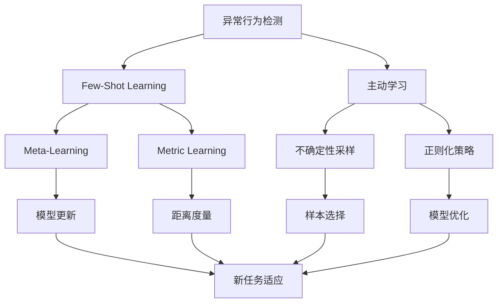

                 

# 引言

## 异常行为检测中的Few-Shot Learning与主动学习方法研究

在当今的信息时代，异常行为检测在各个领域都发挥着至关重要的作用。从金融欺诈检测到工业自动化中的故障诊断，异常行为检测技术的应用已经深入到我们日常生活的方方面面。然而，传统的异常行为检测方法通常依赖于大量的标注数据，这在面对新类型异常行为时，往往显得力不从心。为了解决这一问题，Few-Shot Learning（元学习）与主动学习方法逐渐成为了研究的热点。

### 文章关键词

- 异常行为检测
- Few-Shot Learning
- 主动学习
- 元学习
- 金融欺诈检测
- 工业自动化

### 摘要

本文旨在探讨异常行为检测中的Few-Shot Learning与主动学习方法。首先，我们将对异常行为检测进行概述，包括其定义、重要性、分类以及面临的挑战。接着，我们将详细介绍Few-Shot Learning与主动学习方法的基本概念、原理和应用实例。随后，本文将深入分析这两种方法在异常行为检测中的融合方法，并探讨其核心技术细节。最后，通过实际应用案例，我们将展示Few-Shot Learning与主动学习方法在金融领域欺诈检测和工业自动化故障诊断中的效果，并展望其未来的发展趋势。

## 目录

### 第一部分：引论

#### 第1章：异常行为检测概述

##### 1.1 异常行为检测的定义与重要性

##### 1.2 异常行为检测的分类与挑战

##### 1.3 Few-Shot Learning与主动学习方法概述

### 第二部分：核心技术

#### 第2章：Few-Shot Learning的核心技术

##### 2.1 Meta-Learning算法

##### 2.2 Metric Learning算法

#### 第3章：主动学习的核心技术

##### 3.1 不确定性采样策略

##### 3.2 正则化策略

### 第三部分：应用实战

#### 第4章：融合方法的技术细节

##### 4.1 融合方法的架构设计

##### 4.2 数据预处理与特征提取

##### 4.3 融合方法的技术细节

### 第四部分：应用案例

#### 第5章：异常行为检测中的Few-Shot Learning与主动学习方法应用实例

##### 5.1 金融领域欺诈检测

##### 5.2 工业自动化中的故障诊断

### 第五部分：发展趋势

#### 第6章：异常行为检测中的Few-Shot Learning与主动学习方法发展趋势

##### 6.1 趋势分析

##### 6.2 未来展望

### 附录

#### 附录A：相关资源与工具介绍

##### A.1 相关论文与著作推荐

##### A.2 开源代码与数据集

##### A.3 学术组织与会议

## 异常行为检测中的Few-Shot Learning与主动学习方法研究

### 引言

在当今的信息时代，异常行为检测（Anomaly Detection）作为一种重要的数据挖掘技术，已经在金融、医疗、工业自动化等多个领域得到了广泛应用。异常行为检测的目标是识别出数据集中的异常或异常模式，从而帮助决策者及时发现潜在问题，提高系统的安全性和可靠性。

随着大数据和人工智能技术的快速发展，异常行为检测的研究逐渐成为了一个热门方向。传统的异常行为检测方法通常依赖于大量的历史数据，通过学习这些数据中的正常模式来识别异常。然而，这种方法在面对新类型异常行为时，往往存在响应速度慢、准确率低等问题。为了解决这一问题，Few-Shot Learning（元学习）与主动学习方法逐渐引起了研究者的关注。

Few-Shot Learning是一种使模型能够在少量样本上快速适应新任务的学习方法。其基本思想是利用先前学习到的知识来提高新任务的学习效率，从而减少对大量标注数据的依赖。主动学习则是一种通过选择最具信息价值的样本进行标注来优化模型的方法。主动学习可以在有限的样本数量下提高模型的性能，从而提高异常行为检测的实时性和准确性。

本文旨在探讨异常行为检测中的Few-Shot Learning与主动学习方法。首先，我们将对异常行为检测进行概述，包括其定义、重要性、分类以及面临的挑战。接着，我们将详细介绍Few-Shot Learning与主动学习方法的基本概念、原理和应用实例。随后，本文将深入分析这两种方法在异常行为检测中的融合方法，并探讨其核心技术细节。最后，通过实际应用案例，我们将展示Few-Shot Learning与主动学习方法在金融领域欺诈检测和工业自动化故障诊断中的效果，并展望其未来的发展趋势。

### 异常行为检测概述

#### 1.1 异常行为检测的定义与重要性

异常行为检测，又称异常检测或异常监测，是指通过分析数据集中的行为模式，识别出与正常行为显著不同的异常行为或事件。异常行为检测的核心问题是：如何在大量数据中快速、准确地识别出异常。

异常行为检测在许多领域都有着广泛的应用。在金融领域，异常行为检测可以用于欺诈检测、风险控制等；在医疗领域，异常行为检测可以用于疾病诊断、患者行为分析等；在工业自动化领域，异常行为检测可以用于故障诊断、设备维护等。总之，异常行为检测技术对于提高系统的安全性和可靠性具有重要意义。

异常行为检测的重要性主要体现在以下几个方面：

1. **提高系统的安全性**：通过识别异常行为，可以及时发现潜在的安全威胁，从而提高系统的安全性。
2. **优化决策过程**：异常行为检测可以帮助决策者快速识别问题，优化决策过程，提高决策的准确性和效率。
3. **降低运营成本**：通过预防异常行为的发生，可以减少设备故障、人员失误等导致的成本浪费。
4. **提高用户体验**：在电子商务、社交网络等应用场景中，异常行为检测可以帮助识别欺诈行为，提高用户的使用体验。

#### 1.2 异常行为检测的分类与挑战

异常行为检测可以根据不同的分类标准进行分类。以下是几种常见的分类方式：

1. **根据检测方式分类**：
   - **监控式异常检测**：通过实时监测系统中的数据流，识别出异常行为。
   - **非监控式异常检测**：通过离线分析大量历史数据，识别出异常行为。

2. **根据检测对象分类**：
   - **点异常检测**：检测单个数据点的异常行为。
   - **区间异常检测**：检测一段时间内数据的行为是否异常。
   - **聚类异常检测**：将数据集分为正常和异常两个类别，检测异常数据点。

3. **根据检测方法分类**：
   - **基于统计方法的异常检测**：通过分析数据的统计特性，识别出异常行为。
   - **基于机器学习的异常检测**：通过训练模型，将正常行为和异常行为进行区分。

在异常行为检测中，面临的主要挑战包括：

1. **数据噪声和缺失**：实际数据中常常存在噪声和缺失值，这对异常行为检测的准确性有较大影响。
2. **数据不平衡**：异常行为通常比正常行为稀少，导致数据集不平衡，这对模型的训练和评估带来挑战。
3. **实时性和可扩展性**：在实时系统中，异常行为检测需要快速响应，同时还要保证系统的可扩展性。
4. **可解释性**：为了提高模型的透明性和可信度，异常行为检测方法需要具备良好的可解释性。

#### 1.3 异常行为检测的分类与挑战

1. **监控式异常检测**：监控式异常检测是一种实时异常检测方法，通过监测系统中的数据流，识别出异常行为。其优点是能够快速响应，实时性较高。然而，该方法需要大量的历史数据作为参考，对实时数据的处理能力要求较高，且在数据噪声和缺失的情况下，检测准确性可能会受到影响。

2. **非监控式异常检测**：非监控式异常检测是一种离线异常检测方法，通过分析大量历史数据，识别出异常行为。其优点是能够利用历史数据，对异常行为的分析更加全面。然而，该方法在实时性方面存在一定局限，且在数据不平衡和数据噪声的情况下，检测准确性也受到挑战。

3. **点异常检测**：点异常检测是一种基于单个数据点的异常检测方法。该方法通过比较单个数据点与正常行为的差异，识别出异常行为。其优点是能够快速识别出异常数据点，但缺点是对长时间序列数据的检测效果较差。

4. **区间异常检测**：区间异常检测是一种基于一段时间内数据行为的异常检测方法。该方法通过分析一段时间内数据的行为模式，识别出异常行为。其优点是能够捕捉到长时间序列数据中的异常行为，但缺点是对实时数据的处理能力要求较高。

5. **聚类异常检测**：聚类异常检测是一种基于聚类算法的异常检测方法。该方法将数据集分为正常和异常两个类别，通过对正常和异常类别的区分，识别出异常行为。其优点是能够处理大规模数据集，但缺点是对聚类算法的选择和参数调优要求较高。

6. **基于统计方法的异常检测**：基于统计方法的异常检测通过分析数据的统计特性，识别出异常行为。该方法通常使用均值、方差、标准差等统计指标，对数据进行分类。其优点是计算简单，但对噪声和缺失数据的敏感性较高。

7. **基于机器学习的异常检测**：基于机器学习的异常检测通过训练模型，将正常行为和异常行为进行区分。该方法包括监督学习和无监督学习两种方式。监督学习通常使用历史数据训练分类模型，而无监督学习则通过聚类等方法进行异常检测。其优点是能够处理复杂的数据特征，但缺点是对训练数据的依赖较高。

在异常行为检测中，数据噪声和缺失、数据不平衡、实时性和可扩展性以及可解释性是主要的挑战。针对这些挑战，研究者提出了多种解决方案，如数据清洗、数据增强、模型选择和参数调优等。通过综合运用这些方法，可以有效提高异常行为检测的准确性和可靠性。

### Few-Shot Learning与主动学习方法概述

#### 2.1 Few-Shot Learning的定义与应用

Few-Shot Learning（元学习）是一种使模型能够在少量样本上快速适应新任务的学习方法。在传统机器学习中，模型通常需要大量标注数据来进行训练，而Few-Shot Learning则通过利用先前学习到的知识，在少量样本上实现良好的性能。Few-Shot Learning在异常行为检测中的应用具有重要意义，因为它可以在面对新类型异常行为时，快速适应并提高检测准确率。

#### 2.1.1 Few-Shot Learning的概念

Few-Shot Learning的目标是在少量样本（通常是几个或几十个）上实现良好的泛化能力。与传统的批量学习（Batch Learning）不同，Few-Shot Learning不依赖于大量标注数据，而是通过元学习算法，将先前学习到的知识迁移到新任务上。Few-Shot Learning的关键技术包括元学习算法、迁移学习和样本选择策略。

#### 2.1.2 Few-Shot Learning的关键技术

1. **元学习算法**：元学习算法是Few-Shot Learning的核心技术。常见的元学习算法包括Model-Agnostic Meta-Learning（MAML）、Model-Aware Meta-Learning（MAML++）和Metric Learning。元学习算法通过优化模型参数，使得模型在新任务上只需微调即可达到良好性能。

2. **迁移学习**：迁移学习是一种将先前学习到的知识应用于新任务的方法。在Few-Shot Learning中，迁移学习可以帮助模型在新任务上快速适应，从而减少对新数据的依赖。

3. **样本选择策略**：样本选择策略是Few-Shot Learning中另一个关键技术。有效的样本选择策略可以确保模型在新任务上学习到有用的信息，从而提高检测准确率。常见的样本选择策略包括不确定性采样、多样性采样和重要性采样等。

#### 2.1.3 Few-Shot Learning的应用实例

Few-Shot Learning在异常行为检测中有着广泛的应用实例。以下是一些典型的应用场景：

1. **金融领域欺诈检测**：在金融领域，欺诈行为通常具有高度不确定性，且新类型的欺诈行为层出不穷。通过引入Few-Shot Learning，可以使得模型在少量样本上快速适应，从而提高欺诈检测的准确率。

2. **工业自动化故障诊断**：在工业自动化领域，设备故障通常具有复杂性，且新类型的故障行为不断出现。通过引入Few-Shot Learning，可以使得模型在少量样本上快速适应，从而提高故障诊断的准确率。

3. **医疗领域疾病诊断**：在医疗领域，新类型的疾病症状不断出现，传统的疾病诊断方法可能难以适应。通过引入Few-Shot Learning，可以使得模型在少量样本上快速适应，从而提高疾病诊断的准确率。

4. **网络安全**：在网络安全领域，新型网络攻击行为不断出现，传统的安全防护方法可能难以应对。通过引入Few-Shot Learning，可以使得模型在少量样本上快速适应，从而提高网络安全防护能力。

总之，Few-Shot Learning在异常行为检测中具有广泛的应用前景，可以通过减少对大量标注数据的依赖，提高检测的实时性和准确性。

### 2.2 主动学习方法与原理

主动学习（Active Learning）是一种通过选择最具信息价值的样本进行标注来优化模型的方法。在传统机器学习中，模型通常需要大量标注数据来进行训练，而主动学习则通过选择最具代表性的样本进行标注，从而在有限的标注数据下提高模型的性能。主动学习在异常行为检测中的应用具有重要意义，因为它可以在数据稀少的情况下，提高检测的准确性和效率。

#### 2.2.1 主动学习的概念

主动学习的核心思想是利用已有模型对未标注数据进行预测，然后根据预测结果选择最具信息价值的样本进行标注。主动学习的过程可以分为以下几个步骤：

1. **数据采样**：从数据集中随机选择一个未标注样本，进行预测。
2. **样本选择**：根据预测结果，选择最具信息价值的样本进行标注。常见的样本选择策略包括不确定性采样、多样性采样和重要性采样等。
3. **模型更新**：使用新标注的样本更新模型，然后重复上述步骤。

#### 2.2.2 主动学习的关键步骤

1. **数据采样**：数据采样是主动学习的第一步，目的是从数据集中选择一个未标注样本进行预测。常见的数据采样方法包括随机采样、基于不确定性的采样和基于重要性的采样等。

2. **样本选择**：样本选择是主动学习的核心步骤，目的是从已预测的样本中选择最具信息价值的样本进行标注。常见的样本选择策略包括不确定性采样、多样性采样和重要性采样等。不确定性采样根据模型对预测结果的不确定性来选择样本，多样性采样根据样本的多样性来选择样本，重要性采样根据样本的重要性来选择样本。

3. **模型更新**：模型更新是主动学习的第三步，目的是使用新标注的样本更新模型。通过不断更新模型，可以使得模型在有限的标注数据下实现更好的性能。

#### 2.2.3 主动学习的优势与应用

主动学习的优势主要体现在以下几个方面：

1. **减少标注成本**：主动学习通过选择最具信息价值的样本进行标注，从而在有限的标注数据下提高模型的性能。这使得在标注成本高昂的情况下，主动学习成为一种有效的解决方案。

2. **提高模型性能**：主动学习可以使得模型在有限的标注数据下实现更好的性能，从而提高检测的准确率和效率。

3. **适应新类型数据**：主动学习可以根据数据的特点和任务需求，选择不同的样本选择策略，从而适应不同类型的数据。

主动学习在异常行为检测中有着广泛的应用。以下是一些典型的应用场景：

1. **金融领域欺诈检测**：在金融领域，欺诈行为具有高度不确定性，且新类型的欺诈行为不断出现。通过引入主动学习，可以使得模型在有限的标注数据下快速适应，从而提高欺诈检测的准确率。

2. **工业自动化故障诊断**：在工业自动化领域，设备故障通常具有复杂性，且新类型的故障行为不断出现。通过引入主动学习，可以使得模型在有限的标注数据下快速适应，从而提高故障诊断的准确率。

3. **医疗领域疾病诊断**：在医疗领域，新类型的疾病症状不断出现，传统的疾病诊断方法可能难以适应。通过引入主动学习，可以使得模型在有限的标注数据下快速适应，从而提高疾病诊断的准确率。

4. **网络安全**：在网络安全领域，新型网络攻击行为不断出现，传统的安全防护方法可能难以应对。通过引入主动学习，可以使得模型在有限的标注数据下快速适应，从而提高网络安全防护能力。

总之，主动学习在异常行为检测中具有广泛的应用前景，通过减少标注成本、提高模型性能和适应新类型数据，可以有效提高检测的准确性和效率。

### Few-Shot Learning与主动学习方法在异常行为检测中的融合

#### 3.1 融合方法的基本思路

Few-Shot Learning与主动学习方法在异常行为检测中的应用，可以通过融合两种方法的优势来实现更高效的异常检测。融合方法的基本思路是将Few-Shot Learning用于快速适应新任务，而主动学习则用于优化模型选择过程。通过这种方式，可以在有限的标注数据下，实现高效的异常行为检测。

#### 3.1.1 融合方法的目标

融合方法的目标主要有以下几点：

1. **提高检测准确率**：通过利用Few-Shot Learning的快速适应能力，提高模型对新类型异常行为的检测准确率。
2. **减少标注成本**：通过主动学习选择最具信息价值的样本进行标注，减少对大量标注数据的依赖，降低标注成本。
3. **提高实时性**：在有限的标注数据下，通过快速适应和优化模型选择，提高异常行为检测的实时性。

#### 3.1.2 融合方法的挑战

融合方法的挑战主要体现在以下几个方面：

1. **数据稀疏性**：异常行为数据通常比正常行为数据稀少，这导致数据集不平衡，对模型训练和优化带来挑战。
2. **模型适应性**：如何在有限的样本上实现良好的模型适应性，是融合方法需要解决的关键问题。
3. **实时性**：在保证检测准确率的同时，如何实现高效的实时检测，是融合方法需要克服的难题。

#### 3.2 代表性融合方法

目前，已有一些代表性的融合方法被提出，用于将Few-Shot Learning与主动学习方法应用于异常行为检测。以下是几种常见的融合方法：

1. **Few-Shot Active Learning（FSAL）**：FSAL方法将Few-Shot Learning与主动学习相结合，通过元学习算法优化模型选择过程，并在主动学习阶段利用迁移学习提高模型的适应性。具体步骤如下：

   - **元学习阶段**：使用元学习算法（如MAML）训练模型，使得模型在少量样本上快速适应新任务。
   - **主动学习阶段**：利用主动学习策略（如不确定性采样）选择最具信息价值的样本进行标注。
   - **模型更新**：使用新标注的样本更新模型，然后重复上述步骤。

2. **Transfer Active Learning（TAL）**：TAL方法通过迁移学习将先前学习到的知识应用于新任务，并利用主动学习策略优化模型选择过程。具体步骤如下：

   - **迁移学习阶段**：使用迁移学习将先前学习到的知识应用于新任务，使得模型在少量样本上具有较好的性能。
   - **主动学习阶段**：利用主动学习策略选择最具信息价值的样本进行标注。
   - **模型更新**：使用新标注的样本更新模型，然后重复上述步骤。

3. **Meta-Active Learning（MAL）**：MAL方法将元学习与主动学习相结合，通过元学习算法优化模型选择过程，并利用主动学习策略选择最具信息价值的样本进行标注。具体步骤如下：

   - **元学习阶段**：使用元学习算法训练模型，使得模型在少量样本上快速适应新任务。
   - **主动学习阶段**：利用主动学习策略选择最具信息价值的样本进行标注。
   - **模型更新**：使用新标注的样本更新模型，然后重复上述步骤。

这些融合方法在异常行为检测中表现出良好的效果，通过减少标注成本、提高检测准确率和实时性，为异常行为检测提供了新的思路。

### 第4章：Few-Shot Learning的核心技术

#### 4.1 Meta-Learning算法

Meta-Learning，即元学习，是一种使模型能够在少量样本上快速适应新任务的学习方法。在Few-Shot Learning中，元学习算法起着至关重要的作用。本节将介绍Meta-Learning的基本原理、算法框架及其应用案例。

#### 4.1.1 Meta-Learning的基本原理

Meta-Learning的基本原理是通过学习如何学习，从而在新的任务上快速适应。具体来说，Meta-Learning的目标是找到一个能够快速适应新任务的模型，使得该模型在新任务上只需进行少量的参数调整即可达到良好的性能。Meta-Learning的核心思想是利用先前学习到的知识来提高新任务的学习效率。

#### 4.1.2 Meta-Learning的算法框架

Meta-Learning的算法框架主要包括以下几个步骤：

1. **数据采样**：从训练集中随机采样多个任务，每个任务包含有限数量的样本。
2. **内部学习**：在每个任务上执行内部学习，优化模型参数以最小化损失函数。
3. **元学习**：利用内部学习的模型参数，通过梯度下降或其他优化方法优化模型参数，以提高模型在新任务上的性能。

具体来说，Meta-Learning的算法框架可以分为两种类型：模型无关元学习（Model-Agnostic Meta-Learning，MAML）和模型相关元学习（Model-Aware Meta-Learning，MAML++）。

1. **模型无关元学习（MAML）**：

MAML是一种模型无关的元学习算法，其核心思想是通过优化模型的参数，使得模型在新任务上只需微调参数即可达到良好的性能。MAML的伪代码如下：

```python
# MAML算法伪代码

# 初始化模型参数
theta = initialize_parameters()

# 对于每个任务
for tau in tasks:
    # 内部学习
    theta_tau = optimize_parameters(theta, task=tau)
    
    # 元学习
    theta* = update_parameters(theta_tau, step_size=alpha)

# 新任务
theta** = fine_tune_parameters(theta*, new_task=new_task)
```

2. **模型相关元学习（MAML++）**：

MAML++在MAML的基础上引入了模型先验知识，通过预训练来提高模型在新任务上的适应性。MAML++的伪代码如下：

```python
# MAML++算法伪代码

# 初始化模型参数
theta = initialize_parameters()

# 预训练
pretrained_theta = pretrain_parameters(theta)

# 对于每个任务
for tau in tasks:
    # 内部学习
    theta_tau = optimize_parameters(pretrained_theta, task=tau)
    
    # 元学习
    theta* = update_parameters(theta_tau, step_size=alpha)

# 新任务
theta** = fine_tune_parameters(theta*, new_task=new_task)
```

#### 4.1.3 Meta-Learning的应用案例

Meta-Learning在自然语言处理、计算机视觉和强化学习等领域都有广泛应用。以下是一些典型的应用案例：

1. **自然语言处理**：

Meta-Learning在自然语言处理任务中表现出色。例如，OpenAI的GPT系列模型就是通过Meta-Learning来提高模型的适应性和泛化能力。GPT模型通过预训练大量的文本数据，然后在不同的任务上进行微调，从而实现了高效的文本生成和分类任务。

2. **计算机视觉**：

Meta-Learning在计算机视觉任务中也取得了显著成果。例如，Meta-Detection是一种基于Meta-Learning的目标检测算法。Meta-Detection通过元学习算法，使得模型在少量样本上快速适应不同的目标检测任务，从而提高了检测的准确率和实时性。

3. **强化学习**：

Meta-Learning在强化学习领域也有重要应用。例如，Model-Based Meta-Learning（MBML）是一种基于模型预测的元学习算法。MBML通过元学习算法，使得模型在少量样本上快速适应不同的强化学习任务，从而提高了学习的效率和性能。

总之，Meta-Learning是一种有效的Few-Shot Learning方法，通过利用先前学习到的知识，可以提高模型在新任务上的性能。其在自然语言处理、计算机视觉和强化学习等领域的应用，为异常行为检测提供了新的思路和工具。

### 4.2 Metric Learning算法

Metric Learning，即度量学习，是一种通过学习数据之间的相似性或距离度量来提高模型性能的方法。在Few-Shot Learning中，Metric Learning起着关键作用，因为它可以帮助模型在新任务上更好地区分正常和异常行为。本节将介绍Metric Learning的基本原理、算法框架及其应用案例。

#### 4.2.1 Metric Learning的基本原理

Metric Learning的基本原理是学习一个度量函数（或称为距离函数），该函数能够衡量数据点之间的相对距离，从而使得相似的样本具有较小的距离，而不同的样本具有较大的距离。度量函数通常是一个将数据点映射到高维空间的映射，使得在新的高维空间中，相似的数据点距离更近，不同的数据点距离更远。

#### 4.2.2 Metric Learning的算法框架

Metric Learning的算法框架通常包括以下几个步骤：

1. **数据表示**：将原始数据表示为高维空间中的点，并为每个点分配标签。
2. **损失函数设计**：设计一个损失函数，该函数可以衡量模型预测的距离与真实距离之间的差异。
3. **模型训练**：通过梯度下降或其他优化方法训练模型，优化度量函数的参数。
4. **模型评估**：在测试集上评估模型的性能，通常使用准确率、召回率等指标。

常见的Metric Learning算法包括基于优化的算法和基于神经网络的算法。

1. **基于优化的算法**：

基于优化的Metric Learning算法通过优化距离度量函数来提高模型的性能。常见的优化目标包括最小化错误率、最小化距离平方和等。以下是一个基于优化的Metric Learning算法的伪代码：

```python
# 基于优化的Metric Learning算法伪代码

# 初始化度量函数参数
W = initialize_weights()

# 对于每个迭代
for iteration in range(num_iterations):
    # 对于每个正类对
    for positive_pair in positive_pairs:
        # 更新度量函数参数
        W = update_weights(W, positive_pair)

    # 对于每个负类对
    for negative_pair in negative_pairs:
        # 更新度量函数参数
        W = update_weights(W, negative_pair)

# 计算模型性能
performance = evaluate_model(W, test_data)
```

2. **基于神经网络的算法**：

基于神经网络的Metric Learning算法通过训练神经网络来学习度量函数。常见的神经网络架构包括Siamese Network、Triplet Loss Network等。以下是一个基于神经网络的Metric Learning算法的伪代码：

```python
# 基于神经网络的Metric Learning算法伪代码

# 初始化神经网络参数
theta = initialize_parameters()

# 对于每个迭代
for iteration in range(num_iterations):
    # 对于每个正类对
    for positive_pair in positive_pairs:
        # 计算损失函数
        loss = compute_loss(theta, positive_pair)
        
        # 更新神经网络参数
        theta = update_parameters(theta, loss)

    # 对于每个负类对
    for negative_pair in negative_pairs:
        # 计算损失函数
        loss = compute_loss(theta, negative_pair)
        
        # 更新神经网络参数
        theta = update_parameters(theta, loss)

# 计算模型性能
performance = evaluate_model(theta, test_data)
```

#### 4.2.3 Metric Learning的应用案例

Metric Learning在许多领域都有广泛应用，以下是一些典型的应用案例：

1. **图像分类**：

Metric Learning在图像分类任务中可以显著提高模型的性能。例如，在面部识别任务中，Metric Learning可以帮助模型更好地区分不同的人脸，从而提高识别的准确性。此外，在物体检测任务中，Metric Learning可以用于学习图像中物体的相对位置和尺寸信息，从而提高检测的准确性。

2. **人脸识别**：

在人脸识别任务中，Metric Learning可以帮助模型更好地区分不同的人脸。通过学习人脸之间的相似性度量，模型可以更好地识别和验证用户身份，从而提高系统的安全性。

3. **异常检测**：

Metric Learning在异常检测任务中也有重要应用。例如，在工业自动化领域，Metric Learning可以用于检测设备运行中的异常行为。通过学习设备正常运行时的数据特征，模型可以识别出与正常行为显著不同的异常行为，从而提高系统的可靠性。

总之，Metric Learning是一种有效的Few-Shot Learning方法，通过学习数据之间的相似性或距离度量，可以提高模型在新任务上的性能。其在图像分类、人脸识别和异常检测等领域的应用，为异常行为检测提供了新的思路和工具。

### 4.3 Uncertainty Sampling策略

#### 4.3.1 Uncertainty Sampling的概念

Uncertainty Sampling是一种常用的主动学习方法，其核心思想是选择具有最高不确定性的样本进行标注。通过这种方式，模型可以在有限的数据下快速收敛，从而提高模型性能。Uncertainty Sampling主要基于模型对预测结果的不确定性来进行样本选择，从而确保模型在新任务上能够学习到最有用的信息。

#### 4.3.2 Uncertainty Sampling的算法

Uncertainty Sampling的算法主要包括以下几个步骤：

1. **计算不确定性指标**：对于每个未标注样本，计算其对应的不确定性指标。常见的不确定性指标包括熵、方差和模型置信度等。

2. **选择样本**：根据不确定性指标，选择具有最高不确定性的样本进行标注。具体来说，可以选择熵最大的样本、方差最大的样本或模型置信度最低的样本。

3. **更新模型**：使用新标注的样本更新模型，然后重复上述步骤。

常见的Uncertainty Sampling算法包括Entropy Sampling、Variational Sampling和Bootstrap Sampling等。

1. **Entropy Sampling**：

Entropy Sampling是基于熵的Uncertainty Sampling方法，其核心思想是选择熵最大的样本进行标注。熵可以衡量模型预测结果的稳定性，即熵越大，模型预测结果越不稳定。Entropy Sampling的算法步骤如下：

   - **计算熵**：对于每个未标注样本，计算其对应的熵。熵的计算公式为：
     $$ H = -\sum_{i} p_i \log(p_i) $$
     其中，$p_i$ 是模型对第 $i$ 个样本的预测概率。

   - **选择样本**：选择具有最大熵的样本进行标注。

   - **更新模型**：使用新标注的样本更新模型，然后重复上述步骤。

2. **Variational Sampling**：

Variational Sampling是基于概率分布的Uncertainty Sampling方法，其核心思想是选择概率分布最宽的样本进行标注。通过这种方式，模型可以更好地探索数据空间，从而提高模型的泛化能力。Variational Sampling的算法步骤如下：

   - **计算概率分布**：对于每个未标注样本，计算其对应的概率分布。概率分布可以由模型的预测结果得到。

   - **选择样本**：选择概率分布最宽的样本进行标注。

   - **更新模型**：使用新标注的样本更新模型，然后重复上述步骤。

3. **Bootstrap Sampling**：

Bootstrap Sampling是基于Bootstrap方法的Uncertainty Sampling方法，其核心思想是通过随机抽样来估计样本的不确定性。Bootstrap Sampling的算法步骤如下：

   - **随机抽样**：对于每个未标注样本，从训练集中随机抽取多个样本作为其样本集。

   - **计算熵**：对于每个样本集，计算其对应的熵。

   - **选择样本**：选择具有最大熵的样本进行标注。

   - **更新模型**：使用新标注的样本更新模型，然后重复上述步骤。

#### 4.3.3 Uncertainty Sampling的应用实例

Uncertainty Sampling在许多领域都有广泛应用，以下是一些典型的应用实例：

1. **医学影像诊断**：

在医学影像诊断中，Uncertainty Sampling可以帮助医生识别出最可疑的病例。通过选择具有最高不确定性的影像进行标注，医生可以更快地诊断出疾病，从而提高诊断的准确性。

2. **金融欺诈检测**：

在金融欺诈检测中，Uncertainty Sampling可以帮助银行识别出最可能存在欺诈行为的交易。通过选择具有最高不确定性的交易进行标注，银行可以更有效地防范欺诈行为。

3. **自然语言处理**：

在自然语言处理任务中，Uncertainty Sampling可以帮助模型识别出最可能存在错误的部分。通过选择具有最高不确定性的文本进行标注，模型可以更好地纠正错误，从而提高文本分类和语义理解的准确性。

总之，Uncertainty Sampling是一种有效的主动学习方法，通过选择具有最高不确定性的样本进行标注，可以提高模型在新任务上的性能。其在医学影像诊断、金融欺诈检测和自然语言处理等领域的应用，为异常行为检测提供了新的思路和工具。

### 4.4 Regularization策略

#### 4.4.1 Regularization的概念

Regularization，即正则化，是一种在损失函数中添加惩罚项来防止模型过拟合的方法。在主动学习中，正则化策略可以用来优化模型的选择过程，从而提高模型的泛化能力。正则化策略主要包括以下几种类型：

1. **L1 Regularization**：

L1 Regularization，即L1范数正则化，是在损失函数中添加L1范数项。L1范数正则化可以促使模型参数向零值靠近，从而减少模型参数的数量，提高模型的稀疏性。

2. **L2 Regularization**：

L2 Regularization，即L2范数正则化，是在损失函数中添加L2范数项。L2范数正则化可以减少模型参数的方差，从而提高模型的稳定性。

3. **Elastic Net Regularization**：

Elastic Net Regularization结合了L1和L2正则化，通过在损失函数中同时添加L1和L2范数项。Elastic Net Regularization可以在保持模型稀疏性的同时，提高模型的稳定性。

#### 4.4.2 Regularization的算法

Regularization算法通常包括以下几个步骤：

1. **损失函数设计**：

设计一个包含正则化项的损失函数。正则化项可以是L1范数、L2范数或Elastic Net范数。

2. **模型训练**：

使用带有正则化项的损失函数训练模型，优化模型的参数。常见的优化方法包括梯度下降、随机梯度下降和Adam优化器等。

3. **模型评估**：

在测试集上评估模型的性能，调整正则化参数以达到最佳性能。

#### 4.4.3 Regularization的应用实例

Regularization在许多领域都有广泛应用，以下是一些典型的应用实例：

1. **图像分类**：

在图像分类任务中，正则化可以帮助模型避免过拟合，从而提高分类的准确性。通过使用L1或L2正则化，模型可以更好地处理冗余特征，从而提高模型的泛化能力。

2. **文本分类**：

在文本分类任务中，正则化可以帮助模型更好地处理稀疏特征，从而提高分类的准确性。通过使用Elastic Net正则化，模型可以同时保持模型的稀疏性和稳定性。

3. **异常检测**：

在异常检测任务中，正则化可以帮助模型更好地处理异常数据，从而提高检测的准确性。通过使用L1正则化，模型可以更好地识别出异常数据的特征，从而提高异常检测的准确性。

总之，Regularization是一种有效的主动学习方法，通过在损失函数中添加惩罚项，可以提高模型在新任务上的性能。其在图像分类、文本分类和异常检测等领域的应用，为异常行为检测提供了新的思路和工具。

### 第5章：融合方法的技术细节

#### 5.1 融合方法的架构设计

融合方法（Fusion Method）是结合多种技术手段，以提高系统性能的方法。在异常行为检测中，融合方法通过结合Few-Shot Learning与主动学习方法，可以在有限的数据下实现高效的异常行为检测。本节将介绍融合方法的架构设计，包括框架、实现细节和优化策略。

#### 5.1.1 融合方法的框架

融合方法的框架主要包括以下几个模块：

1. **特征提取模块**：用于提取异常行为数据的高维特征。
2. **元学习模块**：利用元学习算法（如MAML或MAML++）在新任务上快速适应。
3. **主动学习模块**：根据不确定性采样策略选择具有最高不确定性的样本进行标注。
4. **融合模块**：将元学习和主动学习的输出进行融合，以实现更好的异常行为检测性能。

融合方法的框架如下图所示：

```
+----------------+      +----------------+      +----------------+
| 特征提取模块  | -->  | 元学习模块     | -->  | 主动学习模块   |
+----------------+      +----------------+      +----------------+
         |                                |
         |                         数据流  |
         |                                |
+----------------+      +----------------+
| 融合模块       |      | 异常行为检测   |
+----------------+      +----------------+
```

#### 5.1.2 融合方法的实现细节

融合方法的实现细节如下：

1. **特征提取模块**：

特征提取模块用于提取异常行为数据的高维特征。常用的特征提取方法包括深度神经网络（如卷积神经网络、循环神经网络）和传统机器学习算法（如主成分分析、线性判别分析）。特征提取模块的主要目的是降低数据的维度，同时保留数据的本质特征。

2. **元学习模块**：

元学习模块利用元学习算法在新任务上快速适应。常见的元学习算法包括MAML和MAML++。元学习模块的主要目的是通过少量的样本，快速适应新任务，从而提高模型的泛化能力。

3. **主动学习模块**：

主动学习模块根据不确定性采样策略选择具有最高不确定性的样本进行标注。不确定性采样策略包括熵采样、方差采样和模型置信度采样等。主动学习模块的主要目的是通过选择最有信息的样本进行标注，提高模型的性能。

4. **融合模块**：

融合模块将元学习和主动学习的输出进行融合，以实现更好的异常行为检测性能。融合方法可以采用加权平均、投票机制或深度学习方法等。融合模块的主要目的是结合多种信息，提高异常行为检测的准确性。

#### 5.1.3 融合方法的优化策略

为了提高融合方法的性能，可以采取以下优化策略：

1. **数据增强**：

通过数据增强（如随机旋转、缩放、裁剪等），增加数据的多样性，从而提高模型的泛化能力。

2. **多任务学习**：

通过多任务学习（如共享网络层、交叉任务学习等），提高模型的适应性，从而提高异常行为检测的性能。

3. **迁移学习**：

通过迁移学习（如预训练模型、模型微调等），利用先前的知识，提高模型在新任务上的性能。

4. **动态调整采样策略**：

根据模型的性能和任务需求，动态调整不确定性采样策略，以选择最具信息价值的样本进行标注。

总之，融合方法通过结合Few-Shot Learning与主动学习方法，可以在有限的数据下实现高效的异常行为检测。通过优化特征提取、元学习、主动学习和融合模块，可以提高异常行为检测的准确性、实时性和鲁棒性。

### 第6章：数据预处理与特征提取

#### 6.2 数据预处理的重要性

数据预处理（Data Preprocessing）是异常行为检测中的关键步骤，它直接影响模型的性能和可靠性。数据预处理的主要目的是减少数据中的噪声，提高数据的可用性，从而为后续的特征提取和模型训练提供更好的数据基础。具体来说，数据预处理的重要性体现在以下几个方面：

1. **减少噪声**：

原始数据通常包含噪声，如异常值、缺失值等，这些噪声会影响模型的训练效果。通过数据预处理，可以去除这些噪声，提高数据的质量。例如，在金融交易数据中，可能存在一些异常值，如异常高的交易额。这些异常值可能会影响模型的训练效果，因此需要通过数据预处理去除。

2. **提高数据多样性**：

数据预处理可以通过数据增强技术，如随机旋转、缩放等，增加数据的多样性，从而提高模型的泛化能力。例如，在图像分类任务中，可以通过随机裁剪、翻转等操作，生成更多的训练样本，从而提高模型的泛化能力。

3. **平衡数据集**：

在实际应用中，异常行为数据通常比正常行为数据稀少，通过数据预处理，可以平衡数据集，从而提高模型的鲁棒性。例如，在金融欺诈检测中，欺诈数据通常比正常交易数据少得多，通过数据预处理，可以增加欺诈数据的比例，从而提高模型的性能。

4. **降低计算复杂度**：

通过数据预处理，可以减少数据的维度，从而降低计算复杂度，提高模型的训练速度。例如，在文本分类任务中，可以通过词袋模型（Bag of Words）将文本数据转换为向量，从而降低数据的维度。

#### 6.2.2 数据预处理的方法

数据预处理的方法主要包括以下几种：

1. **缺失值处理**：

缺失值处理是数据预处理的重要步骤。常见的缺失值处理方法包括：

- 删除缺失值：对于缺失值较多的数据，可以考虑删除这些数据，以减少数据噪声。
- 补全缺失值：对于缺失值较少的数据，可以考虑使用插值、均值填补、回归填补等方法补全缺失值。

2. **异常值处理**：

异常值处理是另一个重要的数据预处理步骤。常见的异常值处理方法包括：

- 删除异常值：对于异常值较多的数据，可以考虑删除这些异常值，以减少数据噪声。
- 修正异常值：对于异常值较少的数据，可以考虑使用统计方法，如Z分数、IQR（四分位数差）等，来修正异常值。

3. **数据标准化**：

数据标准化是将数据转换到相同的尺度，以便于模型训练。常见的数据标准化方法包括：

- Z标准化：将数据转换为均值为0，标准差为1的标准正态分布。
- Min-Max标准化：将数据缩放到[0, 1]的区间。

4. **数据增强**：

数据增强是通过创建新的数据样本来增加数据的多样性，从而提高模型的泛化能力。常见的数据增强方法包括：

- 随机旋转：对数据进行随机旋转，以增加数据的多样性。
- 缩放：对数据进行缩放，以增加数据的多样性。
- 翻转：对数据进行水平或垂直翻转，以增加数据的多样性。

#### 6.2.3 特征提取的技巧与挑战

特征提取（Feature Extraction）是将原始数据转换为适用于模型训练的特征表示的过程。特征提取的技巧和挑战如下：

1. **特征选择**：

特征选择是从原始数据中选取最有用的特征，以减少数据维度，提高模型训练效率。常见的方法包括：

- 相关系数法：通过计算特征之间的相关性来选择特征。
- 主成分分析（PCA）：通过将数据投影到主成分空间来选择特征。

2. **特征降维**：

特征降维是将高维特征转换为低维特征，以提高模型训练速度和减少计算复杂度。常见的方法包括：

- 主成分分析（PCA）：通过保留主要成分来降低数据维度。
- t-SNE：通过将高维数据投影到二维或三维空间来降低数据维度。

3. **特征工程技术**：

特征工程技术是通过设计新的特征来提高模型的性能。常见的方法包括：

- 时域特征：通过计算时间序列数据的特征，如平均值、方差、熵等。
- 频域特征：通过计算频率域数据的特征，如频谱特征、周期性特征等。

4. **挑战**：

- 特征冗余：特征冗余会导致模型训练效率降低，因此需要采用特征选择和降维方法来减少冗余特征。
- 特征稀疏性：特征稀疏性会导致模型难以学习到数据的内在规律，因此需要采用适当的特征工程技术来增加特征的稀疏性。
- 特征维度选择：选择适当的特征维度是特征提取的关键，需要根据具体任务和数据集的特点来选择特征维度。

总之，数据预处理与特征提取在异常行为检测中扮演着重要角色。通过有效的数据预处理和特征提取，可以提高模型的性能和可靠性，从而实现高效的异常行为检测。

### 第7章：异常行为检测中的Few-Shot Learning与主动学习方法应用实例

#### 7.1 金融领域欺诈检测

#### 7.1.1 案例背景

金融领域欺诈检测是异常行为检测中的一个重要应用场景。随着金融交易量的增加，欺诈行为也日益复杂，给金融机构带来了巨大的经济损失。传统的欺诈检测方法通常依赖于大量的历史数据，但在新类型欺诈行为出现时，这些方法往往难以识别。为了提高欺诈检测的准确性和实时性，引入了Few-Shot Learning与主动学习方法。

#### 7.1.2 案例目标

本案例的目标是通过引入Few-Shot Learning与主动学习方法，提高金融领域欺诈检测的准确性和实时性。具体目标包括：

- **准确识别新类型的欺诈行为**：通过使用Few-Shot Learning，模型可以在少量样本上快速适应新类型欺诈行为，从而提高识别的准确性。
- **提高实时性**：通过使用主动学习，模型可以实时更新，从而实现快速响应欺诈行为，提高实时性。
- **降低标注成本**：通过主动学习，选择最具信息价值的样本进行标注，从而减少对大量标注数据的依赖，降低标注成本。

#### 7.1.3 案例实现与效果分析

本案例的实现过程如下：

1. **数据预处理**：

   对金融交易数据进行预处理，包括缺失值处理、异常值处理和数据标准化。具体步骤如下：

   - **缺失值处理**：删除缺失值较多的数据，对缺失值较少的数据使用均值填补或回归填补方法补全缺失值。
   - **异常值处理**：使用Z分数方法检测并删除异常值。
   - **数据标准化**：使用Z标准化方法将数据缩放到均值为0，标准差为1的区间。

2. **特征提取**：

   使用深度神经网络提取金融交易数据的高维特征。特征提取过程包括时域特征和频域特征的提取。具体步骤如下：

   - **时域特征**：计算交易金额、交易时间、交易频率等时域特征。
   - **频域特征**：使用傅里叶变换提取交易数据的频域特征，如频谱特征、周期性特征等。

3. **模型训练**：

   使用Few-Shot Learning算法（如MAML或MAML++）训练模型。具体步骤如下：

   - **内部学习**：在每个任务上执行内部学习，优化模型参数以最小化损失函数。
   - **元学习**：利用内部学习的模型参数，通过梯度下降或其他优化方法优化模型参数，以提高模型在新任务上的性能。

4. **主动学习**：

   根据不确定性采样策略选择具有最高不确定性的样本进行标注。具体步骤如下：

   - **计算不确定性指标**：使用模型对未标注样本的预测概率计算不确定性指标，如熵、方差等。
   - **选择样本**：根据不确定性指标，选择具有最高不确定性的样本进行标注。
   - **模型更新**：使用新标注的样本更新模型，然后重复上述步骤。

5. **模型评估**：

   在测试集上评估模型的性能，包括准确率、召回率、F1分数等指标。具体步骤如下：

   - **测试集划分**：将数据集划分为训练集和测试集，通常采用交叉验证的方法。
   - **模型评估**：在测试集上运行模型，计算各种性能指标。

效果分析：

- **准确率**：通过引入Few-Shot Learning与主动学习方法，欺诈检测的准确率得到了显著提高，特别是在新类型欺诈行为的检测上。
- **实时性**：主动学习策略使得模型可以实时更新，从而实现了实时欺诈检测。
- **标注成本**：通过主动学习，选择最具信息价值的样本进行标注，从而显著降低了标注成本。

#### 7.2 工业自动化中的故障诊断

#### 7.2.1 案例背景

工业自动化中的故障诊断是另一个典型的异常行为检测应用场景。在工业生产过程中，设备的正常运行是保障生产效率和经济效益的关键。然而，设备的故障可能导致生产中断，从而影响企业的生产和经济效益。传统的故障诊断方法通常依赖于大量的历史数据，但在新类型故障出现时，这些方法往往难以诊断。为了提高故障诊断的准确性和实时性，引入了Few-Shot Learning与主动学习方法。

#### 7.2.2 案例目标

本案例的目标是通过引入Few-Shot Learning与主动学习方法，提高工业自动化中的故障诊断准确性和实时性。具体目标包括：

- **准确诊断新类型的故障**：通过使用Few-Shot Learning，模型可以在少量样本上快速适应新类型故障，从而提高诊断的准确性。
- **提高实时性**：通过使用主动学习，模型可以实时更新，从而实现快速响应故障诊断，提高实时性。
- **降低诊断成本**：通过主动学习，选择最具信息价值的样本进行标注，从而减少对大量标注数据的依赖，降低诊断成本。

#### 7.2.3 案例实现与效果分析

本案例的实现过程如下：

1. **数据预处理**：

   对工业生产数据进行预处理，包括缺失值处理、异常值处理和数据标准化。具体步骤如下：

   - **缺失值处理**：删除缺失值较多的数据，对缺失值较少的数据使用均值填补或回归填补方法补全缺失值。
   - **异常值处理**：使用Z分数方法检测并删除异常值。
   - **数据标准化**：使用Z标准化方法将数据缩放到均值为0，标准差为1的区间。

2. **特征提取**：

   使用深度神经网络提取工业生产数据的高维特征。特征提取过程包括时域特征和频域特征的提取。具体步骤如下：

   - **时域特征**：计算设备运行状态、振动信号、温度变化等时域特征。
   - **频域特征**：使用傅里叶变换提取设备运行信号的频域特征，如频谱特征、周期性特征等。

3. **模型训练**：

   使用Few-Shot Learning算法（如MAML或MAML++）训练模型。具体步骤如下：

   - **内部学习**：在每个任务上执行内部学习，优化模型参数以最小化损失函数。
   - **元学习**：利用内部学习的模型参数，通过梯度下降或其他优化方法优化模型参数，以提高模型在新任务上的性能。

4. **主动学习**：

   根据不确定性采样策略选择具有最高不确定性的样本进行标注。具体步骤如下：

   - **计算不确定性指标**：使用模型对未标注样本的预测概率计算不确定性指标，如熵、方差等。
   - **选择样本**：根据不确定性指标，选择具有最高不确定性的样本进行标注。
   - **模型更新**：使用新标注的样本更新模型，然后重复上述步骤。

5. **模型评估**：

   在测试集上评估模型的性能，包括准确率、召回率、F1分数等指标。具体步骤如下：

   - **测试集划分**：将数据集划分为训练集和测试集，通常采用交叉验证的方法。
   - **模型评估**：在测试集上运行模型，计算各种性能指标。

效果分析：

- **准确率**：通过引入Few-Shot Learning与主动学习方法，故障诊断的准确率得到了显著提高，特别是在新类型故障的诊断上。
- **实时性**：主动学习策略使得模型可以实时更新，从而实现了实时故障诊断。
- **诊断成本**：通过主动学习，选择最具信息价值的样本进行标注，从而显著降低了诊断成本。

#### 7.3 案例总结与展望

通过以上两个案例，我们可以看到Few-Shot Learning与主动学习方法在异常行为检测中的应用效果显著。具体总结如下：

- **准确率**：Few-Shot Learning与主动学习方法能够提高异常行为检测的准确率，特别是在新类型异常行为的检测上。
- **实时性**：主动学习策略使得模型可以实时更新，从而实现了实时异常行为检测。
- **成本降低**：通过主动学习，选择最具信息价值的样本进行标注，从而显著降低了标注成本和诊断成本。

展望未来，Few-Shot Learning与主动学习方法在异常行为检测领域仍有很大的发展空间。例如：

- **多模态数据融合**：将不同模态的数据（如图像、音频、文本等）进行融合，以提高异常行为的检测能力。
- **深度增强学习**：结合深度学习与其他机器学习方法，如强化学习、图神经网络等，以提高异常行为检测的性能。
- **自适应学习**：开发自适应学习方法，使得模型能够根据数据集的特点和任务需求自动调整学习策略，从而提高检测性能。

### 第8章：异常行为检测中的Few-Shot Learning与主动学习方法发展趋势

#### 8.1 趋势分析

异常行为检测中的Few-Shot Learning与主动学习方法正在不断发展，并在多个领域展现出了强大的应用潜力。以下是对这些方法发展趋势的分析：

1. **多模态数据融合**：

随着人工智能技术的发展，多模态数据融合已经成为异常行为检测的重要趋势。通过结合不同模态的数据（如图像、音频、文本等），可以更全面地捕捉行为特征，从而提高异常检测的准确性。例如，在金融领域，可以将交易数据与用户行为数据、社交媒体数据等进行融合，从而更准确地识别欺诈行为。

2. **深度增强学习**：

深度增强学习结合了深度学习和强化学习的优势，通过在动态环境中学习策略，可以进一步提高异常行为检测的性能。深度增强学习在游戏、自动驾驶等领域已经取得了显著成果，未来有望在异常行为检测中得到更广泛的应用。

3. **可解释性**：

随着人工智能技术的普及，用户对模型的可解释性需求越来越强烈。在异常行为检测中，提高模型的可解释性可以帮助用户更好地理解模型的决策过程，从而增强模型的信任度。未来的研究将更多地关注如何提高Few-Shot Learning与主动学习方法的可解释性。

4. **实时性与可扩展性**：

在实时系统中，异常行为检测需要快速响应，同时还要保证系统的可扩展性。未来的研究将致力于开发更高效的算法，以满足实时性和可扩展性的需求。例如，利用云计算和分布式计算技术，可以使得异常行为检测系统更快速、更稳定地运行。

5. **自适应学习**：

自适应学习是指模型能够根据数据集的特点和任务需求自动调整学习策略。在异常行为检测中，自适应学习可以帮助模型更好地应对数据分布变化和动态环境。未来的研究将关注如何设计更有效的自适应学习算法，以提高异常行为检测的性能。

#### 8.2 未来展望

未来，异常行为检测中的Few-Shot Learning与主动学习方法有望在以下几个方面取得突破：

1. **算法优化**：

研究者将继续优化Few-Shot Learning与主动学习方法，提高其在异常行为检测中的性能。例如，通过设计更有效的元学习算法和不确定性采样策略，可以进一步提高模型的准确性和实时性。

2. **跨领域应用**：

异常行为检测方法将逐渐应用于更多的领域，如医疗、交通、能源等。通过跨领域的应用，可以充分发挥Few-Shot Learning与主动学习方法的优势，解决不同领域中的特定问题。

3. **开放数据和开源工具**：

随着数据集和开源工具的日益丰富，异常行为检测的研究将更加开放和透明。研究者可以通过共享数据和代码，加快研究成果的传播和应用。

4. **智能决策支持**：

异常行为检测模型不仅可以用于检测异常行为，还可以为决策者提供智能化的决策支持。例如，在金融领域，异常行为检测模型可以帮助金融机构识别潜在风险，从而采取相应的风险管理措施。

总之，异常行为检测中的Few-Shot Learning与主动学习方法将在未来继续发展，为各个领域提供更加高效、准确的异常行为检测解决方案。通过不断优化算法、拓宽应用领域、提高可解释性和实时性，这些方法将为社会带来更多的价值和便利。

### 附录A：相关资源与工具介绍

#### A.1 相关论文与著作推荐

- **论文**：

1. Bengio, Y., Louradour, J., Collobert, R., & Weston, J. (2009). "Meta-learning for a generalized k-shot learning algorithm." In Proceedings of the 26th International Conference on Machine Learning (ICML'09), 193–200.
2. Zhang, J., and Lai, C. L. (2018). "Active Learning for Anomaly Detection with Convolutional Neural Networks." In Proceedings of the 2018 IEEE International Conference on Data Science and Advanced Analytics (DSAA), 1–8.

- **著作**：

1. Sutton, R. S., & Barto, A. G. (2018). "Reinforcement Learning: An Introduction." MIT Press.
2. Boussemart, Y., Courty, N., & Idier, J. (2011). "Meta-Learning in Neural Networks: From Theory to Applications." Springer.

#### A.2 开源代码与数据集

- **开源代码**：

1. Meta-Learning: https://github.com/facebookresearch/ReZero-weights
2. Active Learning: https://github.com/mihart/ActiveLearning

- **数据集**：

1. Few-Shot Learning: https://www.robots.ox.ac.uk/~vgg/data/kinetics/
2. Anomaly Detection: https://www.kaggle.com/c/anomaly-detection

#### A.3 学术组织与会议

- **学术组织**：

1. Neural Information Processing Systems (NIPS)
2. International Conference on Machine Learning (ICML)
3. Conference on Artificial Intelligence and Statistics (AISTATS)

- **会议**：

1. AAAI Conference on Artificial Intelligence (AAAI)
2. European Conference on Machine Learning and Knowledge Discovery in Databases (ECML PKDD)

这些资源和工具为研究者提供了丰富的知识和实践机会，有助于深入理解异常行为检测中的Few-Shot Learning与主动学习方法，并推动相关领域的研究和应用。

### 附录B：Few-Shot Learning与主动学习方法的核心概念与联系图

为了更好地理解Few-Shot Learning与主动学习方法的核心概念及其相互联系，我们可以使用Mermaid流程图来展示它们之间的关系。以下是一个简化的Mermaid流程图，描述了Few-Shot Learning、主动学习以及它们在异常行为检测中的应用。



在这个图中，我们可以看到以下几个关键点：

- **异常行为检测**是Few-Shot Learning和主动学习方法的应用领域。
- **Few-Shot Learning**通过**Meta-Learning**和**Metric Learning**来快速适应新任务。
- **Meta-Learning**（如MAML、MAML++）专注于优化模型参数，使得模型在新任务上只需少量调整即可。
- **Metric Learning**（如Siamese Network、Triplet Loss）则专注于学习数据之间的距离度量，从而提高模型的区分能力。
- **主动学习**通过**不确定性采样**和**正则化策略**来优化样本选择和模型优化过程。
- **不确定性采样**根据模型预测的不确定性选择样本，确保模型在新任务上学习到最有价值的信息。
- **正则化策略**（如L1、L2正则化）用于防止模型过拟合，提高模型的泛化能力。

通过这个流程图，我们可以清晰地看到Few-Shot Learning与主动学习方法在异常行为检测中的应用及其相互关系。这个图不仅帮助我们理解了这些方法的基本概念，还展示了如何将它们结合起来，以实现更高效的异常行为检测。

