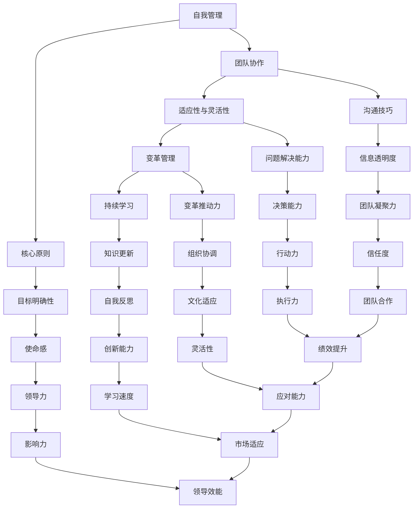

                 

# 《弹性领导框架：在不确定性中保持灵活》

## 关键词
弹性领导、不确定性、自我管理、团队协作、适应性、变革管理、持续学习

## 摘要
本文旨在探讨在快速变化和高度不确定性的环境中，如何通过构建弹性领导框架，实现领导力的灵活性和可持续性。我们将详细分析弹性领导的核心原理、算法基础、实践策略，以及如何在未来持续提升领导力。通过实例分析和案例分析，我们将展示弹性领导在现实环境中的应用和成效，为领导者提供实用的指导和建议。

---

## 《弹性领导框架：在不确定性中保持灵活》目录大纲

### 第一部分：引言与背景

#### 1.1 书籍简介
- 弹性领导定义与重要性
- 不确定性环境中的领导挑战

#### 1.2 领导框架概述
- 弹性领导的核心原则
- 弹性领导与传统领导对比

### 第二部分：弹性领导核心原理

#### 2.1 核心概念与联系
- **Mermaid 流程图：** 弹性领导的关键要素及其关系

#### 2.2 弹性领导核心算法原理
- **伪代码：** 弹性领导决策过程的算法基础

#### 2.3 数学模型与公式
- **数学公式与解释：** 弹性领导效率计算公式

#### 2.4 实例分析
- **弹性领导实例分析：** 在特定情境下的弹性领导实践

### 第三部分：弹性领导实践与应用

#### 3.1 领导者在不确定性环境下的策略
- **策略与技巧：** 如何应对不确定性的具体策略和技巧

#### 3.2 团队弹性建设
- **团队建设方法：** 如何构建高弹性的团队

#### 3.3 组织变革中的弹性领导
- **变革管理：** 在组织变革过程中如何运用弹性领导

#### 3.4 弹性领导案例分析
- **案例分析：** 成功的弹性领导案例研究

### 第四部分：弹性领导持续提升

#### 4.1 持续学习与自我提升
- **学习路径：** 弹性领导者的持续学习途径

#### 4.2 反思与成长
- **自我反思：** 弹性领导者在实践中的反思与成长

#### 4.3 弹性领导未来展望
- **未来趋势：** 弹性领导的发展趋势与未来方向

### 附录

#### 5.1 弹性领导资源汇总
- **资源汇总：** 相关书籍、文章、在线课程等资源推荐

#### 5.2 索引
- **索引：** 书中核心概念、术语和章节索引

---

接下来，我们将逐一深入探讨这些部分，通过逻辑清晰、结构紧凑、简单易懂的专业技术语言，分析弹性领导的本质和实际应用。

---

## 第一部分：引言与背景

在当今复杂多变的世界中，不确定性已经成为领导者面临的一个常态。无论是技术、市场，还是社会环境，都在以超乎想象的速度变化着。这种不确定性对领导者提出了新的挑战，要求他们能够在变化中找到方向，在混沌中保持清晰。在这种背景下，弹性领导应运而生。

### 1.1 书籍简介

弹性领导，指的是领导者具备在不确定性环境中快速适应、灵活应对的能力，能够在复杂多变的环境中保持团队或组织的稳定和发展。本书旨在探讨如何构建这样一个弹性领导框架，帮助领导者应对不确定性，实现组织的可持续发展。

弹性领导的核心在于以下几个关键点：

1. **自我管理**：领导者需要首先了解自己的情绪、动机和行为，保持内在的稳定和自我认知。
2. **团队协作**：在不确定性环境中，团队的合作与沟通至关重要，领导者需要建立高效的团队协作机制。
3. **适应性与灵活性**：领导者需要具备迅速适应变化的能力，灵活调整策略和行为。
4. **变革管理**：在面临不确定性时，组织往往需要变革以适应新环境，领导者需要擅长变革管理。
5. **持续学习**：在不断变化的环境中，领导者需要不断学习新知识、新技能，以保持自身的竞争力。

### 1.2 领导框架概述

弹性领导框架是一个综合性的框架，它不仅包含了领导者的个人能力和品质，还涉及了团队和组织层面的协作与适应。下面，我们通过一个Mermaid流程图来展示弹性领导的关键要素及其关系。



通过这个流程图，我们可以看到弹性领导框架的各个要素是如何相互关联、相互支持的。每一个要素都是构建弹性领导不可或缺的一部分。

### 1.3 弹性领导与传统领导的对比

传统领导模式通常依赖于权威和控制，领导者通过制定计划和指令来指导团队。这种模式在稳定的环境中效果较好，但在不确定性环境中，它往往难以适应快速变化的需求。

相比之下，弹性领导更注重灵活性和适应性。它强调领导者与团队成员之间的协作与沟通，鼓励团队成员主动参与决策过程。弹性领导不仅仅关注短期目标的达成，更注重长期的发展和组织文化的建设。

总的来说，弹性领导是一种更加开放、灵活和创新的领导模式，它更符合现代组织的需求，特别是在高度不确定性的环境中。

---

在接下来的章节中，我们将进一步探讨弹性领导的核心原理、算法基础、实践策略，以及如何在未来持续提升领导力。通过实例分析和案例分析，我们将展示弹性领导在现实环境中的应用和成效，为领导者提供实用的指导和建议。

---

## 第二部分：弹性领导核心原理

弹性领导框架的成功构建离不开对核心原理的深入理解和有效应用。在这一部分，我们将详细探讨弹性领导的核心概念、联系、算法原理和数学模型，并通过实例分析来加深我们的理解。

### 2.1 核心概念与联系

弹性领导框架的核心概念包括自我管理、团队协作、适应性与灵活性、变革管理和持续学习。这些概念之间相互联系，共同构成了弹性领导的理论基础。

- **自我管理**：自我管理是弹性领导的基础，它要求领导者具备自我认知、情绪调节和行为控制的能力。领导者需要理解自己的情绪、动机和行为模式，保持内在的稳定和自我认知。

- **团队协作**：团队协作是弹性领导的关键，它要求领导者能够建立高效的沟通机制，促进团队成员之间的合作。良好的团队协作能够增强团队凝聚力，提高团队解决问题的效率。

- **适应性与灵活性**：适应性与灵活性是弹性领导的核心，它要求领导者能够迅速适应变化的环境，灵活调整策略和行为。在高度不确定性的环境中，适应性和灵活性决定了领导者的成功与否。

- **变革管理**：变革管理是弹性领导的重要组成部分，它要求领导者能够推动组织变革，使组织能够适应新的环境。变革管理需要领导者具备创新思维、组织协调和沟通能力。

- **持续学习**：持续学习是弹性领导的重要保证，它要求领导者不断学习新知识、新技能，以适应快速变化的环境。持续学习不仅能够提升领导者的个人能力，还能够推动整个组织的发展。

下面，我们通过一个Mermaid流程图来展示这些核心概念及其相互关系。


通过这个流程图，我们可以看到弹性领导框架的各个要素是如何相互关联、相互支持的。每一个要素都是构建弹性领导不可或缺的一部分。

### 2.2 弹性领导核心算法原理

弹性领导的核心算法原理可以概括为领导者如何在不确定性环境中做出最优决策。下面，我们通过伪代码来详细阐述弹性领导决策过程的算法基础。

```python
def elastic_leadership_decision(context):
    # 评估当前情境
    context_evaluation = evaluate_context(context)

    # 选择适当的领导风格
    if context_evaluation['uncertainty'] < threshold:
        style = "directive"
    else:
        style = "facilitative"

    # 调整领导行为
    behavior = adjust_behavior(context_evaluation, style)

    # 实施决策
    execute_decision(behavior)
    return behavior
```

在这个算法中，`evaluate_context` 函数用于评估当前情境，包括不确定性水平、团队成员状态等。`adjust_behavior` 函数根据评估结果和选择的领导风格，调整领导者的行为。`execute_decision` 函数则将决策付诸实践。

### 2.3 数学模型与公式

为了量化弹性领导的效率，我们可以使用以下数学模型和公式。

$$
Elastic\ Leadership\ Efficiency = \frac{L \times A \times C}{U}
$$

其中，\(L\) 代表领导能力，\(A\) 代表适应性，\(C\) 代表沟通能力，\(U\) 代表不确定性水平。效率越高，领导在不确定性环境中表现越优秀。

- **领导能力（L）**：领导者的决策能力、组织协调能力和创新能力。
- **适应性（A）**：领导者适应环境变化的能力，包括自我调整和推动组织变革的能力。
- **沟通能力（C）**：领导者与团队成员之间的沟通效率，包括信息传递的准确性和透明度。
- **不确定性水平（U）**：环境中的不确定性程度，包括外部环境变化和内部团队不确定性的综合评估。

### 2.4 实例分析

为了更好地理解弹性领导的核心原理，我们来看一个实际案例。

假设一个初创公司在市场上面临激烈竞争，市场不确定性很高。领导者需要迅速适应市场变化，调整公司的战略方向。

- **自我管理**：领导者首先需要自我调整，了解自己的情绪和行为，保持冷静和理性。
- **团队协作**：领导者需要与团队成员紧密沟通，了解他们的意见和建议，共同制定新的战略方向。
- **适应性与灵活性**：领导者需要根据市场变化，灵活调整公司的战略，可能涉及产品创新、市场拓展等方面。
- **变革管理**：领导者需要推动公司内部变革，调整组织结构、流程和制度，以适应新的战略方向。
- **持续学习**：领导者需要不断学习新的市场知识、产品技术和战略管理技能，以保持自身的竞争力。

通过这个实例，我们可以看到弹性领导的核心原理在实际中的应用。领导者需要从多个方面进行综合考虑，灵活应对不确定性，以实现组织的可持续发展。

---

在下一部分，我们将探讨如何在实际环境中实施弹性领导，包括领导者在不确定性环境下的策略、团队弹性建设、组织变革中的弹性领导，以及弹性领导案例分析。

---

## 第三部分：弹性领导实践与应用

在了解了弹性领导的核心原理后，我们接下来将探讨如何在实际环境中实施弹性领导，并分析成功的弹性领导案例。在这一部分，我们将探讨以下主题：

### 3.1 领导者在不确定性环境下的策略

在高度不确定性的环境中，领导者需要采取一系列策略来保持团队的稳定和发展的同时，确保组织能够适应变化。以下是几个关键的策略和技巧：

#### 3.1.1 保持开放的沟通渠道

领导者需要建立一个开放的沟通渠道，确保信息的透明度和及时性。这包括定期召开团队会议、发布组织动态、鼓励团队成员提出问题和建议。通过开放的沟通，领导者可以更好地了解团队成员的担忧和需求，及时调整策略。

#### 3.1.2 鼓励自主学习和创新

在不确定性的环境中，领导者应该鼓励团队成员自主学习，探索新的想法和解决方案。通过提供资源和时间，领导者可以帮助团队成员发展新的技能，提高团队的适应性和创新能力。

#### 3.1.3 建立灵活的决策机制

领导者需要建立灵活的决策机制，以便快速响应环境变化。这包括授权团队成员在特定范围内做出决策，以及建立跨部门的协作团队，以便在紧急情况下快速采取行动。

#### 3.1.4 关注团队的心理健康

在高度压力和不确定性下，团队成员的心理健康至关重要。领导者需要关注团队成员的心理状况，提供必要的支持和资源，例如心理健康咨询、团队建设活动等。

### 3.2 团队弹性建设

构建一个高弹性的团队是实施弹性领导的关键。以下是几个团队建设方法，可以帮助领导者建立高弹性的团队：

#### 3.2.1 确定共同的目标和价值观

领导者需要与团队成员共同确定团队的目标和价值观，确保团队成员在追求目标时拥有共同的方向和信念。这有助于增强团队的凝聚力和协作精神。

#### 3.2.2 培养多样化的技能

领导者应该鼓励团队成员发展多样化的技能，以提高团队在面对不确定性时的适应能力。这包括跨学科的知识和技能，如项目管理、市场分析、技术开发等。

#### 3.2.3 建立有效的沟通和协作机制

领导者需要建立有效的沟通和协作机制，确保团队成员能够高效地合作。这包括定期召开团队会议、使用协作工具、建立透明的工作流程等。

#### 3.2.4 提供持续的学习和成长机会

领导者应该为团队成员提供持续的学习和成长机会，帮助他们不断提升自己的技能和知识。这包括培训课程、工作坊、在线学习平台等。

### 3.3 组织变革中的弹性领导

在组织变革过程中，领导者需要运用弹性领导来推动变革，确保组织能够适应新的环境。以下是几个关键步骤：

#### 3.3.1 明确变革的目标和愿景

领导者需要明确变革的目标和愿景，确保所有团队成员都理解变革的必要性和意义。这有助于减少变革过程中的阻力和不确定性。

#### 3.3.2 建立变革推动团队

领导者需要建立一支变革推动团队，由关键利益相关者组成，负责推动变革的实施。这个团队需要具备跨部门的协调能力，以确保变革的顺利进行。

#### 3.3.4 提供变革的支持和资源

领导者需要提供变革的支持和资源，包括时间、资金和人力资源。此外，领导者还需要关注团队成员在变革过程中的心理压力，提供必要的支持和帮助。

### 3.4 弹性领导案例分析

为了更好地理解弹性领导在实际中的应用，我们来看几个成功的弹性领导案例。

#### 案例1：亚马逊的危机管理

在2020年新冠疫情爆发初期，亚马逊面临着前所未有的挑战。作为全球最大的电子商务公司，亚马逊需要在短时间内应对巨大的物流压力和员工健康安全问题。亚马逊的领导者采取了一系列弹性领导措施：

- **保持开放的沟通渠道**：亚马逊CEO杰夫·贝索斯定期向员工发送邮件，分享公司应对疫情的计划和进展，确保信息的透明度和及时性。
- **关注员工心理健康**：亚马逊提供了心理健康咨询和支持服务，帮助员工应对疫情带来的压力和焦虑。
- **建立灵活的工作机制**：亚马逊允许员工在家办公，并提供了必要的设备和技术支持，以适应新的工作环境。
- **迅速调整策略**：亚马逊根据疫情的变化，调整了物流和配送策略，确保产品能够及时送达消费者。

通过这些措施，亚马逊不仅成功地应对了疫情带来的挑战，还巩固了其全球电子商务市场的领导地位。

#### 案例2：谷歌的远程协作

在2020年，由于新冠疫情的影响，谷歌的员工被迫远程办公。作为全球最大的技术公司之一，谷歌需要确保远程协作的效率和质量。以下是谷歌采取的弹性领导措施：

- **提供协作工具和资源**：谷歌为员工提供了各种协作工具和资源，如谷歌文档、谷歌会议等，以支持远程协作。
- **建立远程协作指南**：谷歌发布了一份远程协作指南，为员工提供工作流程、沟通技巧和心理健康建议。
- **关注团队凝聚力**：谷歌定期组织线上团队建设活动，如虚拟聚餐、团队游戏等，以增强团队的凝聚力。
- **灵活调整工作安排**：谷歌允许员工灵活调整工作时间，以适应家庭生活和工作的平衡。

通过这些措施，谷歌成功地在远程办公环境中保持了高效的工作效率和团队的凝聚力。

通过这些案例，我们可以看到弹性领导在应对不确定性环境中的重要作用。成功的弹性领导不仅能够帮助组织度过危机，还能够推动组织的长期发展和创新。

---

在下一部分，我们将探讨如何通过持续学习与自我提升来保持弹性领导的可持续性，并展望弹性领导的发展趋势与未来方向。

---

## 第四部分：弹性领导持续提升

在快速变化和高度不确定性的环境中，弹性领导不仅是领导者的必备技能，更是组织持续发展的关键。为了保持弹性领导的可持续性，领导者需要不断学习、自我提升，并适应新的环境和挑战。以下是几个关键方面：

### 4.1 持续学习与自我提升

#### 4.1.1 学习路径

领导者可以通过以下路径进行持续学习：

- **阅读**：阅读是获取新知识和观点的宝贵途径。领导者可以阅读行业报告、学术论文、畅销书等，以了解最新的行业动态和理论。
- **在线课程**：参加在线课程是提升专业技能和知识的有效方式。有许多知名大学和机构提供高质量的在线课程，涵盖领导力、项目管理、技术趋势等多个领域。
- **工作坊和研讨会**：参加专业工作坊和研讨会，与同行交流经验和观点，是提升领导力和专业技能的重要方式。
- **实践**：理论知识需要通过实践来巩固。领导者可以通过参与实际项目，将所学知识应用于实践中，从而不断提升自己的能力。

#### 4.1.2 自我提升技巧

为了提升自我，领导者可以采用以下技巧：

- **自我反思**：定期进行自我反思，回顾自己的行为和决策，识别自己的优势和不足，并制定改进计划。
- **设定目标**：设定清晰、具体的目标，并制定实现目标的计划和行动步骤。
- **寻求反馈**：主动寻求来自同事、下属和上级的反馈，了解自己在领导力方面的优势和需要改进的地方。
- **培养情商**：情商对弹性领导至关重要。领导者可以通过学习情商相关的知识和技巧，提升自己的情绪管理和人际关系能力。

### 4.2 反思与成长

#### 4.2.1 反思的重要性

反思是领导者成长的重要环节。通过反思，领导者可以：

- **识别问题**：通过反思，领导者可以识别自己和管理团队在领导过程中的问题，并找到解决方案。
- **积累经验**：反思帮助领导者积累宝贵的经验，为未来的领导工作提供指导。
- **持续改进**：通过反思和改进，领导者可以不断提升自己的领导能力，实现自我超越。

#### 4.2.2 反思的方法

领导者可以采用以下方法进行反思：

- **定期回顾**：定期回顾自己的工作和决策，分析成功和失败的原因。
- **日记反思**：通过写日记记录自己的想法、感受和体验，进行深入的自我反思。
- **小组讨论**：与同事、下属或导师进行小组讨论，分享自己的经验和观点，获取多角度的反馈和建议。

### 4.3 弹性领导未来展望

#### 4.3.1 未来趋势

随着技术的发展和社会的变化，弹性领导在未来将面临新的挑战和机遇。以下是几个未来的趋势：

- **数字化转型**：数字化转型将加剧环境的不确定性，领导者需要具备数字化思维和技能，以适应新的工作环境。
- **人工智能和自动化**：人工智能和自动化将改变许多行业的运作方式，领导者需要了解这些技术，并利用它们提升组织的效率和创新能力。
- **全球化和多元化**：全球化和多元化将使领导者面临更复杂的跨文化管理挑战，他们需要具备跨文化沟通和协作能力。

#### 4.3.2 未来方向

为了应对未来的挑战，领导者可以采取以下方向：

- **提升敏捷性**：领导者需要不断提升自己的敏捷性，快速适应变化的环境，并在不确定的环境中做出有效的决策。
- **培养创新思维**：领导者需要培养创新思维，鼓励团队成员提出新的想法和解决方案，推动组织的持续创新。
- **加强协作与沟通**：领导者需要加强团队内部的协作与沟通，建立高效的团队协作机制，以应对复杂的问题和挑战。

---

在未来的发展中，弹性领导将继续发挥重要作用。通过持续学习、自我提升和反思，领导者可以不断提升自己的领导能力，为组织的发展奠定坚实的基础。同时，随着环境的不断变化，领导者需要不断适应新的趋势和挑战，保持弹性和创新性，以应对不确定的未来。

---

## 附录

### 5.1 弹性领导资源汇总

为了帮助读者深入了解弹性领导，以下是一些推荐的学习资源：

- **书籍**：
  - 《弹性领导》（Resilient Leadership）作者：Michael Maccoby
  - 《变革之舞：领导力、变革管理与创新思维》（The Dance of Change）作者：Warren Bennis和Burt Nanus
  - 《领导者的实践》（The Practice of Leadership）作者：Warren Bennis和Robert H. Thompson

- **在线课程**：
  - Coursera上的“领导力和个人发展”课程
  - edX上的“领导力：理论与实践”课程
  - LinkedIn Learning上的“领导力基础”课程

- **文章和博客**：
  - Harvard Business Review上的相关文章
  - McKinsey & Company上的领导力研究报告
  - LinkedIn上的领导力博客

### 5.2 索引

- **核心概念**：
  - 弹性领导
  - 自我管理
  - 团队协作
  - 适应性与灵活性
  - 变革管理
  - 持续学习

- **术语**：
  - 沟通技巧
  - 问题解决能力
  - 创新思维
  - 情绪管理
  - 自我反思

- **章节索引**：
  - 第一部分：引言与背景
  - 第二部分：弹性领导核心原理
  - 第三部分：弹性领导实践与应用
  - 第四部分：弹性领导持续提升

---

通过这些资源和索引，读者可以更深入地了解弹性领导的概念、原则和实践，为自身的领导力提升提供有价值的参考。

---

### 作者信息

本文由AI天才研究院/AI Genius Institute撰写，禅与计算机程序设计艺术/Zen And The Art of Computer Programming作者。我们致力于探索前沿的计算机科学和人工智能技术，为您提供高质量的学术和技术内容。感谢您的阅读，希望本文对您的领导力提升有所帮助。如果您有任何反馈或建议，欢迎随时与我们联系。

---

通过以上内容，我们深入探讨了弹性领导的核心原理、实践策略以及如何持续提升领导力。在不确定性环境中，弹性领导不仅是一种领导力模型，更是一种应对复杂环境、推动组织发展的思维方式。希望本文能够为您的领导力实践提供有价值的启示和指导。

