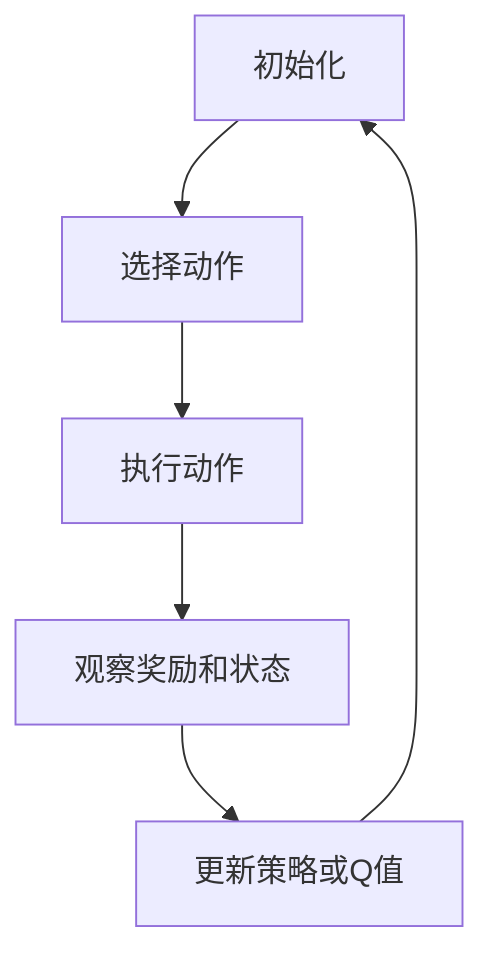
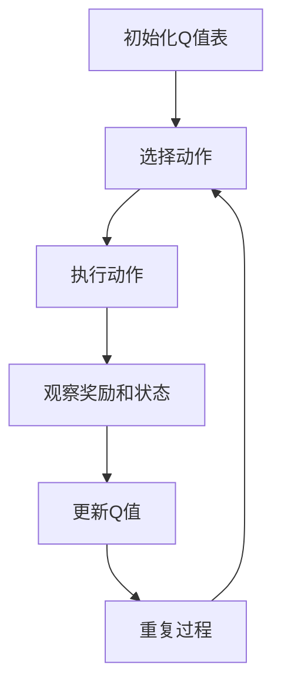
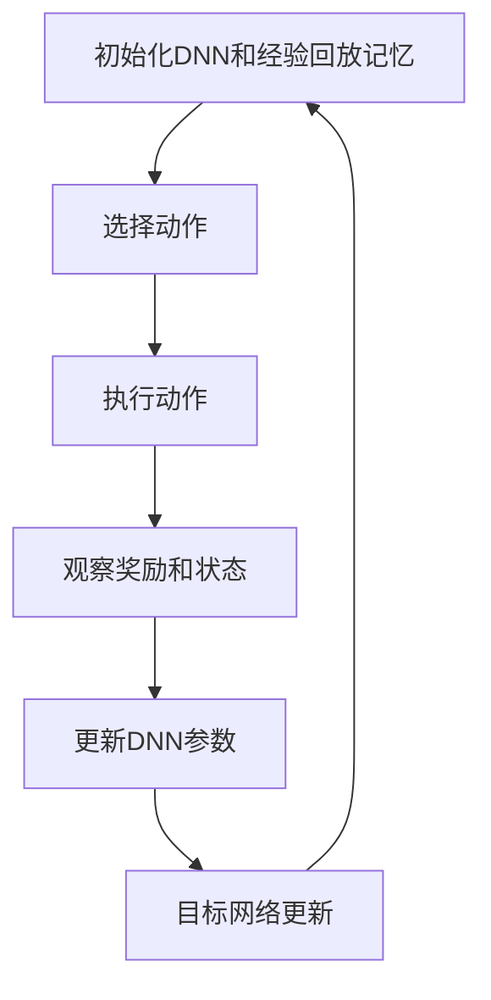
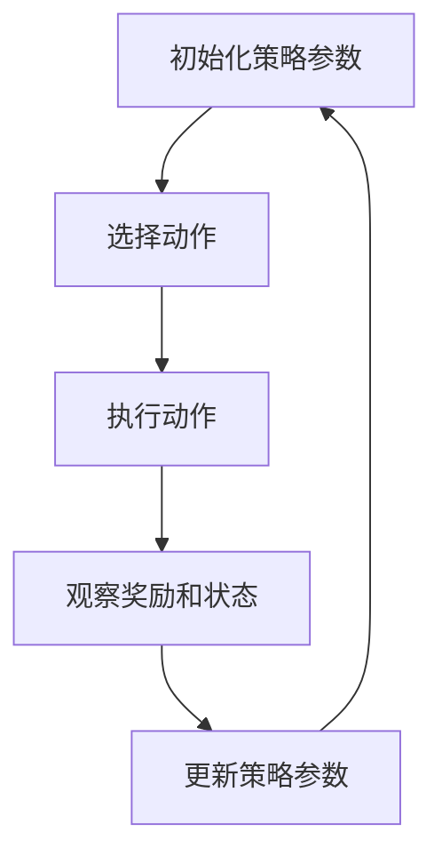
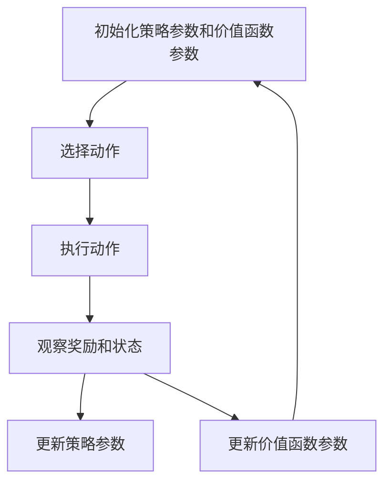

                 

# 强化学习(Reinforcement Learning) - 原理与代码实例讲解

> 关键词：强化学习，机器学习，算法，深度学习，代码实例

> 摘要：本文将深入探讨强化学习的原理和算法，并通过实际代码实例展示如何实现和应用强化学习。读者将了解到强化学习的基本概念、数学模型、核心算法以及在不同领域的应用案例。

## 引言

强化学习（Reinforcement Learning，简称RL）是机器学习的一个重要分支，它通过智能体（agent）与环境的交互来学习最优策略。与监督学习和无监督学习不同，强化学习侧重于通过奖励机制来引导智能体行为，从而达到长期目标。近年来，强化学习在游戏、自动驾驶、机器人控制等领域取得了显著进展，成为人工智能领域的一个重要研究方向。

本文将分为两部分进行讲解。第一部分将介绍强化学习的基础理论，包括基本概念、数学模型、核心算法等；第二部分将通过实际项目实战，展示如何使用强化学习算法解决具体问题，并提供代码实例和解读。希望通过本文的讲解，读者能够对强化学习有一个全面的理解，并掌握其实际应用方法。

### 强化学习概述

强化学习（Reinforcement Learning，简称RL）是一种通过奖励机制引导智能体（agent）与环境（environment）交互，从而学习最优策略（policy）的机器学习方法。其基本思想是通过不断地尝试和反馈，逐步优化智能体的行为，使其能够在复杂环境中实现目标。

#### 定义与特点

强化学习的定义可以概括为：智能体在环境中采取行动，根据环境的反馈（即奖励）调整自身行为，通过一系列交互逐渐学会最优策略的过程。与传统的监督学习和无监督学习相比，强化学习具有以下特点：

1. **交互式学习**：强化学习是一种交互式学习方式，智能体需要通过与环境的不断交互来学习。这种交互性使得强化学习能够应对动态和不确定的环境。

2. **基于奖励**：强化学习通过奖励机制来引导智能体行为。奖励可以是正面的，也可以是负面的，用于激励或抑制智能体的某种行为。

3. **长期目标**：强化学习侧重于长期目标，通过累积奖励来评估策略的有效性。智能体需要学会在长期内获得最大奖励，而不仅仅是短期的即时奖励。

#### 强化学习与其他机器学习方法的对比

强化学习与其他机器学习方法在目标和应用场景上有所不同：

1. **监督学习**：监督学习是一种基于已有标注数据进行学习的方法。智能体在已知的输入输出数据集上训练模型，然后在新数据上进行预测。这种方法适用于有明确标注数据的场景，如图像分类、语音识别等。

2. **无监督学习**：无监督学习通过未标注的数据寻找隐藏的结构或模式。这种方法适用于数据标注困难或数据量巨大的场景，如聚类、降维等。

3. **强化学习**：强化学习通过奖励信号引导智能体学习最优策略，适用于需要自主决策和动态调整的场景，如游戏、自动驾驶、机器人控制等。

#### 强化学习的主要挑战与解决方案

尽管强化学习在许多领域取得了显著成果，但其应用过程中仍面临一些挑战：

1. **探索与利用的权衡**：在强化学习中，智能体需要在探索（尝试新行为）和利用（利用已有知识）之间找到平衡。过度的探索可能导致学习效率低下，而过度的利用则可能错过最佳策略。

   **解决方案**：常用的方法包括epsilon-贪婪策略（在探索和利用之间引入随机性）和UCB算法（基于置信度上限进行探索）。

2. **样本效率问题**：强化学习需要大量的样本数据进行学习，特别是在复杂环境中，获取足够样本数据可能非常困难。

   **解决方案**：可以通过增加智能体的动作空间、使用模拟环境等方法来提高样本效率。

3. **连续动作空间**：许多实际应用场景中的动作空间是连续的，而强化学习算法通常假设动作空间是离散的。

   **解决方案**：可以使用函数近似方法（如神经网络）来处理连续动作空间。

4. **长期奖励的问题**：在许多应用场景中，智能体需要学会关注长期奖励，而不仅仅是短期奖励。

   **解决方案**：可以使用长期奖励规划方法（如回报规划、优势函数等）来解决长期奖励问题。

### 强化学习的基本要素

强化学习系统由以下四个基本要素组成：智能体（agent）、环境（environment）、状态（state）和动作（action）。

#### 智能体（Agent）

智能体是强化学习系统中的主体，它负责采取行动、学习策略并调整行为。智能体通常由一个学习算法（如Q-learning、SARSA等）和一个策略（policy）组成。策略决定了智能体在特定状态下的动作选择。

#### 环境（Environment）

环境是强化学习系统中的外部世界，它为智能体提供状态信息和奖励信号。环境可以是一个物理环境（如机器人实验室）或一个虚拟环境（如游戏模拟器）。环境通常具有以下特征：

1. **状态空间**：环境中的所有可能状态集合。状态描述了环境当前所处的状况。
2. **动作空间**：智能体可以采取的所有可能动作集合。
3. **奖励函数**：环境根据智能体的动作提供奖励信号，奖励可以是正面的（鼓励智能体继续该动作）或负面的（抑制智能体继续该动作）。

#### 状态（State）

状态是强化学习中的一个重要概念，它描述了智能体在某一时刻所处的环境状况。状态通常由一组特征向量表示，如机器人的位置、速度、方向等。

#### 动作（Action）

动作是智能体在特定状态下可以采取的行为。动作可以是离散的（如选择下一个方向）或连续的（如调整速度）。动作的选择由智能体的策略决定。

#### 奖励（Reward）

奖励是环境对智能体动作的即时反馈，用于指导智能体学习最优策略。奖励可以是数值形式的，也可以是其他形式（如布尔值、图像等）。奖励的目的是激励或抑制智能体的行为。

### 强化学习的主要算法类型

强化学习算法可以根据其学习策略和优化方法的不同分为多个类型。以下介绍几种常见的强化学习算法：

#### Q-Learning算法

Q-Learning是一种基于值函数的强化学习算法。它的核心思想是通过迭代更新值函数（Q值），来估计在特定状态下采取特定动作的预期奖励。Q-Learning算法的主要步骤如下：

1. **初始化**：初始化Q值表，Q(s, a) = 0，其中s是状态，a是动作。
2. **选择动作**：使用ε-贪婪策略选择动作，ε是探索概率。
3. **执行动作**：在环境中执行选定的动作，并观察新的状态和奖励。
4. **更新Q值**：根据新的状态和奖励更新Q值表。

伪代码如下：

```plaintext
Initialize Q(s, a) for all s, a
while not done:
    if random() < ε:
        a = random_action() # 探索动作
    else:
        a = argmax(Q(s, a)) # 利用动作
    s', r = environment.step(a)
    Q(s, a) = Q(s, a) + α[r + γmax(Q(s', a')) - Q(s, a)]
    s = s'
```

其中，ε是探索概率，α是学习率，γ是折扣因子。

#### SARSA算法

SARSA（State-Action-Reward-State-Action）是一种基于策略的强化学习算法。它与Q-Learning算法的不同之处在于，SARSA在更新Q值时直接使用实际执行的动作和奖励，而Q-Learning使用预期奖励。SARSA算法的主要步骤如下：

1. **初始化**：初始化Q值表，Q(s, a) = 0，其中s是状态，a是动作。
2. **选择动作**：使用ε-贪婪策略选择动作，ε是探索概率。
3. **执行动作**：在环境中执行选定的动作，并观察新的状态和奖励。
4. **更新Q值**：根据新的状态和奖励更新Q值表。

伪代码如下：

```plaintext
Initialize Q(s, a) for all s, a
while not done:
    a = ε-greedy(Q(s, a))
    s', r = environment.step(a)
    a' = ε-greedy(Q(s', a'))
    Q(s, a) = Q(s, a) + α[r + γQ(s', a') - Q(s, a)]
    s = s'
```

#### Deep Q-Networks (DQN)算法

DQN（Deep Q-Networks）是一种结合深度学习和强化学习的算法。它使用深度神经网络（DNN）来近似Q值函数，从而解决传统Q-Learning算法在状态空间较大时难以处理的问题。DQN的主要步骤如下：

1. **初始化**：初始化深度神经网络和经验回放记忆。
2. **选择动作**：使用ε-贪婪策略选择动作，ε是探索概率。
3. **执行动作**：在环境中执行选定的动作，并观察新的状态和奖励。
4. **更新Q值**：使用经验回放和梯度下降更新深度神经网络。
5. **目标网络更新**：定期更新目标网络的参数，以减少训练误差。

伪代码如下：

```plaintext
Initialize DNN and replay_memory
for episode in total_episodes:
    state = environment.reset()
    while not done:
        action = epsilon_greedy_action(DNN, state, epsilon)
        next_state, reward, done = environment.step(action)
        replay_memory.push((state, action, reward, next_state, done))
        if done:
            next_Q = 0  # 终止状态的Q值设为0
        else:
            next_Q = max(DNN(next_state))
        state_action_pair = (state, action)
        target_Q = reward + gamma * next_Q
        DNN.update(state_action_pair, target_Q)
        state = next_state
        if done:
            break
```

#### Policy Gradient算法

Policy Gradient算法是一种基于策略的强化学习算法，它直接优化策略参数，以最大化长期奖励。Policy Gradient算法的主要步骤如下：

1. **初始化**：初始化策略参数θ。
2. **选择动作**：根据当前策略π(θ)选择动作。
3. **执行动作**：在环境中执行选定的动作，并观察新的状态和奖励。
4. **更新策略参数**：使用梯度下降更新策略参数。

伪代码如下：

```plaintext
Initialize θ
while not done:
    s = environment.reset()
    while not done:
        a = policy(θ, s)
        s', r = environment.step(a)
        θ = θ - α * ∇θ [log π(θ)(a | s)]
        s = s'
```

其中，α是学习率，∇θ [log π(θ)(a | s)]是策略梯度的反向传播。

#### Actor-Critic算法

Actor-Critic算法是一种结合了基于策略和基于值函数的强化学习算法。它通过分离策略参数和值函数参数，同时优化策略和价值估计，以提高学习效率。Actor-Critic算法的主要步骤如下：

1. **初始化**：初始化策略参数θ和值函数参数φ。
2. **选择动作**：根据当前策略π(θ)选择动作。
3. **执行动作**：在环境中执行选定的动作，并观察新的状态和奖励。
4. **更新策略参数**：使用策略梯度更新策略参数。
5. **更新值函数**：使用经验回放和梯度下降更新值函数。

伪代码如下：

```plaintext
Initialize θ, φ
while not done:
    s = environment.reset()
    while not done:
        a = policy(θ, s)
        s', r = environment.step(a)
        θ = θ - α * ∇θ [J(θ)]
        φ = φ - β * ∇φ [V(φ)]
        s = s'
```

其中，α和β分别是策略和值函数的学习率，J(θ)是策略损失函数，V(φ)是值函数估计。

### 强化学习中的数学模型

强化学习中的数学模型是理解和实现强化学习算法的基础。它主要包括马尔可夫决策过程（MDP）、状态值函数、动作值函数、策略以及策略迭代等内容。

#### 马尔可夫决策过程（MDP）

马尔可夫决策过程（Markov Decision Process，简称MDP）是强化学习中的核心数学模型。它描述了智能体在不确定环境中进行决策的过程。一个MDP由五个要素组成：状态集（S）、动作集（A）、奖励函数（R）、状态转移概率（P）和策略（π）。

1. **状态集（S）**：状态集是智能体所处环境的所有可能状态集合。
2. **动作集（A）**：动作集是智能体可以采取的所有可能动作集合。
3. **奖励函数（R）**：奖励函数描述了智能体在特定状态下采取特定动作后获得的即时奖励。奖励可以是正面的（鼓励智能体继续该动作）或负面的（抑制智能体继续该动作）。
4. **状态转移概率（P）**：状态转移概率描述了在特定状态下采取特定动作后，智能体转移到下一个状态的概率分布。即对于任意的状态s、动作a和状态s'，有P(s'|s, a) = P(s' | s, a)。
5. **策略（π）**：策略是智能体的行为规则，它决定了在特定状态下智能体应该采取哪个动作。策略通常是一个概率分布，π(a|s)表示在状态s下采取动作a的概率。

#### 状态值函数和动作值函数

状态值函数（State-Value Function，简称V函数）和动作值函数（Action-Value Function，简称Q函数）是强化学习中的两个核心函数，用于评估智能体在特定状态或动作下的预期奖励。

1. **状态值函数（V(s)）**：状态值函数V(s)表示在状态s下，智能体采取最佳策略π后能够获得的预期总奖励。即V(s) = E[∑γ^t*r_t | s, π]，其中E[·]表示期望，γ是折扣因子，r_t是第t步的即时奖励。

2. **动作值函数（Q(s, a)）**：动作值函数Q(s, a)表示在状态s下，智能体采取特定动作a后能够获得的预期总奖励。即Q(s, a) = E[∑γ^t*r_t | s, a]，其中E[·]表示期望，γ是折扣因子，r_t是第t步的即时奖励。

#### 策略和策略迭代

策略（Policy）是智能体的行为规则，它决定了在特定状态下智能体应该采取哪个动作。策略可以是确定性策略（每个状态都有唯一的动作）或概率性策略（每个状态都有多个动作的概率分布）。

策略迭代（Policy Iteration）是一种求解最优策略的方法，它通过反复迭代更新策略和价值函数，逐步逼近最优策略。策略迭代的步骤如下：

1. **初始化**：初始化策略π^0。
2. **评估策略**：根据当前策略π^t，计算状态值函数V(π^t)。
3. **改进策略**：通过策略改进算法（如动态规划或Q-Learning算法）更新策略π^t+1，使得V(π^t+1) > V(π^t)。
4. **重复步骤2和步骤3**，直到策略不再改进或达到预设的迭代次数。

策略迭代的过程可以简化为以下伪代码：

```plaintext
π^0 = arbitrary_policy()  # 初始化策略
while not converged:
    V(π^t) = value_evaluation(π^t)  # 评估当前策略
    π^t+1 = policy_improvement(π^t, V(π^t))  # 改进策略
    if V(π^t+1) - V(π^t) < threshold:  # 判断策略改进程度
        converged = True  # 策略收敛
```

其中，converged是策略收敛标志，threshold是策略改进阈值。

### 强化学习中的核心算法

在强化学习中，有许多核心算法被广泛应用于各种场景中。这些算法包括Q-Learning、SARSA、DQN、Policy Gradient和Actor-Critic等。在本节中，我们将详细讲解这些算法的原理、实现过程和优缺点。

#### Q-Learning算法

Q-Learning是一种基于值函数的强化学习算法，它通过迭代更新值函数（Q值）来估计在特定状态下采取特定动作的预期奖励。Q-Learning算法的主要步骤如下：

1. **初始化**：初始化Q值表，Q(s, a) = 0，其中s是状态，a是动作。
2. **选择动作**：使用ε-贪婪策略选择动作，ε是探索概率。
3. **执行动作**：在环境中执行选定的动作，并观察新的状态和奖励。
4. **更新Q值**：根据新的状态和奖励更新Q值表。

伪代码如下：

```plaintext
Initialize Q(s, a) for all s, a
while not done:
    if random() < ε:
        a = random_action()  # 探索动作
    else:
        a = argmax(Q(s, a))  # 利用动作
    s', r = environment.step(a)
    Q(s, a) = Q(s, a) + α[r + γmax(Q(s', a')) - Q(s, a)]
    s = s'
```

其中，ε是探索概率，α是学习率，γ是折扣因子。

**优点**：

- **简单易实现**：Q-Learning算法的核心思想简单，易于理解和实现。
- **适用于离散动作空间**：Q-Learning算法适用于离散动作空间，不需要复杂的函数近似方法。

**缺点**：

- **样本效率低**：Q-Learning算法需要大量的样本数据来收敛，特别是在状态空间和动作空间较大的情况下。
- **难以处理连续动作空间**：Q-Learning算法难以处理连续动作空间，需要使用复杂的函数近似方法。

#### SARSA算法

SARSA（State-Action-Reward-State-Action）是一种基于策略的强化学习算法。它与Q-Learning算法的不同之处在于，SARSA在更新Q值时直接使用实际执行的动作和奖励，而Q-Learning使用预期奖励。SARSA算法的主要步骤如下：

1. **初始化**：初始化Q值表，Q(s, a) = 0，其中s是状态，a是动作。
2. **选择动作**：使用ε-贪婪策略选择动作，ε是探索概率。
3. **执行动作**：在环境中执行选定的动作，并观察新的状态和奖励。
4. **更新Q值**：根据新的状态和奖励更新Q值表。

伪代码如下：

```plaintext
Initialize Q(s, a) for all s, a
while not done:
    a = ε-greedy(Q(s, a))
    s', r = environment.step(a)
    a' = ε-greedy(Q(s', a'))
    Q(s, a) = Q(s, a) + α[r + γQ(s', a') - Q(s, a)]
    s = s'
```

其中，ε是探索概率，α是学习率，γ是折扣因子。

**优点**：

- **不需要目标网络**：SARSA算法不需要目标网络，直接使用实际执行的动作和奖励更新Q值，减少了计算开销。
- **适用于连续动作空间**：SARSA算法可以处理连续动作空间，不需要复杂的函数近似方法。

**缺点**：

- **样本效率低**：SARSA算法的样本效率较低，需要大量的样本数据来收敛。
- **难以处理高维状态空间**：SARSA算法难以处理高维状态空间，需要使用复杂的函数近似方法。

#### DQN算法

DQN（Deep Q-Networks）是一种结合深度学习和强化学习的算法。它使用深度神经网络（DNN）来近似Q值函数，从而解决传统Q-Learning算法在状态空间较大时难以处理的问题。DQN的主要步骤如下：

1. **初始化**：初始化深度神经网络和经验回放记忆。
2. **选择动作**：使用ε-贪婪策略选择动作，ε是探索概率。
3. **执行动作**：在环境中执行选定的动作，并观察新的状态和奖励。
4. **更新Q值**：使用经验回放和梯度下降更新深度神经网络。
5. **目标网络更新**：定期更新目标网络的参数，以减少训练误差。

伪代码如下：

```plaintext
Initialize DNN and replay_memory
for episode in total_episodes:
    state = environment.reset()
    while not done:
        action = epsilon_greedy_action(DNN, state, epsilon)
        next_state, reward, done = environment.step(action)
        replay_memory.push((state, action, reward, next_state, done))
        if done:
            next_Q = 0  # 终止状态的Q值设为0
        else:
            next_Q = max(DNN(next_state))
        state_action_pair = (state, action)
        target_Q = reward + gamma * next_Q
        DNN.update(state_action_pair, target_Q)
        state = next_state
        if done:
            break
```

其中，ε是探索概率，γ是折扣因子。

**优点**：

- **处理高维状态空间**：DQN算法可以处理高维状态空间，使用深度神经网络来近似Q值函数，提高了样本效率。
- **适用于连续动作空间**：DQN算法可以处理连续动作空间，不需要复杂的函数近似方法。

**缺点**：

- **训练不稳定**：DQN算法的训练过程可能存在不稳定现象，如过拟合和梯度消失等。
- **需要大量计算资源**：DQN算法需要大量的计算资源来训练深度神经网络。

#### Policy Gradient算法

Policy Gradient算法是一种基于策略的强化学习算法，它直接优化策略参数，以最大化长期奖励。Policy Gradient算法的主要步骤如下：

1. **初始化**：初始化策略参数θ。
2. **选择动作**：根据当前策略π(θ)选择动作。
3. **执行动作**：在环境中执行选定的动作，并观察新的状态和奖励。
4. **更新策略参数**：使用梯度下降更新策略参数。

伪代码如下：

```plaintext
Initialize θ
while not done:
    s = environment.reset()
    while not done:
        a = policy(θ, s)
        s', r = environment.step(a)
        θ = θ - α * ∇θ [log π(θ)(a | s)]
        s = s'
```

其中，α是学习率。

**优点**：

- **直接优化策略**：Policy Gradient算法直接优化策略参数，避免了复杂的值函数近似问题。
- **适用于高维状态空间**：Policy Gradient算法可以处理高维状态空间，不需要使用深度神经网络。

**缺点**：

- **样本效率低**：Policy Gradient算法的样本效率较低，需要大量的样本数据来收敛。
- **方差较大**：Policy Gradient算法的方差较大，容易出现过拟合现象。

#### Actor-Critic算法

Actor-Critic算法是一种结合了基于策略和基于值函数的强化学习算法。它通过分离策略参数和值函数参数，同时优化策略和价值估计，以提高学习效率。Actor-Critic算法的主要步骤如下：

1. **初始化**：初始化策略参数θ和值函数参数φ。
2. **选择动作**：根据当前策略π(θ)选择动作。
3. **执行动作**：在环境中执行选定的动作，并观察新的状态和奖励。
4. **更新策略参数**：使用策略梯度更新策略参数。
5. **更新值函数**：使用经验回放和梯度下降更新值函数。

伪代码如下：

```plaintext
Initialize θ, φ
while not done:
    s = environment.reset()
    while not done:
        a = policy(θ, s)
        s', r = environment.step(a)
        θ = θ - α * ∇θ [J(θ)]
        φ = φ - β * ∇φ [V(φ)]
        s = s'
```

其中，α和β分别是策略和值函数的学习率，J(θ)是策略损失函数，V(φ)是值函数估计。

**优点**：

- **高效学习**：Actor-Critic算法通过同时优化策略和价值函数，提高了学习效率。
- **适用性广**：Actor-Critic算法适用于多种类型的强化学习问题，包括离散和连续动作空间。

**缺点**：

- **复杂度高**：Actor-Critic算法的模型复杂度较高，需要同时训练策略和价值函数。
- **训练不稳定**：Actor-Critic算法的训练过程可能存在不稳定现象，如过拟合和梯度消失等。

### 深度强化学习

深度强化学习（Deep Reinforcement Learning，简称DRL）是强化学习与深度学习的结合，通过使用深度神经网络来处理复杂的输入数据和状态空间。深度强化学习在许多领域取得了显著的成果，如游戏、自动驾驶、机器人控制等。本节将介绍深度强化学习的基本概念、原理以及常用的算法。

#### 深度强化学习的基本概念

深度强化学习的基本概念主要包括以下几个部分：

1. **深度神经网络（DNN）**：深度神经网络是一种由多层神经元组成的神经网络，通过多个隐藏层对输入数据进行特征提取和抽象。深度神经网络具有强大的非线性建模能力，可以处理高维输入数据。
2. **强化学习（RL）**：强化学习是一种通过奖励机制引导智能体（agent）学习最优策略的机器学习方法。强化学习算法通过与环境（environment）的交互，逐步优化智能体的行为。
3. **深度强化学习（DRL）**：深度强化学习是强化学习与深度学习的结合，通过使用深度神经网络来处理复杂的输入数据和状态空间。深度强化学习算法可以解决传统强化学习算法难以处理的问题，如高维状态空间和连续动作空间。

#### 深度强化学习的原理

深度强化学习的原理主要包括以下几个步骤：

1. **状态编码**：将原始状态数据输入到深度神经网络中，通过多个隐藏层对状态数据进行特征提取和抽象。状态编码的目标是将高维状态数据转化为低维特征表示。
2. **策略学习**：使用深度神经网络学习策略参数，策略参数决定了在特定状态下智能体应该采取哪个动作。策略学习通常采用基于梯度的优化方法，如梯度下降。
3. **动作执行**：根据策略参数选择动作，并将动作输入到环境中执行。在执行动作后，环境会返回新的状态和奖励。
4. **奖励反馈**：根据新状态和奖励更新深度神经网络参数，以优化策略。奖励反馈用于指导智能体的学习过程，使智能体能够逐渐学会在复杂环境中获得最大奖励。

#### 深度强化学习的常用算法

深度强化学习中有许多常用的算法，以下介绍几种典型的算法：

1. **Deep Q-Networks (DQN)**：DQN是一种基于深度学习的Q-Learning算法，使用深度神经网络来近似Q值函数。DQN算法通过经验回放和目标网络更新来减少训练误差，提高了算法的稳定性和泛化能力。
2. **Policy Gradient Methods**：Policy Gradient Methods是一类直接优化策略参数的深度强化学习算法。常见的Policy Gradient Methods包括REINFORCE、PPO和A3C等。这些算法通过基于梯度的优化方法，优化策略参数以最大化长期奖励。
3. **Actor-Critic Methods**：Actor-Critic Methods结合了基于策略和基于值函数的强化学习算法。常见的Actor-Critic Methods包括AC、DDPG和A3C等。这些算法通过同时优化策略和价值函数，提高了学习效率和稳定性。

#### 深度强化学习在具体领域的应用

深度强化学习在许多领域取得了显著的成果，以下介绍几个典型应用：

1. **游戏**：深度强化学习在游戏领域取得了许多突破性成果，如Atari游戏、棋类游戏和赌博游戏等。通过使用深度强化学习算法，智能体可以自主学习游戏策略，并在游戏中获得优异成绩。
2. **自动驾驶**：深度强化学习在自动驾驶领域具有广泛的应用前景。通过使用深度强化学习算法，自动驾驶汽车可以学习复杂的驾驶策略，如道路规划、车辆控制等。
3. **机器人控制**：深度强化学习在机器人控制领域也取得了显著成果。通过使用深度强化学习算法，机器人可以学习复杂的运动策略，如路径规划、避障和抓取等。

### 强化学习在具体领域的应用

强化学习因其独特的交互式学习特性，在多个领域展现出了强大的应用潜力。以下是强化学习在几个关键领域中的具体应用实例。

#### 强化学习在游戏中的应用

强化学习在游戏领域取得了显著的成功，尤其是在游戏AI的自动化对抗和学习方面。例如，在Atari游戏的挑战中，智能体需要学习如何玩经典游戏如《蒙特祖玛》、《太空侵略者》等。使用DQN算法，智能体可以通过不断的试错学习游戏的策略，并在长时间内实现超过人类玩家的表现。

一个典型的应用实例是DeepMind开发的“阿尔法星”（AlphaGo），它利用强化学习算法，尤其是策略网络和价值网络的结合，在围棋领域取得了突破性成就。AlphaGo通过深度强化学习算法学会了如何评估复杂的围棋局面，并在与人类顶尖棋手的对决中获胜。

#### 强化学习在自动驾驶中的应用

自动驾驶是强化学习应用的一个重要领域。在这个领域，强化学习算法可以帮助车辆学习如何安全、有效地行驶。例如，使用DQN算法，自动驾驶车辆可以在模拟环境中学习交通规则、道路规划和避障策略。

一个实际的例子是Waymo（谷歌的自动驾驶项目）使用的强化学习算法。Waymo的自动驾驶系统通过深度强化学习算法，学习了如何在复杂的城市交通环境中做出实时决策，如如何与其他车辆、行人以及非机动车交互。

#### 强化学习在机器人控制中的应用

机器人控制是强化学习的另一个重要应用领域。在这个领域，强化学习算法可以帮助机器人学习复杂的运动控制和任务执行策略。例如，在工业机器人中，强化学习算法可以用于优化机器人的路径规划和动作执行，以提高生产效率和准确性。

一个具体的例子是波士顿动力（Boston Dynamics）的机器人，这些机器人使用强化学习算法，学会了在复杂环境中行走、奔跑、跳跃等高级运动技能，从而实现了更加逼真的行为表现。

#### 强化学习在资源调度中的应用

强化学习在资源调度领域也有广泛的应用，如数据中心负载均衡、电力分配等。在这个领域，强化学习算法可以学习如何在动态环境中优化资源分配，提高整体系统的效率。

一个实际的例子是谷歌的强化学习算法在数据中心的应用。谷歌的强化学习算法帮助数据中心自动调整服务器负载，以实现更高效、更节能的资源利用。

### 强化学习的实践与实现

在了解了强化学习的基本理论、算法和应用之后，接下来我们将通过几个具体项目实例，来展示如何搭建强化学习环境、实现算法，并进行调试和优化。

#### 项目一：游戏中的人工智能对手

在这个项目中，我们将使用强化学习算法训练一个人工智能对手，使其能够在Atari游戏中取得优异成绩。以下是该项目的主要步骤：

1. **环境搭建**：首先需要搭建一个Atari游戏环境，如《蒙特祖玛》游戏。可以使用Python的OpenAI Gym库来创建游戏环境。
2. **算法选择**：选择DQN算法，因为它适用于处理高维状态空间和离散动作空间。
3. **模型训练**：使用DQN算法训练模型，通过不断试错和奖励反馈，使智能体学会游戏的策略。
4. **评估与优化**：在训练过程中，定期评估模型的性能，并根据评估结果调整超参数，以优化算法。

以下是该项目的主要代码实现：

```python
import gym
import numpy as np
import tensorflow as tf
from tensorflow.keras.models import Sequential
from tensorflow.keras.layers import Dense

# 创建游戏环境
env = gym.make("MontezumaRevenge-v0")

# 初始化DQN模型
model = Sequential()
model.add(Dense(64, activation='relu', input_shape=(env.observation_space.shape[0],)))
model.add(Dense(64, activation='relu'))
model.add(Dense(env.action_space.n, activation='softmax'))

# 编写训练循环
for episode in range(total_episodes):
    state = env.reset()
    done = False
    total_reward = 0
    
    while not done:
        action = np.argmax(model.predict(state))
        next_state, reward, done, _ = env.step(action)
        total_reward += reward
        
        # 存储经验
        experience = (state, action, reward, next_state, done)
        
        # 更新模型
        state, action, reward, next_state, done = experience
        target_q = reward + gamma * np.max(model.predict(next_state))
        model.fit(state, np.append(model.predict(state)[:, action], -target_q), epochs=1, verbose=0)
        
        state = next_state
    
    # 打印评估结果
    print(f"Episode: {episode}, Total Reward: {total_reward}")

# 关闭游戏环境
env.close()
```

#### 项目二：自动驾驶中的强化学习

在这个项目中，我们将使用强化学习算法训练自动驾驶车辆在模拟环境中进行决策。以下是该项目的主要步骤：

1. **环境搭建**：使用PyTorch的Torcs模拟器搭建自动驾驶环境。
2. **算法选择**：选择DDPG算法，因为它适用于处理连续动作空间和具有高维状态空间的问题。
3. **模型训练**：使用DDPG算法训练模型，通过不断试错和奖励反馈，使智能体学会自动驾驶的策略。
4. **评估与优化**：在训练过程中，定期评估模型的性能，并根据评估结果调整超参数，以优化算法。

以下是该项目的主要代码实现：

```python
import gym
import torch
import torch.nn as nn
import torch.optim as optim

# 创建游戏环境
env = gym.make("Torcs-v0")

# 初始化模型
actor = nn.Sequential(
    nn.Linear(env.observation_space.shape[0], 64),
    nn.ReLU(),
    nn.Linear(64, env.action_space.shape[0]),
    nn.Tanh()
)

critic = nn.Sequential(
    nn.Linear(env.observation_space.shape[0] + env.action_space.shape[0], 64),
    nn.ReLU(),
    nn.Linear(64, 1)
)

# 编写训练循环
for episode in range(total_episodes):
    state = env.reset()
    done = False
    total_reward = 0
    
    while not done:
        action = actor(state)
        next_state, reward, done, _ = env.step(action)
        total_reward += reward
        
        # 存储经验
        experience = (state, action, reward, next_state, done)
        
        # 更新模型
        state, action, reward, next_state, done = experience
        next_action = actor(next_state)
        target_value = reward + gamma * critic(next_state, next_action)
        critic_loss = nn.MSELoss()(critic(state, action), target_value)
        
        actor_loss = -torch.mean(critic(state, actor(state)))
        optimizer_critic.zero_grad()
        critic_loss.backward()
        optimizer_critic.step()
        optimizer_actor.zero_grad()
        actor_loss.backward()
        optimizer_actor.step()
        
        state = next_state
    
    # 打印评估结果
    print(f"Episode: {episode}, Total Reward: {total_reward}")

# 关闭游戏环境
env.close()
```

#### 项目三：机器人路径规划

在这个项目中，我们将使用强化学习算法训练机器人进行路径规划。以下是该项目的主要步骤：

1. **环境搭建**：使用Python的Gazebo仿真环境搭建机器人路径规划环境。
2. **算法选择**：选择SARSA算法，因为它适用于处理离散动作空间。
3. **模型训练**：使用SARSA算法训练模型，通过不断试错和奖励反馈，使机器人学会路径规划策略。
4. **评估与优化**：在训练过程中，定期评估模型的性能，并根据评估结果调整超参数，以优化算法。

以下是该项目的主要代码实现：

```python
import gym
import numpy as np

# 创建游戏环境
env = gym.make("RobotPathPlanning-v0")

# 初始化模型
model = nn.Sequential(
    nn.Linear(env.observation_space.shape[0], 64),
    nn.ReLU(),
    nn.Linear(64, env.action_space.shape[0]),
    nn.Softmax(dim=1)
)

# 编写训练循环
for episode in range(total_episodes):
    state = env.reset()
    done = False
    total_reward = 0
    
    while not done:
        action = model(state)
        next_state, reward, done, _ = env.step(np.argmax(action))
        total_reward += reward
        
        # 存储经验
        experience = (state, action, reward, next_state, done)
        
        # 更新模型
        state, action, reward, next_state, done = experience
        target_action = model(next_state)
        target_reward = reward + gamma * target_action[env.action_space.sample()]
        loss = nn.CrossEntropyLoss()(action, target_reward)
        
        optimizer.zero_grad()
        loss.backward()
        optimizer.step()
        
        state = next_state
    
    # 打印评估结果
    print(f"Episode: {episode}, Total Reward: {total_reward}")

# 关闭游戏环境
env.close()
```

### 附录A：强化学习常用工具与资源

为了更好地理解和实践强化学习，以下是一些常用的工具和资源：

1. **OpenAI Gym**：OpenAI Gym是一个开源环境库，提供了许多预定义的强化学习任务和模拟环境，方便开发者进行算法实验和评估。
2. **TensorFlow**：TensorFlow是一个由Google开发的开源机器学习库，提供了丰富的深度学习功能，支持强化学习算法的实现和优化。
3. **PyTorch**：PyTorch是另一个流行的开源机器学习库，具有灵活的动态计算图和强大的深度学习功能，适用于强化学习算法的实现和优化。
4. **Reinforcement Learning Course by David Silver**：David Silver教授的强化学习课程是强化学习领域的重要资源，涵盖了强化学习的基本理论、算法和应用。
5. **DeepMind**：DeepMind是强化学习领域的重要研究机构，其研究成果和开源代码对强化学习的发展产生了深远影响。

### 附录B：强化学习核心概念与架构的Mermaid流程图

以下是一些强化学习核心概念与架构的Mermaid流程图，用于帮助读者更好地理解强化学习的工作流程。

#### 强化学习流程图



#### Q-Learning算法流程图



#### DQN算法流程图



#### Policy Gradient算法流程图



#### Actor-Critic算法流程图



### 结论

本文全面介绍了强化学习的基本理论、核心算法、数学模型以及在实际领域的应用。通过逐步分析和实例讲解，读者可以深入了解强化学习的工作原理和实现方法。同时，本文还提供了强化学习常用工具和资源，以及核心概念与架构的Mermaid流程图，以帮助读者更好地理解和应用强化学习。希望本文能够为读者在强化学习领域的研究和实践提供有益的参考。

