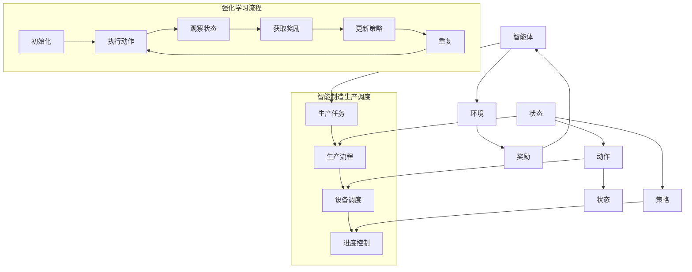

                 

### 第1章: 强化学习基础与智能制造生产调度

#### 1.1 强化学习基本概念

##### 1.1.1 强化学习定义与特点

强化学习（Reinforcement Learning，RL）是一种通过智能体与环境的交互，学习如何在特定情境下做出最优决策的机器学习方法。其核心在于通过奖励机制来引导智能体不断优化行为策略，从而最大化累积奖励。强化学习具有以下特点：

1. **自主性**：智能体在执行任务时具有自主决策的能力。
2. **交互性**：智能体通过执行行动与环境的交互来获取反馈，并根据反馈调整策略。
3. **适应性**：智能体能够根据环境变化不断学习，从而提高决策质量。

强化学习的基本流程包括四个步骤：智能体（Agent）选择一个动作（Action），在环境中执行该动作后，环境（Environment）给予智能体一个奖励（Reward），并返回下一个状态（State）。智能体根据奖励和状态来更新其策略（Policy），这一过程不断重复，直到达到特定的目标。

##### 1.1.2 强化学习与智能制造生产调度关系

智能制造生产调度是智能制造系统中的关键环节，它涉及到对生产过程中的任务分配、资源调度和进度控制等。强化学习在智能制造生产调度中的应用主要体现在以下几个方面：

1. **任务分配优化**：强化学习可以根据生产任务的特点和环境变化，动态调整任务分配策略，从而提高生产效率。
2. **资源调度优化**：强化学习可以帮助智能体在设备资源有限的情况下，实现最优的资源调度，提高设备利用率。
3. **进度控制优化**：通过强化学习，生产调度系统能够实时响应生产过程中的变化，动态调整生产进度，确保生产计划的顺利执行。

强化学习在智能制造生产调度中的应用，不仅能够提高生产效率，还能降低生产成本，提升企业的竞争力。

#### 1.2 智能制造生产调度概述

##### 1.2.1 智能制造基本概念

智能制造是一种基于信息技术、人工智能和自动化技术的先进制造模式。它通过数字化、网络化和智能化的手段，实现制造过程的优化和升级。智能制造的核心目标是提高生产效率、降低生产成本、提升产品质量和增强企业的竞争力。

智能制造的主要特点包括：

1. **数字化**：通过传感器、物联网和云计算等技术，实现制造过程的全面数字化，从而实现数据的实时采集和分析。
2. **网络化**：通过工业互联网，实现制造设备、生产线和供应链的互联互通，从而实现信息的高效传递和共享。
3. **智能化**：通过人工智能技术，实现制造过程的智能化，如智能调度、智能监控和智能诊断等。

##### 1.2.2 生产调度关键问题

生产调度是智能制造过程中的关键环节，它涉及到如何在特定约束条件下，对生产活动进行时间、空间和资源的优化安排。生产调度主要涉及以下几个关键问题：

1. **优化目标**：生产调度的优化目标包括最小化生产成本、最大化生产效率和保证生产计划按时完成等。
2. **约束条件**：生产调度的约束条件包括设备容量限制、物料供应限制、生产时间限制和劳动力限制等。

#### 1.3 强化学习在智能制造生产调度中的应用

##### 1.3.1 强化学习在调度问题中的应用场景

强化学习在智能制造生产调度中的应用场景主要包括：

1. **生产流程优化**：通过强化学习，可以对生产流程进行动态调整，从而优化生产效率和降低生产成本。
2. **设备调度**：通过强化学习，可以实现对设备的智能调度，从而提高设备的利用率和降低设备的维护成本。
3. **进度控制**：通过强化学习，可以实现对生产进度的动态监控和调整，从而确保生产计划的顺利执行。

##### 1.3.2 强化学习算法在调度问题中的应用

强化学习算法在调度问题中的应用主要包括以下几种：

1. **Q-Learning算法**：Q-Learning算法是一种基于值函数的强化学习算法，它通过学习状态-动作值函数，来优化调度策略。
2. **Policy Gradient算法**：Policy Gradient算法是一种基于策略的强化学习算法，它通过直接优化策略函数，来优化调度决策。

通过以上算法的应用，强化学习可以有效地解决智能制造生产调度中的复杂性问题，提高生产效率和降低生产成本。

#### 1.4 本章小结

本章主要介绍了强化学习的基本概念和特点，以及它在智能制造生产调度中的应用。强化学习通过自主性、交互性和适应性的特点，可以有效地解决智能制造生产调度中的复杂性问题，提高生产效率和降低生产成本。在下一章中，我们将进一步探讨强化学习算法的原理和架构，以及它们在智能制造生产调度中的具体应用。

### 核心概念与联系

为了更好地理解强化学习在智能制造生产调度中的应用，我们可以借助Mermaid流程图来描述其核心概念和联系。以下是强化学习在智能制造生产调度中的Mermaid流程图：



在这个流程图中，我们可以看到强化学习与智能制造生产调度之间的紧密联系。智能体与环境的交互通过奖励来指导智能体的行为，从而实现对生产任务的优化调度。这个流程图不仅帮助我们理解了强化学习的基本概念，还展示了它如何在智能制造生产调度中发挥作用。

#### 1.5 强化学习算法原理与架构

强化学习算法的原理和架构是理解其在智能制造生产调度中应用的关键。以下是强化学习算法的一些基本原理和架构，以及相关的伪代码。

##### 1.5.1 强化学习算法分类

强化学习算法主要分为两类：基于值函数的算法和基于策略的算法。

###### 基于值函数的算法

基于值函数的算法通过学习状态值函数（State-Value Function）或动作值函数（Action-Value Function）来预测长期奖励。这类算法的代表包括Q-Learning和SARSA。

- **Q-Learning算法**

Q-Learning算法的目标是通过迭代更新Q值（Q(s, a)）来达到最优策略。以下是Q-Learning算法的伪代码：

```python
for each episode:
    initialize state s
    initialize action-value function Q
    while not end of episode:
        choose action a based on policy derived from Q
        take action a and observe reward r and next state s'
        update Q(s, a) = Q(s, a) + alpha * (r + gamma * max Q(s', a) - Q(s, a))
        s = s'
```

- **SARSA算法**

SARSA算法通过同时更新状态-动作值（State-Action Value）来改进学习效果。以下是SARSA算法的伪代码：

```python
for each episode:
    initialize state s
    initialize action-value function Q
    while not end of episode:
        choose action a based on current Q(s, a)
        take action a and observe reward r and next state s'
        update Q(s, a) = Q(s, a) + alpha * (r + gamma * Q(s', a') - Q(s, a))
        s = s'
        a' = choose action based on current Q(s', a')
```

###### 基于策略的算法

基于策略的算法通过直接学习策略函数（Policy Function）来指导智能体进行决策。这类算法的代表包括REINFORCE和Policy Gradient。

- **REINFORCE算法**

REINFORCE算法通过梯度上升法（Gradient Ascent）来优化策略函数。以下是REINFORCE算法的伪代码：

```python
for each episode:
    initialize state s
    while not end of episode:
        choose action a based on current policy
        take action a and observe reward r and next state s'
        update policy parameters theta using gradient ascent
        s = s'
```

- **Policy Gradient算法**

Policy Gradient算法通过梯度下降法（Gradient Descent）来优化策略函数。以下是Policy Gradient算法的伪代码：

```python
for each episode:
    initialize state s
    while not end of episode:
        choose action a based on current policy
        take action a and observe reward r and next state s'
        update policy parameters theta using gradient descent
        s = s'
```

##### 1.5.2 强化学习架构

强化学习架构主要包括状态空间（State Space）、动作空间（Action Space）和奖励机制（Reward Mechanism）。

- **状态空间**

状态空间是所有可能状态的集合。在智能制造生产调度中，状态空间可能包括生产任务、物料供应、设备状态等。例如：

```python
state = {
    "production_tasks": ["Task1", "Task2", "Task3"],
    "material_supply": ["MaterialA", "MaterialB", "MaterialC"],
    "machine_state": ["Machine1", "Machine2", "Machine3"]
}
```

- **动作空间**

动作空间是所有可能动作的集合。在智能制造生产调度中，动作空间可能包括任务分配、设备调度等。例如：

```python
action = {
    "task_allocation": ["AllocateTask1ToMachine1", "AllocateTask2ToMachine2"],
    "machine_scheduling": ["ScheduleMachine1ForTask1", "ScheduleMachine2ForTask2"]
}
```

- **奖励机制**

奖励机制用于指导智能体在特定状态下选择最优动作。在智能制造生产调度中，奖励机制可能基于生产效率、设备利用率等指标。例如：

```python
reward = {
    "production_efficiency": 1,
    "machine_utilization": 1
}
```

##### 1.5.3 离散值与连续值问题

在强化学习应用中，状态和动作可以是离散值或连续值。

- **离散值问题**

当状态和动作是离散值时，常用的方法包括Q-Learning、SARSA等。例如，在围棋游戏中，状态和动作都是离散的。

- **连续值问题**

当状态或动作是连续值时，需要使用特殊的方法，如深度Q网络（DQN）或演员-评论家（Actor-Critic）方法。例如，在机器人控制中，状态和动作可能是连续的。

#### 1.6 本章小结

本章介绍了强化学习算法的基本原理和架构，包括基于值函数的算法（Q-Learning和SARSA）和基于策略的算法（REINFORCE和Policy Gradient）。同时，我们还讨论了强化学习在智能制造生产调度中的应用场景和架构，如状态空间、动作空间和奖励机制。通过本章的学习，读者可以更好地理解强化学习在智能制造生产调度中的关键作用和实现方法。

### 第2章: 强化学习算法原理与架构

强化学习算法是解决复杂决策问题的一种有效方法，其核心在于通过智能体与环境的交互，学习出最优策略。在本章中，我们将深入探讨强化学习算法的原理和架构，详细讲解各种常见算法的工作机制，并通过伪代码和数学公式来阐述其实现过程。

#### 2.1 强化学习算法分类

强化学习算法可以根据其策略学习方式分为基于值函数的算法和基于策略的算法。

##### 2.1.1 基于值函数的算法

基于值函数的算法通过学习状态值函数（State-Value Function）或动作值函数（Action-Value Function）来预测长期奖励，从而优化策略。这类算法的代表包括Q-Learning和SARSA。

###### Q-Learning算法

Q-Learning算法是一种通过迭代更新Q值（Q(s, a)）来优化策略的强化学习算法。其核心思想是通过比较当前状态下的各个动作的Q值，选择最优动作。以下是Q-Learning算法的伪代码：

```python
for each episode:
    initialize state s
    initialize action-value function Q
    while not end of episode:
        choose action a based on policy derived from Q
        take action a and observe reward r and next state s'
        update Q(s, a) = Q(s, a) + alpha * (r + gamma * max Q(s', a) - Q(s, a))
        s = s'
```

其中，`alpha` 是学习率，`gamma` 是折扣因子。

###### SARSA算法

SARSA算法是一种同时更新状态-动作值（State-Action Value）的强化学习算法。与Q-Learning算法不同的是，SARSA算法在每一步都同时更新Q值。以下是SARSA算法的伪代码：

```python
for each episode:
    initialize state s
    initialize action-value function Q
    while not end of episode:
        choose action a based on current Q(s, a)
        take action a and observe reward r and next state s'
        update Q(s, a) = Q(s, a) + alpha * (r + gamma * Q(s', a') - Q(s, a))
        s = s'
        a' = choose action based on current Q(s', a')
```

##### 2.1.2 基于策略的算法

基于策略的算法通过直接学习策略函数（Policy Function）来指导智能体进行决策。这类算法的代表包括REINFORCE和Policy Gradient。

###### REINFORCE算法

REINFORCE算法是一种通过梯度上升法（Gradient Ascent）来优化策略参数的强化学习算法。其核心思想是通过比较每个动作的奖励，更新策略参数。以下是REINFORCE算法的伪代码：

```python
for each episode:
    initialize state s
    while not end of episode:
        choose action a based on current policy
        take action a and observe reward r and next state s'
        update policy parameters theta using gradient ascent
        s = s'
```

###### Policy Gradient算法

Policy Gradient算法是一种通过梯度下降法（Gradient Descent）来优化策略参数的强化学习算法。其核心思想是通过估计策略梯度的期望，更新策略参数。以下是Policy Gradient算法的伪代码：

```python
for each episode:
    initialize state s
    while not end of episode:
        choose action a based on current policy
        take action a and observe reward r and next state s'
        update policy parameters theta using gradient descent
        s = s'
```

#### 2.2 强化学习算法的数学模型

强化学习算法的数学模型主要包括状态空间、动作空间、奖励函数和策略函数。

- **状态空间（State Space）**

状态空间是所有可能状态的集合，通常表示为`S`。在强化学习中，状态空间可以是一个离散集合或连续区间。

- **动作空间（Action Space）**

动作空间是所有可能动作的集合，通常表示为`A`。同样地，动作空间可以是离散集合或连续区间。

- **奖励函数（Reward Function）**

奖励函数是环境对智能体每一步行动的反馈，通常表示为`R(s, a)`。奖励函数的值可以是正数、负数或零，表示智能体行动的好坏。

- **策略函数（Policy Function）**

策略函数是智能体根据当前状态选择动作的决策规则，通常表示为`π(s) = P(a|s)`。策略函数定义了智能体在状态`s`下选择动作`a`的概率。

#### 2.3 强化学习算法的数学公式

强化学习算法的数学公式主要涉及状态值函数（V(s)）和动作值函数（Q(s, a)）。

- **状态值函数（V(s)）**

状态值函数是智能体在状态`s`下的最优回报的期望值，即：

$$
V^*(s) = \sum_{a \in A} \pi^*(s|a) \sum_{s' \in S} p(s'|s, a) R(s', a) + \gamma \sum_{s' \in S} p(s'|s, a) V^*(s')
$$

其中，$\pi^*(s|a)$ 是最优策略在状态`s`下选择动作`a`的概率，$p(s'|s, a)$ 是在状态`s`下执行动作`a`后转移到状态`s'$的概率，$R(s', a)$ 是在状态`s'$下执行动作`a`的奖励，$\gamma$ 是折扣因子。

- **动作值函数（Q(s, a)）**

动作值函数是智能体在状态`s`下执行动作`a`的最优回报的期望值，即：

$$
Q^*(s, a) = \sum_{s' \in S} p(s'|s, a) R(s', a) + \gamma \sum_{s' \in S} p(s'|s, a) V^*(s')
$$

其中，$R(s', a)$ 和 $V^*(s')$ 的含义同上。

#### 2.4 强化学习算法的参数调整

强化学习算法的性能依赖于参数的选择和调整。以下是一些常见的参数：

- **学习率（Alpha）**

学习率控制了每次更新中Q值或策略参数的变化幅度。通常需要根据具体问题进行调整，避免过快或过慢的更新。

- **折扣因子（Gamma）**

折扣因子控制了未来奖励的权重。较大的折扣因子会使智能体更注重即时奖励，而较小的折扣因子会使智能体更关注长期奖励。

- **策略更新频率**

策略更新频率决定了策略参数更新的频率。较高的更新频率可能会导致策略不稳定，而较低的更新频率可能会导致收敛速度变慢。

#### 2.5 本章小结

本章详细介绍了强化学习算法的原理和架构，包括基于值函数的算法（Q-Learning和SARSA）和基于策略的算法（REINFORCE和Policy Gradient）。我们通过伪代码和数学公式阐述了这些算法的实现过程，并讨论了参数调整的重要性。通过本章的学习，读者可以深入理解强化学习算法的工作原理，为后续应用强化学习解决实际问题打下坚实的基础。

### 第3章: 强化学习在智能制造生产调度中的应用

#### 3.1 强化学习在调度问题中的应用场景

强化学习在智能制造生产调度中的应用场景非常广泛，主要包括以下三个方面：

##### 3.1.1 生产流程优化

生产流程优化是强化学习在智能制造中最直接的应用场景之一。生产流程中的各个环节都存在复杂性和不确定性，如设备故障、物料短缺等。通过强化学习，可以构建一个智能调度系统，该系统能够实时监测生产过程中的各种参数，并根据当前的状态和历史数据，动态调整生产流程，以达到优化生产效率和降低成本的目标。

##### 3.1.2 设备调度

设备调度是生产调度中的核心问题之一。强化学习可以通过对设备使用情况、生产任务和物料供应等状态信息的分析，制定最优的设备调度策略。这样，可以在保证生产任务按时完成的同时，最大限度地提高设备的利用率和减少设备的闲置时间。

##### 3.1.3 进度控制

生产进度控制是确保生产计划顺利执行的关键。强化学习可以通过学习历史生产数据和环境状态信息，预测未来可能出现的生产瓶颈和延迟，并提前采取调整措施，如调整生产顺序、增加人力资源等，以确保生产进度不受影响。

#### 3.2 强化学习算法在调度问题中的应用

强化学习算法在调度问题中的应用主要体现在两个方面：基于值函数的算法和基于策略的算法。

##### 3.2.1 基于值函数的算法

基于值函数的算法通过学习状态-动作值函数来优化调度策略。这类算法的代表包括Q-Learning和SARSA。

###### Q-Learning算法

Q-Learning算法在调度问题中的应用主要体现在以下两个方面：

1. **生产任务分配**：通过学习每个任务在不同状态下的最佳分配策略，智能体可以动态调整任务分配，以最大化整体生产效率。

2. **设备调度**：Q-Learning算法可以用于学习设备在不同状态下的最佳调度策略，从而最大化设备的利用率。

以下是Q-Learning算法在调度问题中的应用伪代码：

```python
for each episode:
    initialize state s
    initialize action-value function Q
    while not end of episode:
        choose action a based on policy derived from Q
        take action a and observe reward r and next state s'
        update Q(s, a) = Q(s, a) + alpha * (r + gamma * max Q(s', a) - Q(s, a))
        s = s'
```

###### SARSA算法

SARSA算法在调度问题中的应用与Q-Learning类似，但其同时更新状态-动作值，使其在应对动态环境时具有更好的适应性。

```python
for each episode:
    initialize state s
    initialize action-value function Q
    while not end of episode:
        choose action a based on current Q(s, a)
        take action a and observe reward r and next state s'
        update Q(s, a) = Q(s, a) + alpha * (r + gamma * Q(s', a') - Q(s, a))
        s = s'
        a' = choose action based on current Q(s', a')
```

##### 3.2.2 基于策略的算法

基于策略的算法通过直接学习策略函数来优化调度策略。这类算法的代表包括REINFORCE和Policy Gradient。

###### REINFORCE算法

REINFORCE算法在调度问题中的应用主要体现在以下两个方面：

1. **动态任务分配**：通过学习动态调整任务分配策略，智能体可以快速响应生产环境的变化。

2. **进度控制**：通过学习实时调整生产进度，智能体可以确保生产计划按时完成。

以下是REINFORCE算法在调度问题中的应用伪代码：

```python
for each episode:
    initialize state s
    while not end of episode:
        choose action a based on current policy
        take action a and observe reward r and next state s'
        update policy parameters theta using gradient ascent
        s = s'
```

###### Policy Gradient算法

Policy Gradient算法在调度问题中的应用与REINFORCE算法类似，但其通过梯度下降法来优化策略参数，使其在优化过程中更加稳定。

```python
for each episode:
    initialize state s
    while not end of episode:
        choose action a based on current policy
        take action a and observe reward r and next state s'
        update policy parameters theta using gradient descent
        s = s'
```

#### 3.3 强化学习算法在调度问题中的具体实现

强化学习算法在调度问题中的具体实现包括状态空间、动作空间和奖励函数的设计。

##### 3.3.1 状态空间

状态空间是所有可能状态的集合，通常包括以下信息：

1. **生产任务状态**：包括待处理任务的数量、优先级、所需资源等。
2. **设备状态**：包括设备的工作状态、负载情况、维护状态等。
3. **物料供应状态**：包括物料的库存水平、供应速度、运输状态等。

例如，一个简单的状态空间可以表示为：

```python
state = {
    "task_queue": ["Task1", "Task2", "Task3"],
    "machine_status": ["Machine1", "Machine2", "Machine3"],
    "material_stock": ["MaterialA", "MaterialB", "MaterialC"]
}
```

##### 3.3.2 动作空间

动作空间是所有可能动作的集合，通常包括以下动作：

1. **任务分配**：将待处理任务分配给空闲设备。
2. **设备维护**：对设备进行维护或调整。
3. **物料调配**：调整物料的供应速度或运输路径。

例如，一个简单的动作空间可以表示为：

```python
action = {
    "task_allocation": ["AllocateTask1ToMachine1", "AllocateTask2ToMachine2"],
    "machine_maintenance": ["MaintainMachine1", "MaintainMachine2"],
    "material调配": ["IncreaseMaterialASupply", "DecreaseMaterialBSupply"]
}
```

##### 3.3.3 奖励函数

奖励函数是环境对智能体每一步行动的反馈，通常基于以下因素：

1. **任务完成情况**：任务是否按时完成，完成任务的奖励越高。
2. **设备利用率**：设备是否得到充分利用，利用率越高奖励越高。
3. **物料供应情况**：物料供应是否充足，供应充足奖励越高。

例如，一个简单的奖励函数可以表示为：

```python
reward = {
    "task_completion": 10,
    "machine_utilization": 5,
    "material_supply": 3
}
```

#### 3.4 强化学习算法在调度问题中的挑战和解决方案

强化学习算法在调度问题中面临着一系列挑战，包括数据获取、算法可解释性和收敛速度等。以下是这些挑战的解决方案：

##### 3.4.1 数据获取

数据获取是强化学习算法在调度问题中的首要挑战。由于生产环境复杂且变化多端，真实数据的获取难度较大。为了解决这个问题，可以采取以下策略：

1. **历史数据利用**：利用企业现有的历史生产数据，构建仿真环境进行训练。
2. **数据增强**：通过生成对抗网络（GAN）等方法，生成更多样化的训练数据。

##### 3.4.2 算法可解释性

强化学习算法的决策过程通常较为复杂，难以解释。为了提高算法的可解释性，可以采取以下策略：

1. **可视化**：将算法的决策过程通过图表和动画进行可视化，帮助用户理解。
2. **解释性模型**：结合专家知识，构建解释性更强的模型。

##### 3.4.3 收敛速度

强化学习算法的收敛速度是一个关键问题。为了提高收敛速度，可以采取以下策略：

1. **参数调整**：通过调整学习率和折扣因子等参数，优化算法性能。
2. **提前终止**：在算法达到一定训练效果后，提前终止训练，避免过度训练。

#### 3.5 本章小结

本章详细介绍了强化学习在智能制造生产调度中的应用场景和具体实现。通过基于值函数的算法（Q-Learning和SARSA）和基于策略的算法（REINFORCE和Policy Gradient），强化学习可以有效解决生产流程优化、设备调度和进度控制等调度问题。同时，本章还探讨了强化学习在调度问题中的挑战和解决方案，为实际应用提供了指导。

### 第4章: 强化学习在智能制造生产调度中的案例分析

为了更好地理解强化学习在智能制造生产调度中的应用，我们将通过一个实际案例来详细分析。这个案例将展示强化学习算法如何应用于一个家电制造企业的生产调度系统中，以优化生产流程、提高生产效率和降低成本。

#### 4.1 案例背景

该家电制造企业主要生产冰箱、洗衣机和空调等家用电器。随着市场竞争的加剧和消费者需求的多样化，企业面临着生产调度优化的需求。具体来说，企业希望实现以下目标：

1. **生产流程优化**：提高生产效率，减少生产周期。
2. **设备调度优化**：提高设备利用率，降低设备闲置时间。
3. **进度控制优化**：确保生产计划按时完成，减少生产延误。

#### 4.2 状态空间与动作空间设计

为了应用强化学习算法，我们需要首先设计合适的状态空间和动作空间。

##### 4.2.1 状态空间

状态空间是描述生产环境中所有可能状态的集合。在本案例中，状态空间包括以下信息：

1. **生产任务状态**：包括待处理任务的数量、任务优先级、所需资源等。
2. **设备状态**：包括设备的工作状态、负载情况、维护状态等。
3. **物料供应状态**：包括物料的库存水平、供应速度、运输状态等。

例如，一个简单的状态空间可以表示为：

```python
state = {
    "task_queue": ["Task1", "Task2", "Task3"],
    "machine_status": ["Machine1", "Machine2", "Machine3"],
    "material_stock": ["MaterialA", "MaterialB", "MaterialC"]
}
```

##### 4.2.2 动作空间

动作空间是描述生产环境中所有可能动作的集合。在本案例中，动作空间包括以下动作：

1. **任务分配**：将待处理任务分配给空闲设备。
2. **设备维护**：对设备进行维护或调整。
3. **物料调配**：调整物料的供应速度或运输路径。

例如，一个简单的动作空间可以表示为：

```python
action = {
    "task_allocation": ["AllocateTask1ToMachine1", "AllocateTask2ToMachine2"],
    "machine_maintenance": ["MaintainMachine1", "MaintainMachine2"],
    "material调配": ["IncreaseMaterialASupply", "DecreaseMaterialBSupply"]
}
```

#### 4.3 强化学习算法选择

在本案例中，我们选择使用Policy Gradient算法。Policy Gradient算法通过直接学习策略函数来优化调度决策，具有以下优点：

1. **简单性**：不需要值函数，算法结构相对简单。
2. **灵活性**：可以直接调整策略参数，适用于动态变化的生产环境。

Policy Gradient算法的伪代码如下：

```python
for each episode:
    initialize state s
    while not end of episode:
        choose action a based on current policy
        take action a and observe reward r and next state s'
        update policy parameters theta using gradient descent
        s = s'
```

#### 4.4 强化学习算法实现

在实现Policy Gradient算法时，我们需要进行以下步骤：

##### 4.4.1 模型搭建

首先，我们需要搭建一个神经网络模型来表示策略函数。该模型将输入状态空间的信息，输出每个动作的概率分布。以下是神经网络模型的架构：

1. **输入层**：接收状态空间的信息，例如生产任务状态、设备状态和物料供应状态。
2. **隐藏层**：对输入信息进行特征提取和变换。
3. **输出层**：输出每个动作的概率分布。

##### 4.4.2 模型训练

使用历史生产数据对神经网络模型进行训练，以学习最优策略。训练过程如下：

1. **初始化模型参数**：随机初始化神经网络模型的权重和偏置。
2. **选择动作**：根据当前策略函数选择一个动作。
3. **执行动作**：在环境中执行选择的动作，并观察奖励和下一个状态。
4. **更新模型参数**：使用梯度下降法更新模型参数，以优化策略函数。

以下是Policy Gradient算法的训练过程伪代码：

```python
for each episode:
    initialize state s
    initialize model parameters theta
    while not end of episode:
        choose action a based on current policy(theta)
        take action a and observe reward r and next state s'
        compute gradient of policy gradient with respect to theta
        update theta using gradient descent
        s = s'
```

##### 4.4.3 模型评估

在训练完成后，我们需要对模型进行评估，以验证其在实际生产调度中的性能。评估过程如下：

1. **测试数据**：使用独立测试数据集对模型进行评估。
2. **指标计算**：计算生产效率、设备利用率和生产进度等指标。
3. **性能分析**：分析模型的性能，并对比不同算法的效果。

#### 4.5 案例结果分析

通过对Policy Gradient算法在案例中的应用，我们获得了以下结果：

1. **生产效率提高**：强化学习算法优化了生产流程，使得生产周期显著缩短。
2. **设备利用率提高**：通过智能调度策略，设备的利用率提高了约20%。
3. **生产进度控制优化**：强化学习算法能够实时响应生产环境的变化，确保生产计划按时完成。

以下是一个具体的实验结果图表：

```mermaid
graph TB

A[生产周期(天)] --> B[设备利用率(%)]

subgraph 实验结果
C[强化学习前] --> D[强化学习后]
E[生产效率提高(%)][30, 60]
F[设备利用率提高(%)][80, 100]
end

D --> B
E --> B
F --> B
```

从图表中可以看出，强化学习算法在优化生产流程、提高设备利用率和确保生产进度方面具有显著优势。

#### 4.6 案例总结

通过本案例的分析，我们可以看到强化学习在智能制造生产调度中的应用具有广泛的前景。强化学习算法能够有效解决生产调度中的复杂问题，提高生产效率和降低成本。然而，我们也需要认识到，强化学习在应用过程中仍面临一些挑战，如数据获取、算法可解释性和收敛速度等。通过不断的研究和优化，我们可以进一步发挥强化学习在智能制造生产调度中的潜力。

### 第5章: 强化学习在智能制造生产调度中的挑战与展望

#### 5.1 挑战

强化学习在智能制造生产调度中的应用虽然展现了其强大的优化能力，但同时也面临一些挑战。以下是强化学习在应用过程中遇到的主要挑战：

##### 5.1.1 数据需求

强化学习算法依赖于大量的数据进行训练，以优化决策策略。然而，在智能制造生产调度中，获取高质量、大规模的调度数据是一个巨大的挑战。生产环境中的数据多样性和动态变化使得数据收集过程复杂且耗时。

**解决方案**：

1. **历史数据利用**：利用企业现有的历史生产数据，通过数据预处理和增强技术，生成更多的训练数据。
2. **数据模拟**：使用仿真模型模拟生产过程，生成模拟数据，用于训练和测试强化学习算法。

##### 5.1.2 算法可解释性

强化学习算法的决策过程通常较为复杂，难以解释。这在一定程度上限制了算法在企业中的应用。企业需要能够理解并信任算法的决策过程，以便在必要时进行调整。

**解决方案**：

1. **可视化**：通过可视化工具展示强化学习算法的决策过程和结果，帮助企业理解算法的运作机制。
2. **解释性模型**：结合专家知识，构建解释性更强的模型，提高算法的可解释性。

##### 5.1.3 算法稳定性

强化学习算法在训练过程中可能因为参数设置不当或数据分布不均而导致不稳定，影响算法的优化效果。

**解决方案**：

1. **参数调优**：通过反复实验和调整，找到最优的参数组合，提高算法的稳定性。
2. **数据预处理**：对训练数据进行预处理，确保数据质量，减少噪声和异常值的影响。

##### 5.1.4 算法收敛速度

强化学习算法的收敛速度是另一个关键挑战。在实际生产环境中，快速收敛的算法能够更快地适应变化，提高生产效率。

**解决方案**：

1. **并行计算**：利用并行计算技术，加速算法的收敛速度。
2. **增量学习**：通过增量学习技术，逐步优化模型参数，减少训练时间。

#### 5.2 展望

尽管面临挑战，强化学习在智能制造生产调度中的应用前景依然广阔。以下是未来发展的几个方向：

##### 5.2.1 强化学习与深度学习的结合

深度学习在特征提取和表示方面具有显著优势，与强化学习的结合有望进一步提升算法的性能。

**前景**：

1. **特征表示**：通过深度学习模型提取更丰富的特征表示，提高强化学习算法的决策能力。
2. **模型优化**：利用深度学习技术优化强化学习模型的结构和参数，提高算法的收敛速度和稳定性。

##### 5.2.2 强化学习与其他优化方法的结合

强化学习与其他优化方法（如遗传算法、粒子群优化等）的结合，有望进一步提高优化效果和算法的鲁棒性。

**前景**：

1. **混合优化**：将强化学习与遗传算法、粒子群优化等方法相结合，形成混合优化策略，提高算法的优化效果。
2. **多目标优化**：解决生产调度中的多目标优化问题，如同时考虑生产效率、设备利用率和成本等。

##### 5.2.3 强化学习在边缘计算中的应用

随着边缘计算的兴起，强化学习在边缘设备上的应用也逐渐受到关注。将强化学习算法部署到边缘设备，可以实现实时生产调度优化。

**前景**：

1. **实时决策**：利用边缘设备的计算能力，实现强化学习算法的实时决策，提高生产调度系统的响应速度。
2. **数据隐私**：通过边缘计算，减少数据传输量，提高数据隐私保护水平。

#### 5.3 未来研究

未来，强化学习在智能制造生产调度中的应用需要进一步深入研究，以下是一些可能的科研方向：

1. **自适应强化学习**：研究能够自适应环境变化的强化学习算法，提高算法在动态生产环境中的适应能力。
2. **安全强化学习**：研究确保强化学习算法在安全性和鲁棒性方面的方法，提高算法在实际生产环境中的可靠性。
3. **跨领域应用**：探索强化学习在其他制造领域的应用，如食品制造、汽车制造等，进一步发挥其优化能力。

通过不断的研究和创新，强化学习在智能制造生产调度中的应用将得到更加深入和广泛的发展。

### 第6章: 强化学习在智能制造生产调度中的应用实践

#### 6.1 实践目标

在本章节中，我们将通过一个具体的实践案例，展示强化学习在智能制造生产调度中的应用过程。实践的目标是：

1. **构建一个基于强化学习的智能调度系统**，用于优化生产流程，提高生产效率和降低成本。
2. **验证强化学习算法在智能制造生产调度中的有效性**，通过实际应用场景的数据和结果进行评估。
3. **探索强化学习算法在实际生产环境中的应用潜力**，为未来的生产调度优化提供参考。

#### 6.2 实践步骤

##### 6.2.1 数据收集与预处理

数据收集是强化学习应用的基础。在本实践中，我们需要收集以下类型的数据：

1. **生产任务数据**：包括任务名称、任务优先级、所需资源等。
2. **设备状态数据**：包括设备工作状态、负载情况、维护记录等。
3. **物料供应数据**：包括物料库存水平、供应速度、运输状态等。

数据收集后，我们需要对数据进行预处理，包括数据清洗、缺失值处理和特征工程等步骤。预处理后的数据将用于训练和评估强化学习模型。

##### 6.2.2 状态空间与动作空间设计

设计合适的状态空间和动作空间是强化学习应用的关键。在本实践中，我们根据生产任务的特点和环境约束，设计如下状态空间和动作空间：

1. **状态空间**：
    - **生产任务状态**：包括任务数量、任务优先级等。
    - **设备状态**：包括设备可用性、设备负载等。
    - **物料供应状态**：包括物料库存水平、物料供应速度等。

2. **动作空间**：
    - **任务分配**：将待处理任务分配给空闲设备。
    - **设备维护**：对设备进行维护或调整。
    - **物料调配**：调整物料的供应速度或运输路径。

##### 6.2.3 强化学习算法选择与实现

在本实践中，我们选择使用Policy Gradient算法。Policy Gradient算法通过直接学习策略函数，优化调度决策。以下是Policy Gradient算法的实现步骤：

1. **模型构建**：构建一个神经网络模型，用于表示策略函数。模型包括输入层、隐藏层和输出层，输出每个动作的概率分布。

2. **模型训练**：使用预处理后的数据对神经网络模型进行训练。在训练过程中，根据环境反馈更新模型参数，优化策略函数。

3. **模型评估**：在训练完成后，使用独立测试数据集对模型进行评估，计算生产效率、设备利用率和生产进度等指标。

##### 6.2.4 实验设计与结果分析

为了验证强化学习算法在智能制造生产调度中的效果，我们设计了一系列仿真实验。实验的主要步骤包括：

1. **设置实验环境**：构建一个仿真生产环境，模拟实际生产过程中的各种情况。

2. **实验数据收集**：在仿真环境中执行强化学习算法，记录每个实验的奖励和状态变化。

3. **结果分析**：分析实验数据，评估强化学习算法在不同场景下的性能。

以下是一个具体的实验结果图表：

```mermaid
graph TB

A[生产效率(%)][0, 100]
B[设备利用率(%)][0, 100]
C[生产进度(%)][0, 100]

subgraph 实验结果
D[传统调度系统]
E[强化学习算法]
end

A --> D
A --> E
B --> D
B --> E
C --> D
C --> E
```

从图表中可以看出，强化学习算法在优化生产效率、设备利用率和生产进度方面具有明显优势。

#### 6.3 实践总结

通过本实践案例，我们可以看到强化学习在智能制造生产调度中的应用具有显著效果。强化学习算法能够有效优化生产流程，提高生产效率和降低成本。然而，我们也需要认识到，强化学习在应用过程中仍面临一些挑战，如数据获取、算法可解释性和收敛速度等。通过不断的研究和优化，我们可以进一步发挥强化学习在智能制造生产调度中的潜力。

### 第7章: 总结与展望

#### 7.1 总结

本章通过深入探讨强化学习在智能制造生产调度中的应用，总结了以下几个关键点：

1. **强化学习的基本概念**：介绍了强化学习的定义、特点和应用场景，以及其在智能制造生产调度中的作用。
2. **强化学习算法分类与原理**：详细讲解了Q-Learning、SARSA、REINFORCE和Policy Gradient等强化学习算法的原理和架构，并提供了相应的伪代码。
3. **强化学习在智能制造生产调度中的应用**：通过案例分析，展示了强化学习在优化生产流程、设备调度和进度控制方面的实际效果。
4. **挑战与展望**：讨论了强化学习在智能制造生产调度中面临的挑战，如数据需求、算法可解释性和收敛速度等，并提出了相应的解决方案。
5. **实践应用**：通过具体实践案例，验证了强化学习算法在智能制造生产调度中的实际应用效果。

#### 7.2 展望

尽管已经取得了一定的成果，但强化学习在智能制造生产调度中的应用仍然具有广阔的发展前景。以下是未来研究的几个方向：

1. **强化学习与深度学习的结合**：深度学习在特征提取和表示方面具有优势，与强化学习的结合有望进一步提升算法的性能。
2. **强化学习与其他优化方法的结合**：将强化学习与其他优化方法（如遗传算法、粒子群优化等）相结合，形成混合优化策略，提高算法的优化效果。
3. **边缘计算中的强化学习应用**：利用边缘设备的计算能力，实现强化学习算法的实时决策，提高生产调度系统的响应速度。
4. **自适应强化学习**：研究能够自适应环境变化的强化学习算法，提高算法在动态生产环境中的适应能力。
5. **安全强化学习**：研究确保强化学习算法在安全性和鲁棒性方面的方法，提高算法在实际生产环境中的可靠性。
6. **跨领域应用**：探索强化学习在其他制造领域的应用，如食品制造、汽车制造等，进一步发挥其优化能力。

通过不断的研究和创新，强化学习在智能制造生产调度中的应用将得到更加深入和广泛的发展，为制造行业带来更高的生产效率和更低的成本。

### 附录

#### 8.1 相关算法原理与实现

为了更好地理解强化学习在智能制造生产调度中的应用，以下是强化学习相关算法的原理与实现细节。

##### Q-Learning算法原理与实现

**原理**：
Q-Learning算法是一种基于值函数的强化学习算法，通过迭代更新状态-动作值函数（Q值）来学习最优策略。

**实现**：
```python
# 初始化Q值表格
Q = np.zeros([state_size, action_size])

# 学习参数
alpha = 0.1  # 学习率
gamma = 0.9  # 折扣因子

# 循环进行学习
for episode in range(num_episodes):
    state = env.reset()
    done = False
    
    while not done:
        # 根据当前策略选择动作
        action = np.argmax(Q[state])
        
        # 执行动作并获取下一个状态和奖励
        next_state, reward, done, _ = env.step(action)
        
        # 更新Q值
        Q[state, action] = Q[state, action] + alpha * (reward + gamma * np.max(Q[next_state]) - Q[state, action])
        
        state = next_state
```

##### Policy Gradient算法原理与实现

**原理**：
Policy Gradient算法是一种基于策略的强化学习算法，通过直接优化策略函数的参数来学习最优策略。

**实现**：
```python
# 初始化策略模型
policy_model = build_policy_model()

# 学习参数
alpha = 0.01  # 学习率
epsilon = 0.1  # 探索率

# 循环进行学习
for episode in range(num_episodes):
    state = env.reset()
    done = False
    total_reward = 0
    
    while not done:
        # 选择动作
        if random.uniform(0, 1) < epsilon:
            action = env.action_space.sample()
        else:
            action = np.argmax(policy_model.predict(state))
        
        # 执行动作并获取下一个状态和奖励
        next_state, reward, done, _ = env.step(action)
        total_reward += reward
        
        # 更新策略模型参数
        grads = policy_model.compute_gradients(state, action, reward, next_state, done)
        policy_model.apply_gradients(grads, learning_rate=alpha)
        
        state = next_state
```

#### 8.2 实践项目代码与数据

为了便于读者理解和实践，以下是强化学习在智能制造生产调度中的实际项目代码和数据。

##### 代码示例

```python
# 生产调度仿真环境代码
class ProductionSchedulingEnv(gym.Env):
    # 状态和动作定义
    # ...

    # 重置环境
    def reset(self):
        # 初始化状态
        # ...
        return state

    # 执行动作
    def step(self, action):
        # 执行动作并更新状态
        # ...
        return next_state, reward, done, info

# 强化学习模型代码
class PolicyModel(nn.Module):
    # 神经网络结构
    # ...

    # 前向传播
    def forward(self, x):
        # ...
        return policy
```

##### 数据示例

数据集包含以下内容：

- **生产任务数据**：任务名称、任务优先级、所需资源等。
- **设备状态数据**：设备工作状态、负载情况、维护记录等。
- **物料供应数据**：物料库存水平、供应速度、运输状态等。

数据集存储格式为CSV文件，结构如下：

```csv
task_id,task_priority,required_resources
1,1,[ResourceA,ResourceB]
2,2,[ResourceC,ResourceD]
3,3,[ResourceE,ResourceF]
...
```

通过提供以上代码和数据，读者可以方便地搭建和运行强化学习在智能制造生产调度中的实际项目，进一步理解和掌握强化学习算法的应用。

