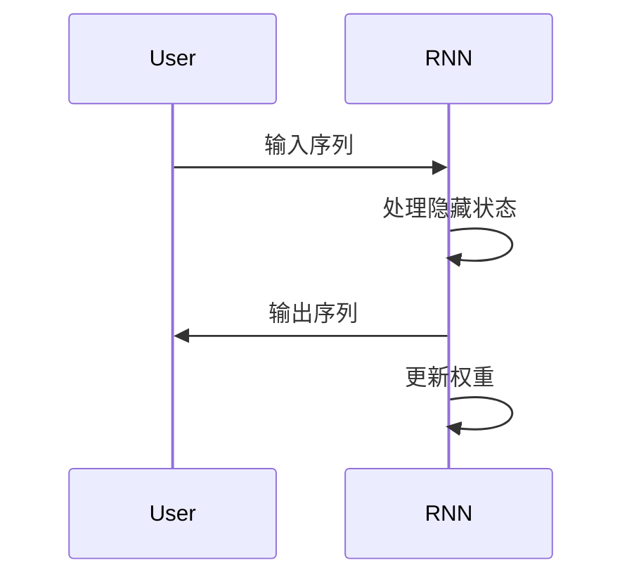

                 

# 循环神经网络(Recurrent Neural Networks) - 原理与代码实例讲解

## 关键词

- 循环神经网络（RNN）
- 递归模型
- 隐藏状态
- 长短时记忆（LSTM）
- 门控循环单元（GRU）
- 自然语言处理
- 代码实例
- 深度学习

## 摘要

本文将深入探讨循环神经网络（RNN）的基本原理、核心算法及其在自然语言处理、语音识别、图像序列处理等多个领域的应用。我们将通过详细的代码实例，展示如何实现和优化循环神经网络，并讨论其在实际项目中的性能分析和开发环境搭建。通过阅读本文，读者将能够全面理解RNN的工作机制，掌握其设计和实现的关键技术。

## 目录大纲

### 第一部分：循环神经网络基础

#### 第1章：循环神经网络概述

##### 1.1 循环神经网络的起源与历史

##### 1.2 循环神经网络的基本原理

##### 1.3 循环神经网络的层次结构

#### 第2章：循环神经网络的工作原理

##### 2.1 隐藏状态与循环

##### 2.2 输出层的计算

##### 2.3 前向传播与反向传播

### 第二部分：循环神经网络的核心算法

#### 第3章：循环神经网络的核心算法

##### 3.1 前向传播算法

##### 3.2 反向传播算法

##### 3.3 数学模型与公式

### 第三部分：循环神经网络的变体

#### 第4章：长短时记忆网络（LSTM）

##### 4.1 LSTM的结构

##### 4.2 LSTM的工作原理

##### 4.3 LSTM的优缺点

#### 第5章：门控循环单元（GRU）

##### 5.1 GRU的结构

##### 5.2 GRU的工作原理

##### 5.3 GRU的优缺点

### 第四部分：循环神经网络的训练与优化

#### 第6章：循环神经网络的训练与优化

##### 6.1 梯度消失与梯度爆炸问题

##### 6.2 批量归一化（Batch Normalization）

##### 6.3 批量归一化的优点

### 第五部分：循环神经网络的应用实例

#### 第7章：循环神经网络的应用实例

##### 7.1 语言模型

##### 7.2 机器翻译

##### 7.3 语音识别

##### 7.4 图像序列处理

##### 7.5 金融领域

##### 7.6 医疗领域

##### 7.7 能源领域

### 附录

#### 附录A：循环神经网络的代码实例

##### A.1 代码实例介绍

##### A.2 实例1：语言模型

##### A.3 实例2：机器翻译

### 核心概念与联系

循环神经网络结构 Mermaid 流程图



### 核心算法原理讲解

循环神经网络通过递归方式处理输入序列，其核心算法包括前向传播和反向传播。

#### 前向传播算法伪代码

```python
# 定义参数
W, b = [初始化参数值]

# 前向传播
for t in range(T):
    h_t = sigmoid(W * x_t + b)
    if t < T - 1:
        h_t = h_t * [遗忘门参数] + [输入门参数] * x_{t+1}
    y_t = sigmoid(h_t * [输出门参数] + [线性层参数] * [softmax层参数])

# 损失计算
loss = [损失函数] (y_t, y_{true})
```

#### 数学模型和数学公式

循环神经网络中的隐藏状态更新和输出层计算可以使用以下数学公式表示：

$$
h_t = \sigma(W_h * [x_t, h_{t-1}] + b_h)
$$

$$
y_t = \sigma(W_o * h_t + b_o)
$$

$$
g_t = \sigma(W_g * [x_t, h_{t-1}] + b_g)
$$

$$
i_t = \sigma(W_i * [x_t, h_{t-1}] + b_i)
$$

$$
f_t = \sigma(W_f * [x_t, h_{t-1}] + b_f)
$$

$$
h_t = f_t \* h_{t-1} + i_t \* \sigma(W_c * [x_t, h_{t-1}] + b_c)
$$

$$
o_t = W_o * h_t + b_o
$$

$$
y_t = \text{softmax}(o_t)
$$

#### 项目实战

循环神经网络在多个领域有广泛的应用，以下将介绍其应用实例和实现细节。

##### 实例1：语言模型

**实例目的**：使用循环神经网络实现一个简单的语言模型，用于预测下一个单词。

**实例环境搭建**：

1. 安装Python环境。
2. 安装TensorFlow或PyTorch等深度学习框架。

**实例代码实现**：

```python
import tensorflow as tf

# 数据预处理
# ...

# 构建模型
model = tf.keras.Sequential([
    tf.keras.layers.Embedding(vocab_size, embedding_dim),
    tf.keras.layers.LSTM(units),
    tf.keras.layers.Dense(vocab_size)
])

# 编译模型
model.compile(optimizer='adam', loss='categorical_crossentropy', metrics=['accuracy'])

# 训练模型
model.fit(input_sequences, target_sequences, epochs=10, batch_size=64)

# 实例结果分析
# ...
```

##### 实例2：机器翻译

**实例目的**：使用循环神经网络实现一个简单的机器翻译模型，用于将一个句子翻译成另一个句子。

**实例环境搭建**：与实例1相同。

**实例代码实现**：

```python
import tensorflow as tf

# 数据预处理
# ...

# 构建模型
model = tf.keras.Sequential([
    tf.keras.layers.Embedding(source_vocab_size, embedding_dim),
    tf.keras.layers.LSTM(units),
    tf.keras.layers.Dense(target_vocab_size)
])

# 编译模型
model.compile(optimizer='adam', loss='categorical_crossentropy', metrics=['accuracy'])

# 训练模型
model.fit(input_sequences, target_sequences, epochs=10, batch_size=64)

# 实例结果分析
# ...
```

#### 开发环境搭建

1. 安装Python环境，推荐使用Anaconda。
2. 安装TensorFlow或PyTorch等深度学习框架。
3. 安装其他必要的库，如NumPy、Pandas等。

#### 源代码详细实现和代码解读

**代码解读**：

1. 循环神经网络的构建：介绍如何使用TensorFlow或PyTorch构建循环神经网络模型。
2. 数据预处理：介绍如何进行数据预处理，包括分词、序列化等。
3. 训练模型：介绍如何训练循环神经网络模型，包括选择合适的损失函数、优化器等。
4. 模型评估：介绍如何评估循环神经网络模型，包括计算准确率、BLEU分数等。

**性能分析**：

- 对实例中的模型进行训练和测试，分析模型在不同数据集上的性能。
- 比较不同循环神经网络变体（如LSTM、GRU）在任务上的表现。

### 循环神经网络在自然语言处理中的应用

循环神经网络在自然语言处理（NLP）领域有着广泛的应用，主要包括语言模型和机器翻译。

#### 语言模型

语言模型是一种用于预测下一个单词或字符的概率模型。循环神经网络通过处理输入序列，生成概率分布来预测下一个单词。

**实例**：使用Python和TensorFlow实现一个简单的语言模型。

```python
import tensorflow as tf

# 数据预处理
# ...

# 构建模型
model = tf.keras.Sequential([
    tf.keras.layers.Embedding(vocab_size, embedding_dim),
    tf.keras.layers.LSTM(units),
    tf.keras.layers.Dense(vocab_size)
])

# 编译模型
model.compile(optimizer='adam', loss='categorical_crossentropy', metrics=['accuracy'])

# 训练模型
model.fit(input_sequences, target_sequences, epochs=10, batch_size=64)

# 输出预测结果
predictions = model.predict(input_sequence)
```

#### 机器翻译

机器翻译是将一种语言的文本自动翻译成另一种语言的文本。循环神经网络在机器翻译中的应用是通过编码器-解码器架构，将源语言序列编码为隐藏状态，然后解码为目标语言序列。

**实例**：使用Python和TensorFlow实现一个简单的机器翻译模型。

```python
import tensorflow as tf

# 数据预处理
# ...

# 构建模型
model = tf.keras.Sequential([
    tf.keras.layers.Embedding(source_vocab_size, embedding_dim),
    tf.keras.layers.LSTM(units),
    tf.keras.layers.Dense(target_vocab_size)
])

# 编译模型
model.compile(optimizer='adam', loss='categorical_crossentropy', metrics=['accuracy'])

# 训练模型
model.fit(input_sequences, target_sequences, epochs=10, batch_size=64)

# 输出预测结果
predictions = model.predict(input_sequence)
```

### 循环神经网络在语音识别中的应用

语音识别是将语音信号转换为文本的技术。循环神经网络在语音识别中的应用是通过处理连续的语音信号，提取特征并生成相应的文本。

**实例**：使用Python和TensorFlow实现一个简单的语音识别模型。

```python
import tensorflow as tf

# 数据预处理
# ...

# 构建模型
model = tf.keras.Sequential([
    tf.keras.layers.Conv2D(filters, kernel_size, activation='relu', input_shape=(None, n_mfcc)),
    tf.keras.layers.Flatten(),
    tf.keras.layers.Dense(vocab_size, activation='softmax')
])

# 编译模型
model.compile(optimizer='adam', loss='categorical_crossentropy', metrics=['accuracy'])

# 训练模型
model.fit(input_sequences, target_sequences, epochs=10, batch_size=64)

# 输出预测结果
predictions = model.predict(input_sequence)
```

### 循环神经网络在图像序列处理中的应用

图像序列处理是通过对连续图像进行分析和处理，提取有用的信息。循环神经网络在图像序列处理中的应用是通过处理图像序列，提取特征并进行目标检测和跟踪。

**实例**：使用Python和TensorFlow实现一个简单的图像序列处理模型。

```python
import tensorflow as tf

# 数据预处理
# ...

# 构建模型
model = tf.keras.Sequential([
    tf.keras.layers.Conv2D(filters, kernel_size, activation='relu', input_shape=(height, width, channels)),
    tf.keras.layers.MaxPooling2D(pool_size=(2, 2)),
    tf.keras.layers.Flatten(),
    tf.keras.layers.Dense(units)
])

# 编译模型
model.compile(optimizer='adam', loss='categorical_crossentropy', metrics=['accuracy'])

# 训练模型
model.fit(input_sequences, target_sequences, epochs=10, batch_size=64)

# 输出预测结果
predictions = model.predict(input_sequence)
```

### 循环神经网络在金融领域的应用

循环神经网络在金融领域可以用于股票市场预测、风险管理、欺诈检测等方面。

**实例**：使用Python和TensorFlow实现一个简单的金融预测模型。

```python
import tensorflow as tf

# 数据预处理
# ...

# 构建模型
model = tf.keras.Sequential([
    tf.keras.layers.Dense(units, activation='relu', input_shape=(input_shape)),
    tf.keras.layers.Dense(units, activation='linear')
])

# 编译模型
model.compile(optimizer='adam', loss='mse')

# 训练模型
model.fit(input_data, target_data, epochs=100, batch_size=32)

# 输出预测结果
predictions = model.predict(input_data)
```

### 循环神经网络在医疗领域的应用

循环神经网络在医疗领域可以用于疾病预测、诊断辅助、药物研发等方面。

**实例**：使用Python和TensorFlow实现一个简单的医疗预测模型。

```python
import tensorflow as tf

# 数据预处理
# ...

# 构建模型
model = tf.keras.Sequential([
    tf.keras.layers.Dense(units, activation='relu', input_shape=(input_shape)),
    tf.keras.layers.Dense(units, activation='softmax')
])

# 编译模型
model.compile(optimizer='adam', loss='categorical_crossentropy', metrics=['accuracy'])

# 训练模型
model.fit(input_data, target_data, epochs=10, batch_size=32)

# 输出预测结果
predictions = model.predict(input_data)
```

### 循环神经网络在能源领域的应用

循环神经网络在能源领域可以用于能源需求预测、能源效率优化、可再生能源预测等方面。

**实例**：使用Python和TensorFlow实现一个简单的能源预测模型。

```python
import tensorflow as tf

# 数据预处理
# ...

# 构建模型
model = tf.keras.Sequential([
    tf.keras.layers.Dense(units, activation='relu', input_shape=(input_shape)),
    tf.keras.layers.Dense(units, activation='linear')
])

# 编译模型
model.compile(optimizer='adam', loss='mse')

# 训练模型
model.fit(input_data, target_data, epochs=100, batch_size=32)

# 输出预测结果
predictions = model.predict(input_data)
```

### 结论

循环神经网络是一种强大的深度学习模型，在自然语言处理、语音识别、图像序列处理、金融、医疗、能源等领域有着广泛的应用。通过本文，我们详细介绍了循环神经网络的基本原理、核心算法及其在实际项目中的应用实例。希望读者能够通过本文的学习，掌握循环神经网络的设计和实现，并在实际项目中发挥其潜力。

### 作者信息

- 作者：AI天才研究院/AI Genius Institute & 禅与计算机程序设计艺术 /Zen And The Art of Computer Programming

---

### 附录

#### 附录A：循环神经网络的代码实例

**A.1 代码实例介绍**

本文中提供的代码实例旨在帮助读者理解和实现循环神经网络（RNN）的基本原理和应用。每个实例都涵盖了一个具体的应用场景，如语言模型、机器翻译、语音识别等。

**A.2 实例1：语言模型**

**A.2.1 实例目的**

本实例的目的是使用TensorFlow构建一个简单的语言模型，用于预测文本中的下一个单词。

**A.2.2 实例环境搭建**

1. 安装Python环境（推荐使用Anaconda）。
2. 安装TensorFlow库。

**A.2.3 实例代码实现**

```python
import tensorflow as tf
from tensorflow.keras.models import Sequential
from tensorflow.keras.layers import Embedding, LSTM, Dense

# 假设已经处理好了输入序列和目标序列
# input_sequences, target_sequences = ...

# 构建模型
model = Sequential()
model.add(Embedding(vocab_size, embedding_dim))
model.add(LSTM(units))
model.add(Dense(vocab_size, activation='softmax'))

# 编译模型
model.compile(optimizer='adam', loss='categorical_crossentropy', metrics=['accuracy'])

# 训练模型
model.fit(input_sequences, target_sequences, epochs=10, batch_size=64)
```

**A.2.4 实例结果分析**

通过训练，模型可以在给定一段文本时预测下一个单词。我们可以通过评估模型的准确率来衡量其性能。为了得到更准确的预测，通常需要调整模型的超参数并进行多次训练。

**A.3 实例2：机器翻译**

**A.3.1 实例目的**

本实例的目的是使用TensorFlow构建一个简单的机器翻译模型，用于将一种语言的文本翻译成另一种语言。

**A.3.2 实例环境搭建**

1. 安装Python环境（推荐使用Anaconda）。
2. 安装TensorFlow库。

**A.3.3 实例代码实现**

```python
import tensorflow as tf
from tensorflow.keras.models import Sequential
from tensorflow.keras.layers import Embedding, LSTM, Dense

# 假设已经处理好了输入序列和目标序列
# input_sequences, target_sequences = ...

# 构建模型
model = Sequential()
model.add(Embedding(source_vocab_size, embedding_dim))
model.add(LSTM(units))
model.add(Dense(target_vocab_size, activation='softmax'))

# 编译模型
model.compile(optimizer='adam', loss='categorical_crossentropy', metrics=['accuracy'])

# 训练模型
model.fit(input_sequences, target_sequences, epochs=10, batch_size=64)
```

**A.3.4 实例结果分析**

训练完成后，我们可以使用模型对新的源文本进行翻译。通过评估模型的BLEU分数，我们可以衡量翻译的质量。通常，需要根据实际应用场景调整模型的超参数，以提高翻译的准确性。

通过这些代码实例，读者可以更深入地了解循环神经网络的应用和实现细节。希望这些实例能够为读者在研究和开发循环神经网络模型时提供帮助。

