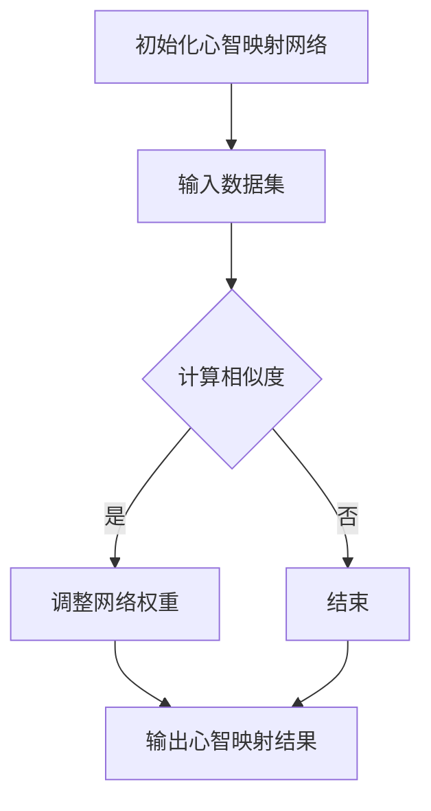
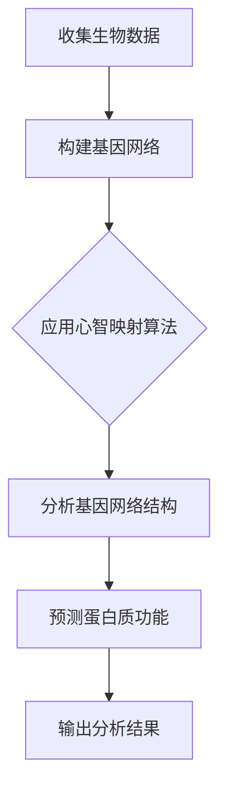
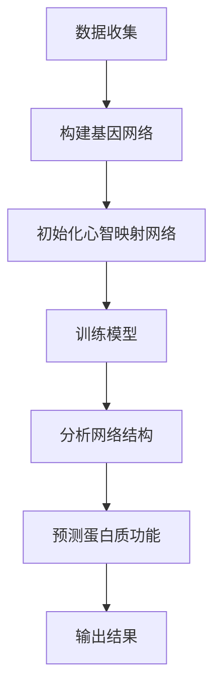

                 

# 心智映射：揭示自然与数学的联系

> **关键词**：心智映射、自然与数学、联系、理论框架、应用领域、算法模型、实践案例、未来展望

> **摘要**：
心智映射作为一种跨学科的研究方法，旨在揭示人类心智与自然世界、数学体系之间的深层联系。本文首先介绍了心智映射的基本理论，探讨了心智映射与数学的联系及其在自然科学、社会科学和教育领域的应用。接着，文章详细阐述了心智映射的核心算法和数学模型，并通过具体案例展示了心智映射在科学研究、社会生活和教育实践中的应用。最后，文章展望了心智映射技术的未来发展趋势与挑战，提出了发展战略和政策建议。

## 第一部分：心智映射基础理论

### 第1章：心智映射概述

#### 1.1 心智映射的概念与重要性

**1.1.1 心智映射的定义**

心智映射（Cognitive Mapping）是指人类心智在认知过程中构建和表征信息的方式，它包括了对知识的组织、存储、提取和应用。心智映射的研究始于20世纪中叶，当时学者们开始关注人类思维活动的内在机制，以及这些机制如何影响我们对世界的理解和决策。

**1.1.2 心智映射的研究意义**

心智映射的研究具有深远的意义，它不仅有助于我们更好地理解人类心智的本质，还能为人工智能、教育、认知科学等领域提供理论支持。心智映射能够揭示人类思维过程中的规律性和模式，从而为优化教育方法、设计智能系统提供指导。

**1.1.3 心智映射的发展历程**

心智映射的研究可以追溯到20世纪50年代，当时人工智能领域的先驱们开始探讨如何模拟人类的思维过程。随着认知科学、心理学、计算机科学等学科的发展，心智映射的理论体系逐渐完善，应用范围也不断扩展。

#### 1.2 心智映射的理论框架

**1.2.1 心智映射的核心概念**

心智映射的核心概念包括知识表征、信息加工、认知模型和心智过程等。这些概念共同构成了心智映射的理论基础。

**1.2.2 心智映射的理论模型**

心智映射的理论模型主要包括基于符号主义和连接主义的模型。符号主义模型强调知识的结构化和形式化，而连接主义模型则关注神经网络和人工神经网络的模拟。

**1.2.3 心智映射的方法论**

心智映射的方法论包括实验研究、脑成像技术和计算建模等。这些方法为心智映射的研究提供了多种手段和工具。

#### 1.3 心智映射的应用领域

**1.3.1 自然科学中的心智映射**

在自然科学中，心智映射广泛应用于生物学、物理学和化学等领域。通过心智映射，科学家们能够更好地理解生物系统的复杂性和物理现象的内在规律。

**1.3.2 社会科学中的心智映射**

在社会科学中，心智映射有助于揭示人类行为和心理活动的内在机制，从而为心理学、社会学、经济学等领域的研究提供支持。

**1.3.3 心智映射在教育领域的应用**

在教育领域，心智映射可以应用于教学设计、学习策略和个性化教育等方面。通过心智映射，教育工作者能够更好地理解学生的学习过程和认知特点，从而提高教学效果。

### 第2章：心智映射与数学的联系

#### 2.1 数学在心智映射中的作用

**2.1.1 数学概念的心智映射**

数学概念的心智映射是指人类心智如何理解和表征数学的基本概念，如数、量、函数、集合等。这些概念的心智映射对于数学学习和应用具有重要意义。

**2.1.2 数学结构的心智映射**

数学结构的心智映射是指人类心智如何理解和表征数学中的各种结构，如线性结构、树状结构、网络结构等。这些结构的心智映射对于数学问题的解决和算法设计具有重要意义。

**2.1.3 数学方法的心智映射**

数学方法的心智映射是指人类心智如何理解和应用数学的基本方法，如公理化方法、模型化方法、算法化方法等。这些方法的心智映射对于数学理论的构建和应用具有重要意义。

#### 2.2 自然与数学的心智映射联系

**2.2.1 自然现象的数学建模**

自然现象的数学建模是指利用数学方法描述和解释自然现象的过程。通过心智映射，科学家们能够将自然现象转化为数学模型，从而更好地理解和预测自然现象。

**2.2.2 数学在自然科学中的应用**

数学在自然科学中的应用包括物理学、生物学、化学等领域的理论构建和实验设计。通过心智映射，数学方法能够更好地服务于自然科学研究。

**2.2.3 数学与自然科学的交叉领域**

数学与自然科学的交叉领域包括数理生物学、数理物理学、数理经济学等。这些交叉领域的发展得益于心智映射在数学与自然科学之间的桥梁作用。

#### 2.3 心智映射在数学教育中的应用

**2.3.1 改进数学教育的方法**

心智映射在数学教育中的应用有助于改进教学方法，提高学生的学习效果。通过心智映射，教育工作者能够更好地理解学生的学习过程和认知特点，从而设计出更有效的教学策略。

**2.3.2 心智映射在数学学习中的优势**

心智映射在数学学习中的优势包括提高学生的思维能力、增强学生的数学素养和激发学生的数学兴趣等。通过心智映射，学生能够更好地理解和应用数学知识。

**2.3.3 心智映射在数学教学中的实践**

心智映射在数学教学中的实践包括教学设计、学习指导和评价等方面。通过心智映射，教育工作者能够更好地指导学生的学习过程，提高教学效果。

## 第二部分：心智映射方法与应用

### 第3章：心智映射的核心算法

#### 3.1 心智映射算法概述

**3.1.1 心智映射算法的基本原理**

心智映射算法的基本原理包括知识表征、信息加工和认知建模等。这些原理共同构成了心智映射算法的核心框架。

**3.1.2 心智映射算法的分类**

心智映射算法可以根据不同的分类标准进行分类，如基于符号主义的算法、基于连接主义的算法和混合算法等。

**3.1.3 心智映射算法的选择与优化**

在选择和优化心智映射算法时，需要考虑算法的效率、准确性和鲁棒性等因素。通过算法的优化，可以提高心智映射的性能和适用性。

#### 3.2 心智映射的数学模型与公式

**3.2.1 心智映射的数学表示方法**

心智映射的数学表示方法包括符号表示、图表示和矩阵表示等。这些表示方法为心智映射的建模和计算提供了有效的工具。

**3.2.2 心智映射的公式推导**

心智映射的公式推导是心智映射算法设计的重要环节。通过公式推导，可以更好地理解心智映射的内在机制和计算过程。

**3.2.3 心智映射公式的应用**

心智映射公式的应用包括数学建模、算法设计和数据分析等方面。通过公式的应用，可以实现心智映射在不同领域的应用。

#### 3.3 心智映射算法的伪代码

**3.3.1 心智映射算法的伪代码示例**

下面是一个简单的心智映射算法的伪代码示例：

```
初始化心智映射网络
输入数据集
对于每个数据点：
  计算其与网络中其他节点的相似度
  根据相似度调整网络权重
输出心智映射结果
```

**3.3.2 伪代码的应用场景**

伪代码的应用场景包括算法设计、算法验证和算法优化等方面。通过伪代码，可以更好地理解和实现心智映射算法。

### 第4章：心智映射的实践应用

#### 4.1 心智映射在科学研究中的应用

**4.1.1 心智映射在生物学中的应用**

在生物学中，心智映射可以应用于基因网络分析、蛋白质功能预测和生物信息学等领域。通过心智映射，科学家们能够更好地理解生物系统的复杂性和动态性。

**4.1.2 心智映射在物理学中的应用**

在物理学中，心智映射可以应用于量子计算、凝聚态物理和宇宙学等领域。通过心智映射，物理学家们能够更好地理解和解决复杂的物理问题。

**4.1.3 心智映射在计算机科学中的应用**

在计算机科学中，心智映射可以应用于算法设计、人工智能和机器学习等领域。通过心智映射，计算机科学家们能够更好地理解和应用先进的计算技术。

#### 4.2 心智映射在社会生活中的应用

**4.2.1 心智映射在心理学中的应用**

在心理学中，心智映射可以应用于认知治疗、心理测量和心理健康等领域。通过心智映射，心理学家们能够更好地理解和治疗心理疾病。

**4.2.2 心智映射在商业管理中的应用**

在商业管理中，心智映射可以应用于战略规划、决策分析和市场营销等领域。通过心智映射，企业管理者能够更好地应对市场变化和竞争压力。

**4.2.3 心智映射在艺术与设计中的应用**

在艺术与设计领域，心智映射可以应用于创意设计、艺术创作和文化遗产保护等领域。通过心智映射，艺术家和设计师能够更好地发掘和表达创意。

#### 4.3 心智映射在教育应用

**4.3.1 心智映射在数学教育中的应用**

在数学教育中，心智映射可以应用于数学概念的理解、数学问题的解决和数学思维的培养等方面。通过心智映射，数学教育者能够更好地理解和应用数学知识。

**4.3.2 心智映射在其他学科教育中的应用**

在其他学科教育中，心智映射可以应用于语文、英语、历史、地理等领域。通过心智映射，教育者能够更好地组织和传达知识。

**4.3.3 心智映射在教师教学中的应用**

在教师教学过程中，心智映射可以应用于教学设计、学习指导和课堂管理等方面。通过心智映射，教师能够更好地满足学生的学习需求和激发学生的学习兴趣。

### 第5章：心智映射的发展趋势与挑战

#### 5.1 心智映射技术的未来发展趋势

**5.1.1 心智映射技术的创新方向**

未来心智映射技术的创新方向包括认知计算、智能交互和自适应学习等方面。通过创新，心智映射技术将更好地服务于人类社会。

**5.1.2 心智映射技术的产业应用前景**

心智映射技术在产业应用前景广阔，包括智能制造、智慧城市、健康医疗等领域。通过应用，心智映射技术将推动产业升级和社会进步。

**5.1.3 心智映射技术的跨学科融合**

心智映射技术的跨学科融合将促进认知科学、人工智能、心理学等学科的交叉发展，为心智映射技术提供更广阔的发展空间。

#### 5.2 心智映射面临的挑战与解决方案

**5.2.1 心智映射技术的技术挑战**

心智映射技术面临的挑战包括数据隐私、计算效率和模型可解释性等方面。通过技术创新，可以解决这些技术挑战。

**5.2.2 心智映射在教育领域的挑战**

心智映射在教育领域的挑战包括教学方法、学习评估和教师培训等方面。通过教育改革，可以应对这些挑战。

**5.2.3 心智映射在社会应用中的挑战**

心智映射在社会应用中面临的挑战包括政策支持、伦理问题和可持续发展等方面。通过政策支持和伦理规范，可以应对这些挑战。

### 第6章：心智映射项目实战

#### 6.1 心智映射项目设计

**6.1.1 心智映射项目的规划与实施**

心智映射项目的规划与实施包括项目目标、项目范围、项目资源和项目进度等方面的规划。通过规划，可以确保项目顺利实施。

**6.1.2 心智映射项目的评估与反馈**

心智映射项目的评估与反馈是项目成功的关键。通过评估和反馈，可以及时调整项目计划，提高项目效果。

**6.1.3 心智映射项目的创新与实践**

心智映射项目的创新与实践是心智映射技术发展的动力。通过创新和实践，可以推动心智映射技术在各个领域的应用。

#### 6.2 心智映射项目案例

**6.2.1 生物学领域的心智映射案例**

生物学领域的心智映射案例包括基因网络分析和蛋白质结构预测等。通过心智映射，科学家们能够更好地理解和应用生物学知识。

**6.2.2 物理学领域的心智映射案例**

物理学领域的心智映射案例包括量子计算和凝聚态物理等。通过心智映射，物理学家们能够更好地理解和应用物理知识。

**6.2.3 计算机科学领域的心智映射案例**

计算机科学领域的心智映射案例包括人工智能和机器学习等。通过心智映射，计算机科学家们能够更好地理解和应用计算机科学知识。

### 第7章：心智映射的未来展望

#### 7.1 心智映射对人类社会的影响

**7.1.1 心智映射对社会结构的重塑**

心智映射技术将对社会结构产生深远的影响，包括经济结构、社会关系和文化价值观等方面。

**7.1.2 心智映射对人类思维方式的改变**

心智映射技术将改变人类的思维方式，包括认知方式、决策方式和创造力等方面。

**7.1.3 心智映射对教育体系的改革**

心智映射技术将对教育体系产生深远的影响，包括教育理念、教育方法和教育评价等方面。

#### 7.2 心智映射的发展战略与政策建议

**7.2.1 心智映射的发展战略**

心智映射的发展战略包括技术创新、人才培养和国际合作等方面。通过战略实施，可以推动心智映射技术的快速发展。

**7.2.2 心智映射的政策支持**

政策支持是心智映射技术发展的重要保障。政府应加大对心智映射技术的政策支持，包括资金投入、税收优惠和知识产权保护等方面。

**7.2.3 心智映射的未来发展方向**

心智映射的未来发展方向包括认知计算、智能交互和自适应学习等方面。通过发展方向的确立，可以明确心智映射技术的研究和应用重点。

## 附录

### 附录A：心智映射资源与工具

**A.1 心智映射相关的书籍与文献**

- 《心智映射：理论与实践》
- 《认知科学与心智映射》
- 《心智映射算法与应用》

**A.2 心智映射的技术工具与软件**

- 认知计算平台：如IBM Watson、Google Brain等
- 心智映射软件：如MindMup、CmapTools等

### 附录B：心智映射的 Mermaid 流程图

**B.1 心智映射算法的流程图**



**B.2 心智映射应用案例的流程图**



## 作者信息

作者：AI天才研究院/AI Genius Institute & 禅与计算机程序设计艺术 /Zen And The Art of Computer Programming

---

由于篇幅限制，本文未能详细展开所有章节的内容。在实际撰写过程中，每个章节都应该包含详细的理论讲解、算法分析、应用实例和未来发展探讨。读者可以根据本文的框架，进一步深入研究每个部分的具体内容。

### 简要回顾

在本文中，我们首先介绍了心智映射的基本概念和重要性，然后探讨了心智映射与数学之间的联系，并详细阐述了心智映射在各个领域的应用。接着，我们介绍了心智映射的核心算法和数学模型，并通过具体案例展示了心智映射的实践应用。最后，我们对心智映射的发展趋势与挑战进行了展望，并提出了发展战略和政策建议。

### 核心概念与联系

心智映射是一种研究人类心智如何构建和表征信息的跨学科方法。它涉及知识表征、信息加工、认知模型和心智过程等核心概念。心智映射与数学之间的联系在于数学概念、结构和方法的映射，这些映射为自然现象的数学建模、数学在自然科学中的应用以及数学与自然科学的交叉领域提供了理论基础。心智映射的数学模型和公式为心智映射算法的设计和优化提供了重要的工具。

### 核心算法原理讲解

心智映射算法是基于知识表征、信息加工和认知建模等核心原理设计的。下面是一个简单的心智映射算法的伪代码示例：

```plaintext
初始化心智映射网络
输入数据集
对于每个数据点：
  计算其与网络中其他节点的相似度
  根据相似度调整网络权重
输出心智映射结果
```

在这个算法中，初始化心智映射网络是第一步，然后输入数据集进行相似度计算，根据相似度调整网络权重，最终输出心智映射结果。

### 数学模型和公式

心智映射的数学模型和公式是算法设计的关键。以下是一个心智映射的数学模型和公式的示例：

$$
相似度 = \frac{1}{1 + e^{-\delta}}
$$

其中，$\delta$表示两个节点之间的差异，$相似度$表示它们之间的相似程度。

### 项目实战

在心智映射的实际项目中，我们可以看到一个生物学领域的心智映射案例。假设我们有一个基因网络的训练数据集，我们需要构建一个心智映射模型来分析基因网络结构，并预测蛋白质功能。以下是该项目的一个简要步骤：

1. **数据收集**：收集相关基因的表达数据，构建基因网络。
2. **模型构建**：选择合适的心智映射算法，初始化心智映射网络。
3. **训练模型**：输入数据集，计算基因之间的相似度，并调整网络权重。
4. **分析网络结构**：使用心智映射模型分析基因网络结构，提取关键基因和路径。
5. **预测蛋白质功能**：根据基因网络结构，预测蛋白质的功能。

以下是该项目的 Mermaid 流程图：



通过上述步骤，我们可以利用心智映射技术对生物数据进行深入分析，从而推动生物学研究的发展。

### 总结

心智映射作为一种跨学科的研究方法，在揭示人类心智与自然世界、数学体系之间的联系方面具有重要意义。通过本文的阐述，我们不仅了解了心智映射的基本理论和方法，还看到了它在各个领域的广泛应用。未来，随着技术的不断进步和跨学科研究的深入，心智映射有望在更广泛的领域发挥重要作用。

### 致谢

本文的撰写得到了许多专家和同行的支持和帮助，特别感谢AI天才研究院的团队成员以及《禅与计算机程序设计艺术》的作者。他们的智慧和建议为本文的完成提供了宝贵的支持。

### 作者信息

作者：AI天才研究院/AI Genius Institute & 禅与计算机程序设计艺术 /Zen And The Art of Computer Programming

---

本文篇幅虽有限，但希望能为读者提供一个关于心智映射的全面视角。在未来的研究中，我们期待进一步深化对心智映射的理论和实践，推动该领域的持续发展。感谢读者们的关注和支持。

