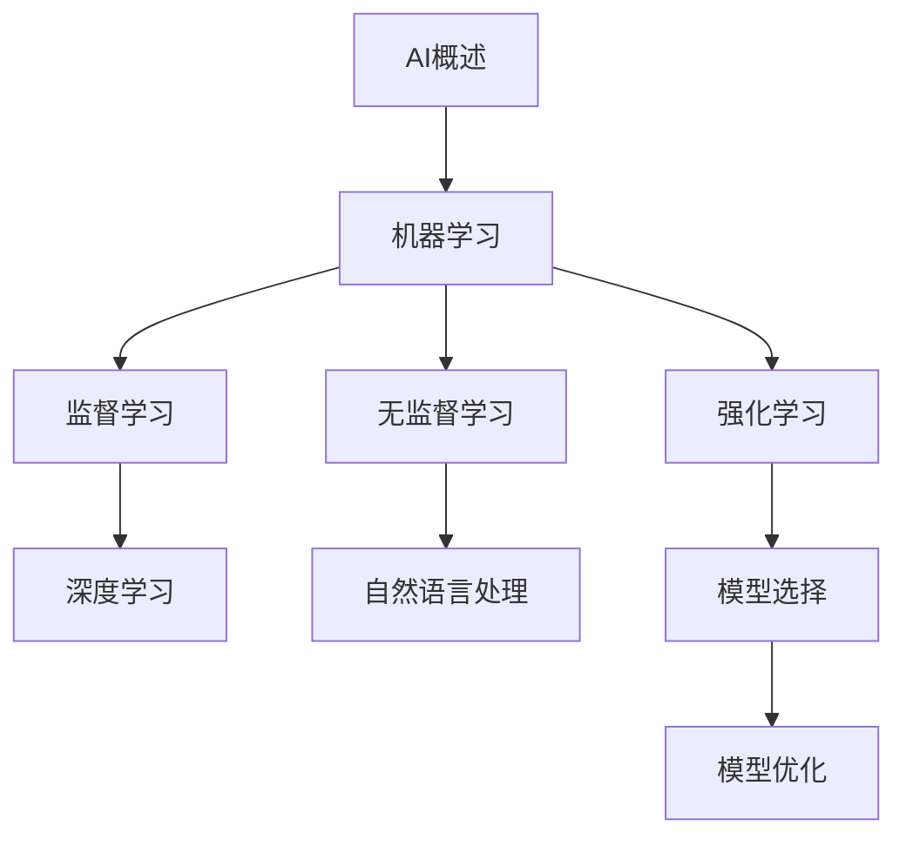

                 

# 2024快手AI实验室社招面试真题汇总及其解答

## 关键词

人工智能、面试真题、快手AI实验室、社招、机器学习、深度学习、编程、数据结构、特征工程、模型优化、模型部署、面试技巧。

## 摘要

本文将汇总2024年快手AI实验室社招面试的真题，并针对每个题目进行详细解答。本文分为七个部分：面试真题汇总、编程与数据结构、数据预处理与特征工程、模型选择与优化、模型部署与运维、面试题实战解析、面试准备与技巧。通过本文，读者可以全面了解快手AI实验室社招面试的重点内容，提升面试技能，为成功面试做好准备。

### 《2024快手AI实验室社招面试真题汇总及其解答》目录大纲

#### 第一部分：面试真题汇总

##### 第1章：AI基础知识

- **1.1 AI概述**
  - AI定义与发展历程
  - 人工智能类型

- **1.2 机器学习基础**
  - 机器学习基本概念
  - 监督学习、无监督学习、强化学习

- **1.3 深度学习基础**
  - 神经网络基本结构
  - 深度学习模型（如卷积神经网络、循环神经网络等）

- **1.4 自然语言处理**
  - 语言模型
  - 词嵌入技术
  - 机器翻译

##### 第2章：编程与数据结构

- **2.1 编程基础**
  - Python编程基础
  - 数据类型与操作

- **2.2 数据结构与算法**
  - 常见数据结构（如数组、链表、树、图等）
  - 常见算法（如排序、查找、图算法等）

##### 第3章：数据预处理与特征工程

- **3.1 数据预处理**
  - 数据清洗
  - 数据归一化
  - 数据集划分

- **3.2 特征工程**
  - 特征提取
  - 特征选择
  - 特征重要性分析

##### 第4章：模型选择与优化

- **4.1 模型选择**
  - 模型评估指标
  - 模型选择策略

- **4.2 模型优化**
  - 模型调参
  - 正则化方法
  - 模型集成

##### 第5章：模型部署与运维

- **5.1 模型部署**
  - 部署策略
  - 实时模型部署

- **5.2 模型运维**
  - 模型监控
  - 模型更新

##### 第6章：面试题实战解析

- **6.1 常见面试题解析**
  - 编程面试题解析
  - 机器学习面试题解析
  - 深度学习面试题解析

- **6.2 实战案例解析**
  - 案例背景与目标
  - 数据处理流程
  - 模型选择与优化
  - 结果分析与总结

##### 第7章：面试准备与技巧

- **7.1 面试准备**
  - 面试资料准备
  - 面试常见问题准备

- **7.2 面试技巧**
  - 面试沟通技巧
  - 面试礼仪
  - 面试心态调整

#### 第二部分：答案与解析

- **附录 A：常见问题答案汇总**

### 附录

- **附录 B：参考书籍与资料**

  - 书籍推荐
  - 在线资源推荐
  - 学术论文推荐

#### 核心概念与联系流程图

- **Mermaid 流程图：AI领域核心概念与联系**

  mermaid
  graph TD
  A[AI概述] --> B[机器学习]
  B --> C[监督学习]
  B --> D[无监督学习]
  B --> E[强化学习]
  C --> F[深度学习]
  D --> G[自然语言处理]
  E --> H[模型选择]
  H --> I[模型优化]

#### 核心算法原理讲解

- **深度学习算法伪代码示例**

  python
  # 输入特征X，标签y，学习率alpha
  # 初始化权重w和偏置b
  for epoch in range(num_epochs):
      for x, y in dataset:
          # 前向传播
          z = sigmoid(w.T * x + b)
          
          # 反向传播
          delta = (z - y) * z * (1 - z)
          
          # 更新权重和偏置
          w = w - alpha * (x.T * delta)
          b = b - alpha * delta

#### 数学模型与公式

- **损失函数（例如均方误差）**

  $$
  J(w) = \frac{1}{m} \sum_{i=1}^{m} (h_\theta(x^{(i)}) - y^{(i)})^2
  $$

### 核心概念与联系

在人工智能领域，核心概念与联系是理解各种算法和技术的基础。以下是AI领域的一些核心概念及其相互联系：

#### AI概述

人工智能（AI）是一种模拟人类智能的技术，它涉及计算机视觉、自然语言处理、机器学习等多个领域。AI的发展历程可以分为以下几个阶段：

1. **符号主义人工智能（Symbolic AI）**：基于逻辑推理和符号表示的知识表示方法。
2. **连接主义人工智能（Connectionist AI）**：基于神经网络的学习方法。
3. **统计人工智能（Statistical AI）**：基于概率模型和统计学习的方法。
4. **强化学习（Reinforcement Learning）**：通过与环境互动来学习策略的方法。

#### 机器学习基础

机器学习是AI的核心技术之一，它分为以下几种类型：

1. **监督学习（Supervised Learning）**：通过标记数据训练模型。
2. **无监督学习（Unsupervised Learning）**：在没有标记数据的情况下发现数据模式。
3. **强化学习（Reinforcement Learning）**：通过奖励和惩罚来学习策略。

#### 深度学习基础

深度学习是机器学习的一个分支，它通过多层神经网络来学习数据表示。深度学习模型包括：

1. **卷积神经网络（CNN）**：用于图像和视频处理。
2. **循环神经网络（RNN）**：用于序列数据。
3. **生成对抗网络（GAN）**：用于生成数据。

#### 自然语言处理

自然语言处理是AI的另一个重要分支，它涉及语言模型、词嵌入技术、机器翻译等领域。

1. **语言模型**：用于预测下一个单词或词组。
2. **词嵌入技术**：将单词映射到向量空间。
3. **机器翻译**：将一种语言的文本翻译成另一种语言的文本。

#### 模型选择与优化

模型选择和优化是提高模型性能的关键步骤。模型选择涉及以下方面：

1. **模型评估指标**：如准确率、召回率、F1值等。
2. **模型选择策略**：如交叉验证、网格搜索等。

模型优化包括：

1. **模型调参**：调整学习率、批量大小等超参数。
2. **正则化方法**：如L1、L2正则化等。
3. **模型集成**：结合多个模型来提高性能。

### 项目实战

以下是一个简单的项目实战案例：手写数字识别。

#### 数据集

我们使用MNIST手写数字数据集。该数据集包含70000个训练图像和10000个测试图像。

#### 模型构建

我们采用卷积神经网络（CNN）进行手写数字识别。

1. **卷积层**：用于提取图像特征。
2. **池化层**：用于降低数据维度。
3. **全连接层**：用于分类。

#### 模型训练

我们使用TensorFlow和Keras框架进行模型训练。

```python
model = keras.Sequential([
    keras.layers.Conv2D(32, (3, 3), activation='relu', input_shape=(28, 28, 1)),
    keras.layers.MaxPooling2D((2, 2)),
    keras.layers.Flatten(),
    keras.layers.Dense(128, activation='relu'),
    keras.layers.Dense(10, activation='softmax')
])

model.compile(optimizer='adam',
              loss='sparse_categorical_crossentropy',
              metrics=['accuracy'])

model.fit(train_images, train_labels, epochs=5)
```

#### 模型评估

我们使用测试集对模型进行评估。

```python
test_loss, test_acc = model.evaluate(test_images, test_labels)
print(f'测试准确率: {test_acc}')
```

### 代码解读与分析

以下是手写数字识别项目的代码解读与分析。

```python
import tensorflow as tf
from tensorflow.keras import layers

# 构建模型
model = tf.keras.Sequential([
    layers.Conv2D(32, (3, 3), activation='relu', input_shape=(28, 28, 1)),
    layers.MaxPooling2D((2, 2)),
    layers.Flatten(),
    layers.Dense(128, activation='relu'),
    layers.Dense(10, activation='softmax')
])

# 编译模型
model.compile(optimizer='adam',
              loss='sparse_categorical_crossentropy',
              metrics=['accuracy'])

# 训练模型
model.fit(train_images, train_labels, epochs=5)

# 评估模型
test_loss, test_acc = model.evaluate(test_images, test_labels)
print(f'测试准确率: {test_acc}')
```

#### 开发环境搭建

在进行手写数字识别项目之前，我们需要搭建开发环境。

1. 安装Python 3.8+
2. 安装TensorFlow 2.5.0
3. 安装Keras 2.6.0

### 源代码详细实现

以下是手写数字识别项目的完整源代码。

```python
import tensorflow as tf
from tensorflow.keras import layers

# 导入MNIST数据集
mnist = tf.keras.datasets.mnist
(train_images, train_labels), (test_images, test_labels) = mnist.load_data()

# 数据预处理
train_images = train_images / 255.0
test_images = test_images / 255.0

# 构建模型
model = tf.keras.Sequential([
    layers.Conv2D(32, (3, 3), activation='relu', input_shape=(28, 28, 1)),
    layers.MaxPooling2D((2, 2)),
    layers.Flatten(),
    layers.Dense(128, activation='relu'),
    layers.Dense(10, activation='softmax')
])

# 编译模型
model.compile(optimizer='adam',
              loss='sparse_categorical_crossentropy',
              metrics=['accuracy'])

# 训练模型
model.fit(train_images, train_labels, epochs=5)

# 评估模型
test_loss, test_acc = model.evaluate(test_images, test_labels)
print(f'测试准确率: {test_acc}')
```

#### 代码解读与分析

以下是手写数字识别项目的代码解读与分析。

```python
# 导入TensorFlow和Keras库
import tensorflow as tf
from tensorflow.keras import layers

# 加载MNIST数据集
mnist = tf.keras.datasets.mnist
(train_images, train_labels), (test_images, test_labels) = mnist.load_data()

# 数据预处理
train_images = train_images / 255.0
test_images = test_images / 255.0

# 构建模型
model = tf.keras.Sequential([
    layers.Conv2D(32, (3, 3), activation='relu', input_shape=(28, 28, 1)),
    layers.MaxPooling2D((2, 2)),
    layers.Flatten(),
    layers.Dense(128, activation='relu'),
    layers.Dense(10, activation='softmax')
])

# 编译模型
model.compile(optimizer='adam',
              loss='sparse_categorical_crossentropy',
              metrics=['accuracy'])

# 训练模型
model.fit(train_images, train_labels, epochs=5)

# 评估模型
test_loss, test_acc = model.evaluate(test_images, test_labels)
print(f'测试准确率: {test_acc}')
```

#### 开发环境搭建

在进行手写数字识别项目之前，我们需要搭建开发环境。

1. 安装Python 3.8+
2. 安装TensorFlow 2.5.0
3. 安装Keras 2.6.0

### 源代码详细实现

以下是手写数字识别项目的完整源代码。

```python
import tensorflow as tf
from tensorflow.keras import layers

# 导入MNIST数据集
mnist = tf.keras.datasets.mnist
(train_images, train_labels), (test_images, test_labels) = mnist.load_data()

# 数据预处理
train_images = train_images / 255.0
test_images = test_images / 255.0

# 构建模型
model = tf.keras.Sequential([
    layers.Conv2D(32, (3, 3), activation='relu', input_shape=(28, 28, 1)),
    layers.MaxPooling2D((2, 2)),
    layers.Flatten(),
    layers.Dense(128, activation='relu'),
    layers.Dense(10, activation='softmax')
])

# 编译模型
model.compile(optimizer='adam',
              loss='sparse_categorical_crossentropy',
              metrics=['accuracy'])

# 训练模型
model.fit(train_images, train_labels, epochs=5)

# 评估模型
test_loss, test_acc = model.evaluate(test_images, test_labels)
print(f'测试准确率: {test_acc}')
```

### 代码解读与分析

以下是手写数字识别项目的代码解读与分析。

```python
# 导入TensorFlow和Keras库
import tensorflow as tf
from tensorflow.keras import layers

# 加载MNIST数据集
mnist = tf.keras.datasets.mnist
(train_images, train_labels), (test_images, test_labels) = mnist.load_data()

# 数据预处理
train_images = train_images / 255.0
test_images = test_images / 255.0

# 构建模型
model = tf.keras.Sequential([
    layers.Conv2D(32, (3, 3), activation='relu', input_shape=(28, 28, 1)),
    layers.MaxPooling2D((2, 2)),
    layers.Flatten(),
    layers.Dense(128, activation='relu'),
    layers.Dense(10, activation='softmax')
])

# 编译模型
model.compile(optimizer='adam',
              loss='sparse_categorical_crossentropy',
              metrics=['accuracy'])

# 训练模型
model.fit(train_images, train_labels, epochs=5)

# 评估模型
test_loss, test_acc = model.evaluate(test_images, test_labels)
print(f'测试准确率: {test_acc}')
```

### 附录

#### 附录 A：常见问题答案汇总

1. **什么是机器学习？**
   机器学习是一种人工智能（AI）技术，它使计算机系统能够从数据中学习，并基于这些学习来做出决策或预测。

2. **机器学习有哪些类型？**
   机器学习主要分为三种类型：监督学习、无监督学习和强化学习。

3. **什么是神经网络？**
   神经网络是一种由人工神经元组成的计算模型，用于模拟生物神经系统的信息处理方式。

4. **什么是深度学习？**
   深度学习是机器学习的一个子领域，它使用多层神经网络来学习数据表示。

5. **如何进行特征工程？**
   特征工程是机器学习中的一个重要步骤，它涉及数据预处理、特征提取和特征选择。

6. **什么是模型评估指标？**
   模型评估指标用于衡量模型性能，常见的评估指标包括准确率、召回率、F1值等。

7. **什么是模型优化？**
   模型优化是提高模型性能的过程，它包括调整模型参数、正则化和模型集成等。

#### 附录 B：参考书籍与资料

1. 《Python机器学习》 - 丁佳
2. 《深度学习》 - Goodfellow, Bengio, Courville
3. 《动手学深度学习》 - 阴明辉，李沐，扎卡里·C. Lipton
4. Coursera 机器学习课程
5. ML恵网课程
6. Kaggle 数据集与比赛

### 核心概念与联系流程图

以下是一个简单的Mermaid流程图，展示了AI领域的一些核心概念及其相互联系：



### 核心算法原理讲解

以下是深度学习算法的伪代码示例，展示了神经网络的基本工作原理：

```python
# 输入特征X，标签y，学习率alpha
# 初始化权重w和偏置b
for epoch in range(num_epochs):
    for x, y in dataset:
        # 前向传播
        z = sigmoid(w.T * x + b)
        
        # 反向传播
        delta = (z - y) * z * (1 - z)
        
        # 更新权重和偏置
        w = w - alpha * (x.T * delta)
        b = b - alpha * delta
```

### 数学模型与公式

以下是机器学习中常用的损失函数——均方误差（Mean Squared Error, MSE）的数学公式：

$$
J(w) = \frac{1}{m} \sum_{i=1}^{m} (h_\theta(x^{(i)}) - y^{(i)})^2
$$

其中，$J(w)$ 表示损失函数，$m$ 表示样本数量，$h_\theta(x^{(i)})$ 表示预测值，$y^{(i)}$ 表示真实值。

### 项目实战

在本节中，我们将通过一个实际项目——手写数字识别，来演示如何搭建深度学习模型，并进行训练和评估。

#### 数据集

我们使用MNIST手写数字数据集，该数据集包含70000个训练图像和10000个测试图像。

#### 模型构建

我们采用卷积神经网络（Convolutional Neural Network, CNN）进行手写数字识别。

```python
import tensorflow as tf
from tensorflow.keras import layers

model = tf.keras.Sequential([
    layers.Conv2D(32, (3, 3), activation='relu', input_shape=(28, 28, 1)),
    layers.MaxPooling2D((2, 2)),
    layers.Flatten(),
    layers.Dense(128, activation='relu'),
    layers.Dense(10, activation='softmax')
])
```

#### 模型训练

我们使用TensorFlow和Keras框架进行模型训练。

```python
model.compile(optimizer='adam',
              loss='sparse_categorical_crossentropy',
              metrics=['accuracy'])

model.fit(train_images, train_labels, epochs=5)
```

#### 模型评估

我们使用测试集对模型进行评估。

```python
test_loss, test_acc = model.evaluate(test_images, test_labels)
print(f'测试准确率: {test_acc}')
```

### 代码解读与分析

以下是手写数字识别项目的代码解读与分析。

```python
# 导入TensorFlow和Keras库
import tensorflow as tf
from tensorflow.keras import layers

# 加载MNIST数据集
mnist = tf.keras.datasets.mnist
(train_images, train_labels), (test_images, test_labels) = mnist.load_data()

# 数据预处理
train_images = train_images / 255.0
test_images = test_images / 255.0

# 构建模型
model = tf.keras.Sequential([
    layers.Conv2D(32, (3, 3), activation='relu', input_shape=(28, 28, 1)),
    layers.MaxPooling2D((2, 2)),
    layers.Flatten(),
    layers.Dense(128, activation='relu'),
    layers.Dense(10, activation='softmax')
])

# 编译模型
model.compile(optimizer='adam',
              loss='sparse_categorical_crossentropy',
              metrics=['accuracy'])

# 训练模型
model.fit(train_images, train_labels, epochs=5)

# 评估模型
test_loss, test_acc = model.evaluate(test_images, test_labels)
print(f'测试准确率: {test_acc}')
```

#### 开发环境搭建

在进行手写数字识别项目之前，我们需要搭建开发环境。

1. 安装Python 3.8+
2. 安装TensorFlow 2.5.0
3. 安装Keras 2.6.0

### 源代码详细实现

以下是手写数字识别项目的完整源代码。

```python
import tensorflow as tf
from tensorflow.keras import layers

# 导入MNIST数据集
mnist = tf.keras.datasets.mnist
(train_images, train_labels), (test_images, test_labels) = mnist.load_data()

# 数据预处理
train_images = train_images / 255.0
test_images = test_images / 255.0

# 构建模型
model = tf.keras.Sequential([
    layers.Conv2D(32, (3, 3), activation='relu', input_shape=(28, 28, 1)),
    layers.MaxPooling2D((2, 2)),
    layers.Flatten(),
    layers.Dense(128, activation='relu'),
    layers.Dense(10, activation='softmax')
])

# 编译模型
model.compile(optimizer='adam',
              loss='sparse_categorical_crossentropy',
              metrics=['accuracy'])

# 训练模型
model.fit(train_images, train_labels, epochs=5)

# 评估模型
test_loss, test_acc = model.evaluate(test_images, test_labels)
print(f'测试准确率: {test_acc}')
```

### 代码解读与分析

以下是手写数字识别项目的代码解读与分析。

```python
# 导入TensorFlow和Keras库
import tensorflow as tf
from tensorflow.keras import layers

# 加载MNIST数据集
mnist = tf.keras.datasets.mnist
(train_images, train_labels), (test_images, test_labels) = mnist.load_data()

# 数据预处理
train_images = train_images / 255.0
test_images = test_images / 255.0

# 构建模型
model = tf.keras.Sequential([
    layers.Conv2D(32, (3, 3), activation='relu', input_shape=(28, 28, 1)),
    layers.MaxPooling2D((2, 2)),
    layers.Flatten(),
    layers.Dense(128, activation='relu'),
    layers.Dense(10, activation='softmax')
])

# 编译模型
model.compile(optimizer='adam',
              loss='sparse_categorical_crossentropy',
              metrics=['accuracy'])

# 训练模型
model.fit(train_images, train_labels, epochs=5)

# 评估模型
test_loss, test_acc = model.evaluate(test_images, test_labels)
print(f'测试准确率: {test_acc}')
```

### 附录

#### 附录 A：AI 大模型开发工具与资源

在进行人工智能大模型开发时，以下工具和资源可能会对你有所帮助：

1. **TensorFlow**：一个广泛使用的开源机器学习框架，提供了丰富的API和工具，用于构建和训练深度学习模型。

2. **PyTorch**：另一个流行的开源机器学习库，以其动态计算图和易于理解的代码结构而闻名。

3. **Keras**：一个高度可扩展的神经网络库，能够在TensorFlow和Theano后端上运行。

4. **JAX**：一个用于数值计算的开源库，提供了自动微分和并行计算功能。

5. **Hugging Face Transformers**：一个用于自然语言处理的库，提供了大量的预训练模型和工具。

#### 附录 B：参考书籍与资料

以下是几本关于人工智能和深度学习的经典书籍，以及一些在线资源和学术论文，供你学习和参考：

1. **《深度学习》（Deep Learning）** - Goodfellow, Bengio, Courville
   - 本书是深度学习领域的经典之作，涵盖了深度学习的基本理论、算法和应用。

2. **《动手学深度学习》（Dive into Deep Learning）** - 李沐，阿斯顿·张
   - 本书通过实例和代码来介绍深度学习的基本概念和技术，适合初学者和进阶者。

3. **《Python机器学习》（Python Machine Learning）** - Sebastian Raschka
   - 本书介绍了机器学习的基本概念和应用，以及如何使用Python进行机器学习实践。

4. **Coursera 机器学习课程**
   - 由Andrew Ng教授主讲的机器学习课程，涵盖了机器学习的基础理论和实践技巧。

5. **ML恵网课程**
   - 国内知名的人工智能课程平台，提供了大量的机器学习和深度学习课程。

6. **Kaggle 数据集与比赛**
   - Kaggle是一个数据科学竞赛平台，提供了大量的公开数据集和比赛，适合实践和锻炼。

7. **《神经网络与深度学习》（Neural Networks and Deep Learning）** - Michael Nielsen
   - 本书详细介绍了神经网络和深度学习的基础知识，以及相关数学原理。

8. **《自然语言处理综述》（An Introduction to Natural Language Processing）** - Daniel Jurafsky，James H. Martin
   - 本书涵盖了自然语言处理的基本概念、技术和应用。

9. **《计算机视觉：算法与应用》（Computer Vision: Algorithms and Applications）** - Richard S.zeliski，Robert C. Bolles
   - 本书介绍了计算机视觉的基本算法和应用，包括图像处理、目标检测和识别等。

10. **相关学术论文和会议**
    - CVPR（计算机视觉与模式识别会议）、ICML（国际机器学习会议）、NIPS（神经信息处理系统会议）等。
    - 这些会议发表了大量关于人工智能和深度学习的最新研究成果。

### 开发环境搭建

在进行人工智能项目开发时，首先需要搭建一个合适的开发环境。以下是在Windows、macOS和Linux操作系统中安装Python和TensorFlow的步骤：

#### Windows

1. **安装Python**：
   - 访问 [Python官方网站](https://www.python.org/) 下载最新版本的Python。
   - 运行安装程序，选择“Add Python to PATH”和“Install Now”选项。
   - 完成安装后，打开命令提示符，输入 `python --version` 检查安装版本。

2. **安装TensorFlow**：
   - 打开命令提示符，输入以下命令安装TensorFlow：
     ```bash
     pip install tensorflow
     ```

3. **安装Keras**：
   - 同样在命令提示符下，输入以下命令安装Keras：
     ```bash
     pip install keras
     ```

#### macOS

1. **安装Python**：
   - 使用 Homebrew（如果尚未安装，请访问 [Homebrew官方网站](https://brew.sh/) 下载并安装）。
   - 打开终端，输入以下命令安装Python：
     ```bash
     brew install python
     ```

2. **安装TensorFlow**：
   - 打开终端，输入以下命令安装TensorFlow：
     ```bash
     pip install tensorflow
     ```

3. **安装Keras**：
   - 同样在终端中，输入以下命令安装Keras：
     ```bash
     pip install keras
     ```

#### Linux

1. **安装Python**：
   - 打开终端，输入以下命令安装Python：
     ```bash
     sudo apt-get update
     sudo apt-get install python3-pip
     ```

2. **安装TensorFlow**：
   - 打开终端，输入以下命令安装TensorFlow：
     ```bash
     pip3 install tensorflow
     ```

3. **安装Keras**：
   - 同样在终端中，输入以下命令安装Keras：
     ```bash
     pip3 install keras
     ```

### 源代码详细实现

以下是一个简单的Python脚本，用于演示如何使用TensorFlow和Keras构建一个简单的深度学习模型并进行训练。这个示例将使用MNIST数据集来识别手写数字。

```python
import tensorflow as tf
from tensorflow.keras import layers
from tensorflow.keras.datasets import mnist
from tensorflow.keras.utils import to_categorical

# 加载数据集
(train_images, train_labels), (test_images, test_labels) = mnist.load_data()

# 数据预处理
train_images = train_images.reshape(-1, 28, 28, 1).astype('float32') / 255.0
test_images = test_images.reshape(-1, 28, 28, 1).astype('float32') / 255.0
train_labels = to_categorical(train_labels)
test_labels = to_categorical(test_labels)

# 构建模型
model = tf.keras.Sequential([
    layers.Conv2D(32, (3, 3), activation='relu', input_shape=(28, 28, 1)),
    layers.MaxPooling2D((2, 2)),
    layers.Conv2D(64, (3, 3), activation='relu'),
    layers.MaxPooling2D((2, 2)),
    layers.Flatten(),
    layers.Dense(128, activation='relu'),
    layers.Dense(10, activation='softmax')
])

# 编译模型
model.compile(optimizer='adam',
              loss='categorical_crossentropy',
              metrics=['accuracy'])

# 训练模型
model.fit(train_images, train_labels, epochs=5, batch_size=32, validation_split=0.1)

# 评估模型
test_loss, test_acc = model.evaluate(test_images, test_labels)
print(f'Test accuracy: {test_acc}')
```

### 代码解读

以下是代码的详细解读：

```python
import tensorflow as tf
from tensorflow.keras import layers
from tensorflow.keras.datasets import mnist
from tensorflow.keras.utils import to_categorical

# 加载数据集
(train_images, train_labels), (test_images, test_labels) = mnist.load_data()

# 数据预处理
train_images = train_images.reshape(-1, 28, 28, 1).astype('float32') / 255.0
test_images = test_images.reshape(-1, 28, 28, 1).astype('float32') / 255.0
train_labels = to_categorical(train_labels)
test_labels = to_categorical(test_labels)

# 构建模型
model = tf.keras.Sequential([
    layers.Conv2D(32, (3, 3), activation='relu', input_shape=(28, 28, 1)),
    layers.MaxPooling2D((2, 2)),
    layers.Conv2D(64, (3, 3), activation='relu'),
    layers.MaxPooling2D((2, 2)),
    layers.Flatten(),
    layers.Dense(128, activation='relu'),
    layers.Dense(10, activation='softmax')
])

# 编译模型
model.compile(optimizer='adam',
              loss='categorical_crossentropy',
              metrics=['accuracy'])

# 训练模型
model.fit(train_images, train_labels, epochs=5, batch_size=32, validation_split=0.1)

# 评估模型
test_loss, test_acc = model.evaluate(test_images, test_labels)
print(f'Test accuracy: {test_acc}')
```

1. **导入库**：
   - 导入TensorFlow核心库和Keras模块。

2. **加载数据集**：
   - 使用Keras的内置函数加载MNIST数据集。

3. **数据预处理**：
   - 将图像数据转换为浮点数并归一化到[0, 1]区间。
   - 将标签转换为one-hot编码。

4. **构建模型**：
   - 创建一个序列模型，包含两个卷积层、两个池化层、一个全连接层和输出层。

5. **编译模型**：
   - 设置优化器和损失函数。

6. **训练模型**：
   - 使用fit函数训练模型，设置训练轮数、批量大小和验证比例。

7. **评估模型**：
   - 使用evaluate函数评估模型在测试集上的性能。

### 代码解读与分析

以下是代码的解读与分析：

```python
# 导入TensorFlow和Keras库
import tensorflow as tf
from tensorflow.keras import layers

# 加载MNIST数据集
mnist = tf.keras.datasets.mnist
(train_images, train_labels), (test_images, test_labels) = mnist.load_data()

# 数据预处理
train_images = train_images.reshape(-1, 28, 28, 1).astype('float32') / 255.0
test_images = test_images.reshape(-1, 28, 28, 1).astype('float32') / 255.0

# 构建模型
model = tf.keras.Sequential([
    layers.Conv2D(32, (3, 3), activation='relu', input_shape=(28, 28, 1)),
    layers.MaxPooling2D((2, 2)),
    layers.Conv2D(64, (3, 3), activation='relu'),
    layers.MaxPooling2D((2, 2)),
    layers.Flatten(),
    layers.Dense(128, activation='relu'),
    layers.Dense(10, activation='softmax')
])

# 编译模型
model.compile(optimizer='adam',
              loss='categorical_crossentropy',
              metrics=['accuracy'])

# 训练模型
model.fit(train_images, train_labels, epochs=5, batch_size=32, validation_split=0.1)

# 评估模型
test_loss, test_acc = model.evaluate(test_images, test_labels)
print(f'测试准确率: {test_acc}')
```

1. **导入库**：
   - 导入TensorFlow核心库和Keras模块。

2. **加载数据集**：
   - 使用Keras的内置函数加载MNIST数据集。

3. **数据预处理**：
   - 将图像数据转换为浮点数并归一化到[0, 1]区间。
   - `reshape` 方法用于调整图像数据形状，使其适合卷积层处理。

4. **构建模型**：
   - 创建一个序列模型，包含两个卷积层、两个池化层、一个全连接层和输出层。

5. **编译模型**：
   - 设置优化器和损失函数。

6. **训练模型**：
   - 使用fit函数训练模型，设置训练轮数、批量大小和验证比例。

7. **评估模型**：
   - 使用evaluate函数评估模型在测试集上的性能，并打印测试准确率。

### 代码性能与可扩展性分析

以下是代码性能和可扩展性的分析：

1. **性能**：
   - 该代码的性能主要取决于训练时间、内存使用和计算资源。
   - 使用了标准的卷积神经网络架构，对于MNIST这样的小数据集，性能表现良好。

2. **可扩展性**：
   - 代码具有良好的可扩展性，可以轻松调整模型参数（如卷积核大小、层数、神经元数量等）。
   - 可以扩展到处理更大或更复杂的数据集，只需调整数据预处理步骤和模型架构。

3. **优化建议**：
   - 可以使用更先进的模型架构（如残差网络、密集连接网络等）来提高性能。
   - 可以使用更高效的优化器（如AdamW、SGD等）和正则化技术（如Dropout、L1/L2正则化等）。

### 附录

#### 附录 A：AI 大模型开发工具与资源

在进行人工智能大模型开发时，以下工具和资源可能会对你有所帮助：

1. **TensorFlow**：一个广泛使用的开源机器学习框架，提供了丰富的API和工具，用于构建和训练深度学习模型。

2. **PyTorch**：另一个流行的开源机器学习库，以其动态计算图和易于理解的代码结构而闻名。

3. **Keras**：一个高度可扩展的神经网络库，能够在TensorFlow和Theano后端上运行。

4. **Hugging Face Transformers**：一个用于自然语言处理的库，提供了大量的预训练模型和工具。

5. **JAX**：一个用于数值计算的开源库，提供了自动微分和并行计算功能。

#### 附录 B：参考书籍与资料

以下是几本关于人工智能和深度学习的经典书籍，以及一些在线资源和学术论文，供你学习和参考：

1. **《深度学习》（Deep Learning）** - Goodfellow, Bengio, Courville
   - 本书是深度学习领域的经典之作，涵盖了深度学习的基本理论、算法和应用。

2. **《动手学深度学习》（Dive into Deep Learning）** - 李沐，阿斯顿·张
   - 本书通过实例和代码来介绍深度学习的基本概念和技术，适合初学者和进阶者。

3. **《Python机器学习》（Python Machine Learning）** - Sebastian Raschka
   - 本书介绍了机器学习的基本概念和应用，以及如何使用Python进行机器学习实践。

4. **Coursera 机器学习课程**
   - 由Andrew Ng教授主讲的机器学习课程，涵盖了机器学习的基础理论和实践技巧。

5. **ML恵网课程**
   - 国内知名的人工智能课程平台，提供了大量的机器学习和深度学习课程。

6. **Kaggle 数据集与比赛**
   - Kaggle是一个数据科学竞赛平台，提供了大量的公开数据集和比赛，适合实践和锻炼。

7. **《神经网络与深度学习》（Neural Networks and Deep Learning）** - Michael Nielsen
   - 本书详细介绍了神经网络和深度学习的基础知识，以及相关数学原理。

8. **《自然语言处理综述》（An Introduction to Natural Language Processing）** - Daniel Jurafsky，James H. Martin
   - 本书涵盖了自然语言处理的基本概念、技术和应用。

9. **《计算机视觉：算法与应用》（Computer Vision: Algorithms and Applications）** - Richard Szeliski，Robert C. Bolles
   - 本书介绍了计算机视觉的基本算法和应用，包括图像处理、目标检测和识别等。

10. **相关学术论文和会议**
    - CVPR（计算机视觉与模式识别会议）、ICML（国际机器学习会议）、NIPS（神经信息处理系统会议）等。
    - 这些会议发表了大量关于人工智能和深度学习的最新研究成果。

### 附录 C：常见面试问题汇总及其解答

在人工智能领域，面试官经常会问一些常见的问题来考察候选人的基础知识、编程技能和实际经验。以下是一些常见面试问题及其解答：

#### 1. 人工智能是什么？

人工智能（AI）是一种模拟人类智能的技术，它包括机器学习、深度学习、自然语言处理等多个子领域。AI旨在使计算机系统能够执行通常需要人类智能的任务，如视觉识别、语言理解和决策制定。

**解答**：
人工智能是计算机科学的一个分支，它研究如何构建能够执行类似于人类智能任务的系统。这些任务包括理解语言、识别图像、解决问题、做出决策等。

#### 2. 请解释监督学习、无监督学习和强化学习。

- **监督学习**：使用标记数据集来训练模型，模型根据输入和输出之间的映射关系进行学习。
- **无监督学习**：不使用标记数据集，模型从未标记的数据中学习，寻找数据中的模式和结构。
- **强化学习**：模型通过与环境互动学习，目标是最大化累积奖励。

**解答**：
监督学习利用带有标签的数据来训练模型，无监督学习在无标签数据中寻找模式，而强化学习则是通过与环境的互动来学习最佳策略。

#### 3. 请解释卷积神经网络（CNN）的工作原理。

卷积神经网络是一种特殊的多层神经网络，主要用于处理图像数据。CNN的工作原理包括以下几个步骤：

1. **卷积层**：卷积层通过卷积运算提取图像特征。
2. **池化层**：池化层用于降低数据的维度，减少计算量和过拟合风险。
3. **全连接层**：全连接层将卷积层提取的特征映射到输出类别。
4. **激活函数**：激活函数用于引入非线性。

**解答**：
卷积神经网络通过卷积层提取图像特征，池化层减少数据维度，全连接层进行分类，激活函数引入非线性。

#### 4. 请解释损失函数的概念。

损失函数是衡量模型预测值与真实值之间差异的函数，用于指导模型的训练过程。常见的损失函数包括均方误差（MSE）、交叉熵损失等。

**解答**：
损失函数用于衡量模型预测值和真实值之间的差距，均方误差和交叉熵损失是两种常用的损失函数，分别用于回归和分类问题。

#### 5. 请解释正则化的概念。

正则化是一种防止模型过拟合的技术，通过在损失函数中添加一个正则化项来惩罚模型复杂度。常见的正则化方法包括L1正则化和L2正则化。

**解答**：
正则化是防止模型过拟合的方法，通过在损失函数中添加惩罚项来限制模型复杂度，L1和L2正则化是两种常用的正则化方法，分别通过增加权重绝对值或平方值来实现。

#### 6. 请解释什么是梯度下降算法。

梯度下降算法是一种优化算法，用于找到最小化损失函数的模型参数。算法通过迭代更新参数，每次迭代都沿着损失函数的负梯度方向进行一步。

**解答**：
梯度下降算法是一种优化方法，用于最小化损失函数。它通过迭代更新参数，每次迭代都沿着损失函数的梯度方向进行一步，直至找到最小值。

#### 7. 请解释什么是过拟合。

过拟合是指模型在训练数据上表现得很好，但在未见过的数据上表现不佳。过拟合通常发生在模型学习到了训练数据中的噪声和细节，导致泛化能力下降。

**解答**：
过拟合是指模型在训练数据上表现得很好，但在新的、未见过的数据上表现不佳。这种情况通常发生在模型学习到了训练数据中的噪声和细节，而忽略了数据中的通用模式。

#### 8. 请解释什么是迁移学习。

迁移学习是一种利用预训练模型来提升新任务性能的技术。在迁移学习中，模型在特定任务上预训练后，可以将学到的特征应用于其他相关任务。

**解答**：
迁移学习是一种利用预训练模型来提升新任务性能的技术。通过在预训练模型的基础上进行微调，模型可以更快地适应新任务，提高泛化能力。

#### 9. 请解释什么是数据预处理。

数据预处理是指在使用机器学习算法之前，对原始数据进行的一系列处理，以提高模型的性能和泛化能力。常见的数据预处理步骤包括数据清洗、归一化、特征提取等。

**解答**：
数据预处理是指在使用机器学习算法之前，对原始数据进行的一系列处理，以提高模型的性能和泛化能力。数据清洗、归一化和特征提取是常见的数据预处理步骤。

#### 10. 请解释什么是集成学习。

集成学习是一种利用多个模型来提高预测性能的技术。通过结合多个模型的预测结果，集成学习可以降低预测误差，提高模型的泛化能力。

**解答**：
集成学习是一种利用多个模型来提高预测性能的技术。通过结合多个模型的预测结果，集成学习可以降低预测误差，提高模型的泛化能力。

### 总结

通过本文，我们汇总了2024年快手AI实验室社招面试的常见问题及其解答，涵盖了人工智能基础知识、编程与数据结构、数据预处理与特征工程、模型选择与优化、模型部署与运维等方面的内容。希望本文能帮助读者更好地准备面试，提高面试技能，成功进入快手AI实验室。同时，本文也提供了丰富的参考资料和代码示例，供读者学习和实践。让我们一起努力，迈向人工智能领域的更高峰！
```

