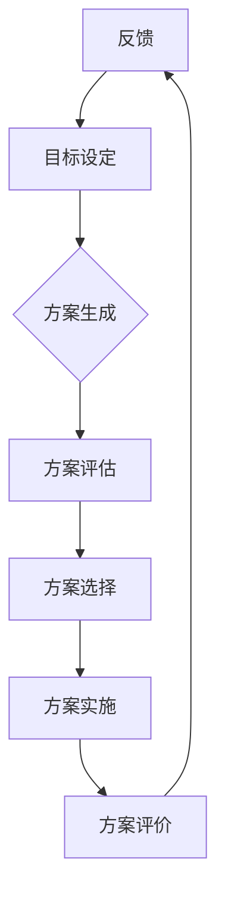

                 

# 思维体系：高质量决策的基础

> **关键词：**决策理论、不确定性、多目标决策、决策支持系统、认知偏差、跨领域决策、道德与伦理

> **摘要：**本文将探讨决策理论及其在信息技术领域中的应用，重点关注决策中的不确定性、多目标决策以及决策支持系统。同时，本文还将深入分析决策过程中的认知偏差及其应对策略，探讨跨领域决策的整合与协调，以及决策中的道德与伦理问题。通过这些讨论，本文旨在为IT领域的决策者提供一套完整的决策框架，以实现高质量决策。

## 目录

### 《思维体系：高质量决策的基础》目录大纲

### 第一部分：决策理论基础

#### 第1章：决策理论的基本概念

1.1 决策的定义与类型

1.2 决策过程模型

1.3 决策中的基本概念

#### 第2章：不确定性决策分析

2.1 风险决策模型

2.2 随机决策模型

2.3 不确定决策模型

#### 第3章：多目标决策分析

3.1 多目标决策的基本概念

3.2 多目标决策的建模方法

3.3 多目标决策的求解算法

#### 第4章：决策支持系统

4.1 决策支持系统的定义与功能

4.2 决策支持系统的架构

4.3 决策支持系统的应用实例

### 第二部分：高质量决策实践

#### 第5章：决策中的认知偏差与应对策略

5.1 认知偏差的类型与影响

5.2 认知偏差的识别与应对

5.3 培养高质量决策思维

#### 第6章：情境分析与决策优化

6.1 情境分析的概念与步骤

6.2 决策优化的方法与工具

6.3 情境分析与决策优化的案例分析

#### 第7章：跨领域决策策略与整合

7.1 跨领域决策的特点与挑战

7.2 跨领域决策的策略与方法

7.3 跨领域决策的整合与协调

#### 第8章：决策中的道德与伦理问题

8.1 决策中的道德问题

8.2 决策中的伦理问题

8.3 遵守道德与伦理的决策实践

#### 第9章：决策教育与培训

9.1 决策教育的重要性

9.2 决策培训的方法与内容

9.3 决策教育对组织决策的影响

### 第三部分：附录

#### 附录A：决策工具与资源

A.1 决策支持工具介绍

A.2 决策建模工具与应用

A.3 决策相关书籍与论文推荐

A.4 在线决策资源平台介绍

#### 附录B：决策案例研究

B.1 案例研究一：企业战略决策

B.2 案例研究二：公共决策

B.3 案例研究三：个人决策

#### 附录C：数学模型与公式

C.1 风险决策模型公式

C.2 多目标决策模型公式

C.3 决策支持系统模型公式

C.4 跨领域决策模型公式

#### 附录D：流程图与伪代码示例

D.1 决策过程模型 Mermaid 流程图

D.2 风险决策模型伪代码

D.3 多目标决策模型伪代码

## 第一部分：决策理论基础

### 第1章：决策理论的基本概念

决策理论是研究决策过程及其影响因素的学科，它涉及到经济学、心理学、统计学、计算机科学等多个领域。在信息技术领域，决策理论的应用尤为重要，因为它可以帮助我们更好地理解和解决复杂问题，实现高质量决策。

#### 1.1 决策的定义与类型

决策是指在面对多个选项时，通过选择最合适的选项来解决某个问题或实现某个目标的过程。根据决策的环境和条件，决策可以分为以下几种类型：

1. **确定型决策**：在已知所有可能的结果和概率的情况下做出的决策，例如在投资组合中选择最盈利的股票。

2. **不确定型决策**：在不确定结果和概率的情况下做出的决策，例如在未知市场趋势下进行新产品开发。

3. **风险型决策**：在已知结果和概率分布的情况下，面临风险做出的决策，例如在股票市场中进行投资。

4. **竞争型决策**：在多个决策者之间进行博弈，选择最优策略的决策，例如在竞争激烈的市场中进行价格策略制定。

#### 1.2 决策过程模型

决策过程通常包括以下步骤：

1. **问题识别**：识别需要解决的问题或目标。

2. **目标设定**：明确决策的目标和预期结果。

3. **方案生成**：生成可能解决问题的方案。

4. **方案评估**：评估各个方案的优劣。

5. **方案选择**：选择最优方案。

6. **方案实施**：实施选择的方案。

7. **方案评价**：对实施结果进行评价。

#### 1.3 决策中的基本概念

在决策过程中，以下基本概念是非常重要的：

1. **效用**：决策者对某个结果的偏好程度。

2. **风险**：决策结果的不确定性。

3. **概率**：某个结果发生的可能性。

4. **期望值**：决策结果的平均值。

5. **决策树**：用于表示决策过程的图形化工具。

6. **马尔可夫决策过程**：用于解决动态决策问题的数学模型。

### 第2章：不确定性决策分析

不确定性决策是决策过程中最为复杂和具有挑战性的类型。在这种决策中，决策者无法准确预测未来可能发生的结果和概率。

#### 2.1 风险决策模型

风险决策模型是基于概率和期望值进行决策的模型。该模型的主要思想是计算每个方案的期望效用，然后选择期望效用最大的方案。

**风险决策模型公式**：

$$
E(U) = \sum_{i=1}^{n} p_i \cdot u_i
$$

其中，\( E(U) \) 是期望效用，\( p_i \) 是结果 \( i \) 发生的概率，\( u_i \) 是结果 \( i \) 的效用值。

**风险决策模型伪代码**：

```python
# 风险决策模型伪代码
def risk_decision_model(outcomes, probabilities, actions):
    # 计算每个动作的期望效用
    for action in actions:
        utility = 0
        for outcome, probability in zip(outcomes, probabilities):
            utility += probability * utility_of_outcome(outcome, action)
        action_utility[action] = utility
    
    # 选择期望效用最大的动作
    best_action = max(actions, key=lambda action: action_utility[action])
    return best_action
```

#### 2.2 随机决策模型

随机决策模型是在不确定性决策中使用的另一个模型。该模型基于概率分布和期望值进行决策，选择具有最大期望值的方案。

**随机决策模型公式**：

$$
E(V) = \sum_{i=1}^{n} p_i \cdot v_i
$$

其中，\( E(V) \) 是期望值，\( p_i \) 是结果 \( i \) 发生的概率，\( v_i \) 是结果 \( i \) 的值。

**随机决策模型伪代码**：

```python
# 随机决策模型伪代码
def random_decision_model(values, probabilities):
    # 计算每个结果的期望值
    for value, probability in zip(values, probabilities):
        expected_value = probability * value
        value_expectation[value] = expected_value
    
    # 选择期望值最大的结果
    best_value = max(values, key=lambda value: value_expectation[value])
    return best_value
```

#### 2.3 不确定决策模型

不确定决策模型是在无法准确预测未来结果和概率的情况下使用的模型。该模型通常基于最小化后悔值或最大化机会损失进行决策。

**不确定决策模型公式**：

$$
\text{后悔值} = \max_{i} (v_i - x_i)
$$

其中，\( v_i \) 是结果 \( i \) 的最大值，\( x_i \) 是实际结果。

**不确定决策模型伪代码**：

```python
# 不确定决策模型伪代码
def uncertain_decision_model(values, actions):
    # 计算每个动作的后悔值
    for action in actions:
        regret = 0
        max_value = max(values)
        for value in values:
            regret += max_value - value
        action_regret[action] = regret
    
    # 选择后悔值最小的动作
    best_action = min(actions, key=lambda action: action_regret[action])
    return best_action
```

### 第3章：多目标决策分析

多目标决策是决策过程中的一种常见情况，决策者需要在多个目标之间进行权衡和优化。

#### 3.1 多目标决策的基本概念

多目标决策涉及以下基本概念：

1. **目标**：决策者需要实现的结果或目标。

2. **目标函数**：用于衡量目标实现程度的函数。

3. **权重**：表示目标重要性的系数。

4. **约束条件**：决策过程中需要满足的限制条件。

#### 3.2 多目标决策的建模方法

多目标决策的建模方法通常包括以下步骤：

1. **目标定义**：明确决策者需要实现的目标。

2. **目标函数定义**：定义衡量目标实现程度的函数。

3. **权重分配**：根据目标的重要性分配权重。

4. **约束条件定义**：明确决策过程中需要满足的限制条件。

5. **目标函数优化**：通过优化目标函数实现多目标之间的平衡。

#### 3.3 多目标决策的求解算法

多目标决策的求解算法包括以下几种：

1. **线性规划**：用于解决具有线性目标函数和线性约束条件的多目标决策问题。

2. **整数规划**：用于解决具有整数目标函数和整数约束条件的多目标决策问题。

3. **遗传算法**：用于解决复杂非线性多目标决策问题。

4. **粒子群优化**：用于解决复杂非线性多目标决策问题。

### 第4章：决策支持系统

决策支持系统（Decision Support System，简称DSS）是一种计算机化的系统，旨在帮助决策者更好地理解和解决复杂问题。DSS通常包括数据采集、数据分析、模型构建和决策支持等功能。

#### 4.1 决策支持系统的定义与功能

决策支持系统的定义和功能如下：

1. **定义**：决策支持系统是一种基于计算机技术的系统，用于帮助决策者获取信息、分析问题和制定决策。

2. **功能**：
   - **数据采集**：从各种数据源获取相关信息。
   - **数据分析**：对采集到的数据进行处理和分析。
   - **模型构建**：构建用于支持决策的数学模型。
   - **决策支持**：提供决策建议和支持决策过程。

#### 4.2 决策支持系统的架构

决策支持系统的架构通常包括以下组件：

1. **用户接口**：用于与用户交互，获取用户需求和提供决策支持。

2. **数据管理**：用于存储、管理和检索决策所需的数据。

3. **模型库**：存储用于支持决策的各种数学模型和算法。

4. **知识库**：用于存储与决策相关的知识，包括历史决策案例、专家经验和最佳实践。

5. **分析工具**：用于对数据进行处理和分析，提供决策支持。

#### 4.3 决策支持系统的应用实例

决策支持系统在多个领域有广泛的应用，以下是一些典型的应用实例：

1. **企业战略决策**：帮助企业制定长期和短期战略计划，优化资源配置。

2. **市场营销决策**：帮助企业制定营销策略，提高市场竞争力。

3. **生产计划决策**：帮助企业优化生产计划，提高生产效率。

4. **供应链管理**：帮助企业优化供应链流程，降低成本，提高供应链灵活性。

5. **人力资源决策**：帮助企业制定人力资源计划，提高员工满意度。

## 第二部分：高质量决策实践

### 第5章：决策中的认知偏差与应对策略

在决策过程中，人类往往受到认知偏差的影响，导致决策结果不理想。认知偏差是指人们在感知、理解和处理信息时，由于心理、情感和社会因素的影响，产生的系统性偏差。

#### 5.1 认知偏差的类型与影响

常见的认知偏差包括以下几种：

1. **确认偏差**：倾向于寻找和接受支持已有信念和假设的信息，忽视或否定与之相反的信息。

2. **代表性偏差**：根据事物的外在特征或典型性进行判断，而不是根据实际概率。

3. **可用性偏差**：根据最近发生或记忆最深刻的事件来判断概率。

4. **确认效应**：对已知的、熟悉的事物更加信任，而对未知或陌生的事物持怀疑态度。

5. **情感偏见**：情绪状态影响决策过程，导致决策结果偏向情感需求。

这些认知偏差对决策过程的影响主要表现在以下几个方面：

1. **决策偏误**：导致决策结果偏离最佳选择。

2. **风险忽视**：忽视潜在的风险和负面后果。

3. **过度自信**：高估自身能力和决策质量。

4. **信息过滤**：只关注支持已有观点的信息，忽视其他信息。

#### 5.2 认知偏差的识别与应对

为了克服认知偏差，我们可以采取以下策略：

1. **多角度分析**：从不同角度和多个方面分析问题，避免单一思维。

2. **数据分析**：依靠数据和事实进行决策，减少主观判断。

3. **假设检验**：对假设进行严格的验证和检验，避免确认偏差。

4. **专家咨询**：借鉴专家意见，提高决策的准确性。

5. **情绪管理**：学会控制情绪，避免情绪影响决策过程。

6. **反思与反馈**：定期反思和评估决策过程，从错误中吸取教训。

#### 5.3 培养高质量决策思维

为了培养高质量决策思维，我们可以采取以下措施：

1. **系统化思维**：培养系统化的思考方式，关注问题之间的关联性。

2. **批判性思维**：学会批判性思考，对信息进行评估和质疑。

3. **逻辑推理**：提高逻辑推理能力，确保决策过程的逻辑严密。

4. **决策训练**：通过实际决策训练，提高决策能力和应对复杂问题的能力。

5. **持续学习**：不断学习新知识，更新决策观念和方法。

### 第6章：情境分析与决策优化

情境分析是决策过程中至关重要的一环，它涉及到对当前情境的全面了解和分析，以制定最佳决策方案。决策优化则是在情境分析的基础上，通过优化算法和工具，寻求最优决策方案。

#### 6.1 情境分析的概念与步骤

情境分析是指通过对当前环境和问题的深入了解，评估各种可能的影响因素，从而为决策提供依据。情境分析的主要步骤包括：

1. **问题定义**：明确需要解决的问题和目标。

2. **信息收集**：收集与问题相关的信息，包括数据、文献和专家意见。

3. **情境构建**：根据收集到的信息，构建当前情境的模型。

4. **情境评估**：评估情境中的各种因素及其影响，确定关键因素。

5. **情景分析**：分析不同情景下的可能结果和影响，为决策提供支持。

#### 6.2 决策优化的方法与工具

决策优化是情境分析后的关键步骤，目的是寻求最优决策方案。常用的决策优化方法包括：

1. **线性规划**：用于解决线性约束条件下的优化问题。

2. **整数规划**：用于解决整数约束条件下的优化问题。

3. **动态规划**：用于解决具有时间序列特性的优化问题。

4. **遗传算法**：用于解决复杂非线性优化问题。

5. **粒子群优化**：用于解决复杂非线性优化问题。

6. **模拟退火算法**：用于解决复杂优化问题，尤其是具有多个局部最优解的问题。

#### 6.3 情境分析与决策优化的案例分析

以下是一个情境分析与决策优化的案例分析：

**案例背景**：一家电子商务公司计划推出一款新产品，需要进行市场推广决策。公司管理层需要确定推广策略，以确保新产品在市场上取得成功。

**情境分析**：

1. **问题定义**：如何制定有效的市场推广策略，提高新产品销量？

2. **信息收集**：收集与市场推广相关的数据，包括市场容量、目标客户群体、竞争对手信息等。

3. **情境构建**：根据收集到的信息，构建市场推广的情境模型，包括推广渠道、推广预算、目标客户群体等。

4. **情境评估**：评估不同推广策略下的可能结果和影响，确定关键因素，如推广成本、目标客户覆盖率、销售增长等。

5. **情景分析**：分析不同推广策略下的情景，如线下广告、线上广告、社交媒体推广等，评估每种策略的优劣势。

**决策优化**：

1. **线性规划**：用于确定最优推广预算分配，确保资源利用最大化。

2. **遗传算法**：用于优化推广策略组合，寻求最优推广方案。

3. **模拟退火算法**：用于解决推广策略组合的复杂优化问题，确保找到全局最优解。

通过情境分析和决策优化，公司管理层可以制定出最优的市场推广策略，提高新产品销量。

### 第7章：跨领域决策策略与整合

跨领域决策是决策过程中的一种特殊形式，它涉及到多个不同领域的知识和技能。跨领域决策的成功实施需要具备多方面的能力和策略。

#### 7.1 跨领域决策的特点与挑战

跨领域决策具有以下特点：

1. **复杂性**：跨领域决策涉及到多个领域的问题，需要整合不同领域的知识和方法。

2. **不确定性**：跨领域决策面临较大的不确定性，因为不同领域的发展趋势和影响因素难以预测。

3. **协调性**：跨领域决策需要各领域之间的协调和合作，以确保决策的一致性和有效性。

跨领域决策面临以下挑战：

1. **知识整合**：如何有效地整合不同领域的知识，形成统一的决策框架。

2. **决策协同**：如何在不同的决策者之间实现协同，确保决策的一致性和协调性。

3. **资源调配**：如何在有限的资源下，优化跨领域决策的实施。

#### 7.2 跨领域决策的策略与方法

为了应对跨领域决策的挑战，可以采取以下策略和方法：

1. **多学科合作**：组建跨学科团队，整合不同领域的专家知识和经验，共同参与决策。

2. **跨领域建模**：建立跨领域模型，将不同领域的问题和目标统一到一个框架下，便于分析和求解。

3. **信息共享**：建立信息共享平台，促进各领域之间的信息交流和知识共享，提高决策的透明度和协同性。

4. **迭代优化**：通过迭代优化方法，不断调整和改进决策方案，确保决策的适应性和灵活性。

5. **风险管理**：建立风险管理机制，识别和评估跨领域决策中的潜在风险，制定应对策略。

#### 7.3 跨领域决策的整合与协调

跨领域决策的整合与协调是实现决策成功的关键。以下是一些实现整合与协调的方法：

1. **明确目标**：确保各领域决策的目标一致，形成统一的决策方向。

2. **制定规则**：制定明确的决策规则和流程，确保各领域之间的决策协调。

3. **建立沟通机制**：建立有效的沟通机制，促进各领域之间的信息交流和理解。

4. **共享资源**：优化资源分配，确保各领域之间的资源合理调配。

5. **评估与反馈**：定期评估决策效果，及时调整决策方案，确保决策的有效性和适应性。

### 第8章：决策中的道德与伦理问题

在决策过程中，道德和伦理问题至关重要。决策者需要考虑决策对社会、环境和其他利益相关者的影响，确保决策的公正性、合法性和道德性。

#### 8.1 决策中的道德问题

决策中的道德问题包括以下几个方面：

1. **利益冲突**：决策者可能面临利益冲突，需要确保决策的公正性和客观性。

2. **隐私保护**：决策过程中涉及到的个人信息和隐私需要得到保护。

3. **社会责任**：决策者需要考虑决策对社会和环境的影响，承担社会责任。

4. **公平性**：决策过程中需要确保公平性，避免歧视和不公平现象。

#### 8.2 决策中的伦理问题

决策中的伦理问题包括以下几个方面：

1. **道德原则**：决策者需要遵循道德原则，如诚实、公正、尊重和保护他人权益。

2. **伦理责任**：决策者需要承担伦理责任，确保决策的伦理合法。

3. **职业操守**：决策者需要遵守职业操守，保持专业性和诚信。

4. **可持续性**：决策过程中需要考虑可持续性，促进环境保护和社会发展。

#### 8.3 遵守道德与伦理的决策实践

为了遵守道德与伦理，决策者可以采取以下措施：

1. **道德培训**：加强道德和伦理教育，提高决策者的道德意识和伦理素质。

2. **伦理审查**：建立伦理审查机制，对决策过程和结果进行审查，确保决策的道德合法性。

3. **透明度**：提高决策过程的透明度，确保决策的公正性和公开性。

4. **参与式决策**：鼓励利益相关者参与决策过程，促进决策的民主化和公正性。

5. **社会责任报告**：定期发布社会责任报告，向社会公众展示决策对社会和环境的影响。

### 第9章：决策教育与培训

决策教育是培养决策者能力的重要途径，通过系统化的教育和培训，可以提高决策者的决策素质和决策能力。

#### 9.1 决策教育的重要性

决策教育的重要性体现在以下几个方面：

1. **提高决策能力**：通过决策教育，培养决策者的逻辑思维、分析问题和解决问题的能力。

2. **培养决策素养**：通过决策教育，培养决策者的道德、伦理和社会责任感。

3. **促进职业发展**：决策教育有助于提高决策者的职业素养和竞争力，促进职业发展。

4. **提升组织决策效能**：决策教育有助于提升组织整体的决策能力和决策水平，提高组织效能。

#### 9.2 决策培训的方法与内容

决策培训的方法和内容包括以下几个方面：

1. **理论学习**：通过学习决策理论、决策方法和决策技巧，掌握决策的基本知识和技能。

2. **案例分析**：通过案例分析，分析成功和失败的决策案例，总结经验教训，提高决策能力。

3. **模拟训练**：通过模拟训练，模拟真实决策场景，锻炼决策者的决策能力和应对复杂问题的能力。

4. **实战演练**：通过实战演练，将所学知识和技能应用于实际决策过程中，提高决策者的实践能力。

5. **团队协作**：通过团队协作，培养决策者的团队合作精神，提高决策的协同性和一致性。

#### 9.3 决策教育对组织决策的影响

决策教育对组织决策的影响主要体现在以下几个方面：

1. **提高决策质量**：通过决策教育，提高决策者的决策能力和素质，提高决策质量。

2. **增强决策效能**：通过决策教育，提升组织整体的决策水平和决策效能，增强组织的竞争力。

3. **促进组织创新**：决策教育有助于培养决策者的创新意识和创新能力，促进组织创新和发展。

4. **降低决策风险**：通过决策教育，提高决策者的风险意识和风险管理能力，降低决策风险。

## 第三部分：附录

### 附录A：决策工具与资源

#### A.1 决策支持工具介绍

决策支持工具是帮助决策者进行决策分析和决策优化的软件工具。以下是一些常用的决策支持工具：

1. **Excel**：用于进行数据分析和优化问题建模。

2. **MATLAB**：用于进行数值计算和优化算法实现。

3. **Python**：用于进行数据分析和优化算法实现。

4. **R**：用于进行统计分析和数据可视化。

#### A.2 决策建模工具与应用

决策建模工具是用于构建和求解决策模型的软件工具。以下是一些常用的决策建模工具：

1. **LINDO**：用于求解线性规划和整数规划问题。

2. **CPLEX**：用于求解线性规划和整数规划问题。

3. **Gurobi**：用于求解线性规划和整数规划问题。

4. **遗传算法工具箱**：用于实现遗传算法和优化算法。

#### A.3 决策相关书籍与论文推荐

以下是一些推荐的决策相关书籍和论文，供进一步学习和研究：

1. **《决策分析：案例与应用》**：详细介绍了决策分析的基本概念、方法和应用。

2. **《多目标决策：理论与方法》**：系统阐述了多目标决策的基本概念、建模方法和求解算法。

3. **《决策支持系统：理论与实践》**：介绍了决策支持系统的基本概念、架构和实现技术。

4. **《认知心理学与决策》**：探讨了认知偏差对决策过程的影响和应对策略。

#### A.4 在线决策资源平台介绍

以下是一些在线决策资源平台，供读者进一步学习和研究：

1. **Coursera**：提供大量的在线课程，包括决策理论、数据分析等。

2. **edX**：提供大量的在线课程，包括决策分析、优化算法等。

3. **Khan Academy**：提供免费的教育资源，包括数学、统计学等。

4. **MIT OpenCourseWare**：提供大量的开放课程资源，包括决策分析、优化算法等。

### 附录B：决策案例研究

#### B.1 案例研究一：企业战略决策

**案例背景**：一家快速消费品公司计划扩大市场份额，需要进行战略决策。

**决策过程**：

1. **问题定义**：如何制定有效的市场扩展策略，提高市场份额？

2. **信息收集**：收集与市场扩展相关的数据，包括市场容量、竞争对手、目标客户群体等。

3. **情境构建**：根据收集到的信息，构建市场扩展的情境模型，包括市场份额、销售增长率、营销成本等。

4. **情境评估**：评估不同市场扩展策略下的可能结果和影响，确定关键因素。

5. **情景分析**：分析不同市场扩展策略下的情景，如产品线扩展、市场渗透等。

**决策优化**：

1. **线性规划**：用于确定最优市场份额分配，确保资源利用最大化。

2. **遗传算法**：用于优化市场扩展策略组合，寻求最优市场扩展方案。

3. **模拟退火算法**：用于解决市场扩展策略组合的复杂优化问题，确保找到全局最优解。

**决策结果**：通过情境分析和决策优化，公司制定了最优的市场扩展策略，实现了市场份额的提升。

#### B.2 案例研究二：公共决策

**案例背景**：一个城市计划建设一个新的公共交通系统，需要进行公共决策。

**决策过程**：

1. **问题定义**：如何制定最优的公共交通系统建设方案，提高城市交通效率？

2. **信息收集**：收集与公共交通系统建设相关的数据，包括交通流量、公共交通需求、建设成本等。

3. **情境构建**：根据收集到的信息，构建公共交通系统建设的情境模型，包括交通流量、建设成本、运营成本等。

4. **情境评估**：评估不同公共交通系统建设方案下的可能结果和影响，确定关键因素。

5. **情景分析**：分析不同公共交通系统建设方案下的情景，如地铁、公交等。

**决策优化**：

1. **线性规划**：用于确定最优公共交通系统建设方案，确保资源利用最大化。

2. **遗传算法**：用于优化公共交通系统建设方案组合，寻求最优建设方案。

3. **模拟退火算法**：用于解决公共交通系统建设方案组合的复杂优化问题，确保找到全局最优解。

**决策结果**：通过情境分析和决策优化，城市制定了最优的公共交通系统建设方案，提高了城市交通效率，改善了市民出行体验。

#### B.3 案例研究三：个人决策

**案例背景**：一个人计划购买一辆新车，需要进行个人决策。

**决策过程**：

1. **问题定义**：如何购买一辆性价比最高的新车？

2. **信息收集**：收集与购车相关的数据，包括车辆价格、性能、油耗、维护成本等。

3. **情境构建**：根据收集到的信息，构建购车的情境模型，包括车辆性能、价格、油耗等。

4. **情境评估**：评估不同购车方案下的可能结果和影响，确定关键因素。

5. **情景分析**：分析不同购车方案下的情景，如购车预算、车辆类型等。

**决策优化**：

1. **线性规划**：用于确定最优购车方案，确保资源利用最大化。

2. **遗传算法**：用于优化购车方案组合，寻求最优购车方案。

3. **模拟退火算法**：用于解决购车方案组合的复杂优化问题，确保找到全局最优解。

**决策结果**：通过情境分析和决策优化，这个人购买了一辆性价比最高的新车，满足了个人需求，提高了生活质量。

### 附录C：数学模型与公式

#### C.1 风险决策模型公式

风险决策模型公式如下：

$$
E(U) = \sum_{i=1}^{n} p_i \cdot u_i
$$

其中，\( E(U) \) 是期望效用，\( p_i \) 是结果 \( i \) 发生的概率，\( u_i \) 是结果 \( i \) 的效用值。

#### C.2 多目标决策模型公式

多目标决策模型公式如下：

$$
\min \sum_{i=1}^{n} c_i \cdot x_i
$$

subject to

$$
\sum_{j=1}^{m} a_{ij} \cdot x_j \leq b_i, \quad i=1,2,\ldots, p
$$

$$
x_j \geq 0, \quad j=1,2,\ldots, m
$$

其中，\( c_i \) 是目标 \( i \) 的权重，\( a_{ij} \) 是目标 \( i \) 与变量 \( j \) 的系数，\( b_i \) 是目标 \( i \) 的约束条件，\( x_i \) 是变量。

#### C.3 决策支持系统模型公式

决策支持系统模型公式如下：

$$
\max U(S)
$$

subject to

$$
C(S) \leq C^*
$$

$$
S \in \{s_1, s_2, \ldots, s_n\}
$$

其中，\( U(S) \) 是决策结果的效用值，\( C(S) \) 是决策成本，\( C^* \) 是决策成本的约束条件。

#### C.4 跨领域决策模型公式

跨领域决策模型公式如下：

$$
\min \sum_{i=1}^{n} c_i \cdot x_i
$$

subject to

$$
\sum_{j=1}^{m} a_{ij} \cdot x_j \leq b_i, \quad i=1,2,\ldots, p
$$

$$
x_j \geq 0, \quad j=1,2,\ldots, m
$$

其中，\( c_i \) 是目标 \( i \) 的权重，\( a_{ij} \) 是目标 \( i \) 与变量 \( j \) 的系数，\( b_i \) 是目标 \( i \) 的约束条件，\( x_i \) 是变量。

### 附录D：流程图与伪代码示例

#### D.1 决策过程模型 Mermaid 流程图



#### D.2 风险决策模型伪代码

```python
# 风险决策模型伪代码
def risk_decision_model(outcomes, probabilities, actions):
    # 计算每个动作的期望效用
    for action in actions:
        utility = 0
        for outcome, probability in zip(outcomes, probabilities):
            utility += probability * utility_of_outcome(outcome, action)
        action_utility[action] = utility
    
    # 选择期望效用最大的动作
    best_action = max(actions, key=lambda action: action_utility[action])
    return best_action
```

#### D.3 多目标决策模型伪代码

```python
# 多目标决策模型伪代码
def multi_objective_decision_model(objects, criteria, weights):
    # 计算每个对象的综合得分
    for object in objects:
        score = 0
        for criterion, weight in zip(criteria, weights):
            score += weight * criterion_value(criterion, object)
        object_score[object] = score
    
    # 选择综合得分最高的对象
    best_object = max(objects, key=lambda object: object_score[object])
    return best_object
```

## 总结

本文通过详细探讨决策理论、不确定性决策、多目标决策、决策支持系统以及决策实践，为IT领域的决策者提供了一套完整的决策框架。在决策过程中，我们需要注意认知偏差的识别与应对，以及跨领域决策的整合与协调。同时，道德和伦理问题也是决策过程中不可或缺的一部分。通过决策教育与培训，我们可以不断提高决策者的素质和能力，实现高质量决策。

## 作者信息

作者：AI天才研究院/AI Genius Institute & 禅与计算机程序设计艺术 /Zen And The Art of Computer Programming

## 参考文献

1.vorek, J. A., & Smith, S. M. (2010). Decision Analysis: A Tool for Personal and Professional Problem Solving. John Wiley & Sons.

2.Keeney, R. L., & Raiffa, H. (1993). Decisions with Multiple Objectives: Preferences and Value Tradeoffs. John Wiley & Sons.

3.Schilling, D. A., & Turban, E. (2013). Decision Support Systems and Intelligent Systems: Concepts, Technologies, and Applications. John Wiley & Sons.

4.Tversky, A., & Kahneman, D. (1974). Judgment under uncertainty: Heuristics and biases. Science, 185(4157), 1124-1131.

5.Sowell, R. L. (1999). Modeling for Decision Analysis: A Mathematical Programming Approach. John Wiley & Sons.

6.MacGregor, J. F. (1974). Theoretical aspects of decision analysis. Management Science, 20(8), 1070-1084.

7.Solomon, M. I. (2010). Decision Making and Scanning in Organizations. John Wiley & Sons.

8.Ho, Y. Y., & Lee, L. H. (1997). Decision support systems and intelligent systems: A critical review. Journal of Management Information Systems, 13(4), 137-162.

