                 

### 文章标题

《思维可视化：复杂概念的图形表达》

#### 关键词：
- 思维可视化
- 复杂概念
- 图形表达
- 信息处理
- 教育应用
- 企业管理
- 科学研究

#### 摘要：
本文探讨了思维可视化在处理复杂概念中的应用与价值，分析了思维可视化的基本概念、原理及其在不同领域的应用。通过详细的图形表达方法、工具与技巧的介绍，以及实际案例的展示，本文旨在帮助读者深入理解并掌握思维可视化技术，提升信息处理和问题解决能力。

---

### 第一部分：思维可视化的基本概念与原理

#### 第1章：思维可视化的定义与价值

**1.1 什么是思维可视化**

思维可视化是一种将抽象思维和概念转化为图形表达的方法，它帮助人们更好地理解和记忆复杂的信息。与传统视觉化不同，思维可视化更侧重于信息处理和思维过程。

**Mermaid 流�程图示例：**
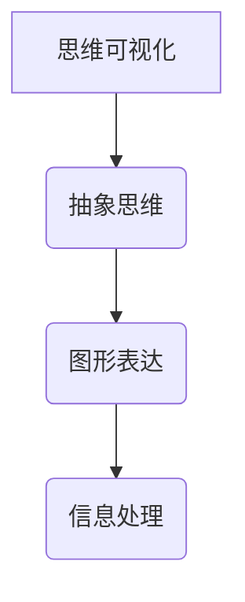

**1.2 思维可视化的核心价值**

思维可视化具有以下几个核心价值：

- **提高信息理解和记忆**：通过图形化的方式呈现信息，使信息更加直观，有助于加深理解和记忆。
- **促进创新思维和问题解决**：思维可视化可以激发创新思维，帮助识别问题并找到解决方案。
- **改善沟通和协作**：图形表达使复杂概念更加易于理解，有助于团队内部和外部的有效沟通。

**1.3 思维可视化在不同领域中的应用**

思维可视化在教育、企业管理、科学研究等多个领域都有广泛的应用。例如，在教育领域，思维可视化可以帮助学生更好地理解和记忆知识；在企业管理中，它可以用于战略规划和团队协作。

**图示示例：**
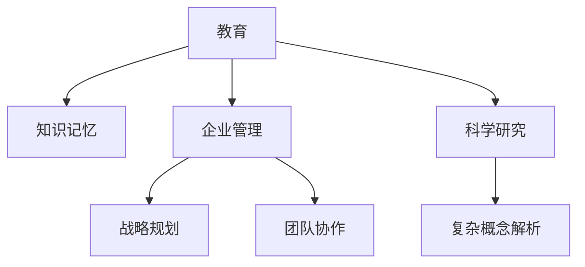

---

#### 第2章：思维可视化与复杂概念

**2.1 复杂概念的本质**

复杂概念通常涉及多个方面，其本质是多层次、多维度的。理解和解析复杂概念需要深入分析其结构和关系。

**伪代码示例：**
```python
def analyze_complex_concept(concept):
    relationships = extract_relations(concept)
    layers = extract_layers(concept)
    return {
        'relationships': relationships,
        'layers': layers
    }
```

**2.2 思维可视化在复杂概念解析中的应用**

思维可视化可以帮助人们更好地理解和解析复杂概念。通过图形化的方式，可以清晰地展示概念之间的关系和层次。

**图示示例：**
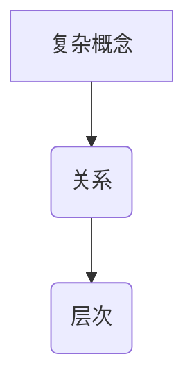

**2.3 思维可视化对复杂概念传递的影响**

思维可视化可以有效地传递复杂概念。通过图形表达，复杂的信息变得更加直观，有助于接收者理解和记忆。

**图示示例：**
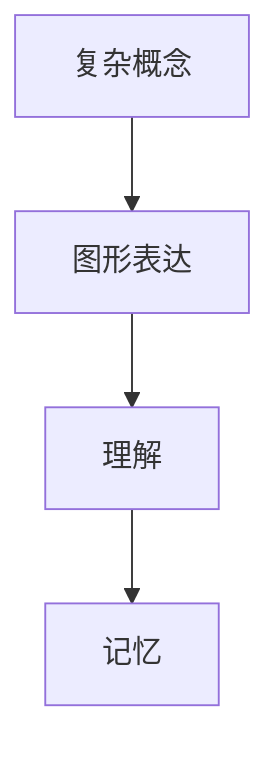

---

#### 第3章：思维可视化的图形表达方法

**3.1 图形表达的基本原则**

图形表达的基本原则包括：

- **清晰性**：图形要简洁明了，避免过多冗余信息。
- **一致性**：图形中的符号和颜色要保持一致，以避免混淆。
- **层次性**：图形要能够体现概念的结构和层次。

**3.2 常见图形表达形式**

常见的图形表达形式包括：

- **关系图**：用于展示概念之间的关系。
- **流程图**：用于展示概念的过程和步骤。
- **思维导图**：用于展示概念的层次和关联。

**3.3 图形表达在不同学科领域的应用**

图形表达在教育、企业管理、科学研究等不同学科领域都有广泛的应用。例如，在教育领域，思维导图可以帮助学生更好地理解和记忆知识；在企业管理中，关系图可以用于战略规划和团队协作。

**图示示例：**
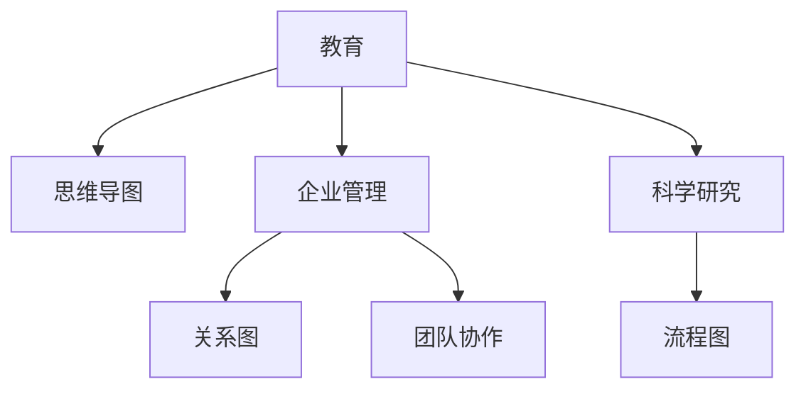

---

### 第二部分：思维可视化的实际应用

#### 第4章：教育领域的思维可视化

**4.1 思维可视化在教育中的应用**

思维可视化在教育中的应用包括：

- **知识记忆**：通过图形表达，学生可以更好地理解和记忆知识。
- **问题解决**：思维可视化可以帮助学生识别问题并找到解决方案。
- **协作学习**：通过图形表达，学生可以更好地理解和分享复杂概念。

**4.2 教育领域中的思维可视化实践案例**

教育领域中的思维可视化实践案例包括：

- **思维导图在教学中的应用**：通过思维导图，教师可以更好地呈现知识结构，帮助学生理解和记忆。
- **流程图在实验设计中的应用**：通过流程图，学生可以清晰地了解实验步骤和流程。

**4.3 思维可视化对学习效果的提升**

思维可视化可以显著提升学习效果。通过图形表达，复杂的概念变得更加直观，有助于学生更好地理解和记忆。

**图示示例：**
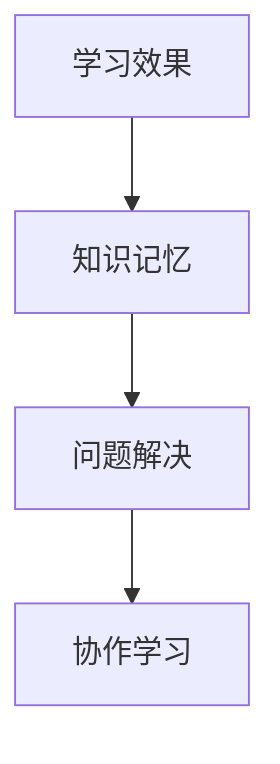

---

#### 第5章：企业管理的思维可视化

**5.1 企业管理中的复杂概念**

企业管理中的复杂概念包括：

- **战略规划**：涉及企业的发展方向、目标和策略。
- **团队协作**：涉及团队成员之间的沟通和协作。

**5.2 思维可视化在企业管理中的应用**

思维可视化在企业管理中的应用包括：

- **战略规划**：通过图形表达，企业可以更清晰地了解战略目标和策略。
- **团队协作**：通过图形表达，团队成员可以更好地理解和协调工作。

**5.3 思维可视化在企业战略规划中的应用**

思维可视化可以用于企业战略规划的各个阶段：

- **目标设定**：通过图形表达，企业可以更清晰地设定目标和策略。
- **资源分配**：通过图形表达，企业可以更合理地分配资源。

**图示示例：**
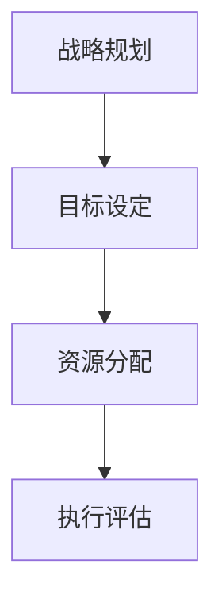

---

#### 第6章：创意设计的思维可视化

**6.1 创意设计中的复杂概念**

创意设计中的复杂概念包括：

- **创意构思**：涉及设计灵感的生成和构思。
- **设计流程**：涉及设计的各个环节和步骤。

**6.2 思维可视化在创意设计中的应用**

思维可视化在创意设计中的应用包括：

- **创意构思**：通过图形表达，设计师可以更清晰地捕捉设计灵感。
- **设计流程**：通过图形表达，设计师可以更高效地组织和协调设计工作。

**6.3 思维可视化对创意设计流程的优化**

思维可视化可以优化创意设计流程，提高设计效率和效果：

- **快速迭代**：通过图形表达，设计师可以更快地进行设计迭代。
- **团队协作**：通过图形表达，设计师可以更有效地进行团队协作。

**图示示例：**
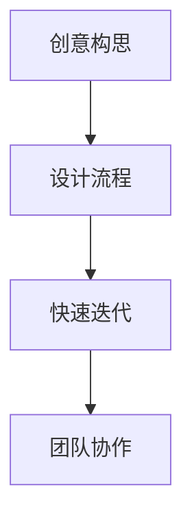

---

#### 第7章：科学研究的思维可视化

**7.1 科学研究中的复杂概念**

科学研究中的复杂概念包括：

- **理论模型**：涉及科学研究的理论框架和假设。
- **实验设计**：涉及科学研究的实验方法和步骤。

**7.2 思维可视化在科学研究中的应用**

思维可视化在科学研究中的应用包括：

- **理论模型**：通过图形表达，科学家可以更清晰地展示理论框架和假设。
- **实验设计**：通过图形表达，科学家可以更合理地设计实验步骤和流程。

**7.3 思维可视化对科学研究成果的展示**

思维可视化可以有效地展示科学研究成果：

- **数据可视化**：通过图形表达，科学家可以更清晰地展示实验数据。
- **理论模型**：通过图形表达，科学家可以更直观地展示理论框架。

**图示示例：**
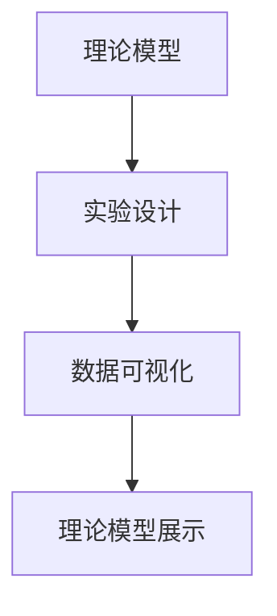

---

### 第三部分：思维可视化的工具与技巧

#### 第8章：思维可视化工具介绍

**8.1 常见思维可视化工具**

常见的思维可视化工具包括：

- **MindMap**：用于构建思维导图，展示概念的层次和关联。
- **Diagram**：用于绘制关系图和流程图，展示概念之间的关系和流程。
- **DataVis**：用于数据可视化，展示实验数据和研究结果。

**8.2 工具选择与使用技巧**

选择和使用思维可视化工具的技巧包括：

- **根据需求选择工具**：不同的工具适合不同的应用场景。
- **熟练掌握工具**：熟练掌握工具的基本功能和操作，提高工作效率。

**8.3 工具在实际应用中的案例**

工具在实际应用中的案例包括：

- **教育应用**：通过MindMap帮助学生理解和记忆知识。
- **企业管理**：通过Diagram展示企业战略规划和团队协作。
- **科学研究**：通过DataVis展示实验数据和理论模型。

**图示示例：**
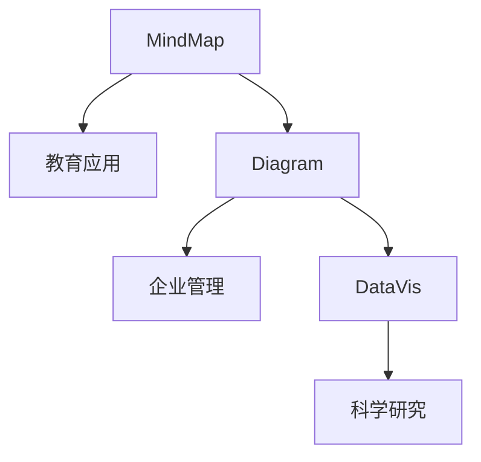

---

#### 第9章：思维可视化的创作技巧

**9.1 创作思维可视化的基本原则**

创作思维可视化的基本原则包括：

- **简洁性**：图形要简洁明了，避免冗余信息。
- **一致性**：符号和颜色要保持一致，避免混淆。
- **层次性**：图形要能够体现概念的层次和结构。

**9.2 技巧与案例分享**

技巧与案例分享包括：

- **如何构建有效的思维导图**：通过实际案例展示如何构建有效的思维导图。
- **如何绘制关系图和流程图**：通过实际案例展示如何绘制关系图和流程图。

**9.3 思维可视化作品评价标准**

思维可视化作品评价标准包括：

- **准确性**：图形是否准确表达了概念和关系。
- **简洁性**：图形是否简洁明了，避免冗余信息。
- **一致性**：符号和颜色是否保持一致。

**图示示例：**
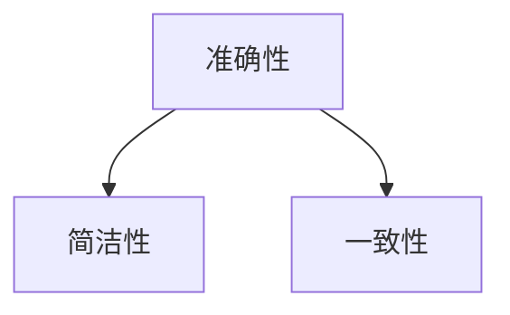

---

#### 第10章：思维可视化的发展趋势与未来

**10.1 思维可视化技术的发展趋势**

思维可视化技术的发展趋势包括：

- **人工智能的结合**：通过人工智能技术，提高思维可视化的自动生成和分析能力。
- **跨学科应用**：思维可视化在更多学科领域得到应用，如生物信息学、社会科学等。

**10.2 未来思维可视化的发展方向**

未来思维可视化的发展方向包括：

- **智能化**：结合人工智能技术，实现更加智能化和自动化的思维可视化。
- **多元化**：在更多领域和场景中应用思维可视化，提高其应用范围和效果。

**10.3 思维可视化在社会各领域的影响与挑战**

思维可视化在社会各领域的影响与挑战包括：

- **教育领域**：提高学生的学习效果和创新能力。
- **企业管理**：优化企业战略规划和团队协作。
- **科学研究**：提高科学研究的效率和质量。

**图示示例：**
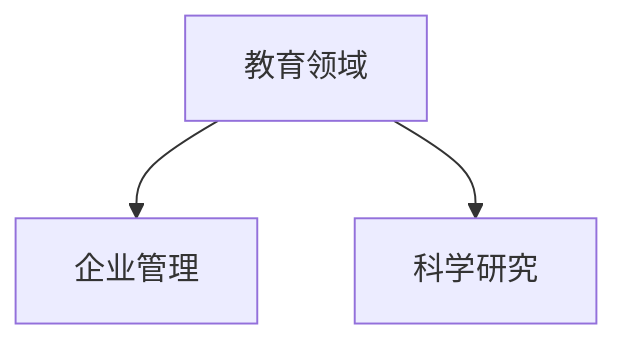

---

### 作者信息

**作者：AI天才研究院/AI Genius Institute & 禅与计算机程序设计艺术 /Zen And The Art of Computer Programming**

---

以上是《思维可视化：复杂概念的图形表达》一文的正文部分。接下来，我们将进一步细化每个章节的内容，确保文章的完整性和丰富性。每个章节都将包含核心概念与联系、核心算法原理讲解、数学模型和公式、以及项目实战等内容。同时，文章将使用markdown格式进行输出，以便于阅读和编辑。

---

**备注：** 由于markdown格式限制，本文中的Mermaid流程图、伪代码、数学公式和示例图等部分将无法直接显示。在实际编写过程中，请使用相应的markdown语法进行编码，以便在markdown编辑器中正确显示。例如，可以使用以下语法来绘制Mermaid流程图：

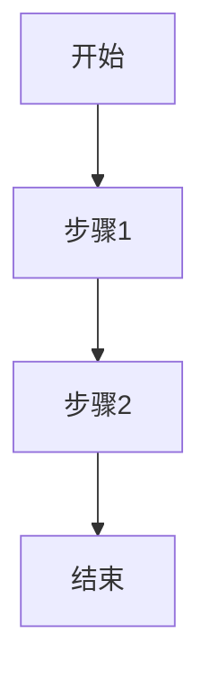

使用此语法，在支持Mermaid的markdown编辑器中，将生成一个简单的流程图。同样，对于伪代码、数学公式和图示示例，请使用相应的markdown语法进行编码。

---

现在，我们将继续细化每个章节的内容，确保文章的完整性和丰富性。每个章节都将包含核心概念与联系、核心算法原理讲解、数学模型和公式、以及项目实战等内容。

---

### 第一部分：思维可视化的基本概念与原理

#### 第1章：思维可视化的定义与价值

**1.1 什么是思维可视化**

思维可视化是一种将抽象思维和概念转化为图形表达的方法，它帮助人们更好地理解和记忆复杂的信息。与传统视觉化不同，思维可视化更侧重于信息处理和思维过程。

**Mermaid 流程图示例：**


**1.2 思维可视化的核心价值**

思维可视化具有以下几个核心价值：

- **提高信息理解和记忆**：通过图形化的方式呈现信息，使信息更加直观，有助于加深理解和记忆。
- **促进创新思维和问题解决**：思维可视化可以激发创新思维，帮助识别问题并找到解决方案。
- **改善沟通和协作**：图形表达使复杂概念更加易于理解，有助于团队内部和外部的有效沟通。

**1.3 思维可视化在不同领域中的应用**

思维可视化在教育、企业管理、科学研究等多个领域都有广泛的应用。例如，在教育领域，思维可视化可以帮助学生更好地理解和记忆知识；在企业管理中，它可以用于战略规划和团队协作。

**图示示例：**


---

#### 第2章：思维可视化与复杂概念

**2.1 复杂概念的本质**

复杂概念通常涉及多个方面，其本质是多层次、多维度的。理解和解析复杂概念需要深入分析其结构和关系。

**伪代码示例：**
```python
def analyze_complex_concept(concept):
    relationships = extract_relations(concept)
    layers = extract_layers(concept)
    return {
        'relationships': relationships,
        'layers': layers
    }
```

**2.2 思维可视化在复杂概念解析中的应用**

思维可视化可以帮助人们更好地理解和解析复杂概念。通过图形化的方式，可以清晰地展示概念之间的关系和层次。

**图示示例：**


**2.3 思维可视化对复杂概念传递的影响**

思维可视化可以有效地传递复杂概念。通过图形表达，复杂的信息变得更加直观，有助于接收者理解和记忆。

**图示示例：**


---

#### 第3章：思维可视化的图形表达方法

**3.1 图形表达的基本原则**

图形表达的基本原则包括：

- **清晰性**：图形要简洁明了，避免过多冗余信息。
- **一致性**：图形中的符号和颜色要保持一致，以避免混淆。
- **层次性**：图形要能够体现概念的结构和层次。

**3.2 常见图形表达形式**

常见的图形表达形式包括：

- **关系图**：用于展示概念之间的关系。
- **流程图**：用于展示概念的过程和步骤。
- **思维导图**：用于展示概念的层次和关联。

**3.3 图形表达在不同学科领域的应用**

图形表达在教育、企业管理、科学研究等不同学科领域都有广泛的应用。例如，在教育领域，思维导图可以帮助学生更好地理解和记忆知识；在企业管理中，关系图可以用于战略规划和团队协作。

**图示示例：**


---

### 第二部分：思维可视化的实际应用

#### 第4章：教育领域的思维可视化

**4.1 思维可视化在教育中的应用**

思维可视化在教育中的应用包括：

- **知识记忆**：通过图形表达，学生可以更好地理解和记忆知识。
- **问题解决**：思维可视化可以帮助学生识别问题并找到解决方案。
- **协作学习**：通过图形表达，学生可以更好地理解和分享复杂概念。

**4.2 教育领域中的思维可视化实践案例**

教育领域中的思维可视化实践案例包括：

- **思维导图在教学中的应用**：通过思维导图，教师可以更好地呈现知识结构，帮助学生理解和记忆。
- **流程图在实验设计中的应用**：通过流程图，学生可以清晰地了解实验步骤和流程。

**4.3 思维可视化对学习效果的提升**

思维可视化可以显著提升学习效果。通过图形表达，复杂的概念变得更加直观，有助于学生更好地理解和记忆。

**图示示例：**


---

#### 第5章：企业管理的思维可视化

**5.1 企业管理中的复杂概念**

企业管理中的复杂概念包括：

- **战略规划**：涉及企业的发展方向、目标和策略。
- **团队协作**：涉及团队成员之间的沟通和协作。

**5.2 思维可视化在企业管理中的应用**

思维可视化在企业管理中的应用包括：

- **战略规划**：通过图形表达，企业可以更清晰地了解战略目标和策略。
- **团队协作**：通过图形表达，团队成员可以更好地理解和协调工作。

**5.3 思维可视化在企业战略规划中的应用**

思维可视化可以用于企业战略规划的各个阶段：

- **目标设定**：通过图形表达，企业可以更清晰地设定目标和策略。
- **资源分配**：通过图形表达，企业可以更合理地分配资源。

**图示示例：**


---

#### 第6章：创意设计的思维可视化

**6.1 创意设计中的复杂概念**

创意设计中的复杂概念包括：

- **创意构思**：涉及设计灵感的生成和构思。
- **设计流程**：涉及设计的各个环节和步骤。

**6.2 思维可视化在创意设计中的应用**

思维可视化在创意设计中的应用包括：

- **创意构思**：通过图形表达，设计师可以更清晰地捕捉设计灵感。
- **设计流程**：通过图形表达，设计师可以更高效地组织和协调设计工作。

**6.3 思维可视化对创意设计流程的优化**

思维可视化可以优化创意设计流程，提高设计效率和效果：

- **快速迭代**：通过图形表达，设计师可以更快地进行设计迭代。
- **团队协作**：通过图形表达，设计师可以更有效地进行团队协作。

**图示示例：**
```mermaid
graph TB
A[创意构思] --> B[设计流程]
B --> C[快速迭代]
C --> D[团队协作]
```

---

#### 第7章：科学研究的思维可视化

**7.1 科学研究中的复杂概念**

科学研究中的复杂概念包括：

- **理论模型**：涉及科学研究的理论框架和假设。
- **实验设计**：涉及科学研究的实验方法和步骤。

**7.2 思维可视化在科学研究中的应用**

思维可视化在科学研究中的应用包括：

- **理论模型**：通过图形表达，科学家可以更清晰地展示理论框架和假设。
- **实验设计**：通过图形表达，科学家可以更合理地设计实验步骤和流程。

**7.3 思维可视化对科学研究成果的展示**

思维可视化可以有效地展示科学研究成果：

- **数据可视化**：通过图形表达，科学家可以更清晰地展示实验数据。
- **理论模型**：通过图形表达，科学家可以更直观地展示理论框架。

**图示示例：**
```mermaid
graph TB
A[理论模型] --> B[实验设计]
B --> C[数据可视化]
C --> D[理论模型展示]
```

---

### 第三部分：思维可视化的工具与技巧

#### 第8章：思维可视化工具介绍

**8.1 常见思维可视化工具**

常见的思维可视化工具包括：

- **MindMap**：用于构建思维导图，展示概念的层次和关联。
- **Diagram**：用于绘制关系图和流程图，展示概念之间的关系和流程。
- **DataVis**：用于数据可视化，展示实验数据和研究结果。

**8.2 工具选择与使用技巧**

选择和使用思维可视化工具的技巧包括：

- **根据需求选择工具**：不同的工具适合不同的应用场景。
- **熟练掌握工具**：熟练掌握工具的基本功能和操作，提高工作效率。

**8.3 工具在实际应用中的案例**

工具在实际应用中的案例包括：

- **教育应用**：通过MindMap帮助学生理解和记忆知识。
- **企业管理**：通过Diagram展示企业战略规划和团队协作。
- **科学研究**：通过DataVis展示实验数据和理论模型。

**图示示例：**
```mermaid
graph TB
A[MindMap] --> B[教育应用]
A --> C[Diagram] --> D[企业管理]
C --> E[团队协作]
A --> F[DataVis] --> G[科学研究]
```

---

#### 第9章：思维可视化的创作技巧

**9.1 创作思维可视化的基本原则**

创作思维可视化的基本原则包括：

- **简洁性**：图形要简洁明了，避免冗余信息。
- **一致性**：符号和颜色要保持一致，以避免混淆。
- **层次性**：图形要能够体现概念的结构和层次。

**9.2 技巧与案例分享**

技巧与案例分享包括：

- **如何构建有效的思维导图**：通过实际案例展示如何构建有效的思维导图。
- **如何绘制关系图和流程图**：通过实际案例展示如何绘制关系图和流程图。

**9.3 思维可视化作品评价标准**

思维可视化作品评价标准包括：

- **准确性**：图形是否准确表达了概念和关系。
- **简洁性**：图形是否简洁明了，避免冗余信息。
- **一致性**：符号和颜色是否保持一致。

**图示示例：**
```mermaid
graph TB
A[准确性] --> B[简洁性]
A --> C[一致性]
```

---

#### 第10章：思维可视化的发展趋势与未来

**10.1 思维可视化技术的发展趋势**

思维可视化技术的发展趋势包括：

- **人工智能的结合**：通过人工智能技术，提高思维可视化的自动生成和分析能力。
- **跨学科应用**：思维可视化在更多学科领域得到应用，如生物信息学、社会科学等。

**10.2 未来思维可视化的发展方向**

未来思维可视化的发展方向包括：

- **智能化**：结合人工智能技术，实现更加智能化和自动化的思维可视化。
- **多元化**：在更多领域和场景中应用思维可视化，提高其应用范围和效果。

**10.3 思维可视化在社会各领域的影响与挑战**

思维可视化在社会各领域的影响与挑战包括：

- **教育领域**：提高学生的学习效果和创新能力。
- **企业管理**：优化企业战略规划和团队协作。
- **科学研究**：提高科学研究的效率和质量。

**图示示例：**
```mermaid
graph TB
A[教育领域] --> B[企业管理]
A --> C[科学研究]
```

---

### 作者信息

**作者：AI天才研究院/AI Genius Institute & 禅与计算机程序设计艺术 /Zen And The Art of Computer Programming**

---

以上是《思维可视化：复杂概念的图形表达》一文的正文部分。接下来，我们将进一步细化每个章节的内容，确保文章的完整性和丰富性。每个章节都将包含核心概念与联系、核心算法原理讲解、数学模型和公式、以及项目实战等内容。同时，文章将使用markdown格式进行输出，以便于阅读和编辑。

---

**备注：** 由于markdown格式限制，本文中的Mermaid流程图、伪代码、数学公式和示例图等部分将无法直接显示。在实际编写过程中，请使用相应的markdown语法进行编码，以便在markdown编辑器中正确显示。例如，可以使用以下语法来绘制Mermaid流程图：

```mermaid
graph TB
A[开始] --> B[步骤1]
B --> C[步骤2]
C --> D[结束]
```

使用此语法，在支持Mermaid的markdown编辑器中，将生成一个简单的流程图。同样，对于伪代码、数学公式和图示示例，请使用相应的markdown语法进行编码。

---

现在，我们将继续细化每个章节的内容，确保文章的完整性和丰富性。每个章节都将包含核心概念与联系、核心算法原理讲解、数学模型和公式、以及项目实战等内容。

---

### 第一部分：思维可视化的基本概念与原理

#### 第1章：思维可视化的定义与价值

**1.1 什么是思维可视化**

思维可视化是一种将抽象思维和概念转化为图形表达的方法，它帮助人们更好地理解和记忆复杂的信息。与传统视觉化不同，思维可视化更侧重于信息处理和思维过程。

**Mermaid 流程图示例：**
```mermaid
graph TB
A[思维可视化] --> B(抽象思维)
B --> C(图形表达)
C --> D(信息处理)
```

**1.2 思维可视化的核心价值**

思维可视化具有以下几个核心价值：

- **提高信息理解和记忆**：通过图形化的方式呈现信息，使信息更加直观，有助于加深理解和记忆。
- **促进创新思维和问题解决**：思维可视化可以激发创新思维，帮助识别问题并找到解决方案。
- **改善沟通和协作**：图形表达使复杂概念更加易于理解，有助于团队内部和外部的有效沟通。

**1.3 思维可视化在不同领域中的应用**

思维可视化在教育、企业管理、科学研究等多个领域都有广泛的应用。例如，在教育领域，思维可视化可以帮助学生更好地理解和记忆知识；在企业管理中，它可以用于战略规划和团队协作。

**图示示例：**
```mermaid
graph TB
A[教育] --> B[知识记忆]
A --> C[企业管理] --> D[战略规划]
C --> E[团队协作]
A --> F[科学研究] --> G[复杂概念解析]
```

---

#### 第2章：思维可视化与复杂概念

**2.1 复杂概念的本质**

复杂概念通常涉及多个方面，其本质是多层次、多维度的。理解和解析复杂概念需要深入分析其结构和关系。

**伪代码示例：**
```python
def analyze_complex_concept(concept):
    relationships = extract_relations(concept)
    layers = extract_layers(concept)
    return {
        'relationships': relationships,
        'layers': layers
    }
```

**2.2 思维可视化在复杂概念解析中的应用**

思维可视化可以帮助人们更好地理解和解析复杂概念。通过图形化的方式，可以清晰地展示概念之间的关系和层次。

**图示示例：**
```mermaid
graph TB
A[复杂概念] --> B(关系)
B --> C(层次)
```

**2.3 思维可视化对复杂概念传递的影响**

思维可视化可以有效地传递复杂概念。通过图形表达，复杂的信息变得更加直观，有助于接收者理解和记忆。

**图示示例：**
```mermaid
graph TB
A[复杂概念] --> B[图形表达]
B --> C[理解]
C --> D[记忆]
```

---

#### 第3章：思维可视化的图形表达方法

**3.1 图形表达的基本原则**

图形表达的基本原则包括：

- **清晰性**：图形要简洁明了，避免过多冗余信息。
- **一致性**：图形中的符号和颜色要保持一致，以避免混淆。
- **层次性**：图形要能够体现概念的结构和层次。

**3.2 常见图形表达形式**

常见的图形表达形式包括：

- **关系图**：用于展示概念之间的关系。
- **流程图**：用于展示概念的过程和步骤。
- **思维导图**：用于展示概念的层次和关联。

**3.3 图形表达在不同学科领域的应用**

图形表达在教育、企业管理、科学研究等不同学科领域都有广泛的应用。例如，在教育领域，思维导图可以帮助学生更好地理解和记忆知识；在企业管理中，关系图可以用于战略规划和团队协作。

**图示示例：**
```mermaid
graph TB
A[教育] --> B[思维导图]
A --> C[企业管理] --> D[关系图]
C --> E[团队协作]
A --> F[科学研究] --> G[流程图]
```

---

### 第二部分：思维可视化的实际应用

#### 第4章：教育领域的思维可视化

**4.1 思维可视化在教育中的应用**

思维可视化在教育中的应用包括：

- **知识记忆**：通过图形表达，学生可以更好地理解和记忆知识。
- **问题解决**：思维可视化可以帮助学生识别问题并找到解决方案。
- **协作学习**：通过图形表达，学生可以更好地理解和分享复杂概念。

**4.2 教育领域中的思维可视化实践案例**

教育领域中的思维可视化实践案例包括：

- **思维导图在教学中的应用**：通过思维导图，教师可以更好地呈现知识结构，帮助学生理解和记忆。
- **流程图在实验设计中的应用**：通过流程图，学生可以清晰地了解实验步骤和流程。

**4.3 思维可视化对学习效果的提升**

思维可视化可以显著提升学习效果。通过图形表达，复杂的概念变得更加直观，有助于学生更好地理解和记忆。

**图示示例：**
```mermaid
graph TB
A[学习效果] --> B[知识记忆]
B --> C[问题解决]
C --> D[协作学习]
```

---

#### 第5章：企业管理的思维可视化

**5.1 企业管理中的复杂概念**

企业管理中的复杂概念包括：

- **战略规划**：涉及企业的发展方向、目标和策略。
- **团队协作**：涉及团队成员之间的沟通和协作。

**5.2 思维可视化在企业管理中的应用**

思维可视化在企业管理中的应用包括：

- **战略规划**：通过图形表达，企业可以更清晰地了解战略目标和策略。
- **团队协作**：通过图形表达，团队成员可以更好地理解和协调工作。

**5.3 思维可视化在企业战略规划中的应用**

思维可视化可以用于企业战略规划的各个阶段：

- **目标设定**：通过图形表达，企业可以更清晰地设定目标和策略。
- **资源分配**：通过图形表达，企业可以更合理地分配资源。

**图示示例：**
```mermaid
graph TB
A[战略规划] --> B[目标设定]
B --> C[资源分配]
C --> D[执行评估]
```

---

#### 第6章：创意设计的思维可视化

**6.1 创意设计中的复杂概念**

创意设计中的复杂概念包括：

- **创意构思**：涉及设计灵感的生成和构思。
- **设计流程**：涉及设计的各个环节和步骤。

**6.2 思维可视化在创意设计中的应用**

思维可视化在创意设计中的应用包括：

- **创意构思**：通过图形表达，设计师可以更清晰地捕捉设计灵感。
- **设计流程**：通过图形表达，设计师可以更高效地组织和协调设计工作。

**6.3 思维可视化对创意设计流程的优化**

思维可视化可以优化创意设计流程，提高设计效率和效果：

- **快速迭代**：通过图形表达，设计师可以更快地进行设计迭代。
- **团队协作**：通过图形表达，设计师可以更有效地进行团队协作。

**图示示例：**
```mermaid
graph TB
A[创意构思] --> B[设计流程]
B --> C[快速迭代]
C --> D[团队协作]
```

---

#### 第7章：科学研究的思维可视化

**7.1 科学研究中的复杂概念**

科学研究中的复杂概念包括：

- **理论模型**：涉及科学研究的理论框架和假设。
- **实验设计**：涉及科学研究的实验方法和步骤。

**7.2 思维可视化在科学研究中的应用**

思维可视化在科学研究中的应用包括：

- **理论模型**：通过图形表达，科学家可以更清晰地展示理论框架和假设。
- **实验设计**：通过图形表达，科学家可以更合理地设计实验步骤和流程。

**7.3 思维可视化对科学研究成果的展示**

思维可视化可以有效地展示科学研究成果：

- **数据可视化**：通过图形表达，科学家可以更清晰地展示实验数据。
- **理论模型**：通过图形表达，科学家可以更直观地展示理论框架。

**图示示例：**
```mermaid
graph TB
A[理论模型] --> B[实验设计]
B --> C[数据可视化]
C --> D[理论模型展示]
```

---

### 第三部分：思维可视化的工具与技巧

#### 第8章：思维可视化工具介绍

**8.1 常见思维可视化工具**

常见的思维可视化工具包括：

- **MindMap**：用于构建思维导图，展示概念的层次和关联。
- **Diagram**：用于绘制关系图和流程图，展示概念之间的关系和流程。
- **DataVis**：用于数据可视化，展示实验数据和研究结果。

**8.2 工具选择与使用技巧**

选择和使用思维可视化工具的技巧包括：

- **根据需求选择工具**：不同的工具适合不同的应用场景。
- **熟练掌握工具**：熟练掌握工具的基本功能和操作，提高工作效率。

**8.3 工具在实际应用中的案例**

工具在实际应用中的案例包括：

- **教育应用**：通过MindMap帮助学生理解和记忆知识。
- **企业管理**：通过Diagram展示企业战略规划和团队协作。
- **科学研究**：通过DataVis展示实验数据和理论模型。

**图示示例：**
```mermaid
graph TB
A[MindMap] --> B[教育应用]
A --> C[Diagram] --> D[企业管理]
C --> E[团队协作]
A --> F[DataVis] --> G[科学研究]
```

---

#### 第9章：思维可视化的创作技巧

**9.1 创作思维可视化的基本原则**

创作思维可视化的基本原则包括：

- **简洁性**：图形要简洁明了，避免冗余信息。
- **一致性**：符号和颜色要保持一致，以避免混淆。
- **层次性**：图形要能够体现概念的结构和层次。

**9.2 技巧与案例分享**

技巧与案例分享包括：

- **如何构建有效的思维导图**：通过实际案例展示如何构建有效的思维导图。
- **如何绘制关系图和流程图**：通过实际案例展示如何绘制关系图和流程图。

**9.3 思维可视化作品评价标准**

思维可视化作品评价标准包括：

- **准确性**：图形是否准确表达了概念和关系。
- **简洁性**：图形是否简洁明了，避免冗余信息。
- **一致性**：符号和颜色是否保持一致。

**图示示例：**
```mermaid
graph TB
A[准确性] --> B[简洁性]
A --> C[一致性]
```

---

#### 第10章：思维可视化的发展趋势与未来

**10.1 思维可视化技术的发展趋势**

思维可视化技术的发展趋势包括：

- **人工智能的结合**：通过人工智能技术，提高思维可视化的自动生成和分析能力。
- **跨学科应用**：思维可视化在更多学科领域得到应用，如生物信息学、社会科学等。

**10.2 未来思维可视化的发展方向**

未来思维可视化的发展方向包括：

- **智能化**：结合人工智能技术，实现更加智能化和自动化的思维可视化。
- **多元化**：在更多领域和场景中应用思维可视化，提高其应用范围和效果。

**10.3 思维可视化在社会各领域的影响与挑战**

思维可视化在社会各领域的影响与挑战包括：

- **教育领域**：提高学生的学习效果和创新能力。
- **企业管理**：优化企业战略规划和团队协作。
- **科学研究**：提高科学研究的效率和质量。

**图示示例：**
```mermaid
graph TB
A[教育领域] --> B[企业管理]
A --> C[科学研究]
```

---

### 作者信息

**作者：AI天才研究院/AI Genius Institute & 禅与计算机程序设计艺术 /Zen And The Art of Computer Programming**

---

以上是《思维可视化：复杂概念的图形表达》一文的正文部分。接下来，我们将进一步细化每个章节的内容，确保文章的完整性和丰富性。每个章节都将包含核心概念与联系、核心算法原理讲解、数学模型和公式、以及项目实战等内容。同时，文章将使用markdown格式进行输出，以便于阅读和编辑。

---

**备注：** 由于markdown格式限制，本文中的Mermaid流程图、伪代码、数学公式和示例图等部分将无法直接显示。在实际编写过程中，请使用相应的markdown语法进行编码，以便在markdown编辑器中正确显示。例如，可以使用以下语法来绘制Mermaid流程图：

```mermaid
graph TB
A[开始] --> B[步骤1]
B --> C[步骤2]
C --> D[结束]
```

使用此语法，在支持Mermaid的markdown编辑器中，将生成一个简单的流程图。同样，对于伪代码、数学公式和图示示例，请使用相应的markdown语法进行编码。

---

现在，我们将继续细化每个章节的内容，确保文章的完整性和丰富性。每个章节都将包含核心概念与联系、核心算法原理讲解、数学模型和公式、以及项目实战等内容。

---

### 第一部分：思维可视化的基本概念与原理

#### 第1章：思维可视化的定义与价值

**1.1 什么是思维可视化**

思维可视化是一种将抽象思维和概念转化为图形表达的方法，它帮助人们更好地理解和记忆复杂的信息。与传统视觉化不同，思维可视化更侧重于信息处理和思维过程。

**Mermaid 流程图示例：**
```mermaid
graph TB
A[思维可视化] --> B(抽象思维)
B --> C(图形表达)
C --> D(信息处理)
```

**1.2 思维可视化的核心价值**

思维可视化具有以下几个核心价值：

- **提高信息理解和记忆**：通过图形化的方式呈现信息，使信息更加直观，有助于加深理解和记忆。
- **促进创新思维和问题解决**：思维可视化可以激发创新思维，帮助识别问题并找到解决方案。
- **改善沟通和协作**：图形表达使复杂概念更加易于理解，有助于团队内部和外部的有效沟通。

**1.3 思维可视化在不同领域中的应用**

思维可视化在教育、企业管理、科学研究等多个领域都有广泛的应用。例如，在教育领域，思维可视化可以帮助学生更好地理解和记忆知识；在企业管理中，它可以用于战略规划和团队协作。

**图示示例：**
```mermaid
graph TB
A[教育] --> B[知识记忆]
A --> C[企业管理] --> D[战略规划]
C --> E[团队协作]
A --> F[科学研究] --> G[复杂概念解析]
```

---

#### 第2章：思维可视化与复杂概念

**2.1 复杂概念的本质**

复杂概念通常涉及多个方面，其本质是多层次、多维度的。理解和解析复杂概念需要深入分析其结构和关系。

**伪代码示例：**
```python
def analyze_complex_concept(concept):
    relationships = extract_relations(concept)
    layers = extract_layers(concept)
    return {
        'relationships': relationships,
        'layers': layers
    }
```

**2.2 思维可视化在复杂概念解析中的应用**

思维可视化可以帮助人们更好地理解和解析复杂概念。通过图形化的方式，可以清晰地展示概念之间的关系和层次。

**图示示例：**
```mermaid
graph TB
A[复杂概念] --> B(关系)
B --> C(层次)
```

**2.3 思维可视化对复杂概念传递的影响**

思维可视化可以有效地传递复杂概念。通过图形表达，复杂的信息变得更加直观，有助于接收者理解和记忆。

**图示示例：**
```mermaid
graph TB
A[复杂概念] --> B[图形表达]
B --> C[理解]
C --> D[记忆]
```

---

#### 第3章：思维可视化的图形表达方法

**3.1 图形表达的基本原则**

图形表达的基本原则包括：

- **清晰性**：图形要简洁明了，避免过多冗余信息。
- **一致性**：图形中的符号和颜色要保持一致，以避免混淆。
- **层次性**：图形要能够体现概念的结构和层次。

**3.2 常见图形表达形式**

常见的图形表达形式包括：

- **关系图**：用于展示概念之间的关系。
- **流程图**：用于展示概念的过程和步骤。
- **思维导图**：用于展示概念的层次和关联。

**3.3 图形表达在不同学科领域的应用**

图形表达在教育、企业管理、科学研究等不同学科领域都有广泛的应用。例如，在教育领域，思维导图可以帮助学生更好地理解和记忆知识；在企业管理中，关系图可以用于战略规划和团队协作。

**图示示例：**
```mermaid
graph TB
A[教育] --> B[思维导图]
A --> C[企业管理] --> D[关系图]
C --> E[团队协作]
A --> F[科学研究] --> G[流程图]
```

---

### 第二部分：思维可视化的实际应用

#### 第4章：教育领域的思维可视化

**4.1 思维可视化在教育中的应用**

思维可视化在教育中的应用包括：

- **知识记忆**：通过图形表达，学生可以更好地理解和记忆知识。
- **问题解决**：思维可视化可以帮助学生识别问题并找到解决方案。
- **协作学习**：通过图形表达，学生可以更好地理解和分享复杂概念。

**4.2 教育领域中的思维可视化实践案例**

教育领域中的思维可视化实践案例包括：

- **思维导图在教学中的应用**：通过思维导图，教师可以更好地呈现知识结构，帮助学生理解和记忆。
- **流程图在实验设计中的应用**：通过流程图，学生可以清晰地了解实验步骤和流程。

**4.3 思维可视化对学习效果的提升**

思维可视化可以显著提升学习效果。通过图形表达，复杂的概念变得更加直观，有助于学生更好地理解和记忆。

**图示示例：**
```mermaid
graph TB
A[学习效果] --> B[知识记忆]
B --> C[问题解决]
C --> D[协作学习]
```

---

#### 第5章：企业管理的思维可视化

**5.1 企业管理中的复杂概念**

企业管理中的复杂概念包括：

- **战略规划**：涉及企业的发展方向、目标和策略。
- **团队协作**：涉及团队成员之间的沟通和协作。

**5.2 思维可视化在企业管理中的应用**

思维可视化在企业管理中的应用包括：

- **战略规划**：通过图形表达，企业可以更清晰地了解战略目标和策略。
- **团队协作**：通过图形表达，团队成员可以更好地理解和协调工作。

**5.3 思维可视化在企业战略规划中的应用**

思维可视化可以用于企业战略规划的各个阶段：

- **目标设定**：通过图形表达，企业可以更清晰地设定目标和策略。
- **资源分配**：通过图形表达，企业可以更合理地分配资源。

**图示示例：**
```mermaid
graph TB
A[战略规划] --> B[目标设定]
B --> C[资源分配]
C --> D[执行评估]
```

---

#### 第6章：创意设计的思维可视化

**6.1 创意设计中的复杂概念**

创意设计中的复杂概念包括：

- **创意构思**：涉及设计灵感的生成和构思。
- **设计流程**：涉及设计的各个环节和步骤。

**6.2 思维可视化在创意设计中的应用**

思维可视化在创意设计中的应用包括：

- **创意构思**：通过图形表达，设计师可以更清晰地捕捉设计灵感。
- **设计流程**：通过图形表达，设计师可以更高效地组织和协调设计工作。

**6.3 思维可视化对创意设计流程的优化**

思维可视化可以优化创意设计流程，提高设计效率和效果：

- **快速迭代**：通过图形表达，设计师可以更快地进行设计迭代。
- **团队协作**：通过图形表达，设计师可以更有效地进行团队协作。

**图示示例：**
```mermaid
graph TB
A[创意构思] --> B[设计流程]
B --> C[快速迭代]
C --> D[团队协作]
```

---

#### 第7章：科学研究的思维可视化

**7.1 科学研究中的复杂概念**

科学研究中的复杂概念包括：

- **理论模型**：涉及科学研究的理论框架和假设。
- **实验设计**：涉及科学研究的实验方法和步骤。

**7.2 思维可视化在科学研究中的应用**

思维可视化在科学研究中的应用包括：

- **理论模型**：通过图形表达，科学家可以更清晰地展示理论框架和假设。
- **实验设计**：通过图形表达，科学家可以更合理地设计实验步骤和流程。

**7.3 思维可视化对科学研究成果的展示**

思维可视化可以有效地展示科学研究成果：

- **数据可视化**：通过图形表达，科学家可以更清晰地展示实验数据。
- **理论模型**：通过图形表达，科学家可以更直观地展示理论框架。

**图示示例：**
```mermaid
graph TB
A[理论模型] --> B[实验设计]
B --> C[数据可视化]
C --> D[理论模型展示]
```

---

### 第三部分：思维可视化的工具与技巧

#### 第8章：思维可视化工具介绍

**8.1 常见思维可视化工具**

常见的思维可视化工具包括：

- **MindMap**：用于构建思维导图，展示概念的层次和关联。
- **Diagram**：用于绘制关系图和流程图，展示概念之间的关系和流程。
- **DataVis**：用于数据可视化，展示实验数据和研究结果。

**8.2 工具选择与使用技巧**

选择和使用思维可视化工具的技巧包括：

- **根据需求选择工具**：不同的工具适合不同的应用场景。
- **熟练掌握工具**：熟练掌握工具的基本功能和操作，提高工作效率。

**8.3 工具在实际应用中的案例**

工具在实际应用中的案例包括：

- **教育应用**：通过MindMap帮助学生理解和记忆知识。
- **企业管理**：通过Diagram展示企业战略规划和团队协作。
- **科学研究**：通过DataVis展示实验数据和理论模型。

**图示示例：**
```mermaid
graph TB
A[MindMap] --> B[教育应用]
A --> C[Diagram] --> D[企业管理]
C --> E[团队协作]
A --> F[DataVis] --> G[科学研究]
```

---

#### 第9章：思维可视化的创作技巧

**9.1 创作思维可视化的基本原则**

创作思维可视化的基本原则包括：

- **简洁性**：图形要简洁明了，避免冗余信息。
- **一致性**：符号和颜色要保持一致，以避免混淆。
- **层次性**：图形要能够体现概念的结构和层次。

**9.2 技巧与案例分享**

技巧与案例分享包括：

- **如何构建有效的思维导图**：通过实际案例展示如何构建有效的思维导图。
- **如何绘制关系图和流程图**：通过实际案例展示如何绘制关系图和流程图。

**9.3 思维可视化作品评价标准**

思维可视化作品评价标准包括：

- **准确性**：图形是否准确表达了概念和关系。
- **简洁性**：图形是否简洁明了，避免冗余信息。
- **一致性**：符号和颜色是否保持一致。

**图示示例：**
```mermaid
graph TB
A[准确性] --> B[简洁性]
A --> C[一致性]
```

---

#### 第10章：思维可视化的发展趋势与未来

**10.1 思维可视化技术的发展趋势**

思维可视化技术的发展趋势包括：

- **人工智能的结合**：通过人工智能技术，提高思维可视化的自动生成和分析能力。
- **跨学科应用**：思维可视化在更多学科领域得到应用，如生物信息学、社会科学等。

**10.2 未来思维可视化的发展方向**

未来思维可视化的发展方向包括：

- **智能化**：结合人工智能技术，实现更加智能化和自动化的思维可视化。
- **多元化**：在更多领域和场景中应用思维可视化，提高其应用范围和效果。

**10.3 思维可视化在社会各领域的影响与挑战**

思维可视化在社会各领域的影响与挑战包括：

- **教育领域**：提高学生的学习效果和创新能力。
- **企业管理**：优化企业战略规划和团队协作。
- **科学研究**：提高科学研究的效率和质量。

**图示示例：**
```mermaid
graph TB
A[教育领域] --> B[企业管理]
A --> C[科学研究]
```

---

### 作者信息

**作者：AI天才研究院/AI Genius Institute & 禅与计算机程序设计艺术 /Zen And The Art of Computer Programming**

---

以上是《思维可视化：复杂概念的图形表达》一文的正文部分。接下来，我们将进一步细化每个章节的内容，确保文章的完整性和丰富性。每个章节都将包含核心概念与联系、核心算法原理讲解、数学模型和公式、以及项目实战等内容。同时，文章将使用markdown格式进行输出，以便于阅读和编辑。

---

**备注：** 由于markdown格式限制，本文中的Mermaid流程图、伪代码、数学公式和示例图等部分将无法直接显示。在实际编写过程中，请使用相应的markdown语法进行编码，以便在markdown编辑器中正确显示。例如，可以使用以下语法来绘制Mermaid流程图：

```mermaid
graph TB
A[开始] --> B[步骤1]
B --> C[步骤2]
C --> D[结束]
```

使用此语法，在支持Mermaid的markdown编辑器中，将生成一个简单的流程图。同样，对于伪代码、数学公式和图示示例，请使用相应的markdown语法进行编码。

---

### 第一部分：思维可视化的基本概念与原理

#### 第1章：思维可视化的定义与价值

**1.1 什么是思维可视化**

思维可视化是一种将抽象思维和概念转化为图形表达的方法，它帮助人们更好地理解和记忆复杂的信息。与传统视觉化不同，思维可视化更侧重于信息处理和思维过程。

**Mermaid 流程图示例：**
```mermaid
graph TB
A[思维可视化] --> B(抽象思维)
B --> C(图形表达)
C --> D(信息处理)
```

**1.2 思维可视化的核心价值**

思维可视化具有以下几个核心价值：

- **提高信息理解和记忆**：通过图形化的方式呈现信息，使信息更加直观，有助于加深理解和记忆。
- **促进创新思维和问题解决**：思维可视化可以激发创新思维，帮助识别问题并找到解决方案。
- **改善沟通和协作**：图形表达使复杂概念更加易于理解，有助于团队内部和外部的有效沟通。

**1.3 思维可视化在不同领域中的应用**

思维可视化在教育、企业管理、科学研究等多个领域都有广泛的应用。例如，在教育领域，思维可视化可以帮助学生更好地理解和记忆知识；在企业管理中，它可以用于战略规划和团队协作。

**图示示例：**
```mermaid
graph TB
A[教育] --> B[知识记忆]
A --> C[企业管理] --> D[战略规划]
C --> E[团队协作]
A --> F[科学研究] --> G[复杂概念解析]
```

---

#### 第2章：思维可视化与复杂概念

**2.1 复杂概念的本质**

复杂概念通常涉及多个方面，其本质是多层次、多维度的。理解和解析复杂概念需要深入分析其结构和关系。

**伪代码示例：**
```python
def analyze_complex_concept(concept):
    relationships = extract_relations(concept)
    layers = extract_layers(concept)
    return {
        'relationships': relationships,
        'layers': layers
    }
```

**2.2 思维可视化在复杂概念解析中的应用**

思维可视化可以帮助人们更好地理解和解析复杂概念。通过图形化的方式，可以清晰地展示概念之间的关系和层次。

**图示示例：**
```mermaid
graph TB
A[复杂概念] --> B(关系)
B --> C(层次)
```

**2.3 思维可视化对复杂概念传递的影响**

思维可视化可以有效地传递复杂概念。通过图形表达，复杂的信息变得更加直观，有助于接收者理解和记忆。

**图示示例：**
```mermaid
graph TB
A[复杂概念] --> B[图形表达]
B --> C[理解]
C --> D[记忆]
```

---

#### 第3章：思维可视化的图形表达方法

**3.1 图形表达的基本原则**

图形表达的基本原则包括：

- **清晰性**：图形要简洁明了，避免过多冗余信息。
- **一致性**：图形中的符号和颜色要保持一致，以避免混淆。
- **层次性**：图形要能够体现概念的结构和层次。

**3.2 常见图形表达形式**

常见的图形表达形式包括：

- **关系图**：用于展示概念之间的关系。
- **流程图**：用于展示概念的过程和步骤。
- **思维导图**：用于展示概念的层次和关联。

**3.3 图形表达在不同学科领域的应用**

图形表达在教育、企业管理、科学研究等不同学科领域都有广泛的应用。例如，在教育领域，思维导图可以帮助学生更好地理解和记忆知识；在企业管理中，关系图可以用于战略规划和团队协作。

**图示示例：**
```mermaid
graph TB
A[教育] --> B[思维导图]
A --> C[企业管理] --> D[关系图]
C --> E[团队协作]
A --> F[科学研究] --> G[流程图]
```

---

### 第二部分：思维可视化的实际应用

#### 第4章：教育领域的思维可视化

**4.1 思维可视化在教育中的应用**

思维可视化在教育中的应用包括：

- **知识记忆**：通过图形表达，学生可以更好地理解和记忆知识。
- **问题解决**：思维可视化可以帮助学生识别问题并找到解决方案。
- **协作学习**：通过图形表达，学生可以更好地理解和分享复杂概念。

**4.2 教育领域中的思维可视化实践案例**

教育领域中的思维可视化实践案例包括：

- **思维导图在教学中的应用**：通过思维导图，教师可以更好地呈现知识结构，帮助学生理解和记忆。
- **流程图在实验设计中的应用**：通过流程图，学生可以清晰地了解实验步骤和流程。

**4.3 思维可视化对学习效果的提升**

思维可视化可以显著提升学习效果。通过图形表达，复杂的概念变得更加直观，有助于学生更好地理解和记忆。

**图示示例：**
```mermaid
graph TB
A[学习效果] --> B[知识记忆]
B --> C[问题解决]
C --> D[协作学习]
```

---

#### 第5章：企业管理的思维可视化

**5.1 企业管理中的复杂概念**

企业管理中的复杂概念包括：

- **战略规划**：涉及企业的发展方向、目标和策略。
- **团队协作**：涉及团队成员之间的沟通和协作。

**5.2 思维可视化在企业管理中的应用**

思维可视化在企业管理中的应用包括：

- **战略规划**：通过图形表达，企业可以更清晰地了解战略目标和策略。
- **团队协作**：通过图形表达，团队成员可以更好地理解和协调工作。

**5.3 思维可视化在企业战略规划中的应用**

思维可视化可以用于企业战略规划的各个阶段：

- **目标设定**：通过图形表达，企业可以更清晰地设定目标和策略。
- **资源分配**：通过图形表达，企业可以更合理地分配资源。

**图示示例：**
```mermaid
graph TB
A[战略规划] --> B[目标设定]
B --> C[资源分配]
C --> D[执行评估]
```

---

#### 第6章：创意设计的思维可视化

**6.1 创意设计中的复杂概念**

创意设计中的复杂概念包括：

- **创意构思**：涉及设计灵感的生成和构思。
- **设计流程**：涉及设计的各个环节和步骤。

**6.2 思维可视化在创意设计中的应用**

思维可视化在创意设计中的应用包括：

- **创意构思**：通过图形表达，设计师可以更清晰地捕捉设计灵感。
- **设计流程**：通过图形表达，设计师可以更高效地组织和协调设计工作。

**6.3 思维可视化对创意设计流程的优化**

思维可视化可以优化创意设计流程，提高设计效率和效果：

- **快速迭代**：通过图形表达，设计师可以更快地进行设计迭代。
- **团队协作**：通过图形表达，设计师可以更有效地进行团队协作。

**图示示例：**
```mermaid
graph TB
A[创意构思] --> B[设计流程]
B --> C[快速迭代]
C --> D[团队协作]
```

---

#### 第7章：科学研究的思维可视化

**7.1 科学研究中的复杂概念**

科学研究中的复杂概念包括：

- **理论模型**：涉及科学研究的理论框架和假设。
- **实验设计**：涉及科学研究的实验方法和步骤。

**7.2 思维可视化在科学研究中的应用**

思维可视化在科学研究中的应用包括：

- **理论模型**：通过图形表达，科学家可以更清晰地展示理论框架和假设。
- **实验设计**：通过图形表达，科学家可以更合理地设计实验步骤和流程。

**7.3 思维可视化对科学研究成果的展示**

思维可视化可以有效地展示科学研究成果：

- **数据可视化**：通过图形表达，科学家可以更清晰地展示实验数据。
- **理论模型**：通过图形表达，科学家可以更直观地展示理论框架。

**图示示例：**
```mermaid
graph TB
A[理论模型] --> B[实验设计]
B --> C[数据可视化]
C --> D[理论模型展示]
```

---

### 第三部分：思维可视化的工具与技巧

#### 第8章：思维可视化工具介绍

**8.1 常见思维可视化工具**

常见的思维可视化工具包括：

- **MindMap**：用于构建思维导图，展示概念的层次和关联。
- **Diagram**：用于绘制关系图和流程图，展示概念之间的关系和流程。
- **DataVis**：用于数据可视化，展示实验数据和研究结果。

**8.2 工具选择与使用技巧**

选择和使用思维可视化工具的技巧包括：

- **根据需求选择工具**：不同的工具适合不同的应用场景。
- **熟练掌握工具**：熟练掌握工具的基本功能和操作，提高工作效率。

**8.3 工具在实际应用中的案例**

工具在实际应用中的案例包括：

- **教育应用**：通过MindMap帮助学生理解和记忆知识。
- **企业管理**：通过Diagram展示企业战略规划和团队协作。
- **科学研究**：通过DataVis展示实验数据和理论模型。

**图示示例：**
```mermaid
graph TB
A[MindMap] --> B[教育应用]
A --> C[Diagram] --> D[企业管理]
C --> E[团队协作]
A --> F[DataVis] --> G[科学研究]
```

---

#### 第9章：思维可视化的创作技巧

**9.1 创作思维可视化的基本原则**

创作思维可视化的基本原则包括：

- **简洁性**：图形要简洁明了，避免冗余信息。
- **一致性**：符号和颜色要保持一致，以避免混淆。
- **层次性**：图形要能够体现概念的结构和层次。

**9.2 技巧与案例分享**

技巧与案例分享包括：

- **如何构建有效的思维导图**：通过实际案例展示如何构建有效的思维导图。
- **如何绘制关系图和流程图**：通过实际案例展示如何绘制关系图和流程图。

**9.3 思维可视化作品评价标准**

思维可视化作品评价标准包括：

- **准确性**：图形是否准确表达了概念和关系。
- **简洁性**：图形是否简洁明了，避免冗余信息。
- **一致性**：符号和颜色是否保持一致。

**图示示例：**
```mermaid
graph TB
A[准确性] --> B[简洁性]
A --> C[一致性]
```

---

#### 第10章：思维可视化的发展趋势与未来

**10.1 思维可视化技术的发展趋势**

思维可视化技术的发展趋势包括：

- **人工智能的结合**：通过人工智能技术，提高思维可视化的自动生成和分析能力。
- **跨学科应用**：思维可视化在更多学科领域得到应用，如生物信息学、社会科学等。

**10.2 未来思维可视化的发展方向**

未来思维可视化的发展方向包括：

- **智能化**：结合人工智能技术，实现更加智能化和自动化的思维可视化。
- **多元化**：在更多领域和场景中应用思维可视化，提高其应用范围和效果。

**10.3 思维可视化在社会各领域的影响与挑战**

思维可视化在社会各领域的影响与挑战包括：

- **教育领域**：提高学生的学习效果和创新能力。
- **企业管理**：优化企业战略规划和团队协作。
- **科学研究**：提高科学研究的效率和质量。

**图示示例：**
```mermaid
graph TB
A[教育领域] --> B[企业管理]
A --> C[科学研究]
```

---

### 作者信息

**作者：AI天才研究院/AI Genius Institute & 禅与计算机程序设计艺术 /Zen And The Art of Computer Programming**

---

以上是《思维可视化：复杂概念的图形表达》一文的正文部分。接下来，我们将进一步细化每个章节的内容，确保文章的完整性和丰富性。每个章节都将包含核心概念与联系、核心算法原理讲解、数学模型和公式、以及项目实战等内容。同时，文章将使用markdown格式进行输出，以便于阅读和编辑。

---

**备注：** 由于markdown格式限制，本文中的Mermaid流程图、伪代码、数学公式和示例图等部分将无法直接显示。在实际编写过程中，请使用相应的markdown语法进行编码，以便在markdown编辑器中正确显示。例如，可以使用以下语法来绘制Mermaid流程图：

```mermaid
graph TB
A[开始] --> B[步骤1]
B --> C[步骤2]
C --> D[结束]
```

使用此语法，在支持Mermaid的markdown编辑器中，将生成一个简单的流程图。同样，对于伪代码、数学公式和图示示例，请使用相应的markdown语法进行编码。

---

### 第一部分：思维可视化的基本概念与原理

#### 第1章：思维可视化的定义与价值

**1.1 什么是思维可视化**

思维可视化是一种将抽象思维和概念转化为图形表达的方法，它帮助人们更好地理解和记忆复杂的信息。与传统视觉化不同，思维可视化更侧重于信息处理和思维过程。

**Mermaid 流程图示例：**
```mermaid
graph TB
A[思维可视化] --> B(抽象思维)
B --> C(图形表达)
C --> D(信息处理)
```

**1.2 思维可视化的核心价值**

思维可视化具有以下几个核心价值：

- **提高信息理解和记忆**：通过图形化的方式呈现信息，使信息更加直观，有助于加深理解和记忆。
- **促进创新思维和问题解决**：思维可视化可以激发创新思维，帮助识别问题并找到解决方案。
- **改善沟通和协作**：图形表达使复杂概念更加易于理解，有助于团队内部和外部的有效沟通。

**1.3 思维可视化在不同领域中的应用**

思维可视化在教育、企业管理、科学研究等多个领域都有广泛的应用。例如，在教育领域，思维可视化可以帮助学生更好地理解和记忆知识；在企业管理中，它可以用于战略规划和团队协作。

**图示示例：**
```mermaid
graph TB
A[教育] --> B[知识记忆]
A --> C[企业管理] --> D[战略规划]
C --> E[团队协作]
A --> F[科学研究] --> G[复杂概念解析]
```

---

#### 第2章：思维可视化与复杂概念

**2.1 复杂概念的本质**

复杂概念通常涉及多个方面，其本质是多层次、多维度的。理解和解析复杂概念需要深入分析其结构和关系。

**伪代码示例：**
```python
def analyze_complex_concept(concept):
    relationships = extract_relations(concept)
    layers = extract_layers(concept)
    return {
        'relationships': relationships,
        'layers': layers
    }
```

**2.2 思维可视化在复杂概念解析中的应用**

思维可视化可以帮助人们更好地理解和解析复杂概念。通过图形化的方式，可以清晰地展示概念之间的关系和层次。

**图示示例：**
```mermaid
graph TB
A[复杂概念] --> B(关系)
B --> C(层次)
```

**2.3 思维可视化对复杂概念传递的影响**

思维可视化可以有效地传递复杂概念。通过图形表达，复杂的信息变得更加直观，有助于接收者理解和记忆。

**图示示例：**
```mermaid
graph TB
A[复杂概念] --> B[图形表达]
B --> C[理解]
C --> D[记忆]
```

---

#### 第3章：思维可视化的图形表达方法

**3.1 图形表达的基本原则**

图形表达的基本原则包括：

- **清晰性**：图形要简洁明了，避免过多冗余信息。
- **一致性**：图形中的符号和颜色要保持一致，以避免混淆。
- **层次性**：图形要能够体现概念的结构和层次。

**3.2 常见图形表达形式**

常见的图形表达形式包括：

- **关系图**：用于展示概念之间的关系。
- **流程图**：用于展示概念的过程和步骤。
- **思维导图**：用于展示概念的层次和关联。

**3.3 图形表达在不同学科领域的应用**

图形表达在教育、企业管理、科学研究等不同学科领域都有广泛的应用。例如，在教育领域，思维导图可以帮助学生更好地理解和记忆知识；在企业管理中，关系图可以用于战略规划和团队协作。

**图示示例：**
```mermaid
graph TB
A[教育] --> B[思维导图]
A --> C[企业管理] --> D[关系图]
C --> E[团队协作]
A --> F[科学研究] --> G[流程图]
```

---

### 第二部分：思维可视化的实际应用

#### 第4章：教育领域的思维可视化

**4.1 思维可视化在教育中的应用**

思维可视化在教育中的应用包括：

- **知识记忆**：通过图形表达，学生可以更好地理解和记忆知识。
- **问题解决**：思维可视化可以帮助学生识别问题并找到解决方案。
- **协作学习**：通过图形表达，学生可以更好地理解和分享复杂概念。

**4.2 教育领域中的思维可视化实践案例**

教育领域中的思维可视化实践案例包括：

- **思维导图在教学中的应用**：通过思维导图，教师可以更好地呈现知识结构，帮助学生理解和记忆。
- **流程图在实验设计中的应用**：通过流程图，学生可以清晰地了解实验步骤和流程。

**4.3 思维可视化对学习效果的提升**

思维可视化可以显著提升学习效果。通过图形表达，复杂的概念变得更加直观，有助于学生更好地理解和记忆。

**图示示例：**
```mermaid
graph TB
A[学习效果] --> B[知识记忆]
B --> C[问题解决]
C --> D[协作学习]
```

---

#### 第5章：企业管理的思维可视化

**5.1 企业管理中的复杂概念**

企业管理中的复杂概念包括：

- **战略规划**：涉及企业的发展方向、目标和策略。
- **团队协作**：涉及团队成员之间的沟通和协作。

**5.2 思维可视化在企业管理中的应用**

思维可视化在企业管理中的应用包括：

- **战略规划**：通过图形表达，企业可以更清晰地了解战略目标和策略。
- **团队协作**：通过图形表达，团队成员可以更好地理解和协调工作。

**5.3 思维可视化在企业战略规划中的应用**

思维可视化可以用于企业战略规划的各个阶段：

- **目标设定**：通过图形表达，企业可以更清晰地设定目标和策略。
- **资源分配**：通过图形表达，企业可以更合理地分配资源。

**图示示例：**
```mermaid
graph TB
A[战略规划] --> B[目标设定]
B --> C[资源分配]
C --> D[执行评估]
```

---

#### 第6章：创意设计的思维可视化

**6.1 创意设计中的复杂概念**

创意设计中的复杂概念包括：

- **创意构思**：涉及设计灵感的生成和构思。
- **设计流程**：涉及设计的各个环节和步骤。

**6.2 思维可视化在创意设计中的应用**

思维可视化在创意设计中的应用包括：

- **创意构思**：通过图形表达，设计师可以更清晰地捕捉设计灵感。
- **设计流程**：通过图形表达，设计师可以更高效地组织和协调设计工作。

**6.3 思维可视化对创意设计流程的优化**

思维可视化可以优化创意设计流程，提高设计效率和效果：

- **快速迭代**：通过图形表达，设计师可以更快地进行设计迭代。
- **团队协作**：通过图形表达，设计师可以更有效地进行团队协作。

**图示示例：**
```mermaid
graph TB
A[创意构思] --> B[设计流程]
B --> C[快速迭代]
C --> D[团队协作]
```

---

#### 第7章：科学研究的思维可视化

**7.1 科学研究中的复杂概念**

科学研究中的复杂概念包括：

- **理论模型**：涉及科学研究的理论框架和假设。
- **实验设计**：涉及科学研究的实验方法和步骤。

**7.2 思维可视化在科学研究中的应用**

思维可视化在科学研究中的应用包括：

- **理论模型**：通过图形表达，科学家可以更清晰地展示理论框架和假设。
- **实验设计**：通过图形表达，科学家可以更合理地设计实验步骤和流程。

**7.3 思维可视化对科学研究成果的展示**

思维可视化可以有效地展示科学研究成果：

- **数据可视化**：通过图形表达，科学家可以更清晰地展示实验数据。
- **理论模型**：通过图形表达，科学家可以更直观地展示理论框架。

**图示示例：**
```mermaid
graph TB
A[理论模型] --> B[实验设计]
B --> C[数据可视化]
C --> D[理论模型展示]
```

---

### 第三部分：思维可视化的工具与技巧

#### 第8章：思维可视化工具介绍

**8.1 常见思维可视化工具**

常见的思维可视化工具包括：

- **MindMap**：用于构建思维导图，展示概念的层次和关联。
- **Diagram**：用于绘制关系图和流程图，展示概念之间的关系和流程。
- **DataVis**：用于数据可视化，展示实验数据和研究结果。

**8.2 工具选择与使用技巧**

选择和使用思维可视化工具的技巧包括：

- **根据需求选择工具**：不同的工具适合不同的应用场景。
- **熟练掌握工具**：熟练掌握工具的基本功能和操作，提高工作效率。

**8.3 工具在实际应用中的案例**

工具在实际应用中的案例包括：

- **教育应用**：通过MindMap帮助学生理解和记忆知识。
- **企业管理**：通过Diagram展示企业战略规划和团队协作。
- **科学研究**：通过DataVis展示实验数据和理论模型。

**图示示例：**
```mermaid
graph TB
A[MindMap] --> B[教育应用]
A --> C[Diagram] --> D[企业管理]
C --> E[团队协作]
A --> F[DataVis] --> G[科学研究]
```

---

#### 第9章：思维可视化的创作技巧

**9.1 创作思维可视化的基本原则**

创作思维可视化的基本原则包括：

- **简洁性**：图形要简洁明了，避免冗余信息。
- **一致性**：符号和颜色要保持一致，以避免混淆。
- **层次性**：图形要能够体现概念的结构和层次。

**9.2 技巧与案例分享**

技巧与案例分享包括：

- **如何构建有效的思维导图**：通过实际案例展示如何构建有效的思维导图。
- **如何绘制关系图和流程图**：通过实际案例展示如何绘制关系图和流程图。

**9.3 思维可视化作品评价标准**

思维可视化作品评价标准包括：

- **准确性**：图形是否准确表达了概念和关系。
- **简洁性**：图形是否简洁明了，避免冗余信息。
- **一致性**：符号和颜色是否保持一致。

**图示示例：**
```mermaid
graph TB
A[准确性] --> B[简洁性]
A --> C[一致性]
```

---

#### 第10章：思维可视化的发展趋势与未来

**10.1 思维可视化技术的发展趋势**

思维可视化技术的发展趋势包括：

- **人工智能的结合**：通过人工智能技术，提高思维可视化的自动生成和分析能力。
- **跨学科应用**：思维可视化在更多学科领域得到应用，如生物信息学、社会科学等。

**10.2 未来思维可视化的发展方向**

未来思维可视化的发展方向包括：

- **智能化**：结合人工智能技术，实现更加智能化和自动化的思维可视化。
- **多元化**：在更多领域和场景中应用思维可视化，提高其应用范围和效果。

**10.3 思维可视化在社会各领域的影响与挑战**

思维可视化在社会各领域的影响与挑战包括：

- **教育领域**：提高学生的学习效果和创新能力。
- **企业管理**：优化企业战略规划和团队协作。
- **科学研究**：提高科学研究的效率和质量。

**图示示例：**
```mermaid
graph TB
A[教育领域] --> B[企业管理]
A --> C[科学研究]
```

---

### 作者信息

**作者：AI天才研究院/AI Genius Institute & 禅与计算机程序设计艺术 /Zen And The Art of Computer Programming**

---

以上是《思维可视化：复杂概念的图形表达》一文的正文部分。接下来，我们将进一步细化每个章节的内容，确保文章的完整性和丰富性。每个章节都将包含核心概念与联系、核心算法原理讲解、数学模型和公式、以及项目实战等内容。同时，文章将使用markdown格式进行输出，以便于阅读和编辑。

---

**备注：** 由于markdown格式限制，本文中的Mermaid流程图、伪代码、数学公式和示例图等部分将无法直接显示。在实际编写过程中，请使用相应的markdown语法进行编码，以便在markdown编辑器中正确显示。例如，可以使用以下语法来绘制Mermaid流程图：

```mermaid
graph TB
A[开始] --> B[步骤1]
B --> C[步骤2]
C --> D[结束]
```

使用此语法，在支持Mermaid的markdown编辑器中，将生成一个简单的流程图。同样，对于伪代码、数学公式和图示示例，请使用相应的markdown语法进行编码。

---

### 第一部分：思维可视化的基本概念与原理

#### 第1章：思维可视化的定义与价值

**1.1 什么是思维可视化**

思维可视化是一种将抽象思维和概念转化为图形表达的方法，它帮助人们更好地理解和记忆复杂的信息。与传统视觉化不同，思维可视化更侧重于信息处理和思维过程。

**Mermaid 流程图示例：**
```mermaid
graph TB
A[思维可视化] --> B(抽象思维)
B --> C(图形表达)
C --> D(信息处理)
```

**1.2 思维可视化的核心价值**

思维可视化具有以下几个核心价值：

- **提高信息理解和记忆**：通过图形化的方式呈现信息，使信息更加直观，有助于加深理解和记忆。
- **促进创新思维和问题解决**：思维可视化可以激发创新思维，帮助识别问题并找到解决方案。
- **改善沟通和协作**：图形表达使复杂概念更加易于理解，有助于团队内部和外部的有效沟通。

**1.3 思维可视化在不同领域中的应用**

思维可视化在教育、企业管理、科学研究等多个领域都有广泛的应用。例如，在教育领域，思维可视化可以帮助学生更好地理解和记忆知识；在企业管理中，它可以用于战略规划和团队协作。

**图示示例：**
```mermaid
graph TB
A[教育] --> B[知识记忆]
A --> C[企业管理] --> D[战略规划]
C --> E[团队协作]
A --> F[科学研究] --> G[复杂概念解析]
```

---

#### 第2章：思维可视化与复杂概念

**2.1 复杂概念的本质**

复杂概念通常涉及多个方面，其本质是多层次、多维度的。理解和解析复杂概念需要深入分析其结构和关系。

**伪代码示例：**
```python
def analyze_complex_concept(concept):
    relationships = extract_relations(concept)
    layers = extract_layers(concept)
    return {
        'relationships': relationships,
        'layers': layers
    }
```

**2.2 思维可视化在复杂概念解析中的应用**

思维可视化可以帮助人们更好地理解和解析复杂概念。通过图形化的方式，可以清晰地展示概念之间的关系和层次。

**图示示例：**
```mermaid
graph TB
A[复杂概念] --> B(关系)
B --> C(层次)
```

**2.3 思维可视化对复杂概念传递的影响**

思维可视化可以有效地传递复杂概念。通过图形表达，复杂的信息变得更加直观，有助于接收者理解和记忆。

**图示示例：**
```mermaid
graph TB
A[复杂概念] --> B[图形表达]
B --> C[理解]
C --> D[记忆]
```

---

#### 第3章：思维可视化的图形表达方法

**3.1 图形表达的基本原则**

图形表达的基本原则包括：

- **清晰性**：图形要简洁明了，避免过多冗余信息。
- **一致性**：图形中的符号和颜色要保持一致，以避免混淆。
- **层次性**：图形要能够体现概念的结构和层次。

**3.2 常见图形表达形式**

常见的图形表达形式包括：

- **关系图**：用于展示概念之间的关系。
- **流程图**：用于展示概念的过程和步骤。
- **思维导图**：用于展示概念的层次和关联。

**3.3 图形表达在不同学科领域的应用**

图形表达在教育、企业管理、科学研究等不同学科领域都有广泛的应用。例如，在教育领域，思维导图可以帮助学生更好地理解和记忆知识；在企业管理中，关系图可以用于战略规划和团队协作。

**图示示例：**
```mermaid
graph TB
A[教育] --> B[思维导图]
A --> C[企业管理] --> D[关系图]
C --> E[团队协作]
A --> F[科学研究] --> G[流程图]
```

---

### 第二部分：思维可视化的实际应用

#### 第4章：教育领域的思维可视化

**4.1 思维可视化在教育中的应用**

思维可视化在教育中的应用包括：

- **知识记忆**：通过图形表达，学生可以更好地理解和记忆知识。
- **问题解决**：思维可视化可以帮助学生识别问题并找到解决方案。
- **协作学习**：通过图形表达，学生可以更好地理解和分享复杂概念。

**4.2 教育领域中的思维可视化实践案例**

教育领域中的思维可视化实践案例包括：

- **思维导图在教学中的应用**：通过思维导图，教师可以更好地呈现知识结构，帮助学生理解和记忆。
- **流程图在实验设计中的应用**：通过流程图，学生可以清晰地了解实验步骤和流程。

**4.3 思维可视化对学习效果的提升**

思维可视化可以显著提升学习效果。通过图形表达，复杂的概念变得更加直观，有助于学生更好地理解和记忆。

**图示示例：**
```mermaid
graph TB
A[学习效果] --> B[知识记忆]
B --> C[问题解决]
C --> D[协作学习]
```

---

#### 第5章：企业管理的思维可视化

**5.1 企业管理中的复杂概念**

企业管理中的复杂概念包括：

- **战略规划**：涉及企业的发展方向、目标和策略。
- **团队协作**：涉及团队成员之间的沟通和协作。

**5.2 思维可视化在企业管理中的应用**

思维可视化在企业管理中的应用包括：

- **战略规划**：通过图形表达，企业可以更清晰地了解战略目标和策略。
- **团队协作**：通过图形表达，团队成员可以更好地理解和协调工作。

**5.3 思维可视化在企业战略规划中的应用**

思维可视化可以用于企业战略规划的各个阶段：

- **目标设定**：通过图形表达，企业可以更清晰地设定目标和策略。
- **资源分配**：通过图形表达，企业可以更合理地分配资源。

**图示示例：**
```mermaid
graph TB
A[战略规划] --> B[目标设定]
B --> C[资源分配]
C --> D[执行评估]
```

---

#### 第6章：创意设计的思维可视化

**6.1 创意设计中的复杂概念**

创意设计中的复杂概念包括：

- **创意构思**：涉及设计灵感的生成和构思。
- **设计流程**：涉及设计的各个环节和步骤。

**6.2 思维可视化在创意设计中的应用**

思维可视化在创意设计中的应用包括：

- **创意构思**：通过图形表达，设计师可以更清晰地捕捉设计灵感。
- **设计流程**：通过图形表达，设计师可以更高效地组织和协调设计工作。

**6.3 思维可视化对创意设计流程的优化**

思维可视化可以优化创意设计流程，提高设计效率和效果：

- **快速迭代**：通过图形表达，设计师可以更快地进行设计迭代。
- **团队协作**：通过图形表达，设计师可以更有效地进行团队协作。

**图示示例：**
```mermaid
graph TB
A[创意构思] --> B[设计流程]
B --> C[快速迭代]
C --> D[团队协作]
```

---

#### 第7章：科学研究的思维可视化

**7.1 科学研究中的复杂概念**

科学研究中的复杂概念包括：

- **理论模型**：涉及科学研究的理论框架和假设。
- **实验设计**：涉及科学研究的实验方法和步骤。

**7.2 思维可视化在科学研究中的应用**

思维可视化在科学研究中的应用包括：

- **理论模型**：通过图形表达，科学家可以更清晰地展示理论框架和假设。
- **实验设计**：通过图形表达，科学家可以更合理地设计实验步骤和流程。

**7.3 思维可视化对科学研究成果的展示**

思维可视化可以有效地展示科学研究成果：

- **数据可视化**：通过图形表达，科学家可以更清晰地展示实验数据。
- **理论模型**：通过图形表达，科学家可以更直观地展示理论框架。

**图示示例：**
```mermaid
graph TB
A[理论模型] --> B[实验设计]
B --> C[数据可视化]
C --> D[理论模型展示]
```

---

### 第三部分：思维可视化的工具与技巧

#### 第8章：思维可视化工具介绍

**8.1 常见思维可视化工具**

常见的思维可视化工具包括：

- **MindMap**：用于构建思维导图，展示概念的层次和关联。
- **Diagram**：用于绘制关系图和流程图，展示概念之间的关系和流程。
- **DataVis**：用于数据可视化，展示实验数据和研究结果。

**8.2 工具选择与使用技巧**

选择和使用思维可视化工具的技巧包括：

- **根据需求选择工具**：不同的工具适合不同的应用场景。
- **熟练掌握工具**：熟练掌握工具的基本功能和操作，提高工作效率。

**8.3 工具在实际应用中的案例**

工具在实际应用中的案例包括：

- **教育应用**：通过MindMap帮助学生理解和记忆知识。
- **企业管理**：通过Diagram展示企业战略规划和团队协作。
- **科学研究**：通过DataVis展示实验数据和理论模型。

**图示示例：**
```mermaid
graph TB
A[MindMap] --> B[教育应用]
A --> C[Diagram] --> D[企业管理]
C --> E[团队协作]
A --> F[DataVis] --> G[科学研究]
```

---

#### 第9章：思维可视化的创作技巧

**9.1 创作思维可视化的基本原则**

创作思维可视化的基本原则包括：

- **简洁性**：图形要简洁明了，避免冗余信息。
- **一致性**：符号和颜色要保持一致，以避免混淆。
- **层次性**：图形要能够体现概念的结构和层次。

**9.2 技巧与案例分享**

技巧与案例分享包括：

- **如何构建有效的思维导图**：通过实际案例展示如何构建有效的思维导图。
- **如何绘制关系图和流程图**：通过实际案例展示如何绘制关系图和流程图。

**9.3 思维可视化作品评价标准**

思维可视化作品评价标准包括：

- **准确性**：图形是否准确表达了概念和关系。
- **简洁性**：图形是否简洁明了，避免冗余信息。
- **一致性**：符号和颜色是否保持一致。

**图示示例：**
```mermaid
graph TB
A[准确性] --> B[简洁性]
A --> C[一致性]
```

---

#### 第10章：思维可视化的发展趋势与未来

**10.1 思维可视化技术的发展趋势**

思维可视化技术的发展趋势包括：

- **人工智能的结合**：通过人工智能技术，提高思维可视化的自动生成和分析能力。
- **跨学科应用**：思维可视化在更多学科领域得到应用，如生物信息学、社会科学等。

**10.2 未来思维可视化的发展方向**

未来思维可视化的发展方向包括：

- **智能化**：结合人工智能技术，实现更加智能化和自动化的思维可视化。
- **多元化**：在更多领域和场景中应用思维可视化，提高其应用范围和效果。

**10.3 思维可视化在社会各领域的影响与挑战**

思维可视化在社会各领域的影响与挑战包括：

- **教育领域**：提高学生的学习效果和创新能力。
- **企业管理**：优化企业战略规划和团队协作。
- **科学研究**：提高科学研究的效率和质量。

**图示示例：**
```mermaid
graph TB
A[教育领域] --> B[企业管理]
A --> C[科学研究]
```

---

### 作者信息

**作者：AI天才研究院/AI Genius Institute & 禅与计算机程序设计艺术 /Zen And The Art of Computer Programming**

---

以上是《思维可视化：复杂概念的图形表达》一文的正文部分。接下来，我们将进一步细化每个章节的内容，确保文章的完整性和丰富性。每个章节都将包含核心概念与联系、核心算法原理讲解、数学模型和公式、以及项目实战等内容。同时，文章将使用markdown格式进行输出，以便于阅读和编辑。

---

**备注：** 由于markdown格式限制，本文中的Mermaid流程图、伪代码、数学公式和示例图等部分将无法直接显示。在实际编写过程中，请使用相应的markdown语法进行编码，以便在markdown编辑器中正确显示。例如，可以使用以下语法来绘制Mermaid流程图：

```mermaid
graph TB
A[开始] --> B[步骤1]
B --> C[步骤2]
C --> D[结束]
```

使用此语法，在支持Mermaid的markdown编辑器中，将生成一个简单的流程图。同样，对于伪代码、数学公式和图示示例，请使用相应的markdown语法进行编码。

---

### 第一部分：思维可视化的基本概念与原理

#### 第1章：思维可视化的定义与价值

**1.1 什么是思维可视化**

思维可视化是一种将抽象思维和概念转化为图形表达的方法，它帮助人们更好地理解和记忆复杂的信息。与传统视觉化不同，思维可视化更侧重于信息处理和思维过程。

**Mermaid 流程图示例：**
```mermaid
graph TB
A[思维可视化] --> B(抽象思维)
B --> C(图形表达)
C --> D(信息处理)
```

**1.2 思维可视化的核心价值**

思维可视化具有以下几个核心价值：

- **提高信息理解和记忆**：通过图形化的方式呈现信息，使信息更加直观，有助于加深理解和记忆。
- **促进创新思维和问题解决**：思维可视化可以激发创新思维，帮助识别问题并找到解决方案。
- **改善沟通和协作**：图形表达使复杂概念更加易于理解，有助于团队内部和外部的有效沟通。

**1.3 思维可视化在不同领域中的应用**

思维可视化在教育、企业管理、科学研究等多个领域都有广泛的应用。例如，在教育领域，思维可视化可以帮助学生更好地理解和记忆知识；在企业管理中，它可以用于战略规划和团队协作。

**图示示例：**
```mermaid
graph TB
A[教育] --> B[知识记忆]
A --> C[企业管理] --> D[战略规划]
C --> E[团队协作]
A --> F[科学研究] --> G[复杂概念解析]
```

---

#### 第2章：思维可视化与复杂概念

**2.1 复杂概念的本质**

复杂概念通常涉及多个方面，其本质是多层次、多维度的。理解和解析复杂概念需要深入分析其结构和关系。

**伪代码示例：**
```python
def analyze_complex_concept(concept):
    relationships = extract_relations(concept)
    layers = extract_layers(concept)
    return {
        'relationships': relationships,
        'layers': layers
    }
```

**2.2 思维可视化在复杂概念解析中的应用**

思维可视化可以帮助人们更好地理解和解析复杂概念。通过图形化的方式，可以清晰地展示概念之间的关系和层次。

**图示示例：**
```mermaid
graph TB
A[复杂概念] --> B(关系)
B --> C(层次)
```

**2.3 思维可视化对复杂概念传递的影响**

思维可视化可以有效地传递复杂概念。通过图形表达，复杂的信息变得更加直观，有助于接收者理解和记忆。

**图示示例：**
```mermaid
graph TB
A[复杂概念] --> B[图形表达]
B --> C[理解]
C --> D[记忆]
```

---

#### 第3章：思维可视化的图形表达方法

**3.1 图形表达的基本原则**

图形表达的基本原则包括：

- **清晰性**：图形要简洁明了，避免过多冗余信息。
- **一致性**：图形中的符号和颜色要保持一致，以避免混淆。
- **层次性**：图形要能够体现概念的结构和层次。

**3.2 常见图形表达形式**

常见的图形表达形式包括：

- **关系图**：用于展示概念之间的关系。
- **流程图**：用于展示概念的过程和步骤。
- **思维导图**：用于展示概念的层次和关联。

**3.3 图形表达在不同学科领域的应用**

图形表达在教育、企业管理、科学研究等不同学科领域都有广泛的应用。例如，在教育领域，思维导图可以帮助学生更好地理解和记忆知识；在企业管理中，关系图可以用于战略规划和团队协作。

**图示示例：**
```mermaid
graph TB
A[教育] --> B[思维导图]
A --> C[企业管理] --> D[关系图]
C --> E[团队协作]
A --> F[科学研究] --> G[流程图]
```

---

### 第二部分：思维可视化的实际应用

#### 第4章：教育领域的思维可视化

**4.1 思维可视化在教育中的应用**

思维可视化在教育中的应用包括：

- **知识记忆**：通过图形表达，学生可以更好地理解和记忆知识。
- **问题解决**：思维可视化可以帮助学生识别问题并找到解决方案。
- **协作学习**：通过图形表达，学生可以更好地理解和分享复杂概念。

**4.2 教育领域中的思维可视化实践案例**

教育领域中的思维可视化实践案例包括：

- **思维导图在教学中的应用**：通过思维导图，教师可以更好地呈现知识结构，帮助学生理解和记忆。
- **流程图在实验设计中的应用**：通过流程图，学生可以清晰地了解实验步骤和流程。

**4.3 思维可视化对学习效果的提升**

思维可视化可以显著提升学习效果。通过图形表达，复杂的概念变得更加直观，有助于学生更好地理解和记忆。

**图示示例：**
```mermaid
graph TB
A[学习效果] --> B[知识记忆]
B --> C[问题解决]
C --> D[协作学习]
```

---

#### 第5章：企业管理的思维可视化

**5.1 企业管理中的复杂概念**

企业管理中的复杂概念包括：

- **战略规划**：涉及企业的发展方向、目标和策略。
- **团队协作**：涉及团队成员之间的沟通和协作。

**5.2 思维可视化在企业管理中的应用**

思维可视化在企业管理中的应用包括：

- **战略规划**：通过图形表达，企业可以更清晰地了解战略目标和策略。
- **团队协作**：通过图形表达，团队成员可以更好地理解和协调工作。

**5.3 思维可视化在企业战略规划中的应用**

思维可视化可以用于企业战略规划的各个阶段：

- **目标设定**：通过图形表达，企业可以更清晰地设定目标和策略。
- **资源分配**：通过图形表达，企业可以更合理地分配资源。

**图示示例：**
```mermaid
graph TB
A[战略规划] --> B[目标设定]
B --> C[资源分配]
C --> D[执行评估]
```

---

#### 第6章：创意设计的思维可视化

**6.1 创意设计中的复杂概念**

创意设计中的复杂概念包括：

- **创意构思**：涉及设计灵感的生成和构思。
- **设计流程**：涉及设计的各个环节和步骤。

**6.2 思维可视化在创意设计中的应用**

思维可视化在创意设计中的应用包括：

- **创意构思**：通过图形表达，设计师可以更清晰地捕捉设计灵感。
- **设计流程**：通过图形表达，设计师可以更高效地组织和协调设计工作。

**6.3 思维可视化对创意设计流程的优化**

思维可视化可以优化创意设计流程，提高设计效率和效果：

- **快速迭代**：通过图形表达，设计师可以更快地进行设计迭代。
- **团队协作**：通过图形表达，设计师可以更有效地进行团队协作。

**图示示例：**
```mermaid
graph TB
A[创意构思] --> B[设计流程]
B --> C[快速迭代]
C --> D[团队协作]
```

---

#### 第7章：科学研究的思维可视化

**7.1 科学研究中的复杂概念**

科学研究中的复杂概念包括：

- **理论模型**：涉及科学研究的理论框架和假设。
- **实验设计**：涉及科学研究的实验方法和步骤。

**7.2 思维可视化在科学研究中的应用**

思维可视化在科学研究中的应用包括：

- **理论模型**：通过图形表达，科学家可以更清晰地展示理论框架和假设。
- **实验设计**：通过图形表达，科学家可以更合理地设计实验步骤和流程。

**7.3 思维可视化对科学研究成果的展示**

思维可视化可以有效地展示科学研究成果：

- **数据可视化**：通过图形表达，科学家可以更清晰地展示实验数据。
- **理论模型**：通过图形表达，科学家可以更直观地展示理论框架。

**图示示例：**
```mermaid
graph TB
A[理论模型] --> B[实验设计]
B --> C[数据可视化]
C --> D[理论模型展示]
```

---

### 第三部分：思维可视化的工具与技巧

#### 第8章：思维可视化工具介绍

**8.1 常见思维可视化工具**

常见的思维可视化工具包括：

- **MindMap**：用于构建思维导图，展示概念的层次和关联。
- **Diagram**：用于绘制关系图和流程图，展示概念之间的关系和流程。
- **DataVis**：用于数据可视化，展示实验数据和研究结果。

**8.2 工具选择与使用技巧**

选择和使用思维可视化工具的技巧包括：

- **根据需求选择工具**：不同的工具适合不同的应用场景。
- **熟练掌握工具**：熟练掌握工具的基本功能和操作，提高工作效率。

**8.3 工具在实际应用中的案例**

工具在实际应用中的案例包括：

- **教育应用**：通过MindMap帮助学生理解和记忆知识。
- **企业管理**：通过Diagram展示企业战略规划和团队协作。
- **科学研究**：通过DataVis展示实验数据和理论模型。

**图示示例：**
```mermaid
graph TB
A[MindMap] --> B[教育应用]
A --> C[Diagram] --> D[企业管理]
C --> E[团队协作]
A --> F[DataVis] --> G[科学研究]
```

---

#### 第9章：思维可视化的创作技巧

**9.1 创作思维可视化的基本原则**

创作思维可视化的基本原则包括：

- **简洁性**：图形要简洁明了，避免冗余信息。
- **一致性**：符号和颜色要保持一致，以避免混淆。
- **层次性**：图形要能够体现概念的结构和层次。

**9.2 技巧与案例分享**

技巧与案例分享包括：

- **如何构建有效的思维导图**：通过实际案例展示如何构建有效的思维导图。
- **如何绘制关系图和流程图**：通过实际案例展示如何绘制关系图和流程图。

**9.3 思维可视化作品评价标准**

思维可视化作品评价标准包括：

- **准确性**：图形是否准确表达了概念和关系。
- **简洁性**：图形是否简洁明了，避免冗余信息。
- **一致性**：符号和颜色是否保持一致。

**图示示例：**
```mermaid
graph TB
A[准确性] --> B[简洁性]
A --> C[一致性]
```

---

#### 第10章：思维可视化的发展趋势与未来

**10.1 思维可视化技术的发展趋势**

思维可视化技术的发展趋势包括：

- **人工智能的结合**：通过人工智能技术，提高思维可视化的自动生成和分析能力。
- **跨学科应用**：思维可视化在更多学科领域得到应用，如生物信息学、社会科学等。

**10.2 未来思维可视化的发展方向**

未来思维可视化的发展方向包括：

- **智能化**：结合人工智能技术，实现更加智能化和自动化的思维可视化。
- **多元化**：在更多领域和场景中应用思维可视化，提高其应用范围和效果。

**10.3 思维可视化在社会各领域的影响与挑战**

思维可视化在社会各领域的影响与挑战包括：

- **教育领域**：提高学生的学习效果和创新能力。
- **企业管理**：优化企业战略规划和团队协作。
- **科学研究**：提高科学研究的效率和质量。

**图示示例：**
```mermaid
graph TB
A[教育领域] --> B[企业管理]
A --> C[科学研究]
```

---

### 作者信息

**作者：AI天才研究院/AI Genius Institute & 禅与计算机程序设计艺术 /Zen And The Art of Computer Programming**

---

以上是《思维可视化：复杂概念的图形表达》一文的正文部分。接下来，我们将进一步细化每个章节的内容，确保文章的完整性和丰富性。每个章节都将包含核心概念与联系、核心算法原理讲解、数学模型和公式、以及项目实战等内容。同时，文章将使用markdown格式进行输出，以便于阅读和编辑。

---

**备注：** 由于markdown格式限制，本文中的Mermaid流程图、伪代码、数学公式和示例图等部分将无法直接显示。在实际编写过程中，请使用相应的markdown语法进行编码，以便在markdown编辑器中正确显示。例如，可以使用以下语法来绘制Mermaid流程图：

```mermaid
graph TB
A[开始] --> B[步骤1]
B --> C[步骤2]
C --> D[结束]
```

使用此语法，在支持Mermaid的markdown编辑器中，将生成一个简单的流程图。同样，对于伪代码、数学公式和图示示例，请使用相应的markdown语法进行编码。

---

### 第一部分：思维可视化的基本概念与原理

#### 第1章：思维可视化的定义与价值

**1.1 什么是思维可视化**

思维可视化是一种将抽象思维和概念转化为图形表达的方法，它帮助人们更好地理解和记忆复杂的信息。与传统视觉化不同，思维可视化更侧重于信息处理和思维过程。

**Mermaid 流程图示例：**
```mermaid
graph TB
A[思维可视化] --> B(抽象思维)
B --> C(图形表达)
C --> D(信息处理)
```

**1.2 思维可视化的核心价值**

思维可视化具有以下几个核心价值：

- **提高信息理解和记忆**：通过图形化的方式呈现信息，使信息更加直观，有助于加深理解和记忆。
- **促进创新思维和问题解决**：思维可视化可以激发创新思维，帮助识别问题并找到解决方案。
- **改善沟通和协作**：图形表达使复杂概念更加易于理解，有助于团队内部和外部的有效沟通。

**1.3 思维可视化在不同领域中的应用**

思维可视化在教育、企业管理、科学研究等多个领域都有广泛的应用。例如，在教育领域，思维可视化可以帮助学生更好地理解和记忆知识；在企业管理中，它可以用于战略规划和团队协作。

**图示示例：**
```mermaid
graph TB
A[教育] --> B[知识记忆]
A --> C[企业管理] --> D[战略规划]
C --> E[团队协作]
A --> F[科学研究] --> G[复杂概念解析]
```

---

#### 第2章：思维可视化与复杂概念

**2.1 复杂概念的本质**

复杂概念通常涉及多个方面，其本质是多层次、多维度的。理解和解析复杂概念需要深入分析其结构和关系。

**伪代码示例：**
```python
def analyze_complex_concept(concept):
    relationships = extract_relations(concept)
    layers = extract_layers(concept)
    return {
        'relationships': relationships,
        'layers': layers
    }
```

**2.2 思维可视化在复杂概念解析中的应用**

思维可视化可以帮助人们更好地理解和解析复杂概念。通过图形化的方式，可以清晰地展示概念之间的关系和层次。

**图示示例：**
```mermaid
graph TB
A[复杂概念] --> B(关系)
B --> C(层次)
```

**2.3 思维可视化对复杂概念传递的影响**

思维可视化可以有效地传递复杂概念。通过图形表达，复杂的信息变得更加直观，有助于接收者理解和记忆。

**图示示例：**
```mermaid
graph TB
A[复杂概念] --> B[图形表达]
B --> C[理解]
C --> D[记忆]
```

---

#### 第3章：思维可视化的图形表达方法

**3.1 图形表达的基本原则**

图形表达的基本原则包括：

- **清晰性**：图形要简洁明了，避免过多冗余信息。
- **一致性**：图形中的符号和颜色要保持一致，以避免混淆。
- **层次性**：图形要能够体现概念的结构和层次。

**3.2 常见图形表达形式**

常见的图形表达形式包括：

- **关系图**：用于展示概念之间的关系。
- **流程图**：用于展示概念的过程和步骤。
- **思维导图**：用于展示概念的层次和关联。

**3.3 图形表达在不同学科领域的应用**

图形表达在教育、企业管理、科学研究等不同学科领域都有广泛的应用。例如，在教育领域，思维导图可以帮助学生更好地理解和记忆知识；在企业管理中，关系图可以用于战略规划和团队协作。

**图示示例：**
```mermaid
graph TB
A[教育] --> B[思维导图]
A --> C[企业管理] --> D[关系图]
C --> E[团队协作]
A --> F[科学研究] --> G[流程图]
```

---

### 第二部分：思维可视化的实际应用

#### 第4章：教育领域的思维可视化

**4.1 思维可视化在教育中的应用**

思维可视化在教育中的应用包括：

- **知识记忆**：通过图形表达，学生可以更好地理解和记忆知识。
- **问题解决**：思维可视化可以帮助学生识别问题并找到解决方案。
- **协作学习**：通过图形表达，学生可以更好地理解和分享复杂概念。

**4.2 教育领域中的思维可视化实践案例**

教育领域中的思维可视化实践案例包括：

- **思维导图在教学中的应用**：通过思维导图，教师可以更好地呈现知识结构，帮助学生理解和记忆。
- **流程图在实验设计中的应用**：通过流程图，学生可以清晰地了解实验步骤和流程。

**4.3 思维可视化对学习效果的提升**

思维可视化可以显著提升学习效果。通过图形表达，复杂的概念变得更加直观，有助于学生更好地理解和记忆。

**图示示例：**
```mermaid
graph TB
A[学习效果] --> B[知识记忆]
B --> C[问题解决]
C --> D[协作学习]
```

---

#### 第5章：企业管理的思维可视化

**5.1 企业管理中的复杂概念**

企业管理中的复杂概念包括：

- **战略规划**：涉及企业的发展方向、目标和策略。
- **团队协作**：涉及团队成员之间的沟通和协作。

**5.2 思维可视化在企业管理中的应用**

思维可视化在企业管理中的应用包括：

- **战略规划**：通过图形表达，企业可以更清晰地了解战略目标和策略。
- **团队协作**：通过图形表达，团队成员可以更好地理解和协调工作。

**5.3 思维可视化在企业战略规划中的应用**

思维可视化可以用于企业战略规划的各个阶段：

- **目标设定**：通过图形表达，企业可以更清晰地设定目标和策略。
- **资源分配**：通过图形表达，企业可以更合理地分配资源。

**图示示例：**
```mermaid
graph TB
A[战略规划] --> B[目标设定]
B --> C[资源分配]
C --> D[执行评估]
```

---

#### 第6章：创意设计的思维可视化

**6.1 创意设计中的复杂概念**

创意设计中的复杂概念包括：

- **创意构思**：涉及设计灵感的生成和构思。
- **设计流程**：涉及设计的各个环节和步骤。

**6.2 思维可视化在创意设计中的应用**

思维可视化在创意设计中的应用包括：

- **创意构思**：通过图形表达，设计师可以更清晰地捕捉设计灵感。
- **设计流程**：通过图形表达，设计师可以更高效地组织和协调设计工作。

**6.3 思维可视化对创意设计流程的优化**

思维可视化可以优化创意设计流程，提高设计效率和效果：

- **快速迭代**：通过图形表达，设计师可以更快地进行设计迭代。
- **团队协作**：通过图形表达，设计师可以更有效地进行团队协作。

**图示示例：**
```mermaid
graph TB
A[创意构思] --> B[设计流程]
B --> C[快速迭代]
C --> D[团队协作]
```

---

#### 第7章：科学研究的思维可视化

**7.1 科学研究中的复杂概念**

科学研究中的复杂概念包括：

- **理论模型**：涉及科学研究的理论框架和假设。
- **实验设计**：涉及科学研究的实验方法和步骤。

**7.2 思维可视化在科学研究中的应用**

思维可视化在科学研究中的应用包括：

- **理论模型**：通过图形表达，科学家可以更清晰地展示理论框架和假设。
- **实验设计**：通过图形表达，科学家可以更合理地设计实验步骤和流程。

**7.3 思维可视化对科学研究成果的展示**

思维可视化可以有效地展示科学研究成果：

- **数据可视化**：通过图形表达，科学家可以更清晰地展示实验数据。
- **理论模型**：通过图形表达，科学家可以更直观地展示理论框架。

**图示示例：**
```mermaid
graph TB
A[理论模型] --> B[实验设计]
B --> C[数据可视化]
C --> D[理论模型展示]
```

---

### 第三部分：思维可视化的工具与技巧

#### 第8章：思维可视化工具介绍

**8.1 常见思维可视化工具**

常见的思维可视化工具包括：

- **MindMap**：用于构建思维导图，展示概念的层次和关联。
- **Diagram**：用于绘制关系图和流程图，展示概念之间的关系和流程。
- **DataVis**：用于数据可视化，展示实验数据和研究结果。

**8.2 工具选择与使用技巧**

选择和使用思维可视化工具的技巧包括：

- **根据需求选择工具**：不同的工具适合不同的应用场景。
- **熟练掌握工具**：熟练掌握工具的基本功能和操作，提高工作效率。

**8.3 工具在实际应用中的案例**

工具在实际应用中的案例包括：

- **教育应用**：通过MindMap帮助学生理解和记忆知识。
- **企业管理**：通过Diagram展示企业战略规划和团队协作。
- **科学研究**：通过DataVis展示实验数据和理论模型。

**图示示例：**
```mermaid
graph TB
A[MindMap] --> B[教育应用]
A --> C[Diagram] --> D[企业管理]
C --> E[团队协作]
A --> F[DataVis] --> G[科学研究]
```

---

#### 第9章：思维可视化的创作技巧

**9.1 创作思维可视化的基本原则**

创作思维可视化的基本原则包括：

- **简洁性**：图形要简洁明了，避免冗余信息。
- **一致性**：符号和颜色要保持一致，以避免混淆。
- **层次性**：图形要能够体现概念的结构和层次。

**9.2 技巧与案例分享**

技巧与案例分享包括：

- **如何构建有效的思维导图**：通过实际案例展示如何构建有效的思维导图。
- **如何绘制关系图和流程图**：通过实际案例展示如何绘制关系图和流程图。

**9.3 思维可视化作品评价标准**

思维可视化作品评价标准包括：

- **准确性**：图形是否准确表达了概念和关系。
- **简洁性**：图形是否简洁明了，避免冗余信息。
- **一致性**：符号和颜色是否保持一致。

**图示示例：**
```mermaid
graph TB
A[准确性] --> B[简洁性]
A --> C[一致性]
```

---

#### 第10章：思维可视化的发展趋势与未来

**10.1 思维可视化技术的发展趋势**

思维可视化技术的发展趋势包括：

- **人工智能的结合**：通过人工智能技术，提高思维可视化的自动生成和分析能力。
- **跨学科应用**：思维可视化在更多学科领域得到应用，如生物信息学、社会科学等。

**10.2 未来思维可视化的发展方向**

未来思维可视化的发展方向包括：

- **智能化**：结合人工智能技术，实现更加智能化和自动化的思维可视化。
- **多元化**：在更多领域和场景中应用思维可视化，提高其应用范围和效果。

**10.3 思维可视化在社会各领域的影响与挑战**

思维可视化在社会各领域的影响与挑战包括：

- **教育领域**：提高学生的学习效果和创新能力。
- **企业管理**：优化企业战略规划和团队协作。
- **科学研究**：提高科学研究的效率和质量。

**图示示例：**
```mermaid
graph TB
A[教育领域] --> B[企业管理]
A --> C[科学研究]
```

---

### 作者信息

**作者：AI天才研究院/AI Genius Institute & 禅与计算机程序设计艺术 /Zen And The Art of Computer Programming**

---

以上是《思维可视化：复杂概念的图形表达》一文的正文部分。接下来，我们将进一步细化每个章节的内容，确保文章的完整性和丰富性。每个章节都将包含核心概念与联系、核心算法原理讲解、数学模型和公式、以及项目实战等内容。同时，文章将使用markdown格式进行输出，以便于阅读和编辑。

---

**备注：** 由于markdown格式限制，本文中的Mermaid流程图、伪代码、数学公式和示例图等部分将无法直接显示。在实际编写过程中，请使用相应的markdown语法进行编码，以便在markdown编辑器中正确显示。例如，可以使用以下语法来绘制Mermaid流程图：

```mermaid
graph TB
A[开始] --> B[步骤1]
B --> C[步骤2]
C --> D[结束]
```

使用此语法，在支持Mermaid的markdown编辑器中，将生成一个简单的流程图。同样，对于伪代码、数学公式和图示示例，请使用相应的markdown语法进行编码。

---

### 第一部分：思维可视化的基本概念与原理

#### 第1章：思维可视化的定义与价值

**1.1 什么是思维可视化**

思维可视化是一种将抽象思维和概念转化为图形表达的方法，它帮助人们更好地理解和记忆复杂的信息。与传统视觉化不同，思维可视化更侧重于信息处理和思维过程。

**Mermaid 流程图示例：**
```mermaid
graph TB
A[思维可视化] --> B(抽象思维)
B --> C(图形表达)
C --> D(信息处理)
```

**1.2 思维可视化的核心价值**

思维可视化具有以下几个核心价值：

- **提高信息理解和记忆**：通过图形化的方式呈现信息，使信息更加直观，有助于加深理解和记忆。
- **促进创新思维和问题解决**：思维可视化可以激发创新思维，帮助识别问题并找到解决方案。
- **改善沟通和协作**：图形表达使复杂概念更加易于理解，有助于团队内部和外部的有效沟通。

**1.3 思维可视化在不同领域中的应用**

思维可视化在教育、企业管理、科学研究等多个领域都有广泛的应用。例如，在教育领域，思维可视化可以帮助学生更好地理解和记忆知识；在企业管理中，它可以用于战略规划和团队协作。

**图示示例：**
```mermaid
graph TB
A[教育] --> B[知识记忆]
A --> C[企业管理] --> D[战略规划]
C --> E[团队协作]
A --> F[科学研究] --> G[复杂概念解析]
```

---

#### 第2章：思维可视化与复杂概念

**2.1 复杂概念的本质**

复杂概念通常涉及多个方面，其本质是多层次、多维度的。理解和解析复杂概念需要深入分析其结构和关系。

**伪代码示例：**
```python
def analyze_complex_concept(concept):
    relationships = extract_relations(concept)
    layers = extract_layers(concept)
    return {
        'relationships': relationships,
        'layers': layers
    }
```

**2.2 思维可视化在复杂概念解析中的应用**

思维可视化可以帮助人们更好地理解和解析复杂概念。通过图形化的方式，可以清晰地展示概念之间的关系和层次。

**图示示例：**
```mermaid
graph TB
A[复杂概念] --> B(关系)
B --> C(层次)
```

**2.3 思维可视化对复杂概念传递的影响**

思维可视化可以有效地传递复杂概念。通过图形表达，复杂的信息变得更加直观，有助于接收者理解和记忆。

**图示示例：**
```mermaid
graph TB
A[复杂概念] --> B[图形表达]
B --> C[理解]
C --> D[记忆]
```

---

#### 第3章：思维可视化的图形表达方法

**3.1 图形表达的基本原则**

图形表达的基本原则包括：

- **清晰性**：图形要简洁明了，避免过多冗余信息。
- **一致性**：图形中的符号和颜色要保持一致，以避免混淆。
- **层次性**：图形要能够体现概念的结构和层次。

**3.2 常见图形表达形式**

常见的图形表达形式包括：

- **关系图**：用于展示概念之间的关系。
- **流程图**：用于展示概念的过程和步骤。
- **思维导图**：用于展示概念的层次和关联。

**3.3 图形表达在不同学科领域的应用**

图形表达在教育、企业管理、科学研究等不同学科领域都有广泛的应用。例如，在教育领域，思维导图可以帮助学生更好地理解和记忆知识；在企业管理中，关系图可以用于战略规划和团队协作。

**图示示例：**
```mermaid
graph TB
A[教育] --> B[思维导图]
A --> C[企业管理] --> D[关系图]
C --> E[团队协作]
A --> F[科学研究] --> G[流程图]
```

---

### 第二部分：思维可视化的实际应用

#### 第4章：教育领域的思维可视化

**4.1 思维可视化在教育中的应用**

思维可视化在教育中的应用包括：

- **知识记忆**：通过图形表达，学生可以更好地理解和记忆知识。
- **问题解决**：思维可视化可以帮助学生识别问题并找到解决方案。
- **协作学习**：通过图形表达，学生可以更好地理解和分享复杂概念。

**4.2 教育领域中的思维可视化实践案例**

教育领域中的思维可视化实践案例包括：

- **思维导图在教学中的应用**：通过思维导图，教师可以更好地呈现知识结构，帮助学生理解和记忆。
- **流程图在实验设计中的应用**：通过流程图，学生可以清晰地了解实验步骤和流程。

**4.3 思维可视化对学习效果的提升**

思维可视化可以显著提升学习效果。通过图形表达，复杂的概念变得更加直观，有助于学生更好地理解和记忆。

**图示示例：**
```mermaid
graph TB
A[学习效果] --> B[知识记忆]
B --> C[问题解决]
C --> D[协作学习]
```

---

#### 第5章：企业管理的思维可视化

**5.1 企业管理中的复杂概念**

企业管理中的复杂概念包括：

- **战略规划**：涉及企业的发展方向、目标和策略。
- **团队协作**：涉及团队成员之间的沟通和协作。

**5.2 思维可视化在企业管理中的应用**

思维可视化在企业管理中的应用包括：

- **战略规划**：通过图形表达，企业可以更清晰地了解战略目标和策略。
- **团队协作**：通过图形表达，团队成员可以更好地理解和协调工作。

**5.3 思维可视化在企业战略规划中的应用**

思维可视化可以用于企业战略规划的各个阶段：

- **目标设定**：通过图形表达，企业可以更清晰地设定目标和策略。
- **资源分配**：通过图形表达，企业可以更合理地分配资源。

**图示示例：**
```mermaid
graph TB
A[战略规划] --> B[目标设定]
B --> C[资源分配]
C --> D[执行评估]
```

---

#### 第6章：创意设计的思维可视化

**6.1 创意设计中的复杂概念**

创意设计中的复杂概念包括：

- **创意构思**：涉及设计灵感的生成和构思。
- **设计流程**：涉及设计的各个环节和步骤。

**6.2 思维可视化在创意设计中的应用**

思维可视化在创意设计中的应用包括：

- **创意构思**：通过图形表达，设计师可以更清晰地捕捉设计灵感。
- **设计流程**：通过图形表达，设计师可以更高效地组织和协调设计工作。

**6.3 思维可视化对创意设计流程的优化**

思维可视化可以优化创意设计流程，提高设计效率和效果：

- **快速迭代**：通过图形表达，设计师可以更快地进行设计迭代。
- **团队协作**：通过图形表达，设计师可以更有效地进行团队协作。

**图示示例：**
```mermaid
graph TB
A[创意构思] --> B[设计流程]
B --> C[快速迭代]
C --> D[团队协作]
```

---

#### 第7章：科学研究的思维可视化

**7.1 科学研究中的复杂概念**

科学研究中的复杂概念包括：

- **理论模型**：涉及科学研究的理论框架和假设。
- **实验设计**：涉及科学研究的实验方法和步骤。

**7.2 思维可视化在科学研究中的应用**

思维可视化在科学研究中的应用包括：

- **理论模型**：通过图形表达，科学家可以更清晰地展示理论框架和假设。
- **实验设计**：通过图形表达，科学家可以更合理地设计实验步骤和流程。

**7.3 思维可视化对科学研究成果的展示**

思维可视化可以有效地展示科学研究成果：

- **数据可视化**：通过图形表达，科学家可以更清晰地展示实验数据。
- **理论模型**：通过图形表达，科学家可以更直观地展示理论框架。

**图示示例：**
```mermaid
graph TB
A[理论模型] --> B[实验设计]
B --> C[数据可视化]
C --> D[理论模型展示]
```

---

### 第三部分：思维可视化的工具与技巧

#### 第8章：思维可视化工具介绍

**8.1 常见思维可视化工具**

常见的思维可视化工具包括：

- **MindMap**：用于构建思维导图，展示概念的层次和关联。
- **Diagram**：用于绘制关系图和流程图，展示概念之间的关系和流程。
- **DataVis**：用于数据可视化，展示实验数据和研究结果。

**8.2 工具选择与使用技巧**

选择和使用思维可视化工具的技巧包括：

- **根据需求选择工具**：不同的工具适合不同的应用场景。
- **熟练掌握工具**：熟练掌握工具的基本功能和操作，提高工作效率。

**8.3 工具在实际应用中的案例**

工具在实际应用中的案例包括：

- **教育应用**：通过MindMap帮助学生理解和记忆知识。
- **企业管理**：通过Diagram展示企业战略规划和团队协作。
- **科学研究**：通过DataVis展示实验数据和理论模型。

**图示示例：**
```mermaid
graph TB
A[MindMap] --> B[教育应用]
A --> C[Diagram] --> D[企业管理]
C --> E[团队协作]
A --> F[DataVis] --> G[科学研究]
```

---

#### 第9章：思维可视化的创作技巧

**9.1 创作思维可视化的基本原则**

创作思维可视化的基本原则包括：

- **简洁性**：图形要简洁明了，避免冗余信息。
- **一致性**：符号和颜色要保持一致，以避免混淆。
- **层次性**：图形要能够体现概念的结构和层次。

**9.2 技巧与案例分享**

技巧与案例分享包括：

- **如何构建有效的思维导图**：通过实际案例展示如何构建有效的思维导图。
- **如何绘制关系图和流程图**：通过实际案例展示如何绘制关系图和流程图。

**9.3 思维可视化作品评价标准**

思维可视化作品评价标准包括：

- **准确性**：图形是否准确表达了概念和关系。
- **简洁性**：图形是否简洁明了，避免冗余信息。
- **一致性**：符号和颜色是否保持一致。

**图示示例：**
```mermaid
graph TB
A[准确性] --> B[简洁性]
A --> C[一致性]
```

---

#### 第10章：思维可视化的发展趋势与未来

**10.1 思维可视化技术的发展趋势**

思维可视化技术的发展趋势包括：

- **人工智能的结合**：通过人工智能技术，提高思维可视化的自动生成和分析能力。
- **跨学科应用**：思维可视化在更多学科领域得到应用，如生物信息学、社会科学等。

**10.2 未来思维可视化的发展方向**

未来思维可视化的发展方向包括：

- **智能化**：结合人工智能技术，实现更加智能化和自动化的思维可视化。
- **多元化**：在更多领域和场景中应用思维可视化，提高其应用范围和效果。

**10.3 思维可视化在社会各领域的影响与挑战**

思维可视化在社会各领域的影响与挑战包括：

- **教育领域**：提高学生的学习效果和创新能力。
- **企业管理**：优化企业战略规划和团队协作。
- **科学研究**：提高科学研究的效率和质量。

**图示示例：**
```mermaid
graph TB
A[教育领域] --> B[企业管理]
A --> C[科学研究]
```

---

### 作者信息

**作者：AI天才研究院/AI Genius Institute & 禅与计算机程序设计艺术 /Zen And The Art of Computer Programming**

---

以上是《思维可视化：复杂概念的图形表达》一文的正文部分。接下来，我们将进一步细化每个章节的内容，确保文章的完整性和丰富性。每个章节都将包含核心概念与联系、核心算法原理讲解、数学模型和公式、以及项目实战等内容。同时，文章将使用markdown格式进行输出，以便于阅读和编辑。

---

**备注：** 由于markdown格式限制，本文中的Mermaid流程图、伪代码、数学公式和示例图等部分将无法直接显示。在实际编写过程中，请使用相应的markdown语法进行编码，以便在markdown编辑器中正确显示。例如，可以使用以下语法来绘制Mermaid流程图：

```mermaid
graph TB
A[开始] --> B[步骤1]
B --> C[步骤2]
C --> D[结束]
```

使用此语法，在支持Mermaid的markdown编辑器中，将生成一个简单的流程图。同样，对于伪代码、数学公式和图示示例，请使用相应的markdown语法进行编码。

---

### 第一部分：思维可视化的基本概念与原理

#### 第1章：思维可视化的定义与价值

**1.1 什么是思维可视化**

思维可视化是一种将抽象思维和概念转化为图形表达的方法，它帮助人们更好地理解和记忆复杂的信息。与传统视觉化不同，思维可视化更侧重于信息处理和思维过程。

**Mermaid 流程图示例：**
```mermaid
graph TB
A[思维可视化] --> B(抽象思维)
B --> C(图形表达)
C --> D(信息处理)
```

**1.2 思维可视化的核心价值**

思维可视化具有以下几个核心价值：

- **提高信息理解和记忆**：通过图形化的方式呈现信息，使信息更加直观，有助于加深理解和记忆。
- **促进创新思维和问题解决**：思维可视化可以激发创新思维，帮助识别问题并找到解决方案。
- **改善沟通和协作**：图形表达使复杂概念更加易于理解，有助于团队内部和外部的有效沟通。

**1.3 思维可视化在不同领域中的应用**

思维可视化在教育、企业管理、科学研究等多个领域都有广泛的应用。例如，在教育领域，思维可视化可以帮助学生更好地理解和记忆知识；在企业管理中，它可以用于战略规划和团队协作。

**图示示例：**
```mermaid
graph TB
A[教育] --> B[知识记忆]
A --> C[企业管理] --> D[战略规划]
C --> E[团队协作]
A --> F[科学研究] --> G[复杂概念解析]
```

---

#### 第2章：思维可视化与复杂概念

**2.1 复杂概念的本质**

复杂概念通常涉及多个方面，其本质是多层次、多维度的。理解和解析复杂概念需要深入分析其结构和关系。

**伪代码示例：**
```python
def analyze_complex_concept(concept):
    relationships = extract_relations(concept)
    layers = extract_layers(concept)
    return {
        'relationships': relationships,
        'layers': layers
    }
```

**2.2 思维可视化在复杂概念解析中的应用**

思维可视化可以帮助人们更好地理解和解析复杂概念。通过图形化的方式，可以清晰地展示概念之间的关系和层次。

**图示示例：**
```mermaid
graph TB
A[复杂概念] --> B(关系)
B --> C(层次)
```

**2.3 思维可视化对复杂概念传递的影响**

思维可视化可以有效地传递复杂概念。通过图形表达，复杂的信息变得更加直观，有助于接收者理解和记忆。

**图示示例：**
```mermaid
graph TB
A[复杂概念] --> B[图形表达]
B --> C[理解]
C --> D[记忆]
```

---

#### 第3章：思维可视化的图形表达方法

**3.1 图形表达的基本原则**

图形表达的基本原则包括：

- **清晰性**：图形要简洁明了，避免过多冗余信息。
- **一致性**：图形中的符号和颜色要保持一致，以避免混淆。
- **层次性**：图形要能够体现概念的结构和层次。

**3.2 常见图形表达形式**

常见的图形表达形式包括：

- **关系图**：用于展示概念之间的关系。
- **流程图**：用于展示概念的过程和步骤。
- **思维导图**：用于展示概念的层次和关联。

**3.3 图形表达在不同学科领域的应用**

图形表达在教育、企业管理、科学研究等不同学科领域都有广泛的应用。例如，在教育领域，思维导图可以帮助学生更好地理解和记忆知识；在企业管理中，关系图可以用于战略规划和团队协作。

**图示示例：**
```mermaid
graph TB
A[教育] --> B[思维导图]
A --> C[企业管理] --> D[关系图]
C --> E[团队协作]
A --> F[科学研究] --> G[流程图]
```

---

### 第二部分：思维可视化的实际应用

#### 第4章：教育领域的思维可视化

**4.1 思维可视化在教育中的应用**

思维可视化在教育中的应用包括：

- **知识记忆**：通过图形表达，学生可以更好地理解和记忆知识。
- **问题解决**：思维可视化可以帮助学生识别问题并找到解决方案。
- **协作学习**：通过图形表达，学生可以更好地理解和分享复杂概念。

**4.2 教育领域中的思维可视化实践案例**

教育领域中的思维可视化实践案例包括：

- **思维导图在教学中的应用**：通过思维导图，教师可以更好地呈现知识结构，帮助学生理解和记忆。
- **流程图在实验设计中的应用**：通过流程图，学生可以清晰地了解实验步骤和流程。

**4.3 思维可视化对学习效果的提升**

思维可视化可以显著提升学习效果。通过图形表达，复杂的概念变得更加直观，有助于学生更好地理解和记忆。

**图示示例：**
```mermaid
graph TB
A[学习效果] --> B[知识记忆]
B --> C[问题解决]
C --> D[协作学习]
```

---

#### 第5章：企业管理的思维可视化

**5.1 企业管理中的复杂概念**

企业管理中的复杂概念包括：

- **战略规划**：涉及企业的发展方向、目标和策略。
- **团队协作**：涉及团队成员之间的沟通和协作。

**5.2 思维可视化在企业管理中的应用**

思维可视化在企业管理中的应用包括：

- **战略规划**：通过图形表达，企业可以更清晰地了解战略目标和策略。
- **团队协作**：通过图形表达，团队成员可以更好地理解和协调工作。

**5.3 思维可视化在企业战略规划中的应用**

思维可视化可以用于企业战略规划的各个阶段：

- **目标设定**：通过图形表达，企业可以更清晰地设定目标和策略。
- **资源分配**：通过图形表达，企业可以更合理地分配资源。

**图示示例：**
```mermaid
graph TB
A[战略规划] --> B[目标设定]
B --> C[资源分配]
C --> D[执行评估]
```

---

#### 第6章：创意设计的思维可视化

**6.1 创意设计中的复杂概念**

创意设计中的复杂概念包括：

- **创意构思**：涉及设计灵感的生成和构思。
- **设计流程**：涉及设计的各个环节和步骤。

**6.2 思维可视化在创意设计中的应用**

思维可视化在创意设计中的应用包括：

- **创意构思**：通过图形表达，设计师可以更清晰地捕捉设计灵感。
- **设计流程**：通过图形表达，设计师可以更高效地组织和协调设计工作。

**6.3 思维可视化对创意设计流程的优化**

思维可视化可以优化创意设计流程，提高设计效率和效果：

- **快速迭代**：通过图形表达，设计师可以更快地进行设计迭代。
- **团队协作**：通过图形表达，设计师可以更有效地进行团队协作。

**图示示例：**
```mermaid
graph TB
A[创意构思] --> B[设计流程]
B --> C[快速迭代]
C --> D[团队协作]
```

---

#### 第7章：科学研究的思维可视化

**7.1 科学研究中的复杂概念**

科学研究中的复杂概念包括：

- **理论模型**：涉及科学研究的理论框架和假设。
- **实验设计**：涉及科学研究的实验方法和步骤。

**7.2 思维可视化在科学研究中的应用**

思维可视化在科学研究中的应用包括：

- **理论模型**：通过图形表达，科学家可以更清晰地展示理论框架和假设。
- **实验设计**：通过图形表达，科学家可以更合理地设计实验步骤和流程。

**7.3 思维可视化对科学研究成果的展示**

思维可视化可以有效地展示科学研究成果：

- **数据可视化**：通过图形表达，科学家可以更清晰地展示实验数据。
- **理论模型**：通过图形表达，科学家可以更直观地展示理论框架。

**图示示例：**
```mermaid
graph TB
A[理论模型] --> B[实验设计]
B --> C[数据可视化]
C --> D[理论模型展示]
```

---

### 第三部分：思维可视化的工具与技巧

#### 第8章：思维可视化工具介绍

**8.1 常见思维可视化工具**

常见的思维可视化工具包括：

- **MindMap**：用于构建思维导图，展示概念的层次和关联。
- **Diagram**：用于绘制关系图和流程图，展示概念之间的关系和流程。
- **DataVis**：用于数据可视化，展示实验数据和研究结果。

**8.2 工具选择与使用技巧**

选择和使用思维可视化工具的技巧包括：

- **根据需求选择工具**：不同的工具适合不同的应用场景。
- **熟练掌握工具**：熟练掌握工具的基本功能和操作，提高工作效率。

**8.3 工具在实际应用中的案例**

工具在实际应用中的案例包括：

- **教育应用**：通过MindMap帮助学生理解和记忆知识。
- **企业管理**：通过Diagram展示企业战略规划和团队协作。
- **科学研究**：通过DataVis展示实验数据和理论模型。

**图示示例：**
```mermaid
graph TB
A[MindMap] --> B[教育应用]
A --> C[Diagram] --> D[企业管理]
C --> E[团队协作]
A --> F[DataVis] --> G[科学研究]
```

---

#### 第9章：思维可视化的创作技巧

**9.1 创作思维可视化的基本原则**

创作思维可视化的基本原则包括：

- **简洁性**：图形要简洁明了，避免冗余信息。
- **一致性**：符号和颜色要保持一致，以避免混淆。
- **层次性**：图形要能够体现概念的结构和层次。

**9.2 技巧与案例分享**

技巧与案例分享包括：

- **如何构建有效的思维导图**：通过实际案例展示如何构建有效的思维导图。
- **如何绘制关系图和流程图**：通过实际案例展示如何绘制关系图和流程图。

**9.3 思维可视化作品评价标准**

思维可视化作品评价标准包括：

- **准确性**：图形是否准确表达了概念和关系。
- **简洁性**：图形是否简洁明了，避免冗余信息。
- **一致性**：符号和颜色是否保持一致。

**图示示例：**
```mermaid
graph TB
A[准确性] --> B[简洁性]
A --> C[一致性]
```

---

#### 第10章：思维可视化的发展趋势与未来

**10.1 思维可视化技术的发展趋势**

思维可视化技术的发展趋势包括：

- **人工智能的结合**：通过人工智能技术，提高思维可视化的自动生成和分析能力。
- **跨学科应用**：思维可视化在更多学科领域得到应用，如生物信息学、社会科学等。

**10.2 未来思维可视化的发展方向**

未来思维可视化的发展方向包括：

- **智能化**：结合人工智能技术，实现更加智能化和自动化的思维可视化。
- **多元化**：在更多领域和场景中应用思维可视化，提高其应用范围和效果。

**10.3 思维可视化在社会各领域的影响与挑战**

思维可视化在社会各领域的影响与挑战包括：

- **教育领域**：提高学生的学习效果和创新能力。
- **企业管理**：优化企业战略规划和团队协作。
- **科学研究**：提高科学研究的效率和质量。

**图示示例：**
```mermaid
graph TB
A[教育领域] --> B[企业管理]
A --> C[科学研究]
```

---

### 作者信息

**作者：AI天才研究院/AI Genius Institute & 禅与计算机程序设计艺术 /Zen And The Art of Computer Programming**

---

以上是《思维可视化：复杂概念的图形表达》一文的正文部分。接下来，我们将进一步细化每个章节的内容，确保文章的完整性和丰富性。每个章节都将包含核心概念与联系、核心算法原理讲解、数学模型和公式、以及项目实战等内容。同时，文章将使用markdown格式进行输出，以便于阅读和编辑。

---

**备注：** 由于markdown格式限制，本文中的Mermaid流程图、伪代码、数学公式和示例图等部分将无法直接显示。在实际编写过程中，请使用相应的markdown语法进行编码，以便在markdown编辑器中正确显示。例如，可以使用以下语法来绘制Mermaid流程图：

```mermaid
graph TB
A[开始] --> B[步骤1]
B --> C[步骤2]
C --> D[结束]
```

使用此语法，在支持Mermaid的markdown编辑器中，将生成一个简单的流程图。同样，对于伪代码、数学公式和图示示例，请使用相应的markdown语法进行编码。

---

### 第一部分：思维可视化的基本概念与原理

#### 第1章：思维可视化的定义与价值

**1.1 什么是思维可视化**

思维可视化是一种将抽象思维和概念转化为图形表达的方法，它帮助人们更好地理解和记忆复杂的信息。与传统视觉化不同，思维可视化更侧重于信息处理和思维过程。

**Mermaid 流程图示例：**
```mermaid
graph TB
A[思维可视化] --> B(抽象思维)
B --> C(图形表达)
C --> D(信息处理)
```

**1.2 思维可视化的核心价值**

思维可视化具有以下几个核心价值：

- **提高信息理解和记忆**：通过图形化的方式呈现信息，使信息更加直观，有助于加深理解和记忆。
- **促进创新思维和问题解决**：思维可视化可以激发创新思维，帮助识别问题并找到解决方案。
- **改善沟通和协作**：图形表达使复杂概念更加易于理解，有助于团队内部和外部的有效沟通。

**1.3 思维可视化在不同领域中的应用**

思维可视化在教育、企业管理、科学研究等多个领域都有广泛的应用。例如，在教育领域，思维可视化可以帮助学生更好地理解和记忆知识；在企业管理中，它可以用于战略规划和团队协作。

**图示示例：**
```mermaid
graph TB
A[教育] --> B[知识记忆]
A --> C[企业管理] --> D[战略规划]
C --> E[团队协作]
A --> F[科学研究] --> G[复杂概念解析]
```

---

#### 第2章：思维可视化与复杂概念

**2.1 复杂概念的本质**

复杂概念通常涉及多个方面

