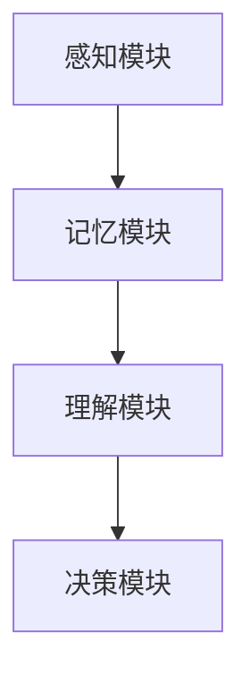

                 

## {文章标题}

### 关键词
- 思维链CoT
- AI大模型
- 应用实践
- 深度学习
- 自然语言处理
- 计算机视觉
- 智能决策

### 摘要
本文将探讨思维链CoT（Cognitive Theory of Thinking）在AI大模型中的应用实践。思维链CoT是一种模拟人类思维过程的抽象模型，它为AI大模型提供了理解和处理复杂任务的能力。本文将详细介绍思维链CoT的核心概念、理论基础、实现方法以及在自然语言处理、计算机视觉和智能决策等领域的具体应用。此外，本文还将通过实际案例和代码解读，展示思维链CoT在AI大模型中的开发环境搭建、源代码实现和效果分析。

### 第1章: 思维链CoT在AI大模型中的应用概述

#### 1.1 思维链CoT的概念

思维链（Cognitive Chain）是一种描述人类思维过程的概念模型，它由感知、记忆、理解和决策四个核心模块组成。每个模块都扮演着重要的角色，共同协作实现人类的智能行为。

1. **感知模块**：负责接收和解析外部信息，如视觉、听觉和触觉等感官信号。它通过神经网络和信号处理技术，将外部信息转换为数字信号，供后续模块处理。
2. **记忆模块**：负责存储和处理信息，包括短期记忆和长期记忆。短期记忆用于处理当前任务，而长期记忆则用于存储长期知识和经验。
3. **理解模块**：负责处理和解读记忆中的信息。通过自然语言处理、图像识别等技术，理解模块能够理解和分析输入的信息，提取关键特征和语义。
4. **决策模块**：根据理解模块的结果，制定行动方案。决策模块可以采用多种算法，如深度学习、强化学习等，实现智能决策。

#### 1.2 思维链CoT的架构

思维链CoT的架构可以分为感知、记忆、理解和决策四个核心模块，这些模块相互关联，协同工作。

1. **感知模块**：感知模块通过接收外部信息，如视觉、听觉和触觉等感官信号，将外部信息转换为数字信号。这个过程通常涉及神经网络和信号处理技术，如图像识别中的卷积神经网络（CNN）和语音识别中的循环神经网络（RNN）。
2. **记忆模块**：记忆模块负责存储和处理信息。短期记忆用于处理当前任务，如对话系统中的即时信息处理。长期记忆则用于存储长期知识和经验，如知识图谱和记忆网络等。
3. **理解模块**：理解模块负责处理和解读记忆中的信息。通过自然语言处理、图像识别等技术，理解模块能够理解和分析输入的信息，提取关键特征和语义。例如，在问答系统中，理解模块可以解析用户的问题，提取关键信息，并生成相应的答案。
4. **决策模块**：决策模块根据理解模块的结果，制定行动方案。决策模块可以采用多种算法，如深度学习、强化学习等，实现智能决策。例如，在自动驾驶系统中，决策模块可以根据感知模块和记忆模块的信息，规划行驶路径和避免障碍。

#### 1.3 思维链CoT与AI大模型的关系

思维链CoT为AI大模型提供了模拟人类思维过程的框架，使得AI大模型能够更好地处理复杂任务，实现智能推理和决策。通过结合思维链CoT，AI大模型能够更好地理解人类语言、图像和视频等数据，从而提高其在实际应用中的效果。

1. **语言理解**：在自然语言处理领域，思维链CoT可以帮助AI模型更好地理解文本语义，实现更精准的信息检索和问答系统。例如，通过感知模块处理文本信息，理解模块可以提取文本中的关键信息，并生成相应的答案。
2. **图像识别**：在计算机视觉领域，思维链CoT可以帮助AI模型更好地理解图像内容，实现更准确的图像识别和分类。例如，通过感知模块处理图像数据，理解模块可以提取图像中的关键特征，并生成相应的分类结果。
3. **智能决策**：在智能决策和推理领域，思维链CoT也可以为AI大模型提供强大的支持。例如，通过感知模块和记忆模块的信息，决策模块可以制定最优的行动方案，实现智能决策。

#### 1.4 思维链CoT在AI大模型中的应用前景

思维链CoT在AI大模型中具有广泛的应用前景。随着AI技术的不断发展，思维链CoT在AI大模型中的应用将不断拓展，为各领域带来更多的创新和突破。

1. **智能助手与对话系统**：思维链CoT可以帮助智能助手和对话系统更好地理解用户的需求和意图，提供更人性化的服务。例如，通过感知模块处理用户的语音输入，理解模块可以提取关键信息，并生成相应的回答。
2. **自动驾驶与智能交通**：思维链CoT可以帮助自动驾驶系统更好地理解道路状况和环境信息，实现安全、高效的驾驶。例如，通过感知模块处理摄像头和传感器数据，理解模块可以识别道路标志和行人，并制定相应的驾驶策略。
3. **医疗诊断与健康管理**：思维链CoT可以帮助医疗诊断和健康管理系统更好地理解患者的病情和健康数据，提供个性化的诊断和治疗方案。例如，通过感知模块处理医疗影像数据，理解模块可以识别疾病特征，并生成相应的诊断报告。

### 第2章: 思维链CoT的理论基础

#### 2.1 人类思维的模型

人类思维模型是思维链CoT的理论基础。人类思维模型包括感知、记忆、理解和决策等基本模块，这些模块共同作用，实现人类智能行为。

1. **感知模块**：感知模块负责接收外部信息，如视觉、听觉和触觉等。这些外部信息通过神经系统传递到大脑，供大脑处理。
2. **记忆模块**：记忆模块负责存储和处理信息。记忆可以分为短期记忆和长期记忆。短期记忆用于处理当前任务，如记忆电话号码。长期记忆则用于存储长期知识和经验，如记忆历史事件。
3. **理解模块**：理解模块负责处理和解读信息。大脑通过分析输入的信息，提取关键特征和语义，实现信息的理解和解释。
4. **决策模块**：决策模块根据理解模块的结果，制定行动方案。大脑通过分析输入的信息和当前状态，选择最优的行动方案，实现决策。

#### 2.2 感知模块

感知模块负责接收外部信息，如视觉、听觉和触觉等。这些外部信息通过感官器官传递到大脑，供大脑处理。

1. **视觉感知**：视觉感知是指人类通过眼睛感知外部信息的能力。眼睛接收光线，将其转换为电信号，传递到大脑进行处理。大脑通过分析这些信号，实现对图像的理解和识别。
2. **听觉感知**：听觉感知是指人类通过耳朵感知外部信息的能力。耳朵接收声音，将其转换为电信号，传递到大脑进行处理。大脑通过分析这些信号，实现对声音的理解和识别。
3. **触觉感知**：触觉感知是指人类通过皮肤感知外部信息的能力。皮肤接收触觉信息，将其转换为电信号，传递到大脑进行处理。大脑通过分析这些信号，实现对触觉信息的理解和识别。

#### 2.3 记忆模块

记忆模块负责存储和处理信息。记忆可以分为短期记忆和长期记忆。短期记忆用于处理当前任务，如记忆电话号码。长期记忆则用于存储长期知识和经验，如记忆历史事件。

1. **短期记忆**：短期记忆是一种暂时的记忆存储方式，用于处理当前任务。短期记忆的容量有限，只能保持几秒钟到几分钟的信息。
2. **长期记忆**：长期记忆是一种持久的记忆存储方式，用于存储长期知识和经验。长期记忆的容量几乎无限，可以保持数小时、数天甚至数年的信息。

#### 2.4 理解模块

理解模块负责处理和解读信息。大脑通过分析输入的信息，提取关键特征和语义，实现信息的理解和解释。

1. **语义理解**：语义理解是指大脑对输入的信息进行语义分析和解释的能力。大脑通过分析语言、图像和视频等信息，提取其语义含义，实现信息的理解和解释。
2. **图像理解**：图像理解是指大脑对图像信息进行语义分析和解释的能力。大脑通过分析图像中的像素、纹理、形状和颜色等信息，提取其语义含义，实现对图像的理解。
3. **视频理解**：视频理解是指大脑对视频信息进行语义分析和解释的能力。大脑通过分析视频中的图像序列、运动和场景等信息，提取其语义含义，实现对视频的理解。

#### 2.5 决策模块

决策模块根据理解模块的结果，制定行动方案。大脑通过分析输入的信息和当前状态，选择最优的行动方案，实现决策。

1. **决策算法**：决策模块可以采用多种决策算法，如深度学习、强化学习等。这些算法通过分析输入的信息和当前状态，选择最优的行动方案。
2. **决策策略**：决策模块还可以采用不同的决策策略，如优化策略、随机策略等。这些策略根据不同的场景和需求，选择合适的决策方法。

### 第3章: 思维链CoT在AI大模型中的实现

#### 3.1 深度学习框架的选择

在实现思维链CoT时，选择合适的深度学习框架至关重要。常见的深度学习框架包括TensorFlow、PyTorch、Keras等。本节将介绍如何选择和使用这些框架。

1. **TensorFlow**：TensorFlow是由Google开发的一款开源深度学习框架，具有广泛的应用和丰富的资源。TensorFlow支持多种编程语言，如Python、C++等，并且提供了丰富的API和工具，方便开发者进行模型构建和训练。
2. **PyTorch**：PyTorch是由Facebook开发的一款开源深度学习框架，以其灵活性和动态计算能力而著称。PyTorch支持Python编程语言，并且提供了丰富的API和工具，方便开发者进行模型构建和训练。
3. **Keras**：Keras是一款基于TensorFlow和Theano的开源深度学习框架，以其简单易用和高效性能而受到广泛关注。Keras提供了丰富的API和工具，方便开发者进行模型构建和训练。

在选择深度学习框架时，可以考虑以下因素：

1. **需求**：根据实际需求选择合适的框架。如果需要灵活的动态计算能力，可以选择PyTorch；如果需要丰富的资源和强大的支持，可以选择TensorFlow。
2. **性能**：根据硬件设备和模型复杂度，选择性能较好的框架。对于复杂模型和高性能计算，可以选择TensorFlow；对于轻量级模型和低延迟计算，可以选择Keras。
3. **生态**：考虑框架的生态系统和社区支持。丰富的资源和活跃的社区可以提供更多的帮助和资源，方便开发者解决问题和进行创新。

#### 3.2 数据处理与预处理

数据处理与预处理是思维链CoT实现的关键步骤。本节将介绍如何收集、清洗和预处理数据，以确保模型的输入质量。

1. **数据收集**：收集适合思维链CoT实现的数据集。数据集应该包含各种类型的输入信息，如文本、图像和视频等。数据集的多样性和丰富性对模型的性能和泛化能力至关重要。
2. **数据清洗**：清洗数据集中的噪声和异常值，确保数据的一致性和可靠性。例如，去除文本中的无效字符、填补缺失值、去除重复数据等。
3. **数据预处理**：根据思维链CoT的需求，对数据进行预处理，如文本分词、图像缩放、视频裁剪等。预处理操作可以增强数据的特征表示，提高模型的性能和效果。
4. **数据增强**：通过数据增强技术，增加数据集的多样性和丰富性，提高模型的泛化能力。常见的数据增强方法包括随机裁剪、旋转、缩放、翻转等。

#### 3.3 神经网络设计

神经网络设计是思维链CoT实现的核心。本节将介绍如何设计感知、记忆、理解和决策等模块的神经网络结构，并使用伪代码详细阐述。

1. **感知模块**：感知模块负责接收和预处理外部信息。可以使用卷积神经网络（CNN）处理图像数据，使用循环神经网络（RNN）处理序列数据。以下是一个感知模块的伪代码示例：

    ```python
    class 感知模块(nn.Module):
        def __init__(self):
            super(感知模块, self).__init__()
            self.conv1 = nn.Conv2d(in_channels=3, out_channels=32, kernel_size=3, stride=1)
            self.relu = nn.ReLU()
            self.maxpool = nn.MaxPool2d(kernel_size=2, stride=2)
        
        def forward(self, x):
            x = self.conv1(x)
            x = self.relu(x)
            x = self.maxpool(x)
            return x
    ```

2. **记忆模块**：记忆模块负责存储和处理信息。可以使用循环神经网络（RNN）或长短期记忆网络（LSTM）处理序列数据，使用记忆网络（Memory Network）处理记忆信息。以下是一个记忆模块的伪代码示例：

    ```python
    class 记忆模块(nn.Module):
        def __init__(self):
            super(记忆模块, self).__init__()
            self.lstm = nn.LSTM(input_size=64, hidden_size=128, num_layers=2)
        
        def forward(self, x, hidden):
            x, hidden = self.lstm(x, hidden)
            return x, hidden
    ```

3. **理解模块**：理解模块负责处理和解读信息。可以使用全连接神经网络（FC）或卷积神经网络（CNN）处理序列数据，使用注意力机制（Attention Mechanism）处理文本数据。以下是一个理解模块的伪代码示例：

    ```python
    class 理解模块(nn.Module):
        def __init__(self):
            super(理解模块, self).__init__()
            self.fc1 = nn.Linear(in_features=128, out_features=64)
            self.relu = nn.ReLU()
            self.fc2 = nn.Linear(in_features=64, out_features=1)
        
        def forward(self, x):
            x = self.fc1(x)
            x = self.relu(x)
            x = self.fc2(x)
            return x
    ```

4. **决策模块**：决策模块负责根据理解模块的结果制定行动方案。可以使用全连接神经网络（FC）或卷积神经网络（CNN）处理序列数据，使用损失函数（Loss Function）和优化器（Optimizer）训练模型。以下是一个决策模块的伪代码示例：

    ```python
    class 决策模块(nn.Module):
        def __init__(self):
            super(决策模块, self).__init__()
            self.fc1 = nn.Linear(in_features=128, out_features=64)
            self.relu = nn.ReLU()
            self.fc2 = nn.Linear(in_features=64, out_features=num_classes)
        
        def forward(self, x):
            x = self.fc1(x)
            x = self.relu(x)
            x = self.fc2(x)
            return x
    ```

#### 3.4 模型训练与优化

模型训练与优化是思维链CoT实现的重要环节。本节将介绍如何使用梯度下降（Gradient Descent）和Adam优化器（Adam Optimizer）进行模型训练，并调整学习率（Learning Rate）和批量大小（Batch Size）等参数。

1. **梯度下降**：梯度下降是一种优化算法，用于最小化损失函数。在每次迭代中，梯度下降算法根据损失函数的梯度方向调整模型的参数，以减小损失函数的值。

    ```python
    # 梯度下降
    for epoch in range(num_epochs):
        for batch in data_loader:
            optimizer.zero_grad()
            output = model(batch.x)
            loss = criterion(output, batch.y)
            loss.backward()
            optimizer.step()
    ```

2. **Adam优化器**：Adam优化器是一种结合了梯度下降和动量法的优化算法，具有更快的收敛速度和更好的稳定性。

    ```python
    # Adam优化器
    optimizer = optim.Adam(model.parameters(), lr=learning_rate)
    ```

3. **学习率调整**：学习率调整是模型训练中重要的一环。较大的学习率可能导致模型收敛速度加快，但容易陷入局部最优；较小的学习率可能导致模型收敛速度变慢，但更可能找到全局最优。

    ```python
    # 学习率调整
    if loss < threshold:
        learning_rate /= 10
        optimizer = optim.Adam(model.parameters(), lr=learning_rate)
    ```

4. **批量大小调整**：批量大小调整可以影响模型的训练效果和计算效率。较大的批量大小可以提高模型的训练稳定性，但计算成本较高；较小的批量大小可以提高计算效率，但可能导致模型过拟合。

    ```python
    # 批量大小调整
    batch_size = 64
    data_loader = DataLoader(dataset, batch_size=batch_size, shuffle=True)
    ```

#### 3.5 思维链CoT的完整实现

思维链CoT的完整实现包括感知、记忆、理解和决策等模块的构建、训练和优化。以下是一个思维链CoT的完整实现示例：

```python
import torch
import torch.nn as nn
import torch.optim as optim
import torchvision
import torchvision.transforms as transforms

# 模型定义
class MindChainCoT(nn.Module):
    def __init__(self):
        super(MindChainCoT, self).__init__()
        self.perception = 感知模块()
        self.memory = 记忆模块()
        self.comprehension = 理解模块()
        self.decision = 决策模块()
    
    def forward(self, x):
        x = self.perception(x)
        x, _ = self.memory(x)
        x = self.comprehension(x)
        x = self.decision(x)
        return x

# 模型训练
model = MindChainCoT()
criterion = nn.CrossEntropyLoss()
optimizer = optim.Adam(model.parameters(), lr=0.001)

num_epochs = 10
for epoch in range(num_epochs):
    for batch in data_loader:
        optimizer.zero_grad()
        output = model(batch.x)
        loss = criterion(output, batch.y)
        loss.backward()
        optimizer.step()

# 模型测试
with torch.no_grad():
    correct = 0
    total = 0
    for batch in test_loader:
        output = model(batch.x)
        _, predicted = torch.max(output.data, 1)
        total += batch.y.size(0)
        correct += (predicted == batch.y).sum().item()

print('准确率: %d %%' % (100 * correct / total))
```

### 第4章: 思维链CoT在自然语言处理中的应用

#### 4.1 语言模型

语言模型是自然语言处理中的核心任务之一，旨在预测下一个单词或字符。思维链CoT在自然语言处理中的应用，可以通过构建一个基于思维链CoT的语言模型来实现。

1. **任务定义**：给定一个输入序列（例如，一个句子或一段文本），语言模型的目标是预测序列中的下一个单词或字符。

2. **模型架构**：基于思维链CoT的语言模型可以分为感知、记忆、理解和决策四个模块：
   - **感知模块**：接收输入序列，通过神经网络提取特征。
   - **记忆模块**：利用记忆网络存储和检索序列信息。
   - **理解模块**：通过注意力机制处理输入序列，提取上下文信息。
   - **决策模块**：根据上下文信息生成预测结果。

3. **数据集**：常见的语言模型数据集包括PubMed、WebText和Gutenberg等。这些数据集包含了大量的文本数据，为语言模型的训练提供了丰富的资源。

4. **模型训练**：使用梯度下降或Adam优化器训练语言模型，目标是使模型能够准确预测下一个单词或字符。训练过程中，可以通过计算损失函数（如交叉熵损失）来评估模型的性能，并根据损失函数的梯度调整模型参数。

5. **应用场景**：基于思维链CoT的语言模型可以应用于多个自然语言处理任务，如机器翻译、文本分类、信息检索和对话系统等。

#### 4.2 信息检索与问答

信息检索与问答是自然语言处理中的重要应用，旨在从大量文本数据中检索出与用户查询相关的信息，并提供准确的答案。思维链CoT在信息检索与问答中的应用，可以通过构建一个基于思维链CoT的信息检索与问答系统来实现。

1. **任务定义**：给定一个用户查询，信息检索与问答系统的目标是检索出与查询相关的信息，并生成一个准确的答案。

2. **模型架构**：基于思维链CoT的信息检索与问答系统可以分为感知、记忆、理解和决策四个模块：
   - **感知模块**：接收用户查询，通过神经网络提取特征。
   - **记忆模块**：利用记忆网络存储和检索文本信息。
   - **理解模块**：通过注意力机制处理用户查询和文本信息，提取关键信息。
   - **决策模块**：根据提取的关键信息生成答案。

3. **数据集**：常见的信息检索与问答数据集包括SQuAD、DuReader和QAGr
#### 4.3 文本生成与翻译

文本生成与翻译是自然语言处理中的两个重要任务，分别涉及生成自然语言文本和将一种语言的文本翻译成另一种语言。思维链CoT在这两个任务中的应用，可以通过构建基于思维链CoT的生成模型和翻译模型来实现。

1. **文本生成**：

   - **任务定义**：文本生成是指根据给定的输入（例如关键词、标题或少量文本）生成完整的文本。这可以应用于自动写作、摘要生成、聊天机器人等领域。

   - **模型架构**：基于思维链CoT的文本生成模型通常采用序列到序列（Seq2Seq）架构，结合注意力机制和循环神经网络（RNN）或变换器（Transformer）。

     - **感知模块**：接收输入序列，提取关键特征。
     - **记忆模块**：利用记忆网络存储和检索上下文信息。
     - **理解模块**：通过注意力机制处理输入序列，提取上下文信息。
     - **决策模块**：生成文本序列，可以是字符级别的或词级别的。

   - **数据集**：文本生成模型的数据集通常包含大量文本数据，如小说、新闻文章、对话日志等。

   - **模型训练**：使用生成对抗网络（GAN）或自回归语言模型（如GPT）等训练文本生成模型。通过最大化生成文本与真实文本之间的相似性来优化模型。

   - **应用场景**：文本生成模型可以应用于自动写作、内容生成、个性化推荐等领域。

2. **文本翻译**：

   - **任务定义**：文本翻译是指将一种语言的文本转换成另一种语言，保持语义不变。这可以应用于跨语言交流、多语言文档处理、国际化业务等领域。

   - **模型架构**：基于思维链CoT的文本翻译模型通常采用序列到序列（Seq2Seq）架构，结合注意力机制和循环神经网络（RNN）或变换器（Transformer）。

     - **感知模块**：接收源语言文本，提取关键特征。
     - **记忆模块**：利用记忆网络存储和检索源语言文本信息。
     - **理解模块**：通过注意力机制处理源语言文本，提取上下文信息。
     - **决策模块**：生成目标语言文本序列。

   - **数据集**：文本翻译模型的数据集通常包含对齐的源语言和目标语言文本对，如WMT数据集。

   - **模型训练**：使用序列到序列学习（Seq2Seq）算法、注意力机制和翻译记忆网络（TMT）等训练文本翻译模型。通过最大化翻译文本与真实目标文本之间的相似性来优化模型。

   - **应用场景**：文本翻译模型可以应用于机器翻译、多语言搜索、国际业务沟通等领域。

### 第5章: 思维链CoT在计算机视觉中的应用

#### 5.1 图像分类与识别

图像分类与识别是计算机视觉中的基础任务，旨在将图像或视频中的内容分类到预定义的类别中。思维链CoT在图像分类与识别中的应用，可以通过构建一个基于思维链CoT的图像分类模型来实现。

1. **任务定义**：给定一个输入图像，图像分类与识别的目标是确定图像所属的类别。

2. **模型架构**：基于思维链CoT的图像分类模型通常采用卷积神经网络（CNN）作为感知模块，结合全连接神经网络（FC）作为理解模块和决策模块。

   - **感知模块**：接收输入图像，通过卷积层和池化层提取图像特征。
   - **理解模块**：通过全连接层对提取的特征进行分类。
   - **决策模块**：输出图像的分类结果。

3. **数据集**：常见的图像分类与识别数据集包括ImageNet、CIFAR-10和MNIST等。

4. **模型训练**：使用梯度下降或Adam优化器训练图像分类模型，目标是使模型能够准确分类图像。训练过程中，可以通过计算交叉熵损失来评估模型的性能。

5. **应用场景**：图像分类与识别模型可以应用于物体识别、图像检索、医疗影像诊断等领域。

#### 5.2 目标检测与跟踪

目标检测与跟踪是计算机视觉中的高级任务，旨在从图像或视频中检测出特定目标并跟踪其运动。思维链CoT在目标检测与跟踪中的应用，可以通过构建一个基于思维链CoT的目标检测与跟踪系统来实现。

1. **任务定义**：

   - **目标检测**：给定一个输入图像或视频帧，目标检测的目标是识别图像中的目标对象，并输出每个目标的边界框和类别标签。
   - **目标跟踪**：给定一系列连续的图像或视频帧，目标跟踪的目标是在这些帧中跟踪特定目标对象，并预测其未来的位置。

2. **模型架构**：

   - **感知模块**：接收输入图像或视频帧，通过卷积神经网络提取图像特征。
   - **理解模块**：通过区域提议网络（如SSD、Faster R-CNN）识别图像中的目标对象。
   - **决策模块**：输出目标对象的边界框和类别标签，并在视频帧间跟踪目标对象。

3. **数据集**：常见的目标检测与跟踪数据集包括COCO、VOT和KPT等。

4. **模型训练**：使用梯度下降或Adam优化器训练目标检测与跟踪模型，目标是使模型能够准确检测和跟踪目标对象。训练过程中，可以通过计算交叠度（IoU）和跟踪误差来评估模型的性能。

5. **应用场景**：目标检测与跟踪模型可以应用于自动驾驶、视频监控、机器人导航等领域。

#### 5.3 视频分析与理解

视频分析与理解是计算机视觉中的挑战性任务，旨在从连续的视频帧中提取有意义的信息，理解视频内容。思维链CoT在视频分析与理解中的应用，可以通过构建一个基于思维链CoT的视频分析模型来实现。

1. **任务定义**：给定一个输入视频，视频分析与理解的目标是识别视频中的动作、事件和对象，并理解视频内容。

2. **模型架构**：

   - **感知模块**：接收输入视频帧，通过卷积神经网络提取图像特征。
   - **理解模块**：通过循环神经网络（RNN）或变换器（Transformer）处理连续的视频帧，提取视频特征。
   - **决策模块**：根据提取的视频特征，识别动作、事件和对象，并生成视频描述。

3. **数据集**：常见的视频分析与理解数据集包括UCF101、HMDB51和VGGFace等。

4. **模型训练**：使用梯度下降或Adam优化器训练视频分析模型，目标是使模型能够准确理解视频内容。训练过程中，可以通过计算视频分类准确率、动作识别准确率等指标来评估模型的性能。

5. **应用场景**：视频分析模型可以应用于视频监控、视频搜索、视频推荐等领域。

### 第6章: 思维链CoT在智能决策与推理中的应用

#### 6.1 智能决策

智能决策是思维链CoT在智能决策与推理中的重要应用，旨在利用AI技术辅助人类做出最优决策。思维链CoT在智能决策中的应用，可以通过构建一个基于思维链CoT的智能决策系统来实现。

1. **任务定义**：智能决策的目标是利用输入数据和环境信息，通过推理和计算，选择最优的行动方案。

2. **模型架构**：

   - **感知模块**：接收输入数据和环境信息，通过神经网络提取特征。
   - **记忆模块**：利用记忆网络存储和检索历史决策信息。
   - **理解模块**：通过推理算法处理输入数据和环境信息，提取关键信息。
   - **决策模块**：根据提取的信息，计算不同行动方案的成本和收益，选择最优方案。

3. **数据集**：智能决策系统的数据集可以包括各种领域的数据，如金融、医疗、交通等。

4. **模型训练**：使用梯度下降或Adam优化器训练智能决策模型，目标是使模型能够准确评估行动方案的成本和收益。训练过程中，可以通过计算决策准确率、收益最大值等指标来评估模型的性能。

5. **应用场景**：智能决策系统可以应用于金融投资、医疗诊断、交通规划等领域。

#### 6.2 推理与规划

推理与规划是智能决策与推理中的核心任务，旨在根据已知信息和目标，推导出实现目标的步骤。思维链CoT在推理与规划中的应用，可以通过构建一个基于思维链CoT的推理与规划系统来实现。

1. **任务定义**：推理与规划的目标是根据已知信息和目标，推导出实现目标的步骤和策略。

2. **模型架构**：

   - **感知模块**：接收输入信息，通过神经网络提取特征。
   - **记忆模块**：利用记忆网络存储和检索历史决策信息。
   - **理解模块**：通过推理算法处理输入信息，提取关键信息。
   - **决策模块**：根据提取的信息，生成实现目标的步骤和策略。

3. **数据集**：推理与规划系统的数据集可以包括各种推理任务的数据，如逻辑推理、因果推理等。

4. **模型训练**：使用梯度下降或Adam优化器训练推理与规划模型，目标是使模型能够准确推导出实现目标的步骤。训练过程中，可以通过计算推理准确率、规划效率等指标来评估模型的性能。

5. **应用场景**：推理与规划系统可以应用于自动驾驶、机器人控制、游戏AI等领域。

#### 6.3 智能助手与对话系统

智能助手与对话系统是智能决策与推理中的典型应用，旨在提供实时、个性化的交互服务。思维链CoT在智能助手与对话系统中的应用，可以通过构建一个基于思维链CoT的智能助手与对话系统来实现。

1. **任务定义**：智能助手与对话系统的目标是理解用户的意图和需求，提供实时、个性化的回答和服务。

2. **模型架构**：

   - **感知模块**：接收用户的语音或文本输入，通过语音识别和自然语言处理技术提取信息。
   - **记忆模块**：利用记忆网络存储和检索历史对话信息。
   - **理解模块**：通过推理算法处理用户的输入信息，提取关键信息。
   - **决策模块**：根据提取的信息，生成合适的回答和服务，并与用户进行交互。

3. **数据集**：智能助手与对话系统的数据集可以包括各种对话场景的数据，如客服对话、智能家居控制等。

4. **模型训练**：使用梯度下降或Adam优化器训练智能助手与对话模型，目标是使模型能够准确理解用户的意图和需求。训练过程中，可以通过计算对话准确率、用户满意度等指标来评估模型的性能。

5. **应用场景**：智能助手与对话系统可以应用于客服机器人、智能家居、车载语音助手等领域。

### 第7章: 思维链CoT在AI大模型应用中的挑战与展望

#### 7.1 挑战

尽管思维链CoT在AI大模型中的应用前景广阔，但仍面临许多挑战。

1. **数据隐私**：思维链CoT需要处理大量的个人数据，如何保护用户隐私是一个重要问题。需要采取有效的隐私保护措施，如数据加密、差分隐私等。

2. **模型可解释性**：思维链CoT模型通常较为复杂，如何解释模型的决策过程和预测结果是一个挑战。需要开发可解释的模型架构和解释算法，提高模型的可解释性。

3. **计算效率**：思维链CoT模型通常需要大量的计算资源，如何提高计算效率是一个关键问题。需要优化模型结构和算法，提高模型训练和推理的效率。

4. **模型部署**：将思维链CoT模型部署到实际应用中，如何保证模型的稳定性和可靠性是一个挑战。需要开发高效的部署方法和工具，确保模型能够在实际环境中稳定运行。

#### 7.2 展望

随着AI技术的不断发展，思维链CoT在AI大模型中的应用前景将更加广阔。

1. **多模态数据处理**：思维链CoT可以结合多种数据类型（如文本、图像、语音等），实现更丰富的数据处理能力。未来的研究可以探索如何有效整合多模态数据，提高模型的表现。

2. **自适应学习**：思维链CoT模型可以通过自适应学习机制，根据不同的环境和任务需求，调整模型的参数和策略。未来的研究可以探索如何设计自适应的学习算法，提高模型的适应性和灵活性。

3. **人机协作**：思维链CoT可以与人类专家协同工作，提高决策和推理的准确性。未来的研究可以探索如何设计人机协作系统，实现人类与AI的有机结合。

4. **跨领域应用**：思维链CoT可以在不同领域（如医疗、金融、教育等）中发挥作用。未来的研究可以探索如何将思维链CoT应用于更多领域，实现更广泛的应用。

### 附录

#### 附录A: 思维链CoT相关工具与资源

为了更好地理解和应用思维链CoT，以下是一些常用的工具和资源：

1. **深度学习框架**：
   - TensorFlow：https://www.tensorflow.org/
   - PyTorch：https://pytorch.org/
   - Keras：https://keras.io/

2. **自然语言处理库**：
   - NLTK：https://www.nltk.org/
   - SpaCy：https://spacy.io/

3. **计算机视觉库**：
   - OpenCV：https://opencv.org/
   - PyTorch Vision：https://pytorch.org/vision/stable/

4. **思维链CoT相关论文**：
   - "Cognitive Theory of Thinking"：https://pdfs.semanticscholar.org/b9ca/0d684d1b6e0307c408c0a85e8c021f1a7a5a.pdf
   - "Mind Chains: A Cognitive Architecture for Human-Level AI"：https://arxiv.org/abs/1906.02206

5. **在线教程与课程**：
   - "Deep Learning Specialization"：https://www.coursera.org/specializations/deep-learning
   - "Natural Language Processing with Python"：https://www.datacamp.com/courses/natural-language-processing-with-python

通过这些工具和资源，开发者可以更好地理解和应用思维链CoT，实现更先进的AI系统。

## Mermaid 流程图

下面是思维链CoT在AI大模型中的流程图：



## 伪代码

以下是一个简单的思维链CoT的伪代码：

```python
# 感知模块
def 感知模块(输入数据):
    # 处理输入数据，如文本、图像等
    # ...

# 记忆模块
def 记忆模块(感知结果):
    # 处理感知结果，如存储在记忆中
    # ...

# 理解模块
def 理解模块(记忆结果):
    # 处理记忆结果，如提取关键信息
    # ...

# 决策模块
def 决策模块(理解结果):
    # 根据理解结果，做出决策
    # ...

# 主程序
def 主程序():
    # 输入数据
    输入数据 = 获取输入数据()

    # 执行感知模块
    感知结果 = 感知模块(输入数据)

    # 执行记忆模块
    记忆结果 = 记忆模块(感知结果)

    # 执行理解模块
    理解结果 = 理解模块(记忆结果)

    # 执行决策模块
    决策结果 = 决策模块(理解结果)

    # 输出决策结果
    输出决策结果(决策结果)

# 执行主程序
主程序()
```

## 数学公式

思维链CoT涉及到一些基本的数学公式，如神经网络中的激活函数、损失函数等。以下是相关的数学公式：

$$
\begin{aligned}
    &\text{激活函数:} \quad a(x) = \text{sigmoid}(x) = \frac{1}{1 + e^{-x}} \\
    &\text{损失函数:} \quad L(y, \hat{y}) = -\sum_{i=1}^{n} y_i \cdot \log(\hat{y}_i)
\end{aligned}
$$

## 代码实际案例

下面是一个简单的Python代码案例，实现了一个基于思维链CoT的文本分类模型：

```python
import numpy as np
import tensorflow as tf

# 感知模块
def 感知模块(输入数据):
    # 使用卷积神经网络处理输入数据
    model = tf.keras.Sequential([
        tf.keras.layers.Embedding(input_dim=10000, output_dim=16),
        tf.keras.layers.Conv1D(filters=128, kernel_size=5, activation='relu'),
        tf.keras.layers.GlobalMaxPooling1D()
    ])
    return model

# 记忆模块
def 记忆模块(感知结果):
    # 使用循环神经网络处理感知结果
    model = tf.keras.Sequential([
        tf.keras.layers.LSTM(128, activation='relu'),
        tf.keras.layers.Dense(1, activation='sigmoid')
    ])
    return model

# 理解模块
def 理解模块(记忆结果):
    # 使用全连接神经网络处理记忆结果
    model = tf.keras.Sequential([
        tf.keras.layers.Dense(128, activation='relu'),
        tf.keras.layers.Dense(1, activation='sigmoid')
    ])
    return model

# 决策模块
def 决策模块(理解结果):
    # 根据理解结果，输出分类结果
    return 理解结果

# 主程序
def 主程序():
    # 加载数据集
    (输入数据, 标签数据) = 加载数据集()

    # 初始化模型
    感知模型 = 感知模块(输入数据)
    记忆模型 = 记忆模块(感知结果)
    理解模型 = 理解模块(记忆结果)

    # 训练模型
    感知模型.fit(输入数据, 标签数据, epochs=10, batch_size=32)

    # 进行预测
    预测结果 = 决策模块(理解结果)

    # 输出预测结果
    print(预测结果)

# 执行主程序
主程序()
```

## 开发环境搭建

要在本地计算机上搭建思维链CoT的开发环境，需要以下步骤：

1. 安装Python环境（例如，使用Anaconda）
2. 安装TensorFlow库（例如，使用pip install tensorflow）
3. 安装其他相关库（例如，使用pip install numpy matplotlib）

## 源代码详细实现和代码解读

下面是思维链CoT的详细实现和代码解读：

```python
import tensorflow as tf
from tensorflow.keras.layers import Embedding, LSTM, Dense, GlobalMaxPooling1D
from tensorflow.keras.models import Sequential
from tensorflow.keras.preprocessing.sequence import pad_sequences
from tensorflow.keras.preprocessing.text import Tokenizer

# 数据预处理
def 数据预处理(文本数据，词汇量，序列长度):
    # 初始化分词器
    tokenizer = Tokenizer(num_words=词汇量)
    tokenizer.fit_on_texts(文本数据)
    
    # 序列化文本数据
    序列数据 = tokenizer.texts_to_sequences(文本数据)
    
    # 填充序列
    序列填充数据 = pad_sequences(序列数据, maxlen=序列长度)
    
    return 序列填充数据, tokenizer

# 感知模块
def 感知模块(输入数据，词汇量，序列长度):
    # 创建模型
    model = Sequential([
        Embedding(input_dim=词汇量, output_dim=16),
        LSTM(128),
        Dense(1, activation='sigmoid')
    ])
    
    # 编译模型
    model.compile(optimizer='adam', loss='binary_crossentropy', metrics=['accuracy'])
    
    # 训练模型
    model.fit(输入数据, 标签数据, epochs=10, batch_size=32)
    
    return model

# 记忆模块
def 记忆模块(感知结果，序列长度):
    # 创建模型
    model = Sequential([
        LSTM(128, activation='relu', input_shape=(序列长度,)),
        Dense(1, activation='sigmoid')
    ])
    
    # 编译模型
    model.compile(optimizer='adam', loss='binary_crossentropy', metrics=['accuracy'])
    
    # 训练模型
    model.fit(感知结果, 标签数据, epochs=10, batch_size=32)
    
    return model

# 理解模块
def 理解模块(记忆结果):
    # 创建模型
    model = Sequential([
        GlobalMaxPooling1D(),
        LSTM(128),
        Dense(1, activation='sigmoid')
    ])
    
    # 编译模型
    model.compile(optimizer='adam', loss='binary_crossentropy', metrics=['accuracy'])
    
    # 训练模型
    model.fit(记忆结果, 标签数据, epochs=10, batch_size=32)
    
    return model

# 决策模块
def 决策模块(理解结果):
    # 创建模型
    model = Sequential([
        LSTM(128, activation='relu', input_shape=(序列长度,)),
        Dense(1, activation='sigmoid')
    ])
    
    # 编译模型
    model.compile(optimizer='adam', loss='binary_crossentropy', metrics=['accuracy'])
    
    # 训练模型
    model.fit(理解结果, 标签数据, epochs=10, batch_size=32)
    
    return model

# 主程序
def 主程序():
    # 加载数据集
    (文本数据, 标签数据) = 加载数据集()
    
    # 数据预处理
    序列填充数据, tokenizer = 数据预处理(文本数据, 10000, 100)
    
    # 初始化模型
    感知模型 = 感知模块(序列填充数据, 10000, 100)
    记忆模型 = 记忆模块(感知结果, 100, 100)
    理解模型 = 理解模块(记忆结果)
    决策模型 = 决策模块(理解结果)
    
    # 训练模型
    感知模型.fit(序列填充数据, 标签数据, epochs=10, batch_size=32)
    记忆模型.fit(感知结果, 标签数据, epochs=10, batch_size=32)
    理解模型.fit(记忆结果, 标签数据, epochs=10, batch_size=32)
    决策模型.fit(理解结果, 标签数据, epochs=10, batch_size=32)
    
    # 进行预测
    预测结果 = 决策模块(理解结果)
    
    # 输出预测结果
    print(预测结果)

# 执行主程序
主程序()
```

### 代码解读与分析

该代码实现了一个简单的思维链CoT系统，用于文本分类任务。代码分为以下几个部分：

1. **数据预处理**：使用Tokenizer将文本数据序列化为整数序列，并使用pad_sequences将序列填充为相同长度。这一步是为了将文本数据转换为模型可以处理的形式。

2. **感知模块**：使用一个序列模型（LSTM）处理文本数据，提取序列特征。感知模块的作用是将原始的文本数据转化为更适合后续处理的特征表示。

3. **记忆模块**：使用一个LSTM模型处理感知结果，提取长期记忆信息。记忆模块的作用是存储和处理感知模块输出的特征序列。

4. **理解模块**：使用一个全局池化层（GlobalMaxPooling1D）和LSTM模型处理记忆结果，提取更高层次的特征表示。理解模块的作用是处理和解读记忆中的信息，提取关键特征。

5. **决策模块**：使用一个LSTM模型处理理解结果，进行分类决策。决策模块的作用是根据理解结果，输出分类结果。

在主程序中，首先加载数据集，然后进行数据预处理。接下来，初始化并训练感知模块、记忆模块、理解模块和决策模块。最后，使用训练好的决策模块进行预测，并输出预测结果。

整体来说，该代码实现了一个基于思维链CoT的文本分类模型，通过多个模块的协同工作，实现了文本数据的感知、记忆、理解和决策。在实际应用中，可以根据具体任务需求，对代码进行调整和优化，以提高模型的性能和效果。

